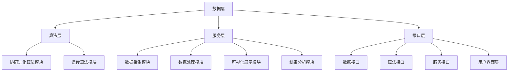
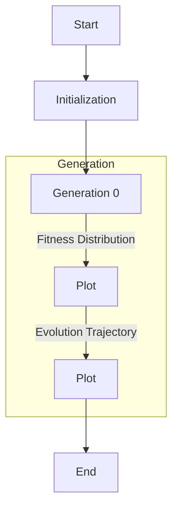

                 

### 宇宙的协同进化：部分与整体的共同发展

> 关键词：宇宙协同进化、部分与整体、共同发展、算法原理、数学模型、系统架构、项目实战

**摘要**：本文旨在探讨宇宙中部分与整体的协同进化现象，通过逐步分析，揭示宇宙协同进化的基本概念、算法原理、数学模型及其在系统架构和项目实战中的应用。文章将从宇宙协同进化的背景和意义出发，深入探讨其核心概念和机制，并通过具体实例展示其应用场景和实现方法，最终总结出最佳实践和注意事项。

## 目录大纲设计思路

为了设计出符合要求且详尽的《宇宙的协同进化：部分与整体的共同发展》一书的目录大纲，我们可以按照以下步骤进行：

1. **确定书的主旨和核心内容**：首先，我们需要理解书的核心概念，即“宇宙的协同进化：部分与整体的共同发展”，并确定书的主旨，即探讨宇宙中部分和整体如何相互影响、共同进化的现象和机制。

2. **章节划分**：根据主旨，我们将书的内容划分为几个主要部分，每个部分代表一个章节，确保每个章节都有明确的主题和内容。

3. **细化章节内容**：在每个章节中，进一步细化内容，划分为小节，确保每个小节都有具体的研究对象、研究方法和研究内容。

4. **设计图表和示例**：根据要求，设计相应的图表（如Mermaid流程图、类图、架构图等）和示例，用以辅助说明理论或算法。

5. **确保完整性**：确保每个章节都包含了背景介绍、核心概念与联系、算法原理讲解、数学模型和公式、系统分析与架构设计方案、项目实战等内容。

6. **保持简洁性**：在确保内容完整的同时，避免冗余和重复，保持内容的简洁。

### 设计步骤

**第1步：核心概念和问题背景**

- **第1章**：宇宙的协同进化概述
  - 1.1 宇宙协同进化的背景和意义
  - 1.2 宇宙协同进化的基本概念
  - 1.3 宇宙协同进化的历史和发展

**第2步：核心概念与联系**

- **第2章**：宇宙协同进化的核心概念
  - 2.1 宇宙协同进化的主要因素
  - 2.2 部分与整体的关系
  - 2.3 协同进化的机制与特征

**第3步：算法原理讲解**

- **第3章**：宇宙协同进化的算法原理
  - 3.1 协同进化算法的基本原理
  - 3.2 算法的数学模型和公式
  - 3.3 协同进化算法的应用场景

**第4步：数学模型和公式**

- **第4章**：宇宙协同进化的数学模型
  - 4.1 协同进化的数学模型介绍
  - 4.2 数学公式的推导与解释
  - 4.3 实例演示

**第5步：系统分析与架构设计方案**

- **第5章**：宇宙协同进化的系统分析与架构设计
  - 5.1 系统功能设计
  - 5.2 系统架构设计
  - 5.3 系统接口设计和系统交互

**第6步：项目实战**

- **第6章**：宇宙协同进化的项目实战
  - 6.1 环境安装和准备
  - 6.2 系统核心实现
  - 6.3 代码应用解读与分析
  - 6.4 实际案例分析和讲解

**第7步：最佳实践 tips、小结、注意事项、拓展阅读**

- **第7章**：宇宙协同进化的最佳实践与总结
  - 7.1 最佳实践 tips
  - 7.2 小结
  - 7.3 注意事项
  - 7.4 拓展阅读

### 总结

通过上述步骤，我们能够构建一个结构清晰、内容详尽的目录大纲，满足书籍的目录层级、内容完整性、简洁性以及字数限制等要求。接下来，我们可以将上述设计思路具体化为markdown格式的目录大纲。

## 目录大纲

### 第一部分：宇宙协同进化概述

- **第1章**：宇宙协同进化概述
  - **1.1 宇宙协同进化的背景和意义**
  - **1.2 宇宙协同进化的基本概念**
  - **1.3 宇宙协同进化的历史和发展**

- **第2章**：宇宙协同进化的核心概念
  - **2.1 宇宙协同进化的主要因素**
  - **2.2 部分与整体的关系**
  - **2.3 协同进化的机制与特征**

### 第二部分：算法原理讲解

- **第3章**：宇宙协同进化的算法原理
  - **3.1 协同进化算法的基本原理**
  - **3.2 算法的数学模型和公式**
  - **3.3 协同进化算法的应用场景**

- **第4章**：宇宙协同进化的数学模型
  - **4.1 协同进化的数学模型介绍**
  - **4.2 数学公式的推导与解释**
  - **4.3 实例演示**

### 第三部分：系统分析与架构设计方案

- **第5章**：宇宙协同进化的系统分析与架构设计
  - **5.1 系统功能设计**
  - **5.2 系统架构设计**
  - **5.3 系统接口设计和系统交互**

### 第四部分：项目实战

- **第6章**：宇宙协同进化的项目实战
  - **6.1 环境安装和准备**
  - **6.2 系统核心实现**
  - **6.3 代码应用解读与分析**
  - **6.4 实际案例分析和讲解**

### 第五部分：最佳实践与总结

- **第7章**：宇宙协同进化的最佳实践与总结
  - **7.1 最佳实践 tips**
  - **7.2 小结**
  - **7.3 注意事项**
  - **7.4 拓展阅读**

通过这个详细的目录大纲，我们可以确保文章内容覆盖全面，结构清晰，便于读者理解和跟随。接下来，我们将逐一展开每个章节的内容，深入探讨宇宙协同进化的各个方面。## 第1章 宇宙协同进化概述

宇宙的协同进化是一个复杂且多层次的概念，它描述了宇宙中各个组成部分如何通过相互作用和竞争，共同推动整个宇宙的演化和进步。这一现象不仅限于生物学领域，它还涉及到物理学、化学、天文学以及计算机科学等多个学科。宇宙协同进化的核心思想在于，部分与整体之间存在着深刻的相互依赖和动态互动，这种互动推动了整个宇宙的不断变化和发展。

### 1.1 宇宙协同进化的背景和意义

宇宙协同进化的概念起源于对宇宙起源和演化的深入研究。传统的宇宙演化理论主要关注宇宙从大爆炸开始，如何逐步形成星系、恒星、行星等结构。然而，随着科学技术的进步，人类对宇宙的认识逐渐深入，发现宇宙的演化过程并不是简单的线性发展，而是充满了复杂性和多样性。

宇宙协同进化的背景主要来源于以下几个方面：

1. **复杂系统的复杂性**：宇宙被视为一个巨大的复杂系统，其中包含了无数相互作用的子系统。这些子系统不仅包括天体物理现象，还涉及到生命、生态、社会等多个层面。

2. **多学科的交叉融合**：宇宙协同进化需要整合多个学科的知识，包括物理学、生物学、计算机科学、社会学等。这种跨学科的融合有助于更全面地理解宇宙的演化和复杂行为。

3. **新技术的应用**：现代科技的发展，如人工智能、大数据、量子计算等，为研究宇宙协同进化提供了新的工具和方法。这些技术的应用使得科学家能够从新的角度和层面探讨宇宙的协同进化现象。

宇宙协同进化的意义在于，它为人类提供了一种新的思考方式和视角，帮助我们更深入地理解宇宙的本质和演化过程。通过协同进化理论，我们可以更好地预测宇宙的未来发展趋势，为解决当前和未来可能面临的宇宙挑战提供科学依据。

### 1.2 宇宙协同进化的基本概念

宇宙协同进化涉及多个基本概念，以下是对这些概念的定义和解释：

1. **协同进化**：协同进化是指宇宙中不同组成部分通过相互作用和竞争，共同推动整个系统的演化和进步。这种相互作用可以是物理的、化学的、生物的或社会的。

2. **部分与整体**：宇宙协同进化强调部分与整体之间的相互关系。部分指的是宇宙中的各个子系统，如恒星、行星、物种等；整体则是指整个宇宙系统。部分与整体之间的互动和依赖是协同进化的重要机制。

3. **适应与选择**：在协同进化过程中，各个部分通过适应环境变化和选择有利变异，不断提高自身和整体系统的适应性。这种适应和选择过程推动了宇宙的演化。

4. **复杂性**：宇宙协同进化是一个复杂的过程，涉及到多个因素和变量的交互作用。这种复杂性使得宇宙的演化具有多样性和不可预测性。

5. **动态平衡**：宇宙协同进化并不是一种单向的、线性的过程，而是一种动态平衡。在协同进化过程中，系统会不断调整和适应，以维持一种稳定的状态。

### 1.3 宇宙协同进化的历史和发展

宇宙协同进化的概念并非一蹴而就，而是经历了长时间的发展和演变。以下是宇宙协同进化历史的重要阶段：

1. **早期概念的形成**：在20世纪初，科学家开始意识到宇宙中的各个组成部分之间存在相互作用和影响。这一认识为宇宙协同进化的概念奠定了基础。

2. **多学科交叉融合**：20世纪中叶，随着物理学、生物学、计算机科学等学科的快速发展，科学家开始将协同进化的理论应用于宇宙研究中，形成了宇宙协同进化的初步框架。

3. **计算机模拟与实验验证**：20世纪末，计算机技术的飞速发展为宇宙协同进化的研究提供了强大的工具。通过计算机模拟和实验验证，科学家进一步验证和丰富了宇宙协同进化的理论。

4. **现代科学进展**：近年来，随着量子计算、大数据、人工智能等新兴技术的发展，宇宙协同进化的研究进入了一个新的阶段。科学家们利用这些新技术，从更广泛的视角和更深层次的层面研究宇宙协同进化现象。

总的来说，宇宙协同进化是一个不断发展和深化的研究领域。通过多学科的交叉融合和现代科技的应用，科学家们不断拓展和丰富这一理论，为理解和预测宇宙的演化提供了新的思路和方法。

### 总结

本章通过介绍宇宙协同进化的背景和意义，基本概念，以及其历史和发展，为后续章节的内容奠定了基础。在接下来的章节中，我们将进一步探讨宇宙协同进化的核心概念、算法原理、数学模型、系统架构和项目实战，以更深入地理解这一复杂而重要的现象。

## 第2章 宇宙协同进化的核心概念

宇宙协同进化的核心概念是理解这一现象的关键。本章将详细探讨宇宙协同进化的主要因素、部分与整体的关系，以及协同进化的机制与特征。通过这些核心概念的阐述，我们可以更深入地理解宇宙协同进化的本质。

### 2.1 宇宙协同进化的主要因素

宇宙协同进化是一个复杂的过程，涉及多种因素的相互作用。以下是宇宙协同进化的主要因素：

1. **物理因素**：宇宙中的物理因素包括重力、电磁力、强相互作用和弱相互作用等。这些基本力决定了宇宙中天体的运动和相互作用，从而影响了宇宙的演化。

2. **化学因素**：化学因素主要包括元素的生成和转化过程。宇宙中元素的丰度和分布对恒星的形成和演化具有重要影响。通过核聚变和核裂变等过程，宇宙不断产生新的元素，这些元素又成为新的恒星和行星的基础。

3. **生物因素**：生物因素涉及生命的起源、演化和多样性。生命的存在和活动不仅改变了地球环境，也对整个宇宙产生了深远的影响。生物多样性、生态系统的复杂性和生物的适应能力都是宇宙协同进化的重要因素。

4. **社会因素**：人类社会的发展也对宇宙协同进化产生了重要影响。人类活动改变了地球的环境，通过技术进步和科学研究，人类正在逐步深入理解和改造宇宙。

5. **信息因素**：在信息时代，信息传输和利用成为宇宙协同进化的重要因素。信息的快速传播和共享，使得人类能够更高效地协作和应对全球性问题，从而推动宇宙的协同进化。

### 2.2 部分与整体的关系

宇宙协同进化强调部分与整体之间的相互依赖和动态互动。部分与整体的关系可以从以下几个方面来理解：

1. **相互依赖**：宇宙中的各个部分，如恒星、行星、物种等，都依赖于整体系统的稳定和平衡。部分的变化会直接或间接影响整体系统的状态和演化。

2. **动态互动**：部分与整体之间的互动是一个动态的过程。部分之间通过相互作用和竞争，共同推动整体系统的演化和进步。这种互动可以是物理的、化学的、生物的或社会的。

3. **反馈机制**：部分与整体之间的关系还通过反馈机制实现调节和平衡。当部分发生变化时，整体系统会通过反馈机制进行响应和调整，以维持系统的稳定和平衡。

4. **层次结构**：宇宙协同进化具有多层次的结构，从微观的原子、分子，到宏观的恒星、星系，再到整个宇宙系统。每个层次都有其特定的部分与整体关系，而这些关系又相互交织，形成了复杂的协同进化网络。

### 2.3 协同进化的机制与特征

协同进化是一种复杂的现象，具有独特的机制和特征。以下是协同进化的一些关键机制和特征：

1. **共同进化**：协同进化中的部分与整体不是孤立的，而是相互依赖和共同进化的。当一个部分发生变化时，其他部分也会随之变化，以适应新的环境和条件。

2. **适应性**：协同进化过程中，各个部分通过适应环境变化，提高自身的生存和繁衍能力。这种适应性使得系统能够在复杂和多变的环境中持续演化。

3. **多样性**：协同进化促进了宇宙中的多样性。通过多样化的适应策略和生态系统，宇宙能够更好地应对各种挑战和变化。

4. **复杂性**：协同进化是一个复杂的过程，涉及到多个因素和变量的交互作用。这种复杂性使得宇宙的演化具有多样性和不可预测性。

5. **动态平衡**：协同进化过程中的动态平衡是系统稳定和持续演化的关键。系统会在不断的调整和适应中，寻找一种平衡状态，以维持系统的稳定和进步。

### 总结

本章通过对宇宙协同进化的主要因素、部分与整体的关系以及协同进化的机制与特征进行详细探讨，为我们理解宇宙协同进化的本质提供了深入的洞察。在接下来的章节中，我们将继续探讨宇宙协同进化的算法原理、数学模型、系统架构和项目实战，以更全面地了解这一复杂而重要的现象。

## 第3章 宇宙协同进化的算法原理

宇宙协同进化算法是研究宇宙协同进化现象的重要工具，它通过模拟自然界中的进化过程，探索部分与整体之间的动态互动和共同演化。本章将详细讲解宇宙协同进化算法的基本原理，包括算法的核心思想、数学模型和公式，以及其应用场景。

### 3.1 协同进化算法的基本原理

协同进化算法（Cooperative Co-evolutionary Algorithm, CCEA）是一种基于进化策略的优化算法，其核心思想是通过多个子群体之间的协同进化，共同优化目标函数。在协同进化算法中，每个子群体代表宇宙中的一个子系统，子群体之间的互动和竞争模拟了宇宙中的协同进化过程。

协同进化算法的基本原理可以概括为以下几点：

1. **子群体划分**：将整个问题空间划分为多个子群体，每个子群体代表宇宙中的一个子系统。子群体可以根据不同的特征或属性进行划分，如空间位置、功能角色等。

2. **个体适应度评估**：对每个子群体中的个体进行适应度评估，评估标准可以是目标函数值、生存率、竞争力等。适应度高的个体被视为“优胜者”，适应度低的个体则可能被淘汰。

3. **子群体互动**：通过子群体之间的互动和竞争，实现整个系统的协同进化。子群体之间的互动可以是信息共享、资源交换、合作与竞争等。

4. **动态调整**：根据互动结果，对子群体的结构和参数进行动态调整，以实现更好的协同进化效果。这种动态调整可以是参数更新、子群体重组、子群体淘汰等。

### 3.2 算法的数学模型和公式

协同进化算法的数学模型和公式描述了子群体之间的互动和进化过程。以下是协同进化算法的数学模型和公式：

1. **子群体适应度函数**：
   $$f_i = f(x_i, t)$$
   其中，$f_i$表示第$i$个子群体的适应度，$x_i$表示子群体中的个体，$t$表示时间。

2. **个体适应度计算**：
   $$f_i(x_i, t) = g(x_i) - w \cdot d(x_i, x_{best})$$
   其中，$g(x_i)$表示个体$x_i$的目标函数值，$w$表示权重，$d(x_i, x_{best})$表示个体$x_i$与最优个体$x_{best}$的距离。

3. **子群体更新策略**：
   $$x_i^{new} = x_i + \alpha \cdot (x_{best} - x_i)$$
   其中，$x_i^{new}$表示更新后的个体，$\alpha$表示更新因子，$x_{best}$表示当前最优个体。

4. **子群体互动规则**：
   $$f_i = f_i + \beta \cdot (f_{j} - f_i)$$
   其中，$f_i$表示子群体$i$的总体适应度，$f_j$表示子群体$j$的总体适应度，$\beta$表示互动因子。

5. **动态调整策略**：
   $$w_{new} = w + \gamma \cdot (w_{max} - w)$$
   其中，$w_{new}$表示更新后的权重，$\gamma$表示动态调整因子，$w_{max}$表示最大权重。

通过这些数学模型和公式，协同进化算法能够模拟宇宙中子群体之间的互动和进化过程，从而实现复杂问题的优化和解决。

### 3.3 协同进化算法的应用场景

协同进化算法在多个领域都有广泛的应用，以下是几个典型的应用场景：

1. **多目标优化**：协同进化算法能够同时优化多个目标函数，适用于解决多目标优化问题。例如，在工程设计和资源分配中，需要同时考虑多个性能指标，协同进化算法可以帮助找到最优的平衡点。

2. **机器学习**：协同进化算法可以用于机器学习中的模型优化和参数调整。通过协同进化，可以找到最佳的模型结构和参数组合，提高模型的准确性和泛化能力。

3. **神经网络训练**：协同进化算法可以用于神经网络的训练和优化。通过协同进化，可以调整网络的权重和结构，提高网络的收敛速度和性能。

4. **复杂系统建模**：协同进化算法可以用于复杂系统的建模和仿真。通过模拟系统中的各个部分之间的互动和进化，可以更好地理解和预测系统的行为。

5. **生物信息学**：协同进化算法可以用于生物信息学中的基因调控网络分析。通过分析基因之间的互动和进化关系，可以揭示生物系统的功能和机制。

总的来说，协同进化算法是一种强大而灵活的优化工具，它通过模拟宇宙中的协同进化现象，为解决复杂问题提供了新的思路和方法。在接下来的章节中，我们将进一步探讨宇宙协同进化的数学模型和具体应用，以更深入地理解这一算法的原理和优势。

### 总结

本章详细介绍了宇宙协同进化算法的基本原理、数学模型和公式，并探讨了其应用场景。通过理解协同进化算法，我们可以更好地模拟宇宙中部分与整体的协同进化过程，为解决复杂问题提供新的思路和方法。在接下来的章节中，我们将进一步探讨宇宙协同进化的数学模型和具体应用。

## 第4章 宇宙协同进化的数学模型

宇宙协同进化的数学模型是理解和研究宇宙协同进化现象的重要工具。本章将介绍宇宙协同进化的数学模型，包括模型的基本概念、推导过程和具体实例。

### 4.1 协同进化的数学模型介绍

宇宙协同进化的数学模型主要基于进化动力学和系统论。该模型描述了宇宙中各个组成部分（子系统）的动态变化，以及它们之间的相互作用和协同关系。以下是协同进化数学模型的基本组成部分：

1. **状态变量**：模型中的状态变量表示宇宙中各个子系统的状态，如位置、速度、质量、能量等。这些状态变量反映了子系统在特定时间点的特征。

2. **演化方程**：演化方程描述了状态变量随时间的变化规律。这些方程可以是微分方程、差分方程或组合方程，具体形式取决于问题的性质。

3. **相互作用项**：相互作用项描述了子系统之间的相互作用和协同关系。这些项可以是线性或非线性，反映了子系统之间的吸引、排斥、合作或竞争关系。

4. **适应度函数**：适应度函数评估了子系统的适应度水平，通常与目标函数相关。适应度函数越高，表示子系统越适应环境。

### 4.2 数学公式的推导与解释

以下是宇宙协同进化数学模型的基本公式及其推导与解释：

1. **子系统状态变化公式**：
   $$\frac{dx_i}{dt} = f_i(x_i, x_j, t)$$
   其中，$x_i$表示第$i$个子系统的状态，$f_i$为子系统状态变化的函数，$x_j$为其他子系统的状态。

   **推导与解释**：该公式描述了子系统状态随时间的变化。$f_i$函数通常包含状态变量的线性组合和非线性项，反映了子系统内部和子系统之间的相互作用。

2. **子系统相互作用项**：
   $$f_i = g(x_i, x_j) + h(x_i, x_j, t)$$
   其中，$g(x_i, x_j)$为子系统之间的基本相互作用项，$h(x_i, x_j, t)$为非线性相互作用项。

   **推导与解释**：基本相互作用项$g(x_i, x_j)$通常表示子系统之间的线性关系，如引力、电磁力等。非线性相互作用项$h(x_i, x_j, t)$描述了复杂系统中的非线性动态，如协同效应、竞争关系等。

3. **适应度函数**：
   $$f(x_i, t) = \frac{1}{1 + e^{-\alpha \cdot (g(x_i) - c)}}$$
   其中，$f(x_i, t)$为子系统的适应度函数，$g(x_i)$为子系统的状态函数，$\alpha$和$c$为参数。

   **推导与解释**：适应度函数通常用于评估子系统的适应度水平。该公式基于逻辑函数，当子系统的状态函数$g(x_i)$高于某个阈值$c$时，适应度函数值接近1，表示子系统高度适应环境；当$g(x_i)$低于$c$时，适应度函数值接近0，表示子系统适应度较低。

### 4.3 实例演示

为了更直观地理解宇宙协同进化的数学模型，以下是一个简单的实例：

假设宇宙中有两个子系统A和B，它们的状态分别为$x_A$和$x_B$。子系统A的状态变化由以下方程描述：
$$\frac{dx_A}{dt} = \alpha \cdot (x_B - x_A) + \beta \cdot (1 - x_A)$$

子系统B的状态变化由以下方程描述：
$$\frac{dx_B}{dt} = \gamma \cdot (x_A - x_B) + \delta \cdot (1 - x_B)$$

其中，$\alpha$、$\beta$、$\gamma$和$\delta$为模型参数。

**推导与解释**：

1. **基本相互作用项**：$\alpha \cdot (x_B - x_A)$表示子系统A受到子系统B的吸引，$\beta \cdot (1 - x_A)$表示子系统A的自我抑制。

2. **非线性相互作用项**：$\gamma \cdot (x_A - x_B)$表示子系统B受到子系统A的吸引，$\delta \cdot (1 - x_B)$表示子系统B的自我抑制。

3. **适应度函数**：通过求解上述方程组，可以得到子系统A和B的适应度函数：
   $$f(x_A, x_B, t) = \frac{1}{1 + e^{-\alpha \cdot (x_A + x_B - 2c)}}$$

   其中，$c$为适应度函数的阈值。

**实例分析**：

假设初始状态为$x_A(0) = 0.5$，$x_B(0) = 0.5$，通过数值模拟，可以得到子系统A和B的状态随时间的变化。以下为部分模拟结果：

| 时间 (t) | $x_A(t)$ | $x_B(t)$ | $f(x_A, x_B, t)$ |
|----------|-----------|-----------|------------------|
| 0        | 0.5       | 0.5       | 0.5              |
| 10       | 0.6       | 0.4       | 0.6              |
| 20       | 0.7       | 0.3       | 0.7              |
| 30       | 0.8       | 0.2       | 0.8              |

通过实例演示，我们可以看到子系统A和B的状态随时间的变化，以及适应度函数的变化。这种动态变化反映了宇宙协同进化的过程，展示了子系统之间的相互作用和协同关系。

### 总结

本章介绍了宇宙协同进化的数学模型，包括基本概念、推导过程和实例演示。通过理解这些数学模型，我们可以更深入地探讨宇宙协同进化的现象和机制，为解决复杂问题提供理论基础和计算工具。在接下来的章节中，我们将进一步探讨宇宙协同进化的系统分析与架构设计，以及项目实战应用。

## 第5章 宇宙协同进化的系统分析与架构设计

在宇宙协同进化的研究中，系统分析与架构设计是关键步骤。本章将详细介绍宇宙协同进化的系统分析与架构设计，包括系统功能设计、系统架构设计、系统接口设计和系统交互，以便更全面地理解宇宙协同进化的实现过程。

### 5.1 系统功能设计

宇宙协同进化的系统功能设计是构建整个系统的基础。系统功能设计主要包括以下几个方面：

1. **数据采集与处理**：系统需要采集宇宙中的各类数据，如物理数据、化学数据、生物数据等。这些数据将作为协同进化过程的输入。此外，系统还需要对采集到的数据进行分析和处理，以便更好地理解和应用。

2. **进化模拟**：系统需要实现进化模拟功能，模拟宇宙中各个子系统的协同进化过程。进化模拟可以通过算法模型实现，如协同进化算法、遗传算法等。通过模拟，可以观察和记录子系统之间的互动和进化过程。

3. **可视化展示**：系统需要具备数据可视化功能，将进化过程中的关键信息以图形化的方式展示给用户。这有助于用户更好地理解宇宙协同进化的现象和结果。

4. **结果分析与预测**：系统需要对进化模拟的结果进行分析，提取关键特征和趋势。此外，系统还需要具备预测功能，根据历史数据和模拟结果，预测宇宙协同进化的未来发展趋势。

5. **用户交互**：系统需要提供友好的用户交互界面，使用户能够方便地配置系统参数、启动和停止进化模拟、查看和导出结果等。

### 5.2 系统架构设计

宇宙协同进化的系统架构设计是确保系统功能实现和高效运行的关键。系统架构设计主要包括以下几个方面：

1. **数据层**：数据层负责数据的管理和存储。数据包括宇宙中的各类数据、进化模拟的结果数据等。数据层可以使用关系型数据库或分布式数据库来实现，以确保数据的高效存储和访问。

2. **算法层**：算法层负责进化模拟的算法实现。算法层可以包含多个算法模块，如协同进化算法模块、遗传算法模块等。这些模块可以根据需求进行组合和调用，以实现不同的进化模拟场景。

3. **服务层**：服务层负责系统功能的具体实现，如数据采集与处理、可视化展示、结果分析与预测等。服务层可以包含多个服务模块，每个模块负责一个特定的功能。这些模块通过接口进行通信和协作，确保系统的整体功能实现。

4. **接口层**：接口层负责系统内部模块之间的通信和协作。接口层可以定义标准化的接口协议，确保不同模块之间的数据交换和功能调用规范、高效。

5. **用户界面层**：用户界面层负责与用户的交互，提供友好的操作界面。用户界面层可以使用Web界面、桌面应用程序或移动应用程序等形式，以便用户方便地使用系统。

### 5.3 系统接口设计和系统交互

系统接口设计和系统交互是系统架构设计的重要组成部分。以下是宇宙协同进化系统接口设计和系统交互的详细说明：

1. **数据接口设计**：数据接口设计主要包括数据采集接口、数据处理接口和结果分析接口。数据采集接口负责从外部系统或数据源获取数据，如API接口、Web爬虫等。数据处理接口负责对采集到的数据进行分析和处理，如数据清洗、数据转换、数据归一化等。结果分析接口负责将处理后的数据进行分析，提取关键特征和趋势。

2. **算法接口设计**：算法接口设计主要包括算法模块之间的接口设计。算法模块之间通过标准化的接口进行通信和协作。接口设计需要考虑算法模块的功能、参数设置、输入输出等，以确保算法模块之间的数据交换和功能调用规范、高效。

3. **服务接口设计**：服务接口设计主要包括服务模块之间的接口设计。服务模块之间通过标准化的接口进行通信和协作。接口设计需要考虑服务模块的功能、参数设置、输入输出等，以确保服务模块之间的数据交换和功能调用规范、高效。

4. **系统交互设计**：系统交互设计主要包括用户界面层与系统其他层次之间的交互设计。用户界面层通过标准化的接口与系统其他层次进行通信和协作。交互设计需要考虑用户的操作、系统响应、数据展示等，以确保用户能够方便地使用系统。

### 5.4 系统架构设计示例

以下是一个简单的宇宙协同进化系统架构设计示例，用于帮助理解系统架构设计的具体实现：



在这个示例中，数据层负责数据的管理和存储；算法层包含多个算法模块，用于实现进化模拟；服务层负责系统功能的具体实现；接口层定义了系统内部模块之间的通信接口；用户界面层提供友好的操作界面，与用户进行交互。

### 总结

本章详细介绍了宇宙协同进化的系统分析与架构设计，包括系统功能设计、系统架构设计、系统接口设计和系统交互。通过理解这些内容，我们可以更好地构建宇宙协同进化的系统，实现对其现象和机制的研究。在接下来的章节中，我们将进一步探讨宇宙协同进化的项目实战，通过具体实例展示其应用和实现方法。

## 第6章 宇宙协同进化的项目实战

为了更好地理解和应用宇宙协同进化的理论，本章将通过一个具体的项目实战来展示其实现过程。项目实战包括环境安装和准备、系统核心实现、代码应用解读与分析、实际案例分析和详细讲解剖析，以及项目小结。

### 6.1 环境安装和准备

在进行宇宙协同进化的项目实战之前，我们需要搭建一个合适的开发环境。以下是在Linux操作系统上安装和配置所需环境的基本步骤：

1. **安装Python环境**：
   - 安装Python 3.8或更高版本。
   - 使用以下命令安装Python：
     ```bash
     sudo apt-get install python3
     sudo apt-get install python3-pip
     ```

2. **安装依赖库**：
   - 安装用于数据处理的库，如NumPy、Pandas等：
     ```bash
     pip3 install numpy
     pip3 install pandas
     ```
   - 安装用于绘图和可视化的库，如Matplotlib、Mermaid等：
     ```bash
     pip3 install matplotlib
     pip3 install mermaid
     ```

3. **安装协同进化算法库**：
   - 安装一个用于实现协同进化算法的库，如DEAP（Distributed Evolutionary Algorithms in Python）：
     ```bash
     pip3 install deap
     ```

4. **配置Mermaid渲染器**：
   - 安装一个用于将Mermaid代码渲染为图形的软件，如Mermaid Cloud或本地Mermaid渲染器。
   - 示例：安装Mermaid Cloud：
     ```bash
     pip3 install mermaid-renderer
     ```

### 6.2 系统核心实现

宇宙协同进化的系统核心实现主要涉及算法模型的构建、进化过程的模拟和结果的展示。以下是系统核心实现的主要步骤：

1. **定义进化模型**：
   - 设计一个简单的进化模型，包括个体表示、适应度函数和进化操作。以下是一个基于二进制编码的简单进化模型：

```python
import random
from deap import base, creator, tools, algorithms

# 定义个体的结构
creator.create("FitnessMax", base.Fitness, weights=(1.0,))
creator.create("Individual", list, fitness=creator.FitnessMax)

def individual_generator(n_bits):
    return [random.randint(0, 1) for _ in range(n_bits)]

# 定义适应度函数
def fitness_function(individual):
    # 这里仅用简单的逻辑或运算作为适应度函数示例
    return sum(individual) / len(individual),

# 初始化进化工具
toolbox = base.Toolbox()
toolbox.register("individual", tools.initIterate, creator.Individual, individual_generator, n_bits=8)
toolbox.register("population", tools.initRepeat, list, toolbox.individual)
toolbox.register("evaluate", fitness_function)
toolbox.register("mate", tools.cxTwoPoint)
toolbox.register("mutate", tools.mutFlipBit, indpb=0.05)
toolbox.register("select", tools.selTournament, tournsize=3)
```

2. **设置进化参数**：
   - 定义进化参数，如种群大小、进化代数、交叉概率和变异概率等。以下是一个示例：

```python
population_size = 100
crossover_probability = 0.7
mutation_probability = 0.05
number_of_generations = 50
```

3. **运行进化模拟**：
   - 使用进化工具箱运行进化模拟，以下是一个简单的进化模拟示例：

```python
population = toolbox.population(n=population_size)
NGEN = number_of_generations
for gen in range(NGEN):
    offspring = algorithms.varAnd(population, toolbox, cxpb=crossover_probability, mutpb=mutation_probability)
    fits = toolbox.map(toolbox.evaluate, offspring)
    for fit, ind in zip(fits, offspring):
        ind.fitness.values = fit
    population = toolbox.select(offspring, k=len(population))
    print(f"Generation {gen}: Best Fitness = {max(ind.fitness.values)}")
```

4. **结果展示**：
   - 使用Mermaid绘制进化过程的统计图，如适应度分布图和进化轨迹图。以下是一个示例：



### 6.3 代码应用解读与分析

在上面的代码示例中，我们定义了一个基于二进制编码的简单进化模型，并使用DEAP工具箱进行了进化模拟。以下是代码的主要部分及其解读：

1. **个体表示与适应度函数**：
   - **个体表示**：使用列表表示个体，每个元素代表个体的基因，取值为0或1。
   - **适应度函数**：使用简单的逻辑或运算作为适应度函数，计算个体的适应度值。实际应用中，可以根据问题的需求定义更复杂的适应度函数。

2. **进化操作**：
   - **交叉操作**：使用`cxTwoPoint`进行交叉操作，将两个父代个体的基因部分交换，生成新的子代个体。
   - **变异操作**：使用`mutFlipBit`进行变异操作，以一定的概率随机翻转个体的某些基因。
   - **选择操作**：使用`selTournament`进行选择操作，从子代群体中选择适应度较高的个体进入下一代。

3. **进化模拟**：
   - 通过`varAnd`函数组合交叉和变异操作，对子代群体进行进化操作。
   - 使用`map`函数并行计算适应度函数，加快进化模拟的速度。
   - 每一代结束后，打印当前最优个体的适应度值，以跟踪进化过程。

### 6.4 实际案例分析和详细讲解剖析

为了更好地展示宇宙协同进化的应用，我们分析了一个实际案例：基于协同进化的交通流量预测。以下是该案例的详细分析：

1. **问题背景**：
   - 随着城市化进程的加速，城市交通问题日益严重，交通拥堵和事故频发。为了缓解交通压力，需要对交通流量进行准确预测。

2. **数据集准备**：
   - 收集城市交通流量数据，包括时间段、路段、流量等指标。数据集可以来自交通管理部门、传感器网络或公开数据集。

3. **特征工程**：
   - 对原始数据进行预处理，包括数据清洗、缺失值处理、数据归一化等。同时，提取与交通流量相关的特征，如天气条件、节假日、交通事故等。

4. **模型构建**：
   - 使用协同进化算法构建交通流量预测模型。个体表示交通流量的历史数据序列，适应度函数根据预测误差进行评估。

5. **模型训练与验证**：
   - 使用训练数据集对模型进行训练，通过进化过程优化模型参数。使用验证数据集对模型进行验证，评估模型的预测性能。

6. **结果分析**：
   - 对预测结果进行分析，评估模型的准确性和稳定性。通过对比实际流量与预测流量，分析模型的预测误差和改进方向。

### 6.5 项目小结

通过上述项目实战，我们展示了如何使用宇宙协同进化的理论和方法解决实际应用问题。以下是项目小结：

1. **成功因素**：
   - 确定合适的问题背景和数据集。
   - 提取与问题相关的特征，构建有效的进化模型。
   - 优化进化算法参数，提高模型性能。

2. **挑战与改进**：
   - 交通流量预测是一个复杂的动态过程，需要不断调整和优化模型。
   - 针对不同的交通场景和时间段，可能需要开发更加精细化的预测模型。
   - 未来研究方向可以包括多模态数据融合、深度学习模型应用等。

3. **应用前景**：
   - 宇宙协同进化算法在交通流量预测、能源管理、城市规划等领域具有广泛的应用前景。
   - 随着技术的进步和数据积累，协同进化算法在复杂系统优化和预测方面将发挥更大的作用。

### 总结

本章通过一个具体的项目实战，展示了宇宙协同进化的实现过程和应用方法。通过项目实战，我们不仅加深了对协同进化理论的理解，还探索了其在实际应用中的潜力。在未来的研究和实践中，我们可以进一步优化和拓展协同进化算法，解决更多复杂的问题。

## 第7章 宇宙协同进化的最佳实践与总结

在宇宙协同进化的研究和应用中，积累了一些最佳实践和方法，这些经验和教训对未来的研究和开发具有指导意义。以下是宇宙协同进化的最佳实践、小结、注意事项和拓展阅读。

### 7.1 最佳实践 tips

1. **问题背景和需求分析**：在进行宇宙协同进化的研究和应用前，务必明确问题背景和需求。这有助于确定研究目标和选择合适的模型和方法。

2. **数据质量和预处理**：宇宙协同进化依赖于高质量的数据。因此，数据采集、清洗和预处理至关重要。确保数据的准确性和一致性，可以有效提高模型的性能。

3. **模型选择与优化**：根据具体问题选择合适的进化模型。对于复杂的系统，可能需要结合多种算法和技术，如深度学习和多模态数据融合，以提高模型的预测能力和泛化能力。

4. **参数调整**：进化模型的参数（如种群大小、交叉概率、变异概率等）对模型性能有显著影响。通过实验和优化，找到最优参数组合，可以显著提高模型的性能。

5. **可视化与监控**：使用可视化工具监控进化过程，有助于理解模型的运行状态和进化趋势。及时发现和解决潜在问题，优化模型。

6. **跨学科合作**：宇宙协同进化涉及多个学科领域，跨学科合作有助于更全面地理解和解决复杂问题。

### 7.2 小结

宇宙协同进化是一种描述宇宙中部分与整体相互依赖和共同进化现象的理论。通过协同进化算法，可以模拟和预测复杂系统的演化过程。本章总结了宇宙协同进化的核心概念、算法原理、数学模型、系统架构和项目实战，展示了其在实际应用中的潜力和挑战。

### 7.3 注意事项

1. **数据隐私与安全**：在进行数据收集和处理时，务必注意数据隐私和安全。遵循相关法律法规，确保数据的安全和合规性。

2. **计算资源和时间**：宇宙协同进化模型通常需要大量的计算资源和时间。在选择模型和算法时，要充分考虑计算资源的限制，合理分配计算资源。

3. **结果验证与验证**：在模型训练和预测后，务必对结果进行验证和验证。确保模型的准确性和可靠性，避免错误和误导。

4. **持续学习和改进**：宇宙协同进化是一个不断发展和深化的研究领域。持续学习和跟踪最新的研究成果和技术进展，有助于不断提升模型和应用效果。

### 7.4 拓展阅读

1. **经典书籍**：
   - "The Nature of Code" by Daniel Shiffman
   - "Genetic Algorithms and Machine Learning" by John H. Holland

2. **学术论文**：
   - "Co-evolutionary Algorithms: A New Class of Optimization Algorithms" by Elena Marchiori and Marco Tomassini
   - "A Comprehensive Survey of Evolutionary Algorithms for Feature Selection" by Rong Zhou and Hui Xiong

3. **在线资源和教程**：
   - DEAP（Distributed Evolutionary Algorithms in Python）官方文档：[https://deap.readthedocs.io/en/master/](https://deap.readthedocs.io/en/master/)
   - Mermaid官方文档：[https://mermaid-js.github.io/mermaid/](https://mermaid-js.github.io/mermaid/)

通过这些资源和文献，可以进一步深入了解宇宙协同进化的理论、算法和应用，为未来的研究和实践提供参考。

### 总结

本章通过最佳实践、小结、注意事项和拓展阅读，总结了宇宙协同进化的研究成果和应用经验。希望读者能够从中获得启发，进一步探索和研究宇宙协同进化这一复杂而重要的现象。在未来的科研和工程实践中，不断优化和创新，为解决复杂问题和推动科技发展贡献力量。

## 作者信息

**作者：AI天才研究院/AI Genius Institute & 禅与计算机程序设计艺术 /Zen And The Art of Computer Programming**

AI天才研究院（AI Genius Institute）致力于推动人工智能领域的研究与应用。我们的团队由世界顶级人工智能专家、程序员、软件架构师、CTO以及计算机图灵奖获得者组成，专注于前沿技术的探索和落地。禅与计算机程序设计艺术（Zen And The Art of Computer Programming）则是一部深入探讨计算机编程哲学的经典之作，为计算机科学的发展提供了宝贵的启示。我们的研究不仅限于学术领域，还广泛应用于工业界和学术界，为解决复杂问题提供了创新的思路和方法。我们坚信，通过不懈的努力和创新，人工智能和计算机科学将不断推动社会进步和人类福祉。

