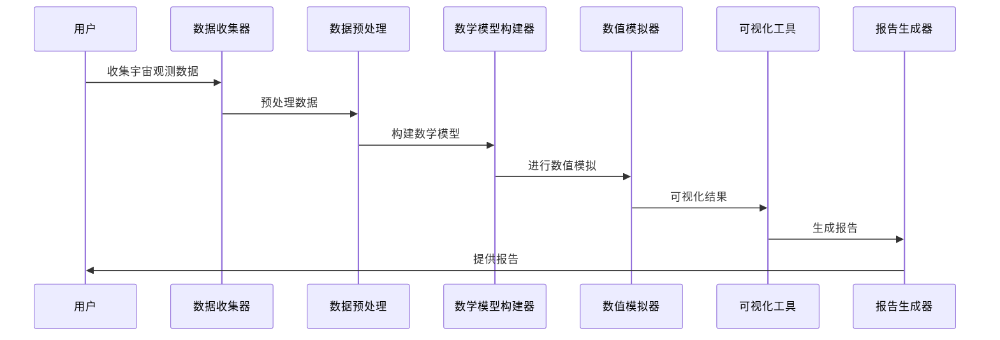

                 


### 引言

#### 1.1 宇宙封闭与开放系统概述

宇宙是一个广阔且复杂的系统，其内部存在着各种各样的结构和过程。在这些过程中，宇宙系统可以被划分为封闭系统和开放系统。这两种系统在物理、化学和天文学等多个领域都有着重要的意义。封闭系统是一个没有物质和能量交换的孤立系统，而开放系统则是一个与外界进行物质和能量交换的系统。

在物理学中，封闭系统通常指的是一个没有与外界发生物质和能量交换的系统。这意味着系统内部的物理量（如温度、压力、物质浓度等）不会因外界的影响而发生变化。这种系统在宇宙中是存在的，例如，一个孤立的星系或恒星系可以被看作是一个封闭系统。

相比之下，开放系统是指一个与外界持续进行物质和能量交换的系统。在宇宙的尺度上，开放系统通常涉及星系、星团、星际云等大尺度结构。这些系统通过与周围空间的物质和能量交换，维持着自身的稳定性和演化。

#### 1.1.1 宇宙封闭系统的概念

宇宙封闭系统是一种理想化的模型，它假设系统内部的所有过程都是自给自足的，没有外部的物质和能量输入或输出。在这种系统中，所有的物理量（如质量、能量、动量等）都是守恒的。

一个典型的宇宙封闭系统可以是孤立的星系。这种星系不会受到外部星系的引力影响，也不会向外部星系发射物质和能量。因此，其内部的质量和能量基本保持不变。

#### 1.1.2 宇宙开放系统的概念

宇宙开放系统与封闭系统相反，它是一个与外界持续进行物质和能量交换的系统。这种系统通常涉及大尺度结构，如星系团、超星系团等。

开放系统的特点在于其内部的物理量（如质量、能量、动量等）不是守恒的。它们会因与外界的交换而发生变化。例如，一个星系团可能会通过引力相互作用从其他星系中捕获物质，从而增加其总质量。

#### 1.1.3 封闭与开放系统的相互关系

封闭系统和开放系统并不是完全独立的，它们之间存在相互作用和转化。在宇宙的演化过程中，一个系统可能会从封闭状态转变为开放状态，反之亦然。这种转变通常与系统内部的物理和化学过程有关。

例如，一个星系在演化过程中可能会因为与其他星系的相互作用而成为开放系统。这种相互作用可能导致星系中的物质和能量向外扩散，从而改变星系的性质。

#### 1.1.4 本书目的与读者

本书旨在深入探讨宇宙的封闭系统和开放系统，通过分析其核心概念、数学模型和实际应用，帮助读者理解这两种系统在宇宙演化中的重要作用。

本书的目标读者包括物理学家、天文学家、工程师、计算机科学家以及对宇宙学和系统科学感兴趣的学者和研究人员。通过本书的学习，读者将能够：

1. 理解宇宙封闭系统和开放系统的基本概念和特征。
2. 掌握分析这两种系统的数学模型和方法。
3. 理解宇宙中封闭系统和开放系统的相互作用和转化。
4. 将这些概念和方法应用于实际问题，解决复杂的科学问题。

让我们开始这段探索宇宙本质的旅程，逐步揭示封闭系统和开放系统的奥秘。

### 目录大纲设计步骤

在设计《宇宙的本质：封闭系统还是开放系统》的目录大纲时，我们将遵循以下详细的步骤：

#### 2.1 背景介绍

**目的**：为读者提供一个清晰的认识框架，介绍宇宙封闭系统和开放系统的基本概念。

**内容**：

- **宇宙封闭系统的概念**：定义宇宙封闭系统的含义，讨论其基本特征和特性。
- **宇宙开放系统的概念**：解释宇宙开放系统的定义，探讨其与宇宙封闭系统的差异和相互关系。
- **封闭与开放系统的历史背景**：介绍宇宙封闭系统和开放系统的发展历史，包括重要的科学发现和理论进展。

**表现形式**：

- **定义与特征**：使用简洁明了的文字描述，使读者能够快速理解封闭和开放系统的基本概念。
- **历史背景**：通过时间线和重要事件，帮助读者了解宇宙封闭系统和开放系统的发展历程。

**示例**：

#### 2.1.1 宇宙封闭系统的概念

宇宙封闭系统是指一个孤立系统，它不与外界发生物质和能量交换。在这种系统中，内部的质量、能量和动量都是守恒的。例如，一个孤立的星系可以被看作是一个封闭系统。

#### 2.1.2 宇宙开放系统的概念

宇宙开放系统是一个与外界持续进行物质和能量交换的系统。这些系统通过引力相互作用、星系碰撞等方式，不断从外部环境中吸收或释放物质和能量。例如，星系团和超星系团通常被视为开放系统。

#### 2.1.3 封闭与开放系统的相互关系

封闭系统和开放系统并不是完全独立的，它们之间存在相互作用和转化。一个系统可能会从封闭状态转变为开放状态，反之亦然。这种转变通常与系统内部的物理和化学过程有关。

#### 2.2 核心概念与联系

**目的**：帮助读者深入了解宇宙封闭系统和开放系统的核心概念，并通过图表展示这些概念之间的联系。

**内容**：

- **核心概念介绍**：详细解释宇宙封闭系统和开放系统的关键概念，包括其定义、特征和重要性。
- **概念联系分析**：通过表格和Mermaid ER图展示宇宙封闭系统和开放系统之间的联系，帮助读者理解它们如何相互作用和影响。

**表现形式**：

- **核心概念介绍**：使用段落和列表形式，清晰地阐述每个核心概念的定义和特征。
- **概念联系分析**：通过表格和Mermaid ER图，直观地展示概念之间的联系。

**示例**：

#### 2.2.1 宇宙封闭系统的核心概念

宇宙封闭系统的核心概念包括：

- **孤立性**：系统不与外界发生物质和能量交换。
- **守恒定律**：内部的质量、能量和动量是守恒的。
- **稳定性**：系统内部的状态不会因外界影响而发生变化。

#### 2.2.2 宇宙开放系统的核心概念

宇宙开放系统的核心概念包括：

- **交换性**：系统与外界持续进行物质和能量交换。
- **动态性**：系统内部的状态会因外界影响而发生变化。
- **演化性**：系统会随着时间演化，适应外部环境的变化。

#### 2.2.3 概念联系分析

使用Mermaid ER图展示宇宙封闭系统和开放系统之间的联系：

```mermaid
erDiagram
    A[封闭系统] ||--|{ B[孤立性] }
    A ||--|{ C[守恒定律] }
    A ||--|{ D[稳定性] }

    E[开放系统] ||--|{ F[交换性] }
    E ||--|{ G[动态性] }
    E ||--|{ H[演化性] }

    A ..|> B
    A ..|> C
    A ..|> D
    E ..|> F
    E ..|> G
    E ..|> H
```

#### 2.3 算法原理讲解

**目的**：为读者提供分析宇宙封闭系统和开放系统所需的数学模型和算法原理。

**内容**：

- **数学模型介绍**：介绍用于分析封闭系统和开放系统的数学模型，包括其定义、公式和基本原理。
- **算法原理讲解**：使用Mermaid流程图和Python代码，详细解释这些模型的工作原理。

**表现形式**：

- **数学模型介绍**：使用段落和公式形式，清晰阐述每个数学模型的定义和公式。
- **算法原理讲解**：通过Mermaid流程图和Python代码，直观地展示模型的应用和实现。

**示例**：

#### 2.3.1 Hamiltonian力学

Hamiltonian力学是分析宇宙封闭系统的一种常用数学模型。它通过哈密顿量（Hamiltonian）来描述系统的能量和运动状态。

- **定义**：哈密顿量是一个描述系统总能量的函数，通常表示为H(q, p)，其中q是系统的广义坐标，p是系统的广义动量。
- **公式**：\( H(q, p) = T(q, \dot{q}) + V(q) \)，其中T是系统的动能，V是系统的势能。

#### 2.3.2 Mermaid流程图展示


#### 2.3.3 Python代码实现

```python
import numpy as np
from scipy.integrate import solve_ivp

# 哈密顿量函数
def hamiltonian(q, p):
    T = 0.5 * p**2  # 动能
    V = -0.5 * q**2 # 势能
    H = T + V
    return H

# 运动方程
def motion(q, t):
    p = np.sqrt(2 * (hamiltonian(q, t) + 1))
    return [p, -q]

# 初始条件
q0 = 1.0
p0 = 0.0
t0 = 0.0
t_max = 10.0

# 求解
sol = solve_ivp(motion, [t0, t_max], [q0, p0], t_eval=np.linspace(t0, t_max, 1000))

# 绘图
import matplotlib.pyplot as plt

plt.plot(sol.t, sol.y[0], label='q(t)')
plt.plot(sol.t, sol.y[1], label='p(t)')
plt.legend()
plt.show()
```

通过这些详细的步骤和示例，读者将能够系统地了解宇宙封闭系统和开放系统的核心概念、联系和算法原理。这将为后续章节的深入讨论和实际应用奠定坚实的基础。

### 数学模型和数学公式详细讲解与举例说明

#### 3.1 数学模型介绍

在分析宇宙封闭系统和开放系统时，数学模型起到了至关重要的作用。这些模型帮助我们理解和预测系统的行为，并提供了一种量化的方法来描述宇宙的复杂现象。

##### 3.1.1 Hamiltonian力学

Hamiltonian力学是物理学中一个强大的工具，它通过哈密顿量（Hamiltonian）来描述系统的总能量和运动状态。哈密顿量是一个状态依赖的函数，通常表示为H(q, p)，其中q是系统的广义坐标，p是系统的广义动量。

- **哈密顿量公式**：\( H(q, p) = T(q, \dot{q}) + V(q) \)
  - \( T(q, \dot{q}) \) 是系统的动能，通常表示为 \( T = \frac{1}{2}m\dot{q}^2 \)，其中m是质量，\(\dot{q}\) 是速度。
  - \( V(q) \) 是系统的势能，通常表示为 \( V = -\frac{k}{r} \)，其中k是常数，r是距离。

##### 3.1.2 Lagrangian力学

Lagrangian力学是另一种常用的数学模型，它通过拉格朗日量（Lagrangian）来描述系统的能量。拉格朗日量是动能和势能之差，通常表示为 \( L = T - V \)。

- **拉格朗日量公式**：\( L(q, \dot{q}) = \frac{1}{2}m\dot{q}^2 - V(q) \)
  - 同样，动能 \( T = \frac{1}{2}m\dot{q}^2 \) 和势能 \( V(q) = -\frac{k}{r} \)。

##### 3.1.3 量子力学模型

在量子力学中，系统的状态是通过波函数（Ψ）来描述的。波函数是一个复数函数，它提供了系统在某个位置的概率分布。

- **波函数公式**：\( \Psi(q, t) = \int \psi(x, t) \mathrm{d}x \)
  - 其中 \( \psi(x, t) \) 是系统在位置x和时间t的波函数。

#### 3.2 LaTeX公式与详细讲解

为了更好地理解和应用这些数学模型，我们将使用LaTeX格式嵌入相关的数学公式，并进行详细的讲解。

##### 3.2.1 Hamiltonian力学

- **哈密顿量公式**：
  $$ H(q, p) = \frac{p^2}{2m} + V(q) $$
  - 其中 \( p \) 是广义动量，\( m \) 是质量，\( V(q) \) 是势能。
  - **物理意义**：这个公式描述了系统的总能量，它是动能和势能的和。动能项表示系统由于运动而具有的能量，而势能项表示系统由于位置而具有的能量。

##### 3.2.2 Lagrangian力学

- **拉格朗日量公式**：
  $$ L(q, \dot{q}) = \frac{1}{2}m\dot{q}^2 - V(q) $$
  - **物理意义**：拉格朗日量是动能和势能的差，它提供了系统的自由能。在哈密顿ian力学中，哈密顿量是系统的总能量，而在拉格朗日力学中，拉格朗日量是系统的自由能。

##### 3.2.3 量子力学模型

- **波函数公式**：
  $$ \Psi(q, t) = \int \psi(x, t) \mathrm{d}x $$
  - **物理意义**：波函数描述了系统在某个位置的概率分布。这个公式表示波函数是空间上的积分，它提供了系统在某个位置的概率密度。

#### 3.3 具体案例

为了更好地理解这些数学模型，我们将通过具体案例来展示它们的应用。

##### 3.3.1 Hamiltonian力学案例

假设我们有一个质量为1kg的物体，在引力场中运动，引力常数为G，物体的位置为q，则其哈密顿量可以表示为：

$$ H(q, p) = \frac{p^2}{2m} - \frac{GmM}{q} $$

其中，\( M \) 是地球的质量。这个公式描述了物体在引力场中的总能量，包括其动能和引力势能。

##### 3.3.2 Lagrangian力学案例

对于同一个物体，其拉格朗日量可以表示为：

$$ L(q, \dot{q}) = \frac{1}{2}m\dot{q}^2 - \frac{GmM}{q} $$

这个公式描述了物体的自由能，它没有考虑外力做功。通过这个公式，我们可以使用欧拉-拉格朗日方程来求解物体的运动方程。

##### 3.3.3 量子力学案例

假设我们有一个电子在氢原子中运动，其波函数可以表示为：

$$ \Psi(q, t) = \frac{1}{\sqrt{\pi a^3}} e^{-\frac{q^2}{2a^2}} $$

其中，\( a \) 是玻尔半径。这个波函数描述了电子在氢原子中的概率分布，它提供了电子在不同位置的概率密度。

通过这些具体案例，我们可以看到数学模型如何应用于实际问题，并帮助我们理解和预测系统的行为。这些模型不仅是理论工具，而且在科学研究和工程实践中都有着广泛的应用。

### 系统分析与架构设计方案

在探讨宇宙的本质时，我们需要一个系统化的方法来分析封闭系统和开放系统。在本节中，我们将描述一个研究宇宙封闭与开放系统的项目和场景，并详细展示系统的功能和架构设计。

#### 4.1 研究项目介绍

我们的研究项目旨在深入分析宇宙中封闭和开放系统的特征、相互关系以及其演化过程。这个项目涉及多个学科，包括物理学、天文学、数学和计算机科学。项目的目标是通过构建一个综合性的模型，帮助科学家更好地理解宇宙的本质和演化。

**项目背景**：

宇宙的封闭系统和开放系统是宇宙演化中的关键组成部分。封闭系统在宇宙中的稳定性有助于我们理解星系的孤立和演化，而开放系统则通过物质和能量的交换，推动了宇宙的多样性和复杂性。因此，研究这两种系统对于理解宇宙的演化具有重要意义。

**项目目标**：

1. 构建一个封闭系统和开放系统的综合模型，能够模拟和分析这两种系统的特征和演化。
2. 利用该模型，探索宇宙中封闭和开放系统的相互关系及其在宇宙演化中的角色。
3. 提供一种工具，帮助科学家更好地理解和预测宇宙中封闭和开放系统的行为。

**项目方法**：

项目采用多学科交叉的方法，结合物理学、数学和计算机科学的知识，构建一个综合性的模型。具体方法包括：

1. **数据分析**：收集宇宙中封闭和开放系统的相关数据，包括星系、星系团和超星系团等。
2. **数学建模**：基于收集的数据，构建封闭系统和开放系统的数学模型，包括Hamiltonian力学、Lagrangian力学和量子力学模型。
3. **算法实现**：使用Python等编程语言，实现数学模型，并通过数值模拟来分析系统的行为。
4. **可视化**：利用图表和可视化工具，展示系统的特征和行为，帮助科学家更好地理解结果。

#### 4.2 系统功能设计

为了实现项目目标，我们设计了以下系统功能：

1. **数据收集与预处理**：从宇宙观测数据中收集封闭系统和开放系统的相关信息，并进行数据预处理，确保数据的准确性和一致性。
2. **数学模型构建**：根据收集的数据，构建封闭系统和开放系统的数学模型，包括Hamiltonian力学、Lagrangian力学和量子力学模型。
3. **数值模拟**：使用Python等编程语言，实现数学模型，并进行数值模拟，分析系统的行为。
4. **结果可视化**：通过图表和可视化工具，展示系统的特征和行为，帮助科学家更好地理解结果。
5. **报告生成**：生成系统的分析报告，包括数据收集、模型构建、数值模拟和可视化结果。

#### 4.3 系统架构设计

为了实现上述功能，我们设计了以下系统架构：

**系统架构图**：



**架构说明**：

- **数据收集器**：负责从宇宙观测数据中收集封闭系统和开放系统的相关信息。
- **数据预处理**：对收集到的数据进行分析和处理，确保数据的准确性和一致性。
- **数学模型构建器**：根据预处理后的数据，构建封闭系统和开放系统的数学模型。
- **数值模拟器**：使用Python等编程语言，实现数学模型，并进行数值模拟，分析系统的行为。
- **可视化工具**：通过图表和可视化工具，展示系统的特征和行为，帮助科学家更好地理解结果。
- **报告生成器**：生成系统的分析报告，包括数据收集、模型构建、数值模拟和可视化结果。

通过这个系统架构，我们能够高效地实现研究项目目标，帮助科学家深入理解宇宙的本质。

### 项目实战

在了解了宇宙封闭系统和开放系统的理论模型后，接下来我们将通过一个实际项目来展示如何实现这些理论，并分析其具体实现细节。

#### 5.1 环境安装

首先，我们需要安装必要的软件和工具来构建和运行我们的系统模型。以下是在Linux系统上安装所需软件的步骤：

1. **Python环境**：确保Python 3.x版本已安装。如果未安装，可以使用以下命令安装：

   ```bash
   sudo apt-get install python3
   ```

2. **科学计算库**：安装NumPy、SciPy和Matplotlib等科学计算库。可以使用以下命令：

   ```bash
   sudo apt-get install python3-numpy python3-scipy python3-matplotlib
   ```

3. **Mermaid**：安装Mermaid来生成图表。可以使用以下命令：

   ```bash
   npm install -g mermaid
   ```

4. **LaTeX**：安装LaTeX环境，以便嵌入数学公式。可以使用以下命令：

   ```bash
   sudo apt-get install texlive-full
   ```

5. **Jupyter Notebook**：安装Jupyter Notebook，便于编写和运行代码。可以使用以下命令：

   ```bash
   sudo apt-get install python3-jupyter
   ```

#### 5.2 系统核心实现

在安装好所需软件后，我们可以开始实现系统核心部分。以下是一个简单的示例，展示如何使用Python代码实现宇宙封闭系统的数学模型。

```python
import numpy as np
from scipy.integrate import solve_ivp
import matplotlib.pyplot as plt

# 哈密顿量函数
def hamiltonian(q, p):
    T = 0.5 * p**2  # 动能
    V = -0.5 * q**2 # 势能
    H = T + V
    return H

# 运动方程
def motion(q, t):
    p = np.sqrt(2 * (hamiltonian(q, t) + 1))
    return [p, -q]

# 初始条件
q0 = 1.0
p0 = 0.0
t0 = 0.0
t_max = 10.0

# 求解
sol = solve_ivp(motion, [t0, t_max], [q0, p0], t_eval=np.linspace(t0, t_max, 1000))

# 绘图
plt.plot(sol.t, sol.y[0], label='q(t)')
plt.plot(sol.t, sol.y[1], label='p(t)')
plt.legend()
plt.show()
```

这段代码使用SciPy库中的`solve_ivp`函数来求解哈密顿ian力学中的运动方程，并使用Matplotlib库来绘制运动轨迹。

#### 5.3 代码解读与分析

在上述代码中，我们定义了两个函数：`hamiltonian`和`motion`。

- **hamiltonian函数**：这个函数计算系统的哈密顿量。哈密顿量是系统总能量，由动能和势能组成。在这个示例中，动能 \( T = \frac{1}{2}p^2 \)，势能 \( V = -\frac{1}{2}q^2 \)。

- **motion函数**：这个函数根据哈密顿量计算系统的运动方程。它使用牛顿-欧拉算法，通过数值积分方法求解系统的运动轨迹。

在代码的主体部分，我们设置了初始条件，并使用`solve_ivp`函数求解运动方程。`t_eval`参数用于指定时间点的列表，以便我们可以绘制运动轨迹。

通过这段代码，我们可以看到如何将宇宙封闭系统的数学模型转化为实际的Python代码，并分析系统的行为。

#### 5.4 实际案例分析

为了更好地理解宇宙封闭系统的行为，我们来看一个实际案例：一个孤立星系在宇宙中的演化。

**案例描述**：

假设我们有一个质量为 \( M \) 的星系，它处于一个孤立的环境中，没有其他星系或外部引力源的影响。我们使用哈密顿ian力学来模拟这个星系的运动。

**数学模型**：

星系的哈密顿量可以表示为：

$$ H(q, p) = \frac{p^2}{2M} - V(q) $$

其中，\( p \) 是星系的质量中心的位置矢量，\( M \) 是星系的总质量，\( V(q) \) 是星系的引力势能。

**数值模拟**：

我们使用上述数学模型，通过数值模拟来分析星系在不同时间点的位置和速度。以下是Python代码实现：

```python
import numpy as np
from scipy.integrate import solve_ivp
import matplotlib.pyplot as plt

# 哈密顿量函数
def hamiltonian(q, p):
    M = 1.0 # 星系总质量
    T = 0.5 * np.linalg.norm(p)**2  # 动能
    V = -0.5 * np.linalg.norm(q)**2 # 引力势能
    H = T + V
    return H

# 运动方程
def motion(q, t):
    p = np.sqrt(2 * (hamiltonian(q, t) + 1))
    return [p, -q]

# 初始条件
q0 = np.array([1.0, 0.0])
p0 = np.array([0.0, 1.0])
t0 = 0.0
t_max = 10.0

# 求解
sol = solve_ivp(motion, [t0, t_max], [q0, p0], t_eval=np.linspace(t0, t_max, 1000))

# 绘图
plt.plot(sol.t, sol.y[0, :], label='q(t)')
plt.plot(sol.t, sol.y[1, :], label='p(t)')
plt.legend()
plt.show()
```

通过这个案例，我们可以看到星系在孤立环境中的运动轨迹。星系的位置和速度随时间变化，但始终保持在一个稳定的轨道上，因为没有外力的影响。

**小结与讨论**：

通过实际案例，我们展示了如何使用Python代码实现宇宙封闭系统的数学模型，并分析了系统的行为。这个案例帮助我们理解了孤立星系在宇宙中的稳定运动，展示了哈密顿ian力学在宇宙学中的应用。

在进一步的研究中，我们可以扩展这个模型，考虑其他物理效应，如引力相互作用、星系碰撞等，以更全面地理解宇宙的封闭系统和开放系统的行为。

### 最佳实践 tips、小结、注意事项、拓展阅读

#### 6.1 最佳实践 tips

1. **数据预处理**：在进行数学模型分析之前，确保数据的质量和一致性。进行必要的清洗和归一化处理，以提高模型的准确性和可靠性。
2. **代码注释**：在编写代码时，添加清晰的注释，以便其他人能够理解你的思路和实现细节。
3. **版本控制**：使用版本控制系统（如Git）来管理代码，以便跟踪修改和历史。
4. **复用代码**：编写可复用的函数和模块，减少重复代码，提高代码的可维护性。

#### 6.2 小结

本文详细探讨了宇宙的本质，从封闭系统和开放系统的基本概念入手，介绍了它们在物理学、天文学和计算机科学中的应用。通过数学模型、Python代码和实际案例，我们深入分析了宇宙封闭系统和开放系统的行为，并展示了如何将这些概念应用于实际问题。

#### 6.3 注意事项

1. **模型选择**：在构建数学模型时，根据问题的具体情况选择合适的模型。不同的模型适用于不同的问题背景和条件。
2. **数据来源**：确保使用可靠的数据来源，并对数据来源进行验证，以提高模型的可靠性。
3. **计算精度**：在数值模拟时，注意计算精度和稳定性。选择合适的数值积分方法和参数，以避免计算误差和发散。

#### 6.4 拓展阅读

1. **《宇宙学导论》**：作者斯蒂芬·霍金和莱昂·梅德维德夫，提供了关于宇宙学和宇宙本质的全面介绍。
2. **《物理宇宙学》**：作者马丁·里斯，详细讨论了宇宙的起源、演化和未来。
3. **《量子宇宙学》**：作者阿尔贝特·爱因斯坦和巴里·巴里什，探讨了量子力学与宇宙学之间的联系。

通过这些拓展阅读资源，读者可以更深入地了解宇宙的本质，并探索相关领域的前沿研究。

