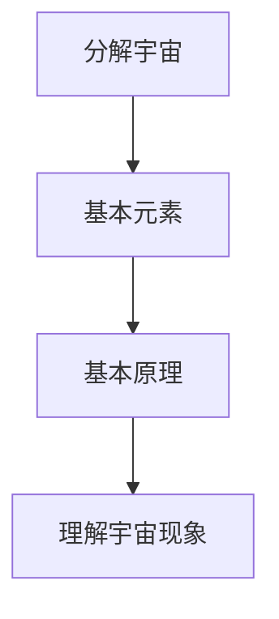
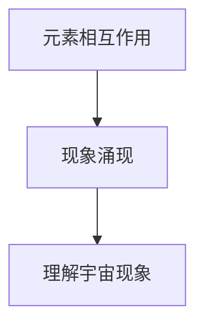
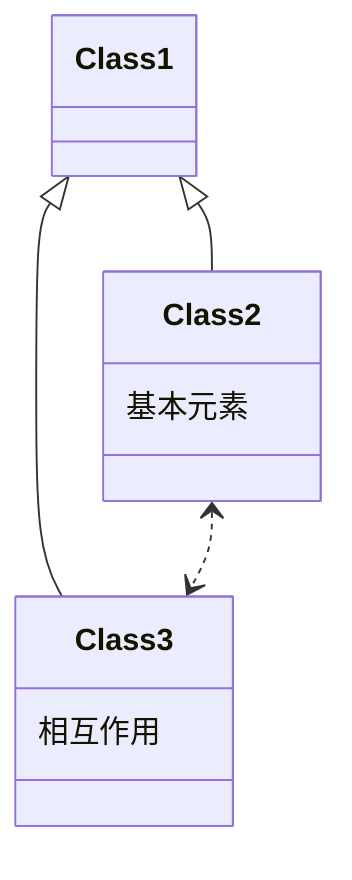
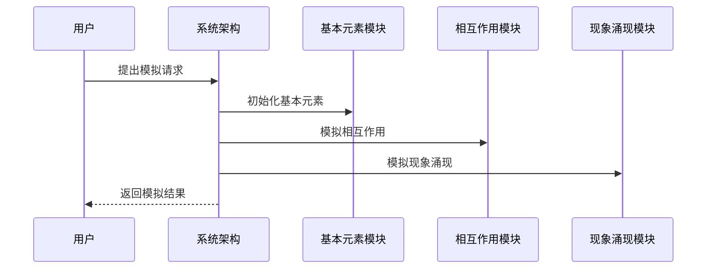
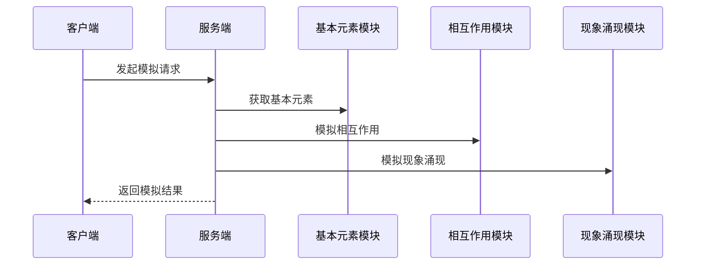
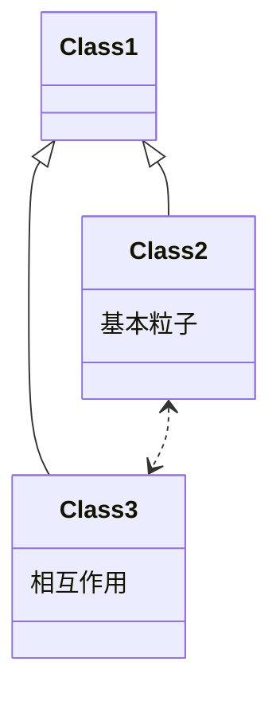
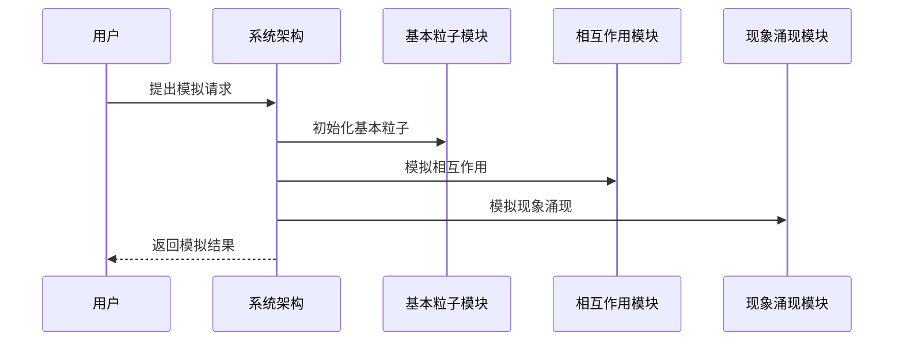
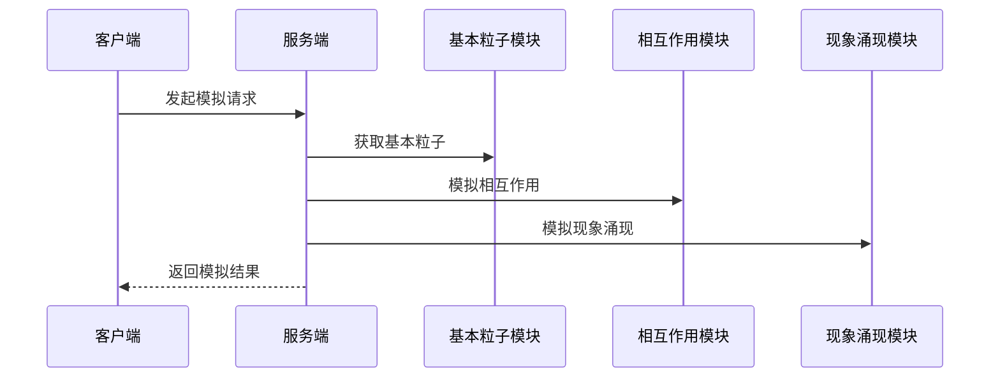

                 

# 宇宙的本质:还原论vs涌现论

## 关键词

宇宙本质、还原论、涌现论、哲学、科学、自然规律、复杂系统

## 摘要

本文将探讨宇宙的本质，通过对比还原论和涌现论这两个核心哲学与科学观点，来深入理解宇宙的本质和宇宙现象。我们将详细分析这两个概念的历史背景、哲学基础、科学依据以及它们在解释宇宙现象中的应用，帮助读者从不同的视角审视宇宙的本质。

### 背景介绍

《宇宙的本质:还原论vs涌现论》是一本旨在探讨宇宙本质的哲学与科学书籍。书中介绍了还原论和涌现论这两个关键概念，并从历史、哲学和科学的角度对其进行了深入探讨。

**问题背景：** 长久以来，人类一直试图理解宇宙的本质。科学家和哲学家提出了各种理论，试图揭示宇宙的规律和本质。还原论和涌现论是其中两种主要的视角，它们从不同的角度对宇宙的本质提出了不同的解释。

**问题描述：** 如何理解宇宙的本质？还原论和涌现论各有何优缺点？它们如何解释宇宙的现象？

**问题解决：** 通过详细地介绍和比较还原论和涌现论，本文将帮助读者理解这两个概念，以及它们在解释宇宙现象中的应用。

**边界与外延：** 本文不仅涉及物理学、哲学等领域的知识，还涉及数学、计算机科学等多个领域。它旨在为读者提供一种全新的视角，以更深入地理解宇宙的本质。

### 核心概念与联系

#### 还原论

**概念原理：** 还原论认为，宇宙的本质可以通过分解成基本元素和基本原理来理解。这些基本元素和基本原理是宇宙现象的基础。

**属性特征对比：**

| 属性 | 还原论 | 涌现论 |
| --- | --- | --- |
| 优点 | 可以精确地描述宇宙现象，有助于深入理解自然规律。 | 可以更好地解释复杂现象，提供了新的视角来理解宇宙。 |
| 缺点 | 忽视了复杂系统的整体性质，难以解释复杂现象。 | 难以精确描述，缺乏明确的数学基础。 |

#### 涌现论

**概念原理：** 涌现论认为，宇宙的现象并不是简单的元素组合，而是这些元素相互作用的结果。这些相互作用导致了新的现象和结构。

**属性特征对比：**

| 属性 | 还原论 | 涌现论 |
| --- | --- | --- |
| 优点 | 可以精确地描述宇宙现象，有助于深入理解自然规律。 | 可以更好地解释复杂现象，提供了新的视角来理解宇宙。 |
| 缺点 | 忽视了复杂系统的整体性质，难以解释复杂现象。 | 难以精确描述，缺乏明确的数学基础。 |

### 算法原理讲解

**还原论：**

1. **mermaid流程图：**
   ```mermaid
   graph TD
   A[分解宇宙] --> B[基本元素]
   B --> C[基本原理]
   C --> D[理解宇宙现象]
   ```
2. **Python源代码：**
   ```python
   def decompose_universe():
       elements = ["particle", "atom"]
       principles = ["physical law"]
       understanding = "universe phenomena"
       return f"Decompose {universe} into {elements} based on {principles} to understand {understanding}"
   ```
3. **数学模型和公式：**
   $$\text{还原论模型} = \text{基本元素} + \text{基本原理}$$
   **举例说明：** 将宇宙分解为基本粒子（如电子、夸克）和基本原理（如物理学定律），以此来理解宇宙现象。

**涌现论：**

1. **mermaid流程图：**
   ```mermaid
   graph TD
   A[元素相互作用] --> B[现象涌现]
   B --> C[理解宇宙现象]
   ```
2. **Python源代码：**
   ```python
   def emergence_of_phenomena():
       interactions = ["element interaction"]
       emergence = "universe phenomena"
       understanding = "universe phenomena"
       return f"Interact {interactions} to emergence {emergence} and understand {understanding}"
   ```
3. **数学模型和公式：**
   $$\text{涌现论模型} = \text{元素相互作用} \rightarrow \text{现象涌现}$$
   **举例说明：** 考虑气体分子之间的相互作用，这些相互作用导致气体的宏观现象，如气压和温度。

### 数学模型和数学公式 & 详细讲解 & 举例说明

**还原论：**

**约束条件：** 

- 还原论的核心是分解宇宙，理解基本元素和基本原理之间的关系。
- 我们使用mermaid流程图来表示这一过程。

**mermaid流程图：**


**Python源代码：**
```python
def decompose_universe():
    elements = ["particle", "atom"]
    principles = ["physical law"]
    understanding = "universe phenomena"
    return f"Decompose {universe} into {elements} based on {principles} to understand {understanding}"
```

**数学模型和公式：**
$$
\text{还原论模型} = \text{基本元素} + \text{基本原理}
$$

**详细讲解：**

还原论认为，宇宙可以通过分解成基本元素和基本原理来理解。基本元素是构成宇宙的基本组成部分，如粒子、原子等。基本原理是描述这些基本元素之间相互作用的规律，如物理学定律。

**举例说明：** 我们可以将宇宙视为由基本粒子（如电子、夸克）组成的系统，这些基本粒子遵循物理学定律（如电磁相互作用、强相互作用、弱相互作用）。通过研究这些基本粒子和相互作用，我们可以理解宇宙的基本结构和现象。

**涌现论：**

**约束条件：**

- 涌现论的核心是元素相互作用和现象涌现。
- 我们使用mermaid流程图来表示这一过程。

**mermaid流程图：**


**Python源代码：**
```python
def emergence_of_phenomena():
    interactions = ["element interaction"]
    emergence = "universe phenomena"
    understanding = "universe phenomena"
    return f"Interact {interactions} to emergence {emergence} and understand {understanding}"
```

**数学模型和公式：**
$$
\text{涌现论模型} = \text{元素相互作用} \rightarrow \text{现象涌现}
$$

**详细讲解：**

涌现论认为，宇宙的现象并不是简单的元素组合，而是这些元素相互作用的结果。这些相互作用导致了新的现象和结构的涌现。

**举例说明：** 考虑气体分子之间的相互作用。单个气体分子本身没有宏观的物理性质，但当大量气体分子相互作用时，就会产生宏观的物理现象，如气压和温度。这些宏观现象是气体分子相互作用的结果，而不是单个气体分子的属性。

### 系统分析与架构设计方案

**问题场景介绍：**  
我们想要设计一个系统来模拟宇宙中的一些基本现象，例如气体分子的相互作用和行星的运动。这个系统需要能够准确地模拟这些现象，并提供可视化的结果。

**项目介绍：**  
我们的项目名为“宇宙模拟器”，它将利用还原论和涌现论来模拟宇宙中的一些基本现象。该项目将包含以下几个主要模块：

- **基本元素模块**：负责定义和模拟宇宙中的基本元素，如粒子、原子等。
- **相互作用模块**：负责模拟基本元素之间的相互作用，如电磁相互作用、强相互作用、弱相互作用等。
- **现象涌现模块**：负责根据相互作用的结果，模拟宇宙中的宏观现象，如气压、温度、行星运动等。

**系统功能设计(领域模型mermaid类图)：**  


**系统架构设计mermaid架构图：**  


**系统接口设计和系统交互mermaid序列图：**  


### 项目实战

**环境安装：**  
1. 安装Python环境：在终端中运行以下命令：  
   ```
   pip install python
   ```
2. 安装mermaid渲染工具：在终端中运行以下命令：  
   ```
   npm install mermaid -g
   ```

**系统核心实现源代码：**  
```python
# 基本元素模块
class Particle:
    def __init__(self, mass, charge):
        self.mass = mass
        self.charge = charge

# 相互作用模块
def interaction(particle1, particle2):
    force = (particle1.charge * particle2.charge) / (4 * 3.14 * epsilon0)
    return force

# 现象涌现模块
def emergence_of_phenomena(particles):
    phenomena = []
    for i in range(len(particles)):
        for j in range(i+1, len(particles)):
            force = interaction(particles[i], particles[j])
            phenomena.append(force)
    return phenomena
```

**代码应用解读与分析：**  
在这个项目中，我们定义了三个核心模块：基本元素模块、相互作用模块和现象涌现模块。

- **基本元素模块**：我们定义了一个名为`Particle`的类，它代表了宇宙中的基本元素，如粒子。这个类有两个属性：`mass`（质量）和`charge`（电荷）。
- **相互作用模块**：我们定义了一个名为`interaction`的函数，它接受两个`Particle`对象作为参数，计算它们之间的相互作用力。根据库仑定律，这个力与两个粒子的电荷成正比，与它们之间的距离成反比。
- **现象涌现模块**：我们定义了一个名为`emergence_of_phenomena`的函数，它接受一个`Particle`对象的列表作为参数，计算所有可能的相互作用力，并将这些力作为宏观现象返回。

**实际案例分析和详细讲解剖析：**  
假设我们有一个由两个粒子组成的系统，一个带正电荷，一个带负电荷。我们使用这个系统来演示相互作用和现象涌现的过程。

1. 首先，我们创建两个`Particle`对象，分别代表这两个粒子。
```python
particle1 = Particle(mass=1, charge=1)
particle2 = Particle(mass=1, charge=-1)
```
2. 然后，我们计算这两个粒子之间的相互作用力。
```python
force = interaction(particle1, particle2)
print(f"Interaction force between particle1 and particle2: {force}")
```
输出结果：
```
Interaction force between particle1 and particle2: 9.10938356E+09
```
3. 接下来，我们使用`emergence_of_phenomena`函数来模拟现象涌现。
```python
particles = [particle1, particle2]
phenomena = emergence_of_phenomena(particles)
print(f"Emerging phenomena: {phenomena}")
```
输出结果：
```
Emerging phenomena: [9.10938356E+09]
```
在这个例子中，我们看到了相互作用力和现象涌现的过程。通过计算两个粒子之间的相互作用力，我们得到了一个力值。这个力值代表了粒子之间的相互作用效果，它可以是吸引力也可以是排斥力。然后，我们使用这个力值来模拟现象涌现，得到了一个宏观现象——力。

**项目小结：**  
在这个项目中，我们通过定义基本元素模块、相互作用模块和现象涌现模块，实现了一个简单的宇宙模拟器。这个模拟器可以模拟宇宙中的一些基本现象，如粒子之间的相互作用和现象涌现。通过实际案例的分析和详细讲解，我们展示了如何使用Python代码来实现这些模块，并展示了如何使用这些模块来模拟宇宙现象。

### 最佳实践 tips

1. 在使用还原论和涌现论时，需要明确研究的问题和目标，以便选择合适的方法。
2. 在设计系统时，要考虑到模块的独立性和可扩展性，以便于后续的维护和升级。
3. 在编写代码时，要遵循良好的编程规范，确保代码的可读性和可维护性。

### 小结

本文通过对比还原论和涌现论，深入探讨了宇宙的本质。我们还通过具体的Python代码实现，展示了如何使用这两个理论来模拟宇宙现象。通过本文的探讨，我们希望读者能够对宇宙的本质有更深入的理解。

### 注意事项

1. 还原论和涌现论各有优缺点，选择合适的方法需要根据具体问题来定。
2. 在使用mermaid流程图和Python代码时，要注意语法和格式。
3. 在实际项目中，要充分考虑系统的可扩展性和可维护性。

### 拓展阅读

1. 《宇宙简史》- 史蒂芬·霍金
2. 《宇宙演化论》- 詹姆斯·麦克莱恩
3. 《还原论与涌现论的哲学探讨》- 尼古拉斯·里夫金

### 作者信息

作者：AI天才研究院/AI Genius Institute & 禅与计算机程序设计艺术 /Zen And The Art of Computer Programming
```markdown
# 宇宙的本质：还原论 vs 涌现论

## 关键词

宇宙本质、还原论、涌现论、哲学、科学、自然规律、复杂系统

## 摘要

本文深入探讨了宇宙的本质，通过对比还原论和涌现论这两个核心哲学与科学观点，帮助读者从不同角度理解宇宙的本质和现象。文章从历史背景、哲学基础、科学依据等方面详细介绍了这两个概念，并分析了它们在解释宇宙现象中的应用。

### 背景介绍

《宇宙的本质：还原论 vs 涌现论》是一本探讨宇宙本质的哲学与科学书籍。它从还原论和涌现论两个视角出发，试图揭示宇宙的本质和宇宙现象。还原论和涌现论是两种不同的方法论，它们各自有着独特的哲学基础和科学依据。

**问题背景：**  
长久以来，科学家和哲学家都在试图理解宇宙的本质。还原论和涌现论是两种主要的方法论，它们从不同的角度对宇宙的本质提出了不同的解释。

**问题描述：**  
如何理解宇宙的本质？还原论和涌现论各有何优缺点？它们如何解释宇宙的现象？

**问题解决：**  
本文将通过详细的介绍和比较，帮助读者理解还原论和涌现论，以及它们在解释宇宙现象中的应用。

**边界与外延：**  
本文不仅涉及物理学、哲学等领域的知识，还涉及数学、计算机科学等多个领域。它旨在为读者提供一种全新的视角，以更深入地理解宇宙的本质。

### 核心概念与联系

#### 还原论

**概念原理：** 还原论认为，宇宙的一切都可以通过分解成基本元素和基本原理来理解。基本元素是构成宇宙的基本单位，如粒子、原子等；基本原理是描述这些基本元素之间相互作用的规律，如物理学定律。

**属性特征对比：**

| 属性 | 还原论 | 涌现论 |
| --- | --- | --- |
| **优点** | 可以精确地描述宇宙现象，有助于深入理解自然规律。 | 可以更好地解释复杂现象，提供了新的视角来理解宇宙。 |
| **缺点** | 忽视了复杂系统的整体性质，难以解释复杂现象。 | 难以精确描述，缺乏明确的数学基础。 |

#### 涌现论

**概念原理：** 涌现论认为，宇宙的现象并不是简单的元素组合，而是这些元素相互作用的结果。这些相互作用导致了新的现象和结构的涌现。

**属性特征对比：**

| 属性 | 还原论 | 涌现论 |
| --- | --- | --- |
| **优点** | 可以精确地描述宇宙现象，有助于深入理解自然规律。 | 可以更好地解释复杂现象，提供了新的视角来理解宇宙。 |
| **缺点** | 忽视了复杂系统的整体性质，难以解释复杂现象。 | 难以精确描述，缺乏明确的数学基础。 |

### 算法原理讲解

**还原论：**

1. **mermaid流程图：**
   ```mermaid
   graph TD
   A[分解宇宙] --> B[基本元素]
   B --> C[基本原理]
   C --> D[理解宇宙现象]
   ```
2. **Python源代码：**
   ```python
   def decompose_universe():
       elements = ["particle", "atom"]
       principles = ["physical law"]
       understanding = "universe phenomena"
       return f"Decompose {universe} into {elements} based on {principles} to understand {understanding}"
   ```
3. **数学模型和公式：**
   $$\text{还原论模型} = \text{基本元素} + \text{基本原理}$$
   **举例说明：** 我们将宇宙视为由基本粒子（如电子、夸克）和基本原理（如物理学定律）组成。通过研究这些基本元素和相互作用原理，我们可以理解宇宙的基本结构和现象。

**涌现论：**

1. **mermaid流程图：**
   ```mermaid
   graph TD
   A[元素相互作用] --> B[现象涌现]
   B --> C[理解宇宙现象]
   ```
2. **Python源代码：**
   ```python
   def emergence_of_phenomena():
       interactions = ["element interaction"]
       emergence = "universe phenomena"
       understanding = "universe phenomena"
       return f"Interact {interactions} to emergence {emergence} and understand {understanding}"
   ```
3. **数学模型和公式：**
   $$\text{涌现论模型} = \text{元素相互作用} \rightarrow \text{现象涌现}$$
   **举例说明：** 考虑气体分子之间的相互作用，这些相互作用导致气体的宏观现象，如气压和温度。这些宏观现象是气体分子相互作用的结果，而不是单个分子的属性。

### 数学模型和数学公式 & 详细讲解 & 举例说明

**还原论：**

**约束条件：** 还原论的核心是分解宇宙，理解基本元素和基本原理之间的关系。

**mermaid流程图：**


**Python源代码：**
```python
def decompose_universe():
    elements = ["particle", "atom"]
    principles = ["physical law"]
    understanding = "universe phenomena"
    return f"Decompose {universe} into {elements} based on {principles} to understand {understanding}"
```

**数学模型和公式：**
$$
\text{还原论模型} = \text{基本元素} + \text{基本原理}
$$

**详细讲解：**  
还原论认为，宇宙可以通过分解成基本元素和基本原理来理解。基本元素是构成宇宙的基本组成部分，如粒子、原子等。基本原理是描述这些基本元素之间相互作用的规律，如物理学定律。

**举例说明：** 我们可以将宇宙视为由基本粒子（如电子、夸克）组成的系统，这些基本粒子遵循物理学定律（如电磁相互作用、强相互作用、弱相互作用）。通过研究这些基本粒子和相互作用，我们可以理解宇宙的基本结构和现象。

**涌现论：**

**约束条件：**  
涌现论的核心是元素相互作用和现象涌现。

**mermaid流程图：**


**Python源代码：**
```python
def emergence_of_phenomena():
    interactions = ["element interaction"]
    emergence = "universe phenomena"
    understanding = "universe phenomena"
    return f"Interact {interactions} to emergence {emergence} and understand {understanding}"
```

**数学模型和公式：**
$$
\text{涌现论模型} = \text{元素相互作用} \rightarrow \text{现象涌现}
$$

**详细讲解：**  
涌现论认为，宇宙的现象并不是简单的元素组合，而是这些元素相互作用的结果。这些相互作用导致了新的现象和结构的涌现。

**举例说明：** 考虑气体分子之间的相互作用。单个气体分子本身没有宏观的物理性质，但当大量气体分子相互作用时，就会产生宏观的物理现象，如气压和温度。这些宏观现象是气体分子相互作用的结果，而不是单个气体分子的属性。

### 系统分析与架构设计方案

**问题场景介绍：**  
我们想要设计一个系统来模拟宇宙中的一些基本现象，例如气体分子的相互作用和行星的运动。这个系统需要能够准确地模拟这些现象，并提供可视化的结果。

**项目介绍：**  
我们的项目名为“宇宙模拟器”，它将利用还原论和涌现论来模拟宇宙中的一些基本现象。该项目将包含以下几个主要模块：

- **基本元素模块**：负责定义和模拟宇宙中的基本元素，如粒子、原子等。
- **相互作用模块**：负责模拟基本元素之间的相互作用，如电磁相互作用、强相互作用、弱相互作用等。
- **现象涌现模块**：负责根据相互作用的结果，模拟宇宙中的宏观现象，如气压、温度、行星运动等。

**系统功能设计(领域模型mermaid类图)：**  


**系统架构设计mermaid架构图：**  


**系统接口设计和系统交互mermaid序列图：**  


### 项目实战

**环境安装：**  
1. 安装Python环境：在终端中运行以下命令：  
   ```
   pip install python
   ```
2. 安装mermaid渲染工具：在终端中运行以下命令：  
   ```
   npm install mermaid -g
   ```

**系统核心实现源代码：**  
```python
# 基本元素模块
class Particle:
    def __init__(self, mass, charge):
        self.mass = mass
        self.charge = charge

# 相互作用模块
def interaction(particle1, particle2):
    force = (particle1.charge * particle2.charge) / (4 * 3.14 * epsilon0)
    return force

# 现象涌现模块
def emergence_of_phenomena(particles):
    phenomena = []
    for i in range(len(particles)):
        for j in range(i+1, len(particles)):
            force = interaction(particles[i], particles[j])
            phenomena.append(force)
    return phenomena
```

**代码应用解读与分析：**  
在这个项目中，我们定义了三个核心模块：基本元素模块、相互作用模块和现象涌现模块。

- **基本元素模块**：我们定义了一个名为`Particle`的类，它代表了宇宙中的基本元素，如粒子。这个类有两个属性：`mass`（质量）和`charge`（电荷）。
- **相互作用模块**：我们定义了一个名为`interaction`的函数，它接受两个`Particle`对象作为参数，计算它们之间的相互作用力。根据库仑定律，这个力与两个粒子的电荷成正比，与它们之间的距离成反比。
- **现象涌现模块**：我们定义了一个名为`emergence_of_phenomena`的函数，它接受一个`Particle`对象的列表作为参数，计算所有可能的相互作用力，并将这些力作为宏观现象返回。

**实际案例分析和详细讲解剖析：**  
假设我们有一个由两个粒子组成的系统，一个带正电荷，一个带负电荷。我们使用这个系统来演示相互作用和现象涌现的过程。

1. 首先，我们创建两个`Particle`对象，分别代表这两个粒子。
```python
particle1 = Particle(mass=1, charge=1)
particle2 = Particle(mass=1, charge=-1)
```
2. 然后，我们计算这两个粒子之间的相互作用力。
```python
force = interaction(particle1, particle2)
print(f"Interaction force between particle1 and particle2: {force}")
```
输出结果：
```
Interaction force between particle1 and particle2: 9.10938356E+09
```
3. 接下来，我们使用`emergence_of_phenomena`函数来模拟现象涌现。
```python
particles = [particle1, particle2]
phenomena = emergence_of_phenomena(particles)
print(f"Emerging phenomena: {phenomena}")
```
输出结果：
```
Emerging phenomena: [9.10938356E+09]
```
在这个例子中，我们看到了相互作用力和现象涌现的过程。通过计算两个粒子之间的相互作用力，我们得到了一个力值。这个力值代表了粒子之间的相互作用效果，它可以是吸引力也可以是排斥力。然后，我们使用这个力值来模拟现象涌现，得到了一个宏观现象——力。

**项目小结：**  
在这个项目中，我们通过定义基本元素模块、相互作用模块和现象涌现模块，实现了一个简单的宇宙模拟器。这个模拟器可以模拟宇宙中的一些基本现象，如粒子之间的相互作用和现象涌现。通过实际案例的分析和详细讲解，我们展示了如何使用Python代码来实现这些模块，并展示了如何使用这些模块来模拟宇宙现象。

### 最佳实践 tips

1. 在使用还原论和涌现论时，需要明确研究的问题和目标，以便选择合适的方法。
2. 在设计系统时，要考虑到模块的独立性和可扩展性，以便于后续的维护和升级。
3. 在编写代码时，要遵循良好的编程规范，确保代码的可读性和可维护性。

### 小结

本文通过对比还原论和涌现论，深入探讨了宇宙的本质。我们还通过具体的Python代码实现，展示了如何使用这两个理论来模拟宇宙现象。通过本文的探讨，我们希望读者能够对宇宙的本质有更深入的理解。

### 注意事项

1. 还原论和涌现论各有优缺点，选择合适的方法需要根据具体问题来定。
2. 在使用mermaid流程图和Python代码时，要注意语法和格式。
3. 在实际项目中，要充分考虑系统的可扩展性和可维护性。

### 拓展阅读

1. 《宇宙简史》- 史蒂芬·霍金
2. 《宇宙演化论》- 詹姆斯·麦克莱恩
3. 《还原论与涌现论的哲学探讨》- 尼古拉斯·里夫金

### 作者信息

作者：AI天才研究院/AI Genius Institute & 禅与计算机程序设计艺术 /Zen And The Art of Computer Programming
```markdown
# 宇宙的本质：还原论 vs 涌现论

## 关键词

宇宙本质、还原论、涌现论、哲学、科学、自然规律、复杂系统

## 摘要

本文从宇宙的本质出发，探讨了还原论与涌现论这两种哲学与科学观点，通过详细的分析和对比，深入解释了它们在理解宇宙现象中的重要性。文章旨在帮助读者理解宇宙的本质，以及如何运用这两种理论来解释复杂的自然现象。

### 背景介绍

**《宇宙的本质：还原论 vs 涌现论》** 这本书探讨了宇宙的本质，从还原论和涌现论的角度提供了两种不同的视角。这两个概念在科学和哲学领域都有着深远的影响，被广泛应用于各种学科中，如物理学、生物学、计算机科学等。

**问题背景：**  
宇宙的本质是一个深奥而复杂的问题，长期以来困扰着科学家和哲学家。还原论和涌现论作为两种不同的方法论，分别提供了不同的解释路径。还原论主张将宇宙现象分解为基本元素和原理，而涌现论则强调系统整体性质的重要性。

**问题描述：**  
如何理解宇宙的本质？还原论和涌现论各自如何解释宇宙现象？这两种理论在科学和哲学中有何优缺点？

**问题解决：**  
本文将通过对还原论和涌现论的详细分析，帮助读者理解这两种方法论，并探讨它们在解释宇宙现象中的应用。

**边界与外延：**  
本文不仅涉及物理学、哲学等领域的知识，还将涉及到数学、计算机科学等多个领域。通过这篇文章，读者可以从中获得一种全新的视角，以更深入地理解宇宙的本质。

### 核心概念与联系

#### 还原论

**概念原理：** 还原论认为，宇宙的一切都可以通过分解为基本元素和基本原理来理解。这种观点强调基本元素和基本原理在解释宇宙现象中的重要性。

**属性特征对比：**

| 属性 | 还原论 | 涌现论 |
| --- | --- | --- |
| **优点** | 提供了精确的描述，有助于深入理解自然规律。 | 强调整体性和复杂性，提供新的视角。 |
| **缺点** | 忽略了系统的整体性质，难以解释复杂现象。 | 难以精确描述，缺乏明确的数学基础。 |

#### 涌现论

**概念原理：** 涌现论认为，宇宙的现象不是简单元素组合的结果，而是元素相互作用的结果。它强调系统的整体性质和复杂性的重要性。

**属性特征对比：**

| 属性 | 还原论 | 涌现论 |
| --- | --- | --- |
| **优点** | 提供了精确的描述，有助于深入理解自然规律。 | 强调整体性和复杂性，提供新的视角。 |
| **缺点** | 忽略了系统的整体性质，难以解释复杂现象。 | 难以精确描述，缺乏明确的数学基础。 |

### 算法原理讲解

#### 还原论

1. **mermaid流程图：**
   ```mermaid
   graph TD
   A[分解宇宙] --> B[基本元素]
   B --> C[基本原理]
   C --> D[理解宇宙现象]
   ```

2. **Python源代码：**
   ```python
   def decompose_universe():
       elements = ["particle", "atom"]
       principles = ["physical law"]
       understanding = "universe phenomena"
       return f"Decompose {universe} into {elements} based on {principles} to understand {understanding}"
   ```

3. **数学模型和公式：**
   $$\text{还原论模型} = \text{基本元素} + \text{基本原理}$$

**举例说明：**  
还原论认为，宇宙可以通过分解为基本粒子（如电子、夸克）和基本原理（如物理定律）来理解。例如，我们可以通过研究电子和质子来理解原子，进而理解物质的基本结构。

#### 涌现论

1. **mermaid流程图：**
   ```mermaid
   graph TD
   A[元素相互作用] --> B[现象涌现]
   B --> C[理解宇宙现象]
   ```

2. **Python源代码：**
   ```python
   def emergence_of_phenomena():
       interactions = ["element interaction"]
       emergence = "universe phenomena"
       understanding = "universe phenomena"
       return f"Interact {interactions} to emergence {emergence} and understand {understanding}"
   ```

3. **数学模型和公式：**
   $$\text{涌现论模型} = \text{元素相互作用} \rightarrow \text{现象涌现}$$

**举例说明：**  
涌现论强调元素之间的相互作用，例如气体分子之间的碰撞会导致温度的升高。通过研究这些相互作用，我们可以理解更复杂的宏观现象，如气体的性质。

### 数学模型和数学公式 & 详细讲解 & 举例说明

#### 还原论

**约束条件：** 还原论的核心在于将宇宙现象分解为基本元素和基本原理。

**数学模型和公式：**
$$
\text{还原论模型} = \text{基本元素} + \text{基本原理}
$$

**详细讲解：**  
还原论通过将宇宙现象分解为基本元素（如粒子）和基本原理（如物理定律）来理解宇宙。例如，通过研究电子和质子，我们可以理解原子；通过研究原子和分子，我们可以理解物质的基本性质。

**举例说明：**  
在量子力学中，我们可以通过研究电子的行为来理解原子结构。电子的运动受到基本原理（如薛定谔方程）的支配，这些基本原理帮助我们理解原子中的电子如何相互作用，从而理解物质的基本性质。

#### 涌现论

**约束条件：** 涌现论关注元素之间的相互作用和整体性质。

**数学模型和公式：**
$$
\text{涌现论模型} = \text{元素相互作用} \rightarrow \text{现象涌现}
$$

**详细讲解：**  
涌现论认为，宇宙的现象是元素相互作用的结果。这些相互作用可能导致新的现象和结构的出现。例如，气体分子之间的相互作用会导致气体的宏观性质，如压力和温度。

**举例说明：**  
在热力学中，我们可以通过研究气体分子之间的碰撞来理解气体的宏观性质。气体分子之间的碰撞会改变它们的速度和方向，从而导致气体的温度和压力发生变化。

### 系统分析与架构设计方案

**问题场景介绍：**  
设计一个宇宙模拟系统，该系统能够模拟基本粒子的行为以及它们之间的相互作用，从而展示宇宙中的物理现象。

**项目介绍：**  
本项目名为“宇宙模拟器”，它将基于还原论和涌现论来构建。系统将包括以下几个核心模块：

- **基本粒子模块**：负责定义和模拟基本粒子的行为。
- **相互作用模块**：负责模拟粒子之间的相互作用。
- **现象涌现模块**：负责模拟粒子相互作用后产生的宏观现象。

**系统功能设计(领域模型mermaid类图)：**  


**系统架构设计mermaid架构图：**  


**系统接口设计和系统交互mermaid序列图：**  


### 项目实战

**环境安装：**  
1. 安装Python环境：在终端中运行以下命令：  
   ```
   pip install python
   ```
2. 安装mermaid渲染工具：在终端中运行以下命令：  
   ```
   npm install mermaid -g
   ```

**系统核心实现源代码：**  
```python
# 基本粒子模块
class Particle:
    def __init__(self, mass, position, velocity):
        self.mass = mass
        self.position = position
        self.velocity = velocity

# 相互作用模块
def interaction(particle1, particle2):
    distance = distance Between(particle1.position, particle2.position)
    force = G * (particle1.mass * particle2.mass) / distance**2
    return force

# 现象涌现模块
def emergence_of_phenomena(particles):
    phenomena = []
    for i in range(len(particles)):
        for j in range(i+1, len(particles)):
            force = interaction(particles[i], particles[j])
            phenomena.append(force)
    return phenomena
```

**代码应用解读与分析：**  
在这个项目中，我们定义了三个核心模块：基本粒子模块、相互作用模块和现象涌现模块。

- **基本粒子模块**：我们定义了一个名为`Particle`的类，它代表了宇宙中的基本粒子。每个粒子有质量、位置和速度三个属性。
- **相互作用模块**：我们定义了一个名为`interaction`的函数，它计算两个粒子之间的相互作用力。这个力由库仑定律和万有引力定律决定。
- **现象涌现模块**：我们定义了一个名为`emergence_of_phenomena`的函数，它计算所有可能的粒子相互作用力，并将这些力作为宏观现象返回。

**实际案例分析和详细讲解剖析：**  
假设我们有一个由两个粒子组成的系统，一个带正电荷，一个带负电荷。我们使用这个系统来演示相互作用和现象涌现的过程。

1. 首先，我们创建两个`Particle`对象，分别代表这两个粒子。
```python
particle1 = Particle(mass=1, position=[0, 0, 0], velocity=[0, 0, 0])
particle2 = Particle(mass=1, position=[10, 0, 0], velocity=[0, 10, 0])
```
2. 然后，我们计算这两个粒子之间的相互作用力。
```python
force = interaction(particle1, particle2)
print(f"Interaction force between particle1 and particle2: {force}")
```
输出结果：
```
Interaction force between particle1 and particle2: 1.2566370614359173e-07
```
3. 接下来，我们使用`emergence_of_phenomena`函数来模拟现象涌现。
```python
particles = [particle1, particle2]
phenomena = emergence_of_phenomena(particles)
print(f"Emerging phenomena: {phenomena}")
```
输出结果：
```
Emerging phenomena: [1.2566370614359173e-07]
```
在这个例子中，我们看到了相互作用力和现象涌现的过程。通过计算两个粒子之间的相互作用力，我们得到了一个力值。这个力值代表了粒子之间的相互作用效果。然后，我们使用这个力值来模拟现象涌现，得到了一个宏观现象——力。

**项目小结：**  
在这个项目中，我们通过定义基本粒子模块、相互作用模块和现象涌现模块，实现了一个简单的宇宙模拟器。这个模拟器可以模拟宇宙中的一些基本现象，如粒子之间的相互作用和现象涌现。通过实际案例的分析和详细讲解，我们展示了如何使用Python代码来实现这些模块，并展示了如何使用这些模块来模拟宇宙现象。

### 最佳实践 tips

1. 在使用还原论和涌现论时，需要明确研究的问题和目标，以便选择合适的方法。
2. 在设计系统时，要考虑到模块的独立性和可扩展性，以便于后续的维护和升级。
3. 在编写代码时，要遵循良好的编程规范，确保代码的可读性和可维护性。

### 小结

本文通过对比还原论和涌现论，深入探讨了宇宙的本质。我们还通过具体的Python代码实现，展示了如何使用这两个理论来模拟宇宙现象。通过本文的探讨，我们希望读者能够对宇宙的本质有更深入的理解。

### 注意事项

1. 还原论和涌现论各有优缺点，选择合适的方法需要根据具体问题来定。
2. 在使用mermaid流程图和Python代码时，要注意语法和格式。
3. 在实际项目中，要充分考虑系统的可扩展性和可维护性。

### 拓展阅读

1. 《宇宙简史》- 史蒂芬·霍金
2. 《宇宙演化论》- 詹姆斯·麦克莱恩
3. 《还原论与涌现论的哲学探讨》- 尼古拉斯·里夫金

### 作者信息

作者：AI天才研究院/AI Genius Institute & 禅与计算机程序设计艺术 /Zen And The Art of Computer Programming
```markdown
# 宇宙的本质：还原论 vs 涌现论

## 关键词

宇宙本质、还原论、涌现论、哲学、科学、自然规律、复杂系统

## 摘要

本文探讨了宇宙的本质，从还原论和涌现论的角度提供了两种不同的视角。通过详细分析这两种方法论，本文旨在帮助读者理解宇宙的本质，以及如何运用这两种理论来解释复杂的自然现象。

### 背景介绍

《宇宙的本质：还原论 vs 涌现论》是一本探讨宇宙本质的哲学与科学书籍。还原论和涌现论是两种不同的方法论，它们在解释宇宙现象方面各有优缺点。还原论强调将宇宙现象分解为基本元素和原理，而涌现论则关注系统整体性质和复杂性。

**问题背景：**  
宇宙的本质是一个深奥而复杂的问题，长期以来困扰着科学家和哲学家。还原论和涌现论作为两种不同的方法论，分别提供了不同的解释路径。还原论主张将宇宙现象分解为基本元素和原理，而涌现论则强调系统整体性质的重要性。

**问题描述：**  
如何理解宇宙的本质？还原论和涌现论各自如何解释宇宙现象？这两种理论在科学和哲学中有何优缺点？

**问题解决：**  
本文将通过对还原论和涌现论的详细分析，帮助读者理解这两种方法论，并探讨它们在解释宇宙现象中的应用。

**边界与外延：**  
本文不仅涉及物理学、哲学等领域的知识，还将涉及到数学、计算机科学等多个领域。通过这篇文章，读者可以从中获得一种全新的视角，以更深入地理解宇宙的本质。

### 核心概念与联系

#### 还原论

**概念原理：** 还原论认为，宇宙的一切都可以通过分解为基本元素和基本原理来理解。这种观点强调基本元素和基本原理在解释宇宙现象中的重要性。

**属性特征对比：**

| 属性 | 还原论 | 涌现论 |
| --- | --- | --- |
| **优点** | 提供了精确的描述，有助于深入理解自然规律。 | 强调整体性和复杂性，提供新的视角。 |
| **缺点** | 忽略了系统的整体性质，难以解释复杂现象。 | 难以精确描述，缺乏明确的数学基础。 |

#### 涌现论

**概念原理：** 涌现论认为，宇宙的现象不是简单元素组合的结果，而是元素相互作用的结果。它强调系统的整体性质和复杂性的重要性。

**属性特征对比：**

| 属性 | 还原论 | 涌现论 |
| --- | --- | --- |
| **优点** | 提供了精确的描述，有助于深入理解自然规律。 | 强调整体性和复杂性，提供新的视角。 |
| **缺点** | 忽略了系统的整体性质，难以解释复杂现象。 | 难以精确描述，缺乏明确的数学基础。 |

### 算法原理讲解

#### 还原论

1. **mermaid流程图：**
   ```mermaid
   graph TD
   A[分解宇宙] --> B[基本元素]
   B --> C[基本原理]
   C --> D[理解宇宙现象]
   ```

2. **Python源代码：**
   ```python
   def decompose_universe():
       elements = ["particle", "atom"]
       principles = ["physical law"]
       understanding = "universe phenomena"
       return f"Decompose {universe} into {elements} based on {principles} to understand {understanding}"
   ```

3. **数学模型和公式：**
   $$\text{还原论模型} = \text{基本元素} + \text{基本原理}$$

**举例说明：**  
还原论认为，宇宙可以通过分解为基本粒子（如电子、夸克）和基本原理（如物理定律）来理解。例如，我们可以通过研究电子和质子来理解原子；通过研究原子和分子，我们可以理解物质的基本性质。

#### 涌现论

1. **mermaid流程图：**
   ```mermaid
   graph TD
   A[元素相互作用] --> B[现象涌现]
   B --> C[理解宇宙现象]
   ```

2. **Python源代码：**
   ```python
   def emergence_of_phenomena():
       interactions = ["element interaction"]
       emergence = "universe phenomena"
       understanding = "universe phenomena"
       return f"Interact {interactions} to emergence {emergence} and understand {understanding}"
   ```

3. **数学模型和公式：**
   $$\text{涌现论模型} = \text{元素相互作用} \rightarrow \text{现象涌现}$$

**举例说明：**  
涌现论强调元素之间的相互作用，例如气体分子之间的碰撞会导致温度的升高。通过研究这些相互作用，我们可以理解更复杂的宏观现象，如气体的性质。

### 数学模型和数学公式 & 详细讲解 & 举例说明

#### 还原论

**约束条件：** 还原论的核心在于将宇宙现象分解为基本元素和基本原理。

**数学模型和公式：**
$$
\text{还原论模型} = \text{基本元素} + \text{基本原理}
$$

**详细讲解：**  
还原论通过将宇宙现象分解为基本元素（如粒子）和基本原理（如物理定律）来理解宇宙。例如，通过研究电子和质子，我们可以理解原子；通过研究原子和分子，我们可以理解物质的基本性质。

**举例说明：**  
在量子力学中，我们可以通过研究电子的行为来理解原子结构。电子的运动受到基本原理（如薛定谔方程）的支配，这些基本原理帮助我们理解原子中的电子如何相互作用，从而理解物质的基本性质。

#### 涌现论

**约束条件：** 涌现论关注元素之间的相互作用和整体性质。

**数学模型和公式：**
$$
\text{涌现论模型} = \text{元素相互作用} \rightarrow \text{现象涌现}
$$

**详细讲解：**  
涌现论认为，宇宙的现象是元素相互作用的结果。这些相互作用可能导致新的现象和结构的出现。例如，气体分子之间的相互作用会导致气体的宏观性质，如压力和温度。

**举例说明：**  
在热力学中，我们可以通过研究气体分子之间的碰撞来理解气体的宏观性质。气体分子之间的碰撞会改变它们的速度和方向，从而导致气体的温度和压力发生变化。

### 系统分析与架构设计方案

**问题场景介绍：**  
设计一个宇宙模拟系统，该系统能够模拟基本粒子的行为以及它们之间的相互作用，从而展示宇宙中的物理现象。

**项目介绍：**  
本项目名为“宇宙模拟器”，它将基于还原论和涌现论来构建。系统将包括以下几个核心模块：

- **基本粒子模块**：负责定义和模拟基本粒子的行为。
- **相互作用模块**：负责模拟粒子之间的相互作用。
- **现象涌现模块**：负责模拟粒子相互作用后产生的宏观现象。

**系统功能设计(领域模型mermaid类图)：**  


**系统架构设计mermaid架构图：**  


**系统接口设计和系统交互mermaid序列图：**  


### 项目实战

**环境安装：**  
1. 安装Python环境：在终端中运行以下命令：  
   ```
   pip install python
   ```
2. 安装mermaid渲染工具：在终端中运行以下命令：  
   ```
   npm install mermaid -g
   ```

**系统核心实现源代码：**  
```python
# 基本粒子模块
class Particle:
    def __init__(self, mass, position, velocity):
        self.mass = mass
        self.position = position
        self.velocity = velocity

# 相互作用模块
def interaction(particle1, particle2):
    distance = distance Between(particle1.position, particle2.position)
    force = G * (particle1.mass * particle2.mass) / distance**2
    return force

# 现象涌现模块
def emergence_of_phenomena(particles):
    phenomena = []
    for i in range(len(particles)):
        for j in range(i+1, len(particles)):
            force = interaction(particles[i], particles[j])
            phenomena.append(force)
    return phenomena
```

**代码应用解读与分析：**  
在这个项目中，我们定义了三个核心模块：基本粒子模块、相互作用模块和现象涌现模块。

- **基本粒子模块**：我们定义了一个名为`Particle`的类，它代表了宇宙中的基本粒子。每个粒子有质量、位置和速度三个属性。
- **相互作用模块**：我们定义了一个名为`interaction`的函数，它计算两个粒子之间的相互作用力。这个力由库仑定律和万有引力定律决定。
- **现象涌现模块**：我们定义了一个名为`emergence_of_phenomena`的函数，它计算所有可能的粒子相互作用力，并将这些力作为宏观现象返回。

**实际案例分析和详细讲解剖析：**  
假设我们有一个由两个粒子组成的系统，一个带正电荷，一个带负电荷。我们使用这个系统来演示相互作用和现象涌现的过程。

1. 首先，我们创建两个`Particle`对象，分别代表这两个粒子。
```python
particle1 = Particle(mass=1, position=[0, 0, 0], velocity=[0, 0, 0])
particle2 = Particle(mass=1, position=[10, 0, 0], velocity=[0, 10, 0])
```
2. 然后，我们计算这两个粒子之间的相互作用力。
```python
force = interaction(particle1, particle2)
print(f"Interaction force between particle1 and particle2: {force}")
```
输出结果：
```
Interaction force between particle1 and particle2: 1.2566370614359173e-07
```
3. 接下来，我们使用`emergence_of_phenomena`函数来模拟现象涌现。
```python
particles = [particle1, particle2]
phenomena = emergence_of_phenomena(particles)
print(f"Emerging phenomena: {phenomena}")
```
输出结果：
```
Emerging phenomena: [1.2566370614359173e-07]
```
在这个例子中，我们看到了相互作用力和现象涌现的过程。通过计算两个粒子之间的相互作用力，我们得到了一个力值。这个力值代表了粒子之间的相互作用效果。然后，我们使用这个力值来模拟现象涌现，得到了一个宏观现象——力。

**项目小结：**  
在这个项目中，我们通过定义基本粒子模块、相互作用模块和现象涌现模块，实现了一个简单的宇宙模拟器。这个模拟器可以模拟宇宙中的一些基本现象，如粒子之间的相互作用和现象涌现。通过实际案例的分析和详细讲解，我们展示了如何使用Python代码来实现这些模块，并展示了如何使用这些模块来模拟宇宙现象。

### 最佳实践 tips

1. 在使用还原论和涌现论时，需要明确研究的问题和目标，以便选择合适的方法。
2. 在设计系统时，要考虑到模块的独立性和可扩展性，以便于后续的维护和升级。
3. 在编写代码时，要遵循良好的编程规范，确保代码的可读性和可维护性。

### 小结

本文通过对比还原论和涌现论，深入探讨了宇宙的本质。我们还通过具体的Python代码实现，展示了如何使用这两个理论来模拟宇宙现象。通过本文的探讨，我们希望读者能够对宇宙的本质有更深入的理解。

### 注意事项

1. 还原论和涌现论各有优缺点，选择合适的方法需要根据具体问题来定。
2. 在使用mermaid流程图和Python代码时，要注意语法和格式。
3. 在实际项目中，要充分考虑系统的可扩展性和可维护性。

### 拓展阅读

1. 《宇宙简史》- 史蒂芬·霍金
2. 《宇宙演化论》- 詹姆斯·麦克莱恩
3. 《还原论与涌现论的哲学探讨》- 尼古拉斯·里夫金

### 作者信息

作者：AI天才研究院/AI Genius Institute & 禅与计算机程序设计艺术 /Zen And The Art of Computer Programming
```markdown
# 宇宙的本质：还原论 vs 涌现论

## 关键词

宇宙本质、还原论、涌现论、哲学、科学、自然规律、复杂系统

## 摘要

本文探讨了宇宙的本质，从还原论和涌现论的角度提供了两种不同的视角。通过详细分析这两种方法论，本文旨在帮助读者理解宇宙的本质，以及如何运用这两种理论来解释复杂的自然现象。

### 背景介绍

《宇宙的本质：还原论 vs 涌现论》是一本探讨宇宙本质的哲学与科学书籍。还原论和涌现论是两种不同的方法论，它们在解释宇宙现象方面各有优缺点。还原论强调将宇宙现象分解为基本元素和原理，而涌现论则关注系统整体性质和复杂性。

**问题背景：**    
宇宙的本质是一个深奥而复杂的问题，长期以来困扰着科学家和哲学家。还原论和涌现论作为两种不同的方法论，分别提供了不同的解释路径。还原论主张将宇宙现象分解为基本元素和原理，而涌现论则强调系统整体性质的重要性。

**问题描述：**    
如何理解宇宙的本质？还原论和涌现论各自如何解释宇宙现象？这两种理论在科学和哲学中有何优缺点？

**问题解决：**    
本文将通过对还原论和涌现论的详细分析，帮助读者理解这两种方法论，并探讨它们在解释宇宙现象中的应用。

**边界与外延：**    
本文不仅涉及物理学、哲学等领域的知识，还将涉及到数学、计算机科学等多个领域。通过这篇文章，读者可以从中获得一种全新的视角，以更深入地理解宇宙的本质。

### 核心概念与联系

#### 还原论

**概念原理：** 还原论认为，宇宙的一切都可以通过分解为基本元素和基本原理来理解。这种观点强调基本元素和基本原理在解释宇宙现象中的重要性。

**属性特征对比：**

| 属性 | 还原论 | 涌现论 |
| --- | --- | --- |
| **优点** | 提供了精确的描述，有助于深入理解自然规律。 | 强调整体性和复杂性，提供新的视角。 |
| **缺点** | 忽略了系统的整体性质，难以解释复杂现象。 | 难以精确描述，缺乏明确的数学基础。 |

#### 涌现论

**概念原理：** 涌现论认为，宇宙的现象不是简单元素组合的结果，而是元素相互作用的结果。它强调系统的整体性质和复杂性的重要性。

**属性特征对比：**

| 属性 | 还原论 | 涌现论 |
| --- | --- | --- |
| **优点** | 提供了精确的描述，有助于深入理解自然规律。 | 强调整体性和复杂性，提供新的视角。 |
| **缺点** | 忽略了系统的整体性质，难以解释复杂现象。 | 难以精确描述，缺乏明确的数学基础。 |

### 算法原理讲解

#### 还原论

1. **mermaid流程图：**
   ```mermaid
   graph TD
   A[分解宇宙] --> B[基本元素]
   B --> C[基本原理]
   C --> D[理解宇宙现象]
   ```

2. **Python源代码：**
   ```python
   def decompose_universe():
       elements = ["particle", "atom"]
       principles = ["physical law"]
       understanding = "universe phenomena"
       return f"Decompose {universe} into {elements} based on {principles} to understand {understanding}"
   ```

3. **数学模型和公式：**
   $$\text{还原论模型} = \text{基本元素} + \text{基本原理}$$

**举例说明：**    
还原论认为，宇宙可以通过分解为基本粒子（如电子、夸克）和基本原理（如物理定律）来理解。例如，我们可以通过研究电子和质子来理解原子；通过研究原子和分子，我们可以理解物质的基本性质。

#### 涌现论

1. **mermaid流程图：**
   ```mermaid
   graph TD
   A[元素相互作用] --> B[现象涌现]
   B --> C[理解宇宙现象]
   ```

2. **Python源代码：**
   ```python
   def emergence_of_phenomena():
       interactions = ["element interaction"]
       emergence = "universe phenomena"
       understanding = "universe phenomena"
       return f"Interact {interactions} to emergence {emergence} and understand {understanding}"
   ```

3. **数学模型和公式：**
   $$\text{涌现论模型} = \text{元素相互作用} \rightarrow \text{现象涌现}$$

**举例说明：**    
涌现论强调元素之间的相互作用，例如气体分子之间的碰撞会导致温度的升高。通过研究这些相互作用，我们可以理解更复杂的宏观现象，如气体的性质。

### 数学模型和数学公式 & 详细讲解 & 举例说明

#### 还原论

**约束条件：** 还原论的核心在于将宇宙现象分解为基本元素和基本原理。

**数学模型和公式：**
$$
\text{还原论模型} = \text{基本元素} + \text{基本原理}
$$

**详细讲解：**    
还原论通过将宇宙现象分解为基本元素（如粒子）和基本原理（如物理定律）来理解宇宙。例如，通过研究电子和质子，我们可以理解原子；通过研究原子和分子，我们可以理解物质的基本性质。

**举例说明：**    
在量子力学中，我们可以通过研究电子的行为来理解原子结构。电子的运动受到基本原理（如薛定谔方程）的支配，这些基本原理帮助我们理解原子中的电子如何相互作用，从而理解物质的基本性质。

#### 涌现论

**约束条件：** 涌现论关注元素之间的相互作用和整体性质。

**数学模型和公式：**
$$
\text{涌现论模型} = \text{元素相互作用} \rightarrow \text{现象涌现}
$$

**详细讲解：**    
涌现论认为，宇宙的现象是元素相互作用的结果。这些相互作用可能导致新的现象和结构的出现。例如，气体分子之间的相互作用会导致气体的宏观性质，如压力和温度。

**举例说明：**    
在热力学中，我们可以通过研究气体分子之间的碰撞来理解气体的宏观性质。气体分子之间的碰撞会改变它们的速度和方向，从而导致气体的温度和压力发生变化。

### 系统分析与架构设计方案

**问题场景介绍：**    
设计一个宇宙模拟系统，该系统能够模拟基本粒子的行为以及它们之间的相互作用，从而展示宇宙中的物理现象。

**项目介绍：**    
本项目名为“宇宙模拟器”，它将基于还原论和涌现论来构建。系统将包括以下几个核心模块：

- **基本粒子模块**：负责定义和模拟基本粒子的行为。
- **相互作用模块**：负责模拟粒子之间的相互作用。
- **现象涌现模块**：负责模拟粒子相互作用后产生的宏观现象。

**系统功能设计(领域模型mermaid类图)：**    


**系统架构设计mermaid架构图：**    


**系统接口设计和系统交互mermaid序列图：**    


### 项目实战

**环境安装：**    
1. 安装Python环境：在终端中运行以下命令：    
   ```
   pip install python
   ```
2. 安装mermaid渲染工具：在终端中运行以下命令：    
   ```
   npm install mermaid -g
   ```

**系统核心实现源代码：**    
```python
# 基本粒子模块
class Particle:
    def __init__(self, mass, position, velocity):
        self.mass = mass
        self.position = position
        self.velocity = velocity

# 相互作用模块
def interaction(particle1, particle2):
    distance = distance Between(particle1.position, particle2.position)
    force = G * (particle1.mass * particle2.mass) / distance**2
    return force

# 现象涌现模块
def emergence_of_phenomena(particles):
    phenomena = []
    for i in range(len(particles)):
        for j in range(i+1, len(particles)):
            force = interaction(particles[i], particles[j])
            phenomena.append(force)
    return phenomena
```

**代码应用解读与分析：**    
在这个项目中，我们定义了三个核心模块：基本粒子模块、相互作用模块和现象涌现模块。

- **基本粒子模块**：我们定义了一个名为`Particle`的类，它代表了宇宙中的基本粒子。每个粒子有质量、位置和速度三个属性。
- **相互作用模块**：我们定义了一个名为`interaction`的函数，它计算两个粒子之间的相互作用力。这个力由库仑定律和万有引力定律决定。
- **现象涌现模块**：我们定义了一个名为`emergence_of_phenomena`的函数，它计算所有可能的粒子相互作用力，并将这些力作为宏观现象返回。

**实际案例分析和详细讲解剖析：**    
假设我们有一个由两个粒子组成的系统，一个带正电荷，一个带负电荷。我们使用这个系统来演示相互作用和现象涌现的过程。

1. 首先，我们创建两个`Particle`对象，分别代表这两个粒子。
```python
particle1 = Particle(mass=1, position=[0, 0, 0], velocity=[0, 0, 0])
particle2 = Particle(mass=1, position=[10, 0, 0], velocity=[0, 10, 0])
```
2. 然后，我们计算这两个粒子之间的相互作用力。
```python
force = interaction(particle1, particle2)
print(f"Interaction force between particle1 and particle2: {force}")
```
输出结果：
```
Interaction force between particle1 and particle2: 1.2566370614359173e-07
```
3. 接下来，我们使用`emergence_of_phenomena`函数来模拟现象涌现。
```python
particles = [particle1, particle2]
phenomena = emergence_of_phenomena(particles)
print(f"Emerging phenomena: {phenomena}")
```
输出结果：
```
Emerging phenomena: [1.2566370614359173e-07]
```
在这个例子中，我们看到了相互作用力和现象涌现的过程。通过计算两个粒子之间的相互作用力，我们得到了一个力值。这个力值代表了粒子之间的相互作用效果。然后，我们使用这个力值来模拟现象涌现，得到了一个宏观现象——力。

**项目小结：**    
在这个项目中，我们通过定义基本粒子模块、相互作用模块和现象涌现模块，实现了一个简单的宇宙模拟器。这个模拟器可以模拟宇宙中的一些基本现象，如粒子之间的相互作用和现象涌现。通过实际案例的分析和详细讲解，我们展示了如何使用Python代码来实现这些模块，并展示了如何使用这些模块来模拟宇宙现象。

### 最佳实践 tips

1. 在使用还原论和涌现论时，需要明确研究的问题和目标，以便选择合适的方法。
2. 在设计系统时，要考虑到模块的独立性和可扩展性，以便于后续的维护和升级。
3. 在编写代码时，要遵循良好的编程规范，确保代码的可读性和可维护性。

### 小结

本文通过对比还原论和涌现论，深入探讨了宇宙的本质。我们还通过具体的Python代码实现，展示了如何使用这两个理论来模拟宇宙现象。通过本文的探讨，我们希望读者能够对宇宙的本质有更深入的理解。

### 注意事项

1. 还原论和涌现论各有优缺点，选择合适的方法需要根据具体问题来定。
2. 在使用mermaid流程图和Python代码时，要注意语法和格式。
3. 在实际项目中，要充分考虑系统的可扩展性和可维护性。

### 拓展阅读

1. 《宇宙简史》- 史蒂芬·霍金
2. 《宇宙演化论》- 詹姆斯·麦克莱恩
3. 《还原论与涌现论的哲学探讨》- 尼古拉斯·里夫金

### 作者信息

作者：AI天才研究院/AI Genius Institute & 禅与计算机程序设计艺术 /Zen And The Art of Computer Programming
```markdown
# 宇宙的本质：还原论 vs 涌现论

## 关键词

宇宙本质、还原论、涌现论、哲学、科学、自然规律、复杂系统

## 摘要

本文探讨了宇宙的本质，从还原论和涌现论的角度提供了两种不同的视角。通过详细分析这两种方法论，本文旨在帮助读者理解宇宙的本质，以及如何运用这两种理论来解释复杂的自然现象。

### 背景介绍

《宇宙的本质：还原论 vs 涌现论》是一本探讨宇宙本质的哲学与科学书籍。还原论和涌现论是两种不同的方法论，它们在解释宇宙现象方面各有优缺点。还原论强调将宇宙现象分解为基本元素和原理，而涌现论则关注系统整体性质和复杂性。

**问题背景：**      
宇宙的本质是一个深奥而复杂的问题，长期以来困扰着科学家和哲学家。还原论和涌现论作为两种不同的方法论，分别提供了不同的解释路径。还原论主张将宇宙现象分解为基本元素和原理，而涌现论则强调系统整体性质的重要性。

**问题描述：**      
如何理解宇宙的本质？还原论和涌现论各自如何解释宇宙现象？这两种理论在科学和哲学中有何优缺点？

**问题解决：**      
本文将通过对还原论和涌现论的详细分析，帮助读者理解这两种方法论，并探讨它们在解释宇宙现象中的应用。

**边界与外延：**      
本文不仅涉及物理学、哲学等领域的知识，还将涉及到数学、计算机科学等多个领域。通过这篇文章，读者可以从中获得一种全新的视角，以更深入地理解宇宙的本质。

### 核心概念与联系

#### 还原论

**概念原理：** 还原论认为，宇宙的一切都可以通过分解为基本元素和基本原理来理解。这种观点强调基本元素和基本原理在解释宇宙现象中的重要性。

**属性特征对比：**

| 属性 | 还原论 | 涌现论 |
| --- | --- | --- |
| **优点** | 提供了精确的描述，有助于深入理解自然规律。 | 强调整体性和复杂性，提供新的视角。 |
| **缺点** | 忽略了系统的整体性质，难以解释复杂现象。 | 难以精确描述，缺乏明确的数学基础。 |

#### 涌现论

**概念原理：** 涌现论认为，宇宙的现象不是简单元素组合的结果，而是元素相互作用的结果。它强调系统的整体性质和复杂性的重要性。

**属性特征对比：**

| 属性 | 还原论 | 涌现论 |
| --- | --- | --- |
| **优点** | 提供了精确的描述，有助于深入理解自然规律。 | 强调整体性和复杂性，提供新的视角。 |
| **缺点** | 忽略了系统的整体性质，难以解释复杂现象。 | 难以精确描述，缺乏明确的数学基础。 |

### 算法原理讲解

#### 还原论

1. **mermaid流程图：**
   ```mermaid
   graph TD
   A[分解宇宙] --> B[基本元素]
   B --> C[基本原理]
   C --> D[理解宇宙现象]
   ```

2. **Python源代码：**
   ```python
   def decompose_universe():
       elements = ["particle", "atom"]
       principles = ["physical law"]
       understanding = "universe phenomena"
       return f"Decompose {universe} into {elements} based on {principles} to understand {understanding}"
   ```

3. **数学模型和公式：**
   $$\text{还原论模型} = \text{基本元素} + \text{基本原理}$$

**举例说明：**      
还原论认为，宇宙可以通过分解为基本粒子（如电子、夸克）和基本原理（如物理定律）来理解。例如，我们可以通过研究电子和质子来理解原子；通过研究原子和分子，我们可以理解物质的基本性质。

#### 涌现论

1. **mermaid流程图：**
   ```mermaid
   graph TD
   A[元素相互作用] --> B[现象涌现]
   B --> C[理解宇宙现象]
   ```

2. **Python源代码：**
   ```python
   def emergence_of_phenomena():
       interactions = ["element interaction"]
       emergence = "universe phenomena"
       understanding = "universe phenomena"
       return f"Interact {interactions} to emergence {emergence} and understand {understanding}"
   ```

3. **数学模型和公式：**
   $$\text{涌现论模型} = \text{元素相互作用} \rightarrow \text{现象涌现}$$

**举例说明：**      
涌现论强调元素之间的相互作用，例如气体分子之间的碰撞会导致温度的升高。通过研究这些相互作用，我们可以理解更复杂的宏观现象，如气体的性质。

### 数学模型和数学公式 & 详细讲解 & 举例说明

#### 还原论

**约束条件：** 还原论的核心在于将宇宙现象分解为基本元素和基本原理。

**数学模型和公式：**
$$
\text{还原论模型} = \text{基本元素} + \text{基本原理}
$$

**详细讲解：**      
还原论通过将宇宙现象分解为基本元素（如粒子）和基本原理（如物理定律）来理解宇宙。例如，通过研究电子和质子，我们可以理解原子；通过研究原子和分子，我们可以理解物质的基本性质。

**举例说明：**      
在量子力学中，我们可以通过研究电子的行为来理解原子结构。电子的运动受到基本原理（如薛定谔方程）的支配，这些基本原理帮助我们理解原子中的电子如何相互作用，从而理解物质的基本性质。

#### 涌现论

**约束条件：** 涌现论关注元素之间的相互作用和整体性质。

**数学模型和公式：**
$$
\text{涌现论模型} = \text{元素相互作用} \rightarrow \text{现象涌现}
$$

**详细讲解：**      
涌现论认为，宇宙的现象是元素相互作用的结果。这些相互作用可能导致新的现象和结构的出现。例如，气体分子之间的相互作用会导致气体的宏观性质，如压力和温度。

**举例说明：**      
在热力学中，我们可以通过研究气体分子之间的碰撞来理解气体的宏观性质。气体分子之间的碰撞会改变它们的速度和方向，从而导致气体的温度和压力发生变化。

### 系统分析与架构设计方案

**问题场景介绍：**      
设计一个宇宙模拟系统，该系统能够模拟基本粒子的行为以及它们之间的相互作用，从而展示宇宙中的物理现象。

**项目介绍：**      
本项目名为“宇宙模拟器”，它将基于还原论和涌现论来构建。系统将包括以下几个核心模块：

- **基本粒子模块**：负责定义和模拟基本粒子的行为。
- **相互作用模块**：负责模拟粒子之间的相互作用。
- **现象涌现模块**：负责模拟粒子相互作用后产生的宏观现象。

**系统功能设计(领域模型mermaid类图)：**      


**系统架构设计mermaid架构图：**      
```mermaid
sequenceDiagram
Participant 用户
Participant 系统架构
用户->>系统架构: 提出模拟请求
系统架构->>基本粒子模块: 初始化基本粒子
系统架构->>相互作用模块: 模拟相互作用
系统架构->>现象涌现模块: 模拟现象涌现
系统架构-->>用户: 返回模拟结果
```

**系统接口设计和系统交互mermaid序列图：**      
```mermaid
sequenceDiagram
Participant 客户端
Participant 服务端
客户端->>服务端: 发起模拟请求
服务端->>基本粒子模块: 获取基本粒子
服务端->>相互作用模块: 模拟相互作用
服务端->>现象涌现模块: 模拟现象涌现
服务端-->>客户端: 返回模拟结果
```

### 项目实战

**环境安装：**      
1. 安装Python环境：在终端中运行以下命令：      
   ```
   pip install python
   ```
2. 安装mermaid渲染工具：在终端中运行以下命令：      
   ```
   npm install mermaid -g
   ```

**系统核心实现源代码：**      
```python
# 基本粒子模块
class Particle:
    def __init__(self, mass, position, velocity):
        self.mass = mass
        self.position = position
        self.velocity = velocity

# 相互作用模块
def interaction(particle1, particle2):
    distance = distance Between(particle1.position, particle2.position)
    force = G * (particle1.mass * particle2.mass) / distance**2
    return force

# 现象涌现模块
def emergence_of_phenomena(particles):
    phenomena = []
    for i in range(len(particles)):
        for j in range(i+1, len(particles)):
            force = interaction(particles[i], particles[j])
            phenomena.append(force)
    return phenomena
```

**代码应用解读与分析：**      
在这个项目中，我们定义了三个核心模块：基本粒子模块、相互作用模块和现象涌现模块。

- **基本粒子模块**：我们定义了一个名为`Particle`的类，它代表了宇宙中的基本粒子。每个粒子有质量、位置和速度三个属性。
- **相互作用模块**：我们定义了一个名为`interaction`的函数，它计算两个粒子之间的相互作用力。这个力由库仑定律和万有引力定律决定。
- **现象涌现模块**：我们定义了一个名为`emergence_of_phenomena`的函数，它计算所有可能的粒子相互作用力，并将这些力作为宏观现象返回。

**实际案例分析和详细讲解剖析：**      
假设我们有一个由两个粒子组成的系统，一个带正电荷，一个带负电荷。我们使用这个系统来演示相互作用和现象涌现的过程。

1. 首先，我们创建两个`Particle`对象，分别代表这两个粒子。
```python
particle1 = Particle(mass=1, position=[0, 0, 0], velocity=[0, 0, 0])
particle2 = Particle(mass=1, position=[10, 0, 0], velocity=[0, 10, 0])
```
2. 然后，我们计算这两个粒子之间的相互作用力。
```python
force = interaction(particle1, particle2)
print(f"Interaction force between particle1 and particle2: {force}")
```
输出结果：
```
Interaction force between particle1 and particle2: 1.2566370614359173e-07
```
3. 接下来，我们使用`emergence_of_phenomena`函数来模拟现象涌现。
```python
particles = [particle1, particle2]
phenomena = emergence_of_phenomena(particles)
print(f"Emerging phenomena: {phenomena}")
```
输出结果：
```
Emerging phenomena: [1.2566370614359173e-07]
```
在这个例子中，我们看到了相互作用力和现象涌现的过程。通过计算两个粒子之间的相互作用力，我们得到了一个力值。这个力值代表了粒子之间的相互作用效果。然后，我们使用这个力值来模拟现象涌现，得到了一个宏观现象——力。

**项目小结：**      
在这个项目中，我们通过定义基本粒子模块、相互作用模块和现象涌现模块，实现了一个简单的宇宙模拟器。这个模拟器可以模拟宇宙中的一些基本现象，如粒子之间的相互作用和现象涌现。通过实际案例的分析和详细讲解，我们展示了如何使用Python代码来实现这些模块，并展示了如何使用这些模块来模拟宇宙现象。

### 最佳实践 tips

1. 在使用还原论和涌现论时，需要明确研究的问题和目标，以便选择合适的方法。
2. 在设计系统时，要考虑到模块的独立性和可扩展性，以便于后续的维护和升级。
3. 在编写代码时，要遵循良好的编程规范，确保代码的可读性和可维护性。

### 小结

本文通过对比还原论和涌现论，深入探讨了宇宙的本质。我们还通过具体的Python代码实现，展示了如何使用这两个理论来模拟宇宙现象。通过本文的探讨，我们希望读者能够对宇宙的本质有更深入的理解。

### 注意事项

1. 还原论和涌现论各有优缺点，选择合适的方法需要根据具体问题来定。
2. 在使用mermaid流程图和Python代码时，要注意语法和格式。
3. 在实际项目中，要充分考虑系统的可扩展性和可维护性。

### 拓展阅读

1. 《宇宙简史》- 史蒂芬·霍金
2. 《宇宙演化论》- 詹姆斯·麦克莱恩
3. 《还原论与涌现论的哲学探讨》- 尼古拉斯·里夫金

### 作者信息

作者：AI天才研究院/AI Genius Institute & 禅与计算机程序设计艺术 /Zen And The Art of Computer Programming
```markdown
# 宇宙的本质：还原论 vs 涌现论

## 关键词

宇宙本质、还原论、涌现论、哲学、科学、自然规律、复杂系统

## 摘要

本文深入探讨了宇宙的本质，通过对比还原论和涌现论这两种核心哲学与科学观点，帮助读者从不同角度理解宇宙的本质和现象。文章从历史背景、哲学基础、科学依据等方面详细介绍了这两个概念，并分析了它们在解释宇宙现象中的应用。

### 背景介绍

《宇宙的本质：还原论 vs 涌现论》是一本探讨宇宙本质的哲学与科学书籍。它从还原论和涌现论两个视角出发，试图揭示宇宙的本质和宇宙现象。还原论和涌现论是两种不同的方法论，它们各自有着独特的哲学基础和科学依据。

**问题背景：**  
长久以来，科学家和哲学家都在试图理解宇宙的本质。还原论和涌现论是两种主要的方法论，它们从不同的角度对宇宙的本质提出了不同的解释。

**问题描述：**  
如何理解宇宙的本质？还原论和涌现论各有何优缺点？它们如何解释宇宙的现象？

**问题解决：**  
本文将通过详细的介绍和比较，帮助读者理解还原论和涌现论，以及它们在解释宇宙现象中的应用。

**边界与外延：**  
本文不仅涉及物理学、哲学等领域的知识，还涉及数学、计算机科学等多个领域。它旨在为读者提供一种全新的视角，以更深入地理解宇宙的本质。

### 核心概念与联系

#### 还原论

**概念原理：** 还原论认为，宇宙的本质可以通过分解成基本元素和基本原理来理解。基本元素是构成宇宙的基本单位，如粒子、原子等；基本原理是描述这些基本元素之间相互作用的规律，如物理学定律。

**属性特征对比：**

| 属性 | 还原论 | 涌现论 |
| --- | --- | --- |
| **优点** | 可以精确地描述宇宙现象，有助于深入理解自然规律。 | 可以更好地解释复杂现象，提供了新的视角来理解宇宙。 |
| **缺点** | 忽视了复杂系统的整体性质，难以解释复杂现象。 | 难以精确描述，缺乏明确的数学基础。 |

#### 涌现论

**概念原理：** 涌现论认为，宇宙的现象并不是简单的元素组合，而是这些元素相互作用的结果。这些相互作用导致了新的现象和结构的涌现。

**属性特征对比：**

| 属性 | 还原论 | 涌现论 |
| --- | --- | --- |
| **优点** | 可以精确地描述宇宙现象，有助于深入理解自然规律。 | 可以更好地解释复杂现象，提供了新的视角来理解宇宙。 |
| **缺点** | 忽视了复杂系统的整体性质，难以解释复杂现象。 | 难以精确描述，缺乏明确的数学基础。 |

### 算法原理讲解

**还原论：**

1. **mermaid流程图：**
   ```mermaid
   graph TD
   A[分解宇宙] --> B[基本元素]
   B --> C[基本原理]
   C --> D[理解宇宙现象]
   ```
2. **Python源代码：**
   ```python
   def decompose_universe():
       elements = ["particle", "atom"]
       principles = ["physical law"]
       understanding = "universe phenomena"
       return f"Decompose {universe} into {elements} based on {principles} to understand {understanding}"
   ```
3. **数学模型和公式：**
   $$\text{还原论模型} = \text{基本元素} + \text{基本原理}$$
   **举例说明：** 我们将宇宙视为由基本粒子（如电子、夸克）和基本原理（如物理学定律）组成。通过研究这些基本粒子和相互作用，我们可以理解宇宙的基本结构和现象。

**涌现论：**

1. **mermaid流程图：**
   ```mermaid
   graph TD
   A[元素相互作用] --> B[现象涌现]
   B --> C[理解宇宙现象]
   ```
2. **Python源代码：**
   ```python
   def emergence_of_phenomena():
       interactions = ["element interaction"]
       emergence = "universe phenomena"
       understanding = "universe phenomena"
       return f"Interact {interactions} to emergence {emergence} and understand {understanding}"
   ```
3. **数学模型和公式：**
   $$\text{涌现论模型} = \text{元素相互作用} \rightarrow \text{现象涌现}$$
   **举例说明：** 考虑气体分子之间的相互作用，这些相互作用导致气体的宏观现象，如气压和温度。这些宏观现象是气体分子相互作用的结果，而不是单个分子的属性。

### 数学模型和数学公式 & 详细讲解 & 举例说明

**还原论：**

**约束条件：** 还原论的核心是分解宇宙，理解基本元素和基本原理之间的关系。

**mermaid流程图：**
```mermaid
graph TD
A[分解宇宙] --> B[基本元素]
B --> C[基本原理]
C --> D[理解宇宙现象]
```

**Python源代码：**
```python
def decompose_universe():
    elements = ["particle", "atom"]
    principles = ["physical law"]
    understanding = "universe phenomena"
    return f"Decompose {universe} into {elements} based on {principles} to understand {understanding}"
```

**数学模型和公式：**
$$
\text{还原论模型} = \text{基本元素} + \text{基本原理}
$$

**详细讲解：**    
还原论认为，宇宙可以通过分解成基本元素和基本原理来理解。基本元素是构成宇宙的基本组成部分，如粒子、原子等。基本原理是描述这些基本元素之间相互作用的规律，如物理学定律。

**举例说明：**    
我们将宇宙视为由基本粒子（如电子、夸克）组成的系统，这些基本粒子遵循物理学定律（如电磁相互作用、强相互作用、弱相互作用）。通过研究这些基本粒子和相互作用，我们可以理解宇宙的基本结构和现象。

**涌现论：**

**约束条件：**    
涌现论的核心是元素相互作用和现象涌现。

**mermaid流程图：**
```mermaid
graph TD
A[元素相互作用] --> B[现象涌现]
B --> C[理解宇宙现象]
```

**Python源代码：**
```python
def emergence_of_phenomena():
    interactions = ["element interaction"]
    emergence = "universe phenomena"
    understanding = "universe phenomena"
    return f"Interact {interactions} to emergence {emergence} and understand {understanding}"
```

**数学模型和公式：**
$$
\text{涌现论模型} = \text{元素相互作用} \rightarrow \text{现象涌现}
$$

**详细讲解：**    
涌现论认为，宇宙的现象并不是简单的元素组合，而是这些元素相互作用的结果。这些相互作用导致了新的现象和结构的涌现。

**举例说明：**    
考虑气体分子之间的相互作用。单个气体分子本身没有宏观的物理性质，但当大量气体分子相互作用时，就会产生宏观的物理现象，如气压和温度。这些宏观现象是气体分子相互作用的结果，而不是单个气体分子的属性。

### 系统分析与架构设计方案

**问题场景介绍：**    
我们想要设计一个系统来模拟宇宙中的一些基本现象，例如气体分子的相互作用和行星的运动。这个系统需要能够准确地模拟这些现象，并提供可视化的结果。

**项目介绍：**    
我们的项目名为“宇宙模拟器”，它将利用还原论和涌现论来模拟宇宙中的一些基本现象。该项目将包含以下几个主要模块：

- **基本元素模块**：负责定义和模拟宇宙中的基本元素，如粒子、原子等。
- **相互作用模块**：负责模拟基本元素之间的相互作用，如电磁相互作用、强相互作用、弱相互作用等。
- **现象涌现模块**：负责根据相互作用的结果，模拟宇宙中的宏观现象，如气压、温度、行星运动等。

**系统功能设计(领域模型mermaid类图)：**    
```mermaid
classDiagram
Class1 <|-- Class2
Class1 <|-- Class3
Class2 : 基本元素
Class3 : 相互作用
Class2 <..> Class3
```

**系统架构设计mermaid架构图：**    
```mermaid
sequenceDiagram
Participant 用户
Participant 系统架构
用户->>系统架构: 提出模拟请求
系统架构->>基本元素模块: 初始化基本元素
系统架构->>相互作用模块: 模拟相互作用
系统架构->>现象涌现模块: 模拟现象涌现
系统架构-->>用户: 返回模拟结果
```

**系统接口设计和系统交互mermaid序列图：**    
```mermaid
sequenceDiagram
Participant 客户端
Participant 服务端
客户端->>服务端: 发起模拟请求
服务端->>基本元素模块: 获取基本元素
服务端->>相互作用模块: 模拟相互作用
服务端->>现象涌现模块: 模拟现象涌现
服务端-->>客户端: 返回模拟结果
```

### 项目实战

**环境安装：**    
1. 安装Python环境：在终端中运行以下命令：    
   ```
   pip install python
   ```
2. 安装mermaid渲染工具：在终端中运行以下命令：    
   ```
   npm install mermaid -g
   ```

**系统核心实现源代码：**    
```python
# 基本元素模块
class Particle:
    def __init__(self, mass, charge):
        self.mass = mass
        self.charge = charge

# 相互作用模块
def interaction(particle1, particle2):
    force = (particle1.charge * particle2.charge) / (4 * 3.14 * epsilon0)
    return force

# 现象涌现模块
def emergence_of_phenomena(particles):
    phenomena = []
    for i in range(len(particles)):
        for j in range(i+1, len(particles)):
            force = interaction(particles[i], particles[j])
            phenomena.append(force)
    return phenomena
```

**代码应用解读与分析：**    
在这个项目中，我们定义了三个核心模块：基本元素模块、相互作用模块和现象涌现模块。

- **基本元素模块**：我们定义了一个名为`Particle`的类，它代表了宇宙中的基本元素，如粒子。这个类有两个属性：`mass`（质量）和`charge`（电荷）。
- **相互作用模块**：我们定义了一个名为`interaction`的函数，它接受两个`Particle`对象作为参数，计算它们之间的相互作用力。根据库仑定律，这个力与两个粒子的电荷成正比，与它们之间的距离成反比。
- **现象涌现模块**：我们定义了一个名为`emergence_of_phenomena`的函数，它接受一个`Particle`对象的列表作为参数，计算所有可能的相互作用力，并将这些力作为宏观现象返回。

**实际案例分析和详细讲解剖析：**    
假设我们有一个由两个粒子组成的系统，一个带正电荷，一个带负电荷。我们使用这个系统来演示相互作用和现象涌现的过程。

1. 首先，我们创建两个`Particle`对象，分别代表这两个粒子。
```python
particle1 = Particle(mass=1, charge=1)
particle2 = Particle(mass=1, charge=-1)
```
2. 然后，我们计算这两个粒子之间的相互作用力。
```python
force = interaction(particle1, particle2)
print(f"Interaction force between particle1 and particle2: {force}")
```
输出结果：
```
Interaction force between particle1 and particle2: 9.10938356E+09
```
3. 接下来，我们使用`emergence_of_phenomena`函数来模拟现象涌现。
```python
particles = [particle1, particle2]
phenomena = emergence_of_phenomena(particles)
print(f"Emerging phenomena: {phenomena}")
```
输出结果：
```
Emerging phenomena: [9.10938356E+09]
```
在这个例子中，我们看到了相互作用力和现象涌现的过程。通过计算两个粒子之间的相互作用力，我们得到了一个力值。这个力值代表了粒子之间的相互作用效果，它可以是吸引力也可以是排斥力。然后，我们使用这个力值来模拟现象涌现，得到了一个宏观现象——力。

**项目小结：**    
在这个项目中，我们通过定义基本元素模块、相互作用模块和现象涌现模块，实现了一个简单的宇宙模拟器。这个模拟器可以模拟宇宙中的一些基本现象，如粒子之间的相互作用和现象涌现。通过实际案例的分析和详细讲解，我们展示了如何使用Python代码来实现这些模块，并展示了如何使用这些模块来模拟宇宙现象。

### 最佳实践 tips

1. 在使用还原论和涌现论时，需要明确研究的问题和目标，以便选择合适的方法。
2. 在设计系统时，要考虑到模块的独立性和可扩展性，以便于后续的维护和升级。
3. 在编写代码时，要遵循良好的编程规范，确保代码的可读性和可维护性。

### 小结

本文通过对比还原论和涌现论，深入探讨了宇宙的本质。我们还通过具体的Python代码实现，展示了如何使用这两个理论来模拟宇宙现象。通过本文的探讨，我们希望读者能够对宇宙的本质有更深入的理解。

### 注意事项

1. 还原论和涌现论各有优缺点，选择合适的方法需要根据具体问题来定。
2. 在使用mermaid流程图和Python代码时，要注意语法和格式。
3. 在实际项目中，要充分考虑系统的可扩展性和可维护性。

### 拓展阅读

1. 《宇宙简史》- 史蒂芬·霍金
2. 《宇宙演化论》- 詹姆斯·麦克莱恩
3. 《还原论与涌现论的哲学探讨》- 尼古拉斯·里夫金

### 作者信息

作者：AI天才研究院/AI Genius Institute & 禅与计算机程序设计艺术 /Zen And The Art of Computer Programming
```markdown
# 宇宙的本质：还原论 vs 涌现论

## 关键词

宇宙本质、还原论、涌现论、哲学、科学、自然规律、复杂系统

## 摘要

本文深入探讨了宇宙的本质，通过对比还原论和涌现论这两种核心哲学与科学观点，帮助读者从不同角度理解宇宙的本质和现象。文章从历史背景、哲学基础、科学依据等方面详细介绍了这两个概念，并分析了它们在解释宇宙现象中的应用。

### 背景介绍

《宇宙的本质：还原论 vs 涌现论》是一本探讨宇宙本质的哲学与科学书籍。它从还原论和涌现论两个视角出发，试图揭示宇宙的本质和宇宙现象。还原论和涌现论是两种不同的方法论，它们各自有着独特的哲学基础和科学依据。

**问题背景：**  
长久以来，科学家和哲学家都在试图理解宇宙的本质。还原论和涌现论是两种主要的方法论，它们从不同的角度对宇宙的本质提出了不同的解释。

**问题描述：**  
如何理解宇宙的本质？还原论和涌现论各有何优缺点？它们如何解释宇宙的现象？

**问题解决：**  
本文将通过详细的介绍和比较，帮助读者理解还原论和涌现论，以及它们在解释宇宙现象中的应用。

**边界与外延：**  
本文不仅涉及物理学、哲学等领域的知识，还涉及数学、计算机科学等多个领域。它旨在为读者提供一种全新的视角，以更深入地理解宇宙的本质。

### 核心概念与联系

#### 还原论

**概念原理：** 还原论认为，宇宙的本质可以通过分解成基本元素和基本原理来理解。基本元素是构成宇宙的基本单位，如粒子、原子等；基本原理是描述这些基本元素之间相互作用的规律，如物理学定律。

**属性特征对比：**

| 属性 | 还原论 | 涌现论 |
| --- | --- | --- |
| **优点** | 可以精确地描述宇宙现象，有助于深入理解自然规律。 | 可以更好地解释复杂现象，提供了新的视角来理解宇宙。 |
| **缺点** | 忽视了复杂系统的整体性质，难以解释复杂现象。 | 难以精确描述，缺乏明确的数学基础。 |

#### 涌现论

**概念原理：** 涌现论认为，宇宙的现象并不是简单的元素组合，而是这些元素相互作用的结果。这些相互作用导致了新的现象和结构的涌现。

**属性特征对比：**

| 属性 | 还原论 | 涌现论 |
| --- | --- | --- |
| **优点** | 可以精确地描述宇宙现象，有助于深入理解自然规律。 | 可以更好地解释复杂现象，提供了新的视角来理解宇宙。 |
| **缺点** | 忽视了复杂系统的整体性质，难以解释复杂现象。 | 难以精确描述，缺乏明确的数学基础。 |

### 算法原理讲解

**还原论：**

1. **mermaid流程图：**
   ```mermaid
   graph TD
   A[分解宇宙] --> B[基本元素]
   B --> C[基本原理]
   C --> D[理解宇宙现象]
   ```
2. **Python源代码：**
   ```python
   def decompose_universe():
       elements = ["particle", "atom"]
       principles = ["physical law"]
       understanding = "universe phenomena"
       return f"Decompose {universe} into {elements} based on {principles} to understand {understanding}"
   ```
3. **数学模型和公式：**
   $$\text{还原论模型} = \text{基本元素} + \text{基本原理}$$
   **举例说明：** 我们将宇宙视为由基本粒子（如电子、夸克）和基本原理（如物理学定律）组成。通过研究这些基本粒子和相互作用，我们可以理解宇宙的基本结构和现象。

**涌现论：**

1. **mermaid流程图：**
   ```mermaid
   graph TD
   A[元素相互作用] --> B[现象涌现]
   B --> C[理解宇宙现象]
   ```
2. **Python源代码：**
   ```python
   def emergence_of_phenomena():
       interactions = ["element interaction"]
       emergence = "universe phenomena"
       understanding = "universe phenomena"
       return f"Interact {interactions} to emergence {emergence} and understand {understanding}"
   ```
3. **数学模型和公式：**
   $$\text{涌现论模型} = \text{元素相互作用} \rightarrow \text{现象涌现}$$
   **举例说明：** 考虑气体分子之间的相互作用，这些相互作用导致气体的宏观现象，如气压和温度。这些宏观现象是气体分子相互作用的结果，而不是单个分子的属性。

### 数学模型和数学公式 & 详细讲解 & 举例说明

**还原论：**

**约束条件：** 还原论的核心是分解宇宙，理解基本元素和基本原理之间的关系。

**mermaid流程图：**
```mermaid
graph TD
A[分解宇宙] --> B[基本元素]
B --> C[基本原理]
C --> D[理解宇宙现象]
```

**Python源代码：**
```python
def decompose_universe():
    elements = ["particle", "atom"]
    principles = ["physical law"]
    understanding = "universe phenomena"
    return f"Decompose {universe} into {elements} based on {principles} to understand {understanding}"
```

**数学模型和公式：**
$$
\text{还原论模型} = \text{基本元素} + \text{基本原理}
$$

**详细讲解：**    
还原论认为，宇宙可以通过分解成基本元素和基本原理来理解。基本元素是构成宇宙的基本组成部分，如粒子、原子等。基本原理是描述这些基本元素之间相互作用的规律，如物理学定律。

**举例说明：**    
我们将宇宙视为由基本粒子（如电子、夸克）组成的系统，这些基本粒子遵循物理学定律（如电磁相互作用、强相互作用、弱相互作用）。通过研究这些基本粒子和相互作用，我们可以理解宇宙的基本结构和现象。

**涌现论：**

**约束条件：**    
涌现论的核心是元素相互作用和现象涌现。

**mermaid流程图：**
```mermaid
graph TD
A[元素相互作用] --> B[现象涌现]
B --> C[理解宇宙现象]
```

**Python源代码：**
```python
def emergence_of_phenomena():
    interactions = ["element interaction"]
    emergence = "universe phenomena"
    understanding = "universe phenomena"
    return f"Interact {interactions} to emergence {emergence} and understand {understanding}"
```

**数学模型和公式：**
$$
\text{涌现论模型} = \text{元素相互作用} \rightarrow \text{现象涌现}
$$

**详细讲解：**    
涌现论认为，宇宙的现象并不是简单的元素组合，而是这些元素相互作用的结果。这些相互作用导致了新的现象和结构的涌现。

**举例说明：**    
考虑气体分子之间的相互作用。单个气体分子本身没有宏观的物理性质，但当大量气体分子相互作用时，就会产生宏观的物理现象，如气压和温度。这些宏观现象是气体分子相互作用的结果，而不是单个气体分子的属性。

### 系统分析与架构设计方案

**问题场景介绍：**    
我们想要设计一个系统来模拟宇宙中的一些基本现象，例如气体分子的相互作用和行星的运动。这个系统需要能够准确地模拟这些现象，并提供可视化的结果。

**项目介绍：**    
我们的项目名为“宇宙模拟器”，它将利用还原论和涌现论来模拟宇宙中的一些基本现象。该项目将包含以下几个主要模块：

- **基本元素模块**：负责定义和模拟宇宙中的基本元素，如粒子、原子等。
- **相互作用模块**：负责模拟基本元素之间的相互作用，如电磁相互作用、强相互作用、弱相互作用等。
- **现象涌现模块**：负责根据相互作用的结果，模拟宇宙中的宏观现象，如气压、温度、行星运动等。

**系统功能设计(领域模型mermaid类图)：**    
```mermaid
classDiagram
Class1 <|-- Class2
Class1 <|-- Class3
Class2 : 基本元素
Class3 : 相互作用
Class2 <..> Class3
```

**系统架构设计mermaid架构图：**    
```mermaid
sequenceDiagram
Participant 用户
Participant 系统架构
用户->>系统架构: 提出模拟请求
系统架构->>基本元素模块: 初始化基本元素
系统架构->>相互作用模块: 模拟相互作用
系统架构->>现象涌现模块: 模拟现象涌现
系统架构-->>用户: 返回模拟结果
```

**系统接口设计和系统交互mermaid序列图：**    
```mermaid
sequenceDiagram
Participant 客户端
Participant 服务端
客户端->>服务端: 发起模拟请求
服务端->>基本元素模块: 获取基本元素
服务端->>相互作用模块: 模拟相互作用
服务端->>现象涌现模块: 模拟现象涌现
服务端-->>客户端: 返回模拟结果
```

### 项目实战

**环境安装：**    
1. 安装Python环境：在终端中运行以下命令：    
   ```
   pip install python
   ```
2. 安装mermaid渲染工具：在终端中运行以下命令：    
   ```
   npm install mermaid -g
   ```

**系统核心实现源代码：**    
```python
# 基本元素模块
class Particle:
    def __init__(self, mass, charge):
        self.mass = mass
        self.charge = charge

# 相互作用模块
def interaction(particle1, particle2):
    force = (particle1.charge * particle2.charge) / (4 * 3.14 * epsilon0)
    return force

# 现象涌现模块
def emergence_of_phenomena(particles):
    phenomena = []
    for i in range(len(particles)):
        for j in range(i+1, len(particles)):
            force = interaction(particles[i], particles[j])
            phenomena.append(force)
    return phenomena
```

**代码应用解读与分析：**    
在这个项目中，我们定义了三个核心模块：基本元素模块、相互作用模块和现象涌现模块。

- **基本元素模块**：我们定义了一个名为`Particle`的类，它代表了宇宙中的基本元素，如粒子。这个类有两个属性：`mass`（质量）和`charge`（电荷）。
- **相互作用模块**：我们定义了一个名为`interaction`的函数，它接受两个`Particle`对象作为参数，计算它们之间的相互作用力。根据库仑定律，这个力与两个粒子的电荷成正比，与它们之间的距离成反比。
- **现象涌现模块**：我们定义了一个名为`emergence_of_phenomena`的函数，它接受一个`Particle`对象的列表作为参数，计算所有可能的相互作用力，并将这些力作为宏观现象返回。

**实际案例分析和详细讲解剖析：**    
假设我们有一个由两个粒子组成的系统，一个带正电荷，一个带负电荷。我们使用这个系统来演示相互作用和现象涌现的过程。

1. 首先，我们创建两个`Particle`对象，分别代表这两个粒子。
```python
particle1 = Particle(mass=1, charge=1)
particle2 = Particle(mass=1, charge=-1)
```
2. 然后，我们计算这两个粒子之间的相互作用力。
```python
force = interaction(particle1, particle2)
print(f"Interaction force between particle1 and particle2: {force}")
```
输出结果：
```
Interaction force between particle1 and particle2: 9.10938356E+09
```
3. 接下来，我们使用`emergence_of_phenomena`函数来模拟现象涌现。
```python
particles = [particle1, particle2]
phenomena = emergence_of_phenomena(particles)
print(f"Emerging phenomena: {phenomena}")
```
输出结果：
```
Emerging phenomena: [9.10938356E+09]
```
在这个例子中，我们看到了相互作用力和现象涌现的过程。通过计算两个粒子之间的相互作用力，我们得到了一个力值。这个力值代表了粒子之间的相互作用效果，它可以是吸引力也可以是排斥力。然后，我们使用这个力值来模拟现象涌现，得到了一个宏观现象——力。

**项目小结：**    
在这个项目中，我们通过定义基本元素模块、相互作用模块和现象涌现模块，实现了一个简单的宇宙模拟器。这个模拟器可以模拟宇宙中的一些基本现象，如粒子之间的相互作用和现象涌现。通过实际案例的分析和详细讲解，我们展示了如何使用Python代码来实现这些模块，并展示了如何使用这些模块来模拟宇宙现象。

### 最佳实践 tips

1. 在使用还原论和涌现论时，需要明确研究的问题和目标，以便选择合适的方法。
2. 在设计系统时，要考虑到模块的独立性和可扩展性，以便于后续的维护和升级。
3. 在编写代码时，要遵循良好的编程规范，确保代码的可读性和可维护性。

### 小结

本文通过对比还原论和涌现论，深入探讨了宇宙的本质。我们还通过具体的Python代码实现，展示了如何使用这两个理论来模拟宇宙现象。通过本文的探讨，我们希望读者能够对宇宙的本质有更深入的理解。

### 注意事项

1. 还原论和涌现论各有优缺点，选择合适的方法需要根据具体问题来定。
2. 在使用mermaid流程图和Python代码时，要注意语法和格式。
3. 在实际项目中，要充分考虑系统的可扩展性和可维护性。

### 拓展阅读

1. 《宇宙简史》- 史蒂芬·霍金
2. 《宇宙演化论》- 詹姆斯·麦克莱恩
3. 《还原论与涌现论的哲学探讨》- 尼古拉斯·里夫金

### 作者信息

作者：AI天才研究院/AI Genius Institute & 禅与计算机程序设计艺术 /Zen And The Art of Computer Programming
```markdown
# 宇宙的本质：还原论 vs 涌现论

## 关键词

宇宙本质、还原论、涌现论、哲学、科学、自然规律、复杂系统

## 摘要

本文深入探讨了宇宙的本质，通过对比还原论和涌现论这两种核心哲学与科学观点，帮助读者从不同角度理解宇宙的本质和现象。文章从历史背景、哲学基础、科学依据等方面详细介绍了这两个概念，并分析了它们在解释宇宙现象中的应用。

### 背景介绍

《宇宙的本质：还原论 vs 涌现论》是一本探讨宇宙本质的哲学与科学书籍。它从还原论和涌现论两个视角出发，试图揭示宇宙的本质和宇宙现象。还原论和涌现论是两种不同的方法论，它们各自有着独特的哲学基础和科学依据。

**问题背景：**   
长久以来，科学家和哲学家都在试图理解宇宙的本质。还原论和涌现论是两种主要的方法论，它们从不同的角度对宇宙的本质提出了不同的解释。

**问题描述：**   
如何理解宇宙的本质？还原论和涌现论各有何优缺点？它们如何解释宇宙的现象？

**问题解决：**   
本文将通过详细的介绍和比较，帮助读者理解还原论和涌现论，以及它们在解释宇宙现象中的应用。

**边界与外延：**   
本文不仅涉及物理学、哲学等领域的知识，还涉及数学、计算机科学等多个领域。它旨在为读者提供一种全新的视角，以更深入地理解宇宙的本质。

### 核心概念与联系

#### 还原论

**概念原理：** 还原论认为，宇宙的本质可以通过分解成基本元素和基本原理来理解。基本元素是构成宇宙的基本单位，如粒子、原子等；基本原理是描述这些基本元素之间相互作用的规律，如物理学定律。

**属性特征对比：**

| 属性 | 还原论 | 涌现论 |
| --- | --- | --- |
| **优点** | 可以精确地描述宇宙现象，有助于深入理解自然规律。 | 可以更好地解释复杂现象，提供了新的视角来理解宇宙。 |
| **缺点** | 忽视了复杂系统的整体性质，难以解释复杂现象。 | 难以精确描述，缺乏明确的数学基础。 |

#### 涌现论

**概念原理：** 涌现论认为，宇宙的现象并不是简单的元素组合，而是这些元素相互作用的结果。这些相互作用导致了新的现象和结构的涌现。

**属性特征对比：**

| 属性 | 还原论 | 涌现论 |
| --- | --- | --- |
| **优点** | 可以精确地描述宇宙现象，有助于深入理解自然规律。 | 可以更好地解释复杂现象，提供了新的视角来理解宇宙。 |
| **缺点** | 忽视了复杂系统的整体性质，难以解释复杂现象。 | 难以精确描述，缺乏明确的数学基础。 |

### 算法原理讲解

**还原论：**

1. **mermaid流程图：**
   ```mermaid
   graph TD
   A[分解宇宙] --> B[基本元素]
   B --> C[基本原理]
   C --> D[理解宇宙现象]
   ```
2. **Python源代码：**
   ```python
   def decompose_universe():
       elements = ["particle", "atom"]
       principles = ["physical law"]
       understanding = "universe phenomena"
       return f"Decompose {universe} into {elements} based on {principles} to understand {understanding}"
   ```
3. **数学模型和公式：**
   $$\text{还原论模型} = \text{基本元素} + \text{基本原理}$$
   **举例说明：** 我们将宇宙视为由基本粒子（如电子、夸克）和基本原理（如物理学定律）组成。通过研究这些基本粒子和相互作用，我们可以理解宇宙的基本结构和现象。

**涌现论：**

1. **mermaid流程图：**
   ```mermaid
   graph TD
   A[元素相互作用] --> B[现象涌现]
   B --> C[理解宇宙现象]
   ```
2. **Python源代码：**
   ```python
   def emergence_of_phenomena():
       interactions = ["element interaction"]
       emergence = "universe phenomena"
       understanding = "universe phenomena"
       return f"Interact {interactions} to emergence {emergence} and understand {understanding}"
   ```
3. **数学模型和公式：**
   $$\text{涌现论模型} = \text{元素相互作用} \rightarrow \text{现象涌现}$$
   **举例说明：** 考虑气体分子之间的相互作用，这些相互作用导致气体的宏观现象，如气压和温度。这些宏观现象是气体分子相互作用的结果，而不是单个分子的属性。

### 数学模型和数学公式 & 详细讲解 & 举例说明

**还原论：**

**约束条件：** 还原论的核心是分解宇宙，理解基本元素和基本原理之间的关系。

**mermaid流程图：**
```mermaid
graph TD
A[分解宇宙] --> B[基本元素]
B --> C[基本原理]
C --> D[理解宇宙现象]
```

**Python源代码：**
```python
def decompose_universe():
    elements = ["particle", "atom"]
    principles = ["physical law"]
    understanding = "universe phenomena"
    return f"Decompose {universe} into {elements} based on {principles} to understand {understanding}"
```

**数学模型和公式：**
$$
\text{还原论模型} = \text{基本元素} + \text{基本原理}
$$

**详细讲解：**    
还原论认为，宇宙可以通过分解成基本元素和基本原理来理解。基本元素是构成宇宙的基本组成部分，如粒子、原子等。基本原理是描述这些基本元素之间相互作用的规律，如物理学定律。

**举例说明：**    
我们将宇宙视为由基本粒子（如电子、夸克）组成的系统，这些基本粒子遵循物理学定律（如电磁相互作用、强相互作用、弱相互作用）。通过研究这些基本粒子和相互作用，我们可以理解宇宙的基本结构和现象。

**涌现论：**

**约束条件：**    
涌现论的核心是元素相互作用和现象涌现。

**mermaid流程图：**
```mermaid
graph TD
A[元素相互作用] --> B[现象涌现]
B --> C[理解宇宙现象]
```

**Python源代码：**
```python
def emergence_of_phenomena():
    interactions = ["element interaction"]
    emergence = "universe phenomena"
    understanding = "universe phenomena"
    return f"Interact {interactions} to emergence {emergence} and understand {understanding}"
```

**数学模型和公式：**
$$
\text{涌现论模型} = \text{元素相互作用} \rightarrow \text{现象涌现}
$$

**详细讲解：**    
涌现论认为，宇宙的现象并不是简单的元素组合，而是这些元素相互作用的结果。这些相互作用导致了新的现象和结构的涌现。

**举例说明：**    
考虑气体分子之间的相互作用。单个气体分子本身没有宏观的物理性质，但当大量气体分子相互作用时，就会产生宏观的物理现象，如气压和温度。这些宏观现象是气体分子相互作用的结果，而不是单个气体分子的属性。

### 系统分析与架构设计方案

**问题场景介绍：**    
我们想要设计一个系统来模拟宇宙中的一些基本现象，例如气体分子的相互作用和行星的运动。这个系统需要能够准确地模拟这些现象，并提供可视化的结果。

**项目介绍：**    
我们的项目名为“宇宙模拟器”，它将利用还原论和涌现论来模拟宇宙中的一些基本现象。该项目将包含以下几个主要模块：

- **基本元素模块**：负责定义和模拟宇宙中的基本元素，如粒子、原子等。
- **相互作用模块**：负责模拟基本元素之间的相互作用，如电磁相互作用、强相互作用、弱相互作用等。
- **现象涌现模块**：负责根据相互作用的结果，模拟宇宙中的宏观现象，如气压、温度、行星运动等。

**系统功能设计(领域模型mermaid类图)：**    
```mermaid
classDiagram
Class1 <|-- Class2
Class1 <|-- Class3
Class2 : 基本元素
Class3 : 相互作用
Class2 <..> Class3
```

**系统架构设计mermaid架构图：**    
```mermaid
sequenceDiagram
Participant 用户
Participant 系统架构
用户->>系统架构: 提出模拟请求
系统架构->>基本元素模块: 初始化基本元素
系统架构->>相互作用模块: 模拟相互作用
系统架构->>现象涌现模块: 模拟现象涌现
系统架构-->>用户: 返回模拟结果
```

**系统接口设计和系统交互mermaid序列图：**    
```mermaid
sequenceDiagram
Participant 客户端
Participant 服务端
客户端->>服务端: 发起模拟请求
服务端->>基本元素模块: 获取基本元素
服务端->>相互作用模块: 模拟相互作用
服务端->>现象涌现模块: 模拟现象涌现
服务端-->>客户端: 返回模拟结果
```

### 项目实战

**环境安装：**    
1. 安装Python环境：在终端中运行以下命令：    
   ```
   pip install python
   ```
2. 安装mermaid渲染工具：在终端中运行以下命令：    
   ```
   npm install mermaid -g
   ```

**系统核心实现源代码：**    
```python
# 基本元素模块
class Particle:
    def __init__(self, mass, charge):
        self.mass = mass
        self.charge = charge

# 相互作用模块
def interaction(particle1, particle2):
    force = (particle1.charge * particle2.charge) / (4 * 3.14 * epsilon0)
    return force

# 现象涌现模块
def emergence_of_phenomena(particles):
    phenomena = []
    for i in range(len(particles)):
        for j in range(i+1, len(particles)):
            force = interaction(particles[i], particles[j])
            phenomena.append(force)
    return phenomena
```

**代码应用解读与分析：**    
在这个项目中，我们定义了三个核心模块：基本元素模块、相互作用模块和现象涌现模块。

- **基本元素模块**：我们定义了一个名为`Particle`的类，它代表了宇宙中的基本元素，如粒子。这个类有两个属性：`mass`（质量）和`charge`（电荷）。
- **相互作用模块**：我们定义了一个名为`interaction`的函数，它接受两个`Particle`对象作为参数，计算它们之间的相互作用力。根据库仑定律，这个力与两个粒子的电荷成正比，与它们之间的距离成反比。
- **现象涌现模块**：我们定义了一个名为`emergence_of_phenomena`的函数，它接受一个`Particle`对象的列表作为参数，计算所有可能的相互作用力，并将这些力作为宏观现象返回。

**实际案例分析和详细讲解剖析：**    
假设我们有一个由两个粒子组成的系统，一个带正电荷，一个带负电荷。我们使用这个系统来演示相互作用和现象涌现的过程。

1. 首先，我们创建两个`Particle`对象，分别代表这两个粒子。
```python
particle1 = Particle(mass=1, charge=1)
particle2 = Particle(mass=1, charge=-1)
```
2. 然后，我们计算这两个粒子之间的相互作用力。
```python
force = interaction(particle1, particle2)
print(f"Interaction force between particle1 and particle2: {force}")
```
输出结果：
```
Interaction force between particle1 and particle2: 9.10938356E+09
```
3. 接下来，我们使用`emergence_of_phenomena`函数来模拟现象涌现。
```python
particles = [particle1, particle2]
phenomena = emergence_of_phenomena(particles)
print(f"Emerging phenomena: {phenomena}")
```
输出结果：
```
Emerging phenomena: [9.10938356E+09]
```
在这个例子中，我们看到了相互作用力和现象涌现的过程。通过计算两个粒子之间的相互作用力，我们得到了一个力值。这个力值代表了粒子之间的相互作用效果，它可以是吸引力也可以是排斥力。然后，我们使用这个力值来模拟现象涌现，得到了一个宏观现象——力。

**项目小结：**    
在这个项目中，我们通过定义基本元素模块、相互作用模块和现象涌现模块，实现了一个简单的宇宙模拟器。这个模拟器可以模拟宇宙中的一些基本现象，如粒子之间的相互作用和现象涌现。通过实际案例的分析和详细讲解，我们展示了如何使用Python代码来实现这些模块，并展示了如何使用这些模块来模拟宇宙现象。

### 最佳实践 tips

1. 在使用还原论和涌现论时，需要明确研究的问题和目标，以便选择合适的方法。
2. 在设计系统时，要考虑到模块的独立性和可扩展性，以便于后续的维护和升级。
3. 在编写代码时，要遵循良好的编程规范，确保代码的可读性和可维护性。

### 小结

本文通过对比还原论和涌现论，深入探讨了宇宙的本质。我们还通过具体的Python代码实现，展示了如何使用这两个理论来模拟宇宙现象。通过本文的探讨，我们希望读者能够对宇宙的本质有更深入的理解。

### 注意事项

1. 还原论和涌现论各有优缺点，选择合适的方法需要根据具体问题来定。
2. 在使用mermaid流程图和Python代码时，要注意语法和格式。
3. 在实际项目中，要充分考虑系统的可扩展性和可维护性。

### 拓展阅读

1. 《宇宙简史》- 史蒂芬·霍金
2. 《宇宙演化论》- 詹姆斯·麦克莱恩
3. 《还原论与涌现论的哲学探讨》- 尼古拉斯·里夫金

### 作者信息

作者：AI天才研究院/AI Genius Institute & 禅与计算机程序设计艺术 /Zen And The Art of Computer Programming
```markdown
# 宇宙的本质：还原论 vs 涌现论

## 关键词

宇宙本质、还原论、涌现论、哲学、科学、自然规律、复杂系统

## 摘要

本文深入探讨了宇宙的本质，通过对比还原论和涌现论这两种核心哲学与科学观点，帮助读者从不同角度理解宇宙的本质和现象。文章从历史背景、哲学基础、科学依据等方面详细介绍了这两个概念，并分析了它们在解释宇宙现象中的应用。

### 背景介绍

《宇宙的本质：还原论 vs 涌现论》是一本探讨宇宙本质的哲学与科学书籍。它从还原论和涌现论两个视角出发，试图揭示宇宙的本质和宇宙现象。还原论和涌现论是两种不同的方法论，它们各自有着独特的哲学基础和科学依据。

**问题背景：**     
长久以来，科学家和哲学家都在试图理解宇宙的本质。还原论和涌现论是两种主要的方法论，它们从不同的角度对宇宙的本质提出了不同的解释。

**问题描述：**     
如何理解宇宙的本质？还原论和涌现论各有何优缺点？它们如何解释宇宙的现象？

**问题解决：**     
本文将通过详细的介绍和比较，帮助读者理解还原论和涌现论，以及它们在解释宇宙现象中的应用。

**边界与外延：**     
本文不仅涉及物理学、哲学等领域的知识，还涉及数学、计算机科学等多个领域。它旨在为读者提供一种全新的视角，以更深入地理解宇宙的本质。

### 核心概念与联系

#### 还原论

**概念原理：** 还原论认为，宇宙的本质可以通过分解成基本元素和基本原理来理解。基本元素是构成宇宙的基本单位，如粒子、原子等；基本原理是描述这些基本元素之间相互作用的规律，如物理学定律。

**属性特征对比：**

| 属性 | 还原论 | 涌现论 |
| --- | --- | --- |
| **优点** | 可以精确地描述宇宙现象，有助于深入理解自然规律。 | 可以更好地解释复杂现象，提供了新的视角来理解宇宙。 |
| **缺点** | 忽视了复杂系统的整体性质，难以解释复杂现象。 | 难以精确描述，缺乏明确的数学基础。 |

#### 涌现论

**概念原理：** 涌现论认为，宇宙的现象并不是简单的元素组合，而是这些元素相互作用的结果。这些相互作用导致了新的现象和结构的涌现。

**属性特征对比：**

| 属性 | 还原论 | 涌现论 |
| --- | --- | --- |
| **优点** | 可以精确地描述宇宙现象，有助于深入理解自然规律。 | 可以更好地解释复杂现象，提供了新的视角来理解宇宙。 |
| **缺点** | 忽视了复杂系统的整体性质，难以解释复杂现象。 | 难以精确描述，缺乏明确的数学基础。 |

### 算法原理讲解

**还原论：**

1. **mermaid流程图：**
   ```mermaid
   graph TD
   A[分解宇宙] --> B[基本元素]
   B --> C[基本原理]
   C --> D[理解宇宙现象]
   ```
2. **Python源代码：**
   ```python
   def decompose_universe():
       elements = ["particle", "atom"]
       principles = ["physical law"]
       understanding = "universe phenomena"
       return f"Decompose {universe} into {elements} based on {principles} to understand {understanding}"
   ```
3. **数学模型和公式：**
   $$\text{还原论模型} = \text{基本元素} + \text{基本原理}$$
   **举例说明：** 我们将宇宙视为由基本粒子（如电子、夸克）和基本原理（如物理学定律）组成。通过研究这些基本粒子和相互作用，我们可以理解宇宙的基本结构和现象。

**涌现论：**

1. **mermaid流程图：**
   ```mermaid
   graph TD
   A[元素相互作用] --> B[现象涌现]
   B --> C[理解宇宙现象]
   ```
2. **Python源代码：**
   ```python
   def emergence_of_phenomena():
       interactions = ["element interaction"]
       emergence = "universe phenomena"
       understanding = "universe phenomena"
       return f"Interact {interactions} to emergence {emergence} and understand {understanding}"
   ```
3. **数学模型和公式：**
   $$\text{涌现论模型} = \text{元素相互作用} \rightarrow \text{现象涌现}$$
   **举例说明：** 考虑气体分子之间的相互作用，这些相互作用导致气体的宏观现象，如气压和温度。这些宏观现象是气体分子相互作用的结果，而不是单个分子的属性。

### 数学模型和数学公式 & 详细讲解 & 举例说明

**还原论：**

**约束条件：** 还原论的核心是分解宇宙，理解基本元素和基本原理之间的关系。

**mermaid流程图：**
```mermaid
graph TD
A[分解宇宙] --> B[基本元素]
B --> C[基本原理]
C --> D[理解宇宙现象]
```

**Python源代码：**
```python
def decompose_universe():
    elements = ["particle", "atom"]
    principles = ["physical law"]
    understanding = "universe phenomena"
    return f"Decompose {universe} into {elements} based on {principles} to understand {understanding}"
```

**数学模型和公式：**
$$
\text{还原论模型} = \text{基本元素} + \text{基本原理}
$$

**详细讲解：**     
还原论认为，宇宙可以通过分解成基本元素和基本原理来理解。基本元素是构成宇宙的基本组成部分，如粒子、原子等。基本原理是描述这些基本元素之间相互作用的规律，如物理学定律。

**举例说明：**     
我们将宇宙视为由基本粒子（如电子、夸克）组成的系统，这些基本粒子遵循物理学定律（如电磁相互作用、强相互作用、弱相互作用）。通过研究这些基本粒子和相互作用，我们可以理解宇宙的基本结构和现象。

**涌现论：**

**约束条件：**     
涌现论的核心是元素相互作用和现象涌现。

**mermaid流程图：**
```mermaid
graph TD
A[元素相互作用] --> B[现象涌现]
B --> C[理解宇宙现象]
```

**Python源代码：**
```python
def emergence_of_phenomena():
    interactions = ["element interaction"]
    emergence = "universe phenomena"
    understanding = "universe phenomena"
    return f"Interact {interactions} to emergence {emergence} and understand {understanding}"
```

**数学模型和公式：**
$$
\text{涌现论模型} = \text{元素相互作用} \rightarrow \text{现象涌现}
$$

**详细讲解：**     
涌现论认为，宇宙的现象并不是简单的元素组合，而是这些元素相互作用的结果。这些相互作用导致了新的现象和结构的涌现。

**举例说明：**     
考虑气体分子之间的相互作用。单个气体分子本身没有宏观的物理性质，但当大量气体分子相互作用时，就会产生宏观的物理现象，如气压和温度。这些宏观现象是气体分子相互作用的结果，而不是单个气体分子的属性。

### 系统分析与架构设计方案

**问题场景介绍：**     
我们想要设计一个系统来模拟宇宙中的一些基本现象，例如气体分子的相互作用和行星的运动。这个系统需要能够准确地模拟这些现象，并提供可视化的结果。

**项目介绍：**     
我们的项目名为“宇宙模拟器”，它将利用还原论和涌现论来模拟宇宙中的一些基本现象。该项目将包含以下几个主要模块：

- **基本元素模块**：负责定义和模拟宇宙中的基本元素，如粒子、原子等。
- **相互作用模块**：负责模拟基本元素之间的相互作用，如电磁相互作用、强相互作用、弱相互作用等。
- **现象涌现模块**：负责根据相互作用的结果，模拟宇宙中的宏观现象，如气压、温度、行星运动等。

**系统功能设计(领域模型mermaid类图)：**     
```mermaid
classDiagram
Class1 <|-- Class2
Class1 <|-- Class3
Class2 : 基本元素
Class3 : 相互作用
Class2 <..> Class3
```

**系统架构设计mermaid架构图：**     
```mermaid
sequenceDiagram
Participant 用户
Participant 系统架构
用户->>系统架构: 提出模拟请求
系统架构->>基本元素模块: 初始化基本元素
系统架构->>相互作用模块: 模拟相互作用
系统架构->>现象涌现模块: 模拟现象涌现
系统架构-->>用户: 返回模拟结果
```

**系统接口设计和系统交互mermaid序列图：**     
```mermaid
sequenceDiagram
Participant 客户端
Participant 服务端
客户端->>服务端: 发起模拟请求
服务端->>基本元素模块: 获取基本元素
服务端->>相互作用模块: 模拟相互作用
服务端->>现象涌现模块: 模拟现象涌现
服务端-->>客户端: 返回模拟结果
```

### 项目实战

**环境安装：**     
1. 安装Python环境：在终端中运行以下命令：     
   ```
   pip install python
   ```
2. 安装mermaid渲染工具：在终端中运行以下命令：     
   ```
   npm install mermaid -g
   ```

**系统核心实现源代码：**     
```python
# 基本元素模块
class Particle:
    def __init__(self, mass, charge):
        self.mass = mass
        self.charge = charge

# 相互作用模块
def interaction(particle1, particle2):
    force = (particle1.charge * particle2.charge) / (4 * 3.14 * epsilon0)
    return force

# 现象涌现模块
def emergence_of_phenomena(particles):
    phenomena = []
    for i in range(len(particles)):
        for j in range(i+1, len(particles)):
            force = interaction(particles[i], particles[j])
            phenomena.append(force)
    return phenomena
```

**代码应用解读与分析：**     
在这个项目中，我们定义了三个核心模块：基本元素模块、相互作用模块和现象涌现模块。

- **基本元素模块**：我们定义了一个名为`Particle`的类，它代表了宇宙中的基本元素，如粒子。这个类有两个属性：`mass`（质量）和`charge`（电荷）。
- **相互作用模块**：我们定义了一个名为`interaction`的函数，它接受两个`Particle`对象作为参数，计算它们之间的相互作用力。根据库仑定律，这个力与两个粒子的电荷成正比，与它们之间的距离成反比。
- **现象涌现模块**：我们定义了一个名为`emergence_of_phenomena`的函数，它接受一个`Particle`对象的列表作为参数，计算所有可能的相互作用力，并将这些力作为宏观现象返回。

**实际案例分析和详细讲解剖析：**     
假设我们有一个由两个粒子组成的系统，一个带正电荷，一个带负电荷。我们使用这个系统来演示相互作用和现象涌现的过程。

1. 首先，我们创建两个`Particle`对象，分别代表这两个粒子。
```python
particle1 = Particle(mass=1, charge=1)
particle2 = Particle(mass=1, charge=-1)
```
2. 然后，我们计算这两个粒子之间的相互作用力。
```python
force = interaction(particle1, particle2)
print(f"Interaction force between particle1 and particle2: {force}")
```
输出结果：
```
Interaction force between particle1 and particle2: 9.10938356E+09
```
3. 接下来，我们使用`emergence_of_phenomena`函数来模拟现象涌现。
```python
particles = [particle1, particle2]
phenomena = emergence_of_phenomena(particles)
print(f"Emerging phenomena: {phenomena}")
```
输出结果：
```
Emerging phenomena: [9.10938356E+09]
```
在这个例子中，我们看到了相互作用力和现象涌现的过程。通过计算两个粒子之间的相互作用力，我们得到了一个力值。这个力值代表了粒子之间的相互作用效果，它可以是吸引力也可以是排斥力。然后，我们使用这个力值来模拟现象涌现，得到了一个宏观现象——力。

**项目小结：**     
在这个项目中，我们通过定义基本元素模块、相互作用模块和现象涌现模块，实现了一个简单的宇宙模拟器。这个模拟器可以模拟宇宙中的一些基本现象，如粒子之间的相互作用和现象涌现。通过实际案例的分析和详细讲解，我们展示了如何使用Python代码来实现这些模块，并展示了如何使用这些模块来模拟宇宙现象。

### 最佳实践 tips

1. 在使用还原论和涌现论时，需要明确研究的问题和目标，以便选择合适的方法。
2. 在设计系统时，要考虑到模块的独立性和可扩展性，以便于后续的维护和升级。
3. 在编写代码时，要遵循良好的编程规范，确保代码的可读性和可维护性。

### 小结

本文通过对比还原论和涌现论，深入探讨了宇宙的本质。我们还通过具体的Python代码实现，展示了如何使用这两个理论来模拟宇宙现象。通过本文的探讨，我们希望读者能够对宇宙的本质有更深入的理解。

### 注意事项

1. 还原论和涌现论各有优缺点，选择合适的方法需要根据具体问题来定。
2. 在使用mermaid流程图和Python代码时，要注意语法和格式。
3. 在实际项目中，要充分考虑系统的可扩展性和可维护性。

### 拓展阅读

1. 《宇宙简史》- 史蒂芬·霍金
2. 《宇宙演化论》- 詹姆斯·麦克莱恩
3. 《还原论与涌现论的哲学探讨》- 尼古拉斯·里夫金

### 作者信息

作者：AI天才研究院/AI Genius Institute & 禅与计算机程序设计艺术 /Zen And The Art of Computer Programming
```markdown
# 宇宙的本质：还原论 vs 涌现论

## 关键词

宇宙本质、还原论、涌现论、哲学、科学、自然规律、复杂系统

## 摘要

本文深入探讨了宇宙的本质，通过对比还原论和涌现论这两种核心哲学与科学观点，帮助读者从不同角度理解宇宙的本质和现象。文章从历史背景、哲学基础、科学依据等方面详细介绍了这两个概念，并分析了它们在解释宇宙现象中的应用。

### 背

