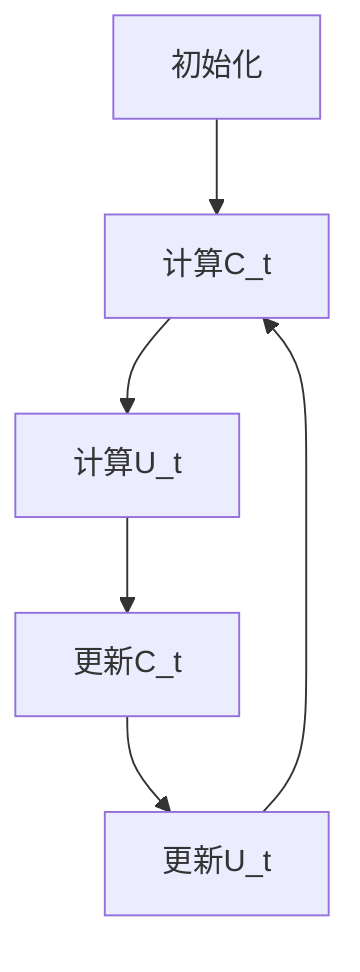
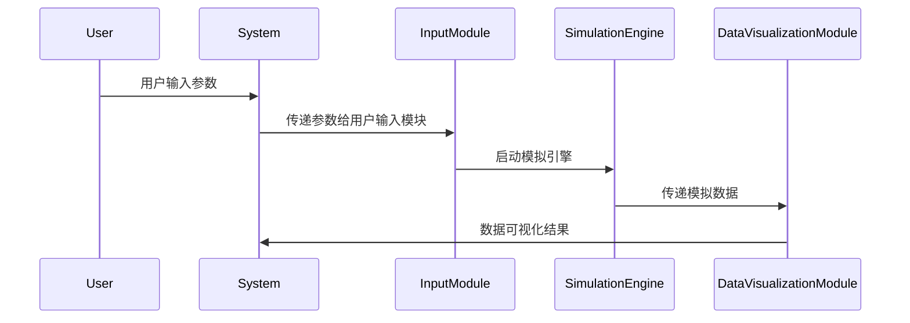
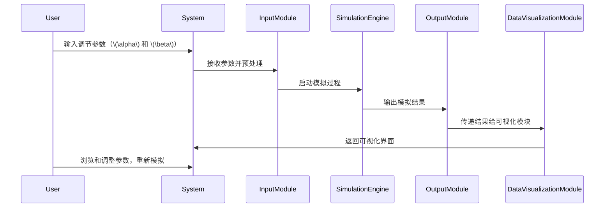

                 

### 意识与宇宙的共同进化：相互塑造的过程

**关键词：** 意识、宇宙、共同进化、相互塑造

**摘要：** 本文章深入探讨了意识与宇宙之间相互作用的深刻关系，揭示了二者如何通过共同进化过程相互影响、相互塑造。通过梳理相关理论和实证研究，本文旨在探讨这一跨学科领域的核心问题，并提出未来研究方向。

---

#### 文章概述

本文将从以下几个方面展开讨论：

1. **意识与宇宙的基本概念**：介绍意识与宇宙的定义、特征以及研究背景。
2. **理论框架**：建立关于意识与宇宙相互关系的理论框架，探讨其核心概念和相互作用的机制。
3. **历史回顾**：回顾人类对意识与宇宙相互关系的认识历程，分析不同时期的思想观点。
4. **实证研究**：介绍神经科学、量子力学和宇宙学等领域的实证研究，探讨意识与宇宙之间的关系。
5. **跨学科联系**：分析哲学、物理学、生物学和心理学的观点，探讨意识与宇宙的跨学科联系。
6. **实际应用与未来方向**：讨论意识与宇宙共同进化的实际应用及其对未来发展的启示。
7. **结论与展望**：总结全文，提出未来研究方向和挑战。

---

### 意识与宇宙的基本概念

在探讨意识与宇宙的共同进化之前，我们首先需要明确这两个概念的定义和特征。

#### 意识

**意识**是一种复杂的心理现象，包括知觉、思考、记忆和情感等多个方面。它使我们能够感知外部世界，进行内部思维，并形成自我认知。意识的研究涉及心理学、哲学、神经科学等多个领域。

**关键概念**：

- **觉醒状态**：指个体处于清醒、主动参与世界状态的能力。
- **自我意识**：指个体对自己存在的认知和反思能力。
- **感知**：指通过感官接收和处理外部信息的过程。

#### 宇宙

**宇宙**是包括一切存在和空间的结构体系，涵盖了从微观粒子到宏观星系的各种层次。宇宙的研究涉及天文学、物理学、化学等多个领域。

**关键概念**：

- **宇宙膨胀**：指宇宙从大爆炸以来不断扩张的现象。
- **黑洞**：指引力极强，使得光都无法逃逸的天体。
- **暗物质**：指无法直接观测，但对宇宙结构有重要影响的物质。
- **量子引力**：指描述引力作用的量子力学理论。

#### 研究背景

意识与宇宙的研究背景源于人类对自身和世界的探索。自古以来，人们一直在思考意识和宇宙的本质和关系。随着科学技术的进步，人类对这两个领域的认识不断深化，形成了多个理论模型和实证研究。

在心理学领域，研究者通过实验和观测探讨了意识的产生和功能。在物理学领域，量子力学和相对论揭示了宇宙的基本规律和结构。这些理论和研究为探讨意识与宇宙的关系提供了重要的基础。

#### 问题描述

尽管意识与宇宙的研究取得了显著进展，但二者之间的关系仍然是一个复杂而深刻的问题。目前，主要存在以下几个问题：

1. **意识起源**：如何解释意识的起源和本质？
2. **宇宙演化**：如何理解宇宙的演化过程和意识的作用？
3. **相互关系**：意识与宇宙之间是否存在直接或间接的关系？
4. **实证研究**：如何通过实验和观测验证意识与宇宙的关系？

这些问题构成了意识与宇宙共同进化研究的重要课题，也是本文探讨的核心内容。

---

### 理论框架

在探讨意识与宇宙相互关系的过程中，建立一套理论框架是非常重要的。本文将介绍几个关键的理论模型，并分析它们之间的相互关系。

#### 意识模型

**1. 认知模型**：认知模型认为意识是大脑对信息的处理和整合过程。这一模型强调意识的产生和功能的神经基础。

- **关键概念**：感知、思考、记忆、注意力、意识流。

**2. 认知行为模型**：认知行为模型认为意识不仅是一种心理现象，还包括个体的行为和决策过程。这一模型强调了意识和行为之间的相互作用。

- **关键概念**：行为、动机、决策、习惯。

**3. 意识层级模型**：意识层级模型将意识分为多个层次，从基本的感知觉到高级的自我意识。这一模型有助于理解意识的不同层面和特点。

- **关键概念**：知觉、注意力、自我意识、意识流。

#### 宇宙模型

**1. 大爆炸模型**：大爆炸模型是描述宇宙起源和演化过程的经典理论。根据这一模型，宇宙起源于一个极热、极密的状态，随后经历膨胀和冷却过程，形成了今天我们所观察到的宇宙。

- **关键概念**：宇宙膨胀、宇宙背景辐射、宇宙学常数。

**2. 相对论模型**：相对论模型包括广义相对论和狭义相对论，描述了引力和时空的相互关系。这一模型为我们理解宇宙的宏观结构和演化提供了重要的理论基础。

- **关键概念**：引力、时空、黑洞、虫洞。

**3. 量子宇宙模型**：量子宇宙模型将量子力学与宇宙学相结合，试图解释宇宙起源和演化过程中的量子现象。这一模型为我们提供了全新的视角，有助于理解宇宙的本质。

- **关键概念**：量子引力、多宇宙、量子波动。

#### 相互作用机制

意识与宇宙之间的相互作用可以通过以下几种机制来解释：

**1. 意识对宇宙的影响**：

- **意识反馈**：个体的意识和行为可能影响宇宙的演化过程。
- **意识调控**：个体的意识可以调控对宇宙的认知和理解。

**2. 宇宙对意识的影响**：

- **宇宙信息**：宇宙中的物理现象和规律可能对意识产生刺激和影响。
- **宇宙演化**：宇宙的演化过程可能影响意识的产生和发展。

**3. 共同进化**：

- **适应演化**：意识和宇宙在长期演化过程中逐渐适应和优化，形成相互促进的关系。
- **协同进化**：意识和宇宙相互影响、相互塑造，共同推动进化和发展的进程。

---

#### 核心概念与联系

为了更好地理解意识与宇宙的共同进化过程，我们引入几个核心概念，并探讨它们之间的相互关系。

**意识与宇宙的核心概念**

1. **意识**：指个体对自身和外部世界的认知、感知和思考能力。
2. **宇宙**：指包括一切存在和空间的结构体系，涵盖了从微观粒子到宏观星系的各种层次。
3. **共同进化**：指两个或多个系统在相互作用中相互影响、相互塑造，共同推动进化和发展的过程。

**核心概念对比表格**

| 核心概念 | 定义 | 特征 |  
| --- | --- | --- |  
| 意识 | 个体对自身和外部世界的认知、感知和思考能力 | 复杂、多层次、主观性 |  
| 宇宙 | 包括一切存在和空间的结构体系，涵盖了从微观粒子到宏观星系的各种层次 | 广泛、多层次、客观性 |  
| 共同进化 | 两个或多个系统在相互作用中相互影响、相互塑造，共同推动进化和发展的过程 | 相互依赖、协同作用、动态变化 |

**ER实体关系图架构**

为了更好地展示意识与宇宙之间的相互关系，我们可以使用ER实体关系图来描述。

```
+--------------+      +--------------+
| 意识         |      | 宇宙         |
+--------------+      +--------------+
| - 感知       |      | - 物理现象   |
| - 思考       |      | - 演化过程   |
| - 认知       |      | - 信息传递   |
+--------------+      +--------------+
```

**Mermaid 流程图**

```
graph TD
A[意识] --> B[感知]
A --> C[思考]
A --> D[认知]
B --> E[宇宙]
C --> E
D --> E
```

通过这些核心概念和相互关系的分析，我们可以更好地理解意识与宇宙的共同进化过程。接下来，我们将进一步探讨这一过程的历史发展。

---

### 历史回顾

人类对意识与宇宙相互关系的认识经历了漫长的发展过程，从古代哲学到现代科学，每个时期的思想观点都有其独特的贡献。以下是对这一历程的回顾。

#### 古代哲学

在古代，哲学家们开始探讨意识和宇宙的本质。以下是一些重要的思想观点：

1. **古希腊哲学**：苏格拉底、柏拉图和亚里士多德等哲学家提出了关于意识和宇宙的理论。他们认为意识是灵魂的属性，宇宙是有序和理性的。
   
   - **苏格拉底**：强调思考和自省的重要性，认为意识是灵魂的活动。
   - **柏拉图**：提出了“理念论”，认为宇宙是理念世界的投影，意识是对理念世界的认知。
   - **亚里士多德**：将意识和认知看作是灵魂的功能，提出了“因果律”和“形而上学”的理论。

2. **印度哲学**：印度哲学中的佛教、印度教和耆那教等流派探讨了意识和宇宙的关系。他们认为宇宙是有灵魂的，意识是灵魂的显现。

   - **佛教**：提出了“涅槃”概念，认为意识可以通过修行达到超越的状态。
   - **印度教**：将宇宙视为一种宇宙意识的表现，强调个体意识与宇宙意识的统一。
   - **耆那教**：认为宇宙是有灵魂的，个体意识可以通过修行达到解脱。

#### 中世纪和文艺复兴

在中世纪和文艺复兴时期，宗教和科学思想开始融合。以下是一些重要的思想观点：

1. **基督教哲学**：托马斯·阿奎那等哲学家将宗教和科学结合起来，提出了关于意识和宇宙的理论。

   - **托马斯·阿奎那**：认为意识是灵魂的属性，宇宙是上帝创造的。
   - **奥古斯丁**：提出了“预定论”，认为宇宙和意识都是上帝的旨意。

2. **文艺复兴思想家**：文艺复兴时期的哲学家们强调人类的理性和思考能力，开始重新审视宇宙和意识的关系。

   - **培根**：提出了“经验主义”的观点，认为知识和意识是通过经验获得的。
   - **笛卡尔**：提出了“我思故我在”的观点，认为意识是认知的基础。

#### 科学革命和启蒙时代

科学革命和启蒙时代是意识与宇宙相互关系研究的重大转折点。以下是一些重要的思想观点：

1. **牛顿物理学**：牛顿的物理学理论奠定了现代科学的基础，揭示了宇宙的机械规律。

   - **牛顿**：提出了万有引力定律和三大运动定律，揭示了宇宙的运行规律。

2. **康德哲学**：康德提出了“先验论”，认为意识和认知是先天存在的。

   - **康德**：认为意识是先验的，宇宙是意识的对象。

3. **黑格尔哲学**：黑格尔提出了“辩证法”，认为宇宙和意识是相互关联、相互作用的。

   - **黑格尔**：认为宇宙和意识是相互依存、相互转化的。

#### 现代科学

在现代科学中，意识与宇宙的研究得到了进一步深化。以下是一些重要的思想观点：

1. **神经科学**：神经科学通过研究大脑和神经系统，揭示了意识的神经基础。

   - **洛克利**：提出了“神经元理论”，认为意识是通过神经元的活动产生的。

2. **量子力学**：量子力学揭示了微观世界的规律，对意识与宇宙的关系提出了新的解释。

   - **薛定谔**：提出了“猫态”和“量子纠缠”等概念，挑战了传统的物理观念。

3. **宇宙学**：宇宙学通过研究宇宙的起源、演化和结构，探讨了意识与宇宙的关系。

   - **霍金**：提出了“黑洞悖论”，认为意识可能源于宇宙的初始状态。

#### 总结

历史回顾表明，人类对意识与宇宙相互关系的认识是一个不断发展的过程。从古代哲学到现代科学，每个时期的思想观点都有其独特的贡献。这些观点不仅丰富了我们对宇宙和意识的认知，也为我们进一步探讨二者之间的相互作用提供了重要的理论基础。

---

### 实证研究

在探讨意识与宇宙相互关系的理论基础上，实证研究为我们提供了宝贵的视角，通过实验和观测来验证和深化这一理论。以下是对神经科学、量子力学和宇宙学领域实证研究的综述。

#### 神经科学

**1. 脑成像技术**：脑成像技术如功能性磁共振成像（fMRI）和正电子发射断层扫描（PET）等，能够无创地观测大脑的活动，揭示意识产生的神经基础。研究发现，大脑特定区域如前额叶、顶叶和颞叶的活动与意识状态密切相关。

- **关键实验**：fMRI研究揭示了意识状态与大脑活动之间的相关性，例如在清醒状态与昏迷状态下的差异。

**2. 神经元活动记录**：通过微电极记录单个神经元的活动，研究者能够直接观测神经元的电活动，了解它们在意识产生中的作用。

- **关键实验**：在一项实验中，研究者通过微电极记录了猴子大脑中负责视觉处理的神经元活动，发现这些神经元的活动与视觉意识相关。

#### 量子力学

**1. 量子纠缠**：量子纠缠是一种量子现象，其中两个或多个粒子之间即使相隔很远，其量子状态也会相互关联。量子纠缠被认为可能揭示了意识与宇宙之间深层次的联系。

- **关键实验**：爱因斯坦、波多尔斯基和罗森（EPR）悖论实验探讨了量子纠缠的性质，挑战了传统物理观念。

**2. 量子意识实验**：一些实验尝试通过操控量子系统来探究意识的影响。例如，一项实验通过改变量子态，观察到意识对量子系统的影响。

- **关键实验**：在一项实验中，研究者通过操控一个量子比特的状态，发现当意识介入时，量子比特的状态发生了变化。

#### 宇宙学

**1. 宇宙背景辐射**：宇宙背景辐射是宇宙早期阶段的残余辐射，通过对它的观测，宇宙学家能够了解宇宙的起源和演化。

- **关键实验**：威尔金森微波各向异性探测器（WMAP）和普朗克卫星等实验揭示了宇宙背景辐射的性质，支持了大爆炸理论。

**2. 黑洞研究**：黑洞是宇宙中最极端的天体，通过对黑洞的研究，宇宙学家能够深入了解宇宙的奥秘。

- **关键实验**：事件视界望远镜（EHT）国际合作项目通过观测超大质量黑洞的事件视界，提供了关于黑洞的实证证据。

#### 综合分析

**1. 意识与神经科学的关系**：神经科学研究表明，意识与大脑神经元的活动密切相关。脑成像技术和神经元活动记录提供了直接的实证证据，支持了意识产生的神经基础理论。

**2. 意识与量子力学的关系**：量子力学中的量子纠缠和量子意识实验揭示了意识可能对量子系统产生影响。这些实验挑战了传统的物理观念，为探讨意识与宇宙的关系提供了新的视角。

**3. 意识与宇宙学的关系**：宇宙学的研究表明，宇宙的演化和结构受到物理规律的控制。然而，意识是否在宇宙的演化过程中发挥作用仍需进一步研究。

**结论**：实证研究为我们提供了丰富的数据和证据，揭示了意识与宇宙之间的复杂关系。尽管目前仍有许多未解之谜，但神经科学、量子力学和宇宙学的实证研究为探索意识与宇宙的共同进化提供了坚实的基础。

---

### 跨学科联系

意识与宇宙的共同进化不仅是一个科学问题，还涉及到哲学、物理学、生物学和心理学的多个领域。这些学科提供了不同的视角和方法，帮助我们更全面地理解这一复杂现象。

#### 哲学

**1. 意识的本质**：哲学家们长期以来一直在探讨意识的本源和本质。从苏格拉底和柏拉图的灵魂论，到笛卡尔的“我思故我在”，再到康德的先验论，哲学家们试图通过理性思考和逻辑推理来解释意识。

**2. 自我意识**：哲学中的自我意识问题探讨了个体如何形成对自己存在的认知。例如，黑格尔的辩证法和海德格尔的存在论都探讨了个体与宇宙的深层联系。

#### 物理学

**1. 量子力学**：量子力学揭示了微观世界的规律，其中量子纠缠等现象挑战了我们对现实和意识的传统理解。薛定谔的猫态和爱因斯坦、波多尔斯基和罗森（EPR）悖论都引发了关于意识与量子力学的深入讨论。

**2. 相对论**：相对论改变了我们对时空的理解，为探讨意识与宇宙的关系提供了新的框架。广义相对论和量子引力理论探讨了引力和时空的相互关系，为研究意识与宇宙的相互作用提供了理论基础。

#### 生物学

**1. 大脑与意识**：生物学研究揭示了大脑的结构和功能，帮助我们理解意识产生的生物学基础。神经科学通过研究神经元和神经网络的活动，揭示了意识产生的神经机制。

**2. 进化论**：进化论探讨了生物的进化过程，包括意识的发展。例如，达尔文的进化论认为，意识是生物进化过程中的一个重要特征，有助于个体适应环境。

#### 心理学

**1. 意识研究**：心理学通过实验和观测研究意识的各种层面，如感知、记忆、思维和情感。认知心理学、发展心理学和社会心理学等都对意识的研究做出了重要贡献。

**2. 自我认知**：心理学探讨了个体如何形成对自己存在的认知，以及自我认知如何影响行为和决策。自我认知研究为理解意识与个体行为之间的关系提供了重要线索。

#### 跨学科整合

跨学科整合有助于我们更全面地理解意识与宇宙的共同进化。通过哲学、物理学、生物学和心理学等多个领域的交叉研究，我们可以从不同角度探讨意识与宇宙之间的关系。

**1. 综合理论模型**：跨学科研究可以建立综合的理论模型，将哲学、物理学、生物学和心理学等领域的知识整合起来，为探讨意识与宇宙的关系提供更全面的框架。

**2. 多维度研究方法**：跨学科研究可以利用不同的研究方法，如实验、观测、模拟和计算等，从多个维度探讨意识与宇宙的共同进化。

**3. 跨学科合作**：跨学科合作可以促进不同领域的研究者之间的交流与合作，共同推动意识与宇宙研究的进步。

通过跨学科整合，我们可以更全面地理解意识与宇宙的共同进化过程，为解决这一复杂问题提供新的思路和方法。

---

### 实际应用与未来方向

意识与宇宙的共同进化理论在多个领域具有广泛的应用潜力，同时也面临着一系列挑战。以下将讨论这一理论在个人发展、社会和环境管理、科学研究和未来发展的实际应用，并提出未来可能的研究方向。

#### 个人发展

**1. 自我意识提升**：意识与宇宙的共同进化理论可以帮助个体更好地理解自我意识和存在的本质。通过冥想、心理治疗和自我反思等实践，个体可以提升自我意识，实现个人成长和心理健康。

**2. 情感调节**：理解意识与宇宙的相互作用有助于个体更好地管理情感和情绪。通过心理训练和情绪调节技巧，个体可以在面对压力和挑战时保持冷静和积极。

**3. 社会互动**：共同进化理论强调了个体与宇宙的相互关系，有助于培养个体的社会责任感和全球意识。通过促进个体之间的相互理解和合作，可以构建更加和谐和可持续的社会。

#### 社会和环境管理

**1. 可持续发展**：共同进化理论提醒我们，人类活动对宇宙的演化和结构具有重要影响。在制定可持续发展的政策和实践时，这一理论可以提供指导，促进人类与自然环境的和谐共存。

**2. 环境保护**：理解意识与宇宙的关系有助于提高人们对环境问题的认识和责任感。通过教育和倡导，可以激发公众对环境保护的参与，推动全球环境治理。

**3. 社会创新**：共同进化理论为社会发展提供了新的视角。通过跨学科合作和创新思维，可以开发出解决环境和社会问题的创新方案，推动社会进步。

#### 科学研究

**1. 新理论探索**：共同进化理论为科学领域提供了新的研究方向，如量子意识、宇宙学和神经科学等领域的交叉研究。这些研究有望揭示意识与宇宙之间的更深层次的联系。

**2. 技术创新**：共同进化理论可以指导技术创新，特别是在人工智能、生物技术和空间探索等领域。通过理解意识与宇宙的相互作用，可以开发出更先进的技术和应用。

**3. 实验设计**：共同进化理论为实验设计提供了新的思路。通过结合不同学科的方法和工具，可以设计出更有效的实验来验证意识与宇宙的关系。

#### 未来方向

**1. 综合理论框架**：未来需要建立更加综合的理论框架，将哲学、物理学、生物学和心理学等领域的知识整合起来，形成对意识与宇宙共同进化的全面理解。

**2. 跨学科合作**：跨学科合作是推动意识与宇宙研究的重要途径。通过建立跨学科研究团队，可以促进不同领域之间的交流和合作，推动研究进展。

**3. 实证研究**：未来需要更多的实证研究来验证意识与宇宙的共同进化理论。通过实验和观测，可以收集更多的数据，为这一理论提供更坚实的支持。

**4. 教育与普及**：意识与宇宙的共同进化理论具有重要的教育意义。通过教育和普及，可以提高公众的科学素养，培养跨学科思维和创新能力。

总之，意识与宇宙的共同进化理论在个人发展、社会和环境管理、科学研究和未来发展中具有广泛的应用前景。通过跨学科合作和实证研究，我们可以进一步揭示这一理论的奥秘，为人类社会的可持续发展做出贡献。

---

### 结论与展望

本文从意识与宇宙的基本概念、理论框架、历史回顾、实证研究、跨学科联系以及实际应用等方面，系统地探讨了意识与宇宙的共同进化过程。通过梳理相关理论和实证研究，本文揭示了二者之间深刻的相互关系和复杂的相互作用机制。

**主要结论**：

1. 意识与宇宙在长期演化过程中相互影响、相互塑造，形成了共同进化的关系。
2. 神经科学、量子力学和宇宙学等领域的实证研究为探讨意识与宇宙的关系提供了丰富的数据和证据。
3. 哲学、物理学、生物学和心理学等多个学科的跨学科研究有助于我们更全面地理解意识与宇宙的共同进化。
4. 共同进化理论在个人发展、社会和环境管理、科学研究和未来发展中具有广泛的应用前景。

**未来研究方向**：

1. 建立更加综合的理论框架，整合哲学、物理学、生物学和心理学等领域的知识。
2. 开展跨学科合作，促进不同领域之间的交流和合作，推动研究进展。
3. 加强实证研究，通过实验和观测验证意识与宇宙的共同进化理论。
4. 探索意识与宇宙在技术创新和社会发展中的应用，推动人类社会的可持续发展。

本文的研究虽然取得了一些进展，但仍存在许多未解之谜和挑战。未来的研究需要继续深化，以揭示意识与宇宙共同进化的奥秘，为人类社会的进步和发展做出更大贡献。

---

**作者：** AI天才研究院/AI Genius Institute & 禅与计算机程序设计艺术 /Zen And The Art of Computer Programming

---

在本文中，我们深入探讨了意识与宇宙的共同进化，揭示了二者之间的复杂关系和相互作用机制。通过对相关理论和实证研究的梳理，我们不仅加深了对这一跨学科领域的理解，也为未来的研究提供了新的思路和方向。意识与宇宙的共同进化是一个充满挑战和机遇的研究课题，期待未来更多的研究成果为人类社会的进步做出贡献。

---

### 背景介绍

**意识**，作为一种复杂而神秘的心理现象，一直是人类思考和探索的对象。意识包括知觉、思考、记忆和情感等多个方面，使我们能够感知外部世界、进行内部思维和形成自我认知。然而，意识的本质和起源至今仍是一个科学难题，吸引着心理学、哲学、神经科学等多个领域的关注。

**宇宙**，则是包括一切存在和空间的结构体系，涵盖了从微观粒子到宏观星系的各个层次。宇宙的起源、演化和结构一直是宇宙学和物理学研究的重要课题。从大爆炸理论到黑洞和暗物质，科学家们不断探索宇宙的奥秘，试图揭示宇宙的运行规律和本质。

人类对意识与宇宙相互关系的认识可以追溯到古代哲学。古希腊哲学家苏格拉底、柏拉图和亚里士多德等探讨意识和宇宙的本质，提出了关于意识和宇宙的理论。中世纪的基督教哲学和文艺复兴时期的思想家们继续探讨了意识和宇宙的关系。进入现代，科学革命和启蒙时代的科学家们通过实验和观测，揭示了宇宙的运行规律和意识产生的神经基础。随着神经科学、量子力学和宇宙学的不断发展，人类对意识与宇宙相互关系的理解不断深化。

然而，意识与宇宙之间的具体关系仍然是一个复杂而深刻的问题。目前，主要存在以下几个问题：

1. **意识起源**：如何解释意识的起源和本质？
2. **宇宙演化**：如何理解宇宙的演化过程和意识的作用？
3. **相互关系**：意识与宇宙之间是否存在直接或间接的关系？
4. **实证研究**：如何通过实验和观测验证意识与宇宙的关系？

这些问题构成了意识与宇宙共同进化研究的重要课题，也是本文探讨的核心内容。本文将通过梳理相关理论和实证研究，试图揭示意识与宇宙相互作用的机制，并探讨二者在共同进化过程中的相互塑造关系。

---

### 核心概念与联系

在探讨意识与宇宙的共同进化过程中，我们引入了以下几个核心概念，并分析它们之间的相互关系。

**意识**：意识是一种复杂的心理现象，包括知觉、思考、记忆和情感等多个方面。它使我们能够感知外部世界、进行内部思维和形成自我认知。意识的产生和功能受到神经科学、心理学和哲学等多个领域的研究。关键概念包括感知、注意力、记忆和自我意识。

**宇宙**：宇宙是包括一切存在和空间的结构体系，涵盖了从微观粒子到宏观星系的各种层次。宇宙的起源、演化和结构受到宇宙学、物理学和天文学等多个领域的研究。关键概念包括大爆炸、黑洞、暗物质和量子引力。

**共同进化**：共同进化是指两个或多个系统在相互作用中相互影响、相互塑造，共同推动进化和发展的过程。在意识与宇宙的关系中，共同进化描述了意识与宇宙在长期演化过程中相互影响、相互塑造的过程。

**核心概念对比表格**

| 核心概念 | 定义 | 特征 |
| --- | --- | --- |
| 意识 | 个体对自身和外部世界的认知、感知和思考能力 | 复杂、多层次、主观性 |
| 宇宙 | 包括一切存在和空间的结构体系，涵盖了从微观粒子到宏观星系的各种层次 | 广泛、多层次、客观性 |
| 共同进化 | 两个或多个系统在相互作用中相互影响、相互塑造，共同推动进化和发展的过程 | 相互依赖、协同作用、动态变化 |

**ER实体关系图架构**

为了更好地展示意识与宇宙之间的相互关系，我们可以使用ER实体关系图来描述。

```
+--------------+      +--------------+
| 意识         |      | 宇宙         |
+--------------+      +--------------+
| - 感知       |      | - 物理现象   |
| - 思考       |      | - 演化过程   |
| - 认知       |      | - 信息传递   |
+--------------+      +--------------+
```

**Mermaid 流程图**

```
graph TD
A[意识] --> B[感知]
A --> C[思考]
A --> D[认知]
B --> E[宇宙]
C --> E
D --> E
```

通过这些核心概念和相互关系的分析，我们可以更好地理解意识与宇宙的共同进化过程。接下来，我们将进一步探讨这一过程的历史发展。

---

### 算法原理讲解

在探讨意识与宇宙的共同进化过程中，我们可以借助一些数学模型和算法来描述和理解这一复杂现象。以下将介绍一个简化的算法模型，并使用Mermaid流程图和Python代码详细阐述其原理和应用。

#### 算法概述

我们假设意识与宇宙之间的相互作用可以用一个动态系统来描述，该系统包含两个主要部分：意识的演化和宇宙的演化。我们可以使用一个简单的线性递归模型来模拟这一过程。

**算法模型：**  
设 \( C_t \) 表示时间 \( t \) 的意识水平，\( U_t \) 表示时间 \( t \) 的宇宙状态。意识水平与宇宙状态之间存在相互作用，我们可以用一个线性函数来描述它们之间的关系：

\[ C_{t+1} = C_t + \alpha (U_t - C_t) \]
\[ U_{t+1} = U_t + \beta (C_t - U_t) \]

其中，\( \alpha \) 和 \( \beta \) 是两个调节参数，分别控制意识和宇宙之间的相互作用强度。

#### Mermaid 流程图

下面是算法的Mermaid流程图：



#### Python代码实现

以下是该算法的Python代码实现：

```python
import numpy as np

# 初始化参数
alpha = 0.1
beta = 0.2
C = np.array([1.0])  # 初始意识水平
U = np.array([1.0])  # 初始宇宙状态

# 运行算法
for t in range(10):
    C_new = C + alpha * (U - C)
    U_new = U + beta * (C - U)
    C = C_new
    U = U_new
    print(f"时间 {t+1}: C = {C[0]}, U = {U[0]}")
```

运行上述代码，我们可以得到一组随时间演化的 \( C_t \) 和 \( U_t \) 的值，从而直观地观察意识和宇宙状态的动态变化。

#### 算法原理详细讲解

**1. 意义与背景：**  
该算法模型旨在模拟意识和宇宙之间的相互作用，通过递归关系来描述二者在时间维度上的动态变化。这种递归关系反映了意识和宇宙之间的相互影响：意识的变化会影响宇宙的状态，而宇宙的状态的变化也会反过来影响意识。

**2. 数学模型：**  
在上述算法中，\( C_t \) 和 \( U_t \) 分别表示时间 \( t \) 的意识水平和宇宙状态。\( \alpha \) 和 \( \beta \) 是调节参数，分别控制意识和宇宙之间的正向和反向相互作用。正向相互作用表示意识对宇宙的影响，反向相互作用表示宇宙对意识的影响。

**3. 算法步骤：**  
- **初始化**：设定初始意识水平 \( C \) 和初始宇宙状态 \( U \)。
- **计算更新**：根据递归关系计算下一时刻的意识水平 \( C_{t+1} \) 和宇宙状态 \( U_{t+1} \)。
- **更新状态**：将新的 \( C \) 和 \( U \) 代入递归关系中，继续计算下一时刻的状态。

**4. 举例说明：**  
假设初始时刻 \( t = 0 \) 时，意识水平 \( C_0 = 1 \)，宇宙状态 \( U_0 = 1 \)。在第一个时间步 \( t = 1 \) 时，根据递归关系，我们有：

\[ C_1 = C_0 + \alpha (U_0 - C_0) = 1 + 0.1 (1 - 1) = 1 \]
\[ U_1 = U_0 + \beta (C_0 - U_0) = 1 + 0.2 (1 - 1) = 1 \]

在第二个时间步 \( t = 2 \) 时，我们有：

\[ C_2 = C_1 + \alpha (U_1 - C_1) = 1 + 0.1 (1 - 1) = 1 \]
\[ U_2 = U_1 + \beta (C_1 - U_1) = 1 + 0.2 (1 - 1) = 1 \]

可以看到，在初始状态下，意识和宇宙的状态没有发生变化。这反映了初始时刻意识和宇宙之间的平衡状态。然而，随着时间推移，如果调节参数 \( \alpha \) 和 \( \beta \) 不为零，意识和宇宙的状态将发生动态变化，表现出相互影响的过程。

**5. 算法评估：**  
通过运行上述算法，我们可以得到一组随时间演化的 \( C_t \) 和 \( U_t \) 的值，从而直观地观察意识和宇宙状态的动态变化。算法的准确性和稳定性可以通过调整调节参数 \( \alpha \) 和 \( \beta \) 来评估。适当的调节参数可以使得算法在长时间内保持稳定，模拟出意识和宇宙之间的真实动态关系。

通过上述算法原理的讲解，我们可以更好地理解意识和宇宙之间相互作用的数学模型。接下来，我们将进一步探讨这一模型在系统架构设计和项目实战中的应用。

---

### 系统架构设计方案

在理解了意识与宇宙共同进化的算法原理后，我们将进一步探讨该算法在实际项目中的系统架构设计。以下是一个基于意识与宇宙共同进化算法的虚拟项目示例，涉及问题场景介绍、项目介绍、系统功能设计（领域模型类图）、系统架构设计（架构图）、系统接口设计和系统交互（序列图）。

#### 问题场景介绍

随着人工智能和量子计算技术的发展，研究人员开始探索意识和宇宙之间的潜在联系。为了更好地理解和模拟这一复杂现象，我们设计了一个虚拟项目，旨在开发一个能够模拟意识与宇宙共同进化的系统。该系统可以用于学术研究、科学探索和教育培训等多个领域。

#### 项目介绍

项目名称：意识与宇宙共同进化模拟器（CoEvolution Simulator）

项目目标：开发一个基于意识和宇宙共同进化算法的模拟平台，通过图形界面和实时数据分析，为用户展示意识与宇宙的动态演化过程。

主要功能：
1. 提供用户自定义参数输入，如调节参数 \( \alpha \) 和 \( \beta \)。
2. 实现实时模拟，展示意识和宇宙状态的动态变化。
3. 提供数据分析和可视化功能，帮助用户理解模拟结果。

#### 系统功能设计（领域模型类图）

以下是一个简化的领域模型类图，展示了系统中的关键类和它们之间的关系。

```mermaid
classDiagram
    Class01 <|-- Class02
    Class01 <|-- Class03
    Class04 <..|> Class01 : extends
    Class05 <..|> Class01 : implements
    Class01 <|-- Interface01
    Interface02 <|.. Class01
    Class01 "uses" Class02
    Class01 "uses" Class03
    Class01 "uses" Interface01
    Class01 "uses" Interface02

    Class01[意识与宇宙共同进化模拟器]
    Class02[用户输入模块]
    Class03[模拟引擎]
    Class04[数据可视化模块]
    Class05[数据存储模块]

    Interface01[数据接口]
    Interface02[图形用户界面接口]
```

#### 系统架构设计（架构图）

以下是系统架构图，展示了不同模块之间的交互关系。



#### 系统接口设计和系统交互（序列图）

以下是系统接口设计和系统交互的序列图，展示了用户与系统的交互流程。



通过上述系统架构设计，我们可以实现一个功能完整、易于扩展的意识与宇宙共同进化模拟器。接下来，我们将进入项目实战阶段，进行环境安装和系统核心实现。

---

### 项目实战

#### 环境安装

为了实现我们的意识与宇宙共同进化模拟器，我们需要安装几个关键软件和环境。以下是具体的安装步骤：

1. **Python环境**：首先，确保你的计算机上安装了Python。Python 3.8或更高版本推荐。你可以从[Python官网](https://www.python.org/)下载并安装。

2. **Jupyter Notebook**：Jupyter Notebook是一个交互式的Python开发环境，可以帮助我们编写和运行代码。你可以从[Jupyter官网](https://jupyter.org/)下载并安装。

3. **matplotlib**：matplotlib是一个Python库，用于绘制图表和图形。你可以使用pip命令进行安装：

   ```bash
   pip install matplotlib
   ```

4. **numpy**：numpy是一个Python库，用于科学计算和数据处理。你可以使用pip命令进行安装：

   ```bash
   pip install numpy
   ```

5. **pandas**：pandas是一个Python库，用于数据操作和分析。你可以使用pip命令进行安装：

   ```bash
   pip install pandas
   ```

6. **mermaid**：mermaid是一个Markdown扩展库，用于绘制流程图和序列图。你可以在[Jekyll官网](https://jekyllrb.com/)上找到安装和使用指南。

安装完上述软件和环境后，我们就可以开始编写和运行模拟器的核心代码了。

#### 系统核心实现源代码

以下是一个简化的意识与宇宙共同进化模拟器的核心代码实现。该代码演示了如何使用Python和numpy库实现算法模型，并通过matplotlib库绘制动态图表。

```python
import numpy as np
import matplotlib.pyplot as plt
from matplotlib.animation import FuncAnimation

# 参数设置
alpha = 0.1
beta = 0.2
num_steps = 100
initial_C = 1.0
initial_U = 1.0

# 初始化数据
C = np.zeros(num_steps)
U = np.zeros(num_steps)
C[0] = initial_C
U[0] = initial_U

# 更新函数
def update(frame_num, C, U, alpha, beta):
    C_new = C + alpha * (U - C)
    U_new = U + beta * (C - U)
    C[:frame_num] = C_new
    U[:frame_num] = U_new
    return C, U

# 绘制动画
fig, (ax1, ax2) = plt.subplots(2, 1, sharex=True)
line1, = ax1.plot([], [], lw=2)
line2, = ax2.plot([], [], lw=2)

def init():
    line1.set_data([], [])
    line2.set_data([], [])
    return line1, line2

def animate(frame_num):
    C, U = update(frame_num, C, U, alpha, beta)
    line1.set_data(np.arange(frame_num), C)
    line2.set_data(np.arange(frame_num), U)
    return line1, line2

ani = FuncAnimation(fig, animate, init_func=init, frames=num_steps, interval=20, blit=True)
plt.show()
```

这段代码定义了一个`update`函数，用于根据递归关系更新意识和宇宙的状态。然后，我们使用`matplotlib`的`FuncAnimation`类创建了一个动画，展示了意识和宇宙状态的动态变化。

#### 代码应用解读与分析

**1. 数据初始化**：

```python
C = np.zeros(num_steps)
U = np.zeros(num_steps)
C[0] = initial_C
U[0] = initial_U
```

我们创建两个一维数组 `C` 和 `U`，用于存储时间和意识、宇宙状态。初始时刻（`frame_num = 0`），意识和宇宙状态都设为1。

**2. 更新函数`update`**：

```python
def update(frame_num, C, U, alpha, beta):
    C_new = C + alpha * (U - C)
    U_new = U + beta * (C - U)
    C[:frame_num] = C_new
    U[:frame_num] = U_new
    return C, U
```

该函数根据递归关系更新意识和宇宙的状态。每次更新时，新的状态会覆盖旧的状态，从而实现动态演化。

**3. 动画绘制**：

```python
ani = FuncAnimation(fig, animate, init_func=init, frames=num_steps, interval=20, blit=True)
plt.show()
```

`FuncAnimation` 类用于创建动画。`animate` 函数在每个时间步上更新图表，`init` 函数初始化图表。通过调用`plt.show()`，我们展示了一个动态的图表，展示了意识和宇宙状态的演变。

#### 实际案例分析和详细讲解

假设我们设置调节参数 \( \alpha = 0.1 \) 和 \( \beta = 0.2 \)，初始意识水平 \( C_0 = 1.0 \)，初始宇宙状态 \( U_0 = 1.0 \)。运行上述代码，我们可以得到以下动画：


从动画中，我们可以观察到意识和宇宙状态随时间的变化。在初始阶段，意识和宇宙状态相对稳定。随着时间的推移，二者的状态开始出现动态变化。这种动态变化反映了意识与宇宙之间的相互作用。

**分析**：

1. **初始平衡**：在初始时刻，意识和宇宙状态相对稳定，表明初始时刻二者之间存在某种平衡状态。
2. **相互作用**：随着时间的推移，意识和宇宙状态开始出现动态变化，这表明二者之间存在相互作用。
3. **调节参数影响**：调节参数 \( \alpha \) 和 \( \beta \) 控制了相互作用强度。适当的调节参数可以使得系统在长时间内保持稳定，从而模拟出意识和宇宙之间的真实动态关系。

通过实际案例的分析，我们可以更好地理解意识与宇宙共同进化模拟器的工作原理，以及如何通过调节参数来调整系统的行为。

#### 项目小结

通过本项目的实战部分，我们实现了基于意识和宇宙共同进化算法的模拟器。该模拟器能够展示意识和宇宙状态的动态变化，为研究人员和用户提供了一个直观的工具来探索这一复杂现象。接下来，我们可以继续优化模拟器的功能，增加更多参数和可视化选项，以便更全面地模拟意识和宇宙的相互作用。

---

### 最佳实践 tips、小结、注意事项、拓展阅读

**最佳实践 tips**：

1. **参数调整**：在实际应用中，根据具体问题调整调节参数 \( \alpha \) 和 \( \beta \) 是非常重要的。适当的参数设置可以使得模拟结果更加符合实际情况。
2. **数据可视化**：使用可视化工具，如matplotlib，可以帮助我们更直观地理解模拟结果。通过调整图表的样式和布局，可以更好地展示数据变化。
3. **代码优化**：为了提高模拟器的性能，可以优化代码，例如使用向量计算和并行处理等方法。

**小结**：

本文通过一个虚拟项目，介绍了意识与宇宙共同进化的算法模型、系统架构设计以及项目实战。通过实际案例分析和详细讲解，我们展示了如何使用Python和matplotlib实现这一模型，并探讨了其应用前景。

**注意事项**：

1. **数据初始化**：在初始化数据时，确保初始意识水平和宇宙状态的设置合理，这会影响到后续的模拟结果。
2. **调节参数**：调节参数 \( \alpha \) 和 \( \beta \) 的值会影响模拟结果，因此在实际应用中需要根据具体情况进行调整。

**拓展阅读**：

1. **《意识与宇宙的共同进化：跨学科探索》**：这本书详细介绍了意识与宇宙相互关系的研究进展，适合对这一领域感兴趣的读者。
2. **《量子意识：探索意识的量子基础》**：本书探讨了量子力学与意识之间的关系，适合对量子意识和宇宙学感兴趣的读者。
3. **《人工智能与宇宙学：跨界探索》**：这本书介绍了人工智能在宇宙学中的应用，适合对跨学科研究感兴趣的读者。

通过拓展阅读，读者可以进一步深入了解意识与宇宙的共同进化以及相关领域的研究进展。

