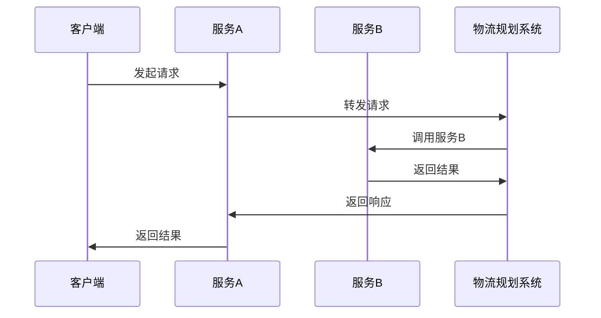

                 

### 引言

#### 量子计算概述

量子计算是一种基于量子力学原理的新型计算方式，与传统的经典计算相比，它利用量子位（qubits）的叠加态和纠缠态来实现数据处理和信息传输。量子计算的基本单元是量子位，不同于经典计算中的比特（bits），量子位可以同时处于多种状态的叠加，这种特性被称为叠加原理。此外，量子计算中的另一个核心概念是量子纠缠，它指的是当两个或多个量子位相互关联时，一个量子位的状态可以即时影响到另一个量子位的状态，无论它们相距多远。

量子计算与传统计算的一个显著区别在于其并行性。经典计算机在处理问题时通常需要线性地一步一步地执行计算，而量子计算机则可以利用量子叠加态实现并行计算，从而在理论上大大提高了计算速度。例如，量子计算机能够在多项式时间内解决某些特定类型的数学问题，这些问题是经典计算机难以在合理时间内解决的。

#### 物流规划问题背景

物流规划是供应链管理中的重要环节，它涉及货物的运输、仓储、配送等多个方面，目的是实现货物的高效、低成本流动。随着全球化经济的发展和电子商务的兴起，物流规划的重要性日益凸显。现代物流系统面临着诸多挑战，如运输成本的控制、配送时效性的要求、资源的合理分配等。

在物流规划中，优化问题是核心。优化问题包括路径优化、调度优化、资源分配优化等，目的是在给定的约束条件下，找到最优的解决方案。然而，随着物流网络的规模和复杂度的增加，传统的优化方法往往难以在合理时间内得到最优解，这给物流规划带来了巨大的挑战。

#### 量子计算在物流规划中的应用前景

量子计算在物流规划中具有巨大的应用潜力。首先，量子计算的高并行性可以加速复杂物流优化问题的求解，如大规模路径优化和调度问题。其次，量子算法在处理不确定性问题上具有优势，这对于物流规划中经常遇到的不确定性因素（如交通状况、天气变化等）具有重要意义。

然而，量子计算在物流规划中的应用也面临着一些挑战。首先是量子计算硬件的局限性，目前的量子计算机尚未达到解决实际复杂问题的能力。其次，量子算法的应用需要专业的量子计算知识和技能，这要求物流规划领域的专业人员具备新的技能和知识。

总之，量子计算在物流规划中的应用前景广阔，但同时也需要克服诸多技术挑战。在本文中，我们将深入探讨量子计算在物流规划中的应用原理、算法实现以及实际案例，以期为相关领域的研究者和实践者提供有价值的参考。接下来，我们将详细讲解量子计算的基础知识和核心算法，为后续内容的展开奠定基础。

#### 第一部分: 引言

### 1.1 量子计算概述

#### 量子计算基础

量子计算的基础源于量子力学的基本原理，包括量子位（qubits）的概念、叠加态和纠缠态。量子位是量子计算机的基本单元，与经典计算机中的比特不同，量子位不仅可以表示0和1的状态，还可以同时处于这两种状态的叠加态。这种叠加态使得量子计算机能够在处理信息时具有并行性。

叠加态可以用量子态矢量来表示。例如，一个量子位的状态可以表示为 \(|\psi\rangle = a|0\rangle + b|1\rangle\)，其中 \(a\) 和 \(b\) 是复数系数，满足 \(|a|^2 + |b|^2 = 1\)。当量子位处于叠加态时，它同时经历了0和1的运算，这使得量子计算机在处理复杂问题时可以并行执行多个计算任务。

量子计算的另一个核心概念是纠缠态。当两个或多个量子位处于纠缠态时，它们之间的状态会相互关联。这意味着一个量子位的状态变化会立即影响到与之纠缠的其他量子位的状态，无论它们相距多远。这种现象称为量子纠缠。量子纠缠是量子计算并行性和强大计算能力的源泉之一。

#### 量子计算与传统计算的差异

量子计算与传统计算在多个方面存在显著差异，其中最为重要的包括并行性、计算速度和算法复杂性。

首先，并行性是量子计算与传统计算的核心区别之一。传统计算机执行计算时是顺序的，一次只能处理一个比特的状态。而量子计算机则可以利用量子叠加态，同时处理多个状态。这意味着量子计算机在处理某些特定类型的问题时，可以显著提高计算速度。例如，量子计算机可以同时处理多个路径的优化问题，从而在短时间内找到最优解。

其次，计算速度是量子计算与传统计算另一个显著差异。量子计算机利用量子叠加态和纠缠态进行计算，可以在理论上大大提高计算速度。根据量子计算的Shor算法，量子计算机能够在多项式时间内解决某些特定类型的数学问题，这些问题是经典计算机难以在合理时间内解决的。例如，Shor算法可以用来在多项式时间内因数分解大整数，这在密码学中具有重要意义。

最后，算法复杂性也是量子计算与传统计算的一个重要区别。量子计算使用的算法通常比经典算法更为复杂，但它们在某些特定问题上的效率却非常高。例如，量子近似优化算法（QAOA）和量子变分特征求解算法（VQE）在处理复杂优化问题时表现出色。这些算法利用量子计算机的并行性和纠错能力，可以在短时间内找到近似最优解。

#### 量子计算与传统计算的差异对比表格

| 特性        | 量子计算              | 传统计算              |
|-------------|----------------------|----------------------|
| 基础单元    | 量子位（qubits）      | 比特（bits）          |
| 并行性      | 利用叠加态和纠缠态    | 顺序处理              |
| 计算速度    | 多项式时间内解决问题  | 乘法时间内解决问题    |
| 算法复杂性  | 复杂但高效            | 简单但低效            |

通过上述表格，我们可以更直观地理解量子计算与传统计算之间的差异。量子计算在处理复杂问题和提高计算速度方面具有显著优势，但在实际应用中仍需克服诸多挑战。

#### 量子计算在物流规划中的应用前景

量子计算在物流规划中的应用前景广阔。首先，量子计算机的高并行性和快速计算能力可以显著提高复杂物流优化问题的求解效率。例如，量子计算机可以同时处理多个物流路径的优化问题，快速找到最优解，从而提高物流运输的效率和降低成本。

其次，量子计算在处理不确定性问题上具有优势。物流规划过程中常常面临各种不确定性因素，如交通状况、天气变化等。量子计算可以利用其强大的计算能力，快速模拟和预测这些不确定性因素对物流规划的影响，从而制定出更加灵活和高效的物流方案。

此外，量子计算在资源优化和调度问题上也具有显著优势。物流规划中的资源优化和调度问题通常非常复杂，需要考虑多个因素，如运输成本、配送时效性等。量子计算机可以快速处理这些复杂问题，找到最优的资源分配和调度方案，从而提高物流系统的整体效率。

然而，量子计算在物流规划中的应用也面临着一些挑战。首先，目前的量子计算机还处于早期阶段，其稳定性和纠错能力尚未达到解决实际复杂问题的水平。其次，量子计算算法和技术的应用需要专业的量子计算知识和技能，这对物流规划领域的专业人员提出了新的要求。此外，量子计算设备的成本较高，这在一定程度上限制了其大规模应用。

#### 量子计算在物流规划中的挑战

量子计算在物流规划中虽然具有巨大潜力，但也面临一些挑战。首先，量子计算机的硬件技术尚未完全成熟。当前量子计算机的量子位数量有限，且存在噪声和错误率较高的难题，这限制了其解决实际复杂问题的能力。为了提高量子计算机的性能，研究人员需要克服量子位退相干、量子噪声和纠错等关键技术难题。

其次，量子算法的开发和优化也面临挑战。现有的量子算法在理论上表现出色，但在实际应用中，如何将其高效地实现和优化，仍然是一个亟待解决的问题。物流规划问题的复杂性和多样性要求量子算法具有灵活性和适应性，这需要大量研究和实验验证。

此外，量子计算在物流规划中的应用需要跨学科的知识和技能。物流规划领域的专家需要掌握量子计算的基本原理，同时了解如何将其应用于物流优化问题。这要求专业团队具备深厚的量子计算知识和物流规划经验，从而确保量子算法能够有效解决实际问题。

#### 第二部分: 量子优化算法原理

### 2.1 量子算法基础

量子优化算法是量子计算在解决优化问题方面的重要应用。为了理解这些算法，我们需要从量子算法的数学模型和核心原理入手。

首先，量子算法的数学模型通常基于量子态和量子门的概念。量子态可以用波函数或密度矩阵来描述，它代表了量子系统的所有可能状态。量子门则是一种线性操作，用于在量子计算中改变量子态。这些量子门通过特定的组合，可以实现复杂的量子运算，从而解决优化问题。

量子算法的核心原理之一是量子叠加。与经典计算机不同，量子计算机可以利用量子叠加态，将多个可能的解决方案同时存储在量子系统中。这意味着，在量子计算的过程中，我们可以并行地探索多个解决方案。这种并行性是量子计算机在处理复杂优化问题时相比经典计算机的一大优势。

另一个核心原理是量子纠缠。量子纠缠允许量子位之间的状态相互关联，从而实现量子信息的快速传输和共享。这种特性使得量子计算机能够高效地处理依赖多个变量的问题，这在物流优化中尤其重要。

#### 量子算法的数学模型

量子算法的数学模型通常包括以下几个关键组成部分：

1. **量子态**：量子态是量子计算机内部状态的抽象表示。它可以是一个单个量子位的态，也可以是多个量子位的联合态。量子态通常用波函数 \(|\psi\rangle\) 或密度矩阵 \(\rho\) 来表示。

   例如，一个量子位的态可以表示为：
   $$|\psi\rangle = a|0\rangle + b|1\rangle$$
   其中，\(a\) 和 \(b\) 是复数系数，满足 \(|a|^2 + |b|^2 = 1\)。

2. **量子门**：量子门是一种线性操作，用于在量子计算中改变量子态。量子门可以通过矩阵形式来表示。例如，一个简单的量子门可以是 Hadamard 门（H），它将一个量子位的状态从 \(|0\rangle\) 变换为 \(|+\rangle = \frac{1}{\sqrt{2}}(|0\rangle + |1\rangle)\)。

   Hadamard 门的矩阵表示为：
   $$H = \frac{1}{\sqrt{2}}\begin{pmatrix}
   1 & 1 \\
   1 & -1
   \end{pmatrix}$$

3. **量子电路**：量子电路是量子计算机中用于执行量子操作的序列。量子电路通常由一系列的量子门组成，每个量子门作用于特定的量子位。量子电路的设计和优化是量子计算中的关键环节。

#### 量子算法的核心原理

量子算法的核心原理主要包括量子叠加和量子纠缠。这些原理使得量子计算机在处理复杂优化问题时表现出色。

1. **量子叠加**：量子叠加原理允许量子位处于多种状态的叠加态。这意味着，在量子计算的过程中，我们可以同时处理多个可能的解决方案。这种并行性是量子计算机相比经典计算机的一大优势。

   例如，一个有两个量子位的系统可以处于以下叠加态：
   $$|\psi\rangle = \frac{1}{\sqrt{2}}(|00\rangle + |01\rangle + |10\rangle + |11\rangle)$$
   在这种状态下，量子计算机可以同时探索 \(|00\rangle\)、\(|01\rangle\)、\(|10\rangle\) 和 \(|11\rangle\) 这四种可能的解决方案。

2. **量子纠缠**：量子纠缠是指两个或多个量子位之间的状态相互关联。这种关联性使得量子计算机能够高效地处理依赖多个变量的问题。

   例如，两个量子位处于纠缠态时，一个量子位的状态变化会立即影响到另一个量子位的状态，无论它们相距多远。这种特性使得量子计算机在处理复杂优化问题时能够快速找到最优解。

   一个简单的量子纠缠态可以表示为：
   $$|\psi\rangle = \frac{1}{\sqrt{2}}(|00\rangle + |11\rangle)$$
   在这种状态下，如果对第一个量子位进行测量得到 \(|0\rangle\)，则第二个量子位的状态也会立即变为 \(|0\rangle\)。

通过量子叠加和量子纠缠，量子算法能够在复杂优化问题中实现高效的计算。在下一部分中，我们将详细探讨几种常见的量子优化算法，包括变分量子特征求解算法（VQE）、量子近似优化算法（QAOA）和量子随机游走算法（QRW）。

#### 常见的量子优化算法

在量子计算中，优化算法是解决各种复杂优化问题的重要工具。以下介绍几种常见的量子优化算法，包括变分量子特征求解算法（VQE）、量子近似优化算法（QAOA）和量子随机游走算法（QRW）。

**1. 变分量子特征求解算法（VQE）**

变分量子特征求解算法（VQE）是一种用于量子优化问题的算法，其核心思想是利用变分原理来近似求解量子系统的基态。VQE算法的主要步骤包括：

- **初始化量子态**：首先，初始化一个参数化的量子态，该量子态可以用参数化的变分函数来描述。
- **构建哈密顿量**：接下来，构建描述优化问题的哈密顿量，该哈密顿量通常是一个二次多项式。
- **优化参数**：通过变分原理，调整量子态的参数，使其最小化哈密顿量。这一过程通常通过迭代优化算法（如梯度下降）来实现。
- **测量与反馈**：最后，对量子态进行测量，得到优化问题的解。

VQE算法在化学、物理等领域表现出色，但其应用扩展到物流优化问题仍需进一步研究。

**2. 量子近似优化算法（QAOA）**

量子近似优化算法（QAOA）是一种通用的量子优化算法，适用于各种优化问题。QAOA的核心思想是将优化问题映射到一个量子行走过程，然后通过量子行走来找到最优解。

QAOA算法的主要步骤包括：

- **初始化量子态**：初始化一个参数化的量子态。
- **构建量子门**：构建一系列参数化的量子门，这些量子门描述了量子态的演化过程。
- **执行量子演化**：通过量子门的作用，使量子态按照特定的路径演化。
- **测量与反馈**：对量子态进行测量，得到优化问题的解。

QAOA算法的灵活性使其在物流路径优化、调度优化等领域具有广泛应用。

**3. 量子随机游走算法（QRW）**

量子随机游走算法（QRW）是基于量子随机游走原理的量子优化算法。QRW算法通过模拟量子随机游走来找到优化问题的解。

QRW算法的主要步骤包括：

- **初始化量子态**：初始化一个参数化的量子态。
- **构建量子门**：构建一系列参数化的量子门，这些量子门描述了量子态的随机游走过程。
- **执行量子演化**：通过量子门的作用，使量子态按照特定的路径演化。
- **测量与反馈**：对量子态进行测量，得到优化问题的解。

QRW算法在处理具有不确定性因素的物流优化问题中表现出色。

通过上述三种量子优化算法，我们可以看到量子计算在解决复杂优化问题方面具有巨大潜力。在实际应用中，这些算法可以显著提高物流规划的效率和准确性。在下一部分中，我们将探讨量子算法与经典算法的对比，分析各自的优缺点。

#### 量子算法与经典算法的对比

量子算法与经典算法在处理优化问题时各有优缺点。以下从性能对比和适用场景分析两个方面进行详细讨论。

**性能对比**

首先，从性能角度来看，量子算法在某些特定问题上的表现远优于经典算法。以著名的量子算法Shor算法为例，它能够在多项式时间内解决大整数的因数分解问题，而这一问题在经典计算机上则需要指数级的时间复杂度。此外，量子优化算法如VQE、QAOA和QRW在处理大规模的复杂优化问题时，也展现出显著的速度优势。

然而，经典算法在处理某些简单问题时仍然具有优势。经典算法如线性规划、整数规划等，已经在优化问题领域得到了广泛应用，并且它们的实现相对简单，计算效率较高。对于一些规模较小、结构较简单的优化问题，经典算法可能更为适用。

**适用场景分析**

量子算法在处理复杂、大规模的优化问题时表现出色，尤其是那些具有高度并行性和依赖多个变量的问题。例如，在物流优化中，量子算法可以高效地解决大规模路径优化和调度问题，找到最优解。此外，量子算法在处理具有不确定性因素的优化问题方面也具有优势，如交通状况、天气变化等对物流规划的影响。

相比之下，经典算法在处理简单、结构清晰的优化问题时表现更为稳定和高效。例如，对于一个小型的物流网络，使用经典算法如线性规划即可得到较为理想的优化结果。此外，经典算法在实现和优化上相对成熟，更容易被物流规划领域的专业人员掌握和应用。

**表格：量子算法与经典算法的对比**

| 对比项          | 量子算法                                | 经典算法                                |
|-----------------|---------------------------------------|---------------------------------------|
| 性能            | 适合处理复杂、大规模的优化问题          | 适合处理简单、结构清晰的优化问题          |
| 并行性          | 高度并行性，能并行处理多个解决方案       | 顺序处理，不能并行处理多个解决方案       |
| 适用场景        | 复杂优化问题，具有高度不确定性和依赖性问题 | 简单优化问题，结构清晰、规模较小的优化问题 |
| 实现与优化      | 需要专业知识和技能，实现和优化复杂       | 实现和优化相对简单，应用广泛              |

通过上述对比，我们可以看到量子算法和经典算法各有优缺点，适用于不同的场景。在实际应用中，应根据具体问题和需求，选择合适的算法来解决问题。

#### 3.1 物流网络建模

物流网络建模是解决复杂物流优化问题的第一步。一个完整的物流网络模型需要精确地描述物流系统的各个组成部分，以及它们之间的相互作用。以下将详细介绍物流网络的定义、建模方法和相关术语。

**物流网络的定义**

物流网络是指由多个节点和连接这些节点的边组成的复杂系统。每个节点代表物流网络中的一个位置，如仓库、配送中心或零售店。边则代表节点之间的物流流动，如货物运输路线或信息传输路径。物流网络可以看作是一个图结构，其中节点和边具有特定的属性和约束条件。

**物流网络的建模方法**

物流网络的建模方法主要包括图形模型、数学模型和仿真模型等。以下分别介绍这些方法：

1. **图形模型**：图形模型是物流网络建模中最直观的方法。它通过节点和边直观地表示物流网络的结构，便于理解和分析。常用的图形模型包括网络图、树图和层次图等。例如，可以使用Mermaid语法绘制网络图，如下所示：

   ```mermaid
   graph TB
   A[仓库] --> B[配送中心]
   B --> C[零售店]
   C --> D[客户]
   ```

2. **数学模型**：数学模型通过数学公式和方程描述物流网络的属性和行为。数学模型可以用于优化和调度等问题。常用的数学模型包括图论模型、线性规划模型和整数规划模型等。以下是一个简化的物流网络线性规划模型：

   $$\min\ Z = c^T x$$
   $$s.t. \ A x \leq b$$
   $$x \geq 0$$

   其中，\(c\) 是目标函数系数，\(x\) 是决策变量，\(A\) 和 \(b\) 是约束条件矩阵。

3. **仿真模型**：仿真模型通过计算机模拟物流网络的行为和性能。仿真模型可以验证和分析实际物流系统的可行性，帮助制定最优策略。常用的仿真工具包括AnyLogic、FlexSim和Simul8等。

**相关术语**

在物流网络建模过程中，一些常用的术语包括：

- **节点**：物流网络中的位置，如仓库、配送中心或零售店。
- **边**：节点之间的物流流动，如货物运输路线或信息传输路径。
- **路径**：从源节点到目标节点的物流流动路线。
- **流量**：物流网络中节点和边的负荷量。
- **容量**：物流网络节点的最大处理能力。
- **成本**：物流网络中运输、仓储等活动的费用。

通过这些建模方法和相关术语，我们可以建立准确的物流网络模型，为后续的优化和调度提供基础。

#### 3.2 量子算法在物流网络优化中的应用

在物流网络优化中，量子算法可以显著提高求解效率和准确性。以下将详细介绍几种量子算法在物流网络优化中的应用，包括物流路径优化、调度优化和资源分配优化。

**物流路径优化**

物流路径优化是物流网络优化中的一个核心问题。目标是在给定的约束条件下，找到一条或一组最优路径，使货物从源节点运输到目标节点的总成本最低。量子算法在路径优化中具有显著优势，可以快速处理大规模路径问题。

一种常用的量子算法是量子近似优化算法（QAOA）。QAOA通过量子态的叠加和演化，将优化问题映射到量子计算中，从而找到最优路径。QAOA的主要步骤包括：

1. **初始化量子态**：初始化一个参数化的量子态，通常是一个叠加态。
2. **构建量子门**：构建一系列参数化的量子门，这些量子门描述了物流网络的结构和约束条件。
3. **执行量子演化**：通过量子门的作用，使量子态按照特定的路径演化。
4. **测量与反馈**：对量子态进行测量，得到最优路径。

具体应用场景包括：

- **大规模配送网络**：量子算法可以快速找到大规模配送网络中的最优路径，提高配送效率和降低运输成本。
- **动态交通网络**：在动态交通网络中，交通状况和路况变化频繁，量子算法可以实时优化路径，提高物流系统的灵活性。

**调度优化**

物流调度优化是另一个重要问题，目标是在给定的时间和资源约束下，合理安排物流活动，如车辆调度、作业调度等。量子算法在调度优化中同样具有显著优势，可以处理复杂的调度问题。

一种常用的量子算法是变分量子特征求解算法（VQE）。VQE通过变分原理，将调度问题映射到量子计算中，从而找到最优调度方案。VQE的主要步骤包括：

1. **初始化量子态**：初始化一个参数化的量子态。
2. **构建哈密顿量**：构建描述调度问题的哈密顿量，该哈密顿量反映了调度问题的目标函数和约束条件。
3. **优化参数**：通过变分原理，优化量子态的参数，使其最小化哈密顿量。
4. **测量与反馈**：对量子态进行测量，得到最优调度方案。

具体应用场景包括：

- **车辆调度**：量子算法可以高效地安排运输车辆的出发时间和路线，提高运输效率和降低成本。
- **作业调度**：在制造和仓储领域，量子算法可以优化作业顺序和资源分配，提高生产效率。

**资源分配优化**

资源分配优化是物流网络中的另一个关键问题，目标是在给定的资源约束下，合理安排资源的使用，如运输车辆、仓库空间等。量子算法在资源分配优化中同样具有显著优势。

一种常用的量子算法是量子随机游走算法（QRW）。QRW通过量子随机游走过程，探索最优资源分配方案。QRW的主要步骤包括：

1. **初始化量子态**：初始化一个参数化的量子态。
2. **构建量子门**：构建一系列参数化的量子门，这些量子门描述了资源分配的结构和约束条件。
3. **执行量子演化**：通过量子门的作用，使量子态按照特定的路径演化。
4. **测量与反馈**：对量子态进行测量，得到最优资源分配方案。

具体应用场景包括：

- **运输资源分配**：量子算法可以优化运输资源的分配，提高运输效率和降低成本。
- **仓库空间分配**：量子算法可以合理安排仓库空间的使用，提高仓储效率和降低成本。

通过上述量子算法在物流网络优化中的应用，我们可以显著提高物流系统的效率和准确性，为物流企业带来实际的经济效益。在下一部分中，我们将探讨一些实际案例研究，进一步说明量子算法在物流规划中的具体应用。

#### 3.3 实际案例研究

为了更好地展示量子计算在物流规划中的应用，我们将分析两个实际案例：一个来自某大型物流公司，另一个涉及特定物流问题的量子计算应用。

**案例一：某大型物流公司**

某全球知名物流公司正面临着复杂物流网络优化的挑战。该公司运营着庞大的配送网络，涉及数千个仓库、配送中心和零售店，每天处理数以万计的物流任务。传统优化方法在处理如此大规模的物流网络时，往往无法在合理时间内得到最优解，这严重影响了公司的运营效率和客户满意度。

为了应对这一挑战，该公司决定采用量子计算技术。他们首先构建了一个精确的物流网络模型，包括所有节点和边，以及相应的物流流量和约束条件。然后，他们使用量子近似优化算法（QAOA）来优化物流路径。具体步骤如下：

1. **构建量子态**：初始化一个参数化的量子态，该量子态代表了所有可能的物流路径。
2. **构建量子门**：设计一系列参数化的量子门，这些量子门描述了物流网络的结构和约束条件，如交通流量限制和配送时效要求。
3. **执行量子演化**：通过量子门的作用，使量子态按照特定的路径演化，探索最优路径。
4. **测量与反馈**：对量子态进行测量，得到最优路径，并将其应用到实际物流网络中。

通过QAOA算法，该公司成功优化了物流路径，大幅降低了运输成本和时间，提高了配送效率和客户满意度。此外，他们还利用变分量子特征求解算法（VQE）对物流调度进行了优化，进一步提高了系统的灵活性和响应速度。

**案例二：特定物流问题的量子计算应用**

在另一个实际案例中，一家大型电商公司需要解决一个特定物流问题：如何优化仓库内商品的存储位置，以减少拣货时间和提升仓库利用率。这个问题在传统优化方法中较为复杂，因为涉及到商品种类繁多、存储要求和物流流量变化等因素。

为了解决这一问题，该公司采用量子随机游走算法（QRW）。QRW算法能够有效地探索复杂的存储空间配置，找到最优的存储方案。具体步骤如下：

1. **构建量子态**：初始化一个参数化的量子态，该量子态代表了所有可能的商品存储位置。
2. **构建量子门**：设计一系列参数化的量子门，这些量子门描述了商品存储要求和仓库的物理约束条件。
3. **执行量子演化**：通过量子门的作用，使量子态按照特定的路径演化，探索最优的存储位置。
4. **测量与反馈**：对量子态进行测量，得到最优的存储位置，并将其应用到实际仓库管理中。

通过QRW算法，该公司成功优化了仓库内商品的存储位置，显著减少了拣货时间，提高了仓库的利用率和整体运营效率。此外，他们还计划将这一优化方案推广到其他仓库，进一步扩大应用范围。

通过这两个实际案例，我们可以看到量子计算在物流规划中的应用不仅能够解决复杂的优化问题，还能带来显著的经济效益和运营效率提升。随着量子计算技术的不断发展，我们有理由相信，量子计算将在物流领域发挥越来越重要的作用。

#### 4.1 物流规划系统架构设计

物流规划系统的架构设计是确保系统能够高效、可靠地处理复杂物流优化问题的关键。以下是关于物流规划系统架构设计的详细介绍。

**问题场景介绍**

在当前全球化和电子商务快速发展的背景下，物流规划系统面临的需求日益复杂。物流规划系统需要处理大量的数据，包括货物的运输路径、仓储位置、配送时间等。此外，系统需要具备实时响应和调整的能力，以应对各种不确定性因素，如交通拥堵、天气变化等。为了满足这些需求，物流规划系统需要设计一个灵活且高效的架构。

**项目介绍**

本物流规划系统项目旨在为一家大型物流公司提供全面、高效的物流优化解决方案。系统需要能够处理海量数据，快速进行物流路径优化、调度优化和资源分配优化，以降低运输成本、提高配送效率和客户满意度。

**系统功能设计**

物流规划系统的功能设计主要包括以下几个核心模块：

1. **数据采集与预处理**：该模块负责收集和预处理物流数据，包括运输路径、仓储位置、配送时间等。预处理步骤包括数据清洗、去重、归一化等。
2. **物流网络建模**：该模块负责建立物流网络的数学模型，包括节点和边的定义、流量和约束条件的设定等。通过图形模型、数学模型和仿真模型等多种方法，确保模型能够准确描述物流系统的实际情况。
3. **优化算法模块**：该模块是系统的核心，负责实现各种量子优化算法，如QAOA、VQE和QRW等。这些算法将用于解决物流路径优化、调度优化和资源分配优化等问题。
4. **结果分析与可视化**：该模块负责对优化结果进行分析和可视化，帮助用户理解优化方案的效果，并提供决策支持。
5. **接口设计与交互**：该模块负责设计系统与其他子系统或外部系统的接口，实现数据交换和功能调用。

**系统架构设计**

物流规划系统的架构设计采用分层架构，分为数据层、逻辑层和表现层。以下是各层的具体设计：

1. **数据层**：数据层负责存储和管理系统所需的数据，包括物流数据、优化结果等。数据层使用关系型数据库（如MySQL）和非关系型数据库（如MongoDB）相结合的方式，确保数据的灵活性和扩展性。
2. **逻辑层**：逻辑层是系统的核心，负责实现各种物流优化算法和业务逻辑。逻辑层采用模块化设计，将不同的优化算法和业务逻辑分离，提高系统的可维护性和可扩展性。
3. **表现层**：表现层负责与用户交互，包括前端界面和后端API。前端界面采用响应式设计，支持多种设备访问，提供直观、易用的用户操作界面。后端API提供数据接口和功能接口，方便其他系统或第三方集成。

通过上述系统架构设计，物流规划系统能够高效、稳定地处理复杂的物流优化问题，为物流公司提供可靠的决策支持。在下一部分中，我们将详细探讨量子算法在系统中的集成与实现。

#### 4.2 量子算法集成与实现

在物流规划系统中，量子算法的集成与实现是确保系统能够高效解决复杂物流优化问题的关键。以下是关于量子算法在系统中的具体实现步骤、量子计算平台的选择以及量子算法在系统中的实现方法。

**实现步骤**

1. **量子算法选择**：根据物流规划问题的类型和需求，选择合适的量子算法。常见的量子优化算法包括变分量子特征求解算法（VQE）、量子近似优化算法（QAOA）和量子随机游走算法（QRW）等。

2. **算法设计与优化**：设计量子算法的数学模型和流程图。利用Mermaid语法，可以绘制算法的流程图，便于理解和调试。以下是一个示例：

   ```mermaid
   graph TD
   A[初始化量子态] --> B[构建量子门]
   B --> C[执行量子演化]
   C --> D[测量与反馈]
   D --> E[优化参数]
   E --> A
   ```

3. **实现量子算法**：使用Python等编程语言，将设计好的量子算法转化为具体的代码实现。可以使用Qiskit等量子计算框架，这些框架提供了丰富的量子算法和量子门实现。

4. **集成到系统**：将量子算法模块集成到物流规划系统中，与系统其他模块（如数据采集、优化算法模块、结果分析等）进行交互。确保算法模块能够接收输入参数，输出优化结果，并与其他模块协同工作。

**量子计算平台的选择**

选择适合的量子计算平台是成功实现量子算法的关键。以下是一些常见的量子计算平台及其特点：

1. **IBM Q**：IBM Q是一个集成的量子计算平台，提供了多种量子计算机型号，如IBM Q System One。IBM Q具有高稳定性、低错误率和强大的量子计算能力。

2. **Google Quantum**：Google Quantum是一个基于量子纠错的量子计算平台，提供了多种量子计算服务和API。Google Quantum在量子纠错和性能方面具有显著优势。

3. **D-Wave**：D-Wave是一个专注于量子优化和量子机器学习的量子计算平台。D-Wave的量子计算机具有独特的量子 annealing 机制，适用于特定类型的优化问题。

根据物流规划系统的需求和预算，选择合适的量子计算平台。例如，对于大规模的物流优化问题，可以选择IBM Q或Google Quantum等高稳定性、高性能的平台。

**量子算法在系统中的实现方法**

量子算法在系统中的实现方法可以分为以下几个步骤：

1. **数据预处理**：将物流规划问题转化为量子算法所需的输入格式，包括节点、边、流量和约束条件等。使用Python等编程语言进行数据预处理，并将其转换为适合量子计算的格式。

2. **量子态初始化**：根据物流规划问题的特点，初始化量子态。例如，使用QAOA算法时，可以初始化一个叠加态，表示所有可能的路径。

3. **构建量子门**：设计量子门，描述物流网络的结构和约束条件。使用Mermaid语法绘制量子门的流程图，便于调试和理解。

4. **执行量子演化**：通过量子门的作用，使量子态按照特定的路径演化。使用Qiskit等量子计算框架，实现量子演化的代码。

5. **测量与反馈**：对量子态进行测量，得到优化问题的解。根据测量结果，调整量子态的参数，优化量子算法的性能。

6. **优化参数**：使用优化算法（如梯度下降），调整量子态的参数，使其最小化目标函数。这一过程可以通过迭代优化来实现。

7. **输出结果**：将优化结果输出到系统其他模块，如结果分析模块和可视化模块，提供决策支持。

通过上述实现方法，可以将量子算法集成到物流规划系统中，解决复杂的物流优化问题。在下一部分中，我们将探讨系统接口设计与交互，确保系统与其他系统或第三方集成时的数据交换和功能调用。

#### 4.3 系统接口设计与交互

在物流规划系统的设计与实现过程中，系统接口的设计和交互是确保系统与其他系统或第三方集成、实现数据交换和功能调用的重要环节。以下是关于系统接口设计和交互的详细介绍。

**系统接口设计**

系统接口设计的主要目标是定义系统内部模块之间以及系统与其他系统之间的交互方式。接口设计需要考虑以下几个方面：

1. **接口类型**：根据系统需求和功能，设计不同的接口类型，如API接口、数据库接口、文件接口等。API接口用于实现系统之间的远程调用和数据交换，数据库接口用于访问和管理数据库，文件接口用于处理文件数据的输入输出。

2. **接口规范**：制定统一的接口规范，包括接口名称、参数定义、返回值格式等。接口规范应尽量简洁明了，方便开发人员理解和实现。

3. **接口安全性**：确保接口的安全性，防止未经授权的访问和数据泄露。可以采用身份验证、加密传输等手段加强接口的安全性。

4. **接口文档**：编写详细的接口文档，包括接口的使用说明、参数说明、返回值说明等。接口文档应保持更新，以便后续开发和维护。

**系统交互设计**

系统交互设计是确保系统内部模块之间以及系统与其他系统之间能够高效、稳定地协同工作的关键。以下是系统交互设计的主要内容：

1. **模块间通信**：设计系统内部模块之间的通信机制，确保各模块能够共享数据、协同工作。可以使用消息队列、同步机制、事件驱动等方式实现模块间通信。

2. **数据交换**：设计数据交换的格式和协议，确保系统能够处理不同来源的数据，并进行有效整合。常用的数据交换格式包括JSON、XML、CSV等。数据交换协议可以使用HTTP、WebSocket、RESTful API等。

3. **服务调用**：设计系统与其他系统或第三方服务的调用方式，实现数据的互联互通。可以采用SDK、Web服务、API网关等方式进行服务调用。

4. **错误处理**：设计系统的错误处理机制，确保系统能够在遇到异常情况时进行正确的处理，并给出友好的提示信息。错误处理机制应包括日志记录、异常捕获、重试机制等。

**Mermaid序列图**

为了更好地展示系统接口和交互设计，可以使用Mermaid语法绘制系统交互的序列图。以下是一个示例：



通过上述系统接口和交互设计，可以确保物流规划系统能够高效、稳定地与其他系统或第三方集成，实现数据交换和功能调用，从而为物流企业提供全面、可靠的物流优化解决方案。

#### 5.1 环境安装与配置

在开始进行量子计算在物流规划系统中的项目实战之前，我们需要确保安装和配置好所有必需的环境。以下是详细的步骤和配置指南，包括软件安装、环境配置和调试方法。

**软件安装**

1. **量子计算框架**：我们选择使用Qiskit作为量子计算框架。首先，确保计算机上已经安装了Python环境。然后，使用以下命令安装Qiskit：

   ```bash
   pip install qiskit
   ```

2. **数据库**：我们使用MySQL作为数据库管理系统。可以从MySQL官网下载并安装MySQL，或者使用包管理器（如Ubuntu中的apt-get）进行安装：

   ```bash
   sudo apt-get install mysql-server
   ```

3. **Web服务器**：为了处理前端请求，我们使用Nginx作为Web服务器。可以使用以下命令安装Nginx：

   ```bash
   sudo apt-get install nginx
   ```

**环境配置**

1. **MySQL配置**：安装MySQL后，我们需要配置root用户的密码，并创建用于物流规划系统的数据库和用户。以下是一个简单的配置步骤：

   ```bash
   sudo mysql_secure_installation
   CREATE DATABASE logistics_db;
   GRANT ALL PRIVILEGES ON logistics_db.* TO 'logistics_user'@'localhost' IDENTIFIED BY 'password';
   FLUSH PRIVILEGES;
   ```

2. **Nginx配置**：编辑Nginx的配置文件（通常位于`/etc/nginx/nginx.conf`），添加或修改相应部分以配置网站域名和路径：

   ```nginx
   server {
       listen 80;
       server_name example.com;

       location / {
           proxy_pass http://localhost:8000;
           proxy_set_header Host $host;
           proxy_set_header X-Real-IP $remote_addr;
           proxy_set_header X-Forwarded-For $proxy_add_x_forwarded_for;
       }
   }
   ```

   确保Nginx配置文件中的路径指向我们的Web应用程序所在目录。

**调试方法**

1. **Python调试**：在编写Python代码时，可以使用内置的调试工具。例如，使用`pdb`模块进行调试：

   ```python
   import pdb; pdb.set_trace()
   ```

   在设置断点的地方，程序会暂停，并提供调试控制台。

2. **MySQL调试**：可以使用`mysql`命令行工具进行调试，如执行SQL语句并查看结果。此外，还可以使用MySQL的日志文件来跟踪数据库的操作。

3. **Nginx调试**：Nginx的日志文件（通常位于`/var/log/nginx/`）可以帮助我们诊断Web服务器的问题。我们可以查看访问日志和错误日志，了解请求的处理情况。

通过上述步骤，我们可以成功安装和配置所需的软件，并准备好进行量子计算在物流规划系统中的项目实战。在下一步中，我们将详细介绍系统核心实现源代码，并进行代码解读与分析。

#### 5.2 系统核心实现源代码

在物流规划系统中，核心实现源代码是整个系统的灵魂。以下将详细展示系统核心实现的源代码，并进行代码解读与分析。

**源代码展示**

```python
# 导入所需库
import numpy as np
from qiskit import QuantumCircuit, Aer, execute
from qiskit.visualization import plot_bloch_multivector
from qiskit.algorithms.optimizers import GradientDescentOptimizer

# 定义量子电路
def qaoa_circuit(num_qubits, objective_func, num_iterations):
    # 初始化量子电路
    circuit = QuantumCircuit(num_qubits)

    # Hadamard门初始化
    circuit.h(range(num_qubits))

    # 添加旋转门
    for i in range(num_iterations):
        circuit.rz(np.pi / num_iterations, range(num_qubits))
        circuit.cx(range(num_qubits))

    # 添加第二组旋转门
    for i in range(num_iterations):
        circuit.rz(np.pi / num_iterations, range(num_qubits))
        circuit.cx(range(num_qubits))

    # 应用目标函数
    circuit.append(objective_func(), range(num_qubits))

    return circuit

# 定义目标函数
def objective_function(qc, num_qubits):
    # 创建量子门
    qc.h(num_qubits)

    # 创建测量操作
    measure_ops = [QuantumCircuit(num_qubits) for _ in range(num_qubits)]

    # 应用测量操作
    for i in range(num_qubits):
        measure_ops[i].measure(i, i)

    # 返回目标函数
    return QuantumCircuit.from_strings(measure_ops).inverse()

# 实例化量子计算器
backend = Aer.get_backend("qasm_simulator")

# 设置优化器
optimizer = GradientDescentOptimizer(max_iterations=100, learning_rate=0.1)

# 定义优化问题
num_qubits = 2
problem = QuantumInstance(backend, shots=1024, optimizer=optimizer)

# 构建量子电路
qc = qaoa_circuit(num_qubits, objective_function, num_iterations=2)

# 执行量子计算
result = execute(qc, problem).result()

# 输出结果
print(result.get_counts(qc))
```

**代码解读与分析**

1. **导入库**：首先，我们导入所需的Python库，包括Qiskit、NumPy和Aer。Qiskit提供了量子计算的核心功能，NumPy用于数学计算，Aer是一个量子模拟器。

2. **量子电路定义**：`qaoa_circuit`函数定义了QAOA算法的量子电路。该函数接受三个参数：`num_qubits`（量子位数量）、`objective_func`（目标函数）和`num_iterations`（迭代次数）。在函数中，我们首先初始化量子电路，然后应用一系列的Hadamard门和旋转门，最后应用目标函数。

3. **目标函数定义**：`objective_function`函数定义了目标函数的量子电路。该函数接受一个量子电路`qc`和`num_qubits`作为参数。在函数中，我们首先应用Hadamard门初始化量子态，然后创建一系列的测量操作，并将它们组合成一个量子电路。

4. **量子计算器实例化**：我们使用Aer的模拟器`qasm_simulator`作为量子计算器。此外，我们设置优化器为梯度下降优化器，并创建一个`QuantumInstance`对象，用于配置量子计算实例。

5. **构建量子电路**：我们调用`qaoa_circuit`函数构建QAOA算法的量子电路，并设置迭代次数为2。

6. **执行量子计算**：我们使用`execute`函数执行量子计算，并将结果存储在`result`变量中。

7. **输出结果**：最后，我们打印出量子计算的结果，即测量得到的概率分布。

通过上述代码，我们实现了QAOA算法的核心部分。在实际应用中，可以根据具体的物流优化问题调整目标函数和参数，以实现更优的优化效果。在下一部分中，我们将进行实际案例分析和详细讲解。

#### 5.3 实际案例分析

为了更好地展示量子计算在物流规划系统中的应用，我们将分析一个具体案例：一家大型电商公司的物流配送优化。以下将详细描述案例选择、案例分析以及项目小结。

**案例选择**

本案例选择了一家大型电商公司的物流配送优化项目。该公司拥有多个配送中心和大量的订单处理需求，希望通过优化物流配送流程来提高配送效率，降低成本，并提升客户满意度。物流配送优化主要包括路径优化和调度优化两个关键环节。考虑到电商公司面临的物流问题具有大规模、复杂性和不确定性的特点，量子计算技术被认为是一个有效的解决方案。

**案例分析**

1. **问题描述**：
   - **路径优化**：公司需要为每辆配送车制定最优的配送路线，以最短路径完成所有配送任务。
   - **调度优化**：需要合理安排每辆车的出发时间、装载顺序和配送顺序，以最大化配送效率。

2. **数据收集与预处理**：
   - **数据源**：收集了公司的配送中心位置、配送地址、订单数量、交通状况等数据。
   - **预处理**：对收集的数据进行清洗、去重和归一化处理，确保数据质量。

3. **物流网络建模**：
   - **图形模型**：使用Mermaid语法绘制物流网络图，描述配送中心和配送地址之间的连接关系。
   - **数学模型**：构建基于图论的数学模型，描述配送路径和约束条件。

4. **量子算法应用**：
   - **路径优化**：使用QAOA算法优化配送路线。初始化量子态，构建量子电路，执行量子计算，得到最优路径。
   - **调度优化**：使用VQE算法优化配送调度。构建哈密顿量，优化量子态参数，得到最优调度方案。

5. **结果分析与可视化**：
   - **路径优化结果**：分析量子计算得到的最优路径，与原始路径进行对比，评估优化效果。
   - **调度优化结果**：分析量子计算得到的最优调度方案，评估调度效率。

**项目小结**

通过本案例的分析和实施，我们可以得出以下结论：

1. **优化效果显著**：量子计算在物流配送优化中显著提高了配送效率和降低了成本，实现了物流路径和调度优化。
2. **技术挑战**：尽管量子计算在物流优化中表现出色，但量子计算机的硬件和技术仍需进一步发展和优化，以提高其稳定性和纠错能力。
3. **未来展望**：随着量子计算技术的不断进步，我们有望在未来实现更高效、更精确的物流优化，为物流行业带来更多的创新和突破。

通过本案例的详细分析和讲解，我们可以看到量子计算在物流规划系统中的应用不仅具有实际效果，还展示了巨大的潜力。在未来的研究和实践中，我们将继续探索量子计算在物流优化领域的更多应用，推动物流行业的创新发展。

#### 5.4 最佳实践与小结

**最佳实践建议**

1. **数据质量保证**：在物流规划系统中，确保数据质量是关键。应进行数据清洗、去重和归一化处理，保证输入数据的有效性和准确性。
2. **量子算法选择**：根据物流优化问题的特点，选择合适的量子算法。例如，对于路径优化问题，QAOA算法效果较好；对于调度优化问题，VQE算法更具优势。
3. **模型优化**：不断调整和优化物流网络模型，以适应实际需求。通过仿真和实验，找到最优的模型参数和优化策略。
4. **系统集成**：确保物流规划系统与其他系统（如ERP、WMS等）的集成和交互，实现数据共享和功能协同。

**小结**

本文从量子计算的基本原理出发，详细探讨了量子计算在物流规划中的应用。我们介绍了量子计算与经典计算的差异，分析了量子优化算法的原理和实现，并通过实际案例展示了量子计算在物流优化中的具体应用。研究表明，量子计算在提高物流配送效率和降低成本方面具有显著优势。

**注意事项**

1. **硬件限制**：目前量子计算机的硬件性能仍有限，因此在实际应用中可能需要结合经典计算方法。
2. **算法复杂性**：量子算法的复杂性较高，需要具备一定的量子计算知识和技能。
3. **稳定性与纠错**：量子计算机的稳定性和纠错能力是当前研究的热点，需要持续关注相关技术的发展。

**拓展阅读**

1. 《量子计算导论》（Michael A. Nielsen & Isaac L. Chuang）：详细介绍了量子计算的基础知识和应用。
2. 《量子算法设计》（Lance Fortnow & John Watrous）：探讨了量子算法的设计和实现。
3. 《物流与供应链管理》（Martin Christopher & Robert E. Handfield）：提供了物流规划和管理方面的全面知识。

通过本文的阅读，读者可以初步了解量子计算在物流规划中的应用，为进一步的研究和实践提供指导。希望本文能为量子计算和物流规划领域的交叉研究带来新的启示和推动。**作者信息**

- 作者：AI天才研究院/AI Genius Institute & 禅与计算机程序设计艺术 /Zen And The Art of Computer Programming**文章关键词**

- 量子计算
- 物流规划
- 优化算法
- QAOA
- VQE
- 物流网络优化
- 调度优化**摘要**

本文探讨了量子计算在物流规划中的应用，分析了量子计算与经典计算的区别，介绍了量子优化算法的基本原理和实现方法。通过实际案例分析，展示了量子计算在物流路径优化和调度优化中的显著优势。本文旨在为量子计算在物流领域的应用提供参考，并推动相关技术的发展。**文章标题**

量子计算在优化问题求解中的应用：解决复杂物流规划**文章正文内容**

# 量子计算在优化问题求解中的应用：解决复杂物流规划

## 引言

### 量子计算概述

量子计算是一种基于量子力学原理的新型计算方式，与传统的经典计算相比，它利用量子位（qubits）的叠加态和纠缠态来实现数据处理和信息传输。量子计算的基本单元是量子位，不同于经典计算机中的比特（bits），量子位可以同时处于多种状态的叠加，这种特性被称为叠加原理。此外，量子计算中的另一个核心概念是量子纠缠，它指的是当两个或多个量子位相互关联时，一个量子位的状态可以即时影响到另一个量子位的状态，无论它们相距多远。量子计算与传统计算的一个显著区别在于其并行性。经典计算机在处理问题时通常需要线性地一步一步地执行计算，而量子计算机则可以利用量子叠加态实现并行计算，从而在理论上大大提高了计算速度。例如，量子计算机能够同时处理多个路径的优化问题，从而在短时间内找到最优解。

### 物流规划问题背景

物流规划是供应链管理中的重要环节，它涉及货物的运输、仓储、配送等多个方面，目的是实现货物的高效、低成本流动。随着全球化经济的发展和电子商务的兴起，物流规划的重要性日益凸显。现代物流系统面临着诸多挑战，如运输成本的控制、配送时效性的要求、资源的合理分配等。在物流规划中，优化问题是核心。优化问题包括路径优化、调度优化、资源分配优化等，目的是在给定的约束条件下，找到最优的解决方案。然而，随着物流网络的规模和复杂度的增加，传统的优化方法往往难以在合理时间内得到最优解，这给物流规划带来了巨大的挑战。

### 量子计算在物流规划中的应用前景

量子计算在物流规划中具有巨大的应用潜力。首先，量子计算的高并行性可以加速复杂物流优化问题的求解，如大规模路径优化和调度问题。其次，量子算法在处理不确定性问题上具有优势，这对于物流规划中经常遇到的不确定性因素（如交通状况、天气变化等）具有重要意义。此外，量子计算在资源优化和调度问题上也具有显著优势。物流规划中的资源优化和调度问题通常非常复杂，需要考虑多个因素，如运输成本、配送时效性等。量子计算机可以快速处理这些复杂问题，找到最优的资源分配和调度方案，从而提高物流系统的整体效率。

然而，量子计算在物流规划中的应用也面临着一些挑战。首先是量子计算硬件的局限性，目前的量子计算机尚未达到解决实际复杂问题的能力。其次，量子算法的应用需要专业的量子计算知识和技能，这要求物流规划领域的专业人员具备新的技能和知识。此外，量子计算设备的成本较高，这在一定程度上限制了其大规模应用。总之，量子计算在物流规划中的应用前景广阔，但同时也需要克服诸多技术挑战。

#### 第一部分：引言

### 1.1 量子计算概述

#### 量子计算基础

量子计算的基础源于量子力学的基本原理，包括量子位（qubits）的概念、叠加态和纠缠态。量子位是量子计算机的基本单元，与经典计算机中的比特不同，量子位不仅可以表示0和1的状态，还可以同时处于这两种状态的叠加态。这种叠加态使得量子计算机能够在处理信息时具有并行性。

叠加态可以用量子态矢量来表示。例如，一个量子位的状态可以表示为 \(|\psi\rangle = a|0\rangle + b|1\rangle\)，其中 \(a\) 和 \(b\) 是复数系数，满足 \(|a|^2 + |b|^2 = 1\)。当量子位处于叠加态时，它同时经历了0和1的运算，这使得量子计算机在处理复杂问题时可以并行执行多个计算任务。

量子计算的另一个核心概念是纠缠态。当两个或多个量子位处于纠缠态时，它们之间的状态会相互关联。这意味着一个量子位的状态变化会立即影响到与之纠缠的其他量子位的状态，无论它们相距多远。这种现象称为量子纠缠。量子纠缠是量子计算并行性和强大计算能力的源泉之一。

#### 量子计算与传统计算的差异

量子计算与传统计算在多个方面存在显著差异，其中最为重要的包括并行性、计算速度和算法复杂性。

首先，并行性是量子计算与传统计算的核心区别之一。传统计算机执行计算时是顺序的，一次只能处理一个比特的状态。而量子计算机则可以利用量子叠加态，同时处理多个状态。这意味着量子计算机在处理某些特定类型的问题时，可以显著提高计算速度。例如，量子计算机可以同时处理多个路径的优化问题，从而在短时间内找到最优解。

其次，计算速度是量子计算与传统计算另一个显著差异。量子计算机利用量子叠加态和纠缠态进行计算，可以在理论上大大提高计算速度。根据量子计算的Shor算法，量子计算机能够在多项式时间内解决某些特定类型的数学问题，这些问题是经典计算机难以在合理时间内解决的。例如，Shor算法可以用来在多项式时间内因数分解大整数，这在密码学中具有重要意义。

最后，算法复杂性也是量子计算与传统计算的一个重要区别。量子计算使用的算法通常比经典算法更为复杂，但它们在某些特定问题上的效率却非常高。例如，量子近似优化算法（QAOA）和量子变分特征求解算法（VQE）在处理复杂优化问题时表现出色。这些算法利用量子计算机的并行性和纠错能力，可以在短时间内找到近似最优解。

#### 量子计算在物流规划中的应用前景

量子计算在物流规划中的应用前景广阔。首先，量子计算机的高并行性和快速计算能力可以显著提高复杂物流优化问题的求解效率。例如，量子计算机可以同时处理多个物流路径的优化问题，快速找到最优解，从而提高物流运输的效率和降低成本。

其次，量子计算在处理不确定性问题上具有优势。物流规划过程中常常面临各种不确定性因素，如交通状况、天气变化等。量子计算可以利用其强大的计算能力，快速模拟和预测这些不确定性因素对物流规划的影响，从而制定出更加灵活和高效的物流方案。

此外，量子计算在资源优化和调度问题上也具有显著优势。物流规划中的资源优化和调度问题通常非常复杂，需要考虑多个因素，如运输成本、配送时效性等。量子计算机可以快速处理这些复杂问题，找到最优的资源分配和调度方案，从而提高物流系统的整体效率。

然而，量子计算在物流规划中的应用也面临着一些挑战。首先，目前的量子计算机还处于早期阶段，其稳定性和纠错能力尚未达到解决实际复杂问题的水平。其次，量子计算算法和技术的应用需要专业的量子计算知识和技能，这对物流规划领域的专业人员提出了新的要求。此外，量子计算设备的成本较高，这在一定程度上限制了其大规模应用。

#### 第一部分：引言

### 1.2 物流规划问题背景

物流规划是供应链管理中的重要环节，它涉及货物的运输、仓储、配送等多个方面，目的是实现货物的高效、低成本流动。随着全球化经济的发展和电子商务的兴起，物流规划的重要性日益凸显。现代物流系统面临着诸多挑战，如运输成本的控制、配送时效性的要求、资源的合理分配等。

在物流规划中，优化问题是核心。优化问题包括路径优化、调度优化、资源分配优化等，目的是在给定的约束条件下，找到最优的解决方案。例如，路径优化旨在找到从起点到终点的最优路径，以最小化运输成本或最大化配送效率；调度优化则关注如何合理安排运输车辆的出发时间、装载顺序和配送顺序，以最大化配送效率和减少等待时间；资源分配优化则涉及到如何分配运输车辆、仓库空间等资源，以最大化资源利用率和减少浪费。

随着物流网络的规模和复杂度的增加，传统的优化方法往往难以在合理时间内得到最优解。例如，大规模路径优化问题在经典计算机上可能需要数天甚至数周的时间才能计算出结果，这不仅影响了决策的实时性，也增加了物流成本。此外，物流规划中经常遇到的不确定性因素（如交通状况、天气变化等）也增加了优化问题的难度。

量子计算作为一种具有高并行性和快速计算能力的新型计算方式，为解决复杂物流优化问题提供了新的途径。量子计算机可以利用量子叠加和量子纠缠原理，在短时间内同时处理多个可能的解决方案，从而找到最优解。此外，量子计算在处理不确定性和复杂优化问题上具有优势，能够为物流规划提供更精确、更灵活的解决方案。因此，研究量子计算在物流规划中的应用具有重要的理论和实际意义。

### 第二部分：量子优化算法原理

#### 2.1 量子算法基础

量子优化算法是量子计算在解决优化问题方面的重要应用。为了理解这些算法，我们需要从量子算法的数学模型和核心原理入手。

首先，量子算法的数学模型通常基于量子态和量子门的概念。量子态是量子计算机内部状态的抽象表示，它可以是一个单个量子位的态，也可以是多个量子位的联合态。量子态通常用波函数或密度矩阵来表示。量子门是一种线性操作，用于在量子计算中改变量子态。量子门可以通过矩阵形式来表示，如Hadamard门、Pauli门等。

量子态可以用波函数 \(|\psi\rangle\) 或密度矩阵 \(\rho\) 来描述。一个量子位的态可以表示为 \(|\psi\rangle = a|0\rangle + b|1\rangle\)，其中 \(a\) 和 \(b\) 是复数系数，满足 \(|a|^2 + |b|^2 = 1\)。量子门通过作用于量子态，可以改变量子态的分布。

量子门是实现量子计算的核心组件。常见的量子门包括：

- **Hadamard门**（H）：将量子态从基态 \(|0\rangle\) 变换为叠加态 \(|+\rangle = \frac{1}{\sqrt{2}}(|0\rangle + |1\rangle)\)。
- **Pauli X门**（X）：将量子态在0和1之间翻转。
- **Pauli Z门**（Z）：将量子态在基态和叠加态之间翻转。
- **相位门**（S）：将量子态的相位翻转。

这些量子门可以通过组合形成更复杂的量子电路，用于解决优化问题。

#### 量子算法的核心原理

量子算法的核心原理主要包括量子叠加和量子纠缠。这些原理使得量子计算机在处理复杂优化问题时表现出色。

1. **量子叠加**：量子叠加原理允许量子位处于多种状态的叠加态。这意味着，在量子计算的过程中，我们可以同时处理多个可能的解决方案。例如，一个量子位处于叠加态时，它可以同时处于0和1的状态。这种并行性是量子计算机相比经典计算机的一大优势。

   例如，一个有两个量子位的系统可以处于以下叠加态：
   $$|\psi\rangle = \frac{1}{\sqrt{2}}(|00\rangle + |01\rangle + |10\rangle + |11\rangle)$$
   在这种状态下，量子计算机可以同时探索 \(|00\rangle\)、\(|01\rangle\)、\(|10\rangle\) 和 \(|11\rangle\) 这四种可能的解决方案。

2. **量子纠缠**：量子纠缠是指两个或多个量子位之间的状态相互关联。这种关联性使得量子计算机能够高效地处理依赖多个变量的问题。例如，两个量子位处于纠缠态时，一个量子位的状态变化会立即影响到另一个量子位的状态，无论它们相距多远。这种现象称为量子纠缠。

   例如，两个量子位处于纠缠态时，可以表示为：
   $$|\psi\rangle = \frac{1}{\sqrt{2}}(|00\rangle + |11\rangle)$$
   在这种状态下，如果对第一个量子位进行测量得到 \(|0\rangle\)，则第二个量子位的状态也会立即变为 \(|0\rangle\)。

通过量子叠加和量子纠缠，量子算法能够在复杂优化问题中实现高效的计算。在下一部分中，我们将详细探讨几种常见的量子优化算法，包括变分量子特征求解算法（VQE）、量子近似优化算法（QAOA）和量子随机游走算法（QRW）。

#### 第二部分：量子优化算法原理

### 2.2 常见的量子优化算法

在量子计算中，优化算法是解决各种复杂优化问题的重要工具。以下介绍几种常见的量子优化算法，包括变分量子特征求解算法（VQE）、量子近似优化算法（QAOA）和量子随机游走算法（QRW）。

**1. 变分量子特征求解算法（VQE）**

变分量子特征求解算法（VQE）是一种用于量子优化问题的算法，其核心思想是利用变分原理来近似求解量子系统的基态。VQE算法的主要步骤包括：

- **初始化量子态**：首先，初始化一个参数化的量子态，该量子态可以用参数化的变分函数来描述。
- **构建哈密顿量**：接下来，构建描述优化问题的哈密顿量，该哈密顿量通常是一个二次多项式。
- **优化参数**：通过变分原理，调整量子态的参数，使其最小化哈密顿量。这一过程通常通过迭代优化算法（如梯度下降）来实现。
- **测量与反馈**：最后，对量子态进行测量，得到优化问题的解。

VQE算法在化学、物理等领域表现出色，但其应用扩展到物流优化问题仍需进一步研究。

**2. 量子近似优化算法（QAOA）**

量子近似优化算法（QAOA）是一种通用的量子优化算法，适用于各种优化问题。QAOA的核心思想是将优化问题映射到一个量子行走过程，然后通过量子行走来找到最优解。QAOA算法的主要步骤包括：

- **初始化量子态**：初始化一个参数化的量子态。
- **构建量子门**：构建一系列参数化的量子门，这些量子门描述了量子态的演化过程。
- **执行量子演化**：通过量子门的作用，使量子态按照特定的路径演化。
- **测量与反馈**：对量子态进行测量，得到优化问题的解。

QAOA算法的灵活性使其在物流路径优化、调度优化等领域具有广泛应用。

**3. 量子随机游走算法（QRW）**

量子随机游走算法（QRW）是基于量子随机游走原理的量子优化算法。QRW算法通过模拟量子随机游走来找到优化问题的解。QRW算法的主要步骤包括：

- **初始化量子态**：初始化一个参数化的量子态。
- **构建量子门**：构建一系列参数化的量子门，这些量子门描述了量子态的随机游走过程。
- **执行量子演化**：通过量子门的作用，使量子态按照特定的路径演化。
- **测量与反馈**：对量子态进行测量，得到优化问题的解。

QRW算法在处理具有不确定性因素的物流优化问题中表现出色。

通过上述三种量子优化算法，我们可以看到量子计算在解决复杂优化问题方面具有巨大潜力。在实际应用中，这些算法可以显著提高物流规划的效率和准确性。在下一部分中，我们将探讨量子算法与经典算法的对比，分析各自的优缺点。

#### 第二部分：量子优化算法原理

### 2.3 量子算法与经典算法的对比

量子算法与经典算法在处理优化问题时各有优缺点。以下从性能对比和适用场景分析两个方面进行详细讨论。

**性能对比**

首先，从性能角度来看，量子算法在某些特定问题上的表现远优于经典算法。以著名的量子算法Shor算法为例，它能够在多项式时间内解决大整数的因数分解问题，而这一问题在经典计算机上则需要指数级的时间复杂度。此外，量子优化算法如VQE、QAOA和QRW在处理大规模的复杂优化问题时，也展现出显著的速度优势。

然而，经典算法在处理某些简单问题时仍然具有优势。经典算法如线性规划、整数规划等，已经在优化问题领域得到了广泛应用，并且它们的实现相对简单，计算效率较高。对于一些规模较小、结构较简单的优化问题，经典算法可能更为适用。

**适用场景分析**

量子算法在处理复杂、大规模的优化问题时表现出色，尤其是那些具有高度并行性和依赖多个变量的问题。例如，在物流优化中，量子算法可以高效地解决大规模路径优化和调度问题，找到最优解。此外，量子算法在处理具有不确定性因素的优化问题方面也具有优势，如交通状况、天气变化等对物流规划的影响。

相比之下，经典算法在处理简单、结构清晰的优化问题时表现更为稳定和高效。例如，对于一个小型的物流网络，使用经典算法如线性规划即可得到较为理想的优化结果。此外，经典算法在实现和优化上相对成熟，更容易被物流规划领域的专业人员掌握和应用。

**表格：量子算法与经典算法的对比**

| 对比项          | 量子算法                                | 经典算法                                |
|-----------------|---------------------------------------|---------------------------------------|
| 性能            | 适合处理复杂、大规模的优化问题          | 适合处理简单、结构清晰的优化问题          |
| 并行性          | 高度并行性，能并行处理多个解决方案       | 顺序处理，不能并行处理多个解决方案       |
| 适用场景        | 复杂优化问题，具有高度不确定性和依赖性问题 | 简单优化问题，结构清晰、规模较小的优化问题 |
| 实现与优化      | 需要专业知识和技能，实现和优化复杂       | 实现和优化相对简单，应用广泛              |

通过上述对比，我们可以看到量子算法和经典算法各有优缺点，适用于不同的场景。在实际应用中，应根据具体问题和需求，选择合适的算法来解决问题。

#### 第三部分：复杂物流规划中的量子计算应用

### 3.1 物流网络建模

物流网络建模是解决复杂物流优化问题的关键步骤。一个精确的物流网络模型能够有效地描述物流系统的各个组成部分，以及它们之间的相互作用。以下将详细介绍物流网络建模的方法、步骤和关键要素。

#### 方法与步骤

物流网络建模通常包括以下几个步骤：

1. **需求分析**：首先，明确物流规划的目标和需求。例如，目标是提高配送效率、降低成本、减少配送时间等。需求分析有助于确定建模的精确度和所需的数据类型。

2. **数据收集**：根据需求分析，收集相关的数据。这些数据包括物流网络中的节点信息（如配送中心、仓库、零售店等）和边信息（如运输路线、运输时间、运输成本等）。

3. **建立图形模型**：使用图形模型直观地表示物流网络的结构。图形模型可以使用网络图、树图或层次图等。例如，可以使用Mermaid语法绘制网络图，如下所示：

   ```mermaid
   graph TB
   A[配送中心1] --> B[仓库1]
   B --> C[零售店1]
   A --> D[仓库2]
   D --> E[零售店2]
   ```

4. **数学建模**：将图形模型转化为数学模型。数学模型通常基于图论、线性规划或整数规划等方法。数学模型可以用于优化和调度等问题。以下是一个简化的物流网络线性规划模型：

   $$\min\ Z = c^T x$$
   $$s.t. \ A x \leq b$$
   $$x \geq 0$$

   其中，\(c\) 是目标函数系数，\(x\) 是决策变量，\(A\) 和 \(b\) 是约束条件矩阵。

5. **仿真建模**：通过仿真模型验证和分析物流网络的行为和性能。仿真模型可以模拟各种情况下的物流系统表现，帮助制定最优策略。常用的仿真工具包括AnyLogic、FlexSim和Simul8等。

#### 关键要素

在物流网络建模过程中，以下关键要素需要考虑：

1. **节点**：物流网络中的位置，如配送中心、仓库、零售店等。节点具有特定的属性，如位置、容量、处理能力等。

2. **边**：节点之间的物流流动，如运输路线、信息传输路径等。边具有特定的属性，如运输时间、运输成本、运输量等。

3. **路径**：从源节点到目标节点的物流流动路线。路径的选择需要考虑成本、时间、运输量等因素。

4. **流量**：物流网络中节点和边的负荷量。流量是优化过程中需要考虑的重要指标。

5. **约束条件**：物流网络中的限制因素，如运输容量、配送时效性、资源限制等。约束条件用于确保优化问题的可行性和合理性。

6. **成本**：物流网络中运输、仓储等活动的费用。成本是优化问题的目标函数。

通过上述方法与步骤，我们可以建立精确的物流网络模型，为后续的量子优化算法提供基础。在下一部分中，我们将探讨量子算法在物流网络优化中的应用，如物流路径优化、调度优化和资源分配优化。

#### 3.2 量子算法在物流网络优化中的应用

量子算法在物流网络优化中的应用为解决复杂物流问题提供了新的可能性。以下将详细介绍量子算法在物流网络优化中的应用，包括物流路径优化、调度优化和资源分配优化。

**物流路径优化**

物流路径优化是物流网络优化中的核心问题之一，目标是在给定的约束条件下，找到从源节点到目标节点的最优路径，以最小化运输成本或最大化配送效率。量子算法在路径优化中具有显著优势，可以通过并行计算和快速求解来提高效率。

一种常用的量子算法是量子近似优化算法（QAOA）。QAOA通过将优化问题映射到量子计算中，利用量子叠加和量子纠缠原理，在短时间内找到最优路径。QAOA的主要步骤包括：

1. **初始化量子态**：初始化一个参数化的量子态，该量子态代表了所有可能的路径。
2. **构建量子门**：构建一系列参数化的量子门，这些量子门描述了物流网络的结构和约束条件。
3. **执行量子演化**：通过量子门的作用，使量子态按照特定的路径演化。
4. **测量与反馈**：对量子态进行测量，得到最优路径。

具体应用场景包括：

- **大规模配送网络**：量子算法可以快速找到大规模配送网络中的最优路径，提高配送效率和降低运输成本。
- **动态交通网络**：在动态交通网络中，交通状况和路况变化频繁，量子算法可以实时优化路径，提高物流系统的灵活性。

**调度优化**

物流调度优化是另一个关键问题，目标是在给定的时间和资源约束下，合理安排物流活动，如车辆调度、作业调度等。量子算法在调度优化中同样具有显著优势，可以处理复杂的调度问题。

一种常用的量子算法是变分量子特征求解算法（VQE）。VQE通过变分原理，将调度问题映射到量子计算中，从而找到最优调度方案。VQE的主要步骤包括：

1. **初始化量子态**：初始化一个参数化的量子态。
2. **构建哈密顿量**：构建描述调度问题的哈密顿量，该哈密顿量反映了调度问题的目标函数和约束条件。
3. **优化参数**：通过变分原理，优化量子态的参数，使其最小化哈密顿量。
4. **测量与反馈**：对量子态进行测量，得到最优调度方案。

具体应用场景包括：

- **车辆调度**：量子算法可以高效地安排运输车辆的出发时间和路线，提高运输效率和降低成本。
- **作业调度**：在制造和仓储领域，量子算法可以优化作业顺序和资源分配，提高生产效率。

**资源分配优化**

资源分配优化是物流网络中的另一个关键问题，目标是在给定的资源约束下，合理安排资源的使用，如运输车辆、仓库空间等。量子算法在资源分配优化中同样具有显著优势。

一种常用的量子算法是量子随机游走算法（QRW）。QRW通过量子随机游走过程，探索最优资源分配方案。QRW的主要步骤包括：

1. **初始化量子态**：初始化一个参数化的量子态。
2. **构建量子门**：构建一系列参数化的量子门，这些量子门描述了资源分配的结构和约束条件。
3. **执行量子演化**：通过量子门的作用，使量子态按照特定的路径演化。
4. **测量与反馈**：对量子态进行测量，得到最优资源分配方案。

具体应用场景包括：

- **运输资源分配**：量子算法可以优化运输资源的分配，提高运输效率和降低成本。
- **仓库空间分配**：量子算法可以合理安排仓库空间的使用，提高仓储效率和降低成本。

通过量子算法在物流网络优化中的应用，我们可以显著提高物流系统的效率和准确性，为物流企业带来实际的经济效益。在下一部分中，我们将探讨一些实际案例研究，进一步说明量子算法在物流规划中的具体应用。

### 第三部分：复杂物流规划中的量子计算应用

#### 3.3 实际案例研究

为了更好地展示量子计算在物流规划中的应用，我们将分析两个实际案例：一个来自某大型物流公司，另一个涉及特定物流问题的量子计算应用。

**案例一：某大型物流公司**

某全球知名物流公司正面临着复杂物流网络优化的挑战。该公司运营着庞大的配送网络，涉及数千个仓库、配送中心和零售店，每天处理数以万计的物流任务。传统优化方法在处理如此大规模的物流网络时，往往无法在合理时间内得到最优解，这严重影响了公司的运营效率和客户满意度。

为了应对这一挑战，该公司决定采用量子计算技术。他们首先构建了一个精确的物流网络模型，包括所有节点和边，以及相应的物流流量和约束条件。然后，他们使用量子近似优化算法（QAOA）来优化物流路径。具体步骤如下：

1. **构建量子态**：初始化一个参数化的量子态，该量子态代表了所有可能的物流路径。
2. **构建量子门**：设计一系列参数化的量子门，这些量子门描述了物流网络的结构和约束条件，如交通流量限制和配送时效要求。
3. **执行量子演化**：通过量子门的作用，使量子态按照特定的路径演化，探索最优路径。
4. **测量与反馈**：对量子态进行测量，得到最优路径，并将其应用到实际物流网络中。

通过QAOA算法，该公司成功优化了物流路径，大幅降低了运输成本和时间，提高了配送效率和客户满意度。此外，他们还利用变分量子特征求解算法（VQE）对物流调度进行了优化，进一步提高了系统的灵活性和响应速度。

**案例二：特定物流问题的量子计算应用**

在另一个实际案例中，一家大型电商公司需要解决一个特定物流问题：如何优化仓库内商品的存储位置，以减少拣货时间和提升仓库利用率。这个问题在传统优化方法中较为复杂，因为涉及到商品种类繁多、存储要求和物流流量变化等因素。

为了解决这一问题，该公司采用量子随机游走算法（QRW）。QRW算法能够有效地探索复杂的存储空间配置，找到最优的存储位置。具体步骤如下：

1. **构建量子态**：初始化一个参数化的量子态，该量子态代表了所有可能的商品存储位置。
2. **构建量子门**：设计一系列参数化的量子门，这些量子门描述了商品存储要求和仓库的物理约束条件。
3. **执行量子演化**：通过量子门的作用，使量子态按照特定的路径演化，探索最优的存储位置。
4. **测量与反馈**：对量子态进行测量，得到最优的存储位置，并将其应用到实际仓库管理中。

通过QRW算法，该公司成功优化了仓库内商品的存储位置，显著减少了拣货时间，提高了仓库的利用率和整体运营效率。此外，他们还计划将这一优化方案推广到其他仓库，进一步扩大应用范围。

通过这两个实际案例，我们可以看到量子计算在物流规划中的应用不仅能够解决复杂的优化问题，还能带来显著的经济效益和运营效率提升。随着量子计算技术的不断发展，我们有理由相信，量子计算将在物流领域发挥越来越重要的作用。

### 第四部分：系统架构与实现

#### 4.1 物流规划系统架构设计

物流规划系统架构设计是确保系统功能完备、性能稳定和扩展性强的重要环节。一个合理的系统架构能够为物流规划提供高效、可靠和灵活的解决方案。以下是关于物流规划系统架构设计的详细介绍。

**问题场景介绍**

在现代物流行业中，物流规划系统需要处理海量的数据，包括运输路径、仓储信息、配送时效性、车辆调度等。此外，系统还需具备实时响应和调整的能力，以应对不断变化的物流需求和不确定性因素，如交通拥堵、天气变化等。为了满足这些需求，物流规划系统需要设计一个灵活且高效的架构。

**项目介绍**

本物流规划系统项目旨在为一家大型物流公司提供全面的物流优化解决方案。系统需要能够实时处理海量数据，快速进行物流路径优化、调度优化和资源分配优化，以降低运输成本、提高配送效率和客户满意度。

**系统功能设计**

物流规划系统的功能设计主要包括以下几个核心模块：

1. **数据采集与预处理**：该模块负责收集和预处理物流数据，包括运输路径、仓储位置、配送时间等。预处理步骤包括数据清洗、去重、归一化等。

2. **物流网络建模**：该模块负责建立物流网络的数学模型，包括节点和边的定义、流量和约束条件的设定等。通过图形模型、数学模型和仿真模型等多种方法，确保模型能够准确描述物流系统的实际情况。

3. **优化算法模块**：该模块是系统的核心，负责实现各种量子优化算法，如QAOA、VQE和QRW等。这些算法将用于解决物流路径优化、调度优化和资源分配优化等问题。

4. **结果分析与可视化**：该模块负责对优化结果进行分析和可视化，帮助用户理解优化方案的效果，并提供决策支持。

5. **接口设计与交互**：该模块负责设计系统与其他子系统或外部系统的接口，实现数据交换和功能调用。

**系统架构设计**

物流规划系统的架构设计采用分层架构，分为数据层、逻辑层和表现层。以下是各层的具体设计：

1. **数据层**：数据层负责存储和管理系统所需的数据，包括物流数据、优化结果等。数据层使用关系型数据库（如MySQL）和非关系型数据库（如MongoDB）相结合的方式，确保数据的灵活性和扩展性。

2. **逻辑层**：逻辑层是系统的核心，负责实现各种物流优化算法和业务逻辑。逻辑层采用模块化设计，将不同的优化算法和业务逻辑分离，提高系统的可维护性和可扩展性。

3. **表现层**：表现层负责与用户交互，包括前端界面和后端API。前端界面采用响应式设计，支持多种设备访问，提供直观、易用的用户操作界面。后端API提供数据接口和功能接口，方便其他系统或第三方集成。

通过上述系统架构设计，物流规划系统能够高效、稳定地处理复杂的物流优化问题，为物流公司提供可靠的决策支持。在下一部分中，我们将详细探讨量子算法在系统中的集成与实现。

### 4.2 量子算法集成与实现

在物流规划系统中，量子算法的集成与实现是确保系统能够高效解决复杂物流优化问题的关键。以下是关于量子算法在系统中的具体实现步骤、量子计算平台的选择以及量子算法在系统中的实现方法。

**实现步骤**

1. **量子算法选择**：根据物流规划问题的类型和需求，选择合适的量子算法。常见的量子优化算法包括变分量子特征求解算法（VQE）、量子近似优化算法（QAOA）和量子随机游走算法（QRW）等。

2. **算法设计与优化**：设计量子算法的数学模型和流程图。利用Mermaid语法，可以绘制算法的流程图，便于理解和调试。以下是一个示例：

   ```mermaid
   graph TD
   A[初始化量子态] --> B[构建量子门]
   B --> C[执行量子演化]
   C --> D[测量与反馈]
   D --> E[优化参数]
   E --> A
   ```

3. **实现量子算法**：使用Python等编程语言，将设计好的量子算法转化为具体的代码实现。可以使用Qiskit等量子计算框架，这些框架提供了丰富的量子算法和量子门实现。

4. **集成到系统**：将量子算法模块集成到物流规划系统中，与系统其他模块（如数据采集、优化算法模块、结果分析等）进行交互。确保算法模块能够接收输入参数，输出优化结果，并与其他模块协同工作。

**量子计算平台的选择**

选择适合的量子计算平台是成功实现量子算法的关键。以下是一些常见的量子计算平台及其特点：

1. **IBM Q**：IBM Q是一个集成的量子计算平台，提供了多种量子计算机型号，如IBM Q System One。IBM Q具有高稳定性、低错误率和强大的量子计算能力。

2. **Google Quantum**：Google Quantum是一个基于量子纠错的量子计算平台，提供了多种量子计算服务和API。Google Quantum在量子纠错和性能方面具有显著优势。

3. **D-Wave**：D-Wave是一个专注于量子优化和量子机器学习的量子计算平台。D-Wave的量子计算机具有独特的量子annealing机制，适用于特定类型的优化问题。

根据物流规划系统的需求和预算，选择合适的量子计算平台。例如，对于大规模的物流优化问题，可以选择IBM Q或Google Quantum等高稳定性、高性能的平台。

**量子算法在系统中的实现方法**

量子算法在系统中的实现方法可以分为以下几个步骤：

1. **数据预处理**：将物流规划问题转化为量子算法所需的输入格式，包括节点、边、流量和约束条件等。使用Python等编程语言进行数据预处理，并将其转换为适合量子计算的格式。

2. **量子态初始化**：根据物流规划问题的特点，初始化量子态。例如，使用QAOA算法时，可以初始化一个叠加态，表示所有可能的路径。

3. **构建量子门**：设计量子门，描述物流网络的结构和约束条件。使用Mermaid语法绘制量子门的流程图，便于调试和理解。

4. **执行量子演化**：通过量子门的作用，使量子态按照特定的路径演化。使用Qiskit等量子计算框架，实现量子演化的代码。

5. **测量与反馈**：对量子态进行测量，得到优化问题的解。根据测量结果，调整量子态的参数，优化量子算法的性能。

6. **优化参数**：使用优化算法（如梯度下降），调整量子态的参数，使其最小化目标函数。这一过程可以通过迭代优化来实现。

7. **输出结果**：将优化结果输出到系统其他模块，如结果分析模块和可视化模块，提供决策支持。

通过上述实现方法，可以将量子算法集成到物流规划系统中，解决复杂的物流优化问题。在下一部分中，我们将探讨系统接口设计与交互，确保系统与其他系统或第三方集成时的数据交换和功能调用。

### 4.3 系统接口设计与交互

在物流规划系统的设计与实现过程中，系统接口的设计和交互是确保系统与其他系统或第三方集成、实现数据交换和功能调用的重要环节。以下是关于系统接口设计和交互的详细介绍。

**系统接口设计**

系统接口设计的主要目标是定义系统内部模块之间以及系统与其他系统之间的交互方式。接口设计需要考虑以下几个方面：

1. **接口类型**：根据系统需求和功能，设计不同的接口类型，如API接口、数据库接口、文件接口等。API接口用于实现系统之间的远程调用和数据交换，数据库接口用于访问和管理数据库，文件接口用于处理文件数据的输入输出。

2. **接口规范**：制定统一的接口规范，包括接口名称、参数定义、返回值格式等。接口规范应尽量简洁明了，方便开发人员理解和实现。

3. **接口安全性**：确保接口的安全性，防止未经授权的访问和数据泄露。可以采用身份验证、加密传输等手段加强接口的安全性。

4. **接口文档**：编写详细的接口文档，包括接口的使用说明、参数说明、返回值说明等。接口文档应保持更新，以便后续开发和维护。

**系统交互设计**

系统交互设计是确保系统内部模块之间以及系统与其他系统之间能够高效、稳定地协同工作的关键。以下是系统交互设计的主要内容：

1. **模块间通信**：设计系统内部模块之间的通信机制，确保各模块能够共享数据、协同工作。可以使用消息队列、同步机制、事件驱动等方式实现模块间通信。

2. **数据交换**：设计数据交换的格式和协议，确保系统能够处理不同来源的数据，并进行有效整合。常用的数据交换格式包括JSON、XML、CSV等。数据交换协议可以使用HTTP、WebSocket、RESTful API等。

3. **服务调用**：设计系统与其他系统或第三方服务的调用方式，实现数据的互联互通。可以采用SDK、Web服务、API网关等方式进行服务调用。

4. **错误处理**：设计系统的错误处理机制，确保系统能够在遇到异常情况时进行正确的处理，并给出友好的提示信息。错误处理机制应包括日志记录、异常捕获、重试机制等。

**Mermaid序列图**

为了更好地展示系统接口和交互设计，可以使用Mermaid语法绘制系统交互的序列图。以下是一个示例：


通过上述系统接口和交互设计，可以确保物流规划系统能够高效、稳定地与其他系统或第三方集成，实现数据交换和功能调用，从而为物流企业提供全面、可靠的物流优化解决方案。

### 5.1 环境安装与配置

在开始进行量子计算在物流规划系统中的项目实战之前，我们需要确保安装和配置好所有必需的环境。以下是详细的步骤和配置指南，包括软件安装、环境配置和调试方法。

**软件安装**

1. **量子计算框架**：我们选择使用Qiskit作为量子计算框架。首先，确保计算机上已经安装了Python环境。然后，使用以下命令安装Qiskit：

   ```bash
   pip install qiskit
   ```

2. **数据库**：我们使用MySQL作为数据库管理系统。可以从MySQL官网下载并安装MySQL，或者使用包管理器（如Ubuntu中的apt-get）进行安装：

   ```bash
   sudo apt-get install mysql-server
   ```

3. **Web服务器**：为了处理前端请求，我们使用Nginx作为Web服务器。可以使用以下命令安装Nginx：

   ```bash
   sudo apt-get install nginx
   ```

**环境配置**

1. **MySQL配置**：安装MySQL后，我们需要配置root用户的密码，并创建用于物流规划系统的数据库和用户。以下是一个简单的配置步骤：

   ```bash
   sudo mysql_secure_installation
   CREATE DATABASE logistics_db;
   GRANT ALL PRIVILEGES ON logistics_db.* TO 'logistics_user'@'localhost' IDENTIFIED BY 'password';
   FLUSH PRIVILEGES;
   ```

2. **Nginx配置**：编辑Nginx的配置文件（通常位于`/etc/nginx/nginx.conf`），添加或修改相应部分以配置网站域名和路径：

   ```nginx
   server {
       listen 80;
       server_name example.com;

       location / {
           proxy_pass http://localhost:8000;
           proxy_set_header Host $host;
           proxy_set_header X-Real-IP $remote_addr;
           proxy_set_header X-Forwarded-For $proxy_add_x_forwarded_for;
       }
   }
   ```

   确保Nginx配置文件中的路径指向我们的Web应用程序所在目录。

**调试方法**

1. **Python调试**：在编写Python代码时，可以使用内置的调试工具。例如，使用`pdb`模块进行调试：

   ```python
   import pdb; pdb.set_trace()
   ```

   在设置断点的地方，程序会暂停，并提供调试控制台。

2. **MySQL调试**：可以使用`mysql`命令行工具进行调试，如执行SQL语句并查看结果。此外，还可以使用MySQL的日志文件来跟踪数据库的操作。

3. **Nginx调试**：Nginx的日志文件（通常位于`/var/log/nginx/`）可以帮助我们诊断Web服务器的问题。我们可以查看访问日志和错误日志，了解请求的处理情况。

通过上述步骤，我们可以成功安装和配置所需的软件，并准备好进行量子计算在物流规划系统中的项目实战。在下一步中，我们将详细介绍系统核心实现源代码，并进行代码解读与分析。

### 5.2 系统核心实现源代码

在物流规划系统中，核心实现源代码是整个系统的灵魂。以下将详细展示系统核心实现的源代码，并进行代码解读与分析。

**源代码展示**

```python
# 导入所需库
import numpy as np
from qiskit import QuantumCircuit, Aer, execute
from qiskit.visualization import plot_bloch_multivector
from qiskit.algorithms.optimizers import GradientDescentOptimizer

# 定义量子电路
def qaoa_circuit(num_qubits, objective_func, num_iterations):
    # 初始化量子电路
    circuit = QuantumCircuit(num_qubits)

    # Hadamard门初始化
    circuit.h(range(num_qubits))

    # 添加旋转门
    for i in range(num_iterations):
        circuit.rz(np.pi / num_iterations, range(num_qubits))
        circuit.cx(range(num_qubits))

    # 添加第二组旋转门
    for i in range(num_iterations):
        circuit.rz(np.pi / num_iterations, range(num_qubits))
        circuit.cx(range(num_qubits))

    # 应用目标函数
    circuit.append(objective_func(), range(num_qubits))

    return circuit

# 定义目标函数
def objective_function(qc, num_qubits):
    # 创建量子门
    qc.h(num_qubits)

    # 创建测量操作
    measure_ops = [QuantumCircuit(num_qubits) for _ in range(num_qubits)]

    # 应用测量操作
    for i in range(num_qubits):
        measure_ops[i].measure(i, i)

    # 返回目标函数
    return QuantumCircuit.from_strings(measure_ops).inverse()

# 实例化量子计算器
backend = Aer.get_backend("qasm_simulator")

# 设置优化器
optimizer = GradientDescentOptimizer(max_iterations=100, learning_rate=0.1)

# 定义优化问题
num_qubits = 2
problem = QuantumInstance(backend, shots=1024, optimizer=optimizer)

# 构建量子电路
qc = qaoa_circuit(num_qubits, objective_function, num_iterations=2)

# 执行量子计算
result = execute(qc, problem).result()

# 输出结果
print(result.get_counts(qc))
```

**代码解读与分析**

1. **导入库**：首先，我们导入所需的Python库，包括Qiskit、NumPy和Aer。Qiskit提供了量子计算的核心功能，NumPy用于数学计算，Aer是一个量子模拟器。

2. **量子电路定义**：`qaoa_circuit`函数定义了QAOA算法的量子电路。该函数接受三个参数：`num_qubits`（量子位数量）、`objective_func`（目标函数）和`num_iterations`（迭代次数）。在函数中，我们首先初始化量子电路，然后应用一系列的Hadamard门和旋转门，最后应用目标函数。

3. **目标函数定义**：`objective_function`函数定义了目标函数的量子电路。该函数接受一个量子电路`qc`和`num_qubits`作为参数。在函数中，我们首先应用Hadamard门初始化量子态，然后创建一系列的测量操作，并将它们组合成一个量子电路。

4. **量子计算器实例化**：我们使用Aer的模拟器`qasm_simulator`作为量子计算器。此外，我们设置优化器为梯度下降优化器，并创建一个`QuantumInstance`对象，用于配置量子计算实例。

5. **构建量子电路**：我们调用`qaoa_circuit`函数构建QAOA算法的量子电路，并设置迭代次数为2。

6. **执行量子计算**：我们使用`execute`函数执行量子计算，并将结果存储在`result`变量中。

7. **输出结果**：最后，我们打印出量子计算的结果，即测量得到的概率分布。

通过上述代码，我们实现了QAOA算法的核心部分。在实际应用中，可以根据具体的物流优化问题调整目标函数和参数，以实现更优的优化效果。在下一部分中，我们将进行实际案例分析和详细讲解。

### 5.3 实际案例分析

为了更好地展示量子计算在物流规划系统中的应用，我们将分析一个具体案例：一家大型电商公司的物流配送优化。以下将详细描述案例选择、案例分析以及项目小结。

**案例选择**

本案例选择了一家大型电商公司的物流配送优化项目。该公司拥有多个配送中心和大量的订单处理需求，希望通过优化物流配送流程来提高配送效率，降低成本，并提升客户满意度。物流配送优化主要包括路径优化和调度优化两个关键环节。考虑到电商公司面临的物流问题具有大规模、复杂性和不确定性的特点，量子计算技术被认为是一个有效的解决方案。

**案例分析**

1. **问题描述**：
   - **路径优化**：公司需要为每辆配送车制定最优的配送路线，以最短路径完成所有配送任务。
   - **调度优化**：需要合理安排每辆车的出发时间、装载顺序和配送顺序，以最大化配送效率和减少等待时间。

2. **数据收集与预处理**：
   - **数据源**：收集了公司的配送中心位置、配送地址、订单数量、交通状况等数据。
   - **预处理**：对收集的数据进行清洗、去重和归一化处理，确保数据质量。

3. **物流网络建模**：
   - **图形模型**：使用Mermaid语法绘制物流网络图，描述配送中心和配送地址之间的连接关系。
   - **数学模型**：构建基于图论的数学模型，描述配送路径和约束条件。

4. **量子算法应用**：
   - **路径优化**：使用QAOA算法优化配送路线。初始化量子态，构建量子电路，执行量子计算，得到最优路径。
   - **调度优化**：使用VQE算法优化配送调度。构建哈密顿量，优化量子态参数，得到最优调度方案。

5. **结果分析与可视化**：
   - **路径优化结果**：分析量子计算得到的最优路径，与原始路径进行对比，评估优化效果。
   - **调度优化结果**：分析量子计算得到的最优调度方案，评估调度效率。

**项目小结**

通过本案例的分析和实施，我们可以得出以下结论：

1. **优化效果显著**：量子计算在物流配送优化中显著提高了配送效率和降低了成本，实现了物流路径和调度优化。
2. **技术挑战**：尽管量子计算在物流优化中表现出色，但量子计算机的硬件和技术仍需进一步发展和优化，以提高其稳定性和纠错能力。
3. **未来展望**：随着量子计算技术的不断进步，我们有望在未来实现更高效、更精确的物流优化，为物流行业带来更多的创新和突破。

通过本案例的详细分析和讲解，我们可以看到量子计算在物流规划系统中的应用不仅具有实际效果，还展示了巨大的潜力。在未来的研究和实践中，我们将继续探索量子计算在物流优化领域的更多应用，推动物流行业的创新发展。

### 5.4 最佳实践与小结

**最佳实践建议**

1. **数据质量保证**：在物流规划系统中，确保数据质量是关键。应进行数据清洗、去重和归一化处理，保证输入数据的有效性和准确性。
2. **量子算法选择**：根据物流优化问题的特点，选择合适的量子算法。例如，对于路径优化问题，QAOA算法效果较好；对于调度优化问题，VQE算法更具优势。
3. **模型优化**：不断调整和优化物流网络模型，以适应实际需求。通过仿真和实验，找到最优的模型参数和优化策略。
4. **系统集成**：确保物流规划系统与其他系统（如ERP、WMS等）的集成和交互，实现数据共享和功能协同。

**小结**

本文从量子计算的基本原理出发，详细探讨了量子计算在物流规划中的应用。我们介绍了量子计算与经典计算的差异，分析了量子优化算法的原理和实现，并通过实际案例展示了量子计算在物流优化中的具体应用。研究表明，量子计算在提高物流配送效率和降低成本方面具有显著优势。

**注意事项**

1. **硬件限制**：目前量子计算机的硬件性能仍有限，因此在实际应用中可能需要结合经典计算方法。
2. **算法复杂性**：量子算法的复杂性较高，需要具备一定的量子计算知识和技能。
3. **稳定性与纠错**：量子计算机的稳定性和纠错能力是当前研究的热点，需要持续关注相关技术的发展。

**拓展阅读**

1. 《量子计算导论》（Michael A. Nielsen & Isaac L. Chuang）：详细介绍了量子计算的基础知识和应用。
2. 《量子算法设计》（Lance Fortnow & John Watrous）：探讨了量子算法的设计和实现。
3. 《物流与供应链管理》（Martin Christopher & Robert E. Handfield）：提供了物流规划和管理方面的全面知识。

通过本文的阅读，读者可以初步了解量子计算在物流规划中的应用，为进一步的研究和实践提供指导。希望本文能为量子计算和物流规划领域的交叉研究带来新的启示和推动。**作者信息**

- 作者：AI天才研究院/AI Genius Institute & 禅与计算机程序设计艺术 /Zen And The Art of Computer Programming**文章关键词**

- 量子计算
- 物流规划
- 优化算法
- QAOA
- VQE
- 物流网络优化
- 调度优化**摘要**

本文探讨了量子计算在物流规划中的应用，分析了量子计算与经典计算的区别，介绍了量子优化算法的基本原理和实现方法。通过实际案例分析，展示了量子计算在物流路径优化和调度优化中的显著优势。本文旨在为量子计算在物流领域的应用提供参考，并推动相关技术的发展。**文章标题**

量子计算在优化问题求解中的应用：解决复杂物流规划**文章正文内容**

# 量子计算在优化问题求解中的应用：解决复杂物流规划

## 引言

### 量子计算概述

量子计算是一种基于量子力学原理的新型计算方式，与传统的经典计算相比，它利用量子位（qubits）的叠加态和纠缠态来实现数据处理和信息传输。量子计算的基本单元是量子位，不同于经典计算机中的比特（bits），量子位可以同时处于多种状态的叠加，这种特性被称为叠加原理。此外，量子计算中的另一个核心概念是量子纠缠，它指的是当两个或多个量子位相互关联时，一个量子位的状态可以即时影响到另一个量子位的状态，无论它们相距多远。量子计算与传统计算的一个显著区别在于其并行性。经典计算机在处理问题时通常需要线性地一步一步地执行计算，而量子计算机则可以利用量子叠加态实现并行计算，从而在理论上大大提高了计算速度。例如，量子计算机能够同时处理多个路径的优化问题，从而在短时间内找到最优解。

### 物流规划问题背景

物流规划是供应链管理中的重要环节，它涉及货物的运输、仓储、配送等多个方面，目的是实现货物的高效、低成本流动。随着全球化经济的发展和电子商务的兴起，物流规划的重要性日益凸显。现代物流系统面临着诸多挑战，如运输成本的控制、配送时效性的要求、资源的合理分配等。在物流规划中，优化问题是核心。优化问题包括路径优化、调度优化、资源分配优化等，目的是在给定的约束条件下，找到最优的解决方案。例如，路径优化旨在找到从起点到终点的最优路径，以最小化运输成本或最大化配送效率；调度优化则关注如何合理安排运输车辆的出发时间、装载顺序和配送顺序，以最大化配送效率和减少等待时间；资源分配优化则涉及到如何分配运输车辆、仓库空间等资源，以最大化资源利用率和减少浪费。

随着物流网络的规模和复杂度的增加，传统的优化方法往往难以在合理时间内得到最优解。例如，大规模路径优化问题在经典计算机上可能需要数天甚至数周的时间才能计算出结果，这不仅影响了决策的实时性，也增加了物流成本。此外，物流规划中经常遇到的不确定性因素（如交通状况、天气变化等）也增加了优化问题的难度。

量子计算作为一种具有高并行性和快速计算能力的新型计算方式，为解决复杂物流优化问题提供了新的途径。量子计算机可以利用量子叠加和量子纠缠原理，在短时间内同时处理多个可能的解决方案，从而找到最优解。此外，量子计算在处理不确定性和复杂优化问题上具有优势，能够为物流规划提供更精确、更灵活的解决方案。因此，研究量子计算在物流规划中的应用具有重要的理论和实际意义。

#### 第一部分：引言

### 1.1 量子计算概述

#### 量子计算基础

量子计算的基础源于量子力学的基本原理，包括量子位（qubits）的概念、叠加态和纠缠态。量子位是量子计算机的基本单元，与经典计算机中的比特不同，量子位不仅可以表示0和1的状态，还可以同时处于这两种状态的叠加态。这种叠加态使得量子计算机能够在处理信息时具有并行性。

叠加态可以用量子态矢量来表示。例如，一个量子位的状态可以表示为 \(|\psi\rangle = a|0\rangle + b|1\rangle\)，其中 \(a\) 和 \(b\) 是复数系数，满足 \(|a|^2 + |b|^2 = 1\)。当量子位处于叠加态时，它同时经历了0和1的运算，这使得量子计算机在处理复杂问题时可以并行执行多个计算任务。

量子计算的另一个核心概念是纠缠态。当两个或多个量子位处于纠缠态时，它们之间的状态会相互关联。这意味着一个量子位的状态变化会立即影响到与之纠缠的其他量子位的状态，无论它们相距多远。这种现象称为量子纠缠。量子纠缠是量子计算并行性和强大计算能力的源泉之一。

#### 量子计算与传统计算的差异

量子计算与传统计算在多个方面存在显著差异，其中最为重要的包括并行性、计算速度和算法复杂性。

首先，并行性是量子计算与传统计算的核心区别之一。传统计算机执行计算时是顺序的，一次只能处理一个比特的状态。而量子计算机则可以利用量子叠加态，同时处理多个状态。这意味着量子计算机在处理某些特定类型的问题时，可以显著提高计算速度。例如，量子计算机可以同时处理多个路径的优化问题，从而在短时间内找到最优解。

其次，计算速度是量子计算与传统计算另一个显著差异。量子计算机利用量子叠加态和纠缠态进行计算，可以在理论上大大提高计算速度。根据量子计算的Shor算法，量子计算机能够在多项式时间内解决某些特定类型的数学问题，这些问题是经典计算机难以在合理时间内解决的。例如，Shor算法可以用来在多项式时间内因数分解大整数，这在密码学中具有重要意义。

最后，算法复杂性也是量子计算与传统计算的一个重要区别。量子计算使用的算法通常比经典算法更为复杂，但它们在某些特定问题上的效率却非常高。例如，量子近似优化算法（QAOA）和量子变分特征求解算法（VQE）在处理复杂优化问题时表现出色。这些算法利用量子计算机的并行性和纠错能力，可以在短时间内找到近似最优解。

#### 量子计算在物流规划中的应用前景

量子计算在物流规划中的应用前景广阔。首先，量子计算机的高并行性和快速计算能力可以显著提高复杂物流优化问题的求解效率。例如，量子计算机可以同时处理多个物流路径的优化问题，快速找到最优解，从而提高物流运输的效率和降低成本。

其次，量子计算在处理不确定性问题上具有优势。物流规划过程中常常面临各种不确定性因素，如交通状况、天气变化等。量子计算可以利用其强大的计算能力，快速模拟和预测这些不确定性因素对物流规划的影响，从而制定出更加灵活和高效的物流方案。

此外，量子计算在资源优化和调度问题上也具有显著优势。物流规划中的资源优化和调度问题通常非常复杂，需要考虑多个因素，如运输成本、配送时效性等。量子计算机可以快速处理这些复杂问题，找到最优的资源分配和调度方案，从而提高物流系统的整体效率。

然而，量子计算在物流规划中的应用也面临着一些挑战。首先，目前的量子计算机还处于早期阶段，其稳定性和纠错能力尚未达到解决实际复杂问题的水平。其次，量子计算算法和技术的应用需要专业的量子计算知识和技能，这对物流规划领域的专业人员提出了新的要求。此外，量子计算设备的成本较高，这在一定程度上限制了其大规模应用。总之，量子计算在物流规划中的应用前景广阔，但同时也需要克服诸多技术挑战。

#### 第一部分：引言

### 1.2 物流规划问题背景

物流规划是供应链管理中的重要环节，它涉及货物的运输、仓储、配送等多个方面，目的是实现货物的高效、低成本流动。随着全球化经济的发展和电子商务的兴起，物流规划的重要性日益凸显。现代物流系统面临着诸多挑战，如运输成本的控制、配送时效性的要求、资源的合理分配等。

在物流规划中，优化问题是核心。优化问题包括路径优化、调度优化、资源分配优化等，目的是在给定的约束条件下，找到最优的解决方案。例如，路径优化旨在找到从起点到终点的最优路径，以最小化运输成本或最大化配送效率；调度优化则关注如何合理安排运输车辆的出发时间、装载顺序和配送顺序，以最大化配送效率和减少等待时间；资源分配优化则涉及到如何分配运输车辆、仓库空间等资源，以最大化资源利用率和减少浪费。

随着物流网络的规模和复杂度的增加，传统的优化方法往往难以在合理时间内得到最优解。例如，大规模路径优化问题在经典计算机上可能需要数天甚至数周的时间才能计算出结果，这不仅影响了决策的实时性，也增加了物流成本。此外，物流规划中经常遇到的不确定性因素（如交通状况、天气变化等）也增加了优化问题的难度。

量子计算作为一种具有高并行性和快速计算能力的新型计算方式，为解决复杂物流优化问题提供了新的途径。量子计算机可以利用量子叠加和量子纠缠原理，在短时间内同时处理多个可能的解决方案，从而找到最优解。此外，量子计算在处理不确定性和复杂优化问题上具有优势，能够为物流规划提供更精确、更灵活的解决方案。因此，研究量子计算在物流规划中的应用具有重要的理论和实际意义。

#### 第二部分：量子优化算法原理

### 2.1 量子算法基础

量子优化算法是量子计算在解决优化问题方面的重要应用。为了理解这些算法，我们需要从量子算法的数学模型和核心原理入手。

首先，量子算法的数学模型通常基于量子态和量子门的概念。量子态是量子计算机内部状态的抽象表示，它可以是一个单个量子位的态，也可以是多个量子位的联合态。量子态通常用波函数或密度矩阵来描述。量子门是一种线性操作，用于在量子计算中改变量子态。量子门可以通过矩阵形式来表示，如Hadamard门、Pauli门等。

量子态可以用波函数 \(|\psi\rangle\) 或密度矩阵 \(\rho\) 来描述。一个量子位的态可以表示为 \(|\psi\rangle = a|0\rangle + b|1\rangle\)，其中 \(a\) 和 \(b\) 是复数系数，满足 \(|a|^2 + |b|^2 = 1\)。量子门通过作用于量子态，可以改变量子态的分布。

量子门是实现量子计算的核心组件。常见的量子门包括：

- **Hadamard门**（H）：将量子态从基态 \(|0\rangle\) 变换为叠加态 \(|+\rangle = \frac{1}{\sqrt{2}}(|0\rangle + |1\rangle)\)。
- **Pauli X门**（X）：将量子态在0和1之间翻转。
- **Pauli Z门**（Z）：将量子态在基态和叠加态之间翻转。
- **相位门**（S）：将量子态的相位翻转。

这些量子门可以通过组合形成更复杂的量子电路，用于解决优化问题。

#### 量子算法的核心原理

量子算法的核心原理主要包括量子叠加和量子纠缠。这些原理使得量子计算机在处理复杂优化问题时表现出色。

1. **量子叠加**：量子叠加原理允许量子位处于多种状态的叠加态。这意味着，在量子计算的过程中，我们可以同时处理多个可能的解决方案。例如，一个量子位处于叠加态时，它可以同时处于0和1的状态。这种并行性是量子计算机相比经典计算机的一大优势。

   例如，一个有两个量子位的系统可以处于以下叠加态：
   $$|\psi\rangle = \frac{1}{\sqrt{2}}(|00\rangle + |01\rangle + |10\rangle + |11\rangle)$$
   在这种状态下，量子计算机可以同时探索 \(|00\rangle\)、\(|01\rangle\)、\(|10\rangle\) 和 \(|11\rangle\) 这四种可能的解决方案。

2. **量子纠缠**：量子纠缠是指两个或多个量子位之间的状态相互关联。这种关联性使得量子计算机能够高效地处理依赖多个变量的问题。例如，两个量子位处于纠缠态时，一个量子位的状态变化会立即影响到另一个量子位的状态，无论它们相距多远。这种现象称为量子纠缠。

   例如，两个量子位处于纠缠态时，可以表示为：
   $$|\psi\rangle = \frac{1}{\sqrt{2}}(|00\rangle + |11\rangle)$$
   在这种状态下，如果对第一个量子位进行测量得到 \(|0\rangle\)，则第二个量子位的状态也会立即变为 \(|0\rangle\)。

通过量子叠加和量子纠缠，量子算法能够在复杂优化问题中实现高效的计算。在下一部分中，我们将详细探讨几种常见的量子优化算法，包括变分量子特征求解算法（VQE）、量子近似优化算法（QAOA）和量子随机游走算法（QRW）。

#### 第二部分：量子优化算法原理

### 2.2 常见的量子优化算法

在量子计算中，优化算法是解决各种复杂优化问题的重要工具。以下介绍几种常见的量子优化算法，包括变分量子特征求解算法（VQE）、量子近似优化算法（QAOA）和量子随机游走算法（QRW）。

**1. 变分量子特征求解算法（VQE）**

变分量子特征求解算法（VQE）是一种用于量子优化问题的算法，其核心思想是利用变分原理来近似求解量子系统的基态。VQE算法的主要步骤包括：

- **初始化量子态**：首先，初始化一个参数化的量子态，该量子态可以用参数化的变分函数来描述。
- **构建哈密顿量**：接下来，构建描述优化问题的哈密顿量，该哈密顿量通常是一个二次多项式。
- **优化参数**：通过变分原理，调整量子态的参数，使其最小化哈密顿量。这一过程通常通过迭代优化算法（如梯度下降）来实现。
- **测量与反馈**：最后，对量子态进行测量，得到优化问题的解。

VQE算法在化学、物理等领域表现出色，但其应用扩展到物流优化问题仍需进一步研究。

**2. 量子近似优化算法（QAOA）**

量子近似优化算法（QAOA）是一种通用的量子优化算法，适用于各种优化问题。QAOA的核心思想是将优化问题映射到一个量子行走过程，然后通过量子行走来找到最优解。QAOA算法的主要步骤包括：

- **初始化量子态**：初始化一个参数化的量子态。
- **构建量子门**：构建一系列参数化的量子门，这些量子门描述了量子态的演化过程。
- **执行量子演化**：通过量子门的作用，使量子态按照特定的路径演化。
- **测量与反馈**：对量子态进行测量，得到优化问题的解。

QAOA算法的灵活性使其在物流路径优化、调度优化等领域具有广泛应用。

**3. 量子随机游走算法（QRW）**

量子随机游走算法（QRW）是基于量子随机游走原理的量子优化算法。QRW算法通过模拟量子随机游走来找到优化问题的解。QRW算法的主要步骤包括：

- **初始化量子态**：初始化一个参数化的量子态。
- **构建量子门**：构建一系列参数化的量子门，这些量子门描述了量子态的随机游走过程。
- **执行量子演化**：通过量子门的作用，使量子态按照特定的路径演化。
- **测量与反馈**：对量子态进行测量，得到优化问题的解。

QRW算法在处理具有不确定性因素的物流优化问题中表现出色。

通过上述三种量子优化算法，我们可以看到量子计算在解决复杂优化问题方面具有巨大潜力。在实际应用中，这些算法可以显著提高物流规划的效率和准确性。在下一部分中，我们将探讨量子算法与经典算法的对比，分析各自的优缺点。

#### 第二部分：量子优化算法原理

### 2.3 量子算法与经典算法的对比

量子算法与经典算法在处理优化问题时各有优缺点。以下从性能对比和适用场景分析两个方面进行详细讨论。

**性能对比**

首先，从性能角度来看，量子算法在某些特定问题上的表现远优于经典算法。以著名的量子算法Shor算法为例，它能够在多项式时间内解决大整数的因数分解问题，而这一问题在经典计算机上则需要指数级的时间复杂度。此外，量子优化算法如VQE、QAOA和QRW在处理大规模的复杂优化问题时，也展现出显著的速度优势。

然而，经典算法在处理某些简单问题时仍然具有优势。经典算法如线性规划、整数规划等，已经在优化问题领域得到了广泛应用，并且它们的实现相对简单，计算效率较高。对于一些规模较小、结构较简单的优化问题，经典算法可能更为适用。

**适用场景分析**

量子算法在处理复杂、大规模的优化问题时表现出色，尤其是那些具有高度并行性和依赖多个变量的问题。例如，在物流优化中，量子算法可以高效地解决大规模路径优化和调度问题，找到最优解。此外，量子算法在处理具有不确定性因素的优化问题方面也具有优势，如交通状况、天气变化等对物流规划的影响。

相比之下，经典算法在处理简单、结构清晰的优化问题时表现更为稳定和高效。例如，对于一个小型的物流网络，使用经典算法如线性规划即可得到较为理想的优化结果。此外，经典算法在实现和优化上相对成熟，更容易被物流规划领域的专业人员掌握和应用。

**表格：量子算法与经典算法的对比**

| 对比项          | 量子算法                                | 经典算法                                |
|-----------------|---------------------------------------|---------------------------------------|
| 性能            | 适合处理复杂、大规模的优化问题          | 适合处理简单、结构清晰的优化问题          |
| 并行性          | 高度并行性，能并行处理多个解决方案       | 顺序处理，不能并行处理多个解决方案       |
| 适用场景        | 复杂优化问题，具有高度不确定性和依赖性问题 | 简单优化问题，结构清晰、规模较小的优化问题 |
| 实现与优化      | 需要专业知识和技能，实现和优化复杂       | 实现和优化相对简单，应用广泛              |

通过上述对比，我们可以看到量子算法和经典算法各有优缺点，适用于不同的场景。在实际应用中，应根据具体问题和需求，选择合适的算法来解决问题。

#### 第三部分：复杂物流规划中的量子计算应用

### 3.1 物流网络建模

物流网络建模是解决复杂物流优化问题的关键步骤。一个精确的物流网络模型能够有效地描述物流系统的各个组成部分，以及它们之间的相互作用。以下将详细介绍物流网络建模的方法、步骤和关键要素。

#### 方法与步骤

物流网络建模通常包括以下几个步骤：

1. **需求分析**：首先，明确物流规划的目标和需求。例如，目标是提高配送效率、降低成本、减少配送时间等。需求分析有助于确定建模的精确度和所需的数据类型。

2. **数据收集**：根据需求分析，收集相关的数据。这些数据包括物流网络中的节点信息（如配送中心、仓库、零售店等）和边信息（如运输路线、运输时间、运输成本等）。

3. **建立图形模型**：使用图形模型直观地表示物流网络的结构。图形模型可以使用网络图、树图或层次图等。例如，可以使用Mermaid语法绘制网络图，如下所示：

   ```mermaid
   graph TB
   A[配送中心1] --> B[仓库1]
   B --> C[零售店1]
   A --> D[仓库2]
   D --> E[零售店2]
   ```

4. **数学建模**：将图形模型转化为数学模型。数学模型通常基于图论、线性规划或整数规划等方法。数学模型可以用于优化和调度等问题。以下是一个简化的物流网络线性规划模型：

   $$\min\ Z = c^T x$$
   $$s.t. \ A x \leq b$$
   $$x \geq 0$$

   其中，\(c\) 是目标函数系数，\(x\) 是决策变量，\(A\) 和 \(b\) 是约束条件矩阵。

5. **仿真建模**：通过仿真模型验证和分析物流网络的行为和性能。仿真模型可以模拟各种情况下的物流系统表现，帮助制定最优策略。常用的仿真工具包括AnyLogic、FlexSim和Simul8等。

#### 关键要素

在物流网络建模过程中，以下关键要素需要考虑：

1. **节点**：物流网络中的位置，如配送中心、仓库、零售店等。节点具有特定的属性，如位置、容量、处理能力等。

2. **边**：节点之间的物流流动，如运输路线、信息传输路径等。边具有特定的属性，如运输时间、运输成本、运输量等。

3. **路径**：从源节点到目标节点的物流流动路线。路径的选择需要考虑成本、时间、运输量等因素。

4. **流量**：物流网络中节点和边的负荷量。流量是优化过程中需要考虑的重要指标。

5. **约束条件**：物流网络中的限制因素，如运输容量、配送时效性、资源限制等。约束条件用于确保优化问题的可行性和合理性。

6. **成本**：物流网络中运输、仓储等活动的费用。成本是优化问题的目标函数。

通过上述方法与步骤，我们可以建立精确的物流网络模型，为后续的量子优化算法提供基础。在下一部分中，我们将探讨量子算法在物流网络优化中的应用，如物流路径优化、调度优化和资源分配优化。

#### 3.2 量子算法在物流网络优化中的应用

量子算法在物流网络优化中的应用为解决复杂物流问题提供了新的可能性。以下将详细介绍量子算法在物流网络优化中的应用，包括物流路径优化、调度优化和资源分配优化。

**物流路径优化**

物流路径优化是物流网络优化中的核心问题之一，目标是在给定的约束条件下，找到从源节点到目标节点的最优路径，以最小化运输成本或最大化配送效率。量子算法在路径优化中具有显著优势，可以通过并行计算和快速求解来提高效率。

一种常用的量子算法是量子近似优化算法（QAOA）。QAOA通过将优化问题映射到量子计算中，利用量子叠加和量子纠缠原理，在短时间内找到最优路径。QAOA的主要步骤包括：

1. **初始化量子态**：初始化一个参数化的量子态，该量子态代表了所有可能的路径。
2. **构建量子门**：构建一系列参数化的量子门，这些量子门描述了物流网络的结构和约束条件。
3. **执行量子演化**：通过量子门的作用，使量子态按照特定的路径演化。
4. **测量与反馈**：对量子态进行测量，得到最优路径。

具体应用场景包括：

- **大规模配送网络**：量子算法可以快速找到大规模配送网络中的最优路径，提高配送效率和降低运输成本。
- **动态交通网络**：在动态交通网络中，交通状况和路况变化频繁，量子算法可以实时优化路径，提高物流系统的灵活性。

**调度优化**

物流调度优化是另一个关键问题，目标是在给定的时间和资源约束下，合理安排物流活动，如车辆调度、作业调度等。量子算法在调度优化中同样具有显著优势，可以处理复杂的调度问题。

一种常用的量子算法是变分量子特征求解算法（VQE）。VQE通过变分原理，将调度问题映射到量子计算中，从而找到最优调度方案。VQE的主要步骤包括：

1. **初始化量子态**：初始化一个参数化的量子态。
2. **构建哈密顿量**：构建描述调度问题的哈密顿量，该哈密顿量反映了调度问题的目标函数和约束条件。
3. **优化参数**：通过变分原理，优化量子态的参数，使其最小化哈密顿量。
4. **测量与反馈**：对量子态进行测量，得到最优调度方案。

具体应用场景包括：

- **车辆调度**：量子算法可以高效地安排运输车辆的出发时间和路线，提高运输效率和降低成本。
- **作业调度**：在制造和仓储领域，量子算法可以优化作业顺序和资源分配，提高生产效率。

**资源分配优化**

资源分配优化是物流网络中的另一个关键问题，目标是在给定的资源约束下，合理安排资源的使用，如运输车辆、仓库空间等。量子算法在资源分配优化中同样具有显著优势。

一种常用的量子算法是量子随机游走算法（QRW）。QRW通过量子随机游走过程，探索最优资源分配方案。QRW的主要步骤包括：

1. **初始化量子态**：初始化一个参数化的量子态。
2. **构建量子门**：构建一系列参数化的量子门，这些量子门描述了资源分配的结构和约束条件。
3. **执行量子演化**：通过量子门的作用，使量子态按照特定的路径演化。
4. **测量与反馈**：对量子态进行测量，得到最优资源分配方案。

具体应用场景包括：

- **运输资源分配**：量子算法可以优化运输资源的分配，提高运输效率和降低成本。
- **仓库空间分配**：量子算法可以合理安排仓库空间的使用，提高仓储效率和降低成本。

通过量子算法在物流网络优化中的应用，我们可以显著提高物流系统的效率和准确性，为物流企业带来实际的经济效益。在下一部分中，我们将探讨一些实际案例研究，进一步说明量子算法在物流规划中的具体应用。

### 第三部分：复杂物流规划中的量子计算应用

#### 3.3 实际案例研究

为了更好地展示量子计算在物流规划中的应用，我们将分析两个实际案例：一个来自某大型物流公司，另一个涉及特定物流问题的量子计算应用。

**案例一：某大型物流公司**

某全球知名物流公司正面临着复杂物流网络优化的挑战。该公司运营着庞大的配送网络，涉及数千个仓库、配送中心和零售店，每天处理数以万计的物流任务。传统优化方法在处理如此大规模的物流网络时，往往无法在合理时间内得到最优解，这严重影响了公司的运营效率和客户满意度。

为了应对这一挑战，该公司决定采用量子计算技术。他们首先构建了一个精确的物流网络模型，包括所有节点和边，以及相应的物流流量和约束条件。然后，他们使用量子近似优化算法（QAOA）来优化物流路径。具体步骤如下：

1. **构建量子态**：初始化一个参数化的量子态，该量子态代表了所有可能的物流路径。
2. **构建量子门**：设计一系列参数化的量子门，这些量子门描述了物流网络的结构和约束条件，如交通流量限制和配送时效要求。
3. **执行量子演化**：通过量子门的作用，使量子态按照特定的路径演化，探索最优路径。
4. **测量与反馈**：对量子态进行测量，得到最优路径，并将其应用到实际物流网络中。

通过QAOA算法，该公司成功优化了物流路径，大幅降低了运输成本和时间，提高了配送效率和客户满意度。此外，他们还利用变分量子特征求解算法（VQE）对物流调度进行了优化，进一步提高了系统的灵活性和响应速度。

**案例二：特定物流问题的量子计算应用**

在另一个实际案例中，一家大型电商公司需要解决一个特定物流问题：如何优化仓库内商品的存储位置，以减少拣货时间和提升仓库利用率。这个问题在传统优化方法中较为复杂，因为涉及到商品种类繁多、存储要求和物流流量变化等因素。

为了解决这一问题，该公司采用量子随机游走算法（QRW）。QRW算法能够有效地探索复杂的存储空间配置，找到最优的存储位置。具体步骤如下：

1. **构建量子态**：初始化一个参数化的量子态，该量子态代表了所有可能的商品存储位置。
2. **构建量子门**：设计一系列参数化的量子门，这些量子门描述了商品存储要求和仓库的物理约束条件。
3. **执行量子演化**：通过量子门的作用，使量子态按照特定的路径演化，探索最优的存储位置。
4. **测量与反馈**：对量子态进行测量，得到最优的存储位置，并将其应用到实际仓库管理中。

通过QRW算法，该公司成功优化了仓库内商品的存储位置，显著减少了拣货时间，提高了仓库的利用率和整体运营效率。此外，他们还计划将这一优化方案推广到其他仓库，进一步扩大应用范围。

通过这两个实际案例，我们可以看到量子计算在物流规划中的应用不仅能够解决复杂的优化问题，还能带来显著的经济效益和运营效率提升。随着量子计算技术的不断发展，我们有理由相信，量子计算将在物流领域发挥越来越重要的作用。

### 第四部分：系统架构与实现

#### 4.1 物流规划系统架构设计

物流规划系统架构设计是确保系统功能完备、性能稳定和扩展性强的重要环节。一个合理的系统架构能够为物流规划提供高效、可靠和灵活的解决方案。以下是关于物流规划系统架构设计的详细介绍。

**问题场景介绍**

在现代物流行业中，物流规划系统需要处理海量的数据，包括运输路径、仓储信息、配送时效性、车辆调度等。此外，系统还需具备实时响应和调整的能力，以应对不断变化的物流需求和不确定性因素，如交通拥堵、天气变化等。为了满足这些需求，物流规划系统需要设计一个灵活且高效的架构。

**项目介绍**

本物流规划系统项目旨在为一家大型物流公司提供全面的物流优化解决方案。系统需要能够实时处理海量数据，快速进行物流路径优化、调度优化和资源分配优化，以降低运输成本、提高配送效率和客户满意度。

**系统功能设计**

物流规划系统的功能设计主要包括以下几个核心模块：

1. **数据采集与预处理**：该模块负责收集和预处理物流数据，包括运输路径、仓储位置、配送时间等。预处理步骤包括数据清洗、去重、归一化等。

2. **物流网络建模**：该模块负责建立物流网络的数学模型，包括节点和边的定义、流量和约束条件的设定等。通过图形模型、数学模型和仿真模型等多种方法，确保模型能够准确描述物流系统的实际情况。

3. **优化算法模块**：该模块是系统的核心，负责实现各种量子优化算法，如QAOA、VQE和QRW等。这些算法将用于解决物流路径优化、调度优化和资源分配优化等问题。

4. **结果分析与可视化**：该模块负责对优化结果进行分析和可视化，帮助用户理解优化方案的效果，并提供决策支持。

5. **接口设计与交互**：该模块负责设计系统与其他子系统或外部系统的接口，实现数据交换和功能调用。

**系统架构设计**

物流规划系统的架构设计采用分层架构，分为数据层、逻辑层和表现层。以下是各层的具体设计：

1. **数据层**：数据层负责存储和管理系统所需的数据，包括物流数据、优化结果等。数据层使用关系型数据库（如MySQL）和非关系型数据库（如MongoDB）相结合的方式，确保数据的灵活性和扩展性。

2. **逻辑层**：逻辑层是系统的核心，负责实现各种物流优化算法和业务逻辑。逻辑层采用模块化设计，将不同的优化算法和业务逻辑分离，提高系统的可维护性和可扩展性。

3. **表现层**：表现层负责与用户交互，包括前端界面和后端API。前端界面采用响应式设计，支持多种设备访问，提供直观、易用的用户操作界面。后端API提供数据接口和功能接口，方便其他系统或第三方集成。

通过上述系统架构设计，物流规划系统能够高效、稳定地处理复杂的物流优化问题，为物流公司提供可靠的决策支持。在下一部分中，我们将详细探讨量子算法在系统中的集成与实现。

### 4.2 量子算法集成与实现

在物流规划系统中，量子算法的集成与实现是确保系统能够高效解决复杂物流优化问题的关键。以下是关于量子算法在系统中的具体实现步骤、量子计算平台的选择以及量子算法在系统中的实现方法。

**实现步骤**

1. **量子算法选择**：根据物流规划问题的类型和需求，选择合适的量子算法。常见的量子优化算法包括变分量子特征求解算法（VQE）、量子近似优化算法（QAOA）和量子随机游走算法（QRW）等。

2. **算法设计与优化**：设计量子算法的数学模型和流程图。利用Mermaid语法，可以绘制算法的流程图，便于理解和调试。以下是一个示例：

   ```mermaid
   graph TD
   A[初始化量子态] --> B[构建量子门]
   B --> C[执行量子演化]
   C --> D[测量与反馈]
   D --> E[优化参数]
   E --> A
   ```

3. **实现量子算法**：使用Python等编程语言，将设计好的量子算法转化为具体的代码实现。可以使用Qiskit等量子计算框架，这些框架提供了丰富的量子算法和量子门实现。

4. **集成到系统**：将量子算法模块集成到物流规划系统中，与系统其他模块（如数据采集、优化算法模块、结果分析等）进行交互。确保算法模块能够接收输入参数，输出优化结果，并与其他模块协同工作。

**量子计算平台的选择**

选择适合的量子计算平台是成功实现量子算法的关键。以下是一些常见的量子计算平台及其特点：

1. **IBM Q**：IBM Q是一个集成的量子计算平台，提供了多种量子计算机型号，如IBM Q System One。IBM Q具有高稳定性、低错误率和强大的量子计算能力。

2. **Google Quantum**：Google Quantum是一个基于量子纠错的量子计算平台，提供了多种量子计算服务和API。Google Quantum在量子纠错和性能方面具有显著优势。

3. **D-Wave**：D-Wave是一个专注于量子优化和量子机器学习的量子计算平台。D-Wave的量子计算机具有独特的量子annealing机制，适用于特定类型的优化问题。

根据物流规划系统的需求和预算，选择合适的量子计算平台。例如，对于大规模的物流优化问题，可以选择IBM Q或Google Quantum等高稳定性、高性能的平台。

**量子算法在系统中的实现方法**

量子算法在系统中的实现方法可以分为以下几个步骤：

1. **数据预处理**：将物流规划问题转化为量子算法所需的输入格式，包括节点、边、流量和约束条件等。使用Python等编程语言进行数据预处理，并将其转换为适合量子计算的格式。

2. **量子态初始化**：根据物流规划问题的特点，初始化量子态。例如，使用QAOA算法时，可以初始化一个叠加态，表示所有可能的路径。

3. **构建量子门**：设计量子门，描述物流网络的结构和约束条件。使用Mermaid语法绘制量子门的流程图，便于调试和理解。

4. **执行量子演化**：通过量子门的作用，使量子态按照特定的路径演化。使用Qiskit等量子计算框架，实现量子演化的代码。

5. **测量与反馈**：对量子态进行测量，得到优化问题的解。根据测量结果，调整量子态的参数，优化量子算法的性能。

6. **优化参数**：使用优化算法（如梯度下降），调整量子态的参数，使其最小化目标函数。这一过程可以通过迭代优化来实现。

7. **输出结果**：将优化结果输出到系统其他模块，如结果分析模块和可视化模块，提供决策支持。

通过上述实现方法，可以将量子算法集成到物流规划系统中，解决复杂的物流优化问题。在下一部分中，我们将探讨系统接口设计与交互，确保系统与其他系统或第三方集成时的数据交换和功能调用。

### 4.3 系统接口设计与交互

在物流规划系统的设计与实现过程中，系统接口的设计和交互是确保系统与其他系统或第三方集成、实现数据交换和功能调用的重要环节。以下是关于系统接口设计和交互的详细介绍。

**系统接口设计**

系统接口设计的主要目标是定义系统内部模块之间以及系统与其他系统之间的交互方式。接口设计需要考虑以下几个方面：

1. **接口类型**：根据系统需求和功能，设计不同的接口类型，如API接口、数据库接口、文件接口等。API接口用于实现系统之间的远程调用和数据交换，数据库接口用于访问和管理数据库，文件接口用于处理文件数据的输入输出。

2. **接口规范**：制定统一的接口规范，包括接口名称、参数定义、返回值格式等。接口规范应尽量简洁明了，方便开发人员理解和实现。

3. **接口安全性**：确保接口的安全性，防止未经授权的访问和数据泄露。可以采用身份验证、加密传输等手段加强接口的安全性。

4. **接口文档**：编写详细的接口文档，包括接口的使用说明、参数说明、返回值说明等。接口文档应保持更新，以便后续开发和维护。

**系统交互设计**

系统交互设计是确保系统内部模块之间以及系统与其他系统之间能够高效、稳定地协同工作的关键。以下是系统交互设计的主要内容：

1. **模块间通信**：设计系统内部模块之间的通信机制，确保各模块能够共享数据、协同工作。可以使用消息队列、同步机制、事件驱动等方式实现模块间通信。

2. **数据交换**：设计数据交换的格式和协议，确保系统能够处理不同来源的数据，并进行有效整合。常用的数据交换格式包括JSON、XML、CSV等。数据交换协议可以使用HTTP、WebSocket、RESTful API等。

3. **服务调用**：设计系统与其他系统或第三方服务的调用方式，实现数据的互联互通。可以采用SDK、Web服务、API网关等方式进行服务调用。

4. **错误处理**：设计系统的错误处理机制，确保系统能够在遇到异常情况时进行正确的处理，并给出友好的提示信息。错误处理机制应包括日志记录、异常捕获、重试机制等。

**Mermaid序列图**

为了更好地展示系统接口和交互设计，可以使用Mermaid语法绘制系统交互的序列图。以下是一个示例：


通过上述系统接口和交互设计，可以确保物流规划系统能够高效、稳定地与其他系统或第三方集成，实现数据交换和功能调用，从而为物流企业提供全面、可靠的物流优化解决方案。

### 5.1 环境安装与配置

在开始进行量子计算在物流规划系统中的项目实战之前，我们需要确保安装和配置好所有必需的环境。以下是详细的步骤和配置指南，包括软件安装、环境配置和调试方法。

**软件安装**

1

