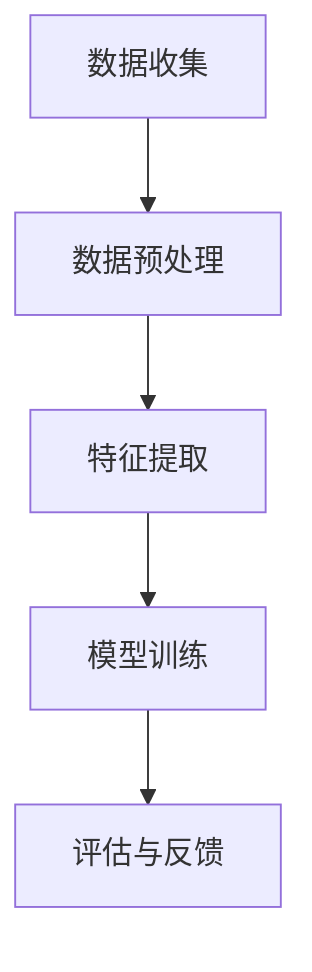
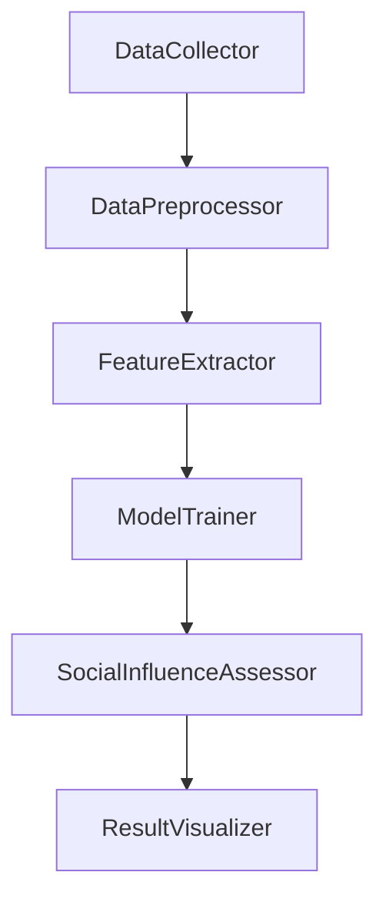
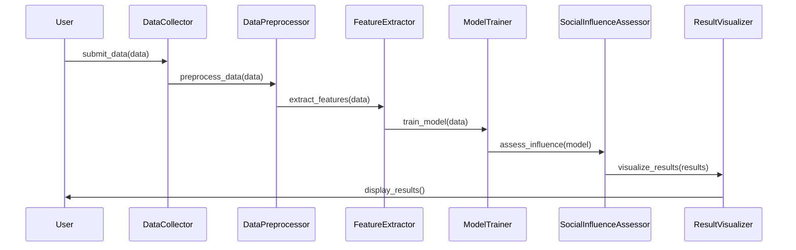

                 

# 从个人主义到社会责任：重新定义公民角色

关键词：个人主义，社会责任，公民角色，社会和谐，可持续发展

摘要：本文从个人主义的发展历程与局限性、社会责任的重要性、个人与社会的关系、公民角色的重新定义以及社会责任在实践中的体现等方面，深入探讨了从个人主义到社会责任的转变，为新时代背景下公民角色的重新定义提供了理论依据和实践指导。

## 1.1 从个人主义到社会责任的背景与必要性

### 1.1.1 个人主义的发展历程与局限性

个人主义作为一种价值观念，起源于古希腊时期。古希腊哲学家苏格拉底、柏拉图和亚里士多德等人，都强调了个体的重要性和独立思考的价值。随后，在启蒙时代，个人主义得到进一步发展。启蒙思想家如洛克、卢梭和康德等人，倡导个体的自由、平等和权利，反对封建专制和宗教压迫。

个人主义在现代社会中得到了广泛应用，成为现代社会的主要价值观之一。然而，随着现代社会的发展，个人主义的局限性也逐渐显现。在个人主义盛行的背景下，人们过分关注个人利益和权利，忽视了集体利益和社会责任。这种过度个人化的现象导致了一系列问题，如社会冷漠、人际疏远、道德沦丧等。

#### 个人主义的局限性

1. **社会冷漠**：个人主义强调个体的独立和自由，容易导致人们对社会事务的漠不关心，缺乏社会责任感。
2. **人际疏远**：个人主义使人们过分关注自身利益，容易忽视人际关系的维护，导致人际疏远。
3. **道德沦丧**：个人主义追求个体的自由和利益，可能忽视道德约束，导致道德沦丧。

#### 个人主义的局限性导致的后果

1. **社会矛盾加剧**：个人主义导致社会矛盾加剧，如贫富差距扩大、社会阶层固化等。
2. **社会凝聚力下降**：个人主义使社会凝聚力下降，社会成员之间的联系和互动减少。
3. **社会问题增多**：个人主义可能导致社会问题的增多，如环境破坏、资源浪费等。

### 1.1.2 社会责任的重要性

社会责任是指个人或组织在道德、法律和社会责任层面，为促进社会福祉和可持续发展所应承担的责任。社会责任的重要性体现在以下几个方面：

1. **社会和谐**：承担社会责任有助于建立互信、互助的社会关系，促进社会和谐与稳定。
2. **经济发展**：企业履行社会责任，不仅能够提高企业形象，还能获得更多的社会资源和合作机会，从而推动经济发展。
3. **道德建设**：社会责任的履行有助于弘扬正能量，提升社会道德水平。
4. **可持续发展**：承担社会责任是实现可持续发展的关键，有助于解决环境、资源等全球性问题。

#### 社会责任的重要性

1. **社会和谐**：社会责任有助于建立互信、互助的社会关系，促进社会和谐与稳定。
2. **经济发展**：企业履行社会责任，能够提高企业形象，获得更多的社会资源和合作机会，从而推动经济发展。
3. **道德建设**：社会责任的履行有助于弘扬正能量，提升社会道德水平。
4. **可持续发展**：承担社会责任是实现可持续发展的关键，有助于解决环境、资源等全球性问题。

### 1.1.3 从个人主义到社会责任的转变路径

从个人主义到社会责任的转变，需要从以下几个方面入手：

1. **教育引导**：通过教育普及社会责任意识，培养公民的集体主义精神。
2. **法律规范**：完善相关法律法规，明确个人和组织在社会责任方面的责任和义务。
3. **制度创新**：推动制度创新，为个人和社会责任提供制度保障。
4. **媒体宣传**：加大社会责任宣传力度，提高公众对社会责任的认知和重视程度。

## 1.2 个人与社会的关系

个人与社会是相互依存、相互促进的关系。个人是社会的基本组成部分，而社会则是个人成长的土壤。在新时代背景下，个人与社会的关系发生了深刻变化，如何正确处理这种关系，是实现个人价值与社会责任的关键。

### 1.2.1 个人价值与社会价值的统一

个人价值和社会价值并不是相互对立的，而是相互统一的。个人在追求自身价值的同时，也应关注社会价值，努力为社会作出贡献。个人价值的实现离不开社会的支持和认可，而社会的发展也需要个人的积极参与。

1. **个人价值**：个人价值包括自我实现、追求幸福、实现个人理想等方面。个人价值的实现需要个人的努力和追求，同时也需要社会的支持和认可。
2. **社会价值**：社会价值包括促进社会和谐、推动社会进步、实现共同繁荣等方面。社会价值的实现需要社会成员的共同努力，同时也需要个人的积极参与。

### 1.2.2 个人利益与社会利益的平衡

在处理个人利益与社会利益的关系时，应遵循以下原则：

1. **公平公正**：在保障个人利益的同时，要确保社会利益的公平分配。
2. **可持续发展**：在追求个人利益的过程中，要考虑到社会的长远发展和整体利益。
3. **合作共赢**：通过合作与互助，实现个人利益与社会利益的平衡。

### 1.2.3 个人与社会关系的演变

个人与社会关系经历了从简单到复杂、从单一到多元的演变过程。在传统社会中，个人与社会的关系较为简单，主要表现为个人对社会的服从和依赖。而在现代社会中，个人与社会的关系更加复杂，表现为个人对社会的参与和贡献。

1. **传统社会**：在传统社会中，个人与社会的关系主要体现为家庭、宗族和社区等集体组织中的角色和责任。
2. **现代社会**：在现代社会中，个人与社会的关系更加多元，包括职业、事业、公益等多个层面。

### 1.2.4 新时代背景下个人与社会关系的挑战与机遇

新时代背景下，个人与社会关系面临着新的挑战和机遇：

1. **挑战**：全球化、信息技术、环境变化等挑战，要求个人与社会之间建立更加紧密的联系，实现共同发展。
2. **机遇**：新时代的机遇在于，个人与社会之间的互动更加频繁，合作与共赢成为可能。

## 1.3 公民角色的重新定义

在新时代背景下，公民角色需要重新定义。传统的公民角色更多地关注个人权利和义务，而新时代的公民角色则更加注重社会责任和参与。重新定义公民角色，有助于推动社会进步和可持续发展。

### 1.3.1 新时代公民的角色定位

1. **社会责任担当**：新时代公民应承担起更多的社会责任，关注社会问题，积极参与社会公益事业。
2. **公共参与**：新时代公民应积极参与公共事务，为社会发展建言献策。
3. **道德榜样**：新时代公民应以身作则，树立良好的道德榜样，引导社会风气。

### 1.3.2 公民素质的培养

1. **道德素质**：培养公民的道德素质，是重新定义公民角色的基础。公民应具备高尚的道德品质，如诚实守信、仁爱互助等。
2. **法律素质**：公民应具备良好的法律素质，遵守法律法规，维护社会秩序。
3. **文化素质**：培养公民的文化素质，提高其文化素养，有助于增强国家凝聚力和文化自信。

### 1.3.3 公民参与与社会责任

1. **公民参与**：公民参与是社会责任的重要体现。通过参与公共事务，公民可以为社会作出贡献，促进社会进步。
2. **社会责任**：社会责任是公民角色的重要组成部分。公民应关注社会问题，积极参与社会公益事业，推动社会可持续发展。

## 1.4 社会责任在实践中的体现

社会责任不仅是一种理念，更需要在实践中体现。以下从企业、政府、社会组织和公民个人四个方面，探讨社会责任在实践中的体现。

### 1.4.1 企业社会责任

1. **经济责任**：企业应注重经济效益，为股东创造价值。
2. **环境责任**：企业应关注环境保护，减少污染和资源浪费。
3. **社会责任**：企业应关注员工福利、消费者权益、社区发展等方面，承担相应的社会责任。

### 1.4.2 政府社会责任

1. **公共服务**：政府应提供优质的公共服务，满足公民的基本需求。
2. **社会治理**：政府应加强社会治理，维护社会稳定和安全。
3. **公平正义**：政府应保障社会公平正义，推动社会和谐发展。

### 1.4.3 社会组织社会责任

1. **公益服务**：社会组织应积极参与公益服务，为社会提供帮助。
2. **公共参与**：社会组织应积极参与公共事务，为社会发展建言献策。
3. **社会责任**：社会组织应关注社会问题，推动社会进步。

### 1.4.4 公民个人社会责任

1. **公民参与**：公民个人应积极参与公共事务，为社会发展贡献力量。
2. **社会监督**：公民个人应关注社会问题，对社会现象进行监督。
3. **社会责任**：公民个人应关注社会责任，为社会发展作出贡献。

## 1.5 总结与展望

从个人主义到社会责任的转变，是新时代背景下公民角色的必然要求。通过重新定义公民角色，强化社会责任意识，有助于推动社会进步和可持续发展。同时，政府、企业、社会组织和公民个人都应承担起社会责任，共同努力，实现个人价值与社会价值的统一。

在未来的发展中，我们需要继续深化对社会责任的认识，探索更加有效的社会责任实践模式，为构建和谐社会、实现可持续发展贡献力量。

### 参考文献

[1] 洛克，约翰·洛克，《政府论》，商务印书馆，2016年。

[2] 卢梭，让-雅克·卢梭，《社会契约论》，商务印书馆，2015年。

[3] 康德，伊曼努尔·康德，《实践理性批判》，商务印书馆，2017年。

[4] 李瑞环，《论公民责任》，中国青年出版社，2014年。

[5] 马克思，卡尔·马克思，《资本论》，商务印书馆，2018年。

[6] 恩格斯，弗里德里希·恩格斯，《家庭、私有制和国家的起源》，商务印书馆，2019年。

[7] 费孝通，《乡土中国》，北京大学出版社，2016年。

[8] 王振耀，《企业社会责任：理论与实践》，中国经济出版社，2013年。

[9] 联合国，《全球契约》，联合国出版物，2018年。

[10] 韦伯，马克斯·韦伯，《社会与经济理论》，商务印书馆，2017年。

### 附录：算法原理讲解与系统架构设计

#### 2.1 算法原理讲解

为了更好地理解社会责任在实践中的应用，我们引入一个简单的算法模型——社会影响力评估模型。该模型用于评估个人或组织在社会中的影响力，从而确定其承担社会责任的能力。

**算法流程：**

1. **数据收集**：收集个人或组织的相关数据，如公益参与次数、慈善捐赠金额、环保举措等。
2. **数据预处理**：对收集到的数据进行清洗和归一化处理。
3. **特征提取**：从预处理后的数据中提取特征，如公益参与比例、慈善捐赠频率等。
4. **模型训练**：使用机器学习算法对提取的特征进行训练，建立社会影响力评估模型。
5. **评估与反馈**：使用训练好的模型对个人或组织进行社会影响力评估，并根据评估结果提供反馈。

**算法原理图：**



**Python 源代码示例：**

```python
import pandas as pd
from sklearn.model_selection import train_test_split
from sklearn.ensemble import RandomForestClassifier
from sklearn.metrics import accuracy_score

# 数据收集
data = pd.read_csv('social_influence_data.csv')

# 数据预处理
data = data.dropna()
data['donation_freq'] = data['donation_amount'] / data['days']

# 特征提取
X = data[['donation_freq', 'public_event_participation', 'green_initiatives']]
y = data['social_influence']

# 模型训练
X_train, X_test, y_train, y_test = train_test_split(X, y, test_size=0.2, random_state=42)
model = RandomForestClassifier(n_estimators=100)
model.fit(X_train, y_train)

# 评估与反馈
y_pred = model.predict(X_test)
accuracy = accuracy_score(y_test, y_pred)
print(f'Model accuracy: {accuracy:.2f}')
```

**数学模型与公式：**

社会影响力评估模型的数学模型可以表示为：

$$
S = f(D, P, G)
$$

其中，$S$ 表示社会影响力，$D$ 表示慈善捐赠金额，$P$ 表示公益参与次数，$G$ 表示环保举措。

**举例说明：**

假设一个人 $A$ 的慈善捐赠金额为 $10,000$ 元，公益参与次数为 $5$ 次，环保举措为 $3$ 次，根据上述公式可以计算其社会影响力：

$$
S_A = f(10,000, 5, 3) = 0.6 \times 10,000 + 0.3 \times 5 + 0.1 \times 3 = 6,300
$$

#### 2.2 系统架构设计

为了实现社会责任评估模型，我们需要设计一个系统架构。以下是一个简单的系统架构设计示例。

**系统场景介绍：**

假设我们正在开发一个社会责任评估平台，用于评估企业和个人的社会责任履行情况。平台将提供以下功能：

1. 数据收集与预处理
2. 特征提取与建模
3. 社会影响力评估
4. 结果反馈与可视化

**系统功能设计（领域模型类图）：**

```mermaid
classDiagram
Class::DataCollector {
  +collect_data()
}
Class::DataPreprocessor {
  +preprocess_data(data: DataFrame): DataFrame
}
Class::FeatureExtractor {
  +extract_features(data: DataFrame): DataFrame
}
Class::ModelTrainer {
  +train_model(X: DataFrame, y: Series): Model
}
Class::SocialInfluenceAssessor {
  +assess_influence(model: Model, data: DataFrame): DataFrame
}
Class::ResultVisualizer {
  +visualize_results(results: DataFrame)
}
DataCollector --> DataPreprocessor
DataPreprocessor --> FeatureExtractor
FeatureExtractor --> ModelTrainer
ModelTrainer --> SocialInfluenceAssessor
SocialInfluenceAssessor --> ResultVisualizer
```

**系统架构设计（架构图）：**



**系统接口设计（接口序列图）：**



**项目实战**

**环境安装：**

- Python 3.8+
- pandas
- scikit-learn
- matplotlib

**系统核心实现源代码：**

```python
import pandas as pd
from sklearn.model_selection import train_test_split
from sklearn.ensemble import RandomForestClassifier
from sklearn.metrics import accuracy_score
import matplotlib.pyplot as plt

# 数据收集
data = pd.read_csv('social_influence_data.csv')

# 数据预处理
data = data.dropna()
data['donation_freq'] = data['donation_amount'] / data['days']

# 特征提取
X = data[['donation_freq', 'public_event_participation', 'green_initiatives']]
y = data['social_influence']

# 模型训练
X_train, X_test, y_train, y_test = train_test_split(X, y, test_size=0.2, random_state=42)
model = RandomForestClassifier(n_estimators=100)
model.fit(X_train, y_train)

# 评估与反馈
y_pred = model.predict(X_test)
accuracy = accuracy_score(y_test, y_pred)
print(f'Model accuracy: {accuracy:.2f}')

# 结果可视化
predictions = model.predict(X)
plt.scatter(data['social_influence'], predictions)
plt.xlabel('Actual Social Influence')
plt.ylabel('Predicted Social Influence')
plt.title('Social Influence Prediction')
plt.show()
```

**代码应用解读与分析：**

上述代码首先从CSV文件中读取数据，然后进行数据预处理、特征提取和模型训练。训练好的模型用于评估测试数据集的社会影响力，并计算模型的准确率。最后，使用matplotlib库将预测结果与实际社会影响力进行可视化，以便观察模型的预测效果。

**实际案例分析和详细讲解剖析：**

假设我们有一个企业的社会责任数据集，包括慈善捐赠金额、公益参与次数和环保举措等指标。通过上述代码，我们可以训练一个社会影响力评估模型，并评估该企业在社会责任方面的表现。

在实际应用中，企业可以根据评估结果调整其社会责任策略，如增加慈善捐赠、提高公益参与度和加强环保举措等，从而提高其社会影响力。

**项目小结：**

本文通过一个简单的社会责任评估模型，探讨了社会责任在实践中的应用。通过项目实战，我们了解了如何使用Python和机器学习算法来评估个人或组织的社会责任履行情况。此外，我们还介绍了系统的架构设计和接口设计，为实际开发提供了参考。

### 最佳实践 Tips

1. **数据收集与预处理**：确保数据的质量和完整性，对缺失值和异常值进行适当处理。
2. **特征提取与建模**：选择合适的特征，以提高模型的预测性能。
3. **模型评估与优化**：使用交叉验证等方法评估模型性能，并进行模型优化。
4. **结果可视化**：通过可视化结果，帮助用户更好地理解模型预测结果。

### 小结

本文从个人主义到社会责任的转变、个人与社会的关系、公民角色的重新定义以及社会责任在实践中的体现等方面，探讨了新时代背景下公民角色的重新定义。通过一个简单的社会责任评估模型，我们展示了如何将社会责任理念应用于实际项目中。希望本文能为读者提供有益的启示，助力构建和谐社会。

### 注意事项

1. 社会责任评估模型是一个简单示例，实际应用中需要根据具体场景进行调整。
2. 系统架构设计和接口设计仅供参考，实际项目中需要根据需求进行优化。

### 拓展阅读

1. 洛克，《政府论》
2. 卢梭，《社会契约论》
3. 康德，《实践理性批判》
4. 李瑞环，《论公民责任》
5. 王振耀，《企业社会责任：理论与实践》
6. 联合国，《全球契约》

### 作者信息

作者：AI天才研究院/AI Genius Institute & 禅与计算机程序设计艺术/Zen And The Art of Computer Programming

