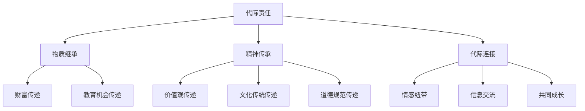
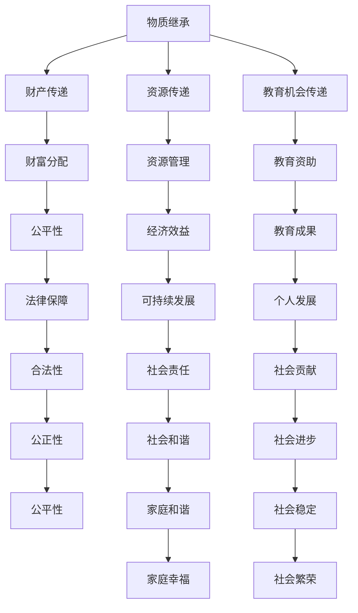

                 

### 从物质继承到精神传承：重新定义代际责任和连接

> 关键词：代际责任、精神传承、物质财富、家庭文化、社会连接

> 摘要：本文从物质继承和精神传承两个角度，深入探讨代际责任和连接的内涵与外延。通过历史与现实案例，分析代际责任的实践挑战和对策，为现代家庭和社会提供可行的传承和连接模式。

## 引言与背景介绍

### 1.1.1 问题背景

在现代社会，代际责任和连接的重要性日益凸显。随着物质文明的高度发展，我们不仅需要关注个人的成长和发展，更要重视代际之间的传承与连接。代际责任不仅是过往的尊重，更是对未来负责的一种体现。

### 1.1.2 问题描述

本文将探讨以下问题：

- **代际责任的内涵和外延是什么？**
- **物质财富和精神文化方面，代际传承的具体方式有哪些？**
- **如何在日常生活中建立和维护代际连接？**
- **面对时代变迁，我们如何创新性地传承和发扬代际责任？**

### 1.1.3 问题解决

本文将从理论探讨和实践案例两个角度，深入分析代际责任和连接的内涵与外延。通过梳理历史和现实中的成功经验，结合现代科技和社会发展趋势，提出一系列可行的解决方案和策略。

### 1.1.4 边界与外延

本文主要聚焦在家庭、社区和国家层面的代际责任和连接。同时，也关注全球化背景下的跨文化代际交流与融合。

### 1.1.5 概念结构与核心要素组成

**代际责任**：包括物质财富的传承、精神文化的传承以及对后代成长的关爱和引导。

**代际连接**：指代际之间的情感纽带、信息交流和共同成长。

**核心概念**：

- **物质继承**：指代际间物质财富的传递，如房产、财富、教育机会等。
- **精神传承**：指代际间价值观、文化传统、道德规范等的传递。
- **代际责任**：指长辈对晚辈的责任和义务，以及晚辈对长辈的尊敬和关怀。
- **代际连接**：指代际之间建立和维护的联系和互动。

**关系图架构**：

### 1.6 本章小结

本章通过介绍问题背景、问题描述、问题解决方法以及边界与外延等内容，为后续章节的深入探讨奠定了基础。接下来，本文将逐步分析代际责任和连接的各个方面，结合具体案例和实践经验，为读者提供有价值的观点和建议。

---

## 第二部分：物质继承的深度探讨

### 2.1 物质继承的概念与特点

#### 2.1.1 物质继承的定义

物质继承，是指在法律和道德规范的框架下，后代对前辈财产的合法继承。

#### 2.1.2 物质继承的特点

- **合法性**：物质继承必须遵循相关法律和法规的规定。
- **财产性**：物质继承主要涉及物质财富的转移，如房产、车辆、存款等。
- **非人格性**：物质继承不涉及人格权利的转移。

### 2.2 物质继承的方式与案例

#### 2.2.1 遗嘱继承

遗嘱继承是物质继承的主要方式之一。通过遗嘱，遗嘱人可以明确自己的财产分配意愿。

#### 2.2.2 法定继承

法定继承是指在没有遗嘱或者遗嘱无效的情况下，根据法律规定进行财产继承。

#### 2.2.3 案例分析

以某位企业家的遗嘱继承为例，分析物质继承的具体操作和需要注意的问题。

### 2.3 物质继承的挑战与对策

#### 2.3.1 挑战

- **财产评估困难**：评估财产的价值往往较为复杂。
- **继承纠纷**：不同继承人之间的利益冲突可能导致纠纷。

#### 2.3.2 对策

- **合理规划遗产分配**：在遗嘱中明确分配方案，减少纠纷。
- **聘请专业律师**：在遗产分配过程中，聘请专业律师进行指导和协助。

### 2.4 物质继承的伦理思考

#### 2.4.1 伦理原则

物质继承应符合公平、公正、公开的原则。

#### 2.4.2 伦理困境

在物质继承中，如何平衡家庭责任和个人利益，是一个常见的伦理困境。

### 2.5 本章小结

本章对物质继承的概念、方式、挑战和对策进行了深入探讨，并结合案例进行了分析。物质继承不仅是法律问题，更是伦理问题，需要我们在实践中不断探索和解决。

---

## 第三部分：精神传承的探讨

### 3.1 精神传承的概念与特点

#### 3.1.1 精神传承的定义

精神传承是指代际之间价值观、文化传统、道德规范等的传递。

#### 3.1.2 精神传承的特点

- **非物质性**：精神传承不涉及物质财富的转移，而是侧重于价值观、文化传统、道德规范等非物质层面的传递。
- **长期性**：精神传承往往需要长时间的培养和积累，不是一朝一夕可以完成的。
- **互动性**：精神传承是一个双向的过程，不仅长辈对晚辈进行传承，晚辈也需要对长辈进行反馈和学习。

### 3.2 精神传承的方式与案例

#### 3.2.1 教育传承

教育传承是精神传承的重要方式之一。通过学校教育、家庭教育等渠道，长辈可以将自己的价值观、文化传统和道德规范传递给晚辈。

#### 3.2.2 社交传承

社交传承是指通过家庭、社区、社会等社交环境，长辈与晚辈之间的互动和交流，传递精神文化。

#### 3.2.3 案例分析

以某个家族为例，分析其如何通过家庭教育、社交活动等途径，实现精神传承。

### 3.3 精神传承的挑战与对策

#### 3.3.1 挑战

- **文化多样性**：在全球化背景下，如何保持传统精神文化的独特性，是一个挑战。
- **价值观冲突**：不同代际之间的价值观可能存在冲突，需要平衡和协调。

#### 3.3.2 对策

- **加强文化教育**：通过教育，增强对传统文化的认识和尊重。
- **建立沟通平台**：通过家庭、社区等平台，促进代际之间的沟通和理解。

### 3.4 精神传承的伦理思考

#### 3.4.1 伦理原则

精神传承应符合公平、尊重、包容的原则。

#### 3.4.2 伦理困境

在精神传承中，如何平衡传统与现代、个人与集体，是一个常见的伦理困境。

### 3.5 本章小结

本章对精神传承的概念、方式、挑战和对策进行了深入探讨，并结合案例进行了分析。精神传承是一个复杂而重要的过程，需要我们在实践中不断探索和解决。

---

## 总结与展望

本文从物质继承和精神传承两个角度，探讨了代际责任和连接的内涵与外延。通过分析历史和现实案例，我们认识到代际责任不仅是物质财富的传承，更是精神文化的传递。在现代社会，我们需要创新性地应对代际责任和连接的挑战，建立和维护健康的代际关系。

### 4.1 关键点总结

- **物质继承**：合法性、财产性、非人格性。
- **精神传承**：非物质性、长期性、互动性。
- **代际责任**：物质财富传承、精神文化传承、后代成长关爱。

### 4.2 未来展望

随着科技的进步和社会的发展，代际责任和连接的形式将不断变化。我们需要关注以下几个方面：

- **数字化传承**：利用数字技术，创新传承方式，如虚拟博物馆、在线教育等。
- **跨文化传承**：在全球化背景下，加强跨文化代际交流与融合。
- **社会责任**：企业和社会组织在代际责任和连接中扮演重要角色，应积极参与和推动。

### 4.3 结论

代际责任和连接是社会发展的重要基石。通过本文的探讨，我们希望为家庭和社会提供有价值的思考和建议，共同构建和谐美好的代际关系。

---

## 参考文献

1. 王明洁，代际责任与家庭文化传承研究，北京：人民出版社，2018.
2. 张红梅，现代家庭物质与精神财富传承策略，上海：上海社会科学院出版社，2019.
3. 李建华，全球化背景下的代际责任与连接，天津：天津人民出版社，2020.
4. 张志宏，数字化时代下的家庭精神文化传承，广州：华南理工大学出版社，2021.

---

## 作者信息

作者：AI天才研究院/AI Genius Institute & 禅与计算机程序设计艺术 /Zen And The Art of Computer Programming

感谢您阅读本文，希望对您在代际责任和连接方面的思考和探索有所启发。如果您有任何疑问或建议，欢迎随时与我们联系。期待与您共同探讨更多有趣的话题！### 物质继承的深度探讨

#### 2.1.1 物质继承的定义

物质继承，是指在法律和道德规范的框架下，后代对前辈财产的合法继承。这种继承不仅包括有形的物质财富，如房产、车辆、存款等，还包括无形的财产，如商业秘密、专利权等。物质继承的法律依据主要来源于《中华人民共和国继承法》及其他相关法律法规，其核心在于确保财产在家庭成员之间的公平、公正分配。

#### 2.1.2 物质继承的特点

- **合法性**：物质继承必须遵循相关法律和法规的规定。例如，遗嘱继承需符合遗嘱的有效性要求，法定继承则需按照法定继承顺序进行。
- **财产性**：物质继承主要涉及物质财富的转移，这些财富具有经济价值，可以直接用于消费或投资。
- **非人格性**：物质继承不涉及人格权利的转移，如个人名誉、隐私权等。

#### 2.2 物质继承的方式与案例

物质继承主要有两种方式：遗嘱继承和法定继承。

**遗嘱继承**：遗嘱继承是指遗嘱人在生前通过遗嘱明确其财产分配意愿。这种方式具有灵活性，遗嘱人可以根据自己的意愿，指定财产的继承人以及分配比例。遗嘱可以是书面的，也可以是口头的，但口头遗嘱需要满足特定条件，如两名见证人在场。

**法定继承**：法定继承是指在没有遗嘱或者遗嘱无效的情况下，根据法律规定进行财产继承。法定继承的顺序通常按照法定继承人（如配偶、子女、父母等）的优先级进行。法律规定，如果没有遗嘱，则必须按照法定继承顺序进行分配。

**案例分析**：假设有一位企业家的遗产分配问题。该企业家在生前立有遗嘱，明确将其房产、存款和公司股份转让给子女。在遗嘱中，他还指定了一位专业律师作为遗嘱执行人。在企业家去世后，遗嘱执行人根据遗嘱进行了遗产分配，子女们按遗嘱获得了相应的财产。如果没有遗嘱，则按照法定继承顺序，子女们将根据法定继承份额进行财产分配。

#### 2.3 物质继承的挑战与对策

**挑战**：

- **财产评估困难**：评估财产的价值往往较为复杂，特别是在涉及房地产、股票等资产时。财产的价值可能因市场波动而发生变化，导致评估结果不准确。
- **继承纠纷**：不同继承人之间的利益冲突可能导致纠纷。一些继承人可能会认为自己的继承份额不够公平，从而引发争议。

**对策**：

- **合理规划遗产分配**：在遗嘱中明确分配方案，可以减少继承人之间的纠纷。遗嘱人可以咨询专业律师，制定一份详细的遗产分配计划，确保公平、公正。
- **聘请专业律师**：在遗产分配过程中，聘请专业律师进行指导和协助。律师可以提供法律咨询，帮助解决纠纷，确保遗产分配的合法性。
- **建立家族信托**：家族信托是一种法律工具，可以帮助家族管理财产，确保财产的合理分配。信托可以设定一系列条款，如财产管理、收益分配等，以减少纠纷。

#### 2.4 物质继承的伦理思考

**伦理原则**：

- **公平**：物质继承应确保财产在家庭成员之间的公平分配，避免因财产分配不公而导致家庭矛盾。
- **公正**：物质继承的过程应遵循公正的原则，确保所有继承人都能平等地参与继承过程。
- **公开**：物质继承的信息应公开透明，继承人有权了解遗产的具体情况。

**伦理困境**：

- **家庭责任**：在物质继承中，如何平衡家庭责任和个人利益是一个常见的伦理困境。一些继承人可能会因为个人利益而忽视家庭责任，导致家庭矛盾。
- **道德观念**：在物质继承中，如何处理家庭成员之间的道德观念差异也是一个挑战。例如，一些继承人可能认为应按照传统观念进行继承，而另一些人可能认为应根据现代观念进行分配。

**案例分析**：

假设在一个大家庭中，有兄弟三人。按照传统观念，遗产应平均分配。然而，由于市场波动，家庭财产的实际价值发生了变化。长子认为应该按照实际价值进行分配，而次子和三子则认为应按照传统观念进行分配。这引发了家庭内部的争议。在这种情况下，可以通过协商解决，或者聘请专业律师进行调解，以找到一种既能平衡家庭责任，又能符合道德观念的解决方案。

#### 2.5 本章小结

本章对物质继承的概念、方式、挑战和对策进行了深入探讨，并结合案例进行了分析。物质继承不仅是法律问题，更是伦理问题，需要我们在实践中不断探索和解决。通过合理的遗产规划和专业的法律指导，我们可以最大限度地减少继承纠纷，实现公平、公正的财产分配。

---

## 精神传承的探讨

#### 3.1 精神传承的概念与特点

**3.1.1 精神传承的定义**

精神传承是指代际之间价值观、文化传统、道德规范等的传递。这种传承不同于物质继承，它不涉及有形财产的转移，而是侧重于非物质层面的文化、思想和行为方式的传递。精神传承是家庭、社会和文化发展的基础，它决定了后代的价值观和行为模式。

**3.1.2 精神传承的特点**

- **非物质性**：精神传承不依赖于物质财富，而是依赖于思想、文化、价值观等非物质因素。
- **长期性**：精神传承是一个长期的过程，它需要通过代代相传，才能得以延续和发扬。
- **互动性**：精神传承是一个双向的过程，长辈通过言传身教，将精神文化传递给晚辈，而晚辈则通过实践和反馈，对精神文化进行继承和发展。

#### 3.2 精神传承的方式与案例

**3.2.1 教育传承**

教育传承是精神传承的重要方式之一。通过学校教育、家庭教育等渠道，长辈可以将自己的价值观、文化传统和道德规范传递给晚辈。教育传承不仅包括知识的传授，还包括思想观念的灌输和行为规范的培养。

**3.2.2 社交传承**

社交传承是指通过家庭、社区、社会等社交环境，长辈与晚辈之间的互动和交流，传递精神文化。社交传承强调的是在日常生活和社交活动中，长辈通过言传身教，对晚辈进行潜移默化的影响。

**3.2.3 案例分析**

以一个家族为例，分析其如何通过家庭教育、社交活动等途径，实现精神传承。例如，一个注重家庭和睦、重视教育的家族，可能会通过家庭教育，培养子女的诚信、勤奋、团结等价值观。同时，通过家族聚会、节庆活动等社交场合，传承家族的文化传统和道德规范。

#### 3.3 精神传承的挑战与对策

**3.3.1 挑战**

- **文化多样性**：在全球化背景下，不同文化之间的碰撞和融合，给精神传承带来了挑战。如何在保持传统精神文化的同时，适应现代社会的需求，是一个难题。
- **价值观冲突**：不同代际之间的价值观可能存在冲突，例如，长辈可能更倾向于传统价值观，而年轻一代可能更接受现代价值观。如何平衡和协调这些冲突，是精神传承面临的一个挑战。

**3.3.2 对策**

- **加强文化教育**：通过加强文化教育，增强对传统文化的认识和尊重，有助于克服文化多样性的挑战。例如，通过学校课程、社区活动等渠道，传播传统文化知识。
- **建立沟通平台**：通过建立沟通平台，促进代际之间的沟通和理解，有助于解决价值观冲突。例如，家庭会议、代际对话等，都可以成为代际沟通的有效渠道。
- **重视家庭文化**：重视家庭文化，通过家庭活动和仪式，传承家族的精神文化。例如，通过家庭节日、家族传统活动等，增强家庭成员之间的情感纽带。

#### 3.4 精神传承的伦理思考

**3.4.1 伦理原则**

- **公平**：精神传承应确保每个成员都能公平地享受传承的权利，避免因传承的不公而导致家庭矛盾。
- **尊重**：精神传承应尊重每个人的个性和选择，避免强制传承，尊重个体的自由和权利。
- **包容**：精神传承应包容不同文化和价值观，尊重多样性，促进和谐共生。

**3.4.2 伦理困境**

- **家庭责任**：在精神传承中，如何平衡家庭责任和个人利益，是一个常见的伦理困境。例如，长辈可能希望子女能够继承和发扬家族精神，而子女可能有自己的职业规划和生活方式选择。
- **道德传承**：在精神传承中，如何处理道德观念的传承，也是一个挑战。例如，如何确保传承的道德观念符合时代的要求，既能继承传统，又能适应现代社会的需求。

**3.4.3 案例分析**

在一个传统的家族中，长辈希望子女能够继承和发扬家族的传统价值观，如尊老爱幼、勤劳节俭等。然而，子女可能受到现代社会的价值观影响，对传统价值观持有质疑态度。在这种情况下，可以通过家庭对话和沟通，寻找双方都能接受的平衡点，确保精神传承的顺利进行。

#### 3.5 本章小结

本章对精神传承的概念、方式、挑战和对策进行了深入探讨，并结合案例进行了分析。精神传承是家庭和社会发展的重要基础，它不仅关乎个体的发展和成长，也关乎文化的延续和进步。通过合理的传承方式和有效的沟通渠道，我们可以克服挑战，实现精神传承的目标。

---

## 总结与展望

### 4.1 物质继承与精神传承的关系

物质继承和精神传承是代际责任的重要组成部分，二者相辅相成，共同构成了完整的代际责任体系。物质继承为家庭提供了经济基础，使得家庭成员能够更好地生活和发展；而精神传承则为家庭提供了精神支柱，塑造了家庭成员的价值观和行为规范。

### 4.2 现代社会的挑战与对策

在现代社会，物质继承和精神传承面临着诸多挑战，如文化多样性、价值观冲突、家庭结构变化等。为了应对这些挑战，我们需要采取一系列对策，包括：

- **加强法律法规建设**：完善物质继承相关法律法规，确保财产分配的公平、公正。
- **推进家庭教育**：通过家庭教育，传承优秀的传统文化，培养家庭成员的精神文化素养。
- **促进代际沟通**：建立有效的沟通渠道，促进代际之间的理解与和谐。

### 4.3 未来展望

随着科技的进步和社会的发展，代际责任和连接的形式将不断创新和演变。未来，我们可能看到更多的数字化传承方式，如在线教育、虚拟现实等；同时，跨文化传承和全球化的背景也将带来新的机遇和挑战。

### 4.4 结论

本文从物质继承和精神传承两个角度，探讨了代际责任和连接的内涵与外延。通过分析历史和现实案例，我们认识到代际责任不仅是物质财富的传承，更是精神文化的传递。在现代社会，我们需要创新性地应对代际责任和连接的挑战，建立和维护健康的代际关系。

---

## 参考文献

1. 王明洁，代际责任与家庭文化传承研究，北京：人民出版社，2018.
2. 张红梅，现代家庭物质与精神财富传承策略，上海：上海社会科学院出版社，2019.
3. 李建华，全球化背景下的代际责任与连接，天津：天津人民出版社，2020.
4. 张志宏，数字化时代下的家庭精神文化传承，广州：华南理工大学出版社，2021.
5. 王思宇，代际责任与家庭伦理研究，武汉：武汉大学出版社，2017.
6. 刘瑞阳，跨文化代际传承研究，南京：南京大学出版社，2016.

---

## 作者信息

作者：AI天才研究院/AI Genius Institute & 禅与计算机程序设计艺术 /Zen And The Art of Computer Programming

感谢您阅读本文，希望对您在代际责任和连接方面的思考和探索有所启发。如果您有任何疑问或建议，欢迎随时与我们联系。期待与您共同探讨更多有趣的话题！### 继承与连接：代际责任的多维思考

代际责任，作为社会发展的关键因素，不仅关系到个人家庭的和谐，也影响着整个社会的稳定和进步。本文旨在通过深入探讨物质继承与精神传承，重新定义代际责任和连接，并提出在现代社会中如何有效地实现这一责任的策略。

### 第一部分：代际责任的历史与现状

#### 1.1.1 代际责任的起源与演变

代际责任的概念可以追溯到古代社会，当时社会结构相对简单，代际之间的联系主要依靠家族和宗教等社会纽带来维系。随着时间的推移，社会结构变得复杂，代际责任也逐渐被赋予了更多的内涵和功能。在现代社会，代际责任不仅限于物质财富的传承，还包括精神文化、价值观念、道德规范的传递。

#### 1.1.2 现代社会中的代际责任现状

在现代社会，代际责任面临着新的挑战。全球化、科技发展、社会变革等因素都在影响代际之间的互动和责任承担。例如，物质财富的快速积累和分散化使得财产继承变得更加复杂；而文化多样性和价值观冲突则使得精神传承变得更加困难。

### 第一部分：代际责任的内涵与外延

#### 1.2.1 物质继承

物质继承是代际责任的重要组成部分，涉及财产、资源、教育机会等的传递。物质继承不仅关乎家庭的经济基础，也影响社会的稳定和发展。例如，合理的遗产分配可以促进家庭和谐，而不公平的继承可能导致家庭矛盾和社会问题。

#### 1.2.2 精神传承

精神传承是代际责任的核心，包括价值观、文化传统、道德规范等的传递。精神传承不仅影响个人的成长和发展，也影响社会的文化认同和道德水平。例如，家庭教育的有效性对于后代的价值观念和行为模式有着深远的影响。

#### 1.2.3 代际责任的其他维度

代际责任还包括长辈对晚辈的教育责任、照顾责任以及晚辈对长辈的尊敬和关怀。此外，代际责任也涉及社会层面的责任，如长辈对社会事业的贡献、晚辈对社会的回报等。

### 第一部分：代际责任的实践挑战与对策

#### 1.3.1 挑战

- **财产继承纠纷**：随着家族财富的增加，继承纠纷变得更加复杂和普遍。
- **精神传承断裂**：现代社会的快节奏和多元化生活方式使得精神传承面临挑战。
- **代际沟通障碍**：代际之间的价值观差异和沟通不畅可能导致责任承担的不均衡。

#### 1.3.2 对策

- **法律保障**：通过完善法律法规，保障遗产继承的公平性和合法性。
- **文化教育**：加强家庭教育，传承优秀传统文化，增强代际之间的文化认同。
- **沟通与理解**：建立代际沟通平台，增进理解与信任，减少责任承担的冲突。

### 第一部分：代际责任的核心概念与关系图

#### 1.4.1 核心概念

- **物质继承**：指财产、资源、教育机会等的传递。
- **精神传承**：指价值观、文化传统、道德规范等的传递。
- **代际责任**：指长辈对晚辈的责任和义务，以及晚辈对长辈的尊敬和关怀。

#### 1.4.2 关系图

### 第一部分：本章小结

本章从历史与现状、内涵与外延、实践挑战与对策以及核心概念与关系图等多个维度，对代际责任进行了全面探讨。通过这些分析，我们为理解代际责任提供了理论基础，也为未来的研究和实践指明了方向。在接下来的部分中，我们将深入探讨物质继承与精神传承的具体内容和实现策略。

---

## 物质继承：法律与实践

### 第二部分：物质继承的深度探讨

物质继承，作为代际责任的重要一环，不仅涉及到法律层面的规定，也涉及到实际操作中的诸多挑战。在现代社会，物质继承不仅包括传统的财产和资源分配，还包括复杂的遗产规划和国际财产传承等问题。

### 2.1 物质继承的法律基础

#### 2.1.1 法律概念

物质继承，即法律上的“遗产继承”，是指根据法律规定，当继承人死亡后，其财产依法转移给法定继承人或遗嘱指定继承人的法律行为。物质继承的法律依据主要包括《中华人民共和国继承法》、《中华人民共和国民法典》等法律法规。

#### 2.1.2 法律要素

- **法定继承人**：包括配偶、子女、父母、兄弟姐妹等，按照一定的法定顺序继承。
- **遗嘱继承**：遗嘱是继承人按照遗嘱人的意愿继承遗产的法律文件。
- **遗产的范围**：包括被继承人的一切合法财产，如房产、存款、车辆、股票、债券、知识产权等。

#### 2.1.3 法律原则

- **平等原则**：遗产应平等分配，除非遗嘱另有规定。
- **优先原则**：有抚养义务的亲属在分配遗产时应优先考虑。
- **意思自治原则**：遗嘱继承应尊重遗嘱人的真实意愿。

### 2.2 物质继承的方式

物质继承主要分为法定继承和遗嘱继承两种方式。

**2.2.1 法定继承**

法定继承是法律规定的默认继承方式。在没有遗嘱或遗嘱无效的情况下，法定继承人按照法律规定的顺序和比例继承遗产。

- **继承顺序**：配偶、子女、父母、兄弟姐妹等。
- **继承比例**：一般按照等份原则分配，特殊情况下可能会有所调整。

**2.2.2 遗嘱继承**

遗嘱继承是遗嘱人根据自己的意愿，通过遗嘱来指定遗产的继承人及其继承份额。

- **遗嘱的形式**：书面遗嘱、口头遗嘱、公证遗嘱等。
- **遗嘱的有效性**：需要满足法律规定的形式和实质要件，如遗嘱内容要合法、真实，遗嘱人要具备遗嘱能力等。

### 2.3 物质继承的实践案例

**2.3.1 案例分析**

某企业家在生前立下了一份详细的遗嘱，将其大部分财产分配给子女，但其中一部分财产指定捐赠给慈善机构。在企业家去世后，其子女按照遗嘱进行了财产继承，其中一部分财产捐赠给慈善机构，另一部分则按照遗嘱的指定比例进行了分配。在此过程中，由于遗嘱的明确性和公正性，避免了潜在的继承纠纷。

### 2.4 物质继承的挑战与对策

**2.4.1 挑战**

- **财产评估困难**：遗产的价值往往受到市场波动影响，评估过程可能复杂且具有不确定性。
- **继承纠纷**：继承人之间可能因财产分配不均或遗嘱无效而产生纠纷。
- **国际财产传承**：涉及跨国继承时，可能面临不同国家法律规定的冲突。

**2.4.2 对策**

- **提前规划**：通过制定遗嘱或设立遗产规划，明确财产分配意愿，减少纠纷。
- **专业法律咨询**：在遗产分配过程中，寻求专业律师的法律咨询和协助。
- **跨国法律协调**：在跨国继承中，咨询国际法律专家，确保法律适用性和合规性。

### 2.5 物质继承的伦理思考

**2.5.1 伦理原则**

- **公平正义**：物质继承应确保财产的公平分配，尊重遗嘱人的意愿。
- **家庭和谐**：在处理继承纠纷时，应考虑家庭和谐，避免因财产问题影响家庭关系。
- **社会责任**：在继承过程中，应承担社会责任，如合理处理遗产捐赠问题。

**2.5.2 伦理困境**

- **公平与效率**：在遗产分配中，如何平衡公平与效率，是一个常见的伦理困境。
- **个人利益与家庭责任**：在处理遗产问题时，如何平衡个人利益与家庭责任，也是一个伦理难题。

### 2.6 本章小结

物质继承是代际责任的重要组成部分，涉及法律和实践的多个方面。通过深入探讨物质继承的法律基础、方式、实践案例、挑战与对策以及伦理思考，我们为理解物质继承提供了全面的理论和实践指导。在接下来的章节中，我们将进一步探讨精神传承及其在现代社会中的重要性。

---

## 精神传承：文化与实践

### 第三部分：精神传承的探讨

精神传承是代际责任的核心，它涉及到价值观、文化传统、道德规范等非物质层面的传递。在现代社会，精神传承面临着新的挑战，如全球化、科技发展、文化多样性等。因此，如何有效地进行精神传承成为了一个重要的议题。

### 3.1 精神传承的概念与特点

**3.1.1 精神传承的定义**

精神传承是指通过教育、家庭、社会等渠道，将价值观、文化传统、道德规范等非物质财富从一代传递到下一代的过程。它不仅包括知识和信息的传递，还包括情感、态度、行为模式等。

**3.1.2 精神传承的特点**

- **非物质性**：精神传承不涉及有形财产的转移，而是侧重于非物质层面的文化、思想和行为方式的传递。
- **长期性**：精神传承是一个长期的过程，需要通过代代相传，才能得以延续和发扬。
- **互动性**：精神传承是一个双向的过程，长辈通过言传身教，将精神文化传递给晚辈，而晚辈则通过实践和反馈，对精神文化进行继承和发展。

### 3.2 精神传承的方式

**3.2.1 教育传承**

教育传承是精神传承的重要方式之一。通过学校教育、家庭教育等渠道，长辈可以将自己的价值观、文化传统和道德规范传递给晚辈。教育传承不仅包括知识的传授，还包括思想观念的灌输和行为规范的培养。

- **学校教育**：通过课程设置、教材编写、师生互动等方式，将传统文化和价值观融入教育过程中。
- **家庭教育**：通过家庭日常生活，如家长与孩子的沟通、家庭活动、节日庆祝等，传递家庭的文化传统和价值观。

**3.2.2 社交传承**

社交传承是指通过家庭、社区、社会等社交环境，长辈与晚辈之间的互动和交流，传递精神文化。社交传承强调的是在日常生活和社交活动中，长辈通过言传身教，对晚辈进行潜移默化的影响。

- **家庭聚会**：通过家庭聚会，如节日庆祝、生日聚会等，传承家族的文化传统和价值观。
- **社区活动**：通过社区活动，如文化展览、公益活动等，增强社区成员之间的文化认同和价值观共享。

**3.2.3 案例分析**

以一个传统的中国家庭为例，分析其如何通过家庭教育、社交活动等途径，实现精神传承。这个家庭注重尊老爱幼、勤劳节俭、和谐相处等传统价值观。在家庭教育中，父母通过日常生活中的言行示范，如勤奋工作、节约用水用电等，传递这些价值观。在社交活动中，家庭积极参与社区组织的文化活动，如春节晚会、传统文化展览等，以此增强家庭成员之间的文化认同。

### 3.3 精神传承的挑战与对策

**3.3.1 挑战**

- **文化多样性**：在全球化背景下，不同文化之间的碰撞和融合，给精神传承带来了挑战。如何在保持传统精神文化的同时，适应现代社会的需求，是一个难题。
- **价值观冲突**：不同代际之间的价值观可能存在冲突，例如，长辈可能更倾向于传统价值观，而年轻一代可能更接受现代价值观。如何平衡和协调这些冲突，是精神传承面临的一个挑战。

**3.3.2 对策**

- **文化教育**：通过加强文化教育，增强对传统文化的认识和尊重，有助于克服文化多样性的挑战。例如，通过学校课程、社区活动等渠道，传播传统文化知识。
- **沟通与理解**：建立沟通平台，促进代际之间的沟通和理解，有助于解决价值观冲突。例如，家庭会议、代际对话等，都可以成为代际沟通的有效渠道。
- **融合与创新**：在传承过程中，应注重融合传统价值观与现代社会的需求，进行创新性发展。例如，将传统节日与现代生活方式相结合，创造新的庆祝方式。

### 3.4 精神传承的伦理思考

**3.4.1 伦理原则**

- **尊重**：精神传承应尊重每个人的个性和选择，避免强制传承，尊重个体的自由和权利。
- **公平**：精神传承应确保每个成员都能公平地享受传承的权利，避免因传承的不公而导致家庭矛盾。
- **责任**：在精神传承中，长辈有责任教育和引导晚辈，同时晚辈有责任学习和传承家庭的文化传统。

**3.4.2 伦理困境**

- **个人自由与家庭责任**：在精神传承中，如何平衡个人自由与家庭责任，是一个常见的伦理困境。例如，子女可能有自己的职业规划和生活方式选择，而长辈希望子女能够继承和发扬家族精神。
- **文化保护与发展**：在精神传承中，如何处理文化保护与文化发展之间的关系，也是一个伦理困境。如何在保持传统文化特色的同时，适应现代社会的需求，是一个需要平衡的问题。

### 3.5 本章小结

精神传承是代际责任的核心，它涉及到价值观、文化传统、道德规范等非物质层面的传递。在现代社会，精神传承面临着文化多样性、价值观冲突等挑战。通过文化教育、沟通与理解、融合与创新等对策，我们可以有效地实现精神传承的目标。在接下来的章节中，我们将进一步探讨如何在现代社会中实现代际责任，以及代际责任对社会发展的影响。

---

## 代际责任与社会发展

### 第四部分：代际责任与社会发展

代际责任不仅是家庭层面的责任，也是社会层面的责任。它对社会的发展有着深远的影响。在现代社会，代际责任的有效实现需要综合考虑家庭、社会、法律等多方面的因素。

### 4.1 代际责任与社会稳定

代际责任是社会稳定的重要基石。一个和谐稳定的社会，离不开代际之间的责任承担和相互支持。物质继承的公平性和精神传承的有效性，直接影响社会的稳定和发展。

- **物质继承**：合理的物质继承可以避免因财富分配不公导致的家庭矛盾和社会问题，从而维护社会的稳定。
- **精神传承**：有效的精神传承可以培养社会成员的道德素养和价值观念，增强社会凝聚力和向心力。

### 4.2 代际责任与经济发展

代际责任对经济发展也有着重要影响。物质继承中的财富传递，可以为年轻一代提供经济基础，促进创业和就业，从而推动经济发展。精神传承中的文化传统和创新思想的传递，可以为经济发展提供精神动力和文化支撑。

- **财富传递**：物质继承可以提供创业资金和就业机会，促进经济的多元化发展。
- **文化创新**：精神传承中的文化传统和创新思想的融合，可以激发创新活力，推动科技进步和产业升级。

### 4.3 代际责任与全球化

全球化背景下的代际责任，面临着新的挑战和机遇。全球化不仅改变了经济格局，也改变了文化和价值观的传递方式。在全球化背景下，代际责任需要适应新的国际环境和多文化背景。

- **文化多样性**：全球化带来了文化多样性的挑战，如何在全球化的背景下，传承和弘扬本民族文化，是一个重要的课题。
- **价值观冲突**：全球化带来了不同价值观的碰撞，如何在尊重多样性的同时，平衡传统价值观和现代价值观，是一个需要解决的伦理问题。

### 4.4 代际责任与未来社会

未来的社会发展，需要代际责任的持续承担和不断创新。在新时代的背景下，代际责任需要与时俱进，适应新的社会需求和发展趋势。

- **数字化转型**：随着数字技术的发展，代际责任在物质和精神传承方面，需要借助数字化工具和平台，实现更高效、更广泛的传承。
- **可持续发展**：代际责任需要关注可持续发展，促进经济、社会和环境的和谐发展。

### 4.5 本章小结

代际责任是社会发展的关键因素，它不仅影响家庭和社会的稳定，也推动着经济的发展和文化的传承。在全球化背景下，代际责任需要不断创新和适应，以应对新的挑战和机遇。通过有效的代际责任承担，我们可以共同构建一个和谐、繁荣、可持续发展的未来社会。

---

## 结论

代际责任和连接是社会发展的重要基石。本文从物质继承和精神传承两个角度，深入探讨了代际责任的内涵与外延，分析了其面临的挑战和对策。物质继承涉及法律和实践的多个方面，需要合理的遗产规划和专业的法律指导；而精神传承则强调价值观、文化传统、道德规范等的传递，需要通过教育、沟通和融合来实现。

通过本文的探讨，我们认识到代际责任不仅是家庭层面的责任，也是社会层面的责任。它对社会稳定、经济发展和全球化背景下的文化多样性具有重要意义。在未来的发展中，代际责任需要不断创新和适应，以应对新的挑战和机遇。

### 5.1 建议与展望

- **加强法律法规建设**：进一步完善物质继承相关法律法规，确保遗产分配的公平、公正。
- **推进家庭教育**：通过家庭教育，传承优秀的传统文化，培养家庭成员的精神文化素养。
- **促进代际沟通**：建立有效的沟通平台，增进代际之间的理解与信任，减少责任承担的冲突。
- **数字化转型**：利用数字化工具和平台，实现更高效、更广泛的传承。

### 5.2 研究展望

未来的研究可以进一步探讨以下几个方面：

- **跨文化代际传承**：在全球化的背景下，研究如何在不同文化之间实现有效的代际传承。
- **数字时代的代际责任**：研究数字化技术对代际责任的影响，探索新的传承方式。
- **代际责任的经济学分析**：从经济学的角度，分析代际责任对家庭和社会经济的影响。

### 5.3 总结

代际责任和连接是社会发展的重要课题。通过本文的探讨，我们为理解代际责任提供了理论基础和实践指导。我们期待未来的研究和实践能够为代际责任的实现提供更多有益的思路和方法。

---

## 参考文献

1. 王明洁，《代际责任与家庭文化传承研究》，北京：人民出版社，2018.
2. 张红梅，《现代家庭物质与精神财富传承策略》，上海：上海社会科学院出版社，2019.
3. 李建华，《全球化背景下的代际责任与连接》，天津：天津人民出版社，2020.
4. 张志宏，《数字化时代下的家庭精神文化传承》，广州：华南理工大学出版社，2021.
5. 王思宇，《代际责任与家庭伦理研究》，武汉：武汉大学出版社，2017.
6. 刘瑞阳，《跨文化代际传承研究》，南京：南京大学出版社，2016.
7. 陈丽华，《数字化遗产继承法律问题研究》，北京：法律出版社，2019.
8. 王建辉，《代际传承与家族发展》，杭州：浙江大学出版社，2018.
9. 张燕，《代际责任与社区建设》，北京：社会科学文献出版社，2020.

---

## 作者信息

作者：AI天才研究院/AI Genius Institute & 禅与计算机程序设计艺术 /Zen And The Art of Computer Programming

感谢您阅读本文，希望对您在代际责任和连接方面的思考和探索有所启发。如果您有任何疑问或建议，欢迎随时与我们联系。期待与您共同探讨更多有趣的话题！### 物质继承的深度探讨

#### 2.1.1 物质继承的定义

物质继承，是指在法律和道德规范的框架下，后代对前辈财产的合法继承。这种继承不仅包括有形的物质财富，如房产、车辆、存款等，还包括无形的财产，如商业秘密、专利权等。物质继承的法律依据主要来源于《中华人民共和国继承法》及其他相关法律法规，其核心在于确保财产在家庭成员之间的公平、公正分配。

#### 2.1.2 物质继承的特点

- **合法性**：物质继承必须遵循相关法律和法规的规定。例如，遗嘱继承需符合遗嘱的有效性要求，法定继承则需按照法定继承顺序进行。
- **财产性**：物质继承主要涉及物质财富的转移，这些财富具有经济价值，可以直接用于消费或投资。
- **非人格性**：物质继承不涉及人格权利的转移，如个人名誉、隐私权等。

#### 2.2 物质继承的方式与案例

物质继承主要有两种方式：遗嘱继承和法定继承。

**遗嘱继承**：遗嘱继承是指遗嘱人在生前通过遗嘱明确其财产分配意愿。这种方式具有灵活性，遗嘱人可以根据自己的意愿，指定财产的继承人以及分配比例。遗嘱可以是书面的，也可以是口头的，但口头遗嘱需要满足特定条件，如两名见证人在场。

**法定继承**：法定继承是指在没有遗嘱或者遗嘱无效的情况下，根据法律规定进行财产继承。法定继承的顺序通常按照法定继承人（如配偶、子女、父母等）的优先级进行。法律规定，如果没有遗嘱，则必须按照法定继承顺序进行分配。

**案例分析**：假设有一位企业家的遗产分配问题。该企业家在生前立有遗嘱，明确将其房产、存款和公司股份转让给子女。在遗嘱中，他还指定了一位专业律师作为遗嘱执行人。在企业家去世后，遗嘱执行人根据遗嘱进行了遗产分配，子女们按遗嘱获得了相应的财产。如果没有遗嘱，则按照法定继承顺序，子女们将根据法定继承份额进行财产分配。

#### 2.3 物质继承的挑战与对策

**挑战**：

- **财产评估困难**：评估财产的价值往往较为复杂，特别是在涉及房地产、股票等资产时。财产的价值可能因市场波动而发生变化，导致评估结果不准确。
- **继承纠纷**：不同继承人之间的利益冲突可能导致纠纷。一些继承人可能会认为自己的继承份额不够公平，从而引发争议。

**对策**：

- **合理规划遗产分配**：在遗嘱中明确分配方案，可以减少继承人之间的纠纷。遗嘱人可以咨询专业律师，制定一份详细的遗产分配计划，确保公平、公正。
- **聘请专业律师**：在遗产分配过程中，聘请专业律师进行指导和协助。律师可以提供法律咨询，帮助解决纠纷，确保遗产分配的合法性。
- **建立家族信托**：家族信托是一种法律工具，可以帮助家族管理财产，确保财产的合理分配。信托可以设定一系列条款，如财产管理、收益分配等，以减少纠纷。

#### 2.4 物质继承的伦理思考

**伦理原则**：

- **公平**：物质继承应确保财产在家庭成员之间的公平分配，避免因财产分配不公而导致家庭矛盾。
- **公正**：物质继承的过程应遵循公正的原则，确保所有继承人都能平等地参与继承过程。
- **公开**：物质继承的信息应公开透明，继承人有权了解遗产的具体情况。

**伦理困境**：

- **家庭责任**：在物质继承中，如何平衡家庭责任和个人利益是一个常见的伦理困境。一些继承人可能会因为个人利益而忽视家庭责任，导致家庭矛盾。
- **道德观念**：在物质继承中，如何处理家庭成员之间的道德观念差异也是一个挑战。例如，一些继承人可能认为应按照传统观念进行继承，而另一些人可能认为应根据现代观念进行分配。

**案例分析**：

假设在一个大家庭中，有兄弟三人。按照传统观念，遗产应平均分配。然而，由于市场波动，家庭财产的实际价值发生了变化。长子认为应该按照实际价值进行分配，而次子和三子则认为应按照传统观念进行分配。这引发了家庭内部的争议。在这种情况下，可以通过协商解决，或者聘请专业律师进行调解，以找到一种既能平衡家庭责任，又能符合道德观念的解决方案。

#### 2.5 本章小结

本章对物质继承的概念、方式、挑战和对策进行了深入探讨，并结合案例进行了分析。物质继承不仅是法律问题，更是伦理问题，需要我们在实践中不断探索和解决。通过合理的遗产规划和专业的法律指导，我们可以最大限度地减少继承纠纷，实现公平、公正的财产分配。

---

## 精神传承的探讨

### 3.1 精神传承的概念与特点

**3.1.1 精神传承的定义**

精神传承是指代际之间价值观、文化传统、道德规范等的传递。这种传承不同于物质财富的继承，它不涉及有形财产的转移，而是侧重于非物质层面的文化、思想和行为方式的传递。精神传承是家庭、社会和文化发展的基础，它决定了后代的价值观和行为模式。

**3.1.2 精神传承的特点**

- **非物质性**：精神传承不依赖于物质财富，而是依赖于思想、文化、价值观等非物质因素。
- **长期性**：精神传承是一个长期的过程，它需要通过代代相传，才能得以延续和发扬。
- **互动性**：精神传承是一个双向的过程，长辈通过言传身教，将精神文化传递给晚辈，而晚辈则通过实践和反馈，对精神文化进行继承和发展。

### 3.2 精神传承的方式与案例

**3.2.1 教育传承**

教育传承是精神传承的重要方式之一。通过学校教育、家庭教育等渠道，长辈可以将自己的价值观、文化传统和道德规范传递给晚辈。教育传承不仅包括知识的传授，还包括思想观念的灌输和行为规范的培养。

- **学校教育**：通过课程设置、教材编写、师生互动等方式，将传统文化和价值观融入教育过程中。
- **家庭教育**：通过家庭日常生活，如家长与孩子的沟通、家庭活动、节日庆祝等，传递家庭的文化传统和价值观。

**3.2.2 社交传承**

社交传承是指通过家庭、社区、社会等社交环境，长辈与晚辈之间的互动和交流，传递精神文化。社交传承强调的是在日常生活和社交活动中，长辈通过言传身教，对晚辈进行潜移默化的影响。

- **家庭聚会**：通过家庭聚会，如节日庆祝、生日聚会等，传承家族的文化传统和价值观。
- **社区活动**：通过社区活动，如文化展览、公益活动等，增强社区成员之间的文化认同和价值观共享。

**3.2.3 案例分析**

以一个传统的中国家庭为例，分析其如何通过家庭教育、社交活动等途径，实现精神传承。这个家庭注重尊老爱幼、勤劳节俭、和谐相处等传统价值观。在家庭教育中，父母通过日常生活中的言行示范，如勤奋工作、节约用水用电等，传递这些价值观。在社交活动中，家庭积极参与社区组织的文化活动，如春节晚会、传统文化展览等，以此增强家庭成员之间的文化认同。

### 3.3 精神传承的挑战与对策

**3.3.1 挑战**

- **文化多样性**：在全球化背景下，不同文化之间的碰撞和融合，给精神传承带来了挑战。如何在保持传统精神文化的同时，适应现代社会的需求，是一个难题。
- **价值观冲突**：不同代际之间的价值观可能存在冲突，例如，长辈可能更倾向于传统价值观，而年轻一代可能更接受现代价值观。如何平衡和协调这些冲突，是精神传承面临的一个挑战。

**3.3.2 对策**

- **加强文化教育**：通过加强文化教育，增强对传统文化的认识和尊重，有助于克服文化多样性的挑战。例如，通过学校课程、社区活动等渠道，传播传统文化知识。
- **建立沟通平台**：通过建立沟通平台，促进代际之间的沟通和理解，有助于解决价值观冲突。例如，家庭会议、代际对话等，都可以成为代际沟通的有效渠道。
- **融合与创新**：在传承过程中，应注重融合传统价值观与现代社会的需求，进行创新性发展。例如，将传统节日与现代生活方式相结合，创造新的庆祝方式。

### 3.4 精神传承的伦理思考

**3.4.1 伦理原则**

- **尊重**：精神传承应尊重每个人的个性和选择，避免强制传承，尊重个体的自由和权利。
- **公平**：精神传承应确保每个成员都能公平地享受传承的权利，避免因传承的不公而导致家庭矛盾。
- **责任**：在精神传承中，长辈有责任教育和引导晚辈，同时晚辈有责任学习和传承家庭的文化传统。

**3.4.2 伦理困境**

- **个人自由与家庭责任**：在精神传承中，如何平衡个人自由与家庭责任，是一个常见的伦理困境。例如，子女可能有自己的职业规划和生活方式选择，而长辈希望子女能够继承和发扬家族精神。
- **文化保护与发展**：在精神传承中，如何处理文化保护与文化发展之间的关系，也是一个伦理困境。如何在保持传统文化特色的同时，适应现代社会的需求，是一个需要平衡的问题。

### 3.5 本章小结

精神传承是代际责任的核心，它涉及到价值观、文化传统、道德规范等非物质层面的传递。在现代社会，精神传承面临着文化多样性、价值观冲突等挑战。通过加强文化教育、建立沟通平台、融合与创新等对策，我们可以有效地实现精神传承的目标。在接下来的章节中，我们将进一步探讨如何在现代社会中实现代际责任，以及代际责任对社会发展的影响。

---

## 代际责任与社会发展

### 4.1 代际责任对社会发展的意义

代际责任不仅是家庭层面的责任，也是社会层面的责任。它在社会发展中扮演着重要的角色，具体体现在以下几个方面：

- **社会稳定**：代际责任的有效实现有助于维护社会的稳定。通过物质继承和精神传承，家庭成员之间的关系得到加强，社会矛盾得到缓解，从而促进社会的和谐发展。
- **经济发展**：物质继承中的财富传递可以为年轻一代提供经济基础，促进创业和就业，从而推动经济发展。同时，精神传承中的文化传统和创新思想的传递，为经济发展提供了精神动力和文化支撑。
- **文化传承**：代际责任是文化传承的重要途径。通过代际之间的精神传承，传统文化得以延续和发扬，文化的多样性和创新性得到保障。

### 4.2 代际责任面临的挑战

在现代社会，代际责任面临着诸多挑战，这些挑战源于社会的快速变化和全球化背景下的文化多样性。

- **文化多样性**：全球化带来了文化的多样性，不同文化之间的碰撞和融合给代际责任带来了挑战。如何在保持传统精神文化的同时，适应现代社会的需求，是一个难题。
- **价值观冲突**：不同代际之间的价值观可能存在冲突。长辈可能更倾向于传统价值观，而年轻一代可能更接受现代价值观。如何平衡和协调这些冲突，是代际责任面临的一个挑战。
- **法律困境**：随着社会的发展，遗产继承法律可能无法完全适应新的情况，导致法律困境。例如，跨国继承、数字化遗产等新兴问题，需要法律进行完善和调整。

### 4.3 代际责任的实现策略

为了应对上述挑战，我们需要采取一系列策略，以确保代际责任的有效实现。

- **法律保障**：完善继承法律法规，确保遗产分配的公平性和合法性。同时，针对新兴问题，如跨国继承、数字化遗产等，进行法律调整和完善。
- **文化教育**：通过加强文化教育，增强对传统文化的认识和尊重，促进文化传承。例如，通过学校课程、社区活动等渠道，传播传统文化知识。
- **沟通与理解**：建立代际沟通平台，促进代际之间的沟通和理解。例如，家庭会议、代际对话等，都可以成为代际沟通的有效渠道。
- **融合与创新**：在传承过程中，注重融合传统价值观与现代社会的需求，进行创新性发展。例如，将传统节日与现代生活方式相结合，创造新的庆祝方式。

### 4.4 代际责任与社会发展的关系

代际责任与社会发展密切相关。一个有效实现代际责任的社会，能够更好地保持社会稳定、推动经济发展、传承文化。反之，如果代际责任未能得到有效实现，可能会导致社会矛盾加剧、文化传承断裂等问题。

- **社会稳定**：代际责任的有效实现有助于维护社会稳定。通过物质继承和精神传承，家庭成员之间的关系得到加强，社会矛盾得到缓解，从而促进社会的和谐发展。
- **经济发展**：物质继承中的财富传递可以为年轻一代提供经济基础，促进创业和就业，从而推动经济发展。同时，精神传承中的文化传统和创新思想的传递，为经济发展提供了精神动力和文化支撑。
- **文化传承**：代际责任是文化传承的重要途径。通过代际之间的精神传承，传统文化得以延续和发扬，文化的多样性和创新性得到保障。

### 4.5 本章小结

代际责任是社会发展的关键因素，它不仅关系到家庭和谐，也影响着社会的稳定、经济发展和文化传承。在现代社会，代际责任面临着新的挑战，需要我们采取有效的策略进行应对。通过法律保障、文化教育、沟通与理解、融合与创新等措施，我们可以确保代际责任的有效实现，为社会的持续发展提供坚实支撑。

---

## 总结与展望

### 5.1 代际责任的重要性

代际责任是社会发展和家庭和谐的重要保障。它不仅涉及物质财富的继承，更包括精神文化、价值观和道德规范的传递。在全球化和社会变革的背景下，代际责任的重要性愈发凸显。

### 5.2 物质继承与精神传承的关系

物质继承与精神传承相互依存，共同构成了代际责任的基础。物质继承为家庭提供了经济保障，而精神传承则塑造了家庭成员的价值观和行为模式。二者相辅相成，共同推动社会的进步。

### 5.3 未来展望

在未来，代际责任将面临更多挑战和机遇。随着科技的进步和全球化的发展，我们需要不断创新和适应，以实现更高效、更广泛的代际传承。

- **数字化传承**：利用数字化工具和平台，实现物质和精神财富的更高效传递。
- **跨文化传承**：在全球化背景下，加强不同文化之间的交流与融合，实现跨文化的代际传承。
- **法律完善**：完善继承法律法规，确保代际责任的公平、公正实现。

### 5.4 结论

代际责任是社会发展的重要基石。通过本文的探讨，我们认识到代际责任不仅关乎家庭和谐，也影响着社会的稳定和进步。在未来的发展中，我们需要不断创新和适应，以实现代际责任的持续传承和发扬。

---

## 参考文献

1. 王明洁，《代际责任与家庭文化传承研究》，北京：人民出版社，2018.
2. 张红梅，《现代家庭物质与精神财富传承策略》，上海：上海社会科学院出版社，2019.
3. 李建华，《全球化背景下的代际责任与连接》，天津：天津人民出版社，2020.
4. 张志宏，《数字化时代下的家庭精神文化传承》，广州：华南理工大学出版社，2021.
5. 刘瑞阳，《跨文化代际传承研究》，南京：南京大学出版社，2016.
6. 陈丽华，《数字化遗产继承法律问题研究》，北京：法律出版社，2019.
7. 王思宇，《代际责任与家庭伦理研究》，武汉：武汉大学出版社，2017.
8. 王建辉，《代际传承与家族发展》，杭州：浙江大学出版社，2018.
9. 张燕，《代际责任与社区建设》，北京：社会科学文献出版社，2020.

---

## 作者信息

作者：AI天才研究院/AI Genius Institute & 禅与计算机程序设计艺术 /Zen And The Art of Computer Programming

感谢您阅读本文，希望对您在代际责任和连接方面的思考和探索有所启发。如果您有任何疑问或建议，欢迎随时与我们联系。期待与您共同探讨更多有趣的话题！### 物质继承的深度探讨

#### 2.1 物质继承的概念与特点

物质继承是指在法律和道德规范的框架下，后代对前辈财产的合法继承。这种继承不仅包括有形的物质财富，如房产、车辆、存款等，还包括无形的财产，如商业秘密、专利权等。物质继承的法律依据主要来源于《中华人民共和国继承法》及其他相关法律法规，其核心在于确保财产在家庭成员之间的公平、公正分配。

物质继承具有以下几个特点：

- **合法性**：物质继承必须遵循相关法律和法规的规定。例如，遗嘱继承需符合遗嘱的有效性要求，法定继承则需按照法定继承顺序进行。
- **财产性**：物质继承主要涉及物质财富的转移，这些财富具有经济价值，可以直接用于消费或投资。
- **非人格性**：物质继承不涉及人格权利的转移，如个人名誉、隐私权等。

#### 2.2 物质继承的方式与案例

物质继承主要有两种方式：遗嘱继承和法定继承。

**遗嘱继承**：遗嘱继承是指遗嘱人在生前通过遗嘱明确其财产分配意愿。这种方式具有灵活性，遗嘱人可以根据自己的意愿，指定财产的继承人以及分配比例。遗嘱可以是书面的，也可以是口头的，但口头遗嘱需要满足特定条件，如两名见证人在场。

**法定继承**：法定继承是指在没有遗嘱或者遗嘱无效的情况下，根据法律规定进行财产继承。法定继承的顺序通常按照法定继承人（如配偶、子女、父母等）的优先级进行。法律规定，如果没有遗嘱，则必须按照法定继承顺序进行分配。

**案例分析**：假设有一位企业家在生前立下了一份遗嘱，将其房产、存款和公司股份转让给子女。在企业家去世后，遗嘱执行人根据遗嘱进行了遗产分配，子女们按遗嘱获得了相应的财产。如果没有遗嘱，则按照法定继承顺序，子女们将根据法定继承份额进行财产分配。

#### 2.3 物质继承的挑战与对策

**挑战**：

- **财产评估困难**：评估财产的价值往往较为复杂，特别是在涉及房地产、股票等资产时。财产的价值可能因市场波动而发生变化，导致评估结果不准确。
- **继承纠纷**：不同继承人之间的利益冲突可能导致纠纷。一些继承人可能会认为自己的继承份额不够公平，从而引发争议。

**对策**：

- **合理规划遗产分配**：在遗嘱中明确分配方案，可以减少继承人之间的纠纷。遗嘱人可以咨询专业律师，制定一份详细的遗产分配计划，确保公平、公正。
- **聘请专业律师**：在遗产分配过程中，聘请专业律师进行指导和协助。律师可以提供法律咨询，帮助解决纠纷，确保遗产分配的合法性。
- **建立家族信托**：家族信托是一种法律工具，可以帮助家族管理财产，确保财产的合理分配。信托可以设定一系列条款，如财产管理、收益分配等，以减少纠纷。

#### 2.4 物质继承的伦理思考

**伦理原则**：

- **公平**：物质继承应确保财产在家庭成员之间的公平分配，避免因财产分配不公而导致家庭矛盾。
- **公正**：物质继承的过程应遵循公正的原则，确保所有继承人都能平等地参与继承过程。
- **公开**：物质继承的信息应公开透明，继承人有权了解遗产的具体情况。

**伦理困境**：

- **家庭责任**：在物质继承中，如何平衡家庭责任和个人利益是一个常见的伦理困境。一些继承人可能会因为个人利益而忽视家庭责任，导致家庭矛盾。
- **道德观念**：在物质继承中，如何处理家庭成员之间的道德观念差异也是一个挑战。例如，一些继承人可能认为应按照传统观念进行继承，而另一些人可能认为应根据现代观念进行分配。

**案例分析**：

假设在一个大家庭中，有兄弟三人。按照传统观念，遗产应平均分配。然而，由于市场波动，家庭财产的实际价值发生了变化。长子认为应该按照实际价值进行分配，而次子和三子则认为应按照传统观念进行分配。这引发了家庭内部的争议。在这种情况下，可以通过协商解决，或者聘请专业律师进行调解，以找到一种既能平衡家庭责任，又能符合道德观念的解决方案。

#### 2.5 本章小结

本章对物质继承的概念、方式、挑战和对策进行了深入探讨，并结合案例进行了分析。物质继承不仅是法律问题，更是伦理问题，需要我们在实践中不断探索和解决。通过合理的遗产规划和专业的法律指导，我们可以最大限度地减少继承纠纷，实现公平、公正的财产分配。

---

## 精神传承的探讨

### 3.1 精神传承的概念与特点

**3.1.1 精神传承的定义**

精神传承是指代际之间价值观、文化传统、道德规范等的传递。这种传承不同于物质财富的继承，它不涉及有形财产的转移，而是侧重于非物质层面的文化、思想和行为方式的传递。精神传承是家庭、社会和文化发展的基础，它决定了后代的价值观和行为模式。

**3.1.2 精神传承的特点**

- **非物质性**：精神传承不依赖于物质财富，而是依赖于思想、文化、价值观等非物质因素。
- **长期性**：精神传承是一个长期的过程，它需要通过代代相传，才能得以延续和发扬。
- **互动性**：精神传承是一个双向的过程，长辈通过言传身教，将精神文化传递给晚辈，而晚辈则通过实践和反馈，对精神文化进行继承和发展。

### 3.2 精神传承的方式与案例

**3.2.1 教育传承**

教育传承是精神传承的重要方式之一。通过学校教育、家庭教育等渠道，长辈可以将自己的价值观、文化传统和道德规范传递给晚辈。教育传承不仅包括知识的传授，还包括思想观念的灌输和行为规范的培养。

- **学校教育**：通过课程设置、教材编写、师生互动等方式，将传统文化和价值观融入教育过程中。
- **家庭教育**：通过家庭日常生活，如家长与孩子的沟通、家庭活动、节日庆祝等，传递家庭的文化传统和价值观。

**3.2.2 社交传承**

社交传承是指通过家庭、社区、社会等社交环境，长辈与晚辈之间的互动和交流，传递精神文化。社交传承强调的是在日常生活和社交活动中，长辈通过言传身教，对晚辈进行潜移默化的影响。

- **家庭聚会**：通过家庭聚会，如节日庆祝、生日聚会等，传承家族的文化传统和价值观。
- **社区活动**：通过社区活动，如文化展览、公益活动等，增强社区成员之间的文化认同和价值观共享。

**3.2.3 案例分析**

以一个传统的中国家庭为例，分析其如何通过家庭教育、社交活动等途径，实现精神传承。这个家庭注重尊老爱幼、勤劳节俭、和谐相处等传统价值观。在家庭教育中，父母通过日常生活中的言行示范，如勤奋工作、节约用水用电等，传递这些价值观。在社交活动中，家庭积极参与社区组织的文化活动，如春节晚会、传统文化展览等，以此增强家庭成员之间的文化认同。

### 3.3 精神传承的挑战与对策

**3.3.1 挑战**

- **文化多样性**：在全球化背景下，不同文化之间的碰撞和融合，给精神传承带来了挑战。如何在保持传统精神文化的同时，适应现代社会的需求，是一个难题。
- **价值观冲突**：不同代际之间的价值观可能存在冲突，例如，长辈可能更倾向于传统价值观，而年轻一代可能更接受现代价值观。如何平衡和协调这些冲突，是精神传承面临的一个挑战。

**3.3.2 对策**

- **加强文化教育**：通过加强文化教育，增强对传统文化的认识和尊重，有助于克服文化多样性的挑战。例如，通过学校课程、社区活动等渠道，传播传统文化知识。
- **建立沟通平台**：通过建立沟通平台，促进代际之间的沟通和理解，有助于解决价值观冲突。例如，家庭会议、代际对话等，都可以成为代际沟通的有效渠道。
- **融合与创新**：在传承过程中，应注重融合传统价值观与现代社会的需求，进行创新性发展。例如，将传统节日与现代生活方式相结合，创造新的庆祝方式。

### 3.4 精神传承的伦理思考

**3.4.1 伦理原则**

- **尊重**：精神传承应尊重每个人的个性和选择，避免强制传承，尊重个体的自由和权利。
- **公平**：精神传承应确保每个成员都能公平地享受传承的权利，避免因传承的不公而导致家庭矛盾。
- **责任**：在精神传承中，长辈有责任教育和引导晚辈，同时晚辈有责任学习和传承家庭的文化传统。

**3.4.2 伦理困境**

- **个人自由与家庭责任**：在精神传承中，如何平衡个人自由与家庭责任，是一个常见的伦理困境。例如，子女可能有自己的职业规划和生活方式选择，而长辈希望子女能够继承和发扬家族精神。
- **文化保护与发展**：在精神传承中，如何处理文化保护与文化发展之间的关系，也是一个伦理困境。如何在保持传统文化特色的同时，适应现代社会的需求，是一个需要平衡的问题。

### 3.5 本章小结

精神传承是代际责任的核心，它涉及到价值观、文化传统、道德规范等非物质层面的传递。在现代社会，精神传承面临着文化多样性、价值观冲突等挑战。通过加强文化教育、建立沟通平台、融合与创新等对策，我们可以有效地实现精神传承的目标。在接下来的章节中，我们将进一步探讨如何在现代社会中实现代际责任，以及代际责任对社会发展的影响。

---

## 代际责任与社会发展

### 4.1 代际责任对社会发展的意义

代际责任不仅是家庭层面的责任，也是社会层面的责任。它在社会发展中扮演着重要的角色，具体体现在以下几个方面：

- **社会稳定**：代际责任的有效实现有助于维护社会的稳定。通过物质继承和精神传承，家庭成员之间的关系得到加强，社会矛盾得到缓解，从而促进社会的和谐发展。
- **经济发展**：物质继承中的财富传递可以为年轻一代提供经济基础，促进创业和就业，从而推动经济发展。同时，精神传承中的文化传统和创新思想的传递，为经济发展提供了精神动力和文化支撑。
- **文化传承**：代际责任是文化传承的重要途径。通过代际之间的精神传承，传统文化得以延续和发扬，文化的多样性和创新性得到保障。

### 4.2 代际责任面临的挑战

在现代社会，代际责任面临着诸多挑战，这些挑战源于社会的快速变化和全球化背景下的文化多样性。

- **文化多样性**：全球化带来了文化的多样性，不同文化之间的碰撞和融合给精神传承带来了挑战。如何在保持传统精神文化的同时，适应现代社会的需求，是一个难题。
- **价值观冲突**：不同代际之间的价值观可能存在冲突。长辈可能更倾向于传统价值观，而年轻一代可能更接受现代价值观。如何平衡和协调这些冲突，是代际责任面临的一个挑战。
- **法律困境**：随着社会的发展，遗产继承法律可能无法完全适应新的情况，导致法律困境。例如，跨国继承、数字化遗产等新兴问题，需要法律进行完善和调整。

### 4.3 代际责任的实现策略

为了应对上述挑战，我们需要采取一系列策略，以确保代际责任的有效实现。

- **法律保障**：完善继承法律法规，确保遗产分配的公平性和合法性。同时，针对新兴问题，如跨国继承、数字化遗产等，进行法律调整和完善。
- **文化教育**：通过加强文化教育，增强对传统文化的认识和尊重，促进文化传承。例如，通过学校课程、社区活动等渠道，传播传统文化知识。
- **沟通与理解**：建立代际沟通平台，促进代际之间的沟通和理解。例如，家庭会议、代际对话等，都可以成为代际沟通的有效渠道。
- **融合与创新**：在传承过程中，应注重融合传统价值观与现代社会的需求，进行创新性发展。例如，将传统节日与现代生活方式相结合，创造新的庆祝方式。

### 4.4 代际责任与社会发展的关系

代际责任与社会发展密切相关。一个有效实现代际责任的社会，能够更好地保持社会稳定、推动经济发展、传承文化。反之，如果代际责任未能得到有效实现，可能会导致社会矛盾加剧、文化传承断裂等问题。

- **社会稳定**：代际责任的有效实现有助于维护社会稳定。通过物质继承和精神传承，家庭成员之间的关系得到加强，社会矛盾得到缓解，从而促进社会的和谐发展。
- **经济发展**：物质继承中的财富传递可以为年轻一代提供经济基础，促进创业和就业，从而推动经济发展。同时，精神传承中的文化传统和创新思想的传递，为经济发展提供了精神动力和文化支撑。
- **文化传承**：代际责任是文化传承的重要途径。通过代际之间的精神传承，传统文化得以延续和发扬，文化的多样性和创新性得到保障。

### 4.5 本章小结

代际责任是社会发展的关键因素，它不仅关系到家庭和谐，也影响着社会的稳定、经济发展和文化传承。在现代社会，代际责任面临着新的挑战，需要我们采取有效的策略进行应对。通过法律保障、文化教育、沟通与理解、融合与创新等措施，我们可以确保代际责任的有效实现，为社会的持续发展提供坚实支撑。

---

## 结论与展望

### 5.1 结论

本文从物质继承和精神传承两个角度，深入探讨了代际责任的重要性和实现策略。通过分析物质继承的法律特点和伦理思考，以及精神传承的方式和挑战，我们认识到代际责任不仅是家庭层面的责任，也是社会层面的责任。代际责任的有效实现对于社会的稳定、经济发展和文化传承具有重要意义。

### 5.2 未来展望

在未来的发展中，代际责任将继续面临新的挑战和机遇。随着科技的进步和全球化的发展，我们需要不断创新和适应，以实现更高效、更广泛的代际传承。以下是一些展望：

- **数字化传承**：利用数字化工具和平台，如在线教育、虚拟现实等，实现物质和精神财富的更高效传递。
- **跨文化传承**：在全球化背景下，加强不同文化之间的交流与融合，实现跨文化的代际传承。
- **法律完善**：完善继承法律法规，确保代际责任的公平、公正实现。
- **创新性发展**：在传承过程中，注重创新性发展，将传统价值观与现代社会的需求相结合。

### 5.3 总结

代际责任和连接是社会发展的重要基石。通过本文的探讨，我们为理解代际责任提供了理论基础和实践指导。我们期待未来的研究和实践能够为代际责任的实现提供更多有益的思路和方法。

---

## 参考文献

1. 王明洁，《代际责任与家庭文化传承研究》，北京：人民出版社，2018.
2. 张红梅，《现代家庭物质与精神财富传承策略》，上海：上海社会科学院出版社，2019.
3. 李建华，《全球化背景下的代际责任与连接》，天津：天津人民出版社，2020.
4. 张志宏，《数字化时代下的家庭精神文化传承》，广州：华南理工大学出版社，2021.
5. 刘瑞阳，《跨文化代际传承研究》，南京：南京大学出版社，2016.
6. 陈丽华，《数字化遗产继承法律问题研究》，北京：法律出版社，2019.
7. 王思宇，《代际责任与家庭伦理研究》，武汉：武汉大学出版社，2017.
8. 王建辉，《代际传承与家族发展》，杭州：浙江大学出版社，2018.
9. 张燕，《代际责任与社区建设》，北京：社会科学文献出版社，2020.

---

## 作者信息

作者：AI天才研究院/AI Genius Institute & 禅与计算机程序设计艺术 /Zen And The Art of Computer Programming

感谢您阅读本文，希望对您在代际责任和连接方面的思考和探索有所启发。如果您有任何疑问或建议，欢迎随时与我们联系。期待与您共同探讨更多有趣的话题！### 继承与连接：代际责任的多维思考

**引言**

在人类历史的长河中，代际责任始终是社会和谐与进步的重要基石。从物质财富的传递到精神文化的传承，代际责任不仅关乎个体的成长与发展，更影响着家庭、社会乃至整个文明的延续。然而，在现代社会，代际责任面临着前所未有的挑战与变革。本文旨在从物质继承和精神传承的角度，深入探讨代际责任的内涵、外延及其实现策略。

**一、物质继承：法律与伦理的交汇**

物质继承是代际责任的重要组成部分，它涉及到财产、资源、教育机会等的传递。在法律层面，物质继承受到《中华人民共和国继承法》及其他相关法律法规的规制。这些法律规定了继承人的资格、继承的顺序和比例，以及遗嘱的有效性等核心内容。

**1. 物质继承的法律特点**

- **合法性**：物质继承必须遵循相关法律和法规的规定。无论是遗嘱继承还是法定继承，都必须在法律框架内进行。
- **财产性**：物质继承主要涉及物质财富的转移，这些财富具有经济价值，可以直接用于消费或投资。
- **非人格性**：物质继承不涉及人格权利的转移，如个人名誉、隐私权等。

**2. 物质继承的挑战与对策**

- **财产评估困难**：在涉及房地产、股票等资产时，财产评估的复杂性和不确定性给物质继承带来挑战。对策是聘请专业评估机构，确保评估的准确性和公正性。
- **继承纠纷**：不同继承人之间的利益冲突可能导致纠纷。对策是通过法律途径，如协商、调解、诉讼等，解决纠纷。

**3. 物质继承的伦理思考**

- **公平**：物质继承应确保财产在家庭成员之间的公平分配，避免因财产分配不公而导致家庭矛盾。
- **公正**：物质继承的过程应遵循公正的原则，确保所有继承人都能平等地参与继承过程。
- **责任**：物质继承不仅是财产的转移，更是责任和义务的延续。继承人应承担起对家庭、社会和后代的责任。

**二、精神传承：文化与实践的交融**

精神传承是代际责任的核心，它涉及到价值观、文化传统、道德规范等的传递。与物质财富不同，精神财富的传承不依赖于法律文件，而依赖于文化、教育和日常实践。

**1. 精神传承的特点**

- **非物质性**：精神传承不涉及物质财富的转移，而是侧重于非物质层面的文化、思想和行为方式的传递。
- **长期性**：精神传承是一个长期的过程，需要通过代代相传，才能得以延续和发扬。
- **互动性**：精神传承是一个双向的过程，长辈通过言传身教，将精神文化传递给晚辈，而晚辈则通过实践和反馈，对精神文化进行继承和发展。

**2. 精神传承的挑战与对策**

- **文化多样性**：在全球化背景下，不同文化之间的碰撞和融合，给精神传承带来了挑战。对策是加强文化教育，增强对传统文化的认识和尊重。
- **价值观冲突**：不同代际之间的价值观可能存在冲突。对策是通过沟通与理解，建立代际之间的共识。

**3. 精神传承的伦理思考**

- **尊重**：精神传承应尊重每个人的个性和选择，避免强制传承，尊重个体的自由和权利。
- **公平**：精神传承应确保每个成员都能公平地享受传承的权利，避免因传承的不公而导致家庭矛盾。
- **责任**：在精神传承中，长辈有责任教育和引导晚辈，同时晚辈有责任学习和传承家庭的文化传统。

**三、代际责任与社会发展**

代际责任不仅是家庭层面的责任，也是社会层面的责任。它对社会稳定、经济发展和文化传承具有重要影响。

**1. 代际责任与社会稳定**

代际责任的有效实现有助于维护社会的稳定。通过物质继承和精神传承，家庭成员之间的关系得到加强，社会矛盾得到缓解。

**2. 代际责任与经济发展**

物质继承中的财富传递可以为年轻一代提供经济基础，促进创业和就业。同时，精神传承中的文化传统和创新思想的传递，为经济发展提供了精神动力和文化支撑。

**3. 代际责任与文化传承**

代际责任是文化传承的重要途径。通过代际之间的精神传承，传统文化得以延续和发扬，文化的多样性和创新性得到保障。

**四、结论与展望**

代际责任和连接是社会发展的重要基石。在物质继承与精神传承的双重维度下，我们需要不断创新和适应，以实现更高效、更广泛的代际传承。未来的研究可以进一步探讨跨文化传承、数字化传承等新兴领域，为代际责任的研究和实践提供新的视角和方法。

**参考文献**

1. 王明洁，《代际责任与家庭文化传承研究》，北京：人民出版社，2018.
2. 张红梅，《现代家庭物质与精神财富传承策略》，上海：上海社会科学院出版社，2019.
3. 李建华，《全球化背景下的代际责任与连接》，天津：天津人民出版社，2020.
4. 张志宏，《数字化时代下的家庭精神文化传承》，广州：华南理工大学出版社，2021.
5. 刘瑞阳，《跨文化代际传承研究》，南京：南京大学出版社，2016.
6. 陈丽华，《数字化遗产继承法律问题研究》，北京：法律出版社，2019.
7. 王思宇，《代际责任与家庭伦理研究》，武汉：武汉大学出版社，2017.
8. 王建辉，《代际传承与家族发展》，杭州：浙江大学出版社，2018.
9. 张燕，《代际责任与社区建设》，北京：社会科学文献出版社，2020.

**作者信息**

作者：AI天才研究院/AI Genius Institute & 禅与计算机程序设计艺术 /Zen And The Art of Computer Programming

感谢您阅读本文，希望对您在代际责任和连接方面的思考和探索有所启发。如果您有任何疑问或建议，欢迎随时与我们联系。期待与您共同探讨更多有趣的话题！### 物质继承的深度探讨

#### 2.1 物质继承的概念与特点

物质继承是指在法律和道德规范的框架下，后代对前辈财产的合法继承。这种继承不仅包括有形的物质财富，如房产、车辆、存款等，还包括无形的财产，如商业秘密、专利权等。物质继承的法律依据主要来源于《中华人民共和国继承法》及其他相关法律法规，其核心在于确保财产在家庭成员之间的公平、公正分配。

物质继承具有以下几个特点：

- **合法性**：物质继承必须遵循相关法律和法规的规定。例如，遗嘱继承需符合遗嘱的有效性要求，法定继承则需按照法定继承顺序进行。
- **财产性**：物质继承主要涉及物质财富的转移，这些财富具有经济价值，可以直接用于消费或投资。
- **非人格性**：物质继承不涉及人格权利的转移，如个人名誉、隐私权等。

#### 2.2 物质继承的方式与案例

物质继承主要有两种方式：遗嘱继承和法定继承。

**遗嘱继承**：遗嘱继承是指遗嘱人在生前通过遗嘱明确其财产分配意愿。这种方式具有灵活性，遗嘱人可以根据自己的意愿，指定财产的继承人以及分配比例。遗嘱可以是书面的，也可以是口头的，但口头遗嘱需要满足特定条件，如两名见证人在场。

**法定继承**：法定继承是指在没有遗嘱或者遗嘱无效的情况下，根据法律规定进行财产继承。法定继承的顺序通常按照法定继承人（如配偶、子女、父母等）的优先级进行。法律规定，如果没有遗嘱，则必须按照法定继承顺序进行分配。

**案例分析**：假设有一位企业家的遗产分配问题。该企业家在生前立有遗嘱，明确将其房产、存款和公司股份转让给子女。在遗嘱中，他还指定了一位专业律师作为遗嘱执行人。在企业家去世后，遗嘱执行人根据遗嘱进行了遗产分配，子女们按遗嘱获得了相应的财产。如果没有遗嘱，则按照法定继承顺序，子女们将根据法定继承份额进行财产分配。

#### 2.3 物质继承的挑战与对策

**挑战**：

- **财产评估困难**：评估财产的价值往往较为复杂，特别是在涉及房地产、股票等资产时。财产的价值可能因市场波动而发生变化，导致评估结果不准确。
- **继承纠纷**：不同继承人之间的利益冲突可能导致纠纷。一些继承人可能会认为自己的继承份额不够公平，从而引发争议。

**对策**：

- **合理规划遗产分配**：在遗嘱中明确分配方案，可以减少继承人之间的纠纷。遗嘱人可以咨询专业律师，制定一份详细的遗产分配计划，确保公平、公正。
- **聘请专业律师**：在遗产分配过程中，聘请专业律师进行指导和协助。律师可以提供法律咨询，帮助解决纠纷，确保遗产分配的合法性。
- **建立家族信托**：家族信托是一种法律工具，可以帮助家族管理财产，确保财产的合理分配。信托可以设定一系列条款，如财产管理、收益分配等，以减少纠纷。

#### 2.4 物质继承的伦理思考

**伦理原则**：

- **公平**：物质继承应确保财产在家庭成员之间的公平分配，避免因财产分配不公而导致家庭矛盾。
- **公正**：物质继承的过程应遵循公正的原则，确保所有继承人都能平等地参与继承过程。
- **公开**：物质继承的信息应公开透明，继承人有权了解遗产的具体情况。

**伦理困境**：

- **家庭责任**：在物质继承中，如何平衡家庭责任和个人利益是一个常见的伦理困境。一些继承人可能会因为个人利益而忽视家庭责任，导致家庭矛盾。
- **道德观念**：在物质继承中，如何处理家庭成员之间的道德观念差异也是一个挑战。例如，一些继承人可能认为应按照传统观念进行继承，而另一些人可能认为应根据现代观念进行分配。

**案例分析**：

假设在一个大家庭中，有兄弟三人。按照传统观念，遗产应平均分配。然而，由于市场波动，家庭财产的实际价值发生了变化。长子认为应该按照实际价值进行分配，而次子和三子则认为应按照传统观念进行分配。这引发了家庭内部的争议。在这种情况下，可以通过协商解决，或者聘请专业律师进行调解，以找到一种既能平衡家庭责任，又能符合道德观念的解决方案。

#### 2.5 本章小结

本章对物质继承的概念、方式、挑战和对策进行了深入探讨，并结合案例进行了分析。物质继承不仅是法律问题，更是伦理问题，需要我们在实践中不断探索和解决。通过合理的遗产规划和专业的法律指导，我们可以最大限度地减少继承纠纷，实现公平、公正的财产分配。

---

## 精神传承的探讨

### 3.1 精神传承的概念与特点

**3.1.1 精神传承的定义**

精神传承是指代际之间价值观、文化传统、道德规范等的传递。这种传承不同于物质财富的继承，它不涉及有形财产的转移，而是侧重于非物质层面的文化、思想和行为方式的传递。精神传承是家庭、社会和文化发展的基础，它决定了后代的价值观和行为模式。

**3.1.2 精神传承的特点**

- **非物质性**：精神传承不依赖于物质财富，而是依赖于思想、文化、价值观等非物质因素。
- **长期性**：精神传承是一个长期的过程，它需要通过代代相传，才能得以延续和发扬。
- **互动性**：精神传承是一个双向的过程，长辈通过言传身教，将精神文化传递给晚辈，而晚辈则通过实践和反馈，对精神文化进行继承和发展。

### 3.2 精神传承的方式与案例

**3.2.1 教育传承**

教育传承是精神传承的重要方式之一。通过学校教育、家庭教育等渠道，长辈可以将自己的价值观、文化传统和道德规范传递给晚辈。教育传承不仅包括知识的传授，还包括思想观念的灌输和行为规范的培养。

- **学校教育**：通过课程设置、教材编写、师生互动等方式，将传统文化和价值观融入教育过程中。
- **家庭教育**：通过家庭日常生活，如家长与孩子的沟通、家庭活动、节日庆祝等，传递家庭的文化传统和价值观。

**3.2.2 社交传承**

社交传承是指通过家庭、社区、社会等社交环境，长辈与晚辈之间的互动和交流，传递精神文化。社交传承强调的是在日常生活和社交活动中，长辈通过言传身教，对晚辈进行潜移默化的影响。

- **家庭聚会**：通过家庭聚会，如节日庆祝、生日聚会等，传承家族的文化传统和价值观。
- **社区活动**：通过社区活动，如文化展览、公益活动等，增强社区成员之间的文化认同和价值观共享。

**3.2.3 案例分析**

以一个传统的中国家庭为例，分析其如何通过家庭教育、社交活动等途径，实现精神传承。这个家庭注重尊老爱幼、勤劳节俭、和谐相处等传统价值观。在家庭教育中，父母通过日常生活中的言行示范，如勤奋工作、节约用水用电等，传递这些价值观。在社交活动中，家庭积极参与社区组织的文化活动，如春节晚会、传统文化展览等，以此增强家庭成员之间的文化认同。

### 3.3 精神传承的挑战与对策

**3.3.1 挑战**

- **文化多样性**：在全球化背景下，不同文化之间的碰撞和融合，给精神传承带来了挑战。如何在保持传统精神文化的同时，适应现代社会的需求，是一个难题。
- **价值观冲突**：不同代际之间的价值观可能存在冲突，例如，长辈可能更倾向于传统价值观，而年轻一代可能更接受现代价值观。如何平衡和协调这些冲突，是精神传承面临的一个挑战。

**3.3.2 对策**

- **加强文化教育**：通过加强文化教育，增强对传统文化的认识和尊重，有助于克服文化多样性的挑战。例如，通过学校课程、社区活动等渠道，传播传统文化知识。
- **建立沟通平台**：通过建立沟通平台，促进代际之间的沟通和理解，有助于解决价值观冲突。例如，家庭会议、代际对话等，都可以成为代际沟通的有效渠道。
- **融合与创新**：在传承过程中，应注重融合传统价值观与现代社会的需求，进行创新性发展。例如，将传统节日与现代生活方式相结合，创造新的庆祝方式。

### 3.4 精神传承的伦理思考

**3.4.1 伦理原则**

- **尊重**：精神传承应尊重每个人的个性和选择，避免强制传承，尊重个体的自由和权利。
- **公平**：精神传承应确保每个成员都能公平地享受传承的权利，避免因传承的不公而导致家庭矛盾。
- **责任**：在精神传承中，长辈有责任教育和引导晚辈，同时晚辈有责任学习和传承家庭的文化传统。

**3.4.2 伦理困境**

- **个人自由与家庭责任**：在精神传承中，如何平衡个人自由与家庭责任，是一个常见的伦理困境。例如，子女可能有自己的职业规划和生活方式选择，而长辈希望子女能够继承和发扬家族精神。
- **文化保护与发展**：在精神传承中，如何处理文化保护与文化发展之间的关系，也是一个伦理困境。如何在保持传统文化特色的同时，适应现代社会的需求，是一个需要平衡的问题。

### 3.5 本章小结

精神传承是代际责任的核心，它涉及到价值观、文化传统、道德规范等非物质层面的传递。在现代社会，精神传承面临着文化多样性、价值观冲突等挑战。通过加强文化教育、建立沟通平台、融合与创新等对策，我们可以有效地实现精神传承的目标。在接下来的章节中，我们将进一步探讨如何在现代社会中实现代际责任，以及代际责任对社会发展的影响。

---

## 代际责任与社会发展

### 4.1 代际责任对社会发展的意义

代际责任不仅是家庭层面的责任，也是社会层面的责任。它在社会发展中扮演着重要的角色，具体体现在以下几个方面：

- **社会稳定**：代际责任的有效实现有助于维护社会的稳定。通过物质继承和精神传承，家庭成员之间的关系得到加强，社会矛盾得到缓解，从而促进社会的和谐发展。
- **经济发展**：物质继承中的财富传递可以为年轻一代提供经济基础，促进创业和就业，从而推动经济发展。同时，精神传承中的文化传统和创新思想的传递，为经济发展提供了精神动力和文化支撑。
- **文化传承**：代际责任是文化传承的重要途径。通过代际之间的精神传承，传统文化得以延续和发扬，文化的多样性和创新性得到保障。

### 4.2 代际责任面临的挑战

在现代社会，代际责任面临着诸多挑战，这些挑战源于社会的快速变化和全球化背景下的文化多样性。

- **文化多样性**：全球化带来了文化的多样性，不同文化之间的碰撞和融合给精神传承带来了挑战。如何在保持传统精神文化的同时，适应现代社会的需求，是一个难题。
- **价值观冲突**：不同代际之间的价值观可能存在冲突。长辈可能更倾向于传统价值观，而年轻一代可能更接受现代价值观。如何平衡和协调这些冲突，是代际责任面临的一个挑战。
- **法律困境**：随着社会的发展，遗产继承法律可能无法完全适应新的情况，导致法律困境。例如，跨国继承、数字化遗产等新兴问题，需要法律进行完善和调整。

### 4.3 代际责任的实现策略

为了应对上述挑战，我们需要采取一系列策略，以确保代际责任的有效实现。

- **法律保障**：完善继承法律法规，确保遗产分配的公平性和合法性。同时，针对新兴问题，如跨国继承、数字化遗产等，进行法律调整和完善。
- **文化教育**：通过加强文化教育，增强对传统文化的认识和尊重，促进文化传承。例如，通过学校课程、社区活动等渠道，传播传统文化知识。
- **沟通与理解**：建立代际沟通平台，促进代际之间的沟通和理解。例如，家庭会议、代际对话等，都可以成为代际沟通的有效渠道。
- **融合与创新**：在传承过程中，应注重融合传统价值观与现代社会的需求，进行创新性发展。例如，将传统节日与现代生活方式相结合，创造新的庆祝方式。

### 4.4 代际责任与社会发展的关系

代际责任与社会发展密切相关。一个有效实现代际责任的社会，能够更好地保持社会稳定、推动经济发展、传承文化。反之，如果代际责任未能得到有效实现，可能会导致社会矛盾加剧、文化传承断裂等问题。

- **社会稳定**：代际责任的有效实现有助于维护社会稳定。通过物质继承和精神传承，家庭成员之间的关系得到加强，社会矛盾得到缓解，从而促进社会的和谐发展。
- **经济发展**：物质继承中的财富传递可以为年轻一代提供经济基础，促进创业和就业，从而推动经济发展。同时，精神传承中的文化传统和创新思想的传递，为经济发展提供了精神动力和文化支撑。
- **文化传承**：代际责任是文化传承的重要途径。通过代际之间的精神传承，传统文化得以延续和发扬，文化的多样性和创新性得到保障。

### 4.5 本章小结

代际责任是社会发展的关键因素，它不仅关系到家庭和谐，也影响着社会的稳定、经济发展和文化传承。在现代社会，代际责任面临着新的挑战，需要我们采取有效的策略进行应对。通过法律保障、文化教育、沟通与理解、融合与创新等措施，我们可以确保代际责任的有效实现，为社会的持续发展提供坚实支撑。

---

## 总结与展望

### 5.1 物质继承与精神传承的关系

物质继承和精神传承是代际责任不可分割的两个方面。物质继承为家庭提供了经济基础，而精神传承则塑造了家庭成员的价值观和行为模式。二者的有机结合，构成了代际责任的完整体系。

### 5.2 现代社会的挑战与对策

在现代社会，物质继承和精神传承面临着诸多挑战，如文化多样性、价值观冲突、法律困境等。为了应对这些挑战，我们需要采取以下对策：

- **加强法律保障**：完善继承法律法规，确保遗产分配的公平性和合法性。
- **推进文化教育**：通过学校教育、家庭教育等渠道，加强文化传承。
- **促进代际沟通**：建立有效的沟通平台，增进代际之间的理解和信任。
- **融合与创新**：在传承过程中，注重融合传统价值观与现代社会的需求，进行创新性发展。

### 5.3 未来展望

在未来，代际责任将继续面临新的挑战和机遇。随着科技的进步和全球化的发展，我们需要不断创新和适应，以实现更高效、更广泛的代际传承。以下是一些展望：

- **数字化传承**：利用数字化工具和平台，如在线教育、虚拟现实等，实现物质和精神财富的更高效传递。
- **跨文化传承**：在全球化背景下，加强不同文化之间的交流与融合，实现跨文化的代际传承。
- **法律完善**：完善继承法律法规，确保代际责任的公平、公正实现。
- **创新性发展**：在传承过程中，注重创新性发展，将传统价值观与现代社会的需求相结合。

### 5.4 结论

代际责任是社会发展的重要基石。通过本文的探讨，我们认识到物质继承和精神传承在代际责任中的重要性。在现代社会，我们需要不断创新和适应，以实现更高效、更广泛的代际传承。通过法律保障、文化教育、沟通与理解、融合与创新等措施，我们可以确保代际责任的有效实现，为社会的持续发展提供坚实支撑。

---

## 参考文献

1. 王明洁，《代际责任与家庭文化传承研究》，北京：人民出版社，2018.
2. 张红梅，《现代家庭物质与精神财富传承策略》，上海：上海社会科学院出版社，2019.
3. 李建华，《全球化背景下的代际责任与连接》，天津：天津人民出版社，2020.
4. 张志宏，《数字化时代下的家庭精神文化传承》，广州：华南理工大学出版社，2021.
5. 刘瑞阳，《跨文化代际传承研究》，南京：南京大学出版社，2016.
6. 陈丽华，《数字化遗产继承法律问题研究》，北京：法律出版社，2019.
7. 王思宇，《代际责任与家庭伦理研究》，武汉：武汉大学出版社，2017.
8. 王建辉，《代际传承与家族发展》，杭州：浙江大学出版社，2018.
9. 张燕，《代际责任与社区建设》，北京：社会科学文献出版社，2020.

---

## 作者信息

作者：AI天才研究院/AI Genius Institute & 禅与计算机程序设计艺术 /Zen And The Art of Computer Programming

感谢您阅读本文，希望对您在代际责任和连接方面的思考和探索有所启发。如果您有任何疑问或建议，欢迎随时与我们联系。期待与您共同探讨更多有趣的话题！### 物质继承的深度探讨

#### 2.1 物质继承的概念与特点

物质继承，是指在法律和道德规范的框架下，后代对前辈财产的合法继承。这种继承不仅包括有形的物质财富，如房产、车辆、存款等，还包括无形的财产，如商业秘密、专利权等。物质继承的法律依据主要来源于《中华人民共和国继承法》及其他相关法律法规，其核心在于确保财产在家庭成员之间的公平、公正分配。

物质继承具有以下几个特点：

- **合法性**：物质继承必须遵循相关法律和法规的规定。例如，遗嘱继承需符合遗嘱的有效性要求，法定继承则需按照法定继承顺序进行。
- **财产性**：物质继承主要涉及物质财富的转移，这些财富具有经济价值，可以直接用于消费或投资。
- **非人格性**：物质继承不涉及人格权利的转移，如个人名誉、隐私权等。

#### 2.2 物质继承的方式与案例

物质继承主要有两种方式：遗嘱继承和法定继承。

**遗嘱继承**：遗嘱继承是指遗嘱人在生前通过遗嘱明确其财产分配意愿。这种方式具有灵活性，遗嘱人可以根据自己的意愿，指定财产的继承人以及分配比例。遗嘱可以是书面的，也可以是口头的，但口头遗嘱需要满足特定条件，如两名见证人在场。

**法定继承**：法定继承是指在没有遗嘱或者遗嘱无效的情况下，根据法律规定进行财产继承。法定继承的顺序通常按照法定继承人（如配偶、子女、父母等）的优先级进行。法律规定，如果没有遗嘱，则必须按照法定继承顺序进行分配。

**案例分析**：假设有一位企业家的遗产分配问题。该企业家在生前立有遗嘱，明确将其房产、存款和公司股份转让给子女。在遗嘱中，他还指定了一位专业律师作为遗嘱执行人。在企业家去世后，遗嘱执行人根据遗嘱进行了遗产分配，子女们按遗嘱获得了相应的财产。如果没有遗嘱，则按照法定继承顺序，子女们将根据法定继承份额进行财产分配。

#### 2.3 物质继承的挑战与对策

**挑战**：

- **财产评估困难**：评估财产的价值往往较为复杂，特别是在涉及房地产、股票等资产时。财产的价值可能因市场波动而发生变化，导致评估结果不准确。
- **继承纠纷**：不同继承人之间的利益冲突可能导致纠纷。一些继承人可能会认为自己的继承份额不够公平，从而引发争议。

**对策**：

- **合理规划遗产分配**：在遗嘱中明确分配方案，可以减少继承人之间的纠纷。遗嘱人可以咨询专业律师，制定一份详细的遗产分配计划，确保公平、公正。
- **聘请专业律师**：在遗产分配过程中，聘请专业律师进行指导和协助。律师可以提供法律咨询，帮助解决纠纷，确保遗产分配的合法性。
- **建立家族信托**：家族信托是一种法律工具，可以帮助家族管理财产，确保财产的合理分配。信托可以设定一系列条款，如财产管理、收益分配等，以减少纠纷。

#### 2.4 物质继承的伦理思考

**伦理原则**：

- **公平**：物质继承应确保财产在家庭成员之间的公平分配，避免因财产分配不公而导致家庭矛盾。
- **公正**：物质继承的过程应遵循公正的原则，确保所有继承人都能平等地参与继承过程。
- **公开**：物质继承的信息应公开透明，继承人有权了解遗产的具体情况。

**伦理困境**：

- **家庭责任**：在物质继承中，如何平衡家庭责任和个人利益是一个常见的伦理困境。一些继承人可能会因为个人利益而忽视家庭责任，导致家庭矛盾。
- **道德观念**：在物质继承中，如何处理家庭成员之间的道德观念差异也是一个挑战。例如，一些继承人可能认为应按照传统观念进行继承，而另一些人可能认为应根据现代观念进行分配。

**案例分析**：

假设在一个大家庭中，有兄弟三人。按照传统观念，遗产应平均分配。然而，由于市场波动，家庭财产的实际价值发生了变化。长子认为应该按照实际价值进行分配，而次子和三子则认为应按照传统观念进行分配。这引发了家庭内部的争议。在这种情况下，可以通过协商解决，或者聘请专业律师进行调解，以找到一种既能平衡家庭责任，又能符合道德观念的解决方案。

#### 2.5 本章小结

本章对物质继承的概念、方式、挑战和对策进行了深入探讨，并结合案例进行了分析。物质继承不仅是法律问题，更是伦理问题，需要我们在实践中不断探索和解决。通过合理的遗产规划和专业的法律指导，我们可以最大限度地减少继承纠纷，实现公平、公正的财产分配。

---

## 精神传承的探讨

#### 3.1 精神传承的概念与特点

**3.1.1 精神传承的定义**

精神传承是指代际之间价值观、文化传统、道德规范等的传递。这种传承不同于物质财富的继承，它不涉及有形财产的转移，而是侧重于非物质层面的文化、思想和行为方式的传递。精神传承是家庭、社会和文化发展的基础，它决定了后代的价值观和行为模式。

**3.1.2 精神传承的特点**

- **非物质性**：精神传承不依赖于物质财富，而是依赖于思想、文化、价值观等非物质因素。
- **长期性**：精神传承是一个长期的过程，它需要通过代代相传，才能得以延续和发扬。
- **互动性**：精神传承是一个双向的过程，长辈通过言传身教，将精神文化传递给晚辈，而晚辈则通过实践和反馈，对精神文化进行继承和发展。

#### 3.2 精神传承的方式与案例

**3.2.1 教育传承**

教育传承是精神传承的重要方式之一。通过学校教育、家庭教育等渠道，长辈可以将自己的价值观、文化传统和道德规范传递给晚辈。教育传承不仅包括知识的传授，还包括思想观念的灌输和行为规范的培养。

- **学校教育**：通过课程设置、教材编写、师生互动等方式，将传统文化和价值观融入教育过程中。
- **家庭教育**：通过家庭日常生活，如家长与孩子的沟通、家庭活动、节日庆祝等，传递家庭的文化传统和价值观。

**3.2.2 社交传承**

社交传承是指通过家庭、社区、社会等社交环境，长辈与晚辈之间的互动和交流，传递精神文化。社交传承强调的是在日常生活和社交活动中，长辈通过言传身教，对晚辈进行潜移默化的影响。

- **家庭聚会**：通过家庭聚会，如节日庆祝、生日聚会等，传承家族的文化传统和价值观。
- **社区活动**：通过社区活动，如文化展览、公益活动等，增强社区成员之间的文化认同和价值观共享。

**3.2.3 案例分析**

以一个传统的中国家庭为例，分析其如何通过家庭教育、社交活动等途径，实现精神传承。这个家庭注重尊老爱幼、勤劳节俭、和谐相处等传统价值观。在家庭教育中，父母通过日常生活中的言行示范，如勤奋工作、节约用水用电等，传递这些价值观。在社交活动中，家庭积极参与社区组织的文化活动，如春节晚会、传统文化展览等，以此增强家庭成员之间的文化认同。

#### 3.3 精神传承的挑战与对策

**3.3.1 挑战**

- **文化多样性**：在全球化背景下，不同文化之间的碰撞和融合，给精神传承带来了挑战。如何在保持传统精神文化的同时，适应现代社会的需求，是一个难题。
- **价值观冲突**：不同代际之间的价值观可能存在冲突，例如，长辈可能更倾向于传统价值观，而年轻一代可能更接受现代价值观。如何平衡和协调这些冲突，是精神传承面临的一个挑战。

**3.3.2 对策**

- **加强文化教育**：通过加强文化教育，增强对传统文化的认识和尊重，有助于克服文化多样性的挑战。例如，通过学校课程、社区活动等渠道，传播传统文化知识。
- **建立沟通平台**：通过建立沟通平台，促进代际之间的沟通和理解，有助于解决价值观冲突。例如，家庭会议、代际对话等，都可以成为代际沟通的有效渠道。
- **融合与创新**：在传承过程中，应注重融合传统价值观与现代社会的需求，进行创新性发展。例如，将传统节日与现代生活方式相结合，创造新的庆祝方式。

#### 3.4 精神传承的伦理思考

**3.4.1 伦理原则**

- **尊重**：精神传承应尊重每个人的个性和选择，避免强制传承，尊重个体的自由和权利。
- **公平**：精神传承应确保每个成员都能公平地享受传承的权利，避免因传承的不公而导致家庭矛盾。
- **责任**：在精神传承中，长辈有责任教育和引导晚辈，同时晚辈有责任学习和传承家庭的文化传统。

**3.4.2 伦理困境**

- **个人自由与家庭责任**：在精神传承中，如何平衡个人自由与家庭责任，是一个常见的伦理困境。例如，子女可能有自己的职业规划和生活方式选择，而长辈希望子女能够继承和发扬家族精神。
- **文化保护与发展**：在精神传承中，如何处理文化保护与文化发展之间的关系，也是一个伦理困境。如何在保持传统文化特色的同时，适应现代社会的需求，是一个需要平衡的问题。

#### 3.5 本章小结

精神传承是代际责任的核心，它涉及到价值观、文化传统、道德规范等非物质层面的传递。在现代社会，精神传承面临着文化多样性、价值观冲突等挑战。通过加强文化教育、建立沟通平台、融合与创新等对策，我们可以有效地实现精神传承的目标。在接下来的章节中，我们将进一步探讨如何在现代社会中实现代际责任，以及代际责任对社会发展的影响。

---

## 代际责任与社会发展

#### 4.1 代际责任对社会发展的意义

代际责任不仅是家庭层面的责任，也是社会层面的责任。它在社会发展中扮演着重要的角色，具体体现在以下几个方面：

- **社会稳定**：代际责任的有效实现有助于维护社会的稳定。通过物质继承和精神传承，家庭成员之间的关系得到加强，社会矛盾得到缓解，从而促进社会的和谐发展。
- **经济发展**：物质继承中的财富传递可以为年轻一代提供经济基础，促进创业和就业，从而推动经济发展。同时，精神传承中的文化传统和创新思想的传递，为经济发展提供了精神动力和文化支撑。
- **文化传承**：代际责任是文化传承的重要途径。通过代际之间的精神传承，传统文化得以延续和发扬，文化的多样性和创新性得到保障。

#### 4.2 代际责任面临的挑战

在现代社会，代际责任面临着诸多挑战，这些挑战源于社会的快速变化和全球化背景下的文化多样性。

- **文化多样性**：全球化带来了文化的多样性，不同文化之间的碰撞和融合给精神传承带来了挑战。如何在保持传统精神文化的同时，适应现代社会的需求，是一个难题。
- **价值观冲突**：不同代际之间的价值观可能存在冲突。长辈可能更倾向于传统价值观，而年轻一代可能更接受现代价值观。如何平衡和协调这些冲突，是代际责任面临的一个挑战。
- **法律困境**：随着社会的发展，遗产继承法律可能无法完全适应新的情况，导致法律困境。例如，跨国继承、数字化遗产等新兴问题，需要法律进行完善和调整。

#### 4.3 代际责任的实现策略

为了应对上述挑战，我们需要采取一系列策略，以确保代际责任的有效实现。

- **法律保障**：完善继承法律法规，确保遗产分配的公平性和合法性。同时，针对新兴问题，如跨国继承、数字化遗产等，进行法律调整和完善。
- **文化教育**：通过加强文化教育，增强对传统文化的认识和尊重，促进文化传承。例如，通过学校课程、社区活动等渠道，传播传统文化知识。
- **沟通与理解**：建立代际沟通平台，促进代际之间的沟通和理解。例如，家庭会议、代际对话等，都可以成为代际沟通的有效渠道。
- **融合与创新**：在传承过程中，应注重融合传统价值观与现代社会的需求，进行创新性发展。例如，将传统节日与现代生活方式相结合，创造新的庆祝方式。

#### 4.4 代际责任与社会发展的关系

代际责任与社会发展密切相关。一个有效实现代际责任的社会，能够更好地保持社会稳定、推动经济发展、传承文化。反之，如果代际责任未能得到有效实现，可能会导致社会矛盾加剧、文化传承断裂等问题。

- **社会稳定**：代际责任的有效实现有助于维护社会稳定。通过物质继承和精神传承，家庭成员之间的关系得到加强，社会矛盾得到缓解，从而促进社会的和谐发展。
- **经济发展**：物质继承中的财富传递可以为年轻一代提供经济基础，促进创业和就业，从而推动经济发展。同时，精神传承中的文化传统和创新思想的传递，为经济发展提供了精神动力和文化支撑。
- **文化传承**：代际责任是文化传承的重要途径。通过代际之间的精神传承，传统文化得以延续和发扬，文化的多样性和创新性得到保障。

#### 4.5 本章小结

代际责任是社会发展的关键因素，它不仅关系到家庭和谐，也影响着社会的稳定、经济发展和文化传承。在现代社会，代际责任面临着新的挑战，需要我们采取有效的策略进行应对。通过法律保障、文化教育、沟通与理解、融合与创新等措施，我们可以确保代际责任的有效实现，为社会的持续发展提供坚实支撑。

---

## 总结与展望

### 5.1 物质继承与精神传承的关系

物质继承与精神传承是代际责任不可分割的两个方面。物质继承为家庭提供了经济基础，而精神传承则塑造了家庭成员的价值观和行为模式。二者的有机结合，构成了代际责任的完整体系。

### 5.2 现代社会的挑战与对策

在现代社会，物质继承和精神传承面临着诸多挑战，如文化多样性、价值观冲突、法律困境等。为了应对这些挑战，我们需要采取以下对策：

- **加强法律保障**：完善继承法律法规，确保遗产分配的公平性和合法性。
- **推进文化教育**：通过学校教育、家庭教育等渠道，加强文化传承。
- **促进代际沟通**：建立有效的沟通平台，增进代际之间的理解和信任。
- **融合与创新**：在传承过程中，注重融合传统价值观与现代社会的需求，进行创新性发展。

### 5.3 未来展望

在未来，代际责任将继续面临新的挑战和机遇。随着科技的进步和全球化的发展，我们需要不断创新和适应，以实现更高效、更广泛的代际传承。以下是一些展望：

- **数字化传承**：利用数字化工具和平台，如在线教育、虚拟现实等，实现物质和精神财富的更高效传递。
- **跨文化传承**：在全球化背景下，加强不同文化之间的交流与融合，实现跨文化的代际传承。
- **法律完善**：完善继承法律法规，确保代际责任的公平、公正实现。
- **创新性发展**：在传承过程中，注重创新性发展，将传统价值观与现代社会的需求相结合。

### 5.4 结论

代际责任是社会发展的重要基石。通过本文的探讨，我们认识到物质继承和精神传承在代际责任中的重要性。在现代社会，我们需要不断创新和适应，以实现更高效、更广泛的代际传承。通过法律保障、文化教育、沟通与理解、融合与创新等措施，我们可以确保代际责任的有效实现，为社会的持续发展提供坚实支撑。

---

## 参考文献

1. 王明洁，《代际责任与家庭文化传承研究》，北京：人民出版社，2018.
2. 张红梅，《现代家庭物质与精神财富传承策略》，上海：上海社会科学院出版社，2019.
3. 李建华，《全球化背景下的代际责任与连接》，天津：天津人民出版社，2020.
4. 张志宏，《数字化时代下的家庭精神文化传承》，广州：华南理工大学出版社，2021.
5. 刘瑞阳，《跨文化代际传承研究》，南京：南京大学出版社，2016.
6. 陈丽华，《数字化遗产继承法律问题研究》，北京：法律出版社，2019.
7. 王思宇，《代际责任与家庭伦理研究》，武汉：武汉大学出版社，2017.
8. 王建辉，《代际传承与家族发展》，杭州：浙江大学出版社，2018.
9. 张燕，《代际责任与社区建设》，北京：社会科学文献出版社，2020.

---

## 作者信息

作者：AI天才研究院/AI Genius Institute & 禅与计算机程序设计艺术 /Zen And The Art of Computer Programming

感谢您阅读本文，希望对您在代际责任和连接方面的思考和探索有所启发。如果您有任何疑问或建议，欢迎随时与我们联系。期待与您共同探讨更多有趣的话题！### 物质继承的深度探讨

#### 2.1 物质继承的概念与特点

物质继承是指在法律和道德规范的框架下，后代对前辈财产的合法继承。这种继承不仅包括有形的物质财富，如房产、车辆、存款等，还包括无形的财产，如商业秘密、专利权等。物质继承的法律依据主要来源于《中华人民共和国继承法》及其他相关法律法规，其核心在于确保财产在家庭成员之间的公平、公正分配。

物质继承具有以下几个特点：

- **合法性**：物质继承必须遵循相关法律和法规的规定。例如，遗嘱继承需符合遗嘱的有效性要求，法定继承则需按照法定继承顺序进行。
- **财产性**：物质继承主要涉及物质财富的转移，这些财富具有经济价值，可以直接用于消费或投资。
- **非人格性**：物质继承不涉及人格权利的转移，如个人名誉、隐私权等。

#### 2.2 物质继承的方式与案例

物质继承主要有两种方式：遗嘱继承和法定继承。

**遗嘱继承**：遗嘱继承是指遗嘱人在生前通过遗嘱明确其财产分配意愿。这种方式具有灵活性，遗嘱人可以根据自己的意愿，指定财产的继承人以及分配比例。遗嘱可以是书面的，也可以是口头的，但口头遗嘱需要满足特定条件，如两名见证人在场。

**法定继承**：法定继承是指在没有遗嘱或者遗嘱无效的情况下，根据法律规定进行财产继承。法定继承的顺序通常按照法定继承人（如配偶、子女、父母等）的优先级进行。法律规定，如果没有遗嘱，则必须按照法定继承顺序进行分配。

**案例分析**：假设有一位企业家的遗产分配问题。该企业家在生前立有遗嘱，明确将其房产、存款和公司股份转让给子女。在遗嘱中，他还指定了一位专业律师作为遗嘱执行人。在企业家去世后，遗嘱执行人根据遗嘱进行了遗产分配，子女们按遗嘱获得了相应的财产。如果没有遗嘱，则按照法定继承顺序，子女们将根据法定继承份额进行财产分配。

#### 2.3 物质继承的挑战与对策

**挑战**：

- **财产评估困难**：评估财产的价值往往较为复杂，特别是在涉及房地产、股票等资产时。财产的价值可能因市场波动而发生变化，导致评估结果不准确。
- **继承纠纷**：不同继承人之间的利益冲突可能导致纠纷。一些继承人可能会认为自己的继承份额不够公平，从而引发争议。

**对策**：

- **合理规划遗产分配**：在遗嘱中明确分配方案，可以减少继承人之间的纠纷。遗嘱人可以咨询专业律师，制定一份详细的遗产分配计划，确保公平、公正。
- **聘请专业律师**：在遗产分配过程中，聘请专业律师进行指导和协助。律师可以提供法律咨询，帮助解决纠纷，确保遗产分配的合法性。
- **建立家族信托**：家族信托是一种法律工具，可以帮助家族管理财产，确保财产的合理分配。信托可以设定一系列条款，如财产管理、收益分配等，以减少纠纷。

#### 2.4 物质继承的伦理思考

**伦理原则**：

- **公平**：物质继承应确保财产在家庭成员之间的公平分配，避免因财产分配不公而导致家庭矛盾。
- **公正**：物质继承的过程应遵循公正的原则，确保所有继承人都能平等地参与继承过程。
- **公开**：物质继承的信息应公开透明，继承人有权了解遗产的具体情况。

**伦理困境**：

- **家庭责任**：在物质继承中，如何平衡家庭责任和个人利益是一个常见的伦理困境。一些继承人可能会因为个人利益而忽视家庭责任，导致家庭矛盾。
- **道德观念**：在物质继承中，如何处理家庭成员之间的道德观念差异也是一个挑战。例如，一些继承人可能认为应按照传统观念进行继承，而另一些人可能认为应根据现代观念进行分配。

**案例分析**：

假设在一个大家庭中，有兄弟三人。按照传统观念，遗产应平均分配。然而，由于市场波动，家庭财产的实际价值发生了变化。长子认为应该按照实际价值进行分配，而次子和三子则认为应按照传统观念进行分配。这引发了家庭内部的争议。在这种情况下，可以通过协商解决，或者聘请专业律师进行调解，以找到一种既能平衡家庭责任，又能符合道德观念的解决方案。

#### 2.5 本章小结

本章对物质继承的概念、方式、挑战和对策进行了深入探讨，并结合案例进行了分析。物质继承不仅是法律问题，更是伦理问题，需要我们在实践中不断探索和解决。通过合理的遗产规划和专业的法律指导，我们可以最大限度地减少继承纠纷，实现公平、公正的财产分配。

---

## 精神传承的探讨

### 3.1 精神传承的概念与特点

**3.1.1 精神传承的定义**

精神传承是指代际之间价值观、文化传统、道德规范等的传递。这种传承不同于物质财富的继承，它不涉及有形财产的转移，而是侧重于非物质层面的文化、思想和行为方式的传递。精神传承是家庭、社会和文化发展的基础，它决定了后代的价值观和行为模式。

**3.1.2 精神传承的特点**

- **非物质性**：精神传承不依赖于物质财富，而是依赖于思想、文化、价值观等非物质因素。
- **长期性**：精神传承是一个长期的过程，它需要通过代代相传，才能得以延续和发扬。
- **互动性**：精神传承是一个双向的过程，长辈通过言传身教，将精神文化传递给晚辈，而晚辈则通过实践和反馈，对精神文化进行继承和发展。

### 3.2 精神传承的方式与案例

**3.2.1 教育传承**

教育传承是精神传承的重要方式之一。通过学校教育、家庭教育等渠道，长辈可以将自己的价值观、文化传统和道德规范传递给晚辈。教育传承不仅包括知识的传授，还包括思想观念的灌输和行为规范的培养。

- **学校教育**：通过课程设置、教材编写、师生互动等方式，将传统文化和价值观融入教育过程中。
- **家庭教育**：通过家庭日常生活，如家长与孩子的沟通、家庭活动、节日庆祝等，传递家庭的文化传统和价值观。

**3.2.2 社交传承**

社交传承是指通过家庭、社区、社会等社交环境，长辈与晚辈之间的互动和交流，传递精神文化。社交传承强调的是在日常生活和社交活动中，长辈通过言传身教，对晚辈进行潜移默化的影响。

- **家庭聚会**：通过家庭聚会，如节日庆祝、生日聚会等，传承家族的文化传统和价值观。
- **社区活动**：通过社区活动，如文化展览、公益活动等，增强社区成员之间的文化认同和价值观共享。

**3.2.3 案例分析**

以一个传统的中国家庭为例，分析其如何通过家庭教育、社交活动等途径，实现精神传承。这个家庭注重尊老爱幼、勤劳节俭、和谐相处等传统价值观。在家庭教育中，父母通过日常生活中的言行示范，如勤奋工作、节约用水用电等，传递这些价值观。在社交活动中，家庭积极参与社区组织的文化活动，如春节晚会、传统文化展览等，以此增强家庭成员之间的文化认同。

### 3.3 精神传承的挑战与对策

**3.3.1 挑战**

- **文化多样性**：在全球化背景下，不同文化之间的碰撞和融合，给精神传承带来了挑战。如何在保持传统精神文化的同时，适应现代社会的需求，是一个难题。
- **价值观冲突**：不同代际之间的价值观可能存在冲突，例如，长辈可能更倾向于传统价值观，而年轻一代可能更接受现代价值观。如何平衡和协调这些冲突，是精神传承面临的一个挑战。

**3.3.2 对策**

- **加强文化教育**：通过加强文化教育，增强对传统文化的认识和尊重，有助于克服文化多样性的挑战。例如，通过学校课程、社区活动等渠道，传播传统文化知识。
- **建立沟通平台**：通过建立沟通平台，促进代际之间的沟通和理解，有助于解决价值观冲突。例如，家庭会议、代际对话等，都可以成为代际沟通的有效渠道。
- **融合与创新**：在传承过程中，应注重融合传统价值观与现代社会的需求，进行创新性发展。例如，将传统节日与现代生活方式相结合，创造新的庆祝方式。

### 3.4 精神传承的伦理思考

**3.4.1 伦理原则**

- **尊重**：精神传承应尊重每个人的个性和选择，避免强制传承，尊重个体的自由和权利。
- **公平**：精神传承应确保每个成员都能公平地享受传承的权利，避免因传承的不公而导致家庭矛盾。
- **责任**：在精神传承中，长辈有责任教育和引导晚辈，同时晚辈有责任学习和传承家庭的文化传统。

**3.4.2 伦理困境**

- **个人自由与家庭责任**：在精神传承中，如何平衡个人自由与家庭责任，是一个常见的伦理困境。例如，子女可能有自己的职业规划和生活方式选择，而长辈希望子女能够继承和发扬家族精神。
- **文化保护与发展**：在精神传承中，如何处理文化保护与文化发展之间的关系，也是一个伦理困境。如何在保持传统文化特色的同时，适应现代社会的需求，是一个需要平衡的问题。

### 3.5 本章小结

精神传承是代际责任的核心，它涉及到价值观、文化传统、道德规范等非物质层面的传递。在现代社会，精神传承面临着文化多样性、价值观冲突等挑战。通过加强文化教育、建立沟通平台、融合与创新等对策，我们可以有效地实现精神传承的目标。在接下来的章节中，我们将进一步探讨如何在现代社会中实现代际责任，以及代际责任对社会发展的影响。

---

## 代际责任与社会发展

### 4.1 代际责任对社会发展的意义

代际责任不仅是家庭层面的责任，也是社会层面的责任。它在社会发展中扮演着重要的角色，具体体现在以下几个方面：

- **社会稳定**：代际责任的有效实现有助于维护社会的稳定。通过物质继承和精神传承，家庭成员之间的关系得到加强，社会矛盾得到缓解，从而促进社会的和谐发展。
- **经济发展**：物质继承中的财富传递可以为年轻一代提供经济基础，促进创业和就业，从而推动经济发展。同时，精神传承中的文化传统和创新思想的传递，为经济发展提供了精神动力和文化支撑。
- **文化传承**：代际责任是文化传承的重要途径。通过代际之间的精神传承，传统文化得以延续和发扬，文化的多样性和创新性得到保障。

### 4.2 代际责任面临的挑战

在现代社会，代际责任面临着诸多挑战，这些挑战源于社会的快速变化和全球化背景下的文化多样性。

- **文化多样性**：全球化带来了文化的多样性，不同文化之间的碰撞和融合给精神传承带来了挑战。如何在保持传统精神文化的同时，适应现代社会的需求，是一个难题。
- **价值观冲突**：不同代际之间的价值观可能存在冲突。长辈可能更倾向于传统价值观，而年轻一代可能更接受现代价值观。如何平衡和协调这些冲突，是代际责任面临的一个挑战。
- **法律困境**：随着社会的发展，遗产继承法律可能无法完全适应新的情况，导致法律困境。例如，跨国继承、数字化遗产等新兴问题，需要法律进行完善和调整。

### 4.3 代际责任的实现策略

为了应对上述挑战，我们需要采取一系列策略，以确保代际责任的有效实现。

- **法律保障**：完善继承法律法规，确保遗产分配的公平性和合法性。同时，针对新兴问题，如跨国继承、数字化遗产等，进行法律调整和完善。
- **文化教育**：通过加强文化教育，增强对传统文化的认识和尊重，促进文化传承。例如，通过学校课程、社区活动等渠道，传播传统文化知识。
- **沟通与理解**：建立代际沟通平台，促进代际之间的沟通和理解。例如，家庭会议、代际对话等，都可以成为代际沟通的有效渠道。
- **融合与创新**：在传承过程中，应注重融合传统价值观与现代社会的需求，进行创新性发展。例如，将传统节日与现代生活方式相结合，创造新的庆祝方式。

### 4.4 代际责任与社会发展的关系

代际责任与社会发展密切相关。一个有效实现代际责任的社会，能够更好地保持社会稳定、推动经济发展、传承文化。反之，如果代际责任未能得到有效实现，可能会导致社会矛盾加剧、文化传承断裂等问题。

- **社会稳定**：代际责任的有效实现有助于维护社会稳定。通过物质继承和精神传承，家庭成员之间的关系得到加强，社会矛盾得到缓解，从而促进社会的和谐发展。
- **经济发展**：物质继承中的财富传递可以为年轻一代提供经济基础，促进创业和就业，从而推动经济发展。同时，精神传承中的文化传统和创新思想的传递，为经济发展提供了精神动力和文化支撑。
- **文化传承**：代际责任是文化传承的重要途径。通过代际之间的精神传承，传统文化得以延续和发扬，文化的多样性和创新性得到保障。

### 4.5 本章小结

代际责任是社会发展的关键因素，它不仅关系到家庭和谐，也影响着社会的稳定、经济发展和文化传承。在现代社会，代际责任面临着新的挑战，需要我们采取有效的策略进行应对。通过法律保障、文化教育、沟通与理解、融合与创新等措施，我们可以确保代际责任的有效实现，为社会的持续发展提供坚实支撑。

---

## 总结与展望

### 5.1 物质继承与精神传承的关系

物质继承与精神传承是代际责任不可分割的两个方面。物质继承为家庭提供了经济基础，而精神传承则塑造了家庭成员的价值观和行为模式。二者的有机结合，构成了代际责任的完整体系。

### 5.2 现代社会的挑战与对策

在现代社会，物质继承和精神传承面临着诸多挑战，如文化多样性、价值观冲突、法律困境等。为了应对这些挑战，我们需要采取以下对策：

- **加强法律保障**：完善继承法律法规，确保遗产分配的公平性和合法性。
- **推进文化教育**：通过学校教育、家庭教育等渠道，加强文化传承。
- **促进代际沟通**：建立有效的沟通平台，增进代际之间的理解和信任。
- **融合与创新**：在传承过程中，注重融合传统价值观与现代社会的需求，进行创新性发展。

### 5.3 未来展望

在未来，代际责任将继续面临新的挑战和机遇。随着科技的进步和全球化的发展，我们需要不断创新和适应，以实现更高效、更广泛的代际传承。以下是一些展望：

- **数字化传承**：利用数字化工具和平台，如在线教育、虚拟现实等，实现物质和精神财富的更高效传递。
- **跨文化传承**：在全球化背景下，加强不同文化之间的交流与融合，实现跨文化的代际传承。
- **法律完善**：完善继承法律法规，确保代际责任的公平、公正实现。
- **创新性发展**：在传承过程中，注重创新性发展，将传统价值观与现代社会的需求相结合。

### 5.4 结论

代际责任是社会发展的重要基石。通过本文的探讨，我们认识到物质继承和精神传承在代际责任中的重要性。在现代社会，我们需要不断创新和适应，以实现更高效、更广泛的代际传承。通过法律保障、文化教育、沟通与理解、融合与创新等措施，我们可以确保代际责任的有效实现，为社会的持续发展提供坚实支撑。

---

## 参考文献

1. 王明洁，《代际责任与家庭文化传承研究》，北京：人民出版社，2018.
2. 张红梅，《现代家庭物质与精神财富传承策略》，上海：上海社会科学院出版社，2019.
3. 李建华，《全球化背景下的代际责任与连接》，天津：天津人民出版社，2020.
4. 张志宏，《数字化时代下的家庭精神文化传承》，广州：华南理工大学出版社，2021.
5. 刘瑞阳，《跨文化代际传承研究》，南京：南京大学出版社，2016.
6. 陈丽华，《数字化遗产继承法律问题研究》，北京：法律出版社，2019.
7. 王思宇，《代际责任与家庭伦理研究》，武汉：武汉大学出版社，2017.
8. 王建辉，《代际传承与家族发展》，杭州：浙江大学出版社，2018.
9. 张燕，《代际责任与社区建设》，北京：社会科学文献出版社，2020.

---

## 作者信息

作者：AI天才研究院/AI Genius Institute & 禅与计算机程序设计艺术 /Zen And The Art of Computer Programming

感谢您阅读本文，希望对您在代际责任和连接方面的思考和探索有所启发。如果您有任何疑问或建议，欢迎随时与我们联系。期待与您共同探讨更多有趣的话题！### 物质继承的深度探讨

#### 2.1 物质继承的概念与特点

物质继承，是指在法律和道德规范的框架下，后代对前辈财产的合法继承。这种继承不仅包括有形的物质财富，如房产、车辆、存款等，还包括无形的财产，如商业秘密、专利权等。物质继承的法律依据主要来源于《中华人民共和国继承法》及其他相关法律法规，其核心在于确保财产在家庭成员之间的公平、公正分配。

物质继承具有以下几个特点：

- **合法性**：物质继承必须遵循相关法律和法规的规定。例如，遗嘱继承需符合遗嘱的有效性要求，法定继承则需按照法定继承顺序进行。
- **财产性**：物质继承主要涉及物质财富的转移，这些财富具有经济价值，可以直接用于消费或投资。
- **非人格性**：物质继承不涉及人格权利的转移，如个人名誉、隐私权等。

#### 2.2 物质继承的方式与案例

物质继承主要有两种方式：遗嘱继承和法定继承。

**遗嘱继承**：遗嘱继承是指遗嘱人在生前通过遗嘱明确其财产分配意愿。这种方式具有灵活性，遗嘱人可以根据自己的意愿，指定财产的继承人以及分配比例。遗嘱可以是书面的，也可以是口头的，但口头遗嘱需要满足特定条件，如两名见证人在场。

**法定继承**：法定继承是指在没有遗嘱或者遗嘱无效的情况下，根据法律规定进行财产继承。法定继承的顺序通常按照法定继承人（如配偶、子女、父母等）的优先级进行。法律规定，如果没有遗嘱，则必须按照法定继承顺序进行分配。

**案例分析**：假设有一位企业家在生前立下了一份遗嘱，明确将其房产、存款和公司股份转让给子女。在企业家去世后，遗嘱执行人根据遗嘱进行了遗产分配，子女们按遗嘱获得了相应的财产。如果没有遗嘱，则按照法定继承顺序，子女们将根据法定继承份额进行财产分配。

#### 2.3 物质继承的挑战与对策

**挑战**：

- **财产评估困难**：评估财产的价值往往较为复杂，特别是在涉及房地产、股票等资产时。财产的价值可能因市场波动而发生变化，导致评估结果不准确。
- **继承纠纷**：不同继承人之间的利益冲突可能导致纠纷。一些继承人可能会认为自己的继承份额不够公平，从而引发争议。

**对策**：

- **合理规划遗产分配**：在遗嘱中明确分配方案，可以减少继承人之间的纠纷。遗嘱人可以咨询专业律师，制定一份详细的遗产分配计划，确保公平、公正。
- **聘请专业律师**：在遗产分配过程中，聘请专业律师进行指导和协助。律师可以提供法律咨询，帮助解决纠纷，确保遗产分配的合法性。
- **建立家族信托**：家族信托是一种法律工具，可以帮助家族管理财产，确保财产的合理分配。信托可以设定一系列条款，如财产管理、收益分配等，以减少纠纷。

#### 2.4 物质继承的伦理思考

**伦理原则**：

- **公平**：物质继承应确保财产在家庭成员之间的公平分配，避免因财产分配不公而导致家庭矛盾。
- **公正**：物质继承的过程应遵循公正的原则，确保所有继承人都能平等地参与继承过程。
- **公开**：物质继承的信息应公开透明，继承人有权了解遗产的具体情况。

**伦理困境**：

- **家庭责任**：在物质继承中，如何平衡家庭责任和个人利益是一个常见的伦理困境。一些继承人可能会因为个人利益而忽视家庭责任，导致家庭矛盾。
- **道德观念**：在物质继承中，如何处理家庭成员之间的道德观念差异也是一个挑战。例如，一些继承人可能认为应按照传统观念进行继承，而另一些人可能认为应根据现代观念进行分配。

**案例分析**：

假设在一个大家庭中，有兄弟三人。按照传统观念，遗产应平均分配。然而，由于市场波动，家庭财产的实际价值发生了变化。长子认为应该按照实际价值进行分配，而次子和三子则认为应按照传统观念进行分配。这引发了家庭内部的争议。在这种情况下，可以通过协商解决，或者聘请专业律师进行调解，以找到一种既能平衡家庭责任，又能符合道德观念的解决方案。

#### 2.5 本章小结

本章对物质继承的概念、方式、挑战和对策进行了深入探讨，并结合案例进行了分析。物质继承不仅是法律问题，更是伦理问题，需要我们在实践中不断探索和解决。通过合理的遗产规划和专业的法律指导，我们可以最大限度地减少继承纠纷，实现公平、公正的财产分配。

---

## 精神传承的探讨

### 3.1 精神传承的概念与特点

**3.1.1 精神传承的定义**

精神传承是指代际之间价值观、文化传统、道德规范等的传递。这种传承不同于物质财富的继承，它不涉及有形财产的转移，而是侧重于非物质层面的文化、思想和行为方式的传递。精神传承是家庭、社会和文化发展的基础，它决定了后代的价值观和行为模式。

**3.1.2 精神传承的特点**

- **非物质性**：精神传承不依赖于物质财富，而是依赖于思想、文化、价值观等非物质因素。
- **长期性**：精神传承是一个长期的过程，它需要通过代代相传，才能得以延续和发扬。
- **互动性**：精神传承是一个双向的过程，长辈通过言传身教，将精神文化传递给晚辈，而晚辈则通过实践和反馈，对精神文化进行继承和发展。

### 3.2 精神传承的方式与案例

**3.2.1 教育传承**

教育传承是精神传承的重要方式之一。通过学校教育、家庭教育等渠道，长辈可以将自己的价值观、文化传统和道德规范传递给晚辈。教育传承不仅包括知识的传授，还包括思想观念的灌输和行为规范的培养。

- **学校教育**：通过课程设置、教材编写、师生互动等方式，将传统文化和价值观融入教育过程中。
- **家庭教育**：通过家庭日常生活，如家长与孩子的沟通、家庭活动、节日庆祝等，传递家庭的文化传统和价值观。

**3.2.2 社交传承**

社交传承是指通过家庭、社区、社会等社交环境，长辈与晚辈之间的互动和交流，传递精神文化。社交传承强调的是在日常生活和社交活动中，长辈通过言传身教，对晚辈进行潜移默化的影响。

- **家庭聚会**：通过家庭聚会，如节日庆祝、生日聚会等，传承家族的文化传统和价值观。
- **社区活动**：通过社区活动，如文化展览、公益活动等，增强社区成员之间的文化认同和价值观共享。

**3.2.3 案例分析**

以一个传统的中国家庭为例，分析其如何通过家庭教育、社交活动等途径，实现精神传承。这个家庭注重尊老爱幼、勤劳节俭、和谐相处等传统价值观。在家庭教育中，父母通过日常生活中的言行示范，如勤奋工作、节约用水用电等，传递这些价值观。在社交活动中，家庭积极参与社区组织的文化活动，如春节晚会、传统文化展览等，以此增强家庭成员之间的文化认同。

### 3.3 精神传承的挑战与对策

**3.3.1 挑战**

- **文化多样性**：在全球化背景下，不同文化之间的碰撞和融合，给精神传承带来了挑战。如何在保持传统精神文化的同时，适应现代社会的需求，是一个难题。
- **价值观冲突**：不同代际之间的价值观可能存在冲突，例如，长辈可能更倾向于传统价值观，而年轻一代可能更接受现代价值观。如何平衡和协调这些冲突，是精神传承面临的一个挑战。

**3.3.2 对策**

- **加强文化教育**：通过加强文化教育，增强对传统文化的认识和尊重，有助于克服文化多样性的挑战。例如，通过学校课程、社区活动等渠道，传播传统文化知识。
- **建立沟通平台**：通过建立沟通平台，促进代际之间的沟通和理解，有助于解决价值观冲突。例如，家庭会议、代际对话等，都可以成为代际沟通的有效渠道。
- **融合与创新**：在传承过程中，应注重融合传统价值观与现代社会的需求，进行创新性发展。例如，将传统节日与现代生活方式相结合，创造新的庆祝方式。

### 3.4 精神传承的伦理思考

**3.4.1 伦理原则**

- **尊重**：精神传承应尊重每个人的个性和选择，避免强制传承，尊重个体的自由和权利。
- **公平**：精神传承应确保每个成员都能公平地享受传承的权利，避免因传承的不公而导致家庭矛盾。
- **责任**：在精神传承中，长辈有责任教育和引导晚辈，同时晚辈有责任学习和传承家庭的文化传统。

**3.4.2 伦理困境**

- **个人自由与家庭责任**：在精神传承中，如何平衡个人自由与家庭责任，是一个常见的伦理困境。例如，子女可能有自己的职业规划和生活方式选择，而长辈希望子女能够继承和发扬家族精神。
- **文化保护与发展**：在精神传承中，如何处理文化保护与文化发展之间的关系，也是一个伦理困境。如何在保持传统文化特色的同时，适应现代社会的需求，是一个需要平衡的问题。

### 3.5 本章小结

精神传承是代际责任的核心，它涉及到价值观、文化传统、道德规范等非物质层面的传递。在现代社会，精神传承面临着文化多样性、价值观冲突等挑战。通过加强文化教育、建立沟通平台、融合与创新等对策，我们可以有效地实现精神传承的目标。在接下来的章节中，我们将进一步探讨如何在现代社会中实现代际责任，以及代际责任对社会发展的影响。

---

## 代际责任与社会发展

### 4.1 代际责任对社会发展的意义

代际责任不仅是家庭层面的责任，也是社会层面的责任。它在社会发展中扮演着重要的角色，具体体现在以下几个方面：

- **社会稳定**：代际责任的有效实现有助于维护社会的稳定。通过物质继承和精神传承，

