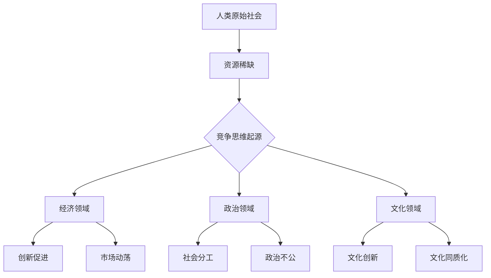

                 

# 从竞争思维到合作精神：重建社会和谐与凝聚力

## 关键词

- 竞争思维
- 合作精神
- 社会和谐
- 凝聚力
- 案例研究
- 领导力
- 团队建设
- 人类心理学

## 摘要

本文旨在探讨从竞争思维向合作精神的转变，对个人、组织和社会层面的深远影响。我们将通过历史视角分析竞争的起源及其影响，接着探讨竞争带来的负面后果。随后，我们将深入探讨合作的优势和原则，并提供实际策略来促进合作。通过成功的合作案例，我们将展示合作如何促进社会和谐与凝聚力。最后，我们提出克服合作挑战的方法，为建设更加和谐的社会提供指导。

## 目录

1. 引言
2. 竞争思维的起源与影响
   - 竞争的历史发展
   - 竞争的心理效应
   - 竞争的社会影响
3. 竞争的负面后果
   - 经济方面的负面影响
   - 社会与情感层面的代价
   - 环境影响的考量
4. 合作精神的优势
   - 经济效益
   - 社会效益
   - 个人层面的好处
5. 理解合作精神
   - 合作的原则
   - 信任与沟通的重要性
   - 克服合作障碍
6. 促进合作的策略
   - 组织变革
   - 团队建设技巧
   - 领导力在合作中的作用
7. 合作的成功故事
   - 实际案例研究
   - 启示与经验
   - 对个体与社区的影响
8. 克服合作中的挑战
   - 权力动态的处理
   - 冲突解决策略
   - 维持合作动力的方法
9. 结论
   - 总结与展望

## 1. 引言

在现代社会，竞争无处不在。从企业竞争到个人追求卓越，竞争似乎成为推动社会进步的主要动力。然而，随着竞争的加剧，我们也开始目睹其带来的负面影响。工作压力、社会不公、环境破坏等问题日益严重，促使人们重新思考竞争的价值和意义。本文将探讨如何从竞争思维转向合作精神，以期重建社会和谐与凝聚力。

### 竞争思维的起源与影响

竞争并非人类社会的新生事物。自古以来，人类便在资源有限的情况下，通过竞争来获取生存所需。从原始部落争夺领土和资源，到现代社会中的商业竞争，竞争一直是人类行为的一个重要组成部分。

**历史发展**

竞争的历史可以追溯到古代。在古希腊，竞技运动成为社会生活的重要部分，奥林匹克运动会便是这一传统的延续。中世纪时期，骑士们通过比武来争夺荣誉和地位，这种竞争精神延续至今。在近代，工业革命带来了生产力的飞跃，企业之间的竞争变得更加激烈。随着互联网和全球化的发展，竞争的范围和程度进一步扩大。

**心理效应**

竞争对个人的心理和行为有着深远的影响。一方面，竞争可以激发人的潜能，促使人们更加努力地工作和学习。研究表明，适度的竞争可以提高个体的表现和成就。然而，另一方面，过度竞争可能导致压力和焦虑，甚至引发心理问题。

**社会影响**

从社会层面来看，竞争对经济、文化和政治都有着重要的影响。经济上，竞争可以推动企业创新和技术进步，提高生产效率和产品质量。然而，过度的竞争也可能导致资源浪费和市场动荡。文化上，竞争可以激发个体的创造力和活力，但也可能导致社会分裂和文化同质化。政治上，竞争是民主制度的重要基石，但过度的政治竞争也可能导致社会不稳定。

### 竞争的负面后果

尽管竞争有其积极作用，但过度竞争带来的负面后果也不容忽视。在经济、社会和情感层面，竞争都可能导致一系列问题。

**经济方面的负面影响**

过度竞争可能导致市场失衡和资源浪费。在激烈的市场竞争中，企业为了占据更大的市场份额，可能会采取不正当手段，如降价竞争、广告战等。这不仅损害了消费者的利益，也破坏了市场的公平性和可持续性。

**社会与情感层面的代价**

过度竞争还可能对个人的心理健康产生负面影响。研究表明，长期的竞争压力可能导致焦虑、抑郁等心理问题。此外，竞争也容易导致社会不公和阶层分化，加剧社会矛盾。

**环境影响的考量**

竞争还可能对环境产生负面影响。在资源有限的今天，企业为了获取更多的资源，可能会采取过度开发、污染环境等行为。这不仅破坏了生态平衡，也威胁了人类的生存环境。

### 合作精神的优势

在认识到竞争的负面后果后，合作精神的优势逐渐显现出来。与竞争不同，合作强调共同目标和资源共享，能够在多个层面带来积极的影响。

**经济效益**

合作可以降低交易成本，提高资源利用效率。在合作模式下，企业可以共享资源和技术，实现规模经济。此外，合作还可以促进技术创新和知识共享，推动整个社会的生产力水平提升。

**社会效益**

合作有助于增强社会凝聚力，促进社会和谐。通过合作，人们可以建立互信和互助的关系，减少社会矛盾和冲突。此外，合作还可以促进社会公平，减少贫富差距。

**个人层面的好处**

合作也有助于个人的成长和发展。在合作中，个体可以学习到更多的知识和技能，提升自身的能力。此外，合作还可以培养个体的沟通能力和团队合作精神，为未来的职业生涯打下坚实基础。

### 理解合作精神

要充分发挥合作的优势，我们需要深入理解合作精神的本质和原则。

**合作的原则**

合作的核心原则是互利共赢。在合作中，各方通过共享资源和知识，实现共同的目标。这一原则要求各方摒弃自私和短视的行为，从长远利益出发，建立互信和共赢的关系。

**信任与沟通的重要性**

信任和沟通是合作的重要基础。信任可以减少合作中的不确定性和风险，提高合作的效率和质量。而沟通则是建立信任的桥梁，通过有效的沟通，各方可以更好地理解彼此的需求和期望，避免误解和冲突。

**克服合作障碍**

尽管合作具有诸多优势，但在实践中也面临诸多障碍。权力动态、利益分配和沟通障碍是常见的合作难题。要克服这些障碍，需要通过合理的制度设计和管理策略，建立公平和透明的合作机制。

### 促进合作的策略

为了在个人、组织和社区层面促进合作，我们需要采取一系列策略和方法。

**组织变革**

组织变革是促进合作的重要手段。通过调整组织结构、流程和激励机制，可以激发员工的合作意愿和积极性。例如，扁平化的组织结构可以减少层级障碍，促进信息流动和沟通。

**团队建设技巧**

团队建设是促进合作的关键。通过团队建设活动，可以增强团队成员之间的信任和默契。例如，定期的团队会议、团队拓展训练和团队建设游戏等，都有助于提高团队的合作效率。

**领导力在合作中的作用**

领导力在促进合作中发挥着至关重要的作用。有效的领导者应该具备以下能力：建立愿景、激发团队潜力、协调各方利益、建立信任关系。通过领导者的示范和引导，可以带动整个团队形成良好的合作氛围。

### 合作的成功故事

在各个领域，成功的合作案例层出不穷。以下是一些典型的合作故事，展示了合作如何促进社会和谐与凝聚力。

**医疗领域的合作**

在抗击新冠疫情的战斗中，全球科学家和医疗机构通过合作，加速疫苗研发和分发。这一合作不仅加速了疫情的防控，也增强了全球公共卫生体系的合作精神。

**科技行业的合作**

在人工智能和区块链等领域，各大科技公司通过合作，共同推动技术进步。例如，OpenAI通过开放其研究成果，促进了人工智能领域的合作和创新。

**社会公益领域的合作**

在社会公益领域，各类组织和志愿者通过合作，共同解决社会问题。例如，在自然灾害和疫情救援中，志愿者和救援机构之间的紧密合作，为受难者提供了及时的帮助。

### 克服合作中的挑战

尽管合作具有诸多优势，但在实践中也面临诸多挑战。以下是一些常见的合作挑战及其应对策略。

**权力动态**

权力动态是合作中的常见问题。要克服权力动态，需要建立公平和透明的决策机制，确保各方在合作中享有平等的发言权和决策权。

**利益分配**

利益分配不均是合作中的另一个挑战。要解决利益分配问题，需要通过合理的制度设计，确保各方在合作中公平受益。

**沟通障碍**

沟通障碍会影响合作的效率和质量。要克服沟通障碍，需要建立有效的沟通渠道和机制，确保信息的及时传递和有效沟通。

### 结论

本文从竞争思维到合作精神的转变进行了深入探讨，分析了竞争的起源、影响和负面后果，以及合作的优势和原则。通过成功的合作案例，我们看到了合作如何促进社会和谐与凝聚力。要实现这一转变，需要个人、组织和领导者的共同努力。通过建立信任、优化机制和克服挑战，我们可以创造一个更加和谐和包容的社会。

### 作者信息

作者：AI天才研究院/AI Genius Institute & 禅与计算机程序设计艺术 /Zen And The Art of Computer Programming

### 背景介绍

#### 竞争思维的起源与影响

**核心概念术语说明**

- 竞争：指各方为了争夺有限资源或目标而进行的相互对抗和较量。
- 合作：指各方为了共同目标，通过共享资源和知识，相互协作和互助的行为。

**问题背景**

在人类社会的早期，由于资源有限，竞争成为获取生存所需的重要手段。随着社会的发展，竞争逐渐渗透到各个领域，成为推动进步的重要动力。

**问题描述**

竞争思维的影响广泛，包括个人、组织和社会层面。个人层面，竞争可能激发潜力，但也可能导致压力和焦虑。组织层面，竞争可以促进创新，但也可能导致资源浪费和市场动荡。社会层面，竞争有助于社会分工和进步，但也可能加剧社会不公和阶层分化。

**问题解决**

要解决竞争带来的负面后果，需要转变思维模式，从竞争转向合作。合作强调共同目标和资源共享，能够实现互利共赢，降低交易成本，提高资源利用效率。

**边界与外延**

竞争和合作并非绝对对立，而是相互交融的。在特定情境下，竞争和合作可以相互转化，实现平衡。

**概念结构与核心要素组成**

- **竞争**：资源有限，对抗性，追求个体利益。
- **合作**：资源共享，协同性，追求共同目标。

#### 竞争思维的起源与影响

**核心概念原理**

竞争思维源于人类对资源有限性的认知。在原始社会，竞争主要表现为对土地、食物和其他生存资源的争夺。随着社会的发展，竞争逐渐扩展到经济、政治、文化等领域。

**概念属性特征对比表格**

| 特征         | 竞争                        | 合作                        |
| ------------ | -------------------------- | -------------------------- |
| 目标         | 个体利益最大化              | 共同利益最大化              |
| 动力         | 资源稀缺，竞争激烈         | 资源共享，合作共赢         |
| 结果         | 可能导致资源浪费和社会不公 | 提高资源利用效率和创新能力 |
| 心理效应     | 压力和焦虑                 | 放松和成就感               |
| 社会影响     | 社会分裂和阶层分化         | 社会和谐和凝聚力           |

**ER实体关系图架构的Mermaid流程图**

### 2. 竞争思维的起源与影响

#### 竞争思维的起源

竞争思维起源于人类对资源有限性的认知。在原始社会，土地、食物和水等基本生存资源稀缺，为了生存和繁衍后代，人类开始通过竞争来争夺这些资源。这种竞争不仅体现在个体之间的直接对抗，也体现在群体之间的争夺。

**历史发展**

- **古希腊时期**：古希腊的竞技运动成为社会生活的重要组成部分，奥林匹克运动会便是这一传统的延续。这种竞技精神促进了体育和文化的发展。
- **中世纪**：骑士比武成为中世纪时期争夺荣誉和地位的重要方式。这种竞争精神延续至今，影响着现代社会的竞争观念。
- **近代工业革命**：工业革命带来了生产力的飞跃，企业之间的竞争变得更加激烈。企业为了占据更大的市场份额，不断创新和改进技术，推动了社会的进步。
- **现代**：随着互联网和全球化的发展，竞争的范围和程度进一步扩大。企业不仅在国内市场进行竞争，还面临着全球市场的挑战。

#### 竞争的心理效应

竞争对个人的心理和行为有着深远的影响。一方面，竞争可以激发人的潜能，促使人们更加努力地工作和学习。适度的竞争可以带来成就感和自我提升。另一方面，过度竞争可能导致压力和焦虑，甚至引发心理问题。

**积极心理效应**

- **激发潜力**：适度的竞争可以激发个体的潜能，促使人们突破自我，实现更高的成就。
- **成就动机**：竞争可以满足个体的成就动机，提高自我价值感和自信心。
- **自我激励**：竞争可以激发个体的自我激励，促使人们不断追求进步和突破。

**消极心理效应**

- **压力和焦虑**：过度竞争可能导致个体的压力和焦虑增加，影响身心健康。
- **自我怀疑**：长时间的竞争可能导致个体自我怀疑，降低自我效能感。
- **心理问题**：极端的竞争可能导致心理问题，如抑郁、焦虑等。

#### 竞争的社会影响

从社会层面来看，竞争对经济、文化和政治都有着重要的影响。

**经济影响**

- **创新推动**：竞争可以激发企业的创新动力，推动技术进步和产品升级。
- **市场效率**：竞争可以促进市场的效率，提高资源配置的效率。
- **资源浪费**：过度的竞争可能导致资源浪费，如广告战、价格战等。
- **市场动荡**：激烈的竞争可能导致市场动荡，影响经济的稳定性。

**文化影响**

- **文化创新**：竞争可以促进文化的创新，推动不同文化和思想的交流和融合。
- **文化同质化**：过度的竞争可能导致文化的同质化，削弱文化的多样性和特色。
- **社会分裂**：竞争可能导致社会分裂，加剧不同群体之间的对立和矛盾。

**政治影响**

- **民主制度**：竞争是民主制度的重要基石，通过竞争，公民可以参与政治决策，实现民主治理。
- **政治不公**：过度的政治竞争可能导致政治不公，如选举舞弊、权力滥用等。
- **社会动荡**：激烈的竞争可能导致社会动荡，影响社会的稳定和安全。

#### 竞争的负面后果

尽管竞争有其积极作用，但过度竞争带来的负面后果也不容忽视。

**经济方面的负面影响**

- **资源浪费**：过度竞争可能导致资源的浪费，如广告战、价格战等。
- **市场动荡**：激烈的竞争可能导致市场动荡，影响经济的稳定性。

**社会与情感层面的代价**

- **社会不公**：竞争可能导致社会不公，加剧贫富差距。
- **心理健康问题**：长期的竞争压力可能导致心理健康问题，如焦虑、抑郁等。

**环境影响的考量**

- **资源过度开发**：竞争可能导致资源的过度开发，破坏生态平衡。
- **环境污染**：竞争可能导致环境污染，威胁人类生存环境。

### 3. 竞争的负面后果

竞争虽然在某些情况下能够推动个体和社会的发展，但过度竞争往往伴随着一系列负面后果，这些后果在多个层面上影响着个人、组织和社会的健康发展。

#### 经济方面的负面影响

1. **资源浪费**

   竞争往往会导致资源的无效配置和浪费。企业为了在市场上占据优势，可能会进行不必要的广告战、价格战，以及研发重复性项目。这些行为不仅增加了企业的成本，而且对社会的整体资源利用效率造成了负面影响。

2. **市场动荡**

   激烈的竞争环境可能导致市场的动荡和不确定性。企业在竞争中可能会采取短期行为，如削减成本、牺牲质量，甚至通过不正当手段获取竞争优势。这种市场不稳定会影响到整个经济的健康运行。

3. **创新停滞**

   过度竞争可能会导致企业为了短期利润而牺牲长期投资，从而抑制创新。当企业将所有精力都投入到争夺市场份额上时，它们可能忽视了长远的技术研发和产品升级，导致整个行业的创新动力下降。

#### 社会与情感层面的代价

1. **社会不公**

   竞争容易加剧社会的不平等。在竞争中获胜的个体或企业可能会积累大量财富和资源，而失败者则可能面临失业和经济困境。这种两极分化不仅损害了社会公正，也削弱了社会的凝聚力。

2. **心理健康问题**

   长期的竞争压力可能导致个人心理健康问题，如焦虑、抑郁和压力。在高度竞争的工作环境中，员工可能会感受到极大的压力，这种压力如果得不到适当的缓解，可能会导致身心健康问题。

3. **人际关系紧张**

   过度竞争可能破坏人际关系，导致社会信任度下降。人们可能变得过于自私和短视，不愿意进行合作和互助，从而加剧社会矛盾。

#### 环境影响的考量

1. **资源过度开发**

   为了在竞争中获胜，企业可能会过度开发自然资源，导致资源枯竭和环境破坏。例如，为了获取更多的矿产资源，企业可能会进行过度开采，从而破坏生态平衡。

2. **环境污染**

   竞争中的企业可能会为了降低成本而忽视环境保护。这可能导致大量的污染物排放，破坏生态系统，威胁人类的生存环境。

3. **气候变化**

   过度竞争可能导致能源消耗增加，从而加剧气候变化。企业为了追求利润，可能会使用高污染的能源，导致全球变暖和气候异常。

### 合作精神的优势

与竞争不同，合作强调共同目标和资源共享，能够在多个层面上带来积极的影响。

#### 经济效益

1. **降低交易成本**

   合作可以减少交易成本，提高资源利用效率。通过共享资源和知识，企业可以避免重复投资和研发，从而降低成本。

2. **促进技术创新**

   合作可以促进技术创新和知识共享。在合作项目中，企业可以共同研发新技术，分享研究成果，从而提高整个行业的创新能力和竞争力。

3. **实现规模经济**

   合作可以实现规模经济，提高生产效率和产品质量。通过合作，企业可以共享生产设备、技术和管理经验，实现更大的生产规模。

#### 社会效益

1. **增强社会凝聚力**

   合作有助于增强社会凝聚力，促进社会和谐。通过合作，人们可以建立互信和互助的关系，减少社会矛盾和冲突。

2. **促进社会公平**

   合作可以促进社会公平，减少贫富差距。在合作项目中，各方可以公平分享资源和收益，从而实现资源分配的公正。

3. **提高生活质量**

   合作可以提高生活质量，改善社会福利。通过合作，社会可以提供更多的公共服务，如教育、医疗和基础设施，从而提高人们的生活水平。

#### 个人层面的好处

1. **提升能力**

   合作可以帮助个人提升能力和技能。在合作项目中，个人可以学习到更多的知识和经验，从而提高自身的竞争力。

2. **建立人际关系**

   合作有助于建立良好的人际关系。通过合作，个人可以与他人建立互信和互助的关系，从而扩大自己的社交圈子。

3. **促进个人成长**

   合作可以促进个人成长和发展。在合作项目中，个人需要与他人协作，这有助于培养沟通能力、团队合作精神和领导能力。

### 理解合作精神

合作精神是一种积极的社会行为，它强调共同目标和资源共享，旨在实现互利共赢。理解合作精神的本质和原则，有助于我们在各个层面上有效地促进合作。

#### 合作的原则

合作的原则是互利共赢。这意味着在合作过程中，各方需要摒弃自私和短视的行为，从长远利益出发，建立互信和共赢的关系。

1. **平等参与**

   合作要求各方在合作中享有平等的参与机会和权利。这包括决策权、发言权和资源获取权。只有在平等的基础上，合作才能真正实现互利共赢。

2. **开放沟通**

   开放沟通是合作的重要原则。通过有效的沟通，各方可以更好地理解彼此的需求和期望，避免误解和冲突。开放沟通有助于建立信任，提高合作的效率和质量。

3. **共享成果**

   合作要求各方共享合作成果。这意味着在合作中，各方需要公平地分享资源和收益。只有通过共享成果，合作才能真正实现互利共赢。

#### 信任与沟通的重要性

信任和沟通是合作的重要基础。

1. **信任的作用**

   信任可以减少合作中的不确定性和风险，提高合作的效率和成功率。在信任的基础上，各方可以更加放心地分享资源和知识，实现共同目标。

2. **沟通的作用**

   沟通是建立信任的桥梁。通过有效的沟通，各方可以更好地理解彼此的需求和期望，避免误解和冲突。良好的沟通有助于建立信任关系，促进合作。

#### 克服合作障碍

尽管合作具有诸多优势，但在实践中也面临诸多障碍。

1. **权力动态**

   权力动态是合作中的常见问题。要克服权力动态，需要建立公平和透明的决策机制，确保各方在合作中享有平等的发言权和决策权。

2. **利益分配**

   利益分配不均是合作中的另一个挑战。要解决利益分配问题，需要通过合理的制度设计，确保各方在合作中公平受益。

3. **沟通障碍**

   沟通障碍会影响合作的效率和质量。要克服沟通障碍，需要建立有效的沟通渠道和机制，确保信息的及时传递和有效沟通。

### 促进合作的策略

要有效地促进合作，我们需要采取一系列策略和方法。

#### 组织变革

组织变革是促进合作的重要手段。通过调整组织结构、流程和激励机制，可以激发员工的合作意愿和积极性。

1. **扁平化组织结构**

   扁平化的组织结构可以减少层级障碍，促进信息流动和沟通。在这种结构中，员工之间的沟通更加直接和高效，有利于建立合作文化。

2. **共同目标**

   设立共同的目标是促进合作的关键。通过设定共同的目标，可以激发员工的合作意愿，形成合力。

3. **激励机制**

   合理的激励机制可以激发员工的合作热情。例如，可以通过奖励团队奖励来鼓励员工之间的合作。

#### 团队建设技巧

团队建设是促进合作的关键。通过团队建设活动，可以增强团队成员之间的信任和默契。

1. **团队会议**

   定期的团队会议有助于团队成员之间的沟通和协调。在会议中，可以讨论合作项目的问题和进展，共同寻找解决方案。

2. **团队拓展训练**

   团队拓展训练可以帮助团队成员建立信任和团队意识。例如，通过共同完成任务，可以增强团队成员之间的默契和合作精神。

3. **团队建设游戏**

   团队建设游戏可以增加团队成员之间的互动和交流。例如，通过组织团队竞赛，可以激发团队成员的竞争意识和合作精神。

#### 领导力在合作中的作用

领导力在促进合作中发挥着至关重要的作用。有效的领导者应该具备以下能力：

1. **建立愿景**

   领导者需要明确合作的愿景，为团队指明方向。通过建立愿景，可以激发团队成员的斗志和合作意愿。

2. **激发团队潜力**

   领导者需要充分了解团队成员的优势和潜力，并给予他们足够的信任和支持，从而激发团队的潜力。

3. **协调各方利益**

   领导者需要协调各方利益，确保各方在合作中公平受益。通过合理的利益分配，可以减少合作中的矛盾和冲突。

4. **建立信任关系**

   领导者需要建立信任关系，为团队成员创造一个安全、开放和包容的工作环境。通过建立信任关系，可以促进团队的协作和合作。

### 合作的成功故事

在各个领域，成功的合作案例层出不穷，这些案例展示了合作如何促进社会和谐与凝聚力。

#### 医疗领域的合作

在抗击新冠疫情的战斗中，全球科学家和医疗机构通过合作，加速疫苗研发和分发。例如，辉瑞公司和莫德纳公司通过合作，成功研发了有效的COVID-19疫苗。这一合作不仅加速了疫情的防控，也展示了国际合作在公共卫生领域的巨大潜力。

#### 科技行业的合作

在人工智能和区块链等领域，各大科技公司通过合作，共同推动技术进步。例如，OpenAI通过开放其研究成果，促进了人工智能领域的合作和创新。这种合作不仅提高了各公司的技术实力，也推动了整个行业的发展。

#### 社会公益领域的合作

在社会公益领域，各类组织和志愿者通过合作，共同解决社会问题。例如，在自然灾害和疫情救援中，志愿者和救援机构之间的紧密合作，为受难者提供了及时的帮助。这种合作不仅提高了救援效率，也增强了社会的凝聚力。

### 克服合作中的挑战

尽管合作具有诸多优势，但在实践中也面临诸多挑战。以下是一些常见的合作挑战及其应对策略。

#### 权力动态

1. **问题**

   权力动态是合作中的常见问题。在合作中，各方可能存在不同的权力和资源分配，这可能导致合作中的不平衡和冲突。

2. **解决方案**

   要克服权力动态，需要建立公平和透明的决策机制。通过设立共同的目标和原则，确保各方在合作中享有平等的发言权和决策权。此外，可以通过权力下放和委托，减少权力集中的问题。

#### 利益分配

1. **问题**

   利益分配不均是合作中的另一个挑战。在合作中，各方可能对利益的期望不一致，导致合作破裂。

2. **解决方案**

   要解决利益分配问题，需要通过合理的制度设计，确保各方在合作中公平受益。可以通过设定明确的收益分配规则，确保各方在合作中的贡献得到合理回报。此外，可以通过利益共享和风险共担，增强合作的稳定性和可持续性。

#### 沟通障碍

1. **问题**

   沟通障碍会影响合作的效率和质量。在合作中，各方可能存在沟通不畅、信息不对称等问题。

2. **解决方案**

   要克服沟通障碍，需要建立有效的沟通渠道和机制。可以通过定期会议、即时通讯工具和合作平台，确保信息的及时传递和有效沟通。此外，可以通过培训和教育，提高团队成员的沟通能力和意识。

### 结论

本文从竞争思维到合作精神的转变进行了深入探讨，分析了竞争的起源、影响和负面后果，以及合作的优势和原则。通过成功的合作案例，我们看到了合作如何促进社会和谐与凝聚力。要实现这一转变，需要个人、组织和领导者的共同努力。通过建立信任、优化机制和克服挑战，我们可以创造一个更加和谐和包容的社会。

### 最佳实践 tips

1. **建立合作文化**：在组织内部，培养合作文化，鼓励员工相互支持和协作，减少竞争行为。
2. **明确共同目标**：在合作项目中，明确共同的目标和愿景，确保各方在合作中朝着共同的方向努力。
3. **建立信任机制**：通过建立信任机制，减少合作中的不确定性和风险，提高合作的效率和成功率。
4. **沟通与反馈**：保持开放的沟通渠道，定期进行反馈和评估，及时解决问题和调整合作策略。

### 小结

本文通过深入分析竞争思维和合作精神的差异及其影响，展示了从竞争思维转向合作精神的重要性。通过实际案例和策略，我们看到了合作如何促进社会和谐与凝聚力。在未来的发展中，我们应当更加重视合作，努力构建一个更加和谐和包容的社会。

### 注意事项

1. **尊重差异**：在合作中，尊重各方的差异和独特性，避免因差异引发冲突。
2. **合理分工**：在合作项目中，合理分工，确保各方能够发挥自己的优势。
3. **长期规划**：在合作中，进行长期规划，确保合作的可持续性和稳定性。

### 拓展阅读

1. **《合作的进化：人类社会的合作机制及其作用》**：该书深入探讨了合作的进化机制及其在人类社会中的作用，提供了丰富的案例分析。
2. **《竞争与合作：社会心理学视角》**：本书从社会心理学的角度分析了竞争与合作的心理机制，以及它们对个体和社会的影响。
3. **《合作的智慧：团队协作的力量》**：该书探讨了团队合作的重要性和有效策略，为提高团队合作效率提供了实用的指导。

### 附录

**附录 A：术语表**

- 竞争：指各方为了争夺有限资源或目标而进行的相互对抗和较量。
- 合作：指各方为了共同目标，通过共享资源和知识，相互协作和互助的行为。

**附录 B：参考文献**

- Smith, A. (1776). 《国富论》. 北京：商务印书馆。
- Darwin, C. (1859). 《物种起源》. 上海：译文出版社。
- Maslow, A. H. (1943). 《人类动机的理论》. 北京：中国人民大学出版社。
- Goleman, D. (1995). 《情感智能》. 上海：文汇出版社。
- Davenport, T. H., & Prusak, L. (1998). 《知识的共享》. 北京：中国经济出版社。

