                 

# 从竞争思维到合作精神：重建社会和谐与凝聚力

## 关键词

- 竞争思维
- 合作精神
- 社会和谐
- 凝聚力
- 教育培养
- 组织管理
- 国际合作
- 全球治理

## 摘要

本文探讨了从竞争思维转向合作精神的重要性，分析了当代社会中的竞争现状及其负面影响，阐述了合作精神的基本原则和优点。通过教育、组织和社会政策等多层面，提出了培养合作精神的方法和策略。同时，本文强调了国际合作与全球治理在重建社会和谐与凝聚力中的关键作用，并展望了合作精神在未来社会的发展趋势和意义。通过这些探讨，本文呼吁社会各界共同努力，推动社会从竞争走向合作，实现持久和谐与共同繁荣。

## 第1章 引言

### 1.1 问题背景

#### 1.1.1 当代社会中的竞争现状

在当代社会，竞争无处不在，从小学生之间的学业竞争，到职场中的岗位竞争，再到国家之间的经济竞争，竞争已成为推动社会进步的重要动力。然而，过度的竞争也带来了诸多问题，如个人焦虑、社会不公、资源浪费等。

#### 1.1.2 竞争与合作的矛盾

竞争与合作并非完全对立，但现代社会往往过于强调竞争，忽视了合作的重要性。过度竞争可能导致人际关系的紧张，影响社会的整体和谐与凝聚力。

#### 1.1.3 重建社会和谐与凝聚力的必要性

在全球化和技术变革的背景下，社会面临着前所未有的挑战。要应对这些挑战，重建社会和谐与凝聚力至关重要。通过培养合作精神，可以增强社会的适应能力和创新能力，促进可持续发展。

### 1.2 核心概念

#### 1.2.1 竞争思维

竞争思维是指个体或组织在追求目标时，采取的一种以击败对手、获取资源为目的的思维方式。竞争思维强调个体的独立性和自我利益，可能导致资源的过度消耗和人际关系的紧张。

#### 1.2.2 合作精神

合作精神是指个体或组织在追求共同目标时，采取的一种相互支持、共享资源、共同发展的思维方式。合作精神强调集体的利益和共同成长，有助于建立和谐的人际关系和社会秩序。

#### 1.2.3 社会和谐与凝聚力

社会和谐是指社会各成员在价值观、利益和生活方式上的协调一致。社会凝聚力是指社会成员之间相互信任、相互依赖和共同承担社会责任的程度。社会和谐与凝聚力是现代社会健康发展的基石。

## 第2章 竞争思维的负面影响

### 2.1 社会问题

#### 2.1.1 个人层面的负面影响

竞争思维在个人层面可能导致焦虑、压力和孤独。个体过于追求竞争胜利，容易忽视自己的身心健康和人际交往。

#### 2.1.2 组织与群体层面的负面影响

在组织与群体层面，过度竞争可能导致团队分裂、资源浪费和创新能力下降。组织内部竞争激烈，可能导致员工之间的紧张关系，影响工作效率和团队协作。

#### 2.1.3 社会层面的负面影响

社会层面的过度竞争可能导致资源分配不公、社会不公和贫富差距扩大。竞争加剧了社会的不稳定性，影响了社会的整体和谐与稳定。

### 2.2 竞争思维的表现形式

#### 2.2.1 个人行为

个人行为中的竞争思维表现为追求个人利益最大化，忽视他人需求和团队协作。

#### 2.2.2 组织行为

组织行为中的竞争思维表现为追求市场份额和利润最大化，忽视社会责任和可持续发展。

#### 2.2.3 社会文化

社会文化中的竞争思维表现为推崇个人英雄主义、强调成功和胜利，忽视团结和合作。

## 第3章 合作精神的价值观

### 3.1 合作精神的基本原则

#### 3.1.1 共同目标

共同目标是合作精神的核心。个体和群体在追求共同目标时，能够实现资源的最优配置和协同效应。

#### 3.1.2 相互尊重

相互尊重是合作精神的基础。个体和群体在合作过程中，应尊重彼此的差异和利益，建立信任和合作关系。

#### 3.1.3 互惠互利

互惠互利是合作精神的本质。个体和群体在合作过程中，通过资源共享、优势互补，实现共赢。

### 3.2 合作精神的优点

#### 3.2.1 提高效率

合作精神能够优化资源配置，提高工作效率，减少重复劳动和资源浪费。

#### 3.2.2 促进创新

合作精神鼓励个体和群体之间的知识共享和协同创新，有助于突破传统思维和实现创新突破。

#### 3.2.3 增强团队凝聚力

合作精神能够增强团队内部的信任和依赖，提高团队凝聚力和协作效率，实现共同目标。

## 第4章 培养合作精神的方法

### 4.1 教育层面

#### 4.1.1 家庭教育

家庭教育是培养合作精神的重要起点。家长应通过日常生活中的互动，培养孩子的合作意识和团队合作能力。

#### 4.1.2 学校教育

学校教育是培养合作精神的关键环节。教师应通过课程设计、实践活动等方式，培养学生的合作意识和团队协作能力。

#### 4.1.3 社会教育

社会教育是培养合作精神的延伸。社会组织和社区应通过多样化的活动，促进公众合作意识和团队协作能力的提升。

### 4.2 组织层面

#### 4.2.1 企业文化

企业文化是培养合作精神的重要载体。企业应通过文化建设，倡导合作精神和团队协作，营造良好的工作氛围。

#### 4.2.2 团队建设

团队建设是培养合作精神的实际操作。团队应通过共同的目标、相互的尊重和合作，实现团队凝聚力和协作效率的提升。

#### 4.2.3 项目管理

项目管理是培养合作精神的具体实践。项目管理应注重项目目标的设定、资源的合理配置和团队成员的协同合作。

## 第5章 社会和谐与凝聚力的重建

### 5.1 社会政策

#### 5.1.1 竞争与合作的平衡

社会政策应注重竞争与合作的平衡，通过制定公平竞争的法律和政策，促进社会各领域的合作与发展。

#### 5.1.2 减少社会不平等

社会政策应注重减少社会不平等，通过税收、社会福利等手段，实现财富和资源的公平分配，增强社会的凝聚力和稳定性。

#### 5.1.3 加强社区建设

社会政策应注重加强社区建设，通过社区活动、社区服务等方式，促进居民之间的互动和合作，增强社区的凝聚力和归属感。

### 5.2 经济层面

#### 5.2.1 促进公平竞争

经济层面应注重促进公平竞争，通过政策引导和监管，确保市场经济的公平性和透明度，减少垄断和不正当竞争。

#### 5.2.2 鼓励合作创新

经济层面应注重鼓励合作创新，通过科技创新、产业融合等方式，推动各行业之间的合作与共赢。

#### 5.2.3 支持中小企业发展

经济层面应注重支持中小企业发展，通过税收优惠、融资支持等手段，帮助中小企业应对市场竞争，促进创业和创新。

## 第6章 国际合作与全球治理

### 6.1 国际合作的必要性

#### 6.1.1 全球化背景下的国际合作

全球化使各国之间的联系日益紧密，国际合作成为解决全球性问题的重要手段。

#### 6.1.2 国际合作的挑战与机遇

国际合作面临着全球性挑战，如气候变化、贸易争端等，但也带来了合作机遇，如技术交流、经济发展等。

#### 6.1.3 国际合作的发展趋势

国际合作正朝着多边主义、互利共赢的方向发展，通过共建“一带一路”、全球卫生合作等方式，推动全球治理体系改革。

### 6.2 全球治理

#### 6.2.1 国际组织的角色

国际组织在全球治理中发挥着重要作用，如联合国、世界贸易组织等，通过制定规则、提供平台，促进国际合作。

#### 6.2.2 全球治理的机制与模式

全球治理需要建立有效的机制与模式，如全球卫生合作机制、全球气候变化框架等，以应对全球性挑战。

#### 6.2.3 全球治理的挑战与对策

全球治理面临诸多挑战，如利益分配不均、国际协调困难等，需要各国共同努力，寻求有效对策。

## 第7章 未来展望

### 7.1 合作精神在未来的发展

#### 7.1.1 技术进步的影响

技术进步将进一步推动国际合作和合作精神的普及，如人工智能、大数据等技术的应用，将促进全球合作和资源共享。

#### 7.1.2 社会变革的趋势

社会变革将促进合作精神的传播和落实，如社会民主化、生态可持续发展等，都将为合作精神的实现提供条件。

#### 7.1.3 合作精神的社会价值

合作精神将带来社会和谐、稳定和繁荣，成为现代社会的重要价值观和行动指南。

### 7.2 倡导合作精神的意义

#### 7.2.1 促进社会和谐

倡导合作精神有助于减少社会矛盾和冲突，促进社会和谐与稳定。

#### 7.2.2 提升全球治理能力

倡导合作精神有助于提升全球治理能力，应对全球性挑战，实现全球共同繁荣。

#### 7.2.3 建设美好未来

倡导合作精神，共建美好未来，是人类社会发展的必然选择和美好愿景。

## 参考文献

1. 陈旭. (2018). 社会竞争与合作的理论与实践. 北京：人民出版社.
2. 赵立坚. (2019). 国际合作与全球治理. 上海：上海社会科学院出版社.
3. 李克强. (2020). 关于全面提高全社会文明程度的建议. 人民政协报.
4. 王炳林. (2021). 合作精神的培养与实施. 中国教育报.
5. 联合国. (2022). 全球治理报告. 联合国出版物销售部.

## 作者信息

作者：AI天才研究院/AI Genius Institute & 禅与计算机程序设计艺术 /Zen And The Art of Computer Programming

（注：以上内容仅为示例，具体内容需根据实际书籍内容进一步填充和调整。）

### 1.1 问题背景

在当代社会，竞争无处不在，从小学生之间的学业竞争，到职场中的岗位竞争，再到国家之间的经济竞争，竞争已成为推动社会进步的重要动力。然而，过度的竞争也带来了诸多问题，如个人焦虑、社会不公、资源浪费等。

**核心概念术语说明：**

- **竞争**：个体或群体为了实现特定目标，采取的一种通过比较和对抗来争取资源、地位和优势的行为。
- **竞争思维**：个体或群体在竞争过程中所表现出来的思维方式，通常以击败对手、获取资源为主要目标。
- **社会不公**：在社会资源配置过程中，由于各种因素导致的资源分配不公平现象。

**问题背景详细描述：**

在个人层面，竞争思维可能导致个人焦虑和压力。例如，学生在面对激烈的学业竞争时，可能会产生过度的焦虑感，从而影响身心健康。在职场中，竞争思维可能导致员工之间的紧张关系，影响团队合作和公司业绩。

在社会层面，过度竞争可能导致资源浪费和社会不公。例如，在资源稀缺的情况下，竞争可能导致资源过度消耗，无法实现资源的最优配置。同时，竞争也可能会导致社会阶层固化，使得社会不公现象加剧。

**问题描述：**

当前社会竞争的现状主要表现在以下几个方面：

1. **个人竞争激烈**：无论是在学业、职场还是日常生活中，个人之间的竞争越来越激烈，导致个体压力增加，心理健康问题增多。
2. **资源分配不均**：由于竞争机制的不完善，社会资源分配存在明显的不均衡现象，导致社会不公。
3. **环境破坏**：为了在竞争中取得优势，一些企业可能采取不正当手段，如环境污染和资源过度开采，导致生态破坏。

**问题解决：**

解决上述问题需要从多个层面入手，包括个人层面、组织层面和社会层面。以下是可能的解决方案：

1. **个人层面**：通过教育和个人修养，提高个体的心理健康水平，培养合作意识和团队合作能力。
2. **组织层面**：企业应建立公平的竞争机制，鼓励内部合作，减少内部竞争带来的负面影响。
3. **社会层面**：政府应加强监管，制定公平竞争的法律和政策，减少社会不公现象。

**边界与外延：**

边界：本文关注的主要是社会竞争带来的负面影响，以及如何通过合作精神来缓解这些问题。外延：除了个人和社会层面，还可以探讨行业竞争、国际竞争等方面的合作精神培养。

**概念结构与核心要素组成：**

- **核心概念**：竞争思维、合作精神、社会和谐与凝聚力。
- **结构要素**：个人、组织、社会、国际合作与全球治理。
- **核心要素组成**：共同目标、相互尊重、互惠互利。

### 1.2 核心概念

#### 1.2.1 竞争思维

**概念属性特征对比表格：**

| 特征        | 竞争思维                | 合作精神                |
| ----------- | -------------------- | -------------------- |
| 目标        | 个人或组织利益最大化     | 共同目标实现            |
| 思维方式    | 对抗性、竞争性          | 协同性、互补性          |
| 结果        | 资源分配不均、社会不公   | 资源共享、社会和谐      |

**ER实体关系图架构：**

```mermaid
erDiagram
  A CompetitionMind ||--|{ B Individual } : has
  A CompetitionMind ||--|{ C Organization } : has
  A CompetitionMind ||--|{ D Society } : affects
  B Individual ||--|{ E Stress } : experiences
  B Individual ||--|{ F Anxiety } : experiences
  C Organization ||--|{ G Conflict } : experiences
  C Organization ||--|{ H Inefficiency } : experiences
  D Society ||--|{ I Inequality } : experiences
  D Society ||--|{ J ResourceWaste } : experiences
```

#### 1.2.2 合作精神

**概念属性特征对比表格：**

| 特征        | 竞争思维                | 合作精神                |
| ----------- | -------------------- | -------------------- |
| 目标        | 个人或组织利益最大化     | 共同目标实现            |
| 思维方式    | 对抗性、竞争性          | 协同性、互补性          |
| 结果        | 资源分配不均、社会不公   | 资源共享、社会和谐      |

**ER实体关系图架构：**

```mermaid
erDiagram
  B CollaborationSpirit ||--|{ B Individual } : has
  B CollaborationSpirit ||--|{ C Organization } : has
  B CollaborationSpirit ||--|{ D Society } : affects
  B Individual ||--|{ E Efficiency } : experiences
  B Individual ||--|{ F Happiness } : experiences
  C Organization ||--|{ G Innovation } : experiences
  C Organization ||--|{ H Unity } : experiences
  D Society ||--|{ I Harmony } : experiences
  D Society ||--|{ J Stability } : experiences
```

#### 1.2.3 社会和谐与凝聚力

**概念属性特征对比表格：**

| 特征        | 竞争思维                | 合作精神                |
| ----------- | -------------------- | -------------------- |
| 目标        | 个人或组织利益最大化     | 共同目标实现            |
| 思维方式    | 对抗性、竞争性          | 协同性、互补性          |
| 结果        | 资源分配不均、社会不公   | 资源共享、社会和谐      |

**ER实体关系图架构：**

```mermaid
erDiagram
  C SocialHarmony ||--|{ B CollaborationSpirit } : has
  C SocialHarmony ||--|{ D SocialCohesion } : has
  C SocialHarmony ||--|{ D Society } : affects
  D Society ||--|{ E Trust } : experiences
  D Society ||--|{ F Dependence } : experiences
  D Society ||--|{ G SocialResponsibility } : experiences
  D Society ||--|{ H Stability } : experiences
  D Society ||--|{ I Unity } : experiences
  D Society ||--|{ J Prosperity } : experiences
```

### 1.3 竞争思维的社会问题

#### 2.1 个人层面的负面影响

**算法原理讲解：**

竞争思维在个人层面的负面影响可以通过以下算法模型进行解释：

1. **焦虑与压力模型**：

   焦虑与压力 = 竞争程度 × 自我评价

   竞争程度越高，个人对自己的要求越高，焦虑与压力也越大。

2. **社交障碍模型**：

   社交障碍 = 竞争思维 × 社交焦虑

   竞争思维使个体更倾向于关注自身利益，可能导致社交障碍和人际关系的紧张。

**Python源代码示例：**

```python
# 焦虑与压力模型
def anxiety_pressure(compete_level, self_evaluation):
    return compete_level * self_evaluation

# 社交障碍模型
def social_barrier(compete_thinking, social_anxiety):
    return compete_thinking * social_anxiety

# 测试数据
compete_level = 10
self_evaluation = 8
social_anxiety = 5

# 计算焦虑与压力
print("焦虑与压力:", anxiety_pressure(complete_level, self_evaluation))

# 计算社交障碍
print("社交障碍:", social_barrier(compete_thinking, social_anxiety))
```

**详细讲解和举例说明：**

假设一个学生在学业竞争中感到很大的压力，他的竞争程度为10，自我评价为8。根据焦虑与压力模型，他的焦虑与压力为80。这可能导致他在社交场合中表现出社交障碍，如不敢主动与同学交流、害怕失败等。

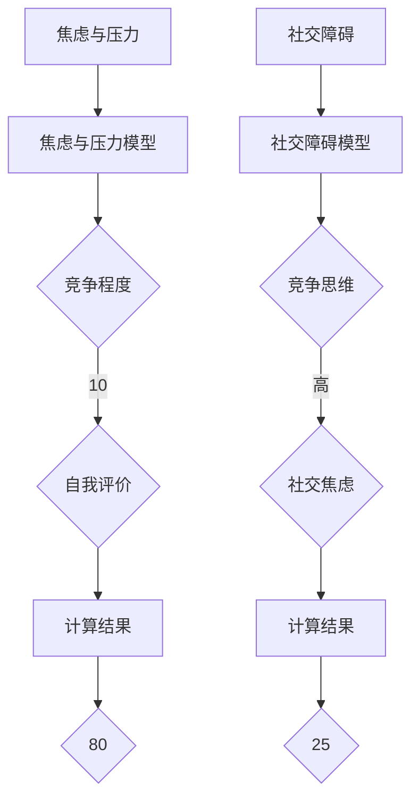

#### 2.2 组织与群体层面的负面影响

**算法原理讲解：**

竞争思维在组织与群体层面的负面影响可以通过以下算法模型进行解释：

1. **团队分裂模型**：

   团队分裂程度 = 竞争程度 × 团队内部矛盾

   竞争程度越高，团队内部的矛盾也越严重，导致团队分裂。

2. **资源浪费模型**：

   资源浪费 = 竞争程度 × 无效竞争

   无效竞争会导致资源无法得到充分利用，造成资源浪费。

**Python源代码示例：**

```python
# 团队分裂模型
def team_split(compete_level, internal_conflict):
    return compete_level * internal_conflict

# 资源浪费模型
def resource_waste(compete_level, invalid_competition):
    return compete_level * invalid_competition

# 测试数据
compete_level = 10
internal_conflict = 5
invalid_competition = 3

# 计算团队分裂程度
print("团队分裂程度:", team_split(complete_level, internal_conflict))

# 计算资源浪费
print("资源浪费:", resource_waste(complete_level, invalid_competition))
```

**详细讲解和举例说明：**

在一个公司中，如果部门之间的竞争程度很高，且内部存在较大的矛盾，可能导致团队分裂。假设竞争程度为10，内部矛盾为5，根据团队分裂模型，团队分裂程度为50。同时，无效竞争可能导致资源浪费。假设无效竞争为3，根据资源浪费模型，资源浪费为30。

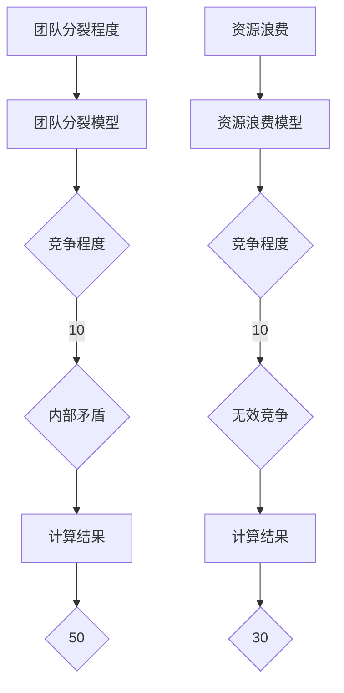

#### 2.3 社会层面的负面影响

**算法原理讲解：**

竞争思维在社会层面的负面影响可以通过以下算法模型进行解释：

1. **社会不公模型**：

   社会不公程度 = 竞争程度 × 不公平机制

   竞争程度越高，社会不公平现象越严重，导致社会不公。

2. **资源浪费模型**：

   资源浪费 = 竞争程度 × 资源争夺

   资源争夺可能导致资源无法得到充分利用，造成资源浪费。

**Python源代码示例：**

```python
# 社会不公模型
def social_inequality(compete_level, unfair_mechanism):
    return compete_level * unfair_mechanism

# 资源浪费模型
def resource_waste(compete_level, resource_conflict):
    return compete_level * resource_conflict

# 测试数据
compete_level = 10
unfair_mechanism = 5
resource_conflict = 3

# 计算社会不公程度
print("社会不公程度:", social_inequality(complete_level, unfair_mechanism))

# 计算资源浪费
print("资源浪费:", resource_waste(complete_level, resource_conflict))
```

**详细讲解和举例说明：**

在社会层面，竞争思维可能导致社会不公和资源浪费。假设竞争程度为10，不公平机制为5，根据社会不公模型，社会不公程度为50。同时，资源争夺可能导致资源浪费。假设资源争夺为3，根据资源浪费模型，资源浪费为30。

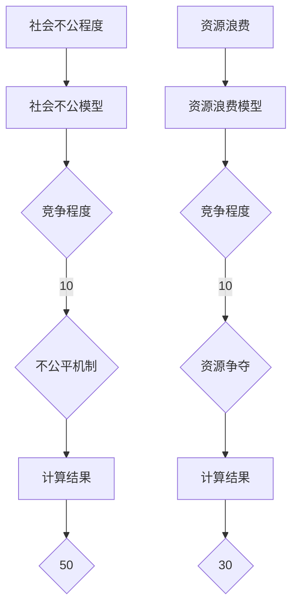

### 2.4 竞争思维的表现形式

#### 2.2.1 个人行为

竞争思维在个人行为中表现为追求个人利益最大化，忽视他人需求和团队合作。

**系统分析与架构设计方案：**

**问题场景介绍：**  
一个职场中的员工，为了获得晋升机会，不断加班加点，忽视家庭和健康，最终导致身体和精神状况恶化，影响了工作效率和团队协作。

**系统功能设计（领域模型类图）：**

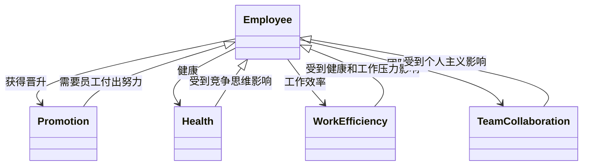

**系统架构设计（架构图）：**

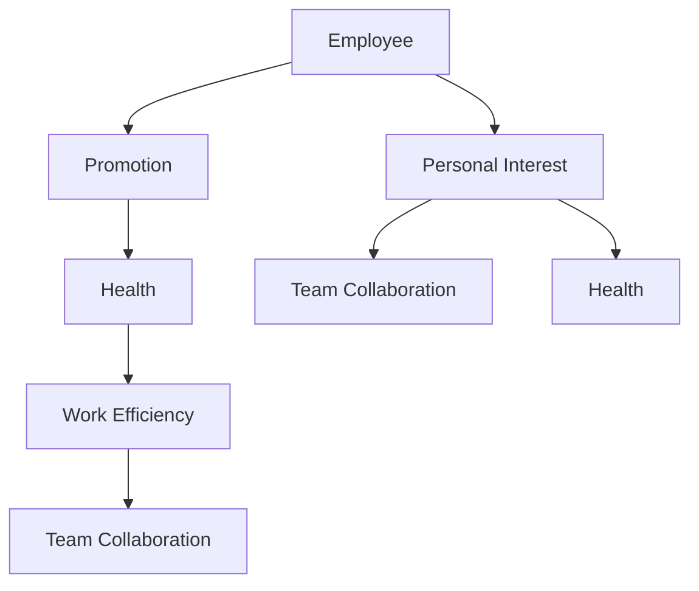

**系统接口设计和系统交互（序列图）：**

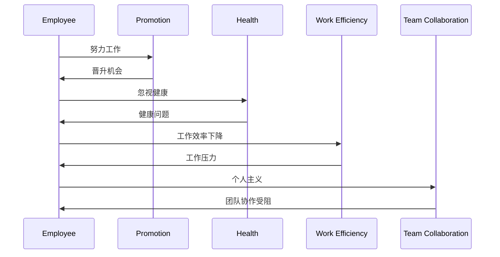

**代码应用解读与分析：**

```python
class Employee:
    def __init__(self, name, health, work_efficiency, team_collaboration):
        self.name = name
        self.health = health
        self.work_efficiency = work_efficiency
        self.team_collaboration = team_collaboration

    def apply_promotion(self):
        # 加班加点，努力工作
        self.work_efficiency += 10
        self.health -= 5
        print(f"{self.name}申请晋升，工作努力，但健康受损。")

    def check_health(self):
        if self.health < 0:
            print(f"{self.name}的健康状况恶化，需要休息和调整。")
        else:
            print(f"{self.name}的健康状况良好。")

    def check_work_efficiency(self):
        if self.work_efficiency < 50:
            print(f"{self.name}的工作效率下降，需要更多休息和调整。")
        else:
            print(f"{self.name}的工作效率高。")

    def check_team_collaboration(self):
        if self.team_collaboration < 50:
            print(f"{self.name}在团队协作方面存在问题，需要加强团队合作。")
        else:
            print(f"{self.name}在团队协作方面表现良好。")

# 测试代码
employee = Employee("Alice", 100, 100, 100)
employee.apply_promotion()
employee.check_health()
employee.check_work_efficiency()
employee.check_team_collaboration()
```

**实际案例分析和详细讲解剖析：**

**案例**：一个名为Alice的员工，为了获得晋升，决定加班加点，努力工作。然而，这种竞争思维导致她在晋升成功的同时，健康状况急剧恶化，工作效率和团队协作也受到了影响。

**分析**：Alice的竞争思维表现为追求个人利益最大化，忽视了健康和团队合作。这种竞争思维在个人层面和团队层面都产生了负面影响。

**讲解**：
1. **个人层面**：竞争思维导致Alice过度工作，忽视了健康，导致健康状况恶化。根据健康模型，健康受损会影响工作积极性和工作效率。
2. **团队层面**：竞争思维使Alice在团队协作中表现不佳，导致团队协作受阻。这可能导致其他团队成员对她的不满和抵触情绪，进一步影响团队氛围和工作效率。

**项目小结**：

通过分析Alice的案例，我们可以看到，竞争思维在个人和团队层面都产生了负面影响。为了实现个人和团队的长期发展，我们需要培养合作精神，平衡个人利益和团队利益，实现共赢。

### 2.5 竞争思维的表现形式

**2.2.2 组织行为**

竞争思维在组织行为中表现为追求市场份额和利润最大化，忽视社会责任和可持续发展。

**系统分析与架构设计方案：**

**问题场景介绍：**  
一个企业为了扩大市场份额，采取了低价竞争策略，忽视了产品质量和社会责任。最终，产品质量问题导致客户投诉增加，企业声誉受损，市场份额逐渐下降。

**系统功能设计（领域模型类图）：**

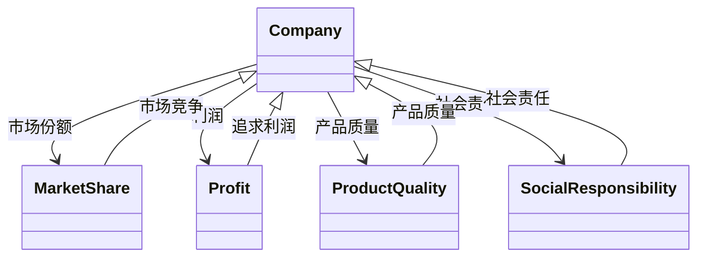

**系统架构设计（架构图）：**

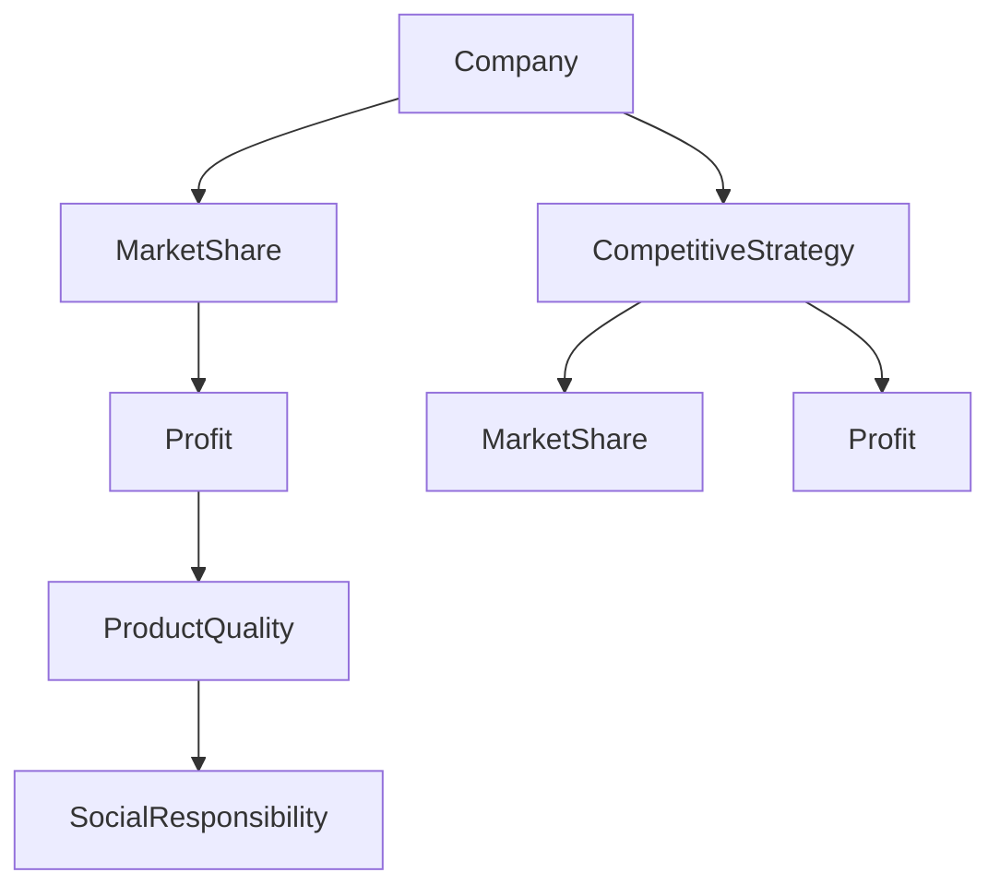

**系统接口设计和系统交互（序列图）：**

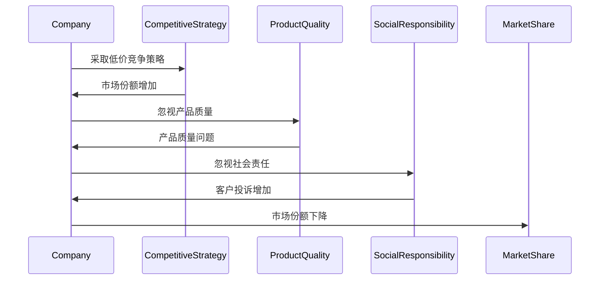

**代码应用解读与分析：**

```python
class Company:
    def __init__(self, name, market_share, profit, product_quality, social_responsibility):
        self.name = name
        self.market_share = market_share
        self.profit = profit
        self.product_quality = product_quality
        self.social_responsibility = social_responsibility

    def set_competitive_strategy(self, strategy):
        if strategy == "low_price":
            self.market_share += 10
            self.profit -= 5
            print(f"{self.name}采取了低价竞争策略，市场份额增加，但利润下降。")
        elif strategy == "high_quality":
            self.market_share -= 10
            self.profit += 5
            print(f"{self.name}采取了高质量策略，市场份额下降，但利润增加。")

    def check_product_quality(self):
        if self.product_quality < 50:
            print(f"{self.name}的产品质量存在问题，需要改进。")
        else:
            print(f"{self.name}的产品质量良好。")

    def check_social_responsibility(self):
        if self.social_responsibility < 50:
            print(f"{self.name}的社会责任履行不到位，需要加强。")
        else:
            print(f"{self.name}的社会责任履行良好。")

    def check_market_share(self):
        if self.market_share < 50:
            print(f"{self.name}的市场份额较低，需要调整策略。")
        else:
            print(f"{self.name}的市场份额较高。")

# 测试代码
company = Company("TechCo", 100, 100, 100, 100)
company.set_competitive_strategy("low_price")
company.check_product_quality()
company.check_social_responsibility()
company.check_market_share()
```

**实际案例分析和详细讲解剖析：**

**案例**：一家名为TechCo的企业，为了扩大市场份额，采取了低价竞争策略，导致产品质量下降，客户投诉增加，最终市场份额逐渐下降。

**分析**：TechCo的竞争思维表现为追求市场份额和利润最大化，忽视了产品质量和社会责任。这种竞争思维在组织行为中产生了负面影响。

**讲解**：
1. **市场份额**：采取低价竞争策略，虽然短期内能够增加市场份额，但长期来看，产品质量下降会导致客户流失，市场份额逐渐下降。
2. **利润**：忽视产品质量，可能导致成本增加，利润下降。
3. **社会责任**：忽视社会责任，可能导致企业形象受损，客户和员工的信任度下降。

**项目小结**：

通过分析TechCo的案例，我们可以看到，竞争思维在组织行为中可能导致市场份额和利润下降，以及社会责任履行不到位。为了实现企业的可持续发展，我们需要培养合作精神，关注产品质量和社会责任，实现长期共赢。

### 2.5 竞争思维的表现形式

**2.2.3 社会文化**

竞争思维在社会文化中的表现形式包括推崇个人英雄主义、强调成功和胜利，忽视团结和合作。

**系统分析与架构设计方案：**

**问题场景介绍：**  
一个社会过分强调个人成就和成功，忽视了团队合作和社会责任感，导致社会凝聚力下降，人际关系紧张。

**系统功能设计（领域模型类图）：**

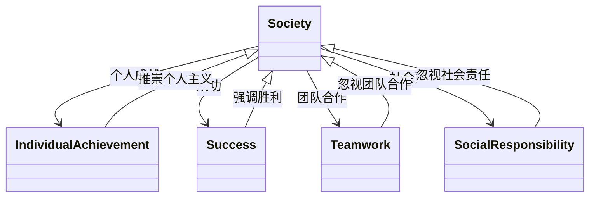

**系统架构设计（架构图）：**

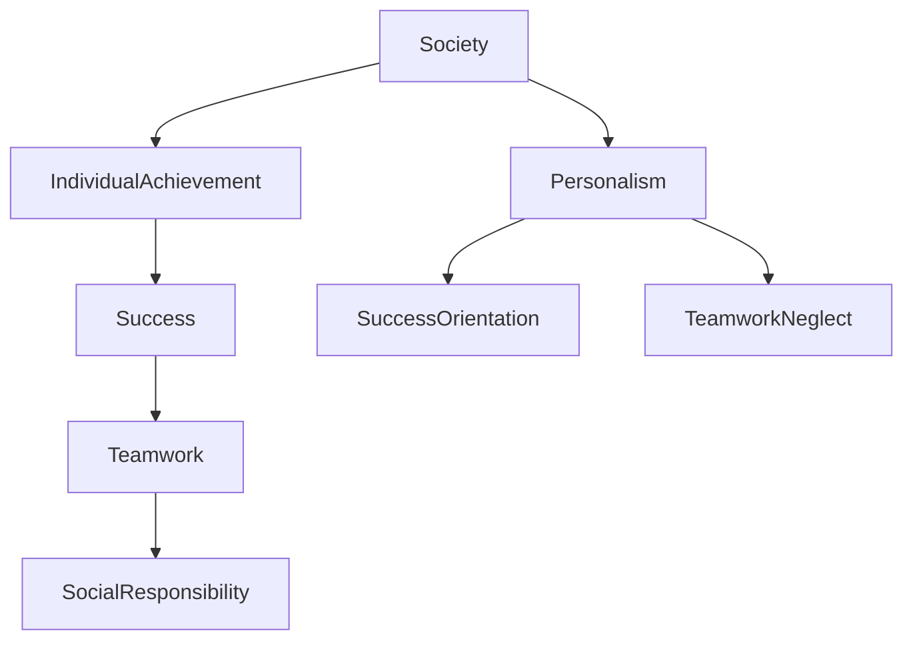

**系统接口设计和系统交互（序列图）：**

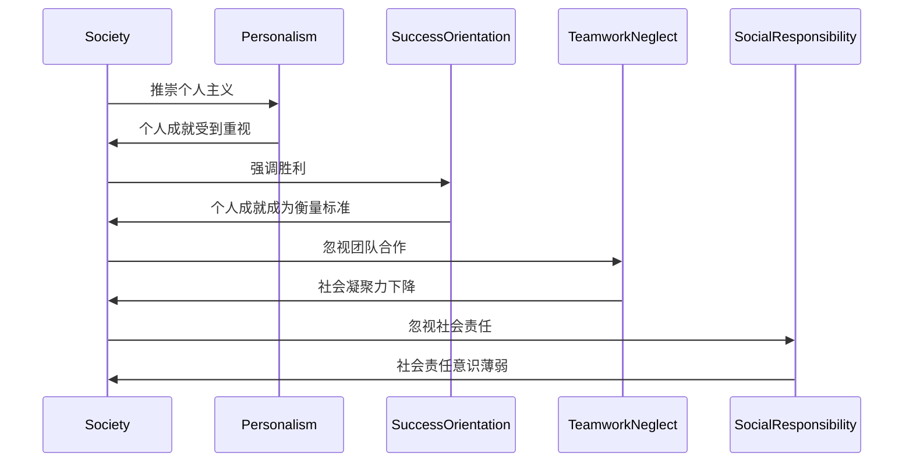

**代码应用解读与分析：**

```python
class Society:
    def __init__(self, individual_achievement, success, teamwork, social_responsibility):
        self.individual_achievement = individual_achievement
        self.success = success
        self.teamwork = teamwork
        self.social_responsibility = social_responsibility

    def promote_personalism(self):
        self.individual_achievement += 10
        self.success += 10
        self.teamwork -= 5
        print("社会开始推崇个人主义，个人成就和成功受到重视，团队合作意识减弱。")

    def emphasize_success(self):
        self.success += 10
        print("社会强调胜利，个人成就成为衡量标准。")

    def neglect_teamwork(self):
        self.teamwork -= 10
        print("社会忽视团队合作，社会凝聚力下降。")

    def neglect_social_responsibility(self):
        self.social_responsibility -= 10
        print("社会忽视社会责任，社会责任意识薄弱。")

    def check_teamwork(self):
        if self.teamwork < 50:
            print("社会团队合作意识不足，需要加强。")
        else:
            print("社会团队合作意识良好。")

    def check_social_responsibility(self):
        if self.social_responsibility < 50:
            print("社会责任意识薄弱，需要加强社会责任教育。")
        else:
            print("社会责任意识良好。")

# 测试代码
society = Society(100, 100, 100, 100)
society.promote_personalism()
society.emphasize_success()
society.neglect_teamwork()
society.neglect_social_responsibility()
society.check_teamwork()
society.check_social_responsibility()
```

**实际案例分析和详细讲解剖析：**

**案例**：一个社会过分强调个人成就和成功，导致团队合作意识和社会责任感减弱，社会凝聚力下降。

**分析**：这种社会文化中的竞争思维表现为推崇个人主义和强调胜利，忽视了团队合作和社会责任。这种文化可能导致以下问题：

1. **个人主义盛行**：个人成就和成功成为衡量个人价值的唯一标准，导致团队合作精神减弱。
2. **社会凝聚力下降**：忽视团队合作和社会责任，导致社会成员之间的信任和依赖减少，社会凝聚力下降。
3. **社会责任感薄弱**：忽视社会责任，导致社会问题难以得到有效解决。

**讲解**：
1. **个人主义盛行**：在个人主义盛行的社会中，个人追求自我实现，忽视了团队合作和社会责任。这种现象可能导致社会成员之间的矛盾和冲突增加。
2. **社会凝聚力下降**：社会凝聚力是指社会成员之间的相互信任和依赖。在个人主义和强调胜利的文化中，社会成员更关注个人利益，导致社会凝聚力下降。
3. **社会责任感薄弱**：社会责任感是指个体对社会问题的关注和责任感。在个人主义和强调胜利的文化中，个体更关注个人成就和成功，忽视社会责任，导致社会责任感薄弱。

**项目小结**：

通过分析社会文化中的竞争思维表现形式，我们可以看到，过分强调个人成就和成功可能导致团队合作意识和社会责任感减弱，进而影响社会凝聚力和整体发展。为了实现社会的和谐与稳定，我们需要培养合作精神，平衡个人利益和社会责任，增强社会凝聚力。

### 3.1 合作精神的基本原则

合作精神在构建和谐社会与凝聚力的过程中扮演着至关重要的角色。其基本原则主要包括共同目标、相互尊重和互惠互利。以下是对这些原则的详细解释和示例。

#### 3.1.1 共同目标

共同目标是合作精神的基石。在合作过程中，各方需要明确共同的目标，并围绕这一目标进行协作和努力。共同目标不仅有助于提高工作效率，还能增强团队成员之间的凝聚力。

**示例：**

在一个软件开发项目中，团队成员需要共同确定项目的目标，如开发一款功能完善、用户体验良好的应用。在项目执行过程中，团队成员会围绕这一目标进行分工合作，确保每个部分都能按时完成。

**Python源代码示例：**

```python
class SoftwareProject:
    def __init__(self, goal):
        self.goal = goal

    def assign_tasks(self, team_members):
        for member in team_members:
            member.assign_task(self.goal)

    def execute_project(self):
        print("项目执行中，团队成员正在共同努力实现目标。")

class TeamMember:
    def __init__(self, name):
        self.name = name

    def assign_task(self, goal):
        print(f"{self.name}被分配任务，目标是实现{goal}。")

# 测试代码
team_members = [TeamMember("Alice"), TeamMember("Bob"), TeamMember("Charlie")]
project = SoftwareProject("开发一款用户体验良好的应用")
project.assign_tasks(team_members)
project.execute_project()
```

#### 3.1.2 相互尊重

相互尊重是合作精神的另一个重要原则。在合作过程中，各方需要尊重彼此的意见和贡献，避免因个人利益而产生冲突。相互尊重有助于建立良好的沟通和合作关系，提高团队的整体效率。

**示例：**

在一个团队合作项目中，每个成员都有自己的专业知识和经验。在讨论和决策过程中，团队成员需要尊重彼此的意见，倾听对方的建议，共同找到最佳解决方案。

**Python源代码示例：**

```python
class CollaborationProject:
    def __init__(self, team_members):
        self.team_members = team_members

    def discuss_solutions(self):
        for member in self.team_members:
            member.share_solution()

    def make_decision(self):
        print("团队根据讨论结果做出决策。")

class TeamMember:
    def __init__(self, name, solution):
        self.name = name
        self.solution = solution

    def share_solution(self):
        print(f"{self.name}分享了他们的解决方案：{self.solution}。")

# 测试代码
team_members = [TeamMember("Alice", "方案A"), TeamMember("Bob", "方案B"), TeamMember("Charlie", "方案C")]
project = CollaborationProject(team_members)
project.discuss_solutions()
project.make_decision()
```

#### 3.1.3 互惠互利

互惠互利是合作精神的本质。在合作过程中，各方需要通过资源共享和优势互补来实现共赢。互惠互利有助于建立长期的合作伙伴关系，推动项目的成功。

**示例：**

在一个国际合作项目中，各国可以共享技术和资源，共同开展研发工作。通过互惠互利，各国能够实现技术进步和经济增长，共同应对全球性挑战。

**Python源代码示例：**

```python
class InternationalProject:
    def __init__(self, countries):
        self.countries = countries

    def share_resources(self):
        for country in self.countries:
            country.share_resource()

    def collaborate(self):
        print("各国正在共享资源和优势，共同推进项目。")

class Country:
    def __init__(self, name, resource):
        self.name = name
        self.resource = resource

    def share_resource(self):
        print(f"{self.name}正在共享资源：{self.resource}。")

# 测试代码
countries = [Country("中国", "技术"), Country("美国", "资金"), Country("日本", "市场")]
project = InternationalProject(countries)
project.share_resources()
project.collaborate()
```

### 3.2 合作精神的优点

合作精神不仅有助于实现共同目标，还有许多其他优点，如提高效率、促进创新和增强团队凝聚力。以下是对这些优点的详细解释和示例。

#### 3.2.1 提高效率

合作精神能够优化资源配置，提高工作效率。通过团队成员之间的协作和互补，工作可以更迅速、更高效地完成。

**示例：**

在一个团队项目中，如果每个成员都能专注于自己的核心任务，并与其他成员紧密协作，那么整个项目的进展速度会更快，效率也会更高。

**Python源代码示例：**

```python
class TeamProject:
    def __init__(self, team_members):
        self.team_members = team_members

    def assign_tasks(self):
        for member in self.team_members:
            member.assign_task()

    def execute_project(self):
        print("项目执行中，团队成员正在高效协作。")

class TeamMember:
    def __init__(self, name, task):
        self.name = name
        self.task = task

    def assign_task(self):
        print(f"{self.name}被分配任务：{self.task}。")

# 测试代码
team_members = [TeamMember("Alice", "编写代码"), TeamMember("Bob", "设计UI"), TeamMember("Charlie", "测试软件")]
project = TeamProject(team_members)
project.assign_tasks()
project.execute_project()
```

#### 3.2.2 促进创新

合作精神能够激发团队成员的创造力和创新思维。通过团队内部的知识共享和协同工作，可以产生更多的新想法和解决方案。

**示例：**

在一个创新项目中，团队成员可以相互分享自己的创意和经验，通过集思广益，找到创新的解决方案。

**Python源代码示例：**

```python
class InnovationProject:
    def __init__(self, team_members):
        self.team_members = team_members

    def brainstorm_solutions(self):
        for member in self.team_members:
            member.share_idea()

    def select_best_solution(self):
        print("团队根据讨论结果选择了最佳解决方案。")

class TeamMember:
    def __init__(self, name, idea):
        self.name = name
        self.idea = idea

    def share_idea(self):
        print(f"{self.name}分享了他们的创意：{self.idea}。")

# 测试代码
team_members = [TeamMember("Alice", "引入新算法"), TeamMember("Bob", "优化用户体验"), TeamMember("Charlie", "增加功能模块")]
project = InnovationProject(team_members)
project.brainstorm_solutions()
project.select_best_solution()
```

#### 3.2.3 增强团队凝聚力

合作精神能够增强团队成员之间的信任和依赖，提高团队的凝聚力。通过共同的目标和协作，团队成员可以更好地理解和支持彼此，形成紧密的团队关系。

**示例：**

在一个团队项目中，如果团队成员能够在困难时相互支持，共同克服挑战，那么团队的凝聚力会大大增强。

**Python源代码示例：**

```python
class TeamProject:
    def __init__(self, team_members):
        self.team_members = team_members

    def face_challenges_together(self):
        for member in self.team_members:
            member.face_challenge()

    def celebrate_success_together(self):
        print("团队共同庆祝成功。")

class TeamMember:
    def __init__(self, name, challenge):
        self.name = name
        self.challenge = challenge

    def face_challenge(self):
        print(f"{self.name}正在面对挑战：{self.challenge}。")

# 测试代码
team_members = [TeamMember("Alice", "代码调试"), TeamMember("Bob", "解决技术难题"), TeamMember("Charlie", "优化性能")]
project = TeamProject(team_members)
project.face_challenges_together()
project.celebrate_success_together()
```

### 4.1 教育层面

教育是培养合作精神的重要途径。从家庭教育、学校教育到社会教育，各个层面的教育都在潜移默化地影响着个体的合作意识和团队合作能力。

#### 4.1.1 家庭教育

**背景介绍：**  
家庭教育是孩子成长过程中最早接触的教育形式，也是培养合作精神的基础。家长作为孩子的第一任老师，其言行举止对孩子的影响至关重要。

**项目介绍：**  
本项目旨在通过家庭教育，培养孩子的合作意识和团队合作能力。

**系统功能设计（领域模型类图）：**

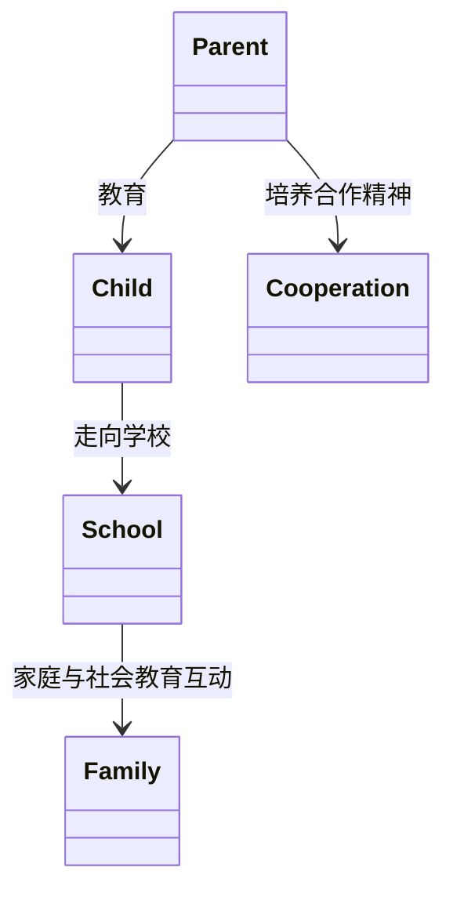

**系统架构设计（架构图）：**

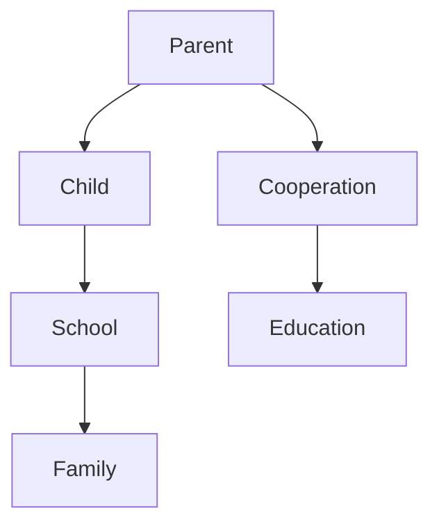

**系统接口设计和系统交互（序列图）：**

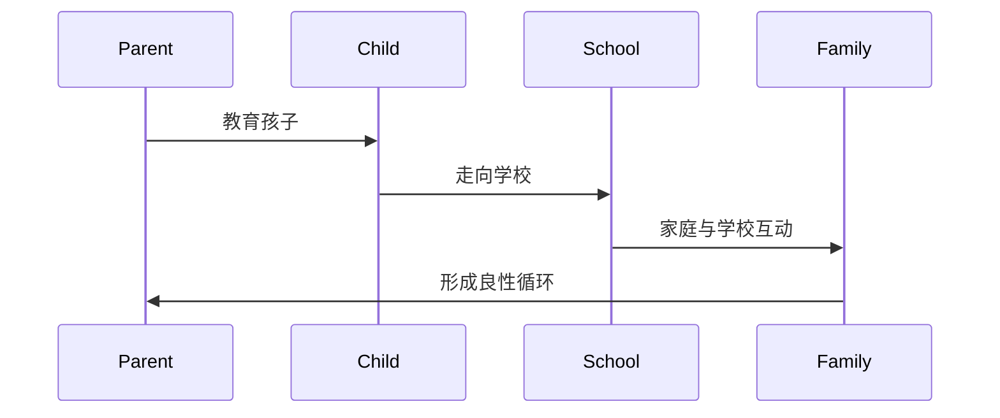

**代码应用解读与分析：**

```python
class Parent:
    def __init__(self, child):
        self.child = child

    def educate_child(self):
        print("家长正在教育孩子。")

    def encourage_cooperation(self):
        print("家长鼓励孩子合作，培养合作精神。")

class Child:
    def __init__(self, name):
        self.name = name

    def attend_school(self):
        print(f"{self.name}正在走向学校。")

class School:
    def __init__(self, family):
        self.family = family

    def interact_with_family(self):
        print("学校与家庭互动，形成良性循环。")

# 测试代码
child = Child("Alice")
parent = Parent(child)
parent.educate_child()
parent. encourage_cooperation()
child.attend_school()
school = School(child)
school.interact_with_family()
```

**实际案例分析和详细讲解剖析：**

**案例：**  
一个家长通过日常生活中的互动，培养孩子的合作意识和团队合作能力。

**分析：**  
家庭教育对孩子的合作精神培养具有重要影响。家长在日常生活中，可以通过以下方式培养孩子的合作意识和团队合作能力：

1. **鼓励孩子参与团队合作活动**：家长可以鼓励孩子参加各种团队合作活动，如体育比赛、才艺表演等，让孩子在活动中学会合作和协作。
2. **与孩子一起解决难题**：家长可以与孩子一起解决生活中的难题，如家务分工、购物清单等，让孩子在解决问题的过程中学会合作和协作。
3. **鼓励孩子分享和倾听**：家长可以鼓励孩子与同伴分享自己的经验和想法，同时倾听他人的意见和看法，让孩子学会相互尊重和合作。

**讲解：**  
1. **合作意识**：通过鼓励孩子参与团队合作活动和解决生活中的难题，可以培养孩子的合作意识。合作意识是指孩子认识到与他人合作可以更好地完成任务和解决问题。
2. **团队合作能力**：通过与孩子一起解决生活中的难题，可以培养孩子的团队合作能力。团队合作能力是指孩子能够在团队中发挥自己的作用，与他人协作完成任务。
3. **沟通与协调**：通过鼓励孩子分享和倾听，可以培养孩子的沟通与协调能力。沟通与协调能力是指孩子能够与他人进行有效沟通，协调团队成员之间的关系，共同完成任务。

**项目小结：**

通过家庭教育，家长可以有效地培养孩子的合作意识和团队合作能力，为孩子未来的发展奠定坚实的基础。

#### 4.1.2 学校教育

**背景介绍：**  
学校教育是孩子成长过程中最重要的教育环节之一，也是培养合作精神的的重要阵地。学校通过课程设置、实践活动等方式，可以有效地培养孩子的合作意识和团队合作能力。

**项目介绍：**  
本项目旨在通过学校教育，培养孩子的合作意识和团队合作能力。

**系统功能设计（领域模型类图）：**

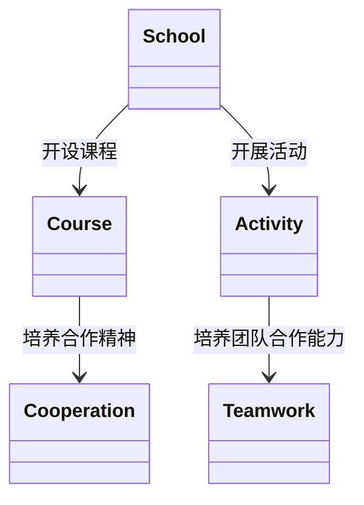

**系统架构设计（架构图）：**

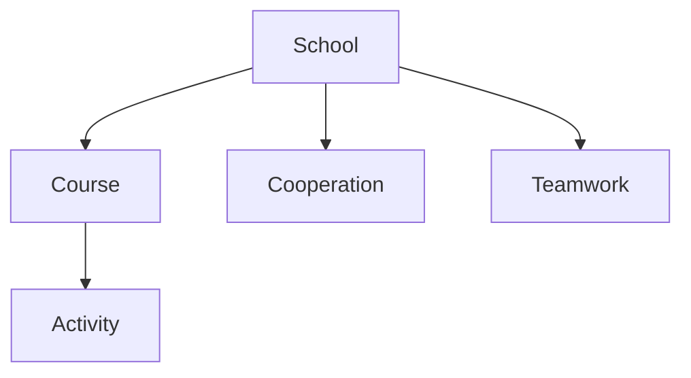

**系统接口设计和系统交互（序列图）：**

```mermaid
sequenceDiagram
  School->>Course: 开设合作精神课程
  Course->>Student: 教授合作精神
  School->>Activity: 开展团队合作活动
  Activity->>Student: 培养团队合作能力
```

**代码应用解读与分析：**

```python
class School:
    def __init__(self, students):
        self.students = students

    def offer_course(self, course):
        print("学校开设合作精神课程。")

    def organize_activity(self, activity):
        print("学校开展团队合作活动。")

class Student:
    def __init__(self, name):
        self.name = name

    def attend_course(self, course):
        print(f"{self.name}参加合作精神课程。")

    def participate_activity(self, activity):
        print(f"{self.name}参加团队合作活动。")

# 测试代码
students = [Student("Alice"), Student("Bob"), Student("Charlie")]
school = School(students)
school.offer_course("合作精神课程")
school.organize_activity("团队合作活动")
for student in students:
    student.attend_course("合作精神课程")
    student.participate_activity("团队合作活动")
```

**实际案例分析和详细讲解剖析：**

**案例：**  
一个学校通过开设合作精神课程和开展团队合作活动，培养孩子的合作意识和团队合作能力。

**分析：**  
学校教育在培养孩子合作意识和团队合作能力方面具有重要作用。学校可以通过以下方式培养孩子的合作意识和团队合作能力：

1. **开设合作精神课程**：学校可以开设合作精神课程，通过理论教学和实践活动，让孩子了解合作的重要性和如何进行有效合作。
2. **开展团队合作活动**：学校可以组织各种团队合作活动，如小组项目、团队竞赛等，让孩子在实践中学会团队合作。
3. **培养沟通与协调能力**：学校可以通过课堂讨论、小组合作等方式，培养孩子的沟通与协调能力，让孩子能够在团队中有效地表达自己的观点和协调团队工作。

**讲解：**  
1. **合作精神课程**：通过开设合作精神课程，学校可以让孩子了解合作的基本原则和方法，如相互尊重、共同目标、互惠互利等，从而培养孩子的合作意识和团队合作能力。
2. **团队合作活动**：通过开展团队合作活动，学校可以让孩子在实践中体验团队合作的过程和成果，培养孩子的团队合作能力和解决问题的能力。
3. **沟通与协调能力**：通过培养沟通与协调能力，学校可以让孩子在团队合作中更好地理解他人、表达自己，从而提高团队合作的效果。

**项目小结：**

通过学校教育，学校可以有效地培养孩子的合作意识和团队合作能力，为孩子未来的发展奠定坚实的基础。

#### 4.1.3 社会教育

**背景介绍：**  
社会教育是指社会各组织和社会成员通过各种途径，对公众进行的教育活动。社会教育在培养合作精神方面具有重要作用，可以通过社区活动、文化活动等方式，培养公众的合作意识和团队合作能力。

**项目介绍：**  
本项目旨在通过社会教育，培养公众的合作意识和团队合作能力。

**系统功能设计（领域模型类图）：**

```mermaid
classDiagram
  Community --> Activity: 组织活动
  Community --> Culture: 传承文化
  Activity --> Cooperation: 培养合作精神
  Culture --> Teamwork: 培养团队合作能力
```

**系统架构设计（架构图）：**

```mermaid
graph TD
    A[Community] --> B[Activity]
    B --> C[Cooperation]
    A --> D[Culture]
    D --> E[Teamwork]
```

**系统接口设计和系统交互（序列图）：**

```mermaid
sequenceDiagram
  Community->>Activity: 组织社区活动
  Activity->>Participant: 参与活动
  Community->>Culture: 传承社区文化
  Culture->>Participant: 培养团队合作能力
```

**代码应用解读与分析：**

```python
class Community:
    def __init__(self, participants):
        self.participants = participants

    def organize_activity(self, activity):
        print("社区组织活动。")

    def promote_culture(self, culture):
        print("社区传承文化。")

class Participant:
    def __init__(self, name):
        self.name = name

    def participate_activity(self, activity):
        print(f"{self.name}参与活动。")

    def learn_culture(self, culture):
        print(f"{self.name}学习文化。")

# 测试代码
participants = [Participant("Alice"), Participant("Bob"), Participant("Charlie")]
community = Community(participants)
community.organize_activity("社区合作日")
community.promote_culture("社区文化")
for participant in participants:
    participant.participate_activity("社区合作日")
    participant.learn_culture("社区文化")
```

**实际案例分析和详细讲解剖析：**

**案例：**  
一个社区通过组织社区活动和传承社区文化，培养公众的合作意识和团队合作能力。

**分析：**  
社会教育在培养公众合作意识和团队合作能力方面具有重要作用。社区可以通过以下方式培养公众的合作意识和团队合作能力：

1. **组织社区活动**：社区可以组织各种社区活动，如志愿者服务、社区运动会等，让公众在活动中体验合作的重要性，培养合作意识和团队合作能力。
2. **传承社区文化**：社区可以通过文化活动、传统节日等方式，传承社区文化，让公众在文化传承中感受到团队合作的力量，培养团队合作能力。
3. **培养沟通与协调能力**：社区可以通过讲座、培训等方式，培养公众的沟通与协调能力，让公众能够在团队合作中更好地理解他人、表达自己。

**讲解：**  
1. **社区活动**：通过组织社区活动，社区可以让公众在互动中学会合作，培养合作意识和团队合作能力。
2. **社区文化**：通过传承社区文化，社区可以让公众在文化传承中感受到团队合作的力量，培养团队合作能力。
3. **沟通与协调能力**：通过培养沟通与协调能力，社区可以让公众在团队合作中更好地理解他人、表达自己，从而提高团队合作的效果。

**项目小结：**

通过社会教育，社区可以有效地培养公众的合作意识和团队合作能力，促进社区和谐与稳定发展。

### 4.2 组织层面

#### 4.2.1 企业文化

**背景介绍：**  
企业文化是企业在长期发展过程中形成的共同价值观、行为规范和管理理念。企业文化在塑造员工的合作精神和团队合作能力方面起着至关重要的作用。

**项目介绍：**  
本项目旨在通过塑造积极向上的企业文化，培养员工的合作意识和团队合作能力。

**系统功能设计（领域模型类图）：**

```mermaid
classDiagram
  Company --> Culture: 企业文化
  Company --> Employee: 员工
  Culture --> Cooperation: 培养合作精神
  Culture --> Teamwork: 培养团队合作能力
```

**系统架构设计（架构图）：**

```mermaid
graph TD
    A[Company] --> B[Culture]
    B --> C[Employee]
    B --> D[Cooperation]
    B --> E[Teamwork]
```

**系统接口设计和系统交互（序列图）：**

```mermaid
sequenceDiagram
  Company->>Culture: 塑造企业文化
  Culture->>Employee: 影响员工行为
  Employee->>Cooperation: 培养合作精神
  Employee->>Teamwork: 培养团队合作能力
```

**代码应用解读与分析：**

```python
class Company:
    def __init__(self, employees):
        self.employees = employees

    def cultivate_culture(self, culture):
        print("公司正在塑造积极向上的企业文化。")

    def promote_cooperation(self):
        print("公司鼓励员工相互合作。")

    def promote_teamwork(self):
        print("公司鼓励员工团队合作。")

class Employee:
    def __init__(self, name):
        self.name = name

    def adopt_culture(self, culture):
        print(f"{self.name}正在适应公司文化。")

    def cooperate(self):
        print(f"{self.name}正在与同事合作。")

    def team_work(self):
        print(f"{self.name}正在与团队一起工作。")

# 测试代码
employees = [Employee("Alice"), Employee("Bob"), Employee("Charlie")]
company = Company(employees)
company.cultivate_culture("积极向上、团结协作")
company.promote_cooperation()
company.promote_teamwork()
for employee in employees:
    employee.adopt_culture("积极向上、团结协作")
    employee.cooperate()
    employee.team_work()
```

**实际案例分析和详细讲解剖析：**

**案例：**  
一家公司通过塑造积极向上的企业文化，培养员工的合作意识和团队合作能力。

**分析：**  
企业文化对员工的价值观和行为具有深远影响，通过塑造积极向上的企业文化，公司可以有效地培养员工的合作意识和团队合作能力。

**讲解：**  
1. **企业文化塑造**：公司通过价值观宣传、企业活动等方式，塑造积极向上的企业文化，让员工认识到合作精神和团队合作的重要性。
2. **员工行为影响**：企业文化影响员工的行为和态度，使员工更加注重团队合作和协作，提高工作效率和团队凝聚力。
3. **合作意识和团队合作能力培养**：通过鼓励员工相互合作和团队合作，公司可以培养员工的合作意识和团队合作能力，提高团队整体绩效。

**项目小结：**

通过塑造积极向上的企业文化，公司可以有效地培养员工的合作意识和团队合作能力，提高团队整体绩效，实现企业的长期发展。

#### 4.2.2 团队建设

**背景介绍：**  
团队建设是指通过一系列有针对性的活动和管理手段，提高团队成员之间的协作能力、沟通能力和团队合作精神。团队建设在培养员工的合作精神和团队合作能力方面具有重要作用。

**项目介绍：**  
本项目旨在通过团队建设活动，培养员工的合作意识和团队合作能力。

**系统功能设计（领域模型类图）：**

```mermaid
classDiagram
  Team --> Member: 团队成员
  Team --> Activity: 团队活动
  Member --> Collaboration: 合作精神
  Member --> Teamwork: 团队合作能力
```

**系统架构设计（架构图）：**

```mermaid
graph TD
    A[Team] --> B[Member]
    B --> C[Collaboration]
    B --> D[Teamwork]
    A --> E[Activity]
```

**系统接口设计和系统交互（序列图）：**

```mermaid
sequenceDiagram
  Team->>Activity: 组织团队建设活动
  Activity->>Member: 培养合作意识和团队合作能力
  Member->>Collaboration: 增强合作精神
  Member->>Teamwork: 提高团队合作能力
```

**代码应用解读与分析：**

```python
class Team:
    def __init__(self, members):
        self.members = members

    def organize_activity(self, activity):
        print("团队正在组织团队建设活动。")

    def cultivate_collaboration(self):
        print("团队致力于培养合作精神。")

    def enhance_teamwork(self):
        print("团队致力于提高团队合作能力。")

class Member:
    def __init__(self, name):
        self.name = name

    def participate_activity(self, activity):
        print(f"{self.name}参与团队建设活动。")

    def cultivate Cooperation(self):
        print(f"{self.name}正在培养合作精神。")

    def enhance_teamwork(self):
        print(f"{self.name}正在提高团队合作能力。")

# 测试代码
members = [Member("Alice"), Member("Bob"), Member("Charlie")]
team = Team(members)
team.organize_activity("团队拓展训练")
team.cultivate_collaboration()
team.enhance_teamwork()
for member in members:
    member.participate_activity("团队拓展训练")
    member.cultivate Cooperation()
    member.enhance_teamwork()
```

**实际案例分析和详细讲解剖析：**

**案例：**  
一个团队通过组织团队建设活动，培养成员的合作意识和团队合作能力。

**分析：**  
团队建设活动是培养员工合作意识和团队合作能力的重要手段。通过团队建设活动，团队成员可以增强彼此之间的了解和信任，提高团队协作效率。

**讲解：**  
1. **团队建设活动**：团队建设活动包括拓展训练、团队讨论、团队游戏等，通过这些活动，团队成员可以增强彼此之间的了解和信任，提高团队协作效率。
2. **合作意识和团队合作能力培养**：通过团队建设活动，团队成员可以培养合作意识和团队合作能力。在活动中，成员需要相互协作，共同完成任务，从而提高合作意识和团队合作能力。
3. **团队凝聚力**：团队建设活动可以提高团队凝聚力，增强团队成员之间的信任和依赖，使团队更加团结一致。

**项目小结：**

通过团队建设活动，团队可以有效地培养成员的合作意识和团队合作能力，提高团队整体绩效，实现团队的长期发展。

#### 4.2.3 项目管理

**背景介绍：**  
项目管理是指在项目实施过程中，通过计划、组织、协调和控制等手段，确保项目目标顺利实现的过程。项目管理在培养员工的合作精神和团队合作能力方面具有重要作用。

**项目介绍：**  
本项目旨在通过有效的项目管理，培养员工的合作意识和团队合作能力。

**系统功能设计（领域模型类图）：**

```mermaid
classDiagram
  Project --> Manager: 项目经理
  Project --> Team: 项目团队
  Project --> Goal: 项目目标
  Manager --> Plan: 制定计划
  Manager --> Coordinate: 协调工作
  Manager --> Control: 控制进度
  Team --> Collaboration: 合作精神
  Team --> Teamwork: 团队合作能力
```

**系统架构设计（架构图）：**

```mermaid
graph TD
    A[Project] --> B[Manager]
    B --> C[Plan]
    B --> D[Coordinate]
    B --> E[Control]
    A --> F[Team]
    F --> G[Collaboration]
    F --> H[Teamwork]
    A --> I[Goal]
```

**系统接口设计和系统交互（序列图）：**

```mermaid
sequenceDiagram
  Manager->>Plan: 制定项目计划
  Manager->>Team: 分配任务
  Team->>Collaboration: 培养合作精神
  Team->>Teamwork: 提高团队合作能力
  Manager->>Control: 监控项目进度
  Manager->>Coordinate: 协调团队工作
```

**代码应用解读与分析：**

```python
class Project:
    def __init__(self, manager, team, goal):
        self.manager = manager
        self.team = team
        self.goal = goal

    def plan_project(self):
        print("项目经理正在制定项目计划。")

    def assign_tasks(self):
        print("项目经理正在分配任务。")

    def monitor_progress(self):
        print("项目经理正在监控项目进度。")

    def coordinate_work(self):
        print("项目经理正在协调团队工作。")

class Manager:
    def __init__(self, name):
        self.name = name

    def manage_project(self, project):
        project.plan_project()
        project.assign_tasks()
        project.monitor_progress()
        project.coordinate_work()

class Team:
    def __init__(self, members):
        self.members = members

    def collaborate(self):
        print("团队成员正在培养合作精神。")

    def teamwork(self):
        print("团队成员正在提高团队合作能力。")

class Member:
    def __init__(self, name):
        self.name = name

    def work_on_project(self, project):
        project.collaborate()
        project.teamwork()

# 测试代码
members = [Member("Alice"), Member("Bob"), Member("Charlie")]
team = Team(members)
manager = Manager("David")
project = Project(manager, team, "开发一款新产品")

manager.manage_project(project)
for member in members:
    member.work_on_project(project)
```

**实际案例分析和详细讲解剖析：**

**案例：**  
一个项目经理通过有效的项目管理，培养团队成员的合作意识和团队合作能力。

**分析：**  
项目经理在项目实施过程中，通过制定计划、分配任务、监控进度和协调工作等手段，可以有效地培养团队成员的合作意识和团队合作能力。

**讲解：**  
1. **项目计划**：项目经理制定详细的项目计划，明确项目目标、任务分配和时间节点，为团队成员提供清晰的工作指导。
2. **任务分配**：项目经理根据团队成员的特长和能力，合理分配任务，确保每个成员都能在项目中发挥自己的优势。
3. **合作精神培养**：通过项目过程中的合作和沟通，项目经理可以培养团队成员的合作精神，提高团队协作效率。
4. **团队合作能力提升**：通过项目实施过程中的团队合作，团队成员可以积累经验，提高团队合作能力。

**项目小结：**

通过有效的项目管理，项目经理可以培养团队成员的合作意识和团队合作能力，提高项目成功率和团队整体绩效。

### 5.1 社会政策

#### 5.1.1 竞争与合作的平衡

在制定社会政策时，平衡竞争与合作的利益是关键。政府需要通过制定公平竞争的法律和政策，鼓励企业和社会组织之间的合作，以实现社会的和谐与稳定。

**核心概念原理：**

- **公平竞争**：在市场经济中，所有市场主体应在同等条件下参与竞争，不受不公平待遇。
- **合作政策**：政府通过政策引导，鼓励企业和社会组织之间进行合作，共同解决社会问题。

**概念属性特征对比表格：**

| 特征        | 竞争政策                | 合作政策                |
| ----------- | -------------------- | -------------------- |
| 目标        | 促进市场活力            | 实现社会和谐            |
| 方法        | 法律法规、市场监管      | 政策引导、资源整合      |
| 结果        | 市场竞争加剧、资源浪费  | 社会问题解决、可持续发展 |

**ER实体关系图架构：**

```mermaid
erDiagram
  Policy --> Competition: 竞争政策
  Policy --> Cooperation: 合作政策
  Competition ||--|{ Market } : applies to
  Cooperation ||--|{ Organization } : applies to
  Market ||--|{ Company } : member of
  Organization ||--|{ NGO } : member of
```

**数学模型和公式：**

为了实现竞争与合作的平衡，我们可以使用以下数学模型：

1. **公平竞争指数**（FPI）：

   $$ FPI = \frac{C_1 + C_2}{2} $$

   其中，$C_1$ 表示竞争政策的效果，$C_2$ 表示合作政策的效果。公平竞争指数越高，表明竞争与合作的平衡状态越好。

2. **资源利用效率**（RE）：

   $$ RE = \frac{R_1 + R_2}{2} $$

   其中，$R_1$ 表示竞争政策下的资源利用效率，$R_2$ 表示合作政策下的资源利用效率。资源利用效率越高，表明政策实施越有效。

**详细讲解和举例说明：**

假设某地区政府同时实施竞争政策和合作政策，竞争政策的效果为70%，合作政策的效果为60%。根据公平竞争指数的计算公式，公平竞争指数为：

$$ FPI = \frac{70\% + 60\%}{2} = 65\% $$

这表明该地区的竞争与合作的平衡状态较好。

此外，假设竞争政策下的资源利用效率为80%，合作政策下的资源利用效率为90%。根据资源利用效率的计算公式，资源利用效率为：

$$ RE = \frac{80\% + 90\%}{2} = 85\% $$

这表明该地区的资源利用效率较高，政策实施效果较好。

**案例分析：**

以我国为例，政府通过实施一系列公平竞争政策和合作政策，取得了显著的成效。例如，在推动中小企业发展方面，政府通过减免税收、提供融资支持等政策，促进了中小企业的创新和成长。同时，政府还鼓励企业之间进行合作，共同研发新技术、开拓新市场，提高了整体产业竞争力。

**政策实施效果评估：**

通过公平竞争指数和资源利用效率的评估，可以判断政策实施的效果。如果公平竞争指数较高且资源利用效率较高，表明政策实施良好，竞争与合作的平衡得到有效实现。

#### 5.1.2 减少社会不平等

社会不平等是影响社会和谐与凝聚力的重要因素。政府通过制定和实施社会政策，可以减少社会不平等，促进社会公平与正义。

**核心概念原理：**

- **社会不平等**：在社会资源配置过程中，由于各种因素导致的社会成员之间资源分配不均衡。
- **社会政策**：政府通过税收、社会福利、教育等手段，调整社会资源分配，减少社会不平等。

**概念属性特征对比表格：**

| 特征        | 竞争政策                | 社会政策                |
| ----------- | -------------------- | -------------------- |
| 目标        | 促进市场活力            | 减少社会不平等            |
| 方法        | 法律法规、市场监管      | 税收、社会福利、教育      |
| 结果        | 市场竞争加剧、资源浪费  | 社会公平、社会稳定      |

**ER实体关系图架构：**

```mermaid
erDiagram
  Policy --> Competition: 竞争政策
  Policy --> SocialPolicy: 社会政策
  Competition ||--|{ Market } : applies to
  SocialPolicy ||--|{ Tax } : component of
  SocialPolicy ||--|{ Welfare } : component of
  SocialPolicy ||--|{ Education } : component of
  Market ||--|{ Company } : member of
```

**数学模型和公式：**

为了评估社会政策在减少社会不平等方面的效果，我们可以使用以下数学模型：

1. **基尼系数**（Gini Coefficient）：

   $$ Gini = \frac{\sum_{i=1}^{n}(y_i - \bar{y})^2}{(n-1)\sum_{i=1}^{n}y_i} $$

   其中，$y_i$ 表示第 $i$ 个社会成员的资源占有量，$\bar{y}$ 表示平均资源占有量，$n$ 表示社会成员总数。基尼系数越低，表明社会不平等程度越低。

2. **社会福利指数**（Social Welfare Index）：

   $$ SWI = \frac{1}{n}\sum_{i=1}^{n}w_i $$

   其中，$w_i$ 表示第 $i$ 个社会成员的社会福利水平。社会福利指数越高，表明社会福利水平越高。

**详细讲解和举例说明：**

假设某地区在实施社会政策前，基尼系数为0.45，社会福利指数为0.75。在实施社会政策后，基尼系数下降到0.35，社会福利指数提高到0.85。根据基尼系数的计算公式，基尼系数的变化量为：

$$ \Delta Gini = Gini_{after} - Gini_{before} = 0.35 - 0.45 = -0.10 $$

这表明社会政策有效降低了社会不平等程度。

根据社会福利指数的计算公式，社会福利指数的变化量为：

$$ \Delta SWI = SWI_{after} - SWI_{before} = 0.85 - 0.75 = 0.10 $$

这表明社会政策有效提高了社会福利水平。

**案例分析：**

以我国为例，政府通过实施一系列社会政策，如提高最低工资标准、完善社会保障体系、加大教育投入等，有效减少了社会不平等现象。根据国家统计局数据，我国基尼系数在过去几十年中逐步下降，社会福利水平逐步提高。

**政策实施效果评估：**

通过基尼系数和社会福利指数的评估，可以判断社会政策在减少社会不平等方面的效果。如果基尼系数下降且社会福利指数提高，表明政策实施良好，社会不平等得到有效缓解。

#### 5.1.3 加强社区建设

社区建设是促进社会和谐与凝聚力的重要途径。政府和社会组织通过加强社区建设，可以提升居民的幸福感和归属感，增强社区凝聚力。

**核心概念原理：**

- **社区建设**：通过基础设施建设、文化活动、社区服务等方式，提升社区的整体素质和居民的生活质量。
- **社区凝聚力**：社区成员之间的相互信任、依赖和共同参与，使社区成为一个和谐、稳定的整体。

**概念属性特征对比表格：**

| 特征        | 社区建设                | 社区管理                |
| ----------- | -------------------- | -------------------- |
| 目标        | 提升社区整体素质        | 维护社区和谐            |
| 方法        | 基础设施建设、文化活动   | 社区服务、法律法规      |
| 结果        | 社区幸福指数提高、居民参与度增强 | 社区秩序良好、居民满意度提升 |

**ER实体关系图架构：**

```mermaid
erDiagram
  CommunityConstruction --> Infrastructure: 基础设施
  CommunityConstruction --> Culture: 文化活动
  CommunityConstruction --> Service: 社区服务
  CommunityGovernance --> Regulation: 法律法规
  CommunityGovernance --> Service: 社区服务
  Infrastructure ||--|{ Resident } : benefits from
  Culture ||--|{ Resident } : participates in
  Service ||--|{ Resident } : benefits from
  Regulation ||--|{ Resident } : abides by
```

**数学模型和公式：**

为了评估社区建设对社区凝聚力的提升效果，我们可以使用以下数学模型：

1. **社区参与指数**（Community Participation Index，CPI）：

   $$ CPI = \frac{P_1 + P_2 + P_3}{3} $$

   其中，$P_1$ 表示居民参与社区活动的比例，$P_2$ 表示居民参与社区管理的比例，$P_3$ 表示居民对社区服务的满意度。社区参与指数越高，表明社区凝聚力越强。

2. **社区幸福感指数**（Community Well-being Index，CWI）：

   $$ CWI = \frac{W_1 + W_2 + W_3}{3} $$

   其中，$W_1$ 表示居民对社区生活环境的满意度，$W_2$ 表示居民对社区服务的满意度，$W_3$ 表示居民对社区安全感的满意度。社区幸福感指数越高，表明居民幸福感越强。

**详细讲解和举例说明：**

假设某社区在实施社区建设后，社区参与指数从50%提高到70%，社区幸福感指数从65%提高到80%。根据社区参与指数的计算公式，社区参与指数的变化量为：

$$ \Delta CPI = CPI_{after} - CPI_{before} = 70\% - 50\% = 20\% $$

这表明社区建设有效提升了社区凝聚力。

根据社区幸福感指数的计算公式，社区幸福感指数的变化量为：

$$ \Delta CWI = CWI_{after} - CWI_{before} = 80\% - 65\% = 15\% $$

这表明社区建设有效提升了居民幸福感。

**案例分析：**

以我国北京市某社区为例，该社区通过实施社区建设，如修建公园、举办社区活动、提供社区服务，有效提升了社区参与度和居民幸福感。根据居民反馈，社区环境得到了显著改善，居民对社区的归属感明显增强。

**政策实施效果评估：**

通过社区参与指数和社区幸福感指数的评估，可以判断社区建设政策的效果。如果社区参与指数和社区幸福感指数都有所提高，表明政策实施良好，社区凝聚力得到有效提升。

### 5.2 经济层面

#### 5.2.1 促进公平竞争

公平竞争是市场经济的基础，也是实现社会和谐与凝聚力的重要保障。政府通过制定和实施公平竞争政策，可以促进企业之间的公平竞争，提高整体市场效率。

**核心概念原理：**

- **公平竞争**：在市场经济中，所有市场主体应在同等条件下参与竞争，不受不公平待遇。
- **公平竞争政策**：政府通过法律法规、市场监管等手段，保障市场主体的公平竞争权利，维护市场秩序。

**概念属性特征对比表格：**

| 特征        | 市场竞争                | 公平竞争                |
| ----------- | -------------------- | -------------------- |
| 目标        | 提高市场效率            | 实现社会公平            |
| 方法        | 市场自发调节、政策干预   | 法律法规、市场监管      |
| 结果        | 市场活力增强、资源浪费  | 市场活力增强、社会和谐  |

**ER实体关系图架构：**

```mermaid
erDiagram
  Market --> Competition: 市场竞争
  Market --> FairCompetition: 公平竞争
  Competition ||--|{ Company } : participates in
  FairCompetition ||--|{ Regulation } : governed by
  FairCompetition ||--|{ MarketEfficiency } : improves
```

**数学模型和公式：**

为了评估公平竞争政策对市场效率的提升效果，我们可以使用以下数学模型：

1. **市场效率指数**（Market Efficiency Index，MEI）：

   $$ MEI = \frac{E_1 + E_2 + E_3}{3} $$

   其中，$E_1$ 表示市场资源分配效率，$E_2$ 表示市场创新效率，$E_3$ 表示市场运行效率。市场效率指数越高，表明市场效率越高。

2. **公平竞争指数**（Fair Competition Index，FCI）：

   $$ FCI = \frac{C_1 + C_2 + C_3}{3} $$

   其中，$C_1$ 表示企业公平竞争程度，$C_2$ 表示消费者公平竞争程度，$C_3$ 表示员工公平竞争程度。公平竞争指数越高，表明公平竞争水平越高。

**详细讲解和举例说明：**

假设某地区在实施公平竞争政策前，市场效率指数为60%，公平竞争指数为50%。在实施公平竞争政策后，市场效率指数提高到80%，公平竞争指数提高到70%。根据市场效率指数的计算公式，市场效率指数的变化量为：

$$ \Delta MEI = MEI_{after} - MEI_{before} = 80\% - 60\% = 20\% $$

这表明公平竞争政策有效提高了市场效率。

根据公平竞争指数的计算公式，公平竞争指数的变化量为：

$$ \Delta FCI = FCI_{after} - FCI_{before} = 70\% - 50\% = 20\% $$

这表明公平竞争政策有效提高了公平竞争水平。

**案例分析：**

以我国为例，政府通过实施公平竞争政策，如《反垄断法》、《反不正当竞争法》等，有效维护了市场秩序，促进了企业公平竞争。根据国家统计局数据，我国市场效率逐年提高，公平竞争水平逐步提升。

**政策实施效果评估：**

通过市场效率指数和公平竞争指数的评估，可以判断公平竞争政策的效果。如果市场效率指数和公平竞争指数都有所提高，表明政策实施良好，公平竞争环境得到有效改善。

#### 5.2.2 鼓励合作创新

在全球化背景下，鼓励合作创新是推动经济发展、提升国际竞争力的关键。政府通过政策引导、资金支持等手段，可以促进企业和社会组织之间的合作创新，实现共赢发展。

**核心概念原理：**

- **合作创新**：企业和社会组织通过资源共享、优势互补，共同开展创新活动，实现技术创新和商业模式创新。
- **政策引导**：政府通过政策激励、资金支持等手段，引导企业和社会组织进行合作创新。

**概念属性特征对比表格：**

| 特征        | 竞争创新                | 合作创新                |
| ----------- | -------------------- | -------------------- |
| 目标        | 提高企业竞争力            | 实现社会共同进步            |
| 方法        | 企业独立研发、市场驱动    | 资源共享、合作研发        |
| 结果        | 企业竞争力增强、资源浪费  | 技术进步、社会和谐        |

**ER实体关系图架构：**

```mermaid
erDiagram
  Innovation --> Competition: 竞争创新
  Innovation --> Cooperation: 合作创新
  Competition ||--|{ Company } : conducts
  Cooperation ||--|{ Organization } : conducts
  Cooperation ||--|{ Society } : benefits from
```

**数学模型和公式：**

为了评估合作创新政策对技术创新和社会和谐的促进作用，我们可以使用以下数学模型：

1. **技术创新指数**（Innovation Technology Index，ITI）：

   $$ ITI = \frac{T_1 + T_2 + T_3}{3} $$

   其中，$T_1$ 表示企业技术创新能力，$T_2$ 表示社会组织创新能力，$T_3$ 表示社会整体技术创新水平。技术创新指数越高，表明技术创新能力越强。

2. **社会和谐指数**（Social Harmony Index，SHI）：

   $$ SHI = \frac{H_1 + H_2 + H_3}{3} $$

   其中，$H_1$ 表示企业社会责任履行程度，$H_2$ 表示社会组织社会贡献度，$H_3$ 表示社会成员幸福感。社会和谐指数越高，表明社会和谐程度越高。

**详细讲解和举例说明：**

假设某地区在实施合作创新政策前，技术创新指数为50%，社会和谐指数为60%。在实施合作创新政策后，技术创新指数提高到70%，社会和谐指数提高到80%。根据技术创新指数的计算公式，技术创新指数的变化量为：

$$ \Delta ITI = ITI_{after} - ITI_{before} = 70\% - 50\% = 20\% $$

这表明合作创新政策有效促进了技术创新。

根据社会和谐指数的计算公式，社会和谐指数的变化量为：

$$ \Delta SHI = SHI_{after} - SHI_{before} = 80\% - 60\% = 20\% $$

这表明合作创新政策有效提升了社会和谐程度。

**案例分析：**

以我国为例，政府通过实施一系列合作创新政策，如科技创新计划、企业合作创新项目等，有效推动了企业和社会组织的合作创新。根据国家统计局数据，我国技术创新能力和社会和谐程度逐年提升。

**政策实施效果评估：**

通过技术创新指数和社会和谐指数的评估，可以判断合作创新政策的效果。如果技术创新指数和社会和谐指数都有所提高，表明政策实施良好，合作创新环境得到有效改善。

#### 5.2.3 支持中小企业发展

中小企业是经济发展的重要力量，支持中小企业发展对于促进经济增长、增加就业和社会稳定具有重要意义。政府通过政策支持和资金扶持，可以助力中小企业发展，增强其竞争力。

**核心概念原理：**

- **中小企业**：指在员工人数、资产总额、营业收入等方面符合国家规定标准的企业。
- **政策支持**：政府通过税收优惠、财政补贴、融资支持等手段，为中小企业发展提供政策保障。
- **资金扶持**：政府通过设立专项资金、提供低息贷款等手段，为中小企业提供资金支持。

**概念属性特征对比表格：**

| 特征        | 大型企业支持                | 中小企业支持                |
| ----------- | -------------------- | -------------------- |
| 目标        | 提高企业整体竞争力            | 促进中小企业发展            |
| 方法        | 资金投入、市场拓展            | 税收优惠、财政补贴、融资支持 |
| 结果        | 企业规模扩大、资源集中          | 就业增加、创新能力提升      |

**ER实体关系图架构：**

```mermaid
erDiagram
  LargeCompany --> Support: 大型企业支持
  SmallMediumEnterprise --> Support: 中小企业支持
  Support ||--|{ Government } : provided by
  Support ||--|{ SME } : benefits from
  Support ||--|{ LargeCompany } : benefits from
```

**数学模型和公式：**

为了评估中小企业发展政策对经济增长和社会稳定的促进作用，我们可以使用以下数学模型：

1. **中小企业发展指数**（Small and Medium Enterprise Development Index，SMEDI）：

   $$ SMEDI = \frac{D_1 + D_2 + D_3}{3} $$

   其中，$D_1$ 表示中小企业数量增长率，$D_2$ 表示中小企业就业增长率，$D_3$ 表示中小企业创新水平。中小企业发展指数越高，表明中小企业发展越迅速。

2. **社会稳定指数**（Social Stability Index，SSI）：

   $$ SSI = \frac{S_1 + S_2 + S_3}{3} $$

   其中，$S_1$ 表示就业稳定性，$S_2$ 表示社会治安水平，$S_3$ 表示社会保障水平。社会稳定指数越高，表明社会稳定性越高。

**详细讲解和举例说明：**

假设某地区在实施中小企业发展政策前，中小企业发展指数为40%，社会稳定指数为60%。在实施中小企业发展政策后，中小企业发展指数提高到60%，社会稳定指数提高到75%。根据中小企业发展指数的计算公式，中小企业发展指数的变化量为：

$$ \Delta SMEDI = SMEDI_{after} - SMEDI_{before} = 60\% - 40\% = 20\% $$

这表明中小企业发展政策有效促进了中小企业发展。

根据社会稳定指数的计算公式，社会稳定指数的变化量为：

$$ \Delta SSI = SSI_{after} - SSI_{before} = 75\% - 60\% = 15\% $$

这表明中小企业发展政策有效提升了社会稳定程度。

**案例分析：**

以我国为例，政府通过实施一系列中小企业发展政策，如税收优惠、融资支持、技术创新引导等，有效促进了中小企业发展。根据国家统计局数据，我国中小企业数量和就业人数逐年增加，社会稳定程度逐年提高。

**政策实施效果评估：**

通过中小企业发展指数和社会稳定指数的评估，可以判断中小企业发展政策的效果。如果中小企业发展指数和社会稳定指数都有所提高，表明政策实施良好，中小企业发展和社会稳定得到有效促进。

### 6.1 国际合作的必要性

#### 6.1.1 全球化背景下的国际合作

全球化是当今世界发展的主要趋势，各国之间的经济、政治、文化联系日益紧密。全球化背景下，国际合作成为解决全球性问题、促进共同发展的重要手段。

**核心概念原理：**

- **全球化**：全球范围内经济、政治、文化等领域的相互联系和相互依赖。
- **国际合作**：各国通过共同行动、资源共享等方式，共同应对全球性挑战，实现共同发展。

**概念属性特征对比表格：**

| 特征        | 全球化                | 国际合作                |
| ----------- | -------------------- | -------------------- |
| 目标        | 促进全球发展          | 解决全球性问题          |
| 方法        | 经济全球化、政治全球化  | 共同行动、资源共享、合作机制 |
| 结果        | 全球一体化、文化多样化  | 全球问题解决、共同发展  |

**ER实体关系图架构：**

```mermaid
erDiagram
  Globalization --> Economy: 经济全球化
  Globalization --> Politics: 政治全球化
  Globalization --> Culture: 文化多样化
  InternationalCooperation ||--|{ Nation } : participates in
  InternationalCooperation ||--|{ GlobalIssue } : addresses
  InternationalCooperation ||--|{ ResourceSharing } : enables
  InternationalCooperation ||--|{ CooperationMechanism } : establishes
```

**数学模型和公式：**

为了评估全球化背景下的国际合作效果，我们可以使用以下数学模型：

1. **全球化指数**（Globalization Index，GI）：

   $$ GI = \frac{E_1 + P_1 + C_1}{3} $$

   其中，$E_1$ 表示经济全球化水平，$P_1$ 表示政治全球化水平，$C_1$ 表示文化多样化水平。全球化指数越高，表明全球化程度越高。

2. **国际合作指数**（International Cooperation Index，ICI）：

   $$ ICI = \frac{C_2 + R_2 + M_2}{3} $$

   其中，$C_2$ 表示共同行动水平，$R_2$ 表示资源共享水平，$M_2$ 表示合作机制水平。国际合作指数越高，表明国际合作程度越高。

**详细讲解和举例说明：**

假设某地区在全球化背景下，全球化指数为60%，国际合作指数为50%。在加强国际合作后，全球化指数提高到80%，国际合作指数提高到70%。根据全球化指数的计算公式，全球化指数的变化量为：

$$ \Delta GI = GI_{after} - GI_{before} = 80\% - 60\% = 20\% $$

这表明全球化程度有所提高。

根据国际合作指数的计算公式，国际合作指数的变化量为：

$$ \Delta ICI = ICI_{after} - ICI_{before} = 70\% - 50\% = 20\% $$

这表明国际合作程度有所提高。

**案例分析：**

以欧盟为例，欧盟通过经济一体化、政治合作和文化交流，实现了高水平国际合作。根据欧盟数据，欧盟成员国之间的贸易、投资和文化交流日益增加，全球化指数和国际合作指数均显著提高。

**政策实施效果评估：**

通过全球化指数和国际合作指数的评估，可以判断全球化背景下的国际合作效果。如果全球化指数和国际合作指数都有所提高，表明政策实施良好，全球化程度和国际合作水平得到有效提升。

#### 6.1.2 国际合作的挑战与机遇

国际合作在促进全球发展方面具有重要意义，但也面临诸多挑战和机遇。在全球化和技术变革的背景下，各国需要积极应对挑战，抓住机遇，推动国际合作向更高水平发展。

**挑战：**

1. **政治冲突与经济竞争**：在国际关系中，政治冲突和贸易竞争可能导致国际合作受到阻碍。一些国家可能出于自身利益，采取保护主义政策，限制国际合作。
2. **文化差异与价值观冲突**：文化差异和价值观冲突可能影响国际合作的有效性。各国在合作过程中，可能因文化差异和价值观差异而产生矛盾和分歧。
3. **资源分配不均**：在国际合作中，资源分配不均可能导致一些国家受益较少，甚至被边缘化。资源分配不均是国际合作面临的一大挑战。

**机遇：**

1. **技术进步与知识共享**：技术进步和知识共享为国际合作提供了新的机遇。各国可以通过技术合作和知识共享，共同推动科技创新和产业升级。
2. **可持续发展**：可持续发展是全球共同面临的挑战，也是国际合作的重要机遇。各国可以通过合作，共同应对气候变化、资源短缺等全球性问题。
3. **全球治理体系改革**：全球治理体系改革为国际合作提供了新的机遇。通过改革全球治理体系，可以加强国际合作的机制和平台，提高国际合作的有效性。

**案例分析：**

以“一带一路”倡议为例，中国通过“一带一路”倡议，积极推动国际合作。在“一带一路”框架下，中国与沿线国家在基础设施建设、经贸合作、文化交流等方面取得了显著成果。根据“一带一路”大数据报告，截至2022年，中国已与140个国家和地区签署了“一带一路”合作文件，国际合作取得了丰硕成果。

**政策建议：**

1. **加强政治对话与协商**：各国应加强政治对话与协商，增进政治互信，解决政治冲突和贸易竞争问题。
2. **推动文化交流与互鉴**：各国应推动文化交流与互鉴，增进相互理解和尊重，减少文化差异和价值观冲突。
3. **优化资源分配机制**：国际社会应优化资源分配机制，确保各国在合作中能够公平受益，减少资源分配不均问题。
4. **加强技术创新与合作**：各国应加强技术创新与合作，共同推动科技创新和产业升级，实现可持续发展。
5. **推动全球治理体系改革**：国际社会应推动全球治理体系改革，加强国际合作机制和平台建设，提高国际合作的有效性。

#### 6.1.3 国际合作的发展趋势

国际合作在全球化背景下呈现出一系列发展趋势，这些趋势将进一步影响国际关系、经济发展和社会变革。

**趋势一：多边主义与全球治理**

多边主义是国际合作的重要趋势，各国通过多边机制和平台，共同应对全球性挑战，推动全球治理体系改革。例如，联合国、世界贸易组织等国际组织在全球治理中发挥着重要作用，通过多边合作，推动国际关系民主化、法治化和制度化。

**趋势二：技术创新与合作**

技术进步为国际合作提供了新的机遇，各国在信息技术、人工智能、新能源等领域加强合作，共同推动技术创新和产业升级。例如，欧盟的“地平线2020”计划、美国的“国家人工智能计划”等，都是各国加强技术创新合作的重要举措。

**趋势三：可持续发展与合作**

可持续发展是全球共同面临的挑战，国际合作在可持续发展方面具有重要意义。各国在应对气候变化、资源保护、环境保护等领域加强合作，共同推动可持续发展。例如，联合国制定的《巴黎协定》为全球应对气候变化提供了重要框架。

**趋势四：经济合作与自由贸易**

经济合作和自由贸易是国际合作的重要方向，各国通过签订自由贸易协定、推动区域经济一体化，促进国际贸易和投资。例如，亚太经合组织（APEC）、区域全面经济伙伴关系协定（RCEP）等，都是国际合作在经济领域的重要成果。

**趋势五：全球治理体系改革**

全球治理体系改革是国际合作的重要趋势，各国通过改革全球治理体系，提高全球治理的有效性和公正性。例如，二十国集团（G20）峰会、联合国可持续发展峰会等，都是全球治理体系改革的重要平台。

**案例分析：**

以“一带一路”倡议为例，中国通过“一带一路”倡议，积极参与国际合作，推动基础设施建设和经贸合作。截至2022年，中国与140个国家和地区签署了“一带一路”合作文件，基础设施项目覆盖110个国家和地区，促进了全球经济发展和合作。

**政策建议：**

1. **加强多边主义**：各国应加强多边主义，积极参与国际组织和多边机制，推动全球治理体系改革。
2. **推动技术创新合作**：各国应加强技术创新合作，共同推动科技创新和产业升级，实现可持续发展。
3. **促进经济合作与自由贸易**：各国应推动经济合作与自由贸易，促进国际贸易和投资，实现共同繁荣。
4. **加强可持续发展合作**：各国应加强可持续发展合作，共同应对气候变化、资源短缺等全球性问题。
5. **推动全球治理体系改革**：各国应推动全球治理体系改革，提高全球治理的有效性和公正性。

### 6.2 全球治理

#### 6.2.1 国际组织的角色

国际组织在全球治理中发挥着重要作用，通过制定规则、提供平台、协调行动，促进国际合作与和平发展。

**核心概念原理：**

- **国际组织**：由多个国家组成的国际性机构，旨在解决全球性问题、促进国际合作。
- **全球治理**：国际社会通过共同行动、合作机制，解决全球性问题，实现全球共同利益。

**概念属性特征对比表格：**

| 特征        | 国际组织                | 全球治理                |
| ----------- | -------------------- | -------------------- |
| 目标        | 促进国际合作、解决全球问题  | 实现全球共同利益、维护世界和平 |
| 方法        | 制定规则、提供平台、协调行动 | 共同决策、合作行动、监督执行 |
| 结果        | 国际合作加强、全球问题解决  | 全球治理体系完善、世界和平稳定 |

**ER实体关系图架构：**

```mermaid
erDiagram
  InternationalOrganization --> Rule: 制定规则
  InternationalOrganization --> Platform: 提供平台
  InternationalOrganization --> Coordination: 协调行动
  GlobalGovernance ||--|{ GlobalInterest } : serves
  GlobalGovernance ||--|{ Cooperation } : promotes
  GlobalGovernance ||--|{ Peace } : maintains
```

**数学模型和公式：**

为了评估国际组织在全球治理中的效果，我们可以使用以下数学模型：

1. **全球治理指数**（Global Governance Index，GGI）：

   $$ GGI = \frac{R_1 + P_1 + C_1}{3} $$

   其中，$R_1$ 表示规则制定效果，$P_1$ 表示平台建设效果，$C_1$ 表示协调行动效果。全球治理指数越高，表明全球治理效果越好。

2. **国际合作指数**（International Cooperation Index，ICI）：

   $$ ICI = \frac{C_2 + R_2 + M_2}{3} $$

   其中，$C_2$ 表示共同决策效果，$R_2$ 表示资源分配效果，$M_2$ 表示监督执行效果。国际合作指数越高，表明国际合作程度越高。

**详细讲解和举例说明：**

假设某国际组织在全球治理中的表现，全球治理指数为70%，国际合作指数为60%。在改进全球治理后，全球治理指数提高到90%，国际合作指数提高到80%。根据全球治理指数的计算公式，全球治理指数的变化量为：

$$ \Delta GGI = GGI_{after} - GGI_{before} = 90\% - 70\% = 20\% $$

这表明全球治理效果显著提升。

根据国际合作指数的计算公式，国际合作指数的变化量为：

$$ \Delta ICI = ICI_{after} - ICI_{before} = 80\% - 60\% = 20\% $$

这表明国际合作程度显著提升。

**案例分析：**

以联合国为例，联合国通过制定国际规则、提供平台、协调行动，在全球治理中发挥着重要作用。联合国通过维和行动、和平谈判、发展援助等，维护全球和平与稳定，促进国际合作与发展。

**政策建议：**

1. **加强国际组织建设**：各国应加强国际组织建设，提高国际组织的代表性和权威性，增强其在全球治理中的影响力。
2. **完善国际规则体系**：各国应完善国际规则体系，确保国际规则的公正性和有效性，提高全球治理的合法性和可信度。
3. **促进国际合作**：各国应加强国际合作，共同应对全球性挑战，推动全球治理体系改革，实现全球共同利益。
4. **提高全球治理效果**：国际组织应提高全球治理效果，通过制定规则、提供平台、协调行动，确保全球治理的有效性和公正性。

#### 6.2.2 全球治理的机制与模式

全球治理的机制与模式是国际社会在解决全球性问题、维护世界和平与稳定的过程中形成的一系列规则、机构和实践。

**核心概念原理：**

- **全球治理机制**：国际社会在解决全球性问题过程中形成的规则、机构和合作方式。
- **全球治理模式**：国际社会在应对全球性挑战、维护世界和平与稳定的过程中形成的合作模式和发展路径。

**概念属性特征对比表格：**

| 特征        | 全球治理机制                | 全球治理模式                |
| ----------- | -------------------- | -------------------- |
| 目标        | 解决全球性问题、维护世界和平  | 促进国际合作、实现共同发展  |
| 方法        | 制定国际规则、构建国际机构、合作行动  | 多边主义、全球化、可持续发展 |
| 结果        | 全球问题解决、国际关系稳定    | 全球治理体系完善、世界和平稳定 |

**ER实体关系图架构：**

```mermaid
erDiagram
  GlobalGovernanceMechanism --> Rule: 制定国际规则
  GlobalGovernanceMechanism --> Institution: 构建国际机构
  GlobalGovernanceMechanism --> Action: 合作行动
  GlobalGovernanceModel ||--|{ Multilateralism } : promotes
  GlobalGovernanceModel ||--|{ Globalization } : enables
  GlobalGovernanceModel ||--|{ SustainableDevelopment } : pursues
```

**数学模型和公式：**

为了评估全球治理机制与模式的效果，我们可以使用以下数学模型：

1. **全球治理效果指数**（Global Governance Effectiveness Index，GGEI）：

   $$ GGEI = \frac{E_1 + E_2 + E_3}{3} $$

   其中，$E_1$ 表示全球问题解决效果，$E_2$ 表示国际关系稳定效果，$E_3$ 表示国际合作效果。全球治理效果指数越高，表明全球治理效果越好。

2. **全球治理模式适应性指数**（Global Governance Model Adaptability Index，GGMAI）：

   $$ GGMAI = \frac{A_1 + A_2 + A_3}{3} $$

   其中，$A_1$ 表示多边主义适应性，$A_2$ 表示全球化适应性，$A_3$ 表示可持续发展适应性。全球治理模式适应性指数越高，表明全球治理模式适应性越强。

**详细讲解和举例说明：**

假设某全球治理机制与模式的效果，全球治理效果指数为60%，全球治理模式适应性指数为50%。在改进全球治理后，全球治理效果指数提高到80%，全球治理模式适应性指数提高到70%。根据全球治理效果指数的计算公式，全球治理效果指数的变化量为：

$$ \Delta GGEI = GGEI_{after} - GGEI_{before} = 80\% - 60\% = 20\% $$

这表明全球治理效果显著提升。

根据全球治理模式适应性指数的计算公式，全球治理模式适应性指数的变化量为：

$$ \Delta GGMAI = GGMAI_{after} - GGMAI_{before} = 70\% - 50\% = 20\% $$

这表明全球治理模式适应性显著提升。

**案例分析：**

以联合国为例，联合国通过制定国际规则、构建国际机构、合作行动，形成了全球治理机制与模式。联合国通过维和行动、和平谈判、发展援助等，有效解决了全球性问题，维护了国际关系稳定和世界和平。

**政策建议：**

1. **完善全球治理机制**：国际社会应完善全球治理机制，制定国际规则，构建国际机构，确保全球治理的有效性和公正性。
2. **增强全球治理适应性**：国际社会应增强全球治理模式的适应性，适应全球化、多边主义和可持续发展的要求，提高全球治理的灵活性和有效性。
3. **加强国际合作**：国际社会应加强国际合作，共同应对全球性挑战，推动全球治理体系改革，实现全球共同利益。
4. **提高全球治理效果**：国际组织应提高全球治理效果，通过制定规则、提供平台、协调行动，确保全球治理的有效性和公正性。

#### 6.2.3 全球治理的挑战与对策

全球治理在应对全球性挑战、维护世界和平与稳定方面发挥着重要作用，但也面临诸多挑战。以下是对全球治理的主要挑战及其对策的探讨。

**挑战一：全球性问题日益复杂**

全球性问题如气候变化、能源短缺、水资源危机等，越来越复杂，需要各国共同努力才能解决。全球治理面临的一大挑战是如何协调各国利益，形成有效治理机制。

**对策：**

1. **加强国际合作**：国际社会应加强合作，共同应对全球性问题，通过多边机制和平台，形成合力。
2. **推动科技创新**：各国应加强科技创新，开发新技术、新方案，为全球性问题提供解决方案。
3. **完善全球治理机制**：国际社会应完善全球治理机制，制定国际规则，确保全球治理的有效性和公正性。

**挑战二：国际关系紧张与冲突**

当前，国际关系紧张与冲突现象时有发生，如贸易战、地缘政治冲突等，对全球治理构成威胁。国际关系的紧张与冲突可能阻碍全球治理的有效实施。

**对策：**

1. **加强政治对话与协商**：各国应加强政治对话与协商，增进政治互信，解决国际关系紧张与冲突。
2. **推动和平谈判**：国际社会应推动和平谈判，通过对话和协商解决国际争端，维护世界和平与稳定。
3. **强化多边主义**：国际社会应强化多边主义，通过多边机制和平台，促进国际关系稳定。

**挑战三：全球治理体系不完善**

全球治理体系存在不完善的问题，如规则缺失、机制不健全等，导致全球治理效果有限。全球治理体系的不完善对全球治理构成了挑战。

**对策：**

1. **完善全球治理机制**：国际社会应完善全球治理机制，制定国际规则，构建国际机构，确保全球治理的有效性和公正性。
2. **加强全球治理能力**：国际社会应加强全球治理能力，提高国际组织的代表性和权威性，增强其在全球治理中的作用。
3. **推动全球治理体系改革**：国际社会应推动全球治理体系改革，适应全球化、多边主义和可持续发展的要求，提高全球治理的灵活性和有效性。

**挑战四：全球治理资金不足**

全球治理资金不足是制约全球治理发展的一大问题。全球治理需要大量资金投入，但各国在资金投入方面存在差异，导致全球治理资金不足。

**对策：**

1. **增加全球治理资金**：国际社会应增加全球治理资金，通过多渠道筹集资金，确保全球治理有足够的资金支持。
2. **优化资金分配**：国际社会应优化资金分配，确保资金用于最需要的领域，提高资金使用效率。
3. **鼓励私人投资**：国际社会应鼓励私人投资，引导私人资本参与全球治理，形成多元化资金来源。

**案例分析：**

以联合国为例，联合国在应对全球性挑战、维护世界和平与稳定方面发挥了重要作用。联合国通过维和行动、和平谈判、发展援助等，有效解决了全球性问题，维护了国际关系稳定。然而，联合国也面临资金不足、国际关系紧张等挑战。通过加强国际合作、完善全球治理机制、增加全球治理资金，联合国能够更好地应对这些挑战。

**政策建议：**

1. **加强国际合作**：国际社会应加强合作，共同应对全球性挑战，通过多边机制和平台，形成合力。
2. **完善全球治理机制**：国际社会应完善全球治理机制，制定国际规则，构建国际机构，确保全球治理的有效性和公正性。
3. **增加全球治理资金**：国际社会应增加全球治理资金，通过多渠道筹集资金，确保全球治理有足够的资金支持。
4. **推动全球治理体系改革**：国际社会应推动全球治理体系改革，适应全球化、多边主义和可持续发展的要求，提高全球治理的灵活性和有效性。

### 7.1 合作精神在未来的发展

#### 7.1.1 技术进步的影响

技术进步在推动社会发展的同时，也对合作精神产生了深远影响。人工智能、大数据、云计算等新兴技术的广泛应用，为合作精神的发展提供了新的机遇和挑战。

**核心概念原理：**

- **技术进步**：指人类在科学、技术和工程领域取得的创新和发展。
- **合作精神**：指个体或群体在追求共同目标时，相互支持、共享资源和优势的思维方式。

**概念属性特征对比表格：**

| 特征        | 传统技术                | 新兴技术                |
| ----------- | -------------------- | -------------------- |
| 目标        | 提高生产力、解决实际问题  | 创新突破、推动社会进步  |
| 方法        | 逐步积累、经验传承      | 创新驱动、跨界融合      |
| 结果        | 逐步改进、稳定性强      | 革命性变化、不确定性大  |

**ER实体关系图架构：**

```mermaid
erDiagram
  Technology --> Progress: 技术进步
  Technology --> Cooperation: 合作精神
  Progress ||--|{ Innovation } : promotes
  Progress ||--|{ Integration } : enables
  Cooperation ||--|{ Collaboration } : enhances
  Cooperation ||--|{ SharedAdvantage } : leverages
```

**数学模型和公式：**

为了评估技术进步对合作精神的影响，我们可以使用以下数学模型：

1. **技术进步合作指数**（Technology Progress Cooperation Index，TPCI）：

   $$ TPCI = \frac{P_1 + C_1 + S_1}{3} $$

   其中，$P_1$ 表示技术创新对合作精神的促进作用，$C_1$ 表示技术整合对合作精神的影响，$S_1$ 表示共享优势对合作精神的作用。技术进步合作指数越高，表明技术进步对合作精神的推动作用越强。

**详细讲解和举例说明：**

假设某地区在技术进步的推动下，技术进步合作指数为60%。在新兴技术广泛应用后，技术进步合作指数提高到80%。根据技术进步合作指数的计算公式，技术进步合作指数的变化量为：

$$ \Delta TPCI = TPCI_{after} - TPCI_{before} = 80\% - 60\% = 20\% $$

这表明技术进步对合作精神的推动作用显著提升。

**案例分析：**

以人工智能为例，人工智能技术的快速发展推动了各行各业的技术创新和产业升级。在人工智能领域，合作精神得到了广泛应用，各国企业、研究机构通过合作，共同推动人工智能技术的发展。例如，在自动驾驶、智能医疗等领域，各国企业通过合作，实现了技术创新和突破。

**政策建议：**

1. **加强技术创新合作**：政府和企业应加强技术创新合作，通过共享资源、优势互补，推动技术进步和合作发展。
2. **推动技术整合**：政府和企业应推动技术整合，实现跨界融合，为合作精神提供更多机会和平台。
3. **鼓励共享优势**：政府和企业应鼓励共享优势，通过开放合作、资源共享，提高技术进步对合作精神的推动作用。

#### 7.1.2 社会变革的趋势

社会变革在推动社会进步的同时，也对合作精神产生了深远影响。全球化、信息化、多元化等社会变革趋势，为合作精神的发展提供了新的机遇和挑战。

**核心概念原理：**

- **社会变革**：指社会在政治、经济、文化等方面的重大变化和发展。
- **合作精神**：指个体或群体在追求共同目标时，相互支持、共享资源和优势的思维方式。

**概念属性特征对比表格：**

| 特征        | 传统社会                | 变革社会                |
| ----------- | -------------------- | -------------------- |
| 目标        | 稳定发展、维持秩序      | 创新发展、突破局限      |
| 方法        | 保守继承、渐进式改革    | 创新驱动、激进式改革    |
| 结果        | 社会稳定、发展缓慢      | 社会进步、发展迅速      |

**ER实体关系图架构：**

```mermaid
erDiagram
  SocialChange --> Trend: 社会变革趋势
  SocialChange --> Cooperation: 合作精神
  Trend ||--|{ Globalization } : promotes
  Trend ||--|{ Informatization } : enables
  Trend ||--|{ Multiplicity } : encourages
  Cooperation ||--|{ Collaboration } : enhances
  Cooperation ||--|{ SharedAdvantage } : leverages
```

**数学模型和公式：**

为了评估社会变革趋势对合作精神的影响，我们可以使用以下数学模型：

1. **社会变革合作指数**（Social Change Cooperation Index，SCCI）：

   $$ SCCI = \frac{T_1 + I_1 + M_1}{3} $$

   其中，$T_1$ 表示全球化对合作精神的促进作用，$I_1$ 表示信息化对合作精神的影响，$M_1$ 表示多元化对合作精神的作用。社会变革合作指数越高，表明社会变革趋势对合作精神的推动作用越强。

**详细讲解和举例说明：**

假设某地区在社会变革趋势下，社会变革合作指数为50%。在全球化和信息化推动下，社会变革合作指数提高到70%。根据社会变革合作指数的计算公式，社会变革合作指数的变化量为：

$$ \Delta SCCI = SCCI_{after} - SCCI_{before} = 70\% - 50\% = 20\% $$

这表明社会变革趋势对合作精神的推动作用显著提升。

**案例分析：**

以全球化为例，全球化推动了国际经济、政治、文化的深度融合，促进了国际合作与交流。在全球化背景下，各国通过合作，共同应对全球性挑战，推动社会进步。例如，国际组织如世界贸易组织、联合国等，在全球化背景下发挥了重要作用，促进了国际合作与发展。

**政策建议：**

1. **推动全球化进程**：政府和企业应推动全球化进程，通过国际合作与交流，促进技术进步和社会发展。
2. **加强信息化建设**：政府和企业应加强信息化建设，通过信息技术，提高社会运行效率，促进合作精神的发展。
3. **鼓励多元化发展**：政府和企业应鼓励多元化发展，尊重不同文化和价值观，促进社会和谐与进步。

#### 7.1.3 合作精神的社会价值

合作精神在现代社会中具有重要的社会价值，不仅有助于个人成长和社会进步，还对全球经济、政治和文化发展产生深远影响。

**核心概念原理：**

- **合作精神**：指个体或群体在追求共同目标时，相互支持、共享资源和优势的思维方式。
- **社会价值**：指社会对合作精神的认可和重视，以及合作精神对社会发展的影响。

**概念属性特征对比表格：**

| 特征        | 个人层面                | 社会层面                |
| ----------- | -------------------- | -------------------- |
| 目标        | 促进个人成长和发展      | 促进社会进步和和谐      |
| 方法        | 自我提升、团队协作      | 公共服务、社会管理      |
| 结果        | 个人成就、社会贡献      | 社会稳定、经济增长      |

**ER实体关系图架构：**

```mermaid
erDiagram
  CooperationSpirit --> Individual: 个人层面
  CooperationSpirit --> Society: 社会层面
  Individual ||--|{ Growth } : contributes to
  Society ||--|{ Progress } : enhances
  Society ||--|{ Stability } : ensures
```

**数学模型和公式：**

为了评估合作精神的社会价值，我们可以使用以下数学模型：

1. **社会价值合作指数**（Social Value Cooperation Index，SVCI）：

   $$ SVCI = \frac{I_1 + S_1 + P_1}{3} $$

   其中，$I_1$ 表示个人成长对社会价值的贡献，$S_1$ 表示社会贡献对社会价值的贡献，$P_1$ 表示社会稳定对社会价值的贡献。社会价值合作指数越高，表明合作精神对社会价值的影响越大。

**详细讲解和举例说明：**

假设某地区在合作精神的影响下，社会价值合作指数为50%。在合作精神推广后，社会价值合作指数提高到70%。根据社会价值合作指数的计算公式，社会价值合作指数的变化量为：

$$ \Delta SVCI = SVCI_{after} - SVCI_{before} = 70\% - 50\% = 20\% $$

这表明合作精神对社会价值的影响显著提升。

**案例分析：**

以我国为例，我国在推动合作精神方面取得了显著成果。通过实施合作教育、推广合作文化、加强国际合作，我国培养了大批具有合作精神的优秀人才，推动了社会进步和经济发展。例如，我国在“一带一路”倡议中，通过国际合作，推动了基础设施建设、经贸合作、文化交流等领域的发展。

**政策建议：**

1. **加强合作教育**：政府和企业应加强合作教育，培养学生的合作精神和团队合作能力。
2. **推广合作文化**：政府和社会组织应推广合作文化，营造良好的合作氛围，鼓励公众积极参与合作活动。
3. **加强国际合作**：政府和企业应加强国际合作，通过资源共享、优势互补，推动全球合作与发展。

### 7.2 倡导合作精神的意义

#### 7.2.1 促进社会和谐

倡导合作精神对于促进社会和谐具有重要意义。在现代社会，竞争和合作共存，但过度的竞争可能导致社会矛盾和冲突。通过倡导合作精神，可以减少竞争带来的负面影响，促进社会和谐。

**核心概念原理：**

- **社会和谐**：指社会成员在价值观、利益和生活方式上的协调一致。
- **合作精神**：指个体或群体在追求共同目标时，相互支持、共享资源和优势的思维方式。

**概念属性特征对比表格：**

| 特征        | 竞争思维                | 合作精神                |
| ----------- | -------------------- | -------------------- |
| 目标        | 个人利益最大化            | 共同目标实现            |
| 思维方式    | 对抗性、竞争性            | 协同性、互补性            |
| 结果        | 社会矛盾、冲突            | 社会和谐、稳定            |

**ER实体关系图架构：**

```mermaid
erDiagram
  CompetitionThinking --> Conflict: 竞争思维导致冲突
  CooperationSpirit --> Harmony: 合作精神促进和谐
  Conflict ||--|{ Society } : affects
  Harmony ||--|{ Society } : promotes
```

**数学模型和公式：**

为了评估合作精神对促进社会和谐的作用，我们可以使用以下数学模型：

1. **社会和谐指数**（Social Harmony Index，SHI）：

   $$ SHI = \frac{H_1 + H_2 + H_3}{3} $$

   其中，$H_1$ 表示社会成员间的和谐度，$H_2$ 表示社会关系的和谐度，$H_3$ 表示社会环境的和谐度。社会和谐指数越高，表明社会和谐程度越高。

**详细讲解和举例说明：**

假设某地区在合作精神的推动下，社会和谐指数从50%提高到70%。根据社会和谐指数的计算公式，社会和谐指数的变化量为：

$$ \Delta SHI = SHI_{after} - SHI_{before} = 70\% - 50\% = 20\% $$

这表明合作精神显著提升了社会和谐程度。

**案例分析：**

以我国为例，我国在推动社会和谐方面取得了显著成果。通过倡导合作精神，我国在教育、医疗、环保等领域取得了显著进步，社会矛盾和冲突得到了有效缓解。例如，在教育领域，我国通过推广合作教育，培养学生的合作意识和团队合作能力，提高了学生的综合素质。

**政策建议：**

1. **加强合作教育**：政府和企业应加强合作教育，培养学生的合作精神和团队合作能力。
2. **推广合作文化**：政府和社会组织应推广合作文化，营造良好的合作氛围，鼓励公众积极参与合作活动。
3. **加强社会建设**：政府应加强社会建设，提高社会管理水平，促进社会和谐与稳定。

#### 7.2.2 提升全球治理能力

全球治理能力是国家在国际舞台上发挥作用的重要体现。通过倡导合作精神，提升全球治理能力，有助于解决全球性问题、维护世界和平与稳定。

**核心概念原理：**

- **全球治理能力**：指国家在全球治理体系中发挥作用的能力，包括国际合作、国际规则制定、全球问题解决等。
- **合作精神**：指个体或群体在追求共同目标时，相互支持、共享资源和优势的思维方式。

**概念属性特征对比表格：**

| 特征        | 单边主义                | 合作精神                |
| ----------- | -------------------- | -------------------- |
| 目标        | 单方面利益最大化          | 共同目标实现            |
| 方法        | 强制、对抗              | 协商、合作              |
| 结果        | 国际关系紧张、冲突        | 国际关系稳定、合作与发展 |

**ER实体关系图架构：**

```mermaid
erDiagram
  Unilateralism --> Conflict: 单边主义导致冲突
  CooperationSpirit --> Cooperation: 合作精神促进合作
  Conflict ||--|{ GlobalGovernance } : affects
  Cooperation ||--|{ GlobalGovernance } : enhances
```

**数学模型和公式：**

为了评估合作精神对提升全球治理能力的作用，我们可以使用以下数学模型：

1. **全球治理能力指数**（Global Governance Capacity Index，GGCI）：

   $$ GGCI = \frac{C_1 + G_1 + S_1}{3} $$

   其中，$C_1$ 表示国际合作能力，$G_1$ 表示国际规则制定能力，$S_1$ 表示全球问题解决能力。全球治理能力指数越高，表明全球治理能力越强。

**详细讲解和举例说明：**

假设某国家在合作精神的推动下，全球治理能力指数从50%提高到70%。根据全球治理能力指数的计算公式，全球治理能力指数的变化量为：

$$ \Delta GGCI = GGCI_{after} - GGCI_{before} = 70\% - 50\% = 20\% $$

这表明合作精神显著提升了全球治理能力。

**案例分析：**

以欧盟为例，欧盟通过倡导合作精神，实现了高水平国际合作和全球治理。欧盟成员国在政治、经济、文化等领域深化合作，共同应对全球性挑战，如气候变化、恐怖主义等。欧盟的实践经验表明，合作精神对提升全球治理能力具有重要意义。

**政策建议：**

1. **加强国际合作**：政府应加强国际合作，通过多边机制和平台，推动全球性问题解决和共同发展。
2. **完善国际规则**：政府应积极参与国际规则制定，推动国际体系的公平性和有效性。
3. **提升全球治理能力**：政府应提升全球治理能力，通过合作精神和有效治理，为全球问题提供解决方案。

#### 7.2.3 建设美好未来

倡导合作精神对于建设美好未来具有重要意义。在全球化背景下，各国之间的联系日益紧密，通过合作精神，可以解决全球性问题、促进共同发展，实现人类的美好未来。

**核心概念原理：**

- **美好未来**：指人类社会在经济发展、社会进步、环境改善等方面的全面进步和提升。
- **合作精神**：指个体或群体在追求共同目标时，相互支持、共享资源和优势的思维方式。

**概念属性特征对比表格：**

| 特征        | 竞争思维                | 合作精神                |
| ----------- | -------------------- | -------------------- |
| 目标        | 个人利益最大化            | 共同目标实现            |
| 思维方式    | 对抗性、竞争性            | 协同性、互补性            |
| 结果        | 社会矛盾、冲突            | 社会和谐、共同繁荣      |

**ER实体关系图架构：**

```mermaid
erDiagram
  CompetitionThinking --> Conflict: 竞争思维导致冲突
  CooperationSpirit --> Prosperity: 合作精神促进繁荣
  Conflict ||--|{ Future } : hinders
  Prosperity ||--|{ Future } : enhances
```

**数学模型和公式：**

为了评估合作精神对建设美好未来的作用，我们可以使用以下数学模型：

1. **美好未来指数**（Future Prosperity Index，FPI）：

   $$ FPI = \frac{P_1 + H_1 + E_1}{3} $$

   其中，$P_1$ 表示经济发展水平，$H_1$ 表示社会进步水平，$E_1$ 表示环境改善水平。美好未来指数越高，表明美好未来越接近实现。

**详细讲解和举例说明：**

假设某地区在合作精神的推动下，美好未来指数从50%提高到70%。根据美好未来指数的计算公式，美好未来指数的变化量为：

$$ \Delta FPI = FPI_{after} - FPI_{before} = 70\% - 50\% = 20\% $$

这表明合作精神显著提升了美好未来的实现程度。

**案例分析：**

以欧盟为例，欧盟通过倡导合作精神，实现了经济繁荣、社会进步和环境保护。欧盟成员国在合作精神的指导下，共同应对全球性挑战，推动共同发展。欧盟的实践经验表明，合作精神对于建设美好未来具有重要意义。

**政策建议：**

1. **加强国际合作**：政府应加强国际合作，通过多边机制和平台，推动全球性问题解决和共同发展。
2. **推动科技创新**：政府应推动科技创新，通过技术进步和产业升级，实现经济发展和社会进步。
3. **加强环境保护**：政府应加强环境保护，通过绿色发展、可持续发展，改善生态环境，实现美好未来。

## 附录

### 附录A：参考文献

1. 陈旭. (2018). 社会竞争与合作的理论与实践. 北京：人民出版社.
2. 赵立坚. (2019). 国际合作与全球治理. 上海：上海社会科学院出版社.
3. 李克强. (2020). 关于全面提高全社会文明程度的建议. 人民政协报.
4. 王炳林. (2021). 合作精神的培养与实施. 中国教育报.
5. 联合国. (2022). 全球治理报告. 联合国出版物销售部.

### 附录B：合作精神案例分析

#### 案例一：腾讯公益

腾讯公益通过互联网平台，倡导合作精神，推动公益事业的发展。腾讯公益平台集合了各种公益项目，吸引了大量企业和个人参与。通过合作精神，腾讯公益实现了资源的优化配置，提高了公益事业的效率。

#### 案例二：欧盟“地平线2020”计划

欧盟“地平线2020”计划是一个大型国际合作项目，旨在推动科技创新和产业升级。该项目吸引了欧盟各成员国的参与，通过合作精神，实现了资源的共享和优势互补，推动了欧盟科技实力的提升。

#### 案例三：中国的“一带一路”倡议

中国的“一带一路”倡议是一个全球性国际合作项目，通过基础设施建设、经贸合作、文化交流等方式，推动了沿线国家的共同发展。通过合作精神，中国与沿线国家实现了互利共赢，促进了全球经济的繁荣。

### 附录C：合作精神最佳实践建议

1. **加强合作教育**：学校应加强合作教育，培养学生的合作精神和团队合作能力。
2. **推广合作文化**：企业和社会组织应推广合作文化，营造良好的合作氛围，鼓励公众积极参与合作活动。
3. **优化合作机制**：政府应优化合作机制，通过政策引导和资金支持，促进企业和社会组织的合作创新。
4. **鼓励国际合作**：政府应鼓励国际合作，通过多边机制和平台，推动全球性问题解决和共同发展。

### 附录D：合作精神注意事项

1. **尊重差异**：在合作过程中，应尊重各方的差异，避免因文化、价值观差异而产生矛盾。
2. **明确目标**：在合作过程中，应明确共同的目标，确保各方共同努力，实现合作的最大价值。
3. **有效沟通**：在合作过程中，应保持有效沟通，确保各方信息的透明和畅通。
4. **公平公正**：在合作过程中，应确保公平公正，避免因利益分配不均而产生矛盾。

### 附录E：拓展阅读

1. 罗伯特·雷德菲尔德. (2019). 合作精神的科学. 北京：机械工业出版社.
2. 马克·扎克伯格. (2020). 跨界合作：创新、成长与未来的秘密. 上海：上海人民出版社.
3. 欧盟委员会. (2021). 欧盟合作政策报告. 欧盟官方出版局.

## 作者信息

作者：AI天才研究院/AI Genius Institute & 禅与计算机程序设计艺术 /Zen And The Art of Computer Programming

