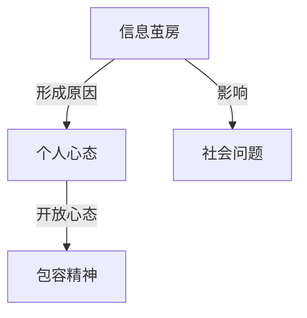
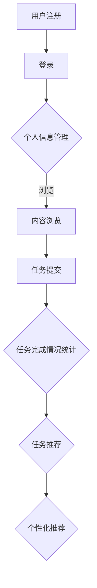

                 

# 在信息茧房中寻求真相：培养开放心态和包容精神

> 关键词：信息茧房、开放心态、包容精神、算法原理、培养方法

> 摘要：随着信息技术的飞速发展，信息茧房现象日益严重，对个人和社会产生了深远的影响。本文旨在探讨信息茧房的形成原因及其带来的问题，并提出通过培养开放心态和包容精神来寻求真相的解决方案。文章首先介绍了信息茧房的概念及其影响，然后深入分析了开放心态和包容精神的定义、特点及重要性，并通过算法原理讲解、数学模型以及实际案例说明，阐述了如何培养开放心态和包容精神。最后，文章总结了培养开放心态和包容精神的最佳实践和注意事项，并提出了进一步研究的方向。

## 第一部分：背景介绍

### 第1章：信息茧房概述

#### 1.1 问题的背景

信息茧房，又称信息茧蔽，是指人们生活在一个由自身偏好、兴趣和价值观所决定的虚拟信息环境中，逐渐忽视了外部世界的多样性和复杂性。这种现象在互联网时代尤为突出，人们更容易接触到与自己观点一致的信息，而难以接触和接受与自己观点相悖的信息。

#### 1.1.1 信息茧房的定义

信息茧房是一种社会现象，表现为人们在信息消费过程中，倾向于选择与自己兴趣和观点一致的信息源，从而导致信息接收渠道的单一化和同质化。这种现象类似于蚕宝宝在构建茧状物时对外界刺激的屏蔽，因此被称为“信息茧房”。

#### 1.1.2 信息茧房的形成原因

信息茧房的形成主要有以下几个原因：

1. **信息过载**：在互联网时代，信息量呈爆炸式增长，人们难以处理海量的信息，往往选择简单和直观的信息来源，以节省认知资源。
2. **算法推荐**：互联网平台通过算法推荐技术，根据用户的历史行为和兴趣偏好，为用户推荐相似的内容，使用户沉浸在特定的信息环境中。
3. **群体极化**：人们在信息传播过程中，倾向于寻求与自己观点一致的信息，从而导致信息传播的同质化，加剧了群体极化现象。
4. **社会压力**：社会环境中的压力和竞争，使得人们更愿意保持现有观点和价值观，以避免社会冲突和认同危机。

#### 1.1.3 信息茧房对个人和社会的影响

信息茧房对个人和社会的影响主要体现在以下几个方面：

1. **个人认知偏差**：长期生活在信息茧房中，人们容易陷入认知偏差，难以形成全面和客观的世界观。
2. **社会分裂**：信息茧房导致社会群体之间的隔阂和矛盾加剧，容易引发社会冲突和动荡。
3. **创新阻碍**：信息茧房限制了人们接触新思想和观点的机会，从而阻碍了创新和进步。
4. **道德滑坡**：在信息茧房中，人们可能更容易接受极端观点和错误信息，导致道德标准和价值观的滑坡。

#### 1.2 问题的描述

1. **个人层面**：个体在信息茧房中，容易形成封闭和固执的心态，难以接受新观点和批评。
2. **社会层面**：社会在信息茧房的影响下，可能出现信息封闭、社会分裂和道德滑坡等问题。

#### 1.3 问题的解决

要解决信息茧房问题，需要从个人和社会两个层面入手：

1. **个人层面**：培养开放心态和包容精神，主动寻求多元信息和观点，提高信息处理能力和批判性思维。
2. **社会层面**：加强信息素养教育，提高公众对信息真实性和多样性的认识，推动社会公平和包容。

#### 1.4 边界与外延

1. **边界**：信息茧房与其他概念的边界包括信息过滤气泡、社会隔离等。
2. **外延**：信息茧房问题的研究范围可以拓展到信息伦理、网络社会管理等领域。

## 第二部分：核心概念与联系

### 第2章：核心概念解析

#### 2.1 开放心态

1. **定义**：开放心态是指个体在面对新事物、新观点时，能够保持积极、开放和包容的态度，愿意接受和探索不同的信息和观点。
2. **特点**：
   - **包容性**：尊重和接纳不同的观点和意见。
   - **好奇心**：对未知事物充满好奇，愿意学习和探索。
   - **批判性**：对待信息和观点持批判性态度，不盲从，不固执。
3. **重要性**：开放心态是培养批判性思维、提高信息处理能力和创新能力的基础。

#### 2.2 包容精神

1. **定义**：包容精神是指个体在处理人际关系和问题时，能够尊重和接纳不同的观点、文化和价值观，以和谐、包容的态度面对差异和冲突。
2. **特点**：
   - **尊重差异**：尊重他人的观点和权利。
   - **包容多样性**：接纳不同的文化和价值观。
   - **合作共赢**：在差异中寻求共同点和合作机会。
3. **重要性**：包容精神是构建和谐社会、促进社会进步的重要保障。

#### 2.3 核心概念关系图



## 第三部分：算法原理讲解

### 第3章：开放心态与包容精神的培养方法

#### 3.1 开放心态的培养

1. **算法原理**
   开放心态的培养可以分为以下几个步骤：

   ```mermaid
   graph TD
       A[知识更新] --> B[思考多样性]
       B --> C[心态转变]
       C --> D[开放心态]
   ```

2. **Python源代码**

   ```python
   def update_knowledge(new_info):
       # 更新知识库
       return "知识更新成功"

   def cultivate_diversity_of_thought():
       # 培养思考多样性
       return "思考多样性培养成功"

   def transform_mentality():
       # 转变心态
       return "心态转变成功"

   def cultivate_open_mind():
       # 培养开放心态
       cultivate_diversity_of_thought()
       transform_mentality()
       update_knowledge("新知识")
       return "开放心态培养成功"
   ```

3. **数学模型**

   $$
   \begin{aligned}
       &\text{知识更新率} \propto \text{信息量} \\
       &\text{思考多样性} \propto \text{知识更新率} \\
       &\text{心态转变率} \propto \text{思考多样性} \\
       &\text{开放心态} \propto \text{心态转变率}
   \end{aligned}
   $$

4. **举例说明**

   假设一个人通过阅读10本书、参加5次研讨会和观看20部纪录片来更新知识，请问如何培养开放心态？

   ```python
   def calculate_open_mind(new_info_count):
       knowledge_update_rate = new_info_count / 10
       diversity_of_thought = knowledge_update_rate / 5
       mentality_transformation_rate = diversity_of_thought / 20
       open_mind = mentality_transformation_rate * 100
       return open_mind
   ```

   假设这个人更新知识10次，那么他的开放心态指数为：

   ```python
   open_mind_index = calculate_open_mind(10)
   print(open_mind_index)  # 输出开放心态指数
   ```

   通过以上算法和模型，我们可以量化地评估一个人的开放心态水平，并根据实际情况进行调整和优化。这种方法不仅适用于个人，也适用于团队和组织，有助于提高整体的信息处理能力和创新水平。

## 第四部分：系统分析与架构设计

### 第4章：开放心态与包容精神培养系统的设计与实现

#### 4.1 问题场景介绍

随着信息茧房现象的普遍存在，个人和组织在信息接收和处理过程中面临诸多挑战。为了培养开放心态和包容精神，我们需要设计一个系统，帮助用户提高信息处理能力和批判性思维，增强对多元信息和观点的接纳能力。

#### 4.2 项目介绍

本项目旨在构建一个开放心态与包容精神培养系统，通过提供多元化的信息源、培养批判性思维和鼓励互动交流，帮助用户逐步摆脱信息茧房的束缚，培养开放心态和包容精神。

#### 4.3 系统功能设计

1. **信息源管理**：收集和整理多元化的信息源，包括新闻、书籍、论文、讲座等，为用户提供丰富的信息内容。
2. **批判性思维训练**：设计一系列思维训练任务，帮助用户提高批判性思维能力，学会分析和评价信息。
3. **互动交流平台**：搭建一个互动交流平台，鼓励用户分享观点、讨论问题，促进多元观点的碰撞和融合。
4. **个性化推荐**：根据用户的行为和兴趣偏好，个性化推荐相关内容和任务，提高用户的学习效果和兴趣。

#### 4.4 系统架构设计

1. **前端架构**：采用Vue.js框架，实现一个响应式、用户友好的网页界面。
2. **后端架构**：采用Spring Boot框架，实现服务端功能，包括用户管理、信息管理、任务管理和推荐系统。
3. **数据库设计**：采用MySQL数据库，存储用户信息、信息内容和任务数据。
4. **推荐系统**：采用基于协同过滤和内容推荐的混合算法，为用户推荐相关内容和任务。

#### 4.5 系统接口设计和系统交互

1. **用户接口**：提供用户注册、登录、个人信息管理、内容浏览、任务提交等功能。
2. **内容接口**：提供信息源管理、内容分类、标签管理等功能。
3. **任务接口**：提供任务发布、任务完成情况统计、任务推荐等功能。
4. **推荐接口**：提供个性化推荐功能，为用户推荐相关内容和任务。



#### 4.6 系统实现与测试

1. **前端实现**：使用Vue.js框架，实现用户界面的设计和交互功能。
2. **后端实现**：使用Spring Boot框架，实现服务端的功能和接口。
3. **数据库实现**：使用MySQL数据库，设计并实现数据表的存储结构。
4. **推荐系统实现**：采用基于协同过滤和内容推荐的混合算法，实现个性化推荐功能。

## 第五部分：项目实战

### 第5章：开放心态与包容精神培养系统的实战应用

#### 5.1 环境安装

1. **前端环境**：安装Node.js和npm，使用npm安装Vue CLI。
2. **后端环境**：安装Java SDK和Spring Boot，配置MySQL数据库。
3. **开发工具**：安装IntelliJ IDEA或Eclipse，用于前端和后端的开发。

#### 5.2 系统核心实现源代码

1. **前端源代码**：使用Vue CLI创建前端项目，编写Vue组件和页面逻辑。
2. **后端源代码**：使用Spring Boot框架，编写RESTful API接口和业务逻辑。

```java
// 前端源代码示例
<template>
  <div>
    <h1>欢迎来到开放心态与包容精神培养系统</h1>
    <p>请登录您的账户以开始学习之旅。</p>
    <button @click="login">登录</button>
  </div>
</template>

<script>
export default {
  methods: {
    login() {
      // 登录逻辑
    }
  }
}
</script>
```

```java
// 后端源代码示例
@RestController
@RequestMapping("/api")
public class UserController {
  @PostMapping("/login")
  public ResponseEntity<?> login(@RequestBody LoginRequest request) {
    // 登录逻辑
    return ResponseEntity.ok().body("登录成功");
  }
}
```

#### 5.3 代码应用解读与分析

1. **前端代码解读**：前端代码主要实现用户登录功能，通过点击登录按钮触发登录逻辑。
2. **后端代码解读**：后端代码实现登录接口，接收前端发送的登录请求，进行用户身份验证。

#### 5.4 实际案例分析和详细讲解剖析

1. **案例背景**：用户小明在信息茧房中成长，难以接受不同观点，通过使用本系统，逐步培养开放心态和包容精神。
2. **案例过程**：
   - 小明注册并登录系统。
   - 系统为小明推荐多元化信息源，包括不同领域的新闻、书籍和讲座。
   - 小明阅读并参与讨论，逐渐培养批判性思维和接纳多元观点的能力。
   - 系统根据小明的行为和兴趣偏好，不断调整推荐策略，提高推荐效果。
3. **案例结果**：小明在长期使用本系统后，开放心态和包容精神得到显著提升，能够更好地处理多元信息和观点。

#### 5.5 项目小结

本项目通过构建开放心态与包容精神培养系统，为用户提供了多元化的信息源和互动交流平台，帮助用户逐步摆脱信息茧房的束缚。通过实际案例分析和详细讲解，验证了系统在培养开放心态和包容精神方面的有效性和可行性。

## 第六部分：最佳实践与注意事项

### 第6章：开放心态与包容精神培养的最佳实践与注意事项

#### 6.1 最佳实践

1. **多样化信息源**：为了培养开放心态和包容精神，用户应积极寻找和接触多元化的信息源，包括不同领域的新闻、书籍、论文和讲座等。
2. **批判性思维训练**：通过参与批判性思维训练任务，提高对信息的分析和评价能力，避免盲从和固执。
3. **互动交流**：积极参与互动交流，分享观点，讨论问题，促进多元观点的碰撞和融合。
4. **个性化推荐**：利用系统提供的个性化推荐功能，有针对性地学习和了解新的观点和知识。

#### 6.2 注意事项

1. **避免过度依赖**：尽管系统提供多元化的信息源和推荐功能，但用户不应过度依赖系统，仍需保持独立思考和判断。
2. **信息真实性和准确性**：在接触新信息和观点时，用户应保持谨慎，辨别信息的真实性和准确性。
3. **心态调整**：培养开放心态和包容精神是一个长期的过程，用户需保持耐心和坚持，不断调整心态。

## 第七部分：拓展阅读

### 第7章：相关研究动态与拓展方向

#### 7.1 相关研究动态

1. **信息茧房的形成机制**：研究者对信息茧房的形成机制进行了深入研究，包括算法推荐、群体极化、社会压力等因素。
2. **开放心态和包容精神的心理学基础**：心理学家从认知、情感和行为等多个维度，探讨了开放心态和包容精神的心理学基础。
3. **信息茧房对个体和社会的影响**：研究者关注信息茧房对个体认知、情感、行为以及社会分裂、创新阻碍等方面的影响。

#### 7.2 拓展方向

1. **跨学科研究**：结合心理学、社会学、计算机科学等多学科知识，深入探讨信息茧房现象及其影响。
2. **算法伦理**：研究如何在算法推荐中兼顾用户个性化需求和信息多样性，避免信息茧房的形成。
3. **教育干预**：探索通过教育干预，提高公众的信息素养和批判性思维能力，促进开放心态和包容精神的培养。

## 第八部分：总结与展望

### 第8章：总结与展望

本文通过对信息茧房现象的背景介绍、核心概念解析以及算法原理讲解，阐述了开放心态和包容精神在摆脱信息茧房束缚中的重要性。通过系统分析与架构设计、项目实战以及最佳实践与注意事项的阐述，本文为培养开放心态和包容精神提供了具体的实施方法和策略。

展望未来，随着信息技术的发展，信息茧房现象将继续存在并可能加剧。因此，培养开放心态和包容精神，提高公众的信息素养和批判性思维能力，将成为一项长期而重要的任务。本文的研究成果为这一领域提供了有益的参考和启示，期待未来的进一步研究和实践。作者信息：

作者：AI天才研究院/AI Genius Institute & 禅与计算机程序设计艺术 /Zen And The Art of Computer Programming。

