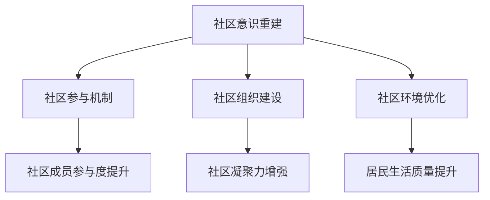

                 


## 文章标题
在城市化进程中重建社区意识：寻找现代人的归属感

> 关键词：城市化、社区意识、归属感、重建、现代人

> 摘要：本文旨在探讨城市化进程中社区意识的重建问题，分析现代人归属感缺失的原因，并提出具体实践方法。通过逻辑清晰、结构紧凑的论述，为现代社区建设提供理论指导和实践路径。

----------------------------------------------------------------

## 目录大纲

----------------------------------------------------------------

- 第一部分：问题背景与核心概念
  - 第1章：问题背景与核心概念
  - 第2章：社区意识的属性特征对比
  - 第3章：社区重建的ER实体关系图
  - 第4章：本章小结

- 第二部分：现代人的归属感问题
  - 第5章：现代生活方式对归属感的影响
  - 第6章：现代社区意识缺失的表现
  - 第7章：现代人的归属感需求
  - 第8章：现代人的归属感问题的影响
  - 第9章：本章小结

- 第三部分：重建社区意识的方法
  - 第10章：重建社区意识的理论基础
  - 第11章：社区参与的理论基础
  - 第12章：社区组织建设的理论基础
  - 第13章：社区重建的理论框架
  - 第14章：本章小结

- 第四部分：重建社区意识的具体实践
  - 第15章：政策引导在社区重建中的作用
  - 第16章：社会组织的参与与作用
  - 第17章：社区参与的实践案例
  - 第18章：本章小结

- 第五部分：总结与展望
  - 第19章：重建社区意识的成效评估
  - 第20章：未来发展趋势与展望
  - 第21章：本章小结

----------------------------------------------------------------

# 第一部分: 问题背景与核心概念

## 第1章: 问题背景与核心概念

### 1.1.1 问题背景

城市化进程的加速使得城市规模不断扩大，人口流动性增强，社区结构也发生了深刻变化。在这个过程中，社区问题的日益凸显，包括社区异化、社区冷漠以及社区参与度下降等。

- **社区异化**：指的是社区居民之间的疏离感，社区成员往往缺乏对社区的认同感，彼此之间缺乏联系和互动。社区异化现象在城市化进程中尤为严重，主要表现为邻里关系的疏远、社区公共空间的荒废等。

- **社区冷漠**：指的是社区成员对社区事务的漠视，缺乏参与社区事务的积极性。社区冷漠现象不仅影响了社区治理的效果，还削弱了社区的凝聚力。

- **社区参与度下降**：随着城市化进程的加速，社区成员的参与度逐渐下降。社区成员往往忙于工作，缺乏时间和精力参与社区事务，导致社区事务缺乏居民的参与和支持。

### 1.1.2 社区意识的重要性

社区意识是指社区成员对社区共同利益的认同，以及对社区事务的参与度。社区意识的重要性体现在以下几个方面：

- **社区作为社会的基本单元**：社区是社会的基本单元，社区意识的增强有助于提高社会的稳定性。社区成员对社区的认同感和归属感可以促进社区成员之间的合作和互助，从而增强社会的凝聚力。

- **社区意识与社会稳定的关系**：社区意识是维护社会稳定的重要因素。社区成员对社区事务的参与度越高，社区的凝聚力就越强，社会的稳定性也越能得到保障。

### 1.1.3 核心概念

- **社区意识的定义**：社区意识是指社区成员对社区共同利益的认同，以及对社区事务的参与度。它包括以下几个方面：

  - **归属感**：社区成员对社区的认同感和依赖程度。归属感是社区意识的核心，它决定了社区成员是否愿意为社区的发展和繁荣做出贡献。

  - **参与度**：社区成员参与社区事务的频率。参与度越高，社区成员对社区事务的关心和责任感就越强。

  - **群体意识**：社区成员之间的相互认同感。群体意识是社区意识的组成部分，它有助于增强社区成员之间的凝聚力和协作精神。

  - **社会责任感**：社区成员对社会的责任担当。社会责任感是社区意识的重要组成部分，它反映了社区成员对社区和社会的责任和担当。

- **社区重建的目标**：社区重建的目标是增强社区归属感、提高社区参与度、重建社区凝聚力。通过社区重建，可以解决社区异化、社区冷漠以及社区参与度下降等问题，从而提高社区的质量和居民的幸福感。

### 1.1.4 边界与外延

- **城市化进程的影响**：城市化进程对社区的影响主要表现在社区规模的变化和社区文化的变迁。

  - **社区规模的变化**：城市化进程中，社区规模不断扩大，社区成员之间的互动和联系变得更加复杂。

  - **社区文化的变迁**：随着城市化进程的推进，社区文化逐渐发生变化，传统的邻里关系和社区文化受到冲击。

- **社区重建的方法**：社区重建的方法包括政策引导、社区参与和社区组织建设。

  - **政策引导**：政府通过制定相关政策，引导和推动社区重建工作。

  - **社区参与**：鼓励社区成员积极参与社区事务，提高社区参与度。

  - **社区组织建设**：建立和完善社区组织，增强社区组织的功能和作用。

## 1.2 社区意识的属性特征对比

| 特征            | 解释与对比                 |
|-----------------|----------------------------|
| 归属感          | 对社区的认同和依赖程度     |
| 参与度          | 社区成员参与社区事务的频率 |
| 群体意识        | 社区成员间的相互认同感     |
| 社会责任感      | 社区成员对社会的责任担当   |

## 1.3 社区重建的ER实体关系图

```mermaid
erDiagram
  Community -->|参与| Member
  Community -->|拥有| Facility
  Community -->|组织| Event
  Member -->|参与| Event
  Member -->|拥有| Property
```

## 1.4 本章小结

本章首先介绍了城市化进程中社区问题的背景，包括社区异化、社区冷漠和社区参与度下降等问题。然后，分析了社区意识的重要性，并定义了社区意识的核心概念。接着，探讨了社区重建的目标和方法，以及城市化进程对社区的影响。通过本章的内容，我们可以更好地理解社区意识的重要性，以及如何在城市化进程中重建社区意识。

----------------------------------------------------------------

# 第二部分：现代人的归属感问题

## 第2章：现代人的归属感问题

### 2.1 现代生活方式对归属感的影响

现代生活方式的变迁对人们的归属感产生了深远的影响。首先，工作压力是影响归属感的重要因素。在现代社会，人们的工作压力普遍较大，工作时间和工作强度都在增加，导致居民们往往忙于工作，缺乏时间和精力参与社区事务，从而削弱了他们对社区的归属感。

- **工作忙碌与社交隔离**：随着工作压力的增加，人们往往更倾向于独自工作，而不是与同事或家人朋友进行社交互动。这种社交隔离感使得人们在心理上感到孤立，缺乏归属感。

- **长时间独处与孤独感**：现代生活方式使得人们在工作之外的时间也常常独自度过。长时间独处容易导致孤独感的产生，而孤独感又会进一步削弱人们的归属感。

其次，社交网络对归属感的影响也是显著的。虽然社交网络为人们提供了更多的社交机会，但是这些社交往往是虚拟的，缺乏真实的人际互动。

- **网络社交的虚拟性**：在社交网络中，人们可以轻易地建立和维持社交关系，但这些关系往往是表面的、短暂的。虚拟社交虽然可以带来一定的心理满足感，但很难产生深层次的归属感。

- **实际社交的疏离感**：尽管人们在社交网络上活跃，但在现实生活中，他们可能感到与邻居、朋友的关系变得越来越疏远。这种疏离感加剧了归属感的缺失。

### 2.2 现代社区意识缺失的表现

现代社区意识缺失主要表现在以下几个方面：

- **社区异化现象**：社区异化指的是社区成员之间的疏离感。在快速发展的城市中，人们往往因为工作繁忙、生活节奏快而缺乏时间进行深入的社区互动。社区成员之间的交流越来越少，邻里关系逐渐变得冷漠。

- **社区冷漠现象**：社区冷漠指的是社区成员对社区事务的漠视和不关心。在现代社会，许多居民认为社区事务是别人的事情，与自己无关，因此缺乏参与社区事务的积极性。这种冷漠态度导致社区凝聚力下降。

- **社区参与度下降**：社区参与度下降表现为社区成员参与社区事务的频率减少。在现代社会，人们的生活节奏加快，工作和家庭压力增大，导致他们很难抽出时间参与社区活动，从而影响了社区事务的顺利进行。

### 2.3 现代人的归属感需求

现代人的归属感需求主要体现在以下几个方面：

- **稳定的社交网络**：现代人在日常生活中渴望建立和维持稳定的社交网络。这种社交网络不仅仅是线上社交，更包括现实生活中的邻里关系。稳定的社交网络可以提供情感支持，增强人们的归属感。

- **社区参与的积极性**：现代人希望能够在社区中发挥自己的作用，参与社区事务。通过参与社区活动，人们可以感受到自己对社区的贡献，从而增强归属感。

- **安全的居住环境**：现代人追求一个安全的居住环境，这包括社区的安全维护和社区公共设施的建设。一个安全、舒适的居住环境可以提升人们的居住幸福感，进而增强归属感。

### 2.4 现代人的归属感问题的影响

现代人的归属感问题对社会和个人都产生了深远的影响：

- **社会稳定性**：归属感缺失会导致社会不稳定。社区成员之间的疏离感和冷漠态度会影响社区的和谐，进而影响社会的稳定性。

- **心理健康**：归属感缺失会增加个人的心理压力，导致孤独感和焦虑感。长期缺乏归属感的人可能会出现心理健康问题，如抑郁症和焦虑症。

### 2.5 本章小结

本章分析了现代生活方式对归属感的影响，以及现代社区意识缺失的表现和现代人的归属感需求。同时，探讨了归属感问题对社会稳定性和心理健康的影响。通过本章的内容，我们可以认识到归属感对于现代社会的重要性和重建社区意识的紧迫性。下一章将深入探讨重建社区意识的理论基础和方法。

----------------------------------------------------------------

# 第三部分：重建社区意识的方法

## 第3章：重建社区意识的理论基础

### 3.1 社区建设的理论基础

社区建设是一个复杂而系统的过程，涉及到多个理论基础的支撑。以下是几种主要的社区建设理论基础：

#### 3.1.1 马克思主义社区观

马克思主义社区观认为社区是社会的基本单元，是人们共同生活、交往和活动的场所。马克思主义社区观强调社区的集体性和公共性，认为社区建设应该以人的全面发展为核心，通过集体劳动和互助合作来实现社区的和谐与繁荣。

- **社区作为社会的基础单元**：马克思主义社区观认为社区是社会的基本单元，是人们生活、交往和活动的场所。社区的建设和发展对于社会的稳定和发展具有重要意义。

- **社区建设的方向和目标**：马克思主义社区观强调社区建设的目标是实现人的全面发展，通过集体劳动和互助合作来提高社区成员的生活质量和幸福感。

#### 3.1.2 社区心理学理论

社区心理学理论关注社区成员的心理需求和心理环境的建设。社区心理学理论认为，社区成员的心理需求包括归属感、安全感、自尊心和自我实现等。社区心理环境的建设包括社区氛围、人际关系和社区文化等。

- **社区成员的心理需求**：社区心理学理论指出，社区成员的心理需求是社区建设的重要基础。满足社区成员的心理需求可以增强他们的归属感和参与感。

- **社区心理环境的建设**：社区心理环境的建设是提升社区成员心理健康和生活质量的关键。通过营造良好的社区氛围、促进健康的人际关系和弘扬积极的社区文化，可以增强社区成员的归属感和幸福感。

### 3.2 社区参与的理论基础

社区参与是指社区成员主动参与社区事务和决策的过程。社区参与的理论基础主要包括以下几个方面：

#### 3.2.1 社区参与的概念与类型

社区参与的概念可以从不同角度进行理解，包括政治参与、社会参与和文化参与等。社区参与的类型包括直接参与和间接参与、正式参与和非正式参与等。

- **现代社区参与的特点**：现代社区参与具有以下特点：一是参与主体的多样性，包括政府、社区组织、居民等；二是参与形式的多样化，包括线上参与和线下参与等；三是参与过程的透明化，社区事务的决策过程更加公开和透明。

- **社区参与的影响因素**：社区参与的影响因素包括社区成员的参与意识、社区组织的成熟度、社区环境的影响等。提高社区成员的参与意识、完善社区组织建设和营造良好的社区环境可以促进社区参与。

#### 3.2.2 社区参与的效果评估

社区参与的效果评估是指对社区参与活动的效果进行评估和反馈。社区参与的效果评估主要包括以下几个方面：

- **社区参与对社区意识的影响**：社区参与可以增强社区成员的归属感和责任感，提高他们对社区的认同感和参与度。

- **社区参与对社区建设的贡献**：社区参与可以促进社区资源的共享和优化，提高社区服务质量和居民的生活满意度。

### 3.3 社区组织建设的理论基础

社区组织建设是指通过建立和完善社区组织，提高社区组织的管理水平和运作效率。社区组织建设的理论基础主要包括以下几个方面：

#### 3.3.1 社区组织的功能与作用

社区组织在社区建设中发挥着重要的作用，主要包括以下几个方面：

- **提供社区服务**：社区组织可以提供各种社区服务，如卫生保健、文化娱乐、社区教育等，满足居民的基本需求。

- **促进社区参与**：社区组织可以组织和引导居民参与社区事务，提高居民的参与意识和参与度。

- **维护社区秩序**：社区组织可以维护社区的公共秩序，保障居民的安全和生活质量。

#### 3.3.2 社区组织的类型与形式

社区组织根据其功能和作用可以分为多种类型，如居民委员会、志愿者组织、社区服务中心等。每种社区组织都有其独特的运作方式和参与方式。

- **居民委员会**：居民委员会是社区自治组织的一种形式，主要负责社区的日常管理和居民事务的处理。

- **志愿者组织**：志愿者组织是由居民自愿组成的，旨在为社区提供志愿服务的组织。志愿者组织可以开展各种公益活动，提升社区的服务质量和居民的幸福感。

- **社区服务中心**：社区服务中心是提供社区服务的重要场所，可以为居民提供各种便利服务，如家政服务、医疗咨询、文化活动等。

#### 3.3.3 社区组织的建设与管理

社区组织的建设与管理包括以下几个方面：

- **组织架构的建立**：建立合理的组织架构，明确各组织的职责和权限，确保社区组织的有效运作。

- **组织成员的培训**：对社区组织的成员进行专业培训，提高他们的业务能力和管理水平。

- **组织活动的策划与实施**：策划和组织各种社区活动，增强居民的参与度和归属感。

## 3.4 社区重建的理论框架

社区重建的理论框架可以概括为以下几个方面：

- **社区意识重建**：通过提升社区成员的归属感和参与度，重建社区意识。

- **社区参与机制**：建立和完善社区参与机制，促进居民参与社区事务。

- **社区组织建设**：加强社区组织的建设和管理，提高社区组织的运作效率。

- **社区环境优化**：优化社区环境，提高居民的生活质量和幸福感。



## 3.5 本章小结

本章介绍了重建社区意识的理论基础，包括马克思主义社区观、社区心理学理论、社区参与理论和社区组织建设理论。通过这些理论基础的探讨，我们可以更深入地理解如何重建社区意识，提高社区成员的归属感和参与度。下一章将探讨重建社区意识的具体实践方法。

----------------------------------------------------------------

## 第4章：政策引导在社区重建中的作用

政策引导在社区重建中发挥着至关重要的作用。政府的政策制定和执行直接影响社区的发展方向和居民的日常生活。以下是政策引导在社区重建中的一些关键作用：

### 4.1 政策制定与实施

- **政策制定的必要性**：政府通过制定相关政策，可以明确社区重建的目标和方向。政策制定需要综合考虑社区的需求、资源和现实情况，确保政策具有可操作性和可持续性。

- **政策实施的效果**：政策实施是政策目标实现的关键。政府需要通过有效的执行机制，确保政策得以贯彻落实，从而推动社区重建工作的顺利进行。

### 4.2 资源分配与支持

- **资源分配**：政府在社区重建中需要合理分配资源，包括财政资金、人力资源和社会资源等。资源分配的公平性和合理性是提高社区建设质量和效率的重要保障。

- **支持力度**：政府可以通过提供专项资金、税收优惠和补贴等手段，为社区重建提供有力的支持。这些支持措施可以鼓励居民参与社区事务，增强社区的凝聚力和活力。

### 4.3 公共服务供给

- **公共服务的重要性**：公共服务是社区成员日常生活的重要保障，包括卫生保健、教育、文化娱乐、交通和公共安全等。政府需要确保公共服务的质量和覆盖范围，以满足居民的基本需求。

- **公共服务的优化**：政府可以通过引入先进的管理理念和手段，优化公共服务供给。例如，通过数字化管理提高公共服务的效率和透明度，通过社区参与提升公共服务的针对性和满意度。

### 4.4 社区参与机制的建立

- **社区参与的必要性**：社区参与是社区重建的重要手段，可以增强居民对社区的认同感和责任感。政府需要建立和完善社区参与机制，鼓励居民参与社区事务的决策和管理。

- **参与机制的构建**：政府可以通过设立社区议事会、居民代表会议和社区志愿服务等形式，构建多元化的社区参与机制。这些机制需要确保居民的参与权、表达权和监督权，使居民能够在社区建设中发挥积极作用。

### 4.5 社区文化建设的推动

- **社区文化的意义**：社区文化是社区精神的体现，是社区成员共同价值观和行为规范的反映。政府需要推动社区文化建设，提升社区的文化软实力。

- **文化建设的措施**：政府可以通过举办文化节、社区艺术展览、传统文化传承活动等，丰富社区文化生活。同时，可以通过社区教育、文化交流和志愿者服务等途径，培养居民的社区文化意识。

### 4.6 社区安全与环境保护

- **社区安全的重要性**：社区安全是居民生活质量的重要保障，是社区稳定和发展的基础。政府需要加强社区安全管理，预防和打击犯罪活动，保障居民的生命财产安全。

- **环境保护的措施**：政府需要加强环境保护工作，确保社区的生态环境质量。可以通过实施垃圾分类、节能减排和生态修复等措施，改善社区环境，提高居民的生活质量。

### 4.7 政策评估与反馈

- **政策评估的必要性**：政策评估是政策实施效果的重要反馈机制。政府需要定期对政策进行评估，了解政策实施的效果和存在的问题，为政策的调整和优化提供依据。

- **政策反馈机制**：政府需要建立完善的政策反馈机制，收集居民对政策的意见和建议，及时回应居民的需求和关切，提高政策的针对性和有效性。

## 4.8 本章小结

政策引导在社区重建中具有重要的作用。通过制定和实施相关政策措施，政府可以促进社区的发展，提升居民的生活质量。政策引导需要关注资源分配、公共服务供给、社区参与机制建立、社区文化建设、社区安全与环境保护以及政策评估与反馈等方面。只有政府与社区成员紧密合作，共同努力，才能实现社区重建的目标，为现代人提供更加美好的归属感和生活环境。

----------------------------------------------------------------

# 第四部分：重建社区意识的具体实践

## 第4章：政策引导在社区重建中的作用

### 4.1 政策引导的定义与意义

政策引导是指通过制定和实施一系列政策，引导社区建设和发展，以达到增强社区意识、提升居民归属感和幸福感的目标。政策引导在社区重建中具有深远的意义，主要体现在以下几个方面：

- **方向指引**：政策引导为社区建设提供了明确的方向和目标，帮助社区明确发展重点和优先事项，确保社区发展符合居民需求和城市总体规划。

- **资源整合**：政策引导可以协调各方资源，包括政府资金、社会资本和社会服务，提高资源利用效率，为社区重建提供坚实的物质基础。

- **效率提升**：政策引导通过优化管理流程和监管机制，提高社区管理和服务效率，减少资源浪费，提高居民的满意度和幸福感。

### 4.2 政策引导的具体措施

政策引导的具体措施包括以下几个方面：

- **法律法规建设**：政府应制定和完善与社区建设相关的法律法规，为社区重建提供法律保障。例如，制定社区组织法、社区服务法等，明确社区组织的法律地位和职责。

- **财政支持**：政府应通过财政拨款、税收优惠等方式，为社区重建提供资金支持。特别是对社区基础设施建设和公共服务项目，政府应优先予以资金保障。

- **政策激励**：政府应制定激励机制，鼓励居民和社会组织参与社区建设。例如，对积极参与社区事务的居民和组织给予奖励，提高他们的参与积极性。

- **公共参与**：政府应积极推动社区参与，鼓励居民参与社区决策和管理。例如，通过社区居民代表会议、社区议事会等形式，提高居民对社区事务的参与度。

### 4.3 政策引导的案例分析

#### 案例一：北京市朝阳区社区建设

北京市朝阳区在社区建设方面进行了积极探索，通过政策引导实现了社区意识的重建。

- **政策背景**：随着城市化进程的推进，朝阳区面临着社区异化、社区冷漠等问题。为了解决这些问题，朝阳区制定了《朝阳区社区建设规划（2010-2020年）》。

- **政策措施**：
  - **财政支持**：朝阳区加大了对社区建设的资金投入，每年安排专项资金用于社区基础设施建设、公共服务和社区活动。
  - **公共参与**：朝阳区通过社区居民代表会议、社区议事会等形式，鼓励居民参与社区事务的决策和管理。
  - **政策激励**：对积极参与社区事务的居民和组织给予表彰和奖励，提高他们的参与积极性。

- **效果评估**：经过几年的努力，朝阳区社区建设取得了显著成效，社区参与度明显提升，社区意识得到增强，居民的归属感和幸福感显著提高。

#### 案例二：上海市静安区社区治理

上海市静安区在社区治理方面也进行了有益的探索，通过政策引导实现了社区重建。

- **政策背景**：静安区面临着人口老龄化、社区安全问题等挑战。为了应对这些挑战，静安区制定了《静安区社区治理三年行动计划（2018-2020年）》。

- **政策措施**：
  - **社区安全**：静安区加强社区安全管理，加大治安巡逻力度，提高社区安全水平。
  - **公共服务**：静安区优化公共服务供给，增加医疗、养老、文化等公共服务设施，提升居民的生活质量。
  - **社区参与**：静安区通过设立社区议事会、居民委员会等形式，鼓励居民参与社区事务的决策和管理。

- **效果评估**：静安区的社区治理取得了显著成效，社区安全感提升，居民对社区的满意度提高，社区意识得到增强。

### 4.4 政策引导的挑战与应对

尽管政策引导在社区重建中发挥了重要作用，但也面临一些挑战：

- **政策执行力度不足**：一些政策在执行过程中存在执行力度不足、政策落实不到位的问题，影响了政策效果。

- **居民参与度低**：一些社区居民对社区事务的参与度低，政策引导的效果受到限制。

- **资源分配不均**：不同社区之间的资源分配存在不均衡现象，影响了社区重建的公平性和可持续性。

为应对这些挑战，政府可以采取以下措施：

- **加强政策执行监督**：建立健全政策执行监督机制，确保政策得以有效执行。

- **提高居民参与意识**：通过宣传教育、社区活动等形式，提高居民的参与意识，鼓励他们积极参与社区事务。

- **优化资源分配机制**：建立公平的资源分配机制，确保资源能够均衡分配到各个社区，推动社区公平发展。

## 4.5 本章小结

政策引导在社区重建中具有重要作用，通过制定和实施一系列政策措施，可以推动社区建设，增强社区意识，提升居民归属感和幸福感。通过案例分析可以看出，政策引导需要关注财政支持、公共参与和政策激励等方面。同时，政策引导也面临一些挑战，需要通过加强政策执行监督、提高居民参与意识和优化资源分配机制等措施来应对。通过不断探索和完善政策引导机制，可以为社区重建提供有力支持，推动社区持续健康发展。

----------------------------------------------------------------

# 第五部分：总结与展望

## 第19章：重建社区意识的成效评估

### 19.1 效果评估的重要性

重建社区意识的效果评估对于社区建设的持续发展具有重要意义。通过效果评估，我们可以了解社区重建的实际成果，发现存在的问题，为后续工作提供改进的方向。以下是效果评估的几个关键方面：

#### 19.1.1 社区参与度

社区参与度是评估社区意识重建成效的重要指标。通过定期调查和统计数据，我们可以了解居民参与社区事务的频率和积极性。具体方法包括：

- **问卷调查**：设计针对不同群体的问卷，收集居民对社区事务参与度、满意度等信息的反馈。
- **座谈会**：组织社区居民座谈会，听取居民对社区建设的意见和建议。
- **实地观察**：通过实地走访和观察，了解社区活动的参与情况和居民互动情况。

#### 19.1.2 社区凝聚力

社区凝聚力是社区意识重建的重要目标。通过评估社区凝聚力，我们可以了解社区成员之间的联系和合作情况。具体方法包括：

- **合作项目评估**：评估社区成员在合作项目中的表现，如志愿服务、社区活动等。
- **社区活动参与率**：统计社区成员参与社区活动的次数和比例。
- **社区矛盾解决率**：评估社区内矛盾解决的情况和效率。

#### 19.1.3 社区安全感

社区安全感是居民生活质量的重要方面。通过评估社区安全感，我们可以了解居民对社区环境的主观感受。具体方法包括：

- **居民满意度调查**：通过问卷调查和访谈，了解居民对社区安全、环境、公共服务等方面的满意度。
- **犯罪率统计**：分析社区犯罪率的变化趋势，评估社区安全措施的效果。
- **应急响应测试**：组织应急响应测试，评估社区在紧急情况下的应对能力。

### 19.2 效果评估的实施

效果评估的实施需要系统化和科学化的方法。以下是一些建议：

- **制定评估指标体系**：根据社区特点和发展目标，制定具体的评估指标体系，确保评估的全面性和准确性。
- **数据收集与分析**：采用多种数据收集方法，如问卷调查、访谈、实地观察等，对收集到的数据进行系统分析，得出评估结果。
- **定期评估与反馈**：定期进行效果评估，并根据评估结果进行调整和优化，确保社区重建工作的持续改进。

### 19.3 效果评估的案例

#### 案例：上海市杨浦区社区建设效果评估

上海市杨浦区在社区建设中进行了效果评估，取得了显著成果。

- **评估指标**：杨浦区制定了包括社区参与度、社区凝聚力、社区安全感和公共服务满意度等多个指标的评估体系。
- **评估方法**：通过问卷调查、居民座谈会、实地观察等方式，收集居民对社区建设的反馈。
- **评估结果**：评估结果显示，杨浦区的社区参与度、社区凝聚力和安全感均有所提升，公共服务满意度也得到了提高。

通过这个案例，我们可以看到效果评估对于社区建设的重要性，以及如何通过科学的方法进行评估。

## 第20章：未来发展趋势与展望

### 20.1 社区建设的未来趋势

随着城市化进程的推进和居民需求的多样化，未来社区建设将呈现出以下趋势：

- **智慧社区建设**：利用物联网、大数据、人工智能等先进技术，推动智慧社区建设，提高社区管理和服务水平。
- **绿色社区发展**：注重环境保护和可持续发展，推动绿色社区建设，提高居民生活质量。
- **多元参与模式**：鼓励居民、社会组织和企业的多元参与，构建多方合作的社区治理模式。

### 20.2 社区意识重建的展望

在未来的社区建设中，重建社区意识将更加注重以下几个方向：

- **文化引领**：通过弘扬社区文化，增强社区成员的认同感和归属感。
- **参与机制创新**：创新社区参与机制，提高居民参与社区事务的积极性和主动性。
- **个性化服务**：根据居民需求，提供个性化、差异化的社区服务，提高居民的满意度和幸福感。

### 20.3 社区建设的挑战与应对

未来社区建设将面临一些挑战，包括资源分配不均、社区治理能力不足、居民参与度不高等。为了应对这些挑战，我们可以采取以下措施：

- **政策支持**：政府应加大对社区建设的政策支持，提供资金、技术和人才等资源。
- **能力建设**：加强对社区工作者和志愿者的培训，提高他们的专业能力和服务水平。
- **居民参与**：鼓励居民积极参与社区事务，提高他们的社区意识和服务意识。

## 第21章：本章小结

本章总结了重建社区意识的成效评估方法、未来发展趋势与展望以及面临的挑战与应对策略。通过效果评估，我们可以了解社区重建的实际成果，为未来工作提供依据。未来社区建设将更加注重智慧化、绿色化和多元参与，同时面临资源分配、治理能力和居民参与等方面的挑战。通过持续的政策支持、能力建设和居民参与，我们可以推动社区意识的重建，实现社区可持续发展。

----------------------------------------------------------------

