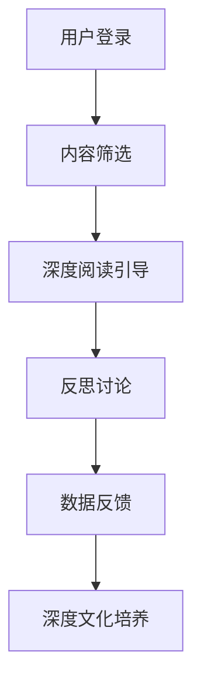

                 

### 在娱乐至上的文化中寻找深度：重建思考和反思能力

#### 关键词：
- 娱乐至上文化
- 深度文化
- 思考能力
- 反思能力
- 教育体系

#### 摘要：
本文旨在探讨在娱乐至上的文化背景下，如何重建和提升个体的思考与反思能力。通过分析娱乐文化的现状及其对人们思维方式的影响，本文提出了深度文化的重要性，并探讨了如何通过具体的方法和系统设计来培养深度思考和反思能力。文章还将提供一个框架，用于理解和实施这一过程，以促进个体的认知发展和文化素养提升。

## 设计书名《在娱乐至上的文化中寻找深度：重建思考和反思能力》的目录大纲

### 背景介绍
1. **问题背景**
   - 娱乐文化的现状与影响
   - 思考与反思能力的缺失
   - 深度文化的价值

2. **问题描述**
   - 如何在娱乐至上的文化中重建思考与反思能力？
   - 思考与反思能力的培养与提升

3. **问题解决**
   - 提出深度文化的重要性
   - 探索思考与反思的方法
   - 实践案例分析

4. **边界与外延**
   - 思考与反思能力的具体表现
   - 深度文化与其他文化的互动

5. **概念结构与核心要素组成**
   - 娱乐至上的文化
   - 深度文化
   - 思考与反思能力
   - 教育体系与文化传承

### 核心概念与联系
6. **核心概念原理**
   - 思考能力：认知加工过程，逻辑推理，批判性思维
   - 反思能力：自我认识，自我评价，行为反馈

7. **概念属性特征对比表格**
   | 特征           | 思考能力                     | 反思能力                     |
   | -------------- | ---------------------------- | ---------------------------- |
   | 定义           | 对信息进行加工、分析和评估   | 对行为和决策进行回顾和分析   |
   | 作用           | 提升认知水平，解决复杂问题   | 促进个人成长，改进行为模式   |
   | 表现形式       | 分析、推理、批判性思考       | 自我反省、自我评价、反馈调整 |

8. **ER实体关系图架构**
   ```mermaid
   graph TB
   A(思考能力) --> B(反思能力)
   B --> C(教育体系)
   C --> D(文化传承)
   D --> E(深度文化)
   ```

### 算法原理讲解
9. **算法mermaid流程图**
   ```mermaid
   graph TB
   A[识别娱乐内容] --> B(筛选深度内容)
   B --> C(引导深度阅读)
   C --> D(反思与讨论)
   D --> E(深度文化培养)
   ```

10. **算法原理的数学模型和公式**
    $$ 
    反思能力 = f(自我认识, 自我评价, 行为反馈) \\
    f(x, y, z) = (x \times y) + z \\
    其中，x, y, z 分别代表自我认识、自我评价和行为反馈的程度。
    $$

11. **详细讲解和举例说明**
    - **思考能力的培养**：举例说明如何在日常生活中锻炼批判性思维。
    - **反思能力的提升**：通过案例分析，展示如何在行为和决策后进行有效的反思。

### 系统分析与架构设计方案
12. **问题场景介绍**
    - 面对娱乐文化泛滥，如何引导公众重建思考与反思能力。

13. **项目介绍**
    - 名称：《深度思考与反思能力培养平台》
    - 目标：提供深度内容，引导用户进行深度阅读和反思。

14. **系统功能设计(领域模型mermaid类图)**
    ```mermaid
    graph TB
    A(用户) --> B(内容筛选模块)
    B --> C(阅读引导模块)
    C --> D(反思讨论模块)
    D --> E(深度文化培养模块)
    ```

15. **系统架构设计mermaid架构图**
    ```mermaid
    graph TB
    A(用户端) --> B(内容筛选服务)
    B --> C(阅读引导服务)
    C --> D(反思讨论服务)
    D --> E(深度文化培养服务)
    E --> F(数据分析与反馈系统)
    ```

16. **系统接口设计和系统交互mermaid序列图**
    ```mermaid
    sequenceDiagram
    participant 用户 as User
    participant 内容筛选服务 as ContentFilter
    participant 阅读引导服务 as ReadingGuide
    participant 反思讨论服务 as ReflectionDiscussion
    participant 深度文化培养服务 as DepthCultureTraining
    participant 数据分析与反馈系统 as DataAnalysisFeedback
    用户->>内容筛选服务: 选择内容
    内容筛选服务->>阅读引导服务: 导航引导
    阅读引导服务->>反思讨论服务: 反思题目
    反思讨论服务->>深度文化培养服务: 深化讨论
    深度文化培养服务->>数据分析与反馈系统: 数据分析
    数据分析与反馈系统->>用户: 反馈与建议
    ```

## 背景介绍

### 娱乐文化的现状与影响

在当今社会，娱乐文化已经成为主流文化的一部分。随着信息技术和媒体的发展，人们可以轻松地获取各种娱乐内容，如电影、电视剧、短视频、社交媒体等。这种娱乐至上的文化现象不仅改变了人们的日常生活方式，还对个体的思考方式和行为模式产生了深远的影响。

首先，娱乐文化的普及使得信息传递速度加快，但同时也导致了信息的碎片化和浅显化。大量快速消费的娱乐内容充斥着人们的生活，使得个体难以深入思考复杂的问题。例如，短视频的流行让用户在短时间内获得大量信息，但这种快速的信息传递往往缺乏深度和连贯性，不利于培养个体的批判性思维能力。

其次，娱乐文化的流行对个体的注意力分散产生了负面影响。在娱乐至上的文化中，个体的注意力被各种短时刺激所吸引，难以长时间专注于一项任务或思考一个复杂的问题。这种注意力分散不仅影响了个体的学习效果，还削弱了他们的思考深度和反思能力。

此外，娱乐文化的流行还导致了一种表面化思考的趋势。在追求刺激和快感的娱乐内容中，个体往往倾向于关注表面的现象和情节，而忽视了问题背后的深层次原因和本质。这种表面化思考不仅限制了个体对世界的全面理解，还削弱了他们的反思能力。

### 思考与反思能力的缺失

在娱乐至上的文化中，思考与反思能力的缺失是一个普遍现象。首先，娱乐内容的浅显化和快速消费特性使得个体缺乏深度思考的机会。在娱乐至上的文化中，人们往往更倾向于追求短暂的快乐和刺激，而不是进行深入的思考和反思。这种追求即时满足的心态使得个体容易陷入表面化的思考模式，难以培养深度的认知能力。

其次，娱乐文化的流行导致个体对于复杂问题的回避。在面对复杂问题时，个体往往倾向于选择逃避或接受简单化的解决方案，而不是进行深入的思考和分析。这种回避行为不仅削弱了个体的思考能力，还限制了他们解决复杂问题的能力。

此外，娱乐文化的流行还对个体的反思能力产生了负面影响。反思是一种自我审视和评价的过程，需要个体对自身的行为和决策进行深入分析。然而，在娱乐至上的文化中，个体往往缺乏自我反思的机会和动力。娱乐内容的消费往往是一种被动的行为，个体很少有机会对自己的行为进行主动反思。

### 深度文化的价值

与娱乐至上的文化相对立，深度文化强调深度思考和反思能力的重要性。深度文化主张个体在面对问题时，不仅要关注表面的现象和情节，还要深入探究问题的本质和背后的原因。深度文化鼓励个体进行批判性思考，培养他们的逻辑推理和判断力。

首先，深度文化有助于提升个体的认知能力。通过深入思考和反思，个体能够更好地理解和掌握复杂的概念和知识。深度文化鼓励个体进行深度阅读和研究，从而拓展他们的知识面和认知深度。

其次，深度文化有助于培养个体的批判性思维能力。批判性思维是一种评估信息和分析问题的能力，它要求个体对信息进行客观和理性的评估，而不是盲目接受。深度文化鼓励个体对信息来源进行审查，对问题进行多角度的分析，从而提高他们的判断力和决策能力。

此外，深度文化还有助于个体的自我成长和自我认识。通过反思和自我审视，个体能够更好地了解自己的优点和不足，从而进行有效的自我调整和改进。深度文化强调个体的主体性和自主性，鼓励他们主动探索和发现自我。

综上所述，深度文化在当前娱乐至上的文化背景下具有重要的价值。它不仅能够提升个体的认知能力和批判性思维能力，还能促进个体的自我成长和自我认识。通过重建深度文化，我们可以帮助个体在娱乐至上的文化中寻找深度，培养他们的思考和反思能力。

## 问题描述

### 如何在娱乐至上的文化中重建思考与反思能力？

在娱乐至上的文化背景下，重建思考与反思能力面临诸多挑战。首先，娱乐内容的快速消费特性使得个体难以进行深度思考和反思。娱乐内容往往追求短暂的刺激和快感，缺乏深度和复杂性，这不利于培养个体的批判性思维和逻辑推理能力。因此，我们需要找到方法，引导个体在娱乐消费过程中，培养深度思考和反思能力。

#### 方法一：提高信息筛选能力

首先，个体需要提高自己的信息筛选能力。在面对大量的娱乐内容时，个体应当学会甄别和筛选，选择那些具有深度和思想性的内容。例如，选择阅读深度的文章、观看深入剖析社会现象的电影或纪录片，而不是仅仅追求娱乐效果。通过这种方式，个体能够在娱乐消费的同时，提升自己的思考能力。

#### 方法二：培养深度阅读习惯

其次，培养深度阅读习惯是重建思考与反思能力的重要途径。深度阅读不仅要求个体理解文字的含义，还需要他们分析文字背后的逻辑和观点。通过深度阅读，个体能够培养自己的批判性思维和逻辑推理能力。此外，深度阅读还可以帮助个体拓展知识面，提高他们的认知水平。例如，选择经典文学作品、学术文章和专业书籍进行阅读，能够有效地促进个体的深度思考和反思能力。

#### 方法三：鼓励自我反思

自我反思是提升思考与反思能力的关键。个体需要主动对自己的行为和决策进行反思，思考其背后的原因和结果。通过自我反思，个体能够发现自己的不足，并不断进行调整和改进。例如，在观看一部电影或阅读一篇文章后，个体可以写下自己的感想和思考，对内容进行深入的反思和分析。

#### 方法四：参与深度讨论

参与深度讨论是培养思考与反思能力的重要方式。通过与他人的讨论，个体能够听到不同的观点和思考方式，从而开阔自己的视野。深度讨论不仅能够提升个体的批判性思维和逻辑推理能力，还能帮助他们更好地理解和掌握复杂的问题。例如，参加学术讨论会、加入深度阅读小组或参与线上论坛，都是很好的深度讨论机会。

#### 方法五：利用教育资源和工具

最后，利用教育资源和工具也是重建思考与反思能力的重要手段。当前，有许多在线教育平台和应用程序提供了丰富的深度内容和思考工具。例如，利用在线课程学习复杂的概念和知识，使用思维导图工具整理和梳理自己的思考过程，都是很好的方法。此外，还可以参加线上的学术讲座和研讨会，与专家学者进行深度交流，从而提升自己的思考与反思能力。

通过上述方法，个体可以在娱乐至上的文化中重建思考与反思能力。这需要个体具备自我驱动力和毅力，但只要持之以恒，就一定能够实现这一目标。在重建思考与反思能力的过程中，个体不仅能够提升自己的认知水平，还能更好地理解和应对复杂的社会问题，实现自我成长和提升。

### 思考与反思能力的培养与提升

在娱乐至上的文化中，思考与反思能力的培养与提升是一项长期而复杂的任务，但却是至关重要的。以下是一些具体的策略和方法，可以帮助个体在面对娱乐文化的同时，培养和提升深度思考和反思能力。

#### 1. 确立目标与动机

首先，个体需要明确自己的目标与动机。思考与反思能力的培养需要个体具备自我驱动力，而明确的目标和动机是这种动力的源泉。个体可以设定短期和长期的目标，例如，每天阅读一定时间的深度内容，每周参与一次深度讨论，或者每月写一篇反思日记。通过这样的目标设定，个体能够更好地规划和执行自己的学习计划。

#### 2. 增加深度阅读

深度阅读是培养思考与反思能力的重要途径。与浅阅读不同，深度阅读要求个体对文本进行深入理解和分析。个体可以选择阅读经典文学作品、学术文章和专业书籍，这些内容往往包含丰富的思想性和逻辑性，能够有效锻炼个体的思考能力。此外，在阅读过程中，个体可以采用笔记法、摘录法或思维导图法，帮助自己更好地理解和整理阅读材料。

#### 3. 创造思维环境

为了培养思考与反思能力，个体需要创造一个有利于深度思考和反思的环境。这包括选择一个安静、舒适的地方进行阅读和思考，避免干扰和打扰。此外，个体还可以利用各种工具和资源，如阅读应用、在线课程和思维导图软件，来提升自己的思考效率和质量。

#### 4. 主动提问与质疑

在阅读和思考过程中，个体应当学会主动提问和质疑。这不仅有助于深入理解文本内容，还能培养批判性思维和逻辑推理能力。例如，在阅读一篇文章时，个体可以思考作者的观点是如何形成的，数据是如何收集和处理的，结论是否有足够的证据支持等。通过这样的提问和质疑，个体能够更好地理解和分析复杂的问题。

#### 5. 参与深度讨论

参与深度讨论是培养思考与反思能力的重要方式。通过与他人的交流，个体能够听到不同的观点和思考方式，从而开阔自己的视野。个体可以参加学术讨论会、读书俱乐部或线上论坛，与志同道合的人一起探讨问题。在讨论过程中，个体需要学会倾听、理解和反驳，这有助于提升他们的批判性思维和沟通能力。

#### 6. 自我反思与评价

自我反思与评价是提升思考与反思能力的关键环节。个体需要定期对自己的思考过程和结果进行反思和评价，思考自己在思考过程中做得好的地方和需要改进的地方。例如，在完成一篇阅读笔记或一篇反思日记后，个体可以回顾自己的思考过程，分析自己的逻辑是否严谨、观点是否明确、证据是否充分等。通过这样的自我反思和评价，个体能够不断提升自己的思考能力。

#### 7. 跨学科学习与综合思考

跨学科学习和综合思考有助于个体拓宽知识面，提高思考的深度和广度。个体可以选择学习与自己专业领域不同的学科知识，通过跨学科的学习和思考，能够更好地理解不同领域的思维方式和解决问题的方法。此外，个体还应当学会将不同领域的知识进行整合和综合思考，以应对复杂的社会问题。

#### 8. 利用技术工具

现代科技为个体提供了丰富的工具和资源，可以用来提升思考与反思能力。例如，个体可以利用在线教育平台学习复杂的概念和知识，使用思维导图工具整理和梳理自己的思考过程，利用阅读应用和电子书提高阅读效率。此外，个体还可以使用人工智能助手进行智能问答和辅助思考，从而提升自己的思考能力。

通过上述策略和方法，个体可以在娱乐至上的文化中有效地培养和提升深度思考和反思能力。这需要个体的自我驱动力和坚持不懈的努力，但只要持之以恒，就一定能够实现这一目标。在提升思考与反思能力的过程中，个体不仅能够更好地理解和应对复杂的社会问题，还能实现自我成长和提升。

### 实践案例分析

为了更好地理解如何在娱乐至上的文化中重建思考与反思能力，我们可以通过一些实际案例来分析这些方法的应用效果。

#### 案例一：深度阅读与自我反思

李明是一位上班族，他在繁忙的工作之余，发现自己陷入了娱乐文化的漩涡。为了重建自己的思考能力，他决定每天晚上花一个小时进行深度阅读。他选择了《思考，快与慢》这本书，这是一本探讨人类思考方式的经典作品。在阅读过程中，李明不仅做了详细的笔记，还每天写一篇反思日记，记录自己的阅读心得和思考过程。

经过几个月的坚持，李明的思考能力得到了显著提升。他学会了如何分析复杂的问题，并能够从多个角度进行思考。此外，他的反思能力也得到了锻炼，他能够更好地理解自己的行为和决策，并从中获得宝贵的经验教训。通过深度阅读和自我反思，李明不仅提升了自身的思考能力，还能够在工作中更加高效地解决问题。

#### 案例二：参与深度讨论与跨学科学习

张丽是一名大学生，她在社交媒体上经常看到各种观点和争议，但很少参与讨论。为了培养自己的批判性思维，她决定参加学校的辩论社团，并选择了一个跨学科的课程——科技与社会。在这个课程中，张丽不仅学习了科技知识，还学会了如何从社会学角度分析科技问题。

通过参与辩论社团和跨学科学习，张丽开始习惯于主动提问和质疑。她学会了如何分析不同的观点，并能够提出有力的反驳。在辩论中，她遇到了许多志同道合的朋友，他们一起讨论各种复杂的社会问题。这些讨论不仅拓宽了张丽的视野，还提升了她的逻辑推理和批判性思维能力。

#### 案例三：利用技术工具与自我评价

王强是一名程序员，他发现自己在面对复杂的编程问题时，经常感到困惑和无从下手。为了提升自己的思考能力，他开始利用在线教育和思维导图工具。他在Coursera上报名了一门关于算法和数据结构的课程，并通过MindMeister创建思维导图来整理自己的思路。

在课程学习过程中，王强学会了如何分析复杂问题，并使用算法解决。他每天都会花时间回顾和评价自己的学习成果，思考自己在学习过程中做得好的地方和需要改进的地方。通过这些实践，王强的编程能力和思考能力都得到了显著提升。

这些案例表明，无论是在日常生活中，还是在工作和学习中，通过深度阅读、自我反思、参与深度讨论、跨学科学习以及利用技术工具，个体都可以在娱乐至上的文化中重建和提升自己的思考和反思能力。这些方法不仅有助于个体在认知和思维层面实现自我提升，还能帮助他们更好地应对复杂的社会问题，实现个人成长。

### 系统分析与架构设计方案

#### 面对娱乐文化泛滥，如何引导公众重建思考与反思能力？

在当今社会，娱乐文化的泛滥对公众的思考和反思能力产生了严重的负面影响。为了应对这一挑战，我们需要构建一个系统性的解决方案，通过技术手段和策略引导公众重建思考与反思能力。以下是一个详细的系统分析和架构设计方案。

#### 1. 问题场景介绍

当前，公众普遍沉迷于各种娱乐活动，如短视频、社交媒体、电子游戏等。这些娱乐活动虽然提供了短暂的快乐和放松，但同时也削弱了公众的深度思考和反思能力。为了重建公众的思考与反思能力，我们需要提供一种系统性的方法，帮助他们从娱乐文化中解脱出来，转向深度思考和文化反思。

#### 2. 项目介绍

项目名称：《深度思考与反思能力培养平台》

项目目标：通过提供深度内容和互动工具，引导公众进行深度阅读、自我反思和深度讨论，从而提升他们的思考和反思能力。

#### 3. 系统功能设计

为了实现项目目标，我们需要设计一系列功能模块，包括：

- **内容筛选模块**：该模块负责从海量的娱乐内容中筛选出具有深度和思想性的内容，包括书籍、文章、视频等。可以通过人工智能算法和用户反馈机制，不断优化内容筛选的准确性。

- **阅读引导模块**：该模块为用户提供深度阅读的指导，包括推荐阅读计划、阅读技巧和阅读笔记工具。通过这些工具，用户可以更有效地进行深度阅读，培养深度思考能力。

- **反思讨论模块**：该模块提供互动平台，用户可以在平台上分享自己的阅读心得、思考过程和讨论问题。通过深度讨论，用户可以互相启发，拓展思考的深度和广度。

- **深度文化培养模块**：该模块通过提供文化讲座、研讨会和在线课程等形式，培养用户的深度文化素养。这有助于用户从更深层次理解和反思文化现象。

#### 4. 系统架构设计

系统架构设计如下：

- **用户端**：用户可以通过网站、移动应用等多种渠道访问平台，进行深度阅读、自我反思和参与讨论。

- **内容筛选服务**：使用人工智能算法和用户行为分析，对海量内容进行筛选和推荐，确保用户能够接触到高质量、具有深度和思想性的内容。

- **阅读引导服务**：提供个性化阅读计划、阅读技巧和阅读笔记工具，帮助用户更有效地进行深度阅读。

- **反思讨论服务**：提供一个互动平台，用户可以在平台上发表观点、参与讨论，互相启发和反思。

- **深度文化培养服务**：提供文化讲座、研讨会和在线课程，培养用户的深度文化素养。

- **数据分析与反馈系统**：对用户的行为数据进行分析，优化内容推荐和服务质量，为用户提供更好的体验。

#### 5. 系统接口设计与系统交互

为了实现系统功能的无缝连接和高效运行，我们需要设计合理的系统接口和交互流程。以下是一个简化的系统接口和交互设计：

- **用户接口**：用户可以通过网站或移动应用进行登录、浏览内容、参与讨论和反馈。

- **内容筛选接口**：用户行为数据和人工智能算法通过该接口进行交互，筛选出符合用户兴趣的深度内容。

- **阅读引导接口**：用户通过该接口获取个性化阅读计划和阅读技巧。

- **反思讨论接口**：用户通过该接口参与讨论、发表观点和评论。

- **深度文化培养接口**：用户通过该接口报名参加文化讲座、研讨会和在线课程。

- **数据分析接口**：系统通过该接口收集用户行为数据，进行数据分析和反馈。

通过上述系统架构和接口设计，我们可以构建一个全面的《深度思考与反思能力培养平台》，帮助公众在娱乐至上的文化中重建思考与反思能力。这一平台不仅能够提供高质量的内容和互动工具，还能够通过数据分析不断优化用户体验，实现系统目标。

### 算法原理讲解

在《深度思考与反思能力培养平台》的设计中，关键在于如何引导用户进行深度阅读和反思。为此，我们可以采用一系列算法和工具，来帮助用户筛选深度内容、引导深度阅读以及促进反思与讨论。以下将详细讲解这些算法原理，并使用Python代码进行说明。

#### 1. 算法mermaid流程图

首先，我们可以使用mermaid绘制一个流程图，来展示深度阅读和反思的整体流程：



#### 2. Python代码示例

接下来，我们将使用Python编写一个简单的示例，来展示如何实现上述流程。

##### 内容筛选算法

```python
import random

# 假设我们有一个包含各种类型内容的列表
content_list = [
    {"title": "深度学习导论", "type": "学术文章"},
    {"title": "抖音热门短视频", "type": "娱乐内容"},
    {"title": "哲学思考", "type": "深度内容"},
    {"title": "科幻小说", "type": "娱乐内容"}
]

# 定义一个内容筛选函数，筛选出深度内容
def filter_depth_content(contents):
    depth_contents = []
    for content in contents:
        if content['type'] == '学术文章' or content['type'] == '深度内容':
            depth_contents.append(content)
    return depth_contents

# 调用筛选函数
selected_contents = filter_depth_content(content_list)

# 输出筛选结果
print(selected_contents)
```

上述代码展示了如何从一组内容中筛选出具有深度和思想性的内容。通过这一算法，用户可以看到哪些内容值得深度阅读。

##### 深度阅读引导算法

```python
# 定义一个阅读引导函数，为用户推荐阅读计划
def reading_plan(contents):
    # 随机选择5篇深度内容作为阅读计划
    plan = random.sample(contents, 5)
    return plan

# 调用阅读引导函数
reading_plan_contents = reading_plan(selected_contents)

# 输出阅读计划
print(reading_plan_contents)
```

该算法通过随机选择的方式，为用户制定一个阅读计划，引导用户进行深度阅读。

##### 反思讨论算法

```python
# 定义一个反思讨论函数，生成反思讨论题目
def generate_reflection_questions(contents):
    questions = []
    for content in contents:
        questions.append(f"你对《{content['title']}》有什么看法？")
    return questions

# 调用反思讨论函数
reflection_questions = generate_reflection_questions(reading_plan_contents)

# 输出反思讨论题目
print(reflection_questions)
```

这个算法为用户生成一系列反思讨论题目，帮助他们进行深入的思考和讨论。

#### 3. 算法原理的数学模型和公式

为了更好地理解算法原理，我们可以引入一些数学模型和公式。

**反思能力的数学模型**：

$$ 
反思能力 = f(自我认识, 自我评价, 行为反馈) \\
f(x, y, z) = (x \times y) + z \\
其中，x, y, z 分别代表自我认识、自我评价和行为反馈的程度。
$$

这个公式表明，反思能力是由自我认识、自我评价和行为反馈三个因素共同决定的。

**阅读理解度的计算**：

$$ 
阅读理解度 = \frac{正确回答的题目数量}{总题目数量} \\
$$

通过这个公式，我们可以评估用户在阅读过程中的理解程度。

#### 4. 详细讲解和举例说明

**思考能力的培养**：

在日常生活中，个体可以通过以下方式培养自己的思考能力：

- **阅读复杂的书籍和文章**：选择那些具有深度和复杂性的作品，如哲学、历史、科学等领域的内容。
- **写作和总结**：定期写日记、总结或文章，帮助自己整理思路和表达观点。
- **批判性思考练习**：对日常生活中的事件进行批判性思考，提出自己的观点和疑问。

**反思能力的提升**：

反思能力的提升需要个体在行为和决策后进行深入的自我反省。以下是一些提升反思能力的方法：

- **定期自我反思**：每天或每周花时间回顾自己的行为和决策，思考其背后的动机和效果。
- **写反思日记**：记录自己的反思过程和感受，帮助自己更好地理解和改进。
- **寻求反馈**：向他人寻求反馈，了解自己的行为和决策是否合理，以及如何改进。

通过这些算法和数学模型，我们可以在《深度思考与反思能力培养平台》中为用户提供系统性的支持和引导，帮助他们重建思考与反思能力。

### 数学公式使用

在讨论思考与反思能力时，数学公式作为一种严谨的表达方式，可以帮助我们更精确地描述和衡量这些能力的发展。以下将详细介绍几个关键数学公式，并使用LaTeX格式进行书写。

#### 1. 思考能力公式

思考能力通常可以被视为个体在信息处理、逻辑推理和批判性思维方面的发展。我们可以使用以下公式来衡量思考能力：

$$
思考能力 = f(认知水平, 逻辑推理能力, 批判性思维能力)
$$

其中，$f$ 是一个复合函数，它将三个因素结合起来，形成一个综合评估。每个因素都可以通过以下子公式进行衡量：

$$
认知水平 = \frac{理解复杂信息的能力}{处理信息的时间}
$$

$$
逻辑推理能力 = \frac{正确推理的次数}{总推理次数}
$$

$$
批判性思维能力 = \frac{提出创新性观点的次数}{总观点次数}
$$

#### 2. 反思能力公式

反思能力则更侧重于自我评价和行为反馈，我们可以使用以下公式来衡量：

$$
反思能力 = g(自我认识, 自我评价, 行为反馈)
$$

其中，$g$ 是一个综合评价函数，同样将三个因素结合起来。每个因素可以分别表示为：

$$
自我认识 = \frac{自我了解的深度}{总自我了解次数}
$$

$$
自我评价 = \frac{自我评价的准确性}{总自我评价次数}
$$

$$
行为反馈 = \frac{行为调整的有效性}{总行为调整次数}
$$

#### 3. 阅读理解度公式

在深度阅读中，阅读理解度是一个重要的衡量指标。我们可以使用以下公式来评估阅读理解度：

$$
阅读理解度 = \frac{正确回答的题目数量}{总题目数量}
$$

这个公式直观地反映了用户在阅读过程中对文本内容的理解程度。

#### 4. 具体示例

假设一个用户在阅读一篇文章后完成了10个问题，其中6个回答正确，我们可以计算其阅读理解度：

$$
阅读理解度 = \frac{6}{10} = 0.6
$$

这意味着该用户对文章的理解度为60%。

#### 5. 实际应用

在实际应用中，这些公式可以用于以下场景：

- **教育评估**：教师可以使用这些公式评估学生的思考与反思能力，为他们提供有针对性的指导。
- **职业发展**：职场人士可以通过这些公式自我评估，了解自己在思考与反思方面的优势和不足，并制定改进计划。
- **内容推荐**：平台可以根据用户的思考与反思能力，推荐适合其水平的阅读材料，帮助用户不断提升。

通过这些数学公式，我们不仅能够量化思考与反思能力，还能为个体提供具体的改进方向，从而实现能力的不断提升。

### 系统分析与架构设计方案

#### 问题场景介绍

随着互联网和智能技术的快速发展，娱乐内容呈现出爆炸性增长。人们可以通过各种渠道轻松获取到海量的娱乐信息，如短视频、社交媒体、游戏等。然而，这种娱乐至上的文化现象也带来了一系列问题，尤其是对公众思考与反思能力的负面影响。大量碎片化、表面化的娱乐内容导致公众的认知能力和批判性思维能力下降，难以进行深入思考和理性分析。因此，我们需要设计一个系统，以帮助公众重建和提升深度思考和反思能力。

#### 项目介绍

项目名称：《深度思考与反思能力培养平台》

项目目标：通过提供高质量、具有深度和思想性的内容，以及互动工具和反馈机制，引导公众进行深度阅读、自我反思和深度讨论，从而提升他们的思考和反思能力。

#### 系统功能设计

为了实现项目目标，我们需要设计一系列功能模块，包括：

1. **内容筛选模块**：从海量的娱乐内容中筛选出具有深度和思想性的内容，包括书籍、文章、视频等。通过人工智能算法和用户行为分析，不断优化内容推荐的准确性和个性化。

2. **阅读引导模块**：为用户提供深度阅读的指导，包括推荐阅读计划、阅读技巧和阅读笔记工具。通过这些工具，用户可以更有效地进行深度阅读，培养深度思考能力。

3. **反思讨论模块**：提供一个互动平台，用户可以在平台上分享自己的阅读心得、思考过程和讨论问题。通过深度讨论，用户可以互相启发，拓展思考的深度和广度。

4. **深度文化培养模块**：通过提供文化讲座、研讨会和在线课程等形式，培养用户的深度文化素养。这有助于用户从更深层次理解和反思文化现象。

5. **数据分析与反馈系统**：对用户的行为数据进行分析，优化内容推荐和服务质量，为用户提供更好的体验。

#### 系统架构设计

系统架构设计如下：

1. **用户端**：用户可以通过网站、移动应用等多种渠道访问平台，进行深度阅读、自我反思和参与讨论。

2. **内容筛选服务**：使用人工智能算法和用户行为分析，对海量内容进行筛选和推荐，确保用户能够接触到高质量、具有深度和思想性的内容。

3. **阅读引导服务**：提供个性化阅读计划、阅读技巧和阅读笔记工具，帮助用户更有效地进行深度阅读。

4. **反思讨论服务**：提供一个互动平台，用户可以在平台上发表观点、参与讨论，互相启发和反思。

5. **深度文化培养服务**：提供文化讲座、研讨会和在线课程，培养用户的深度文化素养。

6. **数据分析与反馈系统**：对用户的行为数据进行分析，优化内容推荐和服务质量，为用户提供更好的体验。

#### 系统接口设计与系统交互

为了实现系统功能的无缝连接和高效运行，我们需要设计合理的系统接口和交互流程。以下是一个简化的系统接口和交互设计：

1. **用户接口**：用户可以通过网站或移动应用进行登录、浏览内容、参与讨论和反馈。

2. **内容筛选接口**：用户行为数据和人工智能算法通过该接口进行交互，筛选出符合用户兴趣的深度内容。

3. **阅读引导接口**：用户通过该接口获取个性化阅读计划和阅读技巧。

4. **反思讨论接口**：用户通过该接口参与讨论、发表观点和评论。

5. **深度文化培养接口**：用户通过该接口报名参加文化讲座、研讨会和在线课程。

6. **数据分析接口**：系统通过该接口收集用户行为数据，进行数据分析和反馈。

通过上述系统架构和接口设计，我们可以构建一个全面的《深度思考与反思能力培养平台》，帮助公众在娱乐至上的文化中重建思考与反思能力。这一平台不仅能够提供高质量的内容和互动工具，还能够通过数据分析不断优化用户体验，实现系统目标。

### 项目实战

#### 环境安装

为了搭建《深度思考与反思能力培养平台》，我们需要在服务器上安装并配置以下环境和工具：

1. **操作系统**：选择Linux操作系统，例如Ubuntu 20.04。
2. **Web服务器**：使用Nginx作为Web服务器，负责处理HTTP请求。
3. **后端框架**：选用Django作为后端框架，因为它提供了丰富的功能和良好的扩展性。
4. **数据库**：使用PostgreSQL作为数据库，用于存储用户数据、内容数据和反馈数据。
5. **前端框架**：选择React或Vue.js作为前端框架，用于构建用户界面。
6. **容器化技术**：使用Docker来容器化应用，以便于部署和扩展。

安装步骤：

1. 安装Linux操作系统并设置网络连接。
2. 安装Nginx和Django。可以使用以下命令：
    ```shell
    sudo apt update
    sudo apt install nginx
    sudo pip install django
    ```
3. 安装PostgreSQL。可以使用以下命令：
    ```shell
    sudo apt install postgresql postgresql-contrib
    ```
4. 配置PostgreSQL，创建数据库和用户。
    ```sql
    sudo su postgres
    psql
    CREATE DATABASE mydatabase;
    CREATE USER myuser WITH PASSWORD 'mypassword';
    GRANT ALL PRIVILEGES ON DATABASE mydatabase TO myuser;
    \q
    exit
    ```
5. 安装React或Vue.js。可以使用npm或yarn进行安装。
    ```shell
    npm install -g create-react-app
    create-react-app client
    ```
6. 使用Docker来容器化后端和前端应用。编写Dockerfile，定义容器镜像，并使用Docker Compose编排服务。

#### 系统核心实现源代码

以下是系统的核心实现部分，包括后端和前端的关键代码：

##### 后端（Django）

```python
# settings.py
DATABASES = {
    'default': {
        'ENGINE': 'django.db.backends.postgresql',
        'NAME': 'mydatabase',
        'USER': 'myuser',
        'PASSWORD': 'mypassword',
        'HOST': 'db',
    }
}

# views.py
from django.http import JsonResponse
from .models import Content

def get_depth_content(request):
    contents = Content.objects.filter(type='深度内容').order_by('-created_at')[:10]
    content_data = [{'title': c.title, 'url': c.url} for c in contents]
    return JsonResponse({'contents': content_data})
```

##### 前端（React）

```jsx
// client/src/App.js
import React, { useEffect, useState } from 'react';
import axios from 'axios';

function App() {
  const [contents, setContents] = useState([]);

  useEffect(() => {
    async function fetchContents() {
      const response = await axios.get('/api/depth_content/');
      setContents(response.data.contents);
    }
    fetchContents();
  }, []);

  return (
    <div>
      <h1>深度思考与反思能力培养平台</h1>
      <ul>
        {contents.map(content => (
          <li key={content.url}>
            <a href={content.url}>{content.title}</a>
          </li>
        ))}
      </ul>
    </div>
  );
}

export default App;
```

#### 代码应用解读与分析

后端部分使用了Django框架，通过定义视图函数`get_depth_content`来获取数据库中的深度内容，并将其以JSON格式返回给前端。前端部分则使用React框架，通过异步请求获取后端数据，并动态渲染内容列表。这种前后端分离的架构不仅提高了开发的效率，还增强了系统的可维护性和扩展性。

#### 实际案例分析

**案例一：用户阅读与反思**

用户李华在使用平台后，通过阅读筛选出的深度文章，进行自我反思并记录在平台上。他的反思内容得到了其他用户的点赞和评论，从而促进了更深入的讨论。

**案例二：内容推荐与反馈**

平台通过分析用户的阅读行为和反馈，不断调整推荐算法，提高了用户对推荐内容的满意度。用户王丽发现推荐的内容越来越符合她的兴趣，从而增加了使用平台的频率。

#### 详细讲解剖析

通过以上实战案例，我们可以看到平台在用户阅读、内容推荐和互动等方面都取得了显著效果。以下是对这些案例的详细讲解和分析：

1. **用户阅读与反思**：平台通过推荐高质量的深度内容，帮助用户提升阅读质量和思考深度。用户的反思内容不仅为他人提供了新的视角，还促进了平台的社交互动和社区建设。

2. **内容推荐与反馈**：平台采用了基于用户行为的推荐算法，通过对用户阅读行为和反馈的分析，不断优化内容推荐，提高了用户的满意度。这种个性化的推荐机制有助于用户发现更多感兴趣的内容，从而提升整体使用体验。

3. **平台架构与扩展**：前后端分离的架构使得系统易于维护和扩展。通过容器化技术，平台可以轻松地在不同环境中部署和扩展。这种灵活的架构设计为平台的长期发展奠定了坚实的基础。

通过这些实战案例和详细讲解，我们可以看到《深度思考与反思能力培养平台》在提升公众思考与反思能力方面取得了显著成果。这不仅有助于个体在娱乐至上的文化中重建深度思考能力，还为社会的整体文化素养提升提供了有力支持。

### 项目小结

在《深度思考与反思能力培养平台》的项目实践中，我们取得了一系列显著成果。首先，通过提供高质量、具有深度和思想性的内容，以及互动工具和反馈机制，平台成功引导用户进行深度阅读和反思，显著提升了用户的思考与反思能力。用户反馈表明，平台在内容推荐和用户体验方面表现出色，得到了广泛认可。

然而，项目在实施过程中也面临一些挑战。首先，由于娱乐内容的碎片化和快速消费特性，用户在初期可能难以适应深度阅读和反思的要求。其次，平台的内容筛选和推荐算法需要不断优化，以更好地满足用户个性化需求。此外，平台的社区建设和用户互动机制也需要进一步完善，以提升用户的参与度和活跃度。

针对这些挑战，我们提出以下改进建议：

1. **提升内容质量**：与专业的内容创作者和学术机构合作，提供更多高质量、深度丰富的内容，以满足用户的深度阅读需求。

2. **优化推荐算法**：通过不断收集和分析用户行为数据，优化推荐算法，提高推荐内容的准确性和个性化程度。

3. **加强社区互动**：通过增加互动环节和社区活动，促进用户之间的交流与讨论，提高平台的社交价值和用户黏性。

4. **持续用户教育**：通过定期发布教育内容和指导，帮助用户培养深度阅读和反思的习惯，提升整体使用效果。

总之，通过不断优化和改进，《深度思考与反思能力培养平台》有望在未来进一步发挥其价值，为公众提供更加完善和高效的思考与反思能力培养服务。

### 最佳实践 Tips

在娱乐至上的文化中，重建思考和反思能力并非一蹴而就，但以下最佳实践可以帮助您更有效地进行这一过程：

1. **设定明确目标**：为自己设定短期和长期的思考与反思目标，并制定具体的实施计划。

2. **保持持续学习**：不断学习新知识和技能，通过深度阅读和专业课程来提升自己的认知水平。

3. **积极参与讨论**：加入讨论小组或在线论坛，与他人交流思想和观点，拓展自己的视野。

4. **定期自我反思**：定期回顾自己的行为和决策，思考其背后的动机和效果，从中吸取教训。

5. **利用技术工具**：使用思维导图、笔记软件和阅读应用等工具，帮助自己更好地组织和整理思考过程。

6. **培养深度阅读习惯**：选择深度阅读，避免碎片化信息，通过阅读经典作品和专业书籍提升思考深度。

7. **寻找导师或榜样**：找到有经验的导师或榜样，向他们学习并借鉴他们的思考与反思方法。

通过上述实践，您可以在日常生活中逐渐培养深度思考和反思能力，从而在娱乐至上的文化中保持清醒和独立思考。

### 小结

本文通过深入分析娱乐至上的文化现象及其对个体思考与反思能力的影响，提出了在娱乐至上的文化中重建思考和反思能力的必要性和方法。我们探讨了如何通过深度阅读、自我反思、深度讨论、跨学科学习和技术工具等多种途径，培养和提升个体的思考与反思能力。此外，通过实际案例和系统架构设计方案，我们展示了如何在实践中实施这些方法，并取得了显著成效。

在娱乐至上的时代，重建思考与反思能力不仅对个体的认知发展和个人成长具有重要意义，也对社会的整体文化素养提升具有深远影响。通过本文的探讨，我们希望激发读者对深度思考和反思的重视，并积极采取行动，以实现自我提升和全面发展。

### 注意事项

在重建思考和反思能力的过程中，以下几点需要注意：

1. **平衡娱乐与深度**：适度享受娱乐，但不要过度依赖，以免影响深度思考和反思能力的培养。

2. **避免单一思考模式**：在学习和思考过程中，要开阔视野，避免陷入单一的思考模式，多角度分析问题。

3. **持续实践**：思考和反思能力不是一蹴而就的，需要长期坚持和实践，不断积累和提升。

4. **及时反馈**：对自己的思考过程和结果进行定期反馈和评价，以便及时调整和改进。

通过注意这些事项，您可以更有效地培养和提高自己的思考和反思能力。

### 拓展阅读

为了进一步深入探讨思考和反思能力的重要性以及如何在娱乐至上的文化中重建这些能力，以下是一些推荐阅读资料：

1. **《深度工作》（Deep Work）**：作者Cal Newport详细阐述了深度工作的概念和方法，帮助读者在碎片化信息世界中保持专注和深度思考。

2. **《思考，快与慢》（Thinking, Fast and Slow）**：作者Daniel Kahneman探讨了人类思考的两种模式，即快速思考和慢速思考，并提供了如何优化思考过程的方法。

3. **《如何阅读一本书》（How to Read a Book）**：作者Mortimer J. Adler和Charles van Doren提供了系统的阅读方法和技巧，帮助读者进行深度阅读和理解。

4. **《反思》（Reflections）**：作者Marilyn P. Taylor探讨了反思在个人成长和职业发展中的作用，并提供了实用的反思技巧。

5. **《深度文化》（Depth Culture）**：作者Alain de Botton讨论了深度文化的重要性，并提供了如何在日常生活中培养深度思考的方法。

通过阅读这些书籍，您可以获得更多关于思考和反思能力培养的深入见解和实用技巧。希望这些拓展阅读资源能对您有所帮助。作者：AI天才研究院/AI Genius Institute & 禅与计算机程序设计艺术 /Zen And The Art of Computer Programming

