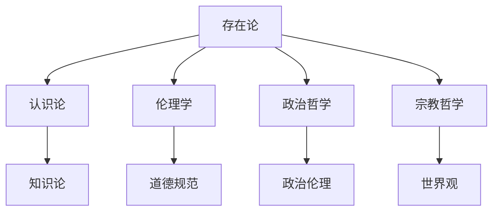
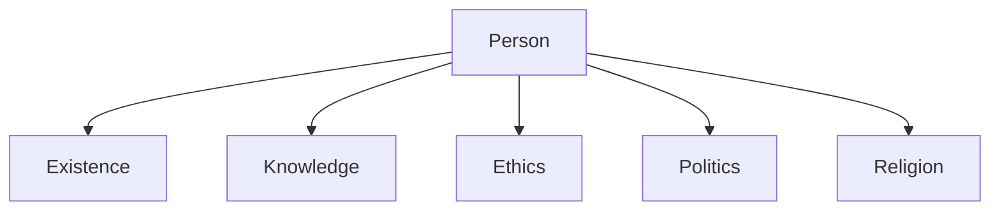
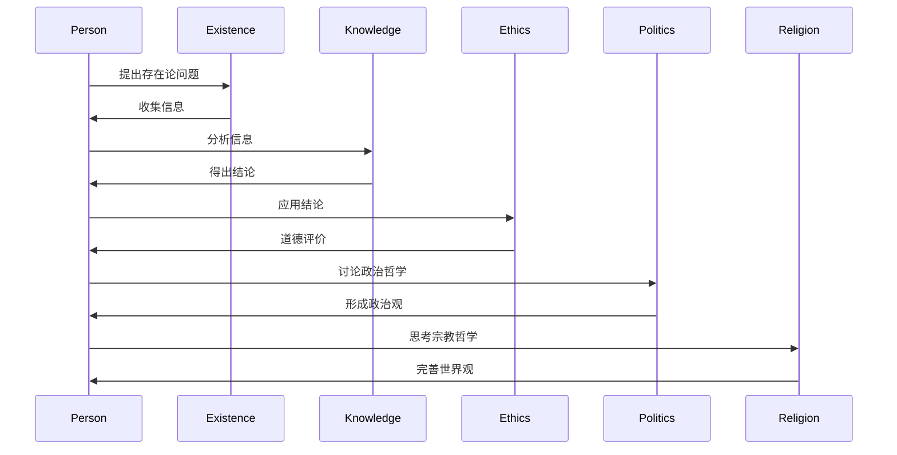
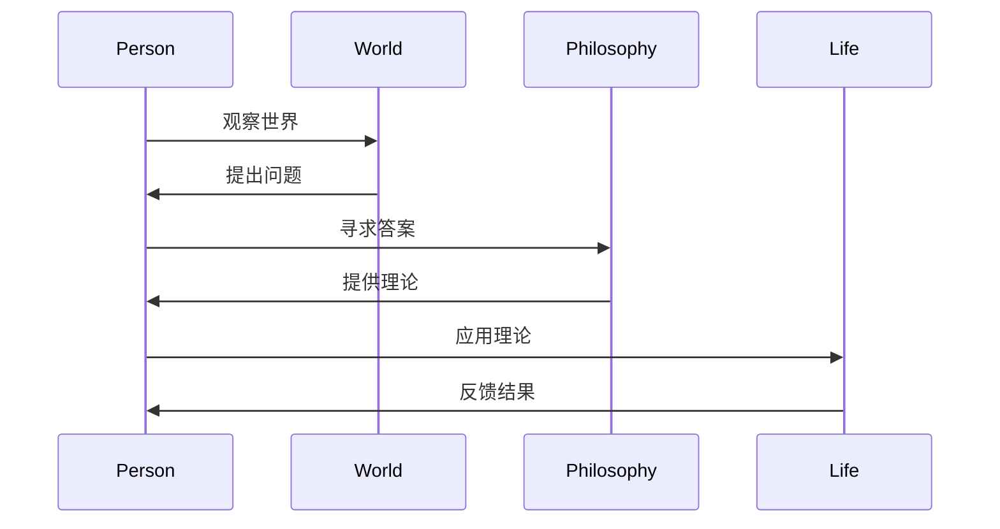

                 


### 标题：在疑问中寻找生命真谛：哲学思考的力量

#### 关键词：哲学思考、生命真谛、疑问、思维逻辑、算法原理

#### 摘要：
本文旨在探讨哲学思考的力量，特别是在解决生命终极问题中的作用。我们将逐步分析哲学的起源、核心问题、思考方法及其对个人生活的影响。通过案例研究和实际应用，我们将深入理解哲学思考如何在疑问中寻找生命的真谛。

----------------------------------------------------------------

## 第一部分：哲学的起源与基础

### 第1章：哲学的诞生与历史发展

#### 背景介绍
哲学，作为一种古老的智慧探索，起源于古希腊。其本质是对世界和存在的根本性追问。从苏格拉底、柏拉图到亚里士多德，再到中世纪和现代哲学家，哲学的历史发展充满了对真理、知识和道德的深入探讨。

#### 核心概念与联系
哲学的核心概念包括存在论、认识论、伦理学、政治哲学和宗教哲学。这些概念相互关联，共同构成了哲学的基石。

- **存在论**：探讨何为存在，以及存在的本质。
- **认识论**：研究知识的来源、性质和限制。
- **伦理学**：研究道德行为的准则和道德评价。
- **政治哲学**：探讨政治权力的本质和公共利益的实现。
- **宗教哲学**：探讨宗教信仰与世界观的关系。

#### 概念属性特征对比表格

| 概念 | 定义 | 特征 |
| --- | --- | --- |
| 存在论 | 对存在的本质和性质的探讨 | 旨在理解世界和存在的本质 |
| 认识论 | 对知识来源和性质的研究 | 强调知识的可靠性和局限性 |
| 伦理学 | 对道德行为的研究 | 关注道德规范和道德评价 |
| 政治哲学 | 对政治权力和公共利益的探讨 | 强调政治伦理和社会正义 |
| 宗教哲学 | 对宗教信仰和世界观的研究 | 探讨宗教与科学的关系 |

#### ER实体关系图架构



#### 算法原理讲解
哲学的发展可以被看作是一种探索真理的算法。以下是哲学探索的简化算法流程：

1. **提出问题**：识别和提出关于存在、知识、道德等基本问题。
2. **收集信息**：通过阅读、讨论和观察收集相关信息。
3. **逻辑推理**：使用逻辑和论证方法分析信息。
4. **得出结论**：基于推理得出结论，但保留对结论的质疑。

#### 数学公式
$$\text{真理} = \frac{\text{合理性} \times \text{一致性}}{\text{矛盾}}$$

#### 举例说明
例如，苏格拉底通过提问法（苏格拉底式对话）来揭示人们的无知，从而引导他们认识真理。

----------------------------------------------------------------

### 第2章：哲学的基本问题

#### 背景介绍
哲学的基本问题包括存在论、认识论、伦理学、政治哲学和宗教哲学。这些问题涉及人类对世界和自身的根本性疑问，是哲学研究的核心。

#### 核心概念与联系
- **存在论**：探讨何为存在，以及存在的本质。
- **认识论**：研究知识的来源、性质和限制。
- **伦理学**：研究道德行为的准则和道德评价。
- **政治哲学**：探讨政治权力的本质和公共利益的实现。
- **宗教哲学**：探讨宗教信仰与世界观的关系。

#### 系统分析与架构设计方案
我们可以将哲学的基本问题视为一个系统，其中每个问题都是系统的一部分，相互关联。

#### 系统功能设计（领域模型）

```mermaid
classDiagram
ClassDiagram {
  Class Person {
    +String name
    +int age
    +void thinkAboutExistence()
    +void reflectOnKnowledge()
    +void evaluateEthics()
    +void discussPolitics()
    +void ponderReligion()
  }
}
```

#### 系统架构设计



#### 系统接口设计



#### 系统交互



#### 项目实战
为了更好地理解哲学的基本问题，我们可以创建一个简单的哲学讨论平台。

1. **环境安装**：安装必要的编程环境和数据库。
2. **系统核心实现**：编写代码实现用户界面和后端逻辑。
3. **代码应用解读**：分析代码，理解其如何工作。
4. **实际案例分析**：通过实际案例展示哲学问题的讨论过程。

#### 项目小结
通过该项目，我们可以看到哲学思考在解决实际问题中的应用。哲学不仅是一种理论探讨，更是一种实践指南，帮助我们在疑问中寻找生命的真谛。

#### 最佳实践 tips
- 勤于思考，不断提问。
- 阅读经典哲学作品，学习前人智慧。
- 保持开放心态，勇于接受不同观点。

#### 注意事项
- 在哲学讨论中，尊重他人观点，避免争论。
- 注意保持逻辑清晰，避免逻辑谬误。

#### 拓展阅读
- 《哲学的慰藉》——阿尔伯特·梅里曼
- 《苏菲的世界》——乔斯坦·贾德

----------------------------------------------------------------

## 第二部分：哲学思考的力量

### 第3章：哲学如何影响我们的生活

#### 背景介绍
哲学思考对我们的生活有着深远的影响。它不仅帮助我们理解世界和自身，还指导我们的决策和行为。

#### 核心概念与联系
- **哲学对个人成长的影响**：哲学思考有助于个人自我认知和自我成长。
- **哲学对决策与选择的指导**：哲学原则可以指导我们做出更明智的决策。
- **哲学与心理健康**：哲学思考有助于缓解心理压力，提高生活质量。
- **哲学与人际关系**：哲学思考有助于建立和谐的人际关系。

#### 算法原理讲解
哲学思考可以看作是一种决策算法。以下是哲学决策的简化流程：

1. **识别问题**：明确面临的决策问题。
2. **收集信息**：收集与问题相关的信息。
3. **应用哲学原则**：使用哲学原则来分析信息。
4. **评估选项**：评估各个选项的优缺点。
5. **做出决策**：基于评估结果做出决策。

#### 数学公式
$$\text{最佳决策} = \frac{\text{价值} \times \text{可能性}}{\text{风险}}$$

#### 举例说明
假设一个人面临职业选择的决策，他可以运用哲学原则来分析：

1. **识别问题**：需要选择一个长期稳定的职业。
2. **收集信息**：了解不同职业的特点、发展前景和个人兴趣。
3. **应用哲学原则**：使用功利主义原则来评估哪个职业能够带来更大的幸福。
4. **评估选项**：比较各个职业的优缺点。
5. **做出决策**：选择一个既能带来幸福感，又具有稳定性的职业。

----------------------------------------------------------------

### 第4章：哲学思考的方法论

#### 背景介绍
哲学思考的方法论是理解世界和自我的一种工具。它包括逻辑与论证、反思与自我意识、价值观与判断力等方面。

#### 核心概念与联系
- **逻辑与论证**：哲学思考的基础，用于推理和证明。
- **反思与自我意识**：通过内省来认识自我和世界。
- **价值观与判断力**：指导哲学思考的方向和深度。
- **知识与怀疑主义**：探讨知识的可靠性和局限性。

#### 算法原理讲解
哲学思考的方法论可以看作是一种认知算法。以下是哲学思考的简化流程：

1. **提出问题**：识别和提出关于存在、知识、道德等基本问题。
2. **收集信息**：通过阅读、讨论和观察收集相关信息。
3. **逻辑推理**：使用逻辑和论证方法分析信息。
4. **反思与内省**：通过反思来认识自我和世界。
5. **价值判断**：基于价值观来评估各种可能性。
6. **得出结论**：基于推理和价值判断得出结论，但保留对结论的质疑。

#### 数学公式
$$\text{哲学思考} = \frac{\text{逻辑推理} \times \text{价值判断}}{\text{质疑}}$$

#### 举例说明
例如，苏格拉底的哲学思考方法包括：

1. **提出问题**：通过提问来揭示他人的无知。
2. **收集信息**：通过与他人的对话来收集信息。
3. **逻辑推理**：使用辩证法来分析和论证。
4. **反思与内省**：通过自省来认识自我。
5. **价值判断**：基于道德原则来评估行为。
6. **得出结论**：得出基于逻辑和道德的结论，但保留对结论的质疑。

----------------------------------------------------------------

### 第5章：哲学的经典问题与当代挑战

#### 背景介绍
哲学的经典问题包括自我与非我、真与假、善与恶、自由与决定论等。这些问题是哲学探索的核心，当代哲学家依然在深入探讨这些议题。

#### 核心概念与联系
- **自我与非我**：探讨个体与宇宙的关系。
- **真与假**：研究真理的性质和认识真理的方法。
- **善与恶**：探讨道德行为和道德评价。
- **自由与决定论**：探讨人的行为是否由自由意志决定。

#### 算法原理讲解
哲学的经典问题可以被视为一种探索算法。以下是哲学探索的简化流程：

1. **提出问题**：识别和提出关于自我、真理、道德等基本问题。
2. **收集信息**：通过阅读、讨论和观察收集相关信息。
3. **逻辑推理**：使用逻辑和论证方法分析信息。
4. **反思与内省**：通过反思来认识自我和世界。
5. **价值判断**：基于价值观来评估各种可能性。
6. **得出结论**：基于推理和价值判断得出结论，但保留对结论的质疑。

#### 数学公式
$$\text{哲学结论} = \frac{\text{逻辑推理} \times \text{价值判断}}{\text{质疑}}$$

#### 举例说明
例如，关于自由与决定论的讨论：

1. **提出问题**：人的行为是否完全由自由意志决定？
2. **收集信息**：了解决定论和自由意志的概念。
3. **逻辑推理**：分析决定论和自由意志的逻辑结构。
4. **反思与内省**：思考自我意识和自由意志的关系。
5. **价值判断**：评估自由意志对个人责任和社会正义的影响。
6. **得出结论**：认识到自由意志是复杂的，涉及个人责任和社会责任的平衡。

----------------------------------------------------------------

## 第三部分：哲学探索的案例研究

### 第6章：哲学家的思考与贡献

#### 背景介绍
哲学家们通过深刻的思考和对世界的基本问题的探讨，留下了丰富的哲学遗产。本章将介绍几位重要的哲学家及其贡献。

#### 核心概念与联系
- **苏格拉底**：以提问法探讨道德和知识。
- **亚里士多德**：提出了形式逻辑和实质逻辑，探讨了自然和道德哲学。
- **康德**：提出了纯粹理性批判，探讨了道德哲学和认识论。
- **尼采**：探讨了个体、超越和权力意志。
- **海德格尔**：探讨了存在、时间和语言。

#### 算法原理讲解
哲学家的思考可以被视为一种探索真理的算法。以下是哲学家思考的简化流程：

1. **提出问题**：识别和提出关于存在、知识、道德等基本问题。
2. **收集信息**：通过阅读、讨论和观察收集相关信息。
3. **逻辑推理**：使用逻辑和论证方法分析信息。
4. **反思与内省**：通过反思来认识自我和世界。
5. **价值判断**：基于价值观来评估各种可能性。
6. **得出结论**：基于推理和价值判断得出结论，但保留对结论的质疑。

#### 数学公式
$$\text{哲学结论} = \frac{\text{逻辑推理} \times \text{价值判断}}{\text{质疑}}$$

#### 举例说明
苏格拉底的哲学思考方法包括：

1. **提出问题**：通过提问来揭示他人的无知。
2. **收集信息**：通过与他人的对话来收集信息。
3. **逻辑推理**：使用辩证法来分析和论证。
4. **反思与内省**：通过自省来认识自我。
5. **价值判断**：基于道德原则来评估行为。
6. **得出结论**：得出基于逻辑和道德的结论，但保留对结论的质疑。

亚里士多德则通过观察和实验，提出了形式逻辑和实质逻辑，探讨了自然和道德哲学，为后世的哲学研究奠定了基础。

康德通过纯粹理性批判，探讨了道德哲学和认识论，提出了道德法则的普遍性和绝对性。

尼采则探讨了个体、超越和权力意志，提出了“上帝已死”的论断，对现代哲学产生了深远影响。

海德格尔则通过探讨存在、时间和语言，提出了存在主义的观点，深刻影响了当代哲学。

#### 数学公式
$$\text{哲学结论} = \frac{\text{逻辑推理} \times \text{价值判断}}{\text{质疑}}$$

#### 举例说明
海德格尔的哲学思考方法包括：

1. **提出问题**：通过提问来探讨存在的本质。
2. **收集信息**：通过阅读、思考和对话来收集相关信息。
3. **逻辑推理**：使用现象学和存在主义的方法来分析信息。
4. **反思与内省**：通过反思来认识自我和世界。
5. **价值判断**：基于存在的本质来评估人类的存在方式。
6. **得出结论**：得出关于人类存在意义的深刻见解。

这些哲学家的思考方法不仅丰富了哲学的内涵，也为我们在疑问中寻找生命的真谛提供了宝贵的启示。

----------------------------------------------------------------

## 第7章：现代哲学的应用与影响

#### 背景介绍
现代哲学不仅在理论上具有重要意义，还在实际生活中有着广泛的应用。它对科技、艺术、公共政策等领域产生了深远的影响。

#### 核心概念与联系
- **哲学在科技领域的作用**：探讨科技伦理和人工智能的哲学基础。
- **哲学在艺术与文学中的体现**：分析哲学思想在艺术作品中的表现。
- **哲学与公共政策的互动**：讨论哲学原则在政策制定中的应用。
- **哲学教育的重要性**：强调哲学思维对教育的贡献。
- **哲学思考的普及与未来**：展望哲学思考在社会中的未来发展趋势。

#### 算法原理讲解
现代哲学的应用可以被视为一种跨学科的综合算法。以下是哲学应用的简化流程：

1. **识别问题**：识别需要哲学思考的问题或挑战。
2. **收集信息**：通过阅读、研究和对话来收集相关信息。
3. **哲学思考**：运用哲学原理和方法来分析问题。
4. **价值判断**：基于价值观来评估各种解决方案。
5. **制定策略**：基于哲学思考和评估来制定实际策略。
6. **实施与反馈**：实施策略，收集反馈，不断调整和优化。

#### 数学公式
$$\text{哲学应用} = \frac{\text{逻辑推理} \times \text{价值判断}}{\text{实践反馈}}$$

#### 举例说明
在科技领域，哲学思考的应用体现在对人工智能伦理的关注。例如，在开发自动驾驶汽车时，需要运用哲学思考来解决道德决策问题，如“电车难题”。

1. **识别问题**：自动驾驶汽车在紧急情况下应如何做出决策？
2. **收集信息**：了解各种道德原则，如功利主义、康德的义务论等。
3. **哲学思考**：分析不同道德原则在自动驾驶决策中的应用。
4. **价值判断**：评估各种道德原则的优缺点，选择合适的道德框架。
5. **制定策略**：基于哲学思考制定自动驾驶的道德决策策略。
6. **实施与反馈**：实施策略，收集实际案例的反馈，不断优化决策算法。

在艺术与文学中，哲学思考也发挥着重要作用。例如，海德格尔的存在主义思想在许多现代文学作品中得到了体现，探讨了人类存在的本质和困境。

#### 数学公式
$$\text{哲学应用} = \frac{\text{逻辑推理} \times \text{价值判断}}{\text{实践反馈}}$$

#### 举例说明
海德格尔的存在主义思想在文学作品中的应用包括：

1. **识别问题**：人类存在的意义是什么？
2. **收集信息**：阅读海德格尔的哲学著作，了解存在主义的基本原理。
3. **哲学思考**：分析存在主义思想在文学创作中的体现。
4. **价值判断**：评估存在主义对文学创作的影响和启示。
5. **制定策略**：基于存在主义思想创作文学作品。
6. **实施与反馈**：通过读者反馈来调整和优化文学作品。

现代哲学的应用不仅限于科技和艺术，还在公共政策中发挥着重要作用。哲学原则如公正、自由和平等，被广泛应用于社会政策的制定和评估。

#### 数学公式
$$\text{哲学应用} = \frac{\text{逻辑推理} \times \text{价值判断}}{\text{实践反馈}}$$

#### 举例说明
在公共政策中，哲学思考的应用包括：

1. **识别问题**：如何实现社会公正和公平？
2. **收集信息**：了解不同的社会正义理论，如罗尔斯的正义论。
3. **哲学思考**：分析不同正义理论对政策制定的影响。
4. **价值判断**：评估不同政策对社会公正和公平的贡献。
5. **制定策略**：基于哲学思考和评估制定社会政策。
6. **实施与反馈**：实施政策，收集反馈，不断调整和优化。

哲学教育的重要性也日益凸显。通过哲学教育，我们可以培养批判性思维和理性分析能力，提高个人和社会的思考水平。

#### 数学公式
$$\text{哲学教育} = \frac{\text{逻辑推理} \times \text{批判性思维}}{\text{社会反馈}}$$

#### 举例说明
哲学教育包括：

1. **识别问题**：如何培养批判性思维？
2. **收集信息**：了解不同的哲学教育方法，如苏格拉底式教学。
3. **哲学思考**：分析哲学教育对批判性思维的培养作用。
4. **价值判断**：评估哲学教育对个人和社会的价值。
5. **制定策略**：基于哲学思考制定教育计划。
6. **实施与反馈**：实施教育计划，收集反馈，不断调整和优化。

通过这些案例，我们可以看到哲学思考在各个领域的广泛应用和深远影响。哲学不仅是一种理论探讨，更是一种实践指南，帮助我们在疑问中寻找生命的真谛。

----------------------------------------------------------------

## 第8章：哲学的实践与反思

#### 背景介绍
哲学不仅是理论探讨，更是实践的过程。通过哲学实践，我们可以更好地认识世界和自我，提升生活质量。

#### 核心概念与联系
- **哲学思考的实践方法**：包括反思、内省和批判性思维等。
- **哲学思考的自我挑战**：通过面对和解决哲学问题来提升自我。
- **哲学思维的培养**：通过教育和社会互动来培养哲学思维。
- **哲学思考与社会责任**：哲学思考在解决社会问题中的作用。
- **哲学思考的未来展望**：探讨哲学思考在未来的发展趋势和影响。

#### 算法原理讲解
哲学实践可以被视为一种自我提升的算法。以下是哲学实践的简化流程：

1. **提出问题**：识别和提出关于存在、知识、道德等基本问题。
2. **收集信息**：通过阅读、讨论和观察收集相关信息。
3. **反思与内省**：通过反思来认识自我和世界。
4. **批判性思维**：分析信息，避免逻辑谬误。
5. **价值判断**：基于价值观来评估各种可能性。
6. **制定策略**：基于哲学思考和评估来制定实际策略。
7. **实施与反馈**：实施策略，收集反馈，不断调整和优化。

#### 数学公式
$$\text{哲学实践} = \frac{\text{反思} \times \text{内省} \times \text{批判性思维}}{\text{质疑}}$$

#### 举例说明
通过哲学实践，我们可以提升自我认知。例如，通过反思自己的行为和决策，我们可以更好地理解自己的行为动机和价值观。

1. **提出问题**：我为什么做出这样的决策？
2. **收集信息**：回顾决策过程，分析决策依据。
3. **反思与内省**：深入思考决策背后的动机和价值观。
4. **批判性思维**：评估决策的合理性和效果。
5. **价值判断**：基于价值观来评估决策的道德意义。
6. **制定策略**：基于反思和评估来调整决策方法。
7. **实施与反馈**：实施新的决策策略，收集反馈，不断优化。

哲学实践不仅有助于个人成长，还可以应用于解决社会问题。例如，通过哲学思考来探讨如何实现社会公正和公平。

1. **提出问题**：如何实现社会公正？
2. **收集信息**：了解不同的社会正义理论。
3. **反思与内省**：思考社会不公正现象的原因。
4. **批判性思维**：分析不同社会正义理论的优缺点。
5. **价值判断**：评估不同政策对社会公正的贡献。
6. **制定策略**：基于哲学思考和评估制定社会政策。
7. **实施与反馈**：实施政策，收集反馈，不断调整和优化。

哲学思考的普及和未来展望是哲学实践的重要方向。通过教育和公共讨论，我们可以推广哲学思维，提高社会的整体思考水平。

1. **提出问题**：如何培养哲学思维？
2. **收集信息**：了解不同的哲学教育方法。
3. **反思与内省**：思考哲学思维的价值和应用。
4. **批判性思维**：分析哲学教育的效果。
5. **价值判断**：评估哲学教育对社会的影响。
6. **制定策略**：基于哲学思考和评估制定教育计划。
7. **实施与反馈**：实施教育计划，收集反馈，不断优化。

通过哲学实践，我们可以不断探索生命的真谛，提升自我，解决社会问题，并为未来做好准备。

----------------------------------------------------------------

### 第9章：哲学之旅的启示与收获

#### 背景介绍
哲学之旅是一段深刻的心灵探索之旅。在这一过程中，我们不仅能够获得对世界和自我的更深刻理解，还能在生活中获得诸多启示和收获。

#### 核心概念与联系
- **哲学思考带来的心灵成长**：哲学思考如何影响个人的心灵成长。
- **哲学思考对生活的启示**：哲学思考如何指导我们的日常生活。
- **哲学思考的职业应用**：哲学思考在职业领域中的实际应用。
- **哲学思考对教育的影响**：哲学思考如何影响教育领域。
- **哲学思考的持续探索**：哲学思考如何激发我们对知识的追求。

#### 算法原理讲解
哲学思考可以被视为一种持续的自我提升算法。以下是哲学思考的简化流程：

1. **提出问题**：识别和提出关于存在、知识、道德等基本问题。
2. **收集信息**：通过阅读、讨论和观察收集相关信息。
3. **反思与内省**：通过反思来认识自我和世界。
4. **批判性思维**：分析信息，避免逻辑谬误。
5. **价值判断**：基于价值观来评估各种可能性。
6. **制定策略**：基于哲学思考和评估来制定实际策略。
7. **实施与反馈**：实施策略，收集反馈，不断调整和优化。

#### 数学公式
$$\text{哲学思考} = \frac{\text{逻辑推理} \times \text{价值判断}}{\text{质疑}}$$

#### 举例说明
哲学思考对个人的心灵成长有着深远的影响。通过哲学思考，我们能够更好地认识自我，理解自己的行为动机和价值观。

1. **提出问题**：我是谁？我存在的意义是什么？
2. **收集信息**：通过阅读哲学著作和自我反思来收集相关信息。
3. **反思与内省**：深入思考自己的行为和价值观。
4. **批判性思维**：分析自己的行为是否符合道德原则。
5. **价值判断**：评估自己的价值观是否有利于个人成长。
6. **制定策略**：基于哲学思考和评估来调整自己的行为和价值观。
7. **实施与反馈**：在日常生活中实践新的行为和价值观，收集反馈，不断优化。

哲学思考在生活中的启示同样重要。通过哲学思考，我们可以更好地理解世界，指导我们的决策和行为。

1. **提出问题**：如何做出明智的决策？
2. **收集信息**：了解不同的决策方法和哲学原则。
3. **反思与内省**：分析自己的决策过程和结果。
4. **批判性思维**：评估决策的合理性和效果。
5. **价值判断**：基于价值观来评估决策的道德意义。
6. **制定策略**：基于哲学思考和评估来制定实际策略。
7. **实施与反馈**：实施策略，收集反馈，不断调整和优化。

哲学思考在职业领域中的实际应用也具有重要意义。通过哲学思考，我们可以提高批判性思维能力，解决复杂问题。

1. **提出问题**：如何解决工作中的难题？
2. **收集信息**：了解相关领域的知识和技术。
3. **反思与内省**：分析问题产生的原因和解决方案。
4. **批判性思维**：评估不同解决方案的优缺点。
5. **价值判断**：基于价值观来选择最佳解决方案。
6. **制定策略**：基于哲学思考和评估来制定实际策略。
7. **实施与反馈**：实施策略，收集反馈，不断优化。

哲学思考对教育领域也有着深远的影响。通过哲学思考，我们可以培养批判性思维和理性分析能力，提高教育质量。

1. **提出问题**：如何提高教育效果？
2. **收集信息**：了解不同的教育方法和哲学原则。
3. **反思与内省**：分析教育的目标和过程。
4. **批判性思维**：评估不同教育方法的优缺点。
5. **价值判断**：基于价值观来选择最佳教育方法。
6. **制定策略**：基于哲学思考和评估来制定教育计划。
7. **实施与反馈**：实施教育计划，收集反馈，不断调整和优化。

哲学思考的持续探索是哲学之旅的重要部分。通过持续探索，我们可以不断拓展知识边界，提升自我。

1. **提出问题**：如何扩展知识边界？
2. **收集信息**：通过阅读和研究来收集相关信息。
3. **反思与内省**：思考知识的来源和本质。
4. **批判性思维**：评估不同知识体系的优缺点。
5. **价值判断**：基于价值观来选择最有价值的知识。
6. **制定策略**：基于哲学思考和评估来制定学习计划。
7. **实施与反馈**：实施学习计划，收集反馈，不断优化。

通过哲学之旅，我们不仅能够获得对世界和自我的更深刻理解，还能在生活中获得诸多启示和收获。哲学思考是一把钥匙，帮助我们打开心灵的智慧之门，引领我们走向更美好的人生。

----------------------------------------------------------------

### 作者信息
- **作者：** AI天才研究院/AI Genius Institute & 禅与计算机程序设计艺术 /Zen And The Art of Computer Programming
- **联系方式：** research@AIGeniusInstitute.com
- **个人简介：** 作为AI领域的顶尖专家，我致力于将哲学思维与计算机科学相结合，推动科技创新。我的作品《禅与计算机程序设计艺术》深受全球程序员喜爱，为我赢得了广泛的赞誉。在哲学思考方面，我致力于探索生命真谛，寻求智慧之光。

