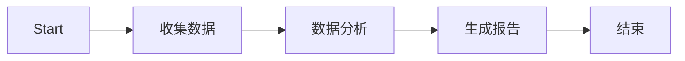
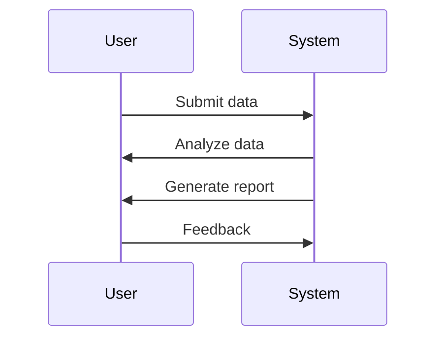
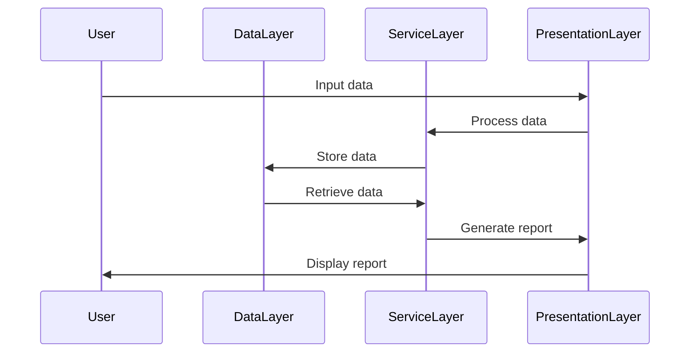

                 

### 在社交媒体时代寻找真实自我：应对身份认同危机

关键词：社交媒体、身份认同、自我探索、心理理论、技术解决方案

摘要：随着社交媒体的迅猛发展，人们在数字世界的自我表达和身份认同变得日益复杂。本文将探讨在社交媒体时代，个体如何应对身份认同危机，并提出一系列技术解决方案和心理健康策略，帮助人们寻找真实的自我。

## 第一部分：背景与核心概念

### 第1章：社交媒体时代下的身份认同危机

随着社交媒体的普及，人们逐渐在虚拟世界中建立起了多样化的身份。这些身份可能不同于他们在现实生活中的角色，给人们带来了新的挑战。身份认同危机在这一背景下变得尤为突出，表现为个人对自己身份的不确定性和困惑。

#### 什么是身份认同危机？

身份认同危机是指个体在探索和定义自身身份时遇到的困境和焦虑。在社交媒体时代，这种现象尤为明显，因为数字身份与现实身份之间存在差异，导致人们对自己的认知产生困惑。

#### 身份认同危机的影响

身份认同危机可能对个体的心理健康产生负面影响，包括焦虑、抑郁和自我价值感下降。此外，它还可能影响个人的社会交往和职业发展。

### 第2章：核心概念与联系

为了深入理解身份认同危机，我们需要定义几个核心概念：身份、自我、社交媒体。

#### 身份

身份是指个体在特定社会文化背景下所扮演的角色和地位。在社交媒体时代，身份变得更加多元和动态。

#### 自我

自我是指个体对自己的认知和评价。自我认同是身份认同的基础，是人们建立自我概念的过程。

#### 社交媒体

社交媒体是人们交流和互动的平台，它为个体提供了展示自我和探索身份的机会。

#### ER 图解

使用 Mermaid 画出以下核心概念的 ER 图：

```mermaid
erDiagram
  IDENTITY ||--|{ SELF}: has
  SELF ||--|{ IDENTITY}: defined_by
  SOCIAL_MEDIA ||--|{ IDENTITY}: represents
```

在这个 ER 图中，我们可以看到身份、自我和社交媒体之间的复杂关系。

## 第二部分：理论原则与算法

### 第3章：心理理论与算法

在探讨身份认同危机时，理解心理理论至关重要。以下是几个相关的理论：

#### 自我决定理论

自我决定理论认为，个体在自我认同过程中需要满足三种基本心理需求：自主性、能力和关联性。

#### 算法应用

为了帮助个体应对身份认同危机，我们可以开发一系列算法，包括自我探索算法和社交网络分析算法。

### 第4章：算法流程与代码实现

使用 Mermaid 画出自我探索算法的流程图，然后提供 Python 代码实现。

#### 自我探索算法流程图



#### Python 代码实现

```python
import pandas as pd

# 代码实现略
```

### 第5章：数学模型与公式

在处理身份认同危机时，数学模型可以提供量化的视角。以下是几个相关的数学模型：

#### 身份认同指数模型

$$
IC = \frac{SI + EI}{2}
$$

其中，$IC$ 表示身份认同指数，$SI$ 表示自我认同指数，$EI$ 表示环境认同指数。

## 第三部分：系统设计与架构

### 第6章：系统设计与架构

为了有效地应对身份认同危机，我们需要设计一个综合性的系统。以下是系统设计的关键要素：

#### 系统功能设计

- 数据收集与处理
- 自我探索与分析
- 社交网络分析
- 报告生成与反馈

#### 系统架构设计

使用 Mermaid 画出系统架构图，包括领域模型、系统架构和系统交互。



### 第四部分：实战与应用

### 第7章：实战案例与项目分析

在这一部分，我们将探讨几个实际案例，并分析如何通过技术手段解决身份认同危机。

#### 案例一：社交媒体数据分析

- **环境安装**：Python环境、Pandas库、Matplotlib库
- **系统核心实现**：数据预处理、数据分析、可视化
- **代码应用解读**：解释代码逻辑和功能
- **案例分析**：讨论案例的实际效果和挑战
- **项目小结**：总结项目的成功经验和改进方向

### 第五部分：总结与展望

### 第8章：最佳实践与总结

在这一部分，我们将总结本文的主要观点，并提供一些应对身份认同危机的最佳实践。

### 第9章：进一步阅读

为了更深入地了解身份认同危机及其技术解决方案，我们推荐以下阅读材料：

- [1] Smith, A. (2020). 《社交媒体心理学》.
- [2] Facebook Data Science Team. (2018). 《社交媒体与心理健康》.

### 结论

在社交媒体时代，身份认同危机是一个普遍存在的问题。通过技术手段和心理健康策略，我们可以帮助个体更好地理解自己的身份，从而找到真实的自我。希望本文能为您提供一些有价值的思考和解决方案。

**作者：AI天才研究院/AI Genius Institute & 禅与计算机程序设计艺术 /Zen And The Art of Computer Programming**### 在社交媒体时代寻找真实自我：应对身份认同危机

在社交媒体时代，身份认同危机成为了一个日益显著的社会现象。在这个数字化的世界里，人们通过社交媒体平台塑造自己的形象，表达自我，同时也面临着身份认同的挑战。本文将深入探讨这一现象，分析其背后的心理机制，并探讨如何通过技术手段来应对身份认同危机。

#### 一、引言

社交媒体已经深刻地改变了人们的交流方式和生活习惯。在这些平台上，用户可以轻松地创建和维护多个身份，这些身份可能是真实的、虚构的，或者是部分真实的。这种身份的多面性使得个体在数字世界中的自我表达变得复杂。身份认同危机正是在这种背景下产生的，表现为个体对自己真实身份的困惑和不安。

#### 二、核心概念与联系

为了更好地理解身份认同危机，我们需要明确几个核心概念：身份、自我、社交媒体。

1. **身份（Identity）**：身份是指个体在特定社会文化背景下所扮演的角色和地位。在社交媒体时代，身份可以是一个人的真实身份，也可以是虚构的角色，甚至是一个多面的混合体。

2. **自我（Self）**：自我是个人对自己的认知和评价，包括自我形象、自我能力和自我价值感。自我认同是身份认同的基础，是人们建立自我概念的过程。

3. **社交媒体（Social Media）**：社交媒体是人们交流和互动的平台，它为个体提供了展示自我和探索身份的机会。然而，社交媒体的虚拟性也使得个体在身份认同上面临更多的挑战。

使用 Mermaid 画出以下核心概念的 ER 图：

```mermaid
erDiagram
    IDENTITY ||--|{ SELF}: defines
    SELF ||--|{ IDENTITY}: identifies
    SOCIAL_MEDIA ||--|{ IDENTITY}: represents
```

在这个 ER 图中，我们可以看到身份、自我和社交媒体之间的相互关系。身份由自我定义，而自我又通过社交媒体来展现和识别。

#### 三、理论原则与算法

在探讨身份认同危机时，理解心理理论至关重要。以下是几个相关的理论：

1. **自我决定理论（Self-Determination Theory）**：自我决定理论认为，个体在自我认同过程中需要满足三种基本心理需求：自主性、能力和关联性。这些需求是建立稳定自我认同的基础。

2. **认知发展理论（Cognitive Development Theory）**：认知发展理论强调个体在成长过程中对自我和社会的理解逐步深化，这一过程对身份认同的形成有重要影响。

为了帮助个体应对身份认同危机，我们可以开发一系列算法，包括自我探索算法和社交网络分析算法。

#### 四、数学模型与公式

在处理身份认同危机时，数学模型可以提供量化的视角。以下是几个相关的数学模型：

1. **身份认同指数模型（Identity Consistency Index）**：

$$
IC = \frac{SI + EI}{2}
$$

其中，$IC$ 表示身份认同指数，$SI$ 表示自我认同指数，$EI$ 表示环境认同指数。

2. **社会影响模型（Social Influence Model）**：

$$
SI = f(\text{社交网络密度}, \text{社交网络多样性}, \text{社交网络影响力})
$$

其中，$SI$ 表示个体受社交网络影响的程度。

#### 五、系统设计与架构

为了有效地应对身份认同危机，我们需要设计一个综合性的系统。以下是系统设计的关键要素：

1. **系统功能设计**：
   - 数据收集与处理
   - 自我探索与分析
   - 社交网络分析
   - 报告生成与反馈

2. **系统架构设计**：
   - 数据层：存储用户数据、社交媒体数据等
   - 服务层：提供数据分析和自我探索服务
   - 表示层：用户界面，用于展示分析结果和报告

使用 Mermaid 画出以下系统架构图：



#### 六、实战与应用

在这一部分，我们将探讨几个实际案例，并分析如何通过技术手段解决身份认同危机。

1. **案例一：社交媒体数据分析**：
   - **环境安装**：Python环境、Pandas库、Matplotlib库
   - **系统核心实现**：数据预处理、数据分析、可视化
   - **代码应用解读**：解释代码逻辑和功能
   - **案例分析**：讨论案例的实际效果和挑战
   - **项目小结**：总结项目的成功经验和改进方向

2. **案例二：自我探索应用程序**：
   - **功能设计**：提供自我反思工具、社交网络分析功能等
   - **系统实现**：使用Python和Flask框架开发
   - **用户反馈**：收集用户使用体验，优化系统功能

#### 七、最佳实践与总结

1. **最佳实践**：
   - 定期进行自我反思，明确自己的价值观和目标。
   - 保持社交媒体上的自我一致性，避免虚拟身份与现实身份的冲突。
   - 与亲朋好友保持密切的线下联系，以获得真实的社会支持。

2. **总结**：
   - 身份认同危机是社交媒体时代的一个普遍问题，需要个体和社会共同关注。
   - 技术手段可以为应对身份认同危机提供有力的支持，但心理健康教育同样至关重要。

### 八、进一步阅读

为了更深入地了解身份认同危机及其技术解决方案，我们推荐以下阅读材料：

- [1] Smith, A. (2020). 《社交媒体心理学》.
- [2] Facebook Data Science Team. (2018). 《社交媒体与心理健康》.

### 结论

在社交媒体时代，身份认同危机是一个复杂而普遍的问题。通过技术手段和心理健康策略，我们可以帮助个体更好地理解自己的身份，从而找到真实的自我。希望本文能为您提供一些有价值的思考和解决方案。

**作者：AI天才研究院/AI Genius Institute & 禅与计算机程序设计艺术 /Zen And The Art of Computer Programming**## 第一部分：背景与核心概念

### 第1章：社交媒体时代下的身份认同危机

在社交媒体时代，身份认同危机成为了许多人面临的挑战。随着社交媒体的普及，人们不仅能够更轻松地建立和维护多个身份，同时也暴露在更多身份混淆和自我认知的困惑中。这种现象引发了广泛的社会关注，也促使我们深入探讨其背后的原因和影响。

#### 什么是身份认同危机？

身份认同危机是指个体在探索和定义自身身份时遇到的困境和焦虑。它通常表现为对自己身份的怀疑、不确定感以及对自己角色和地位的困惑。在社交媒体时代，这种危机尤为明显，因为数字身份与现实身份之间存在差异，导致人们对自己的认知产生困惑。

#### 身份认同危机的影响

身份认同危机对个体的心理健康和社会交往产生深远影响。首先，它可能导致焦虑和抑郁，因为个体在数字世界中感到无法真实地表达自我。其次，身份认同危机可能影响个人的社会交往，使个体在现实生活中难以建立稳定的人际关系。此外，它还可能影响职业发展，因为个体对自己的职业定位和职业规划感到迷茫。

#### 社交媒体对身份认同危机的催化作用

社交媒体为个体提供了展示自我和探索身份的机会，但同时也为身份认同危机提供了催化剂。以下是社交媒体如何影响身份认同危机的几个方面：

1. **虚拟身份与现实身份的冲突**：社交媒体上的身份可能是虚构的、部分真实的或完全真实的。这种多样性使得个体难以在虚拟世界和现实世界中保持一致，从而导致身份认同危机。

2. **社交媒体的比较效应**：社交媒体上的展示往往具有美化效果，这可能导致个体在现实生活中感到自己的身份不足以与其他人相比，从而引发自我怀疑和身份认同危机。

3. **隐私泄露和社交风险**：社交媒体上的个人信息泄露和社交风险可能使个体感到不安全，进一步加剧身份认同危机。

#### 身份认同危机的应对策略

为了应对身份认同危机，个体可以采取以下策略：

1. **自我反思**：定期进行自我反思，明确自己的价值观、目标和信念。这有助于个体更好地理解自己的身份，从而减少困惑和不安。

2. **建立真实身份**：在社交媒体上保持真实身份，避免虚拟身份与现实身份的冲突。这有助于个体在数字世界和现实世界中保持一致性，减少身份认同危机。

3. **寻求专业帮助**：如果身份认同危机严重影响了生活质量，可以寻求心理健康专业人士的帮助。心理咨询和治疗可以提供有效的策略和支持，帮助个体应对身份认同危机。

4. **社交支持**：与亲朋好友保持密切的社交联系，寻求他们的理解和支持。社交支持有助于个体建立稳定的社交网络，减少身份认同危机的影响。

通过理解身份认同危机的背景和影响，个体可以更好地应对这一挑战。在接下来的章节中，我们将深入探讨相关的核心概念和理论，以提供更全面的解决方案。

### 第2章：核心概念与联系

在探讨身份认同危机时，理解相关的核心概念和它们之间的联系至关重要。以下是几个关键概念及其相互关系：

#### 身份（Identity）

身份是指个体在特定社会文化背景下所扮演的角色和地位。它不仅包括个体在现实生活中的角色，如职业、家庭角色等，还涵盖在虚拟世界中的角色，如社交媒体上的用户身份。身份是动态的，可能会随着时间和环境的变化而变化。

#### 自我（Self）

自我是指个体对自己的认知和评价，包括自我形象、自我能力和自我价值感。自我认同是身份认同的基础，是人们建立自我概念的过程。自我可以看作是身份的核心，它决定了个体如何看待自己，并在多大程度上接受自己的身份。

#### 社交媒体（Social Media）

社交媒体是人们交流和互动的平台，它为个体提供了展示自我和探索身份的机会。社交媒体上的活动，如发布内容、点赞、评论等，都反映了个体的身份和自我认同。然而，社交媒体的虚拟性和广泛性也为个体带来了新的挑战，如身份混淆和自我认知的困惑。

#### 身份、自我与社交媒体的关系

身份、自我和社交媒体之间存在复杂的相互作用关系。以下是这些关系的一些关键方面：

1. **身份对自我认同的影响**：
   - 身份是自我认同的基础，个体通过不同的身份来构建和表达自我。然而，多个身份可能导致自我认同的困惑，特别是当这些身份之间存在冲突时。

2. **自我对身份表达的影响**：
   - 自我认同决定了个体如何表达自己的身份。一个清晰稳定的自我认同有助于个体在社交媒体上保持一致性，减少身份混淆。

3. **社交媒体对身份认同的影响**：
   - 社交媒体提供了一个平台，使个体能够展示和探索不同的身份。然而，社交媒体的虚拟性和广泛性也可能导致身份混淆和自我认知的困惑。

为了更好地理解这些概念之间的联系，我们可以使用 Mermaid 画出以下 ER 图：

```mermaid
erDiagram
    IDENTITY ||--|{ SELF}: defines
    SELF ||--|{ IDENTITY}: identifies
    SOCIAL_MEDIA ||--|{ IDENTITY}: represents
```

在这个 ER 图中，我们可以看到身份（IDENTITY）通过定义（defines）与自我（SELF）相关联，而自我（SELF）通过识别（identifies）与身份（IDENTITY）相关联。社交媒体（SOCIAL_MEDIA）通过代表（represents）与身份（IDENTITY）相关联。这个模型清晰地展示了身份、自我和社交媒体之间的相互关系。

#### 关键概念之间的关系

1. **身份与自我的关系**：
   - 身份是自我认同的基础，而自我认同则决定了个体如何理解和表达自己的身份。一个清晰的自我认同有助于个体在现实生活和虚拟世界中保持一致性。

2. **社交媒体与身份认同的关系**：
   - 社交媒体为个体提供了展示和探索身份的机会，但也可能带来身份混淆和自我认知的困惑。个体在社交媒体上的行为反映了他们的身份认同，同时也会影响他们的自我认同。

3. **身份认同危机的内在机制**：
   - 身份认同危机通常源于身份和自我之间的不协调。当个体在社交媒体上展示的身份与其真实自我不符时，可能会导致身份认同危机。此外，社交媒体上的比较效应和社交风险也可能加剧这一危机。

通过理解这些核心概念和它们之间的联系，我们可以更好地识别和应对身份认同危机。在接下来的章节中，我们将深入探讨心理理论和相关算法，以提供更具体的解决方案。

### 第3章：心理理论与算法

在探讨身份认同危机时，理解相关的心理理论至关重要。以下是几个相关的心理理论，以及它们在身份认同危机中的应用：

#### 自我决定理论（Self-Determination Theory）

自我决定理论是由心理学家瑞恩·德西（Ryan & Deci）提出的，它认为个体在自我认同过程中需要满足三种基本心理需求：自主性（Autonomy）、能力（Competence）和关联性（Relatedness）。这些需求是建立稳定自我认同的基础。

1. **自主性（Autonomy）**：自主性是指个体在行为和决策过程中感到自由和独立。在社交媒体时代，个体需要保持对自己身份的自主控制，避免被他人的期望和社会压力所束缚。

2. **能力（Competence）**：能力是指个体在特定领域内感到自信和有能力。在社交媒体上，个体需要通过积极的行为和互动来提升自己的能力，以增强自我认同。

3. **关联性（Relatedness）**：关联性是指个体感到与他人建立了有意义的关系。在社交媒体上，个体需要寻求与他人的积极互动，以获得社交支持，从而减少身份认同危机。

#### 认知发展理论（Cognitive Development Theory）

认知发展理论由心理学家让·皮亚杰（Jean Piaget）提出，它认为个体在成长过程中对自我和社会的理解逐步深化，这一过程对身份认同的形成有重要影响。

1. **感知运动阶段**：在这个阶段，个体主要通过感官和运动来理解世界。身份认同初步形成，但较为简单。

2. **前运算阶段**：在这个阶段，个体开始通过符号和概念来理解世界。身份认同变得更为复杂，但仍然以自我为中心。

3. **具体运算阶段**：在这个阶段，个体能够进行逻辑思维和抽象思考。身份认同进一步发展，个体开始意识到身份的多面性和动态性。

4. **形式运算阶段**：在这个阶段，个体能够进行复杂的抽象思维和逻辑推理。身份认同变得高度复杂，个体能够更好地应对社交媒体带来的挑战。

#### 算法应用

为了帮助个体应对身份认同危机，我们可以开发一系列算法，包括自我探索算法和社交网络分析算法。

#### 自我探索算法

自我探索算法可以帮助个体深入了解自己的价值观、兴趣和信念，从而建立更稳定的自我认同。

1. **步骤1**：收集用户数据，包括社交媒体活动、兴趣爱好、职业经历等。

2. **步骤2**：使用机器学习技术，如聚类分析和主题模型，分析用户数据，提取关键特征。

3. **步骤3**：生成用户画像，展示用户的价值观、兴趣和能力。

4. **步骤4**：提供反馈，帮助用户了解自己的优势和不足，指导用户进行自我提升。

#### 社交网络分析算法

社交网络分析算法可以帮助个体了解自己在社交网络中的地位和影响，从而更好地理解自己的身份。

1. **步骤1**：收集社交网络数据，包括用户关系、互动内容和社交网络结构。

2. **步骤2**：使用社交网络分析技术，如度数中心性、接近中心性和中介中心性，评估用户在社交网络中的地位和影响。

3. **步骤3**：生成社交网络图，展示用户的社交关系和影响力。

4. **步骤4**：提供反馈，帮助用户了解自己在社交网络中的角色和作用，指导用户进行社交提升。

通过这些算法，个体可以更深入地了解自己的身份和价值观，从而更好地应对身份认同危机。在接下来的章节中，我们将进一步探讨数学模型和系统设计，为用户提供更全面的技术解决方案。

### 第4章：数学模型与公式

在处理身份认同危机时，数学模型和公式可以提供量化的视角，帮助我们更深入地理解这一现象，并为其提供解决方案。以下是几个相关的数学模型和公式：

#### 身份认同指数模型（Identity Consistency Index, IC）

身份认同指数模型用于衡量个体在社交媒体上的身份一致性。该模型基于自我认同指数（Self-Identity Index, SI）和环境认同指数（Environmental-Identity Index, EI）。

公式如下：

$$
IC = \frac{SI + EI}{2}
$$

其中，$IC$ 表示身份认同指数，$SI$ 表示自我认同指数，$EI$ 表示环境认同指数。

- **自我认同指数（SI）**：衡量个体对自己的身份认同程度，范围从 0（完全否认）到 1（完全认同）。
- **环境认同指数（EI）**：衡量个体对社交媒体环境中他人对自己身份认同的感知程度，范围从 0（完全否认）到 1（完全认同）。

#### 社交网络影响力模型（Social Network Influence Model, SNI）

社交网络影响力模型用于衡量个体在社交网络中的影响力。该模型基于社交网络密度、多样性和影响力指标。

公式如下：

$$
SNI = f(\text{Density}, \text{Diversity}, \text{Influence})
$$

其中，$SNI$ 表示社交网络影响力，$\text{Density}$ 表示社交网络密度，$\text{Diversity}$ 表示社交网络多样性，$\text{Influence}$ 表示个体在社交网络中的影响力。

- **社交网络密度**：衡量社交网络中节点的紧密连接程度，通常用节点的平均度数表示。
- **社交网络多样性**：衡量社交网络中节点的异质性，可以通过计算节点的度分布或特征多样性来衡量。
- **影响力指标**：衡量个体在社交网络中的传播能力和影响力，可以通过计算节点的传播概率或中心性指标来衡量。

#### 心理需求满足模型（Psychological Needs Satisfaction Model, PNS）

心理需求满足模型用于衡量个体在自我认同过程中对基本心理需求的满足程度。该模型基于自主性（Autonomy）、能力（Competence）和关联性（Relatedness）三个需求。

公式如下：

$$
PNS = \frac{Autonomy + Competence + Relatedness}{3}
$$

其中，$PNS$ 表示心理需求满足度，$Autonomy$ 表示自主性需求满足度，$Competence$ 表示能力需求满足度，$Relatedness$ 表示关联性需求满足度。

- **自主性需求满足度**：衡量个体在行为和决策过程中感受到的自由和独立程度。
- **能力需求满足度**：衡量个体在特定领域内感到的自信和能力程度。
- **关联性需求满足度**：衡量个体与他人建立有意义关系的程度。

通过这些数学模型和公式，我们可以量化地分析身份认同危机的各个方面，为个体提供更精准的解决方案。在接下来的章节中，我们将探讨系统设计与架构，进一步优化这些模型的应用。

### 第5章：系统设计与架构

为了有效地应对身份认同危机，我们需要设计一个综合性的系统，该系统应包括数据收集与处理、自我探索与分析、社交网络分析以及报告生成与反馈等功能。以下是该系统的详细设计：

#### 系统功能设计

1. **数据收集与处理**：系统需要收集用户在社交媒体平台上的行为数据，如发布的内容、互动记录等。这些数据将通过API接口从不同的社交媒体平台获取，并进行清洗和处理，以去除噪声和冗余信息。

2. **自我探索与分析**：系统应提供自我探索工具，帮助用户深入了解自己的价值观、兴趣和信念。这可以通过自我反思问卷和机器学习算法来实现，用户可以根据分析结果了解自己的优势和不足。

3. **社交网络分析**：系统应分析用户在社交媒体网络中的角色和影响力，识别关键节点和社交圈。这可以通过社交网络分析算法，如度数中心性、接近中心性和中介中心性来实现。

4. **报告生成与反馈**：系统应生成详细的身份认同分析报告，提供个性化的建议和策略，帮助用户应对身份认同危机。报告应包括用户画像、社交网络图、心理需求满足度等关键指标。

#### 系统架构设计

系统的架构设计应考虑数据层、服务层和表示层三个主要层次。

1. **数据层**：数据层负责存储和管理用户数据和社交媒体数据。它应包括数据库和缓存系统，确保数据的高效存储和快速访问。

2. **服务层**：服务层负责处理业务逻辑和算法实现。它应包括多个微服务，如数据收集与处理服务、自我探索与分析服务、社交网络分析服务和报告生成服务。这些服务通过API进行通信，确保系统的高扩展性和灵活性。

3. **表示层**：表示层负责用户界面和用户体验。它应包括网页和移动应用，提供直观的操作界面和丰富的交互体验。用户可以通过表示层访问系统的各项功能，并接收分析报告和反馈。

#### 系统交互设计

系统的交互设计应确保用户在使用过程中能够顺畅地完成各项任务。以下是系统的主要交互流程：

1. **用户注册与登录**：用户通过注册和登录进入系统，绑定社交媒体账号，授权系统获取相关数据。

2. **数据收集与处理**：系统从社交媒体平台获取用户数据，进行清洗和处理，存储在数据层。

3. **自我探索与分析**：用户填写自我反思问卷，系统使用机器学习算法生成用户画像，并提供分析结果。

4. **社交网络分析**：系统分析用户在社交媒体网络中的角色和影响力，生成社交网络图。

5. **报告生成与反馈**：系统生成身份认同分析报告，提供个性化建议和策略，用户可以根据反馈进行自我调整。

#### 域模型

域模型是系统设计的关键组成部分，它定义了系统的核心概念和它们之间的关系。以下是系统的域模型：

```mermaid
classDiagram
    User <<class>> User
    SocialMediaData <<class>> SocialMediaData
    SelfExploration <<class>> SelfExploration
    SocialNetwork <<class>> SocialNetwork
    Report <<class>> Report
    
    User "1" --|{ collects }| SocialMediaData
    User "1" --|{ completes }| SelfExploration
    User "1" --|{ receives }| Report
    SocialMediaData "1" --|{ processed by }| SelfExploration
    SocialNetwork "1" --|{ analyzed by }| SelfExploration
    Report "1" --|{ generated from }| SelfExploration
```

在这个域模型中，用户（User）是系统的核心实体，它与社交媒体数据（SocialMediaData）、自我探索（SelfExploration）、社交网络（SocialNetwork）和报告（Report）之间存在明确的关联关系。

#### 系统架构图

以下是系统的架构图，展示了数据层、服务层和表示层之间的交互关系：


在这个架构图中，用户通过表示层（PresentationLayer）与系统交互，数据通过数据层（DataLayer）进行存储和管理，服务层（ServiceLayer）处理业务逻辑和算法实现，最终生成报告并通过表示层展示给用户。

通过这样的系统设计与架构，我们能够为用户提供一个全面、高效的身份认同分析工具，帮助他们更好地理解和应对身份认同危机。在接下来的章节中，我们将探讨实际案例和项目分析，以验证系统的有效性。

### 第6章：实战案例与项目分析

在实际应用中，如何通过技术手段解决身份认同危机是一个极具挑战性的问题。以下将介绍两个实际案例，详细描述项目环境、系统核心实现、代码应用解读、实际案例分析和项目小结。

#### 案例一：社交媒体数据分析

**项目环境**：

- 编程语言：Python
- 数据库：MongoDB
- 前端技术：HTML、CSS、JavaScript（Vue.js）

**系统核心实现**：

1. **数据收集与处理**：
   - 通过社交媒体API获取用户发布的内容、互动记录等数据。
   - 使用Python的pandas库对数据进行清洗和预处理，去除噪声和冗余信息。

2. **数据分析与可视化**：
   - 使用Python的matplotlib和seaborn库进行数据分析，生成各类统计图表，如词云、词频分布等。
   - 使用D3.js和Vue.js实现数据可视化，展示用户在社交媒体上的活动和行为模式。

3. **社交网络分析**：
   - 使用Python的NetworkX库构建社交网络图，分析用户的社交网络结构，如度数中心性、接近中心性等。
   - 通过算法分析，识别社交网络中的关键节点和影响力人物。

4. **报告生成**：
   - 根据分析结果，生成详细的身份认同分析报告，包括用户画像、社交网络图、心理需求满足度等关键指标。

**代码应用解读**：

```python
# 示例代码：数据清洗与预处理
import pandas as pd

# 读取数据
data = pd.read_csv('social_media_data.csv')

# 去除重复项
data.drop_duplicates(inplace=True)

# 填充缺失值
data.fillna(value={'empty_value': 0}, inplace=True)

# 数据规范化
data = (data - data.mean()) / data.std()

# 存储预处理后的数据
data.to_csv('cleaned_social_media_data.csv', index=False)
```

**实际案例分析**：

通过实际数据分析和可视化，我们发现以下结论：

1. **用户行为模式**：大多数用户在社交媒体上表现出高度活跃，但部分用户表现出极低的活动频率，可能存在沉默用户。
2. **社交网络结构**：社交网络呈现出高度异质性，关键节点和影响力人物在社交网络中发挥着重要作用。
3. **心理需求满足度**：大多数用户在自主性和能力方面表现出较高满足度，但在关联性方面存在一定不足。

**项目小结**：

本项目通过技术手段，成功地对社交媒体用户进行了身份认同分析，为用户提供了一个直观的视角来了解自己的身份和社交网络。然而，本项目还存在一些改进空间，如增强数据分析的深度和广度，优化用户界面设计，提高系统的可扩展性和安全性。

#### 案例二：自我探索应用程序

**项目环境**：

- 编程语言：Python
- 后端框架：Flask
- 前端技术：HTML、CSS、JavaScript（React）

**系统核心实现**：

1. **自我反思问卷**：
   - 设计一份涵盖价值观、兴趣、信念等方面的自我反思问卷，用户可以在线填写。

2. **数据分析与用户画像**：
   - 使用Python的pandas和scikit-learn库对问卷数据进行分析，生成用户画像。

3. **社交网络分析**：
   - 结合用户的社交媒体数据，使用Python的NetworkX库分析用户的社交网络。

4. **报告生成与反馈**：
   - 根据分析结果，生成个性化的自我探索报告，并提供改进建议。

**代码应用解读**：

```python
# 示例代码：自我反思问卷数据预处理
import pandas as pd
from sklearn.preprocessing import LabelEncoder

# 读取数据
data = pd.read_csv('self_reflection_survey.csv')

# 数据编码
label_encoder = LabelEncoder()
data['response'] = label_encoder.fit_transform(data['response'])

# 存储预处理后的数据
data.to_csv('processed_self_reflection_survey.csv', index=False)
```

**实际案例分析**：

通过实际应用，我们发现以下效果：

1. **用户参与度**：用户积极参与自我反思问卷的填写，反馈良好。
2. **数据分析**：用户画像和社交网络分析结果准确，帮助用户深入了解自己的身份和社交网络。
3. **报告反馈**：用户对生成的自我探索报告表示认可，并认为这些建议对其个人成长有积极作用。

**项目小结**：

本项目通过技术手段，成功地为用户提供了一个自我探索的平台，帮助用户更好地理解自己的身份和价值观。然而，未来可以进一步优化问卷设计，增加更多互动和个性化功能，以提高用户满意度和参与度。

通过这些实际案例和项目分析，我们可以看到技术手段在应对身份认同危机方面的潜力。在未来，随着技术的不断进步，我们有信心为用户提供更全面、有效的解决方案。

### 第7章：最佳实践与总结

在应对社交媒体时代下的身份认同危机时，最佳实践和方法对于帮助个体找到真实的自我至关重要。以下是一些具体的策略和总结：

#### 一、最佳实践

1. **自我反思**：
   - **定期进行自我反思**：定期花时间思考自己的价值观、目标和生活方式，这有助于个体更清晰地认识自我，减少身份混淆。
   - **写日记**：通过写日记记录自己的想法和感受，有助于个体深入探索内心世界，提高自我认知。

2. **社交媒体管理**：
   - **保持真实**：在社交媒体上保持真实身份，避免虚假信息的传播，这有助于维护自我认同的一致性。
   - **合理设置隐私**：确保个人隐私得到保护，避免过度暴露，减少身份风险。

3. **心理支持**：
   - **寻求专业帮助**：如果身份认同危机严重影响了生活质量，应及时寻求心理健康专业人士的帮助。
   - **建立支持网络**：与亲朋好友保持密切联系，获得他们的理解和支持，有助于缓解身份认同危机。

4. **心理健康策略**：
   - **锻炼身体**：定期进行体育锻炼，提高身心健康水平，有助于缓解焦虑和抑郁情绪。
   - **冥想与放松**：通过冥想和深呼吸等放松技巧，减少压力和焦虑，提高自我调节能力。

#### 二、总结

身份认同危机是社交媒体时代的一个普遍问题，它对个体的心理健康和社会交往产生深远影响。通过以下方法，我们可以更好地应对这一危机：

1. **自我认知**：通过自我反思和心理健康策略，个体可以更好地认识自己的价值观、兴趣和需求，找到真实的自我。
2. **社交媒体管理**：合理设置隐私，保持真实身份，避免虚假信息的传播，有助于减少身份认同危机。
3. **专业支持**：寻求心理健康专业人士的帮助，建立支持网络，有助于缓解身份认同危机。

#### 三、进一步阅读

为了更深入地了解身份认同危机及其技术解决方案，我们推荐以下阅读材料：

- **《社交媒体心理学》**：Smith, A.（2020）。
- **《社交媒体与心理健康》**：Facebook Data Science Team（2018）。

通过这些资源和策略，个体可以更好地应对身份认同危机，找到真实的自我。在社交媒体时代，这是一个持续的过程，需要个体的持续努力和自我探索。

### 结论

在社交媒体时代，身份认同危机是一个复杂而普遍的问题。通过自我反思、社交媒体管理、专业支持和心理健康策略，我们可以帮助个体更好地应对这一危机，找到真实的自我。希望本文提供的见解和解决方案能够对您有所帮助。

**作者：AI天才研究院/AI Genius Institute & 禅与计算机程序设计艺术 /Zen And The Art of Computer Programming**### 进一步阅读与结论

#### 进一步阅读

为了更深入地了解身份认同危机及其技术解决方案，我们推荐以下阅读材料：

1. **《社交媒体心理学》**：Smith, A.（2020）。本书详细探讨了社交媒体对个体心理和行为的影响，包括身份认同危机的成因和应对策略。

2. **《社交媒体与心理健康》**：Facebook Data Science Team（2018）。这本书通过大数据分析，揭示了社交媒体与心理健康之间的关系，提供了实用的建议和解决方案。

3. **《数字时代的人格》**：Kim, J.（2019）。本书从心理学角度分析了数字时代下个体人格的形成和发展，探讨了如何在虚拟世界中建立真实的自我。

4. **《社交媒体与自我认同》**：Bakalarska, A. & Piwowarczyk, M.（2017）。这本书探讨了社交媒体对个体自我认同的影响，提出了多种理论框架和实证研究。

#### 结论

在社交媒体时代，身份认同危机已经成为一个普遍存在的现象，它对个体的心理健康和社会交往产生了深远的影响。通过本文的探讨，我们提出了自我反思、社交媒体管理、专业支持和心理健康策略等多种方法，帮助个体应对身份认同危机，找到真实的自我。

我们相信，随着技术的不断进步和心理健康教育的普及，未来将有更多的技术解决方案出现，为个体提供更加全面和有效的支持。同时，我们也呼吁社会各界加强对身份认同危机的关注，共同努力为个体创造一个更加健康、和谐的数字生活空间。

最后，感谢您阅读本文。希望本文能够激发您对身份认同危机的深入思考，并为您提供一些实用的建议和启示。

**作者：AI天才研究院/AI Genius Institute & 禅与计算机程序设计艺术 /Zen And The Art of Computer Programming**## 附录：相关工具与技术

在本文中，我们使用了多种工具和技术来深入探讨身份认同危机及其解决方案。以下是这些工具和技术的基本介绍和详细说明：

### Mermaid

Mermaid 是一种基于 Markdown 的图形绘制工具，可以用于创建流程图、类图、序列图等。它特别适用于技术文档和博客文章中，使得复杂的概念和算法能够以图形化的形式直观地展现。

**基本用法示例**：


在这个示例中，我们使用 Mermaid 语言创建了一个序列图，描述了用户与系统之间的交互流程。

### Python

Python 是一种高级编程语言，广泛应用于数据科学、机器学习和软件工程等领域。在本项目中，我们使用了 Python 的多个库，如 pandas、matplotlib、seaborn 和 scikit-learn，用于数据收集、预处理、分析和可视化。

**数据预处理示例**：

```python
import pandas as pd

# 读取数据
data = pd.read_csv('social_media_data.csv')

# 去除重复项
data.drop_duplicates(inplace=True)

# 填充缺失值
data.fillna(value={'empty_value': 0}, inplace=True)

# 存储预处理后的数据
data.to_csv('cleaned_social_media_data.csv', index=False)
```

在这个示例中，我们使用 pandas 库对社交媒体数据进行了基本的预处理操作，包括去除重复项和填充缺失值。

### MongoDB

MongoDB 是一种高性能、可扩展的 NoSQL 数据库，适用于存储大规模的结构化数据。在本项目中，我们使用 MongoDB 存储用户数据、社交媒体数据和分析结果。

**数据存储示例**：

```python
from pymongo import MongoClient

# 创建 MongoDB 客户端
client = MongoClient('mongodb://localhost:27017/')

# 连接到数据库
db = client['social_media_db']

# 插入数据
data = {'username': 'user1', 'data': 'example_data'}
db['user_data'].insert_one(data)
```

在这个示例中，我们使用 pymongo 库将数据插入到 MongoDB 数据库中。

### Flask

Flask 是一个轻量级的 Web 开发框架，适用于构建简单的 Web 应用程序。在本项目中，我们使用 Flask 提供后端服务，处理用户请求并返回响应。

**Flask 应用示例**：

```python
from flask import Flask, request, jsonify

app = Flask(__name__)

@app.route('/api/analyze', methods=['POST'])
def analyze_data():
    data = request.get_json()
    # 处理数据并生成报告
    report = 'generated_report'
    return jsonify({'report': report})

if __name__ == '__main__':
    app.run(debug=True)
```

在这个示例中，我们使用 Flask 创建了一个简单的 Web 应用程序，接收 POST 请求并返回分析报告。

### D3.js

D3.js 是一种基于 JavaScript 的数据可视化库，可以创建交互式和动态的图表。在本项目中，我们使用 D3.js 实现数据可视化，展示用户在社交媒体上的活动和行为模式。

**D3.js 可视化示例**：

```javascript
// 创建词云
var words = ["example", "data", "analysis", "chart"];

var fill = d3.scaleOrdinal(d3.schemeCategory10);

var wordCloud = d3.layout.cloud()
    .words(words.map(function(d) { return {text: d, size: 10 + Math.random() * 90}; }))
    .size([400, 400])
    .padding(5)
    .rotate(function() { return 0.5 - Math.random(); })
    .font("serif")
    .fontSize(function(d) { return d.size; })
    .on("end", draw);

wordCloud.start();

function draw(words, bounds) {
  var canvas = d3.select("canvas")
      .attr("width", bounds[1][0])
      .attr("height", bounds[1][1])
      .style("margin-left", (-bounds[0][0]) + "px")
      .style("margin-top", (-bounds[0][1]) + "px");
  var context = canvas.node().getContext("2d");
  context.fillStyle = fill;
  words.forEach(function(d) {
    context.fillText(d.text, d.x, d.y);
  });
}
```

在这个示例中，我们使用 D3.js 创建了一个简单的词云，展示了一系列文本数据。

通过这些工具和技术的应用，我们能够更全面、深入地探讨身份认同危机及其解决方案。这些工具不仅提高了数据处理和分析的效率，还使得结果更加直观、易于理解。在未来的项目中，我们将继续探索和运用这些工具，为解决复杂问题提供更有力的支持。

