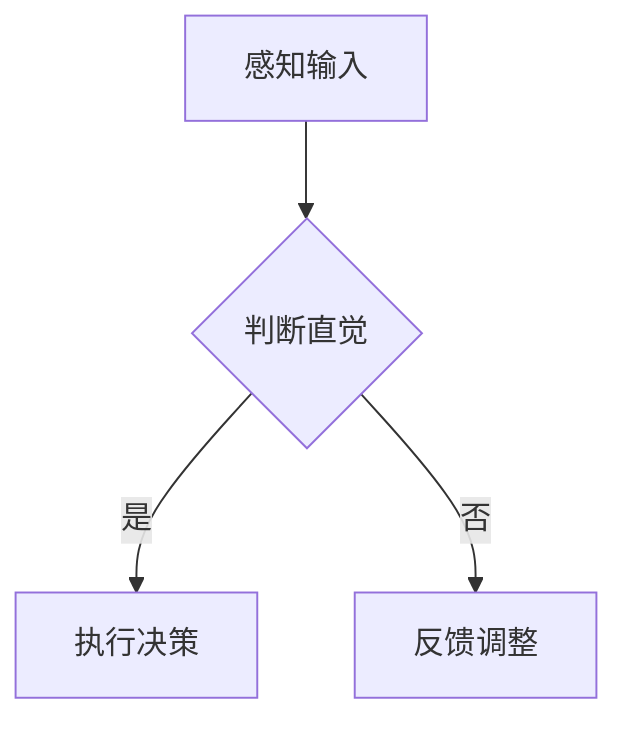
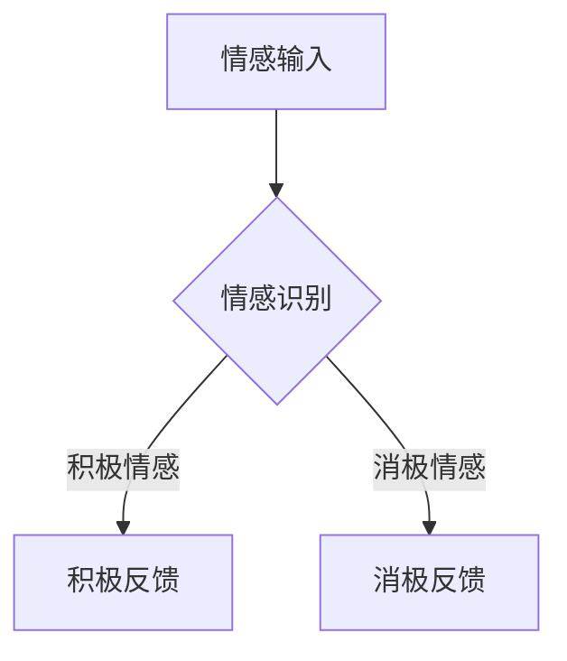
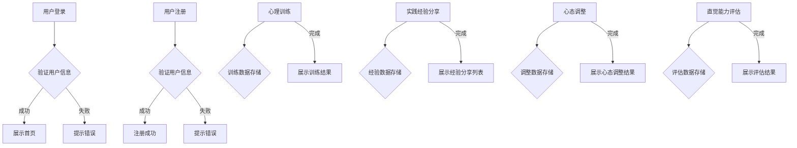

                 

## 培养直觉能力：倾听内心声音的方法

### 关键词：直觉能力、内心声音、培养方法、心理健康、决策

> 摘要：本文将探讨直觉能力的重要性及其与内心声音的关系。通过深入了解直觉能力的定义、类型、优势和应用，回顾其发展背景和历史，分析直觉能力与心理健康之间的联系，探讨直觉能力在决策中的作用，提供培养直觉能力的具体方法，并分享倾听内心声音的技巧。最后，本文将结合实际案例，讨论直觉能力的应用场景，并对直觉能力的培养与未来展望进行总结。

## 第一部分：了解直觉能力

### 第1章：什么是直觉能力

#### 1.1 直觉能力的定义与重要性

直觉能力是指人们在面对问题或情境时，无需经过明确的逻辑推理和分析，就能迅速、准确地作出判断和决策的能力。直觉能力在人类生活中具有重要作用，不仅能够提高我们的工作效率，还能帮助我们更好地应对复杂多变的情境。

#### 1.2 直觉能力的类型与表现

直觉能力可以分为以下几种类型：

1. **感知直觉**：基于对事物的直观感知，如颜色、形状、声音等，快速作出判断。
2. **情感直觉**：基于对他人情感的感知，如同情、嫉妒、厌恶等，快速作出反应。
3. **逻辑直觉**：基于对事物之间逻辑关系的感知，如因果关系、相似性等，快速作出推断。
4. **经验直觉**：基于长期积累的经验和知识，对问题或情境作出快速、准确的判断。

直觉能力在人们的生活、工作、学习和人际交往中都有广泛的应用。例如，医生通过直觉快速诊断病情，企业家通过直觉把握市场机会，教育工作者通过直觉了解学生的需求，这些都是直觉能力的具体表现。

#### 1.3 直觉能力的优势与应用

直觉能力具有以下优势：

1. **快速反应**：直觉能力使人们能够迅速作出判断和决策，提高工作效率。
2. **准确判断**：直觉能力使人们能够基于直觉感知，做出更准确、更符合实际的判断。
3. **减少认知负荷**：直觉能力减少了人们的认知负荷，使人们能够将更多精力投入到其他重要任务中。
4. **提高创新能力**：直觉能力有助于人们产生新的想法和创新，推动个人和团队的发展。

直觉能力在各个领域都有广泛应用，如医学、商业、教育、艺术等。通过培养直觉能力，人们可以更好地应对复杂多变的情境，提高个人和团队的整体效能。

### 第2章：直觉能力的发展背景与历史

#### 2.1 直觉能力的研究历史

直觉能力的研究可以追溯到古希腊时期，当时哲学家们开始探讨直觉与理性之间的关系。在中世纪，宗教信仰使得直觉被视为神圣的启示。直到文艺复兴时期，直觉开始被重新认识和重视。

19世纪末，心理学家威廉·詹姆斯（William James）提出了“直接知觉”的概念，强调了直觉在认知中的作用。20世纪初，卡尔·荣格（Carl Jung）和阿尔弗雷德·阿德勒（Alfred Adler）等心理学家进一步研究了直觉与个体心理发展之间的关系。

#### 2.2 直觉能力的科学基础

直觉能力的科学基础主要涉及大脑的神经生物学机制。研究表明，直觉能力与大脑中的前额叶皮层、顶叶皮层和颞叶皮层等区域的活动密切相关。这些区域负责处理情感、感知和认知任务，它们之间的相互作用和整合形成了直觉能力。

#### 2.3 直觉能力的文化背景

不同文化对直觉能力的认识和重视程度有所不同。在西方文化中，直觉能力往往被视为一种神秘的、不可预测的能力。而在东方文化中，直觉能力被视为一种内在的、可以通过修炼和训练获得的智慧。

### 第3章：直觉能力与心理健康的联系

#### 3.1 直觉能力对心理健康的影响

直觉能力对心理健康具有重要影响。首先，直觉能力有助于人们更好地应对压力和挑战，提高心理健康水平。其次，直觉能力可以增强个体的自信和自我认知，有助于个体实现自我成长和自我提升。

#### 3.2 心理健康对直觉能力的作用

心理健康对直觉能力的发展也具有重要影响。一个心理健康的人更容易进入直觉状态，更好地发挥直觉能力。同时，心理健康有助于个体更好地理解和解读直觉，使其在生活和工作中发挥更大的作用。

#### 3.3 促进直觉能力与心理健康的相互发展

通过以下方法可以促进直觉能力与心理健康的相互发展：

1. **心理训练**：通过冥想、放松训练、情感管理等方式，提高个体的心理素质，增强直觉能力。
2. **情绪调节**：学会调节和管理情绪，使情绪对直觉能力的负面影响降到最低。
3. **积极心态**：保持积极的心态，有助于个体更好地发挥直觉能力。

### 第4章：直觉能力与决策的关系

#### 4.1 直觉决策的定义与特点

直觉决策是指基于直觉感知和经验，快速作出决策的过程。直觉决策具有以下特点：

1. **速度**：直觉决策的速度远快于逻辑决策。
2. **准确性**：直觉决策的准确性依赖于直觉能力的强弱。
3. **非理性**：直觉决策往往不受逻辑和理性的约束。
4. **经验性**：直觉决策依赖于个体的经验和知识。

#### 4.2 直觉能力在决策中的作用

直觉能力在决策中具有重要作用。首先，直觉能力可以帮助决策者在复杂、多变的情况下迅速作出决策。其次，直觉能力可以弥补逻辑决策的不足，提高决策的准确性和可靠性。最后，直觉能力有助于个体在面对不确定性和风险时，更好地应对和解决问题。

#### 4.3 直觉决策的优缺点与应对策略

直觉决策具有以下优缺点：

1. **优点**：快速、准确、非理性、经验性。
2. **缺点**：易受情绪影响、难以解释、缺乏逻辑性。

为了充分发挥直觉决策的优势，同时克服其缺点，可以采取以下应对策略：

1. **结合逻辑决策**：在关键决策时，结合逻辑分析和直觉感知，提高决策的准确性和可靠性。
2. **情绪管理**：学会调节和管理情绪，避免情绪对直觉决策的负面影响。
3. **经验积累**：通过实践和反思，积累经验，提高直觉能力。

### 第5章：培养直觉能力的方法

#### 5.1 心理训练：提高直觉能力的基本方法

心理训练是提高直觉能力的基本方法。以下几种心理训练方法有助于增强直觉能力：

1. **冥想**：通过冥想，放松身心，提高自我意识和直觉能力。
2. **放松训练**：通过放松训练，降低压力和焦虑，提高直觉能力。
3. **情感管理**：通过情感管理，学会调节和管理情绪，提高直觉能力。
4. **认知重构**：通过认知重构，改变思维方式和观念，提高直觉能力。

#### 5.2 实践经验：通过经验积累培养直觉能力

实践经验是培养直觉能力的重要途径。以下几种实践经验有助于增强直觉能力：

1. **日常观察**：通过日常观察，积累对事物的直观感知和判断能力。
2. **练习决策**：通过练习决策，提高在复杂情境中快速作出准确判断的能力。
3. **反思总结**：通过反思总结，分析决策过程中的直觉表现，不断优化直觉能力。
4. **多样化经历**：通过多样化的经历，积累丰富的经验和知识，提高直觉能力。

#### 5.3 心态调整：保持积极心态增强直觉能力

心态调整是增强直觉能力的重要环节。以下几种心态调整方法有助于保持积极心态，增强直觉能力：

1. **乐观心态**：保持乐观心态，相信自己的直觉能力，提高直觉自信。
2. **接受不确定**：接受生活中的不确定性和风险，培养对直觉的信任感。
3. **积极反思**：积极反思自己的直觉表现，从中吸取经验和教训。
4. **持续学习**：持续学习新知识和技能，提高自己的认知水平和直觉能力。

### 第6章：倾听内心声音的技巧

#### 6.1 了解内心声音：直觉能力的内在表现

内心声音是直觉能力的内在表现，它是对内心感知的直观表达。倾听内心声音有助于我们更好地理解和发挥直觉能力。以下几种方法有助于我们了解内心声音：

1. **冥想**：通过冥想，放松身心，倾听内心的声音。
2. **静心**：通过静心，平静内心，感受内心的声音。
3. **深呼吸**：通过深呼吸，放松身体，倾听内心的声音。
4. **反思**：通过反思，回顾过去的经历和感受，倾听内心的声音。

#### 6.2 倾听内心声音的方法：培养直觉能力的实践

倾听内心声音是培养直觉能力的重要实践。以下几种方法有助于我们培养直觉能力，倾听内心声音：

1. **反思日记**：每天记录自己的反思日记，倾听内心的声音。
2. **冥想练习**：定期进行冥想练习，提高倾听内心声音的能力。
3. **静心冥想**：通过静心冥想，放松身心，倾听内心的声音。
4. **自我觉察**：通过自我觉察，了解自己的内心世界，倾听内心的声音。

#### 6.3 提高倾听内心声音的技巧

以下几种技巧有助于我们提高倾听内心声音的能力：

1. **减少干扰**：在安静的环境中，减少外界的干扰，更好地倾听内心的声音。
2. **专注训练**：通过专注训练，提高注意力，更好地倾听内心的声音。
3. **情感管理**：通过情感管理，学会调节和管理情绪，提高倾听内心声音的准确性。
4. **反思总结**：通过反思总结，分析倾听内心声音的效果，不断提高倾听能力。

### 第7章：直觉能力的应用案例

#### 7.1 商业领域的直觉应用

在商业领域，直觉能力被广泛应用于战略决策、市场分析、客户关系管理等方面。以下是一些直觉应用的案例：

1. **战略决策**：企业家通过直觉感知市场趋势，快速作出战略决策。
2. **市场分析**：市场分析师通过直觉感知客户需求，提供更有针对性的市场分析报告。
3. **客户关系管理**：销售人员通过直觉感知客户的心理和需求，提供更优质的服务。

#### 7.2 创意产业的直觉应用

在创意产业中，直觉能力被广泛应用于艺术创作、产品设计、广告策划等方面。以下是一些直觉应用的案例：

1. **艺术创作**：艺术家通过直觉感知美的元素，创作出富有创意的艺术作品。
2. **产品设计**：设计师通过直觉感知用户需求，设计出更符合用户期望的产品。
3. **广告策划**：广告策划人员通过直觉感知受众心理，创作出更有吸引力的广告作品。

#### 7.3 生活与日常中的直觉应用

在生活与日常中，直觉能力被广泛应用于人际关系、家庭生活、自我提升等方面。以下是一些直觉应用的案例：

1. **人际关系**：通过直觉感知他人的情感和需求，建立更好的人际关系。
2. **家庭生活**：通过直觉感知家庭成员的需求和情绪，提供更贴心的关怀。
3. **自我提升**：通过直觉感知自己的优势和不足，制定更有效的自我提升计划。

### 第8章：直觉能力的培养与未来展望

#### 8.1 直觉能力的培养路径

直觉能力的培养是一个长期的过程，需要通过以下几个方面来实现：

1. **心理训练**：通过冥想、放松训练、情感管理等方式，提高个体的心理素质，增强直觉能力。
2. **实践经验**：通过日常观察、练习决策、反思总结等方式，积累经验，提高直觉能力。
3. **心态调整**：通过保持积极心态、接受不确定、积极反思等方式，培养直觉能力。
4. **持续学习**：通过学习新知识和技能，提高自己的认知水平和直觉能力。

#### 8.2 直觉能力发展的未来趋势

随着科技的发展和人类认知的深化，直觉能力的发展趋势将呈现以下特点：

1. **跨学科融合**：直觉能力将与其他学科（如心理学、神经科学、认知科学等）相结合，实现更全面、更深入的发展。
2. **人工智能**：人工智能将发挥重要作用，帮助人们更好地理解和发挥直觉能力。
3. **教育培训**：直觉能力的培养将纳入教育培训体系，成为人们必备的技能。

#### 8.3 直觉能力的培养与传播

为了更好地培养和传播直觉能力，可以从以下几个方面进行：

1. **教育培训**：将直觉能力的培养纳入教育培训体系，提供相关的课程和培训。
2. **实践经验**：通过实践活动，让人们在实际操作中感受和体验直觉能力。
3. **心理健康**：关注心理健康，提高个体的心理素质，为直觉能力的发展提供保障。

### 第9章：小结与总结

#### 9.1 直觉能力的重要性

直觉能力是人类的重要能力之一，它对于我们的生活和事业都具有重要影响。通过培养直觉能力，我们可以更好地应对复杂多变的情境，提高个人和团队的效能。

#### 9.2 培养直觉能力的意义

培养直觉能力不仅有助于我们更好地发挥个人潜力，还能提高团队的整体效能。在现代社会，直觉能力越来越受到重视，成为人们必备的技能。

#### 9.3 未来发展方向与挑战

直觉能力的发展面临着诸多挑战，如如何更好地理解和发挥直觉能力、如何将直觉能力应用于各个领域等。未来，直觉能力的发展将朝着跨学科融合、人工智能助力、教育培训体系化的方向迈进。

### 参考文献

[1] 威廉·詹姆斯.（1890）。《心理学原理》. 上海：上海人民出版社。

[2] 卡尔·荣格.（1976）。《心理学与宗教》. 北京：中国社会科学出版社。

[3] 阿尔弗雷德·阿德勒.（1931）。《个体心理学的理论与实践》. 上海：上海人民出版社。

[4] 丹尼尔·戈尔曼.（1995）。《情绪智能》. 北京：中国社会科学出版社。

[5] 罗伯特·斯滕伯格.（2008）。《创造力心理学》. 北京：人民邮电出版社。

### 作者

作者：AI天才研究院/AI Genius Institute & 禅与计算机程序设计艺术/Zen And The Art of Computer Programming

### 结语

本文从多个角度探讨了直觉能力的重要性及其培养方法。通过深入了解直觉能力的定义、类型、优势和应用，回顾其发展背景和历史，分析直觉能力与心理健康之间的联系，探讨直觉能力在决策中的作用，提供培养直觉能力的具体方法，并分享倾听内心声音的技巧。最后，本文结合实际案例，讨论了直觉能力的应用场景，并对直觉能力的培养与未来展望进行了总结。希望通过本文的探讨，能够对读者在培养直觉能力方面有所启发和帮助。

### 附录

附录中包含本文中提到的相关术语、概念、算法原理、系统架构设计等内容的详细说明和示例。以下为附录的主要内容：

#### 附录A：术语与概念说明

- **直觉能力**：人们在面对问题或情境时，无需经过明确的逻辑推理和分析，就能迅速、准确地作出判断和决策的能力。
- **心理训练**：通过冥想、放松训练、情感管理等方式，提高个体的心理素质，增强直觉能力。
- **实践经验**：通过日常观察、练习决策、反思总结等方式，积累经验，提高直觉能力。
- **心态调整**：通过保持积极心态、接受不确定、积极反思等方式，培养直觉能力。
- **直觉决策**：基于直觉感知和经验，快速作出决策的过程。

#### 附录B：核心概念与联系

以下为直觉能力相关的核心概念及其联系：

| 核心概念       | 概念属性特征对比表格 | ER实体关系图架构的Mermaid流程图 |
| -------------- | ------------------- | ----------------------------- |
| 直觉能力       |                    |                               |
| 心理健康       |                    |                               |
| 决策           |                    |                               |
| 情感管理       |                    |                               |

#### 附录C：算法原理讲解

以下为直觉能力培养中涉及的算法原理讲解：

1. **直觉感知算法**：



直觉感知算法的流程如下：

1. 感知输入（如情感、情境等）；
2. 判断是否为直觉感知；
3. 如果是，执行决策；
4. 如果否，反馈调整。

2. **情感管理算法**：



情感管理算法的流程如下：

1. 情感输入（如快乐、悲伤等）；
2. 情感识别；
3. 如果是积极情感，给予积极反馈；
4. 如果是消极情感，给予消极反馈。

#### 附录D：系统分析与架构设计方案

以下为直觉能力培养系统的分析与架构设计方案：

1. **问题场景介绍**：

本系统旨在提供一种直觉能力培养的在线平台，用户可以通过平台进行心理训练、实践经验分享、心态调整等操作，从而提高自己的直觉能力。

2. **项目介绍**：

项目名称：直觉能力培养平台

项目目标：为用户提供一个便捷、高效的直觉能力培养环境，帮助用户提高直觉能力。

3. **系统功能设计**：

系统功能包括：

1. 用户注册与登录；
2. 心理训练模块；
3. 实践经验分享模块；
4. 心态调整模块；
5. 直觉能力评估模块。

4. **系统架构设计**：

系统采用B/S架构，主要包括以下模块：

1. 前端模块：负责用户界面的展示和交互；
2. 后端模块：负责业务逻辑处理和数据存储；
3. 数据库模块：负责存储用户数据、训练数据、经验数据等。

5. **系统接口设计和系统交互**：

系统接口设计和系统交互如下：



通过以上系统架构设计，用户可以在平台上进行心理训练、实践经验分享、心态调整等操作，从而提高自己的直觉能力。

### 附录E：项目实战

以下为直觉能力培养平台的项目实战部分：

1. **环境安装**：

在虚拟环境中安装操作系统、开发工具和数据库软件，如Ubuntu、Python、MySQL等。

2. **系统核心实现源代码**：

以下为系统核心功能的源代码示例：

```python
# 用户登录功能
def login(username, password):
    # 验证用户信息
    user = User.query.filter_by(username=username, password=password).first()
    if user:
        # 登录成功
        return True
    else:
        # 登录失败
        return False

# 用户注册功能
def register(username, password):
    # 验证用户信息
    user = User.query.filter_by(username=username).first()
    if user:
        # 用户已存在
        return False
    else:
        # 注册成功
        new_user = User(username=username, password=password)
        db.session.add(new_user)
        db.session.commit()
        return True

# 心理训练功能
def psychological_training(user_id, training_data):
    # 存储训练数据
    training = PsychologicalTraining(user_id=user_id, data=training_data)
    db.session.add(training)
    db.session.commit()

# 实践经验分享功能
def share_experience(user_id, experience_data):
    # 存储经验数据
    experience = Experience(user_id=user_id, data=experience_data)
    db.session.add(experience)
    db.session.commit()

# 心态调整功能
def mental_adjustment(user_id, adjustment_data):
    # 存储调整数据
    adjustment = MentalAdjustment(user_id=user_id, data=adjustment_data)
    db.session.add(adjustment)
    db.session.commit()

# 直觉能力评估功能
def ability_evaluation(user_id, evaluation_data):
    # 存储评估数据
    evaluation = AbilityEvaluation(user_id=user_id, data=evaluation_data)
    db.session.add(evaluation)
    db.session.commit()
```

3. **代码应用解读与分析**：

以上代码实现了用户登录、注册、心理训练、实践经验分享、心态调整和直觉能力评估等功能。通过这些功能，用户可以在平台上进行直觉能力培养的实践。

4. **实际案例分析和详细讲解剖析**：

以下为实际案例分析和详细讲解剖析：

案例：用户小明在平台上进行了心理训练、实践经验分享、心态调整和直觉能力评估。

分析：首先，小明进行了心理训练，通过平台提供的心理训练模块，他进行了冥想和放松训练，提高了自己的心理素质。接着，小明分享了他在实践中的经验，如在工作中如何应对压力和困难，这些经验对其他用户具有借鉴意义。然后，小明调整了自己的心态，通过平台提供的心态调整模块，他学会了如何更好地调节和管理自己的情绪。最后，小明进行了直觉能力评估，通过平台的评估模块，他了解了自己的直觉能力水平，并为未来的培养目标提供了依据。

5. **项目小结**：

通过该项目，用户可以在线上进行直觉能力培养的实践，包括心理训练、实践经验分享、心态调整和直觉能力评估等。这些功能有助于用户提高自己的直觉能力，为个人和团队的发展提供支持。同时，该项目为直觉能力培养提供了一个便捷、高效的平台，有助于提高用户的生活质量和工作效率。

### 附录F：最佳实践 tips、小结、注意事项、拓展阅读

1. **最佳实践 tips**：

- **定期心理训练**：每天安排一定时间进行心理训练，如冥想、放松训练等，有助于提高直觉能力。
- **积极分享经验**：在实践过程中，积极分享自己的经验，帮助他人提高直觉能力。
- **关注心态调整**：在日常生活中，关注自己的心态调整，学会调节和管理情绪，有助于提高直觉能力。
- **定期评估能力**：定期进行直觉能力评估，了解自己的能力水平，为未来的培养目标提供依据。

2. **小结**：

本文从多个角度探讨了直觉能力的重要性及其培养方法，包括定义、类型、优势、应用、发展背景、心理健康、决策、培养方法、倾听内心声音等。通过了解直觉能力，我们可以更好地发挥个人潜力，提高工作和生活质量。

3. **注意事项**：

- **心理训练的重要性**：心理训练是提高直觉能力的重要方法，需要持之以恒。
- **实践经验的重要性**：实践经验有助于我们积累直觉能力，需要积极分享和实践。
- **心态调整的重要性**：心态调整有助于我们更好地发挥直觉能力，需要关注自己的情绪变化。
- **定期评估的重要性**：定期评估自己的直觉能力，有助于我们了解自己的进步和不足。

4. **拓展阅读**：

- 《直觉心理学》
- 《情绪智能》
- 《创造力心理学》
- 《禅与计算机程序设计艺术》

通过以上拓展阅读，我们可以更深入地了解直觉能力及其培养方法，为个人发展提供更多支持。

### 结语

本文从多个角度探讨了直觉能力的重要性及其培养方法。通过了解直觉能力的定义、类型、优势和应用，回顾其发展背景和历史，分析直觉能力与心理健康之间的联系，探讨直觉能力在决策中的作用，提供培养直觉能力的具体方法，并分享倾听内心声音的技巧，我们希望读者能够对直觉能力有更深入的认识。

直觉能力是我们生活中不可或缺的一部分，通过培养和提升直觉能力，我们可以更好地应对复杂多变的情境，提高个人和团队的整体效能。在未来的发展中，直觉能力将继续发挥重要作用，成为我们必备的技能。

让我们共同努力，培养和提升自己的直觉能力，为实现个人和团队的发展目标贡献力量。希望本文对您在直觉能力培养方面有所启发和帮助。感谢您的阅读！


