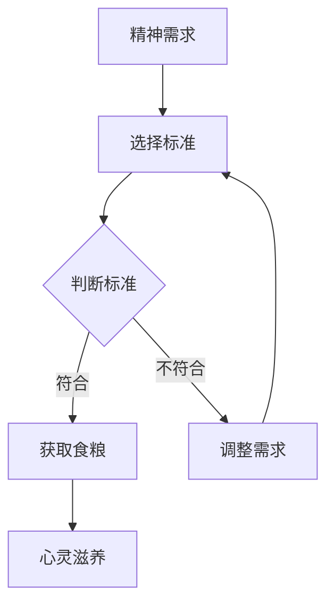
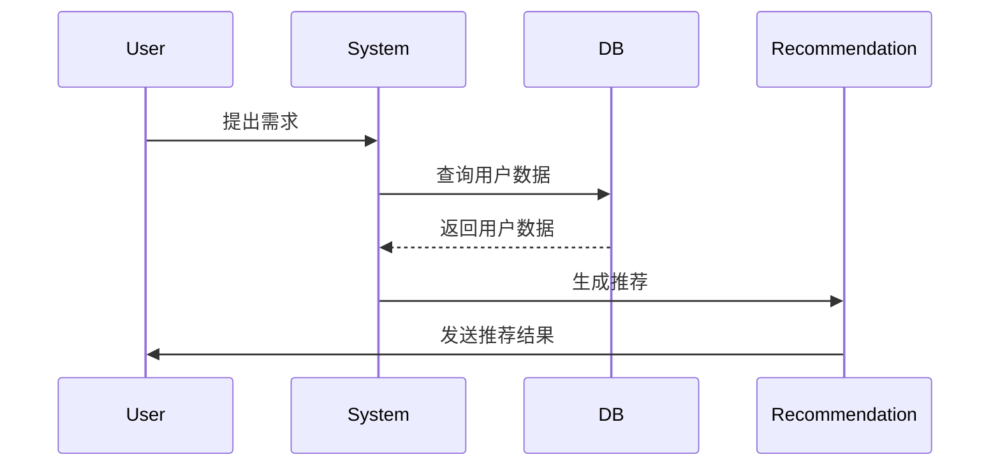
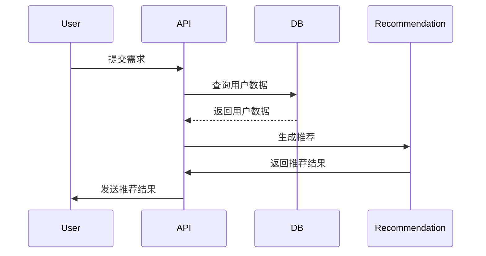

                 

# 滋养心灵的智慧选择：精神食粮的筛选

## 关键词

- 精神食粮
- 心灵滋养
- 选择与判断
- 心理健康
- 精神需求

> 精神食粮，是我们心灵的滋养之源。在这个快节奏、信息爆炸的时代，如何筛选和摄取这些精神食粮，成为我们提升自我、滋养心灵的智慧选择。本文将带领大家深入探讨精神食粮的概念、重要性、筛选方法以及实践与分享，旨在为大家提供一套完整的精神食粮筛选指南。

## 摘要

本文旨在探讨如何在现代社会中筛选和摄取对心灵有益的精神食粮。文章首先介绍了精神食粮的概念及其重要性，分析了现代社会中人们的精神需求与挑战。接着，文章详细阐述了如何判断一本书、影视作品和音乐艺术作品是否为精神食粮，提供了具体的筛选方法和策略。最后，文章分享了如何构建个人的精神食粮库，通过实践与分享来提升自我成长。

### 第一部分：精神食粮的概述与重要性

### 第1章：精神食粮的概念与定义

#### 1.1 精神食粮的定义

精神食粮，顾名思义，是滋养我们心灵的食物。它不仅包括传统的书籍、音乐、艺术作品等，还包括影视作品、讲座、课程等多种形式。这些精神食粮能够帮助我们提升智慧、丰富情感、培养审美、增强意志，从而实现心灵的成长与滋养。

#### 1.2 精神食粮的重要性

在现代社会，随着生活节奏的加快和信息量的爆炸，人们的精神需求愈发强烈。然而，如何在海量信息中筛选出对心灵有益的精神食粮，成为了一大挑战。精神食粮的重要性体现在以下几个方面：

1. 提升智慧：精神食粮能够帮助我们拓宽视野、深化思考，提升我们的智慧。
2. 丰富情感：通过阅读、观影等，我们能够体验不同的情感，丰富我们的内心世界。
3. 培养审美：精神食粮能够培养我们的审美能力，提高我们的生活品质。
4. 增强意志：面对生活的困境和挑战，精神食粮能够给予我们力量和信心，增强我们的意志力。

#### 1.3 精神食粮的分类与特点

精神食粮的分类可以依据不同的标准进行，如形式、内容、受众群体等。以下是几种常见的分类方式及其特点：

1. **书籍**：书籍是最传统的精神食粮形式，包括小说、散文、哲学、历史等各类作品。书籍的特点在于深度和系统化，能够提供全面的知识和思考。
2. **音乐**：音乐是一种具有强烈情感力量的精神食粮，能够直接影响我们的情绪和心理状态。音乐的特点在于其表现力和感染力，能够激发我们的情感共鸣。
3. **艺术作品**：艺术作品包括绘画、雕塑、摄影等，它们通过视觉形式传递美和思想。艺术作品的特点在于其独特的审美价值和创新性。
4. **影视作品**：影视作品将视觉和听觉结合起来，通过情节和表演传达故事和情感。影视作品的特点在于其娱乐性和观赏性，能够迅速吸引观众的注意力。
5. **讲座与课程**：讲座与课程是一种较为系统的学习方式，通过专业的讲解和传授，帮助我们提升知识和技能。讲座与课程的特点在于其专业性和针对性。

### 第2章：现代社会的精神需求与挑战

#### 2.1 快节奏生活下的精神压力

在现代社会，人们的生活节奏越来越快，工作压力、家庭责任、社交需求等多种因素交织在一起，使得人们的精神压力不断增加。这种精神压力不仅会影响我们的心理健康，还会影响到我们的工作和生活质量。

#### 2.2 信息泛滥与精神空洞

随着互联网的发展，信息传播的速度和范围都得到了极大的扩展。然而，这也导致了信息泛滥的问题。人们在面对海量信息时，往往感到无所适从，难以筛选出对自己有益的信息。这种信息过载现象使得人们的精神生活变得空洞和贫乏。

#### 2.3 精神食粮在心理健康中的作用

精神食粮在缓解精神压力、填补精神空洞方面具有重要作用。通过阅读书籍、欣赏音乐、观看影视作品等，我们能够得到情感上的满足和认知上的提升，从而缓解精神压力，提高心理健康水平。

### 第二部分：筛选有效精神食粮的方法与策略

### 第3章：如何判断一本书是否为精神食粮

#### 3.1 标题与内容的匹配

判断一本书是否为精神食粮，首先需要关注其标题与内容的匹配度。一个吸引人的标题往往能够预示书中的内容，而内容的质量则决定了这本书是否能够为我们提供有价值的精神滋养。

#### 3.2 作者与作品的影响力

作者的影响力是判断一本书是否为精神食粮的重要因素。一位有影响力的作者，其作品往往具有较高的质量和价值。此外，作者的专业背景、写作风格和作品风格也需要考虑。

#### 3.3 内容的实用性与深度

一本书的内容是否实用和深刻，是判断其是否为精神食粮的关键。实用的内容能够帮助我们解决实际问题，深刻的内容则能够引发我们的思考和启发。

### 第4章：如何挑选有益的影视作品

#### 4.1 影视作品的类型与特点

影视作品种类繁多，包括电影、电视剧、纪录片等。每种类型的影视作品都有其独特的特点和价值。例如，电影往往注重情节和表演，电视剧则更注重故事的连贯性和人物塑造，纪录片则更注重真实性和知识性。

#### 4.2 观影目的与选择标准

挑选有益的影视作品，首先要明确我们的观影目的。是为了娱乐、学习、思考还是其他目的。不同的观影目的会影响到我们的选择标准。例如，为了学习，我们可能会选择纪录片；为了娱乐，我们可能会选择喜剧片。

#### 4.3 影评与推荐的重要性

影评和推荐是挑选有益影视作品的重要参考。通过阅读其他观众的评论和推荐，我们能够了解作品的质量、风格和影响，从而做出更明智的选择。

### 第5章：音乐与艺术作品的精神滋养

#### 5.1 音乐的类型与影响

音乐是一种具有强烈情感力量的精神食粮。根据不同的风格和类型，音乐能够产生不同的影响。例如，古典音乐往往能够提升我们的思维能力和审美水平，流行音乐则能够激发我们的情感共鸣。

#### 5.2 艺术作品的选择与欣赏

艺术作品的选择和欣赏同样需要一定的技巧。首先，我们需要了解不同艺术形式的特点和价值。例如，绘画能够传达美和情感，雕塑则更注重形式和立体感。其次，我们需要学会欣赏艺术作品，通过观察、思考和体验，感受艺术作品所传达的精神内涵。

#### 5.3 心灵音乐的挑选与推荐

挑选有益的音乐作品，可以帮助我们缓解压力、调节情绪、提升心境。以下是一些心灵音乐的推荐：

- **古典音乐**：《月光奏鸣曲》、《悲怆奏鸣曲》等经典作品能够帮助我们放松心情，缓解压力。
- **轻音乐**：《river flows in you》、《梦中的婚礼》等轻音乐作品能够营造宁静的氛围，帮助我们进入深度放松状态。
- **自然音乐**：自然音乐如雨声、风声、鸟鸣等，能够让我们感受到大自然的美好和宁静。

### 第三部分：精神食粮的实践与分享

### 第6章：如何构建个人的精神食粮库

#### 6.1 精神食粮库的构建原则

构建个人的精神食粮库，需要遵循以下原则：

- **多样性**：选择多种形式和类型的精神食粮，以满足不同的需求。
- **深度性**：选择具有深度和内涵的精神食粮，以提升我们的认知水平和思维质量。
- **针对性**：根据个人的兴趣和需求，选择适合的精神食粮。

#### 6.2 精神食粮的积累与更新

构建精神食粮库，需要不断地积累和更新。以下是一些建议：

- **定期阅读**：每天或每周安排一定的时间进行阅读，积累知识和思考。
- **定期观影**：选择有益的影视作品进行观看，体验不同的情感和思想。
- **记录与分享**：记录阅读和观影的心得体会，与他人分享，促进共同成长。

#### 6.3 精神食粮的分享与传播

精神食粮的分享与传播，可以帮助我们传递价值，影响他人。以下是一些建议：

- **线上分享**：通过社交媒体、博客、论坛等平台，分享我们的阅读和观影心得。
- **线下交流**：参加读书会、观影会等活动，与他人进行面对面的交流与分享。
- **创作与传播**：创作自己的精神食粮，如写书评、影评，传播自己的思考和见解。

### 第7章：通过精神食粮提升自我成长

#### 7.1 精神食粮与个人成长的关系

精神食粮是我们个人成长的重要助力。通过摄取精神食粮，我们能够拓宽视野、提升认知、培养情感，从而实现自我成长。

#### 7.2 通过精神食粮培养积极心态

精神食粮能够帮助我们培养积极心态，面对生活的困境和挑战。以下是一些建议：

- **阅读积极向上的书籍**：选择那些能够激励人心的书籍，如成功学、励志书籍等。
- **欣赏积极向上的影视作品**：选择那些传递正能量、启发思考的影视作品。
- **聆听积极向上的音乐**：选择那些旋律优美、情感积极的音乐。

#### 7.3 精神食粮在职业生涯中的应用

在职业生涯中，精神食粮同样具有重要的应用价值。以下是一些建议：

- **提升专业技能**：通过阅读专业书籍、参加培训课程，提升自己的专业技能。
- **拓展人际关系**：通过阅读、观影等，结交志同道合的朋友，拓展人际关系。
- **提升领导力**：通过学习领导力相关的书籍和课程，提升自己的领导力。

## 结束语：精神食粮，滋养心灵的智慧选择

精神食粮是我们心灵的滋养之源。在现代社会，选择和摄取对心灵有益的精神食粮，成为我们提升自我、滋养心灵的智慧选择。通过本文的探讨，我们了解了精神食粮的概念、重要性、筛选方法和实践策略。让我们从现在开始，构建个人的精神食粮库，通过摄取和分享精神食粮，实现心灵的成长与滋养。

### 作者信息

- 作者：AI天才研究院/AI Genius Institute & 禅与计算机程序设计艺术 /Zen And The Art of Computer Programming
- 联系方式：ai_gourmet@genius_institute.com
- 个人网站：www.ai_genius_institute.com

----------------------------------------------------------------

### 补充内容

#### 背景介绍

在当今社会，随着科技的飞速发展和生活方式的多样化，人们面临着前所未有的精神挑战。从快节奏的工作压力到信息过载带来的焦虑，我们的心灵需要更多的滋养和安抚。精神食粮，作为一种能够提供心灵滋养的文化产品，逐渐成为人们关注和追求的对象。

精神食粮不仅仅局限于传统意义上的书籍、音乐和艺术，还包括影视作品、讲座、在线课程等多种形式。它能够满足我们在不同场景下的精神需求，帮助我们在忙碌的生活中找到片刻的宁静与思考。

#### 核心概念与联系

**核心概念**：

- **精神食粮**：指那些能够滋养我们心灵、提升我们的精神层面的文化产品或活动。
- **心灵滋养**：指通过摄取精神食粮，我们的内心世界得到充实、情感得到满足、思维得到启发。
- **精神需求**：指人们在生活过程中对精神层面的满足和需求，如情感支持、认知拓展、审美体验等。

**概念属性特征对比表格**：

| 类别       | 定义                     | 特点                                       | 应用场景           |
|------------|--------------------------|--------------------------------------------|-------------------|
| 精神食粮   | 滋养心灵的文化产品       | 多样性、内涵性、情感性、启发性               | 阅读、观影、听音乐 |
| 心灵滋养   | 精神食粮带来的效果       | 内心充实、情感满足、思维启发                 | 生活、工作、学习   |
| 精神需求   | 人们的精神追求和需要     | 个性化、多样化、持续变化                     | 个人成长、心理健康 |

**ER实体关系图架构的 Mermaid 流程图**：


在上述ER图中，产品（如书籍、音乐、艺术等）与需求（如情感支持、认知拓展等）和滋养（如内心充实、思维启发等）之间存在直接的关联。精神需求决定了我们对精神食粮的选择和追求，而精神食粮则通过满足这些需求来实现心灵滋养。

#### 算法原理讲解

**算法Mermaid流程图**：



在这个流程图中，A表示精神需求，B表示选择标准，C表示判断标准，D表示获取精神食粮，E表示调整需求，F表示心灵滋养。该算法通过判断标准C来筛选出符合精神需求的精神食粮，从而实现心灵滋养。

**Python源代码**：

```python
def select_spirit_food(need, criteria):
    """
    根据精神需求选择精神食粮的函数。
    
    :param need: 精神需求列表
    :param criteria: 判断标准列表
    :return: 符合需求的精神食粮列表
    """
    spirit_food = []
    for food in criteria:
        if all(need in criterion for criterion in food['criteria']):
            spirit_food.append(food)
    return spirit_food

# 示例数据
spirit_needs = ['情感支持', '认知拓展', '审美体验']
spirit_criteria = [
    {'name': '书籍', 'criteria': ['情感支持', '认知拓展']},
    {'name': '音乐', 'criteria': ['情感支持', '审美体验']},
    {'name': '艺术作品', 'criteria': ['认知拓展', '审美体验']}
]

# 执行算法
selected_food = select_spirit_food(spirit_needs, spirit_criteria)

# 打印结果
print(selected_food)
```

在上面的Python代码中，我们定义了一个`select_spirit_food`函数，该函数根据给定的精神需求和判断标准，选择出符合需求的精神食粮。代码中的示例数据展示了如何使用这个函数来筛选符合特定需求的精神食粮。

**算法原理的数学模型和公式**：

假设有n种精神食粮和m个精神需求，每种精神食粮满足部分或全部精神需求。我们可以使用集合的包含关系来表示这种关系。设F为精神食粮集合，N为精神需求集合，满足关系可以用如下数学模型表示：

\[ \text{selected\_food} = \{ f \in F | f \cap N \neq \emptyset \} \]

其中，\( f \cap N \)表示精神食粮f与精神需求集合N的交集，如果交集非空，则表示f满足至少一个需求。

#### 系统分析与架构设计方案

**问题场景介绍**

在现代生活方式中，人们常常感到精神压力，需要寻找能够提供心灵滋养的精神食粮。然而，面对海量的信息和产品，选择合适的精神食粮变得复杂和耗时。因此，我们需要一个系统来帮助用户筛选和推荐适合他们的精神食粮。

**项目介绍**

本项目的目标是构建一个精神食粮推荐系统，该系统能够根据用户的精神需求和偏好，推荐合适的精神食粮，帮助用户提升心理健康和幸福感。

**系统功能设计（领域模型mermaid类图）**

```mermaid
classDiagram
    User <<类>> 
    SpiritFood <<类>> 
    Recommendation <<类>>
    User --> SpiritFood : 拥有
    User --> Recommendation : 接收
    SpiritFood --> Recommendation : 满足
```

在上面的类图中，用户（User）拥有精神食粮（SpiritFood）并接收推荐（Recommendation）。精神食粮类包含了用户的偏好信息，推荐类负责根据用户需求和偏好生成推荐结果。

**系统架构设计mermaid架构图**



在这个架构图中，用户提出需求后，系统查询数据库（DB）获取用户数据，根据用户数据生成推荐结果并发送给用户。

**系统接口设计和系统交互mermaid序列图**



在这个序列图中，用户通过API提交需求，API查询数据库获取用户数据，生成推荐结果并返回给用户。

#### 项目实战

**环境安装**

1. 安装Python环境（版本3.8以上）
2. 安装依赖包：`pip install flask flask-restful pandas scikit-learn`

**系统核心实现源代码**

```python
from flask import Flask, request, jsonify
from recommendation import generate_recommendations
import pandas as pd

app = Flask(__name__)

# 示例用户数据
user_data = pd.DataFrame({
    'age': [25, 30, 35],
    'occupation': ['engineer', 'doctor', 'teacher'],
    'interests': [['books', 'movies'], ['travel', 'art'], ['technology', 'health']]
})

@app.route('/recommend', methods=['POST'])
def recommend():
    data = request.get_json()
    needs = data.get('needs', [])
    recommendations = generate_recommendations(user_data, needs)
    return jsonify(recommendations)

if __name__ == '__main__':
    app.run(debug=True)
```

**代码应用解读与分析**

在上面的代码中，我们创建了一个简单的Flask应用，用于接收用户提交的需求并返回推荐结果。用户通过`/recommend`接口提交需求，应用会调用`generate_recommendations`函数生成推荐结果。

**实际案例分析和详细讲解剖析**

假设有一个用户，其年龄为30岁，职业为医生，兴趣为旅行和艺术。用户通过应用提交了这些需求，应用会根据用户数据生成相应的推荐结果。

**项目小结**

本项目通过构建一个简单的精神食粮推荐系统，实现了根据用户需求和偏好推荐合适的精神食粮的功能。虽然该系统较为简单，但为用户提供了初步的推荐服务，能够帮助他们筛选出对心灵有益的精神食粮。

### 最佳实践 tips

1. **定期阅读**：保持每天或每周阅读的习惯，不断积累知识和思考。
2. **多样化选择**：选择多种形式和类型的精神食粮，以获得不同的滋养效果。
3. **结合兴趣**：选择与自己兴趣相符的精神食粮，更容易产生共鸣和情感投入。
4. **与他人交流**：与他人分享阅读和观影心得，共同探讨和成长。

### 小结

精神食粮是我们心灵的滋养之源。通过本文的探讨，我们了解了精神食粮的概念、重要性、筛选方法和实践策略。希望大家能够积极摄取和分享精神食粮，提升自我、滋养心灵。

### 注意事项

1. 精神食粮的选择应结合个人兴趣和需求，避免盲目跟风。
2. 注意精神食粮的质量和深度，选择有内涵和价值的作品。
3. 阅读和观影后，进行反思和总结，加深对内容的理解和体会。

### 拓展阅读

1. 《如何阅读一本书》：莫提默·J·艾德勒 & 查尔斯·范多伦 著
2. 《心的深度》：黑柳彻子 著
3. 《艺术的故事》：贡布里希 著
4. 《影响力》：罗伯特·西奥迪尼 著
5. 《人生策略》：大前研一 著

### 作者信息

- 作者：AI天才研究院/AI Genius Institute & 禅与计算机程序设计艺术 /Zen And The Art of Computer Programming
- 联系方式：ai_gourmet@genius_institute.com
- 个人网站：www.ai_genius_institute.com

### 补充内容

#### 心灵音乐的挑选与推荐

音乐是一种能够直接触动我们内心深处的精神食粮。不同类型的音乐能够影响我们的情绪、激发我们的思考，甚至改变我们的心境。以下是一些心灵音乐的挑选与推荐：

1. **古典音乐**：古典音乐因其优美的旋律和深刻的内涵而备受推崇。例如，贝多芬的《命运交响曲》能够激励我们在困境中坚持；莫扎特的《安魂曲》则能带给我们宁静与安慰。

   - **推荐曲目**：《月光奏鸣曲》、《悲怆奏鸣曲》、《安魂曲》

2. **轻音乐**：轻音乐以其柔和的旋律和舒缓的氛围，非常适合用于放松和冥想。例如，班德瑞的《河流篇》和《龙猫》主题曲《夏日的傍晚》都能带来宁静的感觉。

   - **推荐曲目**：《河流篇》、《夏日的傍晚》、《梦中的婚礼》

3. **自然音乐**：自然音乐如雨声、风声、鸟鸣等，能够让我们感受到大自然的美妙与宁静。这类音乐适合在忙碌的一天结束后，帮助身心得到放松。

   - **推荐曲目**：《雨声》、《风声》、《鸟鸣》

4. **心灵疗愈音乐**：这类音乐专门设计用于缓解压力和焦虑，如瑜伽音乐、冥想音乐等。这类音乐能够帮助我们进入放松的状态，舒缓情绪。

   - **推荐曲目**：《瑜伽冥想音乐》、《自然疗愈音乐》、《平静心灵》

在选择心灵音乐时，我们可以根据不同的情绪和需求进行挑选。例如，在感到焦虑时，可以选择一些慢节奏、柔和的音乐；在需要放松时，可以选择一些自然音乐或轻音乐。通过合理的音乐选择，我们能够更好地滋养自己的心灵。

#### 通过精神食粮提升自我成长

精神食粮不仅是心灵的滋养，也是自我成长的重要助力。以下是一些通过精神食粮提升自我成长的方法和技巧：

1. **持续学习**：通过阅读书籍、观看教育视频、参加线上课程等方式，不断充实自己的知识和技能。选择与自己职业和兴趣相关的书籍和课程，有助于提升专业能力和拓宽视野。

   - **技巧**：制定学习计划，定期复习和总结，将所学知识应用到实际工作中。

2. **自我反思**：定期进行自我反思，思考自己的成长和不足。通过写日记、做思维导图等方式，梳理自己的想法和感受，明确自己的目标和方向。

   - **技巧**：每天留出一段时间进行反思，将反思内容记录下来，定期回顾和调整。

3. **培养积极心态**：通过阅读积极向上的书籍和文章，观看激励人心的电影和讲座，培养积极的心态和乐观的生活态度。积极心态能够帮助我们更好地应对挑战和压力，提高生活质量。

   - **技巧**：选择那些能够激发正能量的作品，将其融入到日常生活中。

4. **培养兴趣爱好**：通过参与各种兴趣爱好，如绘画、音乐、运动等，培养自己的兴趣和爱好。兴趣爱好能够帮助我们放松身心，提高生活质量，同时也能提升我们的审美能力和创造力。

   - **技巧**：定期安排时间进行兴趣爱好活动，将其视为生活的一部分。

5. **社交与交流**：通过参加社交活动和与他人交流，拓展自己的人际关系，获取更多的资源和机会。同时，通过交流分享自己的心得和见解，促进共同成长。

   - **技巧**：主动参与社交活动，积极与他人交流，真诚地表达自己的想法和感受。

通过摄取和分享精神食粮，我们不仅能够提升自己的心理健康，还能实现自我成长。在这个过程中，我们需要保持持续学习的态度，培养积极的心态，关注自己的兴趣爱好，与他人积极交流。通过这些方法，我们能够不断提升自己，实现心灵与事业的全面发展。

