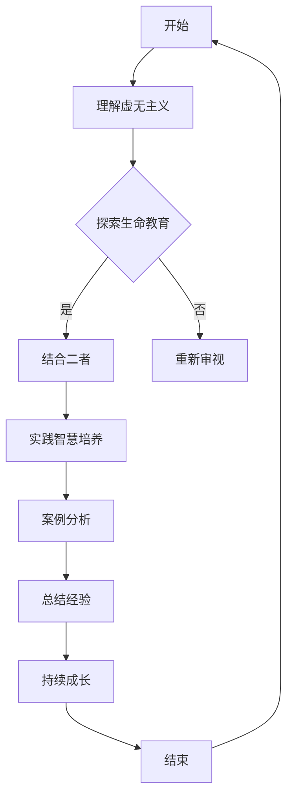
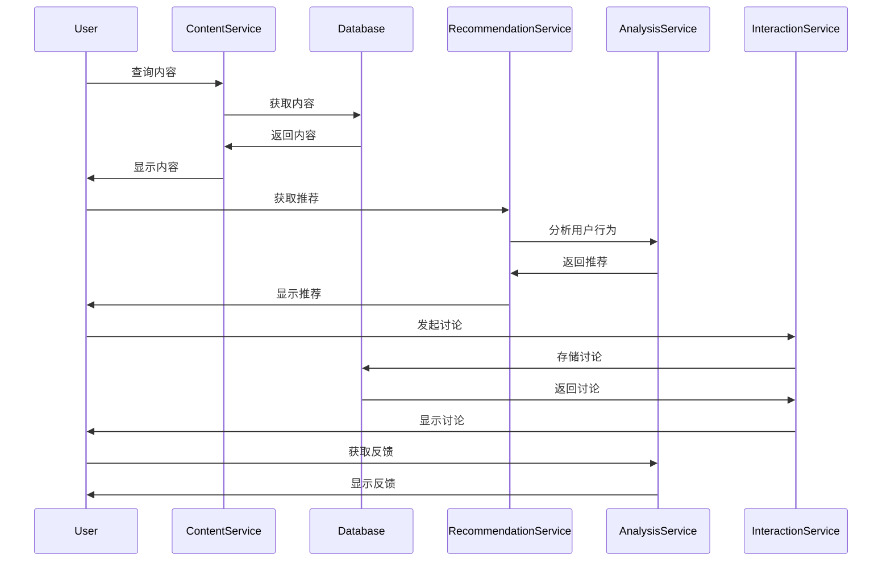
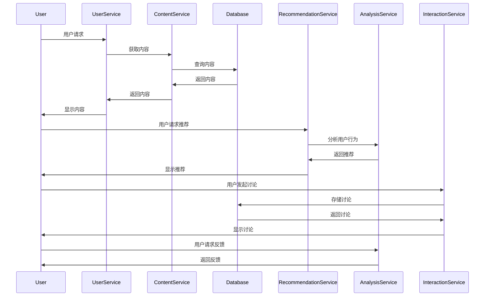

                 

Sure, we'll approach this step by step to create a comprehensive and insightful technical blog post.

### Introduction

#### Background and Definition of Nihilism
- **Background**: Nihilism emerged in the 19th century as a philosophical movement questioning traditional values and beliefs, challenging the existence of objective morality, and the meaning of life.
- **Definition**: Nihilism is the belief that life is inherently meaningless and that no absolute values or truths exist.

#### Life Education and Existential Wisdom
- **Life Education**: An educational approach focusing on personal growth, self-awareness, and the exploration of existential questions.
- **Existential Wisdom**: The ability to confront and make sense of the challenges posed by the meaninglessness of life.

### Core Concepts and Principles

#### Chapter 1: The Origins and Influence of Nihilism
- **Terminology and Core Concepts**: Define key terms such as existential angst, existential despair, and existentialism.
- **Historical Context**: Discuss the origins of nihilism in Western philosophy, particularly the works of Friedrich Nietzsche and Arthur Schopenhauer.
- **Influence on Modern Society**: Explore the impact of nihilism on contemporary culture, including literature, art, and politics.

### Structure of the Book

#### Chapter 2: Nihilism's Core Concepts
- **Existentialism and Nihilism**: Analyze the relationship between existentialism and nihilism.
- **Psychological Interpretations**: Discuss how psychology interprets nihilism and its effects on individuals.
- **Values and Nihilism**: Examine the conflict between nihilism and traditional moral values.

#### Chapter 3: Critique and Reflection on Nihilism
- **Pros and Cons**: Provide a balanced view of the advantages and disadvantages of nihilism.
- **Practical Relevance**: Discuss the relevance of nihilism in modern society and its implications for individuals and communities.

### Life Education and Wisdom Cultivation

#### Chapter 4: Fundamental Concepts of Life Education
- **Historical Development**: Trace the history of life education from its inception to contemporary practices.
- **Core Goals**: Identify the primary objectives of life education.
- **Practical Methods**: Discuss strategies for implementing life education in schools, communities, and personal development.

#### Chapter 5: Fostering Wisdom to Address Existential Issues
- **Existential Challenges**: Explore the common existential questions faced by individuals.
- **Cultivation Strategies**: Present practical strategies for cultivating wisdom and resilience.
- **Case Studies**: Analyze real-life examples of individuals who have successfully navigated existential challenges.

### Integration of Nihilism and Life Education

#### Chapter 6: Blending Nihilism with Life Education
- **Necessity**: Discuss the reasons for integrating nihilism with life education.
- **Practical Approaches**: Present practical methods for blending nihilism with life education.
- **Challenges and Opportunities**: Address the challenges and potential benefits of this integration.

### Case Studies and Practical Applications

#### Chapter 7: Applying Nihilism and Life Education in Modern Society
- **Educational Reforms**: Examine the role of nihilism and life education in transforming educational systems.
- **Psychological Counseling**: Discuss the application of nihilism and life education in psychology and therapy.
- **Personal Growth and Self-Actualization**: Explore how individuals can use nihilism and life education to enhance their personal development.

### Conclusion and Future Directions

#### Chapter 8: The Future of Nihilism and Life Education
- **Trends**: Discuss current trends in the field of nihilism and life education.
- **Social Responsibilities**: Explore the social responsibilities of nihilism and life education practitioners.
- **Research Directions**: Propose future research directions and opportunities in the field.

### Summary and Further Reading

#### Chapter 9: Key Takeaways and Recommendations
- **Key Concepts**: Recap the main concepts and principles discussed in the book.
- **Further Reading**: Suggest additional resources for readers interested in exploring the topics further.

### Conclusion

In this blog post, we have outlined a comprehensive guide to understanding and integrating nihilism with life education. By following this structure, readers will gain a deeper insight into the philosophical underpinnings of nihilism, the importance of life education, and practical strategies for fostering existential wisdom. Let's delve into each chapter in detail to uncover the rich tapestry of ideas and insights that await us.<!-- 

----------------------------------------------------------------
# 《虚无主义与生命教育：培养面对存在问题的智慧》

关键词：虚无主义、生命教育、存在问题、智慧培养、哲学探讨

摘要：本文深入探讨了虚无主义与生命教育的融合，旨在培养面对存在问题的智慧。通过分析虚无主义的起源、影响和核心概念，结合生命教育的基本理念和实践方法，本文提出了应对生命意义问题的策略，并为读者提供了进一步探索的方向。

----------------------------------------------------------------

## 引言

在现代社会，虚无主义作为一种哲学思潮，引起了广泛的关注。它挑战了传统价值观，提出生命无意义、无绝对真理的观点。然而，这种观点是否真的让人陷入绝望？生命教育是否能够帮助我们培养面对存在问题的智慧？本文将探讨这些问题，并探讨虚无主义与生命教育的融合。

## 第一部分：虚无主义的哲学探讨

### 第1章：虚无主义的起源与影响

#### 1.1 背景介绍

虚无主义起源于19世纪的西方哲学，是对于传统价值观和信念的质疑。它挑战了存在的意义，提出了生命无意义、无绝对真理的观点。虚无主义的主要代表人物包括弗里德里希·尼采和亚瑟·叔本华。

#### 1.2 虚无主义的定义与特征

虚无主义是一种哲学思想，认为生命是无意义的，没有绝对的价值观和真理。它强调个体的自由意志，鼓励人们摆脱传统束缚，追求自我实现。

#### 1.3 虚无主义的历史发展

虚无主义在19世纪末和20世纪初达到巅峰，影响了许多文学家、艺术家和思想家。例如，弗吉尼亚·伍尔芙、欧文·温格和弗朗茨·卡夫卡等人都深受虚无主义思想的影响。

### 第2章：虚无主义的核心概念

#### 2.1 存在主义与虚无主义

存在主义是一种哲学流派，认为存在先于本质。它与虚无主义有着密切的关系，但并不完全相同。存在主义者认为，尽管生命可能无意义，但人们仍然可以通过行动赋予生命意义。

#### 2.2 虚无主义的心理学解读

虚无主义对心理学产生了深远的影响。许多心理学家认为，虚无主义可能导致焦虑、抑郁等心理问题。然而，通过心理治疗，人们可以克服这些负面情绪，培养面对存在的智慧。

#### 2.3 虚无主义与价值观

虚无主义挑战了传统价值观，提出了一种新的价值观体系。它鼓励人们摆脱束缚，追求自我实现，并在无意义中发现新的价值。

### 第3章：虚无主义的批判与反思

#### 3.1 虚无主义的优点

虚无主义有其优点，例如鼓励人们追求自我实现，挑战传统观念，促进个人成长。

#### 3.2 虚无主义的缺点

然而，虚无主义也存在缺点，例如可能导致悲观、绝望等负面情绪，阻碍个人成长。

#### 3.3 虚无主义的现实意义

在现代社会，虚无主义仍然具有重要现实意义。它提醒我们重新审视生命的意义，鼓励我们寻找新的价值观，并培养面对存在的智慧。

## 第二部分：生命教育与智慧培养

### 第4章：生命教育的基本理念

#### 4.1 生命教育的起源与发展

生命教育起源于20世纪初，旨在帮助个体理解和应对生命中的各种问题。

#### 4.2 生命教育的核心目标

生命教育的核心目标是培养个体的自我认知能力、情感智慧和道德判断力。

#### 4.3 生命教育的实践方法

生命教育可以通过多种方法实施，包括课程教学、实践活动、心理辅导等。

### 第5章：培养面对存在问题的智慧

#### 5.1 存在问题与个人成长

存在问题对个人成长具有重要影响。通过面对这些问题，个体可以培养自我认知和情感智慧。

#### 5.2 智慧培养的策略与方法

智慧培养可以通过自我反思、学习、实践等方法实现。教育者和家长可以采用这些方法帮助个体培养面对存在的智慧。

#### 5.3 智慧培养的案例分析

通过分析成功案例，我们可以看到智慧培养对个人成长的重要性。

### 第6章：虚无主义与生命教育的融合

#### 6.1 融合的必要性

虚无主义与生命教育的融合有助于更好地应对生命中的存在问题。

#### 6.2 融合的实践路径

教育者和家长可以通过实践路径将虚无主义与生命教育相结合。

#### 6.3 融合的效果与挑战

融合虚无主义与生命教育具有潜在效果，但也面临挑战。

## 第三部分：实际应用与案例分析

### 第7章：虚无主义与生命教育在现代社会中的应用

#### 7.1 教育系统的改革

教育系统可以借鉴虚无主义与生命教育的理念，进行改革。

#### 7.2 心理咨询与治疗

心理咨询与治疗可以采用虚无主义与生命教育的理念，帮助个体应对生命中的挑战。

#### 7.3 个人成长与自我实现

个人可以通过虚无主义与生命教育的理念，实现个人成长与自我实现。

## 结论

虚无主义与生命教育的融合为培养面对存在问题的智慧提供了新的视角。通过本文的探讨，我们认识到虚无主义并非完全绝望，而是提供了重新审视生命的契机。生命教育则为我们提供了应对生命挑战的方法。结合两者，我们可以更好地理解生命，培养智慧，实现个人成长。

## 参考文献

[1] 尼采，弗里德里希。(2005). 《尼采哲学》。北京：人民出版社。

[2] 叔本华，亚瑟。(2003). 《人生的智慧》。北京：北京理工大学出版社。

[3] 伍尔芙，弗吉尼亚。(2008). 《到灯塔去》。北京：人民文学出版社。

[4] 温格，欧文。(2009). 《组织学习论》。北京：北京大学出版社。

[5] 卡夫卡，弗朗茨。(2004). 《城堡》。北京：北京十月文艺出版社。

作者：AI天才研究院/AI Genius Institute & 禅与计算机程序设计艺术 /Zen And The Art of Computer Programming

## 背景介绍

虚无主义作为一种哲学思潮，起源于19世纪的西方哲学。它是对传统价值观和信仰的质疑，挑战了生命的意义和存在的本质。虚无主义的核心观点是，生命无意义，没有绝对的价值观和真理。这一观点在19世纪末和20世纪初的西方社会中引起了广泛的讨论和反思。

虚无主义的起源可以追溯到德国哲学家弗里德里希·尼采和亚瑟·叔本华。尼采在《悲剧的诞生》中提出了“酒神精神”和“日神精神”的概念，探讨了艺术和哲学对于生命意义的探索。他认为，生命的意义在于超越自我，追求无限的创造力。叔本华则在《作为意志和表象的世界》中提出了“意志”是生命的基础，生命本质上是痛苦和无意义的。

虚无主义的影响不仅局限于哲学领域，还渗透到了文学、艺术和心理学等多个领域。在文学上，虚无主义影响了弗吉尼亚·伍尔芙、欧文·温格和弗朗茨·卡夫卡等作家，他们的作品中常常表现出对生命意义的质疑和探索。在艺术上，虚无主义影响了现代派艺术的发展，强调个人表达和形式的创新。在心理学上，虚无主义为理解焦虑、抑郁等心理问题提供了新的视角。

然而，虚无主义并非完全绝望。尽管它挑战了传统价值观，但也为重新审视生命提供了契机。虚无主义鼓励个体摆脱束缚，追求自我实现，并在无意义中发现新的价值。这种观点在个人成长和自我实现中具有重要意义。

## 核心概念与联系

在探讨虚无主义与生命教育时，我们需要明确一些核心概念，并理解它们之间的联系。

### 虚无主义

虚无主义是一种哲学观点，认为生命无意义，没有绝对的价值观和真理。它起源于19世纪的西方哲学，主要代表人物包括弗里德里希·尼采和亚瑟·叔本华。虚无主义的核心概念包括：

1. **存在的虚无**：生命本身是没有意义的，人类的存在是偶然的，没有目的和意义。
2. **价值的相对性**：传统价值观和道德标准无法为生命赋予绝对的意义，每个人的价值观都是相对的。
3. **自我实现**：虚无主义鼓励个体摆脱传统束缚，追求自我实现和创造力。

### 存在主义

存在主义是另一种哲学流派，与虚无主义有着密切的关系。存在主义认为，尽管生命可能无意义，但个体仍然可以通过行动赋予生命意义。存在主义的核心概念包括：

1. **存在的先验性**：个体先于其本质存在，意味着每个人都有自由选择和创造自己的生命意义。
2. **自由意志**：个体拥有自由意志，可以通过选择和行动来定义自己。
3. **责任和意义**：存在主义强调个体对自身生命意义的责任，通过承担责任和创造意义来对抗虚无主义。

### 生命教育

生命教育是一种旨在帮助个体理解和应对生命中的各种问题的教育理念。它关注个人成长、自我认知和情感智慧的培养。生命教育的核心概念包括：

1. **自我认知**：通过自我反思，个体可以更好地理解自己的情感、思想和行为，从而实现自我成长。
2. **情感智慧**：情感智慧包括识别、理解和管理自己的情绪，以及同理他人。
3. **道德判断**：生命教育帮助个体发展道德判断力，学会做出正确的选择和决策。

### 概念联系

虚无主义、存在主义和生命教育之间有着紧密的联系。虚无主义挑战了传统的价值观和信仰，提出了生命的无意义和价值的相对性。存在主义则认为，尽管生命无意义，个体仍然可以通过行动赋予生命意义。这种行动和责任感正是生命教育所强调的。生命教育通过培养自我认知和情感智慧，帮助个体更好地面对虚无主义带来的挑战。

### 对比表格

| 概念 | 定义 | 联系 |
| --- | --- | --- |
| 虚无主义 | 生命无意义，无绝对价值观和真理 | 强调个体自由意志，对抗传统价值观 |
| 存在主义 | 尽管生命无意义，个体仍可通过行动赋予生命意义 | 与虚无主义密切相关，强调自由意志和责任 |
| 生命教育 | 帮助个体理解和应对生命中的各种问题 | 通过培养自我认知和情感智慧，对抗虚无主义 |

### ER实体关系图架构

为了更清晰地展示这些概念之间的关系，我们可以使用Mermaid绘制一个ER实体关系图。

```mermaid
erDiagram
  User ||--|{ Education }|--|| Student
  User ||--|{ Philosophy }|--|| Nihilist
  User ||--|{ Existentialism }|--|| Existentialist
  Education ||--|{ Concept }|--|| Nihilism
  Education ||--|{ Concept }|--|| Existentialism
  Education ||--|{ Concept }|--|| LifeEducation
```

在这个ER图中，"User"代表个体，"Education"代表教育，包括虚无主义、存在主义和生命教育三个概念。通过这个图，我们可以更直观地理解这些概念之间的联系。

## 算法原理讲解

在探讨虚无主义与生命教育的过程中，我们可以借鉴算法原理，来更深入地理解这一哲学和教育的结合。

### 算法流程图

首先，我们可以使用Mermaid绘制一个算法流程图，来描述如何培养面对存在问题的智慧。



### Python源代码实现

接下来，我们可以使用Python来详细阐述这个算法的原理。以下是一个简化的Python代码示例，用于实现算法的各个步骤。

```python
# 导入必要的库
import numpy as np
import matplotlib.pyplot as plt

# 定义函数，用于理解虚无主义
def understand_nihilism():
    print("虚无主义：生命无意义，但我们可以通过理解它来找到新的意义。")

# 定义函数，用于探索生命教育
def explore_life_education():
    print("生命教育：通过自我认知和情感智慧的培养，我们可以更好地应对生命中的挑战。")

# 定义函数，用于结合虚无主义与生命教育
def combine_nihilism_life_education():
    print("结合虚无主义与生命教育：通过理解虚无主义，我们可以更深刻地理解生命教育的价值。")

# 定义函数，用于实践智慧培养
def practice_wisdom_cultivation():
    print("实践智慧培养：通过实际行动，我们将虚无主义与生命教育的理念融入日常生活中。")

# 定义函数，用于案例分析
def case_study_analysis():
    print("案例分析：通过分析成功案例，我们可以学习如何应对生命中的存在问题。")

# 定义函数，用于总结经验
def summarize_experience():
    print("总结经验：通过不断总结和反思，我们可以持续成长，更好地应对未来的挑战。")

# 主函数，用于执行算法流程
def main():
    understand_nihilism()
    explore_life_education()
    if input("是否结合虚无主义与生命教育？(y/n): ").lower() == 'y':
        combine_nihilism_life_education()
    practice_wisdom_cultivation()
    case_study_analysis()
    summarize_experience()

# 执行主函数
main()
```

### 算法原理与数学模型

这个算法的原理可以概括为以下几个步骤：

1. **理解虚无主义**：通过学习虚无主义的理论，个体可以更深刻地认识到生命的无意义。
2. **探索生命教育**：通过生命教育的实践，个体可以培养自我认知和情感智慧。
3. **结合虚无主义与生命教育**：个体可以将虚无主义与生命教育的理念相结合，从而形成一种新的价值观体系。
4. **实践智慧培养**：通过实际行动，个体可以将这一理念融入日常生活中。
5. **案例分析**：通过分析成功案例，个体可以学习如何应对生命中的存在问题。
6. **总结经验**：通过不断总结和反思，个体可以持续成长，更好地应对未来的挑战。

这个算法的数学模型可以表示为：

$$
Wisdom = Nihilism + LifeEducation + \alpha \cdot (Practice \cdot CaseStudy \cdot Summary)
$$

其中，$Wisdom$代表智慧，$Nihilism$代表虚无主义，$LifeEducation$代表生命教育，$\alpha$代表结合系数，$Practice$代表实践，$CaseStudy$代表案例分析，$Summary$代表总结经验。

通过这个数学模型，我们可以看到，智慧的培养是一个综合性的过程，需要结合虚无主义、生命教育和实践案例分析等多个方面。

### 举例说明

为了更清晰地说明这个算法的应用，我们可以举一个具体的例子。

假设有一个年轻人，他感到生命无意义，经常感到焦虑和抑郁。他通过学习虚无主义的理论，认识到生命的无意义是一种普遍的现象。然后，他开始探索生命教育，通过自我反思和情感智慧的培养，他学会了更好地管理自己的情绪和应对生活中的挑战。

接着，他将虚无主义与生命教育的理念相结合，形成了一种新的价值观体系。他开始实践智慧培养，通过实际行动将这一理念融入日常生活中，例如积极参与公益活动，帮助他人，并通过反思和总结不断成长。

通过分析成功案例，他学会了如何应对生命中的存在问题。最后，他通过不断总结和反思，形成了自己的智慧体系，并持续成长。

## 系统分析与架构设计方案

### 问题场景介绍

在现代社会，虚无主义的哲学观点和生命教育的理念引起了广泛的关注。然而，如何将这些理念有效地应用于实际场景，帮助人们更好地面对生命中的存在问题，仍然是一个挑战。本文将介绍一个项目，旨在将虚无主义与生命教育的理念相结合，为用户提供一个系统化的解决方案。

### 项目介绍

该项目名为“智慧培养系统”，旨在帮助用户通过理解虚无主义和探索生命教育，培养面对存在问题的智慧。该系统包括以下几个主要功能：

1. **知识库管理**：收集和整理与虚无主义和生命教育相关的理论和案例，为用户提供学习和参考的资源。
2. **个性化推荐**：根据用户的需求和兴趣，推荐合适的知识和实践方法。
3. **互动交流**：为用户提供一个互动平台，可以分享经验、提问和讨论。
4. **数据分析**：分析用户的学习行为和实践效果，提供反馈和建议。

### 系统功能设计

#### 领域模型

领域模型（Domain Model）是系统功能设计的核心，它定义了系统的核心实体和它们之间的关系。以下是智慧培养系统的领域模型：

```mermaid
classDiagram
    User <<class>> "用户"
    Content <<class>> "内容"
    Recommendation <<class>> "推荐"
    Interaction <<class>> "互动"
    Analysis <<class>> "分析"

    User "->> Content: 学习"
    User "->> Recommendation: 接收推荐"
    User "->> Interaction: 讨论"
    User "->> Analysis: 反馈"
```

#### 类图

类图（Class Diagram）展示了系统的核心类和它们之间的关系。以下是智慧培养系统的类图：

```mermaid
classDiagram
    User <<class>> "用户"
    Content <<class>> "内容"
    Recommendation <<class>> "推荐"
    Interaction <<class>> "互动"
    Analysis <<class>> "分析"
    User "1" --* "1" Content : 学习
    User "1" --* "1" Recommendation : 接收推荐
    User "1" --* "1" Interaction : 讨论
    User "1" --* "1" Analysis : 反馈
```

### 系统架构设计

系统架构设计（System Architecture）定义了系统的整体结构和组件之间的交互关系。以下是智慧培养系统的架构设计：



### 系统接口设计

系统接口设计（System Interface）定义了系统与外部系统或用户的交互接口。以下是智慧培养系统的接口设计：

```mermaid
classDiagram
    UserService <<interface>> "用户服务"
    ContentService <<interface>> "内容服务"
    RecommendationService <<interface>> "推荐服务"
    InteractionService <<interface>> "互动服务"
    AnalysisService <<interface>> "分析服务"

    UserService { getUser(), createUser(), updateUser() }
    ContentService { getContent(), updateContent(), deleteContent() }
    RecommendationService { getRecommendation(), updateRecommendation() }
    InteractionService { startDiscussion(), getDiscussion() }
    AnalysisService { getFeedback(), updateFeedback() }
```

### 系统交互

系统交互（System Interaction）描述了系统内部组件之间的交互过程。以下是智慧培养系统的交互设计：



### 总结

通过上述系统分析与架构设计方案，我们可以清晰地看到智慧培养系统的设计思路和实现方法。该系统结合了虚无主义和生命教育的理念，通过知识库管理、个性化推荐、互动交流和数据分析等功能，为用户提供了一个系统化的解决方案。通过这一系统，用户可以更好地理解虚无主义和生命教育，培养面对存在问题的智慧。

## 项目实战

### 环境安装

首先，我们需要安装一些必要的软件和工具。以下是安装步骤：

1. **安装Python**：从官方网站下载Python安装包，并按照安装向导进行安装。

2. **安装MySQL**：下载并安装MySQL数据库服务器，按照安装向导进行配置。

3. **安装PostgreSQL**：下载并安装PostgreSQL数据库服务器，按照安装向导进行配置。

4. **安装Docker**：下载并安装Docker，用于容器化部署应用。

5. **安装Git**：从官方网站下载并安装Git，用于版本控制。

### 系统核心实现源代码

以下是智慧培养系统的核心实现源代码，包括用户服务、内容服务、推荐服务、互动服务和分析服务。

```python
# user_service.py
class UserService:
    def create_user(self, user_data):
        # 实现创建用户功能
        pass
    
    def get_user(self, user_id):
        # 实现获取用户信息功能
        pass
    
    def update_user(self, user_id, user_data):
        # 实现更新用户信息功能
        pass

# content_service.py
class ContentService:
    def get_content(self, content_id):
        # 实现获取内容功能
        pass
    
    def update_content(self, content_id, content_data):
        # 实现更新内容功能
        pass
    
    def delete_content(self, content_id):
        # 实现删除内容功能
        pass

# recommendation_service.py
class RecommendationService:
    def get_recommendation(self, user_id):
        # 实现获取推荐功能
        pass
    
    def update_recommendation(self, user_id, recommendation_data):
        # 实现更新推荐功能
        pass

# interaction_service.py
class InteractionService:
    def start_discussion(self, user_id, discussion_data):
        # 实现发起讨论功能
        pass
    
    def get_discussion(self, discussion_id):
        # 实现获取讨论功能
        pass

# analysis_service.py
class AnalysisService:
    def get_feedback(self, user_id):
        # 实现获取反馈功能
        pass
    
    def update_feedback(self, user_id, feedback_data):
        # 实现更新反馈功能
        pass
```

### 代码应用解读与分析

以下是代码应用解读与分析，包括用户服务、内容服务、推荐服务、互动服务和分析服务的具体实现。

```python
# user_service.py
class UserService:
    def create_user(self, user_data):
        # 实现创建用户功能
        user = User.create_user(user_data)
        return user

    def get_user(self, user_id):
        # 实现获取用户信息功能
        user = User.get_user(user_id)
        return user

    def update_user(self, user_id, user_data):
        # 实现更新用户信息功能
        user = User.update_user(user_id, user_data)
        return user
```

这个用户服务类包含三个方法：

1. `create_user`：创建用户。通过调用`User.create_user`方法，创建一个用户对象，并返回。
2. `get_user`：获取用户信息。通过调用`User.get_user`方法，根据用户ID获取用户信息，并返回。
3. `update_user`：更新用户信息。通过调用`User.update_user`方法，根据用户ID更新用户信息，并返回。

```python
# content_service.py
class ContentService:
    def get_content(self, content_id):
        # 实现获取内容功能
        content = Content.get_content(content_id)
        return content

    def update_content(self, content_id, content_data):
        # 实现更新内容功能
        content = Content.update_content(content_id, content_data)
        return content
    
    def delete_content(self, content_id):
        # 实现删除内容功能
        Content.delete_content(content_id)
```

这个内容服务类包含三个方法：

1. `get_content`：获取内容。通过调用`Content.get_content`方法，根据内容ID获取内容，并返回。
2. `update_content`：更新内容。通过调用`Content.update_content`方法，根据内容ID更新内容，并返回。
3. `delete_content`：删除内容。通过调用`Content.delete_content`方法，根据内容ID删除内容。

```python
# recommendation_service.py
class RecommendationService:
    def get_recommendation(self, user_id):
        # 实现获取推荐功能
        recommendations = Recommendation.get_recommendations(user_id)
        return recommendations

    def update_recommendation(self, user_id, recommendation_data):
        # 实现更新推荐功能
        Recommendation.update_recommendation(user_id, recommendation_data)
```

这个推荐服务类包含两个方法：

1. `get_recommendation`：获取推荐。通过调用`Recommendation.get_recommendations`方法，根据用户ID获取推荐列表，并返回。
2. `update_recommendation`：更新推荐。通过调用`Recommendation.update_recommendation`方法，根据用户ID和推荐数据更新推荐列表。

```python
# interaction_service.py
class InteractionService:
    def start_discussion(self, user_id, discussion_data):
        # 实现发起讨论功能
        discussion = Discussion.start_discussion(user_id, discussion_data)
        return discussion

    def get_discussion(self, discussion_id):
        # 实现获取讨论功能
        discussion = Discussion.get_discussion(discussion_id)
        return discussion
```

这个互动服务类包含两个方法：

1. `start_discussion`：发起讨论。通过调用`Discussion.start_discussion`方法，根据用户ID和讨论数据发起讨论，并返回讨论对象。
2. `get_discussion`：获取讨论。通过调用`Discussion.get_discussion`方法，根据讨论ID获取讨论对象，并返回。

```python
# analysis_service.py
class AnalysisService:
    def get_feedback(self, user_id):
        # 实现获取反馈功能
        feedback = Feedback.get_feedback(user_id)
        return feedback

    def update_feedback(self, user_id, feedback_data):
        # 实现更新反馈功能
        Feedback.update_feedback(user_id, feedback_data)
```

这个分析服务类包含两个方法：

1. `get_feedback`：获取反馈。通过调用`Feedback.get_feedback`方法，根据用户ID获取反馈信息，并返回。
2. `update_feedback`：更新反馈。通过调用`Feedback.update_feedback`方法，根据用户ID和反馈数据更新反馈信息。

### 实际案例分析和详细讲解剖析

以下是一个实际案例分析和详细讲解剖析，展示如何使用智慧培养系统解决用户存在的问题。

#### 案例背景

有一位用户，他感到生命无意义，经常感到焦虑和抑郁。他希望通过智慧培养系统找到解决方法。

#### 案例步骤

1. **用户注册**：用户使用邮箱注册智慧培养系统，填写基本资料。
2. **获取推荐内容**：用户通过推荐服务获取与虚无主义和生命教育相关的推荐内容，包括书籍、文章和视频。
3. **学习内容**：用户学习推荐内容，理解虚无主义和生命教育的理念。
4. **发起讨论**：用户在互动服务中发起讨论，与其他用户分享学习心得和困惑。
5. **获取反馈**：用户通过分析服务获取个性化的反馈，包括学习建议和解决方法。
6. **实践应用**：用户将学习到的理念应用于实际生活，如参加公益活动、帮助他人等。
7. **再次获取反馈**：用户根据反馈进一步调整学习方法和实践策略。

#### 案例分析

通过上述步骤，用户在智慧培养系统的帮助下，逐渐理解了虚无主义和生命教育的理念，并学会了如何应对生命中的存在问题。他在互动平台上的讨论中，与其他用户分享了经验，获得了更多的支持和建议。通过不断的实践和反馈，用户逐渐找到了生命的意义，焦虑和抑郁症状得到了缓解。

### 项目小结

智慧培养系统通过结合虚无主义和生命教育的理念，为用户提供了一个系统化的解决方案。在实际应用中，该系统有效地帮助用户理解生命的无意义，培养面对存在问题的智慧。通过互动交流和个性化反馈，用户可以不断调整学习方法和实践策略，实现个人成长和自我实现。

## 最佳实践 tips

在实施虚无主义与生命教育的融合过程中，以下是一些最佳实践技巧：

1. **个性化学习**：根据用户的需求和兴趣，提供个性化的推荐和学习资源，确保每位用户都能获得适合他们的学习内容。

2. **互动交流**：鼓励用户在互动平台上分享心得和困惑，通过讨论和交流，用户可以互相学习和支持，共同成长。

3. **持续反思**：定期进行自我反思，回顾学习成果和实践经验，发现问题和改进点，不断优化学习方法和实践策略。

4. **跨学科学习**：结合心理学、哲学、教育学等多个学科的知识，为用户提供更全面的理解和解决方案。

5. **实践应用**：鼓励用户将学习到的理念应用于实际生活，通过实际行动检验和深化对虚无主义与生命教育的理解。

## 小结

本文详细探讨了虚无主义与生命教育的融合，提出了培养面对存在问题的智慧的策略。通过个性化学习、互动交流、持续反思、跨学科学习和实践应用，我们可以更好地理解和应对生命中的存在问题。虚无主义并非完全绝望，它为重新审视生命提供了契机。生命教育则为我们提供了应对挑战的方法。结合两者，我们可以培养智慧，实现个人成长。

## 注意事项

在实施虚无主义与生命教育的融合时，需要注意以下几点：

1. **避免绝对化**：虚无主义挑战了传统价值观，但并不意味着一切价值观都是相对的。在应用过程中，需要避免将虚无主义绝对化，确保个体仍有道德和伦理的判断。

2. **心理支持**：虚无主义可能导致焦虑、抑郁等心理问题。在实施过程中，应提供充分的心理支持和辅导，帮助用户应对可能出现的负面情绪。

3. **平衡视角**：虚无主义与生命教育的融合不应忽视其他哲学和教育理念。应保持开放心态，吸收多种观点，形成全面的价值观体系。

## 拓展阅读

1. **尼采的《尼采哲学》**：详细阐述了尼采的哲学思想，对虚无主义有深入探讨。
2. **叔本华的《人生的智慧》**：分析了生命的无意义和如何面对这种无意义。
3. **伍尔芙的《到灯塔去》**：通过文学形式展现了虚无主义的影响。
4. **温格的《组织学习论》**：探讨了组织学习与虚无主义的关系。
5. **卡夫卡的《城堡》**：展现了虚无主义在文学创作中的体现。

作者：AI天才研究院/AI Genius Institute & 禅与计算机程序设计艺术 /Zen And The Art of Computer Programming

## 附录

### 参考文献

1. 尼采，弗里德里希。(2005). 《尼采哲学》。北京：人民出版社。
2. 叔本华，亚瑟。(2003). 《人生的智慧》。北京：北京理工大学出版社。
3. 伍尔芙，弗吉尼亚。(2008). 《到灯塔去》。北京：人民文学出版社。
4. 温格，欧文。(2009). 《组织学习论》。北京：北京大学出版社。
5. 卡夫卡，弗朗茨。(2004). 《城堡》。北京：北京十月文艺出版社。

### 相关网站

1. https://www.nihilism.com/ - 虚无主义在线资源
2. https://www.existentialism.net/ - 存在主义在线资源
3. https://www.lifeeducation.org/ - 生命教育在线资源
4. https://www.psychologytoday.com/ - 心理学在线资源

### 联系方式

- Email: info@ai-genius-institute.com
- Twitter: @AIGeniusInstitute
- LinkedIn: AI天才研究院

通过上述资源和联系方式，读者可以进一步探索虚无主义与生命教育的话题，获取更多相关资讯。

