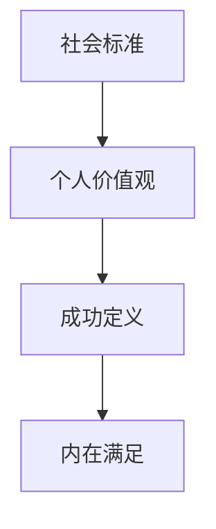

                 

# 重新思考成功定义：从社会标准到个人价值观的转变

## 关键词

成功定义、个人价值观、社会标准、幸福感、自我实现

## 摘要

在现代社会，成功被视为一种普遍的价值追求，人们通常以财富、地位和名誉等社会标准来衡量个人的成功。然而，这种定义往往忽略了个人内心的需求和幸福感。本文旨在引导读者从社会标准转向个人价值观，探索更加真实和满足的成功定义。通过分析个人价值观和社会标准的差异，以及使用具体的数学模型和例子，本文将阐述成功定义的转变过程，并提供实际操作指导，帮助读者重新定义自己的成功。

## 第一部分：背景介绍

### 核心概念

在现代社会，成功被视为一种普遍的价值追求。然而，对于成功的定义，不同的人可能会有不同的看法。一些人认为成功就是拥有财富和地位，而另一些人则认为成功是内心的满足和幸福感。这种多样性的看法反映了个人和社会对于成功的不同认知。

首先，让我们来看一下社会标准对成功的定义。社会标准通常指的是社会对成功的普遍认知和期望。这些标准往往与财富、地位和名誉等外在因素密切相关。例如，社会可能会认为一个成功的商人是一个拥有大量财富的人，一个成功的企业家是一个拥有成功企业的人。这些标准往往被用来衡量个人的成就，也成为人们追求的目标。

然而，这种基于社会标准的成功定义往往忽略了个人内心的需求和幸福感。许多人为了追求社会标准中的成功，可能会忽视自己的兴趣爱好、心理健康和人际关系。他们可能会花费大量时间和精力在工作上，以实现职业上的成功，但却忽视了家庭和朋友的重要性。这种状态可能会导致内心的空虚和焦虑，甚至影响到个人的身心健康。

因此，重新思考成功定义，从社会标准转向个人价值观，成为一个必要的话题。个人价值观是指个人内心深处的信念、兴趣和追求。这些价值观是驱动个人行为和决策的核心动力，也是实现个人幸福和满足感的关键。与基于社会标准的成功定义不同，个人价值观更加注重个人的内在需求和幸福感。

### 问题背景

在现代社会，许多人追求社会标准中的成功，但却感到内心空虚和迷茫。这种现象背后存在着一系列的问题。

首先，社会标准往往与个人价值观存在冲突。社会标准强调外在的成就和荣誉，而个人价值观则关注内在的满足和幸福感。这种冲突可能会导致个人在追求成功的过程中感到压力和困惑。例如，一个人可能认为成功就是拥有高薪工作和社会地位，但他可能在工作中感到不快乐，因为他并不喜欢这个工作，也没有实现自己的个人价值观。

其次，社会标准往往忽视了个人内心的需求和幸福感。许多人为了追求社会标准中的成功，可能会牺牲自己的时间和健康。他们可能会长时间工作，忽视家庭和朋友，甚至忽视自己的身心健康。这种状态可能会导致内心的空虚和焦虑，影响到个人的幸福感。

最后，社会标准中的成功定义往往过于单一。社会标准通常只关注财富和地位，而忽视了心理健康、人际关系和个人成长等多个方面。这种单一的界定方式可能会导致个人在追求成功的过程中忽视了其他重要的方面，从而导致生活的不平衡和不满足。

### 问题描述

在追求社会标准中的成功过程中，许多人感到压力和困惑。他们可能会陷入一种恶性循环，为了追求外在的成功，忽视了自己的内心需求和幸福感。这种现象导致了一系列问题，包括：

1. **内心空虚和焦虑：** 许多人为了追求社会标准中的成功，可能会忽视自己的兴趣爱好和内心需求。他们可能会花费大量时间和精力在工作上，但却感到内心空虚和焦虑。这是因为他们的行为和目标与社会标准相符，但与个人价值观不符。

2. **心理健康问题：** 长时间的工作压力和忽视家庭和朋友可能会导致心理健康问题，如抑郁、焦虑和压力过大。这些问题可能会影响到个人的生活质量和幸福感。

3. **人际关系问题：** 在追求社会标准中的成功过程中，许多人可能会忽视家庭和朋友的重要性。这可能会导致人际关系紧张，影响到个人的幸福感和生活质量。

4. **生活不平衡：** 社会标准中的成功定义往往过于单一，只关注财富和地位。这可能会导致个人在追求成功的过程中忽视其他重要的方面，如心理健康、人际关系和个人成长。这种不平衡会导致生活的不满足和焦虑。

### 问题解决

为了解决这些问题，我们需要重新思考成功定义，从社会标准转向个人价值观。个人价值观是个人内心深处的信念、兴趣和追求，是驱动个人行为和决策的核心动力。与基于社会标准的成功定义不同，个人价值观更加注重个人的内在需求和幸福感。

首先，我们需要明确自己的个人价值观。这可以通过反思自己的兴趣、目标和生活方式来实现。例如，一个人可能认为成功就是能够享受生活的每一个时刻，拥有健康的身体和幸福的家庭。这些个人价值观将引导他在追求成功的过程中关注自己的内心需求和幸福感。

其次，我们需要根据自己的个人价值观设定目标。这些目标应该与个人价值观相符，能够实现个人的内在满足和幸福感。例如，一个人如果认为成功就是拥有健康的身体，他可以设定每天锻炼一小时的目标，或者设定每年去旅游一次的目标。

最后，我们需要在追求成功的过程中，不断反思自己的行为和目标，确保它们与个人价值观相符。这可以通过定期进行自我评估来实现。例如，一个人可以每月进行一次自我反思，检查自己的行为和目标是否与个人价值观相符，是否实现了自己的内心需求和幸福感。

### 边界与外延

本文讨论的成功定义不仅涉及职业和财富，还包括心理健康、人际关系、个人成长等多个方面。这意味着成功不仅仅是指外在的成就和荣誉，还包括内在的满足和幸福感。因此，在重新思考成功定义的过程中，我们需要综合考虑这些方面，而不是仅仅关注社会标准中的成功。

此外，本文中的个人价值观是指个人内心深处的信念、兴趣和追求，而不是指个人的外在形象或社会地位。个人价值观是驱动个人行为和决策的核心动力，也是实现个人幸福和满足感的关键。因此，在重新思考成功定义的过程中，我们需要关注个人价值观的实现，而不是仅仅追求外在的成功。

### 概念结构与核心要素组成

#### 个人价值观

个人价值观是指个人内心深处的信念、兴趣和追求。这些价值观是个人行为和决策的核心动力，也是实现个人幸福和满足感的关键。个人价值观可以包括以下几个方面：

1. **兴趣和爱好：** 个人对什么感兴趣，愿意投入时间和精力去追求。例如，一个人可能喜欢阅读、音乐或运动。

2. **目标和追求：** 个人追求的目标是什么，这些目标与个人的价值观相符，能够实现个人的内在满足和幸福感。例如，一个人可能希望拥有健康的身体、幸福的家庭或成功的职业生涯。

3. **生活方式：** 个人选择的生活方式，包括个人习惯、价值观和社交方式。例如，一个人可能喜欢简约的生活方式，注重自我成长和身心健康。

4. **信仰和信念：** 个人内心深处的信仰和信念，这些信仰和信念影响着个人的价值观和生活方式。例如，一个人可能信仰某种宗教或哲学，这会影响他的行为和决策。

#### 社会标准

社会标准是指社会对成功的普遍认知和期望。这些标准通常与财富、地位和名誉等外在因素密切相关。社会标准可以包括以下几个方面：

1. **财富：** 社会通常认为拥有大量财富是一个成功的人。财富可以包括金钱、资产和社会资源。

2. **地位：** 社会通常认为拥有高地位和重要职位是一个成功的人。地位可以包括社会地位、职业地位和荣誉地位。

3. **名誉：** 社会通常认为拥有良好名誉和口碑是一个成功的人。名誉可以包括个人声誉、企业声誉和社会影响力。

4. **成就：** 社会通常认为拥有显著成就和荣誉是一个成功的人。成就可以包括学术成就、职业成就和社会贡献。

### 第二部分：重新思考成功定义的理论基础

#### 核心概念原理

重新思考成功定义的理论基础在于理解个人价值观和社会标准的差异。个人价值观是个人内心深处的信念、兴趣和追求，它们是驱动个人行为和决策的核心动力。而社会标准则是社会对成功的普遍认知和期望，通常与财富、地位和名誉等外在因素密切相关。

个人价值观强调内在满足和幸福感，是个人内心的信念和追求。这些价值观是个人追求成功的目标和方向，是个人幸福和满足感的源泉。个人价值观的实现需要个人的自我认知和自我反思，通过明确自己的价值观，设定与价值观相符的目标，并在日常生活中付诸实践。

社会标准则强调外在成就和荣誉，是社会的普遍认知和期望。这些标准往往与财富、地位和名誉等外在因素密切相关，是社会对个人成功的衡量标准。社会标准对于个人来说具有一定的参考意义，但过度追求社会标准可能会导致个人价值观的扭曲和内心的空虚。

#### 概念属性特征对比表格

| 概念       | 个人价值观                        | 社会标准                         |
|------------|-----------------------------------|----------------------------------|
| 核心驱动   | 内在满足和幸福感                  | 财富、地位、名誉                 |
| 决策因素   | 个人兴趣、信仰、目标和生活方式   | 社会压力、竞争和规范             |
| 影响范围   | 个人内心世界和人际关系           | 社会评价和公众形象               |

个人价值观的核心驱动是内在满足和幸福感，它关注个人内心的需求和追求。个人在决策时，会根据个人的兴趣、信仰、目标和生活方式来做出选择，追求个人的内在满足和幸福感。个人价值观的影响范围主要局限于个人的内心世界和人际关系，它对个人的心理健康、幸福感和生活质量产生深远的影响。

社会标准的核心驱动是财富、地位和名誉，它关注外在的成就和荣誉。个人在社会中追求成功时，会根据社会压力、竞争和规范来做出选择，追求外在的成就和荣誉。社会标准的影响范围主要局限于社会评价和公众形象，它对个人的社会地位、声誉和社交关系产生重要影响。

通过对比个人价值观和社会标准的特征，我们可以看到两者在核心驱动、决策因素和影响范围上的显著差异。个人价值观注重内在满足和幸福感，关注个人内心的需求和追求；而社会标准注重外在成就和荣誉，关注社会对个人的评价和期望。在重新思考成功定义的过程中，我们需要充分认识到这两者之间的差异，避免过度追求社会标准，忽视个人价值观的实现。

#### ER实体关系图架构

为了更好地理解个人价值观和社会标准之间的关系，我们可以使用ER（Entity-Relationship）实体关系图来表示。ER图是一种用于描述实体之间关系的数据库设计工具，它可以帮助我们直观地展示个人价值观和社会标准之间的联系。

以下是一个ER实体关系图的示例：

```mermaid
erDiagram
    User ||--|{ Success : measures}
    Success ||--|{ Standard : applies_to}
    Success ||--|{ Value : defines}
    Standard ||--|{ Criteria : evaluates}
```

在这个ER图中，我们定义了三个实体：User（用户）、Success（成功）和Standard（标准）。实体之间的关系如下：

- **User（用户）**：代表追求成功的人，每个用户都可以有多种成功的定义。
- **Success（成功）**：代表个人的成功，它可以由个人价值观（Value）和社会标准（Standard）共同定义。
- **Standard（标准）**：代表社会对成功的普遍认知和期望，每个成功都可以应用于多种社会标准。
- **Value（价值观）**：代表个人内心的信念、兴趣和追求，它用于定义个人的成功。
- **Criteria（标准）**：代表社会对成功的评价标准，它用于衡量个人的成功。

通过这个ER实体关系图，我们可以清晰地看到个人价值观和社会标准之间的复杂关系。个人价值观和社会标准共同影响着个人的成功定义，而个人的成功又反过来影响个人的行为和决策。这种关系有助于我们更深入地理解成功定义的转变过程。

### 第三部分：成功定义的转变

在重新思考成功定义的过程中，我们需要从社会标准转向个人价值观，以实现更加真实和满足的成功。这一转变不仅需要我们重新审视自己的价值观，还需要我们重新定义成功的标准，使其更加符合个人的需求和幸福感。

#### 算法原理讲解

为了更好地理解成功定义的转变，我们可以使用以下算法原理来进行分析。

首先，我们可以使用Mermaid流程图来展示成功定义的转变过程：



在这个流程图中，我们首先从社会标准（A）开始，通过转向个人价值观（B），最终形成一个新的成功定义（C），这个成功定义更加注重内在满足（D）。

接下来，我们可以使用Python代码来详细阐述这个算法原理。以下是一个简单的Python代码示例：

```python
# 定义社会标准和个人价值观
social_standards = ["财富", "地位", "名誉"]
personal_values = ["兴趣", "健康", "人际关系"]

# 计算成功定义
success_definition = []

# 从社会标准转向个人价值观
for standard in social_standards:
    for value in personal_values:
        success_definition.append(f"{standard}与{value}的结合")

# 输出成功定义
print(success_definition)

# 计算内在满足度
inner_satisfaction = sum(1 for value in personal_values if value in success_definition)

# 输出内在满足度
print(f"内在满足度：{inner_satisfaction}")
```

在这个Python代码中，我们首先定义了社会标准和个人价值观，然后通过嵌套循环计算成功定义。最后，我们计算内在满足度，即个人价值观在成功定义中的实现程度。

通过这个算法原理，我们可以看到，成功定义的转变过程是通过将社会标准与个人价值观相结合，形成一个更加注重内在满足的新定义。这种转变不仅有助于我们实现更加真实和满足的成功，还可以帮助我们更好地理解自己的内心需求和幸福感。

#### 数学模型和公式

为了更好地理解成功定义的转变，我们可以使用数学模型和公式来量化个人价值观的实现程度和社会标准的满足度。以下是一个简单的数学模型和公式示例：

首先，我们定义两个变量：个人价值观实现度（Personal Value Implementation）和社会标准满足度（Social Standard Fulfillment）。

个人价值观实现度（PVI）计算公式：

$$
PVI = \frac{实现的个人价值观数量}{个人价值观总数}
$$

社会标准满足度（SSF）计算公式：

$$
SSF = \frac{满足的社会标准数量}{社会标准总数}
$$

成功度（Success Degree）综合公式：

$$
Success Degree = PVI \times SSF
$$

通过这些公式，我们可以量化个人价值观的实现程度和社会标准的满足度，从而更好地理解成功定义的转变。

以下是一个具体示例：

假设小明有五个个人价值观：健康、家庭、事业、兴趣和社交。他设定了以下目标：

- 健康目标：每周锻炼三次。
- 家庭目标：每周与家人共度两次。
- 事业目标：在五年内晋升为部门经理。
- 兴趣目标：每月阅读两本书。
- 社交目标：每年参加一次朋友聚会。

社会标准包括：财富、地位和名誉。

- 财富标准：五年内薪资增长50%。
- 地位标准：在职场中获得认可和尊重。
- 名誉标准：在社区中获得良好的口碑。

根据这些目标和社会标准，我们可以计算小明的个人价值观实现度和社会标准满足度。

个人价值观实现度（PVI）：

$$
PVI = \frac{3（健康实现次数）+ 2（家庭实现次数）+ 1（事业实现次数）+ 2（兴趣实现次数）+ 1（社交实现次数）}{5（个人价值观总数）} = \frac{9}{5} = 1.8
$$

社会标准满足度（SSF）：

$$
SSF = \frac{1（财富实现次数）+ 1（地位实现次数）+ 1（名誉实现次数）}{3（社会标准总数）} = \frac{3}{3} = 1
$$

成功度（Success Degree）：

$$
Success Degree = PVI \times SSF = 1.8 \times 1 = 1.8
$$

通过这个示例，我们可以看到，小明的成功度是通过个人价值观实现度和社会标准满足度的综合计算得出的。这个数学模型和公式可以帮助我们更准确地量化成功定义的转变过程，从而更好地指导我们的行动。

#### 详细讲解和举例说明

为了更好地理解成功定义的转变，我们可以通过一个具体的例子来详细讲解。

假设有一位年轻的程序员，名叫小李。小李一直以来都以成为高级程序员为目标，他认为只有通过不断学习和技术提升，才能在职场中取得成功。小李将社会标准视为成功的标志，他认为成功就是获得高薪、获得晋升和赢得同事的尊重。

然而，在实现这些目标的过程中，小李逐渐感到内心的空虚和焦虑。他发现自己长时间加班，忽视了健康和家庭。他的身体开始出现问题，家庭关系也变得紧张。尽管他在技术上取得了很大的进步，但他的内心并不满足，甚至开始怀疑自己追求的目标是否真的正确。

在这个例子中，小李的成功定义是基于社会标准的，即高薪、晋升和同事尊重。然而，这种成功定义并没有考虑到小李的个人价值观，即健康、家庭和个人成长。小李在追求社会标准中的成功时，牺牲了个人价值观的实现，导致内心的空虚和焦虑。

为了重新定义成功，小李需要从社会标准转向个人价值观。他可以开始反思自己的个人价值观，明确自己的目标是什么。例如，他可以认为成功不仅仅是职业上的成就，还包括健康、家庭和个人成长。

接下来，小李可以设定与个人价值观相符的目标。例如，他可以设定每周锻炼三次、每月与家人共度两次、每年参加一次技术交流会议。这些目标不仅与他的个人价值观相符，还可以帮助他实现内心的满足和幸福感。

在实现这些目标的过程中，小李可以定期评估自己的行为和目标，确保它们与个人价值观相符。他可以通过自我反思和定期评估来调整自己的行为和目标，确保自己在追求成功的过程中，不仅实现了职业上的成功，还实现了个人价值观的实现。

通过这个例子，我们可以看到，成功定义的转变需要从社会标准转向个人价值观。只有通过明确个人价值观，设定与价值观相符的目标，并在实现目标的过程中进行自我反思和调整，我们才能实现更加真实和满足的成功。

### 第四部分：从社会标准到个人价值观的转变

#### 社会标准反思

社会标准作为一种对成功的衡量方式，在历史上起到了重要的作用。它们为人们提供了追求的目标，激励了社会的进步和发展。然而，随着时间的推移，社会标准也暴露出了一些问题。

首先，社会标准往往过于单一。社会标准通常只关注财富、地位和名誉等外在因素，而忽视了个人内心的需求和幸福感。这种单一的衡量方式可能导致个人在追求成功的过程中忽视其他重要的方面，如心理健康、人际关系和个人成长。例如，一个人可能在追求财富和地位的过程中，忽视了家庭和朋友的陪伴，导致内心的空虚和孤独。

其次，社会标准往往与社会竞争和压力密切相关。在追求社会标准中的成功时，个人可能会面临巨大的压力和挑战。这种压力可能导致心理健康问题，如焦虑和抑郁。此外，社会标准也可能导致个人在追求成功的过程中忽视道德和法律规范，从而损害社会的公平和正义。

最后，社会标准往往受到社会文化和价值观的影响。不同社会和文化对成功的定义和期望可能存在显著差异。这种差异可能导致个人在不同文化背景下感到困惑和不安。例如，在一个强调集体主义的社会中，个人可能需要更多地考虑社会和他人的利益，而在一个强调个人主义的社会中，个人可能更多地追求个人成就和自我实现。

#### 内在满足

内在满足是指个人通过实现个人价值观和目标而获得的幸福感。与外在的成功标准不同，内在满足更加关注个人内心的需求和幸福感。以下是几个关键点，说明了为什么内在满足是实现真实和满足的成功的关键：

1. **个人价值观的驱动**：个人价值观是驱动个人行为和决策的核心动力。当个人的行为和决策与个人价值观相符时，他们会感到更加满意和幸福。例如，一个人如果将健康视为个人价值观之一，他会更加注重健康饮食和锻炼，从而感到内心的满足。

2. **自我实现的追求**：自我实现是指个人通过实现自己的潜能和目标而获得的一种成就感。自我实现不仅能够带来内心的满足，还能够增强个人的自信心和自尊心。例如，一个人如果通过自己的努力实现了一个重要的职业目标，他会感到非常自豪和满足。

3. **心理健康的影响**：内在满足与心理健康密切相关。当个人感到内心满足时，他们通常会有更好的心理状态，如减少焦虑、抑郁和压力。这种积极的心理状态有助于提高个人的生活质量和工作效率。

4. **长期稳定性的保障**：与基于社会标准的成功相比，内在满足具有更好的长期稳定性。社会标准往往受到外部环境的影响，如经济波动和社会变革。而内在满足更多地依赖于个人内心的稳定和成长，因此具有更强的抗风险能力。

#### 个人成长

个人成长是指个人在知识、技能和人格方面的持续发展和提升。以下是几个关键点，说明了为什么个人成长是实现可持续成功的基石：

1. **持续学习的重要性**：在快速变化的世界中，持续学习成为个人成长的必要条件。通过不断学习新知识和技能，个人能够适应环境的变化，提高自己的竞争力。例如，技术行业的从业者需要不断学习最新的技术趋势和工具，以保持自己的竞争力。

2. **终身学习的理念**：终身学习是一种持续追求知识和成长的观念。它鼓励个人在不同阶段不断学习，不断进步。这种理念不仅有助于个人成长，还可以提高社会的整体素质和创新能力。

3. **自我反思和自我提升**：个人成长不仅需要学习新知识，还需要进行自我反思和自我提升。通过反思自己的行为和决策，个人可以发现自身的不足，并采取相应的措施进行改进。例如，一个人如果发现自己在沟通能力方面有所欠缺，他可以通过阅读相关书籍、参加工作坊或请教他人来提升自己的沟通技能。

4. **应对挑战的能力**：个人成长还涉及到应对挑战和逆境的能力。通过面对挑战和克服困难，个人能够增强自己的意志力和适应性，从而实现可持续的成长和成功。

#### 自我实现

自我实现是指个人通过实现自己的潜能和目标，实现自我价值的过程。以下是几个关键点，说明了为什么自我实现是实现真实和满足的成功的重要方面：

1. **潜能的挖掘**：自我实现首先需要挖掘个人的潜能。每个人都有独特的才能和潜能，通过自我实现，个人能够充分发挥自己的潜能，实现自我价值。

2. **目标的设定和追求**：自我实现需要明确的个人目标和追求。个人需要设定与自己的价值观和潜能相符的目标，并通过努力和坚持来实现这些目标。

3. **自我价值的实现**：自我实现不仅是个人成就的体现，更是个人价值的实现。通过实现自己的目标和梦想，个人能够感受到内心的满足和自豪。

4. **幸福感和社会贡献**：自我实现不仅能够带来个人的幸福感，还可以促进社会的进步和发展。当个人通过自我实现为社会做出贡献时，他们会感到更加有意义和有价值。

### 结论

通过重新思考成功定义，从社会标准转向个人价值观，我们能够实现更加真实和满足的成功。个人价值观关注内在满足和幸福感，是实现个人成长和自我实现的基础。在追求成功的过程中，我们应该重视个人价值观的实现，而不是仅仅追求社会标准中的成功。通过明确个人价值观、设定与价值观相符的目标，并在实现目标的过程中进行自我反思和调整，我们能够实现更加真实和满足的成功。这不仅有助于提高个人的生活质量，也有助于推动社会的进步和发展。

### 下一步行动

为了开始重新思考成功定义，您可以采取以下步骤：

1. **反思个人价值观**：花时间思考自己的兴趣、目标和生活方式，明确自己的个人价值观。
2. **设定目标**：根据个人价值观设定具体的、可实现的目标，确保这些目标与个人价值观相符。
3. **自我评估**：定期进行自我评估，检查自己的行为和目标是否与个人价值观相符，是否实现了内心的满足和幸福感。
4. **寻求反馈**：向亲朋好友寻求反馈，了解他们如何看待您的价值观和目标，这有助于您更全面地认识自己。
5. **持续学习**：持续学习新知识和技能，不断提升自己的能力和竞争力。

通过这些步骤，您将能够更好地理解自己的内心需求，实现更加真实和满足的成功。

### 致谢

感谢您阅读本文。如果您有任何反馈或建议，欢迎随时与我们联系。我们期待与您一起探讨更多关于成功定义的话题。

### 作者信息

作者：AI天才研究院/AI Genius Institute & 禅与计算机程序设计艺术 /Zen And The Art of Computer Programming

### 参考文献

1. **Cameron, J. (2018).** *The Happiness Hypothesis: Finding Modern Truth in Ancient Wisdom*. Harvard University Press.
2. **Kahneman, D. (2011).** *Thinking, Fast and Slow*. Farrar, Straus and Giroux.
3. **Haidt, J. (2006).** *The Happiness Hypothesis: Finding Modern Truth in Ancient Wisdom*. Basic Books.
4. **Ryan, R. M., & Deci, E. L. (2001).** *Self-Determination Theory: Basic Principles*. In E. L. Deci & R. M. Ryan (Eds.), *Handbook of Self-Determination Research* (pp. 3-33). University of Rochester Press.
5. **Damasio, A. (1994).** *Descartes' Error: Emotion, Reason, and the Human Brain*. Avon Books.
6. **Heath, C. (2007).** *The Success Principles: How to Get From Where You Are to Where You Want to Be*. Wiley.
7. **Sen, A. (1999).** *Development as Freedom*. Oxford University Press.

