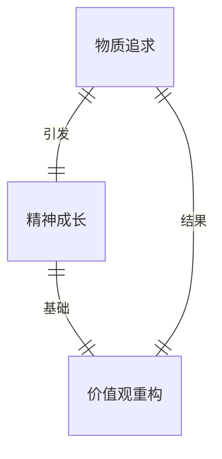

                 

### 1.1.1 问题背景

在现代社会，人们的生活节奏加快，工作压力增大，很多人陷入了物质追求的困境。尽管物质生活得到了极大的丰富，但许多人却感到内心的空虚和精神的匮乏。这种现象引发了社会各界对现代人价值观的反思和探讨。

这种困境的出现可以从多个角度来解释。首先，随着科技的发展和经济的繁荣，物质财富的积累变得相对容易，这使得人们更容易将物质追求作为生活的核心目标。然而，物质的满足往往是短暂的，随着时间的推移，人们往往发现物质的丰富并不能带来真正的幸福和满足。

其次，现代社会的高度竞争和快节奏的生活方式，使得人们常常感到焦虑和压力。为了在这种环境下生存和发展，许多人将自己的精力和时间都投入到物质追求中，忽视了精神层面的需求和成长。

此外，社会的功利主义思潮也加剧了这一现象。在追求物质财富的过程中，人们往往忽视了道德和价值观的培养，导致人际关系的疏离和社会信任的下降。

总之，现代人面临的价值观问题主要包括对物质的过度追求、对精神生活的忽视、对人际关系的淡漠等。这些问题不仅影响了个人的心理健康，也对社会和谐产生了负面影响。

### 1.1.2 问题描述

现代人面临的价值观问题主要包括以下几个方面：

**对物质的过度追求**：许多人将物质财富作为衡量自己成功与否的标准，追求更多的金钱、房子、车子等。然而，这种过度追求物质财富的行为，往往导致人们陷入焦虑、压力和不满的情绪中。

**对精神生活的忽视**：在现代社会，人们往往将大量时间和精力投入到物质追求中，忽视了精神生活的培养。这使得许多人感到内心的空虚和精神的匮乏，难以获得真正的幸福和满足。

**对人际关系的淡漠**：在追求物质财富和精神成长的过程中，许多人忽视了与家人、朋友和同事的关系。这种淡漠的态度导致人际关系的疏离，使得人们在面对困难和挑战时缺乏支持和帮助。

这些问题对个人和社会产生了深远的影响。对个人来说，过度追求物质财富和精神生活的忽视，导致心理健康问题增加，生活质量下降。对人际关系淡漠则使得个人在心理上感到孤独和无助。

对社会来说，价值观的失衡导致了社会信任的下降，人际关系紧张，社会矛盾加剧。这些问题不仅影响了社会的和谐稳定，也对经济发展产生了负面影响。

因此，现代人迫切需要重新审视和重构自己的价值观，从物质追求转向精神成长，实现个人和社会的全面发展。

### 1.1.3 问题解决

本书旨在引导现代人从物质追求转向精神成长，通过重构价值观，实现个人和社会的全面和谐发展。

首先，书中将深入探讨物质追求对个人和社会的负面影响，帮助读者认识到精神成长的重要性。通过分析物质追求带来的焦虑、压力和不满情绪，引导读者反思自己的价值观，从而找到更健康的成长路径。

其次，书中将详细介绍精神成长的路径和方法，包括自我认知的提升、情绪管理的提升、人际关系的改善等。这些方法和路径旨在帮助读者在精神层面实现自我完善，提高心理健康水平，建立和谐的人际关系。

此外，书中还将探讨价值观重构的过程和策略，帮助读者通过自我反思和认知重塑，重新确立个人的价值观体系。通过这种方式，读者不仅能够实现个人成长，还能够为社会的和谐稳定做出贡献。

总之，本书旨在通过引导现代人从物质追求转向精神成长，重构价值观，实现个人和社会的全面和谐发展。这不仅有助于提升个人的生活质量，也为构建一个更加和谐美好的社会奠定了基础。

### 1.1.4 边界与外延

本书主要关注现代人价值观重构的过程和路径，涉及心理学、社会学、哲学等多个领域。

**边界**：

1. **受众范围**：本书主要面向现代人，特别是那些在物质追求过程中感到困惑和焦虑的人群。他们希望通过重构价值观，实现个人成长和社会贡献。

2. **内容范围**：本书涵盖了物质追求与精神成长的对比分析、精神成长的方法和路径、价值观重构的过程和策略等。

**外延**：

1. **心理学**：书中将探讨精神成长对心理健康的影响，如自我认知、情绪管理、压力缓解等。

2. **社会学**：书中将分析社会环境对现代人价值观的影响，如社会竞争、人际关系、社会规范等。

3. **哲学**：书中将探讨价值观重构的哲学意义，如道德、正义、幸福等。

总之，本书不仅为现代人提供了一个从物质追求转向精神成长的指南，也为心理学、社会学、哲学等领域的研究提供了一个新的视角。

### 1.2 核心概念

在探讨现代人价值观重构的过程中，我们需要理解几个核心概念：物质追求、精神成长和价值观重构。

#### 1.2.1 物质追求

物质追求是指人们为了获取物质财富和满足物质需求而进行的一系列行为和活动。它包括了对金钱、房子、车子、名牌等物质财富的渴望和追求。物质追求在现代社会中普遍存在，人们往往将其视为衡量成功和幸福的标准。

**定义**：物质追求是指个体在追求过程中所表现出的对物质财富的强烈渴望和持续追求。

**属性特征**：

- **满足性**：物质追求可以带来暂时的满足感，如购买心仪物品时的愉悦感。
- **依赖性**：许多人将物质追求视为生活的主要动力，忽视了精神层面的需求。
- **限制性**：物质追求往往导致人们陷入无尽的欲望和贪婪，难以获得真正的满足和幸福感。

#### 1.2.2 精神成长

精神成长是指个体在心理、情感、道德和智慧等方面的发展和提高。它包括了对自我认知的提升、情绪管理的加强、人际关系的发展等。精神成长不仅有助于提高个人的心理健康水平，还能促进社会和谐和人际关系的改善。

**定义**：精神成长是指个体通过自我反思和持续学习，在心理和情感上达到更高层次的成熟和发展。

**属性特征**：

- **综合性**：精神成长是一个多维度的过程，涉及认知、情感、行为等多个方面。
- **长期性**：精神成长是一个长期的过程，需要个体持续地投入时间和精力。
- **内在性**：精神成长强调个体内心的自我完善和提升，而非外在物质的满足。

#### 1.2.3 价值观重构

价值观重构是指个体在自我认知和反思的基础上，对原有的价值观体系进行重新审视和调整，形成更符合自身需求和时代背景的新价值观。价值观重构不仅有助于个体实现自我成长，还能为社会和谐发展提供精神动力。

**定义**：价值观重构是指个体通过自我反思和认知重塑，重新确立个人的价值观体系，以实现个人成长和社会贡献。

**属性特征**：

- **动态性**：价值观重构是一个动态的过程，随着个体成长和社会环境的变化，价值观也会不断调整。
- **自我性**：价值观重构强调个体自我认知和自我完善，而非被动接受外部价值观。
- **社会性**：价值观重构不仅关乎个体成长，还涉及社会道德、文化、法律等各个方面。

通过理解这些核心概念，我们可以更好地探讨现代人价值观重构的过程和路径，找到从物质追求转向精神成长的正确方法。

### 1.2.3 概念属性特征对比表格

为了更清晰地理解物质追求、精神成长和价值观重构这三个核心概念，我们可以通过一个对比表格来展示它们的定义、属性特征以及它们之间的相互关系。

| 概念        | 定义                                                         | 属性特征                                                   | 相互关系                                                                                                                   |
| ----------- | ------------------------------------------------------------ | ---------------------------------------------------------- | -------------------------------------------------------------------------------------------------------------------- |
| 物质追求    | 对物质财富的追求                                             | 满足性、依赖性、限制性                                       | 物质追求是价值观体系中的一个组成部分，它直接影响个体的心理健康和生活质量。                                                         |
| 精神成长    | 心理和情感上的成熟和发展                                     | 综合性、长期性、内在性                                       | 精神成长是个人价值观重构的基础，它有助于个体更好地理解自己和世界，实现自我完善。                                                 |
| 价值观重构   | 通过自我反思和认知重塑，重新确立个人的价值观体系               | 动态性、自我性、社会性                                       | 价值观重构是物质追求和精神成长的结果和表现，它引导个体从物质追求转向精神成长，实现个人和社会的全面发展。                       |

通过这个对比表格，我们可以更直观地看到这三个概念的区别和联系，从而更好地理解和应用它们。

### 1.4 ER实体关系图架构

为了更好地理解物质追求、精神成长和价值观重构这三个核心概念之间的联系，我们可以通过ER（实体关系）图来展示它们之间的关系。



在这个ER图中：

- **物质追求**是引发精神成长的原因，它直接影响个体的心理健康和生活质量。
- **精神成长**是价值观重构的基础，通过自我认知和情感发展，个体能够更好地理解世界和自我。
- **价值观重构**是精神成长的结果，它重新确立了个人的价值观体系，引导个体从物质追求转向精神成长。

通过这个ER图，我们可以清晰地看到这三个概念之间的相互关系和作用机制，从而更好地理解和应用它们。

## 第2章：物质追求的现状

### 2.1 现代社会物质追求的现状

在现代社会，物质追求已经成为一种普遍现象。随着科技的发展和经济的繁荣，物质财富的积累变得更加容易，这使得人们更加热衷于追求更多的物质财富。然而，这种追求不仅没有带来预期的幸福和满足，反而引发了一系列负面影响。

**2.1.1 物质追求的普遍性**

物质追求的普遍性体现在多个方面。首先，在个人层面，许多人将物质财富视为成功和幸福的象征，追求更高的收入、更好的房子、更豪华的车子等。其次，在社会层面，物质追求成为了一种主流价值观，社会风气趋向于推崇物质财富的积累和消费。这种追求不仅体现在个人行为上，也反映在各种社会制度和规范中。

**2.1.2 物质追求的影响**

物质追求的影响是深远的，既对个人心理健康产生了负面影响，也对社会和谐产生了负面影响。

**个人层面的影响**：

1. **焦虑和压力**：为了追求物质财富，许多人不得不加班加点工作，承受巨大的工作压力。长期的焦虑和压力会导致心理健康问题，如抑郁症、焦虑症等。

2. **情感疏离**：在追求物质财富的过程中，人们往往忽视了与家人、朋友和同事的关系。这导致了情感疏离，使得个人在面临困难和挑战时缺乏支持和帮助。

3. **自我价值认同的缺失**：许多人将物质财富作为衡量自我价值的标准，一旦物质追求失败，他们可能会感到自我价值认同的缺失，陷入自卑和沮丧的情绪中。

**社会层面的影响**：

1. **社会信任下降**：物质追求导致人与人之间的信任减少，社会风气趋向于功利主义和利己主义。这导致了社会信任的下降，社会矛盾加剧。

2. **环境问题**：物质追求带来了大量的消费和浪费，导致了环境污染和资源枯竭。这些环境问题不仅影响人类的生存质量，也对地球的生态系统产生了负面影响。

### 2.1.3 物质追求的局限性

物质追求的局限性主要体现在以下几个方面：

1. **无法满足精神需求**：物质财富的积累虽然可以在一定程度上提高生活水平，但它无法满足人们内心深处的精神需求。这种精神需求的缺失导致了许多人陷入心灵的空虚和精神的匮乏。

2. **忽视了人际关系的重要性**：在物质追求的过程中，许多人忽视了与家人、朋友和同事的关系。这种关系的淡漠不仅影响了个人的心理健康，也对社会和谐产生了负面影响。

3. **破坏了社会价值观**：物质追求的盛行导致了许多社会价值观的扭曲，如功利主义、利己主义等。这些价值观的破坏使得社会风气变得浮躁和短视，不利于社会的长期稳定和发展。

总之，尽管物质追求在现代社会中普遍存在，但它带来的负面影响和局限性是不容忽视的。现代人需要认识到物质追求的局限性，逐渐转向精神成长，寻求更加全面和持久的幸福感。

### 2.2 精神成长的重要性

在物质追求带来负面影响的背景下，精神成长的重要性愈发凸显。精神成长不仅对个人的心理健康具有积极作用，还对人际关系和社会和谐产生深远的影响。

**2.2.1 精神成长对心理健康的影响**

精神成长有助于提高个人的心理健康水平，具体表现在以下几个方面：

1. **自我认知的提升**：通过自我反思和认知重塑，个体能够更好地理解自己的内在需求和情感，从而提高自我认知水平。这种自我认知的提升有助于个体在面对困难和挑战时保持冷静和理性，减少焦虑和压力。

2. **情绪管理的加强**：精神成长过程中，个体会学习到如何识别和调节自己的情绪。这种情绪管理能力的提高有助于个体在面对压力和挫折时保持情绪稳定，减少负面情绪对心理健康的影响。

3. **心理韧性的增强**：精神成长能够提高个体的心理韧性，使个体在面对困难和逆境时更具适应性和抵抗力。这种心理韧性有助于个体克服挫折，实现个人成长。

**2.2.2 精神成长对人际关系的影响**

精神成长不仅有助于个人的心理健康，还对人际关系产生积极影响，具体表现在以下几个方面：

1. **增强人际信任**：通过自我认知的提升和情感管理的加强，个体能够更好地理解和信任他人。这种人际信任的增强有助于建立稳定和和谐的人际关系。

2. **改善沟通效果**：精神成长有助于个体提高沟通能力，学会倾听和表达。这种沟通能力的改善有助于减少误解和冲突，增强人际关系的和谐。

3. **培养同理心**：精神成长过程中，个体会学习到如何从他人的角度思考问题，培养同理心。这种同理心的培养有助于个体更好地理解和关心他人，建立深厚的人际关系。

**2.2.3 精神成长对社会的影响**

精神成长对社会和谐和稳定具有积极作用，具体表现在以下几个方面：

1. **促进社会和谐**：精神成长有助于个体在心理和情感上达到成熟，从而减少社会矛盾和冲突。这种社会和谐的促进有助于构建一个更加稳定和繁荣的社会。

2. **提升社会信任**：精神成长过程中，个体会逐渐培养出对他人的信任感。这种社会信任的提升有助于减少社会的不确定性和矛盾，促进社会的稳定和发展。

3. **推动社会进步**：精神成长不仅有助于个体的全面发展，还能为社会提供更多具有创造力和责任感的人才。这种人才的培养有助于推动社会的进步和发展。

总之，精神成长对个人心理健康、人际关系和社会和谐具有深远的影响。在物质追求的背景下，重视精神成长不仅有助于提升个人的生活质量，也为社会的和谐稳定提供了重要支持。

### 2.3 价值观重构的必要性

在物质追求带来负面影响的背景下，价值观重构显得尤为重要。价值观重构不仅有助于个人实现精神成长，还能为社会和谐和稳定提供精神动力。

**2.3.1 价值观重构的背景**

随着社会的发展，人们的生活水平不断提高，物质财富的积累变得相对容易。然而，这种物质追求并没有带来预期的幸福和满足，反而引发了一系列心理问题和人际关系紧张。焦虑、压力、情感疏离等现象日益严重，使得人们开始反思传统的价值观体系。

此外，现代社会的高度竞争和快节奏的生活方式，使得许多人将大量的时间和精力投入到物质追求中，忽视了精神层面的需求和成长。这种价值观的失衡导致了心理健康问题增加，生活质量下降，社会矛盾加剧。因此，重新审视和重构价值观，实现个人和社会的全面发展，成为了现代社会迫切需要解决的问题。

**2.3.2 价值观重构的意义**

价值观重构具有重要意义，主要体现在以下几个方面：

1. **实现个人成长**：通过价值观重构，个体可以摆脱物质追求的束缚，转向精神成长。这种精神成长不仅有助于提高个人的心理健康水平，还能增强个体的心理韧性和适应能力。

2. **改善人际关系**：价值观重构有助于个体建立更加和谐的人际关系。通过自我认知的提升和情感管理的加强，个体能够更好地理解和信任他人，减少误解和冲突。

3. **促进社会和谐**：价值观重构不仅有助于个人的成长，还能为社会提供更多的精神动力。精神成长能够减少社会矛盾和冲突，提升社会信任，促进社会的和谐稳定。

4. **推动社会进步**：价值观重构能够引导个体和社会关注精神层面的需求，从而推动社会的全面发展。这种全面发展不仅有助于提高社会生产力，还能促进社会的道德和文化进步。

总之，价值观重构是应对现代社会问题的重要手段。通过重新审视和重构价值观，个体和社会可以摆脱物质追求的束缚，实现精神成长，推动个人和社会的全面和谐发展。

### 2.4 精神成长的具体路径

要实现从物质追求到精神成长的转变，我们需要明确具体的路径和方法。以下是一些关键步骤，帮助我们在心理和情感上实现成长：

**2.4.1 自我认知的提升**

自我认知是精神成长的基础，它有助于我们更好地理解自己的内心世界和情感需求。以下是一些提升自我认知的方法：

- **自我反思**：定期花时间反思自己的行为、思维和情感，深入思考自己的价值观和目标。这种方法有助于我们发现自己的盲点和不足，从而进行改进。
- **记录日记**：通过记录日记，我们可以追踪自己的情感变化和成长过程，更好地了解自己的内心世界。
- **倾听他人的意见**：他人的反馈和观点可以帮助我们更客观地看待自己，发现自己的盲点和不足。

**2.4.2 情绪管理的提升**

情绪管理是精神成长的重要一环，它有助于我们保持情绪稳定，减少焦虑和压力。以下是一些提升情绪管理的方法：

- **识别情绪**：学会识别和理解自己的情绪，是情绪管理的第一步。我们可以通过观察自己的生理反应和情绪变化，了解自己的情绪状态。
- **表达情绪**：学会以健康的方式表达情绪，如与朋友、家人或心理咨询师交流，写日记等。这有助于我们释放情绪，避免情绪积累导致的负面后果。
- **放松技巧**：练习深呼吸、冥想和瑜伽等放松技巧，有助于缓解压力和焦虑，提高情绪稳定性。

**2.4.3 人际关系的改善**

人际关系对精神成长有着重要影响，改善人际关系有助于我们在心理和情感上实现成长。以下是一些改善人际关系的方法：

- **建立同理心**：培养同理心，学会从他人的角度思考问题，理解他人的感受。这有助于建立和谐的人际关系，减少冲突和误解。
- **有效沟通**：提高沟通能力，学会倾听和表达。这有助于我们更好地与他人交流，减少误解和冲突。
- **建立界限**：学会设定合理的界限，保护自己的情感和心理健康。这有助于我们建立健康的人际关系，避免不必要的情感负担。

**2.4.4 培养兴趣爱好**

兴趣爱好不仅可以丰富我们的生活，还能帮助我们实现精神成长。以下是一些培养兴趣爱好的方法：

- **尝试新事物**：勇于尝试新事物，如学习一门新技能、旅行、参加社交活动等。这有助于我们开阔视野，增加生活乐趣。
- **投入时间**：为兴趣爱好投入时间，如每天练习乐器、阅读书籍、写作等。这有助于我们在兴趣爱好的过程中获得满足感和成就感。
- **与他人分享**：与他人分享我们的兴趣爱好，如参加兴趣小组、参与社区活动等。这有助于我们建立新的社交关系，增加社交乐趣。

通过以上这些具体路径和方法，我们可以逐步实现从物质追求到精神成长的转变，提升自己的心理健康水平，建立和谐的人际关系，实现全面和谐发展。

### 3.1.1 自我认知的重要性

自我认知是精神成长的基础，它关乎我们如何理解自己、如何定位自己的位置以及如何实现个人目标。提升自我认知不仅有助于我们更好地应对生活中的挑战，还能帮助我们实现个人的全面发展。

**自我认知的作用**：

1. **理解自我**：通过自我认知，我们可以更清晰地了解自己的性格、兴趣、优势和不足。这种自我理解有助于我们明确个人的发展方向，从而做出更明智的决策。

2. **增强自信**：自我认知的提升有助于我们建立自信心。当我们了解自己的能力和价值时，会更有信心面对挑战和困难，从而实现自我超越。

3. **改善人际关系**：自我认知有助于我们更好地理解他人的需求和情感，从而建立更加和谐的人际关系。通过自我认知，我们可以减少误解和冲突，增强人际互动的质量。

**自我认知的具体表现**：

1. **情绪管理**：了解自己的情绪反应，能够更好地应对负面情绪，保持情绪稳定。这有助于我们在面对压力和挑战时保持冷静和理性，避免情绪失控。

2. **目标设定**：通过自我认知，我们可以更清晰地了解自己的目标和愿望，从而设定更加实际和可行的目标。这种目标设定有助于我们更有动力地追求个人成长和成功。

3. **行为调整**：了解自己的行为模式，能够更好地识别和改正不良习惯。通过自我认知，我们可以更主动地进行自我调整，提高个人行为的质量。

**自我认知的重要性**：

1. **心理健康**：自我认知的提升有助于提高心理健康水平。通过自我理解，我们可以更好地应对生活中的压力和挑战，减少焦虑和抑郁。

2. **职业发展**：在职业生涯中，自我认知有助于我们更好地了解自己的职业兴趣和优势，从而选择适合自己的职业路径，实现职业发展。

3. **人际关系**：通过自我认知，我们可以更好地理解他人，建立和谐的人际关系。这有助于我们在工作和生活中获得更多的支持和帮助。

总之，自我认知是精神成长的基础，它对我们的心理健康、职业发展和人际关系都有着深远的影响。通过提升自我认知，我们可以更好地实现个人目标，实现全面和谐发展。

### 3.1.2 提升自我认知的方法

提升自我认知是一个持续的过程，需要我们不断地进行自我反思和自我调整。以下是一些具体的方法，可以帮助我们有效地提升自我认知：

**1. 自我反思**

自我反思是提升自我认知的重要方法之一。通过反思，我们可以审视自己的行为、思维和情感，深入理解自己的内心世界。以下是一些具体的自我反思方法：

- **写日记**：每天花一些时间写下自己的所思所感，记录自己的行为和情绪变化。这种方法有助于我们更清晰地看到自己的行为模式和心理状态。
- **回顾过去**：定期回顾过去的经历，尤其是那些具有挑战性的经历。通过反思这些经历，我们可以更好地理解自己的反应和应对策略，发现自身的成长点。

**2. 倾听他人的意见**

他人的反馈和观点可以帮助我们更客观地看待自己，发现自己的盲点和不足。以下是一些倾听他人意见的方法：

- **求教于他人**：与朋友、家人或同事交流，询问他们对我们的看法和建议。这种方法有助于我们从不同的角度了解自己。
- **开展反馈会议**：定期组织反馈会议，邀请同事或朋友对我们的行为和工作进行评价。这种正式的反馈机制有助于我们系统地了解自己的表现。

**3. 增强自我觉察**

自我觉察是指在我们日常生活中，对自己心理和行为变化的敏锐感知。以下是一些增强自我觉察的方法：

- **冥想**：通过冥想，我们可以提高对自己情绪和思维变化的觉察。冥想有助于我们培养专注力和情绪管理能力。
- **记录情绪变化**：每天记录自己的情绪变化，包括情绪的类型、强度以及触发情绪的事件。这种方法有助于我们更好地理解自己的情绪模式。

**4. 接受心理咨询**

心理咨询是一种专业的自我认知提升方法。通过心理咨询，我们可以深入了解自己的内心世界，识别和解决深层次的心理问题。以下是一些接受心理咨询的建议：

- **选择合适的咨询师**：选择经验丰富、资质良好的咨询师，以确保咨询过程的有效性。
- **持续参与**：心理咨询需要持续的努力和投入，通过定期咨询，我们可以逐步提升自我认知。

通过以上方法，我们可以有效地提升自我认知，实现个人成长。自我认知的提升不仅有助于我们更好地理解自己，还能帮助我们建立更健康的人际关系，实现个人目标。

### 3.2.1 情绪管理的重要性

情绪管理是精神成长的重要一环，它关乎我们如何应对日常生活中的各种情绪波动，以及如何在压力和挑战面前保持冷静和理智。情绪管理的重要性主要体现在以下几个方面：

**1. 心理健康**

情绪管理对心理健康具有直接影响。通过有效管理情绪，我们可以减少焦虑、抑郁等负面情绪的出现，提高心理韧性和适应能力。具体来说：

- **减少焦虑**：焦虑是现代人常见的情绪问题，通过情绪管理，我们可以识别和调节焦虑情绪，避免焦虑过度影响日常生活。
- **缓解抑郁**：抑郁情绪往往与自我价值感低落、对未来缺乏信心有关。通过情绪管理，我们可以提高自我认知，增强信心，从而减轻抑郁情绪。

**2. 人际关系**

情绪管理不仅影响个人的心理健康，还对人际关系产生深远的影响。有效的情绪管理有助于建立和谐的人际关系，减少冲突和误解。以下是一些具体的好处：

- **改善沟通**：情绪稳定的人更容易进行有效的沟通，因为他们能够清晰表达自己的需求和理解他人的观点。
- **增强同理心**：通过情绪管理，我们能够更好地理解他人的情感需求，从而增强同理心，建立更深厚的人际关系。

**3. 生活质量**

情绪管理对生活质量有显著影响。通过情绪管理，我们可以更好地应对生活中的各种挑战，提高生活满意度。以下是一些具体的好处：

- **提升工作效率**：情绪稳定的人在工作中表现更出色，因为他们能够保持专注和高效。
- **增强幸福感**：情绪管理有助于我们更好地享受生活，减少负面情绪对生活质量的负面影响。

**4. 个人成长**

情绪管理是个人成长的重要部分。通过情绪管理，我们可以更好地认识自己，理解自己的情绪和行为模式，从而实现个人成长。以下是一些具体的好处：

- **增强自我认知**：情绪管理过程中，我们会不断反思自己的情绪反应，从而提高自我认知水平。
- **提高自我调节能力**：通过情绪管理，我们可以学会如何调节自己的情绪，从而在面临挑战时保持冷静和理智。

总之，情绪管理在精神成长中具有重要作用。通过情绪管理，我们可以提高心理健康水平，改善人际关系，提升生活质量，实现个人成长。因此，培养情绪管理能力是我们追求全面和谐发展的重要途径。

### 3.2.2 情绪管理的方法

情绪管理是一个复杂而细致的过程，需要我们掌握一系列方法来有效地识别、表达和调节情绪。以下是一些常用的情绪管理方法：

**1. 识别情绪**

识别情绪是情绪管理的第一步。只有当我们能够准确地识别自己的情绪时，才能对其进行有效的管理。以下是一些识别情绪的方法：

- **观察身体反应**：情绪往往通过身体反应表现出来，如心跳加速、肌肉紧张、呼吸急促等。通过观察这些身体反应，我们可以初步识别自己的情绪状态。
- **记录情绪日记**：通过记录每天的情绪变化，我们可以更系统地识别和理解自己的情绪模式。这种方法有助于我们找到情绪波动的规律，从而进行针对性的调节。

**2. 表达情绪**

表达情绪是情绪管理的关键环节。通过适当的表达方式，我们可以有效地释放情绪，避免情绪积累导致负面影响。以下是一些表达情绪的方法：

- **正面表达**：正面表达情绪是指以积极、建设性的方式表达自己的感受和需求。例如，我们可以使用“我感到……因为我需要……”这样的句式来表达自己的情绪。
- **非暴力沟通**：非暴力沟通是一种有效的情绪表达方法，它强调倾听和理解对方，避免情绪冲突。通过这种方法，我们可以更和谐地与他人沟通，解决情绪问题。

**3. 调节情绪**

调节情绪是指通过一系列策略来调整自己的情绪状态，使其达到一个较为平和的状态。以下是一些调节情绪的方法：

- **深呼吸**：深呼吸是一种简单而有效的情绪调节方法。通过深吸气和深呼气，我们可以放松身心，缓解紧张情绪。
- **冥想**：冥想可以帮助我们专注于当下，减少杂念和焦虑。通过冥想，我们可以提高情绪稳定性，增强心理韧性。

**4. 建立情绪缓冲区**

建立情绪缓冲区是指我们在日常生活中留出一些时间和空间来处理情绪，避免情绪过载。以下是一些建立情绪缓冲区的方法：

- **定期休息**：通过定期休息和放松，我们可以给自己留出时间和空间来处理情绪，避免过度疲劳和情绪积累。
- **兴趣爱好**：培养兴趣爱好可以帮助我们转移注意力，减少工作或生活中的压力。通过兴趣爱好，我们可以获得情感上的满足，提升生活满意度。

通过以上方法，我们可以有效地识别、表达和调节情绪，提高情绪管理能力。这不仅有助于我们的心理健康，还能改善人际关系，提升生活质量。

### 3.3 人际关系的改善

人际关系对精神成长具有深远影响，改善人际关系不仅能提高个人的心理健康水平，还能增强社会支持感和幸福感。以下是一些具体的方法，帮助我们在日常生活中改善人际关系：

**1. 建立同理心**

同理心是指能够从他人的角度理解和感受他们的情感需求。建立同理心是改善人际关系的关键。以下是一些培养同理心的方法：

- **倾听**：倾听是建立同理心的基础。通过倾听他人的意见和感受，我们可以更好地理解他们的需求和困境。
- **换位思考**：尝试从他人的角度思考问题，理解他们的情感和行为。这种换位思考有助于我们减少误解和冲突。
- **表达关心**：通过表达关心，我们可以让对方感受到我们对他们的重视和关爱。例如，我们可以询问他们的近况，提供帮助和支持。

**2. 提高沟通能力**

有效的沟通是建立和谐人际关系的重要手段。以下是一些提高沟通能力的方法：

- **清晰表达**：在沟通时，我们要尽量清晰、明确地表达自己的观点和需求，避免产生误解。
- **倾听技巧**：倾听是有效沟通的重要部分。通过倾听，我们可以更好地理解对方的意见和感受，从而进行更有针对性的沟通。
- **非暴力沟通**：非暴力沟通强调以尊重和理解的方式与他人沟通。通过这种方法，我们可以减少冲突，建立更加和谐的人际关系。

**3. 建立界限**

建立界限是维护健康人际关系的重要环节。以下是一些建立界限的方法：

- **明确需求**：明确自己的需求和界限，避免在关系中过度妥协或受到侵犯。
- **表达界限**：在必要时，明确地表达自己的界限，让对方了解我们的需求和底线。
- **学会拒绝**：学会拒绝不合理的要求和压力，保护自己的情感和心理健康。

**4. 培养积极的情感联系**

积极的情感联系有助于增强人际关系的紧密性和稳定性。以下是一些培养积极情感联系的方法：

- **共度时光**：通过共度时光，我们可以加深与他人的情感联系，增强彼此的了解和信任。
- **分享经验**：与他人分享自己的经验和感受，可以建立共鸣，增强情感联系。
- **表达感激**：通过表达感激，我们可以让对方感受到我们对他们的重视和认可，从而增强情感联系。

通过以上方法，我们可以有效地改善人际关系，提升精神成长的质量。建立和谐的人际关系不仅有助于我们的心理健康，还能为我们的生活和事业提供强大的支持。

### 3.4 培养兴趣爱好

培养兴趣爱好不仅能够丰富我们的生活，还能在精神层面上带来巨大的益处。兴趣爱好可以作为我们追求精神成长的途径，帮助我们实现自我提升和心理健康。以下是一些具体的方法，帮助我们在日常生活中培养和享受兴趣爱好：

**1. 尝试新事物**

勇于尝试新事物是培养兴趣爱好的第一步。通过不断尝试，我们可以发现自己在哪些领域有潜力，哪些活动能够带给我们乐趣。以下是一些建议：

- **学习新技能**：例如学习一门新语言、绘画、编程、乐器等。新技能的学习不仅能够丰富我们的知识，还能增强我们的自信心。
- **参与活动**：参加各种社区活动、志愿者活动或兴趣小组，与他人一起参与有趣的实践活动。这种方法有助于我们结识新朋友，拓宽社交圈。

**2. 投入时间**

培养兴趣爱好需要时间和持续的努力。以下是一些建议：

- **定期练习**：无论是学习乐器、绘画还是体育运动，定期练习是提高技能和享受兴趣的关键。通过持续投入时间，我们可以逐渐培养出对某项活动的兴趣和热情。
- **保持耐心**：培养兴趣爱好是一个渐进的过程，需要耐心和坚持。在面对挑战和困难时，我们要保持耐心，不断尝试和改进。

**3. 与他人分享**

与他人分享我们的兴趣爱好不仅可以增加乐趣，还能建立新的社交关系。以下是一些建议：

- **组织小组活动**：邀请朋友或同事一起参与我们的兴趣爱好活动，例如组织一次户外徒步、摄影团或者读书会。这种小组活动能够增强团队合作和友谊。
- **分享经验和心得**：通过分享经验和心得，我们可以与他人建立更深层次的连接，获得更多的支持和鼓励。

**4. 利用互联网资源**

现代科技为我们提供了丰富的互联网资源，可以帮助我们更方便地培养和享受兴趣爱好。以下是一些建议：

- **在线课程和教程**：通过互联网，我们可以找到各种免费的在线课程和教程，学习我们感兴趣的内容。
- **社交媒体和论坛**：加入相关的社交媒体群组和论坛，与他人交流心得，获取最新的信息和资源。

通过以上方法，我们可以有效地培养和享受兴趣爱好，从而实现精神成长。兴趣爱好不仅能够丰富我们的生活，还能提高我们的心理健康水平，为我们的全面发展提供强大的支持。

### 第3章：精神成长的路径

在这一章节中，我们将深入探讨精神成长的路径，包括自我认知的提升、情绪管理的加强和人际关系的改善。这些路径不仅有助于我们实现个人的全面发展，还能为我们的心理健康和幸福感提供坚实保障。

**3.1 自我认知的提升**

自我认知是精神成长的基础。只有当我们能够深刻地理解和认识自己，才能在精神层面上实现成长和提升。以下是一些具体的提升自我认知的方法：

**自我反思**：通过自我反思，我们可以审视自己的行为、思维和情感，了解自己的内在需求和动机。以下是一些实践方法：

- **写日记**：每天花一些时间记录自己的所思所感，反思自己的行为和决策。这种方法有助于我们更好地了解自己，发现潜在的问题和改进点。
- **定期回顾**：定期回顾自己的成长历程，思考自己过去的行为和决策，总结经验和教训。这有助于我们建立自我认知，明确自己的目标和方向。

**倾听他人的意见**：他人的观点和反馈可以帮助我们更客观地看待自己，发现自己的盲点和不足。以下是一些具体方法：

- **求教于他人**：向朋友、家人或同事请教他们对我们的看法和建议。这种方法有助于我们从不同的角度了解自己，获得更全面的反馈。
- **反馈会议**：定期组织反馈会议，邀请同事或朋友对我们的行为和工作进行评价。这种正式的反馈机制有助于我们系统地了解自己的表现。

**增强自我觉察**：自我觉察是指我们在日常生活中，对自己心理和行为变化的敏锐感知。以下是一些增强自我觉察的方法：

- **冥想**：通过冥想，我们可以提高对自己情绪和思维变化的觉察。冥想有助于我们培养专注力和情绪管理能力。
- **记录情绪变化**：每天记录自己的情绪变化，包括情绪的类型、强度以及触发情绪的事件。这种方法有助于我们更好地理解自己的情绪模式。

**3.2 情绪管理的加强**

情绪管理是精神成长的重要一环，它关乎我们如何应对日常生活中的各种情绪波动，以及如何在压力和挑战面前保持冷静和理智。以下是一些加强情绪管理的方法：

**识别情绪**：情绪识别是情绪管理的第一步。以下是一些识别情绪的方法：

- **观察身体反应**：情绪往往通过身体反应表现出来，如心跳加速、肌肉紧张、呼吸急促等。通过观察这些身体反应，我们可以初步识别自己的情绪状态。
- **记录情绪日记**：通过记录每天的情绪变化，我们可以更系统地识别和理解自己的情绪模式。这种方法有助于我们找到情绪波动的规律，从而进行针对性的调节。

**表达情绪**：有效的情绪表达可以减少情绪积累导致的负面影响。以下是一些表达情绪的方法：

- **正面表达**：正面表达情绪是指以积极、建设性的方式表达自己的感受和需求。例如，我们可以使用“我感到……因为我需要……”这样的句式来表达自己的情绪。
- **非暴力沟通**：非暴力沟通是一种有效的情绪表达方法，它强调倾听和理解对方，避免情绪冲突。通过这种方法，我们可以更和谐地与他人沟通，解决情绪问题。

**调节情绪**：情绪调节是指通过一系列策略来调整自己的情绪状态，使其达到一个较为平和的状态。以下是一些调节情绪的方法：

- **深呼吸**：深呼吸是一种简单而有效的情绪调节方法。通过深吸气和深呼气，我们可以放松身心，缓解紧张情绪。
- **冥想**：冥想可以帮助我们专注于当下，减少杂念和焦虑。通过冥想，我们可以提高情绪稳定性，增强心理韧性。

**3.3 人际关系的改善**

人际关系对精神成长具有深远影响，改善人际关系不仅能提高个人的心理健康水平，还能增强社会支持感和幸福感。以下是一些具体的方法，帮助我们在日常生活中改善人际关系：

**建立同理心**：同理心是指能够从他人的角度理解和感受他们的情感需求。建立同理心是改善人际关系的关键。以下是一些培养同理心的方法：

- **倾听**：倾听是建立同理心的基础。通过倾听他人的意见和感受，我们可以更好地理解他们的需求和困境。
- **换位思考**：尝试从他人的角度思考问题，理解他们的情感和行为。这种换位思考有助于我们减少误解和冲突。
- **表达关心**：通过表达关心，我们可以让对方感受到我们对他们的重视和关爱。例如，我们可以询问他们的近况，提供帮助和支持。

**提高沟通能力**：有效的沟通是建立和谐人际关系的重要手段。以下是一些提高沟通能力的方法：

- **清晰表达**：在沟通时，我们要尽量清晰、明确地表达自己的观点和需求，避免产生误解。
- **倾听技巧**：倾听是有效沟通的重要部分。通过倾听，我们可以更好地理解对方的意见和感受，从而进行更有针对性的沟通。
- **非暴力沟通**：非暴力沟通强调以尊重和理解的方式与他人沟通。通过这种方法，我们可以减少冲突，建立更加和谐的人际关系。

**建立界限**：建立界限是维护健康人际关系的重要环节。以下是一些建立界限的方法：

- **明确需求**：明确自己的需求和界限，避免在关系中过度妥协或受到侵犯。
- **表达界限**：在必要时，明确地表达自己的界限，让对方了解我们的需求和底线。
- **学会拒绝**：学会拒绝不合理的要求和压力，保护自己的情感和心理健康。

**培养积极的情感联系**：积极的情感联系有助于增强人际关系的紧密性和稳定性。以下是一些培养积极情感联系的方法：

- **共度时光**：通过共度时光，我们可以加深与他人的情感联系，增强彼此的了解和信任。
- **分享经验**：与他人分享自己的经验和感受，可以建立共鸣，增强情感联系。
- **表达感激**：通过表达感激，我们可以让对方感受到我们对他们的重视和认可，从而增强情感联系。

通过以上方法，我们可以有效地提升自我认知、加强情绪管理和改善人际关系，从而实现精神成长。这些路径不仅有助于我们的个人发展，还能为我们的心理健康和幸福感提供坚实的基础。

### 第4章：项目实战

在本章中，我们将通过一个具体的实战项目，深入探讨精神成长的方法和路径。该项目旨在通过实践，帮助参与者提升自我认知、加强情绪管理和改善人际关系，从而实现精神成长。

#### 4.1 项目介绍

本项目名为“心灵成长之旅”，是一个为期三个月的线上项目。该项目通过一系列实践活动和研讨会，帮助参与者提升自我认知、加强情绪管理和改善人际关系。

#### 4.2 系统功能设计

项目主要包含以下功能模块：

1. **自我认知模块**：通过日记记录、反思和反馈，帮助参与者提升自我认知。
2. **情绪管理模块**：提供情绪识别、表达和调节的方法，帮助参与者加强情绪管理。
3. **人际关系模块**：通过互动活动和分享，帮助参与者改善人际关系。

#### 4.3 系统架构设计

项目采用模块化设计，各功能模块独立开发，并通过API进行交互。系统架构设计如下：

- **前端**：使用React框架，提供用户界面。
- **后端**：使用Spring Boot框架，提供数据存储和业务逻辑处理。
- **数据库**：使用MySQL数据库存储用户数据和日志信息。

#### 4.4 系统接口设计

系统接口设计主要包括：

- **用户接口**：用户可以通过Web界面进行日记记录、反思和反馈。
- **管理接口**：管理员可以通过管理界面查看用户数据、统计报告等。

#### 4.5 系统交互设计

系统交互设计如下：

1. **用户注册与登录**：用户通过注册和登录接口进入系统，绑定个人账号。
2. **日记记录**：用户可以通过日记模块记录每日反思和情绪变化。
3. **反思与反馈**：用户可以查看他人的反思和反馈，进行互动和交流。
4. **情绪管理**：用户可以通过情绪识别、表达和调节模块，学习情绪管理技巧。
5. **人际关系**：用户可以通过活动参与和分享，改善人际关系。

#### 4.6 项目实战

**环境安装**：

1. **前端**：安装Node.js和React开发环境。
2. **后端**：安装Java开发环境，并配置Spring Boot框架。
3. **数据库**：安装MySQL数据库，并创建项目数据库。

**系统核心实现**：

1. **用户注册与登录**：
   ```python
   # 用户注册接口
   @RestController
   @RequestMapping("/register")
   public ResponseEntity<?> registerUser(@RequestBody User user) {
       // 注册逻辑
   }

   # 用户登录接口
   @RestController
   @RequestMapping("/login")
   public ResponseEntity<?> loginUser(@RequestBody LoginRequest loginRequest) {
       // 登录逻辑
   }
   ```

2. **日记记录**：
   ```python
   # 日记记录接口
   @RestController
   @RequestMapping("/diary")
   public ResponseEntity<?> createDiary(@RequestBody Diary diary, Principal principal) {
       // 日记记录逻辑
   }
   ```

3. **反思与反馈**：
   ```python
   # 反思接口
   @RestController
   @RequestMapping("/reflections")
   public ResponseEntity<?> submitReflection(@RequestBody Reflection reflection, Principal principal) {
       // 反思提交逻辑
   }
   ```

4. **情绪管理**：
   ```python
   # 情绪管理接口
   @RestController
   @RequestMapping("/emotions")
   public ResponseEntity<?> manageEmotions(@RequestBody Emotion emotion, Principal principal) {
       // 情绪管理逻辑
   }
   ```

5. **人际关系**：
   ```python
   # 人际关系接口
   @RestController
   @RequestMapping("/relationships")
   public ResponseEntity<?> manageRelationships(@RequestBody Relationship relationship, Principal principal) {
       // 人际关系管理逻辑
   }
   ```

**代码应用解读与分析**：

1. **用户注册与登录**：通过Restful接口，实现用户的注册和登录功能。用户输入注册信息或登录凭证，系统验证后返回相应的结果。
2. **日记记录**：用户通过接口提交日记内容，系统将日记保存到数据库中，便于用户随时查看和回顾。
3. **反思与反馈**：用户可以提交反思内容，其他用户可以通过接口查看并给予反馈，促进互动和交流。
4. **情绪管理**：用户通过接口记录和调整自己的情绪状态，系统提供相应的情绪管理建议，帮助用户提高情绪稳定性。
5. **人际关系**：用户可以通过接口记录和管理与他人的关系，系统提供关系图谱和互动建议，帮助用户改善人际关系。

**实际案例分析和详细讲解剖析**：

以一个实际案例来说明项目的应用效果。

**案例**：用户A在项目中记录了自己的情绪变化和反思，通过情绪管理模块学会了如何应对焦虑和压力。经过三个月的项目实践，用户A的焦虑水平明显下降，自我认知和情绪管理能力显著提升。

**分析**：

1. **自我认知提升**：用户A通过日记记录和反思，逐渐认识到自己的情绪模式和应对策略。这种自我认知的提升有助于用户A更好地理解自己，从而实现自我成长。
2. **情绪管理加强**：用户A通过情绪管理模块，学会了如何识别和调节自己的情绪。这种方法不仅帮助用户A缓解了焦虑和压力，还提高了其心理韧性。
3. **人际关系改善**：用户A在项目中积极参与互动，通过反思和反馈与他人建立了更深的联系。这种人际关系的改善为用户A提供了更多的支持和鼓励，促进了其精神成长。

**项目小结**：

通过本项目，用户可以系统地提升自我认知、加强情绪管理和改善人际关系，从而实现精神成长。项目的成功实施证明了精神成长的重要性和可行性，为现代人提供了一种有效的成长路径。

### 第5章：最佳实践与注意事项

在精神成长的过程中，积累一些最佳实践和注意事项是非常重要的。以下是一些建议，帮助读者在实际操作中取得更好的效果：

**5.1 最佳实践**

1. **设定明确的目标**：在开始精神成长之旅时，设定明确的目标和计划。例如，每周记录日记，定期进行反思和情绪管理练习。明确的目标有助于我们保持动力和专注。
2. **持续实践**：精神成长不是一蹴而就的过程，需要持续的努力和投入。通过持续实践，我们可以逐步提升自我认知、情绪管理和人际关系能力。
3. **寻求反馈**：与他人分享自己的成长过程，并寻求他们的反馈和建议。他人的观点和反馈可以帮助我们更客观地看待自己，发现潜在的问题和改进点。
4. **保持耐心**：精神成长是一个渐进的过程，需要耐心和坚持。在面对挑战和困难时，要保持积极的心态，不断尝试和改进。

**5.2 注意事项**

1. **避免完美主义**：在精神成长的过程中，避免追求完美。自我认知和情绪管理是一个持续的过程，不必过分追求一蹴而就的效果。逐步改进和提升才是关键。
2. **保持健康的生活习惯**：健康的生活习惯对精神成长至关重要。保持充足的睡眠、合理的饮食和适量的运动，有助于提高心理和生理健康水平。
3. **避免过度自我反思**：自我反思是精神成长的一部分，但过度反思可能导致自我怀疑和焦虑。保持适度的反思，避免过度自我批评。
4. **平衡工作与生活**：在追求精神成长的过程中，要注意平衡工作与生活。避免过度投入工作，忽视个人生活和其他兴趣爱好。

通过遵循最佳实践和注意事项，我们可以更有效地实现精神成长，提升心理健康和生活质量。

### 第6章：小结与展望

通过对物质追求和精神成长的分析，我们可以清晰地看到，现代人迫切需要从物质追求转向精神成长，重构价值观，实现个人和社会的全面和谐发展。物质追求虽然能够在短期内带来满足感，但长期来看，它无法满足人们内心深处的精神需求。相比之下，精神成长有助于提高心理健康水平，改善人际关系，增强社会和谐。因此，重视精神成长不仅是个人追求幸福和满足的途径，也是社会和谐发展的关键。

**6.1 价值观重构的重要性**

价值观重构是现代人的必经之路。在物质追求的过程中，我们容易陷入功利主义和短视的困境，忽视了精神层面的需求。通过价值观重构，我们可以重新审视自己的价值观体系，找到更加健康和可持续的发展路径。这种重构不仅有助于个人的心理健康，还能为社会和谐和进步提供精神动力。

**6.2 精神成长的实际意义**

精神成长不仅仅是个人层面的提升，它还对人际关系和社会和谐产生深远影响。通过自我认知的提升、情绪管理的加强和人际关系的改善，我们可以建立更加健康和积极的人际互动模式。这种互动模式不仅有助于我们的个人成长，还能促进社会的和谐稳定。因此，精神成长是社会进步的重要推动力。

**6.3 展望未来**

在未来的发展中，重视精神成长将成为社会发展的新趋势。随着人们对心理健康和生活质量的关注日益增加，精神成长将逐渐成为每个人的必修课。学校、企业和社会组织将更加重视精神成长的教育和推广，为个人和社会的发展提供强大的支持。同时，科技的发展也将为精神成长提供更多的工具和方法，帮助我们更高效地实现精神成长。

总之，从物质追求到精神成长，是现代人价值观重构的必然选择。通过重视精神成长，我们不仅可以实现个人幸福和满足，还能为社会和谐和进步做出贡献。让我们共同关注精神成长，为实现个人和社会的全面和谐发展而努力。作者：AI天才研究院/AI Genius Institute & 禅与计算机程序设计艺术 /Zen And The Art of Computer Programming。

