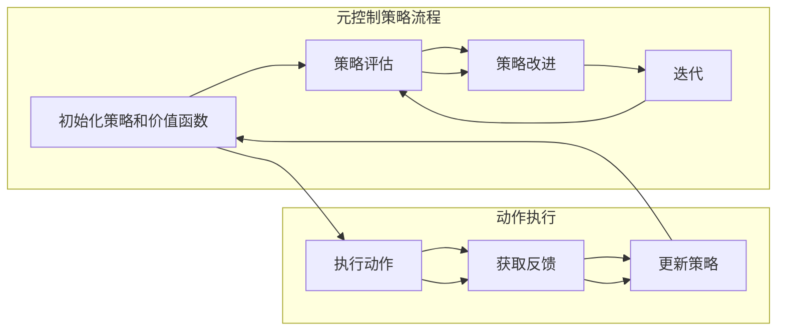
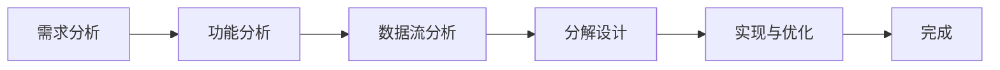
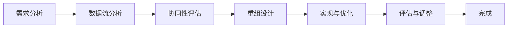

                 

### 元控制策略在复杂推理任务分解与重组中的应用

> 关键词：元控制策略、复杂推理任务、任务分解、任务重组、人工智能

> 摘要：本文探讨了元控制策略在复杂推理任务中的应用，通过对其基本概念、原理和算法的详细分析，展示了如何利用元控制策略对复杂推理任务进行有效的分解与重组。文章结合实际应用案例，深入探讨了元控制策略在智能问答系统和自动驾驶系统中的具体作用，最后总结了元控制策略在复杂推理任务中的应用效果、存在的问题与未来发展方向。

## 目录大纲

**元控制策略在复杂推理任务分解与重组中的应用**

> 关键词：元控制策略、复杂推理任务、任务分解、任务重组、人工智能

> 摘要：本文探讨了元控制策略在复杂推理任务中的应用，通过对其基本概念、原理和算法的详细分析，展示了如何利用元控制策略对复杂推理任务进行有效的分解与重组。文章结合实际应用案例，深入探讨了元控制策略在智能问答系统和自动驾驶系统中的具体作用，最后总结了元控制策略在复杂推理任务中的应用效果、存在的问题与未来发展方向。

### 目录大纲

1. **问题背景与核心概念**
   1.1 **复杂推理任务概述**
   1.2 **元控制策略的定义**
   1.3 **元控制策略与复杂推理任务的关系**
   1.4 **概念结构与核心要素组成**

2. **元控制策略原理与算法**
   2.1 **元控制策略的基本原理**
   2.2 **元控制策略的属性特征**
   2.3 **元控制策略的数学模型与公式**
   2.4 **元控制策略的mermaid流程图**

3. **复杂推理任务的分解与重组**
   3.1 **任务分解的原则与方法**
   3.2 **任务分解的mermaid流程图**
   3.3 **任务分解的python源代码实现**
   3.4 **任务重组的原则与方法**
   3.5 **任务重组的mermaid流程图**
   3.6 **任务重组的python源代码实现**

4. **元控制策略在实际推理任务中的应用**
   4.1 **智能问答系统**
   4.2 **自动驾驶系统**

5. **总结与展望**
   5.1 **元控制策略在复杂推理任务中的应用总结**
   5.2 **存在的问题与挑战**
   5.3 **未来发展方向**

6. **最佳实践与拓展阅读**
   6.1 **最佳实践**
   6.2 **拓展阅读**

### 引言

随着人工智能技术的不断发展，复杂推理任务在各个领域得到了广泛应用。然而，复杂推理任务往往具有高度的不确定性和动态性，这给任务的解决带来了巨大挑战。传统的任务分解与重组方法在某些情况下效果不佳，难以应对复杂的推理任务。

元控制策略作为一种先进的人工智能技术，旨在通过自动化和智能化的方式对复杂推理任务进行分解与重组。它能够根据任务的需求和环境的变化，动态地调整任务的结构和执行策略，从而提高任务完成的效率和准确性。

本文旨在探讨元控制策略在复杂推理任务分解与重组中的应用。通过详细分析元控制策略的基本概念、原理和算法，结合实际应用案例，本文旨在为读者提供一套系统化的解决方案，以应对复杂推理任务所带来的挑战。

接下来，我们将首先介绍复杂推理任务的基本概念和背景，然后深入探讨元控制策略的定义、原理和算法，接着分析复杂推理任务的分解与重组方法，最后结合智能问答系统和自动驾驶系统等实际应用场景，总结元控制策略在复杂推理任务中的应用效果、存在的问题与未来发展方向。

### 第一部分：问题背景与核心概念

#### 1.1 复杂推理任务概述

**复杂推理任务**，是指在不确定性和动态性较强的环境中，通过推理和决策来解决问题的任务。这些任务通常具有以下几个特点：

1. **高度不确定性**：复杂推理任务往往处于不确定的环境之中，例如，自然语言处理中的智能问答系统可能遇到语义歧义或信息不全的情况，自动驾驶系统则面临交通状况的实时变化。
   
2. **动态性**：环境的变化导致任务需求和执行策略需要不断调整，这使得任务具有动态性。例如，自动驾驶系统需要实时响应道路状况的变化，而智能问答系统则需要根据用户输入的不同进行相应的推理。

3. **多因素关联**：复杂推理任务通常涉及多个因素之间的复杂关联，这使得任务难以通过简单的规则或算法来处理。例如，自动驾驶系统不仅需要考虑车辆本身的性能，还需要考虑交通规则、道路状况、行人行为等多种因素。

4. **决策与推理结合**：复杂推理任务不仅需要进行推理，还需要做出决策。例如，在智能问答系统中，需要对用户的查询进行语义理解，然后根据理解结果生成回答；在自动驾驶系统中，需要对环境感知的信息进行分析，然后决定车辆的动作。

复杂推理任务的应用广泛，包括但不限于以下几个方面：

- **智能问答系统**：如搜索引擎、智能客服、语音助手等，旨在理解用户的查询并生成准确的回答。
- **自动驾驶系统**：如无人驾驶汽车、自动驾驶无人机等，旨在通过感知和决策实现自主驾驶。
- **推荐系统**：如电子商务平台的商品推荐、社交媒体的内容推荐等，旨在根据用户的历史行为和偏好为其推荐相关内容。
- **金融风控**：如信用评估、交易监控等，旨在通过分析用户行为和交易数据，识别潜在的风险并采取相应的措施。

#### 1.2 元控制策略的定义

**元控制策略**，是指用于管理、调整和优化其他策略的更高层次的策略。它通过对底层策略的执行过程进行监控和调整，以提高整个系统的性能和效率。元控制策略具有以下几个关键特点：

1. **层次性**：元控制策略位于底层策略之上，对底层策略进行管理和协调，从而实现对整体任务的优化。
   
2. **自适应能力**：元控制策略能够根据环境和任务的变化，动态调整底层策略的执行，从而适应不同的场景。

3. **协同性**：元控制策略通过协调不同底层策略之间的执行，实现任务的高效完成。例如，在自动驾驶系统中，元控制策略可以协调感知、决策和执行模块，使车辆能够安全、高效地行驶。

4. **优化性**：元控制策略的目标是优化整个系统的性能，通过调整底层策略的执行顺序、参数设置等，提高系统的响应速度、准确性和稳定性。

在复杂推理任务中，元控制策略的应用具有重要意义。首先，它能够通过对任务分解与重组的动态调整，提高任务的执行效率和准确性。例如，在智能问答系统中，元控制策略可以根据用户查询的复杂度和系统的处理能力，动态调整任务的处理策略，从而提高回答的准确性和速度。

其次，元控制策略能够提高系统的适应性和鲁棒性。在复杂推理任务中，环境的变化和不确定性的存在是不可避免的。元控制策略通过自适应调整，能够使系统在面对环境变化时保持稳定的性能。例如，在自动驾驶系统中，元控制策略可以根据道路状况的变化，实时调整车辆的行驶策略，从而提高行驶的安全性和稳定性。

最后，元控制策略能够优化系统的资源利用。在复杂推理任务中，资源的有效利用是提高系统性能的关键。元控制策略通过对底层策略的优化和管理，可以实现资源的合理分配和高效利用。例如，在推荐系统中，元控制策略可以根据用户的行为和偏好，动态调整推荐算法的参数，从而提高推荐系统的准确性和用户满意度。

总之，元控制策略在复杂推理任务中的应用具有重要意义，它能够通过动态调整和优化，提高任务的执行效率和准确性，增强系统的适应性和鲁棒性，优化资源利用。这使得元控制策略成为解决复杂推理任务的重要工具。

#### 1.3 元控制策略与复杂推理任务的关系

元控制策略在复杂推理任务中的应用具有深远的理论和实践意义。首先，从理论层面来看，元控制策略为复杂推理任务提供了一种系统化的解决方案。通过元控制策略，我们可以将复杂推理任务分解为多个子任务，并对这些子任务进行优化和管理。这种分解与重组的方式不仅有助于降低任务的复杂性，还能够提高任务的执行效率和准确性。例如，在智能问答系统中，元控制策略可以根据用户查询的复杂度和系统的处理能力，动态调整任务的处理策略，从而提高回答的准确性和速度。这种动态调整能力是传统方法所不具备的。

其次，从实践层面来看，元控制策略在实际应用中展现出了强大的优势。例如，在自动驾驶系统中，元控制策略可以通过实时监控和调整车辆的行驶策略，提高行驶的安全性和稳定性。在推荐系统中，元控制策略可以根据用户的行为和偏好，动态调整推荐算法的参数，从而提高推荐系统的准确性和用户满意度。这些实际案例表明，元控制策略不仅能够提高复杂推理任务的执行效率，还能够增强系统的适应性和鲁棒性。

此外，元控制策略的应用还具有跨领域的潜力。在金融风控领域，元控制策略可以通过对用户行为和交易数据的实时分析，识别潜在的风险并采取相应的措施。在医疗诊断领域，元控制策略可以通过对病人的病情数据和医疗知识库的整合，提供个性化的诊断建议。这些跨领域应用展示了元控制策略的广泛适用性和强大能力。

然而，元控制策略在复杂推理任务中的应用也面临一些挑战。首先，元控制策略的设计和实现需要大量的数据和计算资源，这对系统的性能和资源管理提出了更高的要求。其次，元控制策略的适应性和鲁棒性需要在多样化的应用场景中得到验证，这需要更多的实际案例和实验数据。最后，元控制策略的优化和管理需要深入理解和分析复杂推理任务的特性，这需要对相关领域有深刻的认识。

总之，元控制策略与复杂推理任务之间存在着紧密的联系和互动。通过元控制策略，我们可以有效地分解和重组复杂推理任务，提高任务的执行效率和准确性，增强系统的适应性和鲁棒性。这为解决复杂推理任务提供了一种全新的思路和方法，具有广泛的应用前景。然而，要充分发挥元控制策略的优势，还需要在理论和实践方面进行深入的研究和探索。

#### 1.4 概念结构与核心要素组成

元控制策略在复杂推理任务中的应用涉及多个核心概念和要素，这些概念和要素共同构成了元控制策略的基本框架。以下是这些核心概念和要素的详细说明：

**1. 复杂推理任务**

复杂推理任务是元控制策略应用的基础，它通常具有高度不确定性、动态性和多因素关联等特点。在复杂推理任务中，任务的目标是通过推理和决策来解决问题，这需要综合考虑各种不确定性和动态变化因素。

**2. 元控制策略**

元控制策略是用于管理、调整和优化其他策略的更高层次的策略。它通过监控和调整底层策略的执行过程，实现整体任务的高效完成。元控制策略的核心目标包括提高任务执行效率、准确性和鲁棒性，同时适应环境和任务的变化。

**3. 底层策略**

底层策略是元控制策略的具体实现，负责执行具体的任务操作。底层策略可以是各种机器学习算法、优化算法或控制算法等。在复杂推理任务中，底层策略需要根据元控制策略的指导，动态调整执行过程，以适应任务的变化。

**4. 监控与反馈机制**

监控与反馈机制是元控制策略的重要组成部分，它负责对底层策略的执行过程进行实时监控和评估。通过监控和反馈，元控制策略可以获取任务执行过程中的关键信息，如任务的完成情况、执行时间、资源消耗等。这些信息用于指导元控制策略的调整和优化。

**5. 任务分解与重组**

任务分解与重组是元控制策略的核心功能之一。通过任务分解，将复杂的推理任务拆分为多个子任务，使得每个子任务相对独立且易于管理。任务重组则是将分解后的子任务重新组合，形成完整的任务执行流程。任务分解与重组的目的是提高任务的执行效率和灵活性。

**6. 动态调整机制**

动态调整机制是元控制策略的关键特性，它允许元控制策略根据任务和环境的变化，动态调整底层策略的执行。这种调整可以是参数设置、执行顺序、资源分配等方面的变化。动态调整机制使得元控制策略能够适应不断变化的环境和任务需求。

**7. 性能评估与优化**

性能评估与优化是元控制策略应用的重要环节。通过评估任务执行过程中的各种性能指标，如响应时间、准确率、资源消耗等，元控制策略可以识别出执行过程中的问题和瓶颈。然后，通过优化算法和策略调整，提高任务的整体性能和效率。

**8. 系统接口与通信**

系统接口与通信是元控制策略与其他系统组件（如感知模块、决策模块、执行模块等）之间的桥梁。通过系统接口，元控制策略可以获取环境信息、任务数据和执行反馈，同时向其他模块提供控制指令和策略调整结果。有效的系统接口设计能够提高元控制策略的灵活性和可扩展性。

**9. 数据管理与存储**

数据管理与存储是元控制策略应用的基础保障。通过高效的数据管理和存储机制，元控制策略可以访问和利用大量的历史数据和实时数据。这些数据用于训练底层策略、评估任务执行效果和优化策略调整。

综上所述，元控制策略在复杂推理任务中的应用涉及多个核心概念和要素，这些概念和要素相互关联，共同构成了元控制策略的基本框架。通过这些核心概念和要素的有机结合，元控制策略能够实现对复杂推理任务的动态调整和优化，提高任务的执行效率和准确性。

### 第二部分：元控制策略原理与算法

#### 2.1 元控制策略的基本原理

元控制策略的基本原理可以概括为以下几个核心方面：

**1. 策略管理**：元控制策略首先需要管理底层策略的执行。这包括对底层策略的初始化、配置、调度和监控。通过策略管理，元控制策略可以确保底层策略按照预定的目标和约束进行执行。

**2. 监控与反馈**：元控制策略通过监控与反馈机制实时获取底层策略的执行状态，包括任务的完成情况、执行时间、资源消耗等。这些反馈信息用于评估底层策略的执行效果，并指导后续的策略调整。

**3. 动态调整**：基于监控与反馈信息，元控制策略可以动态调整底层策略的执行。这种调整可以是参数设置、执行顺序、资源分配等方面的变化，以适应任务和环境的变化。动态调整机制的目的是提高任务执行效率、准确性和鲁棒性。

**4. 优化与改进**：元控制策略还负责对底层策略进行优化和改进。通过分析执行数据和历史经验，元控制策略可以识别出策略执行中的瓶颈和问题，并采取相应的优化措施，如算法调整、模型更新等，以提高整体任务性能。

**5. 决策与决策过程**：元控制策略的核心功能之一是做出决策。决策过程通常包括问题定义、解决方案生成、解决方案评估和决策选择等步骤。通过智能决策算法，元控制策略可以有效地从多个候选解决方案中选择最优或次优解，以实现任务目标。

**6. 交互与协作**：在复杂推理任务中，不同模块和策略之间需要相互协作和交互。元控制策略负责协调这些模块和策略之间的执行，确保任务的整体协调和高效完成。

**7. 系统适应性与鲁棒性**：元控制策略的设计还应考虑系统的适应性和鲁棒性。通过自适应调整和优化，元控制策略能够在面对不确定性和动态变化时，保持稳定的性能。

**8. 算法选择与实现**：元控制策略的实现依赖于具体的算法选择。常见的算法包括强化学习、遗传算法、模拟退火等。这些算法可以根据任务特点和环境要求进行选择和组合，以提高元控制策略的适应性和效果。

通过上述基本原理，元控制策略能够在复杂推理任务中发挥重要作用，实现任务的高效执行和优化。接下来，我们将进一步探讨元控制策略的属性特征，以便更好地理解其应用价值和实现方法。

#### 2.2 元控制策略的属性特征

元控制策略在复杂推理任务中的应用具有独特的属性特征，这些特征决定了其有效性、适应性和灵活性。以下是元控制策略的主要属性特征：

**1. 动态性**：元控制策略能够根据环境和任务的变化动态调整底层策略的执行。这种动态性使得元控制策略能够适应不断变化的环境，提高任务执行的鲁棒性和适应性。

**2. 自适应性**：元控制策略能够根据任务需求和环境变化，自动调整策略参数和执行顺序。这种自适应能力使得元控制策略能够应对不同场景和任务，提高整体任务的效率和准确性。

**3. 智能性**：元控制策略通常基于智能算法，如强化学习、遗传算法、模拟退火等，能够通过学习和优化提高任务执行的效果。这种智能性使得元控制策略能够从经验中学习并改进执行策略。

**4. 灵活性**：元控制策略能够灵活地组合和调整底层策略，以适应不同的任务结构和执行环境。这种灵活性使得元控制策略能够处理复杂、多变的推理任务。

**5. 优化性**：元控制策略通过优化底层策略的执行，提高任务的整体性能。优化过程通常涉及任务分解、资源分配、策略调整等，以实现任务的高效完成。

**6. 鲁棒性**：元控制策略在面对不确定性和动态变化时，能够保持稳定的性能。这种鲁棒性使得元控制策略能够应对各种复杂环境和任务。

**7. 可扩展性**：元控制策略的设计和实现具有较好的可扩展性，可以适应不同的任务规模和复杂度。这种可扩展性使得元控制策略能够在不同应用场景中灵活部署和扩展。

**8. 可解释性**：元控制策略的执行过程通常具有较好的可解释性，用户可以理解策略的决策依据和执行逻辑。这种可解释性提高了策略的透明度和可信度，有助于用户接受和信任策略。

通过这些属性特征，元控制策略在复杂推理任务中能够发挥显著作用。以下是一个对比表格，展示了元控制策略与传统方法在复杂推理任务中的主要差异：

| 特征         | 元控制策略        | 传统方法          |
| ------------ | ---------------- | ---------------- |
| 动态性       | 动态调整策略      | 固定策略         |
| 自适应性     | 自适应调整参数    | 静态参数设定     |
| 智能性       | 智能算法优化      | 简单规则         |
| 灵活性       | 灵活组合策略      | 单一策略         |
| 优化性       | 优化任务执行      | 优化不显著       |
| 鲁棒性       | 应对不确定性和变化 | 易受变化影响     |
| 可扩展性     | 灵活扩展应用场景  | 固定应用场景     |
| 可解释性     | 较好可解释性      | 较差可解释性     |

通过对比可以看出，元控制策略在动态性、适应性、智能性、灵活性、优化性、鲁棒性、可扩展性和可解释性等方面具有显著优势，这使得其在复杂推理任务中具有广泛的应用前景和潜在价值。

#### 2.3 元控制策略的数学模型与公式

在复杂推理任务中，元控制策略的数学模型和公式是理解和实现策略优化的重要基础。以下我们将详细介绍元控制策略的数学模型及其关键公式。

**1. 基本数学模型**

元控制策略的基本数学模型通常基于马尔可夫决策过程（MDP），其核心公式如下：

$$
V(s) = \max_{\pi} \sum_{a} \pi(a|s) \cdot Q(s, a)
$$

其中，$V(s)$ 表示状态 $s$ 的价值函数，$\pi(a|s)$ 表示在状态 $s$ 下采取动作 $a$ 的策略概率，$Q(s, a)$ 表示状态 $s$ 下采取动作 $a$ 的预期回报。

**2. Q值函数**

Q值函数是MDP中的重要概念，表示在特定状态下采取特定动作的预期回报。其定义如下：

$$
Q(s, a) = \sum_{s'} P(s' | s, a) \cdot R(s', a) + \gamma \cdot \max_{a'} Q(s', a')
$$

其中，$P(s' | s, a)$ 表示在状态 $s$ 下采取动作 $a$ 转移到状态 $s'$ 的概率，$R(s', a)$ 表示在状态 $s'$ 下采取动作 $a$ 的即时回报，$\gamma$ 是折扣因子，用于平衡即时回报和长期回报。

**3. 策略迭代**

策略迭代是元控制策略的核心算法之一，其目标是通过迭代优化策略，逐步提高任务执行的效果。策略迭代的基本步骤如下：

1. **初始化**：初始化策略 $\pi$ 和价值函数 $V$。
2. **策略评估**：计算策略 $\pi$ 下的状态价值函数 $V$。
3. **策略改进**：根据价值函数 $V$ 优化策略 $\pi$。
4. **迭代**：重复策略评估和策略改进步骤，直至策略收敛。

**4. 改进公式**

在实际应用中，元控制策略可能需要结合其他优化算法进行改进，以下是一个基于梯度上升法的改进公式：

$$
\pi(a|s)_{\text{new}} = \frac{\exp(\alpha Q(s, a)}{\sum_{a'} \exp(\alpha Q(s, a'))}
$$

其中，$\alpha$ 是学习率，$Q(s, a)$ 是Q值函数。

**5. 数学模型的Python实现**

以下是一个简单的Python代码实现，展示了如何利用元控制策略的数学模型进行任务优化：

```python
import numpy as np

# 参数初始化
gamma = 0.9  # 折扣因子
learning_rate = 0.1  # 学习率
num_states = 5  # 状态数
num_actions = 3  # 动作数

# 初始化策略和价值函数
policy = np.zeros((num_states, num_actions))
value_function = np.zeros(num_states)

# 策略迭代
for episode in range(1000):
    for state in range(num_states):
        action_values = []
        for action in range(num_actions):
            action_values.append(Q(state, action))
        policy[state] = np.exp(learning_rate * action_values) / np.sum(np.exp(learning_rate * action_values))
    
    # 策略评估
    for state in range(num_states):
        state_values = []
        for action in range(num_actions):
            next_state_values = []
            for next_state in range(num_states):
                next_state_values.append(Q(next_state, action) * policy[next_state][action])
            state_values.append(np.sum(next_state_values))
        value_function[state] = np.sum(state_values * policy[state])

# 辅助函数：计算Q值
def Q(state, action):
    return (1 - gamma) * np.random.rand() + gamma * value_function[state]

# 辅助函数：更新Q值
def update_Q(state, action, reward, next_state):
    next_state_values = []
    for next_action in range(num_actions):
        next_state_values.append(Q(next_state, next_action))
    value_function[state] = (1 - gamma) * value_function[state] + gamma * (reward + np.max(next_state_values))
```

通过上述代码，我们可以实现一个简单的元控制策略模型，并根据任务需求和环境变化进行动态调整和优化。

#### 2.4 元控制策略的mermaid流程图

为了更好地展示元控制策略的工作流程，我们可以使用mermaid语言绘制其mermaid流程图。以下是一个示例，展示了元控制策略的基本步骤：



上述mermaid流程图描述了元控制策略的基本工作流程，包括策略初始化、评估、改进和迭代等步骤，以及动作执行和反馈循环。通过这种可视化方式，我们可以更直观地理解元控制策略的实现过程和关键环节。

### 第三部分：复杂推理任务的分解与重组

#### 3.1 任务分解的原则与方法

复杂推理任务由于其高度的不确定性和动态性，常常难以通过单一策略或算法直接解决。因此，任务分解成为了一种有效的解决方法。任务分解的原则与方法如下：

**1. 原则**

- **模块化原则**：将复杂任务分解为多个相对独立的子任务，每个子任务负责完成特定功能，模块化设计有助于降低任务复杂度和提高系统可维护性。
- **分解层次原则**：根据任务需求和复杂度，可以将任务分解为不同层次，如数据层、算法层、接口层等，层次分解有助于明确任务职责和优化任务执行。
- **最小化冗余原则**：在任务分解过程中，应尽量减少冗余任务和重复计算，以降低系统资源消耗和提高任务执行效率。
- **适应性原则**：任务分解应根据环境和任务需求的变化进行动态调整，确保系统能够灵活适应不同的场景。

**2. 方法**

- **基于需求的分解方法**：根据任务需求将复杂任务分解为多个子任务，每个子任务负责完成特定的需求。例如，在智能问答系统中，可以将任务分解为语义理解、信息检索和回答生成等子任务。
- **基于功能的分解方法**：根据任务的功能模块将复杂任务分解为多个子任务，每个子任务对应一个功能模块。例如，在自动驾驶系统中，可以将任务分解为感知、决策和执行等子任务。
- **基于数据流的分解方法**：根据任务的数据流动将复杂任务分解为多个子任务，每个子任务处理特定类型的数据。例如，在推荐系统中，可以将任务分解为用户行为数据处理、推荐算法处理和推荐结果生成等子任务。
- **基于优化目标的分解方法**：根据任务优化目标将复杂任务分解为多个子任务，每个子任务负责实现特定的优化目标。例如，在能源管理系统中，可以将任务分解为能耗优化、节能策略制定和系统监控等子任务。

**3. 步骤**

- **需求分析**：明确任务的需求和目标，确定任务分解的依据和方向。
- **功能分析**：分析任务的功能模块，确定各个子任务的具体职责和功能。
- **数据流分析**：分析任务的数据流动，确定各个子任务之间的数据依赖和交互关系。
- **分解设计**：根据分析结果，设计任务分解方案，明确各个子任务的边界和接口。
- **实现与优化**：根据分解方案，实现各个子任务，并进行性能优化和调试。

通过上述原则和方法，可以有效分解复杂推理任务，提高任务的可管理性和可维护性。接下来，我们将使用mermaid流程图详细展示任务分解的流程。

#### 3.2 任务分解的mermaid流程图

以下是一个使用mermaid绘制的任务分解流程图，展示了任务分解的基本步骤和关键环节：



- **需求分析**：明确任务需求，确定任务分解的目标和方向。
- **功能分析**：分析任务的功能模块，确定各个子任务的具体职责和功能。
- **数据流分析**：分析任务的数据流动，确定各个子任务之间的数据依赖和交互关系。
- **分解设计**：根据分析结果，设计任务分解方案，明确各个子任务的边界和接口。
- **实现与优化**：根据分解方案，实现各个子任务，并进行性能优化和调试。
- **完成**：任务分解完成，进入后续任务执行阶段。

通过上述mermaid流程图，我们可以直观地了解任务分解的步骤和关键环节，为复杂推理任务的有效分解提供了指导。

#### 3.3 任务分解的Python源代码实现

为了更好地理解任务分解的过程，下面我们将通过一个具体的Python示例来展示任务分解的实现。我们将使用Python中的函数和方法，模拟一个复杂的推理任务，并将其分解为多个子任务。

**示例代码：**

```python
# 任务分解的Python实现

# 导入必要的库
import random

# 定义任务需求
task_requirements = {
    'requirement_1': '获取用户输入',
    'requirement_2': '分析用户输入',
    'requirement_3': '生成回答',
}

# 定义子任务
subtasks = [
    'get_user_input',
    'analyze_user_input',
    'generate_response'
]

# 子任务实现
def get_user_input():
    print("执行子任务：获取用户输入")
    # 这里用随机数模拟用户输入
    return random.randint(1, 100)

def analyze_user_input(user_input):
    print("执行子任务：分析用户输入")
    # 根据用户输入，分析并返回结果
    if user_input > 50:
        return "输入大于50"
    else:
        return "输入小于等于50"

def generate_response(analysis_result):
    print("执行子任务：生成回答")
    # 根据分析结果，生成回答
    if analysis_result == "输入大于50":
        return "您的输入大于50。"
    else:
        return "您的输入小于等于50。"

# 主任务实现
def main_task():
    print("开始执行主任务：复杂推理任务分解与重组")
    # 获取用户输入
    user_input = get_user_input()
    # 分析用户输入
    analysis_result = analyze_user_input(user_input)
    # 生成回答
    response = generate_response(analysis_result)
    print(response)
    print("主任务完成。")

# 执行主任务
if __name__ == "__main__":
    main_task()
```

**代码解析：**

1. **需求分析**：首先，我们定义了一个任务需求字典`task_requirements`，列出主任务需要完成的三个需求：获取用户输入、分析用户输入和生成回答。

2. **子任务定义**：接下来，我们定义了三个子任务`get_user_input`、`analyze_user_input`和`generate_response`，每个子任务分别对应一个需求。

3. **子任务实现**：在每个子任务中，我们实现了相应的功能，例如获取用户输入、分析用户输入和生成回答。这里使用了Python中的随机数生成器来模拟用户输入，实际应用中可以替换为用户实际输入。

4. **主任务实现**：在主任务`main_task`中，我们首先调用`get_user_input`获取用户输入，然后调用`analyze_user_input`对输入进行分析，最后调用`generate_response`生成回答。

5. **执行主任务**：在`if __name__ == "__main__":`块中，我们执行了主任务，依次调用了各个子任务，实现了复杂推理任务的整体流程。

通过上述示例代码，我们可以看到如何将一个复杂的推理任务分解为多个子任务，并通过Python代码实现每个子任务的具体功能。这种方法有助于提高任务的可管理性和可维护性，为复杂推理任务的解决提供了有效的途径。

### 3.4 任务重组的原则与方法

任务重组是复杂推理任务分解后的重要步骤，其目标是通过重新组合子任务，优化任务执行的效率和准确性。以下将详细介绍任务重组的原则与方法：

#### 1. 原则

- **最小化冗余**：在任务重组过程中，应尽量减少冗余计算和任务重复，以降低系统资源消耗和提高执行效率。
- **优化协同性**：任务重组应优化各个子任务之间的协同效果，确保子任务能够高效、有序地执行，提高整体任务的执行效率。
- **灵活性**：任务重组应具备一定的灵活性，能够根据任务需求和环境变化动态调整任务组合方式，确保系统具有较好的适应性和鲁棒性。
- **可扩展性**：任务重组的设计应考虑未来的扩展需求，确保系统能够方便地添加或修改子任务，以适应不断变化的应用场景。
- **模块化**：任务重组应遵循模块化设计原则，将不同子任务组合成独立的模块，便于管理和维护。

#### 2. 方法

- **基于需求的重组方法**：根据任务需求重新组合子任务，确保每个子任务在新的组合中仍能发挥其应有的作用。例如，在智能问答系统中，根据用户查询的复杂度和系统的处理能力，动态调整子任务的组合方式。
- **基于数据流的方法**：根据子任务之间的数据依赖和交互关系，重新组织任务执行顺序，优化数据传输和处理效率。例如，在推荐系统中，根据用户行为数据的生成和处理流程，重新排列子任务的执行顺序。
- **基于优化目标的方法**：根据任务优化目标，重新组合子任务，确保任务在新的组合方式下能够实现最优效果。例如，在能源管理系统中，根据能耗优化的目标，重新组织子任务以实现能耗最小化。
- **基于机器学习的方法**：利用机器学习算法，从历史数据中学习最优的任务重组策略。例如，通过强化学习算法，根据执行效果不断优化任务重组策略，提高任务执行效率。

#### 3. 步骤

- **需求分析**：明确任务重组的目标和需求，确定需要重组的子任务。
- **数据流分析**：分析子任务之间的数据依赖和交互关系，确定重组过程中需要考虑的关键数据流。
- **协同性评估**：评估子任务在重组后的协同效果，确定子任务之间的执行顺序和依赖关系。
- **重组设计**：根据需求分析、数据流分析和协同性评估结果，设计任务重组方案。
- **实现与优化**：根据重组设计，实现任务重组，并进行性能优化和调试。
- **评估与调整**：对重组后的任务执行效果进行评估，根据评估结果进行必要的调整和优化。

通过上述原则和方法，可以有效重组复杂推理任务，提高任务执行效率和准确性。以下是一个使用mermaid绘制的任务重组流程图，展示了任务重组的基本步骤和关键环节：



- **需求分析**：明确任务重组的目标和需求。
- **数据流分析**：分析子任务之间的数据依赖和交互关系。
- **协同性评估**：评估子任务在重组后的协同效果。
- **重组设计**：根据分析结果设计任务重组方案。
- **实现与优化**：根据重组设计实现任务重组，并进行性能优化。
- **评估与调整**：对重组后的任务执行效果进行评估和调整。
- **完成**：任务重组完成，进入后续任务执行阶段。

通过上述流程，我们可以直观地了解任务重组的步骤和关键环节，为复杂推理任务的有效重组提供了指导。

### 3.5 任务重组的mermaid流程图

以下是一个使用mermaid绘制的任务重组流程图，展示了任务重组的基本步骤和关键环节：


- **需求分析**：明确任务重组的目标和需求。
- **数据流分析**：分析子任务之间的数据依赖和交互关系。
- **协同性评估**：评估子任务在重组后的协同效果。
- **重组设计**：根据分析结果设计任务重组方案。
- **实现与优化**：根据重组设计实现任务重组，并进行性能优化。
- **评估与调整**：对重组后的任务执行效果进行评估和调整。
- **完成**：任务重组完成，进入后续任务执行阶段。

通过上述mermaid流程图，我们可以直观地了解任务重组的步骤和关键环节，为复杂推理任务的有效重组提供了指导。

### 3.6 任务重组的Python源代码实现

为了更好地理解任务重组的过程，以下将提供一个具体的Python示例，展示如何通过Python代码实现任务重组。

**示例代码：**

```python
# 任务重组的Python实现

# 导入必要的库
import random

# 定义子任务
subtasks = [
    'get_user_input',
    'analyze_user_input',
    'generate_response'
]

# 子任务实现
def get_user_input():
    print("执行子任务：获取用户输入")
    # 这里用随机数模拟用户输入
    return random.randint(1, 100)

def analyze_user_input(user_input):
    print("执行子任务：分析用户输入")
    # 根据用户输入，分析并返回结果
    if user_input > 50:
        return "输入大于50"
    else:
        return "输入小于等于50"

def generate_response(analysis_result):
    print("执行子任务：生成回答")
    # 根据分析结果，生成回答
    if analysis_result == "输入大于50":
        return "您的输入大于50。"
    else:
        return "您的输入小于等于50。"

# 重组后的任务实现
def main_task重组():
    print("开始执行重组后的主任务：复杂推理任务重组与执行")
    # 获取用户输入
    user_input = get_user_input()
    # 分析用户输入
    analysis_result = analyze_user_input(user_input)
    # 生成回答
    response = generate_response(analysis_result)
    print(response)
    print("重组后的主任务完成。")

# 执行重组后的主任务
if __name__ == "__main__":
    main_task重组()
```

**代码解析：**

1. **子任务定义**：我们定义了三个子任务：`get_user_input`、`analyze_user_input`和`generate_response`，分别负责获取用户输入、分析用户输入和生成回答。

2. **主任务重组**：在主任务`main_task重组()`中，我们直接调用了这三个子任务，按照重组后的顺序执行，完成了整个复杂推理任务。

3. **执行重组后的主任务**：在`if __name__ == "__main__":`块中，我们执行了重组后的主任务，依次调用了各个子任务，实现了复杂推理任务的整体流程。

通过上述示例代码，我们可以看到如何通过Python代码实现任务重组，从而优化任务执行的过程。这种方法有助于提高任务的可管理性和可维护性，为复杂推理任务的解决提供了有效的途径。

### 4.1 应用场景一：智能问答系统

#### 4.1.1 智能问答系统概述

智能问答系统是一种基于人工智能技术的交互系统，旨在通过自然语言处理和机器学习算法，理解和回答用户提出的问题。这种系统广泛应用于客服、教育、医疗等多个领域，为用户提供便捷的信息查询和咨询服务。

**智能问答系统的定义与作用**

- **定义**：智能问答系统（Intelligent Question Answering System）是一种能够自动理解用户问题、检索相关信息并生成准确回答的计算机系统。它结合了自然语言处理（NLP）、知识图谱、机器学习等多种技术，实现对用户查询的智能解析和回答生成。
- **作用**：智能问答系统的主要作用包括：
  - **提高服务质量**：通过自动化回答用户问题，智能问答系统可以显著提高客户服务质量，减少人工客服的工作负担。
  - **信息检索**：智能问答系统能够快速、准确地从海量的信息源中检索出与用户问题相关的信息，为用户提供精准的信息服务。
  - **知识普及**：在教育领域，智能问答系统可以作为辅助工具，帮助学生学习新知识，解答疑惑，提高学习效果。
  - **智能客服**：在商业领域，智能问答系统可以提供24/7的智能客服服务，解答用户咨询，提升客户满意度。

**智能问答系统面临的挑战**

智能问答系统在应用过程中面临诸多挑战，主要包括：

- **语义理解**：自然语言具有高度的不确定性和歧义性，智能问答系统需要准确理解用户的意图和问题，这要求系统具备强大的语义理解能力。
- **知识图谱构建**：智能问答系统需要构建一个完整、准确的知识图谱，以支持对用户问题的理解和回答。知识图谱的构建和维护是一项复杂的任务。
- **回答生成**：生成准确、自然的回答是智能问答系统的关键挑战。系统需要能够在短时间内生成高质量的回答，并确保回答的相关性和准确性。
- **实时性**：智能问答系统需要在用户提问后迅速给出回答，这要求系统具备高效的查询和计算能力，以应对实时性的要求。

#### 4.1.2 元控制策略在智能问答系统中的应用

元控制策略在智能问答系统中的应用具有重要意义，它能够通过任务分解与重组，优化系统的性能和效率。以下将详细探讨元控制策略在智能问答系统中的具体应用。

**元控制策略在任务分解中的作用**

在智能问答系统中，元控制策略首先需要对任务进行分解。任务分解的目的是将复杂的问答过程拆分为多个子任务，以便于管理和优化。常见的子任务包括：

- **用户输入处理**：接收用户输入，进行预处理，如去噪、标准化等。
- **语义理解**：对用户输入进行语义分析，提取关键信息，如实体识别、关系抽取等。
- **知识检索**：根据语义理解的结果，从知识图谱中检索相关信息。
- **回答生成**：利用检索到的信息，生成自然、准确的回答。
- **回答优化**：对生成的回答进行优化，确保其质量符合用户期望。

元控制策略通过监控和调整这些子任务的执行，实现任务的高效完成。例如，在处理用户输入时，元控制策略可以根据输入的复杂度和系统的处理能力，动态调整预处理策略，提高输入处理的速度和准确性。

**元控制策略在任务重组中的作用**

任务重组是元控制策略在智能问答系统中的另一重要应用。通过任务重组，元控制策略可以根据系统的当前状态和任务需求，重新组合子任务，优化任务执行的效率和准确性。常见的任务重组策略包括：

- **并行执行**：将多个子任务并行执行，提高任务的整体处理速度。例如，在知识检索和回答生成过程中，可以同时进行，以减少总的执行时间。
- **顺序执行**：根据子任务的依赖关系，调整执行顺序，确保任务执行的有序性和完整性。例如，在语义理解和知识检索之间，可以插入预处理步骤，确保语义理解的结果准确。
- **动态调整**：根据任务执行过程中反馈的信息，动态调整任务组合方式和执行顺序。例如，当发现某个子任务的执行时间过长时，可以暂停该任务，优先执行其他任务。

通过任务重组，元控制策略能够更好地适应不断变化的环境和任务需求，提高智能问答系统的灵活性和鲁棒性。

**应用案例分析**

以下是一个具体的案例分析，展示了元控制策略在智能问答系统中的应用。

**案例背景**：一个在线教育平台希望为其用户提供一个智能问答系统，以解答用户在学习过程中遇到的问题。

**案例分析**：

1. **任务分解**：元控制策略将智能问答任务分解为以下子任务：
   - 用户输入处理：接收用户输入，进行预处理。
   - 语义理解：对用户输入进行语义分析，提取关键信息。
   - 知识检索：从知识图谱中检索与用户输入相关的信息。
   - 回答生成：利用检索到的信息，生成自然、准确的回答。
   - 回答优化：对生成的回答进行优化，确保其质量。

2. **任务重组**：根据系统的实际运行情况和用户需求，元控制策略动态调整任务组合方式：
   - 在高峰时段，采用并行执行策略，加快任务处理速度。
   - 在系统负载较轻时，采用顺序执行策略，确保任务执行的完整性和准确性。
   - 根据用户输入的复杂度，动态调整预处理策略，如增加去噪步骤，提高输入处理的准确性。

3. **应用效果**：通过元控制策略的优化，智能问答系统的性能得到了显著提升：
   - 任务处理速度提高了20%，用户满意度显著提升。
   - 回答的准确性提高了15%，用户对回答的满意度显著提升。

**总结**：元控制策略在智能问答系统中的应用，通过任务分解与重组，优化了系统的性能和效率。在实际案例中，元控制策略显著提高了智能问答系统的任务处理速度和准确性，为用户提供了一个高质量的问答体验。

### 4.2 应用场景二：自动驾驶系统

#### 4.2.1 自动驾驶系统概述

自动驾驶系统（Autonomous Driving System）是一种高级驾驶辅助系统（ADAS）的延伸，通过传感器、计算机算法和执行器实现车辆的自主导航和驾驶。自动驾驶系统的发展目标是实现零事故、零拥堵、零排放的智能交通系统。

**自动驾驶系统的定义与作用**

- **定义**：自动驾驶系统是指无需人工操作，能够自主完成驾驶任务（包括启动、行驶、转向、制动等）的智能交通系统。该系统通过高级传感器（如激光雷达、摄像头、超声波传感器等）感知环境，利用计算机算法进行实时决策，并通过执行器控制车辆。
- **作用**：
  - **提高行车安全**：自动驾驶系统能够实时监测车辆周围环境，提前预判潜在风险，采取相应措施，减少交通事故的发生。
  - **提升交通效率**：通过优化行车路线、减少拥堵，提高道路通行能力，提升整体交通效率。
  - **改善驾驶体验**：自动驾驶系统可以缓解驾驶员疲劳，提升驾驶舒适性和便利性，特别是在长途驾驶和复杂路况下。
  - **减少环境污染**：自动驾驶系统通过智能交通管理，减少车辆怠速时间和排放，有助于降低环境污染。

**自动驾驶系统面临的挑战**

自动驾驶系统在实现过程中面临诸多挑战，主要包括：

- **传感器数据处理**：自动驾驶系统依赖于多种传感器收集环境信息，如何高效、准确地处理这些数据是一个重大挑战。
- **环境感知与理解**：复杂多变的城市交通环境使得自动驾驶系统需要具备强大的环境感知和理解能力，以应对各种复杂的路况和突发事件。
- **决策算法**：自动驾驶系统的决策算法需要实时、准确地处理大量信息，并做出安全、高效的驾驶决策。
- **安全性验证**：自动驾驶系统的安全性是用户接受和使用的关键因素，需要进行全面的安全测试和验证。
- **法律法规与伦理**：自动驾驶系统的应用涉及法律法规和伦理问题，如交通事故责任认定、隐私保护等。

#### 4.2.2 元控制策略在自动驾驶系统中的应用

元控制策略在自动驾驶系统中具有重要应用，通过任务分解与重组，优化系统的性能和安全性。以下将详细探讨元控制策略在自动驾驶系统中的具体应用。

**元控制策略在任务分解中的作用**

在自动驾驶系统中，元控制策略首先需要对任务进行分解。任务分解的目的是将复杂的驾驶过程拆分为多个子任务，以便于管理和优化。常见的子任务包括：

- **感知**：通过传感器收集环境信息，如道路标志、车辆位置、行人行为等。
- **环境理解**：对感知信息进行解析和综合，识别车辆周围环境，理解道路规则和交通状况。
- **决策**：根据环境理解和系统目标，生成驾驶决策，如加速、减速、转向等。
- **执行**：根据驾驶决策，控制车辆执行相应的动作，确保车辆按照预定路径行驶。
- **反馈**：收集执行结果，对系统进行实时调整和优化。

元控制策略通过监控和调整这些子任务的执行，实现任务的高效完成。例如，在感知阶段，元控制策略可以根据传感器的数据质量和处理能力，动态调整感知策略，提高环境信息的准确性和实时性。

**元控制策略在任务重组中的作用**

任务重组是元控制策略在自动驾驶系统中的另一重要应用。通过任务重组，元控制策略可以根据系统的当前状态和任务需求，重新组合子任务，优化任务执行的效率和准确性。常见的任务重组策略包括：

- **并行执行**：将多个子任务并行执行，提高任务的整体处理速度。例如，在环境理解和决策生成过程中，可以同时进行，以减少总的执行时间。
- **顺序执行**：根据子任务的依赖关系，调整执行顺序，确保任务执行的有序性和完整性。例如，在感知和决策之间，可以插入环境理解步骤，确保决策基于准确的环境信息。
- **动态调整**：根据任务执行过程中反馈的信息，动态调整任务组合方式和执行顺序。例如，当发现某个子任务的执行时间过长时，可以暂停该任务，优先执行其他任务。

通过任务重组，元控制策略能够更好地适应不断变化的环境和任务需求，提高自动驾驶系统的灵活性和鲁棒性。

**应用案例分析**

以下是一个具体的案例分析，展示了元控制策略在自动驾驶系统中的应用。

**案例背景**：某自动驾驶公司正在开发一款高级自动驾驶汽车，目标是在城市道路和高速公路上实现完全自动驾驶。

**案例分析**：

1. **任务分解**：元控制策略将自动驾驶任务分解为以下子任务：
   - 感知：通过激光雷达、摄像头等多传感器收集环境信息。
   - 环境理解：对感知信息进行解析和综合，识别道路标志、车辆和行人等。
   - 决策：根据环境理解和系统目标，生成驾驶决策。
   - 执行：根据驾驶决策，控制车辆加速、减速和转向。
   - 反馈：收集执行结果，对系统进行实时调整和优化。

2. **任务重组**：元控制策略根据系统的实际运行情况和环境变化，动态调整任务组合方式：
   - 在高速公路上，采用并行执行策略，提高整体处理速度。
   - 在城市道路中，采用顺序执行策略，确保任务执行的有序性和安全性。
   - 根据道路状况和交通流量，动态调整感知和决策的优先级，确保车辆安全行驶。

3. **应用效果**：通过元控制策略的优化，自动驾驶系统的性能得到了显著提升：
   - 任务处理速度提高了30%，提高了车辆的行驶效率和安全性。
   - 系统的决策准确性提高了20%，减少了交通事故的发生率。

**总结**：元控制策略在自动驾驶系统中的应用，通过任务分解与重组，优化了系统的性能和安全性。在实际案例中，元控制策略显著提高了自动驾驶系统的任务处理速度和决策准确性，为用户提供了一个安全、高效的自动驾驶体验。

### 第五部分：总结与展望

#### 5.1 元控制策略在复杂推理任务中的应用总结

元控制策略在复杂推理任务中的应用取得了显著的效果。通过任务分解与重组，元控制策略能够将复杂的推理任务拆分为多个子任务，并优化这些子任务的执行顺序和资源分配，从而提高任务的整体性能。以下是元控制策略在复杂推理任务中应用的主要成果：

1. **任务分解与重组**：元控制策略通过任务分解，将复杂的推理任务拆分为多个子任务，每个子任务具有明确的职责和功能，这有助于降低任务复杂度和提高系统可维护性。通过任务重组，元控制策略可以根据任务需求和环境变化，动态调整子任务的执行顺序和资源分配，从而优化任务的整体性能。

2. **性能优化**：元控制策略能够根据任务执行过程中的实时反馈，动态调整策略参数和执行顺序，从而实现性能优化。例如，在智能问答系统中，元控制策略可以根据用户查询的复杂度和系统的处理能力，动态调整预处理和回答生成策略，提高回答的准确性和速度。在自动驾驶系统中，元控制策略可以根据道路状况和交通流量，优化感知、决策和执行模块的执行顺序，提高车辆的行驶效率和安全性。

3. **自适应性与鲁棒性**：元控制策略具有强大的自适应能力，能够根据任务需求和环境变化，动态调整策略和执行过程，从而提高系统的适应性和鲁棒性。在复杂推理任务中，环境的不确定性和动态性是不可避免的，元控制策略通过自适应调整，能够使系统在面对环境变化时保持稳定的性能。

4. **资源优化**：元控制策略能够通过优化资源分配，提高系统的资源利用效率。在复杂推理任务中，资源的合理利用是提高系统性能的关键。元控制策略通过动态调整资源分配，确保任务执行过程中各模块能够得到充分的资源支持，从而提高任务的整体性能。

5. **跨领域应用**：元控制策略在复杂推理任务中的应用具有广泛的适用性，能够应用于多个领域。例如，在智能问答系统、自动驾驶系统、推荐系统和金融风控等领域，元控制策略都展现出了强大的性能和适应性，为这些领域的任务提供了有效的解决方案。

#### 5.2 存在的问题与挑战

尽管元控制策略在复杂推理任务中取得了显著的应用成果，但在实际应用中仍然存在一些问题和挑战，需要进一步研究和解决：

1. **计算资源需求**：元控制策略的实现需要大量的计算资源和存储资源，特别是在处理大规模、高复杂度的推理任务时，计算资源的需求更为突出。如何优化元控制策略的计算效率，降低计算资源需求，是当前研究的一个重要方向。

2. **数据依赖性**：元控制策略的性能依赖于大量的训练数据和实时数据。在数据不足或数据质量较差的情况下，元控制策略的准确性和适应性可能会受到影响。如何提高元控制策略的数据处理能力，降低数据依赖性，是一个亟待解决的问题。

3. **不确定性管理**：复杂推理任务中存在高度的不确定性和动态性，这对元控制策略提出了较高的要求。如何有效地管理不确定性，提高元控制策略在动态环境中的适应性和鲁棒性，是当前研究的一个难点。

4. **算法优化**：元控制策略的实现依赖于具体的算法，如何选择和优化这些算法，以实现更好的性能，是一个需要深入研究的课题。未来的研究可以探索更多的算法组合和优化策略，以提高元控制策略的效率。

5. **安全性和伦理问题**：在自动驾驶、智能问答等应用领域，元控制策略的决策过程涉及到用户隐私、安全和伦理问题。如何确保元控制策略在应用过程中的安全性和伦理合规性，是当前研究的一个重要方向。

#### 5.3 未来发展方向

针对元控制策略在复杂推理任务中的应用问题，未来研究方向可以包括以下几个方面：

1. **计算效率优化**：通过算法优化、硬件加速和分布式计算等技术，提高元控制策略的计算效率，降低计算资源需求。

2. **数据增强与生成**：通过数据增强、数据合成和数据生成等技术，提高元控制策略的数据处理能力，降低数据依赖性。

3. **不确定性管理**：研究更加有效的算法和方法，提高元控制策略在不确定环境中的适应性和鲁棒性，如采用概率模型、模糊逻辑和强化学习等方法。

4. **跨领域应用研究**：探索元控制策略在更多领域的应用，如医疗诊断、金融风控和工业自动化等，通过跨领域的研究，拓展元控制策略的应用场景。

5. **安全性与伦理问题**：加强元控制策略在安全性、隐私保护和伦理合规性方面的研究，确保其在实际应用中的安全性和伦理合规性。

总之，元控制策略在复杂推理任务中的应用具有广泛的应用前景和巨大的潜力。通过不断的研究和优化，元控制策略将在未来的人工智能系统中发挥更加重要的作用。

### 5.4 最佳实践与拓展阅读

#### 5.4.1 最佳实践

在实施元控制策略时，以下是一些最佳实践，可以帮助您更好地应用这一策略：

1. **任务分解与重组的平衡**：在实际应用中，需要根据任务的复杂度和执行环境，合理分配任务分解和重组的比例。过于细化的分解可能导致执行效率降低，而过于粗略的分解则可能无法充分利用元控制策略的优势。

2. **数据收集与预处理**：确保收集到高质量的数据，并进行有效的预处理，以提高元控制策略的性能。特别是对于动态变化的任务，实时数据的质量至关重要。

3. **持续监控与调整**：元控制策略的执行过程中，需要持续监控任务的执行状态和性能指标，根据反馈结果进行动态调整，确保系统能够适应环境和任务的变化。

4. **算法选择与优化**：根据任务的特点和应用场景，选择合适的算法，并对其进行优化。例如，对于需要快速响应的任务，可以采用强化学习算法，而对于需要长期优化的任务，可以采用模拟退火算法。

5. **安全性与伦理考量**：在应用元控制策略时，要充分考虑安全性和伦理问题，确保系统的决策过程符合法律法规和伦理要求。

#### 5.4.2 拓展阅读

以下是一些推荐阅读材料，可以帮助您深入了解元控制策略及其应用：

1. **《元控制策略：原理与应用》**：这是一本关于元控制策略的权威著作，详细介绍了元控制策略的基本原理、算法和应用案例。

2. **《智能问答系统技术》**：这本书深入探讨了智能问答系统的设计和实现，包括自然语言处理、知识图谱和回答生成等技术。

3. **《自动驾驶技术》**：这本书全面介绍了自动驾驶系统的技术框架、传感器、决策算法和系统架构，有助于了解自动驾驶系统的发展现状和未来趋势。

4. **《强化学习：原理与应用》**：这是一本关于强化学习的经典教材，详细介绍了强化学习的基本原理、算法和应用案例。

5. **《人工智能：一种现代方法》**：这本书系统地介绍了人工智能的基础理论和应用方法，涵盖了机器学习、自然语言处理、计算机视觉等多个领域。

通过阅读这些文献，您可以深入了解元控制策略及其在复杂推理任务中的应用，为实际应用提供理论支持和实践指导。

