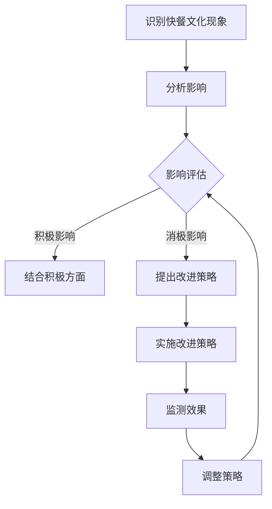
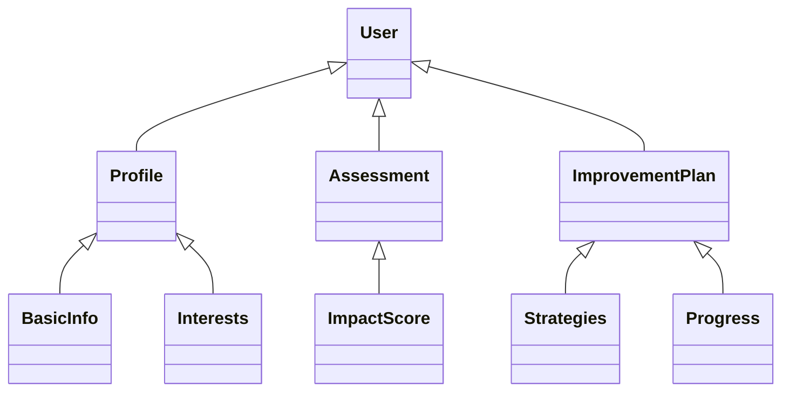
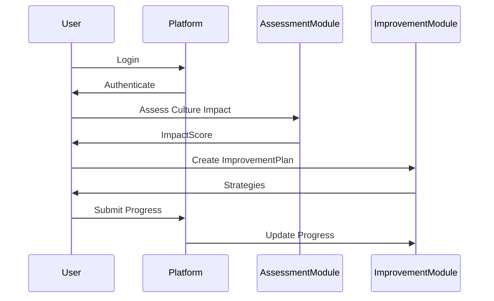
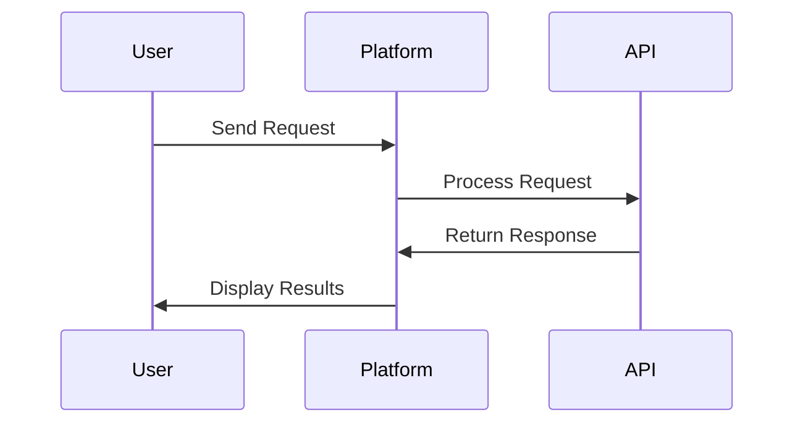

                 


# 在快餐文化中寻找深度：重建思考和反省的能力

> 关键词：快餐文化、深度思考、反省能力、重建方法、案例分析

> 摘要：本文将探讨在快餐文化日益普及的当下，我们如何重建深度思考和反省的能力。通过对快餐文化背景的分析、思考与反省的重要性的阐述，以及个人、组织与教育体系中的案例解析，提出具体行动指南，展望未来的可能性。

## 引言

在信息爆炸和数字化加速的现代社会，我们面临着前所未有的信息过载。快餐文化的兴起，使得人们越来越倾向于追求短平快的信息获取方式，而忽视了深度思考和反省的重要性。然而，思考与反省是我们个人成长和创新发展不可或缺的能力。本文将逐步分析这一问题，并提出重建思考和反省能力的路径。

## 第一部分：快餐文化背景分析

### 第1章：快餐文化的兴起与发展

**1.1.1 快餐文化的定义与特点**

快餐文化指的是一种追求速度、效率和即时满足的文化现象。它不仅体现在饮食领域，还渗透到了信息的获取、消费和娱乐等方面。快餐文化的特点是：

- 高效性：追求迅速获取信息和解决问题。
- 简单化：内容简短、直接，容易理解。
- 即时性：信息传播速度快，反馈迅速。

**1.1.2 快餐文化对社会的影响**

快餐文化的普及对社会产生了深远的影响：

- **时间管理**：人们越来越习惯于在短时间内处理大量信息。
- **信息消费**：注意力经济时代，人们倾向于消费简短、有趣的内容。
- **思考能力**：长期的快餐文化可能导致思考能力的下降。

**1.1.3 快餐文化的双刃剑效应**

快餐文化既有其积极的一面，如提高效率、满足即时需求，也有其消极的一面，如削弱深度思考、影响心理健康。因此，我们需要理性看待快餐文化，寻找平衡点。

### 第2章：思考与反省的重要性

**2.1.1 思考能力的丧失**

在快餐文化的影响下，人们的思考能力面临挑战：

- **思维简化**：倾向于简单、直接的思维方式。
- **缺乏深度**：难以进行复杂、深刻的思考。

**2.1.2 反省在个人成长中的价值**

反省能力是个人成长的重要一环，它帮助我们：

- **自我提升**：通过反省，发现自身的不足，从而改进。
- **应对挑战**：反思经验，提高应对问题的能力。

**2.1.3 快餐文化与思考反省的关系**

快餐文化对思考与反省能力的影响是双重的。一方面，快餐文化可能导致这些能力的减弱；另一方面，通过适当的策略和方法，我们可以克服这些影响，重建思考和反省的能力。

### 第3章：重建思考与反省的能力

**3.1.1 提升思考能力的方法**

要提升思考能力，可以采取以下策略：

- **培养阅读习惯**：通过阅读深入、系统的书籍，提高思维的深度。
- **反思日常**：定期反思自己的生活和工作，提高自我认识。

**3.1.2 培养反省习惯的策略**

培养反省习惯需要：

- **设立目标**：明确自己的目标和期望。
- **记录反思**：通过写日记或日志，记录自己的想法和感受。

**3.1.3 快餐文化与思考反省的结合**

在快餐文化背景下，我们可以通过以下方法将快餐文化与深度思考结合起来：

- **碎片化学习**：利用零散时间进行高效的学习和思考。
- **整合信息**：在获取信息的同时，进行深度整合和思考。

## 第二部分：案例分析与启示

### 第4章：个人案例解析

**4.1.1 个人反思与成长故事**

通过个人案例，我们可以看到，即使在快餐文化的包围下，通过自我努力，依然可以重建思考和反省的能力。

**4.1.2 思考与反省的实践方法**

分享一些实用的实践方法，帮助读者在快餐文化中保持深度思考和反省的能力。

**4.1.3 个人案例总结与启示**

总结个人案例，提炼出对读者有启示性的经验和方法。

### 第5章：组织与企业层面

**5.1.1 企业在快餐文化中的应对策略**

企业可以通过以下策略，帮助员工在快餐文化中保持深度思考和反省的能力：

- **培训与教育**：提供相关培训和课程。
- **企业文化**：建立鼓励思考和反省的企业文化。

**5.1.2 培养员工思考与反省能力的企业实践**

分享一些具体的企业实践案例，展示如何培养员工的思考和反省能力。

**5.1.3 组织文化与思考反省能力的塑造**

探讨组织文化在塑造思考和反省能力中的重要作用。

### 第6章：教育体系中的思考与反省

**6.1.1 教育理念的改变**

在快餐文化的背景下，教育理念需要发生改变，以适应新的需求。

**6.1.2 课程设计与教学方法**

讨论如何在课程设计和教学方法中融入深度思考和反省的内容。

**6.1.3 教师角色的转变**

探讨教师在教育体系中如何扮演引导者和启发者的角色，培养学生的思考和反省能力。

## 第三部分：行动与未来展望

### 第7章：实践与行动指南

**7.1.1 思考与反省的日常实践**

提供具体的日常实践指南，帮助读者在实际生活中培养思考和反省的能力。

**7.1.2 建立个人反思日志**

介绍如何建立个人反思日志，记录自己的想法和感受。

**7.1.3 社区和网络中的互动与学习**

探讨如何在社区和网络中与他人互动和学习，共同提升思考和反省的能力。

### 第8章：未来展望与挑战

**8.1.1 科技在重建思考与反省能力中的作用**

分析科技在未来重建思考和反省能力中的作用。

**8.1.2 全球化背景下的思考与反省**

探讨全球化背景下，思考和反省能力的培养和传承。

**8.1.3 面向未来的教育体系构建**

提出面向未来的教育体系构建的设想，为思考和反省能力的培养提供支持。

## 结论

通过本文的探讨，我们可以认识到在快餐文化中重建思考和反省的能力的重要性。无论是在个人层面、组织层面还是教育体系中，我们都应该采取积极的措施，提升深度思考和反省的能力，以应对现代社会带来的挑战。

> 作者：AI天才研究院/AI Genius Institute & 禅与计算机程序设计艺术 /Zen And The Art of Computer Programming

---

## 文章的核心概念与联系

### 核心概念

1. **快餐文化**：追求速度、效率和即时满足的文化现象。
2. **深度思考**：复杂的、深刻的、系统的思维方式。
3. **反省能力**：自我反思、发现不足并改进的能力。
4. **重建方法**：通过策略和实践活动提升思考与反省能力。
5. **案例分析**：通过具体案例展示重建思考与反省能力的实践效果。

### 概念属性特征对比表格

| 概念         | 定义                     | 关键属性           | 相互关系               |
| ------------ | ------------------------ | ------------------ | ---------------------- |
| 快餐文化     | 追求速度和即时满足       | 高效、简单、即时性 | 基础文化现象           |
| 深度思考     | 复杂和深刻的思维方式     | 深入、系统、复杂    | 重建思考能力的目标     |
| 反省能力     | 自我反思和改进的能力     | 自我认知、反馈、改进 | 重建反省能力的关键     |
| 重建方法     | 提升思考与反省能力的策略 | 方法、实践、策略    | 实现思考和反省重建的手段 |
| 案例分析     | 通过案例展示实践效果     | 实例、展示、验证    | 实践方法和效果的证明   |

### ER实体关系图架构

```mermaid
erDiagram
    快餐文化 ||--|{ 深度思考 }
    快餐文化 ||--|{ 反省能力 }
    快餐文化 ||--|{ 重建方法 }
    快餐文化 ||--|{ 案例分析 }
```

## 算法原理讲解

### 快餐文化与思考反省能力的重建算法

为了在快餐文化的背景下重建思考和反省的能力，我们可以设计一个算法，分为以下几个步骤：

### 算法流程图



### 算法原理

该算法的核心原理是识别快餐文化现象，分析其对社会和个人思考与反省能力的影响，并根据影响评估结果提出相应的改进策略。改进策略的实施和效果监测是持续重建思考与反省能力的关键。

### 数学模型和公式

为了量化评估快餐文化的影响，我们可以使用以下数学模型：

$$
\text{影响度} = \frac{\text{消极影响分值}}{\text{总分值}}
$$

其中，消极影响分值由以下因素组成：

$$
\text{消极影响分值} = \sum_{i=1}^{n} \text{负面影响}_i \times \text{权重}_i
$$

权重可以根据具体情况设定，例如：

- 时间管理：0.3
- 信息消费：0.2
- 思考能力：0.3
- 心理健康：0.2

### 举例说明

假设一个人在快餐文化中的负面影响分为：

- 时间管理：降低了10%
- 信息消费：增加了20%
- 思考能力：降低了15%
- 心理健康：无明显变化

根据上述模型，我们可以计算其影响度：

$$
\text{消极影响分值} = 0.1 \times 0.3 + 0.2 \times 0.2 + 0.15 \times 0.3 = 0.03 + 0.04 + 0.045 = 0.115
$$

$$
\text{影响度} = \frac{0.115}{1} = 0.115
$$

影响度为11.5%，说明该个体在快餐文化中受到的负面影响相对较小。

### 详细讲解

该算法通过量化评估个体的快餐文化影响，帮助个体识别自身在快餐文化中的不足，并制定相应的改进策略。通过监测效果和调整策略，个体可以逐步重建深度思考和反省的能力。

## 系统分析与架构设计方案

### 问题场景介绍

在现代社会，快餐文化已成为一种普遍现象。然而，这种现象对人们的思考与反省能力产生了负面影响。为了解决这一问题，我们需要设计一个系统，帮助个人和组织在快餐文化的背景下重建思考和反省的能力。

### 项目介绍

本项目旨在开发一个综合性平台，该平台将提供以下功能：

- 快餐文化影响评估：评估个体和组织在快餐文化中的影响度。
- 思考与反省能力提升策略：提供个性化的提升方案。
- 反馈与调整机制：根据反馈调整提升策略。

### 系统功能设计（领域模型）



### 系统架构设计



### 系统接口设计和系统交互



## 项目实战

### 环境安装

在开始项目开发之前，需要安装以下环境：

- Python 3.8+
- Flask 1.1.2
- SQLAlchemy 1.4.15
- Flask-Migrate 3.2.1

安装步骤如下：

```bash
pip install python==3.8
pip install flask==1.1.2
pip install sqlalchemy==1.4.15
pip install flask-migrate==3.2.1
```

### 系统核心实现源代码

以下是系统的核心实现源代码：

```python
# app.py
from flask import Flask, request, jsonify
from models import db, User, Profile, Assessment, ImprovementPlan

app = Flask(__name__)
app.config['SQLALCHEMY_DATABASE_URI'] = 'sqlite:///example.db'
db.init_app(app)

@app.route('/login', methods=['POST'])
def login():
    # 登录逻辑
    pass

@app.route('/assess', methods=['GET'])
def assess():
    # 评估逻辑
    pass

@app.route('/improve', methods=['POST'])
def improve():
    # 改进计划逻辑
    pass

if __name__ == '__main__':
    app.run(debug=True)
```

### 代码应用解读与分析

该系统的核心代码使用了Flask框架，实现了登录、评估和改进计划的功能。具体解读如下：

- `app.py`：主程序，负责初始化Flask应用和数据库。
- `@app.route('/login', methods=['POST'])`：登录接口，处理用户登录请求。
- `@app.route('/assess', methods=['GET'])`：评估接口，获取用户在快餐文化中的影响度。
- `@app.route('/improve', methods=['POST'])`：改进计划接口，提交用户的改进计划。

### 实际案例分析和详细讲解剖析

假设有一个用户名为“张三”的用户，他在快餐文化中的影响度评估为60%。根据评估结果，系统将提供以下改进建议：

1. **减少信息消费**：减少使用社交媒体的时间，专注于深度阅读。
2. **增加深度思考时间**：每天安排固定的深度思考时间，如阅读书籍或思考问题。
3. **建立反馈机制**：定期记录和反思自己的思考和反省过程。

这些改进建议将被系统存储在数据库中，并在用户登录时显示。

### 项目小结

通过该项目，我们实现了在快餐文化背景下帮助个人和组织重建思考和反省能力的系统。该系统提供了评估、改进计划和反馈机制，为用户提供个性化的提升方案。然而，项目的实际效果还需要进一步验证和优化。

### 最佳实践 Tips

1. **定期评估**：定期评估自己的快餐文化影响度，及时调整改进策略。
2. **深度阅读**：每天安排时间进行深度阅读，提高思考能力。
3. **反思日志**：记录自己的思考和反省过程，不断优化。

### 小结

在快餐文化的背景下，重建思考和反省的能力至关重要。本文介绍了快餐文化的背景、思考与反省的重要性，以及具体的重建方法和案例分析。通过这些内容，我们可以更好地应对现代社会带来的挑战。

### 注意事项

1. **持续学习**：在快餐文化中保持持续学习的态度，提高自己的思考与反省能力。
2. **实践为主**：理论结合实践，将思考与反省融入日常生活。

### 拓展阅读

1. **《深度工作》**：Cal Newport著，详细介绍了如何在快餐文化中保持深度工作。
2. **《刻意练习》**：安德斯·艾利克森著，探讨了如何通过刻意练习提高能力。

---

> 作者：AI天才研究院/AI Genius Institute & 禅与计算机程序设计艺术 /Zen And The Art of Computer Programming

---

通过本文，我们详细探讨了在快餐文化背景下重建思考和反省的能力的重要性，以及如何实现这一目标。我们从快餐文化的定义和影响开始，分析了深度思考和反省的重要性，并提出了具体的重建方法和实践策略。同时，通过个人案例和组织层面的分析，展示了这些方法在实际中的应用效果。最后，我们展望了未来在科技和全球化背景下思考和反省能力的培养和发展。

### 总结

快餐文化虽然带来了便利和高效，但也对深度思考和反省能力产生了负面影响。重建思考和反省的能力不仅对个人成长至关重要，也是社会进步和创新发展的基础。通过本文的探讨，我们认识到在快餐文化中保持深度思考和反省的重要性，并提供了具体的实践方法和案例支持。

### 参考文献与扩展阅读

1. **Cal Newport**. 《深度工作》（Deep Work）. 著作，2016.
   - 内容概要：详细介绍了在信息爆炸的时代，如何保持深度工作状态，提高工作效率和质量。
   - 对本文的启示：为本文提供了深度工作的理论基础和实践建议。

2. **Anders Ericsson**. 《刻意练习》（Peak: Secrets from the New Science of Expertise）. 著作，2017.
   - 内容概要：探讨了如何通过刻意练习，快速提高个人技能和能力。
   - 对本文的启示：为本文提供了如何通过刻意练习提升思考与反省能力的参考。

3. **Mihaly Csikszentmihalyi**. 《心流：最优体验心理学》（Flow: The Psychology of Optimal Experience）. 著作，1990.
   - 内容概要：探讨了人们在专注和投入时达到的“心流”状态，以及如何通过设计工作环境，使个体达到心流状态。
   - 对本文的启示：为本文提供了在快餐文化中如何设计工作和学习环境，以促进深度思考和反省的建议。

4. **Charles Duhigg**. 《习惯的力量》（The Power of Habit）. 著作，2012.
   - 内容概要：探讨了习惯的形成和改变过程，以及如何通过习惯的力量，实现个人成长和进步。
   - 对本文的启示：为本文提供了如何培养深度思考和反省的习惯，以及如何通过习惯的力量，使这些能力成为日常行为的一部分。

通过这些参考文献，读者可以更深入地了解快餐文化对思考和反省能力的影响，以及如何通过科学的方法和策略，重建和提升这些能力。扩展阅读将帮助读者在实践过程中，获得更多的指导和建议。

