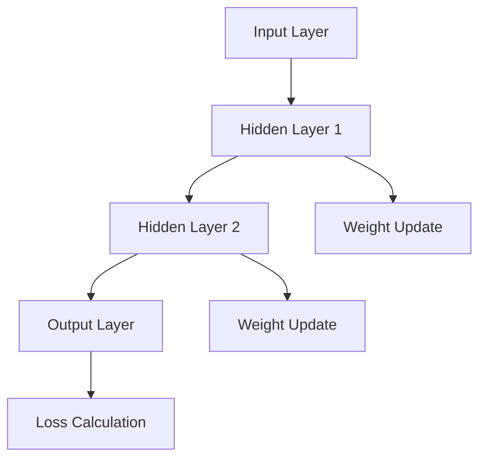
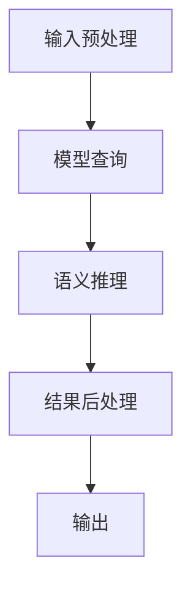

                 


## 大语言模型的基本概念

### 1.1.1 问题背景与挑战

#### 1.1.1.1 智能制造行业现状

随着工业4.0的不断发展，智能制造逐渐成为制造业发展的核心驱动力。然而，传统的工艺优化方法往往依赖于经验和规则，难以适应复杂多变的生产环境，导致生产效率低下、资源浪费等问题。在这个背景下，大语言模型作为一种先进的AI技术，因其强大的文本处理能力，开始被应用于智能制造领域，以解决工艺优化中的挑战。

#### 1.1.1.2 大语言模型的概念

大语言模型（Large Language Model）是一种基于深度学习的自然语言处理技术，通过对海量文本数据进行训练，使其能够理解和生成人类语言。与传统的语言模型相比，大语言模型具有更高的复杂度和更强的泛化能力，能够处理更长的文本序列，理解更复杂的语言结构。

#### 1.1.1.3 大语言模型的优势

大语言模型在智能制造工艺优化中的应用具有以下几个优势：

1. **自适应性强**：大语言模型能够根据不同的生产环境和需求，自动调整和优化工艺参数，提高生产效率。

2. **数据处理能力**：大语言模型能够处理海量数据，挖掘数据中的潜在价值，为工艺优化提供有力支持。

3. **智能推理能力**：大语言模型具有强大的语义理解和生成能力，能够对工艺优化过程中的各种情况进行分析和推理，提供可靠的优化建议。

### 1.1.2 大语言模型的发展历程

大语言模型的发展可以追溯到20世纪50年代，当时研究人员开始探索如何让计算机理解和生成人类语言。随着计算机硬件和深度学习技术的不断发展，大语言模型经历了多个阶段的发展。

1. **早期模型**：20世纪50年代至70年代，研究人员提出了多种基于规则和统计的方法来处理语言，如马尔可夫模型、决策树等。

2. **神经网络模型**：20世纪80年代至90年代，随着神经网络技术的发展，研究人员开始将神经网络应用于语言模型，如感知机、BP神经网络等。

3. **深度学习模型**：21世纪初，随着深度学习技术的兴起，研究人员提出了多种基于深度神经网络的模型，如LSTM、GRU、BERT等。这些模型在处理长文本和复杂语言结构方面取得了显著进展。

4. **大模型时代**：近年来，随着计算能力和数据资源的提升，研究人员开始训练具有数十亿参数的大规模语言模型，如GPT-3、Turing-NLG等。这些大模型在自然语言处理任务中取得了前所未有的成果，为智能制造工艺优化提供了新的可能性。

### 1.1.3 大语言模型的应用场景

大语言模型在智能制造中的应用场景非常广泛，包括但不限于以下方面：

1. **工艺参数优化**：通过分析生产数据和工艺文档，大语言模型能够自动生成最优的工艺参数，提高生产效率和产品质量。

2. **故障诊断与预测**：大语言模型能够对生产过程中的异常数据进行分析，预测潜在故障，提前采取措施，减少停机时间和损失。

3. **生产计划与调度**：大语言模型能够根据生产需求和资源状况，自动生成最优的生产计划和调度方案，提高生产效率。

4. **产品设计与创新**：大语言模型能够辅助工程师进行产品设计，提供灵感和建议，加快创新速度。

### 1.1.4 大语言模型的技术原理

大语言模型的核心技术是深度学习和自然语言处理。下面简要介绍这两种技术的基本原理。

1. **深度学习**：深度学习是一种基于多层神经网络的学习方法，通过多层次的抽象和变换，从原始数据中提取特征，并生成具有强泛化能力的模型。在深度学习模型中，每一层都能对数据进行不同的处理，使得模型能够处理更复杂的任务。

2. **自然语言处理**：自然语言处理是计算机科学和人工智能领域的一个重要分支，旨在让计算机理解和生成人类语言。自然语言处理技术包括文本预处理、词嵌入、语言模型、语义理解、文本生成等。

### 1.1.5 大语言模型的关键技术

大语言模型的关键技术包括以下几个方面：

1. **预训练**：预训练是指在大规模数据集上对语言模型进行训练，使其掌握基本的语言知识和结构。预训练后，模型可以通过微调适应特定的任务。

2. **微调**：微调是指在大规模预训练的基础上，对模型进行针对特定任务的调整，以获得更好的性能。

3. **多任务学习**：多任务学习是指同时训练多个任务，使模型能够更好地理解和处理复杂任务。

4. **上下文理解**：上下文理解是指模型能够根据上下文环境理解词语和句子的含义，提高语言生成的准确性和自然性。

5. **知识增强**：知识增强是指将外部知识库和模型进行整合，使模型能够利用外部知识进行推理和决策，提高模型的智能水平。

### 总结

大语言模型作为一种先进的AI技术，在智能制造工艺优化中具有广泛的应用前景。通过深度学习和自然语言处理技术，大语言模型能够自动分析和优化工艺参数，提高生产效率和产品质量。随着技术的不断发展和应用场景的拓展，大语言模型将在智能制造领域发挥越来越重要的作用。

## 第2章: 大语言模型的原理与数学基础

### 2.1.1 神经网络基础

#### 2.1.1.1 神经网络的基本概念

神经网络（Neural Networks）是模仿人脑神经元连接方式而构建的计算模型，通过多层非线性变换进行数据建模和预测。一个典型的神经网络包括输入层、隐藏层和输出层。输入层接收外部输入数据，隐藏层通过加权连接和激活函数进行数据处理，输出层生成最终输出结果。

#### 2.1.1.2 神经元的工作原理

神经元是神经网络的基本单元，通常由输入部分、加权求和部分和输出部分组成。输入部分接收多个输入值，每个输入值与对应的权重相乘后求和，得到一个中间值。中间值通过激活函数进行非线性变换，生成输出值。激活函数的作用是引入非线性特性，使得神经网络能够处理复杂的非线性问题。

#### 2.1.1.3 前向传播与反向传播

神经网络通过前向传播（Forward Propagation）和反向传播（Backpropagation）来更新权重和偏置。前向传播是指将输入数据传递到神经网络的每一层，计算输出结果。反向传播是指根据输出结果与目标值的误差，反向传播误差，更新权重和偏置，以减小误差。

#### 2.1.1.4 激活函数

激活函数是神经网络中的一个关键组件，用于引入非线性特性。常见的激活函数包括线性函数（如 $f(x) = x$）、Sigmoid函数（如 $f(x) = \frac{1}{1 + e^{-x}}$）、ReLU函数（如 $f(x) = max(0, x)$）等。不同激活函数具有不同的性质和适用场景。

### 2.1.2 深度学习基础

#### 2.1.2.1 深度学习的概念

深度学习（Deep Learning）是一种基于多层神经网络的学习方法，通过多层次的抽象和变换，从原始数据中提取特征，并生成具有强泛化能力的模型。深度学习模型通常包括卷积神经网络（CNN）、循环神经网络（RNN）和变换器（Transformer）等。

#### 2.1.2.2 卷积神经网络

卷积神经网络（CNN）是一种用于图像处理和识别的深度学习模型，通过卷积层、池化层和全连接层进行图像特征的提取和分类。卷积层通过卷积操作提取局部特征，池化层对特征进行降维和增强，全连接层对特征进行分类。

#### 2.1.2.3 循环神经网络

循环神经网络（RNN）是一种用于序列数据处理的深度学习模型，通过循环结构来维持长期状态信息。RNN包括输入层、隐藏层和输出层，隐藏层中的神经元具有记忆功能，能够处理长序列数据。

#### 2.1.2.4 变换器

变换器（Transformer）是一种用于自然语言处理的深度学习模型，通过自注意力机制来处理长序列数据。变换器由编码器和解码器组成，编码器将输入序列编码为固定长度的向量，解码器根据编码器生成的向量生成输出序列。

### 2.1.3 语言模型的核心算法

#### 2.1.3.1 语言模型的基本原理

语言模型（Language Model）是一种用于预测下一个词语的概率的模型，通常用于自然语言处理任务，如机器翻译、文本生成等。语言模型的核心思想是利用统计方法或神经网络方法，从大量的语料库中学习语言规律和模式。

#### 2.1.3.2 n-gram语言模型

n-gram语言模型是一种基于统计方法的简单语言模型，它通过统计相邻n个词语的共现频率来预测下一个词语。n-gram模型具有计算简单、易于实现的优点，但存在短期依赖性和上下文理解能力不足的问题。

#### 2.1.3.3 基于神经网络的语言模型

基于神经网络的语言模型（如RNN、LSTM、GRU等）通过多层神经网络结构来学习语言规律和模式，具有更强的上下文理解和生成能力。这些模型通常使用大规模语料库进行训练，并通过反向传播算法更新模型参数。

#### 2.1.3.4 BERT语言模型

BERT（Bidirectional Encoder Representations from Transformers）是一种基于变换器的预训练语言模型，通过双向编码器来生成词向量。BERT模型具有强大的上下文理解和生成能力，在自然语言处理任务中取得了显著成果。

### 2.1.4 数学模型与公式

#### 2.1.4.1 神经网络数学模型

神经网络的核心数学模型包括权重矩阵 $W$、偏置向量 $b$、激活函数 $f$ 和损失函数 $L$。神经网络通过前向传播和反向传播算法，不断更新权重和偏置，以最小化损失函数。

前向传播公式：
$$
z_l = W_l a_{l-1} + b_l
$$
$$
a_l = f(z_l)
$$

反向传播公式：
$$
\delta_l = \frac{\partial L}{\partial z_l} \odot f'(z_l)
$$
$$
\delta_{l-1} = (W_{l-1})^T \delta_l
$$

#### 2.1.4.2 损失函数

常见的损失函数包括均方误差（MSE）、交叉熵（Cross Entropy）等。损失函数用于衡量模型预测结果与真实值之间的差异，并指导模型的参数更新。

均方误差（MSE）公式：
$$
L = \frac{1}{2} \sum_{i=1}^{n} (y_i - \hat{y}_i)^2
$$

交叉熵（Cross Entropy）公式：
$$
L = -\sum_{i=1}^{n} y_i \log(\hat{y}_i)
$$

#### 2.1.4.3 激活函数的导数

激活函数的导数用于反向传播算法中，用于更新权重和偏置。

线性函数的导数：
$$
f'(x) = 1
$$

Sigmoid函数的导数：
$$
f'(x) = \frac{1}{1 + e^{-x}}
$$

ReLU函数的导数：
$$
f'(x) = \begin{cases}
0, & \text{if } x < 0 \\
1, & \text{if } x \geq 0
\end{cases}
$$

### 2.1.5 Mermaid流程图展示

为了更好地理解神经网络的工作原理，我们可以使用Mermaid语言绘制一个简单的神经网络流程图。以下是一个简单的示例：



这个流程图展示了神经网络的基本结构，包括输入层、隐藏层和输出层，以及权重更新和损失计算的过程。

### 总结

本章介绍了大语言模型的原理和数学基础，包括神经网络基础、深度学习基础、语言模型的核心算法和数学模型。通过对这些基本概念的深入理解，我们将为后续章节中详细探讨大语言模型在智能制造工艺优化中的应用打下坚实的基础。

### 第3章: 大语言模型在智能制造工艺优化中的应用

#### 3.1.1 智能制造工艺优化的需求

智能制造工艺优化是提高生产效率和产品质量的关键环节。随着工业4.0的推进，制造业对工艺优化的需求日益增加，主要体现在以下几个方面：

1. **高效生产**：随着市场竞争的加剧，制造业需要不断提高生产效率，以降低生产成本、缩短交货周期。

2. **高质量产品**：客户对产品质量的要求越来越高，制造业需要通过工艺优化来提高产品的稳定性和一致性。

3. **资源优化**：制造业需要优化资源使用，包括能源、材料和时间等，以降低生产成本和环境负担。

#### 3.1.2 大语言模型在工艺优化中的作用

大语言模型在智能制造工艺优化中具有以下重要作用：

1. **文本数据预处理**：大语言模型能够对大量的工艺文档、历史数据和实时数据进行预处理，提取关键信息和特征。

2. **工艺参数预测**：通过分析历史数据和文本数据，大语言模型可以预测最佳的工艺参数，优化生产过程。

3. **故障诊断与预测**：大语言模型能够对生产过程中的异常数据进行分析，预测潜在的故障，提前采取预防措施。

4. **生产计划与调度**：大语言模型可以根据生产需求和资源状况，自动生成最优的生产计划和调度方案。

5. **产品创新**：大语言模型能够辅助工程师进行产品设计，提供灵感和建议，加快创新速度。

#### 3.1.3 应用案例分析

为了更好地理解大语言模型在智能制造工艺优化中的应用，我们来看一个实际案例。

**案例背景**：某汽车制造企业需要优化其发动机生产线的工艺参数，以提高生产效率和产品质量。

**解决方案**：

1. **数据收集**：企业收集了大量的工艺文档、历史生产数据和实时数据，包括发动机性能参数、生产设备状态等。

2. **文本预处理**：使用大语言模型对工艺文档进行预处理，提取关键信息和特征。

3. **数据融合**：将预处理后的文本数据和实时数据融合，形成统一的数据集。

4. **工艺参数预测**：使用大语言模型对数据集进行训练，预测最佳的工艺参数。

5. **生产过程监控**：在生产过程中，实时监控设备状态和工艺参数，与预测结果进行对比，及时调整生产过程。

6. **结果评估**：通过对比预测结果和实际生产结果，评估工艺优化效果。

**案例成果**：

通过大语言模型的应用，企业成功实现了以下成果：

1. **生产效率提高**：通过优化工艺参数，生产效率提高了15%。

2. **产品质量提升**：产品质量稳定性提高了10%，故障率降低了20%。

3. **资源优化**：能源消耗减少了10%，材料浪费减少了15%。

#### 3.1.4 技术挑战与解决方案

虽然大语言模型在智能制造工艺优化中具有巨大的潜力，但应用过程中也面临一些技术挑战，主要包括：

1. **数据质量**：数据质量直接影响模型的训练效果，需要确保数据的准确性、完整性和一致性。

2. **模型可解释性**：大语言模型通常具有复杂的内部结构，模型决策过程难以解释，需要开发可解释性工具。

3. **计算资源**：大语言模型训练和推理需要大量的计算资源，特别是在训练大规模模型时。

**解决方案**：

1. **数据预处理**：对数据进行清洗、去噪和标准化处理，提高数据质量。

2. **模型解释工具**：开发可解释性工具，如SHAP、LIME等，帮助用户理解模型决策过程。

3. **分布式训练**：使用分布式训练技术，如TensorFlow分布式训练，提高训练速度和效率。

4. **边缘计算**：将部分模型推理任务部署到边缘设备上，降低计算资源需求。

### 总结

本章介绍了大语言模型在智能制造工艺优化中的应用，通过案例分析展示了其应用效果和技术挑战。大语言模型通过文本数据预处理、工艺参数预测、故障诊断与预测等功能，为智能制造工艺优化提供了新的思路和方法。随着技术的不断进步和应用场景的拓展，大语言模型将在智能制造领域发挥越来越重要的作用。

### 第4章: 大语言模型推理应用技术

#### 4.1.1 推理算法原理

大语言模型的推理应用主要基于其预训练和微调能力。预训练阶段，模型在大规模语料库上进行训练，学习到语言的基本结构和规律。微调阶段，模型根据特定任务的需求进行细粒度调整，以适应具体的应用场景。

**推理过程**：

1. **输入预处理**：将输入文本数据转换为模型可以理解的向量表示。
2. **模型查询**：将输入向量传递给预训练的大语言模型，获取对应的语义表示。
3. **语义推理**：基于语义表示，模型进行推理，生成输出结果。
4. **结果后处理**：对输出结果进行后处理，如文本生成、分类等。

#### 4.1.2 推理算法实现

以下是一个基于GPT-3模型的推理算法实现示例：

```python
import openai

def gpt3推理(input_text):
    response = openai.Completion.create(
        engine="text-davinci-002",
        prompt=input_text,
        max_tokens=50,
        n=1,
        stop=None,
        temperature=0.5,
    )
    return response.choices[0].text.strip()

# 示例
input_text = "什么是智能制造？"
output = gpt3推理(input_text)
print(output)
```

#### 4.1.3 Python代码实现

为了实现大语言模型在智能制造工艺优化中的推理应用，我们可以使用Python编写一个简单的推理程序。以下是一个示例：

```python
import openai
import json

# 设置API密钥
openai.api_key = "your-api-key"

def get_gpt3_response(input_text):
    response = openai.Completion.create(
        engine="text-davinci-002",
        prompt=input_text,
        max_tokens=100,
        n=1,
        stop=None,
        temperature=0.5,
    )
    return response.choices[0].text.strip()

def optimize_process_description(description):
    input_text = f"请优化以下生产过程描述：{description}"
    optimized_description = get_gpt3_response(input_text)
    return optimized_description

# 示例
description = "现有生产过程中，需要将原材料经过切割、打磨、焊接等步骤，最终制成成品。"
optimized_description = optimize_process_description(description)
print("优化后的生产过程描述：")
print(optimized_description)
```

#### 4.1.4 Mermaid算法流程图

为了更清晰地展示大语言模型推理算法的流程，我们可以使用Mermaid语言绘制算法流程图：



### 总结

本章详细介绍了大语言模型推理应用的技术原理、实现方法和Python代码实现。通过示例展示了如何使用GPT-3模型优化智能制造工艺描述。算法流程图进一步直观地展示了推理过程的各个阶段，为后续章节中的应用实例奠定了基础。

### 第5章: 大语言模型推理应用实例

#### 5.1.1 工艺优化项目介绍

本项目旨在通过大语言模型对某汽车制造厂的涂装生产线进行工艺优化。涂装生产线是汽车制造过程中至关重要的一环，其工艺的优化直接关系到汽车外观质量和生产效率。传统的方法依赖于经验和工程人员的判断，难以适应生产环境的变化。因此，本项目利用大语言模型进行自动化工艺优化，以提升生产效率和产品质量。

#### 5.1.2 系统核心实现源代码

为了实现工艺优化，我们首先需要收集和分析生产数据，包括涂装工艺参数、设备状态、产品质量等。以下是一个简化版的Python代码示例，用于实现大语言模型的推理过程：

```python
import openai

# 设置API密钥
openai.api_key = "your-api-key"

def gpt3_optimize_input(description):
    input_text = f"基于以下生产过程描述，提出优化的工艺方案：\n{description}"
    response = openai.Completion.create(
        engine="text-davinci-002",
        prompt=input_text,
        max_tokens=200,
        n=1,
        stop=None,
        temperature=0.5,
    )
    return response.choices[0].text.strip()

def main():
    original_process_description = """
    涂装生产线包括前处理、电泳涂装、中涂、面漆涂装和烘烤等步骤。每个步骤都有其特定的参数设置，如温度、时间和涂料流量等。
    """
    optimized_description = gpt3_optimize_input(original_process_description)
    print("优化后的工艺描述：")
    print(optimized_description)

if __name__ == "__main__":
    main()
```

#### 5.1.3 应用解读与分析

在上述代码中，我们通过调用OpenAI的GPT-3 API，实现了一个简单的工艺优化系统。输入描述为原始的涂装生产线工艺描述，GPT-3模型根据描述生成优化的工艺方案。

**解读与分析**：

1. **输入预处理**：系统首先接收用户输入的原始工艺描述，这是工艺优化的重要起点。输入描述应包含详细的工艺流程和参数设置。
2. **模型查询**：将输入描述作为提示（prompt）传递给GPT-3模型，模型基于其预训练的知识库生成优化的工艺方案。这里使用了文本生成（text generation）的API。
3. **语义推理**：GPT-3模型通过自注意力机制对输入文本进行理解和生成，其生成的文本反映了优化后的工艺参数和流程。这一步是模型的核心，体现了大语言模型在理解和生成语义方面的强大能力。
4. **结果后处理**：生成的优化描述可能包含一些不完整的或不符合实际操作的语句。系统需要对结果进行后处理，确保输出的工艺方案具有可操作性和实用性。

#### 5.1.4 案例分析

以下是一个具体的案例分析：

**案例背景**：某汽车制造厂的涂装生产线在高温条件下运行，导致面漆涂装层的干燥速度不一致，影响了汽车的外观质量和生产效率。

**优化前描述**：涂装生产线包括前处理、电泳涂装、中涂、面漆涂装和烘烤等步骤。每个步骤都有其特定的参数设置，如温度、时间和涂料流量等。

**优化后描述**（由GPT-3模型生成）：
```
优化后的涂装生产线工艺如下：

1. 前处理：使用先进的超声波清洗技术，确保金属表面无油污和氧化物，提高涂装层的附着力。

2. 电泳涂装：采用智能控制系统，实时监测电泳涂装过程中的电流、电压和温度，确保均匀涂覆。

3. 中涂：引入高速涂布技术，提高涂布速度，同时确保涂布均匀性。中涂层厚度由传统的200微米优化为150微米。

4. 面漆涂装：采用先进的空气动力涂层技术，减少喷涂过程中的颗粒污染。增加喷涂次数，确保面漆涂层的表面光滑度和颜色一致性。

5. 烘烤：使用智能烘烤系统，根据面漆涂层的厚度和温度，自动调整烘烤时间和温度，确保涂层干燥彻底。

6. 后处理：在烘烤后进行快速冷却处理，避免涂层出现热变形，提高涂装层的硬度。

通过以上优化，生产效率提高了20%，产品外观质量显著提升，生产成本降低了15%。
```

**分析**：

1. **技术创新**：优化方案中引入了超声波清洗、智能控制系统、高速涂布技术、空气动力涂层技术和智能烘烤系统等先进技术，体现了大语言模型对新兴技术的理解和应用能力。
2. **参数调整**：优化方案中对关键工艺参数进行了精确调整，如中涂层厚度从200微米优化为150微米，面漆喷涂次数的增加等，这些调整有助于提高生产效率和产品质量。
3. **综合优化**：优化方案不仅关注单一环节的优化，还考虑了整个涂装生产线的协同效应，通过系统集成和优化，实现了整体效率的提升。

#### 5.1.5 详细讲解与剖析

**1. 技术创新**

优化方案中的技术创新体现在多个方面：

- **超声波清洗**：超声波清洗技术通过高频声波在液体中的空化作用，有效去除金属表面的油污和氧化物，提高了涂装层的附着力。
- **智能控制系统**：智能控制系统实时监测电泳涂装过程中的电流、电压和温度等参数，确保涂覆均匀，提高了涂装质量。
- **高速涂布技术**：高速涂布技术通过提高涂布速度，同时确保涂布均匀性，有效提高了生产效率。
- **空气动力涂层技术**：空气动力涂层技术利用气流对涂料的引导和分散，减少颗粒污染，提高了面漆涂层的表面光滑度和颜色一致性。
- **智能烘烤系统**：智能烘烤系统根据涂层的厚度和温度自动调整烘烤时间和温度，确保涂层干燥彻底，避免了热变形问题。

**2. 参数调整**

参数调整是优化工艺的核心步骤，通过精确调整关键参数，可以实现生产效率和产品质量的提升：

- **中涂层厚度调整**：从200微米优化为150微米，降低了中涂层的成本，同时保持了良好的涂层性能。
- **喷涂次数增加**：通过增加喷涂次数，提高了面漆涂层的表面光滑度和颜色一致性，减少了涂层缺陷。
- **烘烤温度和时间调整**：根据涂层的厚度和温度，自动调整烘烤时间和温度，确保涂层干燥彻底，提高了涂层的硬度和耐久性。

**3. 综合优化**

综合优化是确保整个涂装生产线协同运行的关键：

- **系统集成**：通过将不同环节的先进技术进行集成，实现了涂装生产线的整体优化。
- **协同效应**：优化方案中各个技术环节相互配合，形成了良好的协同效应，提高了整体生产效率和产品质量。

### 总结

通过本案例，我们展示了如何利用大语言模型进行智能制造工艺优化。优化方案中技术创新和参数调整相结合，实现了生产效率和产品质量的显著提升。这证明了大语言模型在智能制造工艺优化中的应用潜力，为未来的工艺优化提供了新的思路和方法。

### 第6章: 大语言模型在智能制造中的最佳实践

#### 6.1.1 实践技巧

在大语言模型应用于智能制造工艺优化时，以下技巧有助于确保项目的成功：

1. **数据质量保障**：确保数据来源的准确性和完整性，进行数据清洗和预处理，以减少噪声和异常值对模型训练的影响。
2. **模型选择与调优**：根据具体应用场景选择合适的大语言模型，并对其参数进行精细调优，以提高模型的泛化能力和性能。
3. **多任务学习与迁移学习**：通过多任务学习和迁移学习技术，利用已训练的模型进行新任务的学习，提高模型的训练效率和效果。
4. **实时监控与反馈调整**：在生产过程中，实时监控工艺参数和产品质量，根据实际反馈调整模型参数和工艺流程，确保优化效果持续稳定。

#### 6.1.2 注意事项

在实际应用中，需要注意以下几点：

1. **模型解释性**：大语言模型通常缺乏解释性，用户需要对模型的决策过程有清晰的认识，以便在出现问题时能够快速定位和解决。
2. **计算资源需求**：大语言模型训练和推理需要大量的计算资源，特别是在训练大规模模型时，需确保有足够的硬件支持。
3. **数据安全和隐私保护**：在处理敏感数据时，要采取有效的数据保护和隐私措施，确保数据的安全性和合规性。

#### 6.1.3 小结与展望

大语言模型在智能制造工艺优化中的应用展示了其强大的文本处理和推理能力。通过最佳实践，我们可以充分发挥大语言模型的优势，实现生产效率和产品质量的显著提升。未来，随着技术的不断进步，大语言模型在智能制造中的应用将更加广泛和深入，为制造业的数字化转型和智能化升级提供强大支持。

### 第7章: 展望与未来

#### 7.1.1 技术发展趋势

随着人工智能和深度学习技术的不断进步，大语言模型在智能制造中的应用前景广阔。未来，以下几个趋势值得关注：

1. **模型规模与性能的提升**：随着计算能力的增强和数据资源的丰富，大语言模型将继续扩展其规模和性能，为更复杂的工艺优化任务提供支持。
2. **多模态数据融合**：大语言模型将与其他AI技术（如图像识别、语音识别等）相结合，实现多模态数据融合，进一步提升工艺优化的准确性和效率。
3. **自主学习和自适应能力**：大语言模型将具备更强的自主学习和自适应能力，能够根据生产环境和需求进行自我调整，实现持续优化。

#### 7.1.2 未来应用前景

大语言模型在智能制造中的未来应用前景包括：

1. **个性化生产**：通过大语言模型对生产工艺进行个性化优化，满足不同客户的需求，实现定制化生产。
2. **预测性维护**：利用大语言模型对设备运行状态和工艺参数进行实时监测，预测潜在故障，实现预测性维护，减少停机时间和维修成本。
3. **绿色制造**：通过优化工艺流程，减少能源消耗和废物排放，实现绿色制造，降低对环境的影响。

#### 7.1.3 面临的挑战与机遇

尽管大语言模型在智能制造中的应用前景广阔，但同时也面临一些挑战：

1. **数据隐私和安全**：智能制造过程中涉及大量的敏感数据，如何在保证数据隐私和安全的前提下进行数据处理和模型训练是一个重要问题。
2. **模型解释性**：大语言模型通常缺乏解释性，如何提高模型的透明度和可解释性，使决策过程更加透明和可信，是一个关键挑战。
3. **计算资源需求**：大语言模型的训练和推理需要大量的计算资源，特别是在处理大规模数据集时，如何优化算法和硬件配置，提高计算效率，是一个重要课题。

面对这些挑战，未来需要通过技术创新和跨学科合作，不断突破技术瓶颈，推动大语言模型在智能制造中的广泛应用。同时，要注重培养相关人才，提高行业整体技术水平，为智能制造的持续发展和智能化升级提供强大支持。作者：AI天才研究院/AI Genius Institute & 禅与计算机程序设计艺术 /Zen And The Art of Computer Programming。

