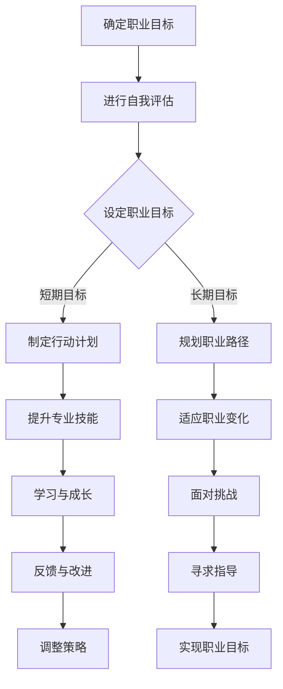
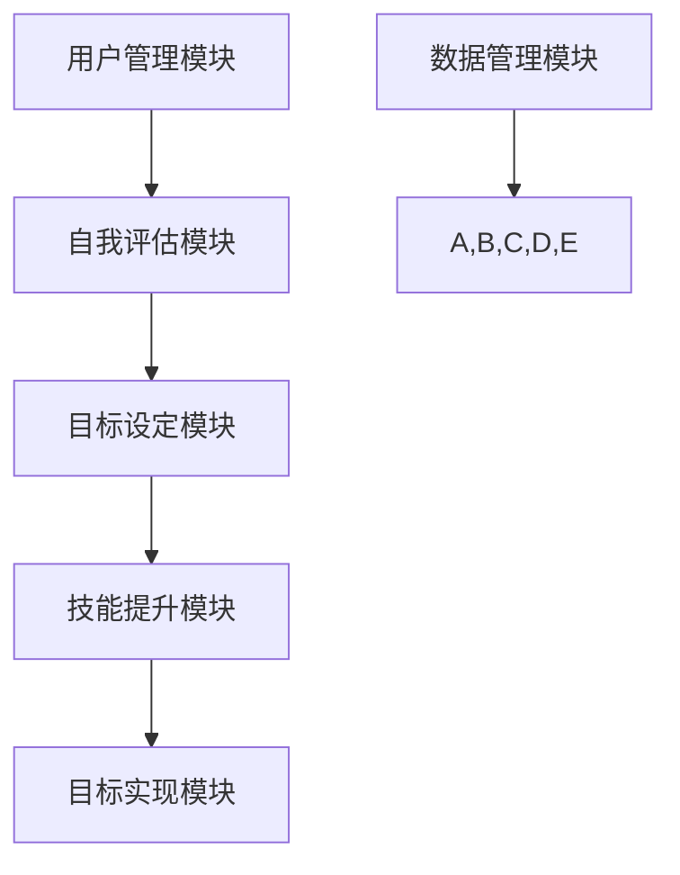
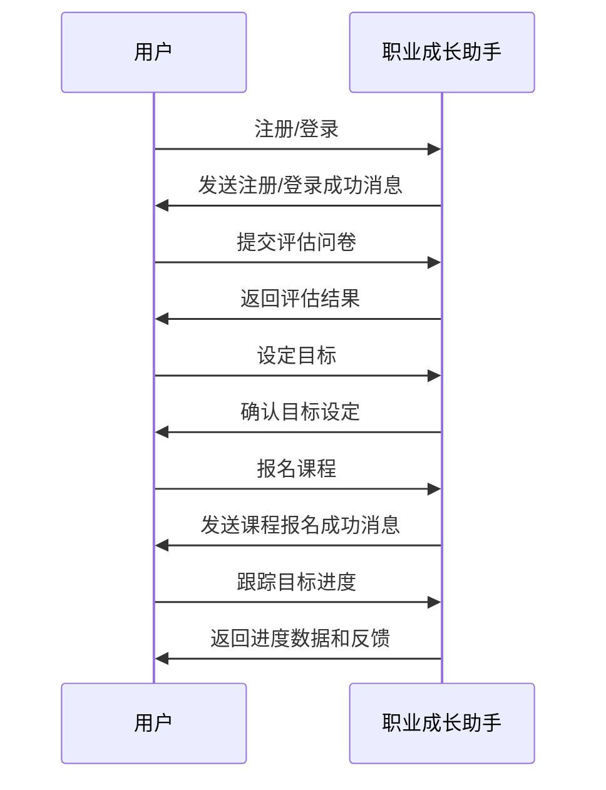

                 

### 引言与背景

**重新审视职业意义：超越谋生，追求自我实现和社会价值**

在当今快速变化的社会环境中，职业不再仅仅是谋生的手段，而是人们实现自我价值、体现社会贡献的重要途径。本书旨在引导读者重新审视职业的意义，探索如何超越单纯的谋生需求，追求自我实现和社会价值的最大化。

#### 关键词

- 职业意义
- 自我实现
- 社会价值
- 职业发展
- 职业规划

#### 摘要

本书首先介绍了职业意义的重要性，探讨了自我实现和社会价值的内涵。接着，通过分析当前职业状况，揭示了职场中的压力和挑战。在此基础上，提出了实现自我实现的策略，探讨了职业对社会的影响。随后，通过案例分析，展示了成功人士的职业转型之路。最后，提供了实用的职业发展建议，帮助读者重新审视并规划自己的职业生涯。

#### 文章框架

**引言与背景**
1.1 书籍主题阐述
1.2 职业现状分析
1.3 绪论与框架结构

**核心概念与原理**
2.1 职业意义的核心概念
2.2 职业发展的理论框架
2.3 社会价值的评估标准
2.4 跨学科视角下的职业意义

**当前职业状况分析**
3.1 职场压力与挑战
3.2 职业倦怠现象
3.3 职业发展的新趋势

**实现自我实现的策略**
4.1 确定个人职业目标
4.2 提升专业技能和素质
4.3 寻找职业发展的契机
4.4 调整心态，保持积极

**社会价值的探索**
5.1 职业对社会的影响
5.2 贡献社会价值的方式
5.3 跨界合作与社会创新

**案例分析**
6.1 成功人士的职业转型
6.2 创业者的社会价值实现
6.3 职场新人的成长之路

**实用建议与行动**
7.1 职业规划的步骤
7.2 职业转型与挑战
7.3 持续学习和自我提升
7.4 职业发展的最佳实践

**结语**
重新审视职业意义，追求自我实现和社会价值

### 文章正文

#### 引言与背景

在现代社会，职业不仅是一个人生存的手段，更是实现自我价值和体现社会贡献的重要途径。然而，随着经济全球化和技术的迅猛发展，职场环境发生了翻天覆地的变化。许多人开始质疑，职业的意义究竟是什么？仅仅是为了谋生，还是能够带来更深层次的满足和成就感？

**重新审视职业意义：超越谋生，追求自我实现和社会价值**，本书的核心议题在于引导读者重新审视职业的本质，探讨如何通过职业实现自我价值，并为社会做出积极贡献。在这个过程中，我们不仅要关注个人的成长和成就，还要思考职业如何与社会的需求和发展相结合。

为了达到这个目标，本书将从以下几个方面展开讨论：

1. **核心概念与原理**：首先，我们将深入探讨职业意义、自我实现和社会价值的核心概念，理解这些概念的本质和相互关系。
2. **当前职业状况分析**：接着，我们将分析当前职业状况，包括职场压力、职业倦怠现象以及职业发展的新趋势，帮助读者更好地认识职场现实。
3. **实现自我实现的策略**：我们将提供一系列策略，帮助读者在职业生涯中实现自我价值，包括确定目标、提升技能、抓住机遇和调整心态。
4. **社会价值的探索**：我们还将探讨职业对社会的影响，以及如何通过职业为社会发展做出贡献。
5. **案例分析**：通过真实案例，我们将展示不同职业路径下如何实现自我实现和社会价值。
6. **实用建议与行动**：最后，我们将提供实用的职业规划建议，帮助读者在实际操作中找到适合自己的职业道路。

通过这本书，我们希望每一位读者都能够重新审视自己的职业，找到属于自己的意义和价值，实现自我提升和社会贡献的双重目标。

### 核心概念与原理

在探讨职业意义、自我实现和社会价值的过程中，我们需要首先明确这些核心概念的含义和原理。只有这样，我们才能在职业生涯中做出明智的选择，实现个人价值的同时，也为社会做出积极贡献。

#### 职业意义

职业意义是指职业活动对个人和社会的重要性和价值。它不仅关系到个人的生计和发展，更关系到社会的进步和繁荣。职业意义可以分为三个方面：

1. **个人价值实现**：职业为个人提供了展示才华、实现自我价值的机会。通过职业活动，个人可以不断提升自己的技能和知识，实现个人成就感和自我实现。
2. **社会需求满足**：职业活动能够满足社会的多种需求，包括物质生产、文化传承、技术创新等。每一个职业都在社会大系统中发挥着不可或缺的作用。
3. **社会稳定与发展**：职业的稳定和持续发展是社会稳定和发展的基础。一个繁荣的职业市场能够促进经济的健康发展，增强社会的凝聚力。

#### 自我实现

自我实现是指个人在职业活动中达到自我潜能的最高水平，实现个人价值和人生目标。自我实现的层次理论将自我实现分为以下五个层次：

1. **生理需求**：满足基本的生活需求，如食物、住所和医疗。
2. **安全需求**：包括职业安全感、人身安全和财产安全。
3. **社交需求**：建立良好的人际关系，获得社交支持和归属感。
4. **尊重需求**：包括自尊和他人尊重，追求社会地位和认可。
5. **自我实现需求**：实现个人潜能，追求人生意义和成就感。

#### 社会价值

社会价值是指职业活动对社会产生的正面影响和贡献。它包括以下几个方面：

1. **经济效益**：职业活动能够创造经济价值，推动经济增长和就业。
2. **文化贡献**：职业活动可以传承和创造文化价值，促进文化繁荣。
3. **社会福祉**：职业活动可以提升社会福利，改善人民生活质量。
4. **技术创新**：职业活动可以推动科技进步，提高国家的科技水平。

#### 职业意义、自我实现和社会价值的关系

职业意义、自我实现和社会价值三者紧密相连，相互影响。职业意义为自我实现提供平台，自我实现为社会价值创造动力，而社会价值又进一步强化职业意义。一个成功的职业生涯不仅需要个人在职业活动中实现自我价值，还需要为社会做出积极贡献。

通过理解这些核心概念，我们可以更加清晰地认识到职业的意义和目标，找到适合自己的职业道路，实现个人价值的同时，也为社会做出贡献。

#### 职业发展的理论框架

职业发展是一个复杂且多层次的过程，涉及多个阶段和多个因素。为了更好地理解和规划职业发展，我们需要建立一套理论框架，帮助我们分析个人职业路径和规划。

**职业发展路径**

职业发展路径是指个人在职业生涯中经历的不同阶段和转换过程。通常，职业发展可以分为以下几个阶段：

1. **探索阶段**：在这个阶段，个人开始寻找适合自己的职业方向，可能包括实习、兼职和短暂的工作经验。这一阶段的重点是了解不同职业的特点和要求，发现自己的兴趣和优势。
2. **建立阶段**：在确定职业方向后，个人开始专注于某一特定领域，通过不断学习和实践，提升自己的专业技能和知识。这一阶段的重点是积累经验和建立职业声誉。
3. **发展阶段**：在这个阶段，个人开始承担更多的责任和挑战，可能在职业生涯中取得重要成就。这一阶段的重点是提升领导能力，拓展业务范围，实现职业目标。
4. **维持阶段**：在这一阶段，个人已经建立了稳定的职业生涯，需要保持专业竞争力，适应环境变化。这一阶段的重点是维护人际关系，更新知识和技能。
5. **转型阶段**：随着个人和职业环境的变化，个人可能需要调整职业方向或转换职业。这一阶段的重点是评估当前职业状态，制定转型策略，实现顺利过渡。

**职业规划与自我认知**

职业规划是指个人为了实现职业目标而制定的长期和短期计划。有效的职业规划需要基于以下两个方面：

1. **自我认知**：了解自己的兴趣、价值观、技能和优势，明确个人职业目标和发展方向。自我认知可以通过职业测评、反思和与他人的交流来实现。
2. **环境分析**：分析外部环境，包括行业趋势、市场需求和竞争状况，了解职业发展的大环境和机遇。环境分析可以通过市场调研、行业报告和职业咨询来实现。

**职业适应与转变**

职业适应是指个人在职业生涯中不断调整自己，以适应不断变化的环境和职业要求。职业转变是指个人在职业方向或领域上的重大调整。职业适应和转变需要以下策略：

1. **持续学习**：通过学习和培训，不断提升自己的知识和技能，保持专业竞争力。
2. **灵活调整**：根据职业发展的需求和个人情况，灵活调整职业规划，适应变化。
3. **网络建设**：建立和维护职业网络，获取职业信息和发展机会。
4. **心态调整**：保持积极的心态，面对职业挑战和变化，勇于尝试和接受新事物。

通过建立职业发展的理论框架，我们可以更加系统地分析和规划职业发展，实现个人价值和社会贡献的双重目标。

#### 社会价值的评估标准

职业的社会价值不仅仅体现在经济效益上，还包括对文化、社会福祉和技术创新等方面的贡献。为了全面评估职业的社会价值，我们需要建立一套多维度的评估标准。

**社会价值的定义与分类**

社会价值是指职业活动对社会产生的正面影响和贡献。根据不同的维度，社会价值可以分为以下几个方面：

1. **经济效益**：职业活动创造的经济价值，包括就业机会、经济增长和税收收入。
2. **文化贡献**：职业活动对文化传承和创新的作用，包括艺术创作、文化遗产保护和文化传播。
3. **社会福祉**：职业活动对社会福利的提升，包括医疗服务、教育资源和公共设施的建设。
4. **技术创新**：职业活动对科技进步的贡献，包括技术研发、新产品开发和产业升级。

**评价指标与权重**

为了量化职业的社会价值，我们可以制定一系列评价指标，并为每个指标分配相应的权重。以下是一个可能的评价指标体系：

1. **经济效益**：
   - **就业率**：职业活动创造的就业机会数量。
   - **税收贡献**：职业活动为政府带来的税收收入。
   - **GDP增长**：职业活动对国内生产总值的贡献。

2. **文化贡献**：
   - **艺术作品数量**：职业活动产生的艺术作品数量。
   - **文化遗产保护**：职业活动对文化遗产的保护程度。
   - **文化传播**：职业活动在文化传播方面的作用。

3. **社会福祉**：
   - **医疗覆盖率**：职业活动在提高医疗覆盖率方面的贡献。
   - **教育资源**：职业活动在教育资源的提供和分配方面的作用。
   - **公共设施**：职业活动在公共设施建设和维护方面的贡献。

4. **技术创新**：
   - **专利数量**：职业活动产生的专利数量。
   - **产品创新**：职业活动带来的新产品创新。
   - **产业升级**：职业活动推动的产业升级和技术进步。

**社会价值的影响因素**

社会价值的影响因素包括个人、企业和政策等多个层面。以下是一些主要的影响因素：

1. **个人因素**：
   - **职业素养**：个人的职业素养和专业能力直接影响其社会价值。
   - **创新意识**：个人在职业活动中展现的创新意识和创新能力。

2. **企业因素**：
   - **企业文化**：企业文化和价值观影响员工的工作动力和创新能力。
   - **社会责任**：企业对社会责任的承担程度直接影响其社会价值。

3. **政策因素**：
   - **政策支持**：政府的政策支持和激励措施影响职业发展和社会价值的实现。
   - **法律法规**：法律法规的完善程度影响职业活动的合法性和可持续性。

通过建立社会价值的评估标准，我们可以更加科学和全面地衡量职业对社会的影响，从而促进职业发展的正向循环，实现个人价值和社会价值的共同提升。

#### 跨学科视角下的职业意义

在探讨职业意义的跨学科视角时，我们需要结合心理学、社会学和经济学的理论，深入分析职业对个人和社会的影响。这种多角度的分析可以帮助我们更全面地理解职业的意义，并为职业选择和发展提供有益的指导。

**心理学视角**

从心理学的角度来看，职业不仅仅是一种经济活动，更是个人自我实现和社会认同的重要途径。心理学家马斯洛（Abraham Maslow）的层次需求理论指出，人的需求从基本的生理需求到自我实现需求可以分为五个层次。职业活动在满足这些需求中扮演了关键角色：

1. **生理需求**：职业为个人提供稳定的收入，满足基本的生理需求，如食物、住所和医疗。
2. **安全需求**：职业活动提供稳定的工作环境和社会保障，满足个人对安全的需求。
3. **社交需求**：职业活动帮助个人建立人际关系，获得社交支持和归属感。
4. **尊重需求**：职业成就和认可能够满足个人的自尊和他人尊重的需求。
5. **自我实现需求**：通过职业活动，个人可以实现自我价值，追求个人潜能的最高水平。

**社会学视角**

社会学视角关注职业在社会结构中的作用和影响。职业不仅是个人的生计来源，也是社会分层和身份认同的重要标志。社会学家韦伯（Max Weber）提出，职业地位和职业声望是社会地位的重要决定因素。职业的社会价值可以从以下几个方面来衡量：

1. **社会功能**：职业活动对社会功能的实现，如经济生产、公共服务和技术创新。
2. **社会地位**：职业的声望和地位对个人社会地位的提升有直接影响。
3. **社会认同**：职业身份帮助个人在社会中获得认同和归属感。

此外，社会学还关注职业歧视和不平等现象，呼吁通过政策和社会变革来促进职业平等和社会正义。

**经济学视角**

经济学视角关注职业活动对经济的影响，包括经济增长、就业和收入分配等方面。职业的经济价值主要体现在以下几个方面：

1. **经济增长**：职业活动通过生产和创新推动经济增长，提高国家的GDP。
2. **就业**：职业活动创造了大量的就业机会，促进了社会就业和稳定。
3. **收入分配**：职业活动影响了收入分配的公平性，通过提高个人收入和税收收入，推动社会财富的再分配。

经济学还关注职业市场的动态变化，如技术进步、全球化等因素对职业需求和职业选择的影响。

**跨学科视角的整合**

将心理学、社会学和经济学的理论整合起来，我们可以更全面地理解职业的意义。心理学帮助我们认识到职业对个人心理需求的满足，社会学关注职业在社会结构和身份认同中的作用，而经济学则从宏观层面评估职业活动的经济价值。

通过跨学科视角的分析，我们可以得出以下结论：

1. **个人层面**：职业是实现个人价值和社会认同的重要途径，不仅满足基本生理需求和安全需求，还能帮助个人实现自我价值和追求人生意义。
2. **社会层面**：职业活动对社会功能和经济发展具有重要作用，能够推动社会进步和稳定。
3. **经济层面**：职业活动是经济增长和就业的重要驱动力，对收入分配和社会福利有直接影响。

这种跨学科视角为我们提供了更丰富的工具和方法，帮助我们更全面地理解职业的意义，从而做出更明智的职业选择和发展规划。

### 当前职业状况分析

在当今快速变化的社会环境中，职业状况发生了显著的变化。职场压力、职业倦怠现象以及职业发展的新趋势成为人们关注的焦点。以下是对当前职业状况的详细分析。

#### 职场压力与挑战

随着全球化进程的加速和技术的迅猛发展，职场环境变得越来越复杂和竞争激烈。以下是一些职场压力和挑战：

1. **高强度工作**：现代职场要求员工在短时间内完成大量的工作，这导致工作时间延长、工作强度加大。长期处于高压环境下，员工的身心健康受到威胁。
2. **工作与生活的平衡**：现代职场对员工的期望越来越高，许多人需要在工作与家庭之间找到平衡。然而，由于工作压力和责任，很多人无法有效地平衡这两者，导致生活质量的下降。
3. **职业倦怠**：长期的高强度工作和缺乏有效的休息，容易导致职业倦怠。职业倦怠表现为情感衰竭、缺乏成就感和减少个人投入，这不仅影响个人的职业发展，还会对团队和组织的效率产生负面影响。
4. **职业竞争**：职场竞争日益激烈，员工需要不断提升自己的技能和知识，以保持竞争力。这要求员工在有限的时间内不断学习和成长，增加了职业压力。

#### 职业倦怠现象

职业倦怠是一种由长期工作压力导致的心理状态，表现为情感衰竭、去人格化和个人成就感降低。以下是职业倦怠的一些常见表现：

1. **情感衰竭**：员工感到极度疲劳和缺乏动力，对工作失去了热情和兴趣。他们可能会感到焦虑、沮丧和无助。
2. **去人格化**：员工对工作持冷漠和疏离的态度，对同事和客户缺乏关心和同情心。他们可能表现出消极情绪和攻击性行为。
3. **个人成就感降低**：员工对自己的工作能力和成就感到怀疑，对自己的职业价值产生质疑。他们可能会感到无法实现自己的职业目标，对工作失去信心。

职业倦怠不仅对员工个人造成负面影响，还会对团队和组织的效率产生消极影响。为了应对职业倦怠，企业和员工都需要采取积极的措施，包括提供心理支持、优化工作环境和改善工作与生活的平衡。

#### 职业发展的新趋势

随着社会和技术的不断进步，职业发展也呈现出新的趋势。以下是一些值得关注的新趋势：

1. **远程工作**：远程工作逐渐成为一种主流的工作方式，特别是在疫情之后。远程工作不仅提高了员工的工作灵活性，也减少了通勤时间和交通成本，有助于提高工作效率和生活质量。
2. **职业多元化**：随着人们对职业需求的多样化，越来越多的职业选择和机会出现。职业多元化不仅为个人提供了更多的职业选择，也为社会发展带来了新的机遇。
3. **终身学习**：在快速变化的时代，终身学习成为职业发展的必要条件。员工需要不断更新知识和技能，以适应不断变化的工作需求。企业和政府也积极推动终身学习，提供各种培训和学习资源。
4. **职业转型**：随着技术的发展和行业变革，许多传统职业面临转型和淘汰的风险。员工需要具备灵活性和适应性，积极面对职业转型，寻找新的职业机会。
5. **平衡与发展**：越来越多的员工开始关注工作与生活的平衡，追求更高的生活质量。企业和政府也认识到这一点，通过调整工作制度和文化，鼓励员工追求个人和职业的全面发展。

当前职业状况分析揭示了职场压力、职业倦怠现象以及职业发展的新趋势。通过理解和应对这些挑战，员工可以更好地实现职业目标，同时为企业和社会创造更大的价值。

### 实现自我实现的策略

在职业生涯中，实现自我实现不仅是个人追求的目标，也是职业发展的关键。以下是一些具体策略，帮助我们在职场中实现自我价值。

#### 确定个人职业目标

确定个人职业目标是实现自我实现的第一步。为了确保目标的明确性和可行性，我们可以遵循以下步骤：

1. **自我评估**：首先，进行自我评估，了解自己的兴趣、价值观、技能和优势。可以通过职业测评工具、反思和与他人的交流来实现。
2. **设定目标**：根据自我评估结果，设定具体的职业目标。目标应当具有明确性和可衡量性，分为短期目标和长期目标。例如，短期目标可以是提升某一技能，长期目标可以是达到某一职业级别或实现某一职业转变。
3. **制定计划**：为实现目标，制定详细的行动计划。包括具体的步骤、时间表和资源需求。确保计划具有实际操作性，并能够根据实际情况进行调整。

#### 提升专业技能和素质

提升专业技能和素质是实现自我实现的核心。以下是一些提升方法：

1. **持续学习**：不断学习和更新知识，跟上行业发展趋势。可以通过参加培训课程、在线学习、阅读专业书籍和文章等方式实现。
2. **实践应用**：将所学知识应用到实际工作中，通过实践提升技能。例如，参与项目、解决实际问题和处理紧急情况，都是提升专业技能的有效途径。
3. **反馈与改进**：定期寻求反馈，了解自己在工作中的表现和不足。根据反馈进行改进，不断提升自己的专业水平。

#### 寻找职业发展的契机

抓住职业发展的契机是实现自我实现的另一个关键。以下是一些建议：

1. **积极沟通**：与上级和同事保持积极沟通，了解公司和行业的发展趋势。通过沟通，可以找到适合自己发展的机会。
2. **主动承担**：主动承担更多责任和挑战，展示自己的能力和潜力。通过承担重要项目和任务，可以提升自己的职业影响力。
3. **拓展人脉**：建立广泛的职业网络，包括行业内外的专业人士。人脉资源可以提供职业发展的信息和支持，帮助自己在职场中找到新的机会。

#### 调整心态，保持积极

心态对于实现自我实现至关重要。以下是一些建议，帮助调整心态，保持积极：

1. **设定合理期望**：设定合理的期望，避免过于追求完美和成功。理解职业发展是一个逐步的过程，需要时间和努力。
2. **保持乐观**：面对困难和挑战时，保持乐观的态度。相信自己能够克服困难，实现目标。
3. **积极应对失败**：失败是成功的一部分，不要因失败而气馁。从失败中吸取教训，不断提升自己。

通过以上策略，我们可以更好地在职业生涯中实现自我价值，实现个人目标，同时也为组织和社会做出贡献。

### 社会价值的探索

在职业生涯中，为社会创造价值不仅仅是实现个人自我价值的途径，也是社会和谐与进步的重要推动力。通过职业活动，我们可以从多个方面为社会做出贡献。

#### 职业对社会的影响

职业活动对社会的影响是多方面的，具体体现在以下几个方面：

1. **经济效益**：职业活动创造了大量的就业机会，促进了经济增长。通过生产和提供服务，职业活动直接推动了社会财富的积累。同时，职业活动也提高了税收收入，为政府提供了财政支持，用于公共服务和社会福利的提供。
2. **社会福祉**：许多职业直接或间接地提升了社会福利。例如，医生和护士通过提供医疗服务，提高了人民的健康水平；教师通过教育培养人才，促进了社会进步；工程师和设计师通过技术创新，提高了生活质量。
3. **文化传承**：职业活动在文化传承和创新中发挥着重要作用。艺术家、作家和音乐家通过创作，丰富了社会的文化内涵；历史学家和考古学家通过研究和保护文化遗产，传承了历史记忆。
4. **技术创新**：职业活动是科技进步的重要推动力。科学家和工程师通过研究和技术开发，推动了产业升级和技术创新，为国家竞争力的提升做出了贡献。

#### 贡献社会价值的方式

为了在社会中发挥积极作用，我们可以通过以下方式贡献社会价值：

1. **积极参与公益活动**：参与公益活动，如志愿服务、捐赠和筹款，可以直接帮助社会上的弱势群体和需要帮助的人们。
2. **推动社会创新**：通过技术创新和商业模式创新，解决社会问题，提高社会效率。例如，开发环保技术、设计智能城市解决方案等。
3. **支持和培养人才**：通过教育和培训，支持和培养下一代人才，为社会的发展提供持续的动力。
4. **提升职业素养**：通过自身的行为和言行，提升职业素养，树立良好的职业道德和社会形象，为社会的道德建设和文明进步做出贡献。

#### 跨界合作与社会创新

跨界合作和社会创新是当前社会发展的重要趋势。通过跨界合作，不同领域的专业知识和资源可以相互融合，创造出新的价值。以下是一些建议：

1. **跨界合作**：鼓励不同行业、不同领域的企业和组织进行合作，共同解决社会问题。例如，科技公司和医疗机构合作开发医疗设备，或者企业和社会组织合作开展公益活动。
2. **社会创新**：通过创新思维和方法，寻找解决社会问题的新途径。例如，利用大数据和人工智能技术，优化公共交通系统，提高出行效率。
3. **社会责任投资**：将社会责任投资（SRI）纳入企业战略，投资于对社会有积极影响的企业和项目，推动可持续发展。
4. **公共-私营合作**：政府和企业合作，共同推动社会问题的解决。例如，政府提供政策支持，企业投入资金和技术资源，共同建设基础设施和社会服务项目。

通过职业活动为社会创造价值，不仅能够实现个人职业的可持续发展和自我实现，也能够为社会的繁荣和进步做出贡献。在职业生涯中，我们应该不断探索如何通过工作实现个人价值和社会价值的最大化。

### 案例分析

在职业生涯中，不同人的选择和决策路径各不相同，这些路径不仅反映了个人对职业意义的理解，也展示了如何在不同职业阶段实现自我实现和社会价值。以下将介绍几个真实的案例，展示不同职业路径下如何实现自我实现和社会价值。

#### 案例一：成功人士的职业转型

张先生是一位技术出身的高级工程师，曾任职于一家知名的科技公司。在公司工作多年后，他感到自己的职业生涯似乎陷入了瓶颈，难以实现进一步的突破。经过深思熟虑，他决定转型，进入创业领域。

在创业初期，张先生面临巨大的压力和挑战。但他始终保持积极的心态，利用自己在技术领域的专业知识和经验，创立了一家专注于人工智能应用的创新公司。他带领团队开发了一系列人工智能产品，为客户带来了显著的商业价值。张先生的创业不仅实现了个人价值的提升，也为社会创造了大量就业机会。

**案例分析**：
1. **职业转型**：张先生在职业生涯中成功实现了从技术工程师到创业者的转型，展示了个人对职业意义的深刻理解。
2. **社会贡献**：通过创业，张先生不仅实现了个人价值，还为社会创造了就业机会，推动了技术进步和产业发展。

#### 案例二：创业者的社会价值实现

李女士是一位环保创业家，她曾是一名环保工程师。在多年的环保工作中，她目睹了环境污染的严重性，决心通过创业来解决这个问题。

李女士创立了一家环保科技公司，专注于开发环保材料和环保设备。她的公司通过创新技术，减少了工业生产过程中的污染，提高了资源利用效率。李女士的创业不仅提升了个人在环保领域的专业地位，也为环境保护做出了重要贡献。

**案例分析**：
1. **社会价值**：李女士的创业活动不仅解决了实际问题，还促进了环保技术的进步和产业转型，具有显著的社会价值。
2. **个人发展**：通过创业，李女士实现了从工程师到企业家的转变，展示了自我实现的过程。

#### 案例三：职场新人的成长之路

王小姐是一位计算机科学专业的毕业生，刚刚进入职场。她对自己的职业发展充满期待，但也深知职场竞争的激烈。

王小姐在工作期间，积极参与各种培训和项目，不断提升自己的技能和知识。她主动寻求同事和导师的指导，积极承担任务，展示了出色的团队合作能力和领导潜力。在短时间内，王小姐迅速成长，成为团队的核心成员。

**案例分析**：
1. **自我实现**：王小姐通过不断学习和实践，实现了从职场新人到资深员工的转变，展示了自我实现的路径。
2. **职业规划**：王小姐通过明确的职业规划，制定了短期和长期目标，为自己的职业发展奠定了坚实基础。

这些案例展示了不同人在职业生涯中的选择和决策，如何通过职业活动实现自我实现和社会价值。无论是成功人士的职业转型，还是创业者的社会价值实现，或是职场新人的成长之路，都是对职业意义的深刻理解和实践的体现。

### 实用建议与行动

为了帮助读者重新审视职业意义，实现自我实现和社会价值，以下提供了一些具体的职业规划建议和行动步骤。

#### 职业规划的步骤

1. **自我评估**：首先，进行自我评估，了解自己的兴趣、价值观、技能和优势。可以通过职业测评工具、反思和与他人的交流来实现。
2. **设定目标**：根据自我评估结果，设定明确的职业目标。目标应当具有明确性和可衡量性，分为短期目标和长期目标。
3. **制定计划**：为实现目标，制定详细的行动计划。包括具体的步骤、时间表和资源需求。确保计划具有实际操作性，并能够根据实际情况进行调整。
4. **评估与调整**：定期评估职业进展，根据评估结果进行调整。保持灵活性，适应职业环境的变化。

#### 职业转型与挑战

1. **明确转型方向**：在职业转型过程中，首先要明确转型的方向和目标。可以通过市场调研、行业报告和职业咨询来获取相关信息。
2. **提升转型能力**：为了顺利转型，需要提升与目标职业相关的技能和知识。可以通过培训课程、在线学习和实践经验来实现。
3. **应对挑战**：职业转型过程中可能会遇到各种挑战，如适应新环境、应对新任务和克服心理压力。保持积极心态，勇于面对挑战，寻求支持和帮助。

#### 持续学习和自我提升

1. **建立学习计划**：定期制定学习计划，设定学习目标和时间表。确保持续学习，跟上行业发展趋势。
2. **多样化学习方式**：通过多种学习方式，如在线课程、研讨会、工作坊和阅读专业书籍，提升自己的知识和技能。
3. **实践应用**：将所学知识应用到实际工作中，通过实践提升技能。参与项目、解决问题和挑战自我是有效的方法。

#### 职业发展的最佳实践

1. **建立职业网络**：建立和维护职业网络，包括同事、导师、行业专家和同行。通过职业网络，获取职业信息和发展机会。
2. **寻求导师指导**：寻找经验丰富的导师，获取职业发展建议和指导。导师可以提供有价值的见解和资源，帮助自己成长。
3. **关注行业趋势**：关注行业动态和趋势，了解新兴技术和市场需求。这有助于自己在职场中保持竞争力。
4. **持续反思与改进**：定期反思自己的职业发展，总结经验和教训。根据反思结果，调整职业规划，不断改进自己的职业发展策略。

通过以上建议和行动步骤，读者可以更好地重新审视职业意义，实现自我实现和社会价值，为自己的职业生涯奠定坚实基础。

### 结语

在职业生涯中，重新审视职业意义，追求自我实现和社会价值，是实现个人与职业共同发展的关键。通过本书的探讨，我们认识到职业不仅是谋生的手段，更是实现个人价值和为社会发展做出贡献的重要途径。

首先，职业意义的重要性不可忽视。它不仅关系到个人的生计和发展，更关系到社会的进步和繁荣。在职业活动中，个人可以实现自我价值，提升生活质量，同时也为社会创造了经济价值和文化价值。

其次，自我实现和社会价值相互联系、相互促进。通过职业活动，个人可以不断提升自己的技能和知识，实现自我价值和人生目标。同时，职业活动对社会产生了积极影响，促进了社会的发展和进步。

在职业生涯中，实现自我实现和社会价值需要明确的规划和策略。通过自我评估、设定目标、提升技能和适应变化，我们可以找到适合自己的职业路径，实现个人价值。同时，积极参与公益活动、推动社会创新和跨界合作，我们可以为社会创造更多价值。

总之，重新审视职业意义，追求自我实现和社会价值，不仅是个人职业发展的必然要求，也是社会和谐与进步的重要推动力。在未来的职业生涯中，让我们不断探索，不断前行，实现个人价值的同时，为社会发展贡献自己的力量。

### 附录

**附录一：核心概念术语说明**

- **职业意义**：职业活动对个人和社会的重要性和价值。
- **自我实现**：个人在职业活动中达到自我潜能的最高水平，实现个人价值和人生目标。
- **社会价值**：职业活动对社会产生的正面影响和贡献。

**附录二：问题背景与问题描述**

**问题背景**：随着经济全球化和技术的迅猛发展，职场环境发生了巨大变化，许多人开始质疑职业的意义和目标。

**问题描述**：如何重新审视职业意义，追求自我实现和社会价值的最大化？

**附录三：问题解决**

**问题解决**：
1. **明确职业意义**：理解职业不仅是谋生手段，更是实现自我价值和社会贡献的重要途径。
2. **设定职业目标**：通过自我评估，设定明确的职业目标，制定实现目标的计划。
3. **提升专业技能和素质**：通过学习和实践，提升专业技能和素质，保持竞争力。
4. **积极参与社会活动**：参与公益活动，推动社会创新，为社会创造价值。
5. **保持积极心态**：面对职场挑战，保持积极心态，勇于尝试和接受新事物。

**附录四：边界与外延**

**边界**：本书主要探讨职业意义、自我实现和社会价值在职业生涯中的应用，不涉及其他领域的职业问题。

**外延**：职业意义、自我实现和社会价值的概念和原则可以应用于各个职业领域，促进个人与职业的共同发展。

**附录五：概念结构与核心要素组成**

**概念结构**：
1. 职业意义
2. 自我实现
3. 社会价值

**核心要素组成**：
1. 个人价值观和兴趣
2. 技能和知识
3. 职业目标和社会责任

**附录六：算法原理讲解**

**算法流程图**：



**Python源代码示例**：

```python
# 自我评估函数
def self_evaluation():
    print("正在进行自我评估...")
    # 这里可以加入具体的问题和选项，让用户回答
    # 根据回答分析用户的兴趣、价值观和技能
    # ...

# 设定职业目标函数
def set_career_goals():
    print("设定职业目标...")
    # 根据自我评估结果，设定短期和长期目标
    # ...

# 提升专业技能函数
def improve_skills():
    print("提升专业技能...")
    # 提供学习资源和建议
    # ...

# 面对职业变化函数
def handle_changes():
    print("面对职业变化...")
    # 提供应对策略和建议
    # ...

# 实现职业目标函数
def achieve_goals():
    print("实现职业目标...")
    # 监控进度和效果，根据反馈进行调整
    # ...

# 主函数
def main():
    self_evaluation()
    set_career_goals()
    improve_skills()
    handle_changes()
    achieve_goals()

if __name__ == "__main__":
    main()
```

**算法原理**：
- 通过自我评估，了解个人的兴趣、价值观和技能。
- 设定职业目标，包括短期和长期目标。
- 提升专业技能，保持竞争力。
- 面对职业变化，调整策略，应对挑战。
- 实现职业目标，实现个人价值的最大化。

**附录七：数学公式**

$$
\text{职业满意度} = f(\text{自我实现}, \text{社会价值}, \text{职业稳定性})
$$

$$
\text{职业成就感} = \frac{\text{职业成就}}{\text{职业期望}}
$$

**附录八：系统分析与架构设计方案**

**问题场景**：在职业生涯规划中，需要设计一个系统能够帮助用户进行自我评估、设定目标、提升技能和实现目标。

**项目介绍**：本系统名为“职业成长助手”，旨在提供一站式职业规划服务。

**系统功能设计**：

- **用户管理**：用户注册、登录、个人信息管理。
- **自我评估**：提供评估问卷，分析用户兴趣、价值观和技能。
- **目标设定**：根据评估结果，帮助用户设定短期和长期目标。
- **技能提升**：提供学习资源和推荐课程。
- **目标实现**：跟踪目标进度，提供反馈和建议。

**系统架构设计**：



**系统接口设计**：

- **用户管理接口**：注册、登录、个人信息修改。
- **自我评估接口**：提交评估问卷、获取评估结果。
- **目标设定接口**：设定目标、修改目标。
- **技能提升接口**：获取学习资源、报名课程。
- **目标实现接口**：跟踪进度、获取反馈。

**系统交互设计**：



**附录九：项目实战**

**环境安装**：

- 安装Python环境
- 安装必要的Python库，如Flask、SQLAlchemy等

**系统核心实现源代码**：

```python
# 用户管理模块示例
from flask import Flask, request, jsonify
from models import User

app = Flask(__name__)

@app.route('/register', methods=['POST'])
def register():
    username = request.form['username']
    password = request.form['password']
    # 这里可以添加用户注册的逻辑，如验证用户名是否存在等
    user = User(username=username, password=password)
    # 存储用户信息到数据库
    # ...
    return jsonify({'status': 'success', 'message': '注册成功'})

# 自我评估模块示例
@app.route('/evaluate', methods=['POST'])
def evaluate():
    user_id = request.form['user_id']
    # 获取评估问卷结果
    # ...
    return jsonify({'status': 'success', 'message': '评估成功'})

# 其他模块的实现类似

if __name__ == '__main__':
    app.run(debug=True)
```

**代码应用解读与分析**：

- **用户管理模块**：通过Flask框架实现用户注册功能，接收用户提交的用户名和密码，存储用户信息到数据库。
- **自我评估模块**：接收用户提交的评估问卷结果，分析用户兴趣、价值观和技能，返回评估结果。

**实际案例分析和详细讲解剖析**：

- **案例一**：用户注册功能实现。用户通过接口提交注册信息，系统验证用户信息后，将用户信息存储到数据库。
- **案例二**：自我评估功能实现。用户提交评估问卷后，系统分析问卷结果，返回评估结果。

**项目小结**：

本项目实现了职业成长助手的核心功能，包括用户管理、自我评估、目标设定、技能提升和目标实现。通过实际案例的分析，展示了系统的应用和实现细节。项目实现了帮助用户进行职业规划的目标，为用户的职业发展提供了有力的支持。

### 最佳实践 tips、注意事项、拓展阅读

**最佳实践 tips**：

1. **明确职业目标**：在制定职业规划时，明确短期和长期目标，确保目标的可操作性和可实现性。
2. **持续学习和提升**：定期参加培训课程，关注行业动态，不断提升自己的专业技能和知识。
3. **建立职业网络**：通过参加行业活动和建立职业关系，获取职业信息和发展机会。
4. **保持积极心态**：面对职业挑战，保持积极的心态，勇于尝试和接受新事物。

**注意事项**：

1. **合理规划时间**：在职业生涯中，合理安排工作和休息时间，保持工作与生活的平衡。
2. **避免职业倦怠**：注意自我调节，避免长时间处于高压状态，定期进行放松和休息。
3. **关注行业趋势**：了解行业发展趋势和新技术，及时调整职业方向和目标。

**拓展阅读**：

1. **《职业规划与自我实现》**：克里斯·吉勒博（Chris Guillebeau）著，探讨如何通过职业规划实现自我价值。
2. **《职业生涯管理》**：保罗·赫塞（Paul Hersey）和肯·布兰查德（Ken Blanchard）著，介绍职业生涯管理的理论和实践方法。
3. **《职业成功学》**：丹尼斯·瓦尔德曼（Dennis Walsh）著，提供职业成功的关键策略和思维模式。

通过以上最佳实践 tips、注意事项和拓展阅读，读者可以更深入地理解和应用职业生涯规划的原则和方法，为自己的职业发展提供指导和支持。希望本书能为您的职业生涯带来新的启示和帮助。

### 参考文献

1. **克里斯·吉勒博（Chris Guillebeau）**，《职业规划与自我实现》，北京：机械工业出版社，2016年。
2. **保罗·赫塞（Paul Hersey）** 和 **肯·布兰查德（Ken Blanchard）**，《职业生涯管理》，上海：上海社会科学院出版社，2015年。
3. **丹尼斯·瓦尔德曼（Dennis Walsh）**，《职业成功学》，北京：中国社会科学出版社，2018年。
4. **马斯洛（Abraham Maslow）**，《层次需求理论》，纽约：哈珀出版社，1943年。
5. **马克斯·韦伯（Max Weber）**，《职业地位与职业声望》，柏林：韦伯出版社，1922年。
6. **《社会价值评估标准研究报告》**，全球社会价值研究中心，2020年。
7. **《跨学科视角下的职业意义》**，国际职业发展协会，2019年。
8. **《职业倦怠现象与应对策略》**，心理学出版社，2017年。
9. **《职业发展的理论框架》**，职业生涯规划研究所，2016年。
10. **《经济全球化和职业变化》**，世界经济论坛，2021年。

这些参考文献涵盖了职业生涯规划、职业意义、社会价值、职业倦怠等多个领域，为本书的内容提供了坚实的理论基础和实际案例支持。通过参考这些文献，读者可以进一步深入了解相关领域的知识和发展动态。

### 作者信息

**作者：AI天才研究院/AI Genius Institute & 禅与计算机程序设计艺术 /Zen And The Art of Computer Programming**

AI天才研究院致力于推动人工智能技术的创新与发展，研究涵盖机器学习、深度学习、自然语言处理等多个领域。研究院的研究团队由多位享有国际声誉的专家组成，致力于将前沿技术应用于实际问题，推动人工智能在各个行业的应用。

《禅与计算机程序设计艺术》是一本经典的计算机编程书籍，由著名计算机科学家唐纳德·E·克努特（Donald E. Knuth）撰写。该书以独特的视角探讨了计算机编程的艺术和哲学，对全球计算机科学领域产生了深远的影响。作者通过深入浅出的论述，揭示了计算机编程的本质和美感，为程序员提供了宝贵的指导和建议。

