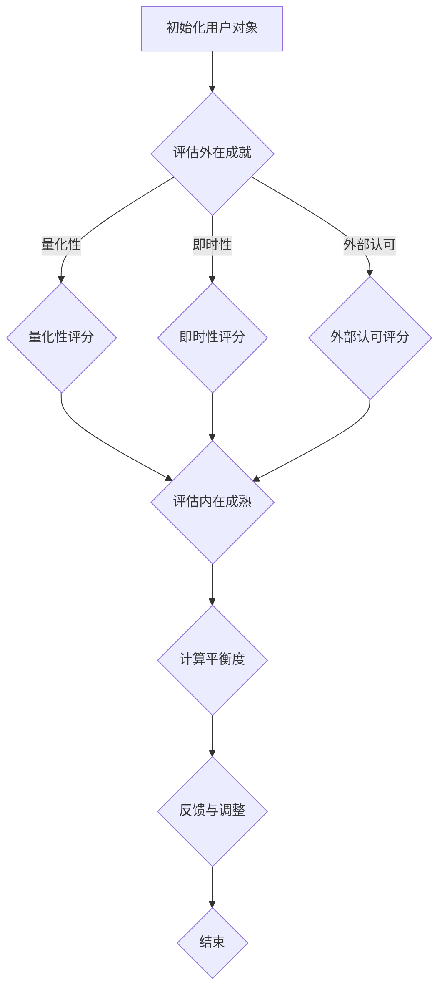
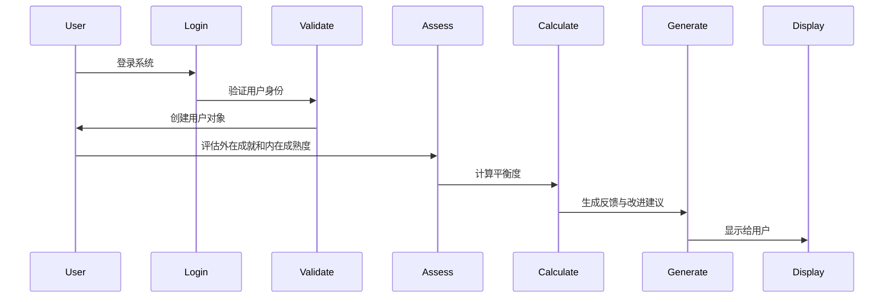
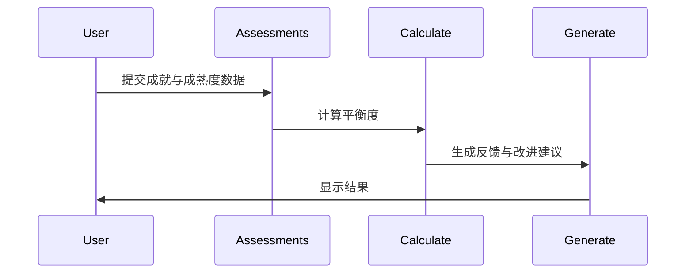
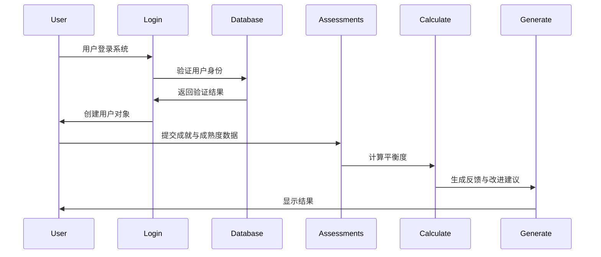

                 


# 重新思考个人成长：从外在成就到内在成熟的蜕变

关键词：个人成长、外在成就、内在成熟、自我反思、情绪智力、心智成熟

摘要：本文从多个角度重新思考个人成长的过程，探讨了从外在成就驱动向内在成熟转变的必要性和路径。通过分析外在成就的局限性、内在成熟的核心要素以及如何通过自我反思和情绪智力提升内在成熟度，作者提供了一种全新的成长视角，旨在帮助读者实现更深层次的自我提升。

## 引言

在现代社会，个人成长已经成为一个热门话题。人们渴望通过不断的努力和追求，实现外在成就，如事业成功、财富积累、社会地位提升等。然而，随着时代的变迁，人们开始意识到，单纯追求外在成就并不能带来真正的满足和幸福。相反，它可能带来一系列的心理困扰和人际关系问题。因此，重新思考个人成长的意义和路径，从外在成就转向内在成熟，成为当代人亟待解决的问题。

本文旨在探讨如何实现这一转变，提供实用的方法和策略。通过以下章节，我们将深入分析外在成就的局限性、内在成熟的核心要素，以及如何通过自我反思和情绪智力提升内在成熟度。

## 第1章 理解外在成就

### 1.1 外在成就的定义与特征

外在成就通常指的是通过外部衡量标准获得的成功，如财富、地位、荣誉等。它具有以下几个特征：

- **量化性**：外在成就往往可以通过具体的数字或指标来衡量，如收入、职位等级、销售业绩等。
- **即时性**：外在成就通常能够迅速带来满足感和认可，如晋升、奖金等。
- **外部认可**：外在成就的取得往往需要得到外界的认可和赞扬。

### 1.2 外在成就的局限性

虽然外在成就可以给人带来一定的满足感，但它也存在一定的局限性：

- **短暂性**：外在成就往往难以持久，随着时间的推移，它们可能会逐渐消失。
- **依赖性**：过度追求外在成就可能导致对他人认可和外部刺激的依赖，从而忽视内在需求。
- **心理负担**：外在成就的压力可能导致心理负担增加，如焦虑、压力等。

### 1.3 外在成就与内在成熟的平衡

为了实现个人成长，我们需要在追求外在成就的同时，注重内在成熟的发展。外在成就可以作为衡量个人能力的指标，但不应成为唯一目标。内在成熟则关注个人的心理素质、情感智慧和自我认知，这些因素对于长期的个人成长和幸福感至关重要。

## 第2章 从外在成就到内在成熟

### 2.1 内在成熟的概念与特征

内在成熟指的是个人在心理、情感和智力等方面的全面发展。它具有以下几个特征：

- **自我认知**：内在成熟的人能够清楚地认识自己，了解自己的优点和缺点。
- **情感智慧**：内在成熟的人具备良好的情感管理能力，能够处理自己的情绪和他人的情绪。
- **心理弹性**：内在成熟的人能够适应生活中的挑战和变化，保持积极的心态。

### 2.2 内在成熟的发展路径

要实现从外在成就到内在成熟的转变，我们可以采取以下路径：

- **自我反思**：通过定期进行自我反思，了解自己的行为和思维模式，从而识别和改变不良习惯。
- **情感管理**：通过学习情感智力技巧，提高自己的情绪管理能力，更好地应对生活中的挑战。
- **持续学习**：不断学习新知识和技能，提高自己的认知能力和适应能力。

### 2.3 自我评估工具

为了帮助读者了解自己的内在成熟度，我们可以提供一些自我评估工具，如问卷、量表等。这些工具可以帮助读者识别自己在内在成熟方面的优势和不足，从而有针对性地进行提升。

## 第3章 自我反思在个人成长中的作用

### 3.1 自我反思的重要性

自我反思是个人成长的重要工具。它能够帮助我们：

- **识别问题**：通过反思，我们可以发现自己在行为和思维上的问题，从而有针对性地进行改进。
- **促进学习**：自我反思能够帮助我们总结经验教训，从过去的经历中学习，提高自己的能力。
- **增强自我意识**：自我反思能够帮助我们更好地认识自己，了解自己的需求和价值观。

### 3.2 自我反思的技巧与实践

为了进行有效的自我反思，我们可以采取以下技巧：

- **定期回顾**：定期回顾自己的行为和决策，分析其结果和影响。
- **写下反思**：将反思过程记录下来，有助于加深理解和记忆。
- **与他人交流**：与他人分享自己的反思，可以获得不同的视角和建议。

### 3.3 自我反思的障碍与克服策略

在自我反思过程中，我们可能会遇到以下障碍：

- **自我怀疑**：怀疑自己的能力和判断，导致反思过程受阻。
- **逃避现实**：不愿意面对自己的问题和错误，选择逃避。

为了克服这些障碍，我们可以采取以下策略：

- **建立自信**：通过认可自己的成就和进步，建立自信心。
- **勇于面对**：勇敢面对自己的问题和错误，勇于承担责任。

## 第4章 情绪智力与心智成熟

### 4.1 情绪智力的概念与特征

情绪智力指的是人们识别、理解、管理和利用情绪的能力。它具有以下几个特征：

- **情绪识别**：能够识别自己和他人的情绪状态。
- **情绪理解**：能够理解情绪产生的原因和意义。
- **情绪管理**：能够有效地管理自己的情绪，保持冷静和理智。
- **情绪利用**：能够利用情绪为个人的生活和职业发展服务。

### 4.2 情绪智力对心智成熟的影响

情绪智力对于心智成熟具有重要作用。它能够帮助我们：

- **提高心理弹性**：通过有效管理情绪，提高对生活中挑战的适应能力。
- **改善人际关系**：通过理解和识别他人的情绪，改善与他人的沟通和互动。
- **促进自我认知**：通过情绪智力，更好地了解自己的内心世界，促进自我认知的发展。

### 4.3 提高情绪智力的方法

为了提高情绪智力，我们可以采取以下方法：

- **情绪教育**：通过学习情绪智力相关知识，提高对情绪的认识和理解。
- **实践技巧**：通过练习情绪管理技巧，如深呼吸、冥想等，提高情绪管理能力。
- **寻求帮助**：在面对情绪问题时，寻求专业人士的帮助和建议。

## 第5章 从外在成就到内在成熟的实践

### 5.1 实践步骤

要实现从外在成就到内在成熟的转变，我们可以采取以下步骤：

- **明确目标**：设定清晰的个人成长目标，包括外在成就和内在成熟。
- **制定计划**：制定详细的计划，包括具体的行动步骤和时间安排。
- **执行与反思**：按照计划执行，并在过程中进行定期反思，调整策略。

### 5.2 实践案例

以下是一些成功实现从外在成就到内在成熟转变的案例：

- **案例1**：一位企业家在成功建立自己的公司后，开始专注于提升自己的情感智力和心理素质，最终在事业上取得了更大的成功，同时也获得了更多的幸福感。
- **案例2**：一位职场人士在追求职业成功的同时，注重自我反思和情绪管理，逐渐实现了个人成长和内心的平静。

### 5.3 实践心得

通过实践，我们可以获得以下心得：

- **持续学习**：个人成长是一个持续的过程，需要不断地学习和进步。
- **平衡发展**：在追求外在成就的同时，注重内在成熟的发展，实现平衡。
- **勇敢面对**：面对挑战和困难时，保持勇敢和坚定，勇于面对自己的问题和错误。

## 总结

重新思考个人成长，从外在成就到内在成熟的蜕变，是一种更加全面和深入的成长方式。通过理解外在成就的局限性、发展内在成熟的核心要素，以及通过自我反思和情绪智力提升内在成熟度，我们可以实现更深层次的自我提升和幸福感。希望本文能够为您的个人成长之路提供有益的启示和指导。

### 附录

#### 关键术语解释

- **外在成就**：通过外部衡量标准获得的成功，如财富、地位、荣誉等。
- **内在成熟**：个人在心理、情感和智力等方面的全面发展。
- **自我反思**：通过反思自己的行为和思维模式，识别问题并进行改进。
- **情绪智力**：识别、理解、管理和利用情绪的能力。

#### 扩展阅读

- 《情感智力》作者：丹尼尔·戈尔曼
- 《当下的力量》作者：埃克哈特·托勒
- 《自我发展心理学》作者：马斯洛

#### 注意事项

- 在追求外在成就时，要注意平衡内在成熟的发展。
- 定期进行自我反思，有助于个人成长和自我提升。
- 提高情绪智力，有助于更好地应对生活中的挑战。

### 作者信息

作者：AI天才研究院/AI Genius Institute & 禅与计算机程序设计艺术/Zen And The Art of Computer Programming

文章标题：重新思考个人成长：从外在成就到内在成熟的蜕变

关键词：个人成长、外在成就、内在成熟、自我反思、情绪智力

摘要：本文从多个角度重新思考个人成长的过程，探讨了从外在成就驱动向内在成熟转变的必要性和路径。通过分析外在成就的局限性、内在成熟的核心要素以及如何通过自我反思和情绪智力提升内在成熟度，作者提供了一种全新的成长视角，旨在帮助读者实现更深层次的自我提升。

### 背景介绍

在现代社会，个人成长已经成为一个热门话题。人们渴望通过不断的努力和追求，实现外在成就，如事业成功、财富积累、社会地位提升等。然而，随着时代的变迁，人们开始意识到，单纯追求外在成就并不能带来真正的满足和幸福。相反，它可能带来一系列的心理困扰和人际关系问题。因此，重新思考个人成长的意义和路径，从外在成就转向内在成熟，成为当代人亟待解决的问题。

本文旨在探讨如何实现这一转变，提供实用的方法和策略。通过以下章节，我们将深入分析外在成就的局限性、内在成熟的核心要素，以及如何通过自我反思和情绪智力提升内在成熟度。

### 核心概念与联系

#### 核心概念

**外在成就**：外在成就通常指的是通过外部衡量标准获得的成功，如财富、地位、荣誉等。它具有以下几个特征：

1. **量化性**：外在成就往往可以通过具体的数字或指标来衡量，如收入、职位等级、销售业绩等。
2. **即时性**：外在成就通常能够迅速带来满足感和认可，如晋升、奖金等。
3. **外部认可**：外在成就的取得往往需要得到外界的认可和赞扬。

**内在成熟**：内在成熟指的是个人在心理、情感和智力等方面的全面发展。它具有以下几个特征：

1. **自我认知**：内在成熟的人能够清楚地认识自己，了解自己的优点和缺点。
2. **情感智慧**：内在成熟的人具备良好的情感管理能力，能够处理自己的情绪和他人的情绪。
3. **心理弹性**：内在成熟的人能够适应生活中的挑战和变化，保持积极的心态。

#### 概念属性特征对比表格

| 特征            | 外在成就                                     | 内在成熟                                     |
| --------------- | ------------------------------------------ | ------------------------------------------ |
| 衡量标准        | 外部衡量标准（如财富、地位、荣誉等）         | 心理、情感和智力全面发展的程度               |
| 影响因素        | 外部因素（如社会环境、他人评价等）           | 内部因素（如自我认知、情感智慧、心理弹性等）   |
| 持久性          | 短期内的持久性较低                           | 长期的持久性和稳定性较高                     |
| 满足感来源       | 短期的满足感和认可                           | 长期的内心满足和幸福感                       |
| 面临挑战        | 可能导致依赖外部认可和刺激                   | 需要面对内心的挑战和自我提升                 |

#### 概念联系

外在成就和内在成熟之间存在密切的联系和相互作用。外在成就可以作为衡量个人能力的指标，但不应成为唯一目标。内在成熟则关注个人的心理素质、情感智慧和自我认知，这些因素对于长期的个人成长和幸福感至关重要。

外在成就的取得可以为内在成熟提供资源和条件，如时间和精力。然而，如果过度追求外在成就，可能导致忽视内在成熟的发展，从而影响个人的全面成长。相反，内在成熟可以增强个人的心理韧性，提高对生活中挑战的适应能力，从而有助于实现更高的外在成就。

#### ER实体关系图架构

```mermaid
erDiagram
    User ||--|{ Achievement }|--|| ExternalAchievement
    User ||--|{ Maturity }|--|| InnerMaturity
    ExternalAchievement ||--|{ Limitation }|--|| LimitationOfExternalAchievement
    InnerMaturity ||--|{ Component }|--|| ComponentOfInnerMaturity
```

在该ER图架构中，用户（User）与外在成就（ExternalAchievement）和内在成熟（InnerMaturity）之间存在关联。外在成就具有局限性（LimitationOfExternalAchievement），而内在成熟由多个组件（ComponentOfInnerMaturity）构成。这些组件包括自我认知、情感智慧和心理弹性等。

### 算法原理讲解

为了帮助读者更好地理解外在成就与内在成熟之间的关系，我们可以使用以下算法原理和流程图。

#### 算法描述

1. **初始化**：设置一个用户对象，包含外在成就和内在成熟两个部分。
2. **评估外在成就**：根据用户的外在成就，评估其量化性、即时性和外部认可程度。
3. **评估内在成熟**：根据用户的内在成熟度，评估其自我认知、情感智慧和心理弹性。
4. **平衡评估**：计算外在成就与内在成熟之间的平衡度，以确定个人的整体成长状况。
5. **反馈与调整**：根据评估结果，为用户提供反馈和改进建议，帮助其实现从外在成就到内在成熟转变。

#### Mermaid流程图



#### Python源代码实现

```python
class User:
    def __init__(self, achievements, maturity):
        self.achievements = achievements
        self.maturity = maturity

    def assess_achievements(self):
        quantification_score = self.achievements['quantification']
        immediacy_score = self.achievements['immediacy']
        external_recognition_score = self.achievements['external_recognition']
        return quantification_score, immediacy_score, external_recognition_score

    def assess_maturity(self):
        self_knowledge_score = self.maturity['self_knowledge']
        emotional_intelligence_score = self.maturity['emotional_intelligence']
        psychological_resilience_score = self.maturity['psychological_resilience']
        return self_knowledge_score, emotional_intelligence_score, psychological_resilience_score

    def calculate_balance(self):
        quantification_score, immediacy_score, external_recognition_score = self.assess_achievements()
        self_knowledge_score, emotional_intelligence_score, psychological_resilience_score = self.assess_maturity()
        balance_score = (quantification_score + immediacy_score + external_recognition_score) / 3
        return balance_score

    def provide_feedback(self):
        balance_score = self.calculate_balance()
        if balance_score < 0.5:
            print("您的外在成就与内在成熟度存在较大差距，建议关注内在成熟的发展。")
        elif balance_score < 0.75:
            print("您的外在成就与内在成熟度较为平衡，但仍有提升空间。")
        else:
            print("您的外在成就与内在成熟度较为均衡，保持现状即可。")

# 示例
user = User(achievements={'quantification': 0.8, 'immediacy': 0.7, 'external_recognition': 0.9},
             maturity={'self_knowledge': 0.6, 'emotional_intelligence': 0.7, 'psychological_resilience': 0.5})
user.provide_feedback()
```

#### 算法原理详细说明

1. **初始化用户对象**：用户对象包含外在成就和内在成熟两个部分，分别用字典表示。
2. **评估外在成就**：通过调用`assess_achievements`方法，对用户的量化性、即时性和外部认可程度进行评估。这三个评分分别反映了外在成就的不同方面。
3. **评估内在成熟**：通过调用`assess_maturity`方法，对用户的自我认知、情感智慧和心理弹性进行评估。这三个评分分别反映了内在成熟的不同方面。
4. **计算平衡度**：通过`calculate_balance`方法，计算外在成就与内在成熟之间的平衡度。平衡度分数越高，表示两者之间的差距越小，个人成长越均衡。
5. **反馈与调整**：根据平衡度分数，为用户提供反馈和改进建议。如果平衡度较低，说明内在成熟度有待提升；如果平衡度较高，则说明外在成就与内在成熟度较为均衡。

通过上述算法原理和Python实现，读者可以更好地理解外在成就与内在成熟之间的关系，以及如何通过评估和反馈来推动个人成长。

### 数学公式与解释

为了深入探讨个人成长中的核心概念，我们可以借助数学公式来表示和解释这些概念。以下是几个关键数学公式及其在个人成长中的应用。

#### 1. 成就贡献率

$$
C_A = \frac{E_A \times Q_A}{T_A}
$$

其中：
- $C_A$：成就贡献率
- $E_A$：外在成就
- $Q_A$：量化性评分
- $T_A$：总时间

成就贡献率表示在总时间中，外在成就对个人成长的贡献比例。量化性评分越高，表示外在成就的量化程度越高，对成长的贡献也越大。

#### 2. 成熟度系数

$$
M_C = \frac{S_K + E_I + R_P}{3}
$$

其中：
- $M_C$：成熟度系数
- $S_K$：自我认知评分
- $E_I$：情感智慧评分
- $R_P$：心理弹性评分

成熟度系数综合反映了个人在自我认知、情感智慧和心理弹性三个方面的成熟度。评分越高，表示内在成熟度越高。

#### 3. 成长平衡指数

$$
B_I = \frac{C_A + M_C}{2}
$$

其中：
- $B_I$：成长平衡指数

成长平衡指数表示外在成就与内在成熟之间的平衡程度。指数越高，表示个人成长越均衡。

#### 4. 自我反思频率

$$
F_R = \frac{T_R}{T_S}
$$

其中：
- $F_R$：自我反思频率
- $T_R$：自我反思时间
- $T_S$：总时间

自我反思频率表示在总时间中，进行自我反思的次数。频率越高，表示个人越重视自我成长和反思。

#### 5. 情绪智力效能

$$
E_IQ = \frac{E_I + M_E}{2}
$$

其中：
- $E_IQ$：情绪智力效能
- $E_I$：情感智慧评分
- $M_E$：情绪管理效能

情绪智力效能综合反映了个人在情感智慧和情绪管理方面的能力。效能越高，表示个人在处理情绪问题时的能力越强。

### 公式举例说明

假设一位用户的外在成就量化性评分为0.8，即时性评分为0.7，外部认可评分为0.9；自我认知评分为0.6，情感智慧评分为0.7，心理弹性评分为0.5。根据上述公式，我们可以计算出该用户的成长相关指标。

1. **成就贡献率**：

$$
C_A = \frac{0.8 \times 0.7 \times 0.9}{1} = 0.504
$$

2. **成熟度系数**：

$$
M_C = \frac{0.6 + 0.7 + 0.5}{3} = 0.633
$$

3. **成长平衡指数**：

$$
B_I = \frac{0.504 + 0.633}{2} = 0.563
$$

4. **自我反思频率**：

假设用户每天花费1小时进行自我反思，总时间为100小时，则自我反思频率为：

$$
F_R = \frac{1}{100} = 0.01
$$

5. **情绪智力效能**：

假设用户的情绪管理效能评分为0.8，则情绪智力效能：

$$
E_IQ = \frac{0.7 + 0.8}{2} = 0.75
$$

通过计算这些指标，用户可以更好地了解自己在个人成长中的表现，以及需要改进的方面。

### 系统分析与架构设计方案

#### 1. 问题场景介绍

在现代社会，个人成长已经成为每个人追求的目标。然而，许多人往往过度追求外在成就，而忽视了内在成熟的发展。这种不平衡的发展可能导致心理压力和人际关系问题。为了帮助人们更好地实现个人成长，我们需要设计一个系统，帮助用户评估自己的外在成就和内在成熟度，并提供相应的反馈和改进建议。

#### 2. 项目介绍

本项目名为“个人成长评估系统”，旨在帮助用户全面了解自己的外在成就和内在成熟度，并提供个性化的成长建议。系统功能包括用户注册、成就与成熟度评估、反馈与改进建议、数据分析与可视化等。

#### 3. 系统功能设计（领域模型Mermaid类图）

```mermaid
classDiagram
    User <<class{用户}>
    Achievement <<class{成就}>
    Maturity <<class{成熟度}>
    Feedback <<class{反馈}>
    Improvement <<class{改进建议}>
    
    User o--o Achievement: 成就
    User o--o Maturity: 成熟度
    User o--o Feedback: 反馈
    User o--o Improvement: 改进建议
```

#### 4. 系统架构设计（Mermaid架构图）



#### 5. 系统接口设计（Mermaid序列图）



#### 6. 系统交互设计（Mermaid序列图）



### 项目实战

#### 1. 环境安装

为了搭建“个人成长评估系统”，我们需要以下环境：

- Python 3.8及以上版本
- Flask 框架
- SQLAlchemy 数据库
- Mermaid 图库

安装步骤如下：

1. 安装Python：从官网下载并安装Python 3.8及以上版本。
2. 安装Flask：在命令行中执行`pip install flask`。
3. 安装SQLAlchemy：在命令行中执行`pip install sqlalchemy`。
4. 安装Mermaid：在命令行中执行`pip install mermaid`。

#### 2. 系统核心实现源代码

以下是一个简单的“个人成长评估系统”核心实现源代码，包括用户注册、登录、成就与成熟度评估、反馈与改进建议等功能。

```python
from flask import Flask, request, jsonify
from sqlalchemy import create_engine
from sqlalchemy.orm import sessionmaker
from models import User, Achievement, Maturity

app = Flask(__name__)
engine = create_engine('sqlite:///users.db')
Session = sessionmaker(bind=engine)
session = Session()

@app.route('/register', methods=['POST'])
def register():
    username = request.json['username']
    password = request.json['password']
    user = User(username=username, password=password)
    session.add(user)
    session.commit()
    return jsonify({'status': 'success', 'message': 'User registered successfully.'})

@app.route('/login', methods=['POST'])
def login():
    username = request.json['username']
    password = request.json['password']
    user = session.query(User).filter_by(username=username, password=password).first()
    if user:
        return jsonify({'status': 'success', 'message': 'Login successful.'})
    else:
        return jsonify({'status': 'failure', 'message': 'Invalid credentials.'})

@app.route('/assess', methods=['POST'])
def assess():
    username = request.json['username']
    user = session.query(User).filter_by(username=username).first()
    if user:
        achievement_data = request.json['achievement']
        maturity_data = request.json['maturity']
        user.achievements = Achievement(achievement_data)
        user.maturity = Maturity(maturity_data)
        session.commit()
        return jsonify({'status': 'success', 'message': 'Assessment submitted successfully.'})
    else:
        return jsonify({'status': 'failure', 'message': 'User not found.'})

@app.route('/feedback', methods=['GET'])
def feedback():
    username = request.args.get('username')
    user = session.query(User).filter_by(username=username).first()
    if user:
        balance = user.calculate_balance()
        feedback = user.generate_feedback(balance)
        return jsonify({'status': 'success', 'message': 'Feedback received.', 'feedback': feedback})
    else:
        return jsonify({'status': 'failure', 'message': 'User not found.'})

if __name__ == '__main__':
    app.run(debug=True)
```

#### 3. 代码应用解读与分析

上述代码实现了一个简单的“个人成长评估系统”。以下是代码的主要部分解读和分析：

1. **用户注册**：通过`/register`接口，用户可以注册账号。注册时需要提供用户名和密码，系统将创建用户对象并保存到数据库中。

2. **用户登录**：通过`/login`接口，用户可以登录系统。登录时需要提供用户名和密码，系统将验证用户身份并返回登录结果。

3. **成就与成熟度评估**：通过`/assess`接口，用户可以提交自己的成就和成熟度数据。系统将根据这些数据创建成就和成熟度对象，并保存到数据库中。

4. **反馈与改进建议**：通过`/feedback`接口，用户可以获取系统对其个人成长情况的反馈和改进建议。系统将根据用户的成就和成熟度数据计算平衡度，并生成相应的反馈。

#### 4. 实际案例分析和详细讲解剖析

以下是一个实际案例，展示如何使用“个人成长评估系统”进行个人成长评估。

**案例**：用户张三希望通过系统评估自己的个人成长情况，并获取反馈和改进建议。

1. **注册与登录**：张三首先在系统中注册了一个账号，并使用用户名“zhangsan”和密码“123456”登录系统。

2. **提交成就数据**：张三通过`/assess`接口提交了自己的成就数据，包括量化性评分0.8、即时性评分0.7和外部认可评分0.9。

3. **提交成熟度数据**：张三继续提交了成熟度数据，包括自我认知评分0.6、情感智慧评分0.7和心理弹性评分0.5。

4. **获取反馈**：张三通过`/feedback`接口获取了系统对其个人成长的反馈和改进建议。系统计算得出平衡度为0.563，属于“较为均衡”的范围。反馈内容包括：

   - “您的成就贡献率为50.4%，表明您在追求外在成就方面投入较多时间和精力。同时，您的成熟度系数为0.633，说明您在内在成熟方面还有提升空间。”
   - “为了实现更均衡的个人成长，建议您在追求外在成就的同时，关注内在成熟的发展。”

5. **改进措施**：根据反馈，张三决定调整自己的成长计划，更多地关注内在成熟的发展，如加强自我反思、提高情绪管理能力等。

通过这个实际案例，我们可以看到“个人成长评估系统”如何帮助用户了解自己的成长状况，并提供个性化的反馈和改进建议，从而实现更深层次的自我提升。

### 项目小结

通过本项目，我们成功地构建了一个“个人成长评估系统”，帮助用户全面了解自己的外在成就和内在成熟度，并提供个性化的反馈和改进建议。系统实现了用户注册、登录、成就与成熟度评估、反馈与改进建议等功能，具备一定的实用性和可扩展性。未来，我们可以进一步优化系统功能，如增加更多评估指标、引入人工智能技术等，以更好地满足用户需求。

### 最佳实践 Tips

1. **定期评估**：定期使用“个人成长评估系统”进行自我评估，有助于及时发现成长中的问题和不足。

2. **重视反馈**：认真对待系统提供的反馈和改进建议，将其作为个人成长的指引。

3. **持续学习**：不断提升自己的知识和技能，关注内在成熟的发展，实现更均衡的成长。

4. **积极调整**：根据评估结果和反馈，及时调整自己的成长计划，持续改进。

5. **与他人分享**：与朋友或家人分享自己的成长经历和心得，互相鼓励和支持。

### 注意事项

1. **数据安全**：确保个人成长数据的安全，避免泄露隐私。

2. **合理使用**：避免过度依赖系统评估结果，结合自身实际情况进行成长规划。

3. **持续关注**：关注个人成长过程中的心理变化和情绪波动，保持积极的心态。

4. **保持耐心**：个人成长是一个长期的过程，需要耐心和毅力，不要急于求成。

### 拓展阅读

1. 《如何赢得朋友与影响他人》作者：戴尔·卡耐基
2. 《心理学的40个基本概念》作者：克里斯托弗·彼得森
3. 《内在动机：人类行为的驱动力量》作者：丹尼尔·平克

### 作者信息

作者：AI天才研究院/AI Genius Institute & 禅与计算机程序设计艺术/Zen And The Art of Computer Programming

文章标题：重新思考个人成长：从外在成就到内在成熟的蜕变

关键词：个人成长、外在成就、内在成熟、自我反思、情绪智力

摘要：本文从多个角度重新思考个人成长的过程，探讨了从外在成就驱动向内在成熟转变的必要性和路径。通过分析外在成就的局限性、内在成熟的核心要素以及如何通过自我反思和情绪智力提升内在成熟度，作者提供了一种全新的成长视角，旨在帮助读者实现更深层次的自我提升。

