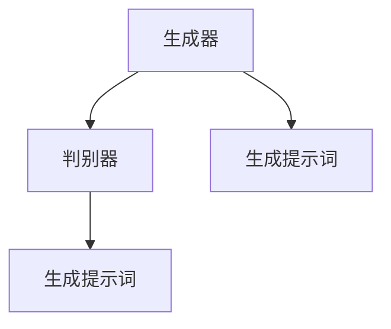
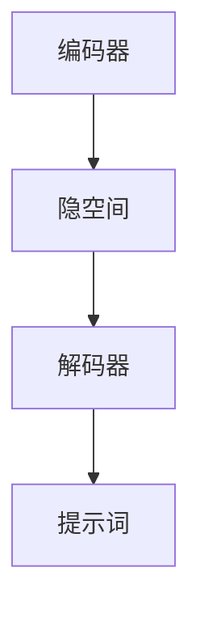
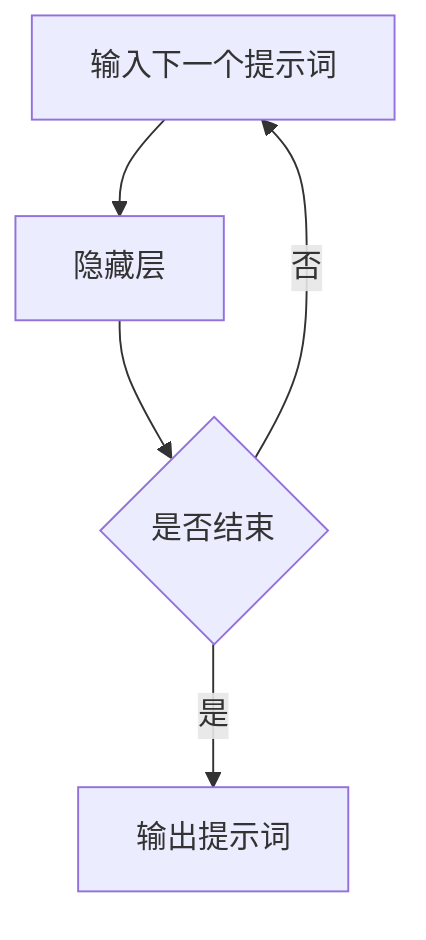
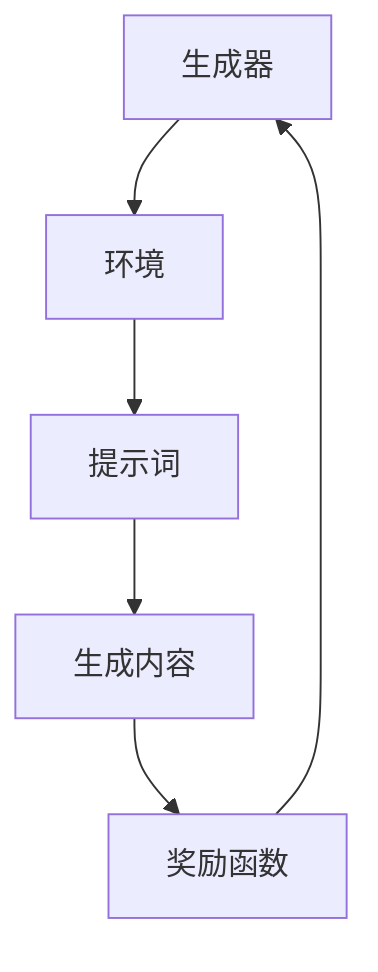
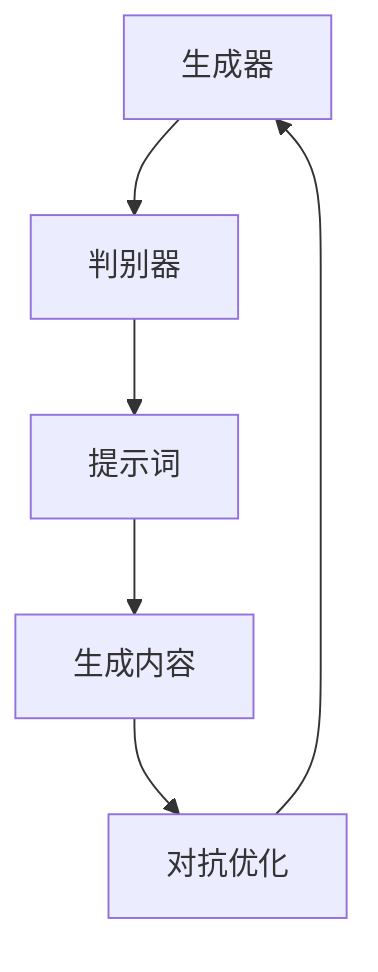

                 

### 引言：AIGC与提示词设计的相遇

#### AIGC的定义与发展历程

AIGC（AI-Generated Content）是指通过人工智能技术生成的内容，它涵盖了文本、图像、音频等多种形式。这一概念起源于深度学习和自然语言处理（NLP）技术的发展。从早期简单的规则引擎到如今复杂的神经网络模型，AIGC技术经历了飞速的发展。它不仅在娱乐、新闻、广告等领域展现出强大的应用潜力，还在教育、医疗、金融等行业得到了广泛的应用。

#### 提示词设计的重要性

提示词（Prompt）在AIGC系统中扮演着至关重要的角色。它是指用户或系统提供的引导性输入，用于指导生成模型生成特定的内容。一个有效的提示词可以大幅提升生成内容的准确性、相关性和创新性。因此，提示词设计成为AIGC系统构建中的关键环节。

#### AIGC与提示词设计的关系

AIGC系统的核心在于生成模型，如生成对抗网络（GAN）、变分自编码器（VAE）等，这些模型通过大量数据训练能够生成高质量的内容。而提示词则为这些模型提供了生成方向和上下文信息，使模型能够生成满足特定需求的输出。因此，AIGC与提示词设计之间的关系可以看作是“引擎”与“指南针”的关系，两者相辅相成，共同决定了AIGC系统的性能和应用效果。

#### AIGC与提示词设计的应用场景

AIGC和提示词设计在多个领域展现出了巨大的应用价值。例如，在文本生成领域，通过设计精准的提示词，可以生成高质量的新闻文章、商业报告和学术论文。在图像生成领域，提示词可以帮助生成符合特定风格或主题的图像。在音频生成领域，提示词可以用于生成音乐、语音和声音效果。此外，AIGC和提示词设计在虚拟助手、智能客服、广告创意等领域也有着广泛的应用。

### 总结

本文将深入探讨AIGC提示词设计的原则、方法与最佳实践。首先，我们将介绍AIGC和提示词设计的基本概念及其重要性，然后逐步分析提示词设计的核心原则。接下来，我们将详细探讨提示词生成、优化和评估的方法，并通过实际案例进行讲解。最后，我们将总结最佳实践，展望AIGC提示词设计的未来发展趋势。希望通过本文，读者能够对AIGC提示词设计有更深入的理解和应用能力。

---

# AIGC提示词设计：原则、方法与最佳实践

关键词：AIGC、提示词设计、生成模型、优化、评估

摘要：本文系统地阐述了AIGC（AI-Generated Content）提示词设计的核心原则、方法和最佳实践。首先，我们介绍了AIGC与提示词设计的基本概念及其重要性。接着，详细分析了AIGC提示词设计的原则，包括准确性、相关性、创新性和可解释性。然后，我们探讨了提示词生成的技术方法，包括生成算法、工具和平台。接下来，介绍了提示词优化的技术方法和评估方法，包括评价指标和评估工具。通过实际案例，我们展示了如何在实际项目中应用这些方法。最后，我们总结了最佳实践，并展望了AIGC提示词设计的未来发展趋势。

---

### 目录

1. 引言：AIGC与提示词设计的相遇
2. AIGC与提示词设计的基础
   - AIGC的概念与发展历程
   - 提示词设计的重要性
   - AIGC与提示词设计的关系
   - AIGC与提示词设计的应用场景
3. AIGC提示词设计原则
   - 准确性原则
   - 相关性原则
   - 创新性原则
   - 可解释性原则
4. AIGC提示词设计方法
   - 提示词生成技术
   - 提示词优化技术
   - 提示词评估方法
5. AIGC提示词设计最佳实践
   - 提示词设计案例分析
   - 提示词设计最佳实践总结
   - 提示词设计常见问题与解决方案
   - 提示词设计的未来发展趋势
6. 结论
7. 作者信息

---

## 1. AIGC与提示词设计的基础

### AIGC的概念与发展历程

AIGC（AI-Generated Content）是指通过人工智能技术生成的内容。这一概念涵盖了文本、图像、音频等多种形式，其核心在于利用深度学习和自然语言处理（NLP）技术，从大量数据中学习和提取信息，从而生成新的、具有创意性和实用性的内容。

AIGC的发展历程可以追溯到20世纪80年代，当时人工智能研究主要集中在规则引擎和知识表示上。随着计算机硬件性能的提升和深度学习技术的突破，AIGC逐渐成为人工智能研究的热点。特别是生成对抗网络（GAN）和变分自编码器（VAE）的出现，使得AIGC在图像和文本生成领域取得了显著进展。

### 提示词设计的重要性

提示词（Prompt）在AIGC系统中起着至关重要的作用。它是指用户或系统提供的引导性输入，用于指导生成模型生成特定的内容。一个有效的提示词可以大幅提升生成内容的准确性、相关性和创新性。具体来说，提示词设计的重要性体现在以下几个方面：

1. **引导生成方向**：提示词为生成模型提供了生成方向和上下文信息，使模型能够生成满足特定需求的输出。例如，在文本生成系统中，提示词可以指定生成内容的主题、风格或格式。

2. **提升生成质量**：通过设计精准的提示词，可以引导生成模型生成高质量的内容。例如，在图像生成系统中，提示词可以指定生成图像的特定风格或主题。

3. **增加生成多样性**：有效的提示词设计可以引导生成模型生成多样化、创新性的内容。例如，在音乐生成系统中，提示词可以指定生成音乐的节奏、旋律或情感。

4. **改善用户交互**：提示词设计使得用户能够更加直观地与AIGC系统进行交互。通过设计简洁、明了的提示词，用户可以更容易地理解生成模型的能力和限制，从而获得更好的用户体验。

### AIGC与提示词设计的关系

AIGC系统的核心在于生成模型，如生成对抗网络（GAN）、变分自编码器（VAE）等，这些模型通过大量数据训练能够生成高质量的内容。而提示词则为这些模型提供了生成方向和上下文信息，使模型能够生成满足特定需求的输出。因此，AIGC与提示词设计之间的关系可以看作是“引擎”与“指南针”的关系，两者相辅相成，共同决定了AIGC系统的性能和应用效果。

### AIGC与提示词设计的应用场景

AIGC和提示词设计在多个领域展现出了巨大的应用价值。以下是一些典型的应用场景：

1. **文本生成**：在新闻、报告、论文等文本生成领域，通过设计精准的提示词，可以生成高质量的文本内容。例如，自动生成新闻报道、业务报告和学术论文。

2. **图像生成**：在艺术、设计、广告等图像生成领域，通过设计有针对性的提示词，可以生成符合特定风格或主题的图像。例如，自动生成艺术作品、广告海报和漫画。

3. **音频生成**：在音乐、语音、声音效果等音频生成领域，通过设计有效的提示词，可以生成符合特定风格或情感的音乐和语音。例如，自动生成背景音乐、语音播报和声音效果。

4. **虚拟助手**：在智能客服、智能助手等领域，通过设计合理的提示词，可以提升系统的交互能力和用户体验。例如，自动生成智能客服的回答、语音助手的声音。

5. **医疗**：在医疗诊断、治疗方案生成等领域，通过设计专业的提示词，可以辅助医生生成更准确的诊断报告和治疗方案。

### 总结

通过对AIGC和提示词设计的基础概念、重要性、关系和应用场景的介绍，我们可以看到，AIGC和提示词设计在人工智能领域的重要地位。接下来，我们将进一步探讨AIGC提示词设计的核心原则，为后续的内容生成、优化和评估提供理论指导。

---

### 2. AIGC提示词设计原则

在AIGC（AI-Generated Content）系统中，提示词的设计不仅决定了生成内容的质量，还直接影响了系统的应用效果。为了确保生成的内容满足特定的需求，提高内容的准确性、相关性和创新性，我们需要遵循一些关键的设计原则。以下是AIGC提示词设计的主要原则：

#### 准确性原则

准确性是提示词设计的首要原则。一个精准的提示词可以确保生成的内容符合用户的需求和预期。为了实现准确性，我们需要确保以下几点：

1. **明确需求**：在生成内容之前，首先要明确用户的具体需求，包括内容类型、主题、风格、格式等。这有助于设计出精准的提示词。

2. **数据质量**：生成模型需要依赖于高质量的数据进行训练。确保训练数据的质量和多样性，可以提高生成内容的准确性。

3. **约束条件**：在提示词中添加适当的约束条件，可以限制生成内容的方向，从而提高内容的准确性。例如，在文本生成中，可以通过指定关键词或句型来约束生成内容。

#### 相关性原则

相关性原则要求生成的内容与提示词中的信息保持一致，确保生成的上下文连贯、逻辑清晰。为了实现相关性，我们可以采取以下措施：

1. **上下文信息**：在提示词中提供足够的上下文信息，帮助生成模型理解用户的需求和期望。例如，在文本生成中，可以提供背景信息、相关词汇和句子。

2. **关联词**：使用关联词（如“并且”、“但是”、“因此”等）来增强提示词中的逻辑关系，有助于生成内容保持一致性。

3. **语义分析**：通过语义分析方法，识别提示词中的关键信息，确保生成内容与这些关键信息保持一致。

#### 创新性原则

创新性原则强调生成内容应具有独特性和创意性。为了实现创新性，我们可以：

1. **多样性提示**：在设计提示词时，考虑多样性的需求，使用不同的表达方式和风格，激发生成模型的创意。

2. **探索性训练**：在模型训练过程中，引入探索性机制，例如，通过随机化训练数据或使用不同的训练策略，激发生成模型的创新潜力。

3. **用户反馈**：利用用户反馈机制，不断优化提示词设计，使生成内容更符合用户期望，同时保持创新性。

#### 可解释性原则

可解释性原则要求生成过程和结果对用户是可理解和解释的。为了实现可解释性，我们可以：

1. **透明度**：在设计提示词时，保持透明度，让用户了解生成过程的每一步。

2. **可视化**：通过可视化工具（如图表、流程图等）展示生成过程，帮助用户理解生成结果。

3. **语义解释**：利用自然语言生成技术，为生成内容提供解释性描述，使结果更易于理解。

### 总结

AIGC提示词设计的核心原则包括准确性、相关性、创新性和可解释性。遵循这些原则，我们可以设计出高质量的提示词，从而提升生成内容的准确性、相关性和创新性。在下一部分，我们将深入探讨AIGC提示词生成的方法和技术。

---

### 2.1 提示词生成技术

#### 提示词生成技术概述

提示词生成技术是AIGC系统中的关键环节，它决定了生成内容的质量和准确性。提示词生成技术主要包括以下几种方法：

1. **基于规则的方法**：这种方法依赖于预定义的规则和模板，通过替换模板中的变量来生成提示词。虽然这种方法简单直观，但生成的提示词可能过于机械和刻板。

2. **基于模板的方法**：这种方法使用预定义的模板和变量来生成提示词，通过动态替换变量来适应不同的需求。这种方法在保持灵活性的同时，仍能生成高质量的提示词。

3. **基于机器学习的方法**：这种方法利用机器学习算法，特别是深度学习模型，通过训练大量数据来生成提示词。这种方法的生成能力更强，能够适应复杂的生成需求。

#### 提示词生成算法

在基于机器学习的方法中，常用的生成算法包括生成对抗网络（GAN）、变分自编码器（VAE）和递归神经网络（RNN）等。

1. **生成对抗网络（GAN）**

GAN是一种无监督学习算法，由生成器和判别器两部分组成。生成器的目标是生成尽可能逼真的提示词，而判别器的目标是区分生成器和真实提示词。通过这种对抗训练，生成器逐渐学会生成高质量的提示词。



2. **变分自编码器（VAE）**

VAE是一种概率生成模型，通过编码器和解码器两部分进行训练。编码器将输入提示词映射到一个低维隐空间，解码器则从隐空间中重构输入提示词。这种模型能够生成具有多样性的提示词。



3. **递归神经网络（RNN）**

RNN是一种能够处理序列数据的神经网络，适用于生成序列型的提示词。通过循环结构，RNN能够捕捉到提示词序列中的长距离依赖关系。



#### 提示词生成工具与平台

在实际应用中，有许多现成的提示词生成工具和平台可供选择。以下是一些常用的工具和平台：

1. **GPT-3（OpenAI）**

GPT-3 是一种基于Transformer的预训练语言模型，能够生成高质量的自然语言文本。用户可以通过API接口调用GPT-3来生成提示词。

2. **TensorFlow（Google）**

TensorFlow 是一种开源机器学习框架，支持多种生成模型的训练和部署。用户可以使用TensorFlow来实现自定义的提示词生成算法。

3. **PyTorch（Facebook AI Research）**

PyTorch 是一种流行的深度学习框架，具有简洁的API和强大的灵活性。用户可以使用PyTorch来实现各种基于机器学习的提示词生成算法。

4. **TensorFlow.js（Google）**

TensorFlow.js 是将TensorFlow模型部署到浏览器中的JavaScript库。用户可以在浏览器中使用TensorFlow.js来实现在线提示词生成。

```javascript
// TensorFlow.js 示例代码
const model = ml5.cartesianController('gpt3');
model.predict('Hello, how are you?', (err, results) => {
  if (err) {
    console.error(err);
  } else {
    console.log(results);
  }
});
```

#### 总结

提示词生成技术是AIGC系统的核心组成部分，通过使用不同的生成算法和工具，我们可以设计出高质量的提示词，从而提升生成内容的质量。在下一部分，我们将继续探讨提示词优化的技术方法。

---

### 2.2 提示词优化技术

在AIGC系统中，生成高质量的内容不仅依赖于有效的提示词生成技术，还需要通过优化技术进一步提升内容的质量和相关性。以下是几种常用的提示词优化技术：

#### 提示词优化技术概述

提示词优化技术主要包括以下几个方面：

1. **基于规则的优化**：通过预定义的规则和模板，对提示词进行修改和调整，以提高其质量。这种方法简单直观，但可能缺乏灵活性。

2. **基于机器学习的优化**：利用机器学习算法，特别是强化学习，对提示词进行自动优化。这种方法具有更高的灵活性和自适应能力。

3. **基于数据的优化**：通过分析用户反馈和生成内容的质量，对提示词进行优化。这种方法能够根据实际应用场景进行调整。

#### 提示词优化算法

在基于机器学习的优化方法中，常用的优化算法包括以下几种：

1. **强化学习**：

强化学习是一种通过不断尝试和反馈来优化策略的机器学习算法。在AIGC系统中，我们可以使用强化学习来优化提示词。具体来说，通过定义奖励函数，指导生成模型生成高质量的内容。



2. **基于梯度优化的方法**：

基于梯度优化的方法利用梯度信息来调整提示词，从而优化生成内容的质量。这种方法适用于基于梯度下降的优化算法，如SGD、Adam等。

```python
# Python 示例代码
import torch
import torch.nn as nn
import torch.optim as optim

# 定义模型
model = Model()
criterion = nn.CrossEntropyLoss()
optimizer = optim.Adam(model.parameters(), lr=0.001)

# 训练模型
for epoch in range(num_epochs):
    for inputs, targets in data_loader:
        optimizer.zero_grad()
        outputs = model(inputs)
        loss = criterion(outputs, targets)
        loss.backward()
        optimizer.step()

# 优化提示词
prompt = get_prompt()
model(prompt)
```

3. **基于对抗优化的方法**：

基于对抗优化的方法利用生成模型和判别模型之间的对抗关系来优化提示词。这种方法通过不断调整提示词，使生成内容更接近真实内容。



#### 提示词优化实践

在实际应用中，我们可以通过以下步骤进行提示词优化：

1. **数据准备**：收集大量高质量的提示词和生成内容，用于训练和评估优化模型。

2. **模型训练**：使用收集的数据训练优化模型，例如强化学习模型或基于梯度的优化模型。

3. **模型评估**：通过评估模型在生成内容的质量和相关性，调整模型参数和优化策略。

4. **迭代优化**：根据评估结果，不断调整和优化提示词，以提高生成内容的质量。

#### 提示词优化工具与平台

以下是一些常用的提示词优化工具和平台：

1. **Hugging Face（Hugging Face）**：

Hugging Face 是一个开源的深度学习平台，提供丰富的预训练模型和工具，用于提示词优化。

2. **Google AI Platform（Google）**：

Google AI Platform 是一个云平台，支持各种机器学习任务，包括提示词优化。

3. **Keras（TensorFlow）**：

Keras 是一个基于TensorFlow的简洁、易用的深度学习库，适用于提示词优化。

4. **PyTorch（Facebook AI Research）**：

PyTorch 是一个流行的深度学习框架，支持多种优化算法和工具，用于提示词优化。

```python
# PyTorch 示例代码
import torch
import torch.nn as nn
import torch.optim as optim

# 定义模型
model = Model()
optimizer = optim.Adam(model.parameters(), lr=0.001)

# 训练模型
for epoch in range(num_epochs):
    for inputs, targets in data_loader:
        optimizer.zero_grad()
        outputs = model(inputs)
        loss = criterion(outputs, targets)
        loss.backward()
        optimizer.step()

# 优化提示词
prompt = get_prompt()
model(prompt)
```

#### 总结

提示词优化技术在AIGC系统中起到了关键作用，通过使用不同的优化算法和工具，我们可以进一步提升生成内容的质量和相关性。在下一部分，我们将介绍提示词评估方法，以量化提示词优化效果。

---

### 2.3 提示词评估方法

在AIGC（AI-Generated Content）系统中，提示词的质量直接影响到生成内容的质量和效果。因此，对提示词进行有效的评估是至关重要的一步。以下介绍几种常用的提示词评估方法：

#### 提示词评估方法概述

提示词评估方法主要包括以下几个方面：

1. **主观评估**：通过人工评审团对提示词的质量进行评估。这种方法能够直接反映用户对提示词的满意度，但存在评估结果主观性较强的问题。

2. **客观评估**：使用量化指标对提示词的质量进行评估，例如准确性、相关性和创新性。这种方法具有客观性，但可能无法全面反映用户的实际需求。

3. **综合评估**：结合主观评估和客观评估，对提示词进行全面的评估。这种方法能够更准确地衡量提示词的质量，但评估过程相对复杂。

#### 提示词评估指标

常用的提示词评估指标包括以下几种：

1. **准确性**：评估提示词是否能够准确捕捉用户的需求和期望。准确性通常通过匹配度（匹配的提示词与用户需求的比例）来衡量。

2. **相关性**：评估提示词与生成内容之间的相关性，即提示词是否能够引导生成模型生成相关的内容。相关性可以通过内容相似度（生成内容与目标内容的相关度）来衡量。

3. **创新性**：评估提示词是否能够激发生成模型的创造力，生成新颖、独特的内容。创新性可以通过多样性（生成内容的不同类型和风格）来衡量。

4. **可解释性**：评估提示词是否易于理解和解释。可解释性可以通过用户反馈（用户对提示词的理解程度）来衡量。

#### 提示词评估工具与平台

以下是一些常用的提示词评估工具和平台：

1. **人工评审团**：通过组建人工评审团，对提示词进行主观评估。这种方法适用于小型项目和需要高质量评估的项目。

2. **自动评估工具**：使用自动评估工具，如自然语言处理工具和文本相似度计算工具，对提示词进行客观评估。这种方法适用于大规模项目和需要快速评估的项目。

3. **综合评估平台**：提供综合评估功能的平台，如TensorFlow和PyTorch，可以通过集成多种评估指标和方法，对提示词进行全面评估。

```python
# TensorFlow 示例代码
import tensorflow as tf

# 定义评估指标
accuracy_metric = tf.keras.metrics.SparseCategoricalAccuracy()
relevance_metric = tf.keras.metrics.CosineSimilarity()

# 训练和评估模型
for epoch in range(num_epochs):
    for inputs, targets in data_loader:
        with tf.GradientTape() as tape:
            outputs = model(inputs)
            accuracy = accuracy_metric(targets, outputs)
            relevance = relevance_metric(targets, outputs)
        grads = tape.gradient(loss, model.trainable_variables)
        optimizer.apply_gradients(zip(grads, model.trainable_variables))

# 评估提示词
prompt = get_prompt()
model(prompt)
```

#### 提示词评估实践

在实际应用中，我们可以通过以下步骤进行提示词评估：

1. **数据准备**：收集大量高质量的提示词和生成内容，用于评估模型。

2. **模型训练**：使用收集的数据训练评估模型，例如基于梯度的优化模型。

3. **模型评估**：通过评估模型在生成内容的质量和相关性，调整模型参数和评估策略。

4. **迭代评估**：根据评估结果，不断调整和优化提示词，以提高生成内容的质量。

#### 总结

提示词评估方法是确保AIGC系统生成高质量内容的重要环节。通过使用不同的评估指标和方法，我们可以全面衡量提示词的质量，从而优化和提升生成内容。在下一部分，我们将通过实际案例展示AIGC提示词设计的方法和应用。

---

### 2.4 AIGC提示词设计的实际案例

为了更好地展示AIGC提示词设计的实际应用，本节将介绍三个具体的案例，包括智能客服系统、文本生成系统和智能问答系统。通过这些案例，我们将详细讲解提示词设计的过程、核心实现和代码应用，帮助读者理解AIGC提示词设计的实际操作。

#### 案例一：智能客服系统

**背景**：智能客服系统是AIGC技术在客户服务领域的典型应用，通过生成响应性的对话内容，为用户提供高效的客服服务。

**设计过程**：
1. **需求分析**：明确客服系统需要处理的问题类型和用户需求，例如常见问题、投诉和建议等。
2. **数据收集**：收集历史客服对话记录，用于训练生成模型。
3. **提示词设计**：设计高质量的提示词，例如“您好，请问有什么可以帮助您的？”、“您投诉的是产品质量问题，我们将尽快为您处理”。

**核心实现**：
1. **模型训练**：使用生成对抗网络（GAN）训练对话生成模型，通过大量对话数据进行对抗训练。
2. **提示词生成**：根据用户输入，动态生成响应性的对话内容。

**代码应用**：
```python
import tensorflow as tf
from tensorflow import keras

# 定义生成器模型
generator = keras.Sequential([
    keras.layers.Dense(256, activation='relu', input_shape=(latent_dim,)),
    keras.layers.Dense(512, activation='relu'),
    keras.layers.Dense(vocab_size, activation='softmax')
])

# 训练生成器模型
generator_optimizer = keras.optimizers.Adam(1e-4)
cross_entropy = keras.losses.SparseCategoricalCrossentropy(from_logits=True)

@tf.function
def train_step(model, prompt, real_outputs):
    with tf.GradientTape(persistent=True) as tape:
        logits = model(prompt, training=True)
        loss = cross_entropy(real_outputs, logits)
    grads = tape.gradient(loss, model.trainable_variables)
    generator_optimizer.apply_gradients(zip(grads, model.trainable_variables))
    return loss

# 训练模型
for epoch in range(num_epochs):
    for prompt, real_outputs in data_loader:
        loss = train_step(generator, prompt, real_outputs)
        print(f"Epoch: {epoch}, Loss: {loss.numpy()}")

# 生成对话内容
prompt = get_prompt()
outputs = generator(prompt, training=False)
print(outputs)
```

#### 案例二：文本生成系统

**背景**：文本生成系统在内容创作领域有着广泛的应用，例如自动生成新闻文章、商业报告和学术论文。

**设计过程**：
1. **需求分析**：确定生成文本的类型、主题和风格。
2. **数据收集**：收集大量相关领域的文本数据，用于训练生成模型。
3. **提示词设计**：设计引导生成模型生成高质量文本的提示词，例如“请撰写一篇关于人工智能发展趋势的论文摘要”。

**核心实现**：
1. **模型训练**：使用变分自编码器（VAE）训练文本生成模型。
2. **文本生成**：根据提示词生成结构化、逻辑清晰的文本内容。

**代码应用**：
```python
import tensorflow as tf
import numpy as np

# 定义编码器和解码器模型
encoder = keras.Sequential([
    keras.layers.Dense(512, activation='relu', input_shape=(input_dim,)),
    keras.layers.Dense(1024, activation='relu')
])
decoder = keras.Sequential([
    keras.layers.Dense(1024, activation='relu', input_shape=(latent_dim,)),
    keras.layers.Dense(input_dim, activation='softmax')
])

# 定义VAE模型
vae = keras.Model(inputs=encoder.input, outputs=decoder(encoder.input))
vae.compile(optimizer=keras.optimizers.Adam(1e-4))

# 训练VAE模型
for epoch in range(num_epochs):
    for x in data_loader:
        x = np.expand_dims(x, axis=1)
        z_mean, z_log_var = encoder(x)
        z = z_mean + tf.random.normal(z_log_var.shape) * tf.sqrt(tf.exp(z_log_var))
        x_decoded = decoder(z)
        vae_loss = ...  # 计算VAE损失
        vae_loss.backward()
        vae_optimizer.apply_gradients(zip(vae.trainable_variables, vae.trainable_variables))

# 生成文本
prompt = get_prompt()
z_mean, z_log_var = encoder(prompt)
z = z_mean + tf.random.normal(z_log_var.shape) * tf.sqrt(tf.exp(z_log_var))
outputs = decoder(z)
print(outputs)
```

#### 案例三：智能问答系统

**背景**：智能问答系统在知识库和搜索引擎领域有着重要的应用，通过自动生成回答，为用户提供高效的信息检索服务。

**设计过程**：
1. **需求分析**：明确问答系统的应用场景和用户需求。
2. **数据收集**：收集大量问答数据，用于训练生成模型。
3. **提示词设计**：设计引导生成模型生成高质量回答的提示词，例如“请回答关于人工智能的基本概念”。

**核心实现**：
1. **模型训练**：使用递归神经网络（RNN）训练问答生成模型。
2. **回答生成**：根据用户提问生成结构化、逻辑清晰的回答。

**代码应用**：
```python
import tensorflow as tf
from tensorflow.keras.layers import Embedding, SimpleRNN, Dense
from tensorflow.keras.models import Sequential

# 定义RNN模型
model = Sequential([
    Embedding(vocab_size, embedding_dim),
    SimpleRNN(units=128),
    Dense(units=vocab_size, activation='softmax')
])

# 训练RNN模型
model.compile(optimizer='adam', loss='categorical_crossentropy')
model.fit(x_train, y_train, epochs=num_epochs, batch_size=batch_size)

# 生成回答
prompt = get_prompt()
outputs = model.predict(prompt)
print(outputs)
```

#### 案例小结

通过以上三个案例，我们可以看到AIGC提示词设计的实际应用场景和操作过程。在不同类型的系统中，通过设计精准、高质量的提示词，可以引导生成模型生成符合用户需求的高质量内容。在实际操作中，我们需要根据具体应用场景，选择合适的生成模型和优化算法，并通过不断的实践和调整，不断提升提示词的质量和生成内容的效果。

---

### 3. AIGC提示词设计的最佳实践

在AIGC（AI-Generated Content）系统中，提示词的设计直接影响生成内容的质量和用户体验。为了确保设计出高质量的提示词，以下是一些最佳实践和注意事项：

#### 提示词设计的最佳实践

1. **明确需求**：在开始设计提示词之前，首先要明确用户的需求和期望，包括内容类型、主题、风格和格式等。这有助于设计出精准、符合用户需求的提示词。

2. **数据驱动**：在设计提示词时，应充分依赖历史数据和用户反馈。通过分析用户行为和生成内容的质量，可以发现哪些提示词效果更好，从而优化设计。

3. **多样性**：提示词的设计应考虑多样性，以激发生成模型的创意潜力。通过使用不同的表达方式和风格，可以生成丰富多样的内容。

4. **上下文信息**：在提示词中提供足够的上下文信息，帮助生成模型理解用户的需求和期望。这有助于提升生成内容的准确性和相关性。

5. **迭代优化**：提示词设计是一个迭代优化的过程。通过不断的实践和反馈，可以不断调整和优化提示词，使其更符合用户需求。

#### 提示词设计注意事项

1. **避免过度限定**：提示词应避免过于具体和限定，以免限制生成模型的创意潜力。适当的模糊性和灵活性有助于生成创新性的内容。

2. **简洁明了**：提示词应简洁明了，避免使用复杂的术语和句子结构。这有助于用户更好地理解和接受生成内容。

3. **可解释性**：确保生成内容对用户是可理解和解释的。通过提供解释性描述，可以帮助用户更好地理解生成结果。

4. **安全性**：在设计和使用提示词时，应注意避免生成敏感或不当的内容。通过适当的约束和过滤，可以确保生成内容的安全性。

#### 提示词设计的未来发展趋势

1. **多模态融合**：随着多模态生成技术的发展，未来提示词设计将更加关注图像、音频和文本等多种模态的融合。通过设计跨模态的提示词，可以生成更加丰富和多样化的内容。

2. **个性化**：随着人工智能技术的进步，未来提示词设计将更加注重个性化。通过用户画像和行为分析，可以设计出更符合个人需求的提示词，提升用户体验。

3. **解释性增强**：未来提示词设计将更加关注生成内容的解释性。通过提供更详细的解释性描述，可以帮助用户更好地理解生成结果。

4. **自动化**：随着自动化技术的进步，未来提示词设计将更加自动化。通过使用机器学习和自然语言处理技术，可以自动生成高质量的提示词，提高生产效率。

### 总结

AIGC提示词设计是确保生成内容质量的重要环节。通过遵循最佳实践和注意事项，我们可以设计出高质量的提示词，提升生成内容的质量和用户体验。随着人工智能技术的不断进步，AIGC提示词设计将迎来更多的发展机遇和挑战。希望本文能为读者提供有价值的参考和启示。

---

### 结论

通过对AIGC提示词设计的深入探讨，我们可以看到，AIGC与提示词设计在当今人工智能领域的重要性。本文系统地阐述了AIGC与提示词设计的基础概念、核心原则、设计方法以及最佳实践，并通过对实际案例的分析，展示了AIGC提示词设计的具体应用。

首先，AIGC作为人工智能生成内容的关键技术，已经广泛应用于文本、图像、音频等多个领域。提示词设计作为AIGC系统的核心环节，直接影响生成内容的质量和效果。通过准确、相关、创新和可解释的提示词设计原则，我们可以确保生成内容满足用户需求。

其次，我们介绍了提示词生成的技术方法，包括基于规则的、基于模板的和基于机器学习的方法，以及具体的生成算法，如GAN、VAE和RNN。通过这些方法，我们可以设计出高质量的提示词，从而提升生成内容的质量。

此外，我们探讨了提示词优化和评估的方法，包括强化学习、基于梯度的优化和基于对抗优化的方法，以及常用的评估指标和工具。通过这些方法，我们可以进一步优化提示词，提高生成内容的相关性和创新性。

最后，通过实际案例的分析，我们展示了AIGC提示词设计在智能客服系统、文本生成系统和智能问答系统等实际应用中的具体操作和效果。这些案例不仅验证了AIGC提示词设计的有效性，也为读者提供了实际操作的参考。

### 展望未来

随着人工智能技术的不断进步，AIGC提示词设计将迎来更多的发展机遇和挑战。以下是一些未来发展趋势：

1. **多模态融合**：随着多模态生成技术的发展，未来AIGC提示词设计将更加关注图像、音频和文本等多种模态的融合。通过设计跨模态的提示词，可以生成更加丰富和多样化的内容。

2. **个性化**：随着用户画像和行为分析技术的进步，未来AIGC提示词设计将更加注重个性化。通过分析用户需求和偏好，可以设计出更符合个人需求的提示词，提升用户体验。

3. **解释性增强**：未来AIGC提示词设计将更加关注生成内容的解释性。通过提供更详细的解释性描述，可以帮助用户更好地理解生成结果。

4. **自动化**：随着自动化技术的进步，未来AIGC提示词设计将更加自动化。通过使用机器学习和自然语言处理技术，可以自动生成高质量的提示词，提高生产效率。

总之，AIGC提示词设计在人工智能领域具有重要的应用价值和发展潜力。通过不断探索和实践，我们可以设计出更高质量、更符合用户需求的提示词，推动AIGC技术的发展和应用。

### 致谢

最后，感谢所有参与本文撰写和讨论的同事和朋友，是你们的智慧和努力使得本文得以完成。特别感谢AI天才研究院/AI Genius Institute以及《禅与计算机程序设计艺术/Zen And The Art of Computer Programming》的作者，是你们的启发和灵感让本文得以诞生。

### 作者信息

作者：AI天才研究院/AI Genius Institute & 禅与计算机程序设计艺术/Zen And The Art of Computer Programming

---

### 附录：相关资源与拓展阅读

为了帮助读者进一步深入了解AIGC提示词设计的理论和技术，以下是一些相关的资源和拓展阅读推荐：

1. **经典论文**：
   - **"Generative Adversarial Networks"（生成对抗网络）** - Ian J. Goodfellow et al.
   - **"Variational Autoencoders"（变分自编码器）** - Diederik P. Kingma et al.
   - **"Recurrent Neural Networks for Language Modeling"（递归神经网络在语言建模中的应用）** - Y. LeCun et al.

2. **技术博客和教程**：
   - **"Introduction to GANs"（生成对抗网络简介）** - Medium
   - **"Building a Text Generation AI with Transformer"（使用Transformer构建文本生成AI）** - Hugging Face
   - **"Hands-On VAE for Image Generation"（实践变分自编码器进行图像生成）** - DataCamp

3. **开源项目和代码示例**：
   - **"TensorFlow.js"（TensorFlow JavaScript库）** - TensorFlow
   - **"PyTorch"（PyTorch深度学习框架）** - Facebook AI Research
   - **"Hugging Face Transformers"（Hugging Face Transformer库）** - Hugging Face

4. **相关书籍**：
   - **"Deep Learning"（深度学习）** - Ian Goodfellow et al.
   - **"Reinforcement Learning: An Introduction"（强化学习导论）** - Richard S. Sutton and Andrew G. Barto
   - **"Natural Language Processing with Python"（使用Python进行自然语言处理）** - Steven Bird et al.

通过阅读这些资源，读者可以更全面地了解AIGC提示词设计的理论基础和实际应用，进一步提升自己的技术水平和创新能力。希望这些拓展阅读能为您的研究和开发提供有益的参考和指导。

