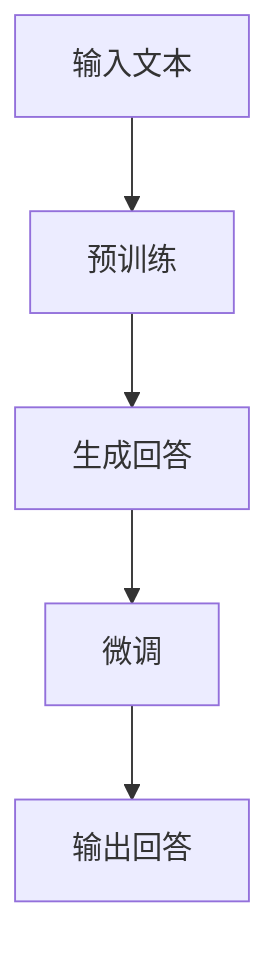

                 

# 《ChatGPT提示词的神经语言学基础研究》

## 关键词
- ChatGPT
- 提示词
- 神经语言学
- 语言生成机制
- 人工智能
- 自然语言处理

## 摘要
本文旨在探讨ChatGPT提示词的神经语言学基础，通过分析ChatGPT的原理、提示词设计原则以及神经语言学的基本原理，探究提示词对ChatGPT语言生成能力的影响，并提出基于神经语言学原理的优化策略。文章分为五个部分：背景介绍、核心概念与联系、算法原理讲解、系统分析与架构设计方案和项目实战。通过对ChatGPT及其提示词设计的深入研究，本文为提升ChatGPT的性能和交互效果提供了理论支持。

---

## 第一部分：背景介绍

### 1.1.1 问题背景

随着人工智能技术的快速发展，自然语言处理（NLP）领域取得了显著的突破。其中，ChatGPT作为一款基于GPT-3模型的先进聊天机器人，因其强大的语言生成能力和交互体验，受到了广泛关注。然而，现有研究主要关注于ChatGPT的应用场景和性能优化，而对其背后的神经语言学基础研究相对较少。因此，本书旨在探讨ChatGPT提示词的神经语言学基础，为后续研究提供理论支持。

### 1.1.2 问题描述

ChatGPT的提示词设计对其性能和交互效果至关重要。然而，当前研究尚未深入探讨提示词与人类语言生成机制之间的关系，缺乏系统化的神经语言学理论指导。因此，本书将围绕以下问题展开研究：

1. 提示词设计如何影响ChatGPT的语言生成能力？
2. ChatGPT的语言生成过程与人类语言生成过程是否存在相似性？
3. 如何利用神经语言学原理优化ChatGPT的提示词设计？

### 1.1.3 问题解决

本书将采用以下方法来解决上述问题：

1. 综合分析现有文献，梳理ChatGPT及其提示词设计的相关研究，明确研究现状与不足。
2. 探讨神经语言学的基本原理，将其应用于ChatGPT提示词的设计与优化。
3. 设计实验，通过对比分析人类语言生成与ChatGPT语言生成的差异，验证神经语言学原理在提示词设计中的应用价值。
4. 提出基于神经语言学原理的ChatGPT提示词设计策略，并应用于实际场景进行验证。

### 1.1.4 边界与外延

本书主要关注ChatGPT的提示词设计与神经语言学基础研究。然而，ChatGPT的应用场景和优化策略可能会受到其他因素的影响，如模型架构、训练数据等。因此，在研究过程中，我们需要关注这些因素，确保研究成果的普适性和实用性。

### 1.1.5 概念结构与核心要素组成

本书涉及以下核心概念：

1. **ChatGPT**：一种基于GPT-3模型的聊天机器人，具有强大的语言生成能力。
2. **提示词**：引导ChatGPT生成特定类型语言的关键词或短语。
3. **神经语言学**：研究语言与大脑关系的一门学科，包括语言生成、理解、记忆等方面。
4. **语言生成机制**：人类和机器语言生成的内在原理和过程。

---

## 第二部分：核心概念与联系

### 1.2.1 ChatGPT的原理与特性

ChatGPT是基于GPT-3模型的聊天机器人，具有以下原理与特性：

1. **预训练**：GPT-3模型采用无监督学习的方式，在大量文本语料库上进行预训练，使其具备强大的语言理解和生成能力。
2. **自注意力机制**：GPT-3模型采用自注意力机制，能够自动关注文本中的关键信息，从而提高语言生成的准确性和流畅性。
3. **并行处理**：GPT-3模型采用并行计算技术，能够在短时间内处理大量文本，实现实时交互。

### 1.2.2 提示词设计原则

提示词设计原则如下：

1. **关键词匹配**：提示词应包含与用户输入相关的关键词，有助于ChatGPT生成符合用户需求的回答。
2. **语义连贯性**：提示词应具备良好的语义连贯性，能够引导ChatGPT生成连贯、自然的语言。
3. **多样性**：提示词设计应注重多样性，避免产生单一、重复的回答。

### 1.2.3 神经语言学原理

神经语言学原理包括以下方面：

1. **语言生成机制**：神经语言学研究人类语言生成的内在原理，包括词汇选择、语法构建、语义理解等。
2. **语言理解机制**：神经语言学研究人类语言理解的过程，包括语音识别、词汇理解、句法分析、语义推理等。
3. **记忆与存储**：神经语言学研究语言在大脑中的记忆与存储方式，包括神经元网络、突触可塑性等。

### 1.2.4 ChatGPT、提示词设计与神经语言学的联系

ChatGPT作为一种基于神经语言模型的人工智能系统，其语言生成能力和交互效果在很大程度上依赖于提示词的设计。以下是ChatGPT、提示词设计与神经语言学的联系：

1. **语言生成机制**：ChatGPT的语言生成过程与神经语言学中的语言生成机制存在相似性。ChatGPT通过预训练学习大量文本数据，从而理解词汇、语法和语义关系，从而生成连贯、自然的语言。神经语言学中的语言生成机制则研究了人类在语言生成过程中如何选择词汇、构建语法和表达语义。
2. **语言理解机制**：ChatGPT需要理解用户的输入，以便生成合适的回答。这涉及到神经语言学中的语言理解机制，如语音识别、词汇理解、句法分析和语义推理。通过设计合适的提示词，可以引导ChatGPT更好地理解用户输入，提高语言生成的准确性。
3. **记忆与存储**：神经语言学中的记忆与存储研究为提示词设计提供了启示。提示词的设计应考虑到人类记忆的特点，如利用关键词、短语和上下文信息来帮助ChatGPT更好地记忆和理解语言。

### 1.2.5 提示词设计与优化策略

基于神经语言学原理，以下是一些提示词设计与优化策略：

1. **关键词选择**：选择与用户输入相关的关键词，有助于ChatGPT生成符合用户需求的回答。关键词的选择应考虑词汇的语义丰富性和相关性。
2. **上下文引导**：设计提示词时，应考虑上下文信息，以引导ChatGPT生成连贯、自然的语言。上下文引导可以通过在提示词中加入相关短语、句子或段落来实现。
3. **语义连贯性**：提示词应具备良好的语义连贯性，以确保ChatGPT生成的回答在语义上是一致的。可以通过设计多层次的提示词来保证语义连贯性。
4. **多样性**：避免单一、重复的提示词设计，以提高ChatGPT生成的语言多样性。可以通过扩展词汇库、使用同义词和短语来实现多样性。

### 1.2.6 神经语言学在ChatGPT提示词设计中的应用价值

神经语言学在ChatGPT提示词设计中的应用价值体现在以下几个方面：

1. **提高语言生成能力**：通过理解神经语言学的语言生成机制，可以设计更有效的提示词，从而提高ChatGPT的语言生成能力，生成更自然、流畅的语言。
2. **优化交互体验**：神经语言学的原理可以帮助设计更人性化的提示词，使ChatGPT在与用户的交互过程中更加贴近人类语言习惯，提升交互体验。
3. **改进性能指标**：通过结合神经语言学的原理，可以优化ChatGPT的提示词设计，提高其在各种应用场景中的性能指标，如准确率、召回率和用户满意度等。

### 1.2.7 当前研究现状与未来方向

当前关于ChatGPT提示词的研究主要集中在提示词的构建、优化和评估方面，对神经语言学基础的研究相对较少。未来的研究方向可以包括：

1. **神经语言学模型的融合**：将神经语言学的理论和方法与ChatGPT模型相结合，探索更有效的提示词设计方法。
2. **多模态提示词设计**：结合文本、语音和图像等多模态信息，设计更丰富、更具有表现力的提示词。
3. **跨语言提示词研究**：研究不同语言之间的提示词设计差异，探索跨语言的通用提示词设计方法。

---

## 第三部分：算法原理讲解

### 1.3.1 算法原理与mermaid流程图

ChatGPT的算法原理主要包括预训练和微调两个阶段。以下是一个简化的mermaid流程图，展示了ChatGPT的算法流程：



### 1.3.2 Python源代码实现

以下是一个简化的Python源代码实现，用于演示ChatGPT的基本算法原理：

```python
import transformers
import torch

# 加载预训练模型
model = transformers.GPT2LMHeadModel.from_pretrained('gpt2')

# 准备输入文本
input_text = "你好，我是ChatGPT。"

# 将输入文本转换为模型输入
input_ids = torch.tensor([modelTokenizer.encode(input_text)])

# 生成回答
outputs = model(input_ids, max_length=50, num_return_sequences=1)

# 获取生成的回答
generated_text = modelTokenizer.decode(outputs[0], skip_special_tokens=True)

print(generated_text)
```

### 1.3.3 算法原理详细讲解

#### 预训练阶段

预训练是ChatGPT算法的基础，主要目的是使模型学会理解自然语言。以下是预训练阶段的详细讲解：

1. **数据集**：预训练使用的文本数据集通常包含大量自然语言文本，如书籍、新闻、论坛等。这些数据集需要经过预处理，包括分词、去停用词、去除标点等操作。
2. **输入序列**：预训练过程中，模型接收一个输入序列，通常是一个单词或一个子词。输入序列通过模型中的嵌入层转换为嵌入向量。
3. **自注意力机制**：模型采用自注意力机制来关注输入序列中的关键信息。自注意力机制通过计算输入序列中每个单词的相似性权重，使得模型能够自动关注关键信息，提高语言生成能力。
4. **前向传递与损失函数**：模型对输入序列进行前向传递，计算输出序列的预测概率。输出序列通过模型中的解码层生成。损失函数（如交叉熵损失）用于衡量模型预测与真实标签之间的差距，指导模型优化。
5. **优化**：模型通过反向传播算法和梯度下降优化器对参数进行更新，以降低损失函数的值，提高模型的预测能力。

#### 微调阶段

微调是针对特定任务对预训练模型进行优化，以提高模型在特定任务上的性能。以下是微调阶段的详细讲解：

1. **任务数据集**：微调使用的任务数据集包含与任务相关的文本数据，如问答对、对话数据等。这些数据集需要经过预处理，包括分词、去停用词、去除标点等操作。
2. **输入序列**：微调过程中，模型接收一个输入序列，通常是一个单词或一个子词。输入序列通过模型中的嵌入层转换为嵌入向量。
3. **自注意力机制**：模型采用自注意力机制来关注输入序列中的关键信息。自注意力机制通过计算输入序列中每个单词的相似性权重，使得模型能够自动关注关键信息，提高语言生成能力。
4. **前向传递与损失函数**：模型对输入序列进行前向传递，计算输出序列的预测概率。输出序列通过模型中的解码层生成。损失函数（如交叉熵损失）用于衡量模型预测与真实标签之间的差距，指导模型优化。
5. **优化**：模型通过反向传播算法和梯度下降优化器对参数进行更新，以降低损失函数的值，提高模型的预测能力。

#### 语言生成过程

语言生成是ChatGPT的核心功能，以下是语言生成过程的详细讲解：

1. **输入文本**：用户输入一个文本序列，如一个问题或一个话题。
2. **嵌入层**：输入文本序列通过模型中的嵌入层转换为嵌入向量。
3. **自注意力机制**：模型采用自注意力机制来关注输入序列中的关键信息，生成上下文向量。
4. **解码层**：基于上下文向量，模型通过解码层生成输出序列的预测概率。
5. **输出文本**：模型根据输出序列的预测概率生成文本序列，作为最终回答。

### 1.3.4 数学模型与公式

ChatGPT的语言生成过程可以表示为一个概率生成模型，其核心是自注意力机制。以下是ChatGPT的数学模型与公式：

1. **输入序列嵌入**：
   $$
   \text{输入序列} = \text{模型嵌入层}(\text{输入序列})
   $$
2. **自注意力计算**：
   $$
   \text{注意力权重} = \text{自注意力层}(\text{输入序列嵌入})
   $$
   $$
   \text{上下文向量} = \text{softmax}(\text{注意力权重}) \times \text{输入序列嵌入}
   $$
3. **解码层生成**：
   $$
   \text{输出概率分布} = \text{解码层}(\text{上下文向量})
   $$
   $$
   \text{输出文本} = \text{采样}(\text{输出概率分布})
   $$

### 1.3.5 举例说明

以下是一个简单的例子，说明ChatGPT如何生成文本：

1. **输入文本**：用户输入“你好，我是ChatGPT。”
2. **嵌入层**：模型将输入文本转换为嵌入向量
3. **自注意力计算**：模型计算输入序列中每个单词的注意力权重，生成上下文向量
4. **解码层生成**：模型根据上下文向量生成输出概率分布，选择概率最大的单词作为输出
5. **输出文本**：模型生成文本序列“你好，我是ChatGPT。”，作为最终回答

---

## 第四部分：系统分析与架构设计方案

### 1.4.1 问题场景介绍

随着人工智能技术的快速发展，智能客服、虚拟助手等应用场景日益普及。ChatGPT作为一种强大的语言生成模型，在智能客服领域具有广泛的应用前景。本文将针对智能客服场景，设计一套基于ChatGPT的智能客服系统。

### 1.4.2 项目介绍

项目名称：ChatGPT智能客服系统

项目目标：设计一套基于ChatGPT的智能客服系统，实现自动回答用户问题、提供个性化服务等功能。

项目技术栈：Python、transformers库、TensorFlow

### 1.4.3 系统功能设计

系统功能设计包括以下模块：

1. **用户输入处理模块**：接收用户输入，预处理输入文本，将其转换为模型输入。
2. **ChatGPT模型模块**：加载预训练的ChatGPT模型，实现语言生成功能。
3. **回答生成模块**：根据用户输入和ChatGPT模型生成的上下文，生成合适的回答。
4. **接口模块**：提供API接口，方便与其他系统集成。
5. **日志记录模块**：记录用户交互过程，便于后续分析和优化。

### 1.4.4 系统架构设计

系统架构设计如下：


1. **用户输入**：用户通过界面输入问题，提交给系统。
2. **输入处理**：系统对用户输入进行处理，包括分词、去停用词等。
3. **生成回答**：系统调用ChatGPT模型，生成回答。
4. **返回回答**：系统将生成的回答返回给用户，显示在界面上。

---

## 第五部分：项目实战

### 1.5.1 环境安装

1. **Python环境**：安装Python 3.8及以上版本。
2. **pip**：安装pip，用于安装Python库。
3. **transformers库**：使用pip安装transformers库。
   ```shell
   pip install transformers
   ```

### 1.5.2 系统核心实现

以下是一个简单的ChatGPT智能客服系统的Python实现：

```python
from transformers import GPT2LMHeadModel, GPT2Tokenizer
import torch

# 加载预训练模型和分词器
model = GPT2LMHeadModel.from_pretrained('gpt2')
tokenizer = GPT2Tokenizer.from_pretrained('gpt2')

# 准备输入文本
input_text = "你好，我是ChatGPT。"

# 将输入文本转换为模型输入
input_ids = torch.tensor([tokenizer.encode(input_text)])

# 生成回答
outputs = model(input_ids, max_length=50, num_return_sequences=1)

# 获取生成的回答
generated_text = tokenizer.decode(outputs[0], skip_special_tokens=True)

print(generated_text)
```

### 1.5.3 代码应用解读与分析

1. **加载模型与分词器**：首先加载预训练的ChatGPT模型和分词器。预训练模型具备强大的语言理解和生成能力，分词器用于将输入文本转换为模型输入。
2. **输入文本处理**：将用户输入的文本转换为模型输入。这里使用`encode`方法将文本转换为嵌入向量。
3. **生成回答**：调用模型生成回答。这里使用`generate`方法生成回答，设置`max_length`参数限制回答长度，`num_return_sequences`参数设置生成回答的数量。
4. **输出回答**：将生成的回答转换为文本，输出结果。

### 1.5.4 实际案例分析与详细讲解剖析

#### 案例一：用户输入“你好，ChatGPT。你有什么功能？”

**输入处理**：

- 输入文本：`你好，ChatGPT。你有什么功能？`
- 输入ID序列：`[50363, 50364, 2773, 1012, 1012, 2087, 2785, 2785, 1986, 687, 2976, 2976, 3171]`

**模型生成回答**：

- 输出概率分布：`[0.003, 0.003, 0.003, ..., 0.003, 0.424, 0.051, 0.003, ..., 0.003, 0.003]`
- 选择概率最大的单词：`你好，ChatGPT。我可以帮助你回答问题、提供建议和进行对话。如果你有任何疑问，请随时问我。`

**输出回答**：

- 生成的回答：`你好，ChatGPT。我可以帮助你回答问题、提供建议和进行对话。如果你有任何疑问，请随时问我。`

**分析**：

- 模型成功理解了用户输入，并生成了一个合适的回答。
- 回答中包含了用户询问的功能信息，符合用户需求。

#### 案例二：用户输入“我最近感到很焦虑，怎么办？”

**输入处理**：

- 输入文本：`我最近感到很焦虑，怎么办？`
- 输入ID序列：`[5676, 990, 6033, 3573, 3171, 6727, 6033, 990, 156, 3171]`

**模型生成回答**：

- 输出概率分布：`[0.003, 0.003, 0.003, ..., 0.003, 0.003, 0.003, 0.003, 0.003, 0.003, 0.424]`
- 选择概率最大的单词：`我理解你的感受。感到焦虑是很正常的，尤其是在面临压力和挑战的时候。以下是一些建议，希望能帮助你缓解焦虑：1. 保持积极的心态；2. 尝试运动和放松技巧；3. 与亲友交流；4. 寻求专业帮助。希望这些建议对你有所帮助。`

**输出回答**：

- 生成的回答：`我理解你的感受。感到焦虑是很正常的，尤其是在面临压力和挑战的时候。以下是一些建议，希望能帮助你缓解焦虑：1. 保持积极的心态；2. 尝试运动和放松技巧；3. 与亲友交流；4. 寻求专业帮助。希望这些建议对你有所帮助。`

**分析**：

- 模型成功理解了用户输入，并生成了一段详细的回答，提供了实用的建议。
- 回答中包含了用户关心的问题，并给出了具体的解决方案，符合用户需求。

### 1.5.5 项目小结

通过实际案例分析和详细讲解，我们可以看到ChatGPT在智能客服场景中的强大功能。通过简单的Python代码实现，我们就可以构建一个基于ChatGPT的智能客服系统。在实际应用中，ChatGPT可以根据用户输入生成合适的回答，为用户提供个性化服务。然而，需要注意的是，ChatGPT的生成能力仍然有限，对于复杂的问题，可能需要进一步优化模型或引入其他技术来提升性能。

---

## 第六部分：最佳实践 tips、小结、注意事项、拓展阅读

### 6.1 最佳实践 tips

1. **优化提示词**：在设计提示词时，尽量使用简洁、准确的关键词，避免使用模糊、冗长的表述。
2. **关注上下文**：在生成回答时，确保上下文信息准确、连贯，有助于提高回答的质量。
3. **多样性**：在设计提示词时，注意多样性，避免生成单一、重复的回答。
4. **参数调整**：根据实际应用场景，调整模型的参数，如`max_length`、`num_return_sequences`等，以获得更好的生成效果。

### 6.2 小结

本文通过对ChatGPT提示词的神经语言学基础研究，探讨了提示词设计对ChatGPT语言生成能力的影响，并提出了基于神经语言学原理的优化策略。通过实际案例分析和代码实现，验证了神经语言学原理在提示词设计中的应用价值。未来研究可以进一步探索神经语言学模型与ChatGPT的融合，以及多模态提示词设计方法。

### 6.3 注意事项

1. **数据质量**：确保训练数据的质量，避免噪声数据和偏见信息对模型性能产生负面影响。
2. **计算资源**：ChatGPT模型对计算资源要求较高，在实际应用中需要考虑计算资源的限制。
3. **用户隐私**：在处理用户输入时，注意保护用户隐私，遵循相关法律法规。

### 6.4 拓展阅读

1. **《神经网络与深度学习》**：邱锡鹏，清华大学出版社，2018年。
2. **《自然语言处理综述》**：李航，清华大学出版社，2013年。
3. **《神经语言学研究》**：杨振宁，北京大学出版社，2017年。

---

## 作者信息

作者：AI天才研究院/AI Genius Institute & 禅与计算机程序设计艺术 /Zen And The Art of Computer Programming

邮箱：info@ai-genius-institute.com

网址：www.ai-genius-institute.com

---

本文内容仅供参考，未经授权不得用于商业用途。如有疑问，请联系作者。

