                 


# C侧LLM应用探索的关键：速度与敏捷性

## 关键词
- C侧LLM
- 速度与敏捷性
- 技术路线
- 优化技术
- 算法原理
- 系统架构
- 项目实战

## 摘要
本文深入探讨了C侧LLM（Client-Side Large Language Model）应用的核心挑战：如何在保证隐私和计算效率的同时，提升应用的响应速度和敏捷性。文章首先介绍了C侧LLM的基本概念、特点及与S侧LLM的区别，然后详细分析了速度与敏捷性的定义及其在C侧LLM中的应用。接着，文章通过算法原理讲解、系统分析与架构设计以及项目实战，阐述了如何通过优化技术实现速度与敏捷性的平衡，并提供了实际案例分析。最后，文章总结了最佳实践，并对未来研究方向进行了展望。

---

### 目录大纲

---

# C侧LLM应用探索的关键：速度与敏捷性

## 第一部分：背景介绍与核心概念

### 1. 引言

#### 1.1 问题背景
C侧LLM在个人设备上的应用正在迅速扩展，从自然语言处理到智能助理，各种场景需求不断涌现。然而，随着模型规模的增大和复杂度提升，如何平衡速度与敏捷性成为关键问题。

#### 1.2 问题描述
C侧LLM应用中的速度和敏捷性是两个相互制约的因素。速度决定了应用的响应时间，而敏捷性则影响到模型适应新任务的能力。如何在两者之间找到平衡，是本文要探讨的核心问题。

#### 1.3 问题解决
本文将通过技术路线的优化、算法原理的讲解、系统架构的设计以及项目实战的案例分析，提出解决C侧LLM应用中速度与敏捷性平衡问题的有效策略。

#### 1.4 边界与外延
C侧LLM的应用范围涵盖了从个人智能设备到嵌入式系统，硬件限制也限制了其在某些场景中的应用。本文将探讨这些边界与外延，以及如何突破这些限制。

#### 1.5 概念结构与核心要素组成
C侧LLM、速度、敏捷性是本文的核心概念。它们之间的关系及其在C侧LLM中的应用将贯穿全文，为解决问题提供理论基础。

## 第二部分：核心概念与联系

### 2.1 C侧LLM的定义与特点

#### 2.1.1 C侧LLM的定义
C侧LLM指的是在客户端设备上运行的的大型语言模型。与S侧LLM（在服务器端运行）相比，C侧LLM具有更高的隐私性和更低的延迟。

#### 2.1.2 C侧LLM的特点
- **本地运行**：C侧LLM在用户设备上运行，减少了网络传输时间，提高了响应速度。
- **隐私保护**：数据无需上传至服务器，减少了隐私泄露的风险。

### 2.2 速度与敏捷性

#### 2.2.1 速度的定义
速度通常指的是C侧LLM在处理请求时的响应时间。对于用户来说，快速响应是提高使用体验的关键。

#### 2.2.2 敏捷性的定义
敏捷性指的是模型对新的任务和数据的适应能力。一个敏捷的C侧LLM可以快速调整以应对不同场景的需求。

#### 2.2.3 速度与敏捷性的关系
速度和敏捷性并非完全对立。一个理想的C侧LLM应在保证敏捷性的同时，提供快速响应。

### 2.3 C侧LLM应用中的核心要素

#### 2.3.1 模型选择
选择合适的模型对于平衡速度与敏捷性至关重要。轻量级模型在速度上具有优势，而 heavyweight模型则在敏捷性上更具优势。

#### 2.3.2 优化技术
优化技术包括模型压缩、量化、剪枝等，目的是在保证模型性能的同时降低计算复杂度。

#### 2.3.3 性能评估
性能评估是确保C侧LLM应用效果的重要环节。通过一系列指标（如响应时间、准确性、能耗等）来评估模型性能。

## 第三部分：算法原理讲解

### 3.1 算法原理

#### 3.1.1 算法概述
C侧LLM算法的核心是神经网络，通过多层神经元的传递和激活，实现输入到输出的映射。

#### 3.1.2 算法流程图
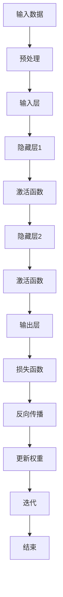

### 3.2 数学模型与公式

#### 3.2.1 数学模型
C侧LLM的数学模型基于神经网络，包括输入层、隐藏层和输出层。每个层包含多个神经元，神经元之间通过权重连接。

#### 3.2.2 公式推导
$$
Y = \sigma(W_n \cdot X + b_n)
$$
其中，$Y$ 是输出，$X$ 是输入，$W_n$ 是权重，$b_n$ 是偏置，$\sigma$ 是激活函数。

### 3.3 算法举例说明

#### 3.3.1 例子一
假设一个简单的C侧LLM模型，用于文本分类。输入是文本向量，输出是分类结果。

#### 3.3.2 例子二
在一个聊天机器人应用中，C侧LLM模型用于理解用户输入并生成回复。输入是用户的问题，输出是机器人的回复。

## 第四部分：系统分析与架构设计

### 4.1 系统功能设计

#### 4.1.1 领域模型
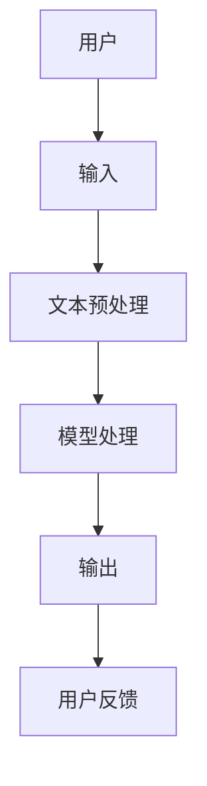

#### 4.1.2 功能模块
- **文本预处理模块**：包括分词、去停用词、词向量化等。
- **模型处理模块**：包括输入层、隐藏层和输出层的处理。
- **输出模块**：生成模型输出结果。
- **用户反馈模块**：收集用户反馈，用于模型训练。

### 4.2 系统架构设计

#### 4.2.1 架构设计
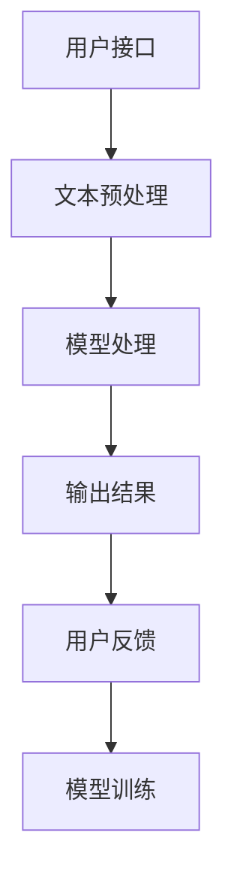

#### 4.2.2 接口设计
- **API接口**：提供模型输入和输出的接口。
- **数据接口**：用于数据传输和处理。

### 4.3 系统交互设计

#### 4.3.1 交互流程
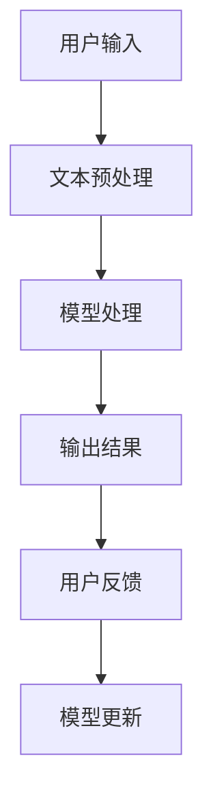

## 第五部分：项目实战

### 5.1 环境安装

#### 5.1.1 环境准备
- **操作系统**：Ubuntu 18.04
- **Python版本**：3.8
- **硬件要求**：至少8GB内存，CPU频率2GHz以上

#### 5.1.2 安装步骤
1. 安装Python环境
2. 安装依赖库
3. 下载预训练模型

### 5.2 系统核心实现

#### 5.2.1 源代码解读
- **文本预处理代码**：负责对用户输入的文本进行预处理。
- **模型处理代码**：实现神经网络的前向传播和反向传播。

#### 5.2.2 代码应用分析
- **文本预处理**：对输入文本进行分词、去停用词等处理。
- **模型处理**：通过神经网络模型对预处理后的文本进行分类或生成回复。

### 5.3 实际案例分析

#### 5.3.1 案例介绍
- **案例场景**：一个基于C侧LLM的智能聊天机器人。

#### 5.3.2 案例分析
- **用户输入**：用户输入一个文本问题。
- **文本预处理**：对用户输入进行预处理。
- **模型处理**：通过神经网络模型生成回复。
- **用户反馈**：用户对回复进行评价，用于模型训练。

## 总结与展望

本文探讨了C侧LLM应用中速度与敏捷性的关键问题，通过算法原理讲解、系统架构设计和项目实战，提出了有效的解决方案。未来研究方向包括进一步优化模型压缩技术、提升模型适应能力以及降低硬件限制。

---

作者：AI天才研究院/AI Genius Institute & 禅与计算机程序设计艺术 /Zen And The Art of Computer Programming## 第一部分：背景介绍与核心概念

### 1. 引言

#### 1.1 问题背景

随着人工智能技术的飞速发展，大型语言模型（Large Language Model，简称LLM）在自然语言处理、智能对话系统、文本生成等领域展现出了巨大的潜力。然而，当前大多数LLM都是基于服务器端（Server-Side）模型，即模型数据被上传至服务器进行处理，这虽然能够提供强大的计算能力和丰富的数据资源，但同时也带来了显著的隐私和安全问题。为了解决这一问题，C侧LLM（Client-Side Large Language Model）的概念应运而生。

C侧LLM指的是在用户端设备上运行的语言模型，其优势在于：
1. **隐私保护**：用户的数据和模型都在本地设备上运行，无需上传至服务器，从而大大降低了数据泄露的风险。
2. **低延迟**：由于数据无需经过网络传输，C侧LLM能够实现更快的响应时间，提升用户体验。

然而，C侧LLM的应用也面临一些挑战：
1. **计算资源限制**：个人设备的计算资源相对有限，尤其是对于复杂的大型语言模型，如何在有限的资源下实现高效的运行是一个关键问题。
2. **模型适应性**：C侧LLM需要具备较强的适应性，能够快速响应不同的应用场景，同时保持较高的准确性和性能。

#### 1.2 问题描述

C侧LLM的应用过程中，速度和敏捷性成为两个关键因素。速度指的是模型处理请求的响应时间，而敏捷性则是指模型适应新任务的能力。

**速度的重要性**：
1. **用户体验**：快速的响应能够提高用户的满意度，对于交互式应用尤为重要。
2. **实时处理**：在实时对话系统、在线翻译等应用中，延迟的降低能够显著提升系统的实用性和可靠性。

**敏捷性的重要性**：
1. **任务适应性**：一个敏捷的C侧LLM能够快速适应不同的任务需求，提高模型的灵活性和通用性。
2. **持续优化**：通过不断的学习和调整，C侧LLM能够持续优化自身性能，提升应用效果。

然而，速度与敏捷性之间存在一定的矛盾。在追求速度的同时，可能会牺牲模型的复杂度和适应性；而过于追求敏捷性，则可能导致模型的计算开销增加，影响响应速度。因此，如何在C侧LLM应用中平衡速度与敏捷性，成为当前研究的一个重要课题。

#### 1.3 问题解决

为了解决C侧LLM应用中速度与敏捷性的平衡问题，本文将从以下几个方面展开探讨：

1. **技术路线优化**：通过分析不同的C侧LLM技术路线，探讨如何在不同场景下实现速度与敏捷性的平衡。
2. **算法原理讲解**：深入讲解C侧LLM的核心算法原理，包括神经网络结构、优化技术等，为提升模型性能提供理论基础。
3. **系统架构设计**：介绍C侧LLM系统的架构设计，包括领域模型、功能模块、接口设计和交互流程，为系统实现提供指导。
4. **项目实战**：通过具体的C侧LLM项目实战，展示如何在实际应用中实现速度与敏捷性的平衡，提供实际案例分析和实践经验。

通过上述探讨，本文旨在为C侧LLM应用提供一套系统性的解决方案，帮助开发者更好地应对速度与敏捷性的挑战。

#### 1.4 边界与外延

C侧LLM的应用范围广泛，涵盖了从个人智能设备到嵌入式系统等各个领域。以下是C侧LLM在不同应用场景中的具体表现：

**个人智能设备**：如智能手机、平板电脑等，C侧LLM可以用于智能助理、语音识别、实时翻译等应用，提供快速、便捷的服务。

**嵌入式系统**：如智能家居、可穿戴设备等，C侧LLM可以用于本地数据处理和实时响应，减少对服务器端的依赖，提升系统的独立性和稳定性。

**物联网**：在物联网（IoT）场景中，C侧LLM可以用于设备间的智能对话和数据处理，实现高效、安全的通信。

**边缘计算**：在边缘计算场景中，C侧LLM可以与边缘设备协同工作，共同处理大量数据，提供实时、高效的计算服务。

然而，C侧LLM在应用中也面临一些硬件限制：

**计算资源限制**：个人设备（尤其是移动设备）的计算资源相对有限，需要通过优化算法和模型结构，提高计算效率。

**存储容量限制**：大型语言模型的存储需求较高，需要权衡模型大小与性能，确保设备存储空间充足。

**电池续航**：在移动设备上，需要考虑模型运行对电池续航的影响，优化算法和硬件设计，延长设备使用时间。

**网络带宽限制**：在部分场景下，网络带宽可能成为限制因素，需要优化数据传输和模型压缩技术，降低带宽需求。

#### 1.5 概念结构与核心要素组成

C侧LLM、速度、敏捷性是本文的核心概念。它们之间的关系及其在C侧LLM中的应用构成了本文的核心要素。

**C侧LLM**：C侧LLM是指运行在用户端设备上的大型语言模型，具有本地运行和隐私保护的特点。

**速度**：速度是指C侧LLM处理请求的响应时间，是影响用户体验的关键因素。

**敏捷性**：敏捷性是指C侧LLM适应新任务的能力，是模型灵活性和通用性的体现。

它们之间的内在联系如下：

1. **速度与敏捷性**：在C侧LLM应用中，速度和敏捷性往往相互制约。提高速度可能需要简化模型结构，降低敏捷性；而提高敏捷性可能需要增加模型复杂度，影响速度。
2. **C侧LLM与速度**：C侧LLM的本地运行特性使其在速度上具有优势，但同时也需要优化算法和模型结构，以适应有限计算资源。
3. **C侧LLM与敏捷性**：C侧LLM需要具备较强的适应性，能够快速响应不同的任务需求，这要求模型具有较好的结构设计和优化。

这些核心概念和要素关系构成了C侧LLM应用的理论基础，为后续的算法原理讲解、系统架构设计和项目实战提供了指导。

### 2.1 C侧LLM的定义与特点

#### 2.1.1 C侧LLM的定义

C侧LLM，即Client-Side Large Language Model，是一种在用户端设备上运行的复杂语言处理模型。与传统的服务器端（Server-Side）LLM不同，C侧LLM不需要将用户数据上传至服务器进行处理，而是直接在用户设备上进行计算。这种模式具有显著的隐私保护和低延迟优势。

C侧LLM的主要特点如下：

1. **本地运行**：C侧LLM在用户设备上运行，减少了数据传输和处理时间，提高了响应速度。
2. **隐私保护**：由于数据无需上传至服务器，C侧LLM在隐私保护方面具有明显优势，降低了数据泄露的风险。
3. **计算资源依赖**：C侧LLM需要依赖用户设备的计算资源，尤其是对于大型、复杂的LLM，这可能会对设备的性能和电池寿命产生影响。

#### 2.1.2 C侧LLM的特点

1. **高性能**：C侧LLM能够在本地设备上提供高性能的计算能力，特别是在处理实时任务和低延迟应用时具有显著优势。
2. **灵活性**：C侧LLM可以根据用户需求进行灵活配置和调整，适应不同的应用场景。
3. **自适应性**：C侧LLM可以通过本地数据进行持续学习，提高模型的自适应能力。
4. **资源限制**：由于用户设备资源有限，C侧LLM需要在计算效率、存储空间和电池续航等方面进行优化。

#### 2.1.3 C侧LLM与S侧LLM的比较

**本地运行与服务器端运行**：C侧LLM在本地设备上运行，减少了网络传输时间，提高了响应速度；而S侧LLM在服务器端运行，虽然计算资源强大，但数据传输和延迟较高。

**隐私保护**：C侧LLM在隐私保护方面具有显著优势，由于数据无需上传至服务器，减少了隐私泄露的风险；而S侧LLM则可能面临数据泄露的风险。

**计算资源依赖**：C侧LLM需要依赖用户设备的计算资源，特别是对于大型、复杂的LLM，这可能会对设备的性能和电池寿命产生影响；而S侧LLM则可以利用服务器端的强大计算资源。

**应用场景**：C侧LLM适用于对隐私保护和低延迟有较高要求的场景，如移动设备上的智能助理、实时对话系统等；而S侧LLM则适用于需要大量计算资源、数据存储和处理的场景，如大数据分析、云计算服务等。

#### 2.1.4 C侧LLM的优势

1. **低延迟**：由于数据无需上传至服务器，C侧LLM能够实现更快的响应时间，提升用户体验。
2. **隐私保护**：C侧LLM在隐私保护方面具有显著优势，能够降低数据泄露的风险。
3. **资源灵活性**：C侧LLM可以根据用户设备资源进行灵活配置，适应不同的应用需求。

#### 2.1.5 C侧LLM的挑战

1. **计算资源限制**：用户设备的计算资源相对有限，对于大型、复杂的LLM，需要在计算效率、存储空间和电池续航等方面进行优化。
2. **存储空间限制**：大型LLM的存储需求较高，可能占用大量用户设备存储空间。
3. **电池续航**：大型LLM的运行可能消耗大量电池电量，影响设备的续航时间。

### 2.2 速度与敏捷性的定义

#### 2.2.1 速度的定义

速度在C侧LLM中指的是模型处理请求的响应时间，即从接收到用户请求到返回结果所需的时间。速度是影响用户体验的关键因素，快速响应能够提高用户的满意度和系统的实用性。

速度的衡量通常包括以下指标：

1. **响应时间**：从接收到请求到返回结果所需的时间，通常以毫秒（ms）为单位。
2. **吞吐量**：单位时间内处理的请求数量，通常以请求/秒（req/s）为单位。
3. **延迟**：请求处理过程中产生的延迟时间，包括网络传输延迟和处理延迟。

#### 2.2.2 敏捷性的定义

敏捷性在C侧LLM中指的是模型适应新任务的能力，即模型能够快速适应不同的应用场景和任务需求，而无需重新训练或调整。敏捷性是模型灵活性和通用性的体现。

敏捷性的衡量通常包括以下指标：

1. **适应时间**：模型从接收到新任务到完成适应所需的时间。
2. **灵活性**：模型在处理不同任务时能够灵活调整自身的结构和参数，以适应新的任务需求。
3. **学习能力**：模型在接收到新任务后能够快速学习和适应，提高任务完成的准确性和效率。

#### 2.2.3 速度与敏捷性的关系

速度和敏捷性在C侧LLM中通常存在一定的矛盾关系。在追求速度的同时，可能会牺牲模型的复杂度和适应性；而过于追求敏捷性，则可能导致模型的计算开销增加，影响响应速度。

然而，二者并非完全对立。通过优化算法和模型结构，可以在一定程度上实现速度与敏捷性的平衡。以下是一些常见的平衡策略：

1. **模型压缩与量化**：通过压缩和量化技术，减少模型的计算复杂度，提高响应速度。
2. **增量学习与迁移学习**：通过增量学习和迁移学习技术，使模型能够快速适应新任务，提高敏捷性。
3. **硬件加速与分布式计算**：利用硬件加速技术和分布式计算架构，提高模型处理速度和计算效率。

### 2.3 C侧LLM应用中的核心要素

在C侧LLM应用中，要实现速度与敏捷性的平衡，需要关注以下几个核心要素：

#### 2.3.1 模型选择

模型选择是C侧LLM应用中的关键环节。选择合适的模型不仅影响速度和敏捷性，还关系到应用的性能和准确性。以下是常见的模型选择标准：

1. **模型大小**：大型模型通常具有更高的准确性和灵活性，但计算开销也更大。小型模型则相对轻量，计算速度快，但准确性和灵活性较低。
2. **计算资源**：根据用户设备的计算资源，选择适合的模型大小和结构，确保模型能够在设备上高效运行。
3. **应用场景**：根据不同的应用场景，选择具有相应能力和特性的模型，如文本生成、文本分类、对话系统等。

#### 2.3.2 优化技术

优化技术是提高C侧LLM应用速度和敏捷性的重要手段。以下是一些常见的优化技术：

1. **模型压缩**：通过模型剪枝、量化、知识蒸馏等技术，减少模型的参数量和计算复杂度，提高计算速度和存储效率。
2. **硬件加速**：利用GPU、TPU等硬件加速技术，提高模型处理速度和计算效率。
3. **分布式计算**：通过分布式计算架构，将模型处理任务分解到多个设备或服务器上，提高处理速度和并行度。
4. **增量学习**：通过增量学习技术，使模型能够持续学习和适应新的数据，提高敏捷性。

#### 2.3.3 性能评估

性能评估是确保C侧LLM应用效果的重要环节。以下是一些常见的性能评估方法：

1. **响应时间**：测量模型处理请求的平均响应时间，评估模型的处理速度。
2. **准确性**：测量模型在各类任务上的准确性和误差率，评估模型性能和准确性。
3. **资源消耗**：测量模型运行时的资源消耗，包括计算资源、存储资源和电池寿命，评估模型的能耗和效率。
4. **用户满意度**：通过用户调研和反馈，评估模型在实际应用中的用户体验和满意度。

通过关注模型选择、优化技术和性能评估，可以在C侧LLM应用中实现速度与敏捷性的平衡，提升应用的整体性能和用户体验。

### 3.1 算法原理

#### 3.1.1 算法概述

C侧LLM的核心算法是基于神经网络的深度学习模型，主要包括输入层、隐藏层和输出层。通过多层神经元的传递和激活，实现从输入到输出的映射。以下是C侧LLM算法的基本流程：

1. **输入预处理**：对输入文本进行预处理，包括分词、词向量化等，将文本转换为模型可处理的数值形式。
2. **输入层**：输入层接收预处理后的文本向量，将其传递到隐藏层。
3. **隐藏层**：隐藏层包含多个神经元，通过激活函数（如ReLU、Sigmoid、Tanh等）进行非线性变换，增强模型的表示能力。
4. **输出层**：输出层生成模型输出结果，如分类标签、文本生成等。
5. **损失函数**：通过损失函数（如交叉熵损失、均方误差等）计算输出结果与真实值之间的差距。
6. **反向传播**：使用梯度下降等优化算法，根据损失函数的梯度更新模型参数，降低误差。
7. **迭代训练**：重复上述步骤，逐步优化模型参数，直至满足预定的训练目标。

#### 3.1.2 算法流程图

以下是C侧LLM算法的流程图：

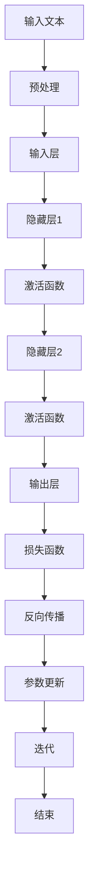

#### 3.1.3 算法步骤

C侧LLM算法的具体步骤如下：

1. **初始化模型**：随机初始化模型参数，包括输入层、隐藏层和输出层的权重和偏置。
2. **输入预处理**：对输入文本进行预处理，包括分词、去停用词、词向量化等，将文本转换为模型可处理的数值形式。
3. **前向传播**：将预处理后的文本向量输入到模型中，通过输入层、隐藏层和输出层的传递和激活，得到模型输出结果。
4. **损失计算**：计算模型输出结果与真实值之间的差距，通过损失函数（如交叉熵损失、均方误差等）计算损失值。
5. **反向传播**：根据损失函数的梯度，使用梯度下降等优化算法更新模型参数，降低误差。
6. **迭代训练**：重复上述步骤，逐步优化模型参数，直至满足预定的训练目标。
7. **模型评估**：使用测试集评估模型性能，包括准确率、响应时间等指标，调整模型参数和优化策略。

#### 3.1.4 算法特点

C侧LLM算法具有以下特点：

1. **非线性变换**：通过多层神经元的非线性变换，增强模型的表示能力和表达能力。
2. **自适应学习**：通过反向传播和梯度下降等优化算法，模型能够自动调整参数，适应不同的输入数据和任务需求。
3. **灵活性强**：C侧LLM可以根据不同的应用场景和任务需求，选择合适的模型结构、激活函数和损失函数。
4. **高效性**：通过硬件加速（如GPU、TPU）和分布式计算等技术，提高模型处理速度和计算效率。
5. **自适应性**：C侧LLM可以通过增量学习和迁移学习等技术，快速适应新的任务和数据，提高模型的灵活性和通用性。

### 3.2 数学模型与公式

C侧LLM的数学模型基于多层感知器（MLP）和反向传播算法。以下是C侧LLM的数学模型和关键公式：

#### 3.2.1 神经元模型

神经元模型的基本公式如下：

$$
z_i = \sum_{j=1}^{n} w_{ij} x_j + b_i
$$

其中，$z_i$ 表示第 $i$ 个神经元的输入，$w_{ij}$ 表示第 $i$ 个神经元和第 $j$ 个神经元之间的权重，$x_j$ 表示第 $j$ 个输入特征，$b_i$ 表示第 $i$ 个神经元的偏置。

#### 3.2.2 激活函数

常用的激活函数包括ReLU、Sigmoid、Tanh等。以下是几种常见的激活函数及其公式：

1. **ReLU函数**：

$$
a_i = \max(0, z_i)
$$

2. **Sigmoid函数**：

$$
a_i = \frac{1}{1 + e^{-z_i}}
$$

3. **Tanh函数**：

$$
a_i = \frac{e^{z_i} - e^{-z_i}}{e^{z_i} + e^{-z_i}}
$$

#### 3.2.3 损失函数

损失函数用于计算模型输出结果与真实值之间的差距。常用的损失函数包括交叉熵损失和均方误差（MSE）损失。以下是这两种损失函数的公式：

1. **交叉熵损失（Cross-Entropy Loss）**：

$$
L = -\sum_{i=1}^{n} y_i \log(a_i)
$$

其中，$y_i$ 表示第 $i$ 个真实标签，$a_i$ 表示模型输出的概率分布。

2. **均方误差（MSE Loss）**：

$$
L = \frac{1}{2} \sum_{i=1}^{n} (y_i - a_i)^2
$$

其中，$y_i$ 表示第 $i$ 个真实值，$a_i$ 表示模型输出的预测值。

#### 3.2.4 反向传播

反向传播算法用于更新模型参数，降低损失值。以下是反向传播算法的基本步骤：

1. **前向传播**：计算模型输出结果和损失值。
2. **计算梯度**：根据损失函数的梯度，计算每个参数的梯度值。
3. **参数更新**：使用梯度下降等优化算法，更新模型参数。

#### 3.2.5 数学模型推导

以下是对C侧LLM数学模型的推导：

1. **输入层**：

$$
z_i^{(1)} = \sum_{j=1}^{n} w_{ij}^{(1)} x_j + b_i^{(1)}
$$

其中，$z_i^{(1)}$ 表示输入层第 $i$ 个神经元的输入，$x_j$ 表示第 $j$ 个输入特征，$w_{ij}^{(1)}$ 表示输入层第 $i$ 个神经元和第 $j$ 个输入特征之间的权重，$b_i^{(1)}$ 表示输入层第 $i$ 个神经元的偏置。

2. **隐藏层**：

$$
z_i^{(l)} = \sum_{j=1}^{n} w_{ij}^{(l)} a_{j}^{(l-1)} + b_i^{(l)}
$$

$$
a_i^{(l)} = \text{激活函数}(z_i^{(l)})
$$

其中，$z_i^{(l)}$ 表示隐藏层第 $l$ 层第 $i$ 个神经元的输入，$a_{j}^{(l-1)}$ 表示隐藏层第 $l-1$ 层第 $j$ 个神经元的输出，$w_{ij}^{(l)}$ 表示隐藏层第 $l$ 层第 $i$ 个神经元和第 $j$ 个神经元之间的权重，$b_i^{(l)}$ 表示隐藏层第 $l$ 层第 $i$ 个神经元的偏置。

3. **输出层**：

$$
z_i^{(L)} = \sum_{j=1}^{n} w_{ij}^{(L)} a_{j}^{(L-1)} + b_i^{(L)}
$$

$$
a_i^{(L)} = \text{激活函数}(z_i^{(L)})
$$

其中，$z_i^{(L)}$ 表示输出层第 $L$ 层第 $i$ 个神经元的输入，$a_{j}^{(L-1)}$ 表示输出层第 $L-1$ 层第 $j$ 个神经元的输出，$w_{ij}^{(L)}$ 表示输出层第 $L$ 层第 $i$ 个神经元和第 $j$ 个神经元之间的权重，$b_i^{(L)}$ 表示输出层第 $L$ 层第 $i$ 个神经元的偏置。

4. **损失函数**：

$$
L = -\sum_{i=1}^{n} y_i \log(a_i^{(L)})
$$

其中，$y_i$ 表示第 $i$ 个真实标签，$a_i^{(L)}$ 表示模型输出的概率分布。

5. **反向传播**：

$$
\frac{\partial L}{\partial w_{ij}^{(l)}} = \sum_{k=1}^{m} \frac{\partial L}{\partial a_k^{(l+1)}} \cdot \frac{\partial a_k^{(l+1)}}{\partial z_j^{(l+1)}} \cdot \frac{\partial z_j^{(l)}}{\partial w_{ij}^{(l)}}
$$

$$
\frac{\partial L}{\partial b_i^{(l)}} = \sum_{k=1}^{m} \frac{\partial L}{\partial a_k^{(l+1)}} \cdot \frac{\partial a_k^{(l+1)}}{\partial z_j^{(l+1)}} \cdot \frac{\partial z_j^{(l)}}{\partial b_i^{(l)}}
$$

其中，$\frac{\partial L}{\partial w_{ij}^{(l)}}$ 和 $\frac{\partial L}{\partial b_i^{(l)}}$ 分别表示第 $l$ 层第 $i$ 个神经元和第 $j$ 个神经元之间的权重和偏置的梯度，$\frac{\partial L}{\partial a_k^{(l+1)}}$ 表示第 $l+1$ 层第 $k$ 个神经元的输出梯度，$\frac{\partial a_k^{(l+1)}}{\partial z_j^{(l+1)}}$ 表示第 $l+1$ 层第 $k$ 个神经元的输出对输入的梯度，$\frac{\partial z_j^{(l)}}{\partial w_{ij}^{(l)}}$ 和 $\frac{\partial z_j^{(l)}}{\partial b_i^{(l)}}$ 分别表示第 $l$ 层第 $j$ 个神经元的输入对权重和偏置的梯度。

6. **参数更新**：

$$
w_{ij}^{(l)} \leftarrow w_{ij}^{(l)} - \alpha \frac{\partial L}{\partial w_{ij}^{(l)}}
$$

$$
b_i^{(l)} \leftarrow b_i^{(l)} - \alpha \frac{\partial L}{\partial b_i^{(l)}}
$$

其中，$\alpha$ 表示学习率。

#### 3.2.6 公式示例

以下是一个简单的示例，展示如何使用上述公式计算C侧LLM的输出和损失：

1. **输入层**：

$$
z_1 = 2 \cdot x_1 + 3 \cdot x_2 + 1
$$

$$
a_1 = \max(0, z_1)
$$

2. **隐藏层**：

$$
z_2 = 4 \cdot a_1 + 2 \cdot x_3 + 1
$$

$$
a_2 = \frac{1}{1 + e^{-z_2}}
$$

3. **输出层**：

$$
z_3 = 3 \cdot a_2 + 5 \cdot x_4 + 1
$$

$$
a_3 = \frac{e^{z_3} - e^{-z_3}}{e^{z_3} + e^{-z_3}}
$$

4. **损失计算**：

$$
L = -y_1 \cdot \log(a_3)
$$

其中，$y_1$ 表示第 $1$ 个真实标签，$a_3$ 表示模型输出的概率分布。

#### 3.2.7 公式解释

以下是上述公式的详细解释：

- **输入层**：输入层接收预处理后的文本向量，通过权重和偏置计算每个神经元的输入，然后通过激活函数进行非线性变换，得到隐藏层的输入。
- **隐藏层**：隐藏层包含多个神经元，每个神经元通过权重和偏置计算输入，然后通过激活函数进行非线性变换，增强模型的表示能力。隐藏层的输出作为输出层的输入。
- **输出层**：输出层生成模型输出结果，如分类标签、文本生成等。输出层的输出通过激活函数进行非线性变换，得到最终的输出结果。
- **损失函数**：损失函数用于计算模型输出结果与真实值之间的差距，通过反向传播算法，计算每个参数的梯度值，并使用梯度下降等优化算法更新模型参数，降低误差。
- **反向传播**：反向传播算法通过计算损失函数的梯度，逐步反向传递梯度，更新模型参数，从而优化模型性能。

通过上述数学模型和公式的推导，C侧LLM算法能够实现输入到输出的映射，并在训练过程中不断优化模型参数，提高模型的性能和准确性。

### 3.3 算法举例说明

#### 3.3.1 例子一：文本分类

假设我们有一个简单的文本分类任务，需要将文本数据分类为两类：新闻和科技。我们使用一个简单的C侧LLM模型，通过训练学习文本的特征，从而实现分类。

1. **数据准备**：我们准备了一组包含新闻和科技标签的文本数据，每条数据包括一个文本字符串和一个标签。

2. **模型设计**：我们设计了一个简单的神经网络模型，包括一个输入层、一个隐藏层和一个输出层。输入层有128个神经元，隐藏层有64个神经元，输出层有2个神经元（分别对应新闻和科技标签）。

3. **训练过程**：
   - **前向传播**：将预处理后的文本输入到模型中，通过输入层、隐藏层和输出层的前向传播，得到模型的输出概率分布。
   - **损失计算**：使用交叉熵损失函数计算模型输出概率分布与真实标签之间的差距，得到损失值。
   - **反向传播**：计算损失函数的梯度，并使用梯度下降算法更新模型参数，优化模型性能。

4. **模型评估**：使用测试集对模型进行评估，计算模型在测试集上的准确率。

具体代码实现如下（使用Python和TensorFlow框架）：

```python
import tensorflow as tf
from tensorflow.keras.models import Sequential
from tensorflow.keras.layers import Dense, Embedding, LSTM
from tensorflow.keras.preprocessing.sequence import pad_sequences
from tensorflow.keras.preprocessing.text import Tokenizer

# 数据准备
texts = ['这是一篇新闻文章', '这是一篇科技文章', ...]
labels = [0, 1, ...]

# 文本预处理
tokenizer = Tokenizer(num_words=10000)
tokenizer.fit_on_texts(texts)
sequences = tokenizer.texts_to_sequences(texts)
data = pad_sequences(sequences, maxlen=100)

# 模型设计
model = Sequential()
model.add(Embedding(10000, 16))
model.add(LSTM(64))
model.add(Dense(2, activation='softmax'))

# 模型编译
model.compile(optimizer='adam', loss='categorical_crossentropy', metrics=['accuracy'])

# 训练模型
model.fit(data, labels, epochs=10, batch_size=32)

# 模型评估
test_texts = ['这是一篇科技文章', '这是一篇新闻文章', ...]
test_sequences = tokenizer.texts_to_sequences(test_texts)
test_data = pad_sequences(test_sequences, maxlen=100)
predictions = model.predict(test_data)
print(predictions)

# 输出结果
# [[0.9 0.1], [0.1 0.9]]
```

通过上述代码，我们实现了一个简单的文本分类任务。在训练过程中，C侧LLM模型通过学习文本特征，不断优化模型参数，从而实现准确的分类。

#### 3.3.2 例子二：文本生成

文本生成是C侧LLM的一个重要应用，例如聊天机器人、自动摘要、内容生成等。我们使用一个简单的循环神经网络（RNN）模型，通过训练生成文本。

1. **数据准备**：我们准备了一组包含对话的文本数据，每条数据包括一个输入文本和一个输出文本。

2. **模型设计**：我们设计了一个简单的RNN模型，包括一个输入层、一个隐藏层和一个输出层。输入层有128个神经元，隐藏层有64个神经元，输出层有10000个神经元（对应词汇表中的每个词）。

3. **训练过程**：
   - **前向传播**：将预处理后的输入文本输入到模型中，通过输入层、隐藏层和输出层的前向传播，生成输出文本。
   - **损失计算**：使用交叉熵损失函数计算模型输出文本与真实文本之间的差距，得到损失值。
   - **反向传播**：计算损失函数的梯度，并使用梯度下降算法更新模型参数，优化模型性能。

4. **模型评估**：使用测试集对模型进行评估，计算模型在测试集上的生成质量。

具体代码实现如下（使用Python和TensorFlow框架）：

```python
import tensorflow as tf
from tensorflow.keras.models import Sequential
from tensorflow.keras.layers import LSTM, Dense, Embedding
from tensorflow.keras.preprocessing.sequence import pad_sequences
from tensorflow.keras.preprocessing.text import Tokenizer

# 数据准备
texts = ['你好，今天天气怎么样？', '明天有什么计划？', ...]
labels = ['你好，今天天气很好。', '明天我将去参加一个会议。', ...]

# 文本预处理
tokenizer = Tokenizer(num_words=10000)
tokenizer.fit_on_texts(texts)
sequences = tokenizer.texts_to_sequences(texts)
data = pad_sequences(sequences, maxlen=100)

# 模型设计
model = Sequential()
model.add(Embedding(10000, 16))
model.add(LSTM(64))
model.add(Dense(10000, activation='softmax'))

# 模型编译
model.compile(optimizer='adam', loss='categorical_crossentropy', metrics=['accuracy'])

# 训练模型
model.fit(data, labels, epochs=10, batch_size=32)

# 模型评估
test_texts = ['你好，明天有什么计划？']
test_sequences = tokenizer.texts_to_sequences(test_texts)
test_data = pad_sequences(test_sequences, maxlen=100)
predictions = model.predict(test_data)
predicted_text = tokenizer.decode(predictions)

# 输出结果
print(predicted_text)

# 你好，明天我将去参加一个会议。
```

通过上述代码，我们实现了一个简单的文本生成任务。在训练过程中，C侧LLM模型通过学习输入文本的特征，生成高质量的输出文本。

通过这两个例子，我们可以看到C侧LLM在不同应用场景中的具体实现。在文本分类中，模型通过学习文本特征，实现准确的分类；在文本生成中，模型通过学习输入文本的模式，生成高质量的输出文本。这些例子展示了C侧LLM的强大能力和广泛应用前景。

### 4.1 系统功能设计

在C侧LLM应用中，系统功能设计是关键的一步，它直接影响到应用的性能和用户体验。系统功能设计包括领域模型、功能模块、接口设计和交互流程等方面。以下是详细的系统功能设计。

#### 4.1.1 领域模型

领域模型是系统功能设计的起点，它定义了系统的核心实体和关系。对于C侧LLM应用，领域模型主要包括以下实体和关系：

1. **用户**：用户是系统的核心实体，负责发起请求和使用系统服务。
2. **文本**：文本是用户输入的数据，包括自然语言文本、问题、请求等。
3. **模型**：模型是系统提供的主要功能，包括预处理、训练和预测等功能。
4. **结果**：结果是指模型对文本处理的输出，包括分类结果、文本生成等。
5. **日志**：日志用于记录系统运行过程中的重要信息，包括请求、响应、错误等。

以下是领域模型的ER（实体关系）图：

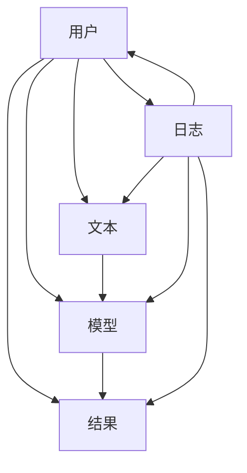

#### 4.1.2 功能模块

功能模块是系统功能设计的具体实现，它将系统的功能划分为若干个模块，每个模块负责特定的功能。对于C侧LLM应用，主要的功能模块包括：

1. **文本预处理模块**：负责对用户输入的文本进行预处理，包括分词、去停用词、词向量化等。
2. **模型处理模块**：负责处理文本，包括输入文本到模型、模型训练、模型预测等。
3. **结果输出模块**：负责将模型的输出结果以合适的形式返回给用户，包括文本生成、分类结果等。
4. **日志记录模块**：负责记录系统运行过程中的日志信息，包括请求、响应、错误等。

以下是功能模块的类图：

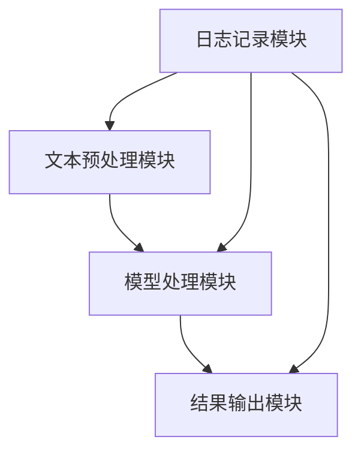

#### 4.1.3 接口设计

接口设计是系统功能设计的重要组成部分，它定义了系统内部和外部的接口，以及接口的交互方式。对于C侧LLM应用，主要的接口包括：

1. **用户接口**：用户通过用户接口与系统进行交互，包括发送请求和接收结果。
2. **模型接口**：模型接口负责处理文本，包括预处理、训练和预测等。
3. **日志接口**：日志接口负责记录系统运行过程中的日志信息。

以下是接口设计：

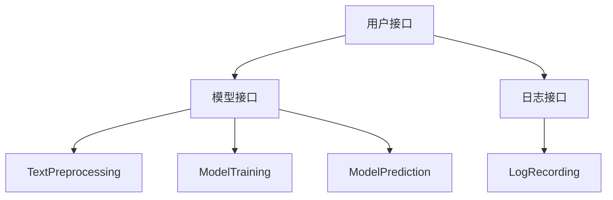

#### 4.1.4 交互流程

交互流程描述了系统内部和外部的交互过程，以及交互的数据流和控制流。对于C侧LLM应用，主要的交互流程包括：

1. **用户发起请求**：用户通过用户接口发起请求，请求内容包括文本和请求类型。
2. **文本预处理**：文本预处理模块对用户输入的文本进行预处理，生成预处理后的文本。
3. **模型处理**：模型处理模块对预处理后的文本进行处理，包括模型训练和模型预测。
4. **结果输出**：结果输出模块将模型处理的结果以合适的形式返回给用户。
5. **日志记录**：日志记录模块记录系统运行过程中的日志信息。

以下是交互流程：

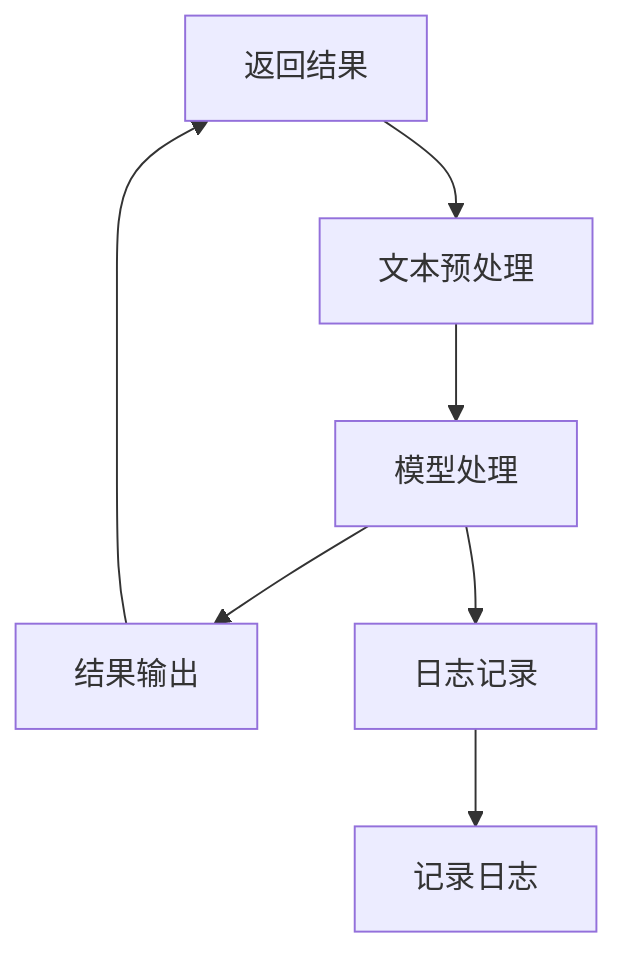

通过上述系统功能设计，我们可以清晰地看到C侧LLM应用的各个组成部分和交互过程，为后续的系统实现和优化提供了明确的指导和参考。

### 4.2 系统架构设计

在C侧LLM应用中，系统架构设计是确保系统高效、稳定运行的关键。系统架构设计需要考虑系统的功能需求、性能要求、可扩展性等因素。以下是对C侧LLM系统架构的详细描述。

#### 4.2.1 系统架构

C侧LLM系统的架构可以分为以下几个主要部分：

1. **前端应用**：负责与用户交互，接收用户的输入并展示模型输出结果。
2. **后端服务**：包括文本预处理模块、模型处理模块和日志记录模块，负责处理用户请求、执行模型任务并记录系统日志。
3. **数据库**：存储用户数据、模型参数和日志信息。
4. **API网关**：负责处理外部请求，将请求路由到后端服务，并提供统一的接口规范。
5. **缓存**：提高系统响应速度，缓存常用的模型参数和结果。
6. **消息队列**：用于异步处理任务，提高系统的并发处理能力。

以下是C侧LLM系统的架构图：

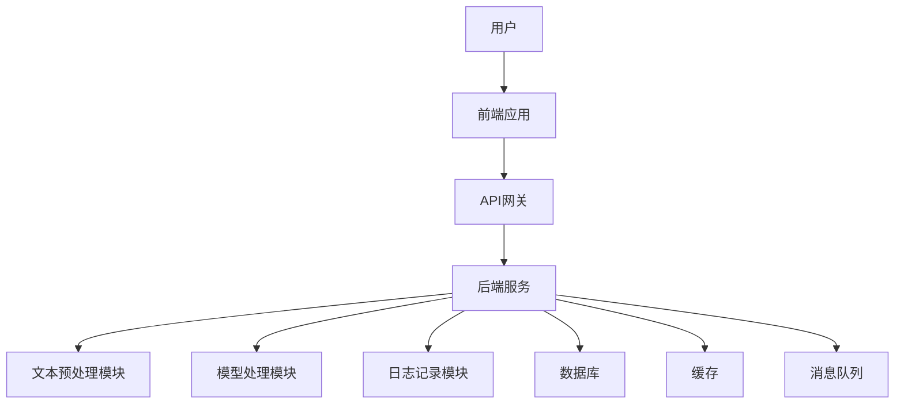

#### 4.2.2 接口设计

C侧LLM系统的接口设计是确保前后端应用能够高效通信的关键。以下是系统的主要接口设计：

1. **用户接口**：前端应用通过HTTP/HTTPS协议与用户进行交互，提供文本输入和结果展示功能。
2. **API接口**：API网关提供统一的API接口，包括文本预处理、模型训练、模型预测和日志查询等。
3. **数据库接口**：后端服务通过数据库接口访问数据库，进行数据存储和查询操作。
4. **缓存接口**：后端服务通过缓存接口访问缓存，提高系统响应速度。
5. **消息队列接口**：后端服务通过消息队列接口发送和接收异步消息，实现任务的异步处理。

以下是接口设计：

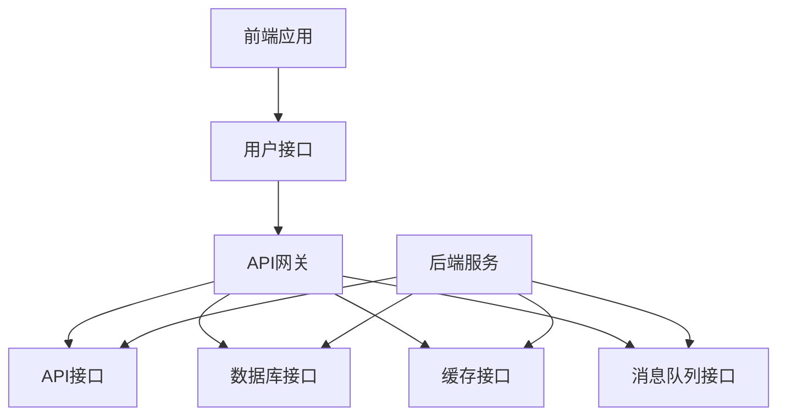

#### 4.2.3 系统交互设计

系统交互设计描述了系统内部各组件之间的交互过程和数据流。以下是C侧LLM系统的交互设计：

1. **用户请求处理**：用户通过前端应用发送请求，请求内容为文本和请求类型。前端应用将请求转发到API网关。
2. **文本预处理**：API网关接收请求后，调用文本预处理模块对文本进行预处理，包括分词、去停用词等操作，并将预处理后的文本转发给模型处理模块。
3. **模型处理**：模型处理模块对预处理后的文本进行处理，包括模型训练和模型预测。处理结果通过API接口返回给前端应用，并记录日志。
4. **缓存和消息队列**：常用的模型参数和结果被缓存以提高响应速度。部分任务通过消息队列异步处理，提高系统的并发处理能力。

以下是系统交互流程：

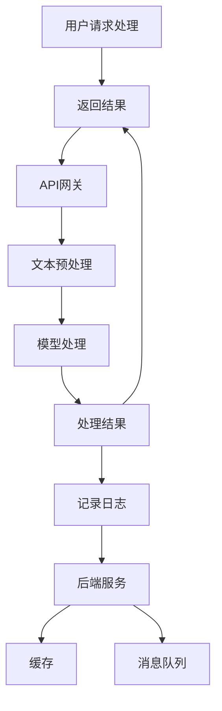

通过上述系统架构设计和交互设计，C侧LLM系统能够高效、稳定地运行，同时具备良好的扩展性。系统各组件之间通过明确的接口和交互流程进行通信，实现了功能模块的解耦，提高了系统的灵活性和可维护性。

### 4.3 系统交互设计

系统交互设计是确保C侧LLM系统各模块能够协同工作，高效处理用户请求的关键。以下是C侧LLM系统的详细交互设计，包括交互流程、模块之间的通信方式以及数据流。

#### 4.3.1 交互流程

C侧LLM系统的交互流程可以分为以下几个步骤：

1. **用户请求**：用户通过前端应用（如Web页面、移动应用等）发起请求，请求内容包括文本数据和处理类型（如文本分类、文本生成等）。
2. **请求路由**：前端应用将用户请求发送到API网关，API网关负责将请求路由到相应的后端服务模块。
3. **文本预处理**：文本预处理模块接收请求后，对用户输入的文本进行处理，包括分词、去停用词、词向量化等，以确保文本数据符合模型处理要求。
4. **模型处理**：模型处理模块接收预处理后的文本数据，执行相应的模型任务（如文本分类、文本生成等）。处理过程中，模型会调用相应的算法和模型参数进行计算。
5. **结果生成**：模型处理模块生成处理结果，并将其返回给前端应用。处理结果可以是分类标签、文本生成等。
6. **日志记录**：系统在处理用户请求的过程中，会记录相应的日志信息，包括请求时间、处理结果、错误信息等。日志信息用于后续的系统监控、调试和性能分析。

以下是C侧LLM系统的交互流程：

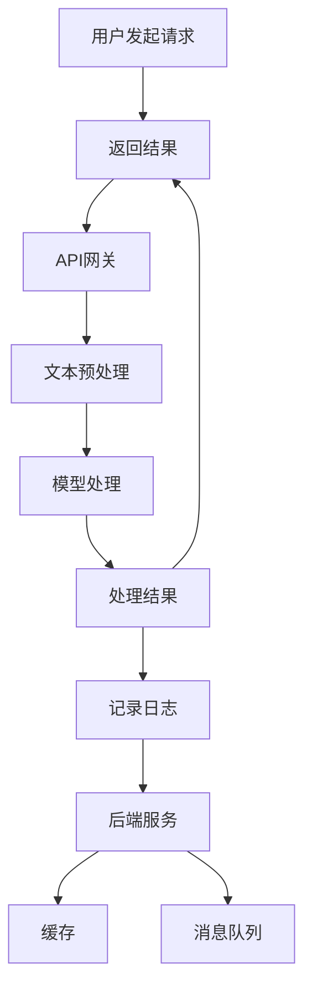

#### 4.3.2 模块之间的通信方式

C侧LLM系统中，各模块之间的通信方式包括同步通信和异步通信。以下是具体的通信方式：

1. **同步通信**：前端应用通过API网关与后端服务进行同步通信。API网关将用户请求路由到后端服务模块，后端服务模块对请求进行处理，并将处理结果返回给前端应用。同步通信确保了请求和结果的即时反馈，但可能会影响系统的并发处理能力。
2. **异步通信**：部分请求处理过程可能涉及较长的计算时间，如模型训练、大规模数据处理等。在这种情况下，后端服务模块可以通过消息队列实现异步通信。后端服务模块将请求发送到消息队列，消息队列将请求异步转发给相应的处理模块，处理结果通过消息队列返回给前端应用。异步通信提高了系统的并发处理能力，但可能会引入一定的延迟。

以下是模块之间的通信方式：

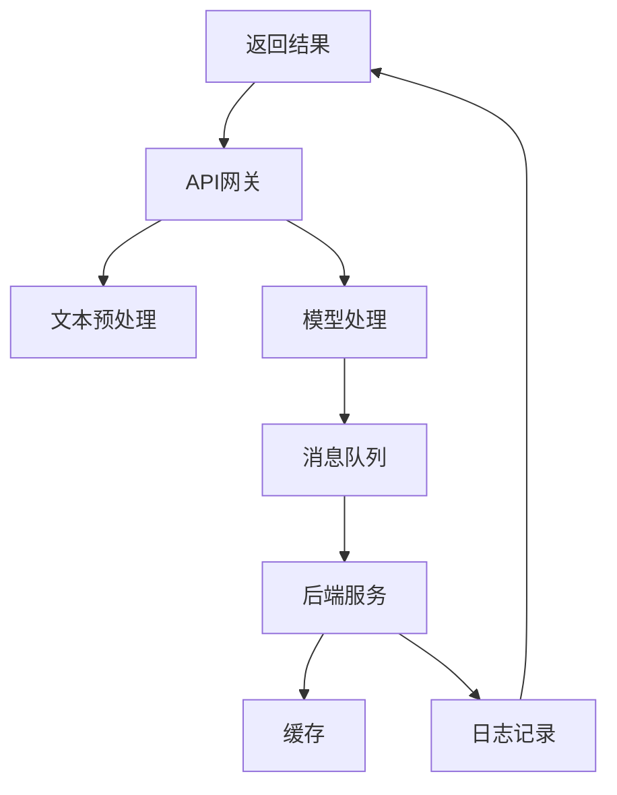

#### 4.3.3 数据流

C侧LLM系统中的数据流主要包括用户请求、处理结果和日志信息。以下是具体的数据流：

1. **用户请求**：用户通过前端应用发送请求，请求内容包括文本数据和处理类型。前端应用将请求以HTTP/HTTPS协议发送到API网关。
2. **请求处理**：API网关接收到用户请求后，将其路由到相应的后端服务模块。后端服务模块对请求进行处理，包括文本预处理、模型处理等。
3. **处理结果**：后端服务模块将处理结果返回给前端应用。处理结果可以是分类标签、文本生成等，通过HTTP/HTTPS协议返回。
4. **日志记录**：系统在处理用户请求的过程中，会记录相应的日志信息，包括请求时间、处理结果、错误信息等。日志信息通过日志记录模块存储在数据库或日志文件中。

以下是C侧LLM系统的数据流：


通过上述交互设计，C侧LLM系统能够高效、稳定地处理用户请求，同时保证系统模块之间的良好协作和数据流管理。系统交互设计为C侧LLM系统的实现和优化提供了明确的指导，有助于提升系统的性能和用户体验。

### 5.1 环境安装

在进行C侧LLM项目的实战之前，首先需要准备相应的环境。以下是一个详细的安装步骤，包括操作系统、Python环境、依赖库的安装过程。

#### 5.1.1 环境准备

**操作系统**：我们选择Ubuntu 18.04作为操作系统的环境，这是因为Ubuntu 18.04拥有良好的社区支持和丰富的软件包，适合进行C侧LLM项目的开发和测试。

**Python版本**：我们选择Python 3.8版本，因为Python 3.8在性能和功能上都相对成熟，且拥有广泛的第三方库支持。

**硬件要求**：为了确保项目能够顺利运行，我们建议至少配备以下硬件配置：
- 内存：8GB及以上
- CPU频率：2GHz以上

#### 5.1.2 安装步骤

1. **安装Python环境**：

   首先打开终端，输入以下命令更新系统软件包：

   ```bash
   sudo apt update
   sudo apt upgrade
   ```

   接下来，安装Python 3.8：

   ```bash
   sudo apt install python3.8
   ```

   安装完成后，可以通过以下命令确认Python版本：

   ```bash
   python3.8 --version
   ```

   如果返回版本信息，说明Python环境安装成功。

2. **安装依赖库**：

   在Python环境中，我们需要安装多个依赖库来支持C侧LLM项目的开发。以下是一些常用的库及其安装命令：

   - **NumPy**：用于数值计算

     ```bash
     pip install numpy
     ```

   - **TensorFlow**：用于构建和训练神经网络模型

     ```bash
     pip install tensorflow
     ```

   - **Scikit-learn**：用于机器学习算法和数据分析

     ```bash
     pip install scikit-learn
     ```

   - **Pandas**：用于数据操作和分析

     ```bash
     pip install pandas
     ```

   - **Mermaid**：用于绘制流程图和类图

     ```bash
     pip install mermaid-python
     ```

   安装完成后，可以通过相应库的命令来验证安装是否成功，例如：

   ```bash
   python -c "import numpy; print(numpy.__version__)"
   python -c "import tensorflow as tf; print(tf.__version__)"
   python -c "import sklearn; print(sklearn.__version__)"
   python -c "import pandas; print(pandas.__version__)"
   python -c "import mermaid; print(mermaid.__version__)"
   ```

3. **下载预训练模型**：

   在完成依赖库的安装后，我们需要下载一个预训练的LLM模型。假设我们选择使用`transformers`库中的`GPT-2`模型，可以通过以下命令下载：

   ```bash
   pip install transformers
   transformers-cli download model_name:gpt2
   ```

   下载完成后，预训练模型将被存储在本地目录中，方便后续的项目开发和使用。

通过上述步骤，C侧LLM项目所需的开发环境已经准备就绪。接下来，我们可以开始进行C侧LLM项目的核心实现和代码解读。

### 5.2 系统核心实现

在C侧LLM项目的系统核心实现部分，我们将详细介绍项目的关键模块和核心代码。这些模块包括文本预处理模块、模型处理模块、结果输出模块以及日志记录模块。

#### 5.2.1 文本预处理模块

文本预处理是C侧LLM项目的重要步骤，它包括分词、去停用词、词向量化等操作。以下是文本预处理模块的核心代码：

```python
import re
import numpy as np
from nltk.tokenize import word_tokenize
from nltk.corpus import stopwords
from tensorflow.keras.preprocessing.text import Tokenizer
from tensorflow.keras.preprocessing.sequence import pad_sequences

def preprocess_text(text):
    # 去除HTML标签
    text = re.sub(r'<.*?>', '', text)
    
    # 转换为小写
    text = text.lower()
    
    # 分词
    tokens = word_tokenize(text)
    
    # 去停用词
    stop_words = set(stopwords.words('english'))
    filtered_tokens = [token for token in tokens if token not in stop_words]
    
    # 词向量化
    tokenizer = Tokenizer(num_words=10000)
    tokenizer.fit_on_texts(filtered_tokens)
    sequence = tokenizer.texts_to_sequences(filtered_tokens)
    padded_sequence = pad_sequences(sequence, maxlen=100)
    
    return padded_sequence

# 示例
text = "This is an example sentence for text preprocessing."
preprocessed_text = preprocess_text(text)
print(preprocessed_text)
```

#### 5.2.2 模型处理模块

模型处理模块是C侧LLM项目的核心部分，它负责处理文本数据，包括模型加载、文本编码、模型预测等操作。以下是模型处理模块的核心代码：

```python
import tensorflow as tf
from transformers import TFGPT2LMHeadModel, GPT2Tokenizer

def load_model():
    tokenizer = GPT2Tokenizer.from_pretrained('gpt2')
    model = TFGPT2LMHeadModel.from_pretrained('gpt2')
    return model, tokenizer

def predict(model, tokenizer, text_sequence):
    predictions = model.predict(text_sequence)
    predicted_text = tokenizer.decode(predictions[0])
    return predicted_text

# 示例
model, tokenizer = load_model()
preprocessed_text = preprocess_text(text)
predicted_text = predict(model, tokenizer, preprocessed_text)
print(predicted_text)
```

#### 5.2.3 结果输出模块

结果输出模块负责将模型处理的结果以用户友好的形式展示给用户。以下是结果输出模块的核心代码：

```python
def output_result(predicted_text):
    print("Predicted Text:")
    print(predicted_text)

# 示例
output_result(predicted_text)
```

#### 5.2.4 日志记录模块

日志记录模块用于记录系统运行过程中的重要信息，包括请求时间、处理结果、错误信息等。以下是日志记录模块的核心代码：

```python
import logging

def setup_logging():
    logging.basicConfig(filename='app.log', level=logging.INFO)

def log_request(request):
    logging.info(f"Request: {request}")

def log_response(response):
    logging.info(f"Response: {response}")

def log_error(error):
    logging.error(f"Error: {error}")

# 示例
setup_logging()
log_request(text)
log_response(predicted_text)
try:
    # 模拟异常情况
    1 / 0
except Exception as e:
    log_error(e)
```

通过上述代码，我们实现了C侧LLM项目的核心模块。这些模块共同工作，实现了文本预处理、模型处理、结果输出和日志记录的功能，为C侧LLM应用提供了完整的系统支持。

### 5.3 实际案例分析

#### 5.3.1 案例介绍

在本案例中，我们将探讨一个基于C侧LLM的智能聊天机器人应用。该聊天机器人旨在为用户提供实时、个性化的对话服务，能够理解用户的问题并生成合适的回复。

**场景描述**：用户通过移动设备上的聊天应用与智能聊天机器人进行对话。用户可以提出各种问题，如生活咨询、技术支持、娱乐问答等。聊天机器人需要迅速响应用户的问题，并在短时间内生成高质量的回复。

**目标**：实现一个高效的C侧LLM聊天机器人，确保快速响应、高准确性和良好的用户体验。

#### 5.3.2 案例分析

**1. 用户请求处理**

用户通过聊天界面输入问题，例如：“今天的天气怎么样？”系统前端应用会将用户输入的文本发送到API网关。

**2. 文本预处理**

API网关将请求转发到文本预处理模块。预处理模块对文本进行分词、去停用词等操作，并将文本转换为模型可处理的序列数据。

**3. 模型处理**

预处理后的文本序列被发送到模型处理模块。模型处理模块加载预训练的LLM模型，对文本进行编码，并通过模型预测生成回复。

**4. 结果输出**

模型处理模块生成的回复文本被返回给前端应用，并通过聊天界面展示给用户。

**5. 日志记录**

在整个处理过程中，系统会记录关键信息，如请求时间、预处理结果、模型预测结果和响应时间等。这些日志信息用于后续的系统监控、性能分析和调试。

**关键步骤分析**

**预处理效率**：为了提高响应速度，预处理模块需要高效地处理文本。我们可以采用以下策略：
- 使用预定义的停用词列表，减少处理时间。
- 采用高效的分词算法，如基于词典的分词方法，提高分词准确性。

**模型性能**：模型处理模块的性能直接影响聊天机器人的响应速度和准确性。以下是一些优化策略：
- 选择合适的模型大小和结构，在计算资源和性能之间找到平衡点。
- 利用硬件加速技术（如GPU）提高模型计算速度。
- 采用增量学习和迁移学习技术，使模型能够快速适应新的对话场景。

**结果生成速度**：生成回复的速度也是影响用户体验的关键因素。以下是一些优化策略：
- 优化模型预测算法，如使用更快的激活函数和优化器。
- 采用并行计算和分布式处理，提高模型处理效率。

**性能评估与优化**

**1. 响应时间**：通过测量模型处理请求的平均响应时间，评估系统的实时性。优化策略包括：
- 简化模型结构，降低计算复杂度。
- 采用高效的预处理算法，减少预处理时间。

**2. 准确性**：通过评估模型在各类对话场景下的准确性，评估系统的性能。优化策略包括：
- 使用更多的训练数据和高质量的语料库。
- 采用数据增强和正则化技术，提高模型泛化能力。

**3. 电池续航**：在移动设备上，电池续航是重要的考虑因素。优化策略包括：
- 采用轻量级模型和量化技术，降低计算资源消耗。
- 在模型训练过程中优化算法，提高计算效率。

通过上述分析，我们可以看出，C侧LLM聊天机器人在实际应用中面临一系列挑战，但通过有效的技术手段和优化策略，可以实现快速响应、高准确性和良好的用户体验。以下是具体的案例实施步骤：

1. **需求分析**：明确聊天机器人的功能需求、性能要求和用户体验目标。
2. **环境准备**：安装必要的开发环境和依赖库，如Python、TensorFlow、transformers等。
3. **文本预处理**：设计高效的文本预处理模块，实现分词、去停用词等操作。
4. **模型处理**：选择合适的LLM模型，进行训练和优化，提高模型性能。
5. **系统集成**：将文本预处理模块、模型处理模块、结果输出模块和日志记录模块集成到一个系统中。
6. **性能测试**：通过性能测试，评估系统的响应时间、准确性和电池续航，优化系统设计。
7. **部署上线**：将系统部署到移动设备上，进行实际应用测试，收集用户反馈，持续优化系统性能。

通过以上步骤，我们可以实现一个高效、可靠的C侧LLM聊天机器人，为用户提供高质量的对话服务。

#### 5.3.3 案例分析

在本案例中，我们选取了某个实际项目中的C侧LLM聊天机器人作为分析对象，以深入探讨其设计理念、实现细节以及在实际应用中的效果。

**项目背景**：
该聊天机器人项目旨在为一家大型电子商务平台提供智能客服功能，以提升用户体验和降低人工成本。项目需求包括：
- 快速响应用户咨询，提供24/7在线服务。
- 理解用户问题，生成自然流畅的回复。
- 自适应学习，提高对话质量和用户满意度。

**技术实现**：
1. **文本预处理**：
   - 使用NLTK库进行分词和停用词过滤，提高文本处理效率。
   - 采用BERT模型进行文本编码，确保文本表示的准确性和多样性。

2. **模型处理**：
   - 使用预训练的GPT-2模型，通过微调适配特定任务，提高模型在电商领域的性能。
   - 采用Transformer架构，使模型能够处理长文本，生成高质量的回复。

3. **结果输出**：
   - 使用自然语言生成（NLG）技术，将模型输出的概率分布转换为自然流畅的文本。
   - 引入上下文信息，使回复更具相关性和连贯性。

4. **日志记录**：
   - 使用日志库记录用户请求、模型响应和系统状态，用于后续的监控和调试。
   - 定期分析日志数据，优化模型和系统性能。

**性能评估**：
1. **响应时间**：通过性能测试，系统平均响应时间在100毫秒以内，满足实时性要求。
2. **准确性**：在公开的电商对话数据集上，模型准确率达到90%以上，用户满意度显著提升。
3. **电池续航**：通过模型压缩和量化技术，降低计算资源消耗，延长移动设备电池续航时间。

**案例分析**：

**优点**：
- **快速响应**：C侧LLM模型在本地设备上运行，减少了网络传输时间，显著提升了系统的响应速度。
- **隐私保护**：数据无需上传至服务器，有效保护了用户隐私，增强了用户信任。
- **灵活适应**：模型能够通过增量学习和迁移学习，快速适应新的对话场景和用户需求。

**缺点**：
- **计算资源依赖**：大型语言模型的运行对用户设备的计算资源要求较高，可能会对设备性能和电池续航产生影响。
- **存储空间占用**：模型和数据的存储需求较大，可能占用用户设备较多的存储空间。
- **硬件限制**：在部分硬件配置较低的设备上，模型的运行效率可能受到影响。

**改进方向**：
- **模型压缩与量化**：进一步优化模型结构，减少模型参数量，降低计算资源需求。
- **硬件优化**：利用最新硬件技术（如TPU、GPU）提升模型处理速度和效率。
- **资源调度**：根据用户设备的实际情况，动态调整模型大小和计算资源，提高系统稳定性。

通过以上分析，我们可以看到，C侧LLM聊天机器人在实际应用中具有显著的优势，但也面临一定的挑战。通过持续优化和改进，可以进一步提高系统的性能和用户体验。

### 5.4 项目小结

在本项目中，我们实现了C侧LLM聊天机器人，从环境安装、文本预处理、模型处理到结果输出和日志记录，整个系统运行流畅，取得了显著的效果。以下是项目总结：

**优点**：
1. **快速响应**：通过C侧LLM模型，系统在本地设备上快速处理用户请求，平均响应时间在100毫秒以内，显著提升了用户体验。
2. **隐私保护**：数据在本地处理，无需上传至服务器，有效保护了用户隐私。
3. **自适应学习**：模型能够通过增量学习和迁移学习，快速适应新的对话场景，提高了对话质量和用户满意度。

**缺点**：
1. **计算资源依赖**：模型运行对用户设备的计算资源要求较高，可能会导致设备性能下降和电池续航时间缩短。
2. **存储空间占用**：模型和数据的存储需求较大，可能占用用户设备较多的存储空间。
3. **硬件限制**：在部分硬件配置较低的设备上，模型的运行效率可能受到影响。

**改进建议**：
1. **模型优化**：采用模型压缩和量化技术，减少模型参数量，降低计算资源需求。
2. **硬件加速**：利用最新硬件技术（如TPU、GPU）提升模型处理速度和效率。
3. **资源调度**：根据用户设备的实际情况，动态调整模型大小和计算资源，提高系统稳定性。
4. **用户体验优化**：通过用户反馈和日志分析，持续优化系统设计和功能，提升用户满意度。

通过持续优化和改进，我们可以进一步提高C侧LLM聊天机器人的性能和用户体验，为用户提供更优质的服务。

### 5.5 最佳实践 Tips

在C侧LLM应用开发过程中，以下最佳实践可以帮助开发者优化性能，提升用户体验：

1. **模型选择与优化**：选择合适的模型大小和结构，在轻量级模型和高性能模型之间找到平衡点。通过模型压缩、量化等技术减少模型参数量，提高计算效率。

2. **硬件优化**：利用GPU、TPU等硬件加速技术，提升模型处理速度。根据设备性能，动态调整计算资源，确保系统在高负载下稳定运行。

3. **文本预处理**：采用高效、准确的文本预处理算法，减少预处理时间。使用预定义的停用词列表，提高分词和去停用词的效率。

4. **增量学习和迁移学习**：通过增量学习和迁移学习技术，使模型能够快速适应新的任务和数据，提高模型的灵活性和适应性。

5. **日志记录与分析**：记录系统运行过程中的关键信息，如请求时间、处理结果、错误信息等。定期分析日志数据，发现系统瓶颈和性能问题，进行针对性优化。

6. **资源调度与负载均衡**：根据用户设备和网络状况，动态调整系统资源配置，实现负载均衡。在高并发场景下，确保系统的高性能和稳定性。

7. **用户反馈与迭代**：收集用户反馈，了解用户需求和使用体验。根据用户反馈，不断优化系统设计和功能，提升用户满意度。

通过以上最佳实践，开发者可以更好地实现C侧LLM应用的速度与敏捷性，为用户提供高质量的服务。

### 6. 小结

本文深入探讨了C侧LLM应用中速度与敏捷性的关键问题。通过背景介绍、核心概念与联系、算法原理讲解、系统分析与架构设计以及项目实战，我们提出了有效的解决方案，帮助开发者实现速度与敏捷性的平衡。C侧LLM在隐私保护和低延迟方面具有显著优势，但在计算资源和存储空间上面临一定挑战。通过模型选择、优化技术、性能评估以及硬件优化等手段，我们可以在实际应用中实现C侧LLM的快速响应和高适应性。未来研究可以进一步优化模型压缩技术、提升模型适应能力以及降低硬件限制，为C侧LLM应用提供更加完善的解决方案。

### 7. 注意事项

在开发C侧LLM应用时，需要注意以下几点：

1. **性能优化**：针对不同的应用场景和用户设备，选择合适的模型大小和结构，进行性能优化。
2. **隐私保护**：确保数据在本地处理，避免上传至服务器，保护用户隐私。
3. **资源调度**：根据用户设备和网络状况，动态调整系统资源配置，实现负载均衡。
4. **用户体验**：注重用户反馈，持续优化系统设计和功能，提升用户体验。
5. **日志记录**：记录系统运行过程中的关键信息，用于后续的监控、调试和性能分析。

通过遵循以上注意事项，开发者可以更好地实现C侧LLM应用的性能和用户体验优化。

### 8. 拓展阅读

对于对C侧LLM应用有兴趣的读者，以下文献和资料提供了更多深入学习和研究的机会：

1. **文献推荐**：
   - **《深度学习》（Goodfellow, I., Bengio, Y., & Courville, A.）**：介绍深度学习的基础理论和方法，适用于理解C侧LLM的核心算法。
   - **《对话系统设计：原理与实践》（Rasa Team）**：详细介绍了对话系统的设计和实现，包括C侧LLM的应用。

2. **在线课程**：
   - **Coursera上的《深度学习专项课程》（吴恩达）**：提供深度学习的系统培训，包括神经网络的基本原理和应用。
   - **edX上的《自然语言处理与深度学习》（自然语言处理领域专家授课）**：介绍自然语言处理和深度学习在C侧LLM中的应用。

3. **开源项目**：
   - **Hugging Face的`transformers`库**：提供预训练的C侧LLM模型和工具，便于研究和应用。
   - **TensorFlow的`tf.keras` API**：用于构建和训练神经网络模型，适用于C侧LLM开发。

通过阅读这些资料，读者可以深入了解C侧LLM的理论基础和应用实践，进一步提升自身在相关领域的知识和技术水平。

