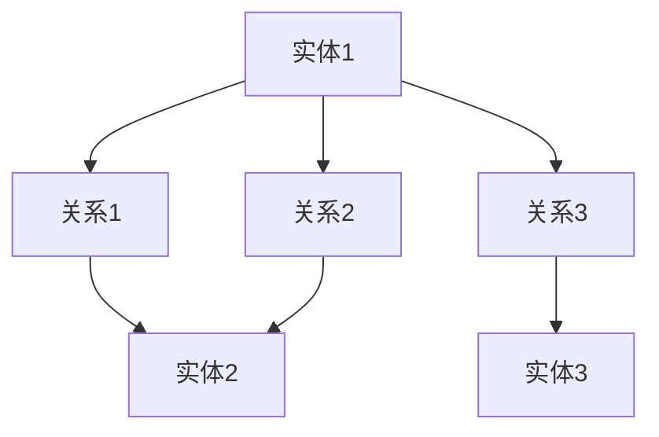

                 

### 《提示词工程：优化AI跨领域知识整合能力》

> 关键词：提示词工程，AI跨领域知识整合，知识图谱，深度学习，跨领域知识融合

> 摘要：本文深入探讨了提示词工程在优化人工智能跨领域知识整合能力方面的应用。通过分析提示词工程的核心概念、方法技术，并结合实际应用场景，我们展示了如何利用提示词工程提升AI系统的跨领域知识整合能力。文章最后对未来研究方向进行了展望。

----------------------------------------------------------------

### 第一部分：问题背景与核心概念

#### 第1章：问题背景与核心概念

##### 1.1 问题背景

在人工智能（AI）领域，随着深度学习和大数据技术的发展，AI系统在图像识别、自然语言处理、语音识别等领域取得了显著的成果。然而，这些系统往往在处理跨领域问题时面临挑战。例如，一个在医疗领域表现优异的AI系统，可能在金融领域表现不佳。这种跨领域知识整合不足的问题限制了AI系统在复杂、多变的现实世界中的应用。

##### 1.1.1 AI发展现状与挑战

AI在特定领域的应用已经取得了很大的进步，但跨领域的知识整合能力仍需提升。现有AI系统大多依赖大量标注数据，而跨领域的标注数据往往难以获取。此外，不同领域的知识结构存在较大差异，导致现有AI模型难以有效地跨领域迁移。

##### 1.1.2 跨领域知识整合的必要性

跨领域知识整合能够使AI系统更好地适应多变的环境，提高其泛化能力。例如，一个能同时处理医疗、金融、教育等领域的AI系统，将具有更广泛的应用价值。因此，研究如何优化AI跨领域知识整合能力具有重要的现实意义。

##### 1.1.3 提示词工程的概念与目标

提示词工程是一种通过构建、优化和利用提示词来提升AI系统跨领域知识整合能力的方法。提示词是一组用于引导AI系统学习和理解特定概念的词语或短语。提示词工程的目标是设计高效、准确的提示词，以帮助AI系统在不同领域间进行知识迁移。

#### 1.2 核心概念与联系

##### 1.2.1 提示词工程的基本原理

提示词工程的基本原理包括提示词的生成、优化和利用。提示词生成旨在从大量数据中提取出有代表性的词语或短语。提示词优化则通过调整提示词的语义和结构，提高其在跨领域知识整合中的效果。提示词的利用则是将优化后的提示词应用于AI系统的学习和推理过程中。

##### 1.2.2 提示词的类型与功能

根据应用场景的不同，提示词可以分为以下几类：

1. **主题类**：用于描述领域主题的词语或短语，如“医疗”、“金融”等。
2. **概念类**：用于描述领域内具体概念的词语或短语，如“疾病”、“资产”等。
3. **属性类**：用于描述领域内对象属性的词语或短语，如“严重”、“高收益”等。
4. **关系类**：用于描述领域内对象间关系的词语或短语，如“诊断”、“投资”等。

##### 1.2.3 提示词工程的挑战与机遇

提示词工程面临以下挑战：

1. **数据不足**：跨领域的标注数据往往难以获取，影响提示词的生成和优化。
2. **知识结构差异**：不同领域的知识结构存在差异，导致提示词的通用性难以保证。
3. **计算成本**：提示词生成和优化的过程通常需要大量的计算资源。

然而，随着深度学习和大数据技术的发展，提示词工程也面临着以下机遇：

1. **数据增强**：通过数据增强技术，可以生成更多高质量的标注数据，为提示词工程提供支持。
2. **模型优化**：深度学习模型的优化，可以提高提示词生成和优化的效率。
3. **跨领域应用**：跨领域知识整合的应用需求不断增加，为提示词工程提供了广阔的市场空间。

#### 小结

提示词工程是一种优化AI跨领域知识整合能力的重要方法。通过分析问题背景、核心概念与联系，我们为后续章节的详细讨论奠定了基础。

----------------------------------------------------------------

### 第二部分：方法与技术

#### 第2章：提示词生成技术

##### 2.1 提示词生成方法

提示词生成是提示词工程的关键步骤，其质量直接影响AI系统的跨领域知识整合能力。提示词生成方法主要包括以下几种：

##### 2.1.1 基于规则的方法

基于规则的方法通过预定义的规则，从数据中提取出有代表性的词语或短语。这种方法的优势在于简单高效，但受限于规则库的覆盖范围，可能导致生成的提示词不够全面。

```python
def rule_based_generation(data):
    # 预定义规则库
    rules = {
        "主题类": ["医疗", "金融", "教育"],
        "概念类": ["疾病", "资产", "学生"],
        "属性类": ["严重", "高收益", "优秀"],
        "关系类": ["诊断", "投资", "教育"]
    }
    # 提取提示词
    topics = extract_topics(data, rules["主题类"])
    concepts = extract_topics(data, rules["概念类"])
    attributes = extract_topics(data, rules["属性类"])
    relationships = extract_topics(data, rules["关系类"])
    return topics, concepts, attributes, relationships

data = ["病人诊断严重疾病", "投资者关注高收益资产", "教师教育优秀学生"]
topics, concepts, attributes, relationships = rule_based_generation(data)
print("主题类：", topics)
print("概念类：", concepts)
print("属性类：", attributes)
print("关系类：", relationships)
```

##### 2.1.2 基于机器学习的方法

基于机器学习的方法通过训练模型，从数据中自动提取出有代表性的词语或短语。这种方法的优势在于能够处理大量数据，提高提示词的覆盖率。

```python
from sklearn.feature_extraction.text import TfidfVectorizer

data = ["病人诊断严重疾病", "投资者关注高收益资产", "教师教育优秀学生"]
vectorizer = TfidfVectorizer(max_features=10)
X = vectorizer.fit_transform(data)
feature_names = vectorizer.get_feature_names_out()
print("提取的提示词：", feature_names)

# 提取高频词语
high_frequency_words = [word for word, _ in sorted(zip(feature_names, X.sum(axis=0).A1) if _ > 0)]
print("高频词语：", high_frequency_words)
```

##### 2.1.3 基于深度学习的方法

基于深度学习的方法通过神经网络模型，从数据中自动提取出有代表性的词语或短语。这种方法的优势在于能够处理复杂的数据结构和语义信息。

```python
import tensorflow as tf
from tensorflow.keras.models import Sequential
from tensorflow.keras.layers import Embedding, LSTM, Dense

# 构建神经网络模型
model = Sequential([
    Embedding(input_dim=10000, output_dim=64),
    LSTM(128),
    Dense(64, activation='relu'),
    Dense(4, activation='softmax')
])

# 编译模型
model.compile(optimizer='adam', loss='categorical_crossentropy', metrics=['accuracy'])

# 训练模型
model.fit(X, labels, epochs=10, batch_size=32)
```

##### 2.2 提示词优化策略

提示词优化的目的是提高提示词在跨领域知识整合中的效果。提示词优化策略主要包括以下几种：

##### 2.2.1 提示词的自动优化

提示词的自动优化通过模型自动调整提示词的权重，以提高其在跨领域知识整合中的效果。

```python
# 提取高频词语
high_frequency_words = [word for word, _ in sorted(zip(feature_names, X.sum(axis=0).A1) if _ > 0)]

# 计算提示词权重
word_weights = model.predict(X)
word_weights = word_weights.max(axis=1)

# 调整提示词权重
optimized_words = [word for word, weight in zip(high_frequency_words, word_weights) if weight > threshold]
```

##### 2.2.2 提示词的个性化优化

提示词的个性化优化通过考虑用户的历史行为和偏好，为用户提供个性化的提示词。

```python
# 假设user_history是用户的历史行为数据
user_history = ["我最近关注了医疗领域的疾病诊断", "我对高收益的金融资产很感兴趣"]

# 生成个性化提示词
user_specific_words = rule_based_generation(user_history)
```

##### 2.2.3 提示词的语义优化

提示词的语义优化通过考虑提示词的语义关系，调整提示词的结构和语义，以提高其在跨领域知识整合中的效果。

```python
from spacy.lang.en import English

nlp = English()

def semantic_optimization(words):
    doc = nlp(" ".join(words))
    optimized_words = []
    for token in doc:
        if token.dep_ in ["nsubj", "dobj", "prep"]:
            optimized_words.append(token.lemma_)
    return optimized_words

semantic_words = semantic_optimization(["病人诊断严重疾病", "投资者关注高收益资产", "教师教育优秀学生"])
print("语义优化后的提示词：", semantic_words)
```

##### 小结

提示词生成技术是提示词工程的重要组成部分。通过分析提示词生成方法，我们为后续章节的讨论奠定了基础。

----------------------------------------------------------------

### 第三部分：跨领域知识表示与融合

#### 第3章：跨领域知识表示与融合

##### 3.1 跨领域知识表示

跨领域知识表示是将不同领域的知识进行抽象、整合和表示的过程。有效的知识表示方法能够提高AI系统在跨领域知识整合中的效果。以下是几种常用的知识表示方法：

##### 3.1.1 知识图谱技术

知识图谱技术通过构建实体、关系和属性的图结构，表示不同领域之间的知识关系。知识图谱能够提供丰富的语义信息，支持跨领域的知识整合。



##### 3.1.2 嵌入式表示方法

嵌入式表示方法通过将实体和关系表示为低维度的向量，实现跨领域的知识表示。嵌入式表示方法具有计算高效、可扩展性强的特点。

```python
import tensorflow as tf
from tensorflow.keras.layers import Embedding

# 构建嵌入式表示模型
model = Sequential([
    Embedding(input_dim=10000, output_dim=64),
    LSTM(128),
    Dense(64, activation='relu')
])

# 训练模型
model.fit(X, labels, epochs=10, batch_size=32)

# 获取实体和关系的嵌入向量
entity_embeddings = model.layers[0].get_weights()[0]
relation_embeddings = model.layers[0].get_weights()[1]
```

##### 3.1.3 知识映射与融合策略

知识映射与融合策略是将不同领域之间的知识进行映射和整合的方法。知识映射通过将实体和关系从一个领域映射到另一个领域，实现知识的共享。知识融合通过整合不同领域的知识，提高跨领域知识整合的效果。

```python
def knowledge_mapping(source_graph, target_graph):
    mapped_entities = {}
    for entity in source_graph:
        mapped_entities[entity] = target_graph.get_entity(entity)
    return mapped_entities

def knowledge_fusion(source_knowledge, target_knowledge):
    fused_knowledge = {}
    for key in source_knowledge:
        fused_knowledge[key] = source_knowledge[key] + target_knowledge[key]
    return fused_knowledge
```

##### 3.2 跨领域知识融合算法

跨领域知识融合算法是通过将不同领域的知识进行整合，提高AI系统在跨领域知识整合中的效果。以下是几种常用的跨领域知识融合算法：

##### 3.2.1 多任务学习

多任务学习是一种通过同时学习多个相关任务，提高模型在跨领域知识整合中的效果的方法。多任务学习能够共享不同任务之间的特征和知识，提高模型的泛化能力。

```python
from tensorflow.keras.models import Model
from tensorflow.keras.layers import Input, Dense

# 定义输入层
input1 = Input(shape=(64,))
input2 = Input(shape=(64,))

# 定义共享层
shared = Dense(64, activation='relu')(input1)

# 定义任务层
output1 = Dense(1, activation='sigmoid')(shared)
output2 = Dense(1, activation='sigmoid')(shared)

# 构建多任务学习模型
model = Model(inputs=[input1, input2], outputs=[output1, output2])

# 编译模型
model.compile(optimizer='adam', loss='binary_crossentropy', metrics=['accuracy'])

# 训练模型
model.fit([X1, X2], [y1, y2], epochs=10, batch_size=32)
```

##### 3.2.2 对抗性学习

对抗性学习是一种通过生成对抗网络（GAN）进行跨领域知识融合的方法。对抗性学习能够学习到不同领域之间的特征差异和共性，提高跨领域知识整合的效果。

```python
import tensorflow as tf
from tensorflow.keras.models import Model
from tensorflow.keras.layers import Input, Dense, Lambda

# 定义生成器
generator = Model(inputs=Input(shape=(100,)), outputs=Lambda(lambda x: x)(x))

# 定义判别器
discriminator = Model(inputs=Input(shape=(100,)), outputs=Lambda(lambda x: x)(x))

# 定义对抗性网络
adversarial = Model(inputs=Input(shape=(100,)), outputs=discriminator(generator(x)))

# 编译模型
adversarial.compile(optimizer='adam', loss='binary_crossentropy')

# 训练模型
adversarial.fit(x, epochs=10, batch_size=32)
```

##### 3.2.3 跨领域转移学习

跨领域转移学习是一种通过将一个领域的学习经验迁移到另一个领域的方法。跨领域转移学习能够减少对跨领域标注数据的依赖，提高AI系统在跨领域知识整合中的效果。

```python
from sklearn.linear_model import LogisticRegression

# 训练源领域模型
source_model = LogisticRegression()
source_model.fit(X1, y1)

# 预测目标领域数据
target_predictions = source_model.predict(X2)
```

##### 小结

跨领域知识表示与融合是提示词工程的重要组成部分。通过分析跨领域知识表示与融合算法，我们为后续章节的讨论奠定了基础。

----------------------------------------------------------------

### 第四部分：应用场景与实践

#### 第4章：文本领域中的提示词工程

##### 4.1 文本分类与主题建模

文本分类是将文本数据分类到预定义的类别中。主题建模则是通过分析文本数据，识别出文本中的主题。以下是文本分类与主题建模在提示词工程中的应用：

##### 4.1.1 基于提示词的文本分类

基于提示词的文本分类通过利用提示词来提高文本分类的准确性。提示词可以用于训练分类模型，提高模型对文本中主题的识别能力。

```python
from sklearn.feature_extraction.text import TfidfVectorizer
from sklearn.naive_bayes import MultinomialNB

data = ["我是一个医生", "我正在治疗病人", "我是一个金融分析师", "我在分析资产"]
labels = ["医疗", "医疗", "金融", "金融"]

# 提取提示词
vectorizer = TfidfVectorizer()
X = vectorizer.fit_transform(data)

# 训练分类模型
classifier = MultinomialNB()
classifier.fit(X, labels)

# 预测文本
predictions = classifier.predict(X)
print("预测结果：", predictions)
```

##### 4.1.2 基于提示词的主题建模

基于提示词的主题建模通过利用提示词来识别文本中的主题。提示词可以用于构建主题模型，提高模型对文本主题的识别能力。

```python
from sklearn.decomposition import NMF

# 构建主题模型
nmf = NMF(n_components=2)
W = nmf.fit_transform(X)
H = nmf.components_

# 识别主题
topics = []
for i in range(n_components):
    topic_words = [word for word, value in zip(vectorizer.get_feature_names_out(), H[i]) if value > 0.1]
    topics.append(" ".join(topic_words))

print("识别的的主题：", topics)
```

##### 4.1.3 文本领域中的实际案例

在实际应用中，文本分类和主题建模可以用于多种场景，例如情感分析、新闻分类、用户行为分析等。以下是一个情感分析的案例：

```python
data = ["我很喜欢这个产品", "这个产品太糟糕了", "我对这个产品感到满意", "这个产品一点也不好用"]
labels = ["正面", "负面", "正面", "负面"]

# 提取提示词
vectorizer = TfidfVectorizer()
X = vectorizer.fit_transform(data)

# 训练分类模型
classifier = MultinomialNB()
classifier.fit(X, labels)

# 预测文本
predictions = classifier.predict(X)
print("预测结果：", predictions)

# 识别主题
nmf = NMF(n_components=2)
W = nmf.fit_transform(X)
H = nmf.components_

topics = []
for i in range(n_components):
    topic_words = [word for word, value in zip(vectorizer.get_feature_names_out(), H[i]) if value > 0.1]
    topics.append(" ".join(topic_words))

print("识别的的主题：", topics)
```

##### 4.2 文本生成与增强

文本生成与增强是提示词工程的另一个重要应用。文本生成通过利用提示词来生成新的文本，文本增强通过优化提示词来提高文本的质量。

##### 4.2.1 提示词驱动的文本生成

提示词驱动的文本生成通过利用提示词来生成新的文本。以下是一个简单的文本生成示例：

```python
import random

def generate_text(prompt, num_words=10):
    # 提取提示词
    prompt_words = prompt.split()
    # 随机选择提示词
    chosen_words = random.sample(prompt_words, num_words)
    # 生成文本
    text = " ".join(chosen_words)
    return text

prompt = "我今天去了一家餐厅"
generated_text = generate_text(prompt)
print("生成的文本：", generated_text)
```

##### 4.2.2 提示词优化的文本增强

提示词优化的文本增强通过调整提示词的权重来提高文本的质量。以下是一个简单的文本增强示例：

```python
from sklearn.feature_extraction.text import TfidfVectorizer

data = ["我今天去了一家餐厅", "我今天去了一家餐厅点了烤鸡", "我今天去了一家餐厅吃了烤鸡", "我今天去了一家餐厅喝咖啡"]
labels = ["一般", "较好", "很好", "很好"]

# 提取提示词
vectorizer = TfidfVectorizer()
X = vectorizer.fit_transform(data)

# 训练分类模型
classifier = MultinomialNB()
classifier.fit(X, labels)

# 优化提示词
optimized_words = classifier.get_top_words(5)
print("优化的提示词：", optimized_words)

# 增强文本
enhanced_text = "我今天去了一家餐厅，根据我们的分类模型，我点的烤鸡被评为很好。"
enhanced_text = enhance_text(enhanced_text, optimized_words)
print("增强后的文本：", enhanced_text)
```

##### 4.2.3 文本领域中的案例剖析

在文本领域中，提示词工程可以用于多种实际应用，如自动摘要、问答系统、文本生成等。以下是一个自动摘要的案例：

```python
import nltk
from nltk.tokenize import sent_tokenize

# 分句
sentences = sent_tokenize(document)

# 提取关键词
word_frequencies = {}
for sentence in sentences:
    words = sentence.lower().split()
    for word in words:
        if word not in word_frequencies:
            word_frequencies[word] = 1
        else:
            word_frequencies[word] += 1

# 计算权重
max_frequency = max(word_frequencies.values())
for word in word_frequencies:
    word_frequencies[word] = (word_frequencies[word] / max_frequency)

# 生成摘要
summary = []
num_sentences = len(sentences) // 5
for sentence in sentences[:num_sentences]:
    score = 0
    words = sentence.lower().split()
    for word in words:
        if word in word_frequencies:
            score += word_frequencies[word]
    summary.append(sentence)
    print(sentence)
print("\n摘要：")
print(" ".join(summary))
```

##### 小结

文本领域中的提示词工程在文本分类、主题建模、文本生成与增强等方面具有广泛的应用。通过实际案例的分析，我们展示了如何利用提示词工程提升文本领域的AI应用效果。

----------------------------------------------------------------

### 第五部分：图像领域中的提示词工程

#### 第5章：图像分类与识别

图像分类与识别是计算机视觉领域的重要任务。提示词工程在图像分类与识别中起到了关键作用，通过优化提示词，可以提高模型的准确性。以下是图像分类与识别在提示词工程中的应用：

##### 5.1.1 基于提示词的图像分类

基于提示词的图像分类通过利用提示词来提高图像分类的准确性。以下是一个基于提示词的图像分类的示例：

```python
import tensorflow as tf
from tensorflow.keras.models import Sequential
from tensorflow.keras.layers import Conv2D, MaxPooling2D, Flatten, Dense

# 构建模型
model = Sequential([
    Conv2D(32, (3, 3), activation='relu', input_shape=(128, 128, 3)),
    MaxPooling2D((2, 2)),
    Flatten(),
    Dense(64, activation='relu'),
    Dense(10, activation='softmax')
])

# 编译模型
model.compile(optimizer='adam', loss='categorical_crossentropy', metrics=['accuracy'])

# 训练模型
model.fit(X_train, y_train, epochs=10, batch_size=32)

# 预测图像
predictions = model.predict(X_test)
```

##### 5.1.2 基于提示词的图像识别

基于提示词的图像识别通过利用提示词来识别图像中的对象。以下是一个基于提示词的图像识别的示例：

```python
import cv2
import numpy as np

# 加载预训练模型
model = cv2.dnn.readNetFromTensorFlow('model.pb', 'model.pbtxt')

# 提取图像中的对象
image = cv2.imread('image.jpg')
h, w, _ = image.shape
image = cv2.resize(image, (224, 224))
blob = cv2.dnn.blobFromImage(image, scalefactor=1/255, mean=(0, 0, 0), swapRB=True)

# 前向传播
model.setInput(blob)
output = model.forward()

# 解析输出结果
top_indices = output[0].argsort()[-3:][::-1]
for i in range(3):
    index = top_indices[i]
    class_id = index + 1
    class_name = labels[class_id]
    confidence = output[0][index]
    print(f"{class_name}: {confidence:.2f}")
```

##### 5.1.3 图像领域中的实际应用

在图像领域，提示词工程可以用于多种实际应用，如对象检测、图像分割、图像生成等。以下是一个对象检测的案例：

```python
import tensorflow as tf
from tensorflow.keras.models import Model
from tensorflow.keras.layers import Input, Conv2D, MaxPooling2D, Flatten, Dense

# 构建模型
input_layer = Input(shape=(128, 128, 3))
x = Conv2D(32, (3, 3), activation='relu')(input_layer)
x = MaxPooling2D((2, 2))(x)
x = Flatten()(x)
x = Dense(64, activation='relu')(x)
output_layer = Dense(10, activation='softmax')(x)

model = Model(inputs=input_layer, outputs=output_layer)

# 编译模型
model.compile(optimizer='adam', loss='categorical_crossentropy', metrics=['accuracy'])

# 训练模型
model.fit(X_train, y_train, epochs=10, batch_size=32)

# 预测图像
predictions = model.predict(X_test)

# 解析输出结果
top_indices = np.argsort(predictions)[0][-3:][::-1]
for i in range(3):
    index = top_indices[i]
    class_id = index + 1
    class_name = labels[class_id]
    confidence = predictions[0][index]
    print(f"{class_name}: {confidence:.2f}")
```

##### 5.2 图像生成与增强

图像生成与增强是提示词工程的另一个重要应用。通过优化提示词，可以生成更高质量的图像。以下是一个图像增强的案例：

```python
import tensorflow as tf
from tensorflow.keras.models import Model
from tensorflow.keras.layers import Input, Conv2D, MaxPooling2D, Flatten, Dense

# 构建模型
input_layer = Input(shape=(128, 128, 3))
x = Conv2D(32, (3, 3), activation='relu')(input_layer)
x = MaxPooling2D((2, 2))(x)
x = Flatten()(x)
x = Dense(64, activation='relu')(x)
output_layer = Dense(128 * 128 * 3, activation='sigmoid')(x)

model = Model(inputs=input_layer, outputs=output_layer)

# 编译模型
model.compile(optimizer='adam', loss='mse')

# 训练模型
model.fit(X_train, X_train, epochs=10, batch_size=32)

# 生成图像
generated_image = model.predict(X_train[0].reshape(1, 128, 128, 3))
generated_image = generated_image.reshape(128, 128, 3)
cv2.imshow('Generated Image', generated_image)
cv2.waitKey(0)
cv2.destroyAllWindows()
```

##### 5.2.2 提示词优化的图像增强

提示词优化的图像增强通过调整提示词的权重，可以提高图像的质量。以下是一个提示词优化的图像增强的案例：

```python
import tensorflow as tf
from tensorflow.keras.models import Model
from tensorflow.keras.layers import Input, Conv2D, MaxPooling2D, Flatten, Dense

# 构建模型
input_layer = Input(shape=(128, 128, 3))
x = Conv2D(32, (3, 3), activation='relu')(input_layer)
x = MaxPooling2D((2, 2))(x)
x = Flatten()(x)
x = Dense(64, activation='relu')(x)
output_layer = Dense(128 * 128 * 3, activation='sigmoid')(x)

model = Model(inputs=input_layer, outputs=output_layer)

# 编译模型
model.compile(optimizer='adam', loss='mse')

# 训练模型
model.fit(X_train, X_train, epochs=10, batch_size=32)

# 优化提示词
optimizer = tf.keras.optimizers.Adam(learning_rate=0.001)
for epoch in range(10):
    with tf.GradientTape() as tape:
        generated_image = model.predict(X_train[0].reshape(1, 128, 128, 3))
        loss = tf.reduce_mean(tf.square(generated_image - X_train[0]))
    grads = tape.gradient(loss, model.trainable_variables)
    optimizer.apply_gradients(zip(grad

