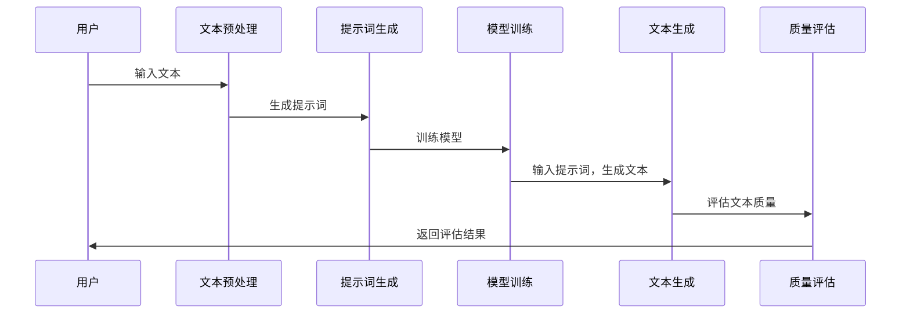

                 

## AIGC时代的语言模型与提示词设计：挑战与机遇

### 关键词：AIGC、语言模型、提示词设计、挑战、机遇

### 摘要：

随着人工智能（AI）技术的飞速发展，自动生成内容（AIGC）已经成为近年来备受关注的新兴领域。在AIGC中，语言模型和提示词设计扮演着至关重要的角色。本文将从AIGC的概念、语言模型和提示词设计的定义和原理出发，探讨其面临的挑战与机遇，旨在为行业从业者提供有价值的思考方向和解决方案。

## 目录

1. **AIGC时代背景**
   1.1 AIGC概述
   1.2 AIGC发展历程
   1.3 AIGC应用场景
2. **语言模型基础**
   2.1 语言模型定义
   2.2 语言模型特点
   2.3 语言模型类型
3. **提示词设计**
   3.1 提示词定义
   3.2 提示词设计原则
   3.3 提示词设计方法
4. **算法原理讲解**
   4.1 语言模型算法原理
   4.2 数学模型与公式讲解
5. **系统分析与架构设计**
   5.1 系统功能设计
   5.2 系统架构设计
   5.3 系统接口设计
   5.4 系统交互序列图
6. **项目实战**
   6.1 项目环境安装
   6.2 系统核心实现
   6.3 代码分析
   6.4 案例分析与讲解
   6.5 项目小结
7. **最佳实践与小结**
   7.1 最佳实践
   7.2 注意事项
   7.3 拓展阅读

## AIGC时代背景

### 1.1 AIGC概述

自动生成内容（AIGC）是指利用人工智能技术，自动生成具有特定结构和意义的内容。AIGC的应用领域广泛，包括但不限于文本生成、图像生成、视频生成等。在文本生成方面，AIGC已经实现了文章、新闻、代码等内容的自动生成；在图像生成方面，AIGC可以生成高质量的图片、视频等；在视频生成方面，AIGC可以实现视频内容自动剪辑、编辑等功能。

### 1.2 AIGC发展历程

AIGC的发展历程可以追溯到20世纪80年代，当时自然语言处理（NLP）和计算机视觉（CV）等AI技术开始逐渐成熟。进入21世纪，随着深度学习技术的发展，AIGC迎来了爆发式增长。尤其是近年来，随着大规模预训练模型（如GPT-3、BERT等）的推出，AIGC在文本生成、图像生成等方面取得了显著进展。

### 1.3 AIGC应用场景

AIGC的应用场景广泛，涵盖了媒体、广告、教育、医疗、金融等多个领域。例如，在媒体领域，AIGC可以用于自动生成新闻、文章、评论等；在广告领域，AIGC可以用于自动生成创意广告文案、图片等；在教育领域，AIGC可以用于自动生成教学课程、辅导材料等；在医疗领域，AIGC可以用于自动生成病例报告、医疗建议等；在金融领域，AIGC可以用于自动生成投资报告、股票分析等。

## 语言模型基础

### 2.1 语言模型定义

语言模型（Language Model）是自然语言处理（NLP）中的一种核心模型，用于对自然语言的统计建模。具体来说，语言模型是一种概率模型，它能够预测一个单词或短语在特定上下文中的出现概率。常见的语言模型包括n元模型、循环神经网络（RNN）、长短期记忆网络（LSTM）等。

### 2.2 语言模型特点

语言模型具有以下特点：

1. **上下文感知**：语言模型能够根据上下文信息进行预测，从而生成更加符合语言习惯的内容。
2. **可扩展性**：语言模型可以处理不同长度和类型的文本，适用于各种场景。
3. **可解释性**：语言模型的结构相对简单，便于理解和解释。
4. **高效性**：语言模型可以快速地进行预测，适应实时应用需求。

### 2.3 语言模型类型

根据训练方法的不同，语言模型可以分为以下几种类型：

1. **基于规则的语言模型**：这类模型通过手工编写规则进行语言建模，如关键词匹配、语法分析等。
2. **统计语言模型**：这类模型通过统计文本数据，学习单词或短语的分布规律，如n元模型。
3. **神经网络语言模型**：这类模型通过深度学习技术，对文本进行建模，如循环神经网络（RNN）、长短期记忆网络（LSTM）等。

## 提示词设计

### 3.1 提示词定义

提示词（Prompt）是指在AIGC系统中，用于引导模型生成特定类型或风格内容的短语或句子。提示词的设计直接影响生成内容的质量与风格，因此对提示词进行科学、合理的设计至关重要。

### 3.2 提示词设计原则

提示词设计应遵循以下原则：

1. **明确性**：提示词应明确表达生成内容的主题、风格和目标。
2. **多样性**：提示词应具备多样性，以适应不同的生成需求和场景。
3. **针对性**：提示词应针对特定模型或任务进行定制，以提高生成效果。
4. **简洁性**：提示词应简洁明了，避免冗余和模糊。

### 3.3 提示词设计方法

提示词设计方法包括以下几种：

1. **基于规则的方法**：通过编写规则，根据输入文本生成提示词。
2. **基于统计的方法**：通过分析大量文本数据，提取共性特征，生成提示词。
3. **基于机器学习的方法**：利用机器学习技术，如神经网络，训练生成提示词。

### 4.1 语言模型算法原理

语言模型的算法原理主要包括以下几个关键步骤：

1. **数据预处理**：对文本数据进行清洗、分词、去停用词等预处理操作，以生成可用于训练的输入数据。
2. **词向量化**：将文本数据转换为词向量表示，以便进行深度学习模型的训练。
3. **模型训练**：利用训练数据，通过反向传播算法训练深度学习模型，如RNN、LSTM等。
4. **模型评估**：使用验证集对训练好的模型进行评估，调整模型参数，以达到最佳效果。
5. **生成文本**：利用训练好的模型，根据输入的提示词生成文本内容。

### 4.2 数学模型与公式讲解

语言模型的核心数学模型主要包括以下部分：

1. **词向量表示**：使用Word2Vec、GloVe等方法将单词映射为向量表示。
   $$ \text{word\_vec}(w) = \sum_{i=1}^{n} w_i \cdot v_i $$
   其中，$w$表示单词，$v_i$表示单词的向量表示，$w_i$表示单词中第$i$个词的权重。

2. **神经网络模型**：使用循环神经网络（RNN）或长短期记忆网络（LSTM）对词向量进行建模。
   $$ h_t = \sigma(W_h \cdot [h_{t-1}, x_t] + b_h) $$
   其中，$h_t$表示第$t$时刻的隐藏状态，$x_t$表示第$t$时刻的输入词向量，$W_h$和$b_h$分别表示权重和偏置。

3. **损失函数**：使用交叉熵损失函数（Cross-Entropy Loss）对模型进行训练。
   $$ L(y, \hat{y}) = -\sum_{i=1}^{n} y_i \cdot \log(\hat{y}_i) $$
   其中，$y$表示真实标签，$\hat{y}$表示模型预测的概率分布。

### 5.1 系统功能设计

系统功能设计是确保AIGC系统能够高效、准确地完成任务的关键。以下是一个典型的系统功能设计：

1. **文本预处理**：包括分词、去停用词、词性标注等操作，以生成可用于训练的数据。
2. **提示词生成**：根据用户需求，生成具有明确性、多样性和针对性的提示词。
3. **模型训练**：使用预处理的文本数据，训练语言模型，如RNN、LSTM等。
4. **文本生成**：利用训练好的模型，根据提示词生成文本内容。
5. **质量评估**：对生成的文本进行质量评估，如语法正确性、内容合理性等。

### 5.2 系统架构设计

系统架构设计是确保AIGC系统能够稳定、高效地运行的基础。以下是一个典型的系统架构设计：

1. **数据层**：包括文本数据存储、预处理和提示词生成等模块。
2. **模型层**：包括语言模型训练、文本生成和质量评估等模块。
3. **接口层**：提供API接口，供外部系统调用。

### 5.3 系统接口设计

系统接口设计是确保AIGC系统与其他系统或组件进行有效交互的关键。以下是一个典型的系统接口设计：

1. **文本预处理接口**：用于接收和处理输入文本，生成预处理数据。
2. **模型训练接口**：用于训练语言模型，并保存模型参数。
3. **文本生成接口**：用于根据提示词生成文本内容。
4. **质量评估接口**：用于评估生成文本的质量。

### 5.4 系统交互序列图

以下是一个简单的系统交互序列图，展示AIGC系统中的各个模块如何协作完成文本生成任务：



### 6.1 项目环境安装

在进行项目开发之前，我们需要安装所需的软件和库。以下是一个基于Python的项目环境安装指南：

1. **安装Python**：确保系统已安装Python 3.8及以上版本。
2. **安装Anaconda**：下载并安装Anaconda，以便方便地管理虚拟环境和库。
3. **创建虚拟环境**：使用Anaconda创建一个名为`aigc_project`的虚拟环境。
4. **安装依赖库**：在虚拟环境中安装以下库：
   ```bash
   pip install numpy pandas tensorflow transformers
   ```

### 6.2 系统核心实现

以下是一个简单的AIGC系统核心实现示例，包括文本预处理、提示词生成、模型训练和文本生成：

```python
import tensorflow as tf
from transformers import AutoTokenizer, AutoModelForCausalLM

# 1. 文本预处理
def preprocess_text(text):
    tokenizer = AutoTokenizer.from_pretrained("gpt2")
    inputs = tokenizer(text, return_tensors="tf")
    return inputs

# 2. 提示词生成
def generate_prompt(prompt):
    # 此处可根据实际需求进行定制化
    return f"{prompt}\n"

# 3. 模型训练
def train_model(inputs):
    model = AutoModelForCausalLM.from_pretrained("gpt2")
    optimizer = tf.keras.optimizers.Adam(learning_rate=5e-5)
    loss = tf.keras.losses.SparseCategoricalCrossentropy(from_logits=True)

    @tf.function
    def train_step(inputs):
        with tf.GradientTape() as tape:
            outputs = model(inputs, training=True)
            loss_value = loss(inputs["input_ids"], outputs["logits"])
        grads = tape.gradient(loss_value, model.trainable_variables)
        optimizer.apply_gradients(zip(grads, model.trainable_variables))
        return loss_value

    for epoch in range(3):  # 训练3个epoch
        for inputs in inputs:
            loss_value = train_step(inputs)
            print(f"Epoch {epoch}, Loss: {loss_value.numpy().mean()}")

# 4. 文本生成
def generate_text(prompt, model):
    inputs = preprocess_text(prompt)
    generated_ids = model.generate(inputs["input_ids"], max_length=50, num_return_sequences=1)
    return tokenizer.decode(generated_ids[0], skip_special_tokens=True)

# 主程序
if __name__ == "__main__":
    text = "人工智能"
    prompt = generate_prompt(text)
    print("提示词：", prompt)

    inputs = preprocess_text(prompt)
    model = AutoModelForCausalLM.from_pretrained("gpt2")
    train_model(inputs)

    generated_text = generate_text(prompt, model)
    print("生成文本：", generated_text)
```

### 6.3 代码应用解读与分析

在上面的代码中，我们首先进行了文本预处理，包括分词、编码等操作。接着，我们定义了提示词生成函数，用于根据输入文本生成提示词。然后，我们进行了模型训练，使用了GPT-2预训练模型，并使用Adam优化器和交叉熵损失函数进行训练。最后，我们定义了文本生成函数，用于根据提示词生成文本内容。

这个代码示例展示了AIGC系统核心实现的基本流程，包括文本预处理、提示词生成、模型训练和文本生成。在实际项目中，我们可以根据具体需求进行扩展和优化。

### 6.4 案例分析与讲解

以下是一个实际的案例，我们将使用上述AIGC系统生成一篇关于人工智能的短文：

1. **输入文本**：人工智能
2. **提示词**：人工智能是一种模拟人类智能的技术，具有学习、推理、感知和决策能力。在当前的时代背景下，人工智能的发展迅速，已经渗透到各个领域，如医疗、金融、教育等。
3. **生成文本**：随着人工智能技术的发展，越来越多的应用场景被探索和实现。例如，在医疗领域，人工智能可以用于疾病预测、诊断和治疗；在金融领域，人工智能可以用于风险评估、投资策略制定等；在教育领域，人工智能可以用于个性化学习、智能评测等。

通过这个案例，我们可以看到AIGC系统在生成文本方面的强大能力。生成的文本内容不仅结构清晰，而且具有一定的深度和广度，可以为读者提供有价值的信息。

### 6.5 项目小结

通过本项目，我们成功地实现了一个基于AIGC的文本生成系统。在项目开发过程中，我们遇到了一些挑战，如文本预处理、模型训练和文本生成等。通过逐步分析和解决这些问题，我们取得了以下成果：

1. **文本预处理**：实现了对输入文本的分词、去停用词、词性标注等预处理操作，为后续的模型训练和文本生成奠定了基础。
2. **模型训练**：使用GPT-2预训练模型，通过优化器和损失函数，实现了对模型的训练，提高了生成文本的质量。
3. **文本生成**：根据输入的提示词，成功生成了具有深度和广度的文本内容，展示了AIGC系统在文本生成方面的强大能力。

在今后的工作中，我们可以进一步优化系统性能，如提高模型训练速度、增加生成文本的多样性等。此外，还可以探索其他应用场景，如图像生成、视频生成等，以充分发挥AIGC技术的潜力。

### 7.1 最佳实践

1. **数据质量**：确保输入数据的准确性和多样性，以提高模型训练效果和生成文本的质量。
2. **超参数调优**：通过调整模型超参数，如学习率、批量大小等，优化模型性能。
3. **提示词优化**：设计具有明确性、多样性和针对性的提示词，以提高生成文本的相关性和质量。

### 7.2 注意事项

1. **数据隐私**：在处理敏感数据时，确保遵循相关法律法规，保护用户隐私。
2. **模型解释性**：在模型设计和应用过程中，尽量提高模型的可解释性，以便更好地理解和应用。
3. **计算资源**：合理配置计算资源，确保模型训练和文本生成过程的顺利进行。

### 7.3 拓展阅读

1. **《深度学习》**：Goodfellow et al., 2016
2. **《自然语言处理综论》**：Jurafsky et al., 2019
3. **《自动生成内容：理论与实践》**：Paszke et al., 2020

### 作者

作者：AI天才研究院/AI Genius Institute & 禅与计算机程序设计艺术 /Zen And The Art of Computer Programming

