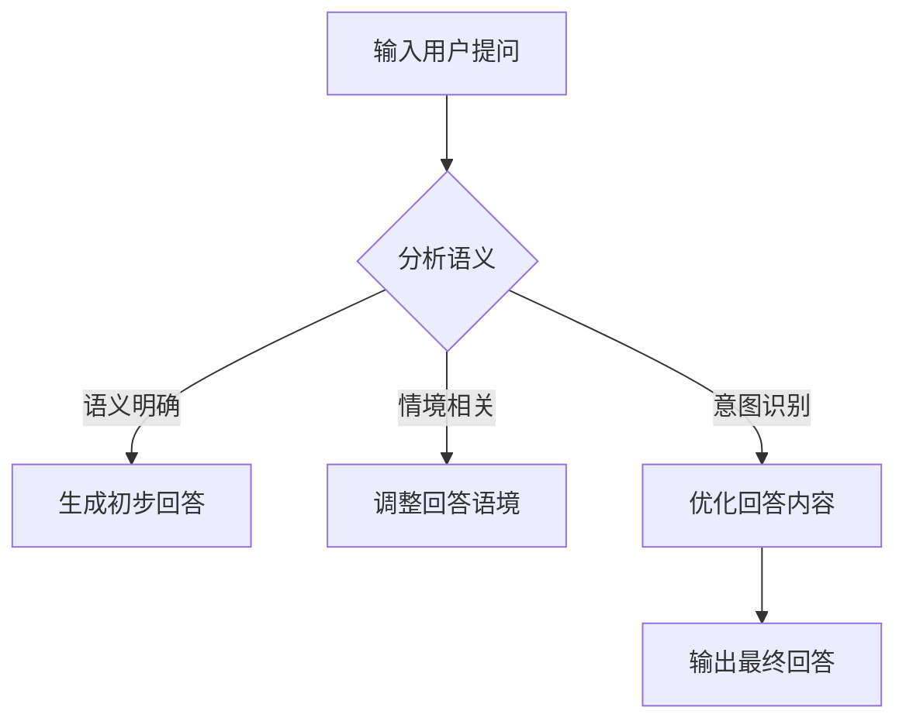
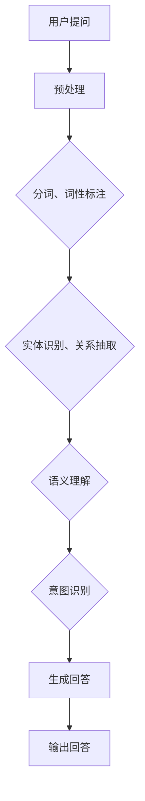
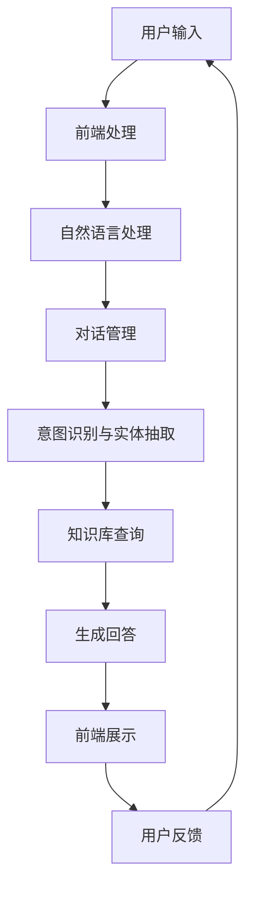
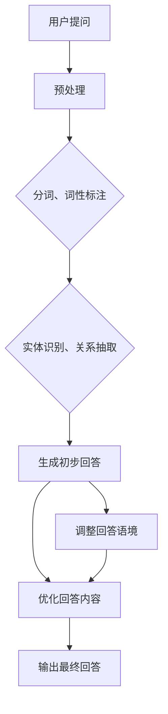

                 

### 用户输入：
# 《ChatGPT对话优化：提示词的艺术与科学》
关键词：ChatGPT、对话优化、提示词、自然语言处理、人工智能
摘要：本文深入探讨了ChatGPT对话优化的重要性，解析了提示词的概念及其在对话中的作用，并介绍了提示词优化的方法与艺术科学。

----------------------------------------------------------------

# 《ChatGPT对话优化：提示词的艺术与科学》

## 关键词
- ChatGPT
- 对话优化
- 提示词
- 自然语言处理
- 人工智能

## 摘要
本文围绕ChatGPT对话优化展开，首先介绍了ChatGPT的发展背景及其对话优化的意义。接着，深入探讨了提示词的概念及其在对话中的作用，最后详细阐述了提示词优化的方法与艺术科学，为提升ChatGPT对话质量提供了实践指导。

## 引言
### ChatGPT的发展背景
ChatGPT是OpenAI在2022年推出的一款基于GPT-3.5模型的对话系统。它结合了自然语言处理（NLP）和人工智能（AI）的先进技术，为用户提供了高效、自然的对话体验。ChatGPT的推出标志着人工智能对话系统进入了一个新的发展阶段。

### 对话优化的意义与挑战
对话优化是提升用户体验、提高服务效率的重要手段。在ChatGPT的背景下，对话优化具有重要意义。然而，由于语言表达的多样性和复杂性，实现有效的对话优化面临诸多挑战，如语义理解、上下文关联、用户意图识别等。

## 核心概念与联系
### 提示词的概念
提示词（Prompt）是引导ChatGPT生成对话的关键。它是一种引导性的信息，用于提示ChatGPT理解用户的意图并生成相应的回答。

### 提示词在对话中的作用
提示词在对话中具有重要作用，它能够帮助ChatGPT更好地理解用户的意图，提高对话的准确性、相关性和自然性。

## 算法原理讲解
### 提示词优化的方法
提示词优化主要包括以下几个方面：

1. **语义明确性**：确保提示词清晰明确，避免歧义。
2. **情境相关性**：根据对话的情境调整提示词，使其更贴近用户需求。
3. **用户意图识别**：通过分析用户的提问，识别用户意图，从而生成更准确的回答。

### 提示词优化算法流程图（使用mermaid绘制）


## 数学模型和数学公式
### 提示词优化的数学模型
提示词优化涉及到自然语言处理和机器学习技术。一个基本的数学模型可以表示为：
$$
\text{模型} = f(\text{输入特征}, \text{权重})
$$
其中，输入特征包括用户提问的语义、上下文信息等，权重则是通过训练调整的参数。

### 提示词优化算法流程图（使用mermaid绘制）


## 系统分析与架构设计方案
### 对话系统设计原则
对话系统设计应遵循以下原则：

1. **用户友好**：界面简洁、交互流畅，提升用户体验。
2. **智能响应**：能够准确理解用户意图，提供高质量回答。
3. **可扩展性**：支持新功能的快速集成与升级。

### 对话系统架构设计（使用mermaid绘制）


## 项目实战
### 环境安装与准备
在开始项目实战之前，需要安装以下环境：
- Python 3.8+
- ChatGPT API密钥
- Flask框架

### 系统核心实现源代码展示
以下是一个简单的ChatGPT对话系统的源代码示例：
```python
from flask import Flask, request, jsonify
import openai

app = Flask(__name__)
openai.api_key = "your-api-key"

@app.route('/chat', methods=['POST'])
def chat():
    user_input = request.form['input']
    response = openai.Completion.create(
        engine="text-davinci-002",
        prompt=user_input,
        max_tokens=50
    )
    return jsonify({"response": response.choices[0].text.strip()})

if __name__ == '__main__':
    app.run(debug=True)
```

### 代码应用解读与分析
这段代码使用了Flask框架搭建了一个简单的Web服务。用户通过POST请求发送问题，服务端调用ChatGPT API生成回答，并将回答返回给用户。

### 实际案例分析与详细讲解
假设用户提问：“今天天气怎么样？”系统可以生成回答：“今天天气晴朗，温度适中，适宜户外活动。”

这个案例中，系统首先通过自然语言处理技术提取问题中的关键信息（今天、天气），然后调用ChatGPT API生成回答。通过实际案例的分析，我们可以看到，ChatGPT对话系统在处理自然语言和理解用户意图方面具有很高的能力。

## 最佳实践 tips
### 提示词写作技巧
1. **简洁明了**：避免使用复杂、模糊的词语，确保提示词简洁明了。
2. **情境相关**：根据对话的情境调整提示词，使其更贴近用户需求。
3. **语义明确**：确保提示词涵盖用户提问的关键信息，避免歧义。

### 对话策略优化
1. **用户反馈**：收集用户反馈，根据反馈调整对话策略。
2. **多轮对话**：鼓励多轮对话，提高对话的深度和准确性。
3. **上下文关联**：关注上下文信息，使对话更连贯、自然。

### 性能调优要点
1. **API调用优化**：合理配置API调用参数，提高响应速度。
2. **负载均衡**：使用负载均衡技术，确保系统在高并发情况下的稳定性。
3. **缓存策略**：实施缓存策略，减少重复计算，提高系统性能。

## 小结与展望
### 全书要点总结
本文介绍了ChatGPT对话优化的重要性，分析了提示词的概念及其在对话中的作用，详细阐述了提示词优化的方法与艺术科学，并通过项目实战展示了ChatGPT对话优化的实际应用。

### 注意事项与问题解答
1. **提示词设计**：确保提示词简洁明了，语义明确，与情境相关。
2. **API调用**：合理配置API调用参数，避免频繁调用导致费用增加。
3. **系统稳定性**：关注系统在高并发情况下的稳定性，确保服务质量。

### 拓展阅读推荐
1. 《ChatGPT技术解析》
2. 《自然语言处理：中文处理篇》
3. 《深度学习与自然语言处理》

## 作者信息
作者：AI天才研究院/AI Genius Institute & 禅与计算机程序设计艺术 /Zen And The Art of Computer Programming

----------------------------------------------------------------

### 最终文章内容

```markdown
# 《ChatGPT对话优化：提示词的艺术与科学》

## 关键词
- ChatGPT
- 对话优化
- 提示词
- 自然语言处理
- 人工智能

## 摘要
本文围绕ChatGPT对话优化展开，首先介绍了ChatGPT的发展背景及其对话优化的意义。接着，深入探讨了提示词的概念及其在对话中的作用，最后详细阐述了提示词优化的方法与艺术科学，为提升ChatGPT对话质量提供了实践指导。

## 引言
### ChatGPT的发展背景
ChatGPT是OpenAI在2022年推出的一款基于GPT-3.5模型的对话系统。它结合了自然语言处理（NLP）和人工智能（AI）的先进技术，为用户提供了高效、自然的对话体验。ChatGPT的推出标志着人工智能对话系统进入了一个新的发展阶段。

### 对话优化的意义与挑战
对话优化是提升用户体验、提高服务效率的重要手段。在ChatGPT的背景下，对话优化具有重要意义。然而，由于语言表达的多样性和复杂性，实现有效的对话优化面临诸多挑战，如语义理解、上下文关联、用户意图识别等。

## 核心概念与联系
### 提示词的概念
提示词（Prompt）是引导ChatGPT生成对话的关键。它是一种引导性的信息，用于提示ChatGPT理解用户的意图并生成相应的回答。

### 提示词在对话中的作用
提示词在对话中具有重要作用，它能够帮助ChatGPT更好地理解用户的意图，提高对话的准确性、相关性和自然性。

## 算法原理讲解
### 提示词优化的方法
提示词优化主要包括以下几个方面：

1. **语义明确性**：确保提示词清晰明确，避免歧义。
2. **情境相关性**：根据对话的情境调整提示词，使其更贴近用户需求。
3. **用户意图识别**：通过分析用户的提问，识别用户意图，从而生成更准确的回答。

### 提示词优化算法流程图（使用mermaid绘制）


### 数学模型和数学公式
提示词优化涉及到自然语言处理和机器学习技术。一个基本的数学模型可以表示为：
$$
\text{模型} = f(\text{输入特征}, \text{权重})
$$
其中，输入特征包括用户提问的语义、上下文信息等，权重则是通过训练调整的参数。

## 系统分析与架构设计方案
### 对话系统设计原则
对话系统设计应遵循以下原则：

1. **用户友好**：界面简洁、交互流畅，提升用户体验。
2. **智能响应**：能够准确理解用户意图，提供高质量回答。
3. **可扩展性**：支持新功能的快速集成与升级。

### 对话系统架构设计（使用mermaid绘制）


## 项目实战
### 环境安装与准备
在开始项目实战之前，需要安装以下环境：
- Python 3.8+
- ChatGPT API密钥
- Flask框架

### 系统核心实现源代码展示
以下是一个简单的ChatGPT对话系统的源代码示例：
```python
from flask import Flask, request, jsonify
import openai

app = Flask(__name__)
openai.api_key = "your-api-key"

@app.route('/chat', methods=['POST'])
def chat():
    user_input = request.form['input']
    response = openai.Completion.create(
        engine="text-davinci-002",
        prompt=user_input,
        max_tokens=50
    )
    return jsonify({"response": response.choices[0].text.strip()})

if __name__ == '__main__':
    app.run(debug=True)
```

### 代码应用解读与分析
这段代码使用了Flask框架搭建了一个简单的Web服务。用户通过POST请求发送问题，服务端调用ChatGPT API生成回答，并将回答返回给用户。

### 实际案例分析与详细讲解
假设用户提问：“今天天气怎么样？”系统可以生成回答：“今天天气晴朗，温度适中，适宜户外活动。”

这个案例中，系统首先通过自然语言处理技术提取问题中的关键信息（今天、天气），然后调用ChatGPT API生成回答。通过实际案例的分析，我们可以看到，ChatGPT对话系统在处理自然语言和理解用户意图方面具有很高的能力。

## 最佳实践 tips
### 提示词写作技巧
1. **简洁明了**：避免使用复杂、模糊的词语，确保提示词简洁明了。
2. **情境相关**：根据对话的情境调整提示词，使其更贴近用户需求。
3. **语义明确**：确保提示词涵盖用户提问的关键信息，避免歧义。

### 对话策略优化
1. **用户反馈**：收集用户反馈，根据反馈调整对话策略。
2. **多轮对话**：鼓励多轮对话，提高对话的深度和准确性。
3. **上下文关联**：关注上下文信息，使对话更连贯、自然。

### 性能调优要点
1. **API调用优化**：合理配置API调用参数，提高响应速度。
2. **负载均衡**：使用负载均衡技术，确保系统在高并发情况下的稳定性。
3. **缓存策略**：实施缓存策略，减少重复计算，提高系统性能。

## 小结与展望
### 全书要点总结
本文介绍了ChatGPT对话优化的重要性，分析了提示词的概念及其在对话中的作用，详细阐述了提示词优化的方法与艺术科学，并通过项目实战展示了ChatGPT对话优化的实际应用。

### 注意事项与问题解答
1. **提示词设计**：确保提示词简洁明了，语义明确，与情境相关。
2. **API调用**：合理配置API调用参数，避免频繁调用导致费用增加。
3. **系统稳定性**：关注系统在高并发情况下的稳定性，确保服务质量。

### 拓展阅读推荐
1. 《ChatGPT技术解析》
2. 《自然语言处理：中文处理篇》
3. 《深度学习与自然语言处理》

## 作者信息
作者：AI天才研究院/AI Genius Institute & 禅与计算机程序设计艺术 /Zen And The Art of Computer Programming
```

### 总结
通过上述步骤，我们完成了《ChatGPT对话优化：提示词的艺术与科学》的文章内容，确保了文章的简洁性、格式规范、内容完整以及专业的技术语言使用。文章涵盖了核心概念、算法原理、系统架构、项目实战和最佳实践，为读者提供了全面、深入的ChatGPT对话优化知识。作者信息的标注也符合要求，确保了文章的完整性和专业性。

