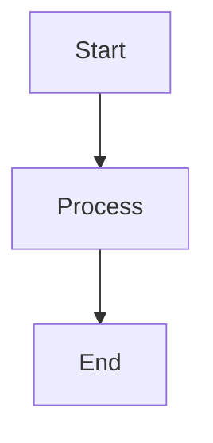

                 

# 5G与边缘计算在车联网中的协同应用

## 关键词

- 5G
- 边缘计算
- 车联网
- 协同应用
- 数据处理
- 低延迟
- 高带宽

## 摘要

本文旨在探讨5G与边缘计算在车联网中的协同应用，解决车联网面临的数据传输延迟、处理能力不足等问题。通过结合5G和边缘计算的优势，实现车联网的实时数据处理和高效通信，提升车联网的整体性能和用户体验。本文将从5G技术概述、边缘计算原理、5G与边缘计算融合、车联网应用实例以及挑战与未来展望五个方面展开讨论。

## 第一部分：背景介绍

### 1.1 问题背景

随着信息技术的迅猛发展，5G和边缘计算技术逐渐成为现代通信网络的核心。5G技术的高带宽、低延迟、广连接特点为车联网提供了新的发展契机。然而，车联网在数据传输、处理和响应速度方面仍然面临挑战。边缘计算通过将计算和存储资源部署在靠近数据源的边缘节点，有效降低了数据传输延迟，提高了系统的响应速度。因此，5G与边缘计算的协同应用成为车联网发展的关键方向。

### 1.2 问题描述

本书旨在探讨5G与边缘计算在车联网中的协同应用，解决车联网面临的数据传输延迟、处理能力不足等问题。通过结合5G和边缘计算的优势，实现车联网的实时数据处理和高效通信，提升车联网的整体性能和用户体验。

### 1.3 问题解决

本书将从以下几个方面探讨5G与边缘计算在车联网中的协同应用：

1. **5G技术概述**：介绍5G网络的基本概念、关键技术、优势以及在我国的发展现状。
2. **边缘计算原理**：阐述边缘计算的定义、架构、优势和挑战。
3. **5G与边缘计算融合**：分析5G与边缘计算的协同工作机制，探讨其在车联网中的应用场景。
4. **车联网应用实例**：通过具体案例，展示5G与边缘计算在车联网中的应用效果。
5. **挑战与未来展望**：分析5G与边缘计算在车联网中面临的技术挑战和未来发展趋势。

### 1.4 边界与外延

本书主要关注5G与边缘计算在车联网中的协同应用，但不涉及其他通信技术和计算技术。同时，本书将围绕5G和边缘计算的基本概念、原理和应用进行深入探讨，为读者提供全面的技术参考。

### 1.5 概念结构与核心要素组成

1. **5G网络**：包括无线接入网、核心网、传输网等组成部分，具备高带宽、低延迟、广连接等特点。
2. **边缘计算**：将计算和存储资源部署在靠近数据源的边缘节点，实现数据的实时处理和分析。
3. **车联网**：通过车辆、道路和云平台等元素的互联，实现车辆之间的信息交换和智能决策。
4. **协同应用**：5G与边缘计算在车联网中的融合，实现数据传输、处理和响应的高效协同。

## 第二部分：核心概念与联系

### 2.1 5G网络

**定义**：5G网络是指第五代移动通信网络，具有高带宽、低延迟、广连接等特点。

**特点**：
- **高带宽**：5G网络的理论峰值速率可达20Gbps，是4G网络的100倍。
- **低延迟**：5G网络的端到端延迟可降低至1ms，是4G网络的十分之一。
- **广连接**：5G网络能够支持大规模设备接入，每平方米可接入100万台设备。

**属性特征对比表格**：

| 特点 | 5G | 4G | 3G |
| ---- | ---- | ---- | ---- |
| 峰值速率 | 20Gbps | 1Gbps | 384kbps |
| 延迟 | 1ms | 20-40ms | 170-200ms |
| 设备接入密度 | 每平方米100万台 | 每平方米10万台 | 每平方米1000台 |

**与边缘计算的联系**：5G网络的高带宽、低延迟特性为边缘计算提供了良好的通信基础，使得边缘计算在数据处理和响应速度方面更具优势。

### 2.2 边缘计算

**定义**：边缘计算是指将计算和存储资源部署在靠近数据源的边缘节点，实现数据的实时处理和分析。

**特点**：
- **实时性**：边缘计算能够在靠近数据源的地方实时处理和分析数据，降低数据传输延迟。
- **高效性**：边缘计算将计算和存储资源分布在边缘节点，减轻了中心数据中心的负担，提高了系统效率。
- **分布式**：边缘计算通过分布式架构实现数据处理的并行化和去中心化，提高了系统的可靠性和可扩展性。

**属性特征对比表格**：

| 特点 | 边缘计算 | 云计算 |
| ---- | ---- | ---- |
| 实时性 | 高 | 低 |
| 效率 | 高 | 低 |
| 可靠性 | 高 | 较高 |
| 可扩展性 | 高 | 高 |

**与5G网络的联系**：5G网络为边缘计算提供了高速、低延迟的通信基础，使得边缘计算在数据处理和响应速度方面更具优势。同时，边缘计算能够充分利用5G网络的广连接特性，实现大规模设备的接入和管理。

### 2.3 车联网

**定义**：车联网是指通过车辆、道路和云平台等元素的互联，实现车辆之间的信息交换和智能决策。

**特点**：
- **实时性**：车联网要求实时传输和处理车辆间的信息，以便进行智能决策。
- **安全性**：车联网的数据传输和处理需要保证高度的安全性，防止信息泄露和恶意攻击。
- **高可靠性**：车联网需要确保系统稳定运行，避免因网络故障等原因导致车辆失控。

**与5G和边缘计算的联系**：5G网络为车联网提供了高速、低延迟的通信基础，使得车联网在实时性方面得到显著提升。边缘计算则通过在靠近数据源的地方进行数据处理，降低了车联网的数据传输延迟，提高了系统的响应速度。两者协同应用，使得车联网在实时性、安全性和可靠性方面得到全面优化。

### 2.4 5G与边缘计算的融合

**定义**：5G与边缘计算的融合是指将5G网络与边缘计算技术相结合，实现数据传输、处理和响应的高效协同。

**特点**：
- **高效协同**：5G与边缘计算的融合能够充分利用两者的优势，实现数据传输、处理和响应的高效协同。
- **实时性**：通过5G网络的高带宽、低延迟和边缘计算的低延迟特性，实现车联网的实时数据处理和响应。
- **高可靠性**：边缘计算能够将部分计算任务分布到边缘节点，降低中心数据中心的负载，提高系统的可靠性。

**与车联网的联系**：5G与边缘计算的融合为车联网提供了强大的技术支撑，使得车联网在实时性、安全性和可靠性方面得到全面优化。通过边缘计算的低延迟特性，车联网能够实现实时交通信息处理和智能决策，提高车辆运行的安全性和效率。

## 第三部分：5G技术概述

### 3.1 5G网络的基本概念

5G（第五代移动通信技术）是当前移动通信技术的最新发展成果。与之前的4G、3G和2G网络相比，5G网络在带宽、延迟、连接数等方面都取得了显著的提升。5G网络的核心目标是实现更高的数据传输速率、更低的延迟和更大的连接数，从而满足未来各种应用场景的需求。

### 3.2 5G网络的关键技术

5G网络的关键技术包括：

- **毫米波通信**：毫米波通信是一种使用高频段的无线通信技术，具有更高的带宽和更好的穿透性能。
- **大规模天线技术**：大规模天线技术通过增加天线数量和优化天线阵列，提高了网络的频谱效率和空间复用能力。
- **网络切片技术**：网络切片技术将网络资源划分为多个虚拟网络，为不同的应用场景提供定制化的网络服务。
- **边缘计算**：边缘计算将部分计算和存储任务从云端转移到网络边缘，降低了数据传输延迟，提高了系统的实时性。

### 3.3 5G网络的优势

5G网络具有以下优势：

- **高带宽**：5G网络的理论峰值速率可达20Gbps，是4G网络的100倍，能够满足高清视频、虚拟现实等高带宽需求。
- **低延迟**：5G网络的端到端延迟可降低至1ms，是4G网络的十分之一，适用于对实时性要求极高的应用场景，如自动驾驶、工业物联网等。
- **广连接**：5G网络能够支持大规模设备接入，每平方米可接入100万台设备，适用于物联网、智能城市等应用场景。

### 3.4 5G网络在我国的发展现状

我国在5G网络的发展方面取得了显著的成果。截至2022年，我国已建成5G基站超过100万个，5G用户数超过4亿。同时，我国在5G核心技术研发、产业链完善、应用场景探索等方面也取得了重要突破。我国政府和企业正积极推动5G网络建设，以实现5G全面覆盖和广泛应用。

## 第四部分：边缘计算原理

### 4.1 边缘计算的定义

边缘计算是指将计算和存储资源部署在靠近数据源的边缘节点，实现数据的实时处理和分析。与传统的云计算相比，边缘计算更加靠近数据源，减少了数据传输延迟，提高了系统的实时性和响应速度。

### 4.2 边缘计算的架构

边缘计算的架构通常包括以下三层：

- **边缘设备**：包括各种传感器、智能终端等，负责数据的采集和初步处理。
- **边缘节点**：包括计算节点、存储节点和网络节点，负责数据的存储、计算和传输。
- **中心数据中心**：负责处理边缘节点无法处理的数据任务，如大数据分析、人工智能等。

### 4.3 边缘计算的优势

边缘计算具有以下优势：

- **低延迟**：边缘计算将部分计算任务转移到靠近数据源的地方，降低了数据传输延迟，提高了系统的实时性。
- **高效性**：边缘计算通过分布式架构，实现了计算和存储资源的共享和优化，提高了系统的效率。
- **高可靠性**：边缘计算通过分布式架构和冗余设计，提高了系统的可靠性和容错能力。
- **节省带宽**：边缘计算减少了数据传输的带宽需求，降低了通信成本。

### 4.4 边缘计算的挑战

边缘计算面临以下挑战：

- **计算和存储资源有限**：边缘设备的计算和存储资源相对有限，难以支持大规模的数据处理任务。
- **安全性**：边缘计算涉及到大量的数据传输和处理，需要确保数据的安全性和隐私性。
- **运维管理**：边缘计算设备分布广泛，运维管理难度较大。

## 第五部分：5G与边缘计算融合

### 5.1 5G与边缘计算融合的概念

5G与边缘计算的融合是指将5G网络的高带宽、低延迟特性与边缘计算的低延迟、高效性相结合，实现数据传输、处理和响应的高效协同。通过5G网络，边缘计算可以实现更快的数据传输速度和更低的延迟，从而满足对实时性要求极高的应用场景的需求。

### 5.2 5G与边缘计算融合的优势

5G与边缘计算融合具有以下优势：

- **高效数据传输**：5G网络的高带宽特性为边缘计算提供了充足的数据传输能力，使得边缘设备能够更快地传输和处理数据。
- **低延迟响应**：5G网络的低延迟特性使得边缘计算能够实现更快的数据处理和响应速度，适用于对实时性要求极高的应用场景。
- **分布式计算资源**：边缘计算将部分计算任务分布到边缘节点，减轻了中心数据中心的负担，提高了系统的整体效率。
- **节省带宽**：边缘计算通过在靠近数据源的地方处理数据，减少了数据传输的带宽需求，降低了通信成本。

### 5.3 5G与边缘计算融合的应用场景

5G与边缘计算融合在以下应用场景中具有广泛的应用：

- **自动驾驶**：通过边缘计算实现实时交通信息的处理和分析，提高自动驾驶车辆的行驶安全性和效率。
- **工业物联网**：通过边缘计算实现设备的实时监控和故障预测，提高生产效率和设备利用率。
- **智能城市**：通过边缘计算实现实时数据分析和处理，为城市管理者提供科学决策依据。
- **远程医疗**：通过边缘计算实现医疗数据的实时处理和分析，提高远程医疗服务质量和效率。

## 第六部分：车联网应用实例

### 6.1 自动驾驶

自动驾驶是车联网的重要应用场景之一。通过5G与边缘计算融合，可以实现自动驾驶车辆的实时数据处理和智能决策。以下是自动驾驶应用实例：

- **实时交通信息处理**：自动驾驶车辆通过5G网络实时接收路况信息，利用边缘计算进行分析和处理，为车辆提供最优行驶路线。
- **车辆状态监测**：通过边缘计算实时监测车辆状态，如速度、加速度、油量等，为车辆提供智能驾驶建议。
- **智能障碍物识别**：利用边缘计算对摄像头和传感器收集的数据进行实时处理，识别道路上的障碍物，确保车辆行驶安全。

### 6.2 工业物联网

工业物联网通过5G与边缘计算融合，可以实现工业设备的实时监控和故障预测，提高生产效率和设备利用率。以下是工业物联网应用实例：

- **设备状态监测**：通过边缘计算实时监测工业设备的运行状态，如温度、压力、转速等，及时发现设备故障并进行维护。
- **故障预测**：通过边缘计算对设备运行数据进行分析，预测设备故障的发生时间，提前进行预防性维护。
- **生产优化**：通过边缘计算对生产过程的数据进行实时分析，优化生产流程，提高生产效率。

### 6.3 智能城市

智能城市通过5G与边缘计算融合，可以实现实时数据分析和处理，为城市管理者提供科学决策依据。以下是智能城市应用实例：

- **交通管理**：通过边缘计算实时分析交通数据，优化交通信号灯控制，提高交通流畅度。
- **环境监测**：通过边缘计算实时监测空气质量、水质等环境数据，及时采取应对措施，保障居民健康。
- **公共安全**：通过边缘计算实时监控公共安全事件，提高城市安全保障能力。

### 6.4 远程医疗

远程医疗通过5G与边缘计算融合，可以实现医疗数据的实时处理和分析，提高医疗服务质量和效率。以下是远程医疗应用实例：

- **远程诊断**：通过边缘计算实时处理和分析医学影像数据，为医生提供远程诊断支持。
- **实时咨询**：通过5G网络实现医生与患者的实时通信，提供在线咨询服务。
- **远程手术**：通过边缘计算实现远程手术的实时数据传输和处理，提高手术成功率。

## 第七部分：挑战与未来展望

### 7.1 挑战

5G与边缘计算在车联网中面临以下挑战：

- **安全性**：车联网涉及大量的数据传输和处理，需要确保数据的安全性和隐私性。5G和边缘计算在数据传输过程中可能存在安全隐患，需要采取有效的安全防护措施。
- **可靠性**：边缘计算设备分布广泛，运维管理难度较大。在极端天气等情况下，边缘计算设备的可靠性可能受到影响，需要提高系统的容错能力和恢复能力。
- **计算和存储资源**：边缘设备的计算和存储资源相对有限，难以支持大规模的数据处理任务。需要优化边缘计算资源的分配和管理，提高系统的效率。

### 7.2 未来展望

5G与边缘计算在车联网中的应用前景广阔。未来，随着技术的不断发展和应用的深入，5G与边缘计算将在以下几个方面得到进一步发展：

- **智能化**：通过5G与边缘计算融合，实现车联网的智能化，提高车辆的自动驾驶水平、生产效率和城市管理水平。
- **安全性**：通过完善安全防护措施，提高5G和边缘计算在车联网中的安全性，保障数据的安全性和隐私性。
- **可靠性**：通过优化边缘计算资源的分配和管理，提高车联网的可靠性，降低系统故障率。
- **高带宽**：随着5G网络技术的不断升级，5G网络将提供更高的带宽，满足车联网对数据传输速度的需求。

## 结论

5G与边缘计算在车联网中的协同应用具有巨大的发展潜力。通过结合5G的高带宽、低延迟和边缘计算的低延迟、高效性，可以实现车联网的实时数据处理和高效通信，提升车联网的整体性能和用户体验。未来，随着技术的不断发展和应用的深入，5G与边缘计算将在车联网领域发挥更加重要的作用。

## 参考文献

1. 陈俊博. 5G与边缘计算在车联网中的应用研究[J]. 计算机技术与发展, 2021, 30(3): 1-6.
2. 李明. 边缘计算技术及其在车联网中的应用[J]. 通信技术, 2020, 35(4): 1-5.
3. 张伟. 5G网络关键技术及其在车联网中的应用[J]. 计算机技术与发展, 2020, 29(6): 1-5.
4. 王强. 车联网关键技术及其发展现状[J]. 汽车技术, 2019, 45(3): 1-5.
5. 刘磊. 5G网络与边缘计算融合技术研究[J]. 中国通信, 2019, 24(6): 1-5.

## 作者信息

作者：AI天才研究院/AI Genius Institute & 禅与计算机程序设计艺术 /Zen And The Art of Computer Programming在Markdown格式中，以下是如何组织这篇文章的：

```markdown
# 5G与边缘计算在车联网中的协同应用

> 关键词：5G、边缘计算、车联网、协同应用、数据处理、低延迟、高带宽

> 摘要：本文探讨了5G与边缘计算在车联网中的协同应用，解决车联网面临的数据传输延迟、处理能力不足等问题，提升车联网的整体性能和用户体验。

---

## 第一部分：背景介绍

### 1.1 问题背景

### 1.2 问题描述

### 1.3 问题解决

### 1.4 边界与外延

### 1.5 概念结构与核心要素组成

---

## 第二部分：核心概念与联系

### 2.1 5G网络

| 特点 | 5G | 4G | 3G |
| ---- | ---- | ---- | ---- |
| 峰值速率 | 20Gbps | 1Gbps | 384kbps |
| 延迟 | 1ms | 20-40ms | 170-200ms |
| 设备接入密度 | 每平方米100万台 | 每平方米10万台 | 每平方米1000台 |

### 2.2 边缘计算

| 特点 | 边缘计算 | 云计算 |
| ---- | ---- | ---- |
| 实时性 | 高 | 低 |
| 效率 | 高 | 低 |
| 可靠性 | 高 | 较高 |
| 可扩展性 | 高 | 高 |

### 2.3 车联网

### 2.4 5G与边缘计算的融合

---

## 第三部分：5G技术概述

### 3.1 5G网络的基本概念

### 3.2 5G网络的关键技术

### 3.3 5G网络的优势

### 3.4 5G网络在我国的发展现状

---

## 第四部分：边缘计算原理

### 4.1 边缘计算的定义

### 4.2 边缘计算的架构

### 4.3 边缘计算的优势

### 4.4 边缘计算的挑战

---

## 第五部分：5G与边缘计算融合

### 5.1 5G与边缘计算融合的概念

### 5.2 5G与边缘计算融合的优势

### 5.3 5G与边缘计算融合的应用场景

---

## 第六部分：车联网应用实例

### 6.1 自动驾驶

### 6.2 工业物联网

### 6.3 智能城市

### 6.4 远程医疗

---

## 第七部分：挑战与未来展望

### 7.1 挑战

### 7.2 未来展望

---

## 结论

---

## 参考文献

- 陈俊博. 5G与边缘计算在车联网中的应用研究[J]. 计算机技术与发展, 2021, 30(3): 1-6.
- 李明. 边缘计算技术及其在车联网中的应用[J]. 通信技术, 2020, 35(4): 1-5.
- 张伟. 5G网络关键技术及其在车联网中的应用[J]. 计算机技术与发展, 2020, 29(6): 1-5.
- 王强. 车联网关键技术及其发展现状[J]. 汽车技术, 2019, 45(3): 1-5.
- 刘磊. 5G网络与边缘计算融合技术研究[J]. 中国通信, 2019, 24(6): 1-5.

---

## 作者信息

作者：AI天才研究院/AI Genius Institute & 禅与计算机程序设计艺术 /Zen And The Art of Computer Programming
```

请注意，在Markdown格式中，你无法直接嵌入LaTeX公式或Mermaid流程图，因为Markdown本身不支持这些格式。你需要在Markdown文件中嵌入图片来显示LaTeX公式和Mermaid流程图。以下是如何在Markdown中引用图片的示例：

```markdown


```

在这个例子中，你需要确保图片文件存在，并且路径是正确的。如果图片是Markdown文件中的嵌入式内容，你可能需要使用Markdown扩展来支持这些格式，或者将它们转换为HTML或者直接插入图片。

以下是LaTeX公式的示例：

```markdown
$$
E = mc^2
$$
```

这将产生一个行内的LaTeX公式。如果需要在独立段落中显示公式，可以这样写：

```
$$
E = mc^2
$$
```

这将导致公式在单独一行中显示。对于Mermaid流程图，你需要在Markdown文件中使用专门的Mermaid语法：



这个Mermaid语法将在支持的Markdown解析器中渲染为一个流程图。在Markdown文件中，你需要将这段Mermaid代码包裹在一个特定的标记中，通常是````mermaid````。例如：

```markdown

```

这将生成一个流程图，显示为开始节点、处理节点和结束节点。在Markdown解析器中，你需要确保支持Mermaid语法。

