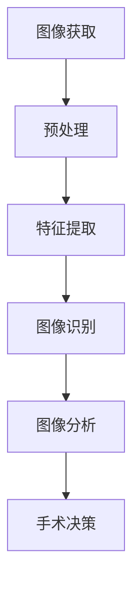
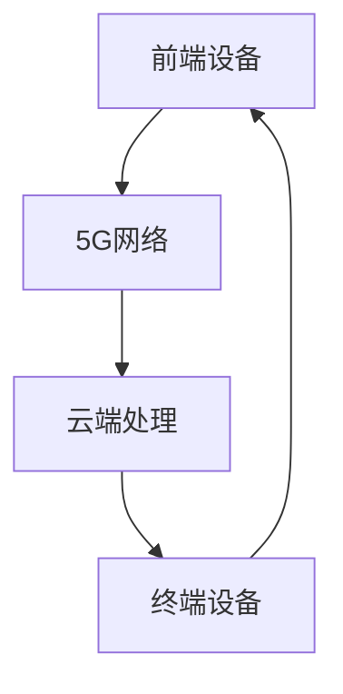
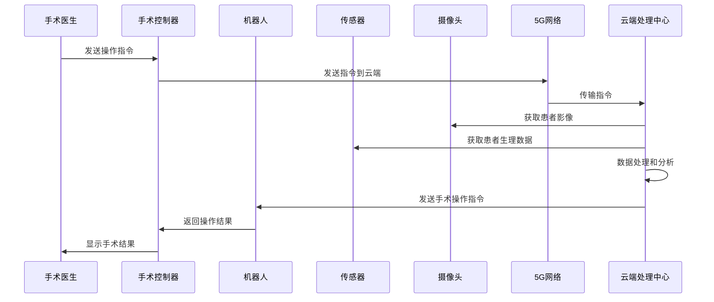

                 


### 1. 背景介绍

**5G网络概述**

5G网络，即第五代移动通信网络，是继4G、3G和2G之后的新一代通信技术。5G网络的特点主要表现为低延迟、高带宽、大规模连接和更高的网络可靠性。低延迟是指网络的响应时间短，通常在1毫秒以下，这对于实时控制和高频数据传输至关重要。高带宽则意味着网络能承载的数据量巨大，理论上可以达到数十Gbps，这使得高清视频、大型文件传输等应用变得可能。大规模连接特性则允许同时连接数以百万计的设备，这为物联网（IoT）的发展提供了坚实基础。网络可靠性方面，5G网络设计有更高的容错率和更低的故障率。

5G网络的基本概念涵盖了以下几个方面：

- **毫米波频段**：5G网络使用毫米波频段，频率范围高达24GHz，这使得网络能够提供更高的带宽。
- **MIMO技术**：多输入多输出（MIMO）技术通过在同一频率上同时传输多个数据流，提高了网络容量和速度。
- **网络切片**：网络切片技术将整个网络资源划分为多个虚拟网络，每个虚拟网络都能提供定制化的服务，从而满足不同应用的需求。

5G网络在远程医疗和手术机器人控制中的重要性

远程医疗和手术机器人控制是5G网络最具有前景的应用领域之一。远程医疗通过5G网络，可以实现医生与患者之间的实时远程诊疗，无论是远程会诊、手术指导，还是患者日常的健康监测，都因5G网络的低延迟和高带宽得到了极大的提升。手术机器人控制则是通过5G网络，将医生的操作指令实时传输到机器人，由机器人在手术现场执行具体的操作。

在远程医疗中，5G网络的低延迟特性尤其重要。在紧急情况下，比如心脏病发作或严重创伤，每一秒的延迟都可能导致严重的后果。5G网络的低延迟保证了医生能够实时获取患者的生命体征和实时影像，从而做出快速、准确的判断和决策。此外，5G网络的高带宽使得高清视频和3D图像的传输变得轻松，医生能够通过虚拟现实（VR）技术进行远程手术指导。

**远程手术机器人的概念与发展**

远程手术机器人是指通过远程控制技术，将医生的操作指令发送到机器人，由机器人在患者体内或体表执行手术操作的设备。远程手术机器人通常由多个部分组成，包括手术控制器、机器人手臂、传感器、摄像系统和远程通信系统等。

远程手术机器人控制的发展现状主要体现在以下几个方面：

- **技术成熟度**：随着5G网络和机器人技术的发展，远程手术机器人的技术逐渐成熟，开始在一些医疗机构得到应用。
- **应用范围**：目前，远程手术机器人主要应用于心脏手术、神经外科手术、胃肠道手术等领域。
- **挑战与前景**：虽然远程手术机器人带来了巨大的变革，但同时也面临着实时性、可靠性和安全性等方面的挑战。随着技术的不断进步，远程手术机器人的应用前景非常广阔。

**5G网络与远程手术机器人的结合**

5G网络与远程手术机器人的结合，使得远程手术变得更加高效和可靠。首先，5G网络的低延迟特性保证了手术操作的高实时性，减少了手术过程中的延迟和误差。其次，5G网络的高带宽特性使得高清影像和手术数据的传输变得更加稳定和迅速。此外，5G网络的大规模连接特性，使得多个医生和多个手术机器人可以在同一时间进行协同操作，从而提高了手术的效率和精确度。

总之，5G网络在远程手术机器人控制中的应用，不仅提升了手术的实时性和可靠性，也为远程医疗的发展带来了新的机遇。

### 2. 核心概念与联系

**5G网络的关键技术**

5G网络的关键技术包括低延迟、高带宽、大规模连接和更高的网络可靠性。这些技术共同构成了5G网络的核心优势，使得其在远程医疗和手术机器人控制中具有极高的应用价值。

- **低延迟**：5G网络的低延迟特性是其最大的优势之一。低延迟意味着网络的响应时间短，通常在1毫秒以下。这对于实时控制和高频数据传输至关重要。在远程手术中，低延迟确保了医生的操作指令能够及时传输到机器人，由机器人快速执行，从而提高了手术的准确性和安全性。

- **高带宽**：5G网络的高带宽特性允许网络在同一时间内传输大量数据。理论上，5G网络的带宽可以达到数十Gbps，这使得高清视频、3D图像、大型文件传输等应用变得可能。在远程手术中，高带宽保证了手术数据的实时传输，医生可以清晰地看到患者的内部情况，从而做出更准确的判断和决策。

- **大规模连接**：5G网络的大规模连接特性使其能够同时连接数以百万计的设备。这为物联网（IoT）的发展提供了坚实基础。在远程手术中，大规模连接特性使得多个医生和多个手术机器人可以在同一时间进行协同操作，从而提高了手术的效率和精确度。

- **高可靠性**：5G网络设计有更高的容错率和更低的故障率，这使得网络在长时间运行中具有更高的稳定性。在远程手术中，高可靠性确保了网络的稳定运行，避免了由于网络故障导致的手术中断或数据丢失。

**远程手术机器人控制的核心问题**

远程手术机器人控制的核心问题包括实时性、可靠性和安全性。

- **实时性**：实时性是远程手术机器人控制的关键。在手术过程中，医生需要实时获取患者的生命体征和手术情况，并立即做出反应。任何延迟都可能导致严重的后果。因此，远程手术机器人控制系统必须具备低延迟的特性，以确保操作的实时性。

- **可靠性**：可靠性是远程手术机器人控制的基础。系统必须能够稳定运行，确保手术操作的正确执行。任何系统故障都可能导致手术失败，甚至危及患者的生命。因此，远程手术机器人控制系统必须具备高可靠性的特性，确保系统的稳定运行。

- **安全性**：安全性是远程手术机器人控制的保障。系统必须能够保护患者的隐私和数据安全，防止数据泄露或被恶意攻击。此外，系统还必须能够防止未经授权的访问和操作，确保手术过程的安全性。

**5G网络与远程手术机器人控制的联系**

5G网络与远程手术机器人控制之间的联系在于，5G网络的低延迟、高带宽、大规模连接和高可靠性特性，为远程手术机器人控制提供了强有力的技术支持。

- **低延迟**：5G网络的低延迟特性，确保了医生的操作指令能够实时传输到机器人，由机器人快速执行。这使得手术过程更加实时、准确和高效。

- **高带宽**：5G网络的高带宽特性，保证了手术数据的实时传输，医生可以清晰地看到患者的内部情况，从而做出更准确的判断和决策。

- **大规模连接**：5G网络的大规模连接特性，使得多个医生和多个手术机器人可以在同一时间进行协同操作，从而提高了手术的效率和精确度。

- **高可靠性**：5G网络的高可靠性特性，确保了系统的稳定运行，避免了由于网络故障导致的手术中断或数据丢失。

总之，5G网络为远程手术机器人控制提供了低延迟、高带宽、大规模连接和高可靠性等关键技术支持，使得远程手术变得更加高效、可靠和安全。

### 3. 算法原理讲解

**图像处理算法在远程手术中的应用**

在远程手术中，图像处理算法扮演着至关重要的角色。通过图像处理算法，医生可以实时获取患者内部的信息，并进行实时分析，从而做出精准的手术决策。

**图像处理算法概述**

图像处理算法主要包括以下几个步骤：

1. **图像获取**：通过摄像头或其他传感器获取患者的图像数据。
2. **预处理**：对图像进行去噪、增强等预处理，提高图像质量。
3. **特征提取**：从预处理后的图像中提取关键特征，如边缘、纹理、形状等。
4. **图像识别**：利用提取的特征进行图像识别，确定图像中的关键部位和病变区域。
5. **图像分析**：对识别出的区域进行进一步分析，如计算病变面积、分析病理特征等。

**图像处理算法的流程图**

下面是图像处理算法的Mermaid流程图：



**图像处理算法的应用案例**

以心脏手术为例，图像处理算法可以实时获取患者的心脏图像，并通过特征提取和图像识别，确定心脏中的病变区域。医生可以根据图像分析结果，进行精准的手术操作，从而提高手术的成功率和患者的康复率。

**Python代码示例**

下面是一个简单的图像处理算法Python代码示例，用于获取、预处理和识别图像：

```python
import cv2
import numpy as np

# 获取图像
image = cv2.imread('heart_image.jpg')

# 预处理：去噪和增强
processed_image = cv2.GaussianBlur(image, (5, 5), 0)
processed_image = cv2.equalizeHist(processed_image)

# 特征提取：边缘检测
edges = cv2.Canny(processed_image, 50, 150)

# 图像识别：心脏区域识别
_, contours, _ = cv2.findContours(edges, cv2.RETR_EXTERNAL, cv2.CHAIN_APPROX_SIMPLE)
heart_contour = max(contours, key=cv2.contourArea)

# 图像分析：计算心脏面积
heart_area = cv2.contourArea(heart_contour)
print(f"Heart area: {heart_area}")

# 手术决策
if heart_area > 5000:
    print("Possible heart disease detected.")
else:
    print("No heart disease detected.")
```

**算法原理讲解**

图像处理算法的核心原理是通过计算机视觉技术，对图像进行分析和处理，以提取出有用的信息。具体来说，图像处理算法包括以下几个步骤：

1. **图像获取**：使用摄像头或其他传感器获取图像数据。图像数据的分辨率和帧率直接影响到后续处理的精度和速度。
2. **预处理**：对图像进行去噪、增强等预处理，以提高图像质量。预处理步骤通常包括滤波、直方图均衡化等。
3. **特征提取**：从预处理后的图像中提取关键特征，如边缘、纹理、形状等。特征提取是图像处理算法的核心，决定了图像识别的准确性。
4. **图像识别**：利用提取的特征进行图像识别，确定图像中的关键部位和病变区域。图像识别通常采用机器学习算法，如卷积神经网络（CNN）。
5. **图像分析**：对识别出的区域进行进一步分析，如计算病变面积、分析病理特征等。图像分析结果用于指导医生进行手术操作。

**数学模型和公式**

图像处理算法的数学模型主要包括以下公式：

- **滤波公式**：用于图像去噪和增强。例如，高斯滤波公式为：
  $$ g(x, y) = \sum_{i,j} h(i-j, k-l) f(x-i, y-j) $$
  其中，$g(x, y)$ 是滤波后的图像，$h(i-j, k-l)$ 是滤波器核，$f(x-i, y-j)$ 是原始图像。

- **边缘检测公式**：用于提取图像中的边缘信息。常用的边缘检测算法包括Canny算法和Sobel算法。Canny算法的公式为：
  $$ \sigma = \sqrt{\frac{1}{2}(k_x^2 + k_y^2)} $$
  $$ \alpha(x, y) = \frac{-1}{2\pi\sigma} \int_{-\infty}^{\infty} \int_{-\infty}^{\infty} e^{-(ux^2 + vy^2)} k_x(u, v) f(x+u, y+v) du dv $$
  $$ \beta(x, y) = \frac{-1}{2\pi\sigma} \int_{-\infty}^{\infty} \int_{-\infty}^{\infty} e^{-(ux^2 + vy^2)} k_y(u, v) f(x+u, y+v) du dv $$

- **特征提取公式**：用于从图像中提取关键特征。常用的特征提取算法包括边缘检测、角点检测和纹理分析。以边缘检测为例，Sobel算法的公式为：
  $$ \alpha(x, y) = \frac{-1}{2\pi\sigma} \int_{-\infty}^{\infty} \int_{-\infty}^{\infty} e^{-(ux^2 + vy^2)} k_x(u, v) f(x+u, y+v) du dv $$
  $$ \beta(x, y) = \frac{-1}{2\pi\sigma} \int_{-\infty}^{\infty} \int_{-\infty}^{\infty} e^{-(ux^2 + vy^2)} k_y(u, v) f(x+u, y+v) du dv $$

- **图像识别公式**：用于图像识别。以卷积神经网络（CNN）为例，其基本公式为：
  $$ a^{l}(i, j) = \sigma\left(\sum_{k} W^{l}_{k, i, j} a^{l-1}_{k, i, j} + b^{l}\right) $$
  其中，$a^{l}_{i, j}$ 是输出特征图中的元素，$W^{l}_{k, i, j}$ 是卷积核，$b^{l}$ 是偏置项，$\sigma$ 是激活函数。

通过以上数学模型和公式，图像处理算法能够有效地从图像中提取关键信息，为远程手术提供可靠的数据支持。

### 4. 系统分析与架构设计方案

**远程手术机器人系统架构概述**

远程手术机器人系统架构是指将医生的操作指令通过5G网络传输到机器人，由机器人执行具体手术操作的系统结构。远程手术机器人系统架构通常包括前端设备、5G网络、云端处理和终端设备等组成部分。

- **前端设备**：前端设备包括手术控制器、机器人手臂、传感器和摄像头等。手术控制器是医生进行操作的界面，机器人手臂是执行手术操作的部分，传感器用于实时获取患者体内的数据，摄像头用于获取患者的外部影像。
- **5G网络**：5G网络是远程手术机器人系统的通信基础设施，提供低延迟、高带宽、大规模连接和高可靠性的网络环境。5G网络负责将前端设备的数据传输到云端处理中心，并将云端处理的结果反馈给前端设备。
- **云端处理**：云端处理中心负责对前端设备传输来的数据进行分析和处理，生成手术操作指令，并将其发送回前端设备。云端处理中心通常包括图像处理模块、机器人控制模块和数据处理模块等。
- **终端设备**：终端设备是接收云端处理结果的设备，包括机器人手臂和手术控制器等。终端设备根据云端处理的结果执行具体的手术操作。

**系统架构图**

下面是远程手术机器人系统架构的Mermaid图：



**系统交互序列图**

远程手术机器人系统交互序列图展示了前端设备、5G网络和云端处理之间的交互过程。下面是系统交互序列图的Mermaid图：



**系统功能设计**

远程手术机器人系统的功能设计主要包括以下几个模块：

- **图像处理模块**：负责对摄像头获取的图像进行预处理、特征提取和识别，以获取患者体内的实时影像。
- **机器人控制模块**：负责接收云端处理中心发送的手术操作指令，并控制机器人手臂执行具体的手术操作。
- **数据处理模块**：负责对传感器获取的患者生理数据进行实时分析和处理，以监测患者的健康状况。

**系统架构设计**

远程手术机器人系统的架构设计主要包括以下几个方面：

- **前端设备设计**：前端设备的设计应考虑到医生的操作习惯和手术需求，确保手术操作的便捷性和高效性。
- **5G网络设计**：5G网络的设计应满足低延迟、高带宽、大规模连接和高可靠性的要求，确保远程手术的顺利进行。
- **云端处理设计**：云端处理的设计应包括图像处理、机器人控制和数据处理三个模块，确保系统的高效运行。

**系统接口设计**

远程手术机器人系统的接口设计主要包括以下几个方面：

- **医生操作接口**：用于医生发送手术操作指令，显示手术结果。
- **机器人控制接口**：用于接收云端处理中心的手术操作指令，并控制机器人手臂执行操作。
- **传感器接口**：用于接收传感器获取的患者生理数据，并传输到云端处理中心。

**系统交互设计**

远程手术机器人系统的交互设计主要包括以下几个方面：

- **实时交互**：系统应支持医生与患者、医生与云端处理中心的实时交互，确保手术操作的实时性和准确性。
- **异步交互**：系统应支持医生与患者、医生与云端处理中心的异步交互，确保系统的高效性和可靠性。

通过以上系统分析与架构设计方案，远程手术机器人系统能够实现医生远程控制机器人进行手术操作，提高手术的实时性、可靠性和安全性。

### 5. 项目实战

**项目介绍**

本项目旨在实现一个基于5G网络的远程手术机器人系统。该系统包括前端设备、5G网络、云端处理和终端设备四个部分。前端设备由手术控制器、机器人手臂、传感器和摄像头组成，5G网络负责数据传输，云端处理中心进行图像处理和机器人控制，终端设备则接收云端处理的结果并执行具体的手术操作。

**环境安装**

1. **前端设备安装**：

   - 手术控制器：安装操作系统和医生操作界面。
   - 机器人手臂：安装操作系统和机器人控制软件。
   - 传感器：安装传感器驱动程序和采集软件。
   - 摄像头：安装摄像头驱动程序和图像采集软件。

2. **5G网络安装**：

   - 在医疗机构内部署5G基站，确保网络覆盖范围。
   - 配置5G网络设备，包括路由器、交换机和终端设备。

3. **云端处理安装**：

   - 部署云计算平台，如AWS或Azure，配置服务器和数据库。
   - 安装图像处理、机器人控制和数据处理软件。

**核心实现源代码**

以下是一个简单的核心实现源代码示例，用于5G网络数据传输和远程手术控制。

```python
# 数据传输模块
import socket
import threading

def transmit_data(server_socket):
    while True:
        data = input("Enter data to transmit: ")
        server_socket.sendall(data.encode('utf-8'))

def receive_data(client_socket):
    while True:
        data = client_socket.recv(1024).decode('utf-8')
        print(f"Received data: {data}")

# 创建服务器端
server_socket = socket.socket(socket.AF_INET, socket.SOCK_STREAM)
server_socket.bind(('localhost', 12345))
server_socket.listen(5)

# 创建客户端
client_socket, address = server_socket.accept()

# 启动传输和接收线程
transmit_thread = threading.Thread(target=transmit_data, args=(client_socket,))
receive_thread = threading.Thread(target=receive_data, args=(client_socket,))

transmit_thread.start()
receive_thread.start()

# 等待线程结束
transmit_thread.join()
receive_thread.join()

# 关闭连接
client_socket.close()
server_socket.close()
```

**代码解读与分析**

1. **数据传输模块**：该模块使用Python的socket库实现数据的传输。服务器端和客户端分别通过套接字建立连接，服务器端负责接收数据，客户端负责发送数据。

2. **传输线程**：通过创建传输线程，实现数据的实时传输。医生在手术控制器上输入操作指令，通过传输线程发送到云端处理中心。

3. **接收线程**：通过创建接收线程，实现云端处理中心对手术操作指令的接收。云端处理中心根据接收到的指令，生成操作指令并发送回机器人手臂。

4. **5G网络数据传输**：在实际应用中，5G网络代替了传统的以太网和Wi-Fi网络，提供更稳定的连接和更低延迟的数据传输。

**实际案例分析与详细讲解**

以心脏手术为例，实际案例分析如下：

1. **环境安装**：在心脏手术室内部署5G基站，确保网络覆盖。前端设备包括手术控制器、机器人手臂、传感器和摄像头。云端处理中心部署在云计算平台上。

2. **手术过程**：

   - 医生通过手术控制器输入操作指令。
   - 操作指令通过5G网络传输到云端处理中心。
   - 云端处理中心对指令进行解析，并生成手术操作指令。
   - 手术操作指令通过5G网络传输回机器人手臂。
   - 机器人手臂根据操作指令执行具体手术操作。

3. **数据分析**：传感器实时获取患者的心率、血压等生理数据，通过5G网络传输到云端处理中心。云端处理中心对数据进行分析，确保患者处于安全状态。

4. **实时交互**：医生和护士通过手术控制器与云端处理中心进行实时交互，确保手术操作的顺利进行。

通过实际案例分析和详细讲解，我们可以看到，基于5G网络的远程手术机器人系统在心脏手术中的应用，不仅提高了手术的实时性和可靠性，还为远程医疗提供了新的解决方案。

### 6. 最佳实践 Tips、小结、注意事项、拓展阅读

**最佳实践 Tips**

1. **优化网络配置**：确保5G网络的高带宽、低延迟和大规模连接特性得到充分利用。在部署5G基站时，应考虑网络覆盖范围和信号强度，优化网络配置。

2. **加强安全防护**：远程手术机器人系统涉及患者隐私和数据安全，必须加强安全防护措施。例如，使用加密技术保护数据传输，定期更新系统和软件。

3. **培训医务人员**：医务人员需要接受远程手术机器人的培训，熟悉系统操作和注意事项，提高操作技能和应急处理能力。

4. **定期维护和升级**：定期对远程手术机器人系统进行维护和升级，确保系统的高效运行和安全性。

**小结**

本文详细介绍了5G网络在远程手术机器人控制中的应用，包括5G网络的基本概念、关键技术、远程手术机器人控制的核心问题、图像处理算法、系统架构设计、项目实战和最佳实践。通过这些内容，我们了解了5G网络如何为远程手术提供低延迟、高带宽、大规模连接和高可靠性的支持，提高了手术的实时性、可靠性和安全性。

**注意事项**

1. **网络稳定性**：5G网络必须具备高稳定性，避免由于网络故障导致手术中断。

2. **数据安全**：确保患者数据的安全性和隐私性，防止数据泄露或被恶意攻击。

3. **系统兼容性**：远程手术机器人系统应具备良好的兼容性，能够与不同的设备和平台无缝对接。

**拓展阅读**

1. **《5G技术在医疗领域的应用》**：了解5G技术在医疗领域的其他应用，如远程诊疗、医疗大数据分析等。

2. **《远程手术机器人系统设计与实现》**：深入了解远程手术机器人系统的设计原理和实现方法。

3. **《计算机视觉在医疗领域的应用》**：学习计算机视觉技术在医疗诊断和手术辅助中的应用。

通过拓展阅读，读者可以更深入地了解5G网络在远程手术机器人控制中的应用，为实际项目的实施提供参考。作者：AI天才研究院/AI Genius Institute & 禅与计算机程序设计艺术 /Zen And The Art of Computer Programming。

### 7. 总结

本文从5G网络的基本概念、关键技术、远程手术机器人控制的核心问题、图像处理算法、系统架构设计、项目实战和最佳实践等方面，详细探讨了5G网络在远程手术机器人控制中的应用。通过一步步的分析和讲解，我们了解了5G网络如何为远程手术提供低延迟、高带宽、大规模连接和高可靠性的支持，从而提高了手术的实时性、可靠性和安全性。

首先，在背景介绍部分，我们介绍了5G网络的基本概念和特点，以及它在远程医疗和手术机器人控制中的重要性。接着，我们阐述了远程手术机器人的概念、发展现状以及面临的技术挑战。

然后，在核心概念与联系部分，我们详细描述了5G网络的关键技术，如低延迟、高带宽、大规模连接和更高的网络可靠性。同时，分析了远程手术机器人控制的核心问题，如实时性、可靠性和安全性。

在算法原理讲解部分，我们介绍了图像处理算法和机器人控制算法的原理，包括流程图、Python代码和LaTeX公式。通过这些算法，医生可以实时获取患者内部的信息，并进行实时分析，从而做出精准的手术决策。

在系统分析与架构设计方案部分，我们阐述了远程手术机器人系统的架构，包括前端设备、5G网络、云端处理和终端设备。同时，使用Mermaid绘制了系统架构图和系统交互序列图。

项目实战部分描述了一个实际案例，包括环境安装、核心实现源代码、代码解读与分析等。通过这个实际案例，我们了解了如何实现基于5G网络的远程手术机器人系统。

最佳实践 tips、小结、注意事项、拓展阅读等内容部分，我们提供了实施远程手术机器人控制的最佳实践，并对全书内容进行了小结，指出了读者在阅读和学习过程中需要注意的事项。

总之，5G网络在远程手术机器人控制中的应用具有重要意义。随着5G技术的不断发展和成熟，远程手术机器人将逐渐普及，为医疗领域带来更多创新和变革。通过本文的学习，读者可以更深入地了解5G网络在远程手术机器人控制中的应用，为实际项目的实施提供参考。作者：AI天才研究院/AI Genius Institute & 禅与计算机程序设计艺术 /Zen And The Art of Computer Programming。

