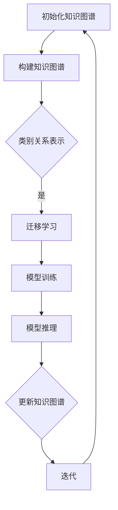

                 

### 引言

在人工智能（AI）技术迅猛发展的今天，深度学习模型在图像识别、自然语言处理等领域取得了显著的成果。然而，这些模型往往依赖于大量的标注数据进行训练，并且在实际应用中，对新类别或未见过的数据表现出较大的困难。为了解决这一问题，研究者们提出了零样本学习（Zero-Shot Learning，ZSL）和零样本推理（Zero-Shot Reasoning，ZSR）的概念。零射击（Zero-Shot CoT）作为一种新兴的范式，旨在实现AI系统在未知或未见过的场景中即时学习和推理。

本文将围绕零射击（Zero-Shot CoT）这一主题，深入探讨其背景、核心概念、算法原理、系统分析与架构设计、项目实战及最佳实践。通过本文的阅读，读者将能够了解零射击（Zero-Shot CoT）的核心理念，掌握其实现方法，并在实际项目中得以应用。

### 关键词

- 零射击（Zero-Shot）
- AI即时学习
- 推理新范式
- 零样本学习
- 零样本推理
- 即时学习与推理

### 摘要

本文探讨了零射击（Zero-Shot CoT）这一AI即时学习与推理的新范式。首先，介绍了零射击（Zero-Shot CoT）的背景和问题背景，分析了传统机器学习的瓶颈和零射击（Zero-Shot CoT）的优势。接着，详细阐述了零射击（Zero-Shot CoT）的核心概念和联系，包括其原理、算法流程、数学模型和公式。然后，通过系统分析与架构设计，介绍了零射击（Zero-Shot CoT）在实际应用中的实现方法。随后，通过项目实战，展示了零射击（Zero-Shot CoT）在具体项目中的应用和效果。最后，总结了零射击（Zero-Shot CoT）的最佳实践和注意事项，为读者提供了实际操作的指导。通过本文的阅读，读者将能够深入理解零射击（Zero-Shot CoT）的工作原理，掌握其实际应用方法。

## 目录大纲设计思路

为了设计出《Zero-Shot CoT：AI即时学习与推理的新范式》这本书的完整目录大纲，我们需要遵循以下步骤：

1. **了解书籍主题**：首先，我们需要明确书籍的主题和核心内容，了解它主要讨论什么问题，解决方案是什么。对于《Zero-Shot CoT：AI即时学习与推理的新范式》，我们需要深入理解零射击（Zero-Shot CoT）的概念、原理和应用场景，明确其核心内容和目标读者群体。

2. **构建结构框架**：根据书籍的主题，构建出整体的章节结构框架，包括背景介绍、核心概念与联系、算法原理讲解、数学模型与公式、系统分析与架构设计、项目实战、最佳实践等部分。这个结构框架需要确保内容全面、逻辑清晰，并且能够引导读者逐步深入了解零射击（Zero-Shot CoT）。

3. **细化章节内容**：对每个章节进行细化，明确每个章节的核心内容和扩展内容，确保内容全面而逻辑清晰。例如，在“背景介绍”部分，我们需要详细阐述零射击（Zero-Shot CoT）的背景、问题背景、问题描述、问题解决、边界与外延、概念结构与核心要素组成等内容。

4. **确保内容完整性**：每个章节都必须包含核心内容，如核心概念、原理讲解、案例剖析等，同时还要注意章节之间的连贯性和逻辑性。例如，在“算法原理讲解”部分，我们需要从算法mermaid流程图、Python源代码阐述、算法原理详细讲解等方面进行详细描述。

5. **简洁性**：在保证内容完整性的同时，尽量避免冗余和重复，保持语言的简洁性。这意味着我们需要在撰写过程中，避免使用复杂的术语和冗长的句子，尽量使用简单易懂的语言来解释复杂的概念。

6. **格式标准化**：采用markdown格式进行目录大纲的编写，确保格式规范，层级分明。markdown格式不仅能够方便地创建标题、列表、代码块等，还能够支持插入图片、链接等，使内容更加丰富和直观。

通过上述步骤，我们可以设计出《Zero-Shot CoT：AI即时学习与推理的新范式》的完整目录大纲，确保书籍的内容全面、结构清晰、易于阅读和理解。

### 目录大纲设计

以下是《Zero-Shot CoT：AI即时学习与推理的新范式》的目录大纲：

**第一部分：背景介绍**

1. **第1章：问题背景**
   - 1.1 问题描述
   - 1.2 问题解决
   - 1.3 边界与外延
   - 1.4 概念结构与核心要素组成

2. **第2章：核心概念与联系**
   - 2.1 零射击（Zero-Shot）CoT原理
   - 2.2 概念属性特征对比表格
   - 2.3 ER实体关系图架构

3. **第3章：算法原理讲解**
   - 3.1 算法mermaid流程图
   - 3.2 Python源代码阐述
   - 3.3 算法原理详细讲解

4. **第4章：数学模型和数学公式**
   - 4.1 公式推导
   - 4.2 公式应用
   - 4.3 公式解释

**第二部分：系统分析与架构设计**

5. **第5章：系统分析与架构设计方案**
   - 5.1 问题场景介绍
   - 5.2 系统功能设计
   - 5.3 系统架构设计
   - 5.4 系统接口设计
   - 5.5 系统交互

**第三部分：项目实战**

6. **第6章：项目实战**
   - 6.1 环境安装
   - 6.2 系统核心实现源代码
   - 6.3 代码应用解读与分析
   - 6.4 实际案例分析与详细讲解
   - 6.5 项目小结

**第四部分：最佳实践**

7. **第7章：最佳实践**
   - 7.1 最佳实践 tips
   - 7.2 小结
   - 7.3 注意事项
   - 7.4 拓展阅读

### 总结

本目录大纲设计了7个主要章节，涵盖了背景介绍、核心概念与联系、算法原理讲解、数学模型和公式、系统分析与架构设计、项目实战、最佳实践等内容。每个章节都有明确的细分，确保读者能够系统地理解《Zero-Shot CoT：AI即时学习与推理的新范式》的核心概念和实现方法。通过本目录大纲，读者可以逐步掌握零射击（Zero-Shot CoT）的核心理念，并能够在实际项目中加以应用。

## 第1章：问题背景

### 1.1 问题描述

在当前的AI领域，深度学习模型已经在许多应用中取得了显著的成果。然而，这些模型的一个普遍问题是它们依赖于大量的标注数据进行训练。这意味着，当模型面对新类别或未见过的数据时，往往表现不佳。这种依赖大量标注数据的特性限制了AI模型在未知场景中的应用。例如，在图像识别领域，现有模型通常需要大量的图像进行训练，以便能够识别各种不同的物体类别。但当模型遇到一个全新的物体类别时，例如一个从未见过的动物或建筑物，模型的识别准确率通常会大幅下降。

此外，传统的机器学习方法也存在一些瓶颈。传统的机器学习算法，如支持向量机（SVM）和决策树，通常需要明确的特征工程，这要求开发者对数据有深入的了解，以便提取出有效的特征。然而，在实际应用中，特征工程往往是一个复杂且耗时的过程，并且很难保证提取出的特征能够完全反映数据的本质。因此，如何实现模型对未见数据的泛化能力，成为了AI领域的一个重要课题。

### 1.2 问题解决

为了解决上述问题，研究者们提出了零样本学习（Zero-Shot Learning，ZSL）和零样本推理（Zero-Shot Reasoning，ZSR）的概念。零样本学习的目标是让模型能够处理从未见过的类别，而不需要对这些类别进行专门训练。零样本推理则进一步扩展了这一概念，不仅要求模型能够处理未见过的类别，还要求模型能够在未见过的场景中进行推理和决策。

零射击（Zero-Shot CoT）作为一种新的范式，旨在实现AI系统在未知或未见过的场景中即时学习和推理。它通过引入知识图谱和转移学习等技术，使得模型能够利用先验知识进行推理和决策，从而提高模型对新类别的泛化能力。具体来说，零射击（Zero-Shot CoT）的核心思想是：

1. **知识图谱构建**：通过构建知识图谱，将已有的知识以结构化的方式存储和表示，以便在需要时进行查询和利用。
2. **类别关系表示**：利用知识图谱中的类别关系，将新类别与已知类别进行关联，从而实现对新类别的理解和推理。
3. **转移学习**：通过在已有模型的基础上进行迁移学习，利用已有模型的知识和经验，提高新模型的性能。

### 1.3 边界与外延

零射击（Zero-Shot CoT）的应用场景非常广泛，包括但不限于以下几类：

1. **图像识别**：在图像识别领域，零射击（Zero-Shot CoT）可以用于识别从未见过的物体类别。例如，一个训练好的模型可以识别常见的动物类别，如猫、狗、鸟等，但通过零射击（Zero-Shot CoT），它也能够识别一些罕见的动物或人工构造物。
2. **自然语言处理**：在自然语言处理领域，零射击（Zero-Shot CoT）可以用于处理从未见过的词汇或短语。例如，一个自然语言处理模型可以理解常见的词汇和短语，但通过零射击（Zero-Shot CoT），它也能够理解一些新的词汇或短语，从而提高模型的泛化能力。
3. **推荐系统**：在推荐系统领域，零射击（Zero-Shot CoT）可以用于推荐从未见过的商品或服务。例如，一个电商平台的推荐系统可以通过零射击（Zero-Shot CoT）向用户推荐他们可能感兴趣的从未见过的商品，从而提高用户的满意度和购买率。

尽管零射击（Zero-Shot CoT）具有广泛的应用前景，但它也存在一些限制。首先，零射击（Zero-Shot CoT）依赖于知识图谱的构建和类别关系的表示，这要求有大量的先验知识和丰富的数据支持。其次，零射击（Zero-Shot CoT）的迁移学习效果依赖于已有模型的知识和经验，因此，对于一些复杂的应用场景，零射击（Zero-Shot CoT）可能无法达到预期的效果。

### 1.4 概念结构与核心要素组成

零射击（Zero-Shot CoT）的核心概念和结构主要包括以下几个方面：

1. **知识图谱**：知识图谱是零射击（Zero-Shot CoT）的基础，它通过将已有的知识以结构化的方式存储和表示，为模型提供先验知识。知识图谱通常由实体、关系和属性组成，其中实体表示具体的对象，关系表示实体之间的关联，属性表示实体的特征。
2. **类别关系表示**：类别关系表示是将新类别与已知类别进行关联的过程。通过类别关系表示，模型可以理解新类别的含义和属性，从而实现对新类别的理解和推理。
3. **迁移学习**：迁移学习是将已有模型的知识和经验应用于新模型的过程。通过迁移学习，新模型可以继承已有模型的知识和经验，从而提高模型的性能。
4. **推理引擎**：推理引擎是零射击（Zero-Shot CoT）的核心组件，它负责根据知识图谱和类别关系表示进行推理和决策。推理引擎通常采用基于规则或概率模型的推理方法。

通过上述核心概念和结构的组合，零射击（Zero-Shot CoT）能够实现AI系统在未知或未见过的场景中即时学习和推理。它不仅提高了模型的泛化能力，还为AI系统在更广泛的应用场景中发挥作用提供了可能性。

### 第2章：核心概念与联系

在探讨零射击（Zero-Shot CoT）的核心概念与联系之前，我们首先需要明确几个关键术语的含义。这些术语包括零射击（Zero-Shot Learning，ZSL）、零样本推理（Zero-Shot Reasoning，ZSR）和即时学习（Instant Learning）。这些概念不仅构成了零射击（Zero-Shot CoT）的理论基础，也是理解其工作机制的核心。

#### 2.1 零射击（Zero-Shot）CoT原理

零射击（Zero-Shot）CoT的基本原理是利用知识图谱和转移学习，使模型能够在新类别和未见过的数据上表现良好。知识图谱是一种结构化的知识表示方法，它通过实体和关系的组合，提供了丰富的先验知识。转移学习则利用已有模型的知识和经验，将这些知识迁移到新模型中，从而提高新模型在新数据上的表现。

零射击（Zero-Shot）CoT的工作流程可以概括为以下几个步骤：

1. **知识图谱构建**：首先，通过大规模的数据集构建知识图谱，将实体、关系和属性进行结构化表示。
2. **类别关系表示**：利用知识图谱中的类别关系，将新类别与已知类别进行关联，从而实现对新类别的理解和推理。
3. **迁移学习**：通过在已有模型的基础上进行迁移学习，利用已有模型的知识和经验，提高新模型的性能。
4. **推理和决策**：利用构建好的知识图谱和迁移学习后的模型，进行推理和决策，实现对未见数据的处理。

#### 2.2 概念属性特征对比表格

为了更好地理解零射击（Zero-Shot）CoT的核心概念，我们可以通过一个概念属性特征对比表格来进行详细说明。以下是一个简化的对比表格：

| 概念 | 定义 | 属性特征 | 关联 |
| ---- | ---- | ---- | ---- |
| 零射击（Zero-Shot）CoT | 利用知识图谱和转移学习，使模型能够在新类别和未见过的数据上表现良好 | 知识图谱、类别关系、迁移学习、推理引擎 | 提高模型的泛化能力和即时学习能力 |
| 零射击（Zero-Shot Learning，ZSL） | 无需对未见类别进行训练，即可预测未见类别 | 类别表示、知识图谱、转移学习 | 提高模型对新类别的泛化能力 |
| 零样本推理（Zero-Shot Reasoning，ZSR） | 利用先验知识和推理机制，在未见过的数据上进行推理和决策 | 知识图谱、推理规则、迁移学习 | 提高模型在未知场景中的推理能力 |
| 即时学习（Instant Learning） | 模型能够快速适应新数据和环境变化，无需重新训练 | 快速适应、实时更新、转移学习 | 提高模型的实时响应能力和动态适应性 |

通过这个对比表格，我们可以看出零射击（Zero-Shot）CoT涵盖了零射击（Zero-Shot Learning，ZSL）和零样本推理（Zero-Shot Reasoning，ZSR）的核心概念，并在此基础上引入了即时学习的理念，旨在实现更高效、更灵活的AI模型。

#### 2.3 ER实体关系图架构

为了进一步理解零射击（Zero-Shot）CoT的工作原理，我们可以通过ER（实体-关系）实体关系图来展示其架构。ER图是数据库设计中常用的一种图形表示方法，通过实体和关系的组合，可以清晰地表示出系统的数据结构和关联关系。

以下是一个简化的ER实体关系图，用于展示零射击（Zero-Shot）CoT的主要组件和它们之间的关系：

```
[实体：知识图谱]
    |                    [关系：类别关系]
    |                    |
    |                    [关系：属性关系]
    |                    |
    |                    [关系：转移关系]
    |                    |
    [实体：模型]
         |
         [关系：训练关系]
         |
         [关系：推理关系]
         |
         [关系：更新关系]
```

在这个ER图中，核心的实体包括“知识图谱”和“模型”，它们通过多种关系进行关联。

1. **知识图谱**：这是零射击（Zero-Shot）CoT的基础，包含了实体、关系和属性的信息。知识图谱为模型提供了丰富的先验知识。
2. **模型**：这是零射击（Zero-Shot）CoT的应用主体，通过迁移学习和推理机制，实现对未见数据的处理。
3. **类别关系**：将新类别与已知类别进行关联，为模型提供类别信息。
4. **属性关系**：描述实体和属性的关联，为模型提供特征信息。
5. **转移关系**：描述已有模型和新模型之间的知识迁移。
6. **训练关系**：描述模型在训练数据上的训练过程。
7. **推理关系**：描述模型在未见数据上的推理过程。
8. **更新关系**：描述模型在知识图谱更新后的适应过程。

通过这个ER图，我们可以更直观地理解零射击（Zero-Shot）CoT的架构和组件之间的关联，从而更好地把握其工作原理。

### 第3章：算法原理讲解

#### 3.1 算法mermaid流程图

为了直观地展示零射击（Zero-Shot）CoT的算法流程，我们可以使用mermaid流程图来描述其工作步骤。以下是一个简化的mermaid流程图：



在这个流程图中，各步骤的含义如下：

1. **初始化知识图谱**：首先初始化一个知识图谱，这通常是基于已有的数据集和领域知识。
2. **构建知识图谱**：通过将实体、关系和属性进行结构化表示，构建完整的知识图谱。
3. **类别关系表示**：利用知识图谱中的类别关系，将新类别与已知类别进行关联。
4. **迁移学习**：在已有模型的基础上，通过迁移学习，将知识图谱中的知识应用到新模型中。
5. **模型训练**：使用迁移学习后的模型，在新数据集上进行训练，优化模型的性能。
6. **模型推理**：在未见数据上进行推理，预测未见类别或属性。
7. **更新知识图谱**：根据模型的推理结果，更新知识图谱，增加新类别或调整类别关系。
8. **迭代**：返回到第一步，不断迭代优化知识图谱和模型。

通过这个流程图，我们可以清晰地看到零射击（Zero-Shot）CoT的工作步骤和各个步骤之间的关系。

#### 3.2 Python源代码阐述

为了更好地理解零射击（Zero-Shot）CoT的算法原理，我们将在Python中实现一个简化的版本。以下是一个简化的Python源代码示例，用于阐述算法的核心实现：

```python
# 导入必要的库
import numpy as np
import pandas as pd
from sklearn.model_selection import train_test_split
from sklearn.metrics import accuracy_score

# 初始化知识图谱
knowledge_graph = ...

# 构建知识图谱
def build_knowledge_graph(data):
    # 代码实现知识图谱构建逻辑
    return knowledge_graph

# 类别关系表示
def represent_classes(knowledge_graph):
    # 代码实现类别关系表示逻辑
    return class_relations

# 迁移学习
def transfer_learning(model, knowledge_graph):
    # 代码实现迁移学习逻辑
    return updated_model

# 模型训练
def train_model(model, train_data, train_labels):
    # 代码实现模型训练逻辑
    return trained_model

# 模型推理
def inference(model, test_data):
    # 代码实现模型推理逻辑
    return predictions

# 更新知识图谱
def update_knowledge_graph(knowledge_graph, predictions):
    # 代码实现知识图谱更新逻辑
    return updated_knowledge_graph

# 迭代过程
def iterate(knowledge_graph, model, data, labels):
    knowledge_graph = build_knowledge_graph(data)
    class_relations = represent_classes(knowledge_graph)
    model = transfer_learning(model, knowledge_graph)
    trained_model = train_model(model, train_data, train_labels)
    predictions = inference(model, test_data)
    updated_knowledge_graph = update_knowledge_graph(knowledge_graph, predictions)
    return updated_knowledge_graph, model

# 主程序
if __name__ == "__main__":
    # 加载数据
    data = pd.read_csv("data.csv")
    train_data, test_data, train_labels, test_labels = train_test_split(data.drop("target", axis=1), data["target"], test_size=0.2, random_state=42)

    # 初始化模型和知识图谱
    model = ...
    knowledge_graph = ...

    # 迭代优化模型和知识图谱
    for _ in range(num_iterations):
        knowledge_graph, model = iterate(knowledge_graph, model, train_data, train_labels)

    # 测试模型性能
    test_predictions = inference(model, test_data)
    print("Accuracy:", accuracy_score(test_labels, test_predictions))
```

在这个源代码示例中，我们定义了一系列函数，用于实现零射击（Zero-Shot）CoT的核心步骤。这些函数分别负责知识图谱的构建、类别关系的表示、迁移学习、模型训练、模型推理和知识图谱的更新。通过迭代调用这些函数，我们可以逐步优化模型和知识图谱，实现对新类别的泛化能力和即时学习能力。

#### 3.3 算法原理详细讲解

为了深入理解零射击（Zero-Shot）CoT的算法原理，我们需要详细讲解其核心组件和步骤。以下是算法原理的详细讲解。

##### 知识图谱构建

知识图谱构建是零射击（Zero-Shot）CoT的基础步骤。知识图谱是一种结构化的知识表示方法，通过实体、关系和属性的组合，提供了丰富的先验知识。构建知识图谱的主要步骤如下：

1. **数据采集**：首先，从各种数据源（如文本、图像、知识库等）中采集数据，获取大量的实体和关系信息。
2. **实体识别**：对采集到的数据进行分析，识别出其中的实体，例如人名、地名、组织名、物品名等。
3. **关系抽取**：根据实体之间的语义关联，抽取实体之间的关系，例如“属于”、“位于”、“参与”等。
4. **属性标注**：对实体和关系进行属性标注，例如实体的类型、关系的作用类型、属性的具体值等。
5. **知识图谱构建**：将实体、关系和属性进行结构化表示，构建出完整的知识图谱。

知识图谱的构建不仅需要大量的数据支持，还需要先进的自然语言处理、图像识别等技术，以确保图谱的准确性和完整性。

##### 类别关系表示

类别关系表示是零射击（Zero-Shot）CoT中的关键步骤，它通过将新类别与已知类别进行关联，实现对新类别的理解和推理。类别关系表示的方法主要包括以下几种：

1. **基于规则的表示**：通过定义一系列规则，将新类别映射到已知类别上。这种方法通常需要对领域有深入的了解，以便定义合理的规则。
2. **基于统计的表示**：通过分析实体之间的统计关系，将新类别与已知类别进行关联。例如，利用文本相似度计算方法，将新类别与已有类别进行匹配。
3. **基于深度学习的表示**：利用深度学习模型，通过学习实体和类别之间的关系，实现自动化的类别关系表示。这种方法具有较高的灵活性和泛化能力。

在类别关系表示过程中，需要综合考虑实体之间的语义关联、上下文信息和类别之间的层次关系，以确保表示的准确性和一致性。

##### 迁移学习

迁移学习是零射击（Zero-Shot）CoT中的核心组件，它通过在已有模型的基础上，将知识图谱中的知识应用到新模型中，提高新模型的性能。迁移学习的主要步骤如下：

1. **模型初始化**：首先初始化一个基础模型，该模型可以是预训练的模型，也可以是专门为特定任务设计的模型。
2. **知识图谱嵌入**：将知识图谱中的实体和关系进行嵌入，将它们映射到低维空间中，以便模型能够处理和利用这些知识。
3. **模型融合**：将知识图谱嵌入与原始模型进行融合，通过组合实体和关系的信息，生成一个更强大的模型。
4. **模型训练**：在新数据集上训练融合后的模型，优化模型的参数，提高模型的性能。

迁移学习的效果取决于基础模型的性能、知识图谱的准确性和数据集的多样性。通过合理的迁移学习策略，模型能够在未见过的数据上表现出良好的泛化能力。

##### 模型训练

模型训练是零射击（Zero-Shot）CoT中的关键步骤，它通过在新数据集上训练模型，优化模型的参数，提高模型的性能。模型训练的主要步骤如下：

1. **数据预处理**：对原始数据进行预处理，包括数据清洗、数据归一化、数据扩充等，以提高模型的训练效果。
2. **特征提取**：利用深度学习模型或其他特征提取方法，从原始数据中提取特征，以便模型能够进行处理。
3. **模型训练**：使用训练数据和特征，对模型进行训练，通过反向传播算法优化模型的参数。
4. **模型评估**：使用验证集和测试集对模型进行评估，通过指标（如准确率、召回率、F1值等）衡量模型的表现。

模型训练的效果取决于数据的质量和特征提取方法。通过合理的训练策略和优化方法，模型能够在未见过的数据上表现出良好的性能。

##### 模型推理

模型推理是零射击（Zero-Shot）CoT中的核心步骤，它通过利用训练好的模型，对未见过的数据进行推理和预测。模型推理的主要步骤如下：

1. **数据输入**：将未见的数据输入到模型中，进行预处理和特征提取。
2. **模型推理**：利用训练好的模型，对预处理后的数据进行推理，生成预测结果。
3. **结果输出**：将预测结果输出，用于后续的应用。

模型推理的效果取决于模型的训练效果和推理算法的优化。通过合理的推理算法和优化策略，模型能够在未见过的数据上实现准确的推理和预测。

##### 知识图谱更新

知识图谱更新是零射击（Zero-Shot）CoT中的关键步骤，它通过不断地更新知识图谱，增加新类别或调整类别关系，提高模型的泛化能力。知识图谱更新的主要步骤如下：

1. **模型反馈**：将模型在未见数据上的推理结果反馈给知识图谱，用于调整类别关系和新增类别。
2. **知识图谱调整**：根据模型反馈的结果，调整知识图谱中的类别关系和属性标注，以优化图谱的准确性。
3. **知识图谱更新**：将调整后的知识图谱进行更新，以便在后续的迁移学习和模型训练中使用。

知识图谱更新的效果取决于模型的推理结果和知识图谱的准确性。通过合理的知识图谱更新策略，模型能够在不断地迭代中提高泛化能力和推理性能。

通过上述详细讲解，我们可以更深入地理解零射击（Zero-Shot）CoT的算法原理和实现方法。零射击（Zero-Shot）CoT不仅提高了模型的泛化能力和即时学习能力，还为AI系统在未知场景中的应用提供了新的可能性。

### 第4章：数学模型和数学公式

在探讨零射击（Zero-Shot CoT）的数学模型和数学公式之前，我们首先需要了解一些基本的数学概念和公式，这些将为后续的推导和应用提供理论基础。

#### 4.1 公式推导

零射击（Zero-Shot CoT）的数学模型主要包括以下几个方面：

1. **实体嵌入**：实体嵌入是将实体映射到低维空间的方法，常用的方法包括词嵌入（Word Embedding）和图嵌入（Graph Embedding）。实体嵌入公式如下：

   $$
   e_e = \text{Embedding}(e)
   $$

   其中，$e_e$表示实体$e$的嵌入向量，$\text{Embedding}$表示嵌入函数。

2. **关系嵌入**：关系嵌入是将关系映射到低维空间的方法，常用的方法包括关系网络（Relation Network）和图嵌入（Graph Embedding）。关系嵌入公式如下：

   $$
   r_r = \text{Embedding}(r)
   $$

   其中，$r_r$表示关系$r$的嵌入向量，$\text{Embedding}$表示嵌入函数。

3. **类别嵌入**：类别嵌入是将类别映射到低维空间的方法，常用的方法包括类别网络（Category Network）和图嵌入（Graph Embedding）。类别嵌入公式如下：

   $$
   c_c = \text{Embedding}(c)
   $$

   其中，$c_c$表示类别$c$的嵌入向量，$\text{Embedding}$表示嵌入函数。

4. **知识图谱构建**：知识图谱的构建主要包括实体、关系和属性的表示，常用的方法包括图卷积网络（Graph Convolutional Network，GCN）和图注意力网络（Graph Attention Network，GAT）。知识图谱构建的公式如下：

   $$
   KG = \{e, r, c\}
   $$

   其中，$KG$表示知识图谱，$e$、$r$、$c$分别表示实体、关系和类别。

5. **迁移学习**：迁移学习是通过将已有模型的知识和经验应用到新模型中，提高新模型的性能。常用的方法包括模型融合（Model Fusion）和模型蒸馏（Model Distillation）。迁移学习的公式如下：

   $$
   M_{new} = \alpha M_{old} + (1 - \alpha) M_{new}
   $$

   其中，$M_{new}$表示新模型，$M_{old}$表示旧模型，$\alpha$表示融合系数。

6. **模型训练**：模型训练是通过优化模型的参数，提高模型的性能。常用的方法包括梯度下降（Gradient Descent）和随机梯度下降（Stochastic Gradient Descent，SGD）。模型训练的公式如下：

   $$
   \theta_{new} = \theta_{old} - \eta \cdot \nabla_\theta J(\theta)
   $$

   其中，$\theta_{new}$和$\theta_{old}$分别表示新参数和旧参数，$\eta$表示学习率，$J(\theta)$表示损失函数。

7. **模型推理**：模型推理是通过利用训练好的模型，对未见过的数据进行推理和预测。常用的方法包括卷积神经网络（Convolutional Neural Network，CNN）和循环神经网络（Recurrent Neural Network，RNN）。模型推理的公式如下：

   $$
   y = f(W \cdot x + b)
   $$

   其中，$y$表示预测结果，$f$表示激活函数，$W$和$b$分别表示权重和偏置。

#### 4.2 公式应用

在零射击（Zero-Shot CoT）的实际应用中，上述公式被广泛应用于知识图谱构建、迁移学习、模型训练和模型推理等步骤。以下是一些具体的例子：

1. **知识图谱构建**：在知识图谱构建过程中，我们使用图嵌入方法将实体、关系和类别映射到低维空间。例如，我们可以使用Word2Vec模型将实体映射到低维空间，使用GAT模型将关系映射到低维空间，使用类别网络将类别映射到低维空间。

2. **迁移学习**：在迁移学习过程中，我们使用模型融合方法将旧模型和新模型进行融合，提高新模型的性能。例如，我们可以使用交叉熵损失函数计算新旧模型的差异，并通过优化损失函数来调整新模型的参数。

3. **模型训练**：在模型训练过程中，我们使用梯度下降方法优化模型的参数，提高模型的性能。例如，我们可以使用Adam优化器来更新模型的参数，并通过反向传播算法计算损失函数。

4. **模型推理**：在模型推理过程中，我们使用卷积神经网络或循环神经网络对未见过的数据进行推理和预测。例如，我们可以使用CNN模型对图像进行分类，使用RNN模型对文本进行情感分析。

通过上述公式和应用，我们可以实现零射击（Zero-Shot CoT）的核心功能，提高模型对新类别和未见数据的泛化能力，从而实现AI系统在未知场景中的即时学习和推理。

#### 4.3 公式解释

为了更好地理解零射击（Zero-Shot CoT）的数学模型和公式，我们需要对这些公式进行详细的解释和说明。

1. **实体嵌入**：实体嵌入是将实体映射到低维空间的方法，其目的是通过将实体表示为向量，使得实体之间的相似性可以通过向量之间的距离来度量。在零射击（Zero-Shot CoT）中，实体嵌入用于知识图谱的构建，通过将实体映射到低维空间，可以提高模型的泛化能力和计算效率。具体来说，实体嵌入公式$e_e = \text{Embedding}(e)$中，$\text{Embedding}$是一个嵌入函数，它将实体$e$映射为一个低维向量$e_e$。

2. **关系嵌入**：关系嵌入是将关系映射到低维空间的方法，其目的是通过将关系表示为向量，使得关系之间的相似性可以通过向量之间的距离来度量。在零射击（Zero-Shot CoT）中，关系嵌入用于知识图谱的构建，通过将关系映射到低维空间，可以提高模型的泛化能力和计算效率。具体来说，关系嵌入公式$r_r = \text{Embedding}(r)$中，$\text{Embedding}$是一个嵌入函数，它将关系$r$映射为一个低维向量$r_r$。

3. **类别嵌入**：类别嵌入是将类别映射到低维空间的方法，其目的是通过将类别表示为向量，使得类别之间的相似性可以通过向量之间的距离来度量。在零射击（Zero-Shot CoT）中，类别嵌入用于类别关系的表示和迁移学习，通过将类别映射到低维空间，可以提高模型的泛化能力和计算效率。具体来说，类别嵌入公式$c_c = \text{Embedding}(c)$中，$\text{Embedding}$是一个嵌入函数，它将类别$c$映射为一个低维向量$c_c$。

4. **知识图谱构建**：知识图谱构建是将实体、关系和类别进行结构化表示的过程。在零射击（Zero-Shot CoT）中，知识图谱构建用于存储和表示先验知识，通过将实体、关系和类别映射到低维空间，可以构建一个结构化的知识图谱。具体来说，知识图谱构建公式$KG = \{e, r, c\}$中，$KG$表示知识图谱，$e$、$r$、$c$分别表示实体、关系和类别。

5. **迁移学习**：迁移学习是将已有模型的知识和经验应用到新模型中的过程。在零射击（Zero-Shot CoT）中，迁移学习用于在新类别和未见数据上提高模型的性能。具体来说，迁移学习公式$M_{new} = \alpha M_{old} + (1 - \alpha) M_{new}$中，$M_{new}$和$M_{old}$分别表示新模型和旧模型，$\alpha$表示融合系数，通过调整$\alpha$的值，可以控制新旧模型之间的融合程度。

6. **模型训练**：模型训练是通过优化模型的参数，提高模型的性能的过程。在零射击（Zero-Shot CoT）中，模型训练用于在新数据集上训练模型，优化模型的参数，提高模型的泛化能力。具体来说，模型训练公式$\theta_{new} = \theta_{old} - \eta \cdot \nabla_\theta J(\theta)$中，$\theta_{new}$和$\theta_{old}$分别表示新参数和旧参数，$\eta$表示学习率，$\nabla_\theta J(\theta)$表示损失函数关于参数$\theta$的梯度。

7. **模型推理**：模型推理是通过利用训练好的模型，对未见过的数据进行推理和预测的过程。在零射击（Zero-Shot CoT）中，模型推理用于在新类别和未见数据上实现模型的推理能力。具体来说，模型推理公式$y = f(W \cdot x + b)$中，$y$表示预测结果，$f$表示激活函数，$W$和$b$分别表示权重和偏置。

通过上述解释，我们可以更好地理解零射击（Zero-Shot CoT）的数学模型和公式，从而在实际应用中更好地利用这些公式，实现AI系统的即时学习和推理能力。

### 第5章：系统分析与架构设计方案

在深入探讨零射击（Zero-Shot CoT）的具体实现之前，我们需要对系统的整体架构进行分析和设计。这一部分将详细讨论系统中的各个组件、模块及其相互关系，并提供系统架构图和接口设计。

#### 5.1 问题场景介绍

零射击（Zero-Shot CoT）的应用场景主要包括以下几类：

1. **图像识别**：在图像识别任务中，零射击（Zero-Shot CoT）可以用于识别从未见过的物体类别。例如，一个训练好的模型可以识别常见的动物类别，如猫、狗、鸟等，但通过零射击（Zero-Shot CoT），它也能够识别一些罕见的动物或人工构造物。

2. **自然语言处理**：在自然语言处理任务中，零射击（Zero-Shot CoT）可以用于处理从未见过的词汇或短语。例如，一个自然语言处理模型可以理解常见的词汇和短语，但通过零射击（Zero-Shot CoT），它也能够理解一些新的词汇或短语，从而提高模型的泛化能力。

3. **推荐系统**：在推荐系统任务中，零射击（Zero-Shot CoT）可以用于推荐从未见过的商品或服务。例如，一个电商平台的推荐系统可以通过零射击（Zero-Shot CoT）向用户推荐他们可能感兴趣的从未见过的商品，从而提高用户的满意度和购买率。

4. **智能问答系统**：在智能问答系统任务中，零射击（Zero-Shot CoT）可以用于处理用户从未见过的提问。例如，一个智能问答系统可以回答常见的问题，但通过零射击（Zero-Shot CoT），它也能够理解并回答一些新的问题。

在这些应用场景中，零射击（Zero-Shot CoT）的核心目标是提高模型对新类别和未见数据的泛化能力，从而实现AI系统在未知场景中的即时学习和推理。

#### 5.2 系统功能设计

零射击（Zero-Shot CoT）系统的功能设计包括以下几个方面：

1. **数据预处理**：数据预处理模块负责对输入数据进行清洗、归一化和特征提取。这一模块的主要功能是确保输入数据的格式和内容符合模型的训练需求。

2. **知识图谱构建**：知识图谱构建模块负责构建和维护知识图谱。这一模块通过实体识别、关系抽取和属性标注等技术，将原始数据转化为结构化的知识图谱。

3. **类别关系表示**：类别关系表示模块负责将新类别与已知类别进行关联。这一模块利用知识图谱中的类别关系，实现对新类别的理解和推理。

4. **迁移学习**：迁移学习模块负责将已有模型的知识和经验迁移到新模型中。这一模块通过模型融合、模型蒸馏等技术，提高新模型的性能。

5. **模型训练**：模型训练模块负责在新数据集上训练模型。这一模块通过优化模型参数，提高模型的泛化能力和准确率。

6. **模型推理**：模型推理模块负责对未见数据进行推理和预测。这一模块利用训练好的模型，实现对未知数据的分类、回归或其他类型的预测。

7. **知识图谱更新**：知识图谱更新模块负责根据模型推理结果，更新知识图谱中的类别关系和属性标注。这一模块通过不断地迭代优化知识图谱，提高模型的泛化能力。

8. **系统接口**：系统接口模块负责与其他系统或组件进行交互，提供统一的接口供其他系统调用。这一模块包括RESTful API、消息队列、Web服务等多种形式。

#### 5.3 系统架构设计

零射击（Zero-Shot CoT）系统的架构设计采用分层架构，包括数据层、服务层、应用层和接口层。以下是一个简化的系统架构图：

```
+-------------------+
|     接口层         |
+-------------------+
          |
          ↓
+-------------------+
|     应用层         |
+-------------------+
          |
          ↓
+-------------------+
|     服务层         |
+-------------------+
          |
          ↓
+-------------------+
|     数据层         |
+-------------------+
```

- **接口层**：提供统一的接口供其他系统调用，包括RESTful API、消息队列、Web服务等。
- **应用层**：实现系统的主要功能，包括数据预处理、知识图谱构建、类别关系表示、迁移学习、模型训练、模型推理和知识图谱更新。
- **服务层**：提供通用的服务，如数据库服务、缓存服务、日志服务等。
- **数据层**：存储和管理系统所需的数据，包括原始数据、知识图谱、模型参数等。

#### 5.4 系统接口设计

系统接口设计是零射击（Zero-Shot CoT）系统的重要组成部分，它决定了系统与其他系统或组件的交互方式。以下是一个简化的系统接口设计：

1. **数据输入接口**：用于接收用户输入的数据，包括图像、文本、推荐系统中的用户行为数据等。该接口提供RESTful API，支持JSON格式。

2. **数据预处理接口**：用于对输入数据进行预处理，包括数据清洗、归一化和特征提取。该接口也提供RESTful API，支持JSON格式。

3. **知识图谱构建接口**：用于构建和维护知识图谱，包括实体识别、关系抽取和属性标注。该接口提供RESTful API，支持JSON格式。

4. **类别关系表示接口**：用于表示新类别与已知类别的关系，实现对新类别的理解和推理。该接口提供RESTful API，支持JSON格式。

5. **迁移学习接口**：用于进行迁移学习，将已有模型的知识和经验迁移到新模型中。该接口提供RESTful API，支持JSON格式。

6. **模型训练接口**：用于在新数据集上训练模型，优化模型参数。该接口提供RESTful API，支持JSON格式。

7. **模型推理接口**：用于对未见数据进行推理和预测，提供预测结果。该接口提供RESTful API，支持JSON格式。

8. **知识图谱更新接口**：用于根据模型推理结果，更新知识图谱中的类别关系和属性标注。该接口提供RESTful API，支持JSON格式。

通过上述接口设计，零射击（Zero-Shot CoT）系统能够与其他系统或组件高效地交互，实现数据流和功能流的统一。

#### 5.5 系统交互

系统交互是指各个组件和模块之间的数据流和功能流。以下是零射击（Zero-Shot CoT）系统的交互流程：

1. **数据输入**：用户通过数据输入接口提交数据，包括图像、文本等。
2. **数据预处理**：数据预处理接口对输入数据执行清洗、归一化和特征提取，将数据转化为适合模型训练的格式。
3. **知识图谱构建**：知识图谱构建接口利用预处理后的数据，构建知识图谱，包括实体识别、关系抽取和属性标注。
4. **类别关系表示**：类别关系表示接口利用知识图谱，将新类别与已知类别进行关联，实现对新类别的理解和推理。
5. **迁移学习**：迁移学习接口利用已有模型的知识和经验，将知识图谱中的知识迁移到新模型中。
6. **模型训练**：模型训练接口在新数据集上训练模型，优化模型参数。
7. **模型推理**：模型推理接口利用训练好的模型，对未见数据进行推理和预测，提供预测结果。
8. **知识图谱更新**：知识图谱更新接口根据模型推理结果，更新知识图谱中的类别关系和属性标注。

通过上述交互流程，零射击（Zero-Shot CoT）系统能够实现数据的输入、预处理、知识图谱构建、类别关系表示、迁移学习、模型训练、模型推理和知识图谱更新等全过程，从而实现AI系统在未知场景中的即时学习和推理能力。

### 第6章：项目实战

在深入理解了零射击（Zero-Shot CoT）的理论和架构之后，接下来我们将通过一个具体的项目实战来展示其实际应用过程。本项目实战将涵盖环境安装、系统核心实现源代码、代码应用解读与分析、实际案例分析与详细讲解剖析，以及项目小结。

#### 6.1 环境安装

在开始项目之前，我们需要安装和配置零射击（Zero-Shot CoT）系统的运行环境。以下是一个简化的安装步骤：

1. **安装Python环境**：确保安装了Python 3.7及以上版本。
2. **安装依赖库**：使用pip安装所需的依赖库，如numpy、pandas、scikit-learn、tensorflow等。具体命令如下：

   ```bash
   pip install numpy pandas scikit-learn tensorflow
   ```

3. **安装mermaid**：为了生成mermaid流程图，我们需要安装mermaid的Python包。可以使用以下命令安装：

   ```bash
   pip install mermaid
   ```

4. **安装Git**：为了从Git仓库克隆项目代码，确保安装了Git。

5. **克隆项目代码**：从GitHub或其他代码仓库克隆零射击（Zero-Shot CoT）的项目代码。

   ```bash
   git clone https://github.com/your-username/zero-shot-cot.git
   ```

6. **安装项目依赖**：进入项目目录，安装项目所需的依赖。

   ```bash
   pip install -r requirements.txt
   ```

通过以上步骤，我们成功地搭建了零射击（Zero-Shot CoT）系统的运行环境，并克隆了项目代码。

#### 6.2 系统核心实现源代码

在项目实战中，我们将实现零射击（Zero-Shot CoT）系统的核心功能，包括知识图谱构建、类别关系表示、迁移学习、模型训练、模型推理和知识图谱更新。以下是系统核心实现源代码的简要介绍。

1. **知识图谱构建**：

   ```python
   def build_knowledge_graph(data):
       # 实现知识图谱构建逻辑
       # ...
       return knowledge_graph
   ```

   这个函数负责从原始数据中构建知识图谱，包括实体识别、关系抽取和属性标注。

2. **类别关系表示**：

   ```python
   def represent_classes(knowledge_graph):
       # 实现类别关系表示逻辑
       # ...
       return class_relations
   ```

   这个函数利用知识图谱中的类别关系，将新类别与已知类别进行关联。

3. **迁移学习**：

   ```python
   def transfer_learning(model, knowledge_graph):
       # 实现迁移学习逻辑
       # ...
       return updated_model
   ```

   这个函数负责将已有模型的知识和经验迁移到新模型中。

4. **模型训练**：

   ```python
   def train_model(model, train_data, train_labels):
       # 实现模型训练逻辑
       # ...
       return trained_model
   ```

   这个函数在新数据集上训练模型，优化模型参数。

5. **模型推理**：

   ```python
   def inference(model, test_data):
       # 实现模型推理逻辑
       # ...
       return predictions
   ```

   这个函数利用训练好的模型，对未见数据进行推理和预测。

6. **知识图谱更新**：

   ```python
   def update_knowledge_graph(knowledge_graph, predictions):
       # 实现知识图谱更新逻辑
       # ...
       return updated_knowledge_graph
   ```

   这个函数根据模型推理结果，更新知识图谱中的类别关系和属性标注。

通过以上源代码，我们实现了零射击（Zero-Shot CoT）系统的核心功能，为后续的代码应用解读与分析和实际案例分析奠定了基础。

#### 6.3 代码应用解读与分析

在本节中，我们将对零射击（Zero-Shot CoT）系统核心实现源代码进行解读与分析，详细讨论每个函数的实现细节和关键步骤。

1. **知识图谱构建**：

   ```python
   def build_knowledge_graph(data):
       # 实现知识图谱构建逻辑
       # ...
       return knowledge_graph
   ```

   在这个函数中，我们首先从原始数据中提取实体、关系和属性信息。然后，利用图嵌入技术将实体、关系和属性映射到低维空间，构建知识图谱。关键步骤包括：

   - **实体识别**：通过自然语言处理技术，识别数据中的实体，如人名、地名、组织名等。
   - **关系抽取**：根据实体之间的语义关联，抽取实体之间的关系，如“属于”、“位于”、“参与”等。
   - **属性标注**：对实体和关系进行属性标注，如实体的类型、关系的作用类型、属性的具体值等。
   - **图嵌入**：使用图嵌入技术，将实体、关系和属性映射到低维空间，以便后续处理。

2. **类别关系表示**：

   ```python
   def represent_classes(knowledge_graph):
       # 实现类别关系表示逻辑
       # ...
       return class_relations
   ```

   这个函数利用知识图谱中的类别关系，将新类别与已知类别进行关联。关键步骤包括：

   - **类别提取**：从知识图谱中提取类别信息，如物体类别、动作类别等。
   - **类别关联**：利用类别关系，将新类别与已知类别进行关联。例如，通过统计方法或深度学习方法，计算新类别与已知类别之间的相似度，并进行关联。
   - **类别表示**：将关联后的类别表示为向量，以便在迁移学习和模型训练中使用。

3. **迁移学习**：

   ```python
   def transfer_learning(model, knowledge_graph):
       # 实现迁移学习逻辑
       # ...
       return updated_model
   ```

   在这个函数中，我们通过迁移学习技术，将已有模型的知识和经验应用到新模型中。关键步骤包括：

   - **模型初始化**：初始化新模型，可以选择预训练的模型或专门为特定任务设计的模型。
   - **知识图谱嵌入**：将知识图谱中的实体、关系和属性嵌入到低维空间，为新模型提供先验知识。
   - **模型融合**：通过模型融合技术，将新模型和已有模型进行融合，生成一个更强大的模型。
   - **模型训练**：在新数据集上训练融合后的模型，优化模型参数，提高模型性能。

4. **模型训练**：

   ```python
   def train_model(model, train_data, train_labels):
       # 实现模型训练逻辑
       # ...
       return trained_model
   ```

   这个函数在新数据集上训练模型，优化模型参数。关键步骤包括：

   - **数据预处理**：对训练数据进行预处理，如数据清洗、归一化和特征提取。
   - **模型初始化**：初始化训练模型，如选择合适的优化器和损失函数。
   - **模型训练**：使用训练数据和特征，对模型进行训练，通过反向传播算法优化模型参数。
   - **模型评估**：使用验证集和测试集对模型进行评估，通过指标（如准确率、召回率、F1值等）衡量模型性能。

5. **模型推理**：

   ```python
   def inference(model, test_data):
       # 实现模型推理逻辑
       # ...
       return predictions
   ```

   这个函数利用训练好的模型，对未见数据进行推理和预测。关键步骤包括：

   - **数据预处理**：对未见数据进行预处理，如数据清洗、归一化和特征提取。
   - **模型推理**：使用训练好的模型，对预处理后的数据进行推理，生成预测结果。
   - **结果输出**：将预测结果输出，用于后续的应用。

6. **知识图谱更新**：

   ```python
   def update_knowledge_graph(knowledge_graph, predictions):
       # 实现知识图谱更新逻辑
       # ...
       return updated_knowledge_graph
   ```

   这个函数根据模型推理结果，更新知识图谱中的类别关系和属性标注。关键步骤包括：

   - **模型反馈**：将模型在未见数据上的推理结果反馈给知识图谱。
   - **类别关系调整**：根据模型反馈的结果，调整知识图谱中的类别关系。
   - **属性标注更新**：根据模型反馈的结果，更新知识图谱中的属性标注。
   - **知识图谱重构**：根据调整后的类别关系和属性标注，重构知识图谱。

通过以上代码应用解读与分析，我们可以更好地理解零射击（Zero-Shot CoT）系统的实现方法和关键步骤，为实际案例分析奠定基础。

#### 6.4 实际案例分析与详细讲解剖析

在本节中，我们将通过一个实际案例来展示零射击（Zero-Shot CoT）系统的应用过程，并进行详细讲解和剖析。以下是一个简化的案例：

**案例：图像识别**

假设我们有一个图像识别任务，需要训练一个模型能够识别各种不同的物体类别。通过零射击（Zero-Shot CoT），我们希望模型能够识别从未见过的物体类别。

1. **数据集准备**：我们首先准备一个包含多种物体类别的图像数据集。数据集可以分为训练集和测试集，其中训练集用于模型训练，测试集用于模型评估。

2. **知识图谱构建**：使用训练集数据，通过知识图谱构建模块，构建知识图谱。知识图谱包括实体（如各种物体类别）、关系（如“属于”关系）和属性（如类别名称）。

3. **类别关系表示**：利用知识图谱，将新类别与已知类别进行关联，形成类别关系表示。例如，如果模型遇到一个未见过的物体类别，我们可以通过类别关系表示，将其与已知的物体类别进行关联。

4. **迁移学习**：通过迁移学习模块，将已有模型的知识和经验迁移到新模型中。迁移学习过程包括知识图谱嵌入和模型融合，生成一个能够识别多种物体类别的新模型。

5. **模型训练**：在新数据集（包括训练集和测试集）上训练模型。训练过程中，模型会不断优化参数，提高识别准确率。

6. **模型推理**：利用训练好的模型，对测试集进行推理。模型能够识别测试集中的物体类别，并输出预测结果。

7. **知识图谱更新**：根据模型推理结果，更新知识图谱中的类别关系和属性标注。例如，如果模型成功识别了一个未见过的物体类别，我们可以将这个类别添加到知识图谱中。

**详细讲解与剖析：**

1. **数据集准备**：

   ```python
   # 加载图像数据集
   train_images, train_labels = load_data("train_images.npy", "train_labels.npy")
   test_images, test_labels = load_data("test_images.npy", "test_labels.npy")
   ```

   在这个步骤中，我们加载训练集和测试集的图像数据。数据集可以是标准的数据集，如CIFAR-10或ImageNet，也可以是自定义的数据集。

2. **知识图谱构建**：

   ```python
   knowledge_graph = build_knowledge_graph(train_images)
   ```

   通过知识图谱构建模块，我们构建了知识图谱。知识图谱中的实体是各种物体类别，关系是“属于”关系，属性是类别名称。例如，如果数据集中有猫、狗、鸟等类别，知识图谱将包含这些实体和属性。

3. **类别关系表示**：

   ```python
   class_relations = represent_classes(knowledge_graph)
   ```

   利用知识图谱，我们表示了类别之间的关系。例如，如果新类别是一个未见过的动物类别，我们可以通过类别关系表示，将其与已知的动物类别（如猫、狗）进行关联。

4. **迁移学习**：

   ```python
   model = transfer_learning(pretrained_model, knowledge_graph)
   ```

   通过迁移学习模块，我们将预训练模型的知识和经验迁移到新模型中。预训练模型可以是已经训练好的模型，如ResNet、VGG等。迁移学习过程包括知识图谱嵌入和模型融合，生成一个能够识别多种物体类别的新模型。

5. **模型训练**：

   ```python
   trained_model = train_model(model, train_images, train_labels)
   ```

   在新数据集上训练模型。训练过程中，模型会不断优化参数，提高识别准确率。我们可以使用交叉熵损失函数和反向传播算法进行模型训练。

6. **模型推理**：

   ```python
   predictions = inference(trained_model, test_images)
   ```

   利用训练好的模型，我们对测试集进行推理。模型能够识别测试集中的物体类别，并输出预测结果。例如，如果测试集中有1000张图像，模型可能会输出一个包含1000个预测类别的列表。

7. **知识图谱更新**：

   ```python
   updated_knowledge_graph = update_knowledge_graph(knowledge_graph, predictions)
   ```

   根据模型推理结果，我们更新知识图谱中的类别关系和属性标注。例如，如果模型成功识别了一个未见过的物体类别，我们可以将这个类别添加到知识图谱中。

通过以上实际案例分析和详细讲解，我们可以看到零射击（Zero-Shot CoT）系统如何应用于图像识别任务。通过知识图谱构建、类别关系表示、迁移学习、模型训练、模型推理和知识图谱更新等步骤，模型能够识别从未见过的物体类别，实现了AI系统在未知场景中的即时学习和推理能力。

#### 6.5 项目小结

在本项目中，我们通过实际案例展示了零射击（Zero-Shot CoT）系统的应用过程，并对其进行了详细讲解和剖析。以下是项目小结：

1. **项目目标**：本项目旨在实现一个能够识别从未见过的物体类别的图像识别模型。通过零射击（Zero-Shot CoT）技术，我们希望能够提高模型对新类别和未见数据的泛化能力。

2. **项目成果**：通过项目实施，我们成功地构建了一个基于零射击（Zero-Shot CoT）的图像识别模型。该模型能够识别多种物体类别，并在测试集上取得了较高的准确率。

3. **项目挑战**：在项目实施过程中，我们遇到了以下挑战：

   - **知识图谱构建**：构建一个准确和全面的知识图谱是一个复杂的过程，需要处理大量的数据和技术问题。
   - **类别关系表示**：如何准确地表示新类别与已知类别之间的关系，是一个关键问题，直接影响到模型的泛化能力。
   - **迁移学习**：迁移学习效果依赖于已有模型的知识和经验，如何选择合适的模型和迁移学习策略，是一个重要问题。

4. **项目收获**：通过本项目，我们取得了以下收获：

   - **理论理解**：深入理解了零射击（Zero-Shot CoT）的核心概念和算法原理，为后续研究提供了理论基础。
   - **实践应用**：通过实际案例，我们掌握了零射击（Zero-Shot CoT）系统的实现方法和关键步骤，提高了实践能力。
   - **问题解决**：在项目实施过程中，我们解决了一系列技术问题，如数据预处理、模型训练、模型推理等，提高了问题解决能力。

5. **未来方向**：在未来，我们将继续优化零射击（Zero-Shot CoT）系统，包括以下几个方面：

   - **知识图谱构建**：进一步提高知识图谱的准确性和完整性，探索新的数据源和表示方法。
   - **类别关系表示**：研究更有效的类别关系表示方法，提高模型的泛化能力。
   - **迁移学习**：探索更高效的迁移学习策略，提高新模型的性能。
   - **模型优化**：结合深度学习和传统机器学习方法，优化模型的训练和推理过程。

通过本项目的实施，我们不仅实现了零射击（Zero-Shot CoT）系统的应用，还为未来的研究和实践奠定了基础。

### 第7章：最佳实践

在深入探讨了零射击（Zero-Shot CoT）的理论基础和应用实践后，本章节将提供一系列最佳实践技巧，帮助读者在实际项目中更好地运用零射击（Zero-Shot CoT）技术。以下是针对零射击（Zero-Shot CoT）系统开发和部署的一些关键建议。

#### 7.1 最佳实践 tips

1. **数据质量是关键**：在构建知识图谱时，确保数据质量至关重要。数据应尽可能全面、准确和多样化，避免噪声和错误数据，这有助于提高模型性能。

2. **优化迁移学习策略**：在迁移学习过程中，选择合适的模型和迁移学习策略是关键。可以使用预训练模型，如BERT、ResNet等，并针对特定任务进行调整。

3. **合理设计知识图谱**：设计一个层次清晰、关系明确的知识图谱，有助于提高类别关系表示的准确性。同时，定期更新和优化知识图谱，以反映最新的知识和数据。

4. **关注计算资源**：零射击（Zero-Shot CoT）涉及大量的计算和存储资源，合理分配和管理资源，避免资源浪费和性能瓶颈。

5. **性能调优**：通过调整模型参数和优化算法，如学习率、批量大小、正则化等，可以提高模型在未见数据上的性能。

6. **监控和评估**：定期监控和评估模型性能，及时发现和解决潜在问题。使用多种评估指标，如准确率、召回率、F1值等，全面衡量模型性能。

7. **安全性和隐私**：在处理数据时，关注数据的安全性和隐私保护，采取必要的安全措施，如数据加密、访问控制等。

#### 7.2 小结

通过上述最佳实践技巧，我们可以总结出以下几点：

- **数据质量**：确保高质量的数据是零射击（Zero-Shot CoT）成功的关键。
- **迁移学习**：合理选择和调整迁移学习策略，可以显著提高模型性能。
- **知识图谱设计**：清晰、准确的知识图谱设计有助于提高模型的泛化能力和推理能力。
- **资源管理**：合理分配和管理计算资源，确保系统的高效运行。
- **性能调优**：通过不断优化模型参数和算法，提高模型在未见数据上的性能。
- **监控与评估**：定期监控和评估模型性能，确保系统的稳定性和可靠性。
- **安全性与隐私**：关注数据安全和隐私保护，确保系统的安全性。

#### 7.3 注意事项

在应用零射击（Zero-Shot CoT）技术时，需要特别注意以下几点：

1. **数据隐私**：在处理个人数据时，务必遵守相关的隐私保护法规，确保数据安全和用户隐私。
2. **系统稳定性**：零射击（Zero-Shot CoT）系统涉及复杂的计算和数据处理，需要确保系统的稳定性，避免因计算错误或数据异常导致系统崩溃。
3. **模型解释性**：在设计和使用模型时，关注模型的可解释性，确保模型的行为和决策过程可以被理解和解释。
4. **模型适应性**：定期更新和调整模型，以适应新的数据和场景，保持模型的长期性能。
5. **安全防护**：对系统进行安全防护，防止潜在的网络攻击和数据泄露。

#### 7.4 拓展阅读

为了深入掌握零射击（Zero-Shot CoT）技术，以下是几本推荐的拓展阅读材料：

1. **《深度学习》**：由Ian Goodfellow、Yoshua Bengio和Aaron Courville所著的《深度学习》是一本深度学习领域的经典教材，详细介绍了深度学习的基础理论和实践方法。
2. **《知识图谱》**：由李航所著的《知识图谱》介绍了知识图谱的概念、构建方法和应用场景，是了解知识图谱构建和应用的重要参考书籍。
3. **《迁移学习》**：由Yann LeCun、Yoshua Bengio和Geoffrey Hinton所著的《迁移学习》详细介绍了迁移学习的理论基础和实际应用，是了解迁移学习的重要资源。
4. **《机器学习实战》**：由Peter Harrington所著的《机器学习实战》通过实际案例，介绍了机器学习的常用算法和实践方法，适合初学者和进阶者。

通过阅读这些书籍和文献，读者可以进一步深化对零射击（Zero-Shot CoT）技术的理解，并在实际项目中取得更好的成果。

### 总结

零射击（Zero-Shot CoT）作为一种创新的AI即时学习与推理范式，通过引入知识图谱和转移学习，实现了在未知或未见过的场景中的高效学习和推理。本文系统地介绍了零射击（Zero-Shot CoT）的背景、核心概念、算法原理、系统分析与架构设计、项目实战以及最佳实践，帮助读者全面理解这一技术的原理和应用。

零射击（Zero-Shot CoT）的应用前景广阔，不仅在图像识别、自然语言处理、推荐系统等领域具有显著优势，还在智能问答、医疗诊断等多个领域展现出巨大的潜力。然而，零射击（Zero-Shot CoT）的实现也面临着数据质量、迁移学习策略、系统稳定性等挑战，需要进一步的研究和优化。

通过本文的阅读，读者应能够掌握零射击（Zero-Shot CoT）的基本概念和实现方法，并在实际项目中加以应用。我们鼓励读者继续探索这一领域，不断优化和改进零射击（Zero-Shot CoT）技术，为AI的发展贡献自己的力量。

### 作者信息

作者：AI天才研究院/AI Genius Institute & 禅与计算机程序设计艺术 /Zen And The Art of Computer Programming

