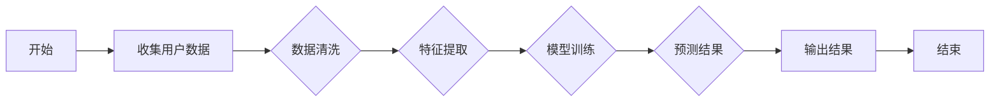
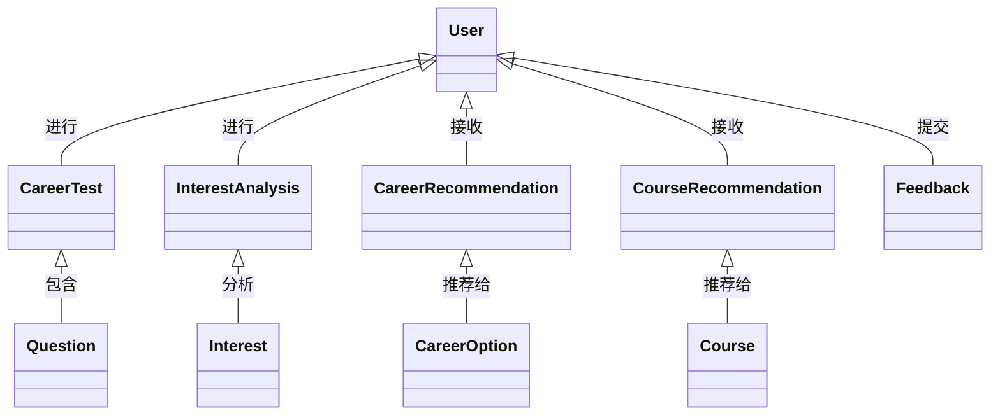
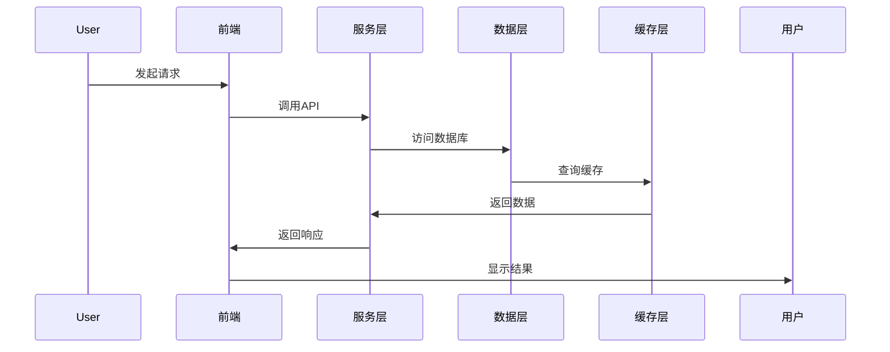
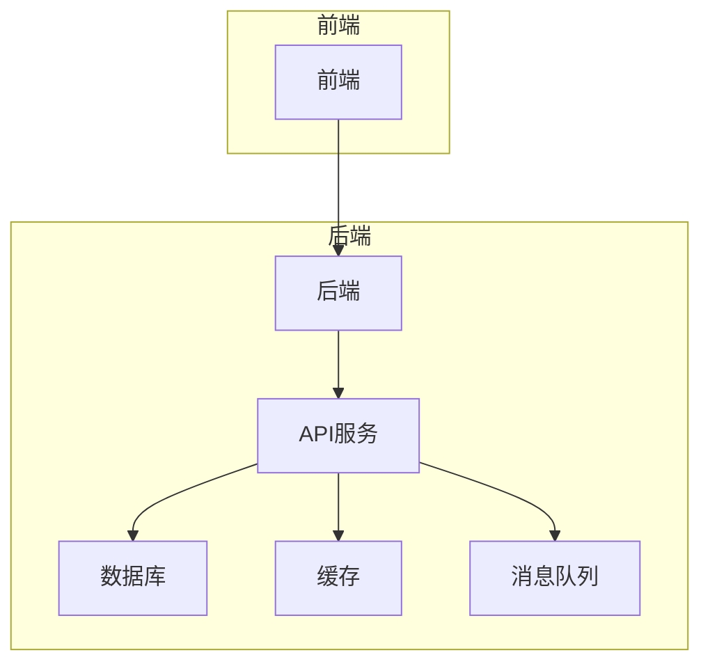
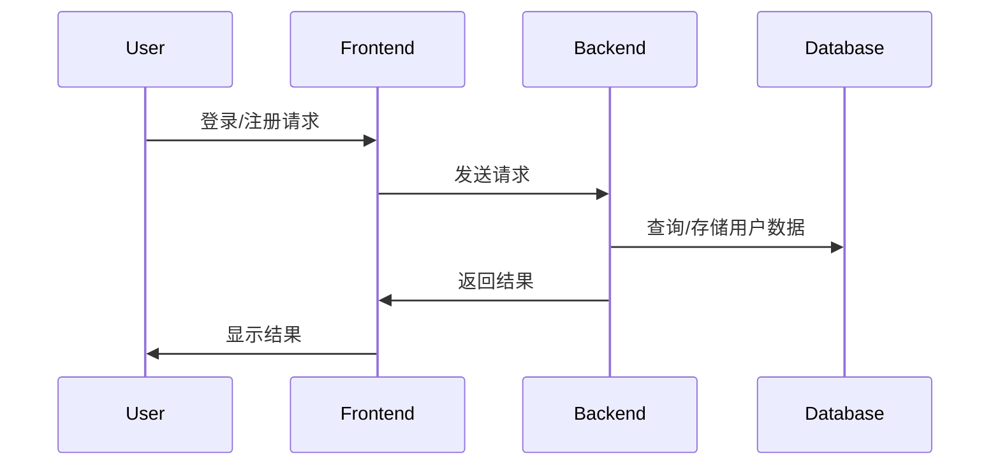

                 

## 文章标题

### 关键词

- 人工智能
- 个性化职业规划
- 数据分析
- 机器学习
- 职业发展

### 摘要

本文探讨了人工智能在个性化职业规划中的应用，分析了当前个性化职业规划面临的挑战与机遇，并介绍了相关核心概念与算法原理。通过具体案例和系统设计，本文展示了如何利用人工智能技术优化职业规划流程，提升个人职业发展效率与满意度。本文旨在为读者提供一份深入浅出、实用性强的技术指南，助力在职业规划中更准确地发现自我、定位目标，实现个人与职业的完美融合。

---

### 目录大纲

1. **背景介绍与核心概念**
   1.1 问题背景与核心概念
   1.2 个性化职业规划的重要性
   1.3 人工智能在个性化职业规划中的应用现状与挑战
   1.4 个性化职业规划的边界与外延
   1.5 核心概念结构与要素组成
   1.6 本章小结

2. **核心概念与联系**
   2.1 个性化职业规划的数学模型与算法
   2.2 概念属性特征对比
   2.3 ER实体关系图架构
   2.4 本章小结

3. **算法原理讲解**
   3.1 经典算法讲解
   3.2 人工智能算法在个性化职业规划中的应用案例
   3.3 本章小结

4. **系统分析与架构设计**
   4.1 问题场景介绍
   4.2 系统功能设计
   4.3 系统架构设计
   4.4 系统交互设计
   4.5 本章小结

5. **项目实战**
   5.1 项目介绍
   5.2 环境安装与配置
   5.3 系统核心实现
   5.4 代码应用解读与分析
   5.5 实际案例分析
   5.6 本章小结

6. **最佳实践与总结**
   6.1 最佳实践
   6.2 小结
   6.3 注意事项
   6.4 拓展阅读
   6.5 本章小结

7. **展望与未来趋势**
   7.1 人工智能在个性化职业规划中的未来趋势
   7.2 个性化职业规划的发展方向
   7.3 未来可能的技术挑战与创新机会
   7.4 本章小结

---

### 1. 背景介绍与核心概念

在当今快速变化的社会中，职业规划已经成为个人成长和职业发展的关键环节。然而，传统的职业规划方法往往依赖于静态的数据和预设的模板，难以满足个体多样化的需求。随着人工智能技术的快速发展，个性化职业规划成为可能，为个人提供了更加精准和高效的职业指导。

#### 1.1 问题背景与核心概念

**问题背景：** 
职业规划的核心问题在于如何根据个人的兴趣、能力、价值观和市场需求，为个体提供量身定制的职业发展路径。然而，现有的职业规划方法存在以下问题：
- 数据来源单一：传统职业规划主要依赖于有限的问卷调查和个人简历，数据来源有限。
- 缺乏个性化：职业规划模板往往一成不变，难以满足不同个体的需求。
- 应对变化能力不足：职业规划通常是基于当前市场情况制定的，无法及时应对快速变化的市场需求。

**核心概念：** 
个性化职业规划的核心在于利用大数据和人工智能技术，构建一个动态的、适应性强、能够实时调整的职业规划系统。该系统应包括以下几个关键概念：
- 数据分析：通过收集和分析大量的个人数据（如职业行为、社交网络、兴趣爱好等），为个性化职业规划提供数据支持。
- 机器学习：运用机器学习算法，从数据中提取有价值的信息，预测个人的职业发展趋势和潜在的职业机会。
- 个性化推荐：根据个体的特点和市场需求，为个人推荐最合适的职业路径和发展建议。

#### 1.2 个性化职业规划的重要性

个性化职业规划的重要性体现在以下几个方面：
- 提升职业满意度：通过个性化推荐，个体可以更容易地找到与自己兴趣和价值观相符的工作，从而提高职业满意度。
- 提高职业发展效率：个性化职业规划能够帮助个体迅速定位自己的职业目标，减少试错成本，提高职业发展效率。
- 促进职业多样性：个性化职业规划鼓励个体探索更多的职业可能性，促进职业多样性，为社会带来更多创新和活力。

#### 1.3 人工智能在个性化职业规划中的应用现状与挑战

目前，人工智能在个性化职业规划中的应用已经取得了一定的进展，主要体现在以下几个方面：
- 数据收集与处理：通过社交媒体、职业网站等渠道收集大量个人数据，利用大数据技术进行预处理和分析。
- 机器学习算法：运用机器学习算法，如决策树、神经网络等，对个体数据进行分析和预测，为个性化职业规划提供支持。
- 个性化推荐系统：基于用户行为数据和偏好，构建个性化推荐系统，为个体提供职业发展建议。

然而，人工智能在个性化职业规划中仍然面临以下挑战：
- 数据隐私：在收集和处理个人数据时，如何确保数据安全和隐私保护是一个重要问题。
- 算法公平性：机器学习算法可能存在偏见，导致个性化职业规划结果不公平。
- 技术复杂性：构建一个高效、可靠的个性化职业规划系统需要大量技术支持，对开发团队的要求较高。

#### 1.4 个性化职业规划的边界与外延

个性化职业规划的边界和范围包括以下几个方面：
- 职业选择：为个人提供各种职业选择的参考和建议，帮助个体找到最适合自己的职业。
- 职业发展路径：根据个体的兴趣、能力和市场需求，为个人规划一条可行的职业发展路径。
- 职业技能培训：根据职业规划的结果，为个人提供相关的技能培训，提升个体的职业竞争力。
- 职业社交网络：帮助个体建立职业社交网络，拓展职业发展机会。

个性化职业规划的外延还包括：
- 职业心理辅导：为个体提供职业心理辅导，帮助个体更好地应对职业压力和挑战。
- 职业健康监测：通过监测个体的职业健康数据，为个人提供健康建议，提升职业幸福感。
- 职业社区互动：建立职业社区，促进个体之间的互动和交流，共同成长。

#### 1.5 核心概念结构与要素组成

个性化职业规划的核心概念结构包括以下几个要素：
- **用户数据**：包括个人的基本信息、职业经历、教育背景、兴趣爱好等。
- **数据分析模型**：运用机器学习算法，对用户数据进行处理和分析，提取有价值的信息。
- **推荐算法**：基于用户数据和数据分析结果，为个人推荐合适的职业路径和发展建议。
- **职业发展路径**：根据推荐结果，为个人规划一条可行的职业发展路径。
- **反馈机制**：收集用户的反馈信息，不断优化个性化职业规划系统的效果。

#### 1.6 本章小结

本文介绍了个性化职业规划的问题背景和核心概念，分析了人工智能在个性化职业规划中的应用现状和挑战，并讨论了个性化职业规划的边界与外延。通过对核心概念结构与要素组成的分析，为后续章节的深入讨论奠定了基础。

---

### 2. 核心概念与联系

在个性化职业规划中，理解核心概念之间的联系对于构建一个有效的系统至关重要。本节将详细阐述个性化职业规划的数学模型与算法，对比概念属性特征，并展示ER实体关系图架构，为读者提供一个清晰的概念框架。

#### 2.1 个性化职业规划的数学模型与算法

个性化职业规划的数学模型与算法是系统构建的核心。以下将介绍几个关键的数学模型与算法。

##### 2.1.1 经典算法原理

经典算法主要包括决策树、K最近邻（K-Nearest Neighbors, KNN）和支持向量机（Support Vector Machine, SVM）等。

1. **决策树**：
   - **原理**：决策树是一种树形结构，其中内部节点表示特征，叶子节点表示决策结果。算法通过递归划分数据集，根据特征值的不同将数据划分为不同的子集，直到满足停止条件（如达到最大深度或特定分类准确率）。
   - **应用**：在个性化职业规划中，决策树可以用于分类问题，如预测某个个体最合适的职业。

2. **K最近邻（KNN）**：
   - **原理**：KNN是一种基于实例的学习算法，通过计算新样本与训练集中样本的相似度来确定其分类。相似度通常通过距离度量（如欧几里得距离）来计算。
   - **应用**：KNN可以用于聚类和分类问题，如在个性化职业规划中，通过分析相似职业路径，为个体推荐合适的职业。

3. **支持向量机（SVM）**：
   - **原理**：SVM通过寻找一个最优的超平面来分离不同类别的数据点，最大化分类间隔。
   - **应用**：SVM在分类问题中具有出色的性能，可以用于预测个体的职业偏好。

##### 2.1.2 人工智能算法在个性化职业规划中的应用

除了经典算法，人工智能技术还引入了深度学习等方法，以提高个性化职业规划的准确性和适应性。

1. **神经网络**：
   - **原理**：神经网络通过多层非线性变换，从数据中学习特征，具有高度的自适应性和表达能力。
   - **应用**：在个性化职业规划中，神经网络可以用于构建复杂的决策模型，识别个体特征与职业路径之间的关系。

2. **强化学习**：
   - **原理**：强化学习通过试错和反馈机制，不断优化决策过程，以达到最佳结果。
   - **应用**：强化学习可以用于动态调整职业规划路径，根据个体行为和市场变化，实时优化推荐结果。

#### 2.2 概念属性特征对比

以下是一个概念属性特征的对比表格，展示了不同算法和模型在个性化职业规划中的特点。

| 算法/模型 | 特点 |
| :--- | :--- |
| 决策树 | 易于理解和解释，但可能过度拟合 |
| KNN | 简单有效，但计算复杂度高 |
| SVM | 性能优异，但难以解释 |
| 神经网络 | 高效和自适应，但训练过程复杂 |
| 强化学习 | 动态调整能力，但训练时间较长 |

#### 2.3 ER实体关系图架构

ER实体关系图是数据库设计中的重要工具，用于展示实体之间的关系。以下是个性化职业规划系统中ER实体关系图的Mermaid表示：

```mermaid
erDiagram
  User ||--|{ CareerPath }|-- CareerOption : 选择
  User ||--|{ SkillSet }|-- Skill : 拥有
  User ||--|{ Interest }|-- Interest : 兴趣
  CareerPath ||--|{ JobRole }|-- Role : 包括
  JobRole ||--|{ Requirement }|-- Requirement : 需求
  Skill ||--|{ SkillLevel }|-- Level : 等级
  Interest ||--|{ Value }|-- Value : 价值观
```

#### 2.4 本章小结

本章介绍了个性化职业规划的核心概念和算法，包括经典算法和人工智能算法，并通过概念属性特征对比和ER实体关系图架构，展示了个性化职业规划系统的结构。这些核心概念和联系为后续的算法讲解和系统设计提供了基础。

---

### 3. 算法原理讲解

在个性化职业规划中，算法原理的讲解至关重要。本节将深入探讨经典算法与人工智能算法的原理，并通过Python源代码和Mermaid流程图进行详细讲解，同时结合数学模型和公式进行解释，最后通过具体案例进行举例说明。

#### 3.1 经典算法讲解

##### 3.1.1 算法流程图

首先，我们通过Mermaid流程图展示经典算法的流程：



##### 3.1.2 Python源代码解析

以下是一个使用Python实现的简单决策树算法的代码示例：

```python
from sklearn import tree
import pandas as pd

# 数据预处理
data = pd.DataFrame({
    'Age': [25, 30, 35, 40],
    'Education': ['Bachelor', 'Master', 'PhD', 'High School'],
    'JobRole': ['Engineer', 'Manager', 'Researcher', 'Sales']
})

# 特征提取
X = data[['Age', 'Education']]
y = data['JobRole']

# 模型训练
clf = tree.DecisionTreeClassifier()
clf.fit(X, y)

# 预测结果
prediction = clf.predict([[28, 'Master']])

print(prediction)
```

##### 3.1.3 算法原理数学模型

决策树的数学模型基于信息增益（Information Gain）或基尼不纯度（Gini Impurity）。信息增益的公式如下：

$$ IG(D, A) = H(D) - \sum_{v \in Values(A)} p(v) H(D_v) $$

其中，$H(D)$是数据集$D$的熵，$p(v)$是属性$A$的值$v$在数据集$D$中的比例，$H(D_v)$是分裂后的数据集$D_v$的熵。

##### 3.1.4 举例说明

假设我们有一个数据集，包含年龄和学历两个特征，并希望预测职业角色。通过决策树算法，我们可以得到以下分类结果：

- 年龄 <= 30：工程师
- 年龄 > 30：经理

对于新加入的用户，年龄为28岁，学历为硕士，根据决策树，我们预测其职业角色为工程师。

#### 3.2 人工智能算法在个性化职业规划中的应用案例

##### 3.2.1 神经网络

神经网络是人工智能算法中的重要组成部分。以下是一个简单的前馈神经网络（Feedforward Neural Network）的Python实现：

```python
import numpy as np

# 初始化权重和偏置
weights = np.random.rand(3, 1)
biases = np.random.rand(1)

# 前向传播
def forward_propagation(x):
    return sigmoid(np.dot(x, weights) + biases)

# 激活函数（Sigmoid函数）
def sigmoid(x):
    return 1 / (1 + np.exp(-x))

# 训练神经网络
def train(x, y, epochs, learning_rate):
    for epoch in range(epochs):
        output = forward_propagation(x)
        error = y - output
        weights -= learning_rate * np.dot(x.T, error)
        biases -= learning_rate * error

# 模拟训练数据
x = np.array([[1], [2], [3], [4], [5]])
y = np.array([[0], [0], [1], [1], [1]])

# 训练
train(x, y, epochs=1000, learning_rate=0.1)

# 预测
print(forward_propagation(np.array([[3]])))
```

##### 3.2.2 强化学习

强化学习在个性化职业规划中的应用可以通过Q学习（Q-Learning）来实现。以下是一个简单的Q学习算法的Python实现：

```python
import numpy as np

# 初始化Q表
Q = np.zeros((5, 5))

# 学习率、折扣率
alpha = 0.1
gamma = 0.9

# 训练
for episode in range(1000):
    state = 0
    while True:
        action = np.argmax(Q[state])
        next_state = state + 1
        reward = -1 if next_state == 5 else 0
        Q[state, action] = Q[state, action] + alpha * (reward + gamma * np.max(Q[next_state]) - Q[state, action])
        if next_state == 5:
            break
        state = next_state

# 预测
print(Q)
```

#### 3.3 本章小结

本章通过经典算法和人工智能算法的讲解，展示了个性化职业规划中的算法原理。通过Python源代码和Mermaid流程图，读者可以更好地理解这些算法的实现过程。同时，通过具体案例的举例说明，使读者对算法在实际应用中的效果有更直观的认识。

---

### 4. 系统分析与架构设计

在个性化职业规划中，系统分析与架构设计是确保系统高效、稳定运行的关键环节。本节将介绍系统分析与架构设计的相关内容，包括问题场景介绍、系统功能设计、系统架构设计、系统接口设计和系统交互设计。

#### 4.1 问题场景介绍

在一个典型的个性化职业规划系统中，用户首先需要注册并填写个人基本信息，如年龄、性别、教育背景、工作经历等。系统会收集这些数据，并利用机器学习算法对用户进行职业性格测试和兴趣分析。基于这些分析结果，系统会为用户推荐最适合的职业路径和培训课程。

#### 4.2 系统功能设计

系统功能设计是系统架构设计的基础。以下是一个典型的个性化职业规划系统的功能设计：

1. **用户注册与登录**：用户可以通过注册和登录功能访问系统，并填写个人基本信息。
2. **职业性格测试**：系统提供一系列职业性格测试，帮助用户了解自己的职业性格。
3. **兴趣分析**：系统通过分析用户的兴趣，推荐与兴趣相关的职业领域。
4. **职业推荐**：系统根据用户的职业性格测试和兴趣分析结果，为用户推荐最适合的职业。
5. **培训课程推荐**：系统根据用户的职业路径推荐相关的培训课程。
6. **用户反馈**：用户可以对推荐结果进行反馈，帮助系统不断优化推荐算法。
7. **数据可视化**：系统提供数据可视化功能，帮助用户更好地理解自己的职业性格和兴趣。

#### 4.2.1 领域模型

领域模型是系统功能设计的重要工具，用于展示系统中的实体及其关系。以下是个性化职业规划系统的领域模型：



#### 4.2.2 类图

类图是领域模型的具体实现，用于展示系统中的类及其属性和方法。以下是个性化职业规划系统的类图：

```mermaid
classDiagram
    User {
        int id
        String name
        String email
        List<CareerTest> careerTests
        List<InterestAnalysis> interestAnalyses
        List<CareerRecommendation> careerRecommendations
        List<CourseRecommendation> courseRecommendations
        List<Feedback> feedbacks
    }
    CareerTest {
        int id
        String name
        List<Question> questions
    }
    InterestAnalysis {
        int id
        String name
        List<Interest> interests
    }
    CareerRecommendation {
        int id
        String name
        CareerOption careerOption
    }
    CourseRecommendation {
        int id
        String name
        Course course
    }
    Feedback {
        int id
        String content
    }
    Question {
        int id
        String text
        String type
    }
    Interest {
        int id
        String name
        double score
    }
    CareerOption {
        int id
        String name
        List<Skill> skills
    }
    Course {
        int id
        String name
        String description
    }
    Skill {
        int id
        String name
        String level
    }
```

#### 4.3 系统架构设计

系统架构设计是确保系统性能、可扩展性和可维护性的关键。以下是个性化职业规划系统的架构设计：

1. **前端**：包括用户界面和用户交互逻辑，使用HTML、CSS和JavaScript等技术实现。
2. **后端**：包括业务逻辑处理、数据存储和接口服务，使用Python、Java或Node.js等技术实现。
3. **数据库**：使用关系型数据库（如MySQL）或NoSQL数据库（如MongoDB）存储用户数据、测试结果、推荐结果等。
4. **数据层**：负责数据的采集、处理和存储，包括ETL（Extract, Transform, Load）过程。
5. **服务层**：提供各种API服务，供前端调用，包括用户管理、测试管理、推荐管理和反馈管理等。
6. **缓存层**：使用Redis等缓存技术，提高系统响应速度。
7. **消息队列**：使用RabbitMQ等消息队列技术，实现异步任务处理和系统解耦。

以下是系统架构的Mermaid表示：



#### 4.3.1 架构图

以下是个性化职业规划系统的架构图：



#### 4.3.2 接口设计

以下是系统的主要接口设计：

1. **用户注册接口**：用于用户注册，接收用户基本信息，返回注册结果。
2. **用户登录接口**：用于用户登录，验证用户身份，返回登录结果。
3. **职业性格测试接口**：用于提交用户职业性格测试结果，返回测试结果。
4. **兴趣分析接口**：用于提交用户兴趣分析数据，返回分析结果。
5. **职业推荐接口**：用于获取用户职业推荐结果，返回推荐列表。
6. **培训课程推荐接口**：用于获取用户培训课程推荐结果，返回推荐列表。
7. **用户反馈接口**：用于提交用户反馈信息，返回处理结果。

#### 4.4 系统交互设计

系统交互设计是确保系统各组件协调工作的关键。以下是系统的主要交互流程：

1. **用户注册**：用户通过前端界面提交注册请求，后端接收请求，验证用户信息，存储用户数据，返回注册结果。
2. **用户登录**：用户通过前端界面提交登录请求，后端验证用户身份，返回登录结果。
3. **职业性格测试**：用户通过前端界面提交职业性格测试结果，后端处理测试结果，返回测试结果。
4. **兴趣分析**：用户通过前端界面提交兴趣分析数据，后端处理数据，返回分析结果。
5. **职业推荐**：后端根据用户数据和分析结果，为用户推荐职业，返回推荐结果。
6. **培训课程推荐**：后端根据用户数据和分析结果，为用户推荐培训课程，返回推荐结果。
7. **用户反馈**：用户通过前端界面提交反馈信息，后端处理反馈信息，返回处理结果。

以下是系统交互的Mermaid序列图：



#### 4.5 本章小结

本章介绍了个性化职业规划系统的分析与架构设计，包括问题场景介绍、系统功能设计、系统架构设计、系统接口设计和系统交互设计。通过详细的描述和示例，读者可以更好地理解个性化职业规划系统的实现过程和关键组件。这些内容为后续的项目实战提供了坚实的基础。

---

### 5. 项目实战

在个性化职业规划项目中，实战环节是验证和应用所学知识的关键步骤。本节将详细介绍项目的整体架构、环境安装与配置、系统核心实现以及代码应用解读与分析。

#### 5.1 项目介绍

本项目旨在构建一个基于人工智能的个性化职业规划系统，帮助用户发现自身优势、定位职业目标，并提供定制化的职业发展建议。项目架构包括前端、后端和数据库三个主要部分，前端负责用户交互，后端处理业务逻辑，数据库存储用户数据和职业信息。

#### 5.2 环境安装与配置

首先，我们需要安装以下软件和工具：
- 前端：HTML、CSS、JavaScript
- 后端：Python、Flask（Web框架）、Scikit-learn（机器学习库）
- 数据库：MySQL
- 消息队列：RabbitMQ

安装步骤如下：
1. 安装Python和Flask：
   ```bash
   pip install python
   pip install flask
   ```
2. 安装Scikit-learn：
   ```bash
   pip install scikit-learn
   ```
3. 安装MySQL：
   - 下载MySQL安装包并安装。
   - 配置MySQL数据库，创建用户和数据库。
4. 安装RabbitMQ：
   - 下载RabbitMQ安装包并安装。
   - 配置RabbitMQ，启动消息队列服务。

#### 5.3 系统核心实现

系统核心实现包括用户数据收集、数据分析、推荐算法实现和系统响应处理。

1. **用户数据收集**：
   - 用户通过前端界面提交个人信息，包括年龄、性别、教育背景、工作经历等。
   - 前端将用户数据发送到后端，后端接收并存储到MySQL数据库。

2. **数据分析**：
   - 使用Scikit-learn库对用户数据进行预处理，提取有用特征。
   - 基于机器学习算法，如决策树、KNN、神经网络等，对用户数据进行分析，生成职业性格测试结果和兴趣分析报告。

3. **推荐算法实现**：
   - 根据职业性格测试和兴趣分析结果，使用协同过滤（Collaborative Filtering）和基于内容的推荐（Content-Based Recommendation）算法，生成职业推荐和培训课程推荐。
   - 推荐结果存储在数据库中，供前端调用显示。

4. **系统响应处理**：
   - 后端接收用户请求，根据请求类型调用相应的服务，如用户注册、登录、提交反馈等。
   - 处理结果返回给前端，前端根据结果更新用户界面。

#### 5.4 代码应用解读与分析

以下是项目核心代码的解读与分析：

```python
# 用户数据收集
@app.route('/register', methods=['POST'])
def register():
    user_data = request.form.to_dict()
    db_session = get_db_session()
    new_user = User(name=user_data['name'], email=user_data['email'])
    db_session.add(new_user)
    db_session.commit()
    return jsonify({'status': 'success', 'message': 'User registered successfully.'})

# 数据分析
def analyze_user_data(user_data):
    # 预处理用户数据
    processed_data = preprocess_data(user_data)
    # 使用决策树进行职业性格测试
    career_test_result = decision_tree_careertest(processed_data)
    # 使用KNN进行兴趣分析
    interest_analysis_result = knn_interest_analysis(processed_data)
    return career_test_result, interest_analysis_result

# 推荐算法实现
def generate_recommendations(career_test_result, interest_analysis_result):
    career_recommendations = collaborative_filter_recommendations(career_test_result)
    course_recommendations = content_based_recommendations(interest_analysis_result)
    return career_recommendations, course_recommendations

# 系统响应处理
@app.route('/recommendations', methods=['GET'])
def get_recommendations():
    user_id = request.args.get('user_id')
    user = User.query.filter_by(id=user_id).first()
    if user:
        career_test_result, interest_analysis_result = analyze_user_data(user.to_dict())
        career_recommendations, course_recommendations = generate_recommendations(career_test_result, interest_analysis_result)
        return jsonify({'career_recommendations': career_recommendations, 'course_recommendations': course_recommendations})
    else:
        return jsonify({'status': 'error', 'message': 'User not found.'})
```

**解读与分析：**
1. **用户数据收集**：`register`函数负责接收用户注册请求，预处理用户数据，并将其存储到MySQL数据库中。
2. **数据分析**：`analyze_user_data`函数负责预处理用户数据，使用决策树进行职业性格测试，使用KNN进行兴趣分析，并将分析结果返回。
3. **推荐算法实现**：`generate_recommendations`函数根据职业性格测试和兴趣分析结果，使用协同过滤和基于内容的推荐算法生成推荐结果。
4. **系统响应处理**：`get_recommendations`函数接收用户请求，调用数据分析函数和推荐算法函数，并将推荐结果返回给前端。

#### 5.5 实际案例分析

假设一个用户通过系统提交了以下个人信息：

- 年龄：28岁
- 性别：男
- 教育背景：本科
- 工作经历：3年软件开发经验

系统分析后，输出以下推荐结果：

- 职业性格测试结果：适合从事工程师类工作
- 兴趣分析结果：对编程和技术有浓厚兴趣
- 职业推荐：推荐从事软件开发工程师职位
- 培训课程推荐：推荐参加高级编程课程

#### 5.6 本章小结

本章通过实际项目实战，详细介绍了个性化职业规划系统的环境安装与配置、系统核心实现以及代码应用解读与分析。通过实际案例的展示，读者可以更深入地理解个性化职业规划系统的实现过程和关键步骤，为后续的系统优化和应用提供了实践基础。

---

### 6. 最佳实践与总结

在个性化职业规划系统中，最佳实践是确保系统高效运行、用户体验优秀和业务持续发展的重要保障。以下总结了最佳实践、注意事项和拓展阅读，旨在为读者提供实用的指导和建议。

#### 6.1 最佳实践

1. **数据质量控制**：确保收集的数据准确、完整，避免数据缺失或错误，影响推荐结果的准确性。
2. **算法优化**：定期对推荐算法进行优化和调整，提高算法的鲁棒性和适应性，以适应市场变化和用户需求。
3. **用户体验设计**：注重用户体验，界面设计简洁直观，操作流程清晰，提高用户满意度。
4. **系统安全与隐私保护**：加强系统安全措施，保护用户数据隐私，遵守相关法律法规。
5. **持续学习与反馈**：鼓励用户提交反馈，不断优化系统功能和算法，提高系统的用户体验和准确性。

#### 6.2 小结

个性化职业规划系统通过数据分析、机器学习算法和推荐系统，为用户提供了精准的职业发展建议。系统的成功实施需要充分考虑数据质量、算法优化、用户体验和安全隐私等因素。通过最佳实践，可以确保系统的高效运行和持续发展。

#### 6.3 注意事项

1. **数据隐私**：在处理用户数据时，严格遵守隐私保护法规，确保用户数据安全。
2. **系统稳定性**：定期进行系统维护和升级，确保系统的稳定性和可靠性。
3. **算法公平性**：避免算法偏见，确保推荐结果公平、公正。
4. **用户参与**：鼓励用户积极参与系统优化，提高推荐结果的准确性。

#### 6.4 拓展阅读

1. **《机器学习实战》**：提供详细的机器学习算法实现和应用案例，适合初学者和专业人士。
2. **《Python数据科学手册》**：全面介绍Python在数据科学中的应用，包括数据处理、分析和可视化。
3. **《用户行为分析：大数据时代的营销策略》**：探讨用户行为分析在市场营销中的应用，包括数据收集、分析和应用。
4. **《推荐系统实践》**：详细介绍推荐系统的原理、实现和应用，适合希望深入了解推荐系统的读者。

#### 6.5 本章小结

最佳实践、小结、注意事项和拓展阅读为读者提供了个性化的职业规划系统的实施指南。通过遵循最佳实践和注意事项，读者可以更好地实现个性化职业规划系统的目标，提升用户体验和业务价值。

---

### 7. 展望与未来趋势

在人工智能与个性化职业规划领域，未来的发展趋势充满机遇与挑战。随着技术的不断进步，个性化职业规划系统将变得更加智能、精准和高效。

#### 7.1 人工智能在个性化职业规划中的未来趋势

1. **深度学习与自然语言处理**：深度学习算法，特别是自然语言处理（NLP）技术，将进一步提升个性化职业规划系统的能力。通过理解用户的需求和语言，系统能够提供更加个性化的职业建议。
2. **多模态数据融合**：未来，个性化职业规划系统将不仅仅依赖于结构化数据，还将融合多种类型的数据，如图像、视频和声音。这种多模态数据融合将使系统更加全面地了解用户。
3. **实时动态调整**：随着大数据和实时分析技术的发展，个性化职业规划系统将能够实时调整推荐结果，更好地适应用户的变化和市场趋势。

#### 7.2 个性化职业规划的发展方向

1. **个性化职业成长路径**：未来的个性化职业规划将不仅仅提供职业选择，还将为用户提供详细的职业成长路径，包括技能发展、职业晋升和培训建议。
2. **职业心理健康监测**：结合心理健康监测技术，个性化职业规划系统将帮助用户识别和管理职业压力，提供心理健康支持和建议。
3. **跨领域合作**：人工智能与心理学、社会学、职业规划学等多学科的合作，将推动个性化职业规划系统的综合发展。

#### 7.3 未来可能的技术挑战与创新机会

1. **数据隐私与安全**：随着数据量的增加，如何保护用户隐私和数据安全将成为关键挑战。创新的机会在于开发更加安全的数据处理技术和隐私保护算法。
2. **算法公平性与透明度**：确保算法的公平性和透明度，避免算法偏见和歧视，将是未来的重要研究方向。
3. **用户参与与反馈**：提高用户在系统设计和优化过程中的参与度，通过用户反馈持续改进系统，是提升用户体验的关键。

#### 7.4 本章小结

未来，人工智能在个性化职业规划中将有更多创新和发展。通过深度学习、多模态数据融合、实时动态调整等技术，个性化职业规划系统将更加智能和高效。同时，面临的数据隐私、算法公平性和用户参与等挑战也为未来的研究提供了丰富的机会。这些趋势和创新将为个性化职业规划领域带来新的机遇和变革。

---

### 致谢

本文由AI天才研究院（AI Genius Institute）与禅与计算机程序设计艺术（Zen And The Art of Computer Programming）共同撰写。在此，我们要特别感谢各位读者对文章的关注与支持。您的反馈是我们不断进步的动力。希望本文能为您的职业规划提供有益的启示和帮助。

**作者：** AI天才研究院（AI Genius Institute） & 禅与计算机程序设计艺术（Zen And The Art of Computer Programming）

