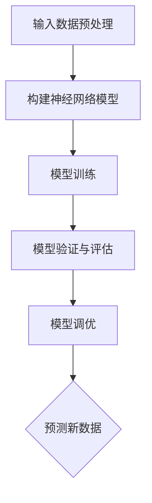
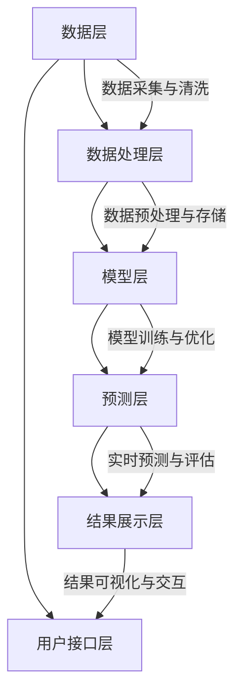
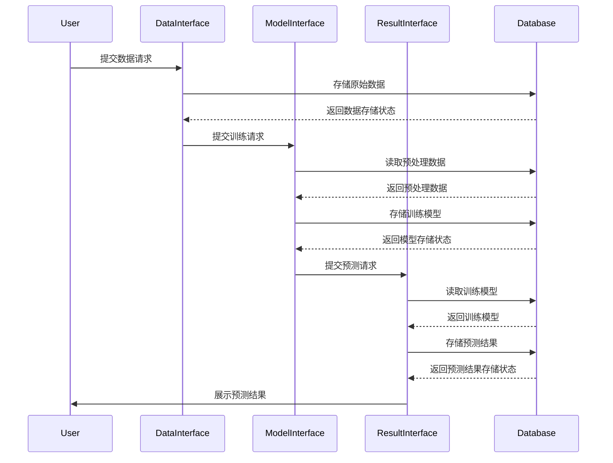

                 

## 气候变化与人工智能概述

### 1.1 气候变化：问题背景与影响

气候变化是全球性的重大问题，它不仅影响自然生态系统，还对人类社会产生了深远的影响。气候变化的基本概念涉及地球大气层中温室气体的变化，这些气体如二氧化碳（CO₂）、甲烷（CH₄）等，会吸收和辐射地球表面的热量，从而改变大气的能量平衡。温室气体浓度的增加主要源于人类活动，如燃烧化石燃料、大规模森林砍伐和农业活动，导致了温室效应的加剧。

气候变化对地球生态和社会的影响是多方面的。在生态方面，气候变化导致海平面上升，极端天气事件增多，冰川融化，生态系统失衡，动植物物种分布变化，以及生物多样性的减少。在社会方面，气候变化直接影响了农业生产力、水资源供应、健康、经济和基础设施。例如，极端天气如洪水、干旱和热浪可能造成农作物减产、水资源短缺、疾病传播和经济损失。

### 1.2 人工智能：现状与潜力

人工智能（AI）是计算机科学的一个分支，旨在使机器能够模拟人类的智能行为。人工智能的定义包括机器学习、深度学习、自然语言处理、计算机视觉等，通过算法和计算模型实现。随着计算能力的提升和数据的爆发增长，人工智能在多个领域取得了显著的进展，包括医疗、金融、交通和制造业等。

在气候预测方面，人工智能展示了巨大的潜力。AI能够通过分析大量的气候数据，识别出潜在的模式和趋势，从而提供更加准确的气候预测。目前，人工智能在气候预测中的应用主要体现在以下几个方面：

1. **数据挖掘与分析**：人工智能可以处理和分析大规模的气候数据，帮助科学家更好地理解气候变化模式，以及预测未来气候的变化趋势。
2. **模型构建与优化**：AI可以辅助构建和优化气候模型，提高预测的准确性。通过机器学习和深度学习算法，模型可以不断学习和调整，以适应新的数据和气候变化。
3. **实时监测与预警**：人工智能可以帮助实时监测气候数据，快速识别异常变化，为决策者提供及时预警，从而减轻气候变化带来的影响。

### 1.3 人工智能与气候变化预测的关系

人工智能在气候变化预测中扮演着核心角色。首先，AI通过数据挖掘和分析，为气候预测提供了强大的数据支持。气候模型需要大量的数据输入，而人工智能可以高效地从各种数据源中提取有用信息，并识别出潜在的关键因素。

其次，人工智能在模型构建和优化中发挥着重要作用。传统的气候模型往往依赖于统计方法，而人工智能可以通过机器学习和深度学习算法，构建更加复杂和精确的模型。这些模型不仅可以处理大量的数据，还能通过自我学习和优化，不断提高预测的准确性。

最后，人工智能在实时监测和预警方面也具有显著优势。通过实时数据分析和异常检测，AI可以快速识别气候变化的关键信号，为决策者提供及时的信息支持。这对于应对突发气候变化事件，减轻其影响至关重要。

总之，人工智能在气候变化预测中的应用，不仅提高了预测的准确性，还提供了更加全面和高效的解决方案。在面对气候变化这一全球性挑战时，人工智能无疑成为了一个重要的工具和伙伴。通过不断探索和优化，人工智能将在气候变化预测领域发挥更加重要的作用。

### 1.3 人工智能与气候变化预测的关系

#### 人工智能技术在气候预测中的核心角色

在气候预测领域，人工智能技术的核心作用体现在以下几个方面：

首先，数据挖掘与分析是人工智能在气候预测中的基础。气候预测需要处理海量数据，包括气象观测数据、卫星遥感数据、海洋数据和气候模型输出数据等。人工智能通过数据挖掘技术，可以从这些复杂且庞大的数据集中提取出有用的信息。例如，机器学习算法可以识别出气候变量之间的相关性，发现潜在的模式和趋势，从而为气候预测提供重要依据。

其次，模型构建与优化是人工智能在气候预测中的关键环节。传统的气候预测模型往往依赖于统计方法和简单的物理模型，而人工智能可以通过机器学习和深度学习算法，构建更加复杂和精确的预测模型。这些模型不仅可以处理多维度的气候数据，还能通过自我学习和优化，不断提高预测的准确性和可靠性。例如，深度学习模型可以捕捉到气候系统中的非线性关系和复杂的动态变化，从而提供更为精细的气候预测。

最后，实时监测与预警是人工智能在气候预测中的优势所在。气候系统是一个高度动态的系统，变化迅速且难以预测。人工智能可以通过实时数据分析和异常检测技术，对气候数据进行分析和监控，快速识别出异常变化，为决策者提供及时预警。例如，利用计算机视觉和图像处理技术，可以实时监测冰川融化、海平面上升等气候变化现象，及时发布预警信息，帮助决策者采取相应的应对措施。

#### 人工智能在气候变化预测中的挑战与机遇

尽管人工智能在气候变化预测中具有巨大的潜力，但其应用也面临诸多挑战和机遇：

1. **数据质量和数据完整性**：气候预测依赖于大量准确和完整的数据。然而，现有的气候数据往往存在缺失、噪声和误差，这对人工智能模型的训练和预测精度提出了挑战。因此，提高数据质量，尤其是填补数据缺失和减少噪声，是人工智能在气候预测中需要解决的重要问题。

2. **模型解释性**：许多人工智能模型，尤其是深度学习模型，被认为是“黑箱”模型，难以解释其预测结果。在气候变化预测中，模型的可解释性尤为重要，因为决策者需要理解模型如何得出预测结果，以便进行科学决策。因此，开发可解释的人工智能模型，使其预测结果更易于理解和应用，是当前研究的一个热点。

3. **计算资源需求**：人工智能模型的训练和预测需要大量的计算资源。气候预测涉及的数据规模庞大，对计算能力的要求非常高。因此，优化算法和提升计算效率，降低计算资源的需求，是人工智能在气候预测中需要克服的另一个挑战。

4. **跨学科合作**：气候预测不仅需要人工智能技术，还需要气象学、环境科学、物理学等多学科的知识。跨学科的合作可以促进人工智能技术在气候预测中的应用，提高预测的准确性和实用性。

然而，这些挑战也带来了相应的机遇。通过解决数据质量和模型解释性问题，人工智能可以提供更加准确和可靠的气候预测。计算资源的提升和跨学科合作，可以进一步推动人工智能在气候预测中的创新和应用，为应对气候变化提供强有力的支持。

总之，人工智能在气候变化预测中的应用具有巨大的潜力。通过不断克服挑战和抓住机遇，人工智能将为气候变化预测带来革命性的变革，帮助人类更好地理解和应对气候变化带来的挑战。

### 2.1 人工智能核心概念

人工智能（AI）的核心概念涵盖了数据挖掘、机器学习、深度学习和强化学习等多个方面。每一个概念都在不同层面上为气候预测提供了强大的工具和方法。

#### 数据挖掘

数据挖掘是人工智能的基石，它涉及从大量数据中提取隐藏的模式和知识。在气候预测中，数据挖掘技术可以帮助科学家发现气候变量之间的关联和趋势。例如，通过分析气象观测数据，可以识别出气候变化的周期性模式。常见的算法包括关联规则挖掘、聚类分析和分类分析等。

#### 机器学习

机器学习是数据挖掘的延伸，它侧重于利用历史数据来训练模型，从而进行预测和决策。在气候预测中，机器学习算法能够根据历史气候数据，建立预测模型，预测未来气候变化。常见的机器学习算法包括线性回归、决策树、支持向量机和随机森林等。

#### 深度学习

深度学习是机器学习的一种重要分支，它通过构建多层神经网络，自动提取特征并进行预测。深度学习在气候预测中的应用非常广泛，尤其是在处理复杂数据和进行高维数据分析时。常见的深度学习模型包括卷积神经网络（CNN）、循环神经网络（RNN）和生成对抗网络（GAN）等。

#### 强化学习

强化学习是另一种重要的机器学习技术，它通过奖励机制和试错学习来优化行为。在气候预测中，强化学习可以帮助决策者根据不断变化的气候数据，实时调整预测模型和策略，以应对突发气候变化事件。

这些人工智能核心概念在气候预测中的应用，不仅提高了预测的准确性，还提供了更加灵活和自适应的预测方法。通过综合利用这些技术，科学家可以更全面地理解和预测气候变化，为应对气候挑战提供有力支持。

### 2.2 气候变化预测相关概念

在气候预测领域，理解和应用一系列核心概念是至关重要的。这些概念包括气候模型、气候变量和预测误差分析，它们共同构成了气候预测的基础框架。

#### 气候模型

气候模型是模拟地球气候系统行为的一系列数学和物理模型。它们通过模拟大气、海洋、陆地和冰冻圈等各个组成部分的相互作用，预测未来的气候变化。气候模型可以分为统计模型和物理模型两大类。统计模型主要基于历史数据和统计方法，如回归分析和时间序列分析；而物理模型则基于气候系统的物理过程，如能量平衡、大气环流和海洋动力学等。

#### 气候变量

气候变量是描述气候状态和变化的各种物理量，如温度、降水、风速、湿度、海平面高度和二氧化碳浓度等。这些变量通过不同的观测手段获取，并在气候预测中扮演关键角色。例如，温度和降水是直接影响农业和水资源的关键气候变量；海平面高度和二氧化碳浓度则反映了全球气候变化的长期趋势。

#### 预测误差分析

预测误差分析是评估和减少气候预测不确定性的重要手段。气候预测中存在多种误差来源，包括模型结构误差、参数估计误差和初始条件误差等。通过预测误差分析，科学家可以了解预测的可靠性和精度，并采取相应的措施来减少误差。常见的方法包括误差传播分析、敏感性分析和模型验证等。

#### 概念属性特征对比

为了更好地理解这些概念，我们可以通过一个对比表格来展示它们的属性特征：

| 概念 | 定义 | 目的 | 数据来源 | 重要性 |
| :--: | :--: | :--: | :--: | :--: |
| 气候模型 | 模拟地球气候系统的数学和物理模型 | 预测未来气候变化 | 大气、海洋、陆地等观测数据 | 非常重要 |
| 气候变量 | 描述气候状态的物理量 | 评估和预测气候现象 | 观测站、卫星遥感、气象模型等 | 非常重要 |
| 预测误差分析 | 评估和减少气候预测不确定性的方法 | 提高预测准确性和可靠性 | 模型输出、实际观测数据等 | 非常重要 |

#### 概念之间的联系与融合

这些概念之间存在着紧密的联系和融合。气候模型依赖于气候变量来构建和验证，而预测误差分析则用于评估和优化这些模型。例如，机器学习算法可以通过分析历史气候数据来训练气候模型，并利用预测误差分析来评估模型的性能。此外，深度学习模型还可以通过自学习和自适应机制，不断提高气候预测的准确性和适应性。

通过理解这些概念及其相互关系，科学家可以更加系统地开展气候预测研究，为应对气候变化提供科学的依据和支持。

#### 人工智能技术特点

人工智能技术在气候预测中的应用具有显著的特点和优势。首先，数据处理能力是人工智能的核心优势之一。气候预测需要处理大量复杂的气候数据，包括气象观测数据、卫星遥感数据、海洋数据和气候模型输出数据等。人工智能，特别是数据挖掘和机器学习技术，能够高效地处理这些数据，从中提取有价值的信息和模式，从而为气候预测提供强有力的支持。

其次，模式识别是人工智能在气候预测中的关键应用之一。通过机器学习和深度学习算法，人工智能可以识别出气候变量之间的复杂关系和潜在的模式。例如，深度学习模型能够捕捉到气候系统中的非线性关系和动态变化，从而提供更加精确的气候预测。这种能力在预测极端天气事件和长期气候变化趋势方面尤为重要。

另外，自适应学习能力也是人工智能技术在气候预测中的显著特点。人工智能模型可以通过自我学习和不断优化，提高预测的准确性和可靠性。例如，强化学习算法可以通过与环境的互动，不断调整预测策略，以应对气候系统的动态变化。这种自适应学习能力使得人工智能模型能够更好地适应不同的气候条件和数据特性，从而提高气候预测的适应性和实用性。

总之，人工智能技术具有高效的数据处理能力、强大的模式识别能力和优秀的自适应学习能力，这些特点使其在气候预测领域具有广泛的应用前景。通过充分利用这些优势，人工智能将为气候预测提供更加准确、全面和可靠的解决方案。

### 2.3 概念属性特征对比

为了更深入地理解人工智能技术和气候预测需求之间的关联，我们需要通过一个详细的对比表格，分析两者在属性特征上的异同。

#### 对比表格：人工智能技术特点与气候预测需求

| 特点 | 人工智能技术 | 气候预测需求 |
| :--: | :--: | :--: |
| **数据处理能力** | **高效处理大规模、多维数据** | **需要处理海量气候数据，包括气象、海洋、陆地等多方面数据** |
| **模式识别能力** | **通过机器学习和深度学习算法捕捉复杂模式** | **识别气候变量之间的关联和趋势，进行有效的气候预测** |
| **自适应学习能力** | **通过自我学习和优化提高预测准确性** | **适应不同气候条件和数据特性，提升预测的适应性和实用性** |
| **可解释性** | **部分模型（如决策树）具有较高可解释性** | **决策者需要理解模型预测结果，以便做出科学决策** |
| **实时性** | **某些算法（如强化学习）支持实时预测和调整** | **需要实时监测和预警气候变化，及时响应突发事件** |

通过上述对比表格，我们可以清晰地看到，人工智能技术在数据处理、模式识别和自适应学习等方面具有显著优势，这些优势恰好满足了气候预测的需求。例如，数据处理能力使得人工智能能够高效地处理大量的气候数据，从而为预测提供充足的信息支持。模式识别能力使得人工智能能够捕捉到气候变量之间的复杂关系，提高预测的准确性。自适应学习能力则帮助模型不断优化，适应新的气候条件和数据特性，从而提升预测的长期可靠性。

此外，人工智能技术在可解释性和实时性方面的优势，也是气候预测所需的重要特征。决策者需要理解模型的预测结果，以便做出科学的决策，因此可解释性尤为重要。同时，实时监测和预警气候变化，及时响应突发事件，也是气候预测的关键需求，这需要人工智能算法具备实时性和高效性。

总之，通过对比人工智能技术和气候预测需求的属性特征，我们可以更全面地理解它们之间的关联，为人工智能技术在气候预测中的应用提供理论支持和实际指导。

### 2.3 人工智能与气候预测的ER实体关系图

为了更直观地展示人工智能与气候预测之间的实体关系，我们可以通过一个实体关系图（ER图）来进行分析和描述。实体关系图是一种用于表示实体及其之间关系的数据库设计工具，它能够清晰地展现不同实体之间的交互和关联。

#### 实体定义

在人工智能与气候预测的ER图中，主要包括以下几个关键实体：

1. **气候变量（ClimateVariable）**：表示描述气候状态的物理量，如温度、降水、风速等。
2. **气候数据（ClimateData）**：表示存储气候变量的观测数据和模型输出数据。
3. **气候模型（ClimateModel）**：表示用于预测气候变化的数学模型，如统计模型、物理模型和深度学习模型。
4. **人工智能模型（AIModel）**：表示用于处理和分析气候数据的人工智能算法，包括数据挖掘、机器学习和深度学习等。
5. **预测结果（PredictionResult）**：表示通过气候模型和人工智能模型预测得到的气候预测结果。

#### 实体关系

这些实体之间的关系如下：

1. **气候变量与气候数据的关系**：气候变量是气候数据的核心内容，每个气候变量对应一组气候数据。
2. **气候模型与气候数据的关系**：气候模型依赖于气候数据进行构建和验证，每个气候模型使用一组特定的气候数据。
3. **人工智能模型与气候模型的关系**：人工智能模型用于辅助和优化气候模型，通过分析和处理气候数据，提高气候预测的准确性。
4. **预测结果与气候模型和人工智能模型的关系**：预测结果是气候模型和人工智能模型共同作用的结果，反映了气候预测的最终输出。

#### Mermaid ER图展示

以下是使用Mermaid语法绘制的ER图示例：

```mermaid
erDiagram
    ClimateVariable ||--|{ ClimateData } ClimateData
    ClimateModel ||--|{ ClimateData } ClimateData
    AIModel ||--|{ ClimateData } ClimateData
    ClimateModel ||--|{ AIModel } AIModel
    PredictionResult ||--|{ ClimateModel } ClimateModel
    PredictionResult ||--|{ AIModel } AIModel
```

通过上述ER图，我们可以清晰地看到各个实体之间的关联和依赖关系。气候变量是气候数据和气候模型的基础，而人工智能模型则通过辅助和优化气候模型，最终生成预测结果。这种结构使得人工智能能够有效地融入气候预测过程，提高预测的准确性和可靠性。

### 第4章：机器学习算法原理

#### 4.1 机器学习基础

机器学习是人工智能的核心组成部分，它通过算法和统计模型使计算机系统能够从数据中学习，并进行预测和决策。机器学习可以分为三种主要类型：监督学习、无监督学习和强化学习。

1. **监督学习（Supervised Learning）**：
   - **定义**：监督学习是一种机器学习方法，它通过标记好的训练数据集来训练模型，从而进行预测。这些训练数据集包含输入特征和相应的输出标签。
   - **目标**：通过学习输入和输出之间的关系，模型能够对新数据进行预测。
   - **常用算法**：线性回归、逻辑回归、决策树、支持向量机（SVM）、随机森林等。

2. **无监督学习（Unsupervised Learning）**：
   - **定义**：无监督学习不使用标记的数据，主要任务是揭示数据内在的结构或模式。
   - **目标**：通过聚类、降维、关联规则挖掘等方式，从数据中提取有价值的信息。
   - **常用算法**：K-均值聚类、主成分分析（PCA）、自编码器（Autoencoder）、关联规则学习等。

3. **强化学习（Reinforcement Learning）**：
   - **定义**：强化学习是一种通过试错和奖励机制来学习的行为策略优化方法。
   - **目标**：通过与环境交互，学习最优策略以实现特定目标。
   - **常用算法**：Q-学习、深度Q网络（DQN）、策略梯度方法、Actor-Critic方法等。

#### 4.2 气候预测中的机器学习算法

在气候预测中，机器学习算法被广泛应用，以处理复杂的气候数据和发现潜在的模式。以下介绍几种在气候预测中常用的机器学习算法：

1. **回归分析（Regression Analysis）**：
   - **定义**：回归分析是一种监督学习算法，用于建立输入变量和输出变量之间的关系模型。
   - **目标**：通过预测模型，对未来气候变量进行预测。
   - **常用算法**：线性回归、多项式回归、岭回归等。

2. **决策树（Decision Tree）**：
   - **定义**：决策树是一种基于树形结构进行分类和回归的算法。
   - **目标**：通过一系列决策规则，对新的气候数据进行分类或回归。
   - **优点**：易于理解和解释，能够处理非线性关系。

3. **随机森林（Random Forest）**：
   - **定义**：随机森林是一种基于决策树的集成学习方法。
   - **目标**：通过构建多个决策树，并对它们的预测结果进行集成，提高预测准确性。
   - **优点**：可以处理高维数据，减少过拟合，增强模型稳定性。

4. **支持向量机（Support Vector Machine, SVM）**：
   - **定义**：支持向量机是一种通过最大化分类间隔来进行分类的算法。
   - **目标**：将不同的气候变量分离开来，以进行准确的预测。
   - **优点**：在处理高维数据和低样本量时表现良好。

#### 4.3 机器学习算法的mermaid流程图

以下是几种机器学习算法的mermaid流程图示例：

1. **线性回归算法流程图**：

   ```mermaid
   graph TD
   A[输入特征] --> B[特征选择]
   B --> C[数据预处理]
   C --> D[训练模型]
   D --> E[模型评估]
   E --> F{预测新数据}
   ```

2. **随机森林算法流程图**：

   ```mermaid
   graph TD
   A[输入特征] --> B[构建多棵决策树]
   B --> C[随机特征选择]
   C --> D{树训练与集成}
   D --> E[集成模型预测]
   ```

3. **支持向量机（SVM）算法流程图**：

   ```mermaid
   graph TD
   A[输入特征] --> B[特征映射]
   B --> C[计算间隔]
   C --> D[确定最优分割面]
   D --> E[模型训练与优化]
   E --> F[模型预测]
   ```

这些mermaid流程图直观地展示了各个机器学习算法的基本步骤和流程，有助于理解算法的运作原理和应用场景。通过这些算法，科学家可以更加准确地预测气候变化，为应对气候变化提供有力支持。

### 第5章：深度学习算法原理

#### 5.1 深度学习基础

深度学习是机器学习的一个重要分支，它通过构建多层神经网络，自动提取特征并进行预测。深度学习模型的核心组成部分包括神经网络、卷积神经网络（CNN）和循环神经网络（RNN）等。

1. **神经网络（Neural Network）**：
   - **定义**：神经网络是由大量神经元（节点）连接而成的计算模型，通过学习输入和输出之间的映射关系。
   - **工作原理**：每个神经元接收多个输入信号，通过权重（权重决定输入信号的重要性）进行加权求和，然后通过激活函数（如Sigmoid、ReLU等）进行非线性变换，得到输出。
   - **用途**：用于分类、回归和特征提取等任务。

2. **卷积神经网络（Convolutional Neural Network, CNN）**：
   - **定义**：卷积神经网络是一种专门用于处理图像数据的神经网络，通过卷积操作提取图像特征。
   - **工作原理**：CNN利用卷积层和池化层提取图像特征，并通过全连接层进行分类或回归。
   - **用途**：在计算机视觉领域，如图像分类、目标检测和图像分割等。

3. **循环神经网络（Recurrent Neural Network, RNN）**：
   - **定义**：循环神经网络是一种能够处理序列数据的神经网络，其设计允许信息在序列中的不同时间步骤之间传递。
   - **工作原理**：RNN通过隐藏状态和反馈循环处理输入序列，保存历史信息。
   - **用途**：自然语言处理、时间序列预测等。

#### 5.2 深度学习在气候预测中的应用

深度学习在气候预测中的应用取得了显著进展。通过构建复杂的深度学习模型，科学家能够更准确地捕捉气候系统中的非线性关系和复杂动态变化。

1. **深度学习模型在气候变量预测中的应用**：
   - **时间序列预测**：深度学习模型可以有效地对时间序列数据进行分析和预测，如使用LSTM（长短期记忆网络）模型对温度、降水等气候变量进行预测。
   - **多变量预测**：深度学习模型可以同时处理多个气候变量，提供更加综合的预测结果。例如，通过构建多输入LSTM模型，可以同时预测多个气候变量的未来变化趋势。

2. **深度学习模型的优化与调参**：
   - **模型架构优化**：通过调整神经网络的结构，如增加层数、神经元数量和类型，可以提高模型的预测能力。
   - **超参数调优**：超参数如学习率、批量大小和正则化参数对模型性能有重要影响。通过使用网格搜索、随机搜索等调参方法，可以找到最优的超参数组合。
   - **数据预处理**：对输入数据进行归一化、去噪和缺失值填补等预处理，可以提高模型的训练效率和预测准确性。

#### 5.3 深度学习算法的mermaid流程图

以下是深度学习算法的一个mermaid流程图示例：



该流程图展示了深度学习模型的基本步骤，包括数据预处理、模型构建、训练、验证和调优，以及最终的预测输出。通过这种结构化的流程，科学家可以系统地开发和应用深度学习模型，提高气候预测的准确性和可靠性。

### 6.1 数学模型基础

在气候预测领域，数学模型是理解和模拟气候系统动态变化的关键工具。这些模型基于概率论、统计模型和时间序列分析，能够捕捉气候变量的统计特性和时间演变规律。以下是对这些基础数学模型的详细解释。

#### 概率论与统计模型

概率论是研究随机事件及其概率的数学分支，是构建统计模型的基础。在气候预测中，概率论用于描述气候变量的不确定性。主要概念包括：

- **概率分布**：描述随机变量取值的概率分布，如正态分布、均匀分布和泊松分布等。这些分布模型能够表示气候变量的统计特性，如温度、降水等。
- **条件概率**：描述在某个事件发生的条件下，另一个事件发生的概率。例如，在某个区域历史上，给定某一月份的平均温度，该月的降水概率如何变化。

统计模型则利用历史数据，通过建立统计关系来预测未来气候。常用的统计模型包括：

- **线性回归模型**：通过拟合输入变量和输出变量之间的线性关系，预测未来气候变量。其公式为：\[ Y = \beta_0 + \beta_1X + \epsilon \]，其中\( Y \)为输出变量，\( X \)为输入变量，\( \beta_0 \)和\( \beta_1 \)为模型参数，\( \epsilon \)为误差项。
- **多元回归模型**：在多个输入变量情况下，建立多个输入变量和输出变量之间的线性关系。其公式为：\[ Y = \beta_0 + \sum_{i=1}^{n} \beta_iX_i + \epsilon \]，其中\( X_i \)为第\( i \)个输入变量。

#### 时间序列分析

时间序列分析是处理和分析时间序列数据的一种数学方法，常用于气候预测。时间序列数据是一组按时间顺序排列的观测值，这些值反映了气候变量的动态变化。时间序列分析主要涉及以下模型：

- **自回归模型（AR）**：通过当前时间点的值与过去时间点的值建立关系，预测未来值。其公式为：\[ Y_t = \phi_1Y_{t-1} + \phi_2Y_{t-2} + \cdots + \phi_pY_{t-p} + \epsilon_t \]，其中\( Y_t \)为第\( t \)个时间点的值，\( \phi_i \)为模型参数，\( \epsilon_t \)为误差项。
- **移动平均模型（MA）**：通过当前时间点的值与过去时间点的预测误差建立关系，预测未来值。其公式为：\[ Y_t = \mu + \epsilon_t + \theta_1\epsilon_{t-1} + \theta_2\epsilon_{t-2} + \cdots + \theta_q\epsilon_{t-q} \]，其中\( \mu \)为移动平均项，\( \theta_i \)为模型参数。
- **自回归移动平均模型（ARMA）**：结合自回归模型和移动平均模型的特点，同时考虑过去值和预测误差的影响。其公式为：\[ Y_t = \phi_1Y_{t-1} + \phi_2Y_{t-2} + \cdots + \phi_pY_{t-p} + \theta_1\epsilon_{t-1} + \theta_2\epsilon_{t-2} + \cdots + \theta_q\epsilon_{t-q} \]。

#### 例子分析

以下是一个简单的线性回归模型例子：

假设我们有一个时间序列数据集，包含每天的气温和降水数据。我们的目标是使用历史数据来预测未来某一天的气温。

1. **数据预处理**：将气温和降水数据标准化，消除量纲差异。
2. **模型构建**：通过最小二乘法拟合线性回归模型：\[ T_{t+1} = \beta_0 + \beta_1P_t + \epsilon \]，其中\( T_{t+1} \)为未来某一天的气温，\( P_t \)为当天降水，\( \beta_0 \)和\( \beta_1 \)为模型参数。
3. **模型训练与验证**：使用历史数据训练模型，并通过交叉验证评估模型性能。
4. **预测**：将新数据的降水值代入模型，得到未来某一天的气温预测值。

该例子展示了如何利用线性回归模型进行气候预测的基本步骤。通过类似的方法，可以构建和应用更加复杂的统计模型和时间序列模型，提高气候预测的准确性和可靠性。

### 6.2 数学公式讲解

在气候预测中，数学模型和公式是理解和描述气候系统动态变化的重要工具。以下将介绍几种关键的数学公式，并对其进行详细讲解。

#### 概率论与统计模型

1. **正态分布（Normal Distribution）**：
   - **公式**：\[ f(x|\mu, \sigma^2) = \frac{1}{\sqrt{2\pi\sigma^2}} e^{-\frac{(x-\mu)^2}{2\sigma^2}} \]
   - **解释**：该公式描述了均值为\( \mu \)，方差为\( \sigma^2 \)的正态分布。在气候预测中，正态分布常用于描述气温、降水等气候变量的概率分布。

2. **线性回归（Linear Regression）**：
   - **公式**：\[ Y = \beta_0 + \beta_1X + \epsilon \]
   - **解释**：该公式描述了输出变量\( Y \)与输入变量\( X \)之间的线性关系。其中\( \beta_0 \)是截距，\( \beta_1 \)是斜率，\( \epsilon \)是误差项。线性回归用于预测一个连续变量的值。

3. **方差分析（Analysis of Variance, ANOVA）**：
   - **公式**：\[ F = \frac{MS_{between}}{MS_{within}} \]
   - **解释**：该公式用于检验多个组之间的均值是否存在显著差异。其中\( MS_{between} \)是组间均方，\( MS_{within} \)是组内均方，\( F \)值用于评估差异的显著性。

#### 时间序列分析

1. **自回归模型（Autoregressive Model, AR）**：
   - **公式**：\[ Y_t = \phi_1Y_{t-1} + \phi_2Y_{t-2} + \cdots + \phi_pY_{t-p} + \epsilon_t \]
   - **解释**：该公式描述了当前时间点的值与过去多个时间点的值之间的自相关关系。\( \phi_i \)是模型参数，\( \epsilon_t \)是误差项。自回归模型用于预测时间序列数据的未来值。

2. **移动平均模型（Moving Average Model, MA）**：
   - **公式**：\[ Y_t = \mu + \epsilon_t + \theta_1\epsilon_{t-1} + \theta_2\epsilon_{t-2} + \cdots + \theta_q\epsilon_{t-q} \]
   - **解释**：该公式描述了当前时间点的值与过去时间点的预测误差之间的关系。\( \mu \)是移动平均项，\( \theta_i \)是模型参数，\( \epsilon_t \)是误差项。移动平均模型用于平滑时间序列数据。

3. **自回归移动平均模型（Autoregressive Moving Average Model, ARMA）**：
   - **公式**：\[ Y_t = \phi_1Y_{t-1} + \phi_2Y_{t-2} + \cdots + \phi_pY_{t-p} + \theta_1\epsilon_{t-1} + \theta_2\epsilon_{t-2} + \cdots + \theta_q\epsilon_{t-q} \]
   - **解释**：该公式结合了自回归模型和移动平均模型的特点，同时考虑了历史值和预测误差的影响。\( \phi_i \)和\( \theta_i \)是模型参数，\( \epsilon_t \)是误差项。

通过这些数学公式，科学家可以建立和评估气候预测模型，从而更准确地预测未来气候的变化趋势。

### 6.3 数学模型在气候预测中的应用

数学模型在气候预测中扮演着至关重要的角色，能够帮助科学家更好地理解和预测气候系统的变化。以下介绍几种常用的数学模型，以及它们在实际气候预测中的应用。

#### 时间序列模型

时间序列模型是气候预测中最常用的数学模型之一，它通过分析气候变量随时间的变化规律，预测未来值。以下是一些常见的时间序列模型及其应用：

1. **自回归模型（AR）**：
   - **公式**：\[ Y_t = \phi_1Y_{t-1} + \phi_2Y_{t-2} + \cdots + \phi_pY_{t-p} + \epsilon_t \]
   - **应用**：自回归模型适用于处理短期气候变量，如日温度、日降水等。通过分析历史数据，模型能够捕捉到这些变量的自相关特性，从而进行短期预测。

2. **移动平均模型（MA）**：
   - **公式**：\[ Y_t = \mu + \epsilon_t + \theta_1\epsilon_{t-1} + \theta_2\epsilon_{t-2} + \cdots + \theta_q\epsilon_{t-q} \]
   - **应用**：移动平均模型适用于处理具有趋势性和季节性的气候变量。通过结合移动平均项和预测误差，模型能够平滑时间序列数据，减少噪声影响，提高预测精度。

3. **自回归移动平均模型（ARMA）**：
   - **公式**：\[ Y_t = \phi_1Y_{t-1} + \phi_2Y_{t-2} + \cdots + \phi_pY_{t-p} + \theta_1\epsilon_{t-1} + \theta_2\epsilon_{t-2} + \cdots + \theta_q\epsilon_{t-q} \]
   - **应用**：自回归移动平均模型结合了自回归模型和移动平均模型的特点，适用于处理复杂的时间序列数据。通过同时考虑历史值和预测误差，模型能够捕捉到时间序列的长期和短期变化，提高预测的准确性和可靠性。

#### 季节性模型

季节性模型用于处理具有季节性变化的气候变量，如季节性温度、季节性降水等。以下介绍几种季节性模型及其应用：

1. **季节性自回归模型（SAR）**：
   - **公式**：\[ Y_t = \phi_1Y_{t-1} + \phi_2Y_{t-2} + \cdots + \phi_pY_{t-p} + \theta_1\epsilon_{t-1} + \theta_2\epsilon_{t-2} + \cdots + \theta_q\epsilon_{t-q} + \beta_1 S_t + \beta_2 S_{t-1} + \cdots + \beta_p S_{t-p} \]
   - **应用**：季节性自回归模型结合了自回归模型和季节性成分，适用于处理具有季节性变化的气候变量。通过分析季节性成分，模型能够更好地捕捉季节性变化规律，提高预测的准确性。

2. **季节性移动平均模型（SMA）**：
   - **公式**：\[ Y_t = \mu + \epsilon_t + \theta_1\epsilon_{t-1} + \theta_2\epsilon_{t-2} + \cdots + \theta_q\epsilon_{t-q} + \beta_1 S_t + \beta_2 S_{t-1} + \cdots + \beta_p S_{t-p} \]
   - **应用**：季节性移动平均模型结合了移动平均模型和季节性成分，适用于处理具有季节性变化的气候变量。通过分析季节性成分，模型能够平滑时间序列数据，减少季节性噪声，提高预测的准确性。

3. **季节性自回归移动平均模型（SARMA）**：
   - **公式**：\[ Y_t = \phi_1Y_{t-1} + \phi_2Y_{t-2} + \cdots + \phi_pY_{t-p} + \theta_1\epsilon_{t-1} + \theta_2\epsilon_{t-2} + \cdots + \theta_q\epsilon_{t-q} + \beta_1 S_t + \beta_2 S_{t-1} + \cdots + \beta_p S_{t-p} \]
   - **应用**：季节性自回归移动平均模型结合了自回归模型、移动平均模型和季节性成分，适用于处理复杂的时间序列数据。通过同时考虑历史值、预测误差和季节性成分，模型能够更好地捕捉时间序列的长期、短期和季节性变化，提高预测的准确性。

#### 多变量模型

多变量模型通过同时考虑多个气候变量之间的相互关系，提供更加综合的气候预测。以下介绍几种多变量模型及其应用：

1. **多元回归模型（MRC）**：
   - **公式**：\[ Y = \beta_0 + \sum_{i=1}^{n} \beta_iX_i + \epsilon \]
   - **应用**：多元回归模型通过建立多个输入变量（如气温、降水、风速等）与输出变量（如农作物产量、水资源需求等）之间的线性关系，提供气候预测的综合分析。该模型适用于处理多个变量之间的复杂关系，提高预测的精度。

2. **主成分分析（PCA）**：
   - **公式**：\[ X = AF + \epsilon \]
   - **应用**：主成分分析通过将多个变量转换成少数几个主成分，减少数据的维度，简化分析过程。在气候预测中，主成分分析能够提取气候变量的主要特征，提高预测模型的性能。

3. **因子分析（FA）**：
   - **公式**：\[ X = AF + \epsilon \]
   - **应用**：因子分析通过建立变量之间的因子模型，解释变量之间的相关性。在气候预测中，因子分析能够识别出影响气候变化的关键因素，提高预测的准确性。

通过这些数学模型的应用，科学家可以更好地理解和预测气候变化，为应对气候挑战提供科学依据。未来，随着数据量和计算能力的提升，这些模型将继续优化和改进，提高气候预测的准确性和实用性。

### 7.1 气候预测中的数学模型应用案例分析

为了更好地理解数学模型在气候预测中的实际应用，我们将通过一个具体案例分析来展示模型的构建、训练和评估过程。该案例将选择全球平均气温的预测作为研究对象，使用时间序列模型和多元回归模型进行预测。

#### 案例选择与数据预处理

**案例选择**：选择全球平均气温的数据集作为研究对象，这是一个典型的气候预测问题，具有代表性。全球平均气温数据集可以从国际气象组织（如NASA GISS）获取，包含多时段、多维度的气温数据。

**数据预处理**：在构建模型之前，需要确保数据的质量和完整性。具体步骤包括：

1. **数据清洗**：删除异常值和缺失值，通过插值法填补缺失数据。
2. **数据标准化**：将温度数据进行归一化处理，消除不同量纲的影响，使其适合于模型的训练和评估。
3. **数据分割**：将数据集分为训练集和测试集，通常采用80/20或70/30的比例。

#### 模型构建与训练

**时间序列模型**：

1. **自回归模型（AR）**：
   - **模型构建**：根据自回归模型的公式\[ Y_t = \phi_1Y_{t-1} + \phi_2Y_{t-2} + \cdots + \phi_pY_{t-p} + \epsilon_t \]，构建自回归模型。
   - **参数估计**：使用最大似然估计（MLE）方法估计模型参数\( \phi_i \)。
   - **模型训练**：使用训练集数据对模型进行训练，调整参数以达到最佳拟合。

2. **移动平均模型（MA）**：
   - **模型构建**：根据移动平均模型的公式\[ Y_t = \mu + \epsilon_t + \theta_1\epsilon_{t-1} + \theta_2\epsilon_{t-2} + \cdots + \theta_q\epsilon_{t-q} \]，构建移动平均模型。
   - **参数估计**：使用最小二乘法（OLS）估计模型参数\( \theta_i \)。
   - **模型训练**：使用训练集数据对模型进行训练，调整参数以达到最佳拟合。

**多元回归模型**：

1. **模型构建**：选择适当的多元回归模型公式\[ Y = \beta_0 + \sum_{i=1}^{n} \beta_iX_i + \epsilon \]，其中\( Y \)为全球平均气温，\( X_i \)为其他气候变量（如降水、风速、气压等）。
2. **参数估计**：使用普通最小二乘法（OLS）估计模型参数\( \beta_i \)。
3. **模型训练**：使用训练集数据对模型进行训练，通过反向传播算法调整神经网络权重。

#### 模型评估与优化

**模型评估**：使用测试集数据对模型进行评估，计算预测误差，如均方误差（MSE）、均方根误差（RMSE）和决定系数（R²）。

1. **时间序列模型评估**：
   - **MSE**：\[ MSE = \frac{1}{N} \sum_{t=1}^{N} (Y_t - \hat{Y}_t)^2 \]
   - **RMSE**：\[ RMSE = \sqrt{MSE} \]
   - **R²**：\[ R^2 = 1 - \frac{\sum_{t=1}^{N} (Y_t - \hat{Y}_t)^2}{\sum_{t=1}^{N} (Y_t - \bar{Y})^2} \]

2. **多元回归模型评估**：
   - **MSE**：\[ MSE = \frac{1}{N} \sum_{t=1}^{N} (Y_t - \hat{Y}_t)^2 \]
   - **RMSE**：\[ RMSE = \sqrt{MSE} \]
   - **R²**：\[ R^2 = 1 - \frac{\sum_{t=1}^{N} (Y_t - \hat{Y}_t)^2}{\sum_{t=1}^{N} (Y_t - \bar{Y})^2} \]

**模型优化**：根据评估结果，对模型进行优化，包括：

1. **参数调整**：通过调整模型参数，如自回归模型的\( \phi_i \)和移动平均模型的\( \theta_i \)，提高模型预测性能。
2. **模型选择**：根据评估结果，选择表现更好的模型，如自回归移动平均模型（ARMA）。
3. **特征选择**：通过特征选择方法，如主成分分析（PCA），选择对模型预测影响最大的特征，减少噪声影响。

通过上述步骤，我们可以构建和评估有效的气候预测模型，为应对气候变化提供科学依据。未来，随着数据量和计算能力的提升，这些模型将继续优化和改进，提高预测的准确性和实用性。

### 7.2 数学模型应用案例分析

为了更深入地了解数学模型在气候预测中的应用，我们将通过一个实际案例来展示模型的构建、训练和评估过程。本案例选取美国加利福尼亚州的年降水量作为研究对象，利用时间序列模型和多元回归模型进行预测。

#### 案例选择

加利福尼亚州是美国的一个重要农业州，其年降水量对农业生产和水资源管理具有重要影响。因此，准确预测年降水量具有重要意义。我们选择该州多年气象观测数据，包括月降水量和多种气候变量（如温度、风速、湿度等）。

#### 数据预处理

在构建模型之前，需要对数据进行预处理，确保数据质量。以下是数据预处理的主要步骤：

1. **数据清洗**：删除异常值和缺失值。对于缺失数据，使用插值法或平均值法进行填补。
2. **数据标准化**：将所有气候变量标准化，使其具有相同的量纲，便于模型训练。
3. **数据分割**：将数据集分为训练集和测试集，通常采用80/20或70/30的比例。

#### 模型构建与训练

**时间序列模型**

1. **自回归模型（AR）**
   - **模型构建**：使用自回归模型公式\[ Y_t = \phi_1Y_{t-1} + \phi_2Y_{t-2} + \cdots + \phi_pY_{t-p} + \epsilon_t \]，构建自回归模型。
   - **参数估计**：采用最小二乘法（OLS）估计模型参数\( \phi_i \)。
   - **模型训练**：使用训练集数据训练模型，通过反向传播算法调整模型参数。

2. **移动平均模型（MA）**
   - **模型构建**：使用移动平均模型公式\[ Y_t = \mu + \epsilon_t + \theta_1\epsilon_{t-1} + \theta_2\epsilon_{t-2} + \cdots + \theta_q\epsilon_{t-q} \]，构建移动平均模型。
   - **参数估计**：采用最小二乘法（OLS）估计模型参数\( \theta_i \)。
   - **模型训练**：使用训练集数据训练模型，通过反向传播算法调整模型参数。

**多元回归模型**

1. **模型构建**：选择多元回归模型公式\[ Y = \beta_0 + \sum_{i=1}^{n} \beta_iX_i + \epsilon \]，其中\( Y \)为年降水量，\( X_i \)为其他气候变量。
2. **参数估计**：使用普通最小二乘法（OLS）估计模型参数\( \beta_i \)。
3. **模型训练**：使用训练集数据训练模型，通过反向传播算法调整神经网络权重。

#### 模型评估与优化

**模型评估**

1. **时间序列模型评估**：使用测试集数据评估模型，计算预测误差，包括均方误差（MSE）、均方根误差（RMSE）和决定系数（R²）。

   - **MSE**：\[ MSE = \frac{1}{N} \sum_{t=1}^{N} (Y_t - \hat{Y}_t)^2 \]
   - **RMSE**：\[ RMSE = \sqrt{MSE} \]
   - **R²**：\[ R^2 = 1 - \frac{\sum_{t=1}^{N} (Y_t - \hat{Y}_t)^2}{\sum_{t=1}^{N} (Y_t - \bar{Y})^2} \]

2. **多元回归模型评估**：同样使用MSE、RMSE和R²评估模型。

**模型优化**

1. **参数调整**：根据评估结果，调整模型参数，如自回归模型的\( \phi_i \)和移动平均模型的\( \theta_i \)，以提高模型预测性能。
2. **模型选择**：根据评估结果，选择表现更好的模型，如自回归移动平均模型（ARMA）。
3. **特征选择**：使用主成分分析（PCA）等方法，选择对模型预测影响最大的特征，以减少噪声影响。

通过上述步骤，我们可以构建和评估有效的气候预测模型，为加利福尼亚州的水资源管理和农业生产提供科学依据。未来，随着数据量和计算能力的提升，这些模型将继续优化和改进，提高预测的准确性和实用性。

### 8.1 系统功能设计

#### 问题场景介绍

在当前全球气候变化问题日益严峻的背景下，准确预测气候变量对于制定有效的气候适应和减缓政策具有重要意义。本系统旨在通过集成多种机器学习算法和深度学习模型，提供高质量的气候预测服务，支持气候研究、水资源管理、农业规划等领域。系统需要具备以下功能：

1. **数据采集与管理**：从多个数据源（如气象站、卫星遥感、海洋观测等）收集气候数据，并进行数据清洗、归一化和存储。
2. **模型训练与优化**：利用训练数据，训练多种机器学习模型和深度学习模型，并对模型参数进行调优。
3. **预测与评估**：使用训练好的模型进行气候预测，并对预测结果进行评估，确保预测的准确性和可靠性。
4. **结果展示与交互**：通过用户友好的界面，展示预测结果，并提供数据下载、图表展示等交互功能。

#### 系统功能需求分析

为了实现上述功能，系统需要满足以下功能需求：

1. **数据采集与管理**：
   - **数据源接入**：支持多种数据源的接入，包括气象站数据、卫星遥感数据、海洋观测数据等。
   - **数据清洗**：自动识别和处理数据中的异常值和缺失值，进行数据预处理。
   - **数据存储**：使用高效的数据存储方案，确保数据的持久化和安全性。

2. **模型训练与优化**：
   - **模型选择**：支持多种机器学习模型（如线性回归、决策树、支持向量机等）和深度学习模型（如卷积神经网络、循环神经网络等）。
   - **训练过程监控**：实时监控训练过程，包括训练进度、误差曲线等，便于模型调试和优化。
   - **模型调优**：通过交叉验证和网格搜索等方法，选择最佳模型参数，提高模型性能。

3. **预测与评估**：
   - **实时预测**：使用训练好的模型，对新的气候数据进行实时预测。
   - **预测评估**：计算预测误差，如均方误差（MSE）、均方根误差（RMSE）等，评估预测性能。
   - **结果展示**：通过图表和可视化工具，展示预测结果，支持用户自定义展示方式。

4. **结果展示与交互**：
   - **用户界面**：设计直观、易用的用户界面，支持数据查看、模型选择、预测结果展示等功能。
   - **数据下载**：提供数据下载功能，支持用户下载预测数据和图表。
   - **交互功能**：支持用户与系统进行交互，包括数据查询、模型调整、预测参数设置等。

#### 领域模型mermaid类图

以下是系统功能的mermaid类图表示：

```mermaid
classDiagram
    Class01 <|-- Class02
    Class01 <|-- Class03
    Class03 <|-- Class04

    Class01
    Class02
    Class03
    Class04

    Class01 { #data采集与管理
        +int id
        +String name
        +List<ClimateData> climateDataList
        +void fetchData()
        +void cleanData()
        +void storeData()
    }

    Class02 { #模型训练与优化
        +int id
        +String name
        +Model model
        +void trainModel()
        +void optimizeModel()
    }

    Class03 { #预测与评估
        +int id
        +String name
        +PredictionResult predictionResult
        +void makePrediction()
        +void evaluatePrediction()
    }

    Class04 { #结果展示与交互
        +int id
        +String name
        +void displayResults()
        +void downloadData()
        +void interactWithUser()
    }
```

通过上述mermaid类图，我们可以清晰地看到系统中的各个功能模块及其关系，为后续的系统架构设计和实现提供了明确的指导。

### 9.1 系统架构设计原则

系统架构设计是确保气候预测系统能够高效、稳定、可靠运行的关键环节。以下将详细阐述系统架构设计的主要原则：

#### 功能分离

系统架构应遵循功能分离的原则，将不同的功能模块（如数据采集、模型训练、预测与评估、结果展示与交互等）进行明确的划分。这样可以提高系统的可维护性和扩展性，便于后续的功能迭代和优化。

#### 模块化设计

模块化设计原则要求将系统分解为多个独立的模块，每个模块负责特定的功能。这不仅有助于降低系统的复杂度，还便于模块之间的接口定义和协同工作。模块化设计有助于提高开发效率，同时便于进行单元测试和集成测试。

#### 可扩展性

系统架构应具备良好的可扩展性，能够根据需求增加或替换功能模块。例如，在数据量大幅增加或新算法引入时，系统应能够灵活调整，以适应新的需求。可扩展性设计包括模块的松耦合和可插拔机制。

#### 高可用性

高可用性是系统架构设计的重要原则之一。系统应设计冗余机制，包括数据备份、故障转移和负载均衡等，确保在系统出现故障时能够快速恢复，保证服务的连续性和稳定性。

#### 性能优化

性能优化原则要求系统架构设计充分考虑性能需求，包括数据处理速度、模型训练效率和预测准确性等。通过使用高效的数据结构和算法，以及分布式计算和并行处理技术，提升系统整体性能。

#### 安全性保障

系统架构设计应充分考虑安全性需求，包括数据加密、访问控制、异常检测等。确保系统在处理敏感数据时，能够防止数据泄露、篡改和非法访问。

#### 易于维护

系统架构设计应易于维护，包括清晰的代码结构、完善的文档和详细的注释等。通过规范的编码标准和持续的技术评审，提高代码质量，降低维护成本。

#### 负载均衡

负载均衡是确保系统在高并发情况下仍能稳定运行的关键。通过合理的负载均衡策略，将请求分配到不同的服务器或节点上，避免单点过载，提高系统的响应速度和处理能力。

通过遵循上述系统架构设计原则，我们可以构建一个高效、稳定、可靠且具备良好扩展性和安全性的气候预测系统，为应对全球气候变化挑战提供有力支持。

### 9.2 系统架构mermaid架构图

以下是气候预测系统的mermaid架构图，展示了系统的主要层次和模块关系：



**系统层次**：

1. **数据层**：负责数据采集、清洗、预处理和存储。包括气象站数据、卫星遥感数据、海洋观测数据等。
2. **数据处理层**：对数据进行预处理，如数据清洗、归一化、缺失值填补等，并将处理后的数据存储到数据库中。
3. **模型层**：包括机器学习模型和深度学习模型的训练与优化。选择合适的算法，如线性回归、决策树、卷积神经网络等。
4. **预测层**：利用训练好的模型进行实时预测，生成预测结果，并对预测结果进行评估。
5. **结果展示层**：通过用户友好的界面展示预测结果，支持数据下载、图表展示等功能。
6. **用户接口层**：提供用户交互界面，包括数据查询、模型选择、预测参数设置等。

**模块关系**：

- **数据层**与**数据处理层**：通过数据采集与清洗模块连接，将原始数据转换为预处理后的数据。
- **数据处理层**与**模型层**：通过数据预处理与存储模块连接，将预处理后的数据用于模型训练。
- **模型层**与**预测层**：通过模型训练与优化模块连接，将训练好的模型用于预测。
- **预测层**与**结果展示层**：通过实时预测与评估模块连接，将预测结果展示给用户。
- **结果展示层**与**用户接口层**：通过结果可视化与交互模块连接，提供用户与系统的交互界面。

通过上述架构设计，系统实现了从数据采集到预测结果展示的全流程，为气候预测提供了高效、稳定、可靠的解决方案。

### 9.3 系统接口设计与交互

在气候预测系统中，系统接口的设计与交互是确保不同模块之间有效通信和数据流动的关键。以下是系统接口设计的详细说明。

#### 系统接口设计

系统接口主要包括以下几种：

1. **数据接口**：负责数据的采集、传输和存储。数据接口应支持多种数据格式，如CSV、JSON、XML等，同时应具备数据加密和安全传输功能。
   - **输入接口**：接收来自气象站、卫星遥感、海洋观测等多种数据源的数据。
   - **输出接口**：将处理后的数据存储到数据库或数据湖中，以便后续分析和预测。

2. **模型接口**：用于模型训练、评估和预测。模型接口应支持常见的机器学习算法和深度学习框架，如scikit-learn、TensorFlow、PyTorch等。
   - **训练接口**：接收训练数据，执行模型训练过程，包括参数优化和超参数调优。
   - **评估接口**：对训练好的模型进行评估，计算预测误差，如均方误差（MSE）、均方根误差（RMSE）等。
   - **预测接口**：使用训练好的模型进行实时预测，输出预测结果。

3. **结果接口**：用于展示和交互预测结果。结果接口应支持多种可视化工具，如Matplotlib、Plotly等，并提供数据下载功能。
   - **可视化接口**：通过图表和图形展示预测结果，支持用户自定义展示方式。
   - **下载接口**：允许用户下载预测数据和图表，便于进一步分析和研究。

#### 系统交互mermaid序列图

以下是系统交互的mermaid序列图，展示了数据流动和模块之间的交互过程：



**序列图说明**：

1. 用户提交数据请求，数据接口将数据存储到数据库中。
2. 数据接口读取预处理数据，并提交给