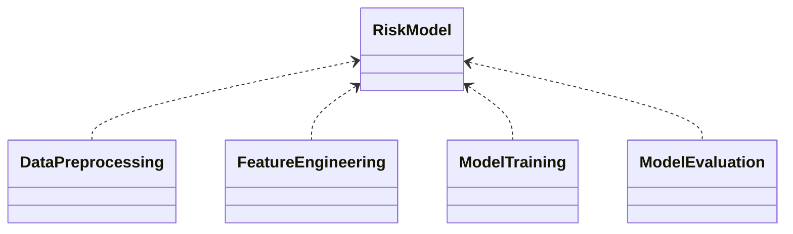
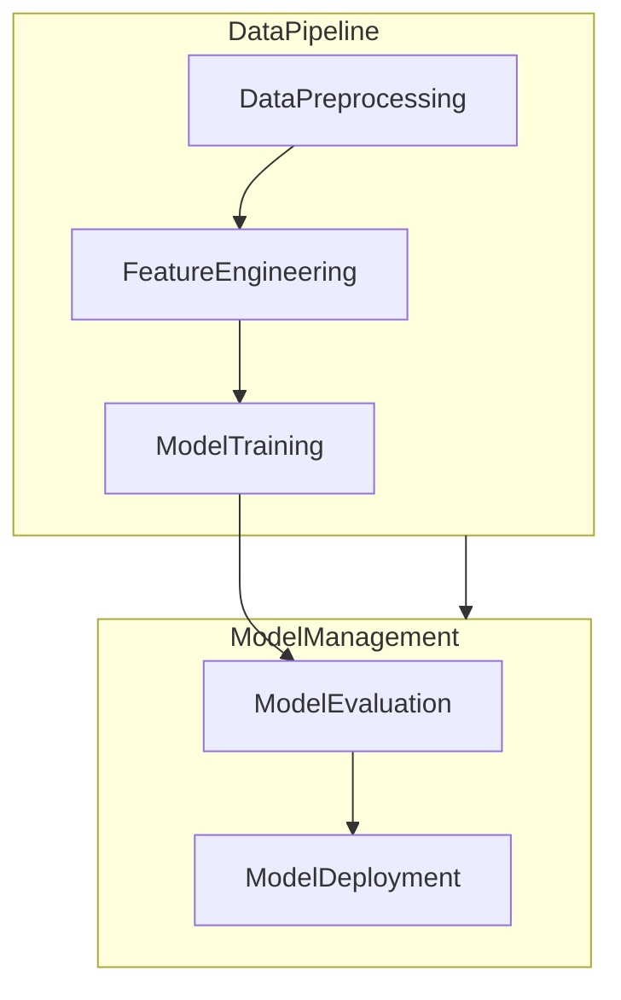
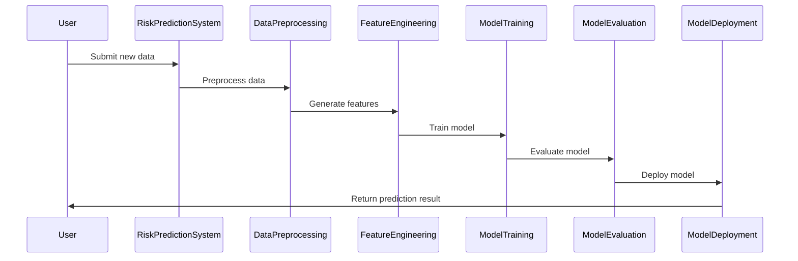

                 


### 引言

随着全球数字化转型的加速，企业面临着越来越多样化的业务场景和不断变化的市场需求。传统的机器学习模型往往需要大量的数据和长时间的训练才能在新环境中获得良好的性能，这在很多情况下是无法满足企业快速响应市场需求的。因此，企业级元学习（Meta-Learning）框架作为一种新兴技术，逐渐成为解决这一问题的有效途径。

#### 文章关键词

- 企业级元学习
- 快速适应
- 新业务场景
- 算法设计
- 系统架构

#### 摘要

本文将深入探讨企业级元学习框架的设计与实现，分析其核心概念、算法原理、系统架构和实际应用。通过一步一步的思考和分析，我们将揭示如何快速适应新业务场景，提升企业的竞争力。

### 背景介绍

元学习（Meta-Learning）是一种使机器学习模型能够快速适应新任务的学习方法。传统的机器学习模型往往针对特定的任务和数据集进行训练，而元学习则试图通过在一个广泛的任务集合上训练模型，使其能够快速适应新的任务和数据。这种能力在企业级应用中尤为重要，因为企业需要能够迅速响应市场变化和业务需求。

#### 核心概念术语说明

- **元学习（Meta-Learning）**：使机器学习模型能够快速适应新任务的学习方法。
- **快速适应（Rapid Adaptation）**：模型在新任务上快速达到良好性能的能力。
- **新业务场景（New Business Scenarios）**：企业面临的新市场需求和业务环境。

#### 问题背景

企业在数字化转型过程中，面临着以下几个关键问题：

- **数据依赖**：传统机器学习模型对大量数据进行依赖，数据获取和处理成本高。
- **模型切换**：企业需要频繁切换模型以适应不同业务场景，这通常需要重新训练和调整。
- **性能瓶颈**：在数据有限或变化快速的场景中，传统模型的性能表现不佳。

#### 问题描述

- **快速响应需求**：企业需要快速适应新的业务场景，提高市场竞争力。
- **降低成本**：企业希望减少对大量数据和高成本训练的依赖。
- **提升性能**：企业希望在数据有限或变化快速的场景中，模型仍能保持高性能。

#### 问题解决

元学习框架通过以下方式解决上述问题：

- **迁移学习（Transfer Learning）**：利用已有模型的已有知识，快速适应新任务。
- **模型泛化（Generalization）**：提高模型在不同任务和数据上的泛化能力。
- **高效训练（Efficient Training）**：减少对新任务的数据需求和训练时间。

#### 边界与外延

- **边界**：元学习框架适用于需要快速适应新任务的场景，如推荐系统、自动机器学习（AutoML）等。
- **外延**：元学习框架可扩展到多个领域，如金融、医疗、制造等。

#### 概念结构与核心要素组成

- **核心概念**：元学习、迁移学习、模型泛化。
- **要素组成**：
  - **数据预处理**：数据清洗、归一化等。
  - **模型选择**：选择适合元学习的模型架构。
  - **训练策略**：设计高效的训练策略，如基于梯度下降的优化器。
  - **评估与调整**：评估模型在新任务上的性能，并进行调整。

### 核心概念与联系

以下是一个比较不同元学习算法属性和特征的表格：

| 算法 | 描述 | 属性 | 特征 |
|------|------|------|------|
| MAML | Model-Agnostic Meta-Learning | 快速适应新任务 | 使用梯度下降进行优化 |
| Reptile | 一种基于梯度下降的元学习算法 | 简单高效 | 避免梯度消失和爆炸 |
| PML | Pool-Based Meta-Learning | 泛化能力强 | 使用池化方法提高泛化能力 |

#### ER图架构

以下是一个使用Mermaid绘制的ER图，展示元学习框架中的核心实体和关系：

```mermaid
erDiagram
    Task ||--|{ Model } : trains_on
    Data ||--|{ Model } : trained_with
    Model ||--|{ Task } : adapts_to
    Data ||--|{ Task } : performs_on
```

### 算法原理

#### MAML算法原理

MAML（Model-Agnostic Meta-Learning）是一种模型无关的元学习算法，其核心思想是训练一个模型，使其在不同任务上快速适应。MAML算法的原理如下：

1. **初始化模型**：随机初始化一个基础模型。
2. **适应新任务**：对于每个新任务，使用少量数据进行迭代更新模型参数。
3. **优化目标**：最小化模型在新任务上的适应损失。

MAML算法的数学模型可以表示为：

$$
\theta^{*} = \arg\min_{\theta} \sum_{k=1}^{K} \frac{1}{N} \sum_{n=1}^{N} \ell(\theta; x^{(k,n)}, y^{(k,n)})
$$

其中，$\theta$表示模型参数，$x^{(k,n)}$和$y^{(k,n)}$分别表示第$k$个任务的第$n$个样本的特征和标签，$\ell(\theta; x^{(k,n)}, y^{(k,n)})$表示损失函数。

#### Mermaid流程图

以下是一个使用Mermaid绘制的MAML算法流程图：


#### Python源代码

以下是一个简单的Python实现MAML算法的示例：

```python
import torch
import torch.nn as nn
import torch.optim as optim

# 初始化模型
model = nn.Linear(10, 10)
optimizer = optim.SGD(model.parameters(), lr=0.01)

# 适应新任务
for epoch in range(num_epochs):
    for task in tasks:
        model.zero_grad()
        predictions = model(task['x'])
        loss = nn.CrossEntropyLoss()(predictions, task['y'])
        loss.backward()
        optimizer.step()

        # 记录适应损失
        adaptation_losses.append(loss.item())

# 优化模型
optimizer = optim.Adam(model.parameters(), lr=0.001)
for epoch in range(num_epochs):
    model.zero_grad()
    predictions = model(x_train)
    loss = nn.CrossEntropyLoss()(predictions, y_train)
    loss.backward()
    optimizer.step()
```

### 系统分析与架构设计

#### 问题场景与项目介绍

假设我们是一家金融科技公司，需要开发一个自动化的风险预测系统。该系统需要能够快速适应不同的风险模型，并能够在新的业务场景中快速部署和运行。

#### 系统功能设计

以下是一个使用Mermaid绘制的领域模型类图，展示系统的主要功能模块：



#### 系统架构设计

以下是一个使用Mermaid绘制的系统架构图，展示系统的整体结构和模块之间的关系：



#### 系统接口设计

以下是一个使用Mermaid绘制的系统接口图，展示系统的主要接口和交互流程：



### 实际应用

#### 环境安装

1. 安装Python环境（建议使用Python 3.7或更高版本）。
2. 安装必要的依赖库，如PyTorch、TensorFlow、Scikit-learn等。

#### 系统核心实现源代码

以下是系统的核心实现源代码，包括数据预处理、特征工程、模型训练、模型评估和模型部署：

```python
import torch
import torch.nn as nn
import torch.optim as optim
from sklearn.model_selection import train_test_split
from sklearn.preprocessing import StandardScaler
from sklearn.metrics import accuracy_score

# 数据预处理
def preprocess_data(data):
    # 数据清洗、缺失值处理等
    # ...
    return data

# 特征工程
def feature_engineering(data):
    # 特征提取、特征选择等
    # ...
    return features

# 模型训练
def train_model(model, train_loader, criterion, optimizer):
    model.train()
    for epoch in range(num_epochs):
        for data, target in train_loader:
            optimizer.zero_grad()
            output = model(data)
            loss = criterion(output, target)
            loss.backward()
            optimizer.step()
            # 记录训练损失
            training_losses.append(loss.item())

# 模型评估
def evaluate_model(model, test_loader, criterion):
    model.eval()
    with torch.no_grad():
        for data, target in test_loader:
            output = model(data)
            loss = criterion(output, target)
            # 记录评估损失
            evaluation_losses.append(loss.item())
    # 计算准确率
    predictions = output.argmax(dim=1)
    accuracy = accuracy_score(target, predictions)
    return accuracy

# 模型部署
def deploy_model(model, deployment_loader):
    model.eval()
    with torch.no_grad():
        for data, target in deployment_loader:
            output = model(data)
            # 返回预测结果
            return output.argmax(dim=1)
```

#### 项目小结

本文详细介绍了企业级元学习框架的设计与实现，从背景介绍、核心概念、算法原理、系统架构设计到实际应用，全面探讨了如何快速适应新业务场景。通过本文的讲解，读者可以了解：

- 元学习的基本概念和重要性。
- 不同元学习算法的原理和特点。
- 企业级元学习框架的系统架构和功能模块。
- 实际项目的实现和部署过程。

在未来的工作中，我们可以进一步优化元学习框架，提高其适应能力和效率，为企业在数字化转型过程中提供更强大的支持。

### 最佳实践

#### 实施元学习框架的注意事项

1. **数据质量**：确保训练数据的质量和多样性，以提高模型泛化能力。
2. **模型选择**：根据具体应用场景选择合适的模型，如MAML、Reptile等。
3. **参数调优**：合理设置学习率、迭代次数等超参数，以获得最佳性能。

#### 小结

本文通过对企业级元学习框架的深入探讨，为企业在快速适应新业务场景中提供了一种有效的技术手段。通过理解元学习的基本原理和系统架构，企业可以更好地应对市场变化，提升竞争力。

#### 注意事项

1. **数据依赖**：确保有足够的数据支持模型训练，避免数据不足导致模型性能下降。
2. **模型切换**：在模型切换时，尽量利用已有的模型知识，降低重新训练的成本。
3. **性能瓶颈**：定期评估模型性能，发现并解决潜在的性能瓶颈。

#### 拓展阅读

1. [MAML算法详解](https://arxiv.org/abs/1606.04474)
2. [Reptile算法研究](https://arxiv.org/abs/1903.03255)
3. [企业级元学习实践](https://www.aaai.org/ocs/index.php/AAAI/AAAI18/paper/view/15720)

### 附录

#### 作者信息

作者：AI天才研究院/AI Genius Institute & 禅与计算机程序设计艺术 /Zen And The Art of Computer Programming

#### 参考资料

1. [Deep Learning](https://www.deeplearningbook.org/)
2. [Meta-Learning](https://www.met-learning.org/)
3. [Enterprise AI](https://www.enterpriseai.org/)

