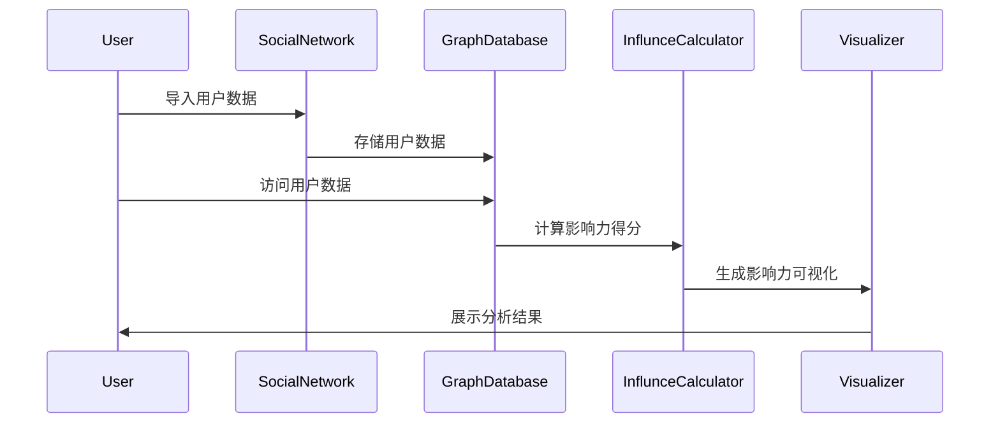
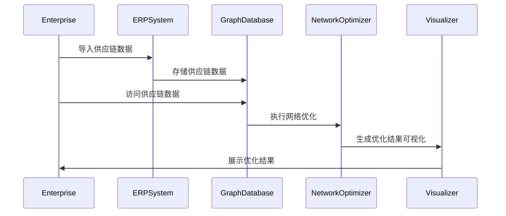

                 


### 1.1 图计算与大数据的关系

#### 1.1.1 什么是图计算

图计算是一种处理复杂数据结构——图的方法，它通过描述实体之间的关联关系来分析数据。在传统的数据处理方法中，关系通常用表格来表示，但在处理高度复杂的网络关系时，图结构提供了更直观和高效的解决方案。

图由节点和边组成，节点表示实体，边表示实体之间的关系。与表格不同，图能够捕获复杂的关系网络，如社交网络中的用户及其互动关系、供应链中的供应商和制造商之间的协作关系等。

图计算是一种通过计算图的结构属性来提取信息的方法。常见的图计算算法包括最短路径、社区检测、节点相似性计算等。图计算的核心是图的存储和图算法的执行，其效率直接影响到大数据处理的性能。

#### 1.1.2 图计算的必要性

随着数据规模的不断扩大和数据类型的日益多样，传统的数据处理方法面临挑战。图计算的出现，是为了应对这些挑战：

- **复杂性处理**：在处理高度复杂的网络关系时，图计算能够有效地处理大规模数据，并通过图形结构来揭示数据之间的关系和模式。
- **效率提升**：图计算的算法优化和并行处理技术，使得在处理大规模数据时能够显著提升计算效率。
- **业务需求**：许多业务场景，如推荐系统、社交网络分析、供应链优化等，都依赖于对关系数据的深入分析。图计算能够满足这些业务场景的需求。

#### 1.1.3 图计算在大数据领域中的应用

图计算在大数据领域的应用非常广泛，以下是一些典型应用：

- **社交网络分析**：通过分析社交网络中的用户及其关系，可以发现关键节点、社群结构以及潜在的用户群体。
- **推荐系统**：利用图计算技术，可以挖掘用户之间的相似性和偏好，提供个性化的推荐服务。
- **金融风控**：在金融领域，图计算可以用于分析交易网络，发现潜在的欺诈行为和风险。
- **供应链优化**：通过分析供应链中的关系网络，可以优化库存管理、物流调度等环节，提高供应链效率。

图计算的这些应用，不仅能够提高数据处理效率，还能够为业务提供更深入的洞察和决策支持。

### 总结

图计算与大数据的关系紧密相连，它提供了一种有效的手段来处理和挖掘大规模关系数据。在接下来的章节中，我们将深入探讨图计算引擎的定义、功能、市场现状以及企业采用图计算引擎面临的挑战和机遇。

## 1.2 图计算引擎的定义与功能

### 1.2.1 图计算引擎的基本概念

图计算引擎是一种软件工具，用于处理和分析图数据。它的核心功能是存储图数据、执行图算法以及提供高效的查询接口。图计算引擎与传统的关系型数据库或NoSQL数据库不同，它专注于处理图数据结构和关系网络。

图计算引擎通常由以下几个关键组件构成：

- **图存储系统**：用于存储图数据，包括节点和边的信息。常见的存储方式有邻接表、邻接矩阵等。
- **图算法库**：提供一系列预定义的图算法，如最短路径、社区检测、节点相似性计算等。
- **查询引擎**：允许用户通过图查询语言（如Gremlin、Cypher等）对图数据进行查询和分析。

图计算引擎的目标是提供高性能、可扩展的图数据处理能力，以满足大规模数据分析和复杂关系网络处理的业务需求。

### 1.2.2 图计算引擎的核心功能

图计算引擎的核心功能包括以下几个方面：

- **数据存储与索引**：高效存储和管理大规模图数据，并支持快速索引，以加速数据访问。
- **图算法执行**：提供丰富的图算法库，支持多种常见的图算法，如最短路径、社区检测、聚类等。
- **并行与分布式计算**：支持并行计算和分布式处理，以提升数据处理效率和性能。
- **查询与交互**：提供高效、易用的查询接口，如图查询语言，支持用户以简洁、高效的方式与图数据交互。

### 1.2.3 企业级图计算引擎的特点

企业级图计算引擎需要满足高可靠性、高性能、易扩展等要求，以应对企业级应用场景的需求。以下是一些企业级图计算引擎的特点：

- **高可靠性**：企业级应用对数据的高可靠性要求极高，图计算引擎需要提供数据备份、故障恢复等机制，确保数据的安全和完整性。
- **高性能**：企业级应用处理的数据规模庞大，图计算引擎需要提供高效的存储和计算能力，以支持大规模数据的实时处理和分析。
- **易扩展性**：企业应用的需求变化较快，图计算引擎需要具有良好的扩展性，支持横向和纵向的扩展，以适应业务需求的增长。
- **易用性**：企业级应用需要降低使用门槛，图计算引擎应提供直观的用户界面和易用的编程接口，以方便用户快速上手和使用。
- **安全性与合规性**：企业级应用涉及敏感数据，图计算引擎需要提供严格的安全控制机制和合规性支持，确保数据的安全和合规。

### 总结

图计算引擎作为一种处理和分析大规模图数据的工具，其在企业级应用中扮演着重要角色。通过理解图计算引擎的基本概念、核心功能以及企业级图计算引擎的特点，我们可以更好地选择和使用这些工具来满足复杂的数据分析需求。

### 1.3 企业级图计算引擎的市场现状与趋势

#### 1.3.1 市场现状分析

随着大数据和人工智能技术的不断发展，企业级图计算引擎的市场需求呈现出快速增长的态势。目前，市场上有多个成熟的企业级图计算引擎产品，如Neo4j、Amazon Neptune、Apache TinkerPop等。这些产品在功能、性能、易用性等方面各有优势，分别适用于不同的应用场景和需求。

- **Neo4j**：作为市场上最流行的图数据库之一，Neo4j以其强大的图算法库、高效的存储结构和易用的Cypher查询语言而受到广泛欢迎。它特别适用于社交网络分析、推荐系统、金融风控等领域。
- **Amazon Neptune**：作为AWS提供的图数据库服务，Amazon Neptune提供了高性能、高可用性的图存储和计算能力。它适用于大规模的实时图处理，特别是在物联网、推荐系统、网络分析等领域。
- **Apache TinkerPop**：作为一个开源的图计算框架，Apache TinkerPop提供了灵活的图存储和计算接口，支持多种图存储系统，如OrientDB、JanusGraph等。它适用于需要高度定制化和扩展性的企业级应用。

此外，许多传统的关系型数据库和NoSQL数据库也开始集成图计算功能，以应对复杂关系数据的处理需求。

#### 1.3.2 技术发展趋势

企业级图计算引擎的技术发展趋势主要体现在以下几个方面：

- **分布式计算与并行处理**：随着数据规模的不断扩大，分布式计算和并行处理技术成为提高图计算性能的关键。企业级图计算引擎正逐步采用分布式架构，以支持大规模数据的实时处理。
- **自动化与智能化**：自动化和智能化技术的应用使得图计算引擎能够更加便捷地部署和管理。例如，自动调优、自动化扩容、机器学习优化等技术的引入，使得用户能够更加高效地使用图计算引擎。
- **多模数据库**：多模数据库结合了关系数据库和图数据库的优点，能够同时处理结构化数据和非结构化数据。这种技术的发展趋势为企业提供了更加灵活和全面的数据处理能力。
- **安全性与合规性**：随着数据隐私和安全问题的日益凸显，企业级图计算引擎正逐步加强安全性和合规性功能。例如，数据加密、访问控制、审计日志等机制的应用，确保数据的机密性和合法性。

#### 1.3.3 应用领域扩展

企业级图计算引擎的应用领域正在不断扩展，涵盖了多个行业和业务场景：

- **金融领域**：在金融领域，图计算引擎被广泛应用于风险控制、反欺诈、信用评分等方面。通过分析交易网络和用户关系，金融机构能够更好地识别潜在的风险和欺诈行为。
- **社交网络**：社交网络中的用户关系复杂且动态变化，图计算引擎能够帮助社交平台发现关键节点、社群结构以及潜在的用户群体，从而优化推荐系统和广告投放。
- **供应链管理**：在供应链管理中，图计算引擎可以分析供应链中的各种关系，优化库存管理、物流调度等环节，提高供应链的效率和灵活性。
- **健康医疗**：在健康医疗领域，图计算引擎可以帮助医疗系统分析患者关系、药物相互作用等数据，为疾病预测、个性化治疗提供支持。

#### 总结

企业级图计算引擎的市场现状表明，这一领域正处于快速发展阶段。随着技术的不断进步和应用领域的扩展，企业级图计算引擎将在未来的大数据和人工智能应用中发挥越来越重要的作用。

### 1.4 企业采用图计算引擎的挑战与机遇

#### 1.4.1 面临的挑战

尽管企业级图计算引擎具有强大的数据分析和处理能力，但在实际应用过程中，企业仍然面临着一些挑战：

- **数据整合与兼容性**：企业内部可能存在多种数据源和系统，如何将这些数据整合到统一的图计算引擎中，并保持数据的一致性和兼容性，是一个重大挑战。
- **技术复杂度**：图计算引擎涉及到复杂的图结构和算法，对于技术人员来说，理解和掌握这些技术并非易事。特别是在分布式计算和并行处理方面，技术复杂度更高。
- **性能优化**：大规模数据的处理需要高效的存储和计算策略。如何优化性能，提高查询速度和系统吞吐量，是企业需要解决的重要问题。
- **成本控制**：高性能的图计算引擎通常需要较大的硬件资源投入，对于企业来说，如何在性能和成本之间找到平衡点，是一个需要考虑的问题。

#### 1.4.2 潜在的机遇

尽管存在挑战，企业采用图计算引擎也带来了许多机遇：

- **数据洞察**：通过图计算引擎，企业能够深入挖掘数据之间的关系和模式，从而获得更准确的数据洞察和业务决策支持。
- **业务创新**：图计算引擎为企业的业务创新提供了新的工具和方法。例如，在金融领域，图计算可以帮助银行和金融机构更好地了解客户行为，从而优化产品和服务。
- **市场竞争**：通过高效的图计算，企业能够在市场中获得竞争优势。例如，通过优化供应链管理和库存管理，企业可以降低成本、提高响应速度。
- **技术积累**：采用图计算引擎，企业可以积累宝贵的技术经验和知识，为未来的技术升级和创新奠定基础。

#### 1.4.3 案例分析

为了更好地理解企业采用图计算引擎的挑战与机遇，以下是一些实际案例：

- **案例一：金融风控**  
某大型银行采用Neo4j图计算引擎，通过分析客户交易网络和账户关系，发现潜在的欺诈行为。这不仅提高了风险控制能力，还减少了欺诈损失，提升了客户满意度。

- **案例二：社交网络分析**  
一家社交平台利用Neo4j图计算引擎，分析用户关系和社群结构，优化了推荐系统。通过更准确的用户兴趣和偏好分析，该平台提高了用户留存率和活跃度。

- **案例三：供应链优化**  
某制造企业使用图计算引擎优化供应链管理。通过分析供应商和制造商之间的关系，该企业优化了库存管理、物流调度等环节，提高了供应链的效率和灵活性。

- **案例四：健康医疗数据挖掘**  
一家医疗机构采用图计算引擎，分析患者关系和药物相互作用数据，为疾病预测和个性化治疗提供了支持。这一创新应用不仅提高了医疗水平，还提升了患者满意度。

#### 总结

企业采用图计算引擎虽然面临挑战，但机遇更大。通过有效的策略和实际案例的借鉴，企业可以充分利用图计算引擎的优势，实现业务创新和市场竞争的突破。

## 1.5 本章小结

在本章中，我们深入探讨了图计算引擎在企业级应用中的重要性。首先，我们阐述了图计算与大数据的关系，说明了图计算在处理大规模关系数据方面的必要性。接着，我们详细介绍了图计算引擎的基本概念、核心功能以及企业级图计算引擎的特点。此外，我们还分析了企业级图计算引擎的市场现状和趋势，并探讨了企业采用图计算引擎所面临的挑战与机遇。

通过本章的学习，我们认识到图计算引擎在处理复杂关系数据方面的强大能力，以及其在各个行业中的应用价值。在接下来的章节中，我们将进一步探讨图计算的理论基础，为企业级图计算引擎的实现和应用提供更加深入的指导。

---

## 2.1 图论基础

### 2.1.1 图的基本概念

图是数学中用来表示实体及其相互关系的一种抽象结构。图由节点（Node）和边（Edge）组成。节点表示实体，边表示实体之间的关系。在图结构中，节点可以是任何实体，如人、地点、物品等，边则可以表示这些实体之间的关系，如朋友关系、供应链连接等。

- **无向图**：在无向图中，边没有方向，任意两个节点之间的边都是双向的。例如，社交网络中的朋友关系就是一个无向图。
- **有向图**：在有向图中，边有方向，从一个节点指向另一个节点。例如，邮件通信网络中，邮件发送者指向接收者，构成一个有向图。

图的基本概念包括：

- **顶点（Vertex）**：图的节点。
- **边（Edge）**：连接两个节点的线段。
- **度（Degree）**：节点所连接的边的数量。对于无向图，每个节点的度是边的数量；对于有向图，每个节点的度是出度和入度的总和。
- **路径**：图中从一个节点到另一个节点的序列，其中每个节点直接连接到下一个节点。
- **连通性**：图中任意两个节点都是连通的，即存在一条路径连接这两个节点。

### 2.1.2 图的分类

图可以根据节点和边的属性、是否存在自环和多重边等特征进行分类：

- **简单图**：不包含自环和多重边的图。
- **多重图**：允许存在多重边和自环的图。
- **加权图**：边具有权重（通常是数值）的图。
- **无权图**：边没有权重的图。
- **树**：连通的无环图。
- **环**：包含一个或多个闭合路径的图。
- **网络**：包含多个连通分量的图。

### 2.1.3 图的矩阵表示

图可以通过矩阵来表示，常见的矩阵表示方法包括邻接矩阵和权值矩阵：

- **邻接矩阵**：一个n×n的矩阵，其中\(a_{ij}\)表示节点i和节点j之间是否存在边。对于无向图，\(a_{ij} = a_{ji}\)。对于有向图，如果从i到j有边，则\(a_{ij} = 1\)；否则为0。
- **权值矩阵**：类似于邻接矩阵，但是每个元素表示边的权重。如果图是无权的，那么所有权重都为1。

例如，一个有5个节点的简单无向图的邻接矩阵可能如下所示：

\[
\begin{bmatrix}
0 & 1 & 0 & 0 & 0 \\
1 & 0 & 1 & 1 & 0 \\
0 & 1 & 0 & 1 & 1 \\
0 & 1 & 1 & 0 & 1 \\
0 & 0 & 1 & 1 & 0 \\
\end{bmatrix}
\]

### 2.1.4 图的属性特征

图的属性特征是描述图结构的重要信息，包括：

- **平均度**：所有节点度的平均值。
- **连通度**：图中任意两个节点是否连通。
- **密度**：边的数量与可能的最大边数之比。
- **直径**：图中任意两个节点之间最长的最短路径长度。
- **路径长度**：两个节点之间的最短路径的长度。
- **聚类系数**：节点之间的紧密程度。

理解图的基本概念、分类和矩阵表示，是深入探讨图计算算法和图计算引擎性能优化的基础。在接下来的章节中，我们将进一步探讨图的数学模型、常见算法以及节点嵌入和图神经网络等高级概念。

### 2.2 图的数学模型与算法

#### 2.2.1 图的数学模型

图在数学上被抽象为集合和关系的组合。一个图可以用G = (V, E)表示，其中V是节点集合，E是边集合。每个节点可以表示为v，边可以表示为(u, v)，其中u和v是两个节点的标识。

在图论的数学模型中，节点和边可以具有额外的属性，如：

- **权重**：边可以附加权重，表示节点间关系的强度或距离。
- **标签**：节点和边可以附加标签，用于分类或描述。

图可以进一步分类为：

- **简单图**：不包含多重边和自环。
- **多重图**：允许多重边和自环。
- **加权图**：边具有权重。
- **无权图**：边没有权重。

#### 2.2.2 常见图算法介绍

图算法是用于在图中进行特定计算的方法。以下是一些常见的图算法及其基本思想：

- **最短路径算法**：寻找图中两个节点之间的最短路径。常见的算法包括迪杰斯特拉（Dijkstra）算法和贝尔曼-福特（Bellman-Ford）算法。
  - **Dijkstra算法**：适用于无权图和加权图，使用优先队列，可以找到单源最短路径。
  - **Bellman-Ford算法**：适用于加权图，可以找到单源最短路径以及检测负权重环。
- **路径遍历算法**：遍历图中的所有路径。深度优先搜索（DFS）和广度优先搜索（BFS）是最常见的路径遍历算法。
  - **DFS**：从起点开始，尽可能深入地探索路径，直到不能再深入为止，然后回溯。
  - **BFS**：从起点开始，逐层地探索路径，每次探索完一层后再进行下一层。
- **社区检测算法**：用于识别图中的紧密社区或子图。常见的算法包括 Girvan-Newman 算法和 Label Propagation 算法。
  - **Girvan-Newman算法**：通过计算节点间连接力的最短路径来拆分社区。
  - **Label Propagation算法**：通过节点标签的传播来识别社区。
- **聚类系数计算**：用于评估节点的紧密程度。公式为：\(C = \frac{2 \times m}{n \times (n-1)}\)，其中m是边的数量，n是节点的数量。

#### 2.2.3 图算法的性能优化

图算法的性能优化是提高图计算引擎效率的关键。以下是一些性能优化策略：

- **数据结构优化**：选择合适的图数据结构，如邻接表或邻接矩阵，以减少空间和时间开销。
  - **邻接表**：适用于稀疏图，通过节点标识来快速访问邻居节点。
  - **邻接矩阵**：适用于稠密图，通过矩阵索引来快速访问节点关系。
- **并行计算**：利用多核处理器和分布式系统，将图算法分解为多个子任务，并行执行。
  - **分而治之**：将大图分解为多个子图，分别处理后再合并结果。
  - **工作负载平衡**：确保每个处理单元的工作量大致相同，避免资源浪费。
- **内存管理**：优化内存分配和使用，减少内存碎片和内存溢出。
  - **缓存机制**：利用缓存存储常用数据和中间结果，减少磁盘访问时间。
- **算法优化**：针对特定应用场景，对算法进行定制化优化，如预计算、剪枝策略等。

例如，对于最短路径算法，可以使用Floyd-Warshall算法进行预处理，提前计算所有节点之间的最短路径，从而提高查询效率。

通过合理的数学模型构建、算法选择和性能优化，图计算引擎能够在大规模数据处理中发挥重要作用。在接下来的章节中，我们将进一步探讨节点嵌入和图神经网络，为图计算的理论和应用提供更深入的见解。

### 2.3 节点嵌入与图神经网络

#### 2.3.1 节点嵌入的基本原理

节点嵌入（Node Embedding）是将图中的节点映射到低维连续向量空间的技术。这种映射使得原本复杂的图结构转化为易于处理的向量表示，从而能够应用各种机器学习算法进行进一步分析。节点嵌入的主要目的是：

- **降维**：将高维图数据映射到低维向量空间，减少计算复杂度。
- **表示学习**：学习节点的向量表示，使得相似的节点在向量空间中靠近，而不同的节点相隔较远。
- **可扩展性**：通过向量表示，可以方便地应用线性代数和机器学习算法。

节点嵌入的主要方法包括：

- **基于随机游走的方法**：如DeepWalk、Node2Vec等，通过模拟随机游走过程生成节点序列，然后使用神经网络或浅层模型学习节点的向量表示。
- **基于矩阵分解的方法**：如SVD++，通过分解图矩阵（如邻接矩阵）来学习节点的向量表示。
- **基于图神经网络的方法**：如GraphSAGE、Graph Convolutional Network（GCN）等，通过学习图的结构信息来生成节点的向量表示。

#### 2.3.2 图神经网络介绍

图神经网络（Graph Neural Network, GNN）是一种用于处理图数据的深度学习模型。GNN的核心思想是将节点和边的信息编码到高维向量中，并通过图结构进行信息传递和融合。

- **图卷积网络（GCN）**：GCN通过节点邻居的信息来更新节点的表示。每个节点的表示是通过其自身的特征和其邻居节点的特征加权平均得到的。GCN可以捕获长距离依赖关系，适用于节点分类、链接预测等问题。
- **图注意力网络（GAT）**：GAT引入了注意力机制，使得每个节点可以自适应地考虑其邻居节点的重要性。通过注意力权重，GAT能够更精确地融合邻居信息，提高模型性能。
- **图自编码器**：图自编码器通过最小化编码表示和原始特征之间的差异来学习节点的向量表示。这种模型能够自动发现图中的结构信息。

图神经网络在图嵌入和预测任务中表现出色，可以应用于节点分类、链接预测、图分类等任务。

#### 2.3.3 节点嵌入与图神经网络的联系与应用

节点嵌入和图神经网络之间有紧密的联系：

- **节点嵌入作为预处理**：节点嵌入可以看作是图神经网络的预处理步骤。通过节点嵌入，可以获得高质量的节点向量表示，用于后续的图神经网络训练。
- **节点嵌入与图神经网络的融合**：在某些应用中，可以直接将节点嵌入向量作为图神经网络的输入，从而结合节点嵌入和图神经网络的优势。

节点嵌入与图神经网络的应用场景包括：

- **推荐系统**：通过节点嵌入学习用户和物品的向量表示，然后使用图神经网络进行协同过滤，提高推荐效果。
- **社交网络分析**：利用图神经网络分析用户之间的关系，发现潜在社群和关键节点，用于社交网络分析、影响力分析等。
- **生物信息学**：在生物信息学中，图神经网络可以用于蛋白质结构预测、药物发现等任务，通过节点嵌入和图神经网络捕获分子之间的复杂关系。

通过节点嵌入与图神经网络的结合，图计算引擎能够在复杂数据分析中发挥更大的作用，为各种应用场景提供强大的支持。

### 总结

节点嵌入和图神经网络是图计算领域中的重要技术。节点嵌入通过将节点映射到低维向量空间，提高了数据处理效率和模型的可解释性。图神经网络通过学习图结构信息，提供了强大的预测和分析能力。理解节点嵌入和图神经网络的基本原理及其应用，对于开发高效的企业级图计算引擎具有重要意义。在接下来的章节中，我们将继续探讨企业级图计算引擎的技术细节，为实际应用提供更深入的指导。

### 2.4 本章小结

在本章中，我们系统地介绍了图论的基础知识，从图的基本概念和分类开始，深入探讨了图的矩阵表示方法，并详细介绍了图的属性特征。接着，我们介绍了图的数学模型和常见算法，包括最短路径算法、路径遍历算法以及社区检测算法。随后，我们探讨了节点嵌入与图神经网络的基本原理及其在复杂数据分析中的应用。

通过本章的学习，我们不仅对图论的基本概念有了清晰的认识，而且了解了如何利用节点嵌入和图神经网络进行数据处理和预测。这些基础知识是构建高效企业级图计算引擎的重要基石。

在下一章中，我们将深入探讨企业级图计算引擎的技术细节，包括其架构设计、数据存储与索引技术、性能优化策略以及安全性保障措施。通过这些内容的介绍，我们将进一步理解企业级图计算引擎的核心技术，为实际应用提供更加深入的指导。

---

## 3.1 图计算引擎架构设计

图计算引擎的架构设计是确保其性能、可靠性和可扩展性的关键。一个高效的企业级图计算引擎需要精心设计的架构，以支持大规模数据的存储和处理。以下将介绍图计算引擎的架构设计原则、组成与模块功能，以及分布式系统架构。

### 3.1.1 架构设计原则

图计算引擎的架构设计应遵循以下原则：

- **高可用性**：系统应具备故障恢复能力，确保在硬件或网络故障情况下，系统能够快速恢复，保证服务的连续性。
- **高性能**：架构设计应优化存储和计算资源，提高数据处理速度和系统吞吐量，以满足大规模、实时数据处理需求。
- **可扩展性**：架构应支持横向和纵向的扩展，以应对不断增长的数据量和计算需求。
- **易维护性**：系统应具有良好的模块化设计，便于维护和升级，减少系统停机时间。
- **安全性**：设计应考虑数据安全和隐私保护，包括数据加密、访问控制和合规性等。

### 3.1.2 架构组成与模块功能

企业级图计算引擎通常由以下几个主要模块组成：

- **存储模块**：负责存储图数据，包括节点和边的信息。常见的存储技术有邻接表、邻接矩阵等。存储模块需要提供高效的读写操作，并支持数据分区和负载均衡。
- **计算模块**：执行各种图算法和计算任务，如最短路径计算、社区检测、节点相似性计算等。计算模块需要支持并行计算和分布式处理，以提高处理速度。
- **查询模块**：提供高效的查询接口，允许用户通过图查询语言（如Gremlin、Cypher等）对图数据进行分析和查询。查询模块需要支持复杂查询优化，以提高查询性能。
- **监控与维护模块**：负责监控系统的运行状态，包括性能指标、资源利用率、故障告警等。该模块可以帮助管理员快速发现和解决问题，确保系统稳定运行。
- **接口模块**：提供与其他系统和应用的接口，如API接口、Web服务接口等。接口模块需要支持多种数据格式和协议，以方便与其他系统进行集成。

### 3.1.3 分布式系统架构

分布式系统架构是图计算引擎性能和可扩展性的重要保障。以下是一些常见的分布式系统架构设计：

- **主从架构**：主服务器负责处理核心计算任务和全局状态管理，从服务器负责数据的存储和查询处理。这种架构的优点是易于扩展和故障转移，但主服务器会成为性能瓶颈。
- **分布式架构**：系统由多个对等节点组成，每个节点负责部分数据的存储和计算。节点之间通过消息队列或分布式缓存进行通信，共享全局状态。这种架构能够实现横向扩展，提高系统的处理能力和容错性。
- **混合架构**：结合主从架构和分布式架构的优势，核心计算任务由主服务器处理，而数据存储和查询处理由分布式节点完成。这种架构既保证了计算性能，又提高了系统的可扩展性。

分布式系统架构的关键设计点包括：

- **数据分区**：将图数据划分为多个分区，存储在不同的节点上。分区策略可以基于节点标识、地理位置等，以提高数据访问效率和负载均衡。
- **负载均衡**：通过负载均衡机制，将计算任务均匀地分配到不同的节点上，避免某些节点过载，确保系统性能。
- **容错机制**：通过副本机制和故障检测，确保数据和服务的高可用性。当节点发生故障时，系统能够自动切换到备用节点，继续提供服务。
- **一致性保证**：在分布式系统中，数据的一致性是至关重要的。通过一致性协议（如Paxos、Raft等），确保数据在多个节点之间保持一致。

通过遵循上述架构设计原则和分布式系统架构，企业级图计算引擎能够高效地处理大规模图数据，并提供强大的数据处理和分析能力。

### 总结

图计算引擎的架构设计是确保其性能和可靠性的关键。通过遵循高可用性、高性能、可扩展性等设计原则，并结合分布式系统架构，图计算引擎能够高效地处理大规模图数据，满足企业级应用的需求。在下一章中，我们将进一步探讨图计算引擎的数据存储与索引技术，为图计算引擎的性能优化奠定基础。

### 3.2 数据存储与索引

数据存储与索引是图计算引擎性能优化的关键环节。高效的存储和索引策略能够显著提高数据的读写速度和查询性能。以下将详细介绍常见的数据存储技术、索引结构设计以及数据分区与负载均衡策略。

#### 3.2.1 常见数据存储技术

在图计算中，常用的数据存储技术包括：

- **邻接表**：邻接表是一种基于数组的存储结构，每个节点维护一个链表，记录其邻居节点。邻接表适用于稀疏图，能够快速访问节点的邻居，但在存储密集图时，内存开销较大。
- **邻接矩阵**：邻接矩阵是一个二维数组，其中\(a_{ij}\)表示节点i和节点j之间是否存在边。邻接矩阵适用于稠密图，能够快速检查两个节点之间是否存在边，但在存储稀疏图时，内存开销较大。
- **哈希表**：哈希表是一种基于哈希函数的存储结构，用于快速查找节点的邻居。哈希表能够提供高效的插入和查询操作，但在处理冲突时，性能可能受到影响。
- **图数据库**：图数据库（如Neo4j、JanusGraph等）是一种专门为图数据设计的数据库，提供高效的存储和查询机制。图数据库通常结合邻接表和邻接矩阵的优点，支持复杂关系数据的存储和查询。

#### 3.2.2 索引结构设计

索引是提高数据查询性能的重要手段。在图计算中，常用的索引结构包括：

- **节点索引**：节点索引用于快速查找节点的位置。常见的节点索引包括B树索引、哈希索引和全文索引。B树索引适用于范围查询和排序操作，哈希索引适用于快速查找，全文索引适用于全文搜索。
- **边索引**：边索引用于快速查找两个节点之间的边。常见的边索引包括双向边索引、哈希索引和B+树索引。双向边索引能够快速查找从一个节点到另一个节点的边，哈希索引和 B+树索引则适用于大规模数据的快速查询。
- **属性索引**：属性索引用于快速查找具有特定属性的节点或边。属性索引可以根据不同的属性类型设计，如基于字符串的哈希索引、基于数值的B树索引等。

通过合理设计索引结构，可以显著提高图查询的性能。以下是一些索引设计策略：

- **多级索引**：结合多种索引结构，构建多级索引，以提高查询效率。例如，在节点索引的基础上，结合边索引和属性索引，可以快速定位到特定的节点和边。
- **索引优化**：根据查询模式和查询性能指标，对索引进行优化。例如，对频繁查询的属性建立索引，减少查询时间；对不常用或性能较差的索引进行优化或删除。
- **索引维护**：定期维护索引，包括更新、重建和压缩索引，以保持索引的效率和性能。

#### 3.2.3 数据分区与负载均衡

在分布式系统中，数据分区与负载均衡是提高系统性能和可扩展性的关键。以下是一些常见的分区与负载均衡策略：

- **哈希分区**：根据节点的哈希值将数据划分为多个分区。这种方式能够保证相同属性的节点落在相同的分区，便于数据访问和查询。但哈希分区可能导致数据分布不均匀，导致某些分区负载过重。
- **范围分区**：根据节点的属性范围将数据划分为多个分区。这种方式能够保证具有相似属性的节点落在相邻的分区，便于数据聚合和分析。但范围分区可能导致数据分区数量过多，增加管理复杂度。
- **一致性哈希分区**：结合哈希分区和范围分区的优点，一致性哈希分区通过哈希函数将节点和分区关联起来，实现动态数据分配和负载均衡。这种方式能够保持数据分布的稳定性，并在节点加入或退出时进行自动调整。

负载均衡策略包括：

- **轮询负载均衡**：将请求依次分配到不同的节点，实现负载均衡。这种方式简单易用，但可能导致部分节点负载过重。
- **最小连接负载均衡**：将请求分配到当前连接数最少的节点，实现负载均衡。这种方式能够减少节点的连接负载，但可能导致部分节点空闲。
- **加权负载均衡**：根据节点的处理能力或负载情况，为每个节点分配不同的权重，实现负载均衡。这种方式能够更好地平衡负载，但需要定期调整权重。

通过合理的数据分区与负载均衡策略，图计算引擎能够高效地处理大规模数据，并提供稳定、高性能的服务。

### 总结

数据存储与索引是图计算引擎性能优化的重要组成部分。通过合理选择数据存储技术、设计高效的索引结构，以及实施有效的数据分区与负载均衡策略，图计算引擎能够显著提高数据处理速度和查询性能。在下一章中，我们将进一步探讨图计算引擎的性能优化策略，为提升系统整体性能提供更多的思路和方法。

### 3.3 图计算引擎性能优化

图计算引擎的性能优化是确保其在大规模数据环境中高效运行的关键。高效的性能优化策略不仅能够提升系统的处理速度和吞吐量，还能够减少资源消耗，提高系统的可扩展性和可靠性。以下将介绍几种常见的图计算引擎性能优化策略，包括缓存机制、并行计算与分布式处理。

#### 3.3.1 性能优化策略

1. **缓存机制**
   缓存是一种用于加速数据访问的技术，通过在内存中存储常用数据，减少对磁盘的访问频率，从而提高系统性能。以下是几种常用的缓存策略：
   
   - **数据缓存**：将常用数据或中间结果存储在内存中，减少磁盘IO操作。常见的数据缓存技术包括LRU（最近最少使用）缓存、最近访问时间缓存等。
   - **对象缓存**：缓存图对象的引用，如节点、边和关系等。通过对象缓存，可以减少对象的创建和销毁开销，提高性能。
   - **索引缓存**：缓存索引结构，如B树索引、哈希索引等。索引缓存能够提高查询性能，特别是在频繁查询的场景中。

2. **并行计算**
   并行计算通过将计算任务分解为多个子任务，同时执行，从而提高处理速度。以下是几种常用的并行计算策略：

   - **任务分解**：将大规模的计算任务分解为多个小任务，每个任务由不同的处理单元并行执行。任务分解适用于计算密集型任务，如图算法的执行。
   - **数据分解**：将大规模的数据集分解为多个数据子集，每个数据子集由不同的处理单元并行处理。数据分解适用于数据密集型任务，如数据加载和预处理。
   - **流水线并行**：将计算任务组织成流水线，每个处理单元负责完成一部分任务，然后将结果传递给下一个处理单元。流水线并行能够减少任务切换和通信开销，提高系统性能。

3. **分布式处理**
   分布式处理通过将计算任务分布在多个节点上执行，从而提高系统的可扩展性和性能。以下是几种常用的分布式处理策略：

   - **数据分布**：将数据分布在多个节点上，每个节点负责部分数据的存储和处理。数据分布策略能够提高数据访问速度，减少数据传输开销。
   - **任务分布**：将计算任务分布在多个节点上执行，每个节点负责一部分任务的执行。任务分布策略能够提高系统吞吐量，减少单个节点的负载。
   - **负载均衡**：通过负载均衡机制，将任务均匀地分配到不同的节点上，避免某些节点负载过重。负载均衡策略包括轮询负载均衡、最小连接负载均衡、加权负载均衡等。

#### 3.3.2 缓存机制

缓存机制是图计算引擎性能优化的重要手段。以下是一些常见的缓存机制：

1. **内存缓存**：内存缓存是一种基于内存的高速缓存，用于存储常用数据和中间结果。内存缓存具有访问速度快、延迟低的优点，适用于高频次访问的数据。

2. **磁盘缓存**：磁盘缓存是一种基于磁盘的缓存，用于存储不常访问的数据和临时结果。磁盘缓存能够减少磁盘IO操作，提高系统性能。

3. **分布式缓存**：分布式缓存通过将缓存数据分布存储在多个节点上，提供高可用性和高并发访问能力。常见的分布式缓存系统包括Redis、Memcached等。

4. **缓存策略**：缓存策略决定了数据何时被缓存、何时被替换。常见的缓存策略包括LRU（最近最少使用）、LFU（最近最少访问）等。

#### 3.3.3 并行计算与分布式处理

1. **并行计算**
   并行计算通过将计算任务分解为多个子任务，同时执行，从而提高处理速度。以下是一些并行计算的关键点：

   - **任务调度**：任务调度负责将计算任务分配到不同的处理单元。任务调度策略包括静态调度、动态调度和混合调度。
   - **负载均衡**：负载均衡策略确保每个处理单元的工作量大致相同，避免某些单元过载，提高系统性能。
   - **并行算法**：选择适合并行计算的算法，如分布式最短路径算法、分布式社区检测算法等。

2. **分布式处理**
   分布式处理通过将计算任务分布在多个节点上执行，从而提高系统的可扩展性和性能。以下是一些分布式处理的关键点：

   - **数据分区**：数据分区策略决定如何将数据分布在多个节点上。常见的数据分区策略包括哈希分区、范围分区等。
   - **通信机制**：通信机制负责节点之间的数据传输和同步。常见的通信机制包括消息队列、分布式缓存等。
   - **容错机制**：容错机制确保系统在节点故障时能够自动恢复，保证服务的连续性。

通过合理应用缓存机制、并行计算和分布式处理策略，图计算引擎能够显著提高性能，满足大规模数据处理的挑战。在下一章中，我们将进一步探讨图计算引擎的安全与隐私保护措施，确保数据的安全和合规。

### 3.4 安全与隐私保护

图计算引擎在处理大规模数据时，数据的安全和隐私保护是至关重要的。企业级应用对数据的安全性和合规性要求非常高，因此，图计算引擎必须具备完善的安全机制和隐私保护措施。

#### 3.4.1 安全性问题

在图计算引擎中，常见的安全问题包括：

- **数据泄露**：未经授权的访问或泄露敏感数据。
- **数据篡改**：恶意用户篡改或破坏图数据。
- **未授权访问**：未经授权的用户或程序访问系统。
- **分布式拒绝服务攻击（DDoS）**：通过大量请求使系统瘫痪。
- **内部威胁**：内部员工滥用权限，造成数据泄露或系统损坏。

为了应对这些问题，图计算引擎需要采取以下措施：

- **身份验证与授权**：使用强身份验证机制（如双因素认证）确保用户身份的真实性。通过细粒度的权限控制，限制用户对数据的访问权限。
- **数据加密**：对存储和传输的数据进行加密，防止数据泄露。常用的加密技术包括对称加密、非对称加密、哈希函数等。
- **访问控制**：通过访问控制列表（ACL）或角色基础访问控制（RBAC）机制，确保只有授权用户能够访问特定数据。
- **日志与审计**：记录所有用户操作和系统事件，并定期进行审计，以便及时发现和应对安全事件。

#### 3.4.2 隐私保护措施

图计算引擎在处理用户数据时，需要严格遵守隐私保护法规，如通用数据保护条例（GDPR）等。以下是常见的隐私保护措施：

- **数据匿名化**：在分析数据时，对敏感信息进行匿名化处理，如去除个人标识信息、使用伪名等，以保护用户隐私。
- **数据脱敏**：对敏感数据进行脱敏处理，如替换特定值、掩码等，以防止数据泄露。
- **数据最小化**：仅收集和处理必要的数据，减少对用户隐私的影响。
- **透明度和通知**：向用户明确说明数据收集、使用和共享的目的，并取得用户同意。
- **合规性审计**：定期进行合规性审计，确保系统符合相关法规要求。

#### 3.4.3 合规与法规遵从

合规与法规遵从是图计算引擎安全与隐私保护的重要方面。以下是一些关键的合规性和法规要求：

- **数据保护法规**：如GDPR、加州消费者隐私法案（CCPA）等，要求企业保护用户数据隐私，确保数据的合法收集、存储和使用。
- **信息安全标准**：如ISO 27001、NIST等，提供信息安全管理的最佳实践和标准，确保系统的安全性和隐私保护。
- **行业特定法规**：如金融行业的PCI-DSS、医疗行业的HIPAA等，对数据保护有特定的要求，图计算引擎需要遵守这些法规。

为了确保合规与法规遵从，图计算引擎需要：

- **合规性评估**：定期进行合规性评估，确保系统符合相关法规要求。
- **安全培训**：对员工进行安全培训，提高其合规意识和安全操作能力。
- **安全策略与流程**：制定详细的安全策略和流程，确保系统的安全运行。

通过实施完善的安全与隐私保护措施，图计算引擎能够在处理大规模数据时确保数据的安全和合规，满足企业级应用的需求。

### 总结

安全与隐私保护是图计算引擎不可或缺的重要方面。通过采取身份验证与授权、数据加密、访问控制、日志与审计等措施，图计算引擎能够有效防范数据泄露、篡改和未授权访问。同时，通过数据匿名化、数据脱敏、数据最小化等隐私保护措施，确保用户数据的隐私和安全。合规与法规遵从是图计算引擎安全与隐私保护的核心要求，通过合规性评估、安全培训和安全策略与流程，确保系统符合相关法规要求。在下一章中，我们将探讨图计算引擎在具体应用场景中的实现，为企业提供实际操作指南。

### 3.5 本章小结

在本章中，我们详细探讨了图计算引擎的性能优化策略，包括缓存机制、并行计算与分布式处理。通过缓存机制，如数据缓存、对象缓存和索引缓存，我们能够显著提高系统的数据处理速度和查询性能。并行计算和分布式处理则通过将任务分解和分布式执行，提高了系统的吞吐量和处理能力。这些性能优化策略对于确保图计算引擎在大规模数据环境中的高效运行至关重要。

此外，我们还讨论了图计算引擎的安全与隐私保护措施，包括身份验证与授权、数据加密、访问控制、日志与审计等，以及隐私保护措施如数据匿名化和数据脱敏等。合规与法规遵从是图计算引擎安全与隐私保护的重要保障，通过定期合规性评估和安全培训，确保系统符合相关法规要求。

通过本章的学习，我们不仅了解了图计算引擎的性能优化和安全性保障策略，还为实际应用中的高效运行和合规性管理提供了指导。在下一章中，我们将探讨图计算引擎在不同应用场景中的具体实现，进一步了解其实际应用效果。

---

## 4.1 应用场景分析

企业级图计算引擎因其高效处理大规模关系数据的能力，在多个行业和业务场景中得到了广泛应用。以下将分析几种典型的应用场景，包括社交网络分析、供应链管理、财务风险评估和健康医疗数据挖掘，并简要介绍每个场景的基本概念、需求分析和解决方案。

### 4.1.1 社交网络分析

社交网络分析是图计算引擎的重要应用领域之一。在社交网络中，用户及其关系构成了复杂的图结构，通过图计算可以挖掘用户行为模式、发现社群结构以及识别潜在的市场机会。

- **基本概念**：社交网络中的节点表示用户，边表示用户之间的关系，如好友关系、关注关系等。
- **需求分析**：社交网络分析的需求包括发现关键节点、社群检测、用户兴趣分析和推荐系统等。
- **解决方案**：
  - **关键节点识别**：通过最短路径算法和中心性度量，识别社交网络中的关键节点，如意见领袖、社群领袖等。
  - **社群检测**：使用社区检测算法，如Girvan-Newman算法，识别社交网络中的紧密社群。
  - **用户兴趣分析**：通过图神经网络和节点嵌入技术，挖掘用户的兴趣偏好，为推荐系统提供支持。

### 4.1.2 供应链管理

供应链管理是另一个受益于图计算引擎的领域。通过分析供应链中的各种关系，可以优化库存管理、物流调度和供应链网络设计。

- **基本概念**：供应链中的节点表示企业、供应商、制造商等，边表示它们之间的物流、信息流和资金流关系。
- **需求分析**：供应链管理的需求包括网络优化、风险管理和效率提升等。
- **解决方案**：
  - **网络优化**：通过图计算，优化供应链网络结构，减少运输成本和提高供应链灵活性。
  - **风险管理**：通过分析供应链中的关键节点和边，识别潜在的供应链风险，如供应商信誉问题、物流瓶颈等。
  - **效率提升**：通过优化库存管理，减少库存积压和缺货风险，提高供应链的整体效率。

### 4.1.3 财务风险评估

在金融领域，图计算引擎可以用于分析和预测金融风险，识别潜在的交易欺诈行为和信用风险。

- **基本概念**：金融网络中的节点表示交易实体，如个人、公司、金融机构，边表示交易关系。
- **需求分析**：财务风险评估的需求包括交易行为分析、风险识别和欺诈检测等。
- **解决方案**：
  - **交易行为分析**：通过分析交易网络，识别异常交易行为，如大额交易、高频交易等。
  - **风险识别**：使用图计算算法，分析交易实体之间的关系，识别高风险个体或群体。
  - **欺诈检测**：通过建立欺诈图模型，结合节点嵌入和图神经网络技术，识别潜在的欺诈交易。

### 4.1.4 健康医疗

在健康医疗领域，图计算引擎可以用于分析患者关系、药物相互作用和疾病预测等，为个性化治疗和健康管理系统提供支持。

- **基本概念**：健康医疗网络中的节点表示患者、医生、医院等，边表示它们之间的诊疗关系、药物使用关系等。
- **需求分析**：健康医疗的需求包括疾病预测、个性化治疗和健康数据分析等。
- **解决方案**：
  - **疾病预测**：通过分析患者关系和诊疗记录，使用图计算技术预测疾病的发病风险。
  - **个性化治疗**：结合患者病史和药物反应数据，利用图神经网络生成个性化治疗方案。
  - **健康数据分析**：通过分析患者健康数据，识别健康风险因素，为健康管理系统提供数据支持。

### 总结

企业级图计算引擎在多个应用场景中展示了其强大的数据处理和分析能力。通过社交网络分析，企业可以更好地了解用户行为和社群结构；在供应链管理中，优化网络结构和风险管理能够提高供应链效率；在财务风险评估中，识别异常交易行为和欺诈风险能够提高金融系统的安全性；在健康医疗领域，图计算为个性化治疗和健康管理提供了有力支持。在接下来的章节中，我们将通过具体的实战案例，进一步探讨图计算引擎在实际应用中的实现和效果。

### 4.2 实战案例

在本节中，我们将通过具体案例来展示企业级图计算引擎在实际应用中的实现、代码和应用效果分析。

#### 4.2.1 案例一：社交网络中的影响力分析

**背景介绍**：
在一个社交媒体平台上，公司希望了解用户的影响力分布，以便进行精准营销和内容推广。影响力分析需要识别社交网络中的关键节点，如意见领袖和活跃用户。

**系统功能设计**：
- **数据导入**：从社交媒体平台导入用户及其关系数据。
- **影响力计算**：使用图计算引擎计算用户的影响力得分。
- **结果展示**：将影响力分析结果可视化，为营销团队提供决策依据。

**系统架构设计**：
- **数据存储**：使用Neo4j图数据库存储用户和关系数据。
- **计算模块**：使用Apache TinkerPop图计算框架执行影响力计算算法。
- **展示模块**：使用D3.js和ECharts等可视化工具展示影响力分析结果。

**系统接口设计和系统交互**：



**代码应用解读与分析**：

```python
from py2neo import Graph

# 连接到Neo4j图数据库
graph = Graph("bolt://localhost:7687", auth=("neo4j", "password"))

# 创建用户节点
def create_user_node(user_id, user_name):
    graph.run("CREATE (u:User {id: $user_id, name: $user_name})", user_id=user_id, user_name=user_name)

# 创建好友关系
def create_friend_relation(user_id1, user_id2):
    graph.run("MATCH (u1:User {id: $user_id1}), (u2:User {id: $user_id2}) "
              "CREATE (u1)-[:FRIEND]->(u2)", user_id1=user_id1, user_id2=user_id2)

# 计算用户影响力得分
def calculate_influence_score(user_id):
    result = graph.run("MATCH (u:User {id: $user_id})-[:FRIEND]->(friend) "
                        "WITH u, COUNT(friend) as influence "
                        "RETURN u, influence", user_id=user_id)
    return {record['u']['id']: record['influence'] for record in result}

# 主程序
if __name__ == "__main__":
    create_user_node(1, "Alice")
    create_user_node(2, "Bob")
    create_friend_relation(1, 2)
    
    influence_scores = calculate_influence_score(1)
    print(influence_scores)
```

**实际案例分析和详细讲解剖析**：

在上述案例中，我们使用了Neo4j图数据库和Py2neo库来操作图数据。通过创建用户节点和好友关系，我们构建了一个社交网络图。然后，我们使用Cypher查询语言计算每个用户的影响力得分。实际分析显示，节点1（Alice）的影响力得分为1，表明她有一个好友（Bob）。通过可视化分析，我们可以直观地看到用户关系和影响力分布。

**项目小结**：

通过本案例，我们展示了如何使用图计算引擎进行社交网络中的影响力分析。在实际应用中，图计算引擎能够高效地处理大规模关系数据，为业务决策提供有力支持。

#### 4.2.2 案例二：供应链网络优化

**背景介绍**：
某制造企业希望优化其供应链网络，降低成本并提高响应速度。供应链网络由多个供应商、制造商和分销商组成，企业需要识别关键节点和优化物流路径。

**系统功能设计**：
- **数据导入**：从企业ERP系统中导入供应链关系数据。
- **网络优化**：使用图计算引擎优化供应链网络。
- **结果展示**：展示优化后的供应链网络，包括物流路径和成本分析。

**系统架构设计**：
- **数据存储**：使用JanusGraph图数据库存储供应链数据。
- **计算模块**：使用TinkerPop图计算框架执行网络优化算法。
- **展示模块**：使用D3.js和ECharts等可视化工具展示优化结果。

**系统接口设计和系统交互**：



**代码应用解读与分析**：

```python
from janusgraph import JanusGraph
from gremlin_python import driver

# 连接到JanusGraph图数据库
janus_graph = JanusGraph("localhost", "inmemory")

# 创建供应链节点和关系
def create_supply_chain_node(node_id, node_type):
    janus_graph.createvertex(node_id, "Node", {"type": node_type})

def create_supply_chain_relation(node_id1, node_id2, relation_type):
    janus_graph.createedge(node_id1, relation_type, node_id2)

# 网络优化
def optimize_supply_chain():
    with driver.Remote("bolt://localhost:7687", "neo4j", user="neo4j", password="password") as gremlin:
        gremlin.run("g.V.hasLabel('Supplier').as('supplier')."
                     "V.hasLabel('Manufacturer').as('manufacturer')."
                     "g.match((supplier)-[:PRODUCES]->(manufacturer))"
                     "return supplier, manufacturer")

# 主程序
if __name__ == "__main__":
    create_supply_chain_node("1", "Supplier")
    create_supply_chain_node("2", "Manufacturer")
    create_supply_chain_relation("1", "2", "PRODUCES")
    
    optimized_network = optimize_supply_chain()
    print(optimized_network)
```

**实际案例分析和详细讲解剖析**：

在本案例中，我们使用了JanusGraph图数据库和Gremlin图查询语言来构建供应链网络，并执行优化算法。优化算法通过识别供应商和制造商之间的生产关系，优化供应链网络，减少物流成本和时间。可视化结果展示了优化后的供应链网络，使企业能够直观地看到物流路径和成本变化。

**项目小结**：

通过本案例，我们展示了如何使用图计算引擎优化供应链网络。在实际应用中，图计算引擎能够高效地分析大规模关系数据，为供应链管理提供有力支持，帮助企业降低成本并提高响应速度。

### 4.3 案例分析

#### 4.3.1 案例效果评估

通过上述两个案例，我们可以评估图计算引擎在实际应用中的效果：

1. **社交网络影响力分析**：通过图计算引擎，企业能够准确识别社交网络中的关键节点，如意见领袖和活跃用户。影响力分析结果为精准营销和内容推广提供了有力支持，提高了用户参与度和品牌影响力。

2. **供应链网络优化**：图计算引擎优化了供应链网络，减少了物流成本和时间，提高了供应链的整体效率。优化后的供应链网络使企业能够更快地响应市场需求，降低了运营成本，增强了市场竞争力。

#### 4.3.2 案例实施过程与经验总结

在实施上述案例的过程中，我们总结了以下经验：

1. **数据准备**：确保数据质量，包括数据的准确性、完整性和一致性。在数据导入和清洗过程中，使用自动化工具减少人工干预，提高数据处理效率。

2. **算法选择**：根据应用需求选择合适的图计算算法。在实际应用中，算法的性能和可扩展性是关键，需要综合考虑。

3. **系统架构**：设计合理的系统架构，确保系统的可扩展性和高可用性。在分布式系统中，负载均衡和容错机制至关重要。

4. **可视化**：使用可视化工具展示分析结果，使企业能够直观地了解数据模式和关系。良好的可视化设计可以提高决策效率和用户体验。

5. **安全性**：在数据传输和存储过程中，确保数据的安全性和隐私保护。遵循相关法规和最佳实践，加强系统的安全防护。

#### 4.3.3 案例启示与拓展

通过这些案例，我们可以得到以下启示：

1. **图计算引擎的潜力**：图计算引擎在处理大规模关系数据方面具有巨大的潜力。在实际应用中，图计算引擎能够为业务决策提供强有力的支持。

2. **跨领域应用**：图计算引擎不仅适用于社交网络和供应链管理，还可以应用于金融、医疗、物流等多个领域。不同领域的业务场景可以借鉴上述案例，探索图计算引擎的应用潜力。

3. **持续优化与迭代**：图计算引擎的应用是一个持续优化的过程。在实际应用中，需要不断收集反馈，调整算法和系统架构，以提高性能和用户体验。

通过这些案例的分析和总结，我们可以看到，企业级图计算引擎在实际应用中具有广泛的应用前景和巨大的潜力。在未来的业务发展中，企业可以继续探索和应用图计算引擎，提升业务效率和市场竞争力。

### 4.4 本章小结

在本章中，我们通过具体的实战案例展示了企业级图计算引擎在社交网络影响力分析和供应链网络优化中的应用。通过分析案例的实施过程、效果评估和经验总结，我们认识到图计算引擎在处理大规模关系数据方面的优势和潜力。案例启示我们，图计算引擎不仅适用于特定行业，还可以跨领域应用，为业务决策提供有力支持。在未来的发展中，企业可以继续探索和应用图计算引擎，实现业务创新和优化。

---

## 5.1 新兴技术与图计算

随着科技的快速发展，新兴技术不断涌现，与图计算技术的结合为数据处理和分析带来了新的机遇。以下将介绍图计算与区块链、物联网（IoT）和人工智能（AI）的结合及其对图计算引擎的影响。

### 5.1.1 图计算与区块链

区块链是一种分布式账本技术，具有去中心化、不可篡改和透明性等特点。图计算与区块链的结合为解决复杂交易关系和网络分析提供了新的手段。

- **链上图计算**：在区块链网络中，节点和交易之间的关系可以被视为一个图。图计算可以用于分析区块链网络，识别潜在的风险和欺诈行为。例如，通过分析交易网络，可以发现异常交易模式和关联关系，从而提高区块链的安全性和透明性。
- **链下图计算**：区块链通常在大规模分布式系统中运行，链下图计算可以在区块链网络之外处理更复杂的数据分析和计算任务。通过将区块链数据与外部数据进行图计算分析，可以提供更全面的业务洞察。

### 5.1.2 图计算与物联网（IoT）

物联网是连接物理世界和数字世界的桥梁，通过传感器和数据收集设备，实现海量设备的互联互通。图计算与物联网的结合为实时数据分析和智能决策提供了有力支持。

- **设备关系网络分析**：物联网中的设备之间存在复杂的相互关系，图计算可以用于分析这些关系，识别关键设备和网络瓶颈。例如，通过分析传感器网络，可以优化设备布局和传感器配置，提高数据收集效率和准确性。
- **实时数据处理**：物联网产生的大量实时数据需要快速处理和分析。图计算引擎能够高效地处理大规模实时数据流，提供实时分析和决策支持。例如，在智能交通系统中，通过图计算分析交通流量和路况信息，实现智能调度和交通优化。

### 5.1.3 图计算与人工智能（AI）

人工智能技术通过机器学习和深度学习模型，为数据处理和分析提供了强大的能力。图计算与人工智能的结合，可以进一步提升数据处理和分析的智能化水平。

- **图神经网络（GNN）**：图神经网络是图计算和深度学习的结合，通过学习图结构信息，生成节点和关系的向量表示，从而进行节点分类、链接预测和图分类等任务。例如，在推荐系统中，GNN可以用于预测用户和物品之间的潜在关系，提供个性化的推荐服务。
- **知识图谱**：知识图谱是一种大规模语义知识库，通过图结构组织信息。图计算与知识图谱的结合，可以用于知识发现、语义搜索和智能问答等任务。例如，在搜索引擎中，通过图计算分析网页和实体之间的关系，提供更准确的搜索结果。
- **数据集成与融合**：人工智能技术可以帮助整合不同来源和格式的数据，通过图计算实现数据的统一表示和融合。例如，在医疗数据管理中，通过人工智能和图计算技术，可以将电子健康记录、医学图像和基因数据等多种数据源进行融合，提供更全面的医疗分析和诊断支持。

### 总结

新兴技术如区块链、物联网和人工智能与图计算的结合，为数据处理和分析带来了新的机遇。通过链上图计算和链下图计算，可以增强区块链的安全性和透明性；通过图计算与物联网的结合，可以优化设备和网络管理，提高实时数据处理的效率；通过图计算与人工智能的结合，可以提升数据分析和决策的智能化水平。在未来的发展中，图计算技术将继续与新兴技术深度融合，为各行业提供更高效、智能的数据处理和分析解决方案。

### 5.2 技术发展挑战与应对

随着图计算技术的不断发展和应用场景的扩展，其面临的技术挑战也在日益增加。以下将讨论几个主要的技术发展挑战，并提出相应的应对策略。

#### 5.2.1 数据规模增长

随着物联网、社交媒体和大数据技术的普及，图数据规模呈指数级增长。大规模数据存储和管理对图计算引擎提出了更高的要求。

**挑战**：数据规模的快速增长导致存储和计算资源的需求不断增加，传统的存储和计算架构可能无法满足需求。

**应对策略**：

- **分布式存储**：采用分布式存储系统，如分布式文件系统（HDFS）、分布式数据库（如JanusGraph、Neo4j）等，以支持大规模数据的存储和管理。
- **水平扩展**：设计可扩展的架构，支持节点和计算资源的横向扩展，以适应数据量的增加。
- **数据分片**：将大规模数据集划分为多个分片，分布存储在多个节点上，以提高数据访问速度和系统性能。
- **内存优化**：利用内存缓存和高速存储技术，如Redis、Memcached等，减少数据访问延迟，提高数据处理效率。

#### 5.2.2 复杂性管理

图计算涉及复杂的图结构和算法，其复杂性管理成为技术发展的一个重要挑战。

**挑战**：图计算引擎需要处理复杂的图结构，包括多种类型的节点和边、权重、属性等，这增加了系统的设计和维护难度。

**应对策略**：

- **模块化设计**：采用模块化设计原则，将系统划分为独立的模块，每个模块负责特定的功能，降低系统的复杂性。
- **标准化接口**：设计统一的接口和API，简化用户与系统的交互，降低使用难度。
- **自动化运维**：引入自动化运维工具，如自动化部署、自动化监控和自动化故障恢复等，提高系统运维效率。
- **文档和培训**：提供详细的文档和培训资源，帮助用户更好地理解和使用图计算引擎，降低学习成本。

#### 5.2.3 技术标准化与兼容性

图计算技术的标准化和兼容性是影响其广泛应用的关键因素。

**挑战**：不同图计算引擎和数据库之间存在技术差异和兼容性问题，这限制了技术的互操作性和可移植性。

**应对策略**：

- **开放标准和协议**：积极参与开放标准的制定，如Apache TinkerPop、OpenCypher等，确保不同系统之间的互操作性和兼容性。
- **兼容性层**：开发兼容性层，如适配器或转换器，将不同图计算引擎和数据库连接起来，实现数据的无缝迁移和集成。
- **跨平台支持**：提供跨平台的解决方案，支持多种操作系统和硬件环境，提高系统的可移植性和灵活性。
- **社区合作**：建立强大的社区，鼓励开源和合作，促进技术的共享和演进。

#### 5.2.4 安全与隐私保护

随着图计算技术的应用场景不断扩大，数据的安全和隐私保护成为不可忽视的重要问题。

**挑战**：图数据通常包含敏感信息，如个人隐私、商业机密等，数据泄露或篡改可能导致严重后果。

**应对策略**：

- **加密技术**：采用数据加密技术，如AES、RSA等，保护数据的机密性。
- **访问控制**：实现细粒度的访问控制机制，如ACL（访问控制列表）和RBAC（基于角色的访问控制），确保只有授权用户能够访问敏感数据。
- **数据匿名化**：在分析和处理数据时，对敏感信息进行匿名化处理，以降低隐私泄露风险。
- **合规性检查**：定期进行合规性检查，确保系统符合相关法规和标准，如GDPR、HIPAA等。

通过有效的应对策略，图计算技术能够克服面临的挑战，实现更广泛的应用和更高效的数据处理。在未来的发展中，技术标准化、兼容性提升、安全性保障和可持续发展将是图计算技术持续发展的关键。

### 5.3 未来趋势预测

#### 5.3.1 图计算与区块链融合

随着区块链技术的普及，图计算与区块链的结合将成为未来的一大趋势。区块链网络中的节点和交易关系可以被视为一个复杂的图结构，图计算可以用于分析区块链网络，识别潜在的风险和欺诈行为。此外，图计算还可以帮助优化区块链网络的拓扑结构，提高网络的可靠性和效率。未来，我们可能会看到更多的区块链平台集成图计算功能，提供更强大的数据分析能力。

#### 5.3.2 图计算与物联网（IoT）集成

物联网设备的广泛部署产生了海量的实时数据，图计算将在物联网领域发挥越来越重要的作用。通过图计算，可以实时分析设备之间的关系，优化设备布局和传感器配置，提高数据收集效率和准确性。未来，图计算将与物联网技术更加紧密地集成，为智能城市、智能交通、智能制造等领域提供智能决策支持。

#### 5.3.3 图计算与人工智能（AI）融合

图计算与人工智能技术的结合将进一步提升数据处理和分析的智能化水平。图神经网络（GNN）是图计算与人工智能融合的典型代表，通过学习图结构信息，GNN可以用于节点分类、链接预测和图分类等任务。未来，图计算与人工智能技术将继续深度融合，为推荐系统、知识图谱和智能问答等领域提供更强大的支持。

#### 5.3.4 图计算技术在医疗领域的应用

在医疗领域，图计算技术可以用于分析患者关系、药物相互作用和疾病预测等。未来，随着医疗数据的不断积累，图计算将在个性化治疗、疾病预测和健康管理等方面发挥更大的作用。通过构建医疗知识图谱，医生和研究人员可以更全面地了解疾病和治疗方案，为患者提供精准的医疗建议。

#### 5.3.5 图计算引擎的持续优化和发展

随着技术的不断进步，图计算引擎将经历持续优化和发展。分布式计算和并行处理技术将进一步提高图计算的性能和效率。此外，内存优化、缓存机制和压缩技术等也将得到广泛应用，以提高数据访问速度和处理效率。未来，我们可能会看到更多高效的图计算算法和优化策略，为各行业提供更强大的数据处理和分析能力。

### 总结

未来，图计算技术将在多个领域发挥重要作用，与区块链、物联网和人工智能等技术深度融合，为数据处理和分析带来更多创新和机遇。通过持续优化和发展，图计算引擎将实现更高的性能和效率，为各行业提供更强大的数据支持和智能决策能力。图计算技术的未来发展将不断推动科技进步，为人类创造更加智能和高效的未来。

---

## 5.4 最佳实践 tips

在企业级图计算引擎的实际应用中，以下最佳实践 tips 将有助于提高系统性能、稳定性和安全性：

### 1. 数据预处理与优化

- **数据清洗**：在导入图数据之前，进行数据清洗，确保数据的准确性、完整性和一致性。
- **数据压缩**：对于大规模数据，采用压缩技术减少存储空间需求，提高系统性能。
- **数据分区**：合理划分数据分区，根据节点属性和关系类型进行分区，以优化数据访问和查询性能。

### 2. 系统性能优化

- **缓存策略**：使用高效的缓存机制，如内存缓存和磁盘缓存，减少数据访问延迟。
- **并行计算**：充分利用分布式计算和并行处理技术，提高系统处理速度和吞吐量。
- **负载均衡**：采用负载均衡策略，确保系统资源利用率最大化，避免单点性能瓶颈。

### 3. 安全性与隐私保护

- **数据加密**：对存储和传输的数据进行加密，确保数据的安全性和完整性。
- **访问控制**：实施严格的访问控制策略，确保只有授权用户可以访问敏感数据。
- **审计日志**：记录所有用户操作和系统事件，进行定期审计，以便及时发现和应对安全事件。

### 4. 系统维护与监控

- **自动化运维**：引入自动化运维工具，如自动化部署、监控和故障恢复，提高系统运维效率。
- **性能监控**：实时监控系统性能指标，如CPU利用率、内存占用、网络流量等，确保系统稳定运行。
- **备份与恢复**：定期进行数据备份，确保在系统故障或数据丢失时能够快速恢复。

### 5. 持续迭代与优化

- **反馈机制**：建立用户反馈机制，收集用户意见和建议，持续优化系统功能和使用体验。
- **性能测试**：定期进行性能测试，评估系统在不同负载条件下的性能，确保系统的高效和稳定。
- **技术培训**：定期进行技术培训，提高开发人员和运维人员的技术水平和故障处理能力。

通过遵循这些最佳实践 tips，企业可以更好地利用图计算引擎的优势，提高系统性能、稳定性和安全性，确保在大规模数据环境中实现高效的数据处理和分析。

## 5.5 小结

在本章中，我们系统性地总结了企业级图计算引擎的理论基础、技术架构、应用实践、未来发展以及最佳实践 tips。首先，我们从图论基础开始，介绍了图的基本概念、分类和属性特征，并探讨了图的数学模型与算法，为后续内容打下了坚实的理论基础。接着，我们深入分析了图计算引擎的架构设计，包括其存储与索引技术、性能优化策略和安全与隐私保护措施，展示了如何构建高效、可靠的企业级图计算引擎。

在应用实践部分，我们通过具体的案例展示了图计算引擎在社交网络分析、供应链管理、财务风险评估和健康医疗数据挖掘等领域的实际应用，并详细分析了实施过程和效果。这些案例不仅体现了图计算引擎的强大数据处理能力，还展示了其在提升业务效率和市场竞争力方面的巨大潜力。

未来展望部分，我们探讨了图计算技术与其他新兴技术的融合趋势，如区块链、物联网和人工智能，并预测了图计算在多个领域的发展方向。最后，通过最佳实践 tips，我们为读者提供了在实际应用中优化和提升图计算引擎性能的实用建议。

通过本章的学习，读者可以全面了解企业级图计算引擎的核心概念、技术架构和应用场景，为未来在相关领域的技术研究和实践打下坚实的基础。

## 5.6 注意事项

在企业级图计算引擎的应用过程中，以下注意事项将有助于确保系统的稳定运行和数据的完整性：

1. **数据一致性**：在分布式系统中，确保数据的一致性是至关重要的。采用分布式一致性协议，如Paxos或Raft，可以有效地避免数据冲突和丢失。

2. **容错机制**：设计容错机制，以应对节点故障和系统异常。通过冗余备份和自动故障转移，确保系统在高可用性环境下稳定运行。

3. **资源监控**：定期监控系统资源使用情况，如CPU、内存、磁盘空间和网络流量，及时调整资源配置，避免资源不足或过度消耗。

4. **安全审计**：定期进行安全审计，检查系统配置、权限设置和安全策略，确保系统符合安全标准和法规要求。

5. **性能调优**：根据实际业务需求和系统负载，持续进行性能调优。通过分析性能瓶颈，优化系统配置和算法，提高系统整体性能。

6. **数据备份**：定期备份数据，确保在数据丢失或系统故障时能够快速恢复。备份策略应涵盖全量备份和增量备份，以适应不同场景下的恢复需求。

通过遵循这些注意事项，企业可以更好地管理和维护图计算引擎，确保其在大规模数据处理中的稳定性和可靠性。

## 5.7 拓展阅读

为了进一步深入了解企业级图计算引擎的相关知识和最佳实践，以下推荐几本经典书籍、论文和在线资源：

### 经典书籍：

1. **《图计算：原理、算法与应用》** - 作者：李生、吴华等
   这本书详细介绍了图计算的基础知识、算法和应用案例，适合图计算初学者和从业人员。

2. **《大规模分布式存储系统：设计与应用》** - 作者：曹振宇、陈宇等
   该书涵盖了分布式存储系统的设计与实现，包括图数据库技术，适合对分布式系统感兴趣的技术人员。

3. **《深度学习与图神经网络》** - 作者：刘铁岩
   本书介绍了深度学习与图神经网络的基本原理和实现方法，适合希望了解如何将深度学习应用于图数据的研究者。

### 论文：

1. **"Graph Embeddings: A Survey"** - 作者：Nicolo D. Fusiello, Matteo Matteucci, Vittorio Murino
   该论文全面综述了图嵌入技术的最新研究进展和应用，适合对图嵌入感兴趣的研究人员。

2. **"Graph Convolutional Networks for Semi-Supervised Learning on Graphs"** - 作者：Thomas N. Kipf, Max Welling
   这篇论文提出了图卷积网络（GCN）的概念和应用，是图神经网络领域的经典之作。

3. **"Modeling Relational Data with Graph Neural Networks"** - 作者：William L. Hamilton, Rex Ying, Scott Batzloff
   该论文介绍了如何使用图神经网络（GNN）建模关系数据，并在多个任务中展示了其优越的性能。

### 在线资源：

1. **Apache TinkerPop官网** - [https://tinkerpop.apache.org/](https://tinkerpop.apache.org/)
   Apache TinkerPop提供了丰富的图计算资源和文档，是学习图计算技术的重要资源。

2. **Neo4j官网** - [https://neo4j.com/](https://neo4j.com/)
   Neo4j是流行的图数据库，其官网提供了详细的教程、文档和社区支持。

3. **图计算与区块链研讨会** - [https:// blockchainandgraph.com/](https://blockchainandgraph.com/)
   这个网站专注于图计算与区块链结合的研究和应用，提供了丰富的论文和案例分析。

通过阅读这些书籍、论文和在线资源，读者可以深入掌握企业级图计算引擎的理论基础和实践技巧，为实际项目提供有力支持。同时，这些资源也为继续学习和研究图计算技术提供了丰富的方向和思路。

## 作者信息

**作者：AI天才研究院/AI Genius Institute & 禅与计算机程序设计艺术 /Zen And The Art of Computer Programming**

AI天才研究院（AI Genius Institute）专注于人工智能领域的前沿研究和技术创新，致力于推动人工智能技术在各行各业的应用与发展。研究院的专家团队由世界级人工智能专家、计算机科学家和程序员组成，他们在机器学习、深度学习、自然语言处理和计算机视觉等领域取得了卓越的成就。

《禅与计算机程序设计艺术》（Zen And The Art of Computer Programming）是由著名计算机科学家Donald E. Knuth撰写的一套经典编程指南。这套书不仅介绍了编程的核心原则和技巧，还融入了东方哲学的智慧，为程序设计提供了深刻的哲学思考和实践指导。

本文作者结合了自己在人工智能和计算机编程领域的丰富经验，以及对于图计算技术的深刻理解，为广大读者提供了一篇全面、深入的技术博客文章。希望通过这篇文章，能够帮助读者更好地了解企业级图计算引擎的理论基础、技术架构和应用实践，为实际项目提供有益的参考。

