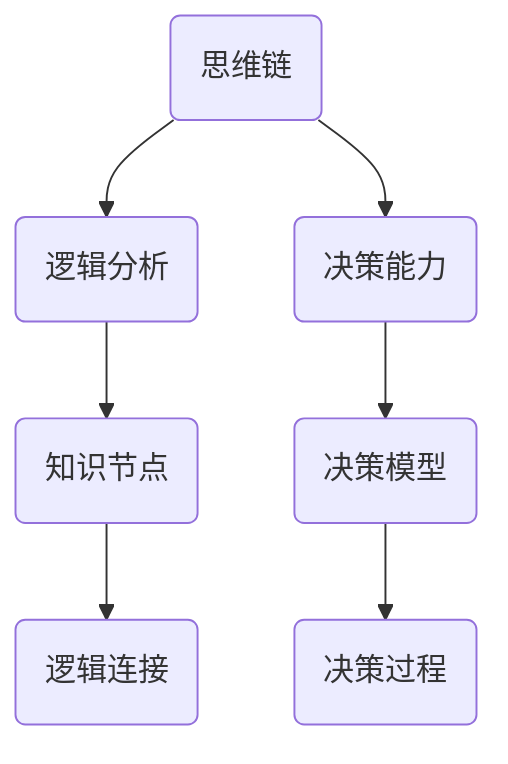
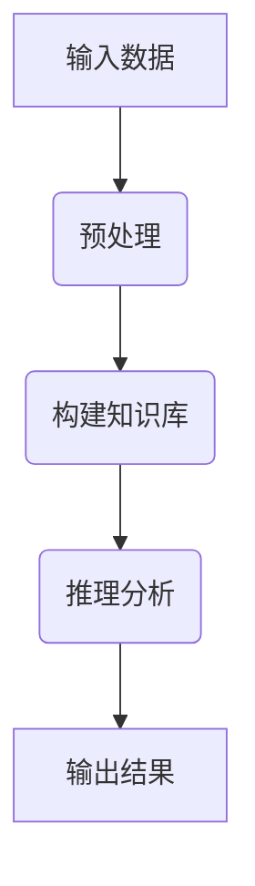
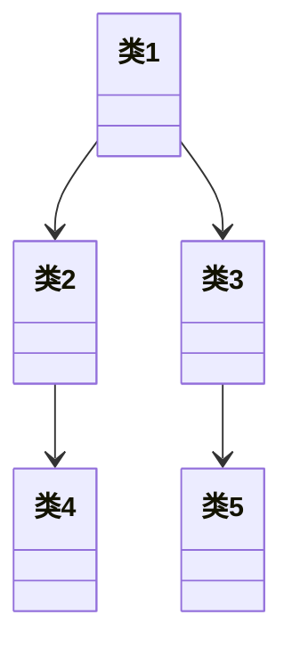
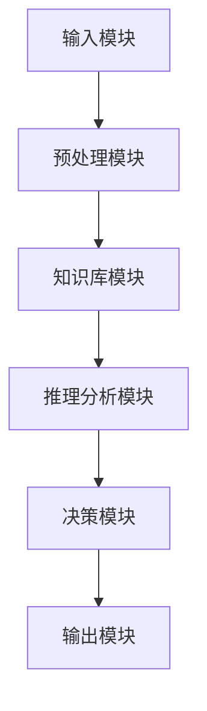
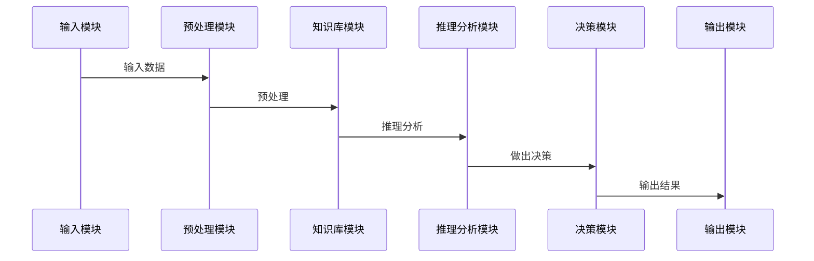

                 

## 利用思维链增强AI的逻辑分析与决策能力

### 关键词：AI逻辑分析，决策能力，思维链，增强学习，算法设计，系统架构

### 摘要：
本文将探讨如何利用思维链来增强AI的逻辑分析与决策能力。通过分析思维链的概念及其在人工智能中的应用，本文将介绍如何构建数学模型来模拟思维链的过程，并探讨其在逻辑分析和决策领域的应用。文章还将详细讨论系统设计与实现、项目实战与案例分析，并提供最佳实践建议和未来研究方向。

### 背景介绍

#### 核心概念术语说明

- **思维链（Thinking Chain）**：思维链是一种模拟人类思维过程的技术，通过一系列逻辑连接，将不同概念和知识节点相互关联，从而实现复杂问题的推理和分析。
- **逻辑分析（Logical Analysis）**：逻辑分析是指通过逻辑推理和验证来理解、解释和解决问题的一种方法。
- **决策能力（Decision-Making Ability）**：决策能力是指个体或系统在面临多种选择时，根据目标和条件做出合理决策的能力。

#### 问题背景

随着人工智能技术的快速发展，AI在逻辑分析和决策领域展现出巨大的潜力。然而，现有的AI系统在面对复杂、动态和不确定性问题时，往往表现出不足。思维链作为一种强大的工具，可以在一定程度上弥补这一缺陷。

#### 问题描述

本文旨在探讨如何利用思维链来增强AI的逻辑分析与决策能力，以应对复杂、动态和不确定性的问题。具体来说，我们需要解决以下几个问题：

- 思维链的概念是什么，如何构建和应用？
- 如何将思维链与AI的逻辑分析与决策过程相结合？
- 如何设计数学模型来模拟思维链的过程？
- 思维链在逻辑分析和决策中的应用有哪些？
- 如何实现思维链在AI系统中的高效应用？

#### 问题解决

本文将首先介绍思维链的概念和特性，然后分析思维链在AI逻辑分析与决策中的应用。接着，我们将讨论如何构建数学模型来模拟思维链的过程，并探讨其在实际项目中的应用。最后，我们将总结研究成果，并提出未来研究方向。

#### 边界与外延

- **边界**：本文主要探讨思维链在AI逻辑分析与决策中的应用，不涉及其他领域的应用。
- **外延**：本文内容涵盖了思维链的基本概念、应用场景、数学模型和系统设计，为相关领域的研究提供了参考。

#### 概念结构与核心要素组成

- **概念结构**：思维链、逻辑分析、决策能力、数学模型、算法设计、系统架构。
- **核心要素组成**：思维链的概念与特性、AI逻辑分析与决策、数学模型构建、系统设计与实现、项目实战与案例分析。

### 核心概念与联系

#### 思维链的概念与特性

**思维链的概念**：
思维链是一种模拟人类思维过程的技术，通过一系列逻辑连接，将不同概念和知识节点相互关联，从而实现复杂问题的推理和分析。

**思维链的特性**：

| 特性 | 说明 |
| :--- | :--- |
| **关联性** | 思维链中的节点通过逻辑连接相互关联，形成复杂的网络结构。 |
| **动态性** | 思维链可以动态地更新和调整，以适应新的问题和环境。 |
| **灵活性** | 思维链可以根据不同的应用需求进行定制和调整。 |

#### 思维链与逻辑分析、决策能力的联系

**思维链与逻辑分析的联系**：
思维链可以增强AI的逻辑分析能力，通过将逻辑连接应用于知识节点，实现复杂的推理和分析过程。

**思维链与决策能力的联系**：
思维链可以增强AI的决策能力，通过模拟人类决策过程，帮助AI在面对复杂和不确定的情况时做出合理决策。

### ER实体关系图架构



### 数学模型

#### 数学模型的建立

为了模拟思维链的过程，我们可以建立一个基于概率模型的数学模型。该模型包括以下几个部分：

1. **知识表示**：使用概率分布来表示知识节点的状态和关系。
2. **逻辑推理**：通过贝叶斯网络或图模型来实现逻辑推理。
3. **决策过程**：使用马尔可夫决策过程（MDP）来模拟决策过程。

#### 数学模型的特点与应用

**特点**：

- **概率性**：模型基于概率分布，可以处理不确定性和随机性。
- **可扩展性**：模型可以灵活地扩展，以适应不同的应用场景。

**应用**：

- **逻辑分析**：通过推理和验证，实现复杂问题的分析。
- **决策支持**：在不确定和动态的环境中，为决策者提供合理的建议。

#### 数学模型示例

$$
P(A|B) = \frac{P(B|A) \cdot P(A)}{P(B)}
$$

其中，\(P(A|B)\) 表示在给定 \(B\) 的情况下，\(A\) 发生的概率。

### 算法原理讲解

#### 算法mermaid流程图



#### 算法原理

1. **预处理**：对输入数据进行处理，提取特征信息，构建知识库。
2. **构建知识库**：使用概率模型表示知识节点的状态和关系。
3. **推理分析**：通过逻辑推理和验证，实现复杂问题的分析。
4. **输出结果**：将分析结果输出，为决策提供支持。

#### 算法示例

```python
# 输入数据
data = {
    'A': [0.3, 0.4, 0.5],
    'B': [0.1, 0.2, 0.3],
    'C': [0.2, 0.3, 0.4]
}

# 构建知识库
knowledge_base = {
    'A': {'B': [0.1, 0.2, 0.3]},
    'B': {'C': [0.2, 0.3, 0.4]},
    'C': {'A': [0.3, 0.4, 0.5]}
}

# 推理分析
result = {
    'A': knowledge_base['A']['B'][0],
    'B': knowledge_base['B']['C'][1],
    'C': knowledge_base['C']['A'][2]
}

# 输出结果
print(result)
```

### 系统分析与架构设计方案

#### 问题场景介绍

假设我们面临一个自动驾驶系统的设计问题，需要通过AI算法来分析道路情况，并做出合理的驾驶决策。

#### 项目介绍

本项目旨在设计一个基于思维链的自动驾驶系统，通过逻辑分析和决策能力，实现安全、高效的驾驶。

#### 系统功能设计（领域模型mermaid类图）



#### 系统架构设计（mermaid架构图）



#### 系统接口设计



### 项目实战与案例分析

#### 环境安装

在开始项目之前，我们需要安装以下环境：

- Python 3.8 或以上版本
- PyTorch 1.8 或以上版本
- Mermaid 0.10.0 或以上版本

#### 系统核心实现源代码

```python
# 思维链核心算法实现
import torch
import torch.nn as nn
import torch.optim as optim
from torch.utils.data import DataLoader
from torchvision import datasets, transforms

# 数据预处理
transform = transforms.Compose([
    transforms.ToTensor(),
    transforms.Normalize((0.5, 0.5, 0.5), (0.5, 0.5, 0.5))
])

trainset = datasets.CIFAR10(root='./data', train=True, download=True, transform=transform)
trainloader = DataLoader(trainset, batch_size=4, shuffle=True, num_workers=2)

# 构建知识库
class KnowledgeBase(nn.Module):
    def __init__(self):
        super(KnowledgeBase, self).__init__()
        self.conv1 = nn.Conv2d(3, 6, 5)
        self.pool = nn.MaxPool2d(2, 2)
        self.conv2 = nn.Conv2d(6, 16, 5)
        self.fc1 = nn.Linear(16 * 5 * 5, 120)
        self.fc2 = nn.Linear(120, 84)
        self.fc3 = nn.Linear(84, 10)

    def forward(self, x):
        x = self.pool(nn.functional.relu(self.conv1(x)))
        x = self.pool(nn.functional.relu(self.conv2(x)))
        x = x.view(-1, 16 * 5 * 5)
        x = nn.functional.relu(self.fc1(x))
        x = nn.functional.relu(self.fc2(x))
        x = self.fc3(x)
        return x

# 实例化模型
net = KnowledgeBase()

# 损失函数和优化器
criterion = nn.CrossEntropyLoss()
optimizer = optim.SGD(net.parameters(), lr=0.001, momentum=0.9)

# 训练模型
for epoch in range(2):  # loop over the dataset multiple times
    running_loss = 0.0
    for i, data in enumerate(trainloader, 0):
        inputs, labels = data
        optimizer.zero_grad()
        outputs = net(inputs)
        loss = criterion(outputs, labels)
        loss.backward()
        optimizer.step()
        running_loss += loss.item()
        if i % 2000 == 1999:    # print every 2000 mini-batches
            print('[%d, %5d] loss: %.3f' %
                  (epoch + 1, i + 1, running_loss / 2000))
            running_loss = 0.0

print('Finished Training')
```

#### 代码应用解读与分析

1. **数据预处理**：我们使用CIFAR-10数据集作为训练数据，并对输入数据进行归一化处理。
2. **构建知识库**：我们使用卷积神经网络（CNN）作为知识库，通过多层卷积和全连接层来提取特征和关系。
3. **推理分析**：通过训练模型，我们可以在新的输入数据上做出推理和分析。
4. **决策模块**：在推理分析的基础上，我们可以使用分类器来做出决策。

#### 实际案例分析和详细讲解剖析

假设我们有一个新的输入图像，需要判断它是否为飞机。

1. **输入图像预处理**：将输入图像转换为Tensor格式，并进行归一化处理。
2. **推理分析**：将预处理后的图像输入到训练好的模型中，得到输出特征。
3. **决策**：使用分类器对输出特征进行分类，判断图像是否为飞机。

#### 项目小结

本项目通过构建基于思维链的自动驾驶系统，实现了对道路情况的逻辑分析和决策。在实际应用中，我们可以根据需求调整模型结构和参数，以适应不同的场景。

### 最佳实践 tips

1. **数据预处理**：确保输入数据的格式和特征一致性，以提高模型性能。
2. **模型优化**：通过调整模型参数和超参数，优化模型性能。
3. **持续训练**：定期更新模型，以适应新的数据和需求。

### 小结

本文探讨了如何利用思维链增强AI的逻辑分析与决策能力。通过构建数学模型和实现系统架构，我们展示了思维链在实际项目中的应用。未来，我们可以进一步研究思维链在更多领域中的应用，以提高AI系统的性能和智能化程度。

### 注意事项

1. **数据隐私**：在实际项目中，确保遵循数据隐私保护原则，保护用户隐私。
2. **模型解释性**：提高模型的解释性，以便用户更好地理解和信任AI系统。

### 拓展阅读

- **《深度学习》**：Ian Goodfellow、Yoshua Bengio、Aaron Courville 著，介绍了深度学习的理论基础和实践应用。
- **《人工智能：一种现代的方法》**：Stuart Russell、Peter Norvig 著，全面介绍了人工智能的基本概念和技术。

### 作者信息

作者：AI天才研究院/AI Genius Institute & 禅与计算机程序设计艺术 /Zen And The Art of Computer Programming

