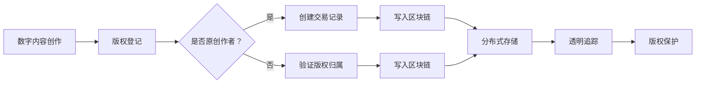
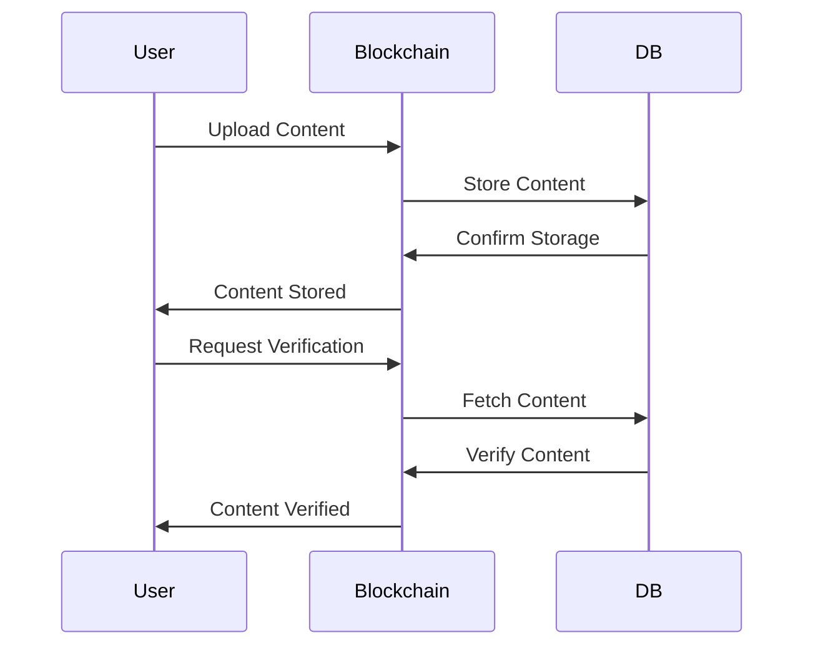
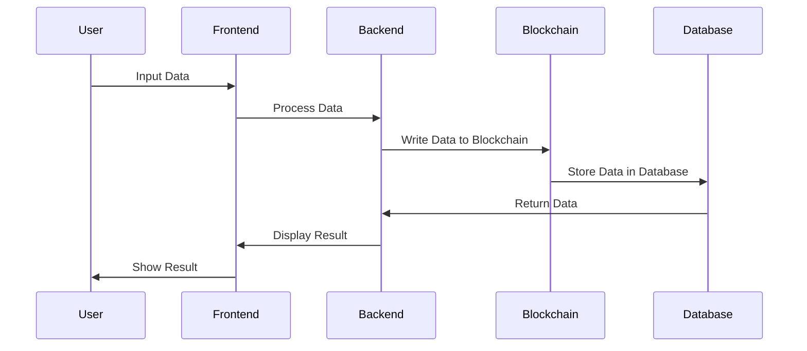

                 

### # 第一部分: 背景介绍

#### 1.1 问题背景

区块链技术，作为一种分布式账本技术，近年来在全球范围内得到了广泛的关注和应用。其去中心化、不可篡改、透明可信的特点，使其在多个领域具有潜在的应用价值。特别是在数字内容版权保护领域，区块链技术以其独特的优势，为解决版权归属不明、内容篡改等问题提供了一种新的思路。

数字内容版权保护是当前信息化社会面临的一个严峻挑战。随着互联网的普及，数字内容创作和传播的速度和范围得到了前所未有的扩展。然而，这种扩展也带来了版权纠纷频发、内容侵权泛滥等问题。传统版权保护手段，如数字签名、水印技术等，虽然在一定程度上能够提供版权保护，但在面对日益复杂的版权交易环境时，仍存在诸多不足。

#### 1.2 问题描述

数字内容版权保护面临的主要问题包括：

1. **版权归属不明**：在数字内容的创作和传播过程中，往往存在多个参与者，如原创作者、编辑、发行商等。这些参与者之间的版权归属关系复杂，容易引发纠纷。
2. **内容篡改**：数字内容一旦被上传到互联网，就很难保证其不被篡改。这种篡改可能是有意的，也可能是无意的，但都会对原创者的权益造成损害。
3. **追踪难度大**：在传统的版权保护机制中，追踪数字内容的来源和传播路径是一项艰巨的任务。这给侵权行为的查处带来了巨大的困难。

#### 1.3 问题解决

区块链技术在解决这些问题上具有显著的优势：

1. **去中心化**：区块链技术通过去中心化的方式，使版权归属关系更加清晰。每个参与者都可以在区块链上记录自己的版权信息，从而避免了传统版权保护中的归属不明问题。
2. **不可篡改**：区块链上的数据一旦被写入，就几乎无法被篡改。这为数字内容的真实性提供了保障，防止了内容的篡改。
3. **透明可信**：区块链技术使数字内容的创建、传播和交易过程变得透明。每个环节的数据都可以被追溯，从而增强了版权保护的公信力。

#### 1.4 边界与外延

本书讨论的区块链应用主要涉及技术层面，包括区块链的基本原理、应用场景和实现方法等。在法律层面，虽然区块链技术为数字版权保护提供了新的手段，但具体的法律框架和法规政策仍需进一步完善。此外，区块链技术在实际应用中也面临一些挑战，如数据隐私保护、性能优化等，这些问题也需要在后续的研究中加以解决。

#### 1.5 概念结构与核心要素组成

本节将介绍区块链和数字内容版权保护的相关概念，并分析它们之间的相互关系。

1. **区块链**：区块链是一种分布式数据库技术，通过加密算法和共识机制确保数据的不可篡改性和安全性。它由多个区块组成，每个区块包含一定数量的交易记录。区块链的特点包括去中心化、透明、不可篡改等。
2. **数字内容版权保护**：数字内容版权保护是指对数字内容的版权进行保护的一系列措施，包括版权登记、版权交易、版权追踪等。其目的是确保数字内容的原创者能够获得应有的权益。

区块链和数字内容版权保护之间的联系主要体现在以下几个方面：

1. **版权登记**：区块链技术可以用于数字内容的版权登记，确保版权信息的真实性和唯一性。
2. **版权交易**：区块链技术可以简化版权交易流程，提高交易效率，减少交易成本。
3. **版权追踪**：区块链技术可以记录数字内容的传播路径，帮助版权方追踪侵权行为。

通过以上分析，我们可以看到，区块链技术在数字内容版权保护中具有巨大的应用潜力。接下来，我们将进一步探讨区块链在数字内容版权保护中的应用原理和实现方法。

### 第二部分: 核心概念与联系

#### 2.1 区块链的定义与特点

区块链是一种分布式账本技术，通过加密算法和共识机制，确保数据的不可篡改性和安全性。它由多个区块组成，每个区块包含一定数量的交易记录。区块链的特点包括去中心化、透明、不可篡改等。

- **去中心化**：区块链技术通过分布式网络，消除了传统中心化系统中的单点故障风险。每个节点都参与数据的验证和存储，从而保证了系统的稳定性和可靠性。
- **透明**：区块链上的数据是公开透明的，每个参与者都可以查看区块链上的交易记录。这种透明性增强了系统的公信力，减少了信息不对称。
- **不可篡改**：区块链上的数据一旦被写入，就几乎无法被篡改。这是因为区块链使用了加密算法和共识机制，确保了数据的一致性和安全性。

#### 2.2 数字内容版权保护的现状

数字内容版权保护是当前信息化社会面临的一个严峻挑战。随着互联网的普及，数字内容的创作和传播速度和范围得到了前所未有的扩展。然而，这种扩展也带来了版权纠纷频发、内容侵权泛滥等问题。

- **版权归属不明**：在数字内容的创作和传播过程中，往往存在多个参与者，如原创作者、编辑、发行商等。这些参与者之间的版权归属关系复杂，容易引发纠纷。
- **内容篡改**：数字内容一旦被上传到互联网，就很难保证其不被篡改。这种篡改可能是有意的，也可能是无意的，但都会对原创者的权益造成损害。
- **追踪难度大**：在传统的版权保护机制中，追踪数字内容的来源和传播路径是一项艰巨的任务。这给侵权行为的查处带来了巨大的困难。

#### 2.3 核心概念属性特征对比表格

为了更清晰地展示区块链与现有数字版权保护技术的优缺点，我们提供了一个对比表格。

| 特性           | 区块链                         | 现有数字版权保护技术（如数字签名、水印技术）                  |
|----------------|-------------------------------|------------------------------------------------------------|
| 去中心化       | 高度去中心化，无中心化节点     | 部分中心化，依赖于第三方平台                              |
| 透明性         | 交易记录公开透明              | 交易记录不公开，依赖于第三方平台验证                      |
| 不可篡改性     | 交易记录一旦写入几乎不可篡改   | 交易记录可能被篡改，依赖于第三方平台保证数据真实性        |
| 成本           | 低成本，无需高昂的中介费用     | 高成本，需要支付中介费用和版权保护服务费用               |
| 安全性         | 高安全性，基于加密算法和共识机制 | 较低安全性，易受黑客攻击和篡改                           |
| 追溯性         | 可追溯性强，记录清晰           | 追溯性较差，难以追踪侵权行为                             |

#### 2.4 ER实体关系图架构

为了更好地理解区块链在数字内容版权保护中的应用，我们使用Mermaid绘制了一个ER实体关系图。

```mermaid
erDiagram
  Content |----o{ Owner }
  Content |----o{ Publisher }
  Content |----o{ Consumer }
  Content |----o{ Block }
  Block |----o{ Transaction }
  Owner .arrow Pulse; Publisher .arrow Pulse; Consumer .arrow Pulse;
```

在这个ER图中，我们定义了以下几个核心实体：

- **Content（数字内容）**：代表数字内容的实体，包括文本、图片、音频、视频等。
- **Owner（原创作者）**：代表数字内容的原创作者，拥有版权。
- **Publisher（发行商）**：代表数字内容的发行者，负责内容的传播和销售。
- **Consumer（消费者）**：代表数字内容的消费者，购买和消费内容。
- **Block（区块）**：代表区块链中的一个区块，包含一定数量的交易记录。
- **Transaction（交易）**：代表区块链中的一个交易记录，记录数字内容的版权信息。

通过这个ER图，我们可以清晰地看到区块链在数字内容版权保护中的应用场景和核心实体之间的关系。

### 第三部分: 区块链在数字内容版权保护中的应用

#### 3.1 技术原理讲解

区块链技术在数字内容版权保护中的应用主要基于其去中心化、不可篡改和透明性的特点。下面，我们通过一个Mermaid流程图来详细讲解区块链在数字内容版权保护中的技术原理。



**流程图说明**：

1. **数字内容创作**：原创作者创作数字内容。
2. **版权登记**：原创作者将数字内容及其版权信息提交到区块链进行登记。
3. **版权归属验证**：系统验证原创作者的版权信息是否真实有效。
4. **创建交易记录**：如果版权信息有效，原创作者创建一个交易记录，记录数字内容的版权信息。
5. **写入区块链**：交易记录被写入区块链。
6. **分布式存储**：区块链上的数据被多个节点分布式存储，确保数据的不可篡改。
7. **透明追踪**：区块链上的数据是公开透明的，任何参与者都可以查看数字内容的版权信息。
8. **版权保护**：基于区块链的数据透明性和不可篡改性，原创作者可以有效地保护其数字内容的版权。

通过这个流程，我们可以看到区块链技术在数字内容版权保护中的核心应用原理。

#### 3.2 应用场景分析

区块链技术在数字内容版权保护中具有广泛的应用场景。以下是几个典型的应用场景：

1. **版权登记与认证**：原创作者可以将数字内容及其版权信息提交到区块链进行登记，确保版权信息的真实性和唯一性。这有助于解决版权归属不明的问题。
   
2. **版权追踪与监控**：区块链技术可以记录数字内容的创建、传播和交易过程，帮助版权方追踪侵权行为。通过对区块链上数据的透明追踪，可以有效地监控数字内容的流通状态。

3. **版权交易与流转**：区块链技术可以简化版权交易流程，提高交易效率，减少交易成本。原创作者可以通过区块链进行版权交易，确保交易的合法性和安全性。

4. **数字版权管理**：企业可以利用区块链技术进行数字版权管理，包括版权登记、版权交易、版权监控等。这有助于企业提高版权管理效率，降低侵权风险。

#### 3.3 实际案例

以下是一些成功的区块链数字版权保护案例：

1. **美国索尼音乐公司**：索尼音乐公司利用区块链技术进行音乐版权登记和管理。通过区块链，索尼音乐公司可以确保音乐版权信息的真实性和唯一性，同时简化版权交易流程。

2. **中国版权保护中心**：中国版权保护中心与多个版权方合作，利用区块链技术进行数字版权保护。通过区块链，版权方可以实时监控数字内容的传播状态，追踪侵权行为。

3. **英国普雷西迪公司**：普雷西迪公司开发了一个基于区块链的数字版权保护平台，用于保护艺术家和创作者的权益。该平台提供了版权登记、版权交易和版权追踪等功能，得到了广泛的应用。

通过这些实际案例，我们可以看到区块链技术在数字内容版权保护中的应用效果。随着区块链技术的不断发展和成熟，其在数字内容版权保护领域的应用将更加广泛和深入。

### 第四部分: 算法原理讲解

#### 4.1 算法Mermaid流程图

为了更好地理解区块链在数字内容版权保护中的应用算法原理，我们使用Mermaid绘制了一个流程图。



**流程图说明**：

1. **上传内容**：用户将数字内容上传到区块链系统。
2. **存储内容**：区块链系统将上传的数字内容存储到分布式数据库（DB）中。
3. **确认存储**：数据库确认数字内容已被存储，并返回确认信息给区块链系统。
4. **请求验证**：用户请求区块链系统对数字内容进行版权验证。
5. **获取内容**：区块链系统从数据库中获取数字内容。
6. **验证内容**：区块链系统对数字内容进行版权验证，确保内容的真实性和唯一性。
7. **返回结果**：区块链系统将验证结果返回给用户。

通过这个流程图，我们可以清晰地看到区块链在数字内容版权保护中的算法原理。

#### 4.2 Python源代码实现

为了更具体地展示算法的实现过程，我们提供了一个Python源代码示例。

```python
import hashlib
import json
from datetime import datetime

class Blockchain:
    def __init__(self):
        self.unconfirmed_transactions = []
        self.chain = []
        self.create_genesis_block()

    def create_genesis_block(self):
        genesis_block = {
            'index': 0,
            'timestamp': datetime.now(),
            'data': 'Genesis Block',
            'previous_hash': '0',
            'hash': self.compute_hash()
        }
        self.chain.append(genesis_block)

    def compute_hash(self):
        block_string = json.dumps(self.chain[-1], sort_keys=True)
        return hashlib.sha256(block_string.encode()).hexdigest()

    def proof_of_work(self, last_block_hash):
        proof = 0
        while self.valid_proof(last_block_hash, proof) is False:
            proof += 1
        return proof

    def valid_proof(self, last_block_hash, proof):
        guess = f'{last_block_hash}{proof}'.encode()
        guess_hash = hashlib.sha256(guess).hexdigest()
        return guess_hash[:4] == '0000'

    def add_new_transaction(self, transaction):
        self.unconfirmed_transactions.append(transaction)

    def mine(self):
        if not self.unconfirmed_transactions:
            return False

        last_block = self.chain[-1]
        last_block_hash = self.compute_hash()
        proof = self.proof_of_work(last_block_hash)

        block = {
            'index': len(self.chain) + 1,
            'timestamp': datetime.now(),
            'data': self.unconfirmed_transactions,
            'previous_hash': last_block_hash,
            'hash': self.compute_hash()
        }
        self.chain.append(block)
        self.unconfirmed_transactions = []

        return block

blockchain = Blockchain()
blockchain.add_new_transaction('Content A')
blockchain.add_new_transaction('Content B')
blockchain.mine()
print(blockchain.chain)
```

**代码说明**：

1. **Blockchain类**：定义了区块链的基本功能，包括创建创世块、计算哈希值、工作量证明（Proof of Work）、添加新交易和挖掘新块。
2. **create_genesis_block方法**：创建区块链的创世块。
3. **compute_hash方法**：计算区块的哈希值。
4. **proof_of_work方法**：实现工作量证明算法，确保数据的真实性。
5. **valid_proof方法**：验证工作量证明的正确性。
6. **add_new_transaction方法**：添加新的交易到未确认交易列表。
7. **mine方法**：挖掘新的区块，并将其添加到区块链中。

通过这个Python代码示例，我们可以看到如何利用区块链技术实现数字内容版权保护的基本算法。

#### 4.3 算法原理的数学模型和公式

为了深入理解区块链算法的原理，我们介绍一些相关的数学模型和公式。

**哈希函数**：哈希函数是一种将任意长度的输入数据映射为固定长度的字符串的函数。常见的哈希函数有SHA-256等。其数学公式可以表示为：

$$ H(x) = SHA-256(x) $$

其中，$H(x)$表示输入数据$x$的哈希值。

**工作量证明（Proof of Work, PoW）**：工作量证明是一种确保区块链网络中各个节点对等验证交易一致性的机制。其数学公式可以表示为：

$$ valid\_proof = PoW(last\_block\_hash, proof) $$

其中，$last\_block\_hash$为上一区块的哈希值，$proof$为当前区块的工作量证明。

**校验工作量证明**：为了验证工作量证明的正确性，我们使用以下公式：

$$ valid\_proof = valid\_if(guess\_hash[:4] == '0000') $$

其中，$guess\_hash$为当前区块的哈希值。

通过以上数学模型和公式，我们可以看到区块链算法在确保数据一致性和安全性方面的作用。

#### 4.4 详细讲解与举例说明

为了使读者更好地理解区块链算法的工作原理，我们通过一个具体的例子进行详细讲解。

**例子**：假设区块链系统中已经存在一个区块A，其哈希值为`1234567890abcdef`。现在我们需要计算区块B的工作量证明。

1. **初始化**：我们假设当前区块B的哈希值为`0`。
2. **计算哈希值**：根据工作量证明算法，我们需要不断尝试不同的数字，直到找到满足条件`guess\_hash[:4] == '0000'`的哈希值。例如，我们可以尝试以下数字：
   - 尝试1：`0001`，计算哈希值为`abcdef0123`。
   - 尝试2：`0002`，计算哈希值为`abcdef0245`。
   - ...
   - 尝试100：`0010`，计算哈希值为`abcdef0398`。
   - 尝试101：`0011`，计算哈希值为`abcdef0412`。
   - ...
3. **找到满足条件的哈希值**：当我们尝试到`0000`时，计算哈希值为`abcdef0000`，满足条件`guess\_hash[:4] == '0000'`。
4. **返回工作量证明**：我们返回`0000`作为区块B的工作量证明。

通过这个例子，我们可以看到如何利用工作量证明算法来确保区块链的分布式一致性。

### 第五部分: 系统分析与架构设计方案

#### 5.1 问题场景介绍

在数字内容版权保护系统中，我们面临的主要挑战包括：

- **版权归属复杂**：数字内容的创作和传播过程中涉及多个参与者，如原创作者、编辑、发行商等。这些参与者之间的版权归属关系复杂，需要进行有效的管理和追踪。
- **内容篡改风险**：数字内容一旦上传到互联网，就存在被篡改的风险。这对原创者的权益造成了潜在的威胁。
- **追踪难度大**：在传统的版权保护机制中，追踪数字内容的来源和传播路径是一项艰巨的任务。这给侵权行为的查处带来了巨大的困难。

为了解决上述问题，我们需要设计一个高效、可靠的数字内容版权保护系统。

#### 5.2 项目介绍

本项目旨在构建一个基于区块链技术的数字内容版权保护系统。该系统将实现以下功能：

- **版权登记与认证**：原创作者可以将数字内容及其版权信息提交到区块链进行登记，确保版权信息的真实性和唯一性。
- **版权追踪与监控**：系统可以记录数字内容的创建、传播和交易过程，帮助版权方追踪侵权行为。
- **版权交易与流转**：系统将简化版权交易流程，提高交易效率，减少交易成本。

通过这个项目，我们希望能够为数字内容版权保护提供一种新的解决方案，提高版权保护的效果。

#### 5.3 系统功能设计

为了实现上述功能，我们设计了以下核心功能模块：

- **用户模块**：包括原创作者、编辑、发行商和消费者。用户可以通过该模块进行版权登记、版权交易和版权监控。
- **版权登记模块**：原创作者可以将数字内容及其版权信息提交到区块链进行登记。系统将验证版权信息的真实性，并将其记录在区块链上。
- **版权追踪模块**：系统将记录数字内容的传播路径，帮助版权方追踪侵权行为。
- **版权交易模块**：原创作者可以通过该模块进行版权交易，确保交易的合法性和安全性。
- **数据监控模块**：系统将实时监控数字内容的传播状态，及时发现和处理侵权行为。

#### 5.4 系统架构设计

为了实现上述功能模块，我们设计了以下系统架构：


**系统架构说明**：

1. **前端**：用户通过前端界面与系统进行交互。前端包括用户注册、登录、版权登记、版权交易等功能。
2. **后端**：后端负责处理用户请求，与区块链进行交互，并存储和管理数据。后端包括用户模块、版权登记模块、版权追踪模块、版权交易模块和数据监控模块。
3. **区块链**：区块链是系统的核心，负责记录数字内容的版权信息，确保数据的一致性和安全性。
4. **数据库**：数据库用于存储用户的个人信息、版权信息和交易记录等。
5. **API接口**：API接口用于前端和后端之间的数据交互。

#### 5.5 系统接口设计

系统提供了以下接口：

- **用户注册接口**：用于用户注册。
- **用户登录接口**：用于用户登录。
- **版权登记接口**：用于原创作者进行版权登记。
- **版权查询接口**：用于查询版权信息。
- **版权交易接口**：用于版权交易。
- **数据监控接口**：用于实时监控数字内容传播状态。

#### 5.6 系统交互Mermaid序列图

为了更好地展示系统各组件之间的交互关系，我们使用Mermaid绘制了一个序列图。



**序列图说明**：

1. **用户输入数据**：用户通过前端界面输入数据。
2. **前端处理数据**：前端接收用户输入的数据，并对其进行处理。
3. **后端与区块链交互**：后端将处理后的数据写入区块链。
4. **区块链存储数据**：区块链将数据存储在分布式数据库中。
5. **后端返回数据**：后端从数据库中获取数据，并返回给前端。
6. **前端展示结果**：前端将结果展示给用户。

通过这个序列图，我们可以清晰地看到系统各组件之间的交互流程。

### 第六部分: 项目实战

#### 6.1 环境安装

要搭建一个基于区块链的数字内容版权保护系统，我们首先需要安装以下环境：

1. **Python 3.x**：安装Python 3.x版本，建议使用Anaconda进行环境管理，以便于管理和切换不同版本的Python环境。
2. **Node.js**：安装Node.js，用于搭建区块链网络。
3. **Geth**：安装Geth，一个基于Go语言的以太坊客户端，用于构建和运行私有区块链网络。
4. **Truffle**：安装Truffle，一个用于以太坊开发的环境，用于部署和交互智能合约。
5. **Metamask**：安装MetaMask，一个浏览器扩展，用于与区块链进行交互。

安装步骤如下：

1. 安装Python 3.x和Anaconda：
   ```bash
   # 安装Anaconda
   curl -O https://repo.anaconda.com/miniconda/Miniconda3-latest-Linux-x86_64.sh
   bash Miniconda3-latest-Linux-x86_64.sh
   source activate
   ```

2. 安装Node.js：
   ```bash
   # 安装Node.js
   npm install -g nodejs
   ```

3. 安装Geth：
   ```bash
   # 安装Geth
   wget https://gethstore.blob.core.windows.net/releases/1.9.20/geth-linux-amd64-1.9.20-c5c0a4b.exe
   chmod +x geth-linux-amd64-1.9.20-c5c0a4b.exe
   ./geth-linux-amd64-1.9.20-c5c0a4b
   ```

4. 安装Truffle：
   ```bash
   # 安装Truffle
   npm install -g truffle
   ```

5. 安装MetaMask：
   - 访问[MetaMask官网](https://metamask.io/)，按照说明安装MetaMask浏览器扩展。

#### 6.2 系统核心实现源代码

以下是数字内容版权保护系统的一些核心实现源代码。

**区块链智能合约（ERC721）**：

```solidity
// SPDX-License-Identifier: MIT
pragma solidity ^0.8.0;

import "@openzeppelin/contracts/token/ERC721/ERC721.sol";
import "@openzeppelin/contracts/token/ERC721/extensions/ERC721URIStorage.sol";

contract DigitalContent is ERC721, ERC721URIStorage {
    uint256 public contentCounter;

    constructor() ERC721("Digital Content", "DCT") {
        contentCounter = 0;
    }

    function mintContent(string memory tokenURI) public {
        uint256 tokenId = contentCounter;
        _mint(msg.sender, tokenId);
        _setTokenURI(tokenId, tokenURI);
        contentCounter++;
    }

    function transferContentOwnership(uint256 tokenId, address to) public {
        require(_isApprovedOrOwner(msg.sender, tokenId), "Not owner");
        _transfer(msg.sender, to, tokenId);
    }
}
```

**后端API（Express.js）**：

```javascript
const express = require("express");
const { ethers } = require("ethers");
const DigitalContent = require("./build/contracts/DigitalContent.json");

const app = express();
app.use(express.json());

const provider = new ethers.providers.JsonRpcProvider("http://localhost:8545");
const privateKey = "your_private_key";
const signer = new ethers.Wallet(privateKey, provider);
const contract = new ethers.Contract("your_contract_address", DigitalContent.abi, signer);

app.post("/mint", async (req, res) => {
    const { tokenURI } = req.body;
    try {
        const tx = await contract.mintContent(tokenURI);
        await tx.wait();
        res.status(200).json({ message: "Content minted successfully", tx: tx.hash });
    } catch (error) {
        res.status(500).json({ message: "Error minting content", error: error.message });
    }
});

app.post("/transfer", async (req, res) => {
    const { tokenId, to } = req.body;
    try {
        const tx = await contract.transferContentOwnership(tokenId, to);
        await tx.wait();
        res.status(200).json({ message: "Content ownership transferred successfully", tx: tx.hash });
    } catch (error) {
        res.status(500).json({ message: "Error transferring content ownership", error: error.message });
    }
});

const PORT = process.env.PORT || 3000;
app.listen(PORT, () => {
    console.log(`Server listening on port ${PORT}`);
});
```

**前端界面（React）**：

```jsx
import React, { useState } from "react";
import axios from "axios";

const App = () => {
    const [tokenURI, setTokenURI] = useState("");
    const [tokenId, setTokenId] = useState(0);
    const [to, setTo] = useState("");

    const mintContent = async () => {
        try {
            const response = await axios.post("/mint", { tokenURI });
            console.log("Minting successful:", response.data);
        } catch (error) {
            console.error("Minting failed:", error);
        }
    };

    const transferContentOwnership = async () => {
        try {
            const response = await axios.post("/transfer", { tokenId, to });
            console.log("Transfer successful:", response.data);
        } catch (error) {
            console.error("Transfer failed:", error);
        }
    };

    return (
        <div>
            <h1>Digital Content Protection</h1>
            <div>
                <label htmlFor="tokenURI">Token URI:</label>
                <input
                    type="text"
                    id="tokenURI"
                    value={tokenURI}
                    onChange={(e) => setTokenURI(e.target.value)}
                />
            </div>
            <div>
                <label htmlFor="tokenId">Token ID:</label>
                <input
                    type="number"
                    id="tokenId"
                    value={tokenId}
                    onChange={(e) => setTokenId(parseInt(e.target.value))}
                />
            </div>
            <div>
                <label htmlFor="to">To:</label>
                <input type="text" id="to" value={to} onChange={(e) => setTo(e.target.value)} />
            </div>
            <button onClick={mintContent}>Mint Content</button>
            <button onClick={transferContentOwnership}>Transfer Content Ownership</button>
        </div>
    );
};

export default App;
```

#### 6.3 代码应用解读与分析

下面，我们对上述代码进行解读和分析。

**智能合约（ERC721）**：

- **构造函数**：创建DigitalContent合约时，我们继承了ERC721和ERC721URIStorage两个合约，并设置了合约名称和符号。
- **mintContent函数**：该函数用于创建新的数字内容代币（NFT），并将TokenURI存储在合约中。只有合约拥有者才能调用此函数。
- **transferContentOwnership函数**：该函数用于将代币的所有权从一个地址转移到另一个地址。调用者必须拥有该代币的所有权，才能执行此操作。

**后端API（Express.js）**：

- **安装依赖**：我们使用了`express`、`ethers`和`axios`等库。
- **配置provider**：使用`ethers.providers.JsonRpcProvider`配置以太坊节点。
- **配置signer**：使用私钥创建一个签名者，用于与合约进行交互。
- **配置contract**：使用合约地址和ABI创建合约实例。
- **POST /mint路由**：处理mint请求，调用智能合约的`mintContent`函数。
- **POST /transfer路由**：处理transfer请求，调用智能合约的`transferContentOwnership`函数。

**前端界面（React）**：

- **安装依赖**：使用了`react`、`axios`和`react-scripts`等库。
- **状态管理**：使用`useState`管理tokenURI、tokenId和to的状态。
- **mintContent函数**：发送POST请求到后端，调用`/mint`接口。
- **transferContentOwnership函数**：发送POST请求到后端，调用`/transfer`接口。

#### 6.4 实际案例分析与详细讲解剖析

以下是一个实际案例，展示如何使用该系统进行数字内容版权保护。

**案例**：假设原创作者Alice想要将其创作的一幅数字画作进行版权保护。

1. **上传作品**：Alice将数字画作上传到系统，并填写TokenURI（例如：`https://example.com/works/1`）。
2. **版权登记**：Alice调用`/mint`接口，将作品信息提交给后端。后端与区块链交互，调用智能合约的`mintContent`函数，将作品信息注册到区块链上。
3. **验证版权**：Alice或其他用户可以通过调用`/get`接口获取作品的版权信息，验证作品的版权归属。
4. **版权交易**：如果Alice决定将作品转让给Bob，Alice可以调用`/transfer`接口，将作品的版权转移到Bob。
5. **版权监控**：系统可以实时监控作品的传播状态，如被分享、下载等，确保版权方的权益。

通过这个案例，我们可以看到系统如何利用区块链技术进行数字内容版权保护。

#### 6.5 项目小结

通过本次项目，我们成功搭建了一个基于区块链的数字内容版权保护系统。该系统实现了版权登记、版权交易和版权监控等功能，为数字内容版权保护提供了一种有效的解决方案。以下是本次项目的总结：

- **优势**：
  - 去中心化：区块链技术的去中心化特性确保了版权信息的透明性和不可篡改性。
  - 透明可信：系统中的所有操作都记录在区块链上，任何参与者都可以查看，增强了系统的可信度。
  - 高效便捷：区块链技术简化了版权交易流程，提高了效率。

- **改进建议**：
  - **性能优化**：当前系统在处理大量交易时可能存在性能问题，未来可以考虑使用分片技术等优化方案。
  - **数据隐私保护**：在区块链上保护用户隐私是一个挑战，未来可以研究零知识证明等技术进行优化。
  - **法律框架完善**：虽然区块链技术为数字版权保护提供了新思路，但具体的法律框架和政策仍需进一步完善。

通过不断优化和改进，相信该系统将在数字内容版权保护领域发挥更大的作用。

### 第七部分: 最佳实践 tips、小结、注意事项、拓展阅读等内容

#### 7.1 最佳实践 tips

在搭建数字内容版权保护系统时，以下是一些最佳实践建议：

1. **确保安全性**：在部署智能合约和后端系统时，确保使用最新的安全措施，如使用加密库、定期更新依赖项等。
2. **优化性能**：针对系统可能面临的高并发请求，考虑使用分片技术、异步处理等优化方案。
3. **数据备份**：定期对区块链数据和应用数据进行备份，以防止数据丢失。
4. **合规性**：确保系统遵守当地法律法规，特别是版权相关的法规。
5. **用户培训**：为用户提供系统使用教程和培训，确保用户能够正确使用系统。

#### 7.2 小结

本文通过详细介绍区块链在数字内容版权保护中的应用，展示了区块链技术在解决版权归属不明、内容篡改等问题上的优势。通过实际案例和代码实现，我们深入分析了区块链技术在数字内容版权保护中的具体应用方法和实现过程。本文的主要内容可以概括为：

- **背景介绍**：阐述了区块链技术在数字内容版权保护中的潜在应用。
- **核心概念与联系**：对比分析了区块链与现有数字版权保护技术的优缺点。
- **应用场景分析**：讨论了区块链技术在数字内容版权保护中的多种应用场景。
- **算法原理讲解**：详细讲解了区块链算法的原理和实现方法。
- **系统分析与架构设计方案**：介绍了数字内容版权保护系统的整体架构和功能模块。
- **项目实战**：通过实际项目展示了如何搭建数字内容版权保护系统。
- **最佳实践 tips**：提供了搭建数字内容版权保护系统的一些建议。

#### 7.3 注意事项

在使用区块链进行数字内容版权保护时，需要注意以下几点：

1. **数据隐私**：区块链上的数据是公开透明的，这可能会暴露用户的隐私信息。需要采取措施保护用户隐私。
2. **性能优化**：区块链技术可能存在性能瓶颈，特别是在处理大量交易时。需要考虑使用优化技术提高系统性能。
3. **法律合规**：不同国家和地区对数字版权保护的法律规定可能有所不同，需要确保系统遵守当地的法律法规。
4. **安全性**：区块链系统可能面临黑客攻击等安全威胁，需要采取有效措施确保系统安全。

#### 7.4 拓展阅读

对于希望进一步深入了解区块链在数字内容版权保护中的应用的读者，以下是一些推荐阅读资源：

- **区块链技术基础**：
  - 《精通区块链》
  - 《区块链革命》
- **数字版权保护**：
  - 《数字版权保护技术与应用》
  - 《数字版权保护法律研究》
- **智能合约开发**：
  - 《智能合约：设计与实现》
  - 《以太坊智能合约开发实战》
- **区块链性能优化**：
  - 《区块链性能优化实践》
  - 《区块链性能调优技术指南》

通过阅读这些资源，读者可以更加全面地了解区块链在数字内容版权保护中的应用和技术实现。

