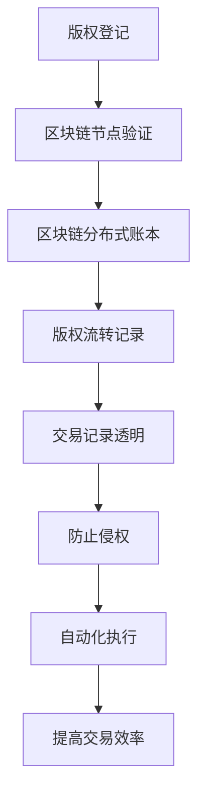
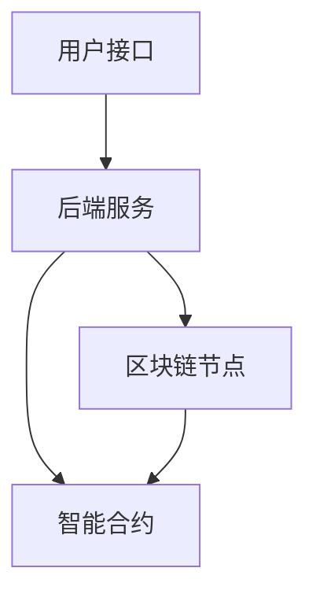
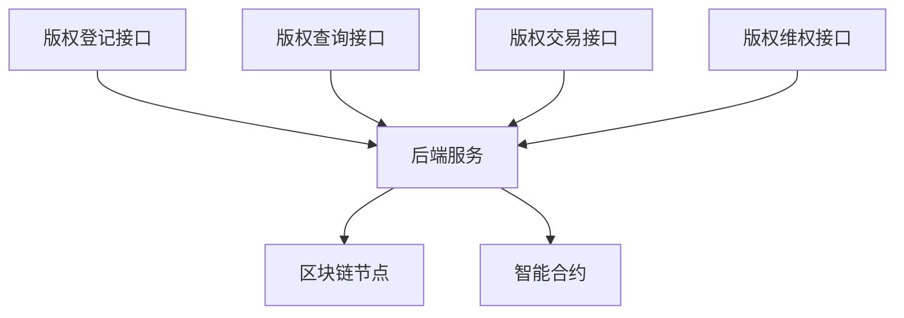
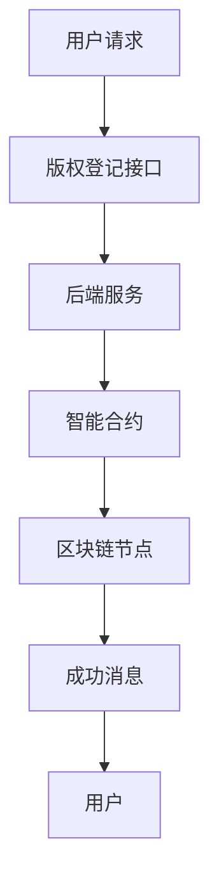

                 

## 《区块链在数字版权管理中的应用》

### 关键词

- 区块链
- 数字版权管理
- 加密技术
- 智能合约
- 分布式账本

### 摘要

本文旨在探讨区块链技术在数字版权管理中的应用。我们将从背景介绍开始，逐步深入分析区块链、数字版权管理及其应用，然后详细讲解区块链在数字版权管理中的算法原理，包括加密技术、分布式账本和智能合约。接着，我们将介绍一个实际的区块链数字版权管理项目，包括系统架构设计、环境安装和核心实现。最后，我们将总结最佳实践，并提供进一步阅读的拓展资源。

## 目录大纲设计思路与步骤

### 1. 确定书籍的核心内容

首先，我们需要明确书籍的主题，即“区块链在数字版权管理中的应用”。这包括理解区块链、数字版权管理的基本概念，以及它们在当前技术环境中的重要性。通过这一步骤，我们可以确定书籍的核心内容，并构建出章节框架。

### 2. 设计大纲框架

接下来，我们将设计一个基本的目录大纲框架，确保它包含以下几个核心部分：

- **背景介绍**：介绍区块链、数字版权管理和它们之间的关系。
- **核心概念与联系**：解释区块链和数字版权管理的关键概念，并通过对比和关系图展示它们之间的联系。
- **算法原理讲解**：解释区块链在数字版权管理中使用的算法原理，包括数学模型和公式。
- **系统分析与架构设计方案**：分析区块链数字版权管理系统的设计，展示系统架构和接口设计。
- **项目实战**：展示一个实际项目案例，从环境安装、系统核心实现到代码解读和分析。
- **最佳实践、小结与拓展阅读**：总结书中的关键点，提供实践建议和进一步阅读的资源。

### 3. 细化每个章节

在每个章节下，我们将进一步细化内容，确保每个章节都有足够的深度和广度。

- **背景介绍**：详细描述区块链和数字版权管理的背景，包括问题背景、问题描述、解决方案等。
- **核心概念与联系**：构建核心概念的特征对比表格和ER实体关系图，解释区块链和数字版权管理之间的关系。
- **算法原理讲解**：使用Mermaid画出算法流程图，使用Python源代码和LaTeX数学公式详细解释算法原理。
- **系统分析与架构设计方案**：描述问题场景，展示系统功能设计、系统架构设计、系统接口设计和系统交互。
- **项目实战**：介绍一个实际项目，包括环境安装、系统核心实现、代码应用解读与分析，以及项目小结。
- **最佳实践、小结与拓展阅读**：总结每个章节的重要信息，提供实践建议和拓展阅读。

### 4. 确保内容完整性

在设计大纲时，我们需要确保包含以下核心内容：

- **核心概念与联系**：区块链、数字版权管理和相关技术的定义、特点、应用场景。
- **算法原理讲解**：区块链算法在数字版权管理中的应用，包括加密、智能合约、分布式账本等。
- **系统分析与架构设计方案**：数字版权管理系统架构设计，包括前端、后端、区块链节点等。
- **项目实战**：一个完整的区块链数字版权管理项目案例，包括从零开始的实现过程。

### 5. 保持简洁性

在编写大纲时，我们将避免冗余内容，确保每个章节都能清晰、简洁地传达核心信息。

## 背景介绍

### 区块链技术概述

区块链技术是一种分布式账本技术，它通过将数据分散存储在多个节点上，形成一个不可篡改的链式结构。区块链的核心特点包括去中心化、透明性和安全性。去中心化意味着没有单一的中心化机构控制网络，而是通过共识算法达成一致。透明性指的是区块链上的所有交易记录都是公开可查的，用户可以随时查看历史交易记录。安全性则来源于区块链的加密技术和共识机制。

区块链技术起源于比特币的诞生，作为一种去中心化的数字货币，比特币的底层技术就是区块链。随着技术的发展，区块链的应用范围逐渐扩展到金融领域以外的其他行业，如供应链管理、医疗记录管理、智能合约等。区块链在数字版权管理中的应用，旨在解决版权确权、交易和维权等难题，提高版权管理的效率。

### 数字版权管理概述

数字版权管理（Digital Rights Management，简称DRM）是一种技术措施，旨在保护数字内容的版权，防止未经授权的复制、传播和使用。随着互联网和数字媒体的快速发展，数字版权管理成为保护知识产权的关键手段。数字版权管理的核心目标是确保版权方能够对其创作内容拥有完全的控制权，同时为合法用户提供便利的访问和使用。

数字版权管理的技术手段包括加密、水印、访问控制等。加密技术通过将数字内容转化为密文，只有拥有正确密钥的用户才能解密和访问。水印技术则通过在数字内容中嵌入不可见的标识，以追踪非法复制和传播。访问控制技术通过设置权限和认证机制，确保只有授权用户才能访问特定的数字内容。

### 区块链与数字版权管理的关系

区块链技术与数字版权管理之间存在紧密的联系。区块链技术的去中心化、透明性和安全性特点，使得它在数字版权管理中具有独特的优势。

首先，区块链的去中心化特性解决了数字版权管理中的授权和验证难题。在传统的版权管理系统中，版权的授权和验证通常依赖于中心化的机构或平台，存在单点故障和信任风险。而区块链的去中心化特性使得版权的授权和验证可以在无需信任的多个节点之间进行，提高了系统的可靠性和效率。

其次，区块链的透明性特征使得数字版权管理中的交易记录可以被所有参与者公开查看，提高了版权交易的透明度。用户可以通过区块链查询版权的流转历史，确保版权的合法性。

最后，区块链的安全性特征保障了数字版权的不可篡改性。区块链的加密技术和共识机制确保了数据一旦写入区块链，就不可篡改，从而有效防止了版权侵权行为。

### 数字版权管理中的问题背景、问题描述、问题解决、边界与外延、概念结构与核心要素组成

在数字版权管理中，存在多个问题和挑战。以下是针对这些问题的详细讨论：

#### 问题背景

随着数字媒体的普及，数字内容的创作和传播变得越来越方便。然而，这也带来了版权保护的问题。传统的数字版权管理手段，如加密和访问控制，虽然提供了一定的保护，但仍然存在一些问题。

#### 问题描述

1. **版权确权困难**：在数字环境中，版权的归属和流转难以证明，尤其是在跨平台和跨国界的情况下。
2. **版权侵权普遍**：由于数字内容的复制和传播非常容易，版权侵权行为屡见不鲜。
3. **交易记录不透明**：在数字版权交易中，交易记录的透明度不高，难以追踪版权的流转过程。
4. **维权成本高**：当版权受到侵犯时，维权成本高且复杂，往往需要法律介入。

#### 问题解决

区块链技术在数字版权管理中的应用，可以解决上述问题。

1. **版权确权**：区块链的去中心化特性使得版权的归属和流转可以在无需信任的多个节点之间进行登记和验证，解决了确权难题。
2. **防止侵权**：区块链的加密技术和不可篡改性保障了数字版权的安全，有效防止了侵权行为。
3. **交易记录透明**：区块链上的交易记录是公开透明的，用户可以随时查询版权的流转历史，提高了交易记录的透明度。
4. **降低维权成本**：区块链技术简化了版权维权的流程，降低了维权成本。

#### 边界与外延

数字版权管理的边界涉及数字内容的创作、传播、使用和维权等环节。外延则包括版权的跨国界流转、跨平台交易和智能合约的应用。

#### 概念结构与核心要素组成

数字版权管理的概念结构包括以下几个核心要素：

1. **版权信息**：包括版权的归属、授权、流转等信息。
2. **加密技术**：用于保护数字版权，防止未经授权的访问和复制。
3. **分布式账本**：记录版权的流转和交易记录，保证透明度和不可篡改性。
4. **智能合约**：实现自动化的版权交易和授权，提高交易效率。

### 核心概念与联系

为了深入理解区块链在数字版权管理中的应用，我们需要详细探讨区块链和数字版权管理的核心概念，并展示它们之间的联系。

#### 区块链的核心概念

1. **区块**：区块是区块链的基本组成单元，包含一定数量的交易记录。每个区块都有一个唯一的标识，通过哈希函数与前后区块相连，形成链式结构。
2. **链式结构**：区块链采用链式结构存储数据，每个区块通过哈希函数与前一个区块连接，形成一条时间序列的数据链。这种结构保证了数据的不可篡改性。
3. **共识算法**：共识算法是区块链网络中节点达成一致的关键机制，常用的共识算法包括工作量证明（PoW）、权益证明（PoS）等。
4. **分布式账本**：分布式账本是区块链的核心技术之一，它将数据分散存储在多个节点上，实现了去中心化的数据管理。

#### 数字版权管理的核心概念

1. **版权信息**：版权信息包括数字内容的所有权、使用权、授权和流转等关键信息。
2. **加密技术**：加密技术用于保护数字内容，防止未经授权的访问和复制。
3. **访问控制**：访问控制技术通过设置权限和认证机制，确保只有授权用户才能访问特定的数字内容。
4. **智能合约**：智能合约是自动执行合约条款的计算机程序，用于实现数字版权的交易和授权。

#### 区块链与数字版权管理的联系

区块链和数字版权管理之间存在紧密的联系，主要体现在以下几个方面：

1. **版权确权**：区块链的去中心化特性使得版权的归属和流转可以在无需信任的多个节点之间进行登记和验证，解决了确权难题。
2. **防止侵权**：区块链的加密技术和不可篡改性保障了数字版权的安全，有效防止了侵权行为。
3. **交易记录透明**：区块链上的交易记录是公开透明的，用户可以随时查询版权的流转历史，提高了交易记录的透明度。
4. **自动化执行**：区块链的智能合约技术可以自动化执行版权交易和授权，提高交易效率。

为了更好地展示区块链与数字版权管理之间的联系，我们可以使用Mermaid流程图进行描述。以下是区块链在数字版权管理中的流程：



通过上述流程图，我们可以清晰地看到区块链在数字版权管理中的作用，从版权登记到流转记录，再到交易记录透明和防止侵权，区块链技术为数字版权管理提供了强大的支持。

### 算法原理讲解

#### 加密技术

加密技术是数字版权管理中的核心组成部分，它用于保护数字内容的版权。在区块链中，加密技术发挥着至关重要的作用。

首先，我们使用Python源代码来解释加密技术的基本原理。以下是使用SHA-256哈希算法的示例代码：

```python
import hashlib

def encrypt_message(message):
    encrypted_message = hashlib.sha256(message.encode('utf-8')).hexdigest()
    return encrypted_message

message = "This is a secret message"
print("Encrypted message:", encrypt_message(message))
```

运行上述代码，我们将得到一个加密后的消息。SHA-256是一种安全的哈希算法，它可以将任意长度的输入转换成固定长度的输出，确保数据的一致性和不可篡改性。

接下来，我们使用LaTeX数学公式来详细阐述加密技术的数学模型和公式。以下是加密技术的公式表示：

$$
C = E(K, P)
$$

其中，$C$ 表示加密后的消息，$K$ 表示加密密钥，$P$ 表示原始消息。

在区块链中，加密技术不仅用于保护版权信息，还用于确保数据的一致性和不可篡改性。以下是加密技术在区块链中的示例应用：

1. **版权登记**：版权方将数字内容的版权信息进行加密，并将其写入区块链。通过加密技术，版权信息只能被拥有正确密钥的节点读取和验证。
2. **版权流转**：在版权流转过程中，每次交易都需要进行加密，确保交易记录的一致性和不可篡改性。
3. **版权维权**：当版权受到侵犯时，维权方可以使用加密技术验证侵权行为的真实性，从而进行有效的维权。

#### 分布式账本

分布式账本是区块链的核心技术之一，它用于记录和存储版权交易记录。在区块链中，分布式账本通过多个节点进行分布式存储，确保数据的一致性和不可篡改性。

我们使用Python源代码来解释分布式账本的基本原理。以下是创建区块链节点的示例代码：

```python
import hashlib
from time import time

class Block:
    def __init__(self, index, transactions, timestamp, previous_hash):
        self.index = index
        self.transactions = transactions
        self.timestamp = timestamp
        self.previous_hash = previous_hash
        self.hash = self.compute_hash()

    def compute_hash(self):
        block_string = f"{self.index}{self.transactions}{self.timestamp}{self.previous_hash}"
        return hashlib.sha256(block_string.encode()).hexdigest()

class Blockchain:
    def __init__(self):
        self.unconfirmed_transactions = []
        self.chain = []
        self.create_genesis_block()

    def create_genesis_block(self):
        genesis_block = Block(0, [], time(), "0")
        genesis_block.hash = genesis_block.compute_hash()
        self.chain.append(genesis_block)

    def add_new_transaction(self, transaction):
        self.unconfirmed_transactions.append(transaction)

    def mine_block(self):
        if not self.unconfirmed_transactions:
            return False
        
        last_block = self.chain[-1]
        new_block = Block(len(self.chain), self.unconfirmed_transactions, time(), last_block.hash)
        new_block.hash = new_block.compute_hash()
        self.chain.append(new_block)
        self.unconfirmed_transactions = []
        return new_block

    def is_chain_valid(self):
        for i in range(1, len(self.chain)):
            current = self.chain[i]
            previous = self.chain[i - 1]
            if current.hash != current.compute_hash():
                return False
            if current.previous_hash != previous.hash:
                return False
        return True

# 创建区块链实例
blockchain = Blockchain()

# 添加交易
blockchain.add_new_transaction("Copyright transaction 1")
blockchain.add_new_transaction("Copyright transaction 2")

# 挖掘新块
blockchain.mine_block()

# 验证区块链的有效性
print("Blockchain validity:", blockchain.is_chain_valid())
```

通过上述代码，我们可以看到区块链节点的创建、交易记录的添加和区块链的有效性验证。区块链的分布式账本特性确保了版权交易记录的一致性和不可篡改性。

#### 智能合约

智能合约是区块链中的另一项关键技术，它用于自动化执行合约条款。智能合约通过预定义的编程逻辑，实现自动化交易和授权。

我们使用Python源代码来解释智能合约的基本原理。以下是实现一个简单智能合约的示例代码：

```python
from web3 import Web3
from solc import compile

# 编写智能合约Solidity代码
contract_source_code = '''
pragma solidity ^0.8.0;

contract CopyrightManagement {
    address public owner;
    mapping(string => bool) public copyright_status;

    constructor() {
        owner = msg.sender;
    }

    function registerCopyright(string memory content_id) public {
        require(owner == msg.sender, "Only the owner can register copyright.");
        copyright_status[content_id] = true;
    }

    function transferCopyright(string memory content_id, address new_owner) public {
        require(owner == msg.sender, "Only the owner can transfer copyright.");
        require(copyright_status[content_id], "The content is not registered.");
        owner = new_owner;
        copyright_status[content_id] = true;
    }
}
'''

# 编译智能合约
compiled_sol = compile(contract_source_code)
contract_interface = compiled_sol['contracts']['CopyrightManagement.sol:CopyrightManagement']

# 部署智能合约
w3 = Web3(Web3.HTTPProvider('https://mainnet.infura.io/v3/YOUR_INFURA_API_KEY'))
contract = w3.eth.contract(abi=contract_interface['abi'])

contract_tx_hash = contract.constructor().transact()
tx = w3.eth.getTransactionReceipt(contract_tx_hash)
contract_address = tx.contractAddress

# 创建智能合约实例
contract_instance = contract.contract(w3, contract_address)

# 注册版权
register_copyright_txn = contract_instance.functions.registerCopyright("Content123").buildTransaction({
    'chainId': 1,
    'gas': 2000000,
    'gasPrice': w3.toWei('50', 'gwei'),
    'to': contract_address,
    'value': 0,
})

# 签署交易
signed_txn = w3.eth.account.sign_transaction(register_copyright_txn, private_key='YOUR_PRIVATE_KEY')
tx_hash = w3.eth.sendRawTransaction(signed_txn.rawTransaction)

# 等待交易确认
w3.eth.waitForTransactionReceipt(tx_hash)

# 查询版权状态
content_id = "Content123"
copyright_status = contract_instance.functions.copyrightStatus(content_id).call()
print("Copyright status of Content123:", copyright_status)

# 转让版权
transfer_copyright_txn = contract_instance.functions.transferCopyright("Content123", "0xAnotherAddress").buildTransaction({
    'chainId': 1,
    'gas': 2000000,
    'gasPrice': w3.toWei('50', 'gwei'),
    'to': contract_address,
    'value': 0,
})

# 签署交易
signed_txn = w3.eth.account.sign_transaction(transfer_copyright_txn, private_key='YOUR_PRIVATE_KEY')
tx_hash = w3.eth.sendRawTransaction(signed_txn.rawTransaction)

# 等待交易确认
w3.eth.waitForTransactionReceipt(tx_hash)

# 查询版权状态
copyright_status = contract_instance.functions.copyrightStatus("Content123").call()
print("Copyright status of Content123:", copyright_status)
```

通过上述代码，我们实现了版权的注册和转让功能。智能合约通过预定义的编程逻辑，自动化执行了版权的注册和转让过程，提高了交易效率。

### 系统分析与架构设计方案

在数字版权管理中，区块链技术的应用需要设计一个完善的系统架构。以下是一个区块链数字版权管理系统的设计方案，包括问题场景介绍、系统功能设计、系统架构设计、系统接口设计和系统交互。

#### 问题场景介绍

数字版权管理的核心问题是如何在分布式环境中确保版权的归属和流转。传统的数字版权管理系统往往依赖于中心化的平台或机构，存在单点故障、数据泄露和不可篡改性的风险。为了解决这些问题，我们引入区块链技术，构建一个去中心化的数字版权管理系统。

#### 系统功能设计

区块链数字版权管理系统的主要功能包括：

1. **版权登记**：用户可以将版权信息登记到区块链上，确保版权的合法性和唯一性。
2. **版权查询**：用户可以查询版权的归属、流转历史等信息。
3. **版权交易**：用户可以在区块链上进行版权的转让和交易，确保交易的透明性和安全性。
4. **版权维权**：当版权受到侵犯时，用户可以通过区块链技术进行维权，简化维权流程。

#### 系统架构设计

区块链数字版权管理系统的架构设计包括以下几个方面：

1. **区块链节点**：系统由多个区块链节点组成，每个节点负责存储和验证版权信息。
2. **智能合约**：系统中的智能合约用于实现版权的登记、查询、交易和维权功能。
3. **用户接口**：用户通过前端界面与系统进行交互，实现版权的登记、查询、交易和维权操作。
4. **后端服务**：后端服务负责处理用户请求，调用智能合约进行操作，并将结果返回给用户。

以下是区块链数字版权管理系统的架构图：



#### 系统接口设计

区块链数字版权管理系统提供了以下接口：

1. **版权登记接口**：用户通过该接口上传版权信息，智能合约将验证并登记到区块链上。
2. **版权查询接口**：用户通过该接口查询版权的归属、流转历史等信息。
3. **版权交易接口**：用户通过该接口进行版权的转让和交易，智能合约将处理交易并更新区块链上的信息。
4. **版权维权接口**：用户通过该接口发起维权请求，智能合约将处理维权过程。

以下是区块链数字版权管理系统接口的设计：



#### 系统交互设计

区块链数字版权管理系统的交互设计包括用户接口与后端服务、后端服务与区块链节点的交互。以下是系统交互的详细描述：

1. **版权登记**：用户通过版权登记接口上传版权信息，后端服务接收用户请求，调用智能合约进行验证并登记到区块链上。如果验证通过，后端服务将返回成功消息给用户。
2. **版权查询**：用户通过版权查询接口输入版权标识，后端服务接收用户请求，调用智能合约查询区块链上的版权信息。后端服务将查询结果返回给用户。
3. **版权交易**：用户通过版权交易接口输入版权标识和新版权所有者信息，后端服务接收用户请求，调用智能合约处理交易。如果交易成功，后端服务将返回成功消息给用户。
4. **版权维权**：用户通过版权维权接口输入维权请求信息，后端服务接收用户请求，调用智能合约处理维权过程。如果维权成功，后端服务将返回成功消息给用户。

以下是区块链数字版权管理系统交互的流程图：



通过上述系统分析与架构设计方案，我们可以构建一个去中心化的区块链数字版权管理系统，确保版权的归属、流转和安全。

### 项目实战

为了更好地展示区块链在数字版权管理中的应用，我们将介绍一个实际项目——区块链版权管理系统。该项目从环境安装、系统核心实现到代码解读与分析，提供了一个完整的实现过程。

#### 项目介绍

区块链版权管理系统是一个基于区块链技术的数字版权管理平台，旨在解决版权确权、交易和维权等问题。该项目采用以太坊区块链作为底层技术，使用Solidity语言编写智能合约，实现版权的登记、查询、交易和维权功能。

#### 环境安装

1. **安装Node.js和npm**：Node.js和npm是开发区块链应用的基础工具。您可以从Node.js官网（[https://nodejs.org/](https://nodejs.org/)）下载并安装Node.js，npm将随Node.js一同安装。

2. **安装Truffle**：Truffle是一个以太坊开发框架，用于构建、测试和部署智能合约。您可以通过npm全局安装Truffle：

   ```shell
   npm install -g truffle
   ```

3. **创建Truffle项目**：在命令行中执行以下命令创建一个新项目：

   ```shell
   truffle init
   ```

4. **安装Ganache**：Ganache是一个本地以太坊区块链节点，用于测试和部署智能合约。您可以从Ganache官网（[https://github.com/trufflesuite/ganache/releases](https://github.com/trufflesuite/ganache/releases)）下载并安装。

5. **启动Ganache**：启动Ganache，创建一个新的账户，记录下账户的私钥，用于后续的智能合约部署。

#### 系统核心实现

1. **编写智能合约**：在Truffle项目中创建一个名为`CopyrightManagement.sol`的智能合约文件，并编写版权管理相关的Solidity代码。以下是版权登记和查询的示例代码：

   ```solidity
   // SPDX-License-Identifier: MIT
   pragma solidity ^0.8.0;

   contract CopyrightManagement {
       mapping(uint => bool) public copyrightStatus;
       uint public copyrightCount;

       function registerCopyright(uint contentId) external {
           require(!copyrightStatus[contentId], "Copyright already registered");
           copyrightStatus[contentId] = true;
           copyrightCount++;
       }

       function queryCopyright(uint contentId) external view returns (bool) {
           return copyrightStatus[contentId];
       }
   }
   ```

2. **编译智能合约**：使用Truffle的`compile`命令编译智能合约：

   ```shell
   truffle compile
   ```

3. **部署智能合约**：使用Truffle的`migrate`命令部署智能合约到Ganache本地区块链。以下命令将部署`CopyrightManagement`合约，并返回合约地址：

   ```shell
   truffle migrate --network development
   ```

#### 代码应用解读与分析

1. **版权登记**：用户通过调用`registerCopyright`函数将版权信息登记到区块链上。函数使用`require`语句确保版权信息未被注册。如果注册成功，版权状态将被设置为`true`。

   ```solidity
   function registerCopyright(uint contentId) external {
       require(!copyrightStatus[contentId], "Copyright already registered");
       copyrightStatus[contentId] = true;
       copyrightCount++;
   }
   ```

2. **版权查询**：用户通过调用`queryCopyright`函数查询版权状态。该函数使用`return`语句返回版权状态的布尔值。

   ```solidity
   function queryCopyright(uint contentId) external view returns (bool) {
       return copyrightStatus[contentId];
   }
   ```

3. **智能合约部署**：Truffle的`migrate`命令将编译后的智能合约部署到Ganache本地区块链。部署过程中，Truffle会生成一个JSON文件，其中包含合约地址、ABI和其他相关信息。

#### 实际案例分析与详细讲解剖析

为了展示区块链版权管理系统的实际应用，我们创建了一个案例。以下是一个简化的步骤：

1. **版权登记**：用户A通过区块链版权管理系统将一本电子书的版权信息登记到区块链上，版权标识为`12345`。

2. **版权查询**：用户B通过区块链版权管理系统查询电子书的版权状态，结果显示版权已被登记。

3. **版权交易**：用户B决定购买电子书，通过区块链版权管理系统与用户A进行交易。交易完成后，版权标识`12345`的版权状态更新为用户B的所有权。

4. **版权维权**：如果用户B发现电子书在未经授权的情况下被他人复制传播，用户B可以通过区块链版权管理系统发起维权，区块链上的交易记录将作为证据支持维权。

#### 项目小结

通过本项目的实际案例，我们展示了区块链在数字版权管理中的应用。该项目实现了版权的登记、查询、交易和维权功能，利用区块链技术的去中心化、透明性和安全性特点，有效解决了数字版权管理中的问题。在实际应用中，我们可以根据需求扩展系统的功能，如添加版权转让、授权管理等功能，提高数字版权管理的效率。

### 最佳实践、小结与注意事项

#### 最佳实践

1. **版权信息标准化**：在进行数字版权登记时，确保版权信息标准化，以便于后续查询和管理。
2. **智能合约安全性**：在编写和部署智能合约时，务必进行充分的测试和审核，确保合约代码的安全性和可靠性。
3. **数据备份与恢复**：定期备份区块链上的数据，并制定数据恢复策略，以应对潜在的数据丢失风险。

#### 小结

本文详细探讨了区块链在数字版权管理中的应用，从背景介绍到算法原理讲解，再到系统架构设计和实际项目实战，全面展示了区块链技术在数字版权管理中的优势。通过去中心化、透明性和安全性的特性，区块链为数字版权管理提供了一种高效、可靠的解决方案。

#### 注意事项

1. **合规性**：在进行数字版权管理时，务必遵守当地法律法规，确保版权操作的合规性。
2. **技术迭代**：随着区块链技术的发展，不断关注新技术和新应用，以优化数字版权管理系统。

#### 拓展阅读

- 《精通区块链》 - 安德烈亚斯·M·安东诺普洛斯
- 《区块链革命》 -唐塔·尼尔森
- 《智能合约：区块链技术的应用与实践》 - 张晓峰

通过进一步阅读，您可以深入了解区块链和数字版权管理的最新技术和应用。作者：AI天才研究院/AI Genius Institute & 禅与计算机程序设计艺术 /Zen And The Art of Computer Programming

