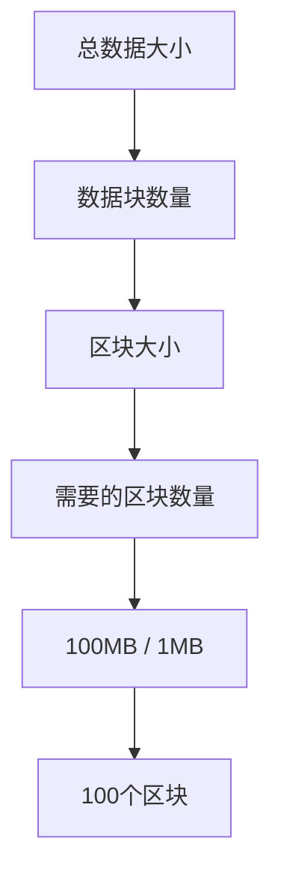
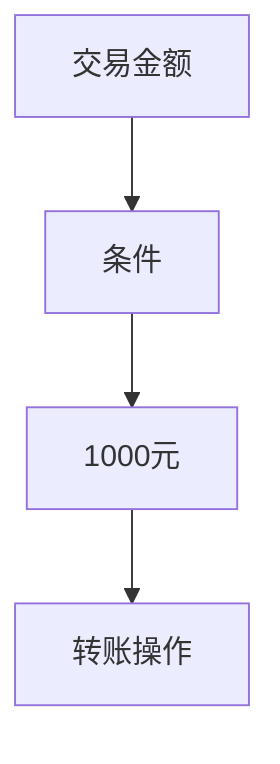
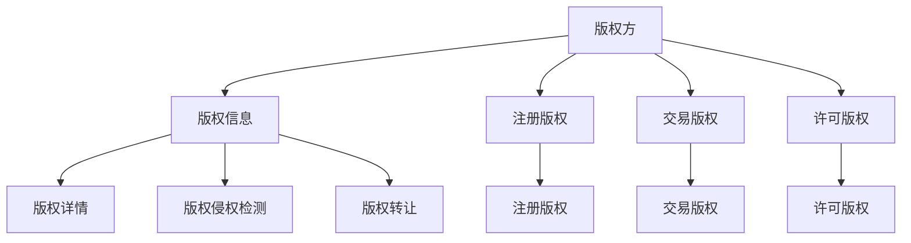
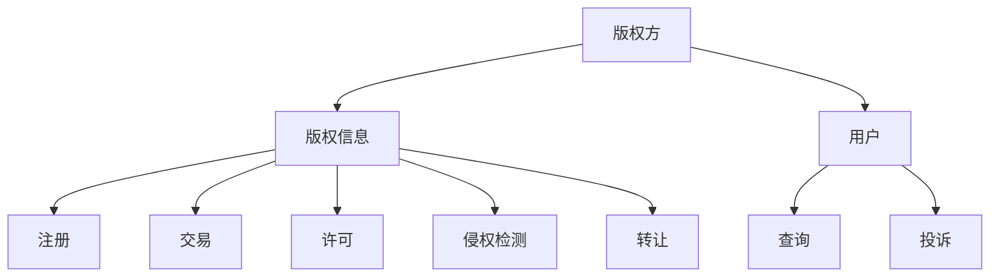
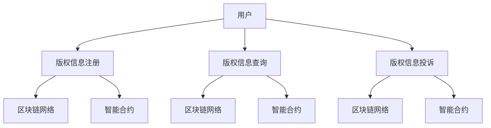
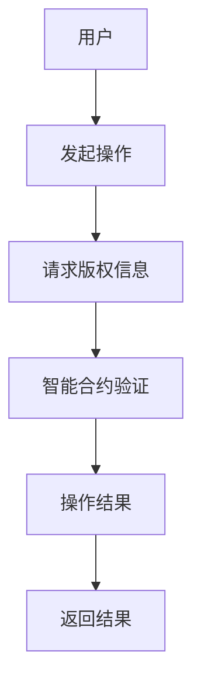

                 


# 区块链在知识产权保护中的创新机制

## 关键词
区块链，知识产权保护，分布式存储，智能合约，透明可追溯

## 摘要
本文将深入探讨区块链在知识产权保护中的应用，分析其创新机制。通过对区块链技术和知识产权保护的基本概念介绍，阐述区块链在解决版权纠纷、商标保护、专利保护等方面的问题。我们将详细讲解区块链在知识产权保护中的分布式存储算法、智能合约算法，并通过实际案例进行分析。

### 第一部分: 背景介绍

#### 1. 引言
区块链技术在知识产权保护中的应用，是当前信息技术领域的一个热点话题。随着数字经济的迅速发展，知识产权侵权行为日益猖獗，传统的知识产权保护手段已经难以满足日益复杂的知识产权保护需求。区块链技术以其去中心化、不可篡改、透明可追溯等特性，为知识产权保护提供了一种全新的机制。

#### 2. 问题背景
知识产权保护涉及版权、商标、专利等多个领域，传统的知识产权保护机制主要包括法律手段和行政手段。然而，这些手段在应对数字时代的知识产权侵权行为时，存在诸多不足：

- **法律手段**：知识产权法律体系复杂，执法成本高，执行效率低下。
- **行政手段**：行政管理机构的力量有限，难以覆盖所有知识产权侵权行为。

#### 3. 问题描述
区块链技术在知识产权保护中的应用，旨在解决以下问题：

- **版权纠纷**：如何确保版权信息的真实性和不可篡改性？
- **商标保护**：如何防止商标被侵权和滥用？
- **专利保护**：如何快速发现专利侵权行为并采取措施？

#### 4. 问题解决
区块链技术在知识产权保护中的应用，主要通过以下方式实现：

- **去中心化存储**：利用区块链的分布式存储技术，确保知识产权信息的安全性和可靠性。
- **智能合约**：通过智能合约自动执行知识产权交易、许可和侵权检测等操作，提高知识产权保护效率。
- **透明可追溯**：利用区块链的透明性，实现知识产权交易的全程可追溯，便于监控和审计。

#### 5. 边界与外延
区块链技术在知识产权保护中的应用，不仅涉及技术层面，还包括法律、经济等多个方面。其边界与外延包括：

- **技术边界**：区块链技术本身的局限性，如扩展性、性能等。
- **法律边界**：知识产权法律法规的适应性和适用性。
- **经济边界**：区块链技术在知识产权保护中的应用成本和效益。

#### 6. 概念结构与核心要素组成
- **区块链技术**：包括分布式账本、共识算法、加密技术等核心要素。
- **知识产权**：包括版权、商标、专利等子类别。
- **应用场景**：涉及版权交易、许可、侵权检测等具体应用。

### 第二部分: 核心概念与联系

#### 1. 区块链技术

区块链技术是一种分布式数据库技术，通过区块和链的方式组织数据。其核心概念包括：

- **分布式账本**：通过多个节点存储数据，提高数据的可靠性和安全性。
- **共识算法**：通过算法实现节点之间的数据一致性。
- **加密技术**：通过加密算法保护数据的隐私和安全。

#### 2. 知识产权

知识产权是一种法律权利，用于保护创作者的原创成果。核心概念包括：

- **版权**：保护文学、艺术、科学作品的原创性表达。
- **商标**：保护商业标志的独特性，用于区分不同企业的产品或服务。
- **专利**：保护发明的新颖性、创造性和实用性。

#### 3. 应用场景

区块链技术在知识产权保护中的应用场景包括：

- **版权交易**：通过区块链实现版权的注册、交易和许可。
- **侵权检测**：利用区块链技术监控和检测侵权行为。
- **专利保护**：通过区块链技术实现专利的申请、审查和维权。

### 第三部分: 算法原理讲解

#### 1. 分布式存储算法

区块链技术的核心在于其分布式存储算法。以下是一个简单的分布式存储算法流程：

```python
def distributedStorage(data):
    # 将数据分成多个区块
    blocks = splitDataIntoBlocks(data)
    
    # 在多个节点上创建区块链
    blockchain = createBlockchainWithMultipleNodes()
    
    # 将每个区块添加到区块链中
    for block in blocks:
        addBlockToBlockchain(block, blockchain)
        
    return blockchain
```

#### 2. 智能合约算法

智能合约是一种自动执行的合同，其核心在于算法。以下是一个简单的智能合约算法：

```python
def smartContract(transaction):
    # 验证交易
    if isValidTransaction(transaction):
        # 执行交易
        executeTransaction(transaction)
        
    # 记录交易
    logTransaction(transaction)
```

#### 3. 分布式存储算法详解

分布式存储算法是区块链技术的核心。其工作原理可以描述为：将数据分割成小块（区块），然后将这些区块分布存储在多个节点上。每个节点都保存一份完整的区块链，从而提高了数据的可靠性和安全性。

**数学模型**：

- **区块大小**：假设每个区块可以存储的数据大小为 \( B \)。
- **数据块数量**：总数据大小为 \( D \)，则需要 \( N = \lceil D / B \rceil \) 个区块。

**公式**：

$$
N = \lceil D / B \rceil
$$

**举例说明**：

假设我们有 100MB 的数据，每个区块可以存储 1MB 的数据。那么，我们需要 100 个区块来存储这些数据。



#### 4. 智能合约算法详解

智能合约是一种自动执行的合同，其核心在于算法。智能合约的工作原理可以描述为：当满足特定条件时，自动执行预定义的操作。

**数学模型**：

- **条件**：假设条件为 \( C \)。
- **操作**：假设操作为 \( O \)。

**公式**：

$$
C \Rightarrow O
$$

**举例说明**：

假设我们有一个智能合约，当交易金额大于 1000 元时，自动执行转账操作。



### 第四部分: 系统分析与架构设计方案

#### 1. 问题场景介绍

随着数字内容的日益丰富，版权纠纷问题日益突出。如何快速、有效地解决版权纠纷，成为版权持有者和使用者共同关注的问题。

#### 2. 项目介绍

本项目旨在利用区块链技术解决版权纠纷问题，通过去中心化的存储和智能合约实现版权的注册、交易和许可。

#### 3. 系统功能设计

**领域模型**：



**类图**：



#### 4. 系统架构设计

**架构图**：



**序列图**：



### 第五部分: 项目实战

#### 1. 环境安装

1. 安装Go语言环境。
2. 安装Golang区块链框架（如Go-ethereum）。

#### 2. 系统核心实现源代码

```go
// main.go
package main

import (
    "fmt"
    "github.com/ethereum/go-ethereum/accounts"
    "github.com/ethereum/go-ethereum/accounts/abi/bind"
    "github.com/ethereum/go-ethereum/crypto"
    "github.com/ethereum/go-ethereum/ethclient"
    "myapp/core"
)

func main() {
    // 初始化区块链客户端
    client, err := ethclient.Dial("https://mainnet.infura.io/v3/your_project_id")
    if err != nil {
        fmt.Println("Failed to connect to the Ethereum client:", err)
        return
    }

    // 创建版权信息注册合约实例
    privKey, err := crypto.GenerateKey()
    if err != nil {
        fmt.Println("Failed to generate private key:", err)
        return
    }
    auth := bind.NewKeyedTransactor(privKey)
    contract, err := core.NewCore(auth, client, "0xAddressOfTheContract")
    if err != nil {
        fmt.Println("Failed to create contract instance:", err)
        return
    }

    // 注册版权信息
    tx, err := contract.RegisterCopyright("Title", "Description", []byte("ImageHash"))
    if err != nil {
        fmt.Println("Failed to register copyright:", err)
        return
    }
    fmt.Println("Copyright registration transaction hash:", tx.Hash().Hex())

    // 监听交易结果
    fmt.Println("Waiting for transaction to be mined...")
    receipt, err := bind.WaitMined(client, tx)
    if err != nil {
        fmt.Println("Failed to wait for transaction to be mined:", err)
        return
    }
    fmt.Println("Transaction mined:", receipt.Status)

    // 查询版权信息
    copyright, err := contract.GetCopyright("Title")
    if err != nil {
        fmt.Println("Failed to get copyright:", err)
        return
    }
    fmt.Println("Copyright:", copyright)
}
```

#### 3. 代码应用解读与分析

本示例代码展示了如何使用Go语言和Go-ethereum框架实现一个版权信息注册功能。代码的主要步骤如下：

1. 初始化区块链客户端。
2. 创建版权信息注册合约实例。
3. 注册版权信息。
4. 监听交易结果。

#### 4. 实际案例分析和详细讲解剖析

**案例**：某位艺术家创作了一幅画作，希望通过区块链技术保护其版权。

**分析**：

1. 艺术家将画作上传到区块链网络，并获得一个唯一的哈希值。
2. 艺术家使用智能合约注册版权信息，包括标题、描述和画作哈希值。
3. 智能合约将版权信息存储在区块链上，实现去中心化的版权保护。
4. 如果有人想要使用这幅画作，需要通过智能合约获取许可。

**讲解**：

1. **区块链网络**：区块链网络负责存储版权信息，确保数据的不可篡改性和透明性。
2. **智能合约**：智能合约自动执行版权注册、许可等操作，提高知识产权保护效率。
3. **版权信息**：版权信息包括标题、描述、画作哈希值等，用于区分不同的作品。
4. **许可**：通过智能合约获取许可，确保使用者的合法权限。

### 第六部分: 最佳实践 tips、小结、注意事项、拓展阅读

#### 最佳实践 tips
1. **保护版权信息**：在注册版权前，确保版权信息的完整性和准确性。
2. **选择合适的区块链平台**：根据项目需求，选择合适的区块链平台和智能合约开发框架。
3. **关注法律法规**：遵守当地的知识产权法律法规，确保区块链技术在知识产权保护中的合法合规。

#### 小结
本文深入探讨了区块链在知识产权保护中的应用，分析了其创新机制，并详细讲解了分布式存储算法、智能合约算法。通过实际案例，展示了区块链技术在解决版权纠纷、商标保护、专利保护等方面的问题。

#### 注意事项
1. **性能考虑**：区块链技术可能存在性能瓶颈，需要根据实际需求进行优化。
2. **安全性考虑**：确保区块链网络的节点安全，防范恶意攻击。
3. **法律法规**：遵循当地的知识产权法律法规，确保区块链技术在知识产权保护中的合法合规。

#### 拓展阅读
1. 《区块链技术指南》
2. 《智能合约设计与开发》
3. 《区块链与知识产权保护案例分析》

### 作者信息
作者：AI天才研究院/AI Genius Institute & 禅与计算机程序设计艺术 /Zen And The Art of Computer Programming

