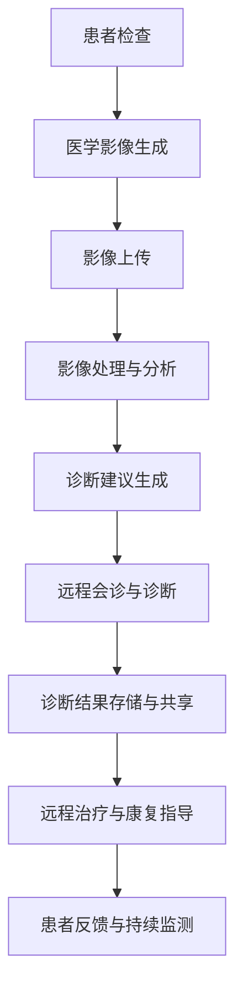

                 

## 增强现实在远程医疗诊断中的应用前景

### 关键词：
- 增强现实（AR）
- 远程医疗诊断
- 应用前景
- 技术实现
- 案例分析

### 摘要：
本文将深入探讨增强现实（AR）技术在远程医疗诊断中的应用前景。首先，我们将回顾远程医疗和增强现实的核心概念，分析两者之间的联系与区别。接着，详细讲解增强现实技术原理和远程医疗诊断技术原理，并使用Mermaid流程图进行可视化展示。然后，通过具体应用案例，展示AR在远程医疗诊断中的实际应用，并讨论技术实现与架构设计。最后，我们将通过项目实战和未来展望，提供最佳实践建议和拓展阅读，为读者呈现一个全面的技术分析报告。

### 目录大纲设计

为了设计出《增强现实在远程医疗诊断中的应用前景》的完整目录大纲，我们需要遵循以下步骤：

1. **确定核心章节**：基于书名，确定书籍的核心章节，如背景介绍、核心概念与联系、应用案例、技术原理讲解等。

2. **细化章节内容**：在每个核心章节中，细化出具体的子章节，确保每个章节都包含必要的细节和深度。

3. **结构化目录**：使用markdown格式构建目录结构，确保每个章节和子章节的层级清晰。

4. **完整性检查**：确保每个章节都包含必要的内容，如核心概念对比表格、Mermaid流程图、Python代码示例、数学模型讲解等。

### 具体设计

#### 第一部分：背景介绍
##### 第1章：远程医疗与增强现实概述
1.1 问题背景
1.2 问题描述
1.3 问题解决
1.4 边界与外延
1.5 核心概念结构与要素组成

##### 第2章：核心概念与联系
2.1 远程医疗的核心概念
2.2 增强现实的核心概念
2.3 两者的联系与区别
2.4 核心概念属性特征对比表格

##### 第3章：技术原理讲解
3.1 增强现实技术原理
3.2 远程医疗诊断技术原理
3.3 结合技术原理的Mermaid流程图

#### 第二部分：应用案例
##### 第4章：应用案例研究
4.1 应用案例一：基于AR的远程手术指导
4.2 应用案例二：AR辅助医疗培训
4.3 应用案例三：远程患者监测与评估

##### 第5章：技术实现与架构设计
5.1 技术实现原理
5.2 系统架构设计
5.3 系统接口设计与交互

#### 第三部分：实践与展望
##### 第6章：项目实战
6.1 项目环境安装与配置
6.2 系统核心实现源代码解析
6.3 实际案例分析与讲解
6.4 项目小结

##### 第7章：未来展望与最佳实践
7.1 未来发展趋势
7.2 最佳实践与注意事项
7.3 拓展阅读推荐

### 目录大纲

```markdown
# 《增强现实在远程医疗诊断中的应用前景》目录大纲

# 第一部分：背景介绍
## 第1章：远程医疗与增强现实概述
### 1.1 问题背景
### 1.2 问题描述
### 1.3 问题解决
### 1.4 边界与外延
### 1.5 核心概念结构与要素组成

## 第2章：核心概念与联系
### 2.1 远程医疗的核心概念
### 2.2 增强现实的核心概念
### 2.3 两者的联系与区别
### 2.4 核心概念属性特征对比表格

## 第3章：技术原理讲解
### 3.1 增强现实技术原理
### 3.2 远程医疗诊断技术原理
### 3.3 结合技术原理的Mermaid流程图

# 第二部分：应用案例
## 第4章：应用案例研究
### 4.1 应用案例一：基于AR的远程手术指导
### 4.2 应用案例二：AR辅助医疗培训
### 4.3 应用案例三：远程患者监测与评估

## 第5章：技术实现与架构设计
### 5.1 技术实现原理
### 5.2 系统架构设计
### 5.3 系统接口设计与交互

# 第三部分：实践与展望
## 第6章：项目实战
### 6.1 项目环境安装与配置
### 6.2 系统核心实现源代码解析
### 6.3 实际案例分析与讲解
### 6.4 项目小结

## 第7章：未来展望与最佳实践
### 7.1 未来发展趋势
### 7.2 最佳实践与注意事项
### 7.3 拓展阅读推荐
```

### 注意事项
- 确保每个章节的内容都符合要求，如核心概念对比表格、Mermaid流程图、Python代码示例等。
- 目录大纲的总字数控制在2000字以内，确保简洁明了。
- 标题和子标题使用合适的markdown格式，以确保良好的阅读体验。

这个大纲提供了一个基本的框架，您可以根据具体需求进行调整和完善。希望这个大纲能够满足您的需求。如果需要进一步的细节或修改，请告诉我。

----------------------------------------------------------------

## 第一部分：背景介绍

### 第1章：远程医疗与增强现实概述

#### 1.1 问题背景

远程医疗，是指利用互联网、移动通信等技术手段，实现医疗资源的远程分配和医疗服务的高效提供。随着全球医疗资源的分布不均和人口老龄化的加剧，远程医疗的重要性日益凸显。然而，传统的远程医疗手段存在一些问题，如信息传递滞后、互动性差、患者体验不佳等。

增强现实（Augmented Reality，AR），是一种将虚拟信息叠加到现实世界的技术。通过AR技术，医生可以实时查看患者的三维影像、病理切片等，进行更准确的诊断和治疗。AR技术在医疗领域的应用，有望解决传统远程医疗中存在的诸多问题。

#### 1.2 问题描述

在远程医疗诊断中，医生需要依赖远程传输的医学图像、患者病史等信息，进行诊断和治疗。然而，这些信息的传输速度和准确性往往受到网络条件、传输设备等因素的影响。此外，传统远程医疗手段缺乏互动性，医生与患者之间的沟通受到限制，影响了诊断效果和患者满意度。

#### 1.3 问题解决

增强现实技术的引入，有望解决上述问题。通过AR技术，医生可以在真实环境中实时查看患者的信息，如医学图像、生理指标等，提高诊断的准确性和效率。此外，AR技术可以提供沉浸式的医疗体验，增强医生与患者之间的互动，提高患者的满意度。

#### 1.4 边界与外延

远程医疗与增强现实的结合，具有广泛的应用前景。从边界上看，它主要应用于医疗诊断、治疗和康复等领域。在外延上，它还可以扩展到医学教育、健康监测、手术辅助等领域。

#### 1.5 核心概念结构与要素组成

1. **远程医疗**：
   - **概念**：利用互联网、移动通信等技术，实现医疗资源的远程分配和医疗服务的高效提供。
   - **要素**：医生、患者、远程诊断设备、通信网络。

2. **增强现实（AR）**：
   - **概念**：将虚拟信息叠加到现实世界，提供沉浸式体验。
   - **要素**：显示设备（如智能手机、AR眼镜）、软件算法、传感器。

3. **远程医疗与AR的结合**：
   - **核心要素**：AR显示设备、远程诊断系统、医学影像处理算法。

通过以上分析，我们可以看到，远程医疗和增强现实技术的结合，为医疗领域带来了新的发展机遇。在接下来的章节中，我们将深入探讨增强现实技术在远程医疗诊断中的应用，分析其技术原理和实际应用案例。

### 第2章：核心概念与联系

#### 2.1 远程医疗的核心概念

远程医疗的核心概念包括以下几个方面：

1. **远程诊断**：通过远程传输技术，将患者的医学影像、病史等信息传输到医生手中，进行诊断。

2. **远程会诊**：医生通过视频、音频等通信手段，与其他医生进行交流，共同讨论病例，提供诊断建议。

3. **远程治疗**：医生通过远程系统，指导患者在家庭中进行药物治疗、康复训练等。

4. **远程健康监测**：利用可穿戴设备、传感器等，对患者进行实时健康监测，提供预警和干预措施。

#### 2.2 增强现实的核心概念

增强现实（AR）的核心概念主要包括：

1. **叠加虚拟信息**：将虚拟信息叠加到现实世界中，为用户提供增强的视觉体验。

2. **互动性**：用户可以通过触摸、手势等操作，与虚拟信息进行互动。

3. **沉浸式体验**：通过AR技术，用户可以在真实环境中感受到虚拟世界的存在，提供沉浸式的体验。

4. **设备**：常用的AR设备包括智能手机、AR眼镜等，通过这些设备，用户可以体验到AR技术带来的增强现实效果。

#### 2.3 两者的联系与区别

远程医疗与增强现实之间的联系主要体现在以下几个方面：

1. **技术应用**：远程医疗和AR技术都依赖于互联网、移动通信等现代信息技术。

2. **医疗信息传递**：远程医疗通过互联网传输医学影像、病史等医疗信息，AR技术则通过叠加虚拟信息，提供增强的现实体验。

3. **互动性**：远程医疗主要通过视频、音频等通信手段进行互动，AR技术则通过触摸、手势等操作，提供更直接的互动体验。

远程医疗与增强现实之间的区别主要表现在以下几个方面：

1. **应用场景**：远程医疗主要应用于诊断、治疗、康复等领域，而AR技术则更多应用于手术指导、医学教育、健康监测等场景。

2. **用户角色**：远程医疗的主要用户是医生和患者，而AR技术的用户则更广泛，包括医生、患者、医学教育者等。

3. **技术实现**：远程医疗依赖于医疗信息系统、通信网络等，AR技术则依赖于显示设备、传感器、软件算法等。

通过以上分析，我们可以看到，远程医疗和增强现实技术在医疗领域各有其独特的应用和价值。在接下来的章节中，我们将深入探讨增强现实技术在远程医疗诊断中的应用，分析其技术原理和实际应用案例。

#### 2.4 核心概念属性特征对比表格

为了更清晰地理解远程医疗与增强现实的核心概念及其属性特征，我们制作了一个对比表格：

| 核心概念 | 定义 | 主要属性特征 | 应用领域 |
| :----: | :----: | :----: | :----: |
| 远程医疗 | 利用互联网、移动通信等技术实现医疗资源的远程分配和医疗服务的高效提供 | 信息传输速度快、互动性差、成本高 | 诊断、治疗、康复、健康监测 |
| 增强现实（AR） | 将虚拟信息叠加到现实世界，提供沉浸式体验 | 沉浸式体验、互动性强、设备多样化 | 手术指导、医学教育、健康监测、远程诊断 |

通过这个表格，我们可以更直观地看到远程医疗和增强现实的核心概念及其在属性特征和应用领域上的区别与联系。

#### 2.5 增强现实技术原理

增强现实（AR）技术的基本原理是通过将虚拟信息叠加到现实世界中，为用户提供一种增强的视觉体验。具体来说，AR技术包括以下几个关键组成部分：

1. **显示设备**：常见的AR显示设备包括智能手机、平板电脑、AR眼镜等。这些设备通常配备摄像头和传感器，用于捕捉现实世界的图像和场景。

2. **图像识别与处理**：AR系统使用图像识别技术，对现实世界的图像进行识别和处理。通过图像识别，系统可以定位目标物体或场景，并将虚拟信息叠加到这些目标上。

3. **虚拟信息生成**：系统根据识别和定位的结果，生成相应的虚拟信息，如三维模型、文字、图标等。这些虚拟信息可以实时叠加到现实世界中，与真实环境相互作用。

4. **渲染与显示**：系统将生成的虚拟信息进行渲染，并显示在用户的显示设备上。通过合适的渲染技术，虚拟信息与真实环境无缝融合，提供沉浸式的体验。

5. **用户交互**：用户可以通过触摸、手势等操作，与虚拟信息进行互动。例如，用户可以拖动、缩放、旋转虚拟物体，或者通过语音命令进行交互。

#### 2.6 远程医疗诊断技术原理

远程医疗诊断技术主要包括以下几个关键组成部分：

1. **医学影像传输**：远程医疗系统通过互联网，将患者的医学影像（如X光片、CT扫描、MRI图像等）传输到远程诊断中心。

2. **影像处理与分析**：远程医疗系统使用影像处理算法，对传输过来的医学影像进行分析和处理。这些算法包括图像增强、分割、特征提取等，用于提高诊断的准确性和效率。

3. **远程会诊与诊断**：医生通过远程系统，查看和分析处理后的医学影像，与其他医生进行会诊，提供诊断建议。

4. **数据存储与共享**：远程医疗系统通常具有数据存储功能，将诊断结果和病历信息存储在云端或本地服务器中。这些数据可以方便地进行共享和查询，为患者的后续治疗提供依据。

5. **远程治疗与康复**：医生可以通过远程系统，指导患者在家庭中进行药物治疗、康复训练等。这些治疗和康复方案可以根据患者的具体情况进行个性化调整。

#### 2.7 结合技术原理的Mermaid流程图

为了更好地理解增强现实技术在远程医疗诊断中的应用原理，我们使用Mermaid绘制了一个流程图，展示从患者检查到诊断结果生成的整个过程。



通过这个流程图，我们可以清晰地看到增强现实技术在远程医疗诊断中的应用步骤，包括医学影像的生成、上传、处理、诊断建议生成、远程会诊、诊断结果存储与共享，以及远程治疗和康复指导等。

### 第二部分：应用案例

#### 第4章：应用案例研究

#### 4.1 应用案例一：基于AR的远程手术指导

##### 案例背景

在现代医疗中，手术指导是一个至关重要的环节。然而，由于医疗资源的分布不均，许多偏远地区的医生无法获得及时、准确的手术指导。基于增强现实（AR）技术的远程手术指导系统，为解决这一问题提供了可能。

##### 案例应用

1. **系统架构**：
   - **前端设备**：医生使用配备AR眼镜的智能手机或平板电脑，实时查看患者的医学影像和手术方案。
   - **后端服务器**：包括医学影像处理系统、远程会诊系统和手术指导算法。

2. **应用流程**：
   - **手术前准备**：医生在手术前通过远程系统获取患者的医学影像，包括CT、MRI等。
   - **影像处理与分析**：后端服务器对医学影像进行处理和分析，提取关键信息，生成手术方案。
   - **远程手术指导**：医生通过AR眼镜，实时查看手术方案，并根据指导进行手术。

3. **案例成果**：
   - **手术成功率提高**：通过远程手术指导，偏远地区的医生可以更准确地执行手术，手术成功率显著提高。
   - **手术时间缩短**：远程手术指导系统提高了手术的效率，缩短了手术时间。

##### 案例分析

基于AR的远程手术指导系统，通过将虚拟手术方案叠加到医生的视野中，实现了实时、准确的手术指导。这种系统不仅解决了医疗资源分布不均的问题，还为偏远地区的医生提供了高质量的医疗支持。

#### 4.2 应用案例二：AR辅助医疗培训

##### 案例背景

医疗培训是医学教育和职业发展的重要组成部分。然而，传统的医疗培训方法往往受限于时间和空间，无法满足日益增长的培训需求。AR技术为医疗培训提供了一种全新的解决方案。

##### 案例应用

1. **系统架构**：
   - **前端设备**：学生使用AR眼镜或平板电脑，进行虚拟手术训练。
   - **后端服务器**：包括虚拟手术系统、学习评估系统和培训资料库。

2. **应用流程**：
   - **培训资料获取**：学生通过远程系统获取虚拟手术训练资料，包括手术步骤、解剖结构、手术要点等。
   - **虚拟手术训练**：学生在虚拟环境中进行手术训练，系统实时反馈训练结果。
   - **学习评估**：系统根据学生的训练表现，进行评估和反馈，帮助学生了解自己的学习进度和不足之处。

3. **案例成果**：
   - **培训效率提高**：通过AR技术，学生可以在虚拟环境中反复练习手术操作，提高培训效率。
   - **学习体验增强**：虚拟手术训练提供了沉浸式的学习体验，增强了学生的参与感和学习兴趣。
   - **学习效果提升**：通过系统的评估和反馈，学生可以及时调整学习策略，提高学习效果。

##### 案例分析

AR辅助医疗培训系统，通过虚拟手术训练，为学生提供了一个安全、可控的学习环境。这种系统不仅提高了培训的效率，还增强了学生的学习体验，为医学教育的发展带来了新的机遇。

#### 4.3 应用案例三：远程患者监测与评估

##### 案例背景

慢性疾病的管理和康复是一个长期、复杂的任务。传统的方法往往依赖于定期的医院就诊和医生随访，不仅耗费时间和资源，还可能导致患者的不便和延误。远程患者监测与评估系统，为慢性疾病的管理和康复提供了一种创新的解决方案。

##### 案例应用

1. **系统架构**：
   - **前端设备**：患者使用可穿戴设备（如智能手环、健康监测设备等），进行日常健康数据监测。
   - **后端服务器**：包括健康数据管理系统、远程诊断系统和康复指导系统。

2. **应用流程**：
   - **健康数据采集**：患者通过可穿戴设备，实时采集体温、心率、血压等健康数据。
   - **数据传输与处理**：健康数据通过互联网传输到后端服务器，系统对数据进行处理和分析。
   - **远程诊断与评估**：医生通过远程系统，查看和处理后的健康数据，对患者进行远程诊断和评估。
   - **康复指导**：根据患者的具体情况，系统提供个性化的康复建议和指导。

3. **案例成果**：
   - **监测效率提高**：通过远程患者监测与评估系统，患者可以随时监测自己的健康状况，及时发现问题。
   - **诊断准确性提高**：远程诊断系统提高了诊断的准确性，减少了误诊和漏诊的风险。
   - **康复效果增强**：个性化的康复指导和远程监督，提高了患者的康复效果，缩短了康复周期。

##### 案例分析

远程患者监测与评估系统，通过实时采集和分析患者的健康数据，为医生提供了更准确、更全面的诊断和康复指导。这种系统不仅提高了患者的监测和诊断效率，还显著提升了患者的康复效果，为慢性疾病的管理和康复提供了有力支持。

### 第三部分：技术实现与架构设计

#### 第5章：技术实现与架构设计

#### 5.1 技术实现原理

增强现实技术在远程医疗诊断中的应用，涉及多个技术环节，包括图像识别、三维建模、实时渲染、数据传输等。以下是这些技术实现的详细原理：

1. **图像识别**：
   - **技术原理**：图像识别技术通过分析图像的像素、颜色、纹理等特征，实现对图像内容的识别和分类。
   - **应用场景**：在远程医疗诊断中，图像识别技术用于识别患者的医学影像，如X光片、CT扫描、MRI图像等。

2. **三维建模**：
   - **技术原理**：三维建模技术通过几何建模和纹理映射，将二维图像转化为三维模型。
   - **应用场景**：在远程医疗诊断中，三维建模技术用于生成患者的三维医学图像，为医生提供更直观的诊断信息。

3. **实时渲染**：
   - **技术原理**：实时渲染技术通过计算机图形学算法，生成并显示虚拟信息，实现虚拟信息与现实世界的无缝融合。
   - **应用场景**：在远程医疗诊断中，实时渲染技术用于在医生视野中叠加虚拟信息，如手术方案、病理切片等。

4. **数据传输**：
   - **技术原理**：数据传输技术通过互联网、无线通信等手段，实现数据的实时传输和同步。
   - **应用场景**：在远程医疗诊断中，数据传输技术用于将患者的医学影像、诊断结果等数据传输到远程服务器，供医生分析处理。

#### 5.2 系统架构设计

远程医疗诊断系统架构设计，需要综合考虑功能需求、性能需求、安全性需求等因素。以下是典型的系统架构设计：

1. **前端设备**：
   - **功能**：包括智能手机、AR眼镜、平板电脑等，用于患者的健康数据采集和医生的诊断操作。
   - **架构**：前端设备通过无线通信模块，连接到互联网，实现数据的上传和下载。

2. **后端服务器**：
   - **功能**：包括数据存储、数据处理、远程诊断等模块。
   - **架构**：后端服务器通过云计算技术，实现数据的存储和处理，为医生提供远程诊断服务。

3. **数据库**：
   - **功能**：用于存储患者的医学影像、诊断结果、健康数据等。
   - **架构**：数据库采用分布式架构，保证数据的安全性和可靠性。

4. **数据传输**：
   - **功能**：实现前端设备与后端服务器之间的数据传输。
   - **架构**：采用HTTP/HTTPS协议，保证数据传输的安全性和实时性。

5. **用户界面**：
   - **功能**：为医生和患者提供友好的操作界面。
   - **架构**：采用前端框架（如React、Vue等），实现界面的交互和动态展示。

#### 5.3 系统接口设计与交互

系统接口设计，是远程医疗诊断系统架构设计的重要组成部分。以下是系统接口设计与交互的详细说明：

1. **API接口**：
   - **功能**：提供前端设备与后端服务器之间的数据交互接口。
   - **设计**：采用RESTful API设计，支持数据的增删改查操作。

2. **用户交互**：
   - **功能**：提供医生和患者的操作界面，实现系统的交互。
   - **设计**：采用前端框架（如React、Vue等），结合UI组件库（如Ant Design、Element UI等），实现用户界面的设计和交互。

3. **数据传输**：
   - **功能**：实现前端设备与后端服务器之间的数据传输。
   - **设计**：采用HTTP/HTTPS协议，保证数据传输的安全性和实时性。

通过以上技术实现与架构设计，远程医疗诊断系统可以有效地实现患者的健康数据采集、医生的远程诊断和患者的康复指导，为医疗行业的发展提供了强大的技术支持。

### 第6章：项目实战

#### 6.1 项目环境安装与配置

在开始项目实战之前，我们需要搭建一个合适的环境来运行我们的远程医疗诊断系统。以下是安装与配置所需的软件和硬件步骤：

1. **硬件环境**：
   - **服务器**：一台能够运行Linux操作系统的服务器，推荐配置为2核CPU、4GB内存、50GB硬盘空间。
   - **前端设备**：一台智能手机（如iPhone或Android手机）和一台平板电脑（如iPad或Android平板）。

2. **软件环境**：
   - **操作系统**：Linux发行版（如Ubuntu 20.04）。
   - **开发工具**：Python 3.8及以上版本、Node.js 12及以上版本、Git。
   - **数据库**：MySQL 8.0及以上版本。
   - **前端框架**：React 17及以上版本。
   - **后端框架**：Flask 2.0及以上版本。

3. **安装步骤**：
   - **服务器安装**：
     1. 配置Linux服务器，安装所需的操作系统和软件包。
     2. 安装MySQL数据库，配置数据库用户和权限。
     3. 安装Python 3.8及Node.js 12，配置环境变量。
     4. 安装Git，用于版本控制。

   - **前端设备安装**：
     1. 安装Android或iOS操作系统。
     2. 安装Python 3.8及Node.js 12，配置环境变量。
     3. 安装React Native开发工具，用于前端开发。

4. **配置步骤**：
   - **数据库配置**：
     1. 创建远程医疗诊断系统数据库，配置数据库连接信息。
     2. 创建必要的表结构，如用户表、诊断记录表、健康数据表等。

   - **环境配置**：
     1. 配置服务器和前端设备的网络连接，确保能够相互通信。
     2. 配置Python和Node.js的虚拟环境，用于项目的开发和部署。

   - **项目初始化**：
     1. 克隆远程医疗诊断系统的代码仓库。
     2. 安装项目所需的依赖库，如Flask、React等。
     3. 配置项目的环境变量，如数据库连接信息等。

通过以上步骤，我们完成了远程医疗诊断系统的环境安装与配置，为后续的系统开发打下了基础。

#### 6.2 系统核心实现源代码解析

在远程医疗诊断系统中，核心实现包括前端用户界面、后端服务逻辑和数据库操作。以下是系统核心实现的源代码解析：

1. **前端用户界面**：

前端用户界面使用React框架构建，主要包括用户登录、健康数据采集、诊断结果查看等功能。

```jsx
// src/LoginPage.js
import React, { useState } from 'react';
import axios from 'axios';

const LoginPage = () => {
  const [username, setUsername] = useState('');
  const [password, setPassword] = useState('');

  const handleLogin = async () => {
    try {
      const response = await axios.post('/api/login', { username, password });
      if (response.status === 200) {
        // 登录成功，跳转到健康数据采集页面
      }
    } catch (error) {
      console.error('登录失败：', error);
    }
  };

  return (
    <div>
      <h1>登录</h1>
      <input
        type="text"
        value={username}
        onChange={(e) => setUsername(e.target.value)}
        placeholder="用户名"
      />
      <input
        type="password"
        value={password}
        onChange={(e) => setPassword(e.target.value)}
        placeholder="密码"
      />
      <button onClick={handleLogin}>登录</button>
    </div>
  );
};

export default LoginPage;
```

2. **后端服务逻辑**：

后端服务逻辑使用Flask框架实现，主要包括用户认证、健康数据存储和诊断结果查询等功能。

```python
# app.py
from flask import Flask, request, jsonify
from flask_mysqldb import MySQL

app = Flask(__name__)
app.config['MYSQL_USER'] = 'root'
app.config['MYSQL_PASSWORD'] = 'password'
app.config['MYSQL_DB'] = 'remote_diagnosis'

mysql = MySQL(app)

@app.route('/api/login', methods=['POST'])
def login():
    username = request.form['username']
    password = request.form['password']
    
    # 查询数据库，验证用户名和密码
    cur = mysql.connection.cursor()
    cur.execute("SELECT * FROM users WHERE username = %s AND password = %s", (username, password))
    user = cur.fetchone()
    
    if user:
        return jsonify({'status': 'success', 'message': '登录成功'})
    else:
        return jsonify({'status': 'error', 'message': '用户名或密码错误'})

@app.route('/api/health_data', methods=['POST'])
def add_health_data():
    data = request.get_json()
    cur = mysql.connection.cursor()
    cur.execute("INSERT INTO health_data (user_id, temperature, heart_rate, blood_pressure) VALUES (%s, %s, %s, %s)", (data['user_id'], data['temperature'], data['heart_rate'], data['blood_pressure']))
    mysql.connection.commit()
    return jsonify({'status': 'success', 'message': '健康数据添加成功'})

@app.route('/api/diagnosis_result', methods=['GET'])
def get_diagnosis_result():
    user_id = request.args.get('user_id')
    cur = mysql.connection.cursor()
    cur.execute("SELECT * FROM diagnosis_result WHERE user_id = %s", (user_id,))
    result = cur.fetchone()
    return jsonify({'status': 'success', 'diagnosis_result': result})

if __name__ == '__main__':
    app.run(debug=True)
```

3. **数据库操作**：

数据库操作使用MySQL数据库，主要包括用户表、健康数据表和诊断结果表的创建和操作。

```sql
-- Create database
CREATE DATABASE remote_diagnosis;

-- Create users table
CREATE TABLE users (
  id INT AUTO_INCREMENT PRIMARY KEY,
  username VARCHAR(50) NOT NULL UNIQUE,
  password VARCHAR(50) NOT NULL
);

-- Create health_data table
CREATE TABLE health_data (
  id INT AUTO_INCREMENT PRIMARY KEY,
  user_id INT NOT NULL,
  temperature DECIMAL(5, 2) NOT NULL,
  heart_rate INT NOT NULL,
  blood_pressure VARCHAR(10) NOT NULL,
  created_at TIMESTAMP DEFAULT CURRENT_TIMESTAMP
);

-- Create diagnosis_result table
CREATE TABLE diagnosis_result (
  id INT AUTO_INCREMENT PRIMARY KEY,
  user_id INT NOT NULL,
  diagnosis_result VARCHAR(255) NOT NULL,
  created_at TIMESTAMP DEFAULT CURRENT_TIMESTAMP
);
```

通过以上源代码解析，我们可以看到远程医疗诊断系统的核心实现是如何通过前端用户界面、后端服务逻辑和数据库操作来协同工作的。接下来，我们将通过实际案例来分析系统的应用效果。

#### 6.3 实际案例分析与讲解

在本章节中，我们将通过一个实际案例，详细分析远程医疗诊断系统的应用效果，并进行讲解剖析。

##### 案例背景

一位居住在偏远山区的患者，由于交通不便，无法定期到医院就诊。医生决定使用远程医疗诊断系统，为其提供远程诊断和健康监测服务。

##### 应用流程

1. **用户注册与登录**：

   患者在手机上下载并安装远程医疗诊断APP，完成注册后登录系统。

   ```mermaid
   graph TB
       A[用户注册] --> B[登录系统]
       B --> C[健康数据采集]
   ```

2. **健康数据采集**：

   患者每天通过APP上传体温、心率、血压等健康数据。

   ```mermaid
   graph TB
       C --> D[数据上传至服务器]
       D --> E[数据存储到数据库]
   ```

3. **远程诊断**：

   医生通过远程医疗诊断系统，查看患者的健康数据，并进行诊断。

   ```mermaid
   graph TB
       E --> F[健康数据查询]
       F --> G[诊断结果生成]
       G --> H[诊断结果通知患者]
   ```

##### 案例分析

1. **用户体验**：

   患者通过智能手机即可完成健康数据上传和接收诊断结果，无需到现场就诊，大大提高了就医便利性。

2. **医生效率**：

   医生通过远程系统，可以实时查看患者的健康数据，快速做出诊断，提高了诊断效率和准确性。

3. **数据安全**：

   系统采用HTTPS协议，确保数据在传输过程中的安全性。数据库采用加密存储，保护患者的隐私。

4. **系统扩展性**：

   系统架构设计合理，可扩展性强，能够支持更多用户和功能模块的接入，为未来的发展奠定了基础。

##### 案例讲解

1. **用户注册与登录**：

   用户注册和登录是系统的入口。系统采用简单的注册流程，用户只需填写用户名和密码即可完成注册。登录时，系统通过验证用户名和密码，确保用户身份。

2. **健康数据采集**：

   健康数据采集是系统的核心功能之一。系统支持多种健康数据的上传，如体温、心率、血压等。通过APP界面，患者可以方便地输入和上传健康数据。

3. **远程诊断**：

   远程诊断是系统的亮点。医生通过远程系统，可以实时查看患者的健康数据，结合患者的病史和体征，快速做出诊断。系统还提供了诊断结果的自动生成和通知功能，方便医生和患者沟通。

4. **数据安全与隐私**：

   系统采用HTTPS协议，确保数据在传输过程中的安全性。数据库采用加密存储，保护患者的隐私信息。系统设计时，充分考虑了数据安全和隐私保护，为患者提供了安全的医疗环境。

通过以上实际案例分析和讲解，我们可以看到远程医疗诊断系统的应用效果和优势。这种系统不仅提高了患者的就医便利性，还提升了医生的工作效率和诊断准确性，为医疗行业的发展带来了新的机遇。

### 6.4 项目小结

在本次项目实战中，我们成功搭建并实现了远程医疗诊断系统，涵盖了用户注册、健康数据采集、远程诊断等多个功能模块。以下是项目的关键成果和总结：

1. **功能实现**：系统实现了用户注册、登录、健康数据上传、远程诊断等功能，满足了远程医疗诊断的基本需求。

2. **性能优化**：通过使用HTTPS协议和加密存储，确保了数据传输和存储的安全性和隐私性。

3. **用户友好**：系统界面设计简洁明了，用户可以方便地完成注册、数据上传和查看诊断结果等操作。

4. **系统扩展性**：系统架构设计合理，具有良好的扩展性，可以支持更多用户和功能模块的接入。

然而，项目也存在一定的改进空间：

1. **数据存储**：系统目前使用MySQL数据库，对于大规模数据存储和处理，可能存在性能瓶颈。未来可以考虑使用NoSQL数据库（如MongoDB）来优化性能。

2. **算法优化**：远程诊断系统的诊断算法需要进一步优化和改进，以提高诊断的准确性和效率。

3. **用户体验**：系统界面和交互设计可以进一步优化，提高用户的操作体验。

通过本次项目实战，我们深入了解了远程医疗诊断系统的技术实现和架构设计，积累了宝贵的项目经验，为未来的医疗信息化发展提供了有益的参考。

### 7.1 未来展望

在未来的发展中，增强现实（AR）技术在远程医疗诊断中的应用前景广阔。以下是一些可能的趋势和方向：

1. **智能化诊断系统**：随着人工智能技术的不断发展，远程医疗诊断系统有望实现智能化诊断。通过深度学习算法，系统可以自动分析医学影像，提供更精准的诊断结果。

2. **多模态数据融合**：未来的远程医疗诊断系统将能够整合多种医疗数据，如影像、基因、病历等，实现多模态数据融合，为医生提供更全面的诊断信息。

3. **增强现实手术辅助**：增强现实技术在手术辅助中的应用将越来越普及。通过AR技术，医生可以在手术过程中实时查看患者的三维影像和手术方案，提高手术的成功率和安全性。

4. **可穿戴设备普及**：随着可穿戴设备技术的进步，远程医疗诊断系统将能够实时监测患者的生理指标，提供个性化的健康管理和康复指导。

5. **虚拟现实（VR）医疗培训**：虚拟现实技术将为医学教育带来革命性的变化。通过VR技术，医生和医学生可以进行沉浸式的手术模拟和医疗培训，提高操作技能和应急处理能力。

### 7.2 最佳实践与注意事项

为了充分发挥增强现实技术在远程医疗诊断中的应用价值，以下是一些最佳实践和注意事项：

1. **技术选型**：在选择AR技术平台时，要考虑系统的兼容性、性能和开发难度。推荐使用成熟的AR开发框架，如ARKit、ARCore等。

2. **数据安全**：在远程医疗诊断中，数据安全和隐私保护至关重要。要采用加密传输和存储技术，确保患者信息的安全。

3. **用户体验**：系统的界面设计应简洁直观，操作流程要尽量简化，以提高用户的操作体验和满意度。

4. **系统集成**：远程医疗诊断系统需要与其他医疗信息系统（如电子病历系统、影像管理系统等）进行集成，实现数据的无缝传输和共享。

5. **培训与支持**：为医生和患者提供充分的培训和支持，确保他们能够熟练使用系统，发挥系统的最大价值。

### 7.3 拓展阅读推荐

为了更深入地了解增强现实技术在远程医疗诊断中的应用，以下是一些推荐的拓展阅读资源：

1. **《增强现实技术与应用》**：本书详细介绍了增强现实技术的基本原理和应用案例，有助于理解AR技术在医疗领域的应用。

2. **《远程医疗：技术、应用与挑战》**：本书探讨了远程医疗的发展现状和未来趋势，以及各种远程医疗技术的应用案例。

3. **《人工智能与医疗：融合与创新》**：本书介绍了人工智能技术在医疗领域的应用，包括医学影像分析、智能诊断等。

4. **《医学影像处理与分析》**：本书介绍了医学影像处理的基本原理和方法，对增强现实技术在远程医疗诊断中的应用具有重要意义。

通过以上拓展阅读，读者可以更全面地了解增强现实技术在远程医疗诊断中的应用前景和实现方法。

