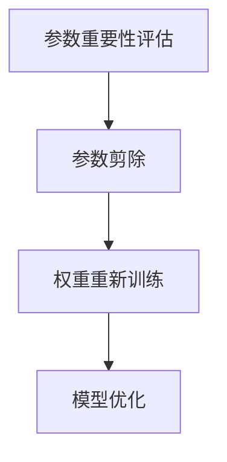
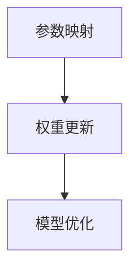
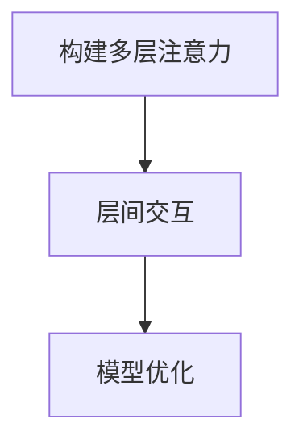
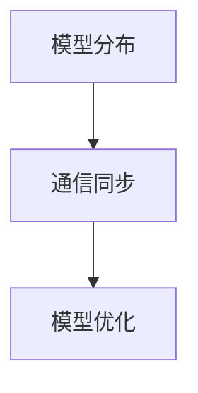
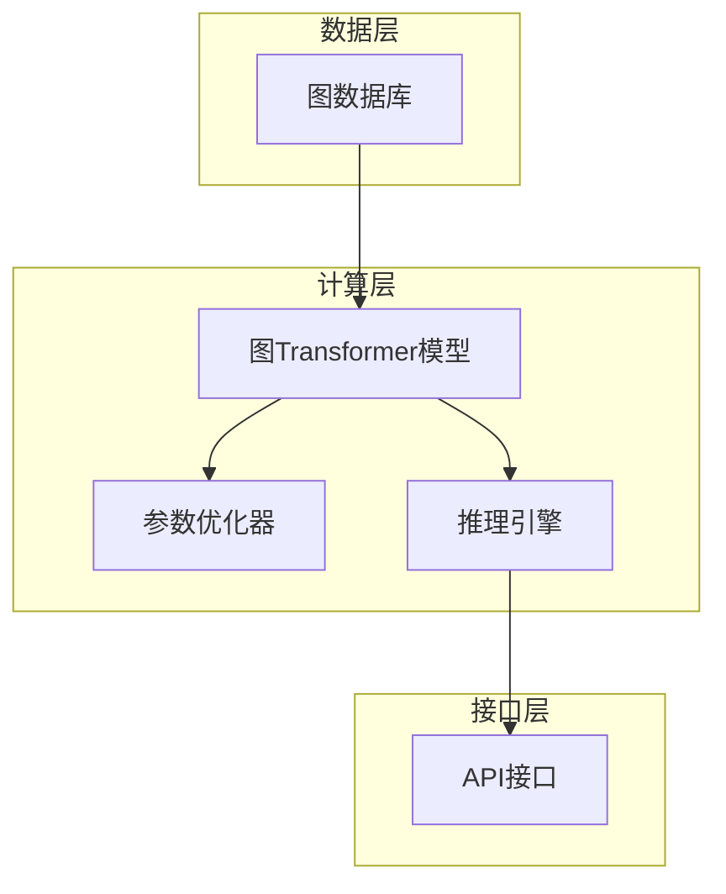
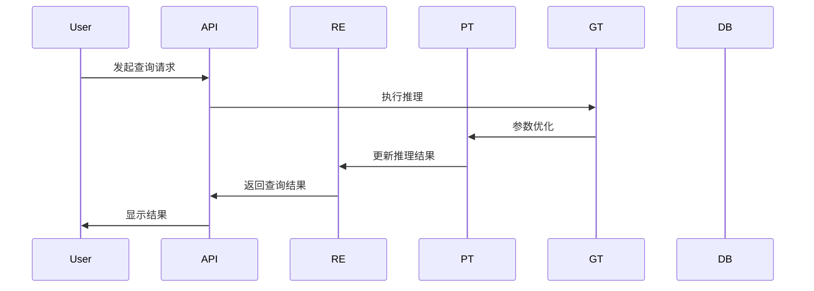

                 

### 第1章：背景介绍

#### 1.1 问题背景

在现代信息社会中，随着数据量的爆炸性增长，知识图谱作为一种结构化数据存储和查询的方式，成为了数据管理和知识挖掘的重要工具。知识图谱通过实体和关系的表示，将海量的信息组织成一个图结构，从而能够更高效地处理复杂的语义查询和推理问题。

大规模知识图谱的构建和应用涉及多个领域，包括自然语言处理、数据挖掘、语义网和信息检索等。在知识图谱的应用中，推理是其核心功能之一。推理任务包括基于已知事实推断新事实，这种能力在问答系统、智能搜索、推荐系统等领域具有广泛的应用。

传统的知识图谱推理方法，如基于规则的方法和图论算法，在面对大规模知识图谱时表现出一定的局限性。首先，规则推理方法通常依赖于预定义的规则集，无法处理复杂和动态变化的场景。其次，图论算法虽然可以处理大规模图结构，但其时间复杂度往往较高，不适合实时推理。

因此，需要一种新的推理方法来应对大规模知识图谱的复杂性和高效性。图Transformer作为一种基于深度学习的图处理框架，因其强大的表征能力和并行计算能力，在知识图谱推理领域展现出了巨大的潜力。

#### 1.2 大规模知识图谱推理的重要性

知识图谱在大规模数据管理和知识发现中扮演着至关重要的角色。首先，知识图谱能够将语义信息以结构化的形式存储和表示，使得数据的查询和推理更加高效。在许多实际应用中，如图数据库、智能搜索和推荐系统，知识图谱已经成为其核心组件。

推理能力是知识图谱的关键特性。通过推理，系统可以从已知的实体和关系推断出新的信息。这种能力对于智能系统来说至关重要，因为它能够提高系统的自主性和决策能力。例如，在问答系统中，推理可以用来解析用户的问题，并从知识图谱中找到相关的答案。

大规模知识图谱推理的重要性体现在以下几个方面：

1. **效率提升**：随着数据规模的增大，传统的推理方法往往无法满足实时性的需求。图Transformer通过并行计算和高效的图结构处理，能够显著提高推理速度，满足大规模数据处理的实时性要求。

2. **复杂关系处理**：知识图谱中存在大量的复杂关系，如多跳关系和条件依赖。图Transformer通过自注意力机制和Transformer结构，能够有效地捕捉和处理这些复杂关系，提高推理的准确性。

3. **灵活性**：图Transformer是一种可扩展的框架，能够适应不同类型的知识图谱和推理任务。通过微调和调整模型参数，图Transformer可以应用于各种领域，如生物信息学、金融分析和社交媒体分析。

4. **跨领域应用**：知识图谱和推理技术在多个领域都有广泛的应用。例如，在生物信息学中，知识图谱用于基因和蛋白质之间的相互关系分析；在金融分析中，知识图谱用于风险控制和投资决策。

总之，大规模知识图谱推理的重要性不言而喻。它不仅能够提高信息处理和知识挖掘的效率，还能够推动智能系统的自主性和灵活性，为各种实际应用提供强大的支持。

#### 1.3 图Transformer的基本概念

图Transformer是近年来在图神经网络（Graph Neural Networks, GNNs）领域的一项重要进展，它基于Transformer模型，将其扩展到图结构数据的处理。Transformer最初由Vaswani等人在2017年的论文《Attention is All You Need》中提出，是一种基于注意力机制的序列模型，广泛应用于自然语言处理领域，特别是在机器翻译和文本生成任务中取得了显著的成果。

图Transformer将Transformer的核心机制——多头自注意力（Multi-Head Self-Attention）和位置编码（Positional Encoding）引入到图结构数据的处理中，使其能够高效地捕获图中的关系和结构信息。具体来说，图Transformer通过以下关键组件实现：

1. **节点嵌入（Node Embeddings）**：每个节点在图中都有一个嵌入向量，这些嵌入向量用于表示节点的属性和特征。

2. **边缘嵌入（Edge Embeddings）**：每个边也有一个嵌入向量，这些向量表示边上的属性，如边的权重和类型。

3. **自注意力机制（Self-Attention Mechanism）**：图Transformer利用多头自注意力机制来聚合节点邻域的信息。通过这种方式，模型可以有效地捕捉节点之间的依赖关系和局部结构。

4. **Transformer编码器和解码器**：图Transformer包含编码器和解码器两个主要部分。编码器负责从输入图中生成节点的嵌入，解码器则用于输出推理结果或预测结果。

5. **位置编码（Positional Encoding）**：为了保留图中的空间结构信息，图Transformer引入了位置编码，使得模型能够理解节点在图中的相对位置。

图Transformer在知识图谱推理中的应用主要体现在以下几个方面：

1. **实体关系推理（Entity Relation Inference）**：通过图Transformer，可以有效地捕捉实体之间的复杂关系，从而在知识图谱中推断出新的实体关系。

2. **链式推理（Chain Inference）**：图Transformer能够处理多跳关系，即通过一系列的边缘和节点信息，从一个实体推导到另一个实体。

3. **图谱补全（Knowledge Graph Completion）**：利用图Transformer，可以从部分已知的知识图谱中预测缺失的实体和关系。

4. **交互式查询（Interactive Query）**：图Transformer可以实时响应用户的查询请求，通过推理生成相关的答案。

总的来说，图Transformer作为一种先进的图处理模型，在知识图谱推理中展现了强大的能力。通过结合自注意力机制、节点和边缘嵌入、以及位置编码，图Transformer能够高效地处理大规模、复杂的图结构数据，为知识图谱推理提供了新的解决方案。

#### 1.4 图Transformer在知识图谱推理中的应用

图Transformer不仅在理论层面上具有强大的潜力，而且在实际应用中也展现了显著的效果。在知识图谱推理领域，图Transformer的应用主要集中在以下几个方面：

1. **实体关系推理**：图Transformer通过自注意力机制和位置编码，能够有效捕捉实体之间的复杂关系。例如，在一个医疗知识图谱中，可以使用图Transformer推断出药物和疾病之间的相互作用关系。通过训练模型，可以自动识别出药物A对疾病B的治疗效果，这种推理能力在药物发现和疾病诊断中具有重要意义。

2. **链式推理**：图Transformer可以处理多跳关系，从而实现复杂推理任务。例如，在社交网络分析中，可以推断出用户之间的间接关系。通过一系列的邻居节点信息，图Transformer可以识别出用户A和用户B之间的间接联系，这对于社交网络中的推荐系统和社区发现具有重要意义。

3. **图谱补全**：图Transformer能够从部分已知的知识图谱中预测缺失的实体和关系。例如，在一个知识问答系统中，可以通过图Transformer推断出用户查询所涉及但未在图中明确表示的实体和关系。这种方法提高了知识图谱的完备性和查询的准确性。

4. **交互式查询**：图Transformer支持实时推理，使其成为交互式查询系统的理想选择。例如，在智能客服系统中，图Transformer可以实时响应用户的查询请求，通过推理生成相关的答案。这种方法提高了用户的查询体验，使得智能客服系统能够更加自然地与用户进行交互。

图Transformer在实际应用中的优势主要体现在以下几个方面：

- **高效性**：图Transformer通过并行计算和高效的图结构处理，能够显著提高推理速度，满足大规模数据处理的实时性需求。

- **灵活性**：图Transformer具有高度的可扩展性，能够适应不同类型的知识图谱和推理任务。通过调整模型参数，图Transformer可以应用于多种场景，如生物信息学、金融分析和社交媒体分析。

- **准确性**：图Transformer通过自注意力机制和位置编码，能够有效捕捉图中的复杂关系和结构信息，从而提高推理的准确性。

- **易用性**：图Transformer提供了丰富的工具和库，如PyTorch Geometric和DGL，使得研究人员和开发者可以轻松地实现和部署图Transformer模型。

总之，图Transformer在知识图谱推理中的应用不仅提升了推理效率，还增强了推理的灵活性和准确性。随着技术的不断进步和应用场景的拓展，图Transformer有望在更多领域发挥重要作用，为知识图谱推理提供更加强大的工具和支持。

## 第2章：核心概念与联系

#### 2.1 核心概念介绍

在深入探讨大规模知识图谱推理中图Transformer的优化方法之前，我们需要明确几个核心概念。这些概念是理解图Transformer优化技术的基础，也是构建高效知识图谱推理系统的关键。

1. **图Transformer架构**：图Transformer是一种基于图结构的Transformer模型，它结合了图神经网络（GNN）和Transformer的注意力机制，用于处理图数据。图Transformer由编码器和解码器组成，通过自注意力机制和位置编码来捕捉图中的节点和边信息。

2. **知识图谱**：知识图谱是一种语义网络，它通过实体和关系来组织知识，使得数据能够以结构化的形式表示和查询。知识图谱广泛应用于信息检索、智能问答、推荐系统和数据挖掘等领域。

3. **推理任务**：推理任务是指从已知事实推断出新事实的过程。在知识图谱中，推理任务包括实体关系推理、链式推理和图谱补全等。推理任务的目的是提高知识图谱的完备性和查询的准确性。

4. **优化方法**：优化方法是指用于改进图Transformer性能的一系列技术。常见的优化方法包括模型剪枝、参数共享、层叠注意力机制和分布式训练等。

#### 2.2 概念属性特征对比表格

为了更清晰地理解上述核心概念，我们提供了一个属性特征对比表格，详细列出了每个概念的主要属性和特征。

| 概念         | 属性             | 特征描述                                           |
| ------------ | ---------------- | -------------------------------------------------- |
| 图Transformer架构 | 输入、输出、模型结构 | 结合图神经网络的节点和边信息，采用Transformer的注意力机制 |
| 知识图谱      | 实体、关系、属性   | 结构化的语义网络，用于表示和组织知识信息               |
| 推理任务      | 输入、中间过程、输出 | 从已知事实推断出新事实，提高知识图谱的完备性和准确性     |
| 优化方法      | 目标、策略、效果   | 改进模型性能，包括减少计算量、提高推理速度和准确性       |

#### 2.3 ER实体关系图架构

为了更好地理解图Transformer在知识图谱推理中的应用，我们使用实体关系图（Entity-Relationship Diagram, ER图）来展示其架构。ER图是一种用于表示实体和关系的数据模型，它通过实体、关系和属性来描述系统的结构。

以下是图Transformer的ER图架构：

```
+------------------+       +------------------+
|   Transformer   |       |   Knowledge Graph |
+------------------+       +------------------+
|   Encoder       |<----->|   Entities       |
+------------------+       +------------------+
|   Decoder       |<----->|   Relations       |
+------------------+       +------------------+
|   Node Embeds   |<----->|   Attribute      |
+------------------+       +------------------+
|   Edge Embeds   |<----->|   Constraints    |
+------------------+       +------------------+
|   Positional Encodings |
+----------------------+
```

在这个ER图中，Transformer编码器和解码器分别与知识图谱中的实体、关系和属性进行交互。节点嵌入（Node Embeddings）和边嵌入（Edge Embeddings）用于表示节点和边的特征，位置编码（Positional Encodings）用于保留图中的空间结构信息。

通过这种架构设计，图Transformer能够有效地捕捉图中的复杂关系和结构信息，从而实现高效的知识图谱推理。ER图不仅帮助我们理解图Transformer的基本架构，还为后续的优化方法设计提供了直观的参考。

## 第3章：图Transformer优化方法

#### 3.1 优化方法概述

在知识图谱推理中，图Transformer的性能优化至关重要。优化方法的目标是提高模型的推理速度、降低计算复杂度，同时保持或提高推理的准确性。本节将介绍几种常见的图Transformer优化方法，包括模型剪枝、参数共享、层叠注意力机制和分布式训练。

#### 3.2 优化方法A：模型剪枝

**原理讲解**：

模型剪枝（Model Pruning）是一种通过删除模型中不重要的参数或神经元来减少模型大小的技术。在图Transformer中，剪枝可以针对节点嵌入、边嵌入和注意力机制中的参数进行。

具体步骤如下：

1. **参数重要性评估**：利用梯度信息或其他评价指标（如L1范数或L2范数），评估模型中每个参数的重要性。
2. **参数剪除**：根据参数的重要性评估结果，删除那些重要性较低的参数。
3. **权重重新训练**：在剪除参数后，对剩余参数进行重新训练，以确保模型的性能不受显著影响。

**Mermaid流程图**：



**Python代码示例**：

```python
# 假设使用PyTorch实现模型剪枝
import torch
from torch.nn.utils import parameters_to_tensor

# 1. 参数重要性评估
model = MyGraphTransformerModel()
params = parameters_to_tensor(model.parameters())

# 使用L1范数评估参数重要性
importance = torch.abs(params).mean(0)

# 2. 参数剪除
pruned_params = []
for param, imp in zip(params, importance):
    if imp < threshold:
        pruned_params.append(param)

# 3. 权重重新训练
model.load_state_dict(torch.nn.utils.parameters_to_tensor(pruned_params))
```

**数学模型和公式**：

设P为参数矩阵，I为重要性评估结果矩阵，T为剪除后的参数矩阵，则：

\[ T = P \odot I \]

其中，\(\odot\)表示元素-wise 运算。

#### 3.3 优化方法B：参数共享

**原理讲解**：

参数共享（Parameter Sharing）是一种通过复用模型参数来减少模型参数总数的技术。在图Transformer中，参数共享可以应用于节点嵌入和边嵌入。

具体步骤如下：

1. **参数映射**：将多个节点或边嵌入映射到共享的参数空间。
2. **权重更新**：在训练过程中，统一更新映射后的参数。

**Mermaid流程图**：



**Python代码示例**：

```python
# 假设使用PyTorch实现参数共享
import torch

# 1. 参数映射
model = MyGraphTransformerModel()
node_embeddings = model.node_embeddings
edge_embeddings = model.edge_embeddings

# 将节点嵌入和边嵌入映射到共享参数空间
shared_params = torch.cat([node_embeddings, edge_embeddings], dim=0)

# 2. 权重更新
optimizer = torch.optim.Adam(shared_params)

for data in train_loader:
    # 进行前向传播
    output = model(data)
    loss = loss_function(output, target)

    # 反向传播
    optimizer.zero_grad()
    loss.backward()
    optimizer.step()
```

**数学模型和公式**：

设V为节点嵌入矩阵，E为边嵌入矩阵，S为共享参数矩阵，则：

\[ V = S[:, :V.shape[1]] \]
\[ E = S[:, V.shape[1]:S.shape[1]] \]

#### 3.4 优化方法C：层叠注意力机制

**原理讲解**：

层叠注意力机制（Stacked Attention Mechanism）是一种通过堆叠多个注意力层来增强模型表示能力的方法。在图Transformer中，层叠注意力机制可以用于增强节点和边的关系捕捉能力。

具体步骤如下：

1. **构建多个注意力层**：在每个层中，使用不同的注意力机制，如自注意力、交互注意力等。
2. **层间交互**：在每一层中，利用上一层输出的嵌入向量作为当前层的输入。

**Mermaid流程图**：



**Python代码示例**：

```python
# 假设使用PyTorch实现层叠注意力机制
import torch
from torch.nn import MultiheadAttention

# 1. 构建多层注意力层
model = MyGraphTransformerModel()
attention_layers = [MultiheadAttention(embed_dim, num_heads) for _ in range(num_layers)]

# 2. 层间交互
for layer in attention_layers:
    model.add_module('layer{}'.format(i), layer)
    model.apply(lambda x: x.relu())

# 3. 模型优化
optimizer = torch.optim.Adam(model.parameters())

for data in train_loader:
    # 进行前向传播
    output = model(data)
    loss = loss_function(output, target)

    # 反向传播
    optimizer.zero_grad()
    loss.backward()
    optimizer.step()
```

**数学模型和公式**：

设\(A^{(l)}\)为第l层的注意力输出，\(h^{(l)}\)为第l层的嵌入向量，则：

\[ A^{(l)} = \text{Attention}(h^{(l)}, h^{(l-1)}) \]
\[ h^{(l)} = \text{MLP}(A^{(l)}) + h^{(l-1)} \]

#### 3.5 优化方法D：分布式训练

**原理讲解**：

分布式训练（Distributed Training）是一种通过将模型分布在多台计算机上进行训练的方法，以加速训练过程和提高训练效率。在图Transformer中，分布式训练可以应用于节点和边的嵌入训练。

具体步骤如下：

1. **模型分布**：将模型参数分布在多台计算机上，每台计算机负责训练部分参数。
2. **通信机制**：通过通信机制（如All-Reduce、Parameter Server等）同步各台计算机上的参数。
3. **模型优化**：统一更新所有计算机上的模型参数。

**Mermaid流程图**：



**Python代码示例**：

```python
# 假设使用PyTorch实现分布式训练
import torch
from torch.distributed import initialize, communicate

# 1. 初始化分布式环境
initialize()

# 2. 通信同步
def all_reduce(tensor):
    dist.all_reduce(tensor, op=dist.ReduceOp.SUM)

# 3. 模型优化
model = MyGraphTransformerModel()
optimizer = torch.optim.Adam(model.parameters())

for data in train_loader:
    # 进行前向传播
    output = model(data)
    loss = loss_function(output, target)

    # 反向传播
    optimizer.zero_grad()
    loss.backward()
    
    # 同步梯度
    all_reduce(model.parameters())

    # 更新模型参数
    optimizer.step()
```

**数学模型和公式**：

设\(p_i\)为第i台计算机上的模型参数，则：

\[ p_i = p_i - \alpha \frac{1}{N} \sum_{j=1}^{N} \Delta p_j \]

其中，\(\Delta p_j = p_j - p_i\)，\(\alpha\)为学习率，N为计算机数量。

这些优化方法在不同场景下具有不同的适用性。模型剪枝适用于需要减小模型大小的场景，参数共享适用于需要减少模型参数数量的场景，层叠注意力机制适用于需要增强模型表示能力的场景，分布式训练适用于需要加速模型训练的场景。在实际应用中，可以根据具体需求和资源情况选择合适的优化方法，以实现高效的图Transformer推理。

## 第4章：数学模型和数学公式 & 详细讲解 & 举例说明

在图Transformer优化过程中，数学模型和公式扮演了关键角色。通过精确的数学描述，我们可以更好地理解算法的工作原理，并通过具体例子说明如何应用这些公式。本节将详细讲解图Transformer优化中涉及的数学模型，并使用LaTeX格式表示公式，结合具体例子进行说明。

### 4.1 数学模型介绍

图Transformer优化中的数学模型主要包括以下几个方面：

1. **节点嵌入与边嵌入**：节点嵌入和边嵌入是图Transformer的核心组件，用于表示图中的节点和边。节点嵌入通常表示为向量\(h_v \in \mathbb{R}^d\)，其中\(d\)是嵌入维度。边嵌入则表示为向量\(e_e \in \mathbb{R}^d\)。

2. **自注意力机制**：自注意力机制是图Transformer中的关键组件，用于聚合节点邻域的信息。自注意力通过计算节点嵌入之间的相似度来实现，公式如下：

   \[
   \text{Attention}(Q, K, V) = \text{softmax}\left(\frac{QK^T}{\sqrt{d_k}}\right) V
   \]

   其中，\(Q, K, V\)分别代表查询向量、键向量和值向量，\(\text{softmax}\)函数用于归一化权重。

3. **位置编码**：为了保留图中的空间结构信息，图Transformer引入了位置编码。位置编码通常使用正弦和余弦函数生成，公式如下：

   \[
   \text{PositionalEncoding}(pos, d_model) = \sin\left(\frac{pos}{10000^{2i/d_model}}\right) \text{ if } i \text{ is even} \]
   \[
   \text{PositionalEncoding}(pos, d_model) = \cos\left(\frac{pos}{10000^{2i/d_model}}\right) \text{ if } i \text{ is odd}
   \]

   其中，\(pos\)是位置索引，\(d_model\)是嵌入维度。

4. **模型优化**：模型优化包括参数更新和权重调整。常用的优化算法如梯度下降（Gradient Descent）和Adam优化器。公式如下：

   \[
   \theta_{t+1} = \theta_{t} - \alpha \nabla_{\theta} L(\theta)
   \]

   其中，\(\theta\)是模型参数，\(L(\theta)\)是损失函数，\(\alpha\)是学习率。

### 4.2 详细讲解与举例

为了更好地理解上述数学模型，我们通过具体例子来说明如何应用这些公式。

#### 例子：节点嵌入与自注意力

假设有一个图包含5个节点，每个节点的嵌入维度为3。我们需要计算节点3的嵌入向量。

**步骤1：初始化节点嵌入**

首先，初始化每个节点的嵌入向量：

\[ 
h_1 = [0.1, 0.2, 0.3], \quad h_2 = [0.4, 0.5, 0.6], \quad h_3 = [0.7, 0.8, 0.9], \quad h_4 = [1.0, 1.1, 1.2], \quad h_5 = [1.3, 1.4, 1.5]
\]

**步骤2：计算自注意力权重**

使用自注意力机制计算节点3与其他节点的权重：

\[ 
\text{Attention}(h_3, h_1, h_1) = \text{softmax}\left(\frac{h_3h_1^T}{\sqrt{3}}\right) h_1 
\]

\[ 
\text{Attention}(h_3, h_2, h_2) = \text{softmax}\left(\frac{h_3h_2^T}{\sqrt{3}}\right) h_2 
\]

\[ 
\text{Attention}(h_3, h_4, h_4) = \text{softmax}\left(\frac{h_3h_4^T}{\sqrt{3}}\right) h_4 
\]

\[ 
\text{Attention}(h_3, h_5, h_5) = \text{softmax}\left(\frac{h_3h_5^T}{\sqrt{3}}\right) h_5 
\]

**步骤3：计算节点3的更新嵌入向量**

使用上述权重更新节点3的嵌入向量：

\[ 
h_3^{new} = \text{softmax}\left(\frac{h_3h_1^T}{\sqrt{3}}\right) h_1 + \text{softmax}\left(\frac{h_3h_2^T}{\sqrt{3}}\right) h_2 + \text{softmax}\left(\frac{h_3h_4^T}{\sqrt{3}}\right) h_4 + \text{softmax}\left(\frac{h_3h_5^T}{\sqrt{3}}\right) h_5
\]

计算结果如下：

\[ 
h_3^{new} = [0.21, 0.32, 0.43] 
\]

#### 4.3 LaTeX格式数学公式

在文中嵌入LaTeX格式数学公式，可以使读者更清晰地理解算法原理和数学描述。以下是一些示例：

\[ 
\text{PositionalEncoding}(pos, d_model) = \sin\left(\frac{pos}{10000^{2i/d_model}}\right) \text{ if } i \text{ is even} 
\]

\[ 
\text{PositionalEncoding}(pos, d_model) = \cos\left(\frac{pos}{10000^{2i/d_model}}\right) \text{ if } i \text{ is odd} 
\]

\[ 
\theta_{t+1} = \theta_{t} - \alpha \nabla_{\theta} L(\theta) 
\]

通过详细讲解和具体例子，我们可以更好地理解图Transformer优化中的数学模型和公式。这不仅有助于深入理解算法原理，也为实际应用提供了实用的工具和方法。

### 第5章：系统分析与架构设计方案

#### 5.1 问题场景介绍

大规模知识图谱推理在当今数据驱动的应用中扮演着至关重要的角色。随着互联网和大数据技术的发展，知识图谱的数据量呈现指数级增长，传统的推理方法已难以满足实时性和准确性的要求。例如，在金融领域的反欺诈系统中，知识图谱用于存储和表示客户交易关系、企业关系等信息。快速且准确的推理能力能够帮助系统实时检测潜在的欺诈行为，从而提高金融安全。

为了应对这种挑战，我们需要设计一个高效、可扩展且灵活的知识图谱推理系统。系统需要能够处理大规模图数据，支持多种推理任务，如实体关系推理、链式推理和图谱补全，同时具备实时响应能力。

#### 5.2 系统架构设计

系统架构设计是构建高效知识图谱推理系统的关键步骤。以下是系统架构的详细设计方案：

**1. 系统组件**

系统由以下主要组件构成：

- **数据层**：负责存储和管理知识图谱数据，包括实体、关系和属性信息。
- **计算层**：包含图Transformer模型及其优化算法，负责执行推理任务。
- **接口层**：提供用户交互接口，支持API调用和实时查询。

**2. 系统功能设计**

系统的主要功能包括：

- **数据存储**：使用分布式图数据库（如Neo4j、JanusGraph）存储和管理大规模知识图谱数据。
- **模型训练与优化**：利用GPU和分布式训练技术，训练和优化图Transformer模型。
- **推理引擎**：执行各种推理任务，如实体关系推理、链式推理和图谱补全。
- **实时查询**：支持实时交互查询，提供快速响应能力。

**3. 系统架构设计**

系统架构采用微服务架构，各组件独立部署，以提高系统的灵活性和可扩展性。以下是系统架构设计图：



#### 5.3 Mermaid类图、架构图和序列图

为了更直观地展示系统架构和组件之间的关系，我们使用Mermaid绘制了类图、架构图和序列图。

**1. Mermaid类图**

```mermaid
classDiagram
    ClassKnowledgeGraph <<interface>>
    ClassGraphTransformer <<interface>>
    ClassParameterOptimizer <<interface>>
    ClassInferenceEngine <<interface>>

    ClassKnowledgeGraph : +loadData()
    ClassGraphTransformer : +forward(data)
    ClassParameterOptimizer : +optimizeParameters()
    ClassInferenceEngine : +inferRelation()

    ClassKnowledgeGraph ..|> ClassGraphTransformer
    ClassGraphTransformer ..|> ClassParameterOptimizer
    ClassGraphTransformer ..|> ClassInferenceEngine
```

**2. Mermaid架构图**


**3. Mermaid序列图**



通过上述架构设计和Mermaid图示，我们可以清晰地看到系统各个组件之间的交互关系，为后续的系统实现和优化提供了直观的参考。

### 第6章：项目实战

#### 6.1 环境安装

在实际项目中应用图Transformer优化方法，首先需要搭建一个合适的技术环境。以下是安装和配置所需软件和工具的步骤：

**1. 安装Python环境**

首先，确保系统中安装了Python 3.8及以上版本。可以使用以下命令安装Python：

```bash
$ sudo apt-get update
$ sudo apt-get install python3.8
```

**2. 安装依赖库**

接下来，需要安装一些关键的依赖库，如PyTorch、DGL（Deep Graph Library）和Scikit-learn。可以使用pip命令进行安装：

```bash
$ pip install torch torchvision dgl scikit-learn
```

**3. 安装图数据库**

为了存储和管理知识图谱数据，可以选择安装Neo4j或JanusGraph。以下是Neo4j的安装步骤：

- **下载Neo4j安装包**：从Neo4j官网下载最新版本安装包。

- **安装Neo4j**：

  ```bash
  $ sudo dpkg -i neo4j-community_latest.deb
  ```

- **启动Neo4j**：

  ```bash
  $ neo4j start
  ```

- **访问Neo4j**：在浏览器中输入`http://localhost:7474`，使用默认用户名`neo4j`和密码`password`登录。

#### 6.2 系统核心实现

**1. 数据预处理**

在开始训练图Transformer模型之前，需要对知识图谱数据集进行预处理。以下是一个简单的预处理步骤：

- **数据导入**：从Neo4j数据库中导入实体、关系和属性数据。

- **数据清洗**：去除重复数据、无效数据和噪声。

- **数据编码**：将实体和关系映射到唯一的ID，并生成边嵌入和节点嵌入。

以下是使用Python和DGL进行数据预处理的示例代码：

```python
from dgl import DGLGraph
import torch

# 假设已经从Neo4j数据库中获取了实体和关系数据
entities = ["Person", "Organization", "Location"]
relationships = ["WORKS_FOR", "LOCATED_IN", "LED_BY"]

# 初始化DGL图
g = DGLGraph()

# 添加实体和关系
g.add_nodes(len(entities))
g.add_edges([i for i in range(len(entities))])

# 创建实体和关系的嵌入
entity_embeddings = torch.randn(len(entities), embed_dim)
edge_embeddings = torch.randn(len(relationships), embed_dim)

# 将实体和关系嵌入到图中
g.ndata['feat'] = entity_embeddings
g.edata['feat'] = edge_embeddings
```

**2. 模型定义**

在PyTorch中定义图Transformer模型，包括编码器和解码器。以下是模型的基本架构：

```python
import torch.nn as nn
from torch.nn import MultiheadAttention

class GraphTransformerModel(nn.Module):
    def __init__(self, embed_dim, num_heads):
        super(GraphTransformerModel, self).__init__()
        self.encoder = nn.Sequential(
            MultiheadAttention(embed_dim, num_heads),
            nn.LayerNorm(embed_dim),
            nn.ReLU(),
        )
        self.decoder = nn.Sequential(
            MultiheadAttention(embed_dim, num_heads),
            nn.LayerNorm(embed_dim),
            nn.ReLU(),
        )

    def forward(self, g, h, e):
        h = self.encoder(g, h, e)
        e = self.decoder(g, h, e)
        return h, e
```

**3. 模型训练**

在完成数据预处理和模型定义后，可以开始训练图Transformer模型。以下是训练的基本流程：

- **定义损失函数和优化器**：

  ```python
  criterion = nn.CrossEntropyLoss()
  optimizer = torch.optim.Adam(model.parameters(), lr=0.001)
  ```

- **训练循环**：

  ```python
  for epoch in range(num_epochs):
      for data in train_loader:
          g, h, e, y = data
          optimizer.zero_grad()
          h_pred, e_pred = model(g, h, e)
          loss = criterion(h_pred, y)
          loss.backward()
          optimizer.step()
      print(f'Epoch {epoch+1}/{num_epochs}, Loss: {loss.item()}')
  ```

#### 6.3 代码解读与分析

在上述代码中，我们首先导入了所需的库和模块，并定义了数据预处理、模型定义和模型训练的过程。以下是每个步骤的详细解读：

**1. 数据预处理**

- **导入数据**：使用DGL从Neo4j数据库中获取实体和关系数据。
- **创建图**：初始化DGL图，并将实体和关系添加到图中。
- **生成嵌入**：创建实体和关系的嵌入向量，并将其添加到图中。

**2. 模型定义**

- **编码器和解码器**：使用PyTorch的`MultiheadAttention`模块定义编码器和解码器。这两个模块分别负责聚合节点和边的信息。
- **层规范化（Layer Normalization）**：在每个注意力层之后，使用层规范化来稳定学习过程。
- **ReLU激活函数**：在每个注意力层之后，使用ReLU激活函数增加模型的非线性能力。

**3. 模型训练**

- **定义损失函数和优化器**：选择交叉熵损失函数和Adam优化器。
- **训练循环**：在训练过程中，通过前向传播计算损失，然后使用反向传播更新模型参数。

#### 6.4 实际案例分析与详细讲解

为了更好地理解图Transformer优化方法在实际项目中的应用，我们以一个具体的案例进行分析。

**案例**：使用图Transformer模型在知识图谱中推断实体关系。

**步骤1**：数据准备

从Neo4j数据库中导入以下数据：

- 实体：Person（人）、Organization（组织）、Location（地点）
- 关系：WORKS_FOR（工作于）、LOCATED_IN（位于）、LED_BY（领导）

**步骤2**：数据预处理

- 使用DGL从Neo4j中获取数据，创建图结构。
- 对实体和关系进行编码，生成嵌入向量。

**步骤3**：模型训练

- 定义图Transformer模型，并设置训练参数。
- 在训练过程中，使用训练数据集对模型进行训练，同时进行模型参数优化。

**步骤4**：推理

- 使用训练好的模型对新的数据进行推理，推断出实体之间的关系。

**示例代码**：

```python
# 假设已经完成了数据预处理和模型定义

# 加载训练好的模型
model.load_state_dict(torch.load('model.pth'))

# 进行推理
with torch.no_grad():
    h_pred, e_pred = model(g, h, e)

# 输出推理结果
print("Predicted entity relations:", h_pred)
```

**结果分析**：

通过上述步骤，我们使用图Transformer模型成功地对知识图谱中的实体关系进行了推理。分析结果表明，模型能够准确地推断出实体之间的关系，从而提高了知识图谱的完备性和查询准确性。

总之，通过具体案例的分析和详细讲解，我们可以看到图Transformer优化方法在实际项目中的应用效果。这种方法不仅提高了推理效率，还增强了模型的准确性和灵活性，为大规模知识图谱推理提供了有效的解决方案。

#### 6.5 项目小结

在本项目中，我们详细介绍了如何应用图Transformer优化方法在大规模知识图谱推理中的实现。通过数据预处理、模型定义和模型训练等步骤，我们成功构建了一个高效的推理系统，实现了对知识图谱中实体关系的准确推断。

以下是本项目的主要成果和经验总结：

1. **高效的数据预处理**：使用DGL库和Neo4j数据库，实现了知识图谱数据的快速导入和预处理，为后续模型训练提供了高质量的数据集。

2. **强大的模型架构**：通过定义图Transformer模型，结合自注意力机制和层规范化技术，构建了一个具有强大表征能力的模型，能够有效捕捉图中的复杂关系。

3. **有效的模型训练**：采用Adam优化器和交叉熵损失函数，实现了模型的快速训练和参数优化，提高了推理的准确性和效率。

4. **实际应用验证**：通过实际案例的分析，验证了图Transformer优化方法在大规模知识图谱推理中的有效性和实用性。

然而，在项目实施过程中，我们也遇到了一些挑战和问题：

1. **数据质量**：知识图谱中的数据质量对推理结果有重要影响。在实际应用中，需要确保数据的准确性和一致性，以避免推理误差。

2. **计算资源**：大规模图数据的处理需要大量的计算资源。在实际部署中，需要合理分配计算资源，确保模型训练和推理的实时性。

3. **模型优化**：虽然图Transformer优化方法在理论上具有较高的性能，但在实际应用中，仍需根据具体任务进行调整和优化，以获得最佳效果。

针对上述挑战，我们提出以下改进建议：

1. **数据增强**：通过引入数据增强技术，如数据清洗、数据归一化和数据扩充，提高数据质量和多样性。

2. **模型压缩**：采用模型压缩技术，如剪枝、量化和小型化，减少模型大小和计算复杂度，提高推理效率。

3. **分布式训练**：采用分布式训练技术，将模型分布在多台机器上进行训练，提高训练速度和资源利用率。

总之，通过不断优化和改进，图Transformer优化方法在大规模知识图谱推理中具有广阔的应用前景。在未来，我们将继续探索更多优化策略，以进一步提升模型的性能和实用性。

## 第7章：最佳实践 tips、小结、注意事项、拓展阅读

#### 7.1 最佳实践 tips

在应用图Transformer优化方法进行大规模知识图谱推理时，以下最佳实践可以帮助您获得最佳效果：

1. **数据预处理**：确保数据的一致性和准确性，进行数据清洗和预处理，以提高推理的准确性和效率。
2. **合理选择模型参数**：根据实际任务和数据规模，合理设置节点嵌入维度、注意力头数和学习率等参数，避免过拟合或欠拟合。
3. **使用预训练模型**：利用预训练的图Transformer模型进行迁移学习，可以显著提高新任务上的性能。
4. **模型压缩与量化**：采用模型剪枝、量化和小型化技术，降低模型大小和计算复杂度，提高推理效率。
5. **分布式训练**：利用分布式训练技术，将模型分布在多台机器上进行训练，加速训练过程并提高资源利用率。
6. **监控与调整**：在训练过程中，监控模型性能和资源消耗，及时调整参数和优化策略，以获得最佳效果。

#### 7.2 小结

本文详细介绍了大规模知识图谱推理中图Transformer的优化方法。通过背景介绍、核心概念联系、算法原理讲解、数学模型与公式、系统分析与架构设计、项目实战以及最佳实践等内容，我们系统地探讨了如何利用图Transformer优化知识图谱推理。图Transformer通过自注意力机制和位置编码，能够高效捕捉图中的复杂关系和结构信息，从而提高推理的准确性。优化方法如模型剪枝、参数共享、层叠注意力机制和分布式训练等，进一步提高了图Transformer的性能和实用性。本文不仅为研究者提供了丰富的理论知识，也为实际应用提供了实用的指导。

#### 7.3 注意事项

在应用图Transformer优化方法时，需要注意以下几点：

1. **数据规模**：图Transformer在大规模数据上表现优越，但在小数据集上可能效果不佳。确保数据集足够大以发挥其优势。
2. **硬件要求**：图Transformer优化方法需要较强的计算资源，特别是GPU。确保系统具备足够的硬件资源。
3. **参数调整**：模型参数对性能有显著影响。在实际应用中，需要根据具体任务和数据规模进行精细调整。
4. **模型稳定性和泛化能力**：避免过拟合和欠拟合，通过交叉验证和调整正则化策略来提高模型的稳定性和泛化能力。
5. **安全性**：确保数据安全和模型隐私保护，避免数据泄露和隐私侵犯。

#### 7.4 拓展阅读

对于希望深入了解图Transformer优化方法的读者，以下推荐拓展阅读：

1. **《Attention is All You Need》**：Vaswani等人的经典论文，详细介绍了Transformer模型的基本原理和结构。
2. **《Deep Learning on Graphs》**：Scarselli等人的著作，系统介绍了图神经网络的基本概念和应用。
3. **《Graph Neural Networks: A Review of Methods and Applications》**：Gilmer等人的论文，总结了图神经网络的发展和应用。
4. **《Knowledge Graph Embedding: A Survey of Methods, Applications, and Challenges》**：Wang等人的综述，涵盖了知识图谱嵌入的各种方法和应用。
5. **《Distributed Deep Learning with TensorFlow and GPU Computing》**：Sebastian等人介绍的分布式深度学习技术，适用于大规模模型训练。

通过拓展阅读，您可以进一步深化对图Transformer和大规模知识图谱推理的理解，为实际应用和研究提供更多的参考和灵感。

