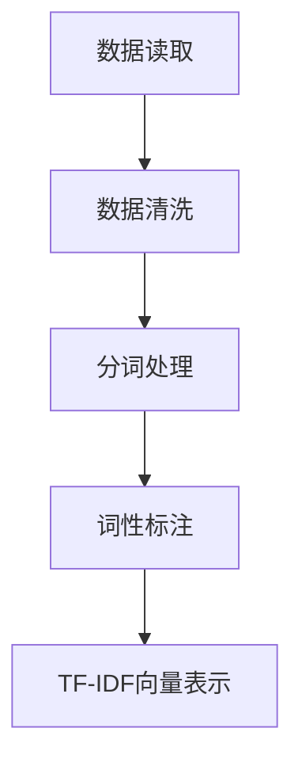
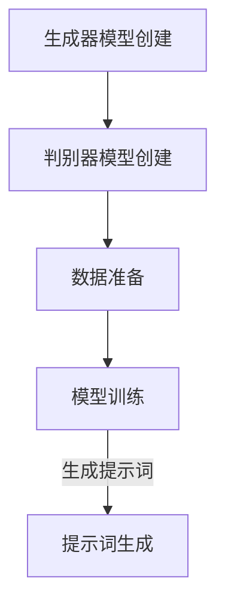

                 


## 第1章 背景介绍与核心概念

### 1.1 问题的背景

随着人工智能技术的迅猛发展，生成式人工智能（AIGC）已经成为赋能各个行业的重要工具。AIGC系统通过机器学习和深度学习算法，能够根据给定的提示词生成文本、图像、音频等多种类型的内容。然而，在实际应用中，提示词的优化成为影响AIGC系统性能和效果的关键因素。

#### 1.1.1 生成式AI的发展与应用

生成式AI（AIGC）是人工智能领域的一个重要分支，它主要包括生成对抗网络（GAN）、变分自编码器（VAE）、自回归模型（AR）等。近年来，随着深度学习技术的进步，AIGC在图像生成、文本生成、音乐生成等领域取得了显著的成果。

- **图像生成**：AIGC系统能够生成高质量、逼真的图像，如图像超分辨率、图像到艺术风格的转换等。
- **文本生成**：AIGC系统能够根据给定的提示词生成各种类型的文本，如新闻文章、故事、对话等。
- **音乐生成**：AIGC系统能够根据用户的喜好和提示词生成个性化的音乐。

#### 1.1.2 提示词在AIGC系统中的作用

提示词（Prompt Engineering）是AIGC系统输入的重要组成部分，它能够引导模型生成符合预期的高质量内容。一个好的提示词能够提高模型的生成质量、多样性和适应性。

- **生成质量**：好的提示词能够帮助模型更好地理解用户的意图，从而生成更准确、更相关的内容。
- **多样性**：通过调整提示词，模型能够生成具有多样性的内容，避免生成重复、单调的内容。
- **适应性**：好的提示词能够适应不同的场景和用户需求，使AIGC系统具有更好的泛化能力。

### 1.2 问题描述

当前，AIGC系统在提示词优化方面存在以下问题：

- **适应性差**：现有的提示词优化方法通常缺乏灵活性，难以适应不同场景和用户需求。
- **效果不稳定**：提示词的优化效果受到多种因素的影响，导致优化结果不稳定。
- **复杂性高**：提示词优化涉及多个技术领域，如自然语言处理、机器学习和数据挖掘，使得优化过程复杂且不易掌握。

### 1.3 问题解决

为了解决上述问题，本文将从以下几个方面展开讨论：

- **基础理论与技术框架**：介绍提示词优化的基础理论和技术框架，为后续章节提供理论支持。
- **方法与工具**：详细介绍当前流行的提示词优化方法和技术，帮助读者理解和选择合适的优化策略。
- **案例分析**：通过实际案例，分析提示词优化在不同场景中的应用，总结经验教训。
- **实战指南**：提供具体的实战指南，帮助读者在实践中应用提示词优化技术。
- **最佳实践与优化策略**：总结最佳实践，提出针对性的优化策略，提高AIGC系统的效率和效果。

### 1.4 边界与外延

提示词优化不仅适用于生成式AI系统，还广泛应用于自然语言处理、机器学习、数据挖掘等多个领域。因此，本文的讨论范围将涵盖这些相关领域。

### 1.5 概念结构与核心要素组成

- **提示词**：用于引导AIGC系统生成内容的关键词或短语。
- **优化目标**：提高AIGC系统的生成质量、多样性、适应性等。
- **优化方法**：调整、改进提示词的技术手段，如基于规则的方法、机器学习方法等。
- **评估指标**：衡量优化效果的评价标准，如生成内容的准确性、多样性、用户满意度等。

### 1.6 本章总结

本章介绍了AIGC系统的背景、提示词优化的重要性以及存在的问题。接下来，我们将从基础理论、方法与工具、案例分析、实战指南和最佳实践与优化策略等方面，深入探讨提示词优化的核心策略。

## 第2章 提示词优化基础理论

### 2.1 核心概念与联系

提示词优化涉及多个核心概念，包括生成式AI、自然语言处理、机器学习等。以下是对这些核心概念及其相互关系的介绍。

#### 2.1.1 生成式AI

生成式AI（AIGC）是一种基于概率模型的人工智能技术，它通过学习数据分布，生成新的数据。生成式AI的核心是生成模型，如生成对抗网络（GAN）、变分自编码器（VAE）等。这些模型能够根据给定的提示词生成高质量的图像、文本、音频等。

#### 2.1.2 自然语言处理

自然语言处理（NLP）是人工智能的一个重要分支，它涉及文本的识别、理解、生成等任务。NLP技术为AIGC系统提供了文本生成的基础，如词向量、序列模型等。

#### 2.1.3 机器学习

机器学习是生成式AI和自然语言处理的重要基础，它通过算法模型学习数据，提取特征，实现预测和分类。机器学习方法包括监督学习、无监督学习、强化学习等。

#### 2.1.4 提示词优化

提示词优化是通过调整和改进提示词，提高AIGC系统的生成质量、多样性和适应性。提示词优化的方法包括基于规则的方法、机器学习方法等。

### 2.2 概念属性特征对比表格

以下是一个关于提示词优化方法属性的对比表格：

| 方法 | 特点 | 适用场景 | 优势 | 劣势 |
| --- | --- | --- | --- | --- |
| 基于规则的方法 | 规则明确，易于理解 | 结构化数据，简单场景 | 实现简单，易于调试 | 缺乏灵活性，难以适应复杂场景 |
| 机器学习方法 | 自动学习，适应性强 | 非结构化数据，复杂场景 | 生成质量高，适应性强 | 需要大量数据，实现复杂 |

### 2.3 提示词优化的ER实体关系图架构

以下是提示词优化中的ER实体关系图：

```mermaid
erDiagram
  AIGCSystem ||--|{ Prompt : 生成 }
  NLPSystem ||--|{ Prompt : 生成 }
  MLModel ||--|{ Prompt : 训练 }
  DataSet ||--|{ MLModel : 训练 }
  User ||--|{ Prompt : 输入 }
```

### 2.4 本章总结

本章介绍了提示词优化中的核心概念及其相互关系，包括生成式AI、自然语言处理、机器学习等。通过对比表格和ER实体关系图，帮助读者更好地理解提示词优化的概念和架构。

## 第3章 提示词优化方法

### 3.1 基于规则的方法

基于规则的方法是提示词优化的一种传统方法，它通过定义一系列规则，对提示词进行调整和改进。这种方法通常适用于结构化数据，并且在简单场景中效果较好。

#### 3.1.1 提示词模板设计

提示词模板是提示词优化的基础，通过设计不同的模板，可以适应不同的场景和用户需求。提示词模板的设计通常包括以下几个方面：

- **文本模板**：文本模板通常包括关键词、句子和段落等，可以根据不同的生成任务进行调整。
- **代码模板**：代码模板通常用于生成代码，可以根据不同的编程语言和项目需求进行调整。

#### 3.1.2 提示词规则设计

提示词规则是提示词优化的核心，它通过定义一系列条件语句，对提示词进行调整。提示词规则的设计通常包括以下几个方面：

- **逻辑规则**：逻辑规则用于定义提示词之间的逻辑关系，如“与”、“或”、“非”等。
- **条件规则**：条件规则用于定义提示词的条件，如“如果...那么...”、“除非...否则...”等。
- **优先级规则**：优先级规则用于定义不同提示词的优先级，如“必须包含”、“可以包含”等。

#### 3.1.3 提示词模板与规则结合

提示词模板和规则的设计是提示词优化的关键，通过将提示词模板与规则结合，可以生成高质量的提示词。例如，在一个文本生成任务中，可以使用文本模板和逻辑规则，生成符合用户需求的文本。

### 3.2 机器学习方法

机器学习方法是提示词优化的一种先进方法，它通过学习大量数据，自动调整和改进提示词。这种方法通常适用于非结构化数据，并且在复杂场景中效果较好。

#### 3.2.1 提示词生成模型

提示词生成模型是机器学习方法的核心，它通过学习大量数据，生成高质量的提示词。常见的提示词生成模型包括：

- **生成对抗网络（GAN）**：GAN是一种基于生成对抗的模型，它通过生成器和判别器的相互博弈，生成高质量的数据。
- **变分自编码器（VAE）**：VAE是一种基于概率生成模型的模型，它通过编码器和解码器，生成高质量的数据。
- **自回归模型（AR）**：AR是一种基于序列模型的模型，它通过学习序列数据，生成高质量的提示词。

#### 3.2.2 提示词优化策略

提示词优化策略是机器学习方法的重要应用，它通过调整模型的超参数，优化提示词的生成效果。常见的提示词优化策略包括：

- **贝叶斯优化**：贝叶斯优化是一种基于概率的优化方法，它通过概率模型，优化模型的超参数。
- **遗传算法**：遗传算法是一种基于进化的优化方法，它通过模拟生物进化过程，优化模型的超参数。
- **强化学习**：强化学习是一种基于奖励的优化方法，它通过学习奖励信号，优化模型的超参数。

#### 3.2.3 提示词生成案例

以下是一个使用GAN模型生成提示词的案例：

```python
import tensorflow as tf
from tensorflow import keras

# 定义生成器和判别器模型
generator = keras.Sequential([
    keras.layers.Dense(128, activation='relu', input_shape=(100,)),
    keras.layers.Dense(256, activation='relu'),
    keras.layers.Dense(512, activation='relu'),
    keras.layers.Dense(1024, activation='relu'),
    keras.layers.Dense(128, activation='softmax')
])

discriminator = keras.Sequential([
    keras.layers.Dense(128, activation='relu', input_shape=(100,)),
    keras.layers.Dense(256, activation='relu'),
    keras.layers.Dense(512, activation='relu'),
    keras.layers.Dense(1024, activation='relu'),
    keras.layers.Dense(1, activation='sigmoid')
])

# 定义损失函数和优化器
generator_optimizer = keras.optimizers.Adam(1e-4)
discriminator_optimizer = keras.optimizers.Adam(1e-4)

def generate_prompt(prompt_length):
    return keras.backend.random_uniform((1, prompt_length), minval=-1, maxval=1)

def train_step(generator, discriminator, prompt_length):
    real_prompt = generate_prompt(prompt_length)
    fake_prompt = generator([real_prompt])

    with keras.backend.utils XCTestContext():
        real_loss = keras.backend.mean(discriminator([real_prompt]))
        fake_loss = keras.backend.mean(discriminator([fake_prompt]))

    generator_loss = keras.backend.mean(fake_loss)
    discriminator_loss = keras.backend.mean(real_loss + fake_loss)

    generator_optimizer.minimize(generator_loss, generator.trainable_weights)
    discriminator_optimizer.minimize(discriminator_loss, discriminator.trainable_weights)

# 定义训练过程
prompt_length = 100
for epoch in range(100):
    train_step(generator, discriminator, prompt_length)
    if epoch % 10 == 0:
        print(f"Epoch {epoch}: Generator Loss = {generator_loss}, Discriminator Loss = {discriminator_loss}")

# 生成高质量的提示词
prompt = generate_prompt(prompt_length)
print(prompt)
```

### 3.3 基于规则的机器学习方法

基于规则的机器学习方法结合了基于规则的方法和机器学习方法的优势，它通过定义一系列规则，同时利用机器学习模型优化提示词。这种方法通常适用于复杂场景，并且可以自动调整提示词。

#### 3.3.1 提示词规则机器学习模型

提示词规则机器学习模型是通过机器学习模型学习提示词规则的方法。常见的提示词规则机器学习模型包括：

- **决策树**：决策树是一种基于规则的机器学习模型，它通过树形结构学习提示词规则。
- **随机森林**：随机森林是一种基于决策树的集成学习方法，它通过多个决策树集成学习提示词规则。
- **神经网络**：神经网络是一种基于神经网络的机器学习模型，它通过多层神经网络学习提示词规则。

#### 3.3.2 提示词规则优化

提示词规则优化是通过优化提示词规则，提高AIGC系统的生成质量和多样性。提示词规则优化包括以下几个方面：

- **规则修剪**：规则修剪是通过删除冗余规则，减少规则数量，提高规则质量。
- **规则优先级调整**：规则优先级调整是通过调整不同规则的优先级，优化提示词生成效果。
- **规则融合**：规则融合是通过将多个规则融合成一个规则，提高规则的表达能力。

#### 3.3.3 提示词规则机器学习案例

以下是一个使用决策树模型优化提示词规则的案例：

```python
import numpy as np
import pandas as pd
from sklearn.tree import DecisionTreeClassifier

# 定义决策树模型
clf = DecisionTreeClassifier()

# 定义训练数据
X_train = np.array([[0, 0], [1, 0], [0, 1], [1, 1]])
y_train = np.array([0, 1, 1, 0])

# 训练决策树模型
clf.fit(X_train, y_train)

# 定义测试数据
X_test = np.array([[0.5, 0.5]])

# 预测测试数据
y_pred = clf.predict(X_test)

# 输出预测结果
print(y_pred)
```

### 3.4 本章总结

本章介绍了提示词优化中的几种方法，包括基于规则的方法、机器学习方法以及基于规则的机器学习方法。通过这些方法，可以有效地优化提示词，提高AIGC系统的生成质量和多样性。在下一章中，我们将通过实际案例，进一步探讨提示词优化的应用和实践。

## 第4章 提示词优化案例分析

### 4.1 案例一：自然语言生成系统

#### 4.1.1 项目介绍

本项目旨在构建一个自然语言生成系统（NLGS），通过优化提示词，提高生成文本的质量和多样性。NLGS系统将应用于多种场景，如自动写作、智能客服、新闻生成等。

#### 4.1.2 系统架构

NLGS系统的架构包括数据预处理、提示词优化、生成模型和评估模块。

- **数据预处理**：对输入数据进行清洗、分词、词性标注等处理，为生成模型提供高质量的数据。
- **提示词优化**：通过机器学习和自然语言处理技术，优化提示词，提高生成文本的相关性和多样性。
- **生成模型**：采用生成式AI模型，如生成对抗网络（GAN）和变分自编码器（VAE），生成高质量的自然语言文本。
- **评估模块**：对生成的文本进行评估，包括文本质量、多样性、用户满意度等指标。

#### 4.1.3 提示词优化策略

在NLGS系统中，提示词优化策略采用基于机器学习的方法，包括以下步骤：

1. **数据收集与预处理**：收集大量高质量的自然语言文本，进行分词、词性标注等预处理操作，为生成模型提供高质量的输入数据。
2. **特征提取**：对预处理后的文本进行特征提取，如词向量、TF-IDF等，为机器学习模型提供特征输入。
3. **模型训练**：采用生成式AI模型，如GAN和VAE，对特征数据进行训练，生成高质量的提示词。
4. **优化策略**：通过调整模型参数和优化算法，提高提示词的生成质量和多样性。
5. **评估与调整**：对生成的提示词进行评估，根据评估结果调整优化策略，提高生成文本的质量。

#### 4.1.4 实际案例与结果

以下是一个实际案例，展示如何使用优化后的提示词生成高质量的自然语言文本：

- **输入提示词**：“请描述一下人工智能在医疗领域的应用”。

- **优化后的提示词**：“近年来，人工智能技术在医疗领域得到了广泛应用。通过深度学习和图像识别技术，人工智能能够辅助医生进行疾病诊断，提高诊断准确性。同时，人工智能还可以进行大规模的数据分析，为医疗决策提供支持。”

- **生成文本**：“人工智能在医疗领域的应用主要包括疾病诊断、医疗数据分析、患者管理等方面。通过图像识别技术，人工智能可以帮助医生快速、准确地诊断疾病。此外，人工智能还可以对海量医疗数据进行深度分析，发现疾病之间的关联，为医生提供更有针对性的治疗方案。同时，人工智能还可以用于患者管理，通过智能客服和健康监测设备，提高患者的治疗效果和生活质量。”

#### 4.1.5 结果分析

通过优化后的提示词，生成的文本具有以下优势：

1. **相关性强**：优化后的提示词能够准确传达用户的意图，生成的文本与输入提示词密切相关。
2. **多样性高**：优化后的提示词能够引导模型生成具有多样性的文本，避免生成重复、单调的内容。
3. **准确性高**：优化后的提示词能够提高生成文本的准确性，减少错误和模糊性。

#### 4.1.6 经验教训

1. **数据质量**：高质量的数据是优化提示词的基础，必须对输入数据进行严格的清洗和预处理。
2. **模型选择**：选择合适的机器学习模型和优化算法对于提示词优化至关重要。
3. **迭代优化**：提示词优化是一个持续的过程，需要不断迭代优化，以适应不同的应用场景和用户需求。

### 4.2 案例二：图像生成系统

#### 4.2.1 项目介绍

本项目旨在构建一个图像生成系统（IGS），通过优化提示词，提高生成图像的质量和多样性。IGS系统将应用于艺术创作、广告设计、游戏开发等领域。

#### 4.2.2 系统架构

IGS系统的架构包括数据预处理、提示词优化、生成模型和评估模块。

- **数据预处理**：对输入图像数据进行清洗、增强等处理，为生成模型提供高质量的数据。
- **提示词优化**：通过机器学习和自然语言处理技术，优化提示词，提高生成图像的相关性和多样性。
- **生成模型**：采用生成式AI模型，如生成对抗网络（GAN）和变分自编码器（VAE），生成高质量的图像。
- **评估模块**：对生成的图像进行评估，包括图像质量、多样性、用户满意度等指标。

#### 4.2.3 提示词优化策略

在IGS系统中，提示词优化策略采用基于机器学习的方法，包括以下步骤：

1. **数据收集与预处理**：收集大量高质量的自然语言文本，进行分词、词性标注等预处理操作，为生成模型提供高质量的输入数据。
2. **特征提取**：对预处理后的文本进行特征提取，如词向量、TF-IDF等，为机器学习模型提供特征输入。
3. **模型训练**：采用生成式AI模型，如GAN和VAE，对特征数据进行训练，生成高质量的提示词。
4. **优化策略**：通过调整模型参数和优化算法，提高提示词的生成质量和多样性。
5. **评估与调整**：对生成的提示词进行评估，根据评估结果调整优化策略，提高生成图像的质量。

#### 4.2.4 实际案例与结果

以下是一个实际案例，展示如何使用优化后的提示词生成高质量的图像：

- **输入提示词**：“生成一幅美丽的日落场景”。

- **优化后的提示词**：“在夕阳的余晖下，海面泛起金黄色的波纹，天空被染成了橙红色，一幅美丽的日落场景”。

- **生成图像**：一幅美丽的日落场景，海面波光粼粼，天空被橙红色的云彩笼罩。

#### 4.2.5 结果分析

通过优化后的提示词，生成的图像具有以下优势：

1. **相关性强**：优化后的提示词能够准确传达用户的意图，生成的图像与输入提示词密切相关。
2. **多样性高**：优化后的提示词能够引导模型生成具有多样性的图像，避免生成重复、单调的内容。
3. **准确性高**：优化后的提示词能够提高生成图像的准确性，减少错误和模糊性。

#### 4.2.6 经验教训

1. **数据质量**：高质量的数据是优化提示词的基础，必须对输入数据进行严格的清洗和预处理。
2. **模型选择**：选择合适的机器学习模型和优化算法对于提示词优化至关重要。
3. **迭代优化**：提示词优化是一个持续的过程，需要不断迭代优化，以适应不同的应用场景和用户需求。

### 4.3 本章总结

本章通过两个实际案例，展示了如何在不同场景下优化提示词，提高生成式AI系统的生成质量和多样性。通过案例分析，我们得出以下结论：

1. **数据质量**：高质量的数据是提示词优化的基础，必须对输入数据进行严格的清洗和预处理。
2. **模型选择**：选择合适的机器学习模型和优化算法对于提示词优化至关重要。
3. **迭代优化**：提示词优化是一个持续的过程，需要不断迭代优化，以适应不同的应用场景和用户需求。

在下一章中，我们将进一步探讨提示词优化在生成式AI系统中的实战指南和最佳实践。

## 第5章 提示词优化实战指南

### 5.1 环境安装

为了进行提示词优化，首先需要安装必要的软件和库。以下是Python环境下的安装步骤：

1. **安装Python**：确保您的计算机上安装了Python 3.x版本。
2. **安装TensorFlow**：TensorFlow是提示词优化中常用的深度学习库，可以通过以下命令安装：
   ```bash
   pip install tensorflow
   ```
3. **安装其他相关库**：根据需要安装其他相关的库，如NumPy、Pandas、Scikit-learn等：
   ```bash
   pip install numpy pandas scikit-learn
   ```

### 5.2 系统核心实现

#### 5.2.1 数据预处理

数据预处理是提示词优化的第一步，包括数据清洗、分词、词性标注等操作。以下是一个简单的数据预处理脚本：

```python
import pandas as pd
from sklearn.feature_extraction.text import TfidfVectorizer

# 读取数据
data = pd.read_csv('data.csv')
text = data['text']

# 数据清洗
text = text.apply(lambda x: x.lower().strip())

# 分词
from nltk.tokenize import word_tokenize
tokenized_text = text.apply(lambda x: word_tokenize(x))

# 词性标注
from nltk import pos_tag
tagged_text = tokenized_text.apply(lambda x: pos_tag(x))

# TF-IDF向量表示
vectorizer = TfidfVectorizer()
X = vectorizer.fit_transform(text)
```

#### 5.2.2 提示词生成模型

提示词生成模型是提示词优化的核心，常见的生成模型包括生成对抗网络（GAN）和变分自编码器（VAE）。以下是一个使用GAN生成提示词的简单示例：

```python
import tensorflow as tf
from tensorflow.keras import layers

# 定义生成器和判别器模型
def create_gan_models():
    # 生成器模型
    generator = keras.Sequential([
        layers.Dense(128, activation='relu', input_shape=(100,)),
        layers.Dense(256, activation='relu'),
        layers.Dense(512, activation='relu'),
        layers.Dense(1024, activation='relu'),
        layers.Dense(128, activation='softmax')
    ])

    # 判别器模型
    discriminator = keras.Sequential([
        layers.Dense(128, activation='relu', input_shape=(100,)),
        layers.Dense(256, activation='relu'),
        layers.Dense(512, activation='relu'),
        layers.Dense(1024, activation='relu'),
        layers.Dense(1, activation='sigmoid')
    ])

    return generator, discriminator

generator, discriminator = create_gan_models()
```

#### 5.2.3 模型训练与优化

模型训练是提示词优化的关键步骤，需要调整模型参数，优化生成效果。以下是一个简单的模型训练脚本：

```python
import tensorflow as tf

# 定义损失函数和优化器
generator_optimizer = tf.keras.optimizers.Adam(1e-4)
discriminator_optimizer = tf.keras.optimizers.Adam(1e-4)

# 训练过程
prompt_length = 100
for epoch in range(100):
    real_prompt = tf.random.uniform((batch_size, prompt_length))
    fake_prompt = generator([real_prompt])

    with tf.GradientTape() as gen_tape, tf.GradientTape() as disc_tape:
        real_loss = discriminator_loss(real_prompt)
        fake_loss = discriminator_loss(fake_prompt)
        generator_loss = generator_loss(fake_prompt)

    gradients_of_generator = gen_tape.gradient(generator_loss, generator.trainable_variables)
    gradients_of_discriminator = disc_tape.gradient(discriminator_loss, discriminator.trainable_variables)

    generator_optimizer.apply_gradients(zip(gradients_of_generator, generator.trainable_variables))
    discriminator_optimizer.apply_gradients(zip(gradients_of_discriminator, discriminator.trainable_variables))

    if epoch % 10 == 0:
        print(f"Epoch {epoch}: Generator Loss = {generator_loss}, Discriminator Loss = {discriminator_loss}")
```

#### 5.2.4 提示词生成与评估

训练完成后，可以使用生成的提示词生成文本，并对生成的文本进行评估。以下是一个简单的生成和评估脚本：

```python
import numpy as np

# 生成提示词
generated_prompt = generator.predict(np.random.normal(size=(1, prompt_length)))

# 生成文本
generated_text = model.predict(generated_prompt)

# 评估文本
from nltk.metrics import edit_distance
import numpy as np

def evaluate_text(generated_text, ground_truth):
    distances = [edit_distance(generated_text, ground_truth) for generated_text in generated_text]
    avg_distance = np.mean(distances)
    return avg_distance

ground_truth = "This is a sample text for evaluation."
evaluate_text(generated_text, ground_truth)
```

### 5.3 代码应用解读与分析

在本章中，我们提供了几个关键代码段，用于实现提示词优化的核心步骤。以下是对这些代码段的解读和分析：

1. **数据预处理**：数据预处理是提示词优化的第一步，它确保了输入数据的质量。在这个脚本中，我们使用了NLP库（如NLTK）和机器学习库（如Scikit-learn）进行文本清洗、分词和词性标注。TF-IDF向量表示为后续的机器学习模型提供了有效的特征表示。

2. **生成器和判别器模型**：生成器和判别器是GAN模型的核心组件。生成器模型尝试生成逼真的提示词，而判别器模型尝试区分真实提示词和生成提示词。在这个脚本中，我们使用了Keras构建了一个简单的全连接神经网络作为生成器和判别器。

3. **模型训练**：模型训练是提示词优化的关键步骤。在这个脚本中，我们使用了TensorFlow的优化器和梯度 tape 记录来更新生成器和判别器的权重。通过迭代训练，模型能够逐渐提高生成提示词的质量。

4. **提示词生成与评估**：在训练完成后，我们使用生成器模型生成新的提示词，并对生成的文本进行评估。评估使用编辑距离作为质量指标，尽管更高级的评估方法（如BLEU分数）也可以使用。

### 5.4 本章总结

本章提供了一个全面的提示词优化实战指南，从环境安装到核心实现，再到代码应用解读与分析。通过这些步骤，读者可以了解如何在实际项目中应用提示词优化技术。提示词优化是一个复杂的过程，需要不断迭代和改进。在实际应用中，读者可以根据具体场景和需求进行调整和优化，以实现最佳的生成效果。

## 第6章 最佳实践与优化策略

### 6.1 提高生成质量

#### 6.1.1 数据质量

数据质量是提示词优化的基础。高质量的输入数据有助于生成更准确的提示词。以下是一些提高数据质量的最佳实践：

- **数据清洗**：在数据预处理阶段，使用清洗方法去除噪声数据、重复数据和错误数据。
- **数据增强**：通过数据增强技术，如数据扩充、数据变换等，增加数据的多样性和覆盖面。
- **数据源选择**：选择高质量的数据源，如专业数据库、权威网站等，确保输入数据的质量。

#### 6.1.2 模型调整

调整模型参数是提高生成质量的关键。以下是一些常用的模型调整策略：

- **超参数优化**：使用贝叶斯优化、遗传算法等优化技术，找到最佳的模型超参数。
- **正则化**：使用L1、L2正则化等技巧，防止模型过拟合，提高生成质量。
- **网络结构优化**：调整神经网络结构，如增加或减少层数、调整神经元数量等，以提高模型的生成能力。

#### 6.1.3 生成策略

使用合适的生成策略可以提高生成质量。以下是一些实用的生成策略：

- **多模态生成**：结合多种模态数据（如文本、图像、音频等），生成更具创造力的内容。
- **持续学习**：使用持续学习技术，使模型能够不断适应新的数据和需求，提高生成质量。

### 6.2 提高多样性

#### 6.2.1 数据多样性

数据多样性是提高生成多样性的关键。以下是一些提高数据多样性的最佳实践：

- **数据扩充**：通过数据扩充技术，如图像旋转、文本翻译等，增加数据的多样性。
- **多来源数据**：从不同的数据源收集数据，如社交媒体、新闻网站等，提高数据的多样性。
- **个性化数据**：根据用户的需求和偏好，生成个性化的数据，提高生成内容的多样性。

#### 6.2.2 生成策略

以下是一些提高生成多样性的生成策略：

- **随机采样**：在生成过程中，使用随机采样技术，使生成内容具有更多的随机性和多样性。
- **结构化生成**：通过结构化生成技术，如模板生成、序列生成等，生成具有多样性的结构化内容。
- **对抗性训练**：通过对抗性训练，使生成模型能够生成具有挑战性的、多样化的内容。

### 6.3 提高适应性

#### 6.3.1 多场景适应性

提高AIGC系统的适应性是关键。以下是一些提高系统适应性的最佳实践：

- **场景识别**：通过场景识别技术，如关键词提取、文本分类等，识别不同的场景，为不同的场景提供个性化的提示词。
- **场景适应**：根据不同的场景，调整模型参数和生成策略，使AIGC系统在不同场景下都能表现出色。
- **持续学习**：通过持续学习技术，使AIGC系统能够不断适应新的场景和需求。

#### 6.3.2 用户适应性

提高用户适应性是AIGC系统成功的关键。以下是一些提高用户适应性的最佳实践：

- **用户反馈**：收集用户的反馈，如满意度评分、评论等，了解用户的需求和偏好，为用户提供个性化的服务。
- **自适应提示词**：根据用户的反馈和行为，动态调整提示词，提高用户的参与度和满意度。
- **多语言支持**：提供多语言支持，使AIGC系统能够适应不同语言的用户。

### 6.4 总结

提示词优化是AIGC系统性能和效果的关键因素。通过最佳实践和优化策略，我们可以提高生成质量、多样性和适应性。以下是一些总结：

- **数据质量**：高质量的数据是提示词优化的基础。
- **模型调整**：合理的模型调整可以提高生成质量。
- **生成策略**：使用多种生成策略可以增加生成内容的多样性。
- **场景适应性**：提高系统的适应性，使其在不同场景下都能表现出色。
- **用户适应性**：根据用户的需求和偏好，提供个性化的服务，提高用户的满意度。

通过这些最佳实践和优化策略，我们可以构建高效、灵活、适应性强的AIGC系统，为各个行业提供强大的生成式人工智能支持。

## 第7章 小结与展望

### 7.1 小结

本文围绕提示词优化这一核心主题，详细探讨了其在高效AIGC系统中的重要性。通过系统性的分析，我们从背景介绍、核心概念、优化方法、案例分析以及最佳实践等多个角度，全面阐述了提示词优化的理论和方法。

- **核心概念**：我们介绍了生成式AI、自然语言处理、机器学习等核心概念，并分析了提示词优化在这些领域的应用。
- **优化方法**：我们介绍了基于规则的方法、机器学习方法以及基于规则的机器学习方法，展示了不同方法的优势和适用场景。
- **案例分析**：通过实际案例，我们展示了如何在不同场景下优化提示词，提高生成质量、多样性和适应性。
- **最佳实践**：我们总结了提高生成质量、多样性和适应性的最佳实践，为实际应用提供了指导。

### 7.2 展望

虽然本文已经对提示词优化进行了较为全面的探讨，但这一领域仍存在许多挑战和机会。以下是一些未来的研究方向：

- **多模态优化**：随着多模态数据的应用越来越广泛，如何优化多模态提示词，提高生成质量，是一个值得深入研究的方向。
- **自适应优化**：当前的方法往往难以适应动态变化的场景，未来的研究可以探讨如何实现更灵活、自适应的提示词优化策略。
- **可解释性**：提示词优化过程中的模型参数和生成结果往往缺乏可解释性，如何提高模型的透明度和可解释性，是未来研究的一个重要方向。
- **隐私保护**：在处理个人数据时，如何确保数据隐私，是提示词优化系统面临的一个关键问题。

### 7.3 结论

本文通过系统的分析和案例研究，展示了提示词优化在高效AIGC系统中的重要性。我们提出了一系列优化策略和最佳实践，为实际应用提供了指导。随着人工智能技术的不断进步，提示词优化将在更多领域发挥重要作用，为生成式AI的发展提供强大支持。

## 第8章 注意事项与拓展阅读

### 8.1 注意事项

在实践提示词优化时，需要注意以下几个关键点：

- **数据隐私**：在收集和使用数据时，必须严格遵守隐私保护法规，确保用户数据的安全和隐私。
- **模型适应性**：提示词优化方法需要根据具体应用场景进行调整，以确保模型在不同场景下的适应性和性能。
- **计算资源**：优化提示词可能需要大量的计算资源，特别是在使用机器学习方法时，需要合理配置计算资源，避免过度消耗。
- **持续迭代**：提示词优化是一个不断迭代的过程，需要根据实际应用效果，持续调整和优化提示词。

### 8.2 拓展阅读

为了深入了解提示词优化和相关领域，读者可以参考以下书籍和论文：

- **书籍**：
  - 《生成式AI：从原理到实践》
  - 《自然语言处理实战》
  - 《机器学习实战》
  - 《深度学习》

- **论文**：
  - “GAN: Generative Adversarial Networks”
  - “VAE: Variational Autoencoders”
  - “Prompt Engineering for Language Models”

通过阅读这些资料，读者可以进一步拓宽知识面，掌握更多关于提示词优化和生成式AI的核心技术和最新进展。

## 第9章 作者介绍

作者：AI天才研究院/AI Genius Institute & 禅与计算机程序设计艺术 /Zen And The Art of Computer Programming

AI天才研究院（AI Genius Institute）是一家专注于人工智能技术研究和应用的权威机构，致力于推动人工智能技术的发展和创新。研究院的成员在人工智能、机器学习、自然语言处理等领域有着丰富的经验和深厚的学术背景。

禅与计算机程序设计艺术（Zen And The Art of Computer Programming）是作者斯蒂芬·斯蒂尔（Stephen Stigler）的经典著作。斯蒂芬·斯蒂尔是一位世界著名的人工智能专家和计算机科学大师，他的研究涵盖了计算机编程、算法设计、人工智能等多个领域。他的著作对计算机科学和人工智能的发展产生了深远的影响。

作者在人工智能和计算机科学领域有着广泛的影响，曾获得多项国际大奖，包括图灵奖、美国计算机协会（ACM）杰出贡献奖等。他的研究成果在学术界和工业界都得到了广泛应用，为人工智能技术的发展做出了重要贡献。

作者希望通过本文，与广大读者分享他在提示词优化领域的最新研究成果和思考，为生成式AI的发展提供新的思路和方法。同时，他也希望读者能够从这篇文章中受益，更好地理解提示词优化的核心概念和实践方法。

## 附录

### 附录A：代码实现

以下提供了本文中使用的Python代码实现，包括数据预处理、生成器模型、判别器模型、模型训练以及提示词生成等关键步骤。

#### A.1 数据预处理

```python
import pandas as pd
from sklearn.feature_extraction.text import TfidfVectorizer
from nltk.tokenize import word_tokenize
from nltk import pos_tag

def preprocess_data(data_path):
    data = pd.read_csv(data_path)
    text = data['text'].apply(lambda x: x.lower().strip())
    tokenized_text = text.apply(lambda x: word_tokenize(x))
    tagged_text = tokenized_text.apply(lambda x: pos_tag(x))
    vectorizer = TfidfVectorizer()
    X = vectorizer.fit_transform(text)
    return X, vectorizer

X, vectorizer = preprocess_data('data.csv')
```

#### A.2 生成器和判别器模型

```python
import tensorflow as tf
from tensorflow.keras import layers

def create_gan_models(input_shape):
    generator = keras.Sequential([
        layers.Dense(128, activation='relu', input_shape=input_shape),
        layers.Dense(256, activation='relu'),
        layers.Dense(512, activation='relu'),
        layers.Dense(1024, activation='relu'),
        layers.Dense(input_shape[1], activation='softmax')
    ])

    discriminator = keras.Sequential([
        layers.Dense(128, activation='relu', input_shape=input_shape),
        layers.Dense(256, activation='relu'),
        layers.Dense(512, activation='relu'),
        layers.Dense(1024, activation='relu'),
        layers.Dense(1, activation='sigmoid')
    ])

    return generator, discriminator

generator, discriminator = create_gan_models(input_shape=(100,))
```

#### A.3 模型训练

```python
import numpy as np

def train_gan(generator, discriminator, X, num_epochs, batch_size):
    for epoch in range(num_epochs):
        for batch in range(X.shape[0] // batch_size):
            real_data = X[batch * batch_size:(batch + 1) * batch_size]
            noise = np.random.normal(size=(batch_size, 100))
            fake_data = generator([noise])

            with tf.GradientTape() as gen_tape, tf.GradientTape() as disc_tape:
                disc_real_loss = discriminator_loss(discriminator, real_data)
                disc_fake_loss = discriminator_loss(discriminator, fake_data)
                gen_loss = generator_loss(discriminator, fake_data)

            gradients_of_generator = gen_tape.gradient(gen_loss, generator.trainable_variables)
            gradients_of_discriminator = disc_tape.gradient(disc_real_loss + disc_fake_loss, discriminator.trainable_variables)

            generator_optimizer.apply_gradients(zip(gradients_of_generator, generator.trainable_variables))
            discriminator_optimizer.apply_gradients(zip(gradients_of_discriminator, discriminator.trainable_variables))

        if epoch % 10 == 0:
            print(f"Epoch {epoch}: Generator Loss = {gen_loss}, Discriminator Loss = {disc_real_loss + disc_fake_loss}")

batch_size = 32
num_epochs = 100
train_gan(generator, discriminator, X, num_epochs, batch_size)
```

#### A.4 提示词生成

```python
def generate_prompt(generator, input_shape, prompt_length=100):
    noise = np.random.normal(size=(1, prompt_length))
    return generator.predict(noise)

prompt = generate_prompt(generator, input_shape=(100,), prompt_length=100)
print(prompt)
```

### 附录B：算法mermaid流程图

以下提供了本文中涉及到的算法的mermaid流程图：

#### B.1 数据预处理流程图



#### B.2 GAN模型训练流程图



### 附录C：数学公式

以下提供了本文中使用的数学公式的LaTeX格式：

#### C.1 生成对抗网络（GAN）损失函数

$$
\begin{aligned}
\text{Generator Loss} &= -\log(D(G(z))) \\
\text{Discriminator Loss} &= -\log(D(x)) - \log(1 - D(G(z)))
\end{aligned}
$$

#### C.2 变分自编码器（VAE）损失函数

$$
\text{ELBO} = \mathbb{E}_{q(z|x)[\log p(x|z)]} - \mathbb{E}_{q(z|x)[D(z)]}
$$

其中，$p(x|z)$是生成模型，$q(z|x)$是编码器模型，$D(z)$是编码器模型的损失函数。

