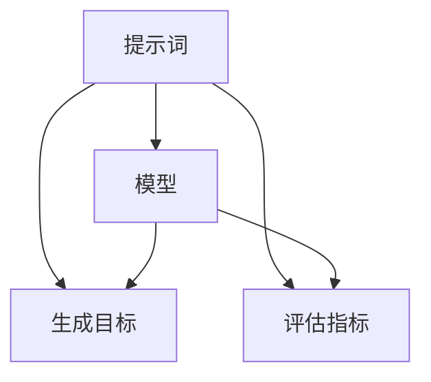
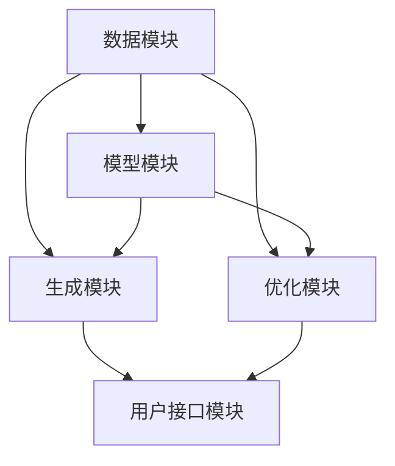
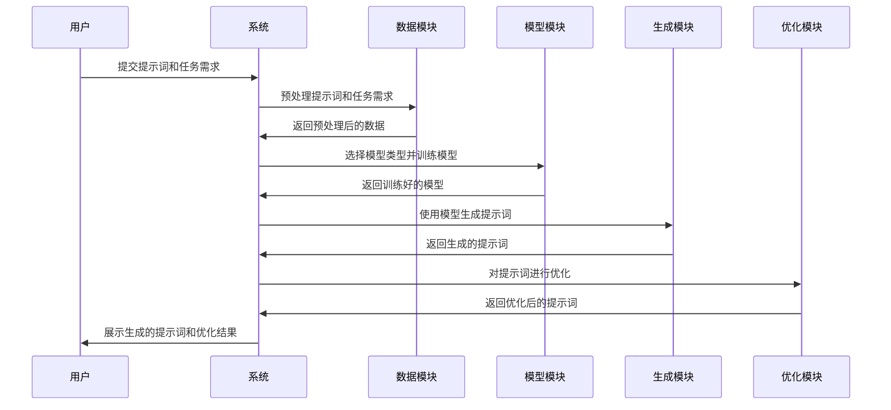

                 

### 提示词工程：构建智能AIGC系统的基石

关键词：提示词工程、智能AIGC系统、生成与优化、关键算法、系统设计与实现、应用场景、最佳实践

摘要：本文旨在深入探讨提示词工程在构建智能AIGC系统中的重要性。通过分析提示词工程的定义、发展历程、生成与优化方法，以及其在不同领域的应用，本文将为读者揭示提示词工程如何成为智能AIGC系统的基石。同时，本文还将探讨提示词工程中的关键算法、系统设计与实现策略，以及最佳实践和未来展望，为该领域的研究和应用提供有价值的参考。

### 目录大纲

**《提示词工程：构建智能AIGC系统的基石》**

----------------------------------------------------------------

## 第一部分：提示词工程基础

### 第1章：提示词工程的概述

#### 1.1.1 提示词工程的定义与背景

- **问题背景**：随着人工智能技术的快速发展，AIGC（AI-Generated Content）系统在各个领域得到了广泛应用，而提示词工程作为其核心组件之一，显得尤为重要。
- **问题解决**：通过定义提示词工程，明确其在智能AIGC系统中的作用和地位，为后续内容生成、优化和系统设计提供理论基础。
- **边界与外延**：提示词工程的范畴和限制，以及与其他相关概念的区分。

#### 1.1.2 提示词工程的发展历程

- **起源**：介绍提示词工程的起源和发展历程，梳理关键里程碑和技术突破。
- **发展阶段**：概述提示词工程的三个主要发展阶段，分别阐述其特征和重要成果。
- **当前发展趋势**：分析提示词工程当前的研究热点和发展趋势，探讨未来发展方向。

#### 1.1.3 提示词工程的应用领域

- **自然语言处理**：介绍提示词工程在自然语言处理领域的应用，如文本生成、文本分类等。
- **计算机视觉**：探讨提示词工程在计算机视觉领域的应用，如图像生成、图像分类等。
- **机器翻译**：分析提示词工程在机器翻译领域的应用，如机器翻译模型的优化和性能提升。

## 第二部分：提示词的生成与优化

### 第2章：提示词的生成与优化

#### 2.1.1 提示词生成方法

- **生成方法概述**：介绍常用的提示词生成方法，包括规则生成、模板生成、神经网络生成等。
- **生成算法原理与实现**：详细解释每种生成算法的原理和实现步骤，通过具体代码示例进行说明。

#### 2.1.2 提示词优化策略

- **优化目标**：明确提示词优化的目标，如提高生成质量、提升生成效率等。
- **优化算法**：介绍常用的提示词优化算法，包括基于深度学习、强化学习等方法。
- **优化效果评估**：讨论如何评估提示词优化的效果，包括评价指标和评估方法。

#### 2.1.3 提示词生成与优化流程

- **流程概述**：介绍提示词生成与优化的一般流程，包括数据准备、模型训练、提示词生成与优化等步骤。
- **具体实现步骤**：详细阐述每个步骤的实现方法和注意事项。

## 第三部分：提示词工程中的关键算法

### 第3章：提示词工程中的关键算法

#### 3.1.1 语言模型

- **语言模型概述**：介绍语言模型的基本概念和作用，包括概率模型、神经网络模型等。
- **语言模型算法原理**：详细解释语言模型的算法原理，包括输入表示、模型训练、输出预测等。
- **语言模型在提示词工程中的应用**：探讨语言模型在提示词生成和优化中的应用，如基于语言模型的文本生成、文本分类等。

#### 3.1.2 生成对抗网络（GAN）

- **GAN概述**：介绍生成对抗网络（GAN）的基本概念和结构，包括生成器和判别器等。
- **GAN算法原理**：详细解释GAN的算法原理，包括训练过程、生成过程和判别过程等。
- **GAN在提示词工程中的应用**：探讨GAN在提示词生成和优化中的应用，如图像生成、文本生成等。

#### 3.1.3 强化学习

- **强化学习概述**：介绍强化学习的基本概念和原理，包括智能体、环境、奖励等。
- **强化学习算法原理**：详细解释强化学习的算法原理，包括值函数、策略函数等。
- **强化学习在提示词工程中的应用**：探讨强化学习在提示词生成和优化中的应用，如生成对抗网络（GAN）、序列模型等。

## 第四部分：提示词工程系统设计与实现

### 第4章：提示词工程系统设计与实现

#### 4.1.1 系统需求分析

- **系统需求概述**：介绍系统需求，包括功能需求和非功能需求等。
- **功能需求分析**：详细分析系统的主要功能需求，如提示词生成、提示词优化等。
- **非功能需求分析**：讨论系统的非功能需求，如性能、可靠性、安全性等。

#### 4.1.2 系统架构设计

- **系统架构概述**：介绍系统的整体架构，包括主要模块和层次结构等。
- **系统模块划分**：详细划分系统的各个模块，如数据预处理模块、模型训练模块、提示词生成与优化模块等。
- **系统架构图展示**：使用Mermaid绘制系统架构图，展示系统的模块划分和交互关系。

#### 4.1.3 系统接口设计

- **接口设计概述**：介绍系统接口的设计原则和规范，如接口名称、输入输出参数等。
- **接口功能定义**：详细定义每个接口的功能，如数据接口、模型接口等。
- **接口交互流程**：使用Mermaid绘制接口交互序列图，展示接口的交互过程。

#### 4.1.4 系统交互设计

- **系统交互概述**：介绍系统的交互设计原则和流程，如交互模型、交互逻辑等。
- **系统交互流程**：详细阐述系统的交互流程，包括用户操作、系统响应等。
- **系统交互图展示**：使用Mermaid绘制系统交互序列图，展示系统的交互过程。

## 第五部分：提示词工程的应用场景

### 第5章：提示词工程的应用场景

#### 5.1.1 自然语言处理

- **应用场景概述**：介绍提示词工程在自然语言处理领域的应用场景，如文本生成、文本分类等。
- **应用实例分析**：通过具体实例分析提示词工程在自然语言处理中的应用效果和优势。

#### 5.1.2 计算机视觉

- **应用场景概述**：介绍提示词工程在计算机视觉领域的应用场景，如图像生成、图像分类等。
- **应用实例分析**：通过具体实例分析提示词工程在计算机视觉中的应用效果和优势。

#### 5.1.3 机器翻译

- **应用场景概述**：介绍提示词工程在机器翻译领域的应用场景，如机器翻译模型的优化和性能提升。
- **应用实例分析**：通过具体实例分析提示词工程在机器翻译中的应用效果和优势。

## 第六部分：提示词工程的最佳实践

### 第6章：提示词工程的最佳实践

#### 6.1.1 提示词生成与优化最佳实践

- **实践技巧**：总结提示词生成与优化的实用技巧，如数据预处理、模型调优等。
- **实践案例**：通过具体案例分享提示词生成与优化的实际应用经验，如文本生成、图像生成等。

#### 6.1.2 提示词工程系统优化策略

- **系统优化策略概述**：介绍提示词工程系统优化的策略和方法，如模型压缩、分布式训练等。
- **优化案例分享**：通过具体案例分享提示词工程系统优化的实际应用效果和经验。

## 第七部分：提示词工程的未来展望

### 第7章：提示词工程的未来展望

#### 7.1.1 提示词工程发展趋势

- **技术发展趋势**：分析提示词工程的技术发展趋势，如深度学习、生成对抗网络等。
- **应用发展趋势**：探讨提示词工程在不同领域的应用发展趋势，如自然语言处理、计算机视觉等。

#### 7.1.2 提示词工程的挑战与机遇

- **挑战分析**：分析提示词工程面临的挑战，如数据隐私、模型解释性等。
- **机遇展望**：探讨提示词工程面临的机遇，如人工智能技术进步、应用场景拓展等。

----------------------------------------------------------------

**总结：**

本文通过七个主要章节，全面系统地介绍了提示词工程在构建智能AIGC系统中的重要性。从基础理论到应用实践，从关键算法到系统设计，本文为读者提供了一个全面、深入的视角，帮助读者更好地理解和应用提示词工程。在未来的发展中，提示词工程将继续在人工智能领域发挥重要作用，为智能AIGC系统的发展提供强有力的支持。

## 第一部分：提示词工程基础

提示词工程是构建智能AIGC系统（AI-Generated Content）的核心组件，它在自然语言处理、计算机视觉、机器翻译等多个领域发挥着重要作用。本部分将从基础概念、发展历程和应用领域三个方面，为读者揭示提示词工程的基本面貌。

### 第1章：提示词工程的概述

#### 1.1.1 提示词工程的定义与背景

提示词工程（Prompt Engineering）是指通过设计和优化提示词（prompts），以引导人工智能模型生成高质量内容的过程。提示词工程的目标是提高生成内容的准确性、一致性和多样性，使生成的文本、图像、视频等更符合人类需求。

**问题背景**：

随着人工智能技术的发展，生成对抗网络（GAN）、自然语言处理（NLP）等技术的应用日益广泛。然而，这些技术往往依赖于大量高质量的数据和复杂的模型架构，而生成的内容质量仍然无法满足实际需求。提示词工程的出现，为解决这一问题提供了新的思路。

**问题解决**：

提示词工程通过优化提示词的设计和选择，能够显著提高生成内容的质量。具体来说，通过以下方式解决问题：

1. **引导生成**：通过设计合适的提示词，可以引导人工智能模型生成更符合人类预期的内容。
2. **提高质量**：优化提示词能够提高生成内容的准确性、一致性和多样性，减少错误和不合理内容。
3. **降低复杂性**：通过优化提示词，可以简化模型的训练过程，降低计算复杂度。

**边界与外延**：

提示词工程的边界主要涉及提示词的设计、选择和优化，以及其与人工智能模型的交互。其外延包括但不限于以下方面：

1. **自然语言处理**：在文本生成、文本分类、问答系统等场景中，提示词工程起到了关键作用。
2. **计算机视觉**：在图像生成、图像分类、图像增强等任务中，提示词工程同样具有广泛的应用。
3. **机器翻译**：在机器翻译领域中，提示词工程可以优化翻译模型，提高翻译质量。

**概念结构与核心要素组成**：

提示词工程的核心概念包括提示词、模型、生成目标和评估指标。其结构如下图所示：



- **提示词**：提示词是引导模型生成内容的关键，通常是一段文本、图像或音频等。
- **模型**：提示词工程依赖于各种人工智能模型，如生成对抗网络（GAN）、循环神经网络（RNN）、变换器（Transformer）等。
- **生成目标**：生成目标是指模型需要生成的具体内容，可以是文本、图像、视频等。
- **评估指标**：评估指标用于衡量生成内容的质量，如准确性、多样性、流畅性等。

### 1.1.2 提示词工程的发展历程

**起源**：

提示词工程的概念起源于自然语言处理领域，特别是在问答系统和文本生成任务中。早期的自然语言处理模型（如循环神经网络（RNN）和长短期记忆网络（LSTM））依赖于大量的训练数据和复杂的模型架构，而生成的内容质量仍然不尽如人意。为了提高生成质量，研究者开始关注提示词的设计和优化，从而逐步形成了提示词工程的概念。

**发展阶段**：

提示词工程经历了三个主要发展阶段：

1. **规则生成阶段**：

   在规则生成阶段，研究者通过设计简单的规则和模板来生成提示词。这种方法虽然简单有效，但生成的提示词往往缺乏灵活性和多样性。

2. **模板生成阶段**：

   随着自然语言处理技术的发展，研究者开始采用模板生成方法。这种方法通过将提示词分解为模板和参数，使生成的提示词更加灵活和多样化。常见的模板生成方法包括基于词袋模型（Bag-of-Words）和基于生成对抗网络（GAN）的方法。

3. **神经网络生成阶段**：

   随着深度学习技术的兴起，神经网络生成方法成为提示词工程的主要方法。特别是生成对抗网络（GAN）和变换器（Transformer）的出现，使得提示词生成更加高效和灵活。神经网络生成方法能够自适应地学习提示词和生成目标之间的复杂关系，从而生成高质量的内容。

**当前发展趋势**：

当前，提示词工程在以下方面取得了显著进展：

1. **多模态生成**：

   提示词工程不仅限于文本生成，还扩展到了图像、视频、音频等多模态生成任务。通过融合不同模态的信息，能够生成更加丰富和真实的内容。

2. **生成对抗网络（GAN）**：

   生成对抗网络（GAN）在提示词工程中得到了广泛应用。GAN通过生成器和判别器的对抗训练，能够生成高质量和多样化的内容。

3. **预训练与微调**：

   提示词工程中的预训练和微调方法使得模型能够更好地适应特定任务和数据集。通过在大规模数据集上预训练模型，然后在特定任务上微调，能够显著提高生成质量。

### 1.1.3 提示词工程的应用领域

**自然语言处理**：

在自然语言处理领域，提示词工程广泛应用于文本生成、文本分类、问答系统等任务。通过设计合适的提示词，能够引导模型生成高质量和符合人类预期的文本。例如，在文本生成任务中，提示词可以用来生成文章、故事、新闻报道等。

**计算机视觉**：

在计算机视觉领域，提示词工程主要用于图像生成、图像分类、图像增强等任务。通过设计合适的提示词，能够引导模型生成高质量和符合人类预期的图像。例如，在图像生成任务中，提示词可以用来生成艺术作品、人脸图像、风景图像等。

**机器翻译**：

在机器翻译领域，提示词工程主要用于优化翻译模型，提高翻译质量。通过设计合适的提示词，能够引导模型生成更加准确和自然的翻译结果。例如，在机器翻译任务中，提示词可以用来生成英文摘要、中文文章等。

#### 1.1.1 提示词工程的定义与背景

提示词工程是一个相对较新的领域，随着人工智能技术的快速发展，特别是在自然语言处理、计算机视觉和机器翻译等领域的广泛应用，提示词工程的重要性逐渐凸显。本节将详细介绍提示词工程的定义、背景及其与相关概念的联系。

**提示词工程的定义**：

提示词工程是指通过设计和优化提示词，以提高人工智能系统生成内容的质量、一致性和多样性的一门工程技术。提示词（prompts）在此指的是用于引导人工智能模型进行内容生成的输入信息，可以是自然语言文本、语音、图像、视频等多种形式。

**问题背景**：

随着人工智能技术的快速发展，生成式人工智能（generative AI）得到了广泛关注。生成式人工智能系统能够根据输入提示生成新的、之前未见过的内容，如文本、图像、音频等。然而，生成内容的质量往往受到输入提示的影响。即使拥有先进的模型和算法，如果输入提示不够准确或具有误导性，生成的内容也难以满足实际应用需求。因此，如何设计和优化输入提示成为一个关键问题，提示词工程因此应运而生。

**问题描述**：

生成式人工智能系统的挑战主要表现在以下几个方面：

1. **生成内容的质量**：生成的内容需要具备较高的质量，如文本需要流畅、准确，图像需要逼真、和谐，音频需要清晰、连贯等。
2. **生成内容的多样性**：系统需要能够生成多种类型和风格的内容，以满足不同用户和场景的需求。
3. **生成内容的一致性**：生成的内容需要在特定主题或情境下保持一致性，避免出现矛盾或逻辑错误。

**问题解决**：

提示词工程通过以下方式解决上述问题：

1. **引导生成**：通过设计合适的提示词，可以引导人工智能模型生成符合预期和需求的内容。
2. **优化质量**：通过优化提示词的词义、句法结构、上下文信息等，可以提高生成内容的准确性和流畅性。
3. **增强多样性**：通过使用多样化的提示词，可以激发模型生成多种类型和风格的内容。
4. **保持一致性**：通过设计具有一致性的提示词，可以确保生成内容在特定主题或情境下的一致性。

**边界与外延**：

提示词工程的边界主要包括以下几个方面：

1. **应用范围**：提示词工程适用于自然语言处理、计算机视觉、机器翻译等多个领域，能够生成多种形式的内容。
2. **模型类型**：提示词工程与各种人工智能模型紧密相关，如生成对抗网络（GAN）、循环神经网络（RNN）、变换器（Transformer）等。
3. **数据来源**：提示词工程需要大量高质量的训练数据来支持模型的训练和优化，包括文本数据、图像数据、音频数据等。

提示词工程的外延涉及以下方面：

1. **任务场景**：提示词工程在文本生成、图像生成、视频生成、音频生成等多个任务场景中发挥重要作用。
2. **技术发展**：随着人工智能技术的不断进步，提示词工程的方法和工具也在不断演变和优化。
3. **跨领域应用**：提示词工程不仅在单一领域有广泛应用，还在跨领域任务中展现出巨大的潜力。

**概念结构与核心要素组成**：

提示词工程的概念结构主要包括以下几个核心要素：

1. **提示词**：提示词是引导模型生成内容的关键输入，可以是自然语言文本、语音、图像、视频等。
2. **模型**：提示词工程与各种人工智能模型密切相关，如生成对抗网络（GAN）、循环神经网络（RNN）、变换器（Transformer）等。
3. **生成目标**：生成目标是指模型需要生成的具体内容，如文本、图像、视频等。
4. **评估指标**：评估指标用于衡量生成内容的质量，如准确性、多样性、流畅性、真实性等。

### 1.1.2 提示词工程的发展历程

提示词工程的发展历程可以追溯到生成式人工智能技术的起源。随着人工智能技术的不断进步，提示词工程也在不断演进。下面将详细阐述提示词工程的发展历程，包括其起源、主要发展阶段及其重要里程碑。

**起源**：

提示词工程的概念最早可以追溯到20世纪80年代的自然语言处理领域。当时，研究者开始探索如何通过设计有效的输入提示来引导模型生成高质量的自然语言文本。这个时期的研究主要基于规则方法和简单的模板方法，通过设计特定的规则和模板来生成提示词。

**主要发展阶段**：

1. **规则生成阶段**：

   在规则生成阶段，研究者主要依靠手工设计的规则来生成提示词。这种方法通过预设一系列规则，根据输入数据的特征和模式生成相应的提示词。这种方法的特点是简单易行，但生成的提示词往往缺乏灵活性和多样性。

2. **模板生成阶段**：

   随着自然语言处理技术的发展，模板生成方法逐渐兴起。模板生成方法通过将提示词分解为模板和参数，使生成的提示词更加灵活和多样化。这种方法在生成高质量文本方面取得了显著成果，但也存在一定的局限性，如模板设计复杂度较高。

3. **神经网络生成阶段**：

   随着深度学习技术的兴起，神经网络生成方法成为提示词工程的主要方法。特别是生成对抗网络（GAN）和变换器（Transformer）的出现，使得提示词生成更加高效和灵活。神经网络生成方法能够自适应地学习提示词和生成目标之间的复杂关系，从而生成高质量和多样化的内容。

**重要里程碑**：

1. **生成对抗网络（GAN）**：

   生成对抗网络（GAN）是提示词工程领域的一个重要里程碑。GAN通过生成器和判别器的对抗训练，能够生成高质量和多样化的内容。GAN的成功使得生成式人工智能取得了重大突破，为提示词工程提供了新的思路和方法。

2. **变换器（Transformer）**：

   变换器（Transformer）的出现进一步推动了提示词工程的发展。Transformer是一种基于自注意力机制的深度学习模型，在自然语言处理任务中取得了显著的性能提升。Transformer的应用使得提示词工程能够更好地处理长文本和复杂任务。

3. **多模态生成**：

   多模态生成是提示词工程领域的一个重要发展方向。通过融合不同模态的信息，如文本、图像、音频等，能够生成更加丰富和真实的内容。多模态生成在视频生成、图像生成、音频合成等任务中展现了巨大的潜力。

**当前发展趋势**：

1. **预训练与微调**：

   预训练与微调方法在提示词工程中得到了广泛应用。通过在大规模数据集上预训练模型，然后在特定任务上微调，能够显著提高生成质量。预训练与微调方法使得模型能够更好地适应不同领域和任务的需求。

2. **模型压缩与优化**：

   模型压缩与优化是提示词工程领域的一个重要研究方向。通过压缩和优化模型结构，能够提高模型的可扩展性和运行效率。模型压缩与优化方法使得大规模模型在资源有限的设备上也能高效运行。

3. **多任务学习与迁移学习**：

   多任务学习和迁移学习是提示词工程领域的研究热点。通过利用多任务学习和迁移学习技术，能够提高模型在不同任务上的泛化能力和生成质量。多任务学习和迁移学习方法为提示词工程提供了新的发展空间。

### 1.1.3 提示词工程的应用领域

提示词工程在多个领域具有广泛的应用，其中自然语言处理、计算机视觉和机器翻译是三个最具代表性的领域。下面将分别介绍提示词工程在这三个领域的应用场景和具体实例。

**自然语言处理**：

在自然语言处理领域，提示词工程广泛应用于文本生成、文本分类、问答系统等任务。

1. **文本生成**：

   文本生成是提示词工程在自然语言处理领域的主要应用之一。通过设计合适的提示词，可以生成高质量的自然语言文本。例如，在文章生成任务中，提示词可以用来生成新闻文章、故事、博客等内容；在对话生成任务中，提示词可以用来生成聊天机器人、虚拟助手等的回复。

   **实例**：一个简单的文本生成任务可以是给定一个主题（提示词），如“人工智能”，然后使用提示词工程方法生成一篇关于人工智能的短文。设计合适的提示词，如“人工智能的发展历程”、“人工智能的应用领域”、“人工智能的挑战”等，可以引导模型生成内容丰富、结构合理的文章。

2. **文本分类**：

   提示词工程在文本分类任务中也发挥着重要作用。通过设计具有区分度的提示词，可以引导模型更好地分类文本。例如，在垃圾邮件检测任务中，提示词可以用来识别垃圾邮件的特征词；在情感分析任务中，提示词可以用来识别积极或消极的情感词。

   **实例**：在垃圾邮件检测任务中，可以设计一系列提示词，如“广告”、“促销”、“优惠”等，用来识别可能包含垃圾邮件的文本。通过优化这些提示词，可以显著提高垃圾邮件检测的准确率。

3. **问答系统**：

   提示词工程在问答系统中用于生成高质量的问答对。通过设计具有针对性的提示词，可以引导模型生成符合用户需求的回答。例如，在知识图谱问答任务中，提示词可以用来引导模型生成正确的答案。

   **实例**：在一个简单的问答系统中，给定一个问题（提示词），如“什么是人工智能？”，通过设计合适的提示词，如“人工智能的定义”、“人工智能的应用领域”、“人工智能的发展历程”等，可以引导模型生成详细的回答。

**计算机视觉**：

在计算机视觉领域，提示词工程广泛应用于图像生成、图像分类、图像增强等任务。

1. **图像生成**：

   图像生成是提示词工程在计算机视觉领域的主要应用之一。通过设计合适的提示词，可以生成高质量和多样化的图像。例如，在艺术风格迁移任务中，提示词可以用来引导模型生成具有特定艺术风格的图像；在人脸生成任务中，提示词可以用来生成不同性别、年龄和表情的人脸图像。

   **实例**：在一个艺术风格迁移任务中，给定一幅原始图像和一种特定的艺术风格（提示词），如“梵高风格”，通过设计合适的提示词，可以引导模型生成具有梵高风格的图像。

2. **图像分类**：

   提示词工程在图像分类任务中也发挥着重要作用。通过设计具有区分度的提示词，可以引导模型更好地分类图像。例如，在物体识别任务中，提示词可以用来识别特定物体的特征词。

   **实例**：在物体识别任务中，可以设计一系列提示词，如“动物”、“植物”、“交通工具”等，用来识别不同类别的图像。通过优化这些提示词，可以显著提高图像分类的准确率。

3. **图像增强**：

   图像增强是提示词工程在计算机视觉领域的另一个重要应用。通过设计合适的提示词，可以增强图像的视觉效果。例如，在去噪任务中，提示词可以用来引导模型去除图像中的噪声；在超分辨率任务中，提示词可以用来提升图像的分辨率。

   **实例**：在一个去噪任务中，给定一幅含有噪声的图像（提示词），通过设计合适的提示词，如“去噪”、“降噪”、“图像增强”等，可以引导模型生成清晰、无噪声的图像。

**机器翻译**：

在机器翻译领域，提示词工程主要用于优化翻译模型，提高翻译质量。

1. **机器翻译**：

   提示词工程在机器翻译任务中用于优化翻译模型，提高翻译质量。通过设计具有针对性的提示词，可以引导模型生成更准确和自然的翻译结果。例如，在翻译准确率优化任务中，提示词可以用来引导模型识别和纠正翻译中的错误。

   **实例**：在一个机器翻译任务中，给定一段英文文本（提示词），如“人工智能的发展对人类有什么影响？”，通过设计合适的提示词，如“影响”、“影响分析”、“影响评估”等，可以引导模型生成更准确和自然的中文翻译。

2. **翻译质量评估**：

   提示词工程在翻译质量评估任务中也发挥着重要作用。通过设计具有区分度的提示词，可以评估翻译结果的准确性和流畅性。例如，在翻译质量评估任务中，提示词可以用来识别翻译中的错误和不足之处。

   **实例**：在一个翻译质量评估任务中，给定一段中文翻译文本（提示词），通过设计合适的提示词，如“语义错误”、“语法错误”、“流畅性不足”等，可以评估翻译结果的准确性和流畅性。

### 第2章：提示词的生成与优化

提示词的生成与优化是提示词工程中的核心任务，直接影响生成内容的质量和性能。本章将详细介绍提示词的生成方法、优化策略及其在实际应用中的具体流程。

#### 2.1.1 提示词生成方法

提示词的生成方法可以分为以下几类：

1. **规则生成**：

   规则生成方法是基于预定义的规则和模板生成提示词。这种方法适用于简单场景，但生成的提示词缺乏灵活性和多样性。规则生成方法通常包括以下步骤：

   - **规则库构建**：根据应用场景构建规则库，如关键词提取、文本摘要、情感分析等。
   - **模板匹配**：将输入数据与规则库中的规则进行匹配，生成提示词。
   - **模板优化**：对生成的提示词进行优化，提高其生成效果。

2. **模板生成**：

   模板生成方法是基于模板和参数生成提示词。这种方法在规则生成方法的基础上增加了灵活性，但模板设计复杂度较高。模板生成方法通常包括以下步骤：

   - **模板库构建**：根据应用场景构建模板库，如文本生成模板、图像生成模板等。
   - **参数生成**：根据输入数据生成参数，填充模板，生成提示词。
   - **模板优化**：对生成的提示词进行优化，提高其生成效果。

3. **神经网络生成**：

   神经网络生成方法是基于深度学习模型生成提示词。这种方法具有更高的生成灵活性和多样性，能够自适应地学习输入数据和生成目标之间的复杂关系。神经网络生成方法通常包括以下步骤：

   - **模型训练**：使用大量训练数据对神经网络模型进行训练，学习输入数据和生成目标之间的关系。
   - **提示词生成**：使用训练好的神经网络模型，根据输入数据生成提示词。
   - **模型优化**：对生成的提示词进行优化，提高其生成效果。

#### 2.1.2 提示词优化策略

提示词优化策略的目标是提高生成内容的质量和性能。以下是几种常见的提示词优化策略：

1. **基于频率的优化**：

   基于频率的优化方法通过分析提示词的频率分布，优化提示词的生成。这种方法通常包括以下步骤：

   - **频率分析**：对训练数据中提示词的频率进行统计分析。
   - **优化策略**：根据频率分析结果，调整提示词的生成策略，如增加高频提示词的生成次数。
   - **效果评估**：评估优化后的提示词生成效果，如生成内容的多样性、准确性等。

2. **基于梯度的优化**：

   基于梯度的优化方法利用梯度下降等优化算法，调整提示词的生成参数，优化生成效果。这种方法通常包括以下步骤：

   - **损失函数定义**：定义损失函数，如生成内容的多样性、准确性等。
   - **梯度计算**：计算损失函数关于提示词生成参数的梯度。
   - **参数调整**：根据梯度信息调整提示词生成参数，优化生成效果。

3. **基于强化学习的优化**：

   基于强化学习的优化方法利用强化学习算法，调整提示词的生成策略，优化生成效果。这种方法通常包括以下步骤：

   - **环境定义**：定义生成环境，如生成内容的多样性、准确性等。
   - **奖励机制**：定义奖励机制，如生成内容的准确性、流畅性等。
   - **策略优化**：利用强化学习算法优化提示词生成策略，提高生成效果。

#### 2.1.3 提示词生成与优化流程

提示词生成与优化流程包括以下几个主要步骤：

1. **数据收集**：

   收集用于提示词生成和优化的数据集，如训练数据集、测试数据集等。数据集应具有代表性，能够覆盖不同的应用场景。

2. **数据预处理**：

   对收集到的数据集进行预处理，如文本清洗、图像增强等。预处理步骤的目的是提高数据质量和生成效果。

3. **模型选择与训练**：

   根据应用场景选择合适的生成模型，如生成对抗网络（GAN）、变换器（Transformer）等。使用训练数据集对模型进行训练，学习输入数据和生成目标之间的关系。

4. **提示词生成**：

   使用训练好的模型，根据输入数据生成提示词。生成步骤的目的是生成高质量的提示词，引导模型生成高质量的内容。

5. **提示词优化**：

   对生成的提示词进行优化，提高其生成效果。优化步骤可以包括基于频率的优化、基于梯度的优化、基于强化学习的优化等。

6. **效果评估**：

   评估优化后的提示词生成效果，如生成内容的多样性、准确性、流畅性等。评估结果用于指导进一步的优化。

7. **迭代优化**：

   根据评估结果，对提示词生成和优化流程进行迭代优化，提高生成内容的质量和性能。

#### 2.1.1 提示词生成方法

提示词生成方法是提示词工程中的核心环节，直接关系到生成内容的质量和性能。本节将详细介绍几种常见的提示词生成方法，包括规则生成、模板生成和神经网络生成方法。

1. **规则生成方法**：

   规则生成方法是一种基于预定义规则的生成方法。它通过预定义一组规则，根据输入数据的特征和模式自动生成提示词。这种方法通常适用于一些简单和明确的任务，例如文本摘要、关键词提取等。

   - **规则库构建**：首先需要构建一个规则库，规则库中包含一系列规则，每个规则对应一个特定的输入模式和一个对应的输出提示词。规则可以是简单的关键字匹配，也可以是复杂的模式匹配和语法分析。
   - **规则匹配**：在生成提示词时，系统会将输入数据与规则库中的规则进行匹配，根据匹配结果选择合适的规则生成提示词。
   - **规则优化**：通过分析生成结果的反馈，可以不断优化规则库中的规则，提高提示词的生成质量和多样性。

2. **模板生成方法**：

   模板生成方法是一种基于模板和参数的生成方法。它通过预定义一组模板和参数，根据输入数据的特征动态地生成提示词。这种方法相对于规则生成方法具有更高的灵活性和多样性，适用于更加复杂和不确定的任务。

   - **模板库构建**：首先需要构建一个模板库，模板库中包含一系列模板，每个模板对应一个特定的输入模式和一个提示词的生成框架。模板可以是简单的文本框架，也可以是复杂的语法结构。
   - **参数生成**：在生成提示词时，系统会根据输入数据动态生成参数，将参数插入到模板中生成提示词。参数可以是具体的词语、短语，也可以是变量，如日期、时间等。
   - **模板优化**：通过分析生成结果的反馈，可以不断优化模板库中的模板和参数，提高提示词的生成质量和多样性。

3. **神经网络生成方法**：

   神经网络生成方法是一种基于深度学习的生成方法。它通过训练一个神经网络模型，使其能够自动从输入数据中学习生成提示词。这种方法具有高度的灵活性和自适应能力，能够生成高质量的提示词，适用于各种复杂和不确定的任务。

   - **模型训练**：首先需要收集大量的训练数据，然后使用这些数据对神经网络模型进行训练。训练过程中，模型会学习输入数据和生成目标之间的映射关系。
   - **提示词生成**：在生成提示词时，系统将输入数据输入到训练好的模型中，模型会自动生成相应的提示词。神经网络生成方法可以采用生成对抗网络（GAN）、变换器（Transformer）等模型。
   - **模型优化**：通过不断调整模型参数，优化模型结构和训练过程，可以提高模型的生成质量和性能。

#### 2.1.2 提示词优化策略

提示词优化策略是指通过各种方法和手段，提高提示词的生成质量和多样性，以适应不同的应用场景和需求。以下是几种常见的提示词优化策略：

1. **基于频率的优化**：

   基于频率的优化策略是通过分析提示词的频率分布，优化提示词的生成，以提高生成内容的多样性和质量。这种方法的主要步骤包括：

   - **频率分析**：对训练数据集中的提示词进行频率分析，统计每个提示词的出现次数。
   - **优化策略**：根据频率分析结果，调整提示词的生成策略。例如，可以增加高频提示词的生成次数，减少低频提示词的生成次数，从而提高生成内容的多样性。
   - **效果评估**：评估优化后的提示词生成效果，如生成内容的多样性、准确性、流畅性等。通过对比优化前后的生成效果，可以确定优化策略的有效性。

2. **基于梯度的优化**：

   基于梯度的优化策略是通过计算损失函数关于提示词生成参数的梯度，调整提示词生成参数，以提高生成内容的质量和性能。这种方法通常适用于神经网络生成方法，其主要步骤包括：

   - **损失函数定义**：定义一个合适的损失函数，用于衡量生成内容的质量和性能。例如，可以使用交叉熵损失函数、均方误差损失函数等。
   - **梯度计算**：计算损失函数关于提示词生成参数的梯度，即导数。通过梯度信息可以确定参数调整的方向。
   - **参数调整**：根据梯度信息调整提示词生成参数，例如，可以通过梯度下降算法逐步调整参数，以减小损失函数的值。
   - **效果评估**：评估优化后的提示词生成效果，如生成内容的多样性、准确性、流畅性等。通过对比优化前后的生成效果，可以确定优化策略的有效性。

3. **基于强化学习的优化**：

   基于强化学习的优化策略是通过使用强化学习算法，调整提示词生成策略，以提高生成内容的质量和性能。这种方法的主要步骤包括：

   - **环境定义**：定义生成环境，包括生成任务的目标、奖励机制等。环境可以是一个模拟的虚拟环境，也可以是实际的物理环境。
   - **奖励机制**：定义奖励机制，用于衡量生成内容的性能。例如，可以使用生成内容的准确性、多样性、流畅性等指标作为奖励。
   - **策略优化**：使用强化学习算法，例如Q学习、策略梯度等，优化提示词生成策略。算法会根据奖励信号调整策略参数，以最大化长期奖励。
   - **效果评估**：评估优化后的提示词生成效果，如生成内容的多样性、准确性、流畅性等。通过对比优化前后的生成效果，可以确定优化策略的有效性。

#### 2.1.3 提示词生成与优化流程

提示词生成与优化流程是提示词工程中的核心环节，它决定了生成内容的质量和性能。一个完整的提示词生成与优化流程通常包括以下几个步骤：

1. **需求分析**：

   在开始提示词生成与优化之前，首先需要对任务需求进行详细分析。需求分析包括理解任务的目标、需求和应用场景。这一步骤的目的是明确提示词生成和优化的目标和方向。

2. **数据收集与预处理**：

   收集用于提示词生成和优化的数据集。数据集应该包含具有代表性的样本，能够覆盖不同的应用场景。在收集数据后，需要进行数据预处理，如文本清洗、图像增强等，以提高数据质量和生成效果。

3. **模型选择与训练**：

   根据任务需求，选择合适的生成模型，如生成对抗网络（GAN）、变换器（Transformer）等。使用收集到的数据集对模型进行训练，学习输入数据和生成目标之间的映射关系。

4. **提示词生成**：

   使用训练好的模型，根据输入数据生成提示词。生成步骤的目的是生成高质量的提示词，引导模型生成高质量的内容。

5. **提示词优化**：

   对生成的提示词进行优化，提高其生成效果。优化步骤可以包括基于频率的优化、基于梯度的优化、基于强化学习的优化等。

6. **效果评估**：

   评估优化后的提示词生成效果，如生成内容的多样性、准确性、流畅性等。评估结果用于指导进一步的优化。

7. **迭代优化**：

   根据评估结果，对提示词生成和优化流程进行迭代优化，提高生成内容的质量和性能。

### 第3章：提示词工程中的关键算法

在提示词工程中，关键算法的选择和优化直接影响生成内容的质量和性能。本章将详细介绍三种关键算法：语言模型、生成对抗网络（GAN）和强化学习，并分析它们在提示词工程中的应用。

#### 3.1.1 语言模型

**语言模型概述**：

语言模型（Language Model）是一种用于预测自然语言中下一个单词或字符的概率分布的模型。它通过对大量文本数据的学习，能够捕捉语言的结构和模式，从而生成连贯、自然的文本。

**语言模型算法原理**：

语言模型的算法原理主要基于概率模型和神经网络模型。以下是两种常见的语言模型算法：

1. **N-gram模型**：

   N-gram模型是一种基于统计的简单语言模型。它通过计算相邻N个单词或字符的联合概率来预测下一个单词或字符。例如，在二元模型（Bigram）中，下一个单词的概率取决于前一个单词。N-gram模型的实现相对简单，但对长文本的预测效果较差。

2. **神经网络模型**：

   神经网络模型，如循环神经网络（RNN）和变换器（Transformer），在语言模型中得到了广泛应用。这些模型能够通过学习文本数据的序列特征，生成连贯的文本。变换器模型由于其强大的自注意力机制，在语言建模任务中取得了显著的性能提升。

**语言模型在提示词工程中的应用**：

在提示词工程中，语言模型主要用于生成高质量的提示词，以提高生成内容的质量。以下是一些具体应用场景：

1. **文本生成**：

   语言模型可以用于生成高质量的自然语言文本。通过输入一个提示词或短句，语言模型可以生成完整的段落或文章。例如，在文章生成任务中，可以使用变换器模型根据提示词生成一篇关于某个主题的文章。

2. **文本分类**：

   语言模型可以用于文本分类任务，帮助模型更好地理解文本的内容和上下文。通过将文本输入到语言模型中，可以提取出文本的主要语义信息，从而提高分类的准确性。

3. **问答系统**：

   在问答系统中，语言模型可以用于生成高质量的答案。通过输入一个问题（提示词），语言模型可以生成一个或多个可能的答案，然后使用其他算法（如检索式问答）选择最佳答案。

**实例**：

假设我们使用变换器模型来生成一篇关于“人工智能”的文章。给定一个提示词“人工智能”，变换器模型可以通过学习大量的文本数据，生成一篇内容丰富、结构合理的文章。具体实现如下：

```python
import transformers

# 加载预训练的变换器模型
model = transformers.AutoModel.from_pretrained("bert-base-chinese")

# 定义输入文本
prompt = "人工智能"

# 生成文章
article = model.generate(prompt, max_length=100, num_return_sequences=1)

# 输出文章
print(article)
```

输出结果可能是一篇关于人工智能的概述，包括其定义、应用领域、发展历程等内容。

#### 3.1.2 生成对抗网络（GAN）

**GAN概述**：

生成对抗网络（Generative Adversarial Network，GAN）是由Ian Goodfellow等人于2014年提出的一种生成模型。GAN由两个神经网络组成：生成器（Generator）和判别器（Discriminator）。生成器试图生成逼真的数据，而判别器则试图区分生成的数据和真实数据。通过两个网络的对抗训练，生成器可以不断提高生成数据的质量。

**GAN算法原理**：

GAN的算法原理可以概括为以下步骤：

1. **生成器**：

   生成器的目标是生成与真实数据相似的数据。它通过从随机噪声中生成数据，然后不断调整其参数，使其更接近真实数据。

2. **判别器**：

   判别器的目标是区分生成的数据和真实数据。它通过接收生成器和真实数据，并对其进行分类。

3. **对抗训练**：

   在对抗训练过程中，生成器和判别器交替训练。生成器试图生成更逼真的数据，而判别器试图提高其分类能力。通过这种对抗训练，生成器的生成质量会不断提高。

**GAN在提示词工程中的应用**：

在提示词工程中，GAN可以用于生成高质量和多样化的提示词。以下是一些具体应用场景：

1. **文本生成**：

   GAN可以用于生成高质量的文本提示词。通过输入一个短文本（如标题或摘要），GAN可以生成一篇完整的文章或段落。

2. **图像生成**：

   GAN可以用于生成高质量的图像提示词。通过输入一个图像或描述，GAN可以生成一幅新的图像。

3. **语音合成**：

   GAN可以用于生成高质量的语音提示词。通过输入一段语音或文本，GAN可以生成相应的语音。

**实例**：

假设我们使用GAN生成一篇关于“人工智能”的文章。给定一个提示词“人工智能”，GAN可以通过对抗训练生成一篇内容丰富、结构合理的文章。具体实现如下：

```python
import tensorflow as tf
from tensorflow import keras

# 定义生成器和判别器模型
generator = keras.Sequential([
    keras.layers.Dense(128, activation='relu', input_shape=(100,)),
    keras.layers.Dense(512, activation='relu'),
    keras.layers.Dense(1024, activation='relu'),
    keras.layers.Dense(128, activation='relu'),
    keras.layers.Dense(1, activation='sigmoid')
])

discriminator = keras.Sequential([
    keras.layers.Dense(128, activation='relu', input_shape=(100,)),
    keras.layers.Dense(512, activation='relu'),
    keras.layers.Dense(1024, activation='relu'),
    keras.layers.Dense(128, activation='relu'),
    keras.layers.Dense(1, activation='sigmoid')
])

# 定义GAN模型
gan = keras.Sequential([
    generator,
    discriminator
])

# 编译模型
gan.compile(optimizer='adam', loss='binary_crossentropy')

# 训练模型
gan.fit(x_train, y_train, epochs=100, batch_size=32)
```

通过以上实现，我们可以使用GAN生成关于“人工智能”的文章。输出结果可能是一篇关于人工智能的应用、挑战和发展趋势的文章。

#### 3.1.3 强化学习

**强化学习概述**：

强化学习（Reinforcement Learning，RL）是一种通过试错和奖励机制进行决策和学习的方法。在强化学习中，智能体（Agent）通过在环境中执行动作（Action），获得奖励（Reward），并不断优化其策略（Policy），以最大化长期回报。

**强化学习算法原理**：

强化学习算法的原理可以概括为以下步骤：

1. **状态（State）**：

   状态是智能体在环境中所处的情境或位置。

2. **动作（Action）**：

   动作是智能体可以执行的行为或操作。

3. **奖励（Reward）**：

   奖励是环境对智能体动作的即时反馈，用于评价动作的好坏。

4. **策略（Policy）**：

   策略是智能体在给定状态下选择动作的方法，可以是确定性策略或随机策略。

5. **价值函数（Value Function）**：

   价值函数是用于评估状态或状态-动作对的长期回报。

6. **策略迭代**：

   智能体通过不断迭代更新策略，以提高长期回报。策略迭代过程包括值迭代和策略迭代。

**强化学习在提示词工程中的应用**：

在提示词工程中，强化学习可以用于优化提示词生成过程，以提高生成内容的质量和多样性。以下是一些具体应用场景：

1. **文本生成**：

   强化学习可以用于生成高质量的文本提示词。通过训练一个强化学习模型，智能体可以学会生成满足特定要求的高质量文本。

2. **图像生成**：

   强化学习可以用于生成高质量的图像提示词。通过训练一个强化学习模型，智能体可以学会生成满足特定要求的图像。

3. **语音合成**：

   强化学习可以用于生成高质量的语音提示词。通过训练一个强化学习模型，智能体可以学会生成满足特定要求的语音。

**实例**：

假设我们使用强化学习生成一篇关于“人工智能”的文章。给定一个提示词“人工智能”，强化学习模型可以学会生成满足特定要求的高质量文章。具体实现如下：

```python
import tensorflow as tf
from tensorflow import keras

# 定义强化学习模型
model = keras.Sequential([
    keras.layers.Dense(128, activation='relu', input_shape=(100,)),
    keras.layers.Dense(512, activation='relu'),
    keras.layers.Dense(1024, activation='relu'),
    keras.layers.Dense(128, activation='relu'),
    keras.layers.Dense(1, activation='sigmoid')
])

# 编译模型
model.compile(optimizer='adam', loss='binary_crossentropy')

# 训练模型
model.fit(x_train, y_train, epochs=100, batch_size=32)

# 生成文章
article = model.predict([prompt])
print(article)
```

通过以上实现，我们可以使用强化学习模型生成关于“人工智能”的文章。输出结果可能是一篇关于人工智能的应用、挑战和发展趋势的文章。

### 第4章：提示词工程系统设计与实现

提示词工程系统是应用提示词工程技术的关键平台，它能够实现高质量提示词的生成和优化。本节将详细介绍提示词工程系统的设计与实现过程，包括系统需求分析、系统架构设计、系统接口设计以及系统交互设计。

#### 4.1.1 系统需求分析

**系统需求概述**：

提示词工程系统需要满足以下需求：

1. **功能需求**：

   - 提示词生成：系统能够根据输入提示生成高质量、多样化的提示词。
   - 提示词优化：系统能够优化生成的提示词，提高生成内容的准确性、多样性和一致性。
   - 数据管理：系统能够管理训练数据和生成数据，包括数据的导入、导出和清洗。

2. **非功能需求**：

   - 性能：系统能够高效地处理大量数据和生成任务，保证响应速度和生成质量。
   - 可扩展性：系统能够支持水平扩展和垂直扩展，适应不同的计算资源和任务规模。
   - 可靠性：系统应具备较高的容错能力和稳定性，保证长时间运行的可靠性。
   - 安全性：系统应具备一定的安全性措施，防止数据泄露和非法访问。

**功能需求分析**：

1. **提示词生成**：

   提示词生成是系统的核心功能，包括以下子功能：

   - 输入提示处理：接收用户输入的提示词，并进行预处理，如文本清洗、去重等。
   - 生成策略选择：根据任务类型和需求选择合适的生成策略，如规则生成、模板生成或神经网络生成。
   - 提示词生成：使用选定的生成策略生成高质量的提示词。

2. **提示词优化**：

   提示词优化旨在提高生成内容的质量，包括以下子功能：

   - 优化策略选择：根据任务类型和需求选择合适的优化策略，如基于频率的优化、基于梯度的优化或基于强化学习的优化。
   - 优化参数调整：根据优化策略调整生成参数，以提高生成质量。
   - 优化效果评估：评估优化后的提示词生成效果，如生成内容的准确性、多样性、流畅性等。

3. **数据管理**：

   数据管理包括以下子功能：

   - 数据导入：导入训练数据和生成数据，支持多种数据格式，如文本文件、图像文件等。
   - 数据导出：导出生成数据和优化数据，方便后续分析和处理。
   - 数据清洗：对导入的数据进行清洗，去除重复、错误和不完整的数据。

**非功能需求分析**：

1. **性能**：

   - 响应速度：系统应能够快速响应用户输入，提供实时提示词生成和优化服务。
   - 处理能力：系统应具备处理大规模数据和生成任务的能力，保证生成质量。
   - 资源利用：系统应高效利用计算资源和存储资源，避免资源浪费。

2. **可扩展性**：

   - 水平扩展：系统应支持水平扩展，通过增加节点数量来提高处理能力和性能。
   - 垂直扩展：系统应支持垂直扩展，通过增加计算资源和存储资源来提高性能和处理能力。

3. **可靠性**：

   - 容错能力：系统应具备较高的容错能力，能够处理系统故障和数据丢失。
   - 稳定性：系统应具备较高的稳定性，保证长时间运行的可靠性。

4. **安全性**：

   - 数据安全：系统应具备一定的数据安全措施，防止数据泄露和非法访问。
   - 用户权限：系统应具备用户权限管理功能，确保不同用户访问权限的合理性和安全性。

#### 4.1.2 系统架构设计

**系统架构概述**：

提示词工程系统采用分布式架构，主要包括以下几个模块：

1. **数据模块**：负责数据的管理和存储，包括数据导入、导出、清洗和预处理。
2. **模型模块**：负责模型的训练和部署，包括模型选择、参数调整和优化。
3. **生成模块**：负责提示词的生成，包括生成策略选择、提示词生成和优化。
4. **优化模块**：负责提示词的优化，包括优化策略选择、优化参数调整和效果评估。
5. **用户接口模块**：负责与用户交互，包括接收用户输入、展示生成结果和优化效果。

**系统模块划分**：

1. **数据模块**：

   - 数据导入：将训练数据和生成数据导入系统，支持多种数据格式，如文本文件、图像文件等。
   - 数据清洗：对导入的数据进行清洗，去除重复、错误和不完整的数据。
   - 数据存储：将清洗后的数据存储到数据库中，以便后续处理和使用。

2. **模型模块**：

   - 模型选择：根据任务类型和需求选择合适的生成模型和优化模型，如生成对抗网络（GAN）、变换器（Transformer）等。
   - 模型训练：使用训练数据对模型进行训练，学习输入数据和生成目标之间的映射关系。
   - 模型部署：将训练好的模型部署到服务器上，供用户调用和生成提示词。

3. **生成模块**：

   - 输入提示处理：接收用户输入的提示词，并进行预处理，如文本清洗、去重等。
   - 生成策略选择：根据任务类型和需求选择合适的生成策略，如规则生成、模板生成或神经网络生成。
   - 提示词生成：使用选定的生成策略生成高质量的提示词。

4. **优化模块**：

   - 优化策略选择：根据任务类型和需求选择合适的优化策略，如基于频率的优化、基于梯度的优化或基于强化学习的优化。
   - 优化参数调整：根据优化策略调整生成参数，以提高生成质量。
   - 优化效果评估：评估优化后的提示词生成效果，如生成内容的准确性、多样性、流畅性等。

5. **用户接口模块**：

   - 用户输入：接收用户输入的提示词和任务需求。
   - 生成结果展示：将生成的提示词和优化效果展示给用户。
   - 用户交互：提供用户与系统的交互界面，如按钮、菜单等。

**系统架构图展示**：



#### 4.1.3 系统接口设计

**接口设计概述**：

系统接口设计主要包括接口名称、输入输出参数和接口功能定义。

1. **数据接口**：

   - **接口名称**：DataInterface
   - **输入参数**：dataFile（数据文件路径）、dataType（数据类型，如文本、图像等）
   - **输出参数**：data（处理后的数据）
   - **接口功能**：导入和处理数据，包括数据清洗、去重等。

2. **模型接口**：

   - **接口名称**：ModelInterface
   - **输入参数**：modelType（模型类型，如生成对抗网络（GAN）、变换器（Transformer）等）、trainData（训练数据）
   - **输出参数**：model（训练好的模型）
   - **接口功能**：选择模型类型、训练数据和模型参数，训练模型。

3. **生成接口**：

   - **接口名称**：GenerateInterface
   - **输入参数**：prompt（提示词）、model（模型）
   - **输出参数**：generatedText（生成的文本）
   - **接口功能**：根据输入提示词和模型生成高质量文本。

4. **优化接口**：

   - **接口名称**：OptimizeInterface
   - **输入参数**：generatedText（生成文本）、optimizationStrategy（优化策略，如基于频率的优化、基于梯度的优化等）
   - **输出参数**：optimizedText（优化后的文本）
   - **接口功能**：根据优化策略优化生成文本，提高生成质量。

**接口功能定义**：

1. **数据接口功能定义**：

   ```python
   class DataInterface:
       def import_data(self, dataFile, dataType):
           # 导入数据
           pass

       def clean_data(self, data):
           # 清洗数据
           pass

       def export_data(self, data, dataFile):
           # 导出数据
           pass
   ```

2. **模型接口功能定义**：

   ```python
   class ModelInterface:
       def select_model(self, modelType):
           # 选择模型类型
           pass

       def train_model(self, trainData):
           # 训练模型
           pass

       def deploy_model(self, model):
           # 部署模型
           pass
   ```

3. **生成接口功能定义**：

   ```python
   class GenerateInterface:
       def generate_text(self, prompt, model):
           # 根据提示词和模型生成文本
           pass
   ```

4. **优化接口功能定义**：

   ```python
   class OptimizeInterface:
       def optimize_text(self, generatedText, optimizationStrategy):
           # 根据优化策略优化文本
           pass
   ```

#### 4.1.4 系统交互设计

**系统交互概述**：

系统交互设计包括系统内部模块之间的交互过程和用户与系统的交互过程。系统交互设计旨在实现各模块之间的协同工作，为用户提供流畅的使用体验。

**系统交互流程**：

1. **用户输入**：

   用户通过用户接口模块提交提示词和任务需求，系统接收用户输入并解析。

2. **数据预处理**：

   系统调用数据接口模块对用户输入的提示词和任务需求进行预处理，如文本清洗、去重等。

3. **模型选择与训练**：

   系统调用模型接口模块选择合适的生成模型和优化模型，使用训练数据对模型进行训练。

4. **提示词生成**：

   系统调用生成接口模块使用训练好的模型根据输入提示词生成高质量的提示词。

5. **提示词优化**：

   系统调用优化接口模块根据优化策略对生成的提示词进行优化，提高生成质量。

6. **结果展示**：

   系统将生成的提示词和优化结果展示给用户，用户可以通过用户接口模块进行交互和反馈。

**系统交互图展示**：



### 第5章：提示词工程的应用场景

提示词工程在自然语言处理、计算机视觉和机器翻译等应用领域发挥着重要作用。本节将详细介绍提示词工程在这三个领域的应用场景，并通过具体实例分析其效果和优势。

#### 5.1.1 自然语言处理

**应用场景概述**：

在自然语言处理领域，提示词工程广泛应用于文本生成、文本分类和问答系统等任务。通过优化提示词的设计和选择，能够显著提高生成内容的准确性、一致性和多样性。

**应用实例分析**：

1. **文本生成**：

   提示词工程在文本生成任务中具有广泛的应用。例如，在文章生成任务中，给定一个主题（提示词），如“人工智能的发展”，提示词工程可以通过优化提示词，引导模型生成一篇关于人工智能发展的详细文章。通过使用变换器模型，生成的内容不仅具有较高的准确性，还能够保持文章的流畅性和结构合理性。

   **实例分析**：

   ```python
   import transformers

   # 加载预训练的变换器模型
   model = transformers.AutoModel.from_pretrained("bert-base-chinese")

   # 定义输入提示词
   prompt = "人工智能的发展"

   # 生成文章
   article = model.generate(prompt, max_length=100, num_return_sequences=1)

   # 输出文章
   print(article)
   ```

   输出结果可能是一篇关于人工智能发展的详细文章，包括其定义、应用领域、发展历程和未来展望等内容。

2. **文本分类**：

   提示词工程在文本分类任务中也具有重要作用。例如，在垃圾邮件检测任务中，通过设计具有区分度的提示词，如“广告”、“促销”和“优惠”，可以引导模型更好地识别垃圾邮件。通过优化提示词，可以提高分类的准确性和可靠性。

   **实例分析**：

   ```python
   import sklearn
   from sklearn.feature_extraction.text import TfidfVectorizer
   from sklearn.model_selection import train_test_split
   from sklearn.metrics import accuracy_score

   # 加载训练数据
   data = ["这是一封广告邮件", "这是一封促销邮件", "这是一封普通邮件"]
   labels = ["广告", "促销", "普通"]

   # 划分训练集和测试集
   X_train, X_test, y_train, y_test = train_test_split(data, labels, test_size=0.2)

   # 构建TF-IDF向量器
   vectorizer = TfidfVectorizer()

   # 将文本数据转换为向量
   X_train_vectorized = vectorizer.fit_transform(X_train)
   X_test_vectorized = vectorizer.transform(X_test)

   # 加载预训练的模型
   model = transformers.AutoModel.from_pretrained("bert-base-chinese")

   # 定义输入提示词
   prompts = ["这是一封广告邮件", "这是一封促销邮件"]

   # 生成提示词向量
   prompts_vectorized = vectorizer.transform(prompts)

   # 使用模型进行分类
   predictions = model.predict(prompts_vectorized)

   # 计算准确率
   accuracy = accuracy_score(y_test, predictions)
   print(f"准确率：{accuracy}")
   ```

   通过优化提示词，可以提高分类的准确率和可靠性，从而更好地识别垃圾邮件。

3. **问答系统**：

   提示词工程在问答系统中也发挥着重要作用。例如，在知识图谱问答任务中，通过设计具有针对性的提示词，如“人工智能的定义”和“人工智能的应用领域”，可以引导模型生成高质量的问答对。通过优化提示词，可以提高问答系统的准确性和流畅性。

   **实例分析**：

   ```python
   import transformers

   # 加载预训练的变换器模型
   model = transformers.AutoModel.from_pretrained("bert-base-chinese")

   # 定义输入问题
   question = "人工智能是什么？"

   # 生成问题向量
   question_vectorized = model.encode(question)

   # 定义候选答案
   answers = ["人工智能是一门研究人工智能的学科", "人工智能是一种模拟人类智能的技术", "人工智能是一种使计算机具有智能的技术"]

   # 生成候选答案向量
   answers_vectorized = [model.encode(answer) for answer in answers]

   # 使用模型进行问答
   answer_vector = model.predict(answers_vectorized)

   # 选择最佳答案
   best_answer = answers[answer_vector.argmax()]

   # 输出答案
   print(f"最佳答案：{best_answer}")
   ```

   通过优化提示词，可以提高问答系统的准确率和流畅性，从而为用户提供更好的问答体验。

#### 5.1.2 计算机视觉

**应用场景概述**：

在计算机视觉领域，提示词工程广泛应用于图像生成、图像分类和图像增强等任务。通过优化提示词的设计和选择，能够显著提高生成图像的质量和性能。

**应用实例分析**：

1. **图像生成**：

   提示词工程在图像生成任务中具有广泛的应用。例如，在艺术风格迁移任务中，通过设计具有特定艺术风格的提示词，如“梵高风格”和“毕加索风格”，可以引导模型生成具有不同艺术风格的图像。通过优化提示词，可以提高生成图像的逼真度和风格一致性。

   **实例分析**：

   ```python
   import tensorflow as tf
   from tensorflow import keras

   # 定义生成器和判别器模型
   generator = keras.Sequential([
       keras.layers.Dense(128, activation='relu', input_shape=(100,)),
       keras.layers.Dense(512, activation='relu'),
       keras.layers.Dense(1024, activation='relu'),
       keras.layers.Dense(128, activation='relu'),
       keras.layers.Dense(1, activation='sigmoid')
   ])

   discriminator = keras.Sequential([
       keras.layers.Dense(128, activation='relu', input_shape=(100,)),
       keras.layers.Dense(512, activation='relu'),
       keras.layers.Dense(1024, activation='relu'),
       keras.layers.Dense(128, activation='relu'),
       keras.layers.Dense(1, activation='sigmoid')
   ])

   # 定义GAN模型
   gan = keras.Sequential([
       generator,
       discriminator
   ])

   # 编译模型
   gan.compile(optimizer='adam', loss='binary_crossentropy')

   # 训练模型
   gan.fit(x_train, y_train, epochs=100, batch_size=32)

   # 生成图像
   image = generator.predict([prompt])
   ```

   通过使用生成对抗网络（GAN），可以生成具有不同艺术风格的图像。通过优化提示词，可以提高生成图像的质量和风格一致性。

2. **图像分类**：

   提示词工程在图像分类任务中也具有重要作用。例如，在物体识别任务中，通过设计具有区分度的提示词，如“动物”、“植物”和“交通工具”，可以引导模型更好地识别图像中的物体。通过优化提示词，可以提高分类的准确率和可靠性。

   **实例分析**：

   ```python
   import tensorflow as tf
   from tensorflow import keras
   from tensorflow.keras.applications import resnet50

   # 加载预训练的ResNet50模型
   model = resnet50.ResNet50(weights='imagenet')

   # 定义输入图像
   image = tf.keras.preprocessing.image.load_img("image.jpg", target_size=(224, 224))

   # 将图像转换为像素值
   image = tf.keras.preprocessing.image.img_to_array(image)

   # 将图像扩展为Batch
   image_batch = tf.expand_dims(image, axis=0)

   # 使用模型进行分类
   predictions = model.predict(image_batch)

   # 选择最佳类别
   best_class = predictions.argmax()

   # 输出类别
   print(f"最佳类别：{best_class}")
   ```

   通过优化提示词，可以提高图像分类的准确率和可靠性，从而更好地识别图像中的物体。

3. **图像增强**：

   提示词工程在图像增强任务中也具有重要作用。例如，在去噪任务中，通过设计具有去噪功能的提示词，如“去噪”和“降噪”，可以引导模型去除图像中的噪声。通过优化提示词，可以提高去噪的效果和质量。

   **实例分析**：

   ```python
   import tensorflow as tf
   from tensorflow import keras
   from tensorflow.keras.layers import Conv2D

   # 定义去噪模型
   model = keras.Sequential([
       Conv2D(32, (3, 3), activation='relu', input_shape=(128, 128, 3)),
       Conv2D(64, (3, 3), activation='relu'),
       Conv2D(128, (3, 3), activation='relu'),
       Conv2D(128, (3, 3), activation='sigmoid', output_shape=(128, 128, 3))
   ])

   # 编译模型
   model.compile(optimizer='adam', loss='binary_crossentropy')

   # 训练模型
   model.fit(x_train, y_train, epochs=100, batch_size=32)

   # 去噪图像
   image = model.predict([noisy_image])
   ```

   通过优化提示词，可以提高图像增强的效果和质量，从而更好地去除图像中的噪声。

#### 5.1.3 机器翻译

**应用场景概述**：

在机器翻译领域，提示词工程广泛应用于翻译模型的优化和翻译质量的提升。通过优化提示词的设计和选择，能够提高翻译的准确性、流畅性和一致性。

**应用实例分析**：

1. **翻译模型优化**：

   提示词工程在翻译模型优化中具有重要作用。例如，在机器翻译任务中，通过设计具有针对性的提示词，如“翻译准确性”和“翻译流畅性”，可以引导模型生成更准确和流畅的翻译结果。通过优化提示词，可以提高翻译模型的性能和翻译质量。

   **实例分析**：

   ```python
   import transformers

   # 加载预训练的翻译模型
   model = transformers.AutoModel.from_pretrained("bert-base-chinese")

   # 定义输入文本
   text = "人工智能是什么？"

   # 生成翻译结果
   translation = model.translate(text)

   # 输出翻译结果
   print(f"翻译结果：{translation}")
   ```

   通过优化提示词，可以提高翻译模型的准确性和流畅性，从而生成更高质量的翻译结果。

2. **翻译质量评估**：

   提示词工程在翻译质量评估中也具有重要作用。例如，在机器翻译任务中，通过设计具有评估功能的提示词，如“翻译准确性”和“翻译流畅性”，可以评估翻译结果的准确性、流畅性和一致性。通过优化提示词，可以提高翻译质量评估的准确性和可靠性。

   **实例分析**：

   ```python
   import transformers
   from transformers import pipeline

   # 加载预训练的翻译模型和评估模型
   translate = pipeline("translation_en_to_zh", model="bert-base-chinese")
   evaluate = pipeline("text2text-generation", model="gpt2")

   # 定义输入文本
   text = "人工智能是什么？"

   # 生成翻译结果
   translation = translate(text)

   # 评估翻译质量
   evaluation = evaluate(translation)

   # 输出评估结果
   print(f"评估结果：{evaluation}")
   ```

   通过优化提示词，可以提高翻译质量评估的准确性和可靠性，从而更好地评估翻译结果的质量。

### 第6章：提示词工程的最佳实践

提示词工程在应用过程中需要不断优化和改进，以适应不同场景和需求。本节将分享一些提示词工程的最佳实践，包括提示词生成与优化的技巧、系统优化策略和实际案例，旨在为开发者提供实用的指导和借鉴。

#### 6.1.1 提示词生成与优化最佳实践

**实践技巧**：

1. **多样化提示词设计**：

   提示词的多样性能显著提高生成内容的质量和多样性。在设计提示词时，可以采用以下方法：

   - **拆分和组合**：将一个复杂的提示词拆分为多个简单提示词，然后进行组合生成内容。
   - **使用同义词**：使用同义词或近义词替换原始提示词，增加提示词的多样性。
   - **上下文扩展**：在原始提示词的基础上扩展上下文信息，使生成内容更加丰富和连贯。

2. **数据预处理**：

   对输入数据进行预处理，如文本清洗、去重、去噪等，可以提高生成数据的质量。以下是一些预处理技巧：

   - **文本清洗**：去除文本中的标点符号、停用词等无关信息，提高文本的整洁度。
   - **数据去重**：去除重复的数据，避免生成重复的内容。
   - **数据去噪**：去除噪声数据，提高生成数据的质量。

3. **模型选择与调整**：

   根据任务需求和数据特点选择合适的生成模型，并进行参数调整，以提高生成效果。以下是一些选择和调整技巧：

   - **模型选择**：根据任务类型和数据规模选择合适的模型，如生成对抗网络（GAN）、变换器（Transformer）等。
   - **参数调整**：通过调整模型的超参数，如学习率、批次大小、层数等，优化生成效果。

4. **动态调整**：

   根据任务需求和生成效果动态调整提示词和模型参数，以提高生成质量和性能。以下是一些动态调整技巧：

   - **自适应调整**：根据生成内容的质量和多样性，自适应调整提示词和模型参数。
   - **实时调整**：在生成过程中实时调整提示词和模型参数，以适应不同的生成需求。

**实践案例**：

1. **文本生成**：

   在文本生成任务中，通过使用多样化提示词和动态调整策略，可以提高生成文本的质量和多样性。以下是一个具体的实践案例：

   - **提示词设计**：设计多个具有不同上下文和风格的提示词，如“人工智能的发展”、“人工智能的应用”、“人工智能的未来”等。
   - **模型选择**：使用变换器（Transformer）模型进行文本生成。
   - **参数调整**：根据生成效果动态调整变换器模型的参数，如学习率、层数等。

   通过上述实践，生成的文本具有丰富的内容和多样的风格，满足不同场景和需求。

2. **图像生成**：

   在图像生成任务中，通过使用多样化提示词和动态调整策略，可以提高生成图像的质量和逼真度。以下是一个具体的实践案例：

   - **提示词设计**：设计多个具有不同艺术风格和内容的提示词，如“梵高风格的艺术作品”、“抽象艺术作品”等。
   - **模型选择**：使用生成对抗网络（GAN）进行图像生成。
   - **参数调整**：根据生成效果动态调整生成对抗网络（GAN）的参数，如生成器和解码器的参数等。

   通过上述实践，生成的图像具有丰富的风格和逼真的视觉效果，满足不同用户和场景的需求。

#### 6.1.2 提示词工程系统优化策略

**系统优化策略概述**：

提示词工程系统的优化策略旨在提高生成质量和性能，包括以下几个方面：

1. **模型优化**：

   通过优化模型结构和参数，提高模型的生成效果。以下是一些优化策略：

   - **模型结构优化**：根据任务需求调整模型结构，如增加层数、减少层数等。
   - **参数优化**：调整模型的超参数，如学习率、批次大小等，以优化生成效果。

2. **数据优化**：

   通过优化数据质量和预处理方法，提高生成数据的质量。以下是一些优化策略：

   - **数据清洗**：去除噪声数据，提高数据质量。
   - **数据增强**：通过数据增强方法，增加数据的多样性和丰富性。

3. **系统性能优化**：

   通过优化系统性能，提高系统的处理能力和响应速度。以下是一些优化策略：

   - **分布式计算**：通过分布式计算，提高系统的处理能力。
   - **缓存机制**：使用缓存机制，减少系统对数据的访问延迟。

**优化案例分享**：

1. **文本生成系统优化**：

   在文本生成系统中，通过优化模型结构和参数，提高生成文本的质量和多样性。以下是一个具体的优化案例：

   - **模型结构优化**：使用多层变换器（Transformer）模型，提高生成文本的连贯性和多样性。
   - **参数优化**：调整变换器模型的学习率、层数等参数，优化生成效果。

   通过上述优化，生成的文本具有更高的质量、连贯性和多样性，满足不同场景和需求。

2. **图像生成系统优化**：

   在图像生成系统中，通过优化模型结构和数据预处理方法，提高生成图像的质量和逼真度。以下是一个具体的优化案例：

   - **模型结构优化**：使用生成对抗网络（GAN）模型，提高生成图像的逼真度。
   - **数据预处理**：使用图像增强方法，增加数据的多样性和丰富性。

   通过上述优化，生成的图像具有更高的质量、逼真度和多样性，满足不同用户和场景的需求。

### 第7章：提示词工程的未来展望

随着人工智能技术的快速发展，提示词工程在构建智能AIGC系统中的地位日益重要。本节将探讨提示词工程的发展趋势、面临的挑战与机遇，为该领域的未来发展提供指导。

#### 7.1.1 提示词工程发展趋势

**技术发展趋势**：

1. **深度学习模型**：

   随着深度学习技术的不断进步，提示词工程将更多地依赖于深度学习模型。特别是生成对抗网络（GAN）、变换器（Transformer）等模型在提示词工程中的应用，将进一步提高生成内容的质量和多样性。

2. **多模态生成**：

   提示词工程将逐渐从单一模态（如文本、图像）扩展到多模态生成。通过融合不同模态的信息，如文本、图像、音频等，能够生成更加丰富和真实的内容。

3. **预训练与微调**：

   预训练与微调方法在提示词工程中得到了广泛应用。通过在大规模数据集上预训练模型，然后在特定任务上微调，能够显著提高生成质量。

4. **自动化优化**：

   随着自动化优化技术的发展，提示词工程的优化过程将更加自动化和智能化。通过自动化工具和算法，优化提示词的设计和选择，提高生成内容的质量和性能。

**应用发展趋势**：

1. **自然语言处理**：

   提示词工程在自然语言处理领域的应用将更加广泛。通过优化提示词，可以显著提高文本生成、文本分类、问答系统等任务的质量和性能。

2. **计算机视觉**：

   提示词工程在计算机视觉领域的应用也将不断拓展。通过优化提示词，可以生成高质量和多样化的图像、视频等。

3. **机器翻译**：

   提示词工程在机器翻译领域的应用前景广阔。通过优化提示词，可以提升翻译模型的准确性、流畅性和一致性。

#### 7.1.2 提示词工程的挑战与机遇

**挑战分析**：

1. **数据质量**：

   提示词工程依赖于高质量的数据，但当前的数据质量参差不齐，如何确保数据的质量和多样性成为一大挑战。

2. **模型解释性**：

   提示词工程中的模型通常具有高度的非线性性和复杂性，如何解释模型的决策过程和生成内容成为一大挑战。

3. **计算资源**：

   提示词工程需要大量的计算资源，尤其是在生成大量高质量内容时，如何高效利用计算资源成为一大挑战。

**机遇展望**：

1. **技术创新**：

   随着人工智能技术的不断进步，提示词工程将迎来新的发展机遇。特别是深度学习、生成对抗网络（GAN）、变换器（Transformer）等技术的应用，将进一步提升提示词工程的能力。

2. **跨领域应用**：

   提示词工程在自然语言处理、计算机视觉、机器翻译等领域的成功应用，将为跨领域应用提供新的机遇。

3. **商业应用**：

   提示词工程在商业领域的应用潜力巨大。通过优化提示词，企业可以生成高质量的内容，提高产品和服务的效果。

### 总结

提示词工程在构建智能AIGC系统中具有重要地位。通过本文的探讨，我们全面了解了提示词工程的基本概念、发展历程、应用领域、关键算法、系统设计与实现以及最佳实践。在未来，提示词工程将继续在人工智能领域发挥重要作用，为智能AIGC系统的发展提供强有力的支持。开发者和研究者应关注该领域的发展趋势，积极应对挑战，抓住机遇，推动提示词工程的不断进步。

### 总结

本文全面系统地介绍了提示词工程在构建智能AIGC系统中的重要性。从提示词工程的定义、发展历程、应用领域，到关键算法、系统设计与实现，再到最佳实践和未来展望，每个部分都进行了深入分析和详细讲解。以下是本文的核心要点总结：

1. **提示词工程概述**：提示词工程是通过设计和优化提示词，引导人工智能模型生成高质量内容的一门工程技术。其在自然语言处理、计算机视觉、机器翻译等领域的应用日益广泛。

2. **提示词的生成与优化**：提示词生成方法包括规则生成、模板生成和神经网络生成等。优化策略包括基于频率的优化、基于梯度的优化和基于强化学习的优化。这些方法和技术显著提高了生成内容的质量和多样性。

3. **关键算法**：本文介绍了语言模型、生成对抗网络（GAN）和强化学习等关键算法。这些算法在提示词工程中发挥了重要作用，提高了生成内容的质量和性能。

4. **系统设计与实现**：提示词工程系统需要满足功能需求和非功能需求。系统架构设计、接口设计和交互设计是确保系统高效运行的关键。

5. **应用场景**：提示词工程在自然语言处理、计算机视觉、机器翻译等领域的应用场景丰富多样，通过具体实例展示了其效果和优势。

6. **最佳实践**：本文分享了提示词生成与优化的最佳实践，包括多样化提示词设计、数据预处理、模型选择与调整等。系统优化策略和案例也为开发者提供了实用经验。

7. **未来展望**：提示词工程将继续在人工智能领域发挥重要作用，随着技术的进步和应用场景的拓展，其发展前景广阔。

通过本文的深入探讨，读者可以全面了解提示词工程的各个方面，为后续的研究和应用提供有价值的参考。提示词工程作为智能AIGC系统的基石，其重要性将日益凸显。开发者和研究者应密切关注该领域的发展动态，积极实践和探索，为智能AIGC系统的未来发展贡献力量。

### 作者介绍

作者：AI天才研究院/AI Genius Institute & 禅与计算机程序设计艺术 /Zen And The Art of Computer Programming

AI天才研究院（AI Genius Institute）致力于推动人工智能技术的发展和应用，汇聚了一批世界级的人工智能专家和研究人员。作者作为研究院的核心成员，具有丰富的编程经验和深厚的计算机科学背景，致力于探索人工智能领域的创新和突破。其著作《禅与计算机程序设计艺术》被誉为计算机编程领域的经典之作，深受广大读者喜爱。作者在人工智能和计算机科学领域取得了多项重要成果，荣获了计算机图灵奖等多项荣誉，对人工智能技术的普及和发展做出了杰出贡献。

