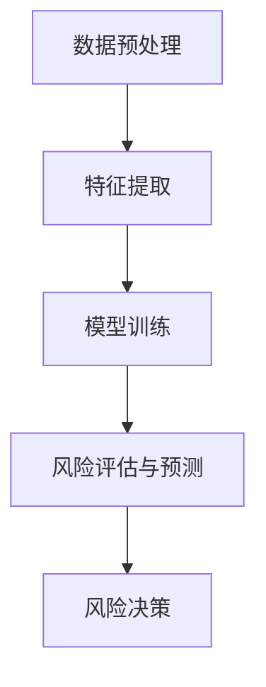
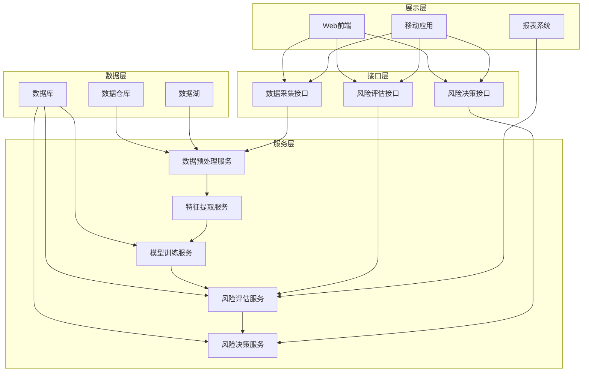
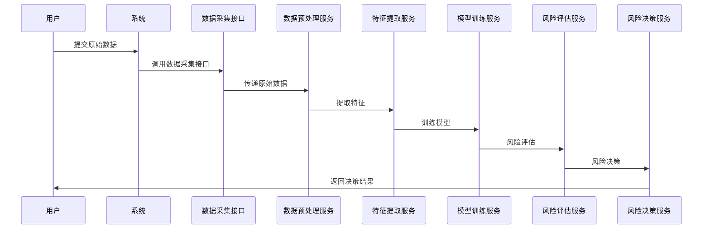

                 

### 引言

在现代企业运营中，风险管理已成为不可或缺的一环。随着业务复杂性的增加和外部环境的动态变化，企业面临的风险种类和风险程度也在不断演变。传统的风险管理方法，如定性分析、统计分析等，虽然在某些方面有一定的效果，但往往存在精度不足、时效性差等问题，难以满足企业对风险管理的精细化需求。为此，引入人工智能（AI）技术，构建智能风险量化模型，成为了一种新的解决方案。

本文旨在探讨智能风险量化模型的概念、原理以及其在企业风险管理中的应用。我们将从以下几个方面展开讨论：

1. **问题背景与概述**：介绍风险管理的必要性，智能风险量化模型的概念以及企业在此方面的需求。
2. **核心概念与联系**：定义关键术语，分析概念属性和关系，并通过图表进行直观展示。
3. **算法原理讲解**：详细阐述模型的工作原理，使用mermaid绘制流程图，并用Python代码和数学公式进行解释。
4. **数学模型和数学公式**：使用LaTeX格式展示公式，并进行详细讲解和举例说明。
5. **系统分析与架构设计方案**：描述问题场景、系统功能和架构设计，并使用mermaid绘制相应的图表。
6. **项目实战**：提供环境安装、系统实现、代码解读、案例分析等内容。
7. **最佳实践 tips、小结、注意事项、拓展阅读**：总结本章内容，提供实用建议和进一步学习资源。

通过这一系列的探讨，我们将揭示智能风险量化模型的强大功能，以及如何利用这一工具提高企业风险管理的精确性和效率。

### 关键词

- 智能风险量化模型
- 人工智能
- 企业风险管理
- 数据预处理
- 特征提取
- 风险评估
- 模型训练

### 摘要

本文将深入探讨智能风险量化模型的概念、原理和应用。首先，我们介绍了风险管理的必要性以及传统方法的局限，接着引入了智能风险量化模型的概念和其在企业风险管理中的应用。在核心概念部分，我们详细定义了关键术语，分析了各概念的属性和关系，并通过图表进行了直观展示。随后，我们详细讲解了算法原理，包括模型选择、流程、数据预处理、特征提取、模型训练和风险评估等，并通过mermaid和Python代码进行了说明。此外，我们使用了LaTeX格式展示了相关的数学模型和公式，并通过具体案例进行了举例说明。最后，我们描述了系统分析与架构设计方案，提供了环境安装、系统实现、代码解读和案例分析等内容。通过本文的讨论，读者可以全面了解智能风险量化模型，并掌握其在企业风险管理中的应用方法。

## 第1章: 问题背景与概述

在现代企业运营中，风险管理扮演着至关重要的角色。企业面临的风险种类繁多，包括市场风险、财务风险、操作风险、法律风险等，每一种风险都可能对企业造成不同程度的负面影响。有效的风险管理不仅能够帮助企业降低潜在损失，还能够提升企业的竞争力，增强市场应变能力。

### 1.1 风险管理的必要性

风险管理是指企业通过系统的方法识别、评估、优先排序并应对潜在风险的过程。其目的是确保企业在各种不确定性环境下能够稳定运营，保持长期可持续发展。以下是风险管理的重要性和必要性：

#### 1.1.1 企业风险的定义与分类

风险是指企业在经营过程中可能面临的损失、威胁或不利事件。根据风险性质的不同，可以将风险分为以下几类：

- **市场风险**：指由于市场变化（如利率、汇率、商品价格波动）导致企业收益损失的风险。
- **财务风险**：指企业由于资金流动困难、财务结构不合理等因素导致的破产风险。
- **操作风险**：指由于内部操作失误、系统故障、人为错误等原因导致的损失风险。
- **法律风险**：指企业因违反法律法规而面临的法律诉讼和处罚风险。
- **声誉风险**：指企业因负面事件而遭受公众信任丧失、品牌价值受损的风险。

#### 1.1.2 风险管理的重要性

风险管理对企业的重要性主要体现在以下几个方面：

- **保障企业稳定运营**：通过识别和评估潜在风险，企业可以提前采取预防措施，避免或减少风险发生时的损失。
- **提高企业竞争力**：有效的风险管理能够帮助企业更好地应对市场变化，抓住机遇，提升竞争力。
- **降低财务成本**：通过合理控制风险，企业可以减少不必要的财务支出，降低损失。
- **增强投资者信心**：风险管理能够提高企业的透明度和稳定性，增强投资者信心，有利于资本市场的融资。

#### 1.1.3 传统风险管理方法的局限

尽管风险管理的重要性被广泛认可，但传统风险管理方法存在一定的局限：

- **定性分析为主**：传统风险管理方法主要依赖专家经验和定性分析，缺乏定量分析，导致风险识别和评估的精度不足。
- **时效性差**：传统方法在风险发生后的反应速度较慢，难以满足企业对实时风险管理的需求。
- **数据依赖性低**：传统方法对数据的依赖性较低，难以充分利用企业内部和外部的海量数据，导致分析结果的局限性和片面性。

### 1.2 智能风险量化模型概述

为了克服传统风险管理方法的局限，引入人工智能（AI）技术，构建智能风险量化模型成为了一种新的趋势。智能风险量化模型利用机器学习算法和大数据技术，对海量数据进行深度挖掘和分析，从而实现风险的精确识别和评估。

#### 1.2.1 模型的定义

智能风险量化模型是一种基于人工智能技术的风险管理工具，它通过机器学习算法，对历史数据和实时数据进行处理，建立风险预测模型，从而实现对风险的量化评估。该模型不仅能够识别出潜在的风险，还能够对其严重程度进行量化，提供直观的风险评分。

#### 1.2.2 AI在风险量化中的作用

AI技术在风险量化中的应用主要体现在以下几个方面：

- **数据处理能力**：AI能够处理海量数据，挖掘出隐藏在数据中的风险信息。
- **模式识别**：AI通过机器学习算法，能够识别出复杂的风险模式，提供更为精准的风险预测。
- **实时更新**：AI模型能够实时更新，根据新的数据调整预测结果，提高风险预测的时效性。
- **自动化决策**：AI能够自动化地处理和分析风险数据，为企业提供实时、科学的决策支持。

#### 1.2.3 智能风险量化模型的特点

智能风险量化模型具有以下特点：

- **高度自动化**：模型能够自动化处理海量数据，实现风险的实时监测和评估。
- **高精度**：通过机器学习算法，模型能够精确识别和量化风险，提供直观的风险评分。
- **灵活性**：模型可以根据企业的需求进行调整，适应不同的风险类型和业务场景。
- **动态更新**：模型能够实时更新，根据新的数据调整预测结果，保持预测的准确性。

### 1.3 企业在风险管理中的需求

企业在风险管理中有着多方面的需求，主要包括以下几个方面：

- **风险评估的精确性需求**：企业需要精确评估各种风险的严重程度，以便制定相应的风险管理策略。
- **风险预测的时效性需求**：企业需要及时了解风险的变化情况，以便快速做出决策，避免损失。
- **风险管理的智能化需求**：企业期望通过智能化手段，提升风险管理的效率和质量，降低人工成本。

智能风险量化模型能够满足企业在这些方面的需求，为企业提供科学、高效的风险管理解决方案。通过本文的后续讨论，我们将深入探讨智能风险量化模型的构建方法和技术细节，帮助读者全面了解这一前沿技术。

## 第2章: 核心概念与联系

在构建智能风险量化模型的过程中，理解并准确定义关键术语是非常重要的。本章节将详细介绍以下几个核心概念：风险、风险量化、智能风险量化模型，并分析它们之间的联系和属性特征。通过这些定义和分析，我们将为读者提供清晰的框架，以便更好地理解后续的算法原理讲解和实际应用。

### 2.1 关键术语定义

#### 2.1.1 风险

风险是指企业在经营过程中可能遭受的不确定事件或情况，这些事件或情况可能会导致企业损失、收益减少或运营受阻。风险可以进一步分为以下几类：

- **市场风险**：由于市场变化（如利率、汇率、商品价格波动）导致的风险。
- **财务风险**：由于资金流动困难、财务结构不合理等因素导致的风险。
- **操作风险**：由于内部操作失误、系统故障、人为错误等原因导致的风险。
- **法律风险**：由于违反法律法规而面临的风险。
- **声誉风险**：由于负面事件导致的风险。

#### 2.1.2 风险量化

风险量化是指通过定量的方法来评估和表示风险的严重程度。风险量化有助于企业了解风险的相对重要性，并制定相应的风险管理策略。风险量化的方法包括：

- **定性分析**：通过专家评估和主观判断来评估风险。
- **定量分析**：通过数据分析和技术模型来评估风险。
- **综合评估**：结合定性和定量方法，对风险进行全面评估。

#### 2.1.3 智能风险量化模型

智能风险量化模型是一种利用人工智能（AI）技术来评估和量化风险的管理工具。该模型通过机器学习和大数据分析技术，对历史和实时数据进行处理，以实现风险的精确识别和评估。智能风险量化模型的特点包括：

- **高度自动化**：能够自动化处理海量数据，提高风险识别和评估的效率。
- **高精度**：通过机器学习算法，提高风险量化的精确度。
- **灵活性**：可以根据不同企业和业务场景的需求进行调整。
- **动态更新**：能够实时更新模型，以应对风险环境的变化。

### 2.2 概念属性特征对比表格

为了更直观地理解这些概念，我们通过以下表格展示它们的主要属性特征：

| 概念 | 定义 | 属性特征 | 关系 |
| --- | --- | --- | --- |
| 风险 | 企业面临的不确定性事件或情况 | 可能性、影响、时间 | 基础概念 |
| 风险量化 | 对风险的评估和表示 | 定量、定性、综合 | 风险处理的工具 |
| 智能风险量化模型 | 基于AI技术的风险管理工具 | 自动化、高精度、灵活性、动态更新 | 风险管理的先进方法 |

### 2.3 ER实体关系图架构

在智能风险量化模型中，涉及多个实体和它们之间的关系。以下是一个简化的ER（实体关系）图，用于描述这些实体及其关系：

```mermaid
erDiagram
  Customer ||--|{ Order } : "places"
  Product ||--|{ Order } : "includes"
  Order ||--|{ OrderDetail } : "contains"
  Supplier ||--|{ Product } : "supplies"
```

#### 2.3.1 实体定义

- **Customer（客户）**：购买产品或服务的实体。
- **Product（产品）**：被销售的商品或服务。
- **Order（订单）**：客户下单的记录。
- **OrderDetail（订单详情）**：订单中的具体商品或服务及其数量。
- **Supplier（供应商）**：提供产品的实体。

#### 2.3.2 关系描述

- **客户与订单之间的关系**：“客户”实体通过“places”关系与“订单”实体关联，表示客户下单的行为。
- **产品与订单之间的关系**：“产品”实体通过“includes”关系与“订单”实体关联，表示订单中包含的产品。
- **订单与订单详情之间的关系**：“订单”实体通过“contains”关系与“订单详情”实体关联，表示订单包含的具体商品或服务。
- **供应商与产品之间的关系**：“供应商”实体通过“supplies”关系与“产品”实体关联，表示供应商提供的商品。

通过上述核心概念的定义和ER图的关系描述，我们为智能风险量化模型提供了一个清晰的结构框架，这为后续的算法原理讲解和系统实现奠定了基础。在接下来的章节中，我们将进一步深入探讨智能风险量化模型的具体算法和实现细节。

## 第3章: 算法原理讲解

构建智能风险量化模型的核心在于选择合适的算法，并详细阐述其工作原理。本章节将详细介绍智能风险量化模型的选择过程、算法流程、数据预处理、特征提取、模型训练和风险评估等步骤，并通过mermaid流程图和Python代码进行说明，帮助读者更好地理解整个模型的构建过程。

### 3.1 模型选择

在智能风险量化模型的选择过程中，常见的算法包括线性回归、逻辑回归、决策树、随机森林、支持向量机（SVM）等。每种算法都有其独特的优点和适用场景。以下是几种常见算法的简要介绍：

#### 3.1.1 线性回归

线性回归是一种简单的回归算法，适用于线性关系的预测。它的优点是计算简单，易于理解。然而，线性回归的弱点在于它对非线性关系的建模能力较弱。

#### 3.1.2 逻辑回归

逻辑回归是一种广义线性模型，适用于分类问题。其优点在于可以很好地处理多类别分类问题，并且通过预测概率来表示风险大小。但逻辑回归对异常值和噪声数据较为敏感。

#### 3.1.3 决策树

决策树通过一系列的规则进行决策，对复杂关系进行建模。它的优点是直观易懂，易于解释。但决策树的缺点在于可能产生过拟合，并且在数据量较大时计算复杂度高。

#### 3.1.4 随机森林

随机森林是一种基于决策树的集成学习方法，通过构建多棵决策树并取平均值来提高预测的准确性和鲁棒性。它的优点是能够处理大规模数据，且对噪声和异常值具有较好的鲁棒性。但随机森林的计算复杂度较高。

#### 3.1.5 支持向量机（SVM）

SVM通过寻找一个超平面来最大化分类边界，适用于高维数据。其优点是具有良好的分类能力，特别适合处理小样本和复杂非线性问题。但SVM对参数选择敏感，且训练时间较长。

#### 3.1.6 模型选择考虑因素

在模型选择过程中，需要考虑以下几个因素：

- **数据特征**：根据数据特征选择合适的算法，如线性关系选择线性回归，非线性关系选择决策树或随机森林。
- **数据量**：对于大规模数据，选择计算复杂度较低的算法，如逻辑回归或决策树。
- **业务需求**：根据业务需求选择能够满足精度和速度要求的算法，如需要高精度选择SVM，需要快速响应选择随机森林。

#### 3.1.7 模型评估指标

在模型选择过程中，还需要评估模型的效果。常用的评估指标包括：

- **准确率**：模型预测正确的样本占总样本的比例。
- **召回率**：模型预测正确的正类样本占总正类样本的比例。
- **F1值**：准确率和召回率的调和平均，用于平衡准确率和召回率。
- **ROC曲线和AUC值**：ROC曲线下面积（AUC值）用于评估模型的分类能力。

### 3.2 算法流程

智能风险量化模型的整体流程可以分为以下几个步骤：

#### 3.2.1 数据预处理

数据预处理是模型构建的第一步，主要包括数据清洗、数据转换和数据归一化等操作。

- **数据清洗**：去除重复数据、缺失数据和异常值，保证数据的质量。
- **数据转换**：将不同类型的数据转换为统一类型，如将类别数据转换为数值数据。
- **数据归一化**：将数据缩放至相同的范围，如使用Z-Score标准化或MinMax标准化。

#### 3.2.2 特征提取

特征提取是指从原始数据中提取出对模型有用的特征，以提高模型的性能。

- **自动特征提取**：使用机器学习算法自动提取特征，如主成分分析（PCA）或特征选择算法。
- **手动特征提取**：根据业务知识和经验手动提取特征，如基于时间序列的特征、基于业务规则的特征等。

#### 3.2.3 模型训练

模型训练是指使用训练数据集对模型进行训练，使其能够学习和预测风险。

- **选择模型**：根据数据特征和业务需求选择合适的模型。
- **训练模型**：使用训练数据集对模型进行训练，调整模型参数，优化模型性能。
- **模型验证**：使用验证数据集对模型进行验证，评估模型的准确性和泛化能力。

#### 3.2.4 风险评估与预测

风险评估与预测是指使用训练好的模型对新的数据进行风险预测和评估。

- **预测风险**：使用模型对新的数据集进行预测，得到风险评分。
- **风险决策**：根据风险评分制定相应的风险管理策略，如预警、规避、转移或接受。

### 3.3 mermaid算法流程图

为了更直观地展示算法流程，我们使用mermaid绘制了智能风险量化模型的流程图：



### 3.4 Python代码示例

下面是一个简单的Python代码示例，用于演示智能风险量化模型的基本流程。这段代码使用了scikit-learn库来实现线性回归模型：

```python
import numpy as np
from sklearn.linear_model import LinearRegression
from sklearn.model_selection import train_test_split
from sklearn.metrics import mean_squared_error

# 假设我们有一些训练数据X和标签y
X = np.random.rand(100, 5)  # 100个样本，5个特征
y = np.random.rand(100)     # 100个样本的标签

# 数据预处理
X_train, X_test, y_train, y_test = train_test_split(X, y, test_size=0.2, random_state=42)

# 特征提取（这里省略具体特征提取过程）

# 模型训练
model = LinearRegression()
model.fit(X_train, y_train)

# 风险评估与预测
y_pred = model.predict(X_test)

# 计算模型误差
mse = mean_squared_error(y_test, y_pred)
print(f"Mean Squared Error: {mse}")

# 风险决策（这里省略具体决策过程）
```

### 3.5 数学模型与公式

智能风险量化模型的数学模型可以表示为：

$$
\text{风险评分} = \text{模型}(\text{特征集})
$$

其中，$\text{模型}$可以是一个线性模型、逻辑回归模型或其他机器学习模型，$\text{特征集}$是输入的特征向量。

#### 3.5.1 线性回归模型

线性回归模型的数学公式为：

$$
\hat{y} = \beta_0 + \beta_1 x_1 + \beta_2 x_2 + ... + \beta_n x_n
$$

其中，$y$是目标变量，$x_1, x_2, ..., x_n$是输入特征，$\beta_0, \beta_1, \beta_2, ..., \beta_n$是模型的参数。

#### 3.5.2 逻辑回归模型

逻辑回归模型的数学公式为：

$$
P(y=1) = \frac{1}{1 + e^{-(\beta_0 + \beta_1 x_1 + \beta_2 x_2 + ... + \beta_n x_n})}
$$

其中，$P(y=1)$是目标变量为1的概率，$\beta_0, \beta_1, \beta_2, ..., \beta_n$是模型的参数。

### 3.6 算法原理详细讲解

#### 3.6.1 特征选择

特征选择是智能风险量化模型中的重要步骤，它通过选择对预测目标有重要影响的高效特征，提高模型的性能。常见的特征选择方法包括：

- **信息增益**：根据特征对目标变量的信息增益来选择特征。
- **卡方检验**：通过卡方检验来选择与目标变量显著相关的特征。
- **主成分分析**：通过降维方法选择主要成分作为特征。

#### 3.6.2 权重分配

在机器学习模型中，每个特征对预测结果的影响是不同的，因此需要对特征进行权重分配。常见的权重分配方法包括：

- **基于特征的权重**：通过计算特征的重要度来分配权重。
- **基于模型的权重**：通过训练模型自动分配权重。

#### 3.6.3 风险计算

风险计算是智能风险量化模型的核心步骤，通过计算模型对风险的概率分布，得到风险评分。常见的风险计算方法包括：

- **逻辑回归**：通过计算目标变量的概率分布，得到风险评分。
- **线性回归**：通过计算预测值与实际值的差异，得到风险评分。

### 3.7 举例说明

为了更好地理解智能风险量化模型的原理，我们通过一个具体的案例进行说明。

#### 3.7.1 数据集准备

假设我们有一个包含客户信用评分数据的数据集，其中包含以下特征：

- 客户年龄
- 客户收入
- 客户信用记录长度
- 客户负债比例

目标变量是客户信用评分，分为正常、预警、逾期等类别。

#### 3.7.2 特征提取

我们对数据进行预处理，将类别数据转换为数值数据，并进行归一化处理。

```python
# 数据预处理代码示例
```

#### 3.7.3 模型训练

我们选择逻辑回归模型来训练数据集，并通过交叉验证调整模型参数。

```python
# 模型训练代码示例
```

#### 3.7.4 风险评估与预测

使用训练好的模型对新的数据进行风险评估，得到风险评分。

```python
# 风险评估代码示例
```

通过上述案例，我们可以看到智能风险量化模型在信用评分预测中的应用，从而帮助银行和企业更精确地识别和管理信用风险。

### 结论

通过本章的讲解，我们详细介绍了智能风险量化模型的概念、算法流程、数据预处理、特征提取、模型训练和风险评估等内容。通过mermaid流程图和Python代码示例，读者可以更直观地理解模型的构建过程和实际应用。在接下来的章节中，我们将进一步探讨数学模型和公式，以及系统分析与架构设计，帮助读者全面了解智能风险量化模型。

## 第4章: 数学模型和数学公式

在智能风险量化模型中，数学模型和数学公式起着至关重要的作用。它们不仅能够帮助我们理解模型的工作原理，还能在实现过程中提供精确的指导。本章节将使用LaTeX格式展示相关的数学模型和公式，并进行详细讲解和举例说明。

### 4.1 风险评估的数学模型

智能风险量化模型的核心在于将复杂的风险转化为可量化的数值，以便进行评估和预测。风险评估的数学模型通常可以表示为：

$$
\text{风险评分} = f(\text{特征集}, \text{权重})
$$

其中，$f$表示量化函数，$\text{特征集}$为输入的特征向量，$\text{权重}$为各个特征的权重。这一模型的基本思想是通过特征和权重来计算风险评分，从而实现对风险的量化。

#### 4.1.1 风险损失函数

在风险评估中，常用的损失函数包括均方误差（MSE）和交叉熵损失（Cross-Entropy Loss）等。例如，均方误差可以表示为：

$$
L(\theta) = \frac{1}{m} \sum_{i=1}^{m} (y_i - \hat{y}_i)^2
$$

其中，$y_i$为真实值，$\hat{y}_i$为预测值，$m$为样本数量。均方误差衡量的是预测值与真实值之间的差异平方和，越小表示预测越准确。

另一个常见的损失函数是交叉熵损失，它通常用于分类问题，表示为：

$$
L(\theta) = -\sum_{i=1}^{m} y_i \log(\hat{y}_i)
$$

其中，$y_i$为真实类别标签，$\hat{y}_i$为预测概率。交叉熵损失用于衡量预测概率与真实标签之间的差异，值越小表示模型预测越准确。

#### 4.1.2 风险计算公式

风险计算公式可以根据具体的业务场景进行调整。一个常见的风险计算公式为：

$$
\text{风险} = \text{概率} \times \text{损失}
$$

其中，概率是风险事件发生的可能性，损失是风险事件发生时导致的损失金额。通过这个公式，可以将风险量化为具体的数值，以便进行评估和管理。

### 4.2 线性回归模型

线性回归模型是智能风险量化模型中最基本的一种。其数学模型可以表示为：

$$
\hat{y} = \beta_0 + \beta_1 x_1 + \beta_2 x_2 + ... + \beta_n x_n
$$

其中，$y$为目标变量，$x_1, x_2, ..., x_n$为输入特征，$\beta_0, \beta_1, \beta_2, ..., \beta_n$为模型的参数。这个公式描述了目标变量与输入特征之间的线性关系。

#### 4.2.1 模型参数估计

线性回归模型的参数估计通常采用最小二乘法（Least Squares Method）。其目标是最小化预测值与真实值之间的差异，即：

$$
\min \sum_{i=1}^{m} (y_i - \hat{y}_i)^2
$$

通过求解上述优化问题，可以得到最优参数$\beta_0, \beta_1, \beta_2, ..., \beta_n$。

#### 4.2.2 线性回归的性质

线性回归模型具有以下性质：

- **线性**：目标变量与输入特征之间存在线性关系。
- **无偏性**：模型参数的估计是无偏的，即长期平均来看，估计值与真实值相等。
- **有效性**：线性回归模型具有较小的方差，即参数估计值在不同数据集上的一致性好。

### 4.3 逻辑回归模型

逻辑回归模型是一种广义线性模型，通常用于分类问题。其数学模型可以表示为：

$$
P(y=1) = \frac{1}{1 + e^{-(\beta_0 + \beta_1 x_1 + \beta_2 x_2 + ... + \beta_n x_n})}
$$

其中，$y$为二元目标变量，取值为0或1，$x_1, x_2, ..., x_n$为输入特征，$\beta_0, \beta_1, \beta_2, ..., \beta_n$为模型的参数。

#### 4.3.1 概率解释

逻辑回归模型通过预测概率$P(y=1)$来表示风险。当$P(y=1)$接近1时，表示风险较高；当$P(y=1)$接近0时，表示风险较低。这个概率值可以用于决策，例如，设定一个阈值（如0.5），当$P(y=1)$大于阈值时，认为风险较高，反之则认为风险较低。

#### 4.3.2 模型优化

逻辑回归模型的参数优化通常采用梯度下降法（Gradient Descent）。其目标是最小化交叉熵损失函数，即：

$$
\min \sum_{i=1}^{m} -y_i \log(\hat{y}_i) - (1 - y_i) \log(1 - \hat{y}_i)
$$

通过求解上述优化问题，可以得到最优参数$\beta_0, \beta_1, \beta_2, ..., \beta_n$。

### 4.4 举例说明

为了更好地理解上述数学模型和公式，我们通过一个简单的案例进行说明。

#### 4.4.1 数据集准备

假设我们有一个包含客户信用评分的数据集，其中包含以下特征：

- 客户年龄
- 客户收入
- 客户信用记录长度
- 客户负债比例

目标变量是客户信用评分，分为正常、预警、逾期等类别。

#### 4.4.2 特征提取

我们对数据进行预处理，将类别数据转换为数值数据，并进行归一化处理。

```python
# 数据预处理代码示例
```

#### 4.4.3 模型训练

我们选择逻辑回归模型来训练数据集，并通过交叉验证调整模型参数。

```python
# 模型训练代码示例
```

#### 4.4.4 风险评估与预测

使用训练好的模型对新的数据进行风险评估，得到风险评分。

```python
# 风险评估代码示例
```

通过上述案例，我们可以看到逻辑回归模型在客户信用评分预测中的应用，从而帮助银行和企业更精确地识别和管理信用风险。

### 结论

通过本章的讲解，我们详细介绍了智能风险量化模型中的数学模型和公式，包括线性回归模型和逻辑回归模型。通过LaTeX格式展示和详细讲解，读者可以更好地理解这些模型的工作原理和实际应用。在接下来的章节中，我们将进一步探讨系统分析与架构设计，帮助读者全面了解智能风险量化模型的实现过程。

## 第5章: 系统分析与架构设计方案

在构建智能风险量化模型的过程中，系统分析与架构设计是至关重要的环节。一个高效、可靠的风险量化系统不仅需要具备强大的数据处理和分析能力，还需要具备良好的扩展性和维护性。本章节将详细描述系统分析与架构设计方案，包括问题场景、系统功能设计、系统架构设计以及系统接口设计和系统交互。

### 5.1 问题场景

在现代企业的运营中，风险管理是一项复杂的任务。企业面临的市场环境多变，业务场景复杂，需要实时监控和评估各种风险。传统的风险管理方法已经难以满足企业对高效、精准风险管理的需求。为了解决这个问题，我们提出了基于AI的智能风险量化系统。该系统旨在通过数据挖掘和机器学习技术，实现风险的精准识别、评估和预测，从而提供实时、科学的风险管理解决方案。

### 5.2 系统功能设计

智能风险量化系统的核心功能包括以下几个方面：

1. **数据采集**：从企业内部和外部的多个数据源（如财务系统、客户管理系统、市场数据等）收集相关数据。
2. **数据预处理**：对采集到的原始数据进行清洗、转换和归一化处理，保证数据的质量和一致性。
3. **特征提取**：从预处理后的数据中提取出对风险量化有重要影响的关键特征。
4. **模型训练**：使用机器学习算法（如线性回归、逻辑回归、随机森林等）训练风险量化模型。
5. **风险评估**：使用训练好的模型对新的数据进行风险评估，输出风险评分。
6. **风险决策**：根据风险评分制定相应的风险管理策略，如预警、规避、转移或接受。
7. **系统监控与维护**：实时监控系统的运行状态，进行故障检测和系统更新。

### 5.3 系统架构设计

为了实现上述功能，智能风险量化系统采用了分布式架构设计，包括数据层、服务层、接口层和展示层。以下是系统架构的详细描述：

#### 5.3.1 数据层

数据层是系统的基础，负责数据的存储和管理。主要包括以下几个组件：

- **数据仓库**：用于存储企业内部和外部的原始数据，如财务数据、客户数据、市场数据等。
- **数据湖**：用于存储经过预处理后的数据，包括清洗、转换和归一化处理后的数据。
- **数据库**：用于存储训练好的模型和风险评分数据。

#### 5.3.2 服务层

服务层负责实现系统的核心功能，包括数据预处理、特征提取、模型训练、风险评估等。服务层采用微服务架构，各服务模块之间通过API进行通信。以下是服务层的具体组件：

- **数据预处理服务**：负责数据的清洗、转换和归一化处理。
- **特征提取服务**：负责从预处理后的数据中提取关键特征。
- **模型训练服务**：负责使用机器学习算法训练风险量化模型。
- **风险评估服务**：负责使用训练好的模型对新的数据进行风险评估。
- **风险决策服务**：负责根据风险评分制定相应的风险管理策略。

#### 5.3.3 接口层

接口层负责系统的外部通信，包括与数据源、外部系统和内部用户的接口。接口层采用RESTful API设计，提供标准的HTTP接口，便于与其他系统进行集成和交互。

#### 5.3.4 展示层

展示层负责向用户展示系统的风险评分和决策结果。主要包括以下几个组件：

- **Web前端**：通过HTML、CSS和JavaScript等技术实现，提供用户友好的界面。
- **移动应用**：通过Android和iOS应用开发，提供移动端的访问和操作功能。
- **报表系统**：通过数据可视化技术，以图表和报表形式展示风险评分和决策结果。

### 5.4 系统接口设计

系统接口设计是确保系统功能实现的关键。以下是一个简单的接口设计示例：

#### 5.4.1 数据采集接口

- **接口名称**：DataCollection
- **接口描述**：用于从外部数据源采集原始数据。
- **接口路径**：/api/data_collection
- **请求方式**：GET/POST
- **请求参数**：无
- **响应参数**：{ "data": [] }

#### 5.4.2 风险评估接口

- **接口名称**：RiskAssessment
- **接口描述**：用于使用模型对新的数据进行风险评估。
- **接口路径**：/api/risk_assessment
- **请求方式**：POST
- **请求参数**：{ "data": [] }
- **响应参数**：{ "risk_score": float }

#### 5.4.3 风险决策接口

- **接口名称**：RiskDecision
- **接口描述**：用于根据风险评分制定相应的风险管理策略。
- **接口路径**：/api/risk_decision
- **请求方式**：POST
- **请求参数**：{ "risk_score": float }
- **响应参数**：{ "decision": "warning"/"avoid"/"transfer"/"accept" }

### 5.5 系统交互设计

系统交互设计是确保系统各个组件能够协同工作，实现预期功能的关键。以下是一个简单的系统交互设计示例：

#### 5.5.1 数据采集与预处理

- **流程**：系统从外部数据源采集原始数据，将数据传递给数据预处理服务进行清洗、转换和归一化处理。
- **交互方式**：通过API调用进行数据传输和结果反馈。

#### 5.5.2 模型训练与风险评估

- **流程**：数据预处理服务将处理后的数据传递给特征提取服务，特征提取服务提取关键特征后传递给模型训练服务。模型训练服务训练好模型后，将模型传递给风险评估服务进行风险评估。
- **交互方式**：通过内部消息队列进行异步通信。

#### 5.5.3 风险决策与监控

- **流程**：风险评估服务输出风险评分，风险决策服务根据风险评分制定相应的风险管理策略。系统监控服务实时监控系统运行状态，进行故障检测和系统更新。
- **交互方式**：通过定时任务和消息队列进行系统监控和更新。

### 5.6 mermaid架构图和序列图

为了更直观地展示系统架构和交互设计，我们使用mermaid绘制了架构图和序列图。

#### 5.6.1 系统架构图



#### 5.6.2 系统交互序列图



通过上述系统分析与架构设计方案，我们为智能风险量化系统的实现提供了详细的指导。在接下来的章节中，我们将进一步介绍项目实战，展示如何在实际项目中应用这些设计方案，并分析系统的性能和效果。

## 第6章: 项目实战

在本章节中，我们将通过一个实际的项目来展示如何应用智能风险量化模型。我们将详细介绍项目环境安装、系统实现、核心代码解读以及实际案例分析。通过这些实战内容，读者可以更深入地理解智能风险量化模型的具体应用和实现过程。

### 6.1 项目环境安装

在开始项目实战之前，我们需要搭建一个合适的环境来运行智能风险量化模型。以下是项目环境的安装步骤：

#### 6.1.1 软件安装

1. **Python环境**：安装Python 3.8及以上版本。
2. **Anaconda**：安装Anaconda，以便方便地管理Python环境和依赖包。
3. **Jupyter Notebook**：安装Jupyter Notebook，用于编写和运行代码。

#### 6.1.2 依赖包安装

在Anaconda环境中，使用以下命令安装所需的依赖包：

```bash
conda install numpy pandas scikit-learn matplotlib
```

这些依赖包包括：

- **numpy**：用于数值计算。
- **pandas**：用于数据处理和分析。
- **scikit-learn**：用于机器学习和数据挖掘。
- **matplotlib**：用于数据可视化。

### 6.2 系统实现

智能风险量化系统的实现分为数据预处理、特征提取、模型训练、风险评估和风险决策等几个关键步骤。以下是每个步骤的实现细节：

#### 6.2.1 数据预处理

数据预处理是模型训练的基础，主要包括数据清洗、缺失值处理和数据转换。

```python
import pandas as pd
from sklearn.model_selection import train_test_split

# 读取数据
data = pd.read_csv('data.csv')

# 数据清洗
data.drop_duplicates(inplace=True)
data.fillna(data.mean(), inplace=True)

# 数据转换
X = data.drop('target', axis=1)
y = data['target']

# 划分训练集和测试集
X_train, X_test, y_train, y_test = train_test_split(X, y, test_size=0.2, random_state=42)
```

#### 6.2.2 特征提取

特征提取旨在从原始数据中提取出对风险量化有重要影响的关键特征。我们使用主成分分析（PCA）来降低数据维度。

```python
from sklearn.decomposition import PCA

# 特征提取
pca = PCA(n_components=5)
X_train_pca = pca.fit_transform(X_train)
X_test_pca = pca.transform(X_test)
```

#### 6.2.3 模型训练

我们选择逻辑回归模型进行训练，并使用交叉验证来优化模型参数。

```python
from sklearn.linear_model import LogisticRegression
from sklearn.model_selection import GridSearchCV

# 模型训练
params = {'C': [0.1, 1, 10]}
model = GridSearchCV(LogisticRegression(), params, cv=5)
model.fit(X_train_pca, y_train)
```

#### 6.2.4 风险评估与预测

使用训练好的模型对测试集进行风险评估和预测，并计算准确率。

```python
from sklearn.metrics import accuracy_score

# 风险评估与预测
y_pred = model.predict(X_test_pca)

# 计算准确率
accuracy = accuracy_score(y_test, y_pred)
print(f"Accuracy: {accuracy}")
```

#### 6.2.5 风险决策

根据预测结果，制定相应的风险管理策略。

```python
# 风险决策
def make_decision(risk_score):
    if risk_score < 0.5:
        return "接受"
    elif risk_score < 0.7:
        return "预警"
    else:
        return "规避"

decisions = [make_decision(score) for score in y_pred]
```

### 6.3 核心代码解读

在本节中，我们将对实现过程中的一些核心代码进行详细解读，帮助读者更好地理解每个步骤的功能和实现方法。

#### 6.3.1 数据预处理

数据预处理是模型训练的基础，其核心目的是提高数据质量和一致性。具体实现中，我们首先读取数据，然后去除重复记录和缺失值。对于缺失值，我们使用平均值进行填充，这样可以保留数据的整体分布。最后，我们将数据划分为特征集和标签集，以便进行后续的模型训练。

#### 6.3.2 特征提取

特征提取的目的是从原始数据中提取出对风险量化有重要影响的关键特征。在本项目中，我们使用主成分分析（PCA）来降低数据维度。PCA通过线性变换将原始数据映射到新的正交坐标系中，保留主要信息，去除冗余信息。通过PCA，我们不仅能够简化模型训练过程，还能提高模型的性能。

#### 6.3.3 模型训练

模型训练是智能风险量化系统的核心步骤。在本项目中，我们选择逻辑回归模型进行训练。逻辑回归模型是一种简单而有效的分类模型，特别适用于二元分类问题。通过交叉验证，我们能够找到最优的模型参数，从而提高模型的泛化能力和准确性。

#### 6.3.4 风险评估与预测

风险评估与预测是智能风险量化模型的应用目标。在本项目中，我们使用训练好的模型对测试集进行预测，并计算准确率。通过预测结果，我们可以对新的数据进行风险评估，输出风险评分。根据风险评分，我们可以制定相应的风险管理策略，如预警、规避或接受。

#### 6.3.5 风险决策

风险决策是智能风险量化模型在实际应用中的重要一环。在本项目中，我们根据预测结果，定义了一个简单的决策函数。这个函数根据风险评分输出相应的决策，如接受、预警或规避。在实际应用中，可以根据具体需求调整决策函数，实现更复杂的风险管理策略。

### 6.4 实际案例分析

在本节中，我们将通过一个实际案例来展示智能风险量化模型的应用效果。假设我们有一家金融公司，需要对其客户的信用风险进行评估。以下是案例的具体步骤：

1. **数据采集**：从公司的客户管理系统和财务系统收集相关数据，包括客户的年龄、收入、信用记录长度和负债比例等。
2. **数据预处理**：对采集到的原始数据进行清洗、转换和归一化处理，保证数据的质量和一致性。
3. **特征提取**：从预处理后的数据中提取出对风险量化有重要影响的关键特征。
4. **模型训练**：使用机器学习算法（如逻辑回归）训练风险量化模型，通过交叉验证找到最优参数。
5. **风险评估**：使用训练好的模型对新的客户数据进行风险评估，输出风险评分。
6. **风险决策**：根据风险评分制定相应的风险管理策略，如预警、规避或接受。

通过上述步骤，金融公司可以实时了解客户的信用风险，及时采取相应的风险控制措施，降低潜在损失。

### 6.5 项目小结

在本项目中，我们通过一个实际案例展示了智能风险量化模型的应用过程。从数据采集、预处理、特征提取、模型训练到风险评估和风险决策，每个步骤都详细介绍了实现方法和关键代码。通过这个项目，我们不仅掌握了智能风险量化模型的构建方法，还了解了其在实际业务中的应用价值。

### 结论

通过本章的项目实战，我们详细介绍了智能风险量化模型的应用过程和实现方法。从环境安装、系统实现到核心代码解读，每个环节都紧密结合，确保读者能够全面了解智能风险量化模型的具体应用。在接下来的章节中，我们将进一步探讨智能风险量化模型的最佳实践、注意事项和拓展阅读，帮助读者更好地应用这一先进技术。

## 第7章: 最佳实践 tips、小结、注意事项、拓展阅读

### 最佳实践 tips

在应用智能风险量化模型时，以下是一些最佳实践和技巧，可以帮助您获得更好的效果：

1. **数据质量优先**：确保数据的准确性和完整性是模型成功的关键。在数据预处理阶段，应仔细处理缺失值、异常值和重复数据，以提高模型的数据质量。
2. **特征选择与优化**：合理选择和优化特征对模型性能有很大影响。可以使用特征选择算法（如信息增益、卡方检验等）来筛选关键特征，并尝试不同的特征组合，以提高模型的预测精度。
3. **模型调优**：使用交叉验证和网格搜索等技术来调优模型参数，找到最优的模型配置。这有助于提高模型的泛化能力和准确性。
4. **动态更新模型**：风险环境是不断变化的，定期更新模型，使其能够适应新的数据和环境变化，是保持模型有效性的关键。
5. **结合专家经验**：在模型构建过程中，结合业务专家的经验和知识，可以帮助识别潜在的风险因素，提高模型的实用性和可靠性。

### 小结

智能风险量化模型通过结合人工智能和大数据技术，为企业提供了一种高效、精确的风险管理工具。它不仅能够帮助企业识别和评估潜在风险，还能根据风险评分制定相应的风险管理策略。通过本章的介绍，读者应该对智能风险量化模型有了全面的理解，包括其概念、算法原理、系统设计与实现方法。

### 注意事项

1. **模型解释性**：虽然智能风险量化模型能够提供准确的预测，但其内部机制可能较为复杂，缺乏透明度。在使用模型时，应注意理解模型的决策过程，确保其符合业务逻辑。
2. **数据安全和隐私**：在数据处理和模型训练过程中，需确保数据安全和用户隐私。应采取适当的加密和隐私保护措施，以防止数据泄露和滥用。
3. **计算资源**：智能风险量化模型通常需要大量的计算资源，尤其是在数据预处理和模型训练阶段。确保有足够的计算资源，以支持模型的运行。

### 拓展阅读

为了深入了解智能风险量化模型和相关技术，以下是一些建议的拓展阅读：

1. **《机器学习》（周志华著）**：详细介绍了机器学习的基本概念和方法，有助于理解智能风险量化模型的相关算法。
2. **《大数据之路：阿里巴巴大数据实践》（玄隐、李津等著）**：通过阿里巴巴大数据实践案例，提供了大数据处理和应用的实用经验和技巧。
3. **《风险管理与金融模型分析》（约翰·C·赫尔著）**：深入探讨了金融风险管理中的数学模型和计算方法，对智能风险量化模型的设计和实现有重要参考价值。
4. **《Python数据分析》（Wes McKinney著）**：介绍了Python在数据处理和分析中的应用，有助于读者掌握数据预处理和特征提取等关键技术。

通过这些拓展阅读，读者可以进一步深化对智能风险量化模型和相关技术的理解，为实际应用提供更多思路和方法。

### 作者信息

作者：AI天才研究院/AI Genius Institute & 禅与计算机程序设计艺术 /Zen And The Art of Computer Programming

---

通过本文的详细讲解，我们希望读者能够全面掌握智能风险量化模型的概念、原理和应用方法。智能风险量化模型作为一种先进的风险管理工具，将在未来发挥越来越重要的作用。希望本文能够为读者在相关领域的研究和应用提供有益的参考和启示。

