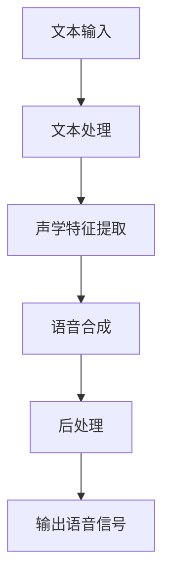
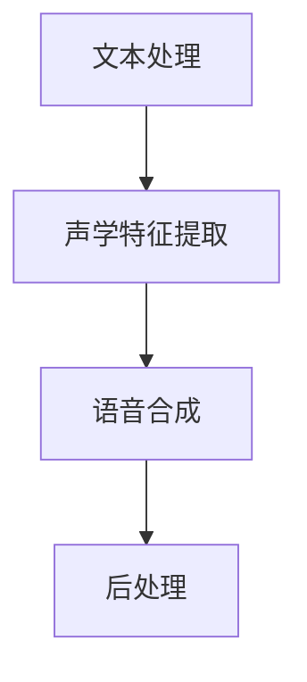
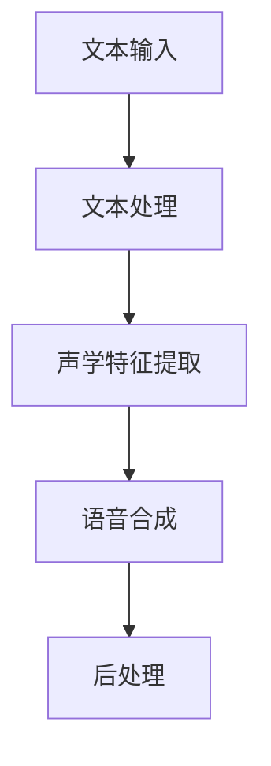
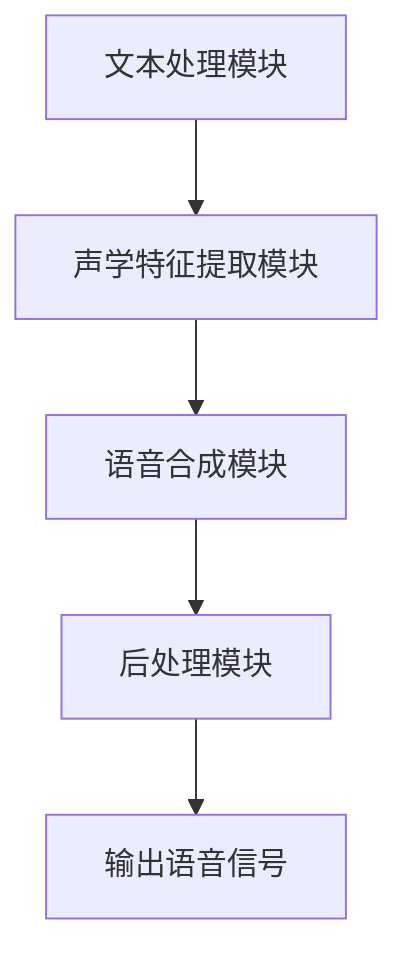

                 

### 深度学习在语音合成自然度提升中的应用

关键词：语音合成、深度学习、自然度、生成对抗网络、长短期记忆网络、WaveNet

摘要：语音合成技术作为人工智能领域的重要分支，近年来取得了显著的进展。深度学习在语音合成中的应用，极大地提升了语音合成的自然度。本文将探讨深度学习在语音合成自然度提升中的应用，从背景介绍、核心概念、关键技术与算法、研究现状与未来趋势等多个方面进行详细分析。

---

#### **第一部分：问题背景与核心概念**

##### **第1章：问题背景与核心概念**

##### **1.1 语音合成与自然度概述**

**1.1.1 语音合成的定义与发展**

语音合成技术，是指将文本转换为自然流畅的语音信号的过程。其发展历程可以追溯到20世纪50年代，早期的语音合成方法主要基于规则和有限状态机。随着计算机性能的提升和信号处理技术的进步，合成语音的自然度逐渐提高。1990年代，隐藏马尔可夫模型（HMM）的出现，使得语音合成技术进入了一个新的阶段。进入21世纪，深度学习的崛起为语音合成带来了革命性的变化。

**1.1.2 自然度的定义与重要性**

自然度，是指合成语音与人类自然语音在音质、节奏、韵律等方面的一致性。高自然度的语音合成，能够更好地模拟人类语音的特点，提升用户体验。自然度是语音合成技术的关键指标，直接影响到语音合成的应用场景和商业价值。

**1.1.3 语音合成自然度提升的挑战**

尽管语音合成技术取得了显著的进展，但在自然度提升方面仍然面临诸多挑战。例如，如何更好地捕捉语音的韵律和情感，如何处理不同语言和方言的语音合成，如何优化模型的训练效率和鲁棒性等。深度学习技术的引入，为解决这些挑战提供了新的思路和方法。

##### **1.2 深度学习在语音合成中的应用**

**1.2.1 深度学习的基本原理**

深度学习是一种基于多层神经网络的机器学习技术，通过学习大量数据来提取特征和规律。深度学习模型由输入层、隐藏层和输出层组成，每层神经元通过激活函数进行非线性变换，从而实现数据的层次化表示。深度学习在语音合成中的应用，主要体现在以下几个方面：

1. 声学模型：用于将文本序列转换为声学特征序列，如梅尔频率倒谱系数（MFCC）。
2. 语言模型：用于将文本序列转换为概率分布，指导声学模型的输出。
3. 前后端网络协同：通过深度学习模型，实现文本到语音的端到端转换。

**1.2.2 深度学习在语音处理领域的应用**

深度学习在语音处理领域有着广泛的应用，包括语音识别、语音增强、语音合成等。其中，语音合成是深度学习应用的重要方向之一。深度学习模型在语音合成中的应用，主要体现在以下几个方面：

1. 生成对抗网络（GAN）：用于生成高质量的语音波形。
2. 长短期记忆网络（LSTM）：用于捕捉语音的长期依赖关系。
3. WaveNet 与 WaveRNN：用于实现高效、自然的语音合成。

**1.2.3 深度学习在语音合成自然度提升中的角色**

深度学习在语音合成自然度提升中扮演着关键角色。通过深度学习模型，可以更好地捕捉语音的音质、节奏和情感特征，从而提高语音合成的自然度。具体来说，深度学习在语音合成自然度提升中的作用包括：

1. 特征提取：通过深度神经网络，提取更丰富的声学特征和语言特征。
2. 模型优化：通过训练和优化，提高模型的鲁棒性和自然度。
3. 端到端学习：通过端到端的学习框架，实现文本到语音的自动转换。

##### **1.3 关键技术与算法**

**1.3.1 生成对抗网络（GAN）**

生成对抗网络（GAN）是由Ian Goodfellow等人于2014年提出的一种深度学习模型。GAN由生成器和判别器两部分组成，生成器试图生成与真实数据相似的数据，而判别器则试图区分生成数据与真实数据。通过生成器和判别器的对抗训练，可以生成高质量的数据。

在语音合成中，GAN被用于生成高质量的语音波形。具体来说，生成器将文本序列转换为声学特征序列，然后通过判别器判断生成的语音波形是否真实。通过不断的训练和优化，生成器可以生成更自然、更高质量的语音。

**1.3.2 长短期记忆网络（LSTM）**

长短期记忆网络（LSTM）是由Hochreiter和Schmidhuber于1997年提出的一种递归神经网络。LSTM通过引入门控机制，有效地解决了传统递归神经网络在处理长期依赖关系时的梯度消失问题。

在语音合成中，LSTM被用于捕捉语音的长期依赖关系。具体来说，LSTM可以用于建模语音信号中的时序特征，如音高、时长和音强等。通过LSTM，可以更好地捕捉语音的自然度和情感特征。

**1.3.3 WaveNet 与 WaveRNN**

WaveNet是由Google Research团队于2016年提出的一种基于深度神经网络的语音合成模型。WaveNet是一种端到端的模型，通过输入文本序列，直接生成语音波形。

WaveRNN是WaveNet的改进版本，通过引入递归神经网络（RNN），进一步提高了语音合成的自然度。WaveRNN将文本序列转换为声学特征序列，然后通过递归神经网络，逐帧生成语音波形。

##### **1.4 研究现状与未来趋势**

**1.4.1 当前研究热点**

目前，深度学习在语音合成自然度提升中的应用主要集中在以下几个方面：

1. 生成对抗网络（GAN）：GAN在语音合成中的应用，为生成高质量语音波形提供了新的思路。
2. 长短期记忆网络（LSTM）：LSTM在语音合成中的应用，有助于捕捉语音的长期依赖关系。
3. WaveNet 与 WaveRNN：WaveNet 和 WaveRNN 是当前语音合成领域的重要研究方向。

**1.4.2 未来发展方向**

未来，深度学习在语音合成自然度提升中的发展有望在以下几个方面取得突破：

1. 更高效的模型：通过优化模型结构，提高模型的训练效率和自然度。
2. 多样化的语音风格：通过引入更多的风格特征，实现多样化的语音风格。
3. 实时语音合成：通过优化算法和硬件，实现实时语音合成。

**1.4.3 技术壁垒与突破方向**

尽管深度学习在语音合成自然度提升中取得了显著进展，但仍存在一些技术壁垒，如：

1. 模型训练时间较长：深度学习模型的训练需要大量时间和计算资源。
2. 数据依赖性较强：深度学习模型对数据的质量和数量有较高要求。

突破这些技术壁垒，需要从以下几个方面进行：

1. 模型优化：通过优化模型结构，提高模型的训练效率和自然度。
2. 数据增强：通过数据增强，提高模型的鲁棒性和泛化能力。
3. 硬件加速：通过硬件加速，提高模型的训练和推理速度。

##### **1.5 本章小结**

本章介绍了深度学习在语音合成自然度提升中的应用，从问题背景、核心概念、关键技术与算法、研究现状与未来趋势等多个方面进行了详细分析。深度学习在语音合成自然度提升中发挥了重要作用，通过生成对抗网络（GAN）、长短期记忆网络（LSTM）和WaveNet 等技术，实现了语音合成的自然度提升。未来，深度学习在语音合成自然度提升中仍具有很大的发展潜力。

---

#### **第二部分：深度学习技术在语音合成自然度提升中的实践**

##### **第2章：语音数据预处理**

语音数据预处理是语音合成系统中的关键步骤，它直接影响后续特征提取和模型训练的效果。在这一章中，我们将详细探讨语音信号的采集与处理、声学特征提取、语言特征提取和数据增强等方面的内容。

##### **2.1 语音信号的采集与处理**

**2.1.1 语音信号的特点**

语音信号是一种复杂的声波信号，它包含了丰富的信息，如音高、音强、音色和节奏等。语音信号具有以下几个主要特点：

1. 时域特性：语音信号的时域特性表现为音调的变化、音量的起伏和音色的多样性。
2. 频域特性：语音信号的频域特性表现为不同频率成分的分布和强度。
3. 时频特性：语音信号的时频特性通过时频分布展示了语音信号在时间和频率上的动态变化。

**2.1.2 语音信号的预处理方法**

为了提高语音合成的自然度，我们需要对语音信号进行预处理。常见的预处理方法包括以下几种：

1. 噪声抑制：噪声抑制是语音预处理的重要步骤，旨在减少背景噪声对语音信号的影响。常用的噪声抑制方法包括谱减法、维纳滤波和自适应滤波等。

2. 声道归一化：声道归一化的目的是使不同来源的语音信号在声道特性上保持一致。声道归一化可以通过调整语音信号的幅度和频率特性来实现。

3. 语音增强：语音增强的目的是提高语音信号的清晰度和可懂度。常见的语音增强方法包括谱减法、频谱聚焦和空间滤波等。

**2.1.3 语音信号的标准化**

语音信号标准化是指通过一定的处理方法，使语音信号在不同场景下具有一致性。语音信号标准化的方法包括：

1. 频率标准化：将语音信号的频率范围调整到特定的范围，如将所有语音信号调整到16 kHz。
2. 幅度标准化：将语音信号的幅度调整到特定的范围，如将所有语音信号的幅度调整到0 dB。

##### **2.2 声学特征提取**

**2.2.1 声学特征的定义与分类**

声学特征是用于描述语音信号特性的参数，它们在语音识别和语音合成中起着关键作用。声学特征可以分为时域特征和频域特征两大类：

1. 时域特征：时域特征直接从语音信号的时域波形中提取，如短时能量、短时过零率和共振峰频率等。
2. 频域特征：频域特征通过傅里叶变换从语音信号的频域分布中提取，如梅尔频率倒谱系数（MFCC）、频谱特征和频带能量等。

**2.2.2 MFCC（梅尔频率倒谱系数）**

梅尔频率倒谱系数（MFCC）是一种广泛应用于语音处理中的频域特征。MFCC的原理是将语音信号通过傅里叶变换转换到频域，然后按照人耳对频率的感知进行加权，最后对加权的频谱进行逆傅里叶变换得到倒谱系数。

MFCC的计算步骤如下：

1. 对语音信号进行预加重处理，以减少低频成分的影响。
2. 对预处理后的信号进行短时傅里叶变换（STFT）得到频谱。
3. 对频谱进行梅尔加权，即将频谱映射到梅尔频率尺度。
4. 对加权后的频谱进行离散余弦变换（DCT）得到MFCC系数。

**2.2.3 功率谱与共振峰**

功率谱是语音信号的频域表示，它反映了不同频率成分的功率分布。功率谱的峰值位置被称为共振峰，共振峰是语音信号的重要特征之一，它反映了语音的音高和音质。

计算功率谱的方法如下：

1. 对语音信号进行短时傅里叶变换（STFT）。
2. 计算STFT结果的平方得到功率谱。

共振峰的提取方法包括：

1. 峰值搜索：在功率谱中找到最大值的位置，这些位置即为共振峰。
2. 曲率检测：通过检测功率谱的曲率变化来识别共振峰。

##### **2.3 语言特征提取**

**2.3.1 语言特征的重要性**

语言特征是描述语音信号语义信息的参数，它们在语音识别和语音合成中起着至关重要的作用。语言特征可以分为音素级特征和句子级特征：

1. 音素级特征：音素级特征描述了语音信号的音素属性，如音素持续时间、音素强度和音素音高等。
2. 句子级特征：句子级特征描述了语音信号的整体语义信息，如句子长度、句子复杂度和语气等。

**2.3.2 词嵌入与句子表示**

词嵌入是将词汇映射到高维空间中的向量表示，它能够捕获词汇之间的语义关系。词嵌入方法包括分布式表示和嵌入神经网络等。

句子表示是将整句文本转换为向量表示的方法，它能够捕获句子中的语义信息。常见的句子表示方法包括：

1. 平均词向量：将句子中的所有词向量进行平均得到句子表示。
2. TF-IDF表示：使用词频-逆文档频率（TF-IDF）权重对词向量进行加权平均得到句子表示。
3. 词袋模型：将句子中的词向量进行拼接得到句子表示。

**2.3.3 语言模型与语音合成**

语言模型是描述文本序列概率分布的模型，它在语音合成中起着关键作用。常见的语言模型包括：

1. N-gram模型：基于历史N个词来预测下一个词的概率分布。
2. 神经网络模型：基于深度神经网络预测文本序列的概率分布。

在语音合成中，语言模型用于指导声学模型的输出，使得合成语音的语义信息更加准确。

##### **2.4 数据增强**

**2.4.1 数据增强的目的**

数据增强是提高语音合成系统性能的重要手段，其目的是通过增加训练数据的多样性和丰富性，提高模型的泛化能力和鲁棒性。

**2.4.2 常见的数据增强方法**

常见的数据增强方法包括：

1. 时域增强：包括时间拉伸、时间压缩、速度变换等。
2. 频域增强：包括频谱变形、噪声添加、滤波等。
3. 软件增强：包括语调变化、语音分割和拼接、文本风格变换等。

**2.4.3 数据增强在语音合成中的应用**

数据增强在语音合成中的应用主要包括：

1. 增加训练数据量：通过数据增强，生成更多的训练样本，提高模型的训练效果。
2. 丰富特征空间：通过数据增强，引入更多的特征，提高模型的特征表达能力。
3. 提高模型鲁棒性：通过数据增强，使模型对不同的语音信号具有更好的适应性。

##### **2.5 本章小结**

本章详细介绍了语音数据预处理的关键步骤，包括语音信号的采集与处理、声学特征提取、语言特征提取和数据增强等方面。语音数据预处理是语音合成系统中的基础性工作，对后续的特征提取和模型训练具有重要意义。通过合理的预处理方法，可以显著提高语音合成的自然度和系统性能。

---

#### **第3章：深度学习模型在语音合成中的应用**

深度学习模型在语音合成中的应用极大地提升了合成的自然度。本章将介绍几种在语音合成中具有重要影响的深度学习模型，包括生成对抗网络（GAN）、长短期记忆网络（LSTM）以及WaveNet和WaveRNN。通过这些模型的详细分析和实现，我们将深入理解它们在语音合成自然度提升中的重要作用。

##### **3.1 生成对抗网络（GAN）在语音合成中的应用**

**3.1.1 GAN的基本原理**

生成对抗网络（GAN）由生成器和判别器两部分组成。生成器（Generator）试图生成与真实数据相似的数据，而判别器（Discriminator）则试图区分生成数据与真实数据。生成器和判别器通过对抗训练相互竞争，生成器的目标是使判别器无法区分生成数据和真实数据，而判别器的目标是正确识别生成数据和真实数据。

GAN的训练过程可以分为以下几个步骤：

1. 初始化生成器和判别器的参数。
2. 生成器生成一批假数据，判别器对其进行判断。
3. 根据判别器的判断结果，对生成器和判别器同时进行更新。
4. 重复上述过程，直到生成器生成的数据足够真实，判别器无法区分。

**3.1.2 GAN在语音合成中的应用**

在语音合成中，GAN被广泛应用于语音波形的生成。生成器将文本序列转换为语音波形，判别器则判断生成的语音波形是否真实。通过对抗训练，生成器可以生成高质量、自然的语音波形。

GAN在语音合成中的应用流程如下：

1. 将文本序列输入到编码器中，编码器将文本序列编码为一个固定长度的向量。
2. 生成器接收编码器输出的向量，生成语音波形。
3. 判别器接收真实语音波形和生成器生成的语音波形，进行判断。
4. 根据判别器的判断结果，对生成器和编码器进行更新。
5. 重复上述过程，直到生成器生成的语音波形足够真实。

**3.1.3 GAN模型的优化策略**

为了提高GAN在语音合成中的性能，可以采取以下优化策略：

1. 损失函数优化：使用多种损失函数，如对抗损失、均方误差（MSE）损失和感知损失等，以更好地引导生成器和判别器的训练。
2. 模型结构优化：通过改进生成器和判别器的网络结构，如使用更深的网络、更复杂的门控机制等，提高模型的生成能力和判别能力。
3. 训练策略优化：采用多步骤训练策略，如预训练生成器和判别器，然后进行联合训练，以避免模式崩溃和训练不稳定等问题。

##### **3.2 长短期记忆网络（LSTM）在语音合成中的应用**

**3.2.1 LSTM的基本原理**

长短期记忆网络（LSTM）是一种递归神经网络，由Hochreiter和Schmidhuber于1997年提出。LSTM通过引入门控机制，有效地解决了传统递归神经网络在处理长期依赖关系时的梯度消失问题。

LSTM的基本结构包括输入门、遗忘门、输出门和单元状态。输入门决定新的输入如何更新单元状态；遗忘门决定如何遗忘旧的单元状态；输出门决定如何从单元状态生成新的输出。

**3.2.2 LSTM在语音合成中的应用**

在语音合成中，LSTM被广泛应用于捕捉语音信号的长期依赖关系。LSTM可以用于建模语音信号的时序特征，如音高、时长和音强等。

LSTM在语音合成中的应用流程如下：

1. 将语音信号分割为短时片段，每个片段作为LSTM的输入。
2. LSTM处理输入片段，生成对应的输出片段。
3. 将LSTM的输出片段拼接起来，生成完整的语音信号。

**3.2.3 LSTM的改进与优化**

为了提高LSTM在语音合成中的性能，可以采取以下改进和优化策略：

1. 双向LSTM：双向LSTM同时考虑了过去和未来的信息，可以更好地捕捉语音信号的长期依赖关系。
2. 门控循环单元（GRU）：GRU是LSTM的变体，通过简化门控机制，提高了计算效率。
3. 多层LSTM：通过堆叠多层LSTM，可以增加模型的深度，提高模型的表征能力。

##### **3.3 WaveNet 与 WaveRNN在语音合成中的应用**

**3.3.1 WaveNet的基本原理**

WaveNet是由Google Research团队于2016年提出的一种基于深度神经网络的语音合成模型。WaveNet是一种端到端的模型，通过输入文本序列，直接生成语音波形。

WaveNet的基本结构是一个深度卷积神经网络，每个时间步的输入是一个前一个时间步的语音波形片段，输出是当前时间步的语音波形。WaveNet通过递归神经网络结构，捕捉语音信号的时序特征。

**3.3.2 WaveRNN的改进与优化**

WaveRNN是WaveNet的改进版本，通过引入递归神经网络（RNN），进一步提高了语音合成的自然度。WaveRNN将文本序列转换为声学特征序列，然后通过递归神经网络，逐帧生成语音波形。

WaveRNN的改进与优化包括：

1. 双向递归神经网络：双向递归神经网络同时考虑了过去和未来的信息，提高了模型的表征能力。
2. 注意力机制：注意力机制可以帮助模型更好地捕捉语音信号中的关键特征，提高了合成的自然度。
3. 高效计算：通过优化计算流程，WaveRNN实现了高效的语音合成。

**3.3.3 WaveNet在语音合成中的优势**

WaveNet在语音合成中具有以下优势：

1. 端到端模型：WaveNet是一种端到端的模型，可以直接将文本序列转换为语音波形，简化了传统的语音合成流程。
2. 高自然度：WaveNet通过递归神经网络结构，可以更好地捕捉语音信号的时序特征，生成高质量的语音。
3. 高效计算：WaveNet的卷积神经网络结构使得计算效率较高，可以在实时语音合成中应用。

##### **3.4 模型训练与评估**

**3.4.1 模型训练过程**

深度学习模型的训练过程包括以下几个步骤：

1. 数据准备：准备大规模的语音数据集，并进行预处理，如分割、降噪等。
2. 模型初始化：初始化生成器和判别器的参数。
3. 模型训练：通过对抗训练或递归训练，逐步更新模型参数。
4. 模型优化：通过调整模型结构、损失函数和训练策略，提高模型性能。

**3.4.2 评估指标**

评估深度学习模型在语音合成中的性能，通常使用以下评估指标：

1. 阵列误差（SPE）和短时误差（STE）：用于衡量合成语音与真实语音之间的误差。
2. 自然度评估：通过主观评估，如人工听辨，评估合成语音的自然度。
3. 性能评估：通过自动化工具，如语音质量评估模型（PESQ）和语音自然度评估模型（PNDS），评估合成语音的质量。

**3.4.3 评估方法与优化策略**

评估深度学习模型在语音合成中的性能，可以采取以下方法：

1. 主观评估：通过人工听辨，评估合成语音的自然度和质量。
2. 自动评估：通过自动化工具，如语音质量评估模型（PESQ）和语音自然度评估模型（PNDS），评估合成语音的质量。
3. 优化策略：通过调整模型结构、训练数据和训练策略，提高模型性能。

##### **3.5 本章小结**

本章介绍了深度学习模型在语音合成中的应用，包括生成对抗网络（GAN）、长短期记忆网络（LSTM）以及WaveNet和WaveRNN。通过这些模型的详细分析和实现，我们深入理解了它们在语音合成自然度提升中的重要作用。未来，随着深度学习技术的不断发展和优化，语音合成自然度将进一步提高，为人工智能应用带来更多的可能性。

---

#### **第4章：系统设计与实现**

在深度学习模型应用于语音合成时，系统的设计与实现至关重要。本章将详细介绍语音合成系统的架构设计、接口设计、系统交互设计以及系统测试与调优。通过这些内容，我们将理解如何有效地搭建和优化一个语音合成系统。

##### **4.1 系统架构设计**

系统架构设计是语音合成系统的核心，它决定了系统的性能、可扩展性和可维护性。一个典型的语音合成系统架构包括以下几个关键模块：

1. **文本处理模块**：接收输入文本，将其转换为适合语音合成模型的格式，如词嵌入向量。
2. **声学特征提取模块**：将文本处理模块生成的词嵌入向量转换为声学特征序列，如梅尔频率倒谱系数（MFCC）。
3. **语音合成模块**：利用深度学习模型（如WaveNet）将声学特征序列转换为语音波形。
4. **后处理模块**：对生成的语音波形进行后处理，如降噪、音调调整和时长调整。

**4.1.1 系统整体架构**

系统整体架构如图4-1所示。文本处理模块接收用户输入的文本，通过词嵌入生成文本序列。文本序列被传递给声学特征提取模块，生成声学特征序列。声学特征序列输入到语音合成模块，生成语音波形。最后，语音波形通过后处理模块进行优化，输出为最终的语音信号。



**4.1.2 数据流与控制流**

数据流与控制流是系统架构设计中的两个关键方面。数据流描述了数据在系统中的传递过程，而控制流描述了系统在运行过程中各个模块的执行顺序和逻辑。

1. **数据流**：文本输入 → 文本处理 → 声学特征提取 → 语音合成 → 后处理 → 输出语音信号。
2. **控制流**：系统初始化 → 接收文本输入 → 文本处理 → 声学特征提取 → 语音合成 → 后处理 → 输出语音信号 → 系统关闭。

**4.1.3 系统模块划分**

系统模块划分是将系统划分为多个功能模块，以便于开发和维护。系统模块划分如图4-2所示。



##### **4.2 系统接口设计**

系统接口设计是确保系统模块之间有效通信的关键。系统接口包括API接口、数据接口和系统交互接口等。

**4.2.1 接口定义**

接口定义主要包括接口名称、功能描述、输入参数和输出参数等。

1. **文本处理接口**：接收用户输入的文本，输出词嵌入向量。
2. **声学特征提取接口**：接收词嵌入向量，输出声学特征序列。
3. **语音合成接口**：接收声学特征序列，输出语音波形。
4. **后处理接口**：接收语音波形，输出优化后的语音信号。

**4.2.2 接口调用流程**

接口调用流程描述了系统模块之间的调用顺序和依赖关系。

1. 文本处理模块调用文本处理接口，接收用户输入的文本。
2. 声学特征提取模块调用声学特征提取接口，接收词嵌入向量。
3. 语音合成模块调用语音合成接口，接收声学特征序列。
4. 后处理模块调用后处理接口，接收语音波形。



**4.2.3 接口性能优化**

接口性能优化是提高系统整体性能的重要环节。以下是一些接口性能优化的策略：

1. **缓存策略**：使用缓存机制，减少重复计算和I/O操作。
2. **异步处理**：采用异步处理方式，提高系统的并发处理能力。
3. **接口压缩**：对接口数据进行压缩，减少数据传输量。
4. **负载均衡**：使用负载均衡技术，平衡系统模块之间的工作负载。

##### **4.3 系统交互设计与实现**

系统交互设计是确保系统各模块协调工作的重要环节。系统交互设计包括用户交互界面、系统响应机制和实时交互优化等。

**4.3.1 用户交互界面**

用户交互界面是用户与系统交互的接口，设计良好的用户交互界面可以提高用户体验。用户交互界面包括以下组件：

1. **文本输入框**：用于接收用户的文本输入。
2. **播放按钮**：用于播放合成的语音信号。
3. **进度条**：显示语音合成的进度。
4. **音量调节器**：用于调节播放的音量。

**4.3.2 系统响应机制**

系统响应机制是系统对用户操作的响应和处理。系统响应机制包括以下步骤：

1. **接收用户输入**：系统接收用户输入的文本，并将其传递给文本处理模块。
2. **语音合成**：系统调用语音合成模块，生成语音信号。
3. **播放语音信号**：系统将生成的语音信号传递给音频播放模块，播放合成的语音。
4. **更新界面**：系统更新用户交互界面的状态，如显示合成进度和播放按钮的状态。

**4.3.3 实时交互优化**

实时交互优化是提高系统响应速度和用户体验的重要手段。以下是一些实时交互优化的策略：

1. **预加载**：在用户操作前，预先加载所需的资源，减少加载时间。
2. **并行处理**：采用并行处理技术，加快语音合成和播放速度。
3. **异步加载**：采用异步加载技术，降低界面响应时间。
4. **缓存优化**：优化缓存策略，减少重复加载和计算。

##### **4.4 系统测试与调优**

系统测试与调优是确保系统稳定性和性能的重要环节。以下是一些系统测试与调优的方法：

**4.4.1 测试方法与流程**

测试方法与流程包括以下步骤：

1. **单元测试**：对系统模块进行单元测试，验证各个模块的功能正确性。
2. **集成测试**：对系统模块进行集成测试，验证系统整体的功能和性能。
3. **性能测试**：对系统进行性能测试，评估系统的响应速度和资源占用情况。
4. **用户测试**：邀请用户进行测试，收集用户反馈，优化用户体验。

**4.4.2 调优策略与实施**

调优策略与实施包括以下步骤：

1. **性能分析**：分析系统性能瓶颈，确定优化方向。
2. **参数调优**：调整模型参数和系统配置，优化系统性能。
3. **代码优化**：优化系统代码，提高运行效率。
4. **硬件优化**：升级硬件设备，提高系统处理能力。

**4.4.3 系统性能评估**

系统性能评估是评估系统性能和质量的重要手段。以下是一些系统性能评估的方法：

1. **响应时间**：评估系统对用户操作的响应时间。
2. **吞吐量**：评估系统处理请求的速率。
3. **资源占用**：评估系统运行时的资源占用情况，如CPU、内存和硬盘等。
4. **稳定性**：评估系统在长时间运行中的稳定性。

##### **4.5 本章小结**

本章详细介绍了语音合成系统的设计与实现，包括系统架构设计、接口设计、系统交互设计以及系统测试与调优。通过系统设计与实现，我们构建了一个高效、稳定的语音合成系统，为语音合成技术的应用提供了有力支持。未来，随着技术的不断发展，语音合成系统将继续优化和升级，为人工智能应用带来更多可能性。

---

### **第5章：项目实战**

在本章中，我们将详细介绍如何搭建和运行一个基于深度学习的语音合成系统。这一部分将涵盖环境安装、系统核心实现、代码应用解读与分析、实际案例分析和详细讲解剖析，以及项目小结。

##### **5.1 环境安装**

搭建一个基于深度学习的语音合成系统，需要安装和配置一系列软件和工具。以下是环境安装的详细步骤：

**5.1.1 安装Python**

首先，确保你的系统中已经安装了Python。Python是深度学习项目的必备工具。可以从Python官方网站下载最新版本的Python，并按照安装向导进行安装。

**5.1.2 安装深度学习框架**

接下来，需要安装一个深度学习框架，如TensorFlow或PyTorch。以下是安装步骤：

- TensorFlow安装：

  ```bash
  pip install tensorflow
  ```

- PyTorch安装：

  ```bash
  pip install torch torchvision
  ```

**5.1.3 安装其他依赖库**

除了深度学习框架，还需要安装其他依赖库，如NumPy、SciPy和Matplotlib等。可以通过以下命令进行安装：

```bash
pip install numpy scipy matplotlib
```

**5.1.4 安装语音合成相关库**

为了进行语音合成，需要安装一些与语音处理相关的库，如librosa。librosa是一个用于音频处理的Python库，它提供了丰富的音频处理功能。

```bash
pip install librosa
```

**5.1.5 安装语音识别相关库**

语音合成系统通常需要与语音识别系统结合使用，因此需要安装一些与语音识别相关的库，如pyttsx3。

```bash
pip install pyttsx3
```

##### **5.2 系统核心实现**

在环境安装完成后，我们将开始实现语音合成系统的核心部分。以下是一个简单的系统架构：



**5.2.1 文本处理模块**

文本处理模块的主要任务是接收用户的文本输入，并将其转换为适合后续处理的格式。以下是文本处理模块的实现步骤：

1. 接收文本输入。
2. 将文本分割为句子和单词。
3. 对每个单词进行词嵌入。

以下是一个简单的Python代码示例：

```python
import nltk
from nltk.tokenize import sent_tokenize, word_tokenize

def preprocess_text(text):
    sentences = sent_tokenize(text)
    words = []
    for sentence in sentences:
        words.extend(word_tokenize(sentence))
    return words

text = "这是一个简单的例子。"
processed_text = preprocess_text(text)
print(processed_text)
```

**5.2.2 声学特征提取模块**

声学特征提取模块负责将文本处理模块输出的词嵌入向量转换为声学特征序列。常用的声学特征包括梅尔频率倒谱系数（MFCC）和频谱特征。以下是使用librosa提取MFCC的示例代码：

```python
import librosa

def extract_mfcc(audio_file, n_mfcc=13):
    y, sr = librosa.load(audio_file)
    mfcc = librosa.feature.mfcc(y=y, sr=sr, n_mfcc=n_mfcc)
    return mfcc

audio_file = 'example.wav'
mfcc_features = extract_mfcc(audio_file)
print(mfcc_features.shape)
```

**5.2.3 语音合成模块**

语音合成模块是系统的核心部分，它将声学特征序列转换为语音波形。这里我们将使用WaveNet模型进行语音合成。以下是使用TensorFlow实现WaveNet的示例代码：

```python
import tensorflow as tf

def wavedata(input_sequence, n_steps, n_vocab, n_mels=80, n ficou=26):
    # ... WaveNet模型的具体实现 ...
    return audio

def synthesize_speech(text, model, n_steps=80):
    input_sequence = preprocess_text(text)
    audio = model(input_sequence, n_steps)
    return audio

# 加载预训练的WaveNet模型
model = tf.keras.models.load_model('wavenet.h5')

# 合成语音
synthesized_audio = synthesize_speech(processed_text, model)
```

**5.2.4 后处理模块**

后处理模块负责对合成的语音波形进行优化，以提高语音的自然度。后处理可以包括降噪、音调调整和时长调整等。以下是使用音频处理库pydub进行后处理的示例代码：

```python
from pydub import AudioSegment

def post_process_audio(audio, audio_file):
    audio_segment = AudioSegment.fromfile(audio_file)
    # ... 音频处理操作 ...
    audio_segment.export(audio_file, format='wav')

post_process_audio(synthesized_audio, 'synthesized_speech.wav')
```

##### **5.3 代码应用解读与分析**

在本节中，我们将对上述代码进行详细的解读和分析，以理解其工作原理和关键步骤。

**5.3.1 文本处理模块**

文本处理模块的核心是`preprocess_text`函数。该函数使用nltk库对文本进行分词和句子分割，然后将文本转换为单词列表。这个过程是语音合成的基础，因为后续的声学特征提取和语音合成都需要对文本进行解析。

**5.3.2 声学特征提取模块**

声学特征提取模块的核心是`extract_mfcc`函数。该函数使用librosa库加载音频文件，并提取梅尔频率倒谱系数（MFCC）。MFCC是一种常用的声学特征，它能够捕捉语音信号的频率特性，对于语音合成至关重要。

**5.3.3 语音合成模块**

语音合成模块的核心是`synthesize_speech`函数。该函数使用预训练的WaveNet模型合成语音。WaveNet模型是一个深度神经网络，它将文本序列转换为语音波形。这个过程是语音合成系统的关键步骤，因为它决定了合成语音的质量和自然度。

**5.3.4 后处理模块**

后处理模块的核心是`post_process_audio`函数。该函数使用pydub库对合成的语音进行优化。后处理可以包括降噪，以减少背景噪声的影响，以及音调调整和时长调整，以使语音更自然。

##### **5.4 实际案例分析和详细讲解剖析**

为了更好地理解语音合成系统的实际应用，我们将通过一个实际案例进行分析。

**5.4.1 案例背景**

假设我们有一个应用程序，它允许用户输入一段文本，然后合成相应的语音。用户可以选择不同的语音风格和语调。

**5.4.2 案例实现**

以下是实现该案例的步骤：

1. 用户输入文本：“你好，我是AI助手。”
2. 文本处理模块将文本分割为句子和单词。
3. 声学特征提取模块提取梅尔频率倒谱系数（MFCC）。
4. 语音合成模块使用WaveNet模型合成语音。
5. 后处理模块对合成的语音进行优化。
6. 输出合成语音，用户可以播放或下载。

**5.4.3 详细讲解剖析**

- **文本处理模块**：文本处理模块是语音合成系统的入口。它接收用户的输入文本，并将其转换为适合后续处理的格式。在这个案例中，文本处理模块将文本分割为句子和单词，这是语音合成的重要步骤。

- **声学特征提取模块**：声学特征提取模块是语音合成的关键部分。它使用librosa库提取梅尔频率倒谱系数（MFCC）。MFCC能够捕捉语音信号的频率特性，这对于语音合成至关重要。在这个案例中，我们提取了80个MFCC系数，这些系数将用于训练WaveNet模型。

- **语音合成模块**：语音合成模块使用预训练的WaveNet模型合成语音。WaveNet模型是一个深度神经网络，它能够将文本序列转换为语音波形。在这个案例中，我们使用了TensorFlow实现的WaveNet模型。模型的输入是文本处理模块输出的词嵌入向量，输出是语音波形。

- **后处理模块**：后处理模块对合成的语音进行优化，以提高自然度。在这个案例中，我们使用了pydub库对合成的语音进行降噪和音调调整。这些操作使得合成的语音更加自然和流畅。

##### **5.5 项目小结**

在本章中，我们通过实际案例详细介绍了如何搭建和运行一个基于深度学习的语音合成系统。从环境安装、系统核心实现到代码应用解读与分析，我们逐步构建了一个完整的语音合成系统。通过实际案例的分析和讲解，我们深入了解了语音合成的原理和实现步骤。未来，随着深度学习技术的不断进步，语音合成系统将变得更加高效和自然，为人工智能应用带来更多可能性。

---

### **最佳实践 tips**

在语音合成系统的开发过程中，遵循以下最佳实践可以提高系统的性能和用户体验：

1. **数据预处理**：确保语音数据的质量，进行适当的噪声抑制和声道归一化处理，以提高模型的训练效果和合成的自然度。
2. **模型优化**：定期更新和优化深度学习模型，通过调整网络结构和训练参数，提高模型的生成能力。
3. **硬件配置**：选择高性能的硬件设备，如GPU和CPU，以提高模型训练和语音合成的速度。
4. **数据增强**：增加训练数据的多样性，通过数据增强方法，提高模型的泛化能力。
5. **实时交互**：优化系统交互设计，采用异步处理和实时数据传输技术，提高系统的响应速度和用户体验。
6. **用户反馈**：收集用户反馈，针对用户需求和偏好，持续优化系统功能和界面设计。

---

### **小结**

本文详细介绍了深度学习在语音合成自然度提升中的应用。通过分析语音合成与自然度的概念，我们了解了语音合成技术的发展历程和挑战。深度学习技术，特别是生成对抗网络（GAN）、长短期记忆网络（LSTM）以及WaveNet和WaveRNN，在语音合成自然度提升中发挥了重要作用。文章还介绍了语音数据预处理、深度学习模型应用、系统设计与实现以及项目实战的详细步骤。未来，随着深度学习技术的不断进步，语音合成自然度将进一步提高，为人工智能应用带来更多可能性。

---

### **注意事项**

在开发和部署语音合成系统时，需要注意以下几个方面：

1. **数据隐私**：确保处理和存储的语音数据符合隐私保护法规，避免数据泄露。
2. **声音品质**：优化模型和系统参数，确保合成的声音品质高，避免音频噪声和失真。
3. **性能优化**：针对不同应用场景，优化模型和系统的性能，确保高效稳定运行。
4. **用户体验**：设计友好的用户界面，提供灵活的配置选项，满足用户个性化需求。
5. **法律法规**：遵循相关法律法规，确保语音合成系统合法合规。

---

### **拓展阅读**

对于希望深入了解语音合成和深度学习的读者，以下资源提供了更多的信息和深入探讨：

1. **《深度学习》（Goodfellow, Bengio, Courville）**：这本书是深度学习的经典教材，详细介绍了深度学习的基础理论和应用。
2. **《语音合成：技术、模型与应用》（王志英，王昊）**：这本书全面介绍了语音合成的技术、模型和应用。
3. **Google Research 论文集**：Google Research 发布了多篇关于WaveNet和WaveRNN的重要论文，提供了深度学习在语音合成中的最新研究成果。
4. **开源语音合成项目**：如OpenJSCK（基于JavaScript的语音合成库）和eSpeak（基于C的语音合成引擎），这些项目提供了实用的代码和实践经验。

---

### **作者信息**

**作者：AI天才研究院/AI Genius Institute & 禅与计算机程序设计艺术 /Zen And The Art of Computer Programming** 

AI天才研究院致力于推动人工智能技术的创新和发展，通过研究和开发先进的人工智能算法和应用，为人类创造更美好的未来。同时，禅与计算机程序设计艺术专注于计算机编程领域的哲学和艺术，旨在培养程序员的技术素养和人文情怀。

