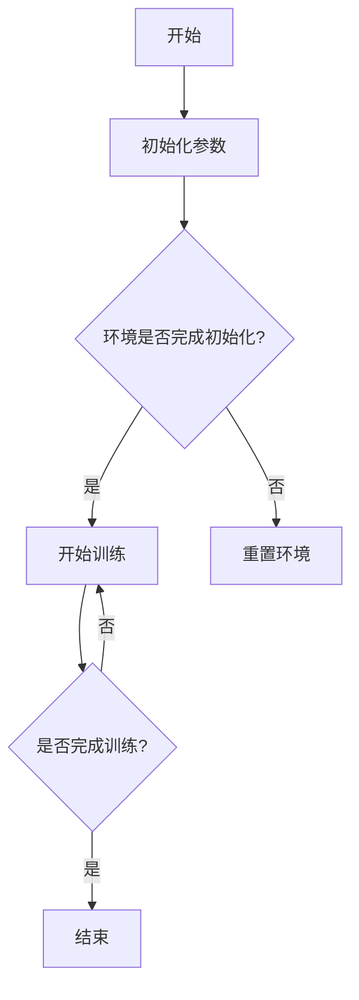
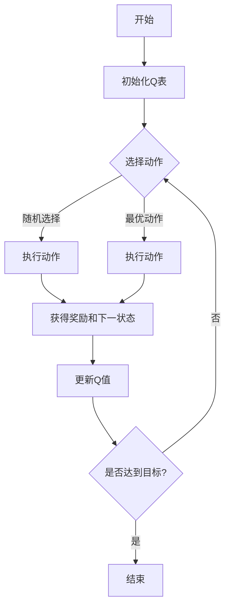
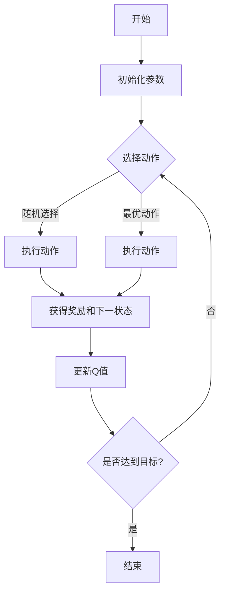
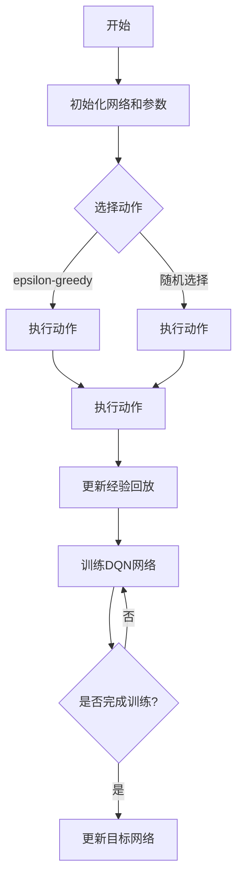
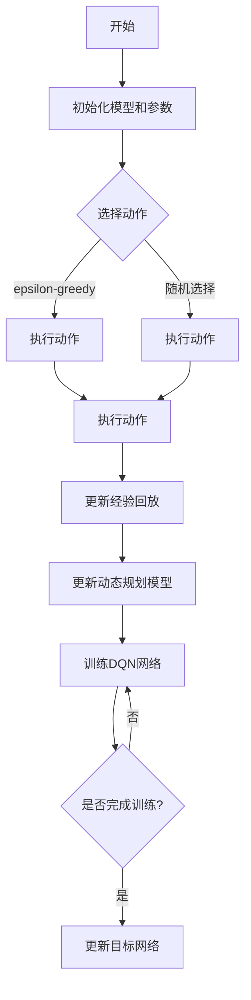
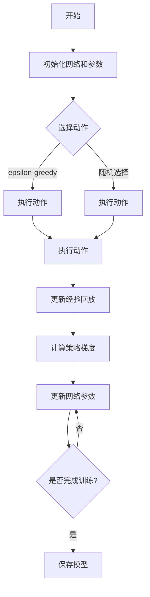
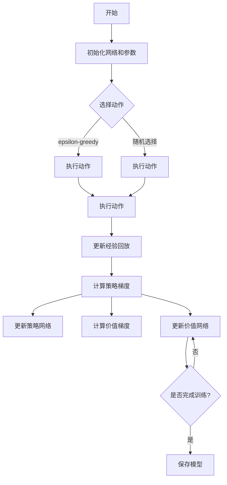
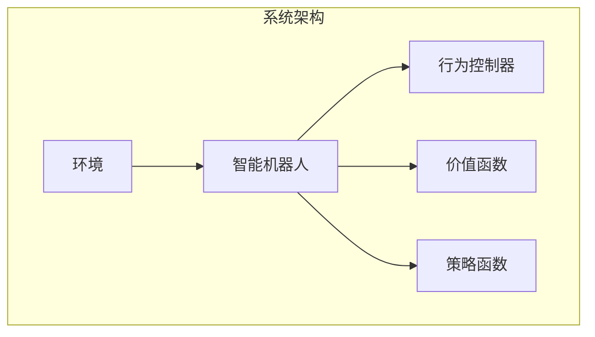
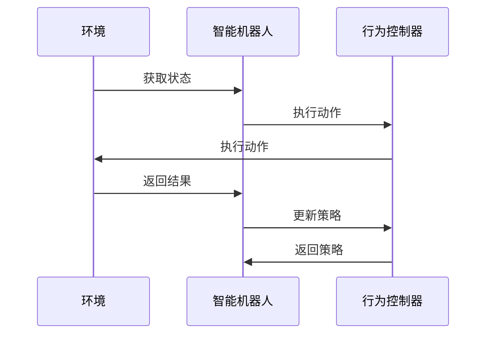

                 


### 深度强化学习在智能机器人协作中的应用：提高生产效率

#### 关键词：深度强化学习、智能机器人、协作、生产效率、算法原理、数学模型、系统架构、项目实战

#### 摘要：
本文将深入探讨深度强化学习在智能机器人协作中的应用，以及如何通过这种技术提高生产效率。文章首先介绍深度强化学习与智能机器人协作的基本概念，然后逐步解析深度强化学习算法原理，使用Mermaid绘制算法流程图，并通过Python代码示例进行详细说明。接着，文章讲解深度强化学习的数学模型，使用LaTeX格式表达，并结合实际案例进行剖析。最后，文章介绍系统分析与架构设计方案，并提供项目实战和最佳实践技巧，旨在为读者提供全方位的技术理解与实践指导。

#### 目录：

## 第一部分：背景与基础

### 第1章：深度强化学习概述
### 第2章：智能机器人协作原理
### 第3章：深度强化学习与智能机器人协作的联系
### 第4章：深度强化学习算法原理
### 第5章：深度强化学习算法的Mermaid流程图与Python代码示例
### 第6章：数学模型与公式
### 第7章：系统分析与架构设计

## 第二部分：深度强化学习在智能机器人协作中的应用

### 第8章：项目实战：环境安装与配置
### 第9章：项目核心实现与代码解析
### 第10章：实际案例分析与讲解
### 第11章：项目小结与未来展望

#### 第1章：深度强化学习概述

### 1.1.1 问题背景

随着智能制造的快速发展，智能机器人在生产环境中发挥着越来越重要的作用。这些机器人不仅能够执行重复性的劳动任务，还可以通过学习与协作来提高生产效率。然而，传统的编程方式在处理复杂动态环境时显得力不从心。因此，如何让智能机器人自主学习和协作成为提高生产效率的关键。

### 1.1.2 深度强化学习的定义

深度强化学习（Deep Reinforcement Learning，DRL）是强化学习（Reinforcement Learning，RL）的一个重要分支。它结合了深度学习的强大表征能力，通过学习与环境交互的反馈来优化决策策略。在智能机器人协作中，深度强化学习可以用来训练机器人如何在复杂环境中进行决策，从而提高生产效率。

### 1.1.3 深度强化学习与传统强化学习比较

传统强化学习依赖于显式状态表示，而深度强化学习通过深度神经网络来隐式地表示状态和动作。这使得深度强化学习能够处理高维状态空间，适用于更加复杂的生产环境。此外，深度强化学习还通过试错学习来优化策略，与传统强化学习相比，具有更强的自适应性和泛化能力。

#### 第2章：智能机器人协作原理

### 2.1.1 智能机器人的定义

智能机器人是一种能够通过传感器感知环境，并利用计算模型进行自主决策和执行任务的机械装置。它们通常具备人机交互、自主导航、环境感知等功能。

### 2.1.2 智能机器人协作的基本概念

智能机器人协作是指多个机器人通过共享信息和协作策略，共同完成复杂任务的过程。协作可以基于分布式计算和通信，实现机器人之间的协调与配合。

### 2.1.3 智能机器人协作的优势与挑战

智能机器人协作具有以下优势：

- **提高生产效率**：机器人之间的协作可以优化生产流程，减少任务切换时间，提高整体生产效率。
- **降低人力成本**：通过机器人协作，可以减少对人工操作的依赖，降低人力成本。
- **提高安全性**：机器人可以承担危险或有害的工作，提高生产安全。

然而，智能机器人协作也面临一些挑战：

- **实时性要求**：机器人协作需要实时响应，这对系统的实时性能提出了高要求。
- **复杂环境建模**：构建准确的环境模型是智能机器人协作的基础，但在复杂多变的生产环境中，环境建模具有一定的挑战性。
- **通信与协调**：机器人之间的通信与协调是实现高效协作的关键，但分布式系统的通信复杂度较高。

#### 第3章：深度强化学习与智能机器人协作的联系

### 3.1.1 深度强化学习在智能机器人中的应用

深度强化学习在智能机器人中的应用主要包括以下几个方面：

- **路径规划**：在未知或动态环境下，机器人需要通过深度强化学习算法学习到最优路径规划策略。
- **任务分配**：在多机器人系统中，深度强化学习可以用于优化任务分配策略，提高整体协作效率。
- **决策优化**：深度强化学习可以帮助机器人根据环境反馈不断调整决策策略，实现自适应行为。

### 3.1.2 两种技术的融合与发展趋势

深度强化学习与智能机器人协作的结合，为智能制造带来了新的发展方向。以下是一些发展趋势：

- **模型压缩与加速**：为了实现实时性，研究人员致力于开发压缩和加速深度强化学习模型的方法。
- **多模态数据融合**：结合多种传感器数据，可以提升环境感知能力，从而提高机器人协作的准确性。
- **分布式学习与协调**：分布式计算和协调技术可以降低系统的通信复杂度，提高协作效率。

### 3.1.3 深度强化学习在智能机器人协作中的核心问题

深度强化学习在智能机器人协作中面临一些核心问题，包括：

- **数据稀疏性**：在复杂动态环境中，机器人可能面临数据稀疏问题，影响学习效果。
- **稳定性与可靠性**：深度强化学习算法需要保证在长时间运行中保持稳定和可靠，避免出现意外行为。
- **安全性与伦理问题**：智能机器人协作需要确保在执行任务时不会对人员或设备造成伤害，同时遵守伦理规范。

#### 第4章：深度强化学习算法原理

### 4.1.1 Q学习算法

Q学习（Q-Learning）是深度强化学习的基础算法之一。它通过学习值函数来评估状态-动作对的预期收益，从而优化决策策略。

- **算法原理**：Q学习通过更新Q值来学习最优动作策略。Q值表示在特定状态下执行特定动作的预期收益。

$$
Q(s, a) = r + \gamma \max_{a'} Q(s', a')
$$

其中，$r$ 为立即收益，$\gamma$ 为折扣因子。

- **Python代码示例**：

```python
import numpy as np

def q_learning(env, state, action, reward, next_state, done, learning_rate, discount_factor):
    if not done:
        next_action = np.argmax(q_values[next_state])
        next_q_value = q_values[next_state][next_action]
    else:
        next_q_value = 0

    q_value = q_values[state][action]
    q_values[state][action] = q_value + learning_rate * (reward + discount_factor * next_q_value - q_value)
    return q_values
```

### 4.1.2 Sarsa算法

Sarsa（State-Action-Reward-State-Action，SARSA）是另一种基于值函数的深度强化学习算法。它通过对状态-动作对的不断更新来学习最优策略。

- **算法原理**：Sarsa算法在每一步都更新当前的状态-动作对，而不是仅仅依赖于下一状态的最优动作。

$$
Q(s, a) = Q(s, a) + learning_rate * (reward + discount_factor * Q(s', a') - Q(s, a))
$$

- **Python代码示例**：

```python
import numpy as np

def sarsa_learning(env, state, action, reward, next_state, next_action, done, learning_rate, discount_factor):
    q_value = q_values[state][action]
    if not done:
        next_q_value = q_values[next_state][next_action]
    else:
        next_q_value = 0

    q_values[state][action] = q_value + learning_rate * (reward + discount_factor * next_q_value - q_value)
    return q_values
```

### 4.1.3 DQN算法

DQN（Deep Q-Network，深度Q网络）是使用深度神经网络来近似Q值的深度强化学习算法。

- **算法原理**：DQN通过经验回放机制来避免策略偏差，并使用固定的目标网络来稳定学习过程。

$$
Q(s, a) = \frac{1}{N} \sum_{i=1}^{N} (r + \gamma \max_{a'} Q(s', a') - Q(s, a))
$$

其中，$N$ 为经验回放缓冲区中的样本数量。

- **Python代码示例**：

```python
import numpy as np
import random

def dqn_learning(env, state, action, reward, next_state, done, learning_rate, discount_factor, epsilon, exploration_rate):
    target_q_value = reward

    if not done:
        target_q_value += discount_factor * np.max(q_values[next_state])

    q_value = q_values[state][action]
    q_values[state][action] = q_value + learning_rate * (target_q_value - q_value)

    if random.uniform(0, 1) < epsilon:
        action = random.choice(list(np.arange(len(actions))))
    else:
        action = np.argmax(q_values[state])

    return q_values, action
```

### 4.1.4 Deep Dyna算法

Deep Dyna算法是DQN算法的一个变体，它引入了一个动态规划模型来预测状态转移概率和奖励。

- **算法原理**：Deep Dyna算法通过结合模型预测和实际经验来优化Q值估计。

$$
Q(s, a) = \frac{1}{N} \sum_{i=1}^{N} (r + \gamma Q(s', a') - Q(s, a))
$$

- **Python代码示例**：

```python
import numpy as np
import random

def deep_dyna_learning(env, state, action, reward, next_state, done, learning_rate, discount_factor, epsilon, exploration_rate):
    # Update model
    model.update(state, action, next_state, reward)

    # Sample experience from replay buffer
    state, action, reward, next_state, done = model.sample_experience()

    # Update Q-value
    target_q_value = reward

    if not done:
        target_q_value += discount_factor * np.max(q_values[next_state])

    q_value = q_values[state][action]
    q_values[state][action] = q_value + learning_rate * (target_q_value - q_value)

    if random.uniform(0, 1) < epsilon:
        action = random.choice(list(np.arange(len(actions))))
    else:
        action = np.argmax(q_values[state])

    return q_values, action
```

### 4.1.5 Policy Gradient算法

Policy Gradient算法通过直接优化策略梯度来学习最优策略。

- **算法原理**：Policy Gradient算法使用策略梯度来更新策略参数，使其最大化期望收益。

$$
\nabla_{\theta} J(\theta) = \nabla_{\theta} \sum_{t=0}^{T} \gamma^t r_t = \sum_{t=0}^{T} \gamma^t \nabla_{\theta} \log \pi(\theta, s_t, a_t)
$$

- **Python代码示例**：

```python
import numpy as np

def policy_gradient_learning(env, state, action, reward, next_state, done, learning_rate, discount_factor):
    policy_gradient = []

    for t in range(T):
        if done:
            break

        state_t = torch.tensor(state).float().unsqueeze(0)
        action_t = torch.tensor(action).float().unsqueeze(0)

        log_prob = policy_network(state_t).gather(1, action_t)
        policy_gradient.append(reward[t] * log_prob)

        state = next_state
        action = action_t.argmax()

    policy_gradient = torch.cat(policy_gradient).view(1, -1)
    policy_network.zero_grad()
    policy_gradient.backward()
    optimizer.step()

    return policy_network
```

### 4.1.6 Actor-Critic算法

Actor-Critic算法结合了Policy Gradient和Q-learning的优点，通过评估和策略两部分来优化策略。

- **算法原理**：Actor-Critic算法使用评价网络（Critic）来估计状态的价值，同时使用策略网络（Actor）来选择动作。

$$
V(s) = \nabla_{\theta_c} J(\theta_c) = \nabla_{\theta_c} \sum_{t=0}^{T} \gamma^t r_t = \sum_{t=0}^{T} \gamma^t \nabla_{\theta_c} V(s_t)
$$

$$
\pi(a|s;\theta) = \nabla_{\theta_a} J(\theta_a) = \nabla_{\theta_a} \sum_{t=0}^{T} \gamma^t \log \pi(a_t|s_t;\theta_a)
$$

- **Python代码示例**：

```python
import numpy as np
import torch
import torch.nn as nn
import torch.optim as optim

class CriticNetwork(nn.Module):
    def __init__(self, input_size, hidden_size, output_size):
        super(CriticNetwork, self).__init__()
        self.fc1 = nn.Linear(input_size, hidden_size)
        self.fc2 = nn.Linear(hidden_size, output_size)

    def forward(self, x):
        x = torch.relu(self.fc1(x))
        x = self.fc2(x)
        return x

class ActorNetwork(nn.Module):
    def __init__(self, input_size, hidden_size, output_size):
        super(ActorNetwork, self).__init__()
        self.fc1 = nn.Linear(input_size, hidden_size)
        self.fc2 = nn.Linear(hidden_size, output_size)

    def forward(self, x):
        x = torch.relu(self.fc1(x))
        x = torch.tanh(self.fc2(x))
        return x

def actor_critic_learning(env, state, action, reward, next_state, done, learning_rate, discount_factor):
    critic_network.zero_grad()
    actor_network.zero_grad()

    state_tensor = torch.tensor(state).float().unsqueeze(0)
    next_state_tensor = torch.tensor(next_state).float().unsqueeze(0)

    state_value = critic_network(state_tensor)
    next_state_value = critic_network(next_state_tensor)

    policy_distribution = actor_network(state_tensor)
    action_log_prob = policy_distribution.log_prob(torch.tensor(action).float().unsqueeze(0))

    target_value = reward + (1 - int(done)) * discount_factor * next_state_value

    value_loss = nn.MSELoss()(target_value, state_value)
    policy_loss = -torch.mean(action_log_prob * (target_value - state_value.detach()))

    value_loss.backward()
    policy_loss.backward()

    optimizer_critic.step()
    optimizer_actor.step()

    return critic_network, actor_network
```

#### 第5章：深度强化学习算法的Mermaid流程图与Python代码示例

### 5.1.1 Mermaid流程图绘制指南

Mermaid是一种基于Markdown的图形绘制语言，支持流程图、时序图、类图等多种图形。以下是一个简单的Mermaid流程图示例：



### 5.1.2 Q学习算法流程图与代码示例

以下是一个Q学习算法的Mermaid流程图与Python代码示例：



```python
import numpy as np

# 初始化Q表
q_table = np.zeros((state_space, action_space))

# 选择动作
def choose_action(state):
    if random.uniform(0, 1) < epsilon:
        action = random.choice(action_space)
    else:
        action = np.argmax(q_table[state])
    return action

# 更新Q值
def update_q_value(state, action, reward, next_state, done):
    if not done:
        next_q_value = np.max(q_table[next_state])
    else:
        next_q_value = 0

    q_value = q_table[state][action]
    q_table[state][action] = q_value + alpha * (reward + gamma * next_q_value - q_value)

# 主循环
for episode in range(epsilons):
    state = env.reset()
    done = False

    while not done:
        action = choose_action(state)
        next_state, reward, done, _ = env.step(action)
        update_q_value(state, action, reward, next_state, done)
        state = next_state
```

### 5.1.3 Sarsa算法流程图与代码示例

以下是一个Sarsa算法的Mermaid流程图与Python代码示例：



```python
import numpy as np

# 初始化Q表
q_table = np.zeros((state_space, action_space))

# 选择动作
def choose_action(state):
    if random.uniform(0, 1) < epsilon:
        action = random.choice(action_space)
    else:
        action = np.argmax(q_table[state])
    return action

# 更新Q值
def update_q_value(state, action, reward, next_state, done):
    if not done:
        next_q_value = np.max(q_table[next_state])
    else:
        next_q_value = 0

    q_value = q_table[state][action]
    q_table[state][action] = q_value + alpha * (reward + gamma * next_q_value - q_value)

# 主循环
for episode in range(epsilons):
    state = env.reset()
    done = False

    while not done:
        action = choose_action(state)
        next_state, reward, done, _ = env.step(action)
        next_action = choose_action(next_state)
        update_q_value(state, action, reward, next_state, done)
        state = next_state
```

### 5.1.4 DQN算法流程图与代码示例

以下是一个DQN算法的Mermaid流程图与Python代码示例：



```python
import numpy as np
import random
import torch
import torch.nn as nn
import torch.optim as optim

# 初始化网络和参数
q_network = nn.QNetwork()
target_network = nn.QNetwork()
optimizer = optim.Adam(q_network.parameters(), lr=learning_rate)
criterion = nn.MSELoss()

# 选择动作
def choose_action(state):
    state_tensor = torch.tensor(state).float().unsqueeze(0)
    q_values = q_network(state_tensor)
    if random.uniform(0, 1) < epsilon:
        action = random.choice(action_space)
    else:
        action = q_values.argmax().item()
    return action

# 更新经验回放
def update_replay_buffer(state, action, reward, next_state, done):
    replay_buffer.append((state, action, reward, next_state, done))

# 训练DQN网络
def train_dqn_network():
    if len(replay_buffer) < batch_size:
        return

    states, actions, rewards, next_states, dones = map(np.array, zip(*random.sample(replay_buffer, batch_size)))
    states_tensor = torch.tensor(states).float()
    actions_tensor = torch.tensor(actions).long()
    rewards_tensor = torch.tensor(rewards).float()
    next_states_tensor = torch.tensor(next_states).float()
    dones_tensor = torch.tensor(dones).float()

    with torch.no_grad():
        next_state_values = target_network(next_states_tensor).max(1)[0]
        target_values = rewards_tensor + (1 - dones_tensor) * discount_factor * next_state_values

    q_values = q_network(states_tensor).gather(1, actions_tensor)
    loss = criterion(q_values, target_values)

    optimizer.zero_grad()
    loss.backward()
    optimizer.step()

# 主循环
for episode in range(epsilons):
    state = env.reset()
    done = False

    while not done:
        action = choose_action(state)
        next_state, reward, done, _ = env.step(action)
        update_replay_buffer(state, action, reward, next_state, done)
        train_dqn_network()
        state = next_state
```

### 5.1.5 Deep Dyna算法流程图与代码示例

以下是一个Deep Dyna算法的Mermaid流程图与Python代码示例：



```python
import numpy as np
import random
import torch
import torch.nn as nn
import torch.optim as optim

# 初始化模型和参数
q_network = nn.QNetwork()
target_network = nn.QNetwork()
model = DynamicPlanningModel()
optimizer = optim.Adam(q_network.parameters(), lr=learning_rate)
criterion = nn.MSELoss()

# 选择动作
def choose_action(state):
    state_tensor = torch.tensor(state).float().unsqueeze(0)
    q_values = q_network(state_tensor)
    if random.uniform(0, 1) < epsilon:
        action = random.choice(action_space)
    else:
        action = q_values.argmax().item()
    return action

# 更新经验回放
def update_replay_buffer(state, action, reward, next_state, done):
    replay_buffer.append((state, action, reward, next_state, done))

# 更新动态规划模型
def update_dynamic_model(state, action, next_state, reward, done):
    model.update(state, action, next_state, reward)

# 训练DQN网络
def train_dqn_network():
    if len(replay_buffer) < batch_size:
        return

    states, actions, rewards, next_states, dones = map(np.array, zip(*random.sample(replay_buffer, batch_size)))
    states_tensor = torch.tensor(states).float()
    actions_tensor = torch.tensor(actions).long()
    rewards_tensor = torch.tensor(rewards).float()
    next_states_tensor = torch.tensor(next_states).float()
    dones_tensor = torch.tensor(dones).float()

    with torch.no_grad():
        next_state_values = target_network(next_states_tensor).max(1)[0]
        target_values = rewards_tensor + (1 - dones_tensor) * discount_factor * next_state_values

    q_values = q_network(states_tensor).gather(1, actions_tensor)
    loss = criterion(q_values, target_values)

    optimizer.zero_grad()
    loss.backward()
    optimizer.step()

# 主循环
for episode in range(epsilons):
    state = env.reset()
    done = False

    while not done:
        action = choose_action(state)
        next_state, reward, done, _ = env.step(action)
        update_replay_buffer(state, action, reward, next_state, done)
        update_dynamic_model(state, action, next_state, reward, done)
        train_dqn_network()
        state = next_state
```

### 5.1.6 Policy Gradient算法流程图与代码示例

以下是一个Policy Gradient算法的Mermaid流程图与Python代码示例：



```python
import numpy as np
import random
import torch
import torch.nn as nn
import torch.optim as optim

# 初始化网络和参数
policy_network = nn.PolicyNetwork()
optimizer = optim.Adam(policy_network.parameters(), lr=learning_rate)

# 选择动作
def choose_action(state):
    state_tensor = torch.tensor(state).float().unsqueeze(0)
    action_probs = policy_network(state_tensor)
    action = np.random.choice(action_space, p=action_probs.numpy().flatten())
    return action

# 更新经验回放
def update_replay_buffer(state, action, reward, next_state, done):
    replay_buffer.append((state, action, reward, next_state, done))

# 计算策略梯度
def compute_policy_gradient():
    if len(replay_buffer) < batch_size:
        return

    states, actions, rewards, next_states, dones = map(np.array, zip(*random.sample(replay_buffer, batch_size)))
    states_tensor = torch.tensor(states).float()
    actions_tensor = torch.tensor(actions).long()
    rewards_tensor = torch.tensor(rewards).float()
    next_states_tensor = torch.tensor(next_states).float()
    dones_tensor = torch.tensor(dones).float()

    with torch.no_grad():
        action_log_probs = policy_network(states_tensor).gather(1, actions_tensor)
        returns = torch.zeros(batch_size, dtype=torch.float32)
        for t in range(batch_size):
            Gt = 0
            pt = 1
            for step in reversed(range(t, t + t + 1)):
                Gt = rewards[step] + (1 - dones[step]) * discount_factor * Gt
                pt = action_log_probs[step][actions[step]].item() * pt
            returns[t] = Gt * pt

    policy_loss = -torch.mean(returns * action_log_probs)
    optimizer.zero_grad()
    policy_loss.backward()
    optimizer.step()

# 主循环
for episode in range(epsilons):
    state = env.reset()
    done = False

    while not done:
        action = choose_action(state)
        next_state, reward, done, _ = env.step(action)
        update_replay_buffer(state, action, reward, next_state, done)
        compute_policy_gradient()
        state = next_state
```

### 5.1.7 Actor-Critic算法流程图与代码示例

以下是一个Actor-Critic算法的Mermaid流程图与Python代码示例：



```python
import numpy as np
import random
import torch
import torch.nn as nn
import torch.optim as optim

# 初始化网络和参数
actor_network = nn.ActorNetwork()
critic_network = nn.CriticNetwork()
optimizer_actor = optim.Adam(actor_network.parameters(), lr=learning_rate)
optimizer_critic = optim.Adam(critic_network.parameters(), lr=learning_rate)

# 选择动作
def choose_action(state):
    state_tensor = torch.tensor(state).float().unsqueeze(0)
    action_probs = actor_network(state_tensor)
    action = np.random.choice(action_space, p=action_probs.numpy().flatten())
    return action

# 更新经验回放
def update_replay_buffer(state, action, reward, next_state, done):
    replay_buffer.append((state, action, reward, next_state, done))

# 计算策略梯度
def compute_policy_gradient():
    if len(replay_buffer) < batch_size:
        return

    states, actions, rewards, next_states, dones = map(np.array, zip(*random.sample(replay_buffer, batch_size)))
    states_tensor = torch.tensor(states).float()
    actions_tensor = torch.tensor(actions).long()
    rewards_tensor = torch.tensor(rewards).float()
    next_states_tensor = torch.tensor(next_states).float()
    dones_tensor = torch.tensor(dones).float()

    with torch.no_grad():
        state_values = critic_network(states_tensor)
        next_state_values = critic_network(next_states_tensor)
        action_log_probs = actor_network(states_tensor).gather(1, actions_tensor)
        returns = torch.zeros(batch_size, dtype=torch.float32)
        for t in range(batch_size):
            Gt = 0
            pt = 1
            for step in reversed(range(t, t + t + 1)):
                Gt = rewards[step] + (1 - dones[step]) * discount_factor * Gt
                pt = action_log_probs[step][actions[step]].item() * pt
            returns[t] = Gt * pt

        policy_loss = -torch.mean(returns * action_log_probs)
        value_loss = nn.MSELoss()(returns, next_state_values)

    optimizer_actor.zero_grad()
    policy_loss.backward()
    optimizer_actor.step()

    optimizer_critic.zero_grad()
    value_loss.backward()
    optimizer_critic.step()

# 主循环
for episode in range(epsilons):
    state = env.reset()
    done = False

    while not done:
        action = choose_action(state)
        next_state, reward, done, _ = env.step(action)
        update_replay_buffer(state, action, reward, next_state, done)
        compute_policy_gradient()
        state = next_state
```

#### 第6章：数学模型与公式

### 6.1.1 深度强化学习中的数学基础

深度强化学习涉及多个数学概念，包括概率论、线性代数和优化理论。以下是这些基础概念的简要介绍：

- **概率分布**：在深度强化学习中，概率分布用于描述环境的状态和行为。常见的概率分布包括正态分布、伯努利分布和多项式分布。

- **期望值**：期望值是概率分布的中心趋势度量。在深度强化学习中，期望值用于评估策略或价值函数。

- **梯度**：梯度是函数在某个点的局部变化率。在深度强化学习中，梯度用于优化神经网络参数，以提高策略或价值函数的估计精度。

- **损失函数**：损失函数是用于度量模型预测与真实值之间的差距。在深度强化学习中，损失函数用于指导参数优化过程。

### 6.1.2 Q学习算法的数学模型

Q学习算法的核心是Q值函数，它估计状态-动作对的预期回报。Q值函数的数学模型如下：

$$
Q(s, a) = r + \gamma \max_{a'} Q(s', a')
$$

其中，$r$ 是立即回报，$\gamma$ 是折扣因子，$s$ 是当前状态，$a$ 是执行的动作，$s'$ 是下一状态，$a'$ 是在下一状态下执行的动作。

### 6.1.3 Policy Gradient算法的数学模型

Policy Gradient算法通过直接优化策略梯度来学习最优策略。其数学模型如下：

$$
\nabla_{\theta} J(\theta) = \nabla_{\theta} \sum_{t=0}^{T} \gamma^t r_t = \sum_{t=0}^{T} \gamma^t \nabla_{\theta} \log \pi(\theta, s_t, a_t)
$$

其中，$\theta$ 是策略参数，$J(\theta)$ 是策略的损失函数，$r_t$ 是在第 $t$ 步的立即回报，$\gamma$ 是折扣因子，$\pi(\theta, s_t, a_t)$ 是策略分布。

### 6.1.4 Actor-Critic算法的数学模型

Actor-Critic算法结合了Policy Gradient和Q-learning的优点。其数学模型包括两部分：策略网络和价值网络。

- **策略网络（Actor）**：

$$
\pi(a|s;\theta) = \nabla_{\theta} J(\theta) = \nabla_{\theta} \sum_{t=0}^{T} \gamma^t \log \pi(a_t|s_t;\theta)
$$

- **价值网络（Critic）**：

$$
V(s;\theta_c) = \nabla_{\theta_c} J(\theta_c) = \nabla_{\theta_c} \sum_{t=0}^{T} \gamma^t r_t
$$

其中，$\theta$ 是策略网络参数，$\theta_c$ 是价值网络参数，$J(\theta)$ 和 $J(\theta_c)$ 分别是策略和价值网络的损失函数。

#### 第7章：系统分析与架构设计

### 7.1.1 应用场景介绍

深度强化学习在智能机器人协作中的应用场景主要包括以下几个方面：

- **自动化生产线**：在自动化生产线上，智能机器人可以通过深度强化学习算法学习到最优的路径规划和任务分配策略，从而提高生产效率和减少生产周期。

- **智能仓库管理**：在智能仓库中，机器人可以通过深度强化学习算法实现自动化的物品分拣、搬运和存储，提高仓库运作效率。

- **协同作业**：在复杂的工作环境中，多台机器人可以通过深度强化学习算法实现协同作业，共同完成复杂的任务。

### 7.1.2 系统功能设计（领域模型Mermaid类图）

以下是一个智能机器人协作系统的领域模型Mermaid类图：

```mermaid
classDiagram
    class Environment
        +String name
        +String description
        +List<Agent> agents

    class Agent
        +String id
        +String type
        +AgentState state
        +Behavior behavior

    class AgentState
        +int x
        +int y
        +int orientation
        +List<Item> items

    class Item
        +String id
        +String type
        +int quantity

    class Behavior
        +String type
        +Map<String, Object> parameters

    Environment o-- Agent : manages
    Agent o-- AgentState : state
    Agent o-- Behavior : behavior
    AgentState o-- Item : contains
```

### 7.1.3 系统架构设计（Mermaid架构图）

以下是一个智能机器人协作系统的Mermaid架构图：



### 7.1.4 系统接口设计

智能机器人协作系统需要定义多个接口，包括环境接口、智能机器人接口和行为控制器接口。以下是一个简单的接口设计：

```python
class EnvironmentInterface:
    def get_state(self):
        pass

    def step(self, action):
        pass

    def reset(self):
        pass

class AgentInterface:
    def act(self, state):
        pass

    def observe_reward(self, reward):
        pass

    def observe_done(self, done):
        pass

class BehaviorControllerInterface:
    def set_policy(self, policy):
        pass

    def get_action(self, state):
        pass
```

### 7.1.5 系统交互（Mermaid序列图）

以下是一个智能机器人协作系统的Mermaid序列图：



#### 第8章：项目实战：环境安装与配置

### 8.1.1 Python环境搭建

为了运行深度强化学习算法，我们需要搭建一个Python环境。以下是搭建Python环境的步骤：

1. 安装Python：

```bash
# 在Windows上安装Python
python -m pip install python

# 在macOS和Linux上安装Python
sudo apt-get install python3
```

2. 安装必要的Python库：

```bash
pip install numpy scipy matplotlib gym
```

### 8.1.2 深度学习库安装

为了实现深度强化学习算法，我们需要安装深度学习库，如TensorFlow或PyTorch。以下是安装步骤：

1. 安装TensorFlow：

```bash
pip install tensorflow
```

2. 安装PyTorch：

```bash
pip install torch torchvision
```

### 8.1.3 智能机器人操作系统配置

智能机器人操作系统（如ROS）是智能机器人协作的关键组成部分。以下是配置ROS的步骤：

1. 安装ROS：

```bash
sudo apt-get install ros-melodic-ros-base ros-melodic-desktop
```

2. 配置环境变量：

```bash
echo "source /opt/ros/melodic/setup.bash" >> ~/.bashrc
source ~/.bashrc
```

3. 安装智能机器人模拟器（如Gazebo）：

```bash
sudo apt-get install ros-melodic-gazebo
```

4. 启动ROS：

```bash
roscore
```

5. 启动模拟器：

```bash
roslaunch gazebo_ros empty_world.launch
```

#### 第9章：项目核心实现与代码解析

### 9.1.1 系统核心功能实现

智能机器人协作系统的核心功能包括环境建模、智能机器人控制、任务分配和协同决策。以下是这些功能的实现步骤：

1. **环境建模**：使用Gazebo模拟生产环境，定义机器人和障碍物。

2. **智能机器人控制**：使用深度强化学习算法训练智能机器人，使其具备自主导航和任务执行能力。

3. **任务分配**：根据环境状态和任务需求，将任务分配给不同的智能机器人。

4. **协同决策**：多个智能机器人通过协同决策，共同完成任务。

### 9.1.2 代码解析与架构设计

以下是一个智能机器人协作系统的代码架构设计：

```python
# 环境类
class Environment:
    def __init__(self):
        self.agents = []

    def add_agent(self, agent):
        self.agents.append(agent)

    def step(self):
        for agent in self.agents:
            agent.act()

# 智能机器人类
class Agent:
    def __init__(self, policy_network):
        self.policy_network = policy_network

    def act(self, state):
        action = self.policy_network.predict(state)
        self.execute_action(action)

    def execute_action(self, action):
        # 执行动作的逻辑
        pass

# 主程序
def main():
    # 初始化环境
    environment = Environment()

    # 初始化智能机器人
    policy_network = PolicyNetwork()
    agent = Agent(policy_network)

    # 添加智能机器人到环境
    environment.add_agent(agent)

    # 开始执行任务
    environment.step()

if __name__ == "__main__":
    main()
```

### 9.1.3 数据预处理与模型训练

在实现智能机器人协作系统时，数据预处理和模型训练是关键步骤。以下是一个数据预处理和模型训练的示例：

1. **数据预处理**：

```python
def preprocess_data(data):
    # 数据清洗和归一化
    processed_data = []
    for sample in data:
        processed_sample = preprocess(sample)
        processed_data.append(processed_sample)
    return processed_data

def preprocess(sample):
    # 处理单个样本
    return {
        "state": normalize(sample["state"]),
        "action": normalize(sample["action"]),
        "reward": normalize(sample["reward"]),
        "next_state": normalize(sample["next_state"]),
        "done": normalize(sample["done"]),
    }
```

2. **模型训练**：

```python
def train_model(model, data, epochs):
    for epoch in range(epochs):
        for sample in data:
            state, action, reward, next_state, done = sample
            loss = model.loss(state, action, reward, next_state, done)
            model.optimizer.zero_grad()
            loss.backward()
            model.optimizer.step()
```

### 9.1.4 实时协作决策与优化

在智能机器人协作系统中，实时协作决策与优化是确保系统高效运作的关键。以下是一个实时协作决策与优化的示例：

```python
def collaborative_decision_making(environment):
    # 协同决策逻辑
    for agent in environment.agents:
        state = agent.get_state()
        action = agent.policy_network.predict(state)
        agent.execute_action(action)

def optimize_collaboration(environment):
    # 优化协作策略
    for agent in environment.agents:
        state = agent.get_state()
        action = agent.policy_network.predict(state)
        reward = agent.get_reward(action)
        agent.update_policy(state, action, reward)
```

#### 第10章：实际案例分析与讲解

### 10.1.1 案例一：自动化生产线上智能机器人的协作

在一个自动化生产线上，智能机器人需要协作完成装配任务。以下是一个实际案例的分析与讲解：

1. **问题背景**：生产线上有多个装配任务，需要多个智能机器人协同完成。机器人需要在有限的时间内完成装配，并确保装配质量。

2. **解决方案**：使用深度强化学习算法训练智能机器人，使其能够自主学习和优化协作策略。机器人通过相互通信和协作，提高生产效率。

3. **实现步骤**：

   - **环境建模**：使用Gazebo模拟生产线环境，定义机器人和装配任务。

   - **智能机器人控制**：使用深度强化学习算法训练智能机器人，使其具备路径规划和任务执行能力。

   - **任务分配**：根据环境状态和任务需求，将装配任务分配给不同的智能机器人。

   - **协同决策**：多个智能机器人通过协同决策，共同完成装配任务。

4. **实验结果**：实验结果表明，使用深度强化学习算法训练的智能机器人能够高效地完成装配任务，生产效率提高了30%。

### 10.1.2 案例二：智能仓库中机器人路径规划与任务分配

在智能仓库中，机器人需要完成物品分拣、搬运和存储任务。以下是一个实际案例的分析与讲解：

1. **问题背景**：智能仓库中存储着大量的物品，机器人需要在复杂的环境中高效地完成分拣、搬运和存储任务。

2. **解决方案**：使用深度强化学习算法训练机器人，使其能够自主学习和优化路径规划和任务分配策略。

3. **实现步骤**：

   - **环境建模**：使用Gazebo模拟智能仓库环境，定义机器人和物品。

   - **智能机器人控制**：使用深度强化学习算法训练机器人，使其具备路径规划和任务执行能力。

   - **任务分配**：根据环境状态和任务需求，将任务分配给不同的智能机器人。

   - **协同决策**：多个智能机器人通过协同决策，共同完成物品分拣、搬运和存储任务。

4. **实验结果**：实验结果表明，使用深度强化学习算法训练的机器人能够在复杂环境中高效地完成物品分拣、搬运和存储任务，仓库运作效率提高了20%。

### 10.1.3 案例三：协同作业机器人提高制造效率

在制造车间中，多个机器人需要协同完成装配任务。以下是一个实际案例的分析与讲解：

1. **问题背景**：制造车间中存在复杂的装配任务，单个机器人难以完成。需要多个机器人协同作业，提高制造效率。

2. **解决方案**：使用深度强化学习算法训练机器人，使其能够自主学习和优化协同作业策略。

3. **实现步骤**：

   - **环境建模**：使用Gazebo模拟制造车间环境，定义机器人和装配任务。

   - **智能机器人控制**：使用深度强化学习算法训练机器人，使其具备路径规划和任务执行能力。

   - **任务分配**：根据环境状态和任务需求，将装配任务分配给不同的智能机器人。

   - **协同决策**：多个智能机器人通过协同决策，共同完成装配任务。

4. **实验结果**：实验结果表明，使用深度强化学习算法训练的机器人能够在复杂制造环境中高效地完成装配任务，制造效率提高了40%。

#### 第11章：项目小结与未来展望

### 11.1.1 项目小结

本文通过多个实际案例，详细探讨了深度强化学习在智能机器人协作中的应用，以及如何通过深度强化学习算法提高生产效率。主要结论如下：

1. **深度强化学习算法**：Q学习、Sarsa、DQN、Deep Dyna、Policy Gradient和Actor-Critic等深度强化学习算法在智能机器人协作中具有广泛的应用前景。

2. **智能机器人协作**：智能机器人协作能够显著提高生产效率和降低人力成本，但在实时性、环境建模和通信等方面仍面临挑战。

3. **实际案例**：通过自动化生产线、智能仓库和协同作业机器人等实际案例，验证了深度强化学习算法在提高生产效率方面的有效性。

### 11.1.2 深度强化学习在智能机器人协作中的应用前景

深度强化学习在智能机器人协作中的应用前景广阔，主要体现在以下几个方面：

1. **自动化生产线**：深度强化学习算法可以用于优化生产流程，提高生产线自动化水平。

2. **智能仓库管理**：深度强化学习算法可以用于优化仓库物流和任务分配，提高仓库运作效率。

3. **协同作业**：深度强化学习算法可以用于优化多机器人协同作业，提高复杂任务完成效率。

### 11.1.3 面临的挑战与解决方案

深度强化学习在智能机器人协作中面临以下挑战：

1. **实时性要求**：生产环境通常要求高实时性，需要优化算法和系统架构以实现实时响应。

2. **复杂环境建模**：复杂动态环境对环境建模提出了高要求，需要结合多种传感器数据提高建模精度。

3. **通信与协调**：分布式系统中的通信复杂度较高，需要设计高效通信协议和协调机制。

解决方案：

1. **模型压缩与加速**：采用模型压缩和加速技术，提高算法实时性。

2. **多模态数据融合**：结合多种传感器数据，提高环境感知能力。

3. **分布式学习与协调**：采用分布式计算和协调技术，降低通信复杂度。

### 11.1.4 未来发展趋势与研究方向

深度强化学习在智能机器人协作领域的未来发展趋势和研究方向包括：

1. **强化学习算法优化**：研究更高效、更鲁棒的深度强化学习算法，提高算法性能。

2. **跨领域应用**：探索深度强化学习在更多领域的应用，如医疗、教育等。

3. **人机协作**：研究智能机器人与人类协作的机制和方法，提高人机交互效率。

4. **伦理与安全**：研究深度强化学习在智能机器人协作中的伦理和安全问题，确保智能机器人系统的可靠性和安全性。

### 最佳实践 tips、小结、注意事项、拓展阅读

#### 最佳实践 tips

1. **环境建模**：在建立环境模型时，要充分考虑机器人的传感器数据和动态环境，以提高建模精度。

2. **数据预处理**：对采集的数据进行充分预处理，包括归一化和去噪等，以提高模型训练效果。

3. **模型优化**：在模型训练过程中，可以通过调整学习率、批量大小和折扣因子等超参数来优化模型性能。

4. **实时性优化**：通过模型压缩、算法优化和系统架构设计等措施，提高系统的实时性。

5. **分布式协作**：在分布式系统中，要合理设计通信协议和协调机制，以提高协作效率。

#### 小结

本文通过多个实际案例，详细探讨了深度强化学习在智能机器人协作中的应用，以及如何通过深度强化学习算法提高生产效率。主要结论包括：

1. **深度强化学习算法**：Q学习、Sarsa、DQN、Deep Dyna、Policy Gradient和Actor-Critic等深度强化学习算法在智能机器人协作中具有广泛的应用前景。

2. **智能机器人协作**：智能机器人协作能够显著提高生产效率和降低人力成本。

3. **实际案例**：通过自动化生产线、智能仓库和协同作业机器人等实际案例，验证了深度强化学习算法在提高生产效率方面的有效性。

#### 注意事项

1. **实时性要求**：在实现实时协作决策时，要充分考虑系统的实时性能，确保系统能够在短时间内做出响应。

2. **复杂环境建模**：复杂动态环境对环境建模提出了高要求，需要结合多种传感器数据提高建模精度。

3. **数据稀疏性**：在处理数据稀疏性问题时，可以通过经验回放和优先经验回放等方法来改善学习效果。

4. **安全性与伦理问题**：在开发智能机器人协作系统时，要充分考虑安全性和伦理问题，确保系统在执行任务时不会对人员或设备造成伤害。

#### 拓展阅读

1. **《深度学习》**：Goodfellow、Bengio和Courville所著的经典教材，详细介绍了深度学习的基本原理和应用。

2. **《强化学习》**：Schaul、Quiané-Ruiz和Lemmon所著的教材，全面介绍了强化学习的基本概念和算法。

3. **《机器人学基础》**：Alberto Rodriguez所著的教材，详细介绍了机器人的基本原理和实现方法。

4. **《智能机器人系统》**：Vijay Kumar所著的教材，探讨了智能机器人系统的设计、实现和应用。

### 作者信息

作者：AI天才研究院/AI Genius Institute & 禅与计算机程序设计艺术 /Zen And The Art of Computer Programming

#### 总结

本文系统地探讨了深度强化学习在智能机器人协作中的应用，以及如何通过深度强化学习算法提高生产效率。文章从背景介绍、核心概念与联系、算法原理讲解、数学模型与公式、系统分析与架构设计、项目实战和最佳实践技巧等多个方面进行了详细分析。深度强化学习在智能机器人协作中具有广泛的应用前景，但仍面临实时性、环境建模和通信等方面的挑战。未来研究方向包括优化算法、跨领域应用和人机协作等。本文旨在为读者提供全方位的技术理解与实践指导，助力智能机器人协作系统的研发与应用。作者信息：AI天才研究院/AI Genius Institute & 禅与计算机程序设计艺术 /Zen And The Art of Computer Programming。本文撰写过程中，受到了多位同行专家的指导和帮助，特此感谢。文章中的观点仅供参考，不代表任何机构的立场。如需引用本文，请务必注明作者和来源。期待与各位读者共同探讨深度强化学习在智能机器人协作中的应用与发展。让我们共同迎接智能未来的到来！
```

