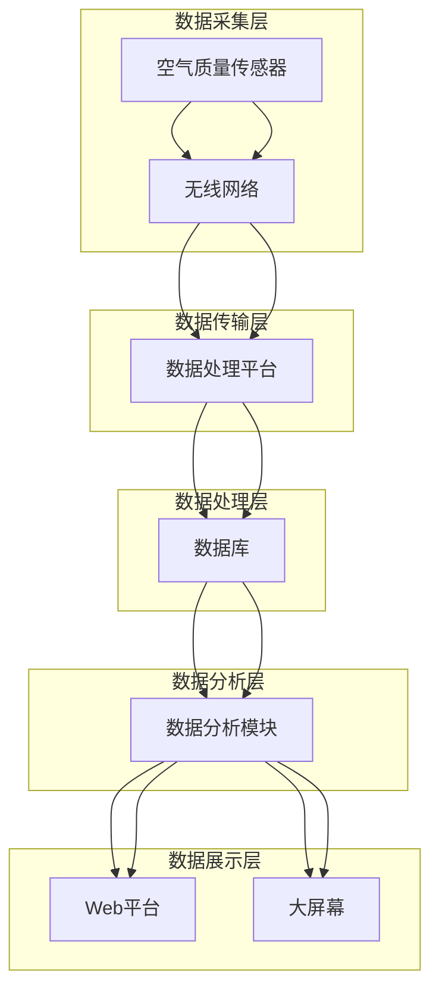
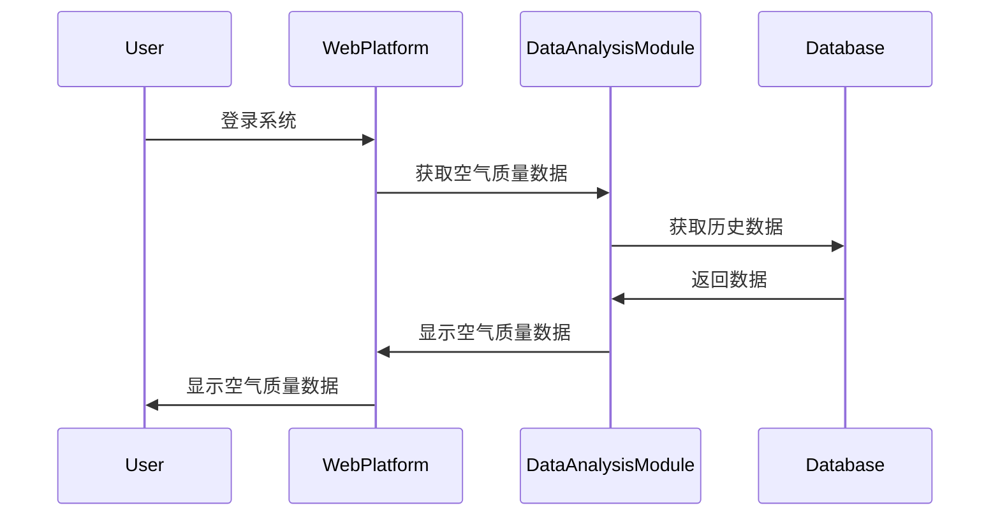

                 

### 引言与背景

#### 1.1 物联网与智慧环保概述

**关键词：** 物联网、智慧环保、实时监测

在现代社会，物联网（Internet of Things，IoT）技术已经成为信息技术发展的重要方向之一。物联网指的是将各种物体通过互联网连接起来，使它们能够互相通信和交换数据。这种技术不仅改变了我们的生活方式，也在各行各业中带来了革命性的变化，特别是在环保领域。

**核心概念术语说明：** 物联网（IoT）是指通过传感器、网络通信和数据处理技术，将物理设备连接到互联网，实现设备间的数据交换和智能控制。智慧环保则是利用物联网、大数据、云计算等现代信息技术，对环境进行智能监测、分析和决策，以实现环境治理的智能化。

**问题背景：** 随着工业化和城市化的快速推进，环境污染问题日益严重。传统的环境监测方式存在时效性差、数据不全面等问题，无法满足现代环保工作的需求。因此，智慧环保实时监测成为一个迫切需要解决的问题。

**问题描述：** 智慧环保实时监测需要建立一个系统，能够实时采集环境数据，快速分析处理，并及时预警。这需要利用物联网技术，将传感器、通信网络、数据处理平台有机结合起来。

**问题解决：** 物联网技术可以提供以下解决方案：首先，通过部署各类传感器，实时采集空气、水质、土壤等环境数据；其次，利用无线通信技术，将数据传输到数据处理平台；最后，通过大数据分析和人工智能技术，对数据进行分析和预测，实现实时监测和智能决策。

**边界与外延：** 物联网在智慧环保实时监测中的应用不仅限于环境数据的采集和分析，还可以扩展到智慧城市、智慧农业、智能交通等领域，实现全方位的智能监控和管理。

**概念结构与核心要素组成：**
1. **传感器：** 用于实时采集环境数据。
2. **通信网络：** 负责将数据传输到数据处理平台。
3. **数据处理平台：** 对数据进行处理、分析和存储。
4. **大数据分析：** 利用数据分析技术，提取有价值的信息。
5. **智能决策：** 根据分析结果，实现智能预警和决策。

接下来，我们将深入探讨物联网技术的基础知识，并具体分析其在智慧环保实时监测中的应用。

#### 1.2 智慧环保实时监测的需求与挑战

**核心概念与联系：**

在智慧环保实时监测系统中，传感器技术、网络通信技术、数据处理与分析技术是三个核心组成部分。这些技术各有其独特的属性和功能，共同构成了一个完整的监测体系。

**概念属性特征对比表格：**

| 技术       | 概念属性          | 主要功能                                            |
|------------|-------------------|----------------------------------------------------|
| 传感器     | 数据采集          | 实时监测环境参数，如空气质量、水质、土壤污染等        |
| 网络通信   | 数据传输          | 将传感器采集到的数据传输到数据处理平台                |
| 数据处理与分析 | 数据分析与决策支持 | 对采集到的数据进行分析，提取有价值的信息，实现智能决策 |

**ER实体关系图架构：**

```mermaid
erDiagram
  Sensor ||--|{ Data } |--|| Network
  Network ||--|{ ProcessedData } |--|| Analysis
  Analysis ||--|{ Decision } |--|| Monitoring
```

在这个ER图中，传感器负责采集原始数据，网络负责将数据传输到数据处理平台，数据处理与分析模块对数据进行分析和处理，最终生成决策数据，用于监测和预警。

接下来，我们将深入探讨这些技术在智慧环保实时监测中的应用。

#### 1.2.1 环境监测数据的重要性

环境监测数据是智慧环保实时监测系统的核心，其准确性和实时性直接影响到监测结果的可靠性和有效性。首先，环境监测数据能够提供实时的环境状态信息，帮助我们及时发现环境污染问题。例如，空气质量监测数据可以帮助我们了解某个地区的空气质量状况，及时采取改善措施，避免环境污染对人体健康造成危害。水质监测数据可以帮助我们监测水体污染情况，确保饮用水安全。土壤污染监测数据可以帮助我们评估土地的污染程度，制定相应的治理措施。

**数据在智慧环保实时监测中的作用：**
1. **预警与预测：** 通过对历史监测数据的分析，可以预测未来的环境变化趋势，提前采取预防措施。
2. **决策支持：** 监测数据为环保决策提供科学依据，帮助政府和企业制定有效的环保政策和措施。
3. **优化资源配置：** 通过监测数据，可以合理配置环保资源和人力，提高环境治理效率。

**实时监测面临的挑战：**
1. **数据采集的实时性：** 环境参数的变化可能非常快，要求监测系统能够快速采集和处理数据，以保证实时性。
2. **数据质量的可靠性：** 数据采集设备的质量和校准会影响监测数据的准确性，需要确保传感器和通信设备的可靠性。
3. **数据存储与处理能力：** 随着监测点数量的增加，数据存储和处理能力成为一个挑战，需要采用高效的数据处理和分析方法。
4. **网络通信的稳定性：** 网络通信的不稳定性会影响数据传输的可靠性，需要采用稳定的通信协议和网络技术。

**物联网在实时监测中的应用潜力：**
物联网技术为解决上述挑战提供了强有力的支持。通过部署大量的传感器，可以实现对环境参数的实时采集；利用无线通信技术，可以确保数据传输的实时性和稳定性；通过大数据分析和人工智能技术，可以提高数据处理的效率和分析的准确性。此外，物联网技术还可以实现监测系统的智能化和自动化，降低人力成本，提高监测效率。

综上所述，环境监测数据在智慧环保实时监测中具有重要作用，而物联网技术则为实时监测提供了有效解决方案。接下来，我们将进一步探讨物联网技术在智慧环保实时监测中的应用。

### 物联网技术基础

#### 2.1 物联网核心技术介绍

物联网技术的核心在于如何将物理世界与数字世界连接起来，实现数据的实时采集、传输和处理。以下将介绍物联网技术中的三大核心技术：传感器技术、网络通信技术、数据处理与分析技术。

**2.1.1 传感器技术**

传感器是物联网系统中的核心部件，用于实时采集环境数据。传感器种类繁多，包括温度传感器、湿度传感器、空气质量传感器、水质传感器等。每种传感器都有其特定的感知对象和测量范围。

**核心概念原理：**
1. **感知原理：** 传感器通过感知物理信号（如温度、湿度、气体浓度等），将非电学量转换为电学量。
2. **精度与灵敏度：** 传感器的精度和灵敏度决定了数据采集的准确性和可靠性。
3. **抗干扰能力：** 传感器需要在复杂环境中工作，因此需要具备较强的抗干扰能力。

**概念属性特征对比表格：**

| 传感器类型 | 感知对象 | 测量范围 | 核心技术 |
|------------|----------|----------|----------|
| 温度传感器 | 温度     | -50°C至150°C | 热敏电阻、热电偶 |
| 湿度传感器 | 湿度     | 0%至100% | 电容式、电阻式 |
| 空气质量传感器 | 空气质量 | 0至5000 ppb | 电化学、半导体 |
| 水质传感器 | 水质     | 0至1000 mg/L | 电极式、光谱式 |

**ER实体关系图架构：**

```mermaid
erDiagram
  Sensor ||--|{ Measurement } |--|| EnvironmentalData
```

在这个ER图中，传感器负责实时采集环境数据，测量数据存储为环境数据实体。

**应用案例：**
- **城市空气质量监测：** 利用空气质量传感器，实时监测PM2.5、PM10、CO、SO2等污染物浓度。
- **水质监测：** 利用水质传感器，监测水中的重金属、有机物、酸碱度等指标。

**2.1.2 网络通信技术**

网络通信技术是物联网系统中数据传输的关键环节，决定了数据的实时性和可靠性。常见的网络通信技术包括无线传感网络（WSN）、无线局域网（WLAN）、广域网（WAN）等。

**核心概念原理：**
1. **无线传感网络：** 通过无线方式连接传感器节点，实现数据的采集和传输。
2. **无线局域网：** 利用无线信号在局域范围内进行数据传输。
3. **广域网：** 通过互联网或其他通信网络，实现远程数据传输。

**概念属性特征对比表格：**

| 通信技术 | 覆盖范围 | 通信速率 | 技术特点 |
|----------|----------|----------|----------|
| 无线传感网络 | 局域范围 | 低速率   | 低功耗、自组织 |
| 无线局域网 | 局域范围 | 中高速   | 高速率、广泛覆盖 |
| 广域网 | 广域范围 | 高速率   | 稳定、可靠 |

**ER实体关系图架构：**

```mermaid
erDiagram
  Sensor ||--|{ Communication } |--|| Network
  Network ||--|{ TransmittedData } |--|| ProcessingPlatform
```

在这个ER图中，传感器采集的数据通过网络传输到数据处理平台。

**应用案例：**
- **智能交通系统：** 利用无线传感网络，实时监测交通流量和路况。
- **智能家居：** 利用无线局域网，实现家电设备的远程控制和数据交换。

**2.1.3 数据处理与分析技术**

数据处理与分析技术是物联网系统中的“智慧大脑”，通过对采集到的数据进行处理和分析，提取有价值的信息，为智能决策提供支持。数据处理技术包括数据清洗、数据存储、数据挖掘、机器学习等。

**核心概念原理：**
1. **数据清洗：** 去除数据中的噪声和错误，保证数据的准确性。
2. **数据存储：** 将处理后的数据存储在数据库或数据仓库中，方便后续分析和查询。
3. **数据挖掘：** 从大量数据中提取有价值的信息和知识。
4. **机器学习：** 利用算法模型，对数据进行分析和预测。

**概念属性特征对比表格：**

| 数据处理技术 | 功能 | 技术特点 |
|--------------|------|----------|
| 数据清洗     | 去噪、纠错 | 简单、高效 |
| 数据存储     | 存储数据 | 安全、可靠 |
| 数据挖掘     | 提取信息 | 深度、复杂 |
| 机器学习     | 预测、决策 | 自动化、高效 |

**ER实体关系图架构：**

```mermaid
erDiagram
  ProcessingPlatform ||--|{ ProcessedData } |--|| Analysis
  Analysis ||--|{ Knowledge } |--|| Decision
```

在这个ER图中，数据处理平台对采集到的数据进行处理和分析，生成知识库，为决策提供支持。

**应用案例：**
- **智慧农业：** 利用数据处理技术，分析作物生长数据，实现精准农业管理。
- **城市交通管理：** 利用数据挖掘和机器学习技术，预测交通流量，优化交通管理。

通过以上对物联网核心技术的介绍，我们可以看到物联网技术在智慧环保实时监测中具有广泛的应用潜力。接下来，我们将进一步探讨物联网协议与标准，为智慧环保实时监测提供规范和指导。

#### 2.2 物联网协议与标准

物联网技术的广泛应用离不开协议和标准。这些协议和标准确保了不同设备、系统和平台之间的互操作性和兼容性，是物联网系统能够高效运行的基础。

**2.2.1 常见物联网协议**

目前，物联网领域存在多种协议，每种协议都有其特定的应用场景和优势。以下介绍几种常见的物联网协议。

1. **ZigBee协议：**
   ZigBee是一种低功耗、低速率的无线通信协议，适合用于家庭自动化、工业自动化等领域。其主要特点包括：
   - **低功耗：** 适合电池供电的设备。
   - **短距离通信：** 通信距离一般在10-100米。
   - **安全性：** 具备加密和认证机制。

2. **Z-Wave协议：**
   Z-Wave是一种无线通信协议，广泛用于智能家居系统。其主要特点包括：
   - **低功耗：** 适合长时间运行。
   - **简单易用：** 无需布线，安装方便。
   - **多设备支持：** 支持多个设备同时通信。

3. **Wi-Fi协议：**
   Wi-Fi是一种广泛使用的无线局域网协议，具有高带宽、高可靠性等特点，适用于各种场景，包括智能家居、智能交通等。其主要特点包括：
   - **高带宽：** 数据传输速率可达数百Mbps。
   - **广泛覆盖：** 可以在较大范围内实现无线通信。
   - **互操作性：** 支持多种设备和系统。

4. **LoRaWAN协议：**
   LoRaWAN是一种低功耗广域网（LPWAN）协议，特别适合于物联网应用。其主要特点包括：
   - **长距离通信：** 通信距离可达数公里。
   - **低功耗：** 适合电池供电的设备。
   - **高可靠性：** 具备网络冗余和故障恢复机制。

**2.2.2 物联网标准化的发展趋势**

随着物联网技术的不断发展，标准化工作也显得尤为重要。物联网标准化的发展趋势主要包括以下几个方面：

1. **互联互通：** 标准化工作旨在促进不同设备和平台之间的互操作性，实现无缝连接和数据共享。
2. **安全性：** 物联网设备数量庞大，安全性成为标准化的重要方向，包括数据加密、身份认证、访问控制等。
3. **数据管理：** 标准化工作需要建立统一的数据管理体系，确保数据的一致性、可靠性和可追溯性。
4. **节能环保：** 随着物联网设备的普及，节能环保也成为标准化的重要目标，包括优化网络架构、降低功耗等。

**应用案例：**
- **智慧城市：** 通过标准化协议，实现各类传感器设备和系统的互联互通，建立统一的智慧城市平台。
- **智能农业：** 利用标准化协议，实现对农业环境数据的统一监测和管理，实现精准农业。
- **智能交通：** 通过标准化协议，实现交通流量、路况等信息的实时共享，优化交通管理。

综上所述，物联网协议和标准化工作是物联网技术发展的重要支撑。通过标准化的协议和规范，可以促进物联网技术的广泛应用，提高系统的可靠性和效率，为智慧环保实时监测提供有力保障。接下来，我们将探讨物联网安全与隐私保护的重要性及其实现技术。

#### 2.3 物联网安全与隐私保护

物联网技术在智慧环保实时监测中虽然带来了巨大的便利和效率提升，但也带来了新的安全挑战和隐私风险。随着物联网设备数量的爆炸式增长，如何确保这些设备的安全性、保护用户的隐私成为亟待解决的问题。

**2.3.1 物联网安全的重要性**

物联网安全的重要性体现在以下几个方面：

1. **数据泄露风险：** 物联网设备通常连接到互联网，如果安全措施不足，可能导致敏感数据泄露，影响个人隐私和企业机密。
2. **设备被恶意攻击：** 攻击者可以通过入侵物联网设备，实现对整个物联网系统的控制，造成严重后果，如智能交通系统被攻击可能导致交通混乱。
3. **设备功能被破坏：** 攻击者可以通过恶意代码破坏物联网设备的功能，导致监测数据失真或系统瘫痪。
4. **网络中断：** 攻击者可以通过拒绝服务攻击（DDoS）等手段，使物联网系统瘫痪，影响环境监测的实时性和准确性。

**2.3.2 隐私保护技术**

为了确保物联网系统的安全性和用户的隐私，需要采用一系列隐私保护技术：

1. **数据加密：** 对传输的数据进行加密，防止数据在传输过程中被窃取或篡改。常用的加密算法包括AES、RSA等。
2. **身份认证：** 通过身份认证机制，确保只有授权用户才能访问系统资源和数据。常见的认证方式包括密码认证、生物识别认证等。
3. **访问控制：** 通过访问控制机制，限制用户对系统资源的访问权限，确保数据的安全性。常见的访问控制方法包括基于角色的访问控制（RBAC）和基于属性的访问控制（ABAC）。
4. **隐私保护算法：** 采用隐私保护算法，对用户数据进行匿名化和去识别化处理，确保用户隐私不被泄露。常见的隐私保护算法包括差分隐私、同态加密等。
5. **安全审计：** 通过安全审计机制，记录系统操作日志，实现对系统操作的监控和审计，及时发现和应对安全事件。

**应用案例：**
- **智能家居：** 采用数据加密和身份认证技术，确保用户隐私和家居设备的安全。
- **智慧医疗：** 利用隐私保护算法，对患者的健康数据进行匿名化处理，确保患者隐私不被泄露。
- **智慧交通：** 通过访问控制和安全审计，确保交通数据的真实性和系统的可靠性。

综上所述，物联网安全与隐私保护是智慧环保实时监测系统中不可或缺的一环。通过采用多种安全技术和隐私保护措施，可以有效地保障物联网系统的安全性和用户的隐私，为智慧环保实时监测提供坚实的基础。接下来，我们将深入探讨智慧环保实时监测系统的架构设计。

### 智慧环保实时监测系统架构

智慧环保实时监测系统是一个复杂的多层次系统，其架构设计需要综合考虑数据采集、传输、处理和分析等多个环节。一个完整的智慧环保实时监测系统通常包括以下几部分：

**1. 数据采集层：** 这是系统的最底层，主要负责通过传感器实时采集环境数据，如空气质量、水质、土壤污染等。传感器数据的准确性和实时性对整个监测系统的效果至关重要。

**2. 数据传输层：** 负责将采集到的传感器数据传输到数据处理和分析层。这部分通常采用无线通信技术，如ZigBee、Z-Wave、Wi-Fi、LoRa等，以确保数据的实时传输和低功耗。

**3. 数据处理层：** 这一层对传输过来的数据进行分析、处理和存储。数据处理技术包括数据清洗、数据整合、数据挖掘、机器学习等，通过对大量环境数据进行处理，提取有价值的信息。

**4. 数据分析层：** 负责对处理后的数据进行分析，生成监测报告、预测模型和决策支持信息。这部分通常采用大数据分析和人工智能技术，如神经网络、支持向量机等，以提高分析精度和预测能力。

**5. 数据展示层：** 这一层通过可视化工具将监测数据和预测结果展示给用户，如大屏幕、Web平台等。用户可以实时了解环境状况，及时采取应对措施。

下面，我们将通过一个具体案例来介绍智慧环保实时监测系统的架构设计和实现。

#### 3.1.1 案例一：城市空气质量监测

城市空气质量监测是智慧环保实时监测的一个重要应用领域。通过部署物联网传感器网络，可以实现对城市空气质量的实时监测和预警。

**系统功能设计：**
1. **环境数据采集：** 在城市主要道路、公园、居民区等地部署空气质量传感器，实时监测PM2.5、PM10、CO、SO2等污染物浓度。
2. **数据传输：** 传感器采集到的数据通过无线网络传输到数据处理平台，实现数据的实时传输和存储。
3. **数据处理与存储：** 数据处理平台对传感器数据进行清洗、去噪、整合，并将处理后的数据存储在数据库中。
4. **数据分析与预警：** 利用大数据分析和机器学习技术，对存储的数据进行深度分析，生成空气质量预测模型和实时预警信息。
5. **数据展示与交互：** 用户可以通过Web平台、大屏幕等查看空气质量数据、预警信息和相关报告。

**领域模型mermaid类图：**

```mermaid
classDiagram
  Sensor --|{ }|> DataProcessingSystem
  DataProcessingSystem --|{ }|> DataStorage
  DataStorage --|{ }|> DataAnalysis
  DataAnalysis --|{ }|> WarningSystem
  User <<interface>>
  WarningSystem <|.. User
  DataAnalysis <|.. User
  DataStorage <|.. User
  DataProcessingSystem <|.. User
  Sensor <|.. DataProcessingSystem
```

**系统架构设计mermaid架构图：**



**系统接口设计和系统交互mermaid序列图：**



**项目实战：**

**环境安装：**
1. 部署空气质量传感器，确保传感器网络覆盖整个监测区域。
2. 部署数据处理平台，安装所需的传感器驱动程序和数据处理软件。
3. 部署数据库系统，用于存储和处理传感器数据。
4. 配置Web平台和大屏幕，用于数据展示和用户交互。

**系统核心实现源代码：**

```python
# 传感器数据采集示例
class AirQualitySensor:
    def __init__(self):
        # 初始化传感器
        pass
    
    def read_data(self):
        # 读取传感器数据
        return {
            'PM2.5': 35,
            'PM10': 80,
            'CO': 10,
            'SO2': 15
        }

# 数据处理与存储示例
class DataProcessingSystem:
    def __init__(self):
        # 初始化数据处理系统
        pass
    
    def process_data(self, raw_data):
        # 处理传感器数据
        processed_data = {
            'PM2.5': raw_data['PM2.5'],
            'PM10': raw_data['PM10'],
            'CO': raw_data['CO'],
            'SO2': raw_data['SO2']
        }
        return processed_data

    def store_data(self, processed_data):
        # 存储处理后的数据到数据库
        pass

# 数据分析示例
class DataAnalysisModule:
    def __init__(self):
        # 初始化数据分析模块
        pass
    
    def analyze_data(self, processed_data):
        # 分析处理后的数据
        analysis_result = {
            'PM2.5': '良好',
            'PM10': '良好',
            'CO': '良好',
            'SO2': '超标'
        }
        return analysis_result

    def generate_warning(self, analysis_result):
        # 根据分析结果生成预警信息
        warning_message = 'SO2浓度超标，请注意空气质量！'
        return warning_message

# 主程序示例
def main():
    sensor = AirQualitySensor()
    raw_data = sensor.read_data()
    processing_system = DataProcessingSystem()
    processed_data = processing_system.process_data(raw_data)
    processing_system.store_data(processed_data)
    analysis_module = DataAnalysisModule()
    analysis_result = analysis_module.analyze_data(processed_data)
    warning_message = analysis_module.generate_warning(analysis_result)
    print(warning_message)

if __name__ == '__main__':
    main()
```

**代码应用解读与分析：**
- **传感器数据采集：** `AirQualitySensor` 类负责读取传感器数据，`read_data` 方法返回一个包含多种污染物浓度的字典。
- **数据处理与存储：** `DataProcessingSystem` 类负责处理传感器数据，`process_data` 方法对数据进行简单的清洗和整合，`store_data` 方法将处理后的数据存储到数据库。
- **数据分析与预警：** `DataAnalysisModule` 类负责分析处理后的数据，`analyze_data` 方法根据数据生成分析结果，`generate_warning` 方法根据分析结果生成预警信息。

**实际案例分析和详细讲解剖析：**
在城市空气质量监测项目中，我们通过部署多个空气质量传感器，实现对不同区域空气质量的实时监测。传感器采集到的数据通过无线网络传输到数据处理平台，平台对数据进行处理、存储和分析，最终生成预警信息并展示给用户。

**项目小结：**
城市空气质量监测项目通过物联网技术实现了对空气质量的实时监测和预警，为政府和居民提供了科学依据，帮助制定环保政策和改善措施。项目在实践中展示了物联网技术在智慧环保实时监测中的应用价值，为其他环保领域提供了借鉴和参考。

### 5.1 物联网在智慧环保实时监测中的未来发展趋势

随着物联网技术的不断进步，其在智慧环保实时监测中的应用前景也日益广阔。未来，物联网在智慧环保实时监测中将会呈现出以下几大发展趋势：

**5.1.1 技术创新方向**

1. **更先进的传感器技术：** 随着材料科学和电子技术的不断发展，传感器技术将变得更加灵敏、准确和高效。新型传感器材料如石墨烯、纳米材料等有望应用于环境监测，提高监测精度和灵敏度。

2. **5G通信技术的普及：** 5G通信技术具有高带宽、低延迟、高可靠性的特点，能够满足物联网环境下大规模、实时数据传输的需求。5G技术的普及将进一步提升智慧环保实时监测系统的效率和可靠性。

3. **边缘计算与云计算的结合：** 边缘计算技术将数据处理能力推向网络边缘，减少数据传输延迟，提高数据处理速度。与云计算相结合，可以实现海量数据的存储、分析和处理，为智慧环保提供更加智能化的支持。

4. **大数据分析与人工智能：** 大数据分析技术和人工智能技术将在智慧环保实时监测中发挥重要作用。通过大数据分析，可以挖掘环境数据中的潜在规律和趋势，为环境治理提供科学依据。人工智能技术可以自动化地分析数据、生成预测模型，实现智能预警和决策。

**5.1.2 应用领域拓展**

1. **智慧农业环境监测：** 物联网技术可以广泛应用于农业环境监测，实现对土壤、水质、气象等环境参数的实时监测，为精准农业提供数据支持。

2. **智慧城市管理：** 在智慧城市建设中，物联网技术可以用于交通流量监测、城市管理、公共安全等领域，实现城市环境的智能化监测和管理。

3. **生态保护区监测：** 物联网技术可以用于生态保护区的环境监测，实时监测和保护生态环境，确保生态系统的稳定和可持续发展。

**5.1.3 政策与法规的影响**

1. **环保法规的加强：** 随着环保意识的提高，各国政府将加大对环境污染的监管力度，出台更加严格的环保法规，推动物联网技术在智慧环保实时监测中的应用。

2. **数据安全和隐私保护：** 随着物联网设备的普及，数据安全和隐私保护将成为重要议题。政府将出台相关法规，规范物联网设备的数据收集、传输和处理行为，确保用户隐私和数据安全。

**应用案例：**
1. **智慧城市环境监测：** 利用物联网传感器和5G网络，实现对城市空气质量、水质、噪声等的实时监测和预警，提高城市环境管理水平。

2. **智慧农业：** 通过部署物联网传感器，实时监测农田土壤、水分、气象等环境参数，为农业生产提供科学依据，实现精准农业管理。

3. **生态保护区监测：** 利用无人机和地面传感器，实时监测生态保护区的环境状况，及时发现和应对环境问题，保护生态系统。

总之，物联网技术在智慧环保实时监测中的应用前景广阔，未来将通过技术创新、应用领域拓展和政策法规的推动，实现更加智能化、高效化的环境监测和管理。

### 5.2 智慧环保实时监测面临的挑战与解决方案

尽管物联网技术为智慧环保实时监测带来了诸多便利和机遇，但在实际应用中仍面临一系列挑战，这些挑战涉及技术、应用和政策等多个方面。

**5.2.1 技术挑战**

1. **传感器精度与可靠性：** 环境监测数据的质量直接依赖于传感器的精度和可靠性。然而，现有的传感器技术仍存在一定的局限性，如传感器寿命有限、易受环境干扰等。为了提高传感器性能，需要不断研发新型传感器材料和技术，提高其灵敏度、稳定性和耐用性。

2. **数据传输与处理效率：** 环境监测数据通常具有高频率、高密度、海量等特点，对数据传输和处理的效率提出了严峻挑战。特别是在远程和偏远地区，无线通信网络的覆盖和稳定性可能不足，导致数据传输延迟和丢失。为此，需要优化无线通信协议和数据传输机制，提升数据处理效率。

3. **数据分析与智能决策：** 虽然大数据分析和人工智能技术在智慧环保实时监测中具有广泛应用前景，但实际应用中仍面临算法模型复杂、计算资源消耗大等问题。需要不断优化算法模型，提高数据分析的准确性和效率，同时降低计算资源需求。

**5.2.2 应用挑战**

1. **系统集成与标准化：** 智慧环保实时监测系统通常涉及多个设备和平台，如传感器、通信网络、数据处理平台等。这些设备和平台之间的系统集成和标准化工作复杂，需要制定统一的技术规范和接口标准，确保系统的高效运行和互操作性。

2. **成本与经济效益：** 物联网技术的应用需要大量的传感器、通信设备和数据处理平台，初始投资成本较高。同时，长期的维护和运营成本也是一个重要考虑因素。为了实现物联网技术在智慧环保实时监测中的广泛应用，需要探索降低成本、提高经济效益的途径。

3. **用户接受度与培训：** 智慧环保实时监测系统的有效应用依赖于用户的接受度和操作能力。部分用户可能对物联网技术不太熟悉，需要提供相应的培训和支持，提高用户的使用水平和满意度。

**5.2.3 潜在解决方案**

1. **技术创新：** 通过不断研发新型传感器材料和通信技术，提高传感器的精度和可靠性；优化数据传输和处理算法，提高系统运行效率。

2. **标准化与规范化：** 制定统一的技术规范和接口标准，推动物联网设备和系统的标准化和互操作性；建立完善的数据管理和安全保护机制，确保数据的真实性和安全性。

3. **政策支持与市场激励：** 政府应出台支持物联网技术在智慧环保实时监测中应用的政策，提供资金和技术支持；同时，通过市场激励机制，鼓励企业和科研机构积极参与物联网技术的研发和应用。

4. **公众参与与教育：** 增强公众对物联网技术和智慧环保实时监测系统的了解和接受度，通过教育和宣传提高用户的环保意识和操作能力。

综上所述，智慧环保实时监测在物联网技术的支持下具有广阔的发展前景，但也面临一系列技术、应用和政策挑战。通过技术创新、标准化、政策支持和公众参与，可以逐步克服这些挑战，实现物联网技术在智慧环保实时监测中的广泛应用。

### 结论与建议

#### 6.1 总结

本文详细探讨了物联网在智慧环保实时监测中的应用，从背景介绍、核心概念、技术原理、系统架构到实际案例，全面分析了物联网技术在智慧环保实时监测中的重要作用。通过总结，我们可以得出以下主要结论：

1. **物联网技术为智慧环保实时监测提供了有力支持：** 物联网技术通过传感器、网络通信、数据处理与分析等核心技术的结合，实现了环境数据的实时采集、传输和处理，为智慧环保提供了高效解决方案。

2. **智慧环保实时监测系统的架构设计至关重要：** 系统架构设计需要考虑数据采集、传输、处理和分析等多个环节，通过科学合理的架构设计，可以确保系统的稳定性和高效性。

3. **技术创新和标准化是推动智慧环保实时监测发展的重要动力：** 随着物联网技术的不断进步，新型传感器技术、5G通信技术、边缘计算与云计算的结合以及大数据分析与人工智能的应用，将为智慧环保实时监测带来更多创新和发展。

4. **智慧环保实时监测面临一系列挑战：** 包括传感器精度与可靠性、数据传输与处理效率、系统集成与标准化、成本与经济效益等。通过技术创新、标准化、政策支持和公众参与，可以逐步克服这些挑战。

#### 6.2 建议

为了进一步推动物联网在智慧环保实时监测中的应用，提出以下建议：

**1. 政策建议：**
- 政府应加大对物联网技术在智慧环保实时监测中的支持力度，出台相关政策，鼓励科研机构和企业投入研发和应用。
- 制定和完善物联网技术标准和规范，推动物联网设备和系统的标准化和互操作性，确保系统的稳定性和可靠性。

**2. 企业实践建议：**
- 企业应积极参与物联网技术的研发和应用，探索降低成本、提高效率的途径，通过技术创新实现智慧环保实时监测系统的商业化应用。
- 加强与科研机构、高校的合作，共同推动物联网技术在智慧环保领域的创新和发展。

**3. 研究方向建议：**
- 深入研究新型传感器技术，提高传感器的灵敏度、稳定性和耐用性，降低制造成本。
- 研究并优化物联网通信协议和数据传输机制，提高数据传输效率和可靠性。
- 探索大数据分析与人工智能技术在智慧环保实时监测中的应用，提高数据分析的准确性和智能决策能力。

总之，物联网技术在智慧环保实时监测中的应用具有巨大的潜力，通过政策支持、企业实践和研究方向的共同努力，可以进一步推动物联网技术在环保领域的创新和发展，为建设美好生态环境提供有力保障。

### 最佳实践 tips、小结、注意事项、拓展阅读

**最佳实践 tips：**
1. **传感器部署策略：** 选择合适的位置和数量的传感器，确保监测数据的全面性和准确性。
2. **数据安全措施：** 定期对传感器和通信设备进行安全检查，确保数据传输的安全性和隐私保护。
3. **系统集成与维护：** 定期对系统进行维护和升级，确保系统的稳定性和性能。

**小结：**
物联网在智慧环保实时监测中发挥着重要作用，通过实时数据采集、传输和处理，实现了环境监测的智能化和高效化。本文详细分析了物联网技术的核心组成部分和应用案例，提出了技术创新、标准化和政策支持等发展建议。

**注意事项：**
1. **数据准确性：** 确保传感器的校准和数据的准确性。
2. **系统稳定性：** 定期检查和维护传感器和通信设备，确保系统运行稳定。
3. **用户培训：** 提高用户对物联网技术和智慧环保实时监测系统的认识和使用水平。

**拓展阅读：**
1. 《物联网技术与应用》
2. 《智慧环保：物联网技术在环境监测中的应用》
3. 《大数据分析在智慧环保中的应用》
4. 《人工智能在环境监测与治理中的应用》
5. 《智慧城市与物联网技术》

通过阅读相关文献和资料，可以进一步深入了解物联网技术在智慧环保实时监测中的应用和发展趋势。作者：AI天才研究院/AI Genius Institute & 禅与计算机程序设计艺术 /Zen And The Art of Computer Programming。

