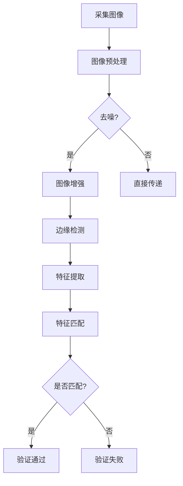
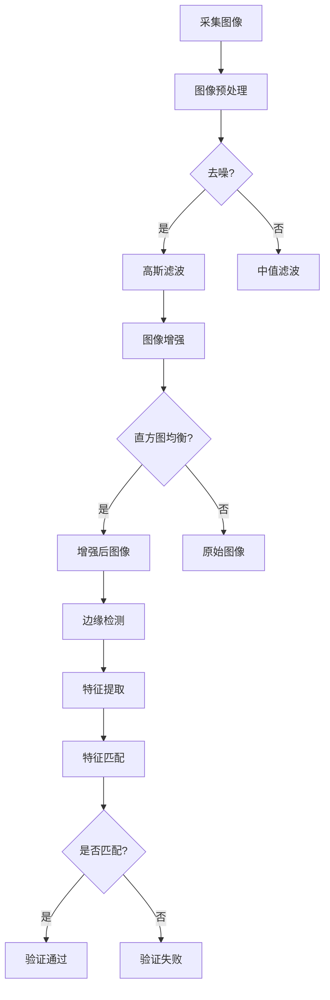
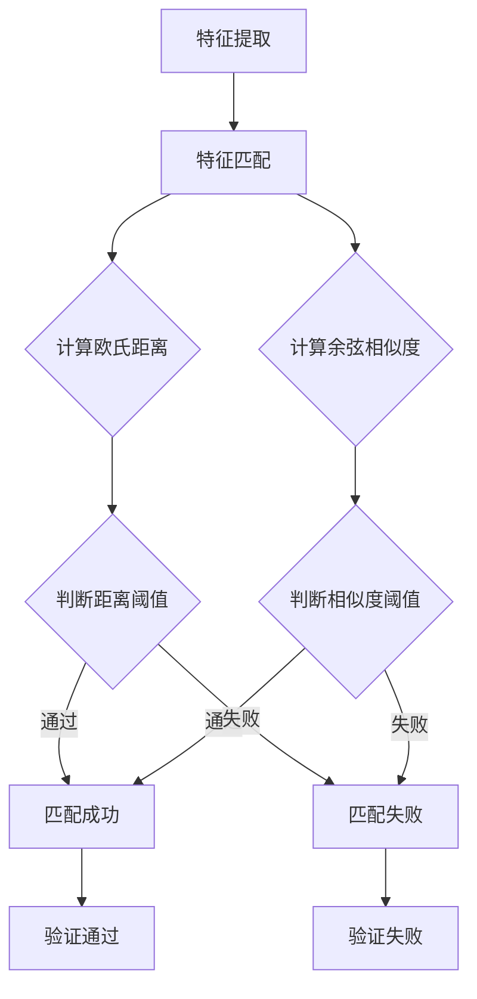
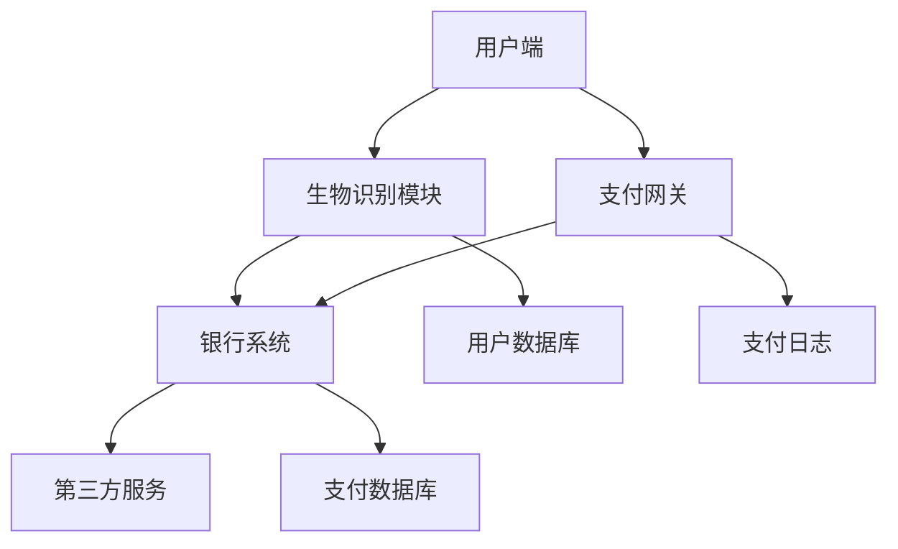
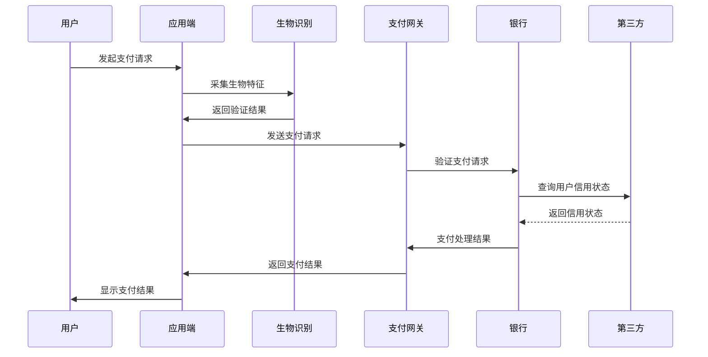

                 

### 1.1 生物识别技术概述

生物识别技术是一种利用生物特征进行身份验证的技术。它通过采集个体的生物特征数据，如指纹、面部特征、虹膜、声音等，将这些生物信息转化为数字信息，并通过算法进行比对，从而实现身份验证。生物识别技术具有不可替代性和独特性，是目前身份验证领域的一种重要手段。

#### 1.1.1 生物识别技术的基本概念

生物识别技术的基本概念包括以下几个要点：

- **生物特征**：生物识别技术识别的依据，包括指纹、面部特征、虹膜、声音等。
- **采集设备**：用于获取生物特征信息的设备，如指纹识别仪、摄像头、麦克风等。
- **特征提取**：将生物特征转换为可以用于比较和识别的数据的过程。
- **比对算法**：用于将采集到的生物特征与存储的模板进行比较，以确定身份的算法。

#### 1.1.2 生物识别技术的种类

生物识别技术根据所使用生物特征的类型，可以分为以下几种：

- **指纹识别**：通过指纹的纹路和结构进行身份验证，是最常见的生物识别技术之一。
- **面部识别**：通过摄像头捕捉面部图像，分析面部特征进行身份验证。
- **虹膜识别**：通过虹膜的独特结构进行身份验证，具有很高的安全性和准确性。
- **声纹识别**：通过声音的音色、语调等特征进行身份验证。
- **掌纹识别**：通过掌纹的纹路进行身份验证。

#### 1.1.3 生物识别技术的应用领域

生物识别技术广泛应用于多个领域，包括：

- **安全认证**：如门禁系统、考勤系统、身份验证系统等。
- **金融支付**：如移动支付、银行卡支付等，提供更高的安全性。
- **医疗健康**：如病人身份识别、医疗记录管理等。
- **身份管理**：如公民身份认证、护照验证等。
- **法律执法**：如犯罪侦查、嫌疑人身份确认等。

#### 1.2 移动支付安全现状

随着移动支付的普及，移动支付安全问题也日益凸显。移动支付面临的安全挑战主要包括：

- **隐私泄露**：移动支付过程中可能涉及用户敏感信息，如账户密码、支付密码等。
- **欺诈行为**：通过恶意软件、网络钓鱼等方式窃取用户支付信息。
- **身份冒用**：通过伪造身份信息进行非法支付活动。
- **系统漏洞**：支付平台的技术漏洞可能导致用户信息泄露。

生物识别技术在移动支付安全中起到了重要的防护作用。它通过引入生物特征验证，可以有效防止隐私泄露、欺诈行为和身份冒用等问题，提高支付的安全性。

#### 1.3 生物识别与移动支付安全的联系

生物识别技术在移动支付安全中的应用主要体现在以下几个方面：

- **身份验证**：通过生物特征验证用户身份，确保只有合法用户才能进行支付操作。
- **交易授权**：生物识别技术可以用于交易授权，增加支付的安全性。
- **风险控制**：通过实时监控用户生物特征，识别异常行为，及时采取措施进行风险控制。

生物识别技术的引入，使得移动支付系统在保证便捷性的同时，也提高了安全性。它通过技术手段解决了移动支付面临的安全问题，为用户提供了更加安全可靠的支付体验。

#### 1.4 生物识别技术在移动支付中的挑战与机遇

生物识别技术在移动支付中虽然具有显著的优势，但也面临着一些挑战和机遇：

- **技术挑战**：生物识别技术的准确性和稳定性仍需提高，尤其是在不同环境和条件下。
- **安全性问题**：生物特征数据的存储和传输安全性需要保障，防止数据泄露和滥用。
- **用户接受度**：用户对生物识别技术的接受程度不同，需要提高用户对生物识别技术的认知和信任。
- **应用前景**：随着技术的进步和用户需求的增加，生物识别技术在移动支付领域的应用前景广阔。

总之，生物识别技术在移动支付安全中的应用，不仅提高了支付的安全性，还为移动支付的发展带来了新的机遇。通过不断改进技术，解决面临的问题，生物识别技术有望在移动支付领域发挥更大的作用。

#### 1.5 本章小结

本章介绍了生物识别技术的基本概念、种类和应用领域，分析了移动支付安全现状以及生物识别技术在移动支付安全中的联系和挑战。生物识别技术通过身份验证、交易授权和风险控制等手段，提高了移动支付的安全性，为用户提供更加安全可靠的支付体验。随着技术的不断进步，生物识别技术在移动支付领域的应用前景将更加广阔。通过本章的学习，读者可以了解到生物识别技术在移动支付安全中的重要性和应用价值。在接下来的章节中，我们将进一步深入探讨生物识别技术的原理和应用细节。

---

### 2.1 图像处理技术

图像处理是生物识别技术中的一个重要环节，它包括图像的采集、预处理、特征提取等多个步骤。有效的图像处理能够提高生物识别的准确性和可靠性，从而确保系统的安全性。

#### 2.1.1 图像处理的基本概念

图像处理涉及以下基本概念：

- **图像**：图像是由像素组成的二维数组，每个像素表示一个颜色值。
- **分辨率**：图像的分辨率表示图像的像素数量，通常以像素/英寸（PPI）或像素/厘米（PPI）表示。
- **灰度图像**：每个像素只有一个灰度值，即亮度值。
- **彩色图像**：每个像素有三个颜色值，通常使用红（R）、绿（G）、蓝（B）三个分量表示。

#### 2.1.2 图像预处理技术

图像预处理是图像处理的重要步骤，主要包括以下技术：

- **去噪**：去除图像中的噪声，提高图像质量。
  - **滤波器**：如高斯滤波、中值滤波等。
  - **图像增强**：增强图像中感兴趣的区域，使其更清晰。
    - **直方图均衡**：调整图像的灰度分布，使图像的对比度增加。
    - **直方图规定化**：将不同图像的灰度分布调整为相同的分布。
- **边缘检测**：检测图像中的边缘，有助于提取特征。
  - **Sobel算子**：用于检测图像中的水平、垂直边缘。
  - **Canny算子**：一种更高级的边缘检测算法，可以检测出更清晰的边缘。

#### 2.1.3 图像特征提取技术

图像特征提取是将图像中的关键信息转换为数字数据的过程，用于后续的匹配和识别。主要方法包括：

- **局部特征提取**：如HOG（Histogram of Oriented Gradients）、SIFT（Scale-Invariant Feature Transform）、SURF（Speeded Up Robust Features）等。
  - **HOG**：通过计算图像中每个像素的梯度方向和强度，生成梯度直方图，用于特征表示。
  - **SIFT**：对图像进行尺度不变的特征检测和描述，具有很好的抗噪性和旋转不变性。
  - **SURF**：基于SIFT的快速算法，计算效率较高。
- **全局特征提取**：如PCA（Principal Component Analysis）、LDA（Linear Discriminant Analysis）等。
  - **PCA**：通过正交变换将图像数据投影到新的坐标系中，提取最重要的特征向量。
  - **LDA**：通过最大化类内离散度和最小化类间离散度，提取最具区分力的特征。

图像处理技术是生物识别技术中不可或缺的一环。通过有效的图像处理，可以提高生物特征的提取质量和匹配准确性，从而提升系统的整体性能。在接下来的章节中，我们将继续探讨生物识别技术的其他关键环节，包括特征匹配与识别算法以及数学模型和公式。

---

### 2.2 特征匹配与识别算法

特征匹配与识别是生物识别技术的核心环节，其主要任务是通过比较不同样本的特征，以确定其是否属于同一个体。这一过程涉及多种算法，包括特征匹配算法和生物识别算法。

#### 2.2.1 特征匹配算法

特征匹配算法用于比较两个或多个特征向量，判断它们是否相似。常用的特征匹配算法有以下几种：

- **欧氏距离（Euclidean Distance）**：计算两个特征向量之间的距离，距离越小，表示特征越相似。
  $$d(p,q) = \sqrt{\sum_{i=1}^{n} (p_i - q_i)^2}$$
- **余弦相似度（Cosine Similarity）**：计算两个特征向量在空间中的夹角余弦值，余弦值越接近1，表示特征越相似。
  $$\cos\theta = \frac{p \cdot q}{\|p\|\|q\|}$$
- **马氏距离（Mahalanobis Distance）**：考虑特征向量的方差和协方差，更加准确地衡量特征之间的距离。
  $$d_M(p,q) = \sqrt{(p - \mu)^T \Sigma^{-1} (q - \mu)}$$
  其中，$p$和$q$是两个特征向量，$\mu$是均值向量，$\Sigma$是协方差矩阵。

#### 2.2.2 生物识别算法

生物识别算法通过特征匹配和分类实现身份识别。以下是一些常见的生物识别算法：

- **模板匹配（Template Matching）**：将待识别特征与模板特征进行逐点匹配，计算匹配度。常用的模板匹配算法包括相关系数法和矩形框匹配法。
- **贝叶斯分类器（Bayesian Classifier）**：基于贝叶斯定理，计算特征向量属于某一类的概率，选择概率最大的类别作为识别结果。
- **支持向量机（Support Vector Machine, SVM）**：通过最大化分类边界，实现高维特征空间的线性或非线性分类。
- **神经网络（Neural Networks）**：模拟生物神经元的连接和作用，通过多层网络进行特征学习和分类。

#### Python代码示例

下面使用Python代码展示一个简单的特征匹配和生物识别过程：

```python
import numpy as np
from sklearn.metrics.pairwise import euclidean_distances
from sklearn.svm import SVC

# 生成两个特征向量
feature_vector_1 = np.array([1.0, 2.0, 3.0, 4.0])
feature_vector_2 = np.array([1.1, 2.1, 3.1, 4.1])

# 计算欧氏距离
euclidean_dist = euclidean_distances([feature_vector_1], [feature_vector_2])[0, 0]
print(f"Euclidean Distance: {euclidean_dist}")

# 训练支持向量机模型
X_train = np.array([feature_vector_1, feature_vector_2])
y_train = np.array([0, 1])  # 标签分别为0和1
clf = SVC()
clf.fit(X_train, y_train)

# 预测新特征向量
new_feature_vector = np.array([1.2, 2.2, 3.2, 4.2])
prediction = clf.predict([new_feature_vector])
print(f"Prediction: {prediction[0]}")
```

在这个示例中，我们首先计算了两个特征向量之间的欧氏距离，然后使用支持向量机（SVM）对两个特征向量进行分类。通过这个简单的示例，我们可以看到特征匹配和生物识别算法的基本实现过程。

#### 特征匹配与识别算法的选择

选择合适的特征匹配和识别算法取决于多个因素，包括特征数据的类型、特征维数、算法的计算复杂度和识别准确性等。在实际应用中，通常需要通过实验和测试来选择最适合的算法。

综上所述，特征匹配与识别算法在生物识别技术中起着至关重要的作用。通过有效的特征匹配算法和生物识别算法，可以实现对个体身份的准确识别，提高系统的安全性和可靠性。在接下来的章节中，我们将继续探讨生物识别技术的其他关键环节，包括数学模型和公式，以及系统的架构设计。

---

### 2.3 生物识别技术的数学模型与公式

生物识别技术的核心在于将生物特征转化为数字信息，并通过数学模型进行分析和识别。本节将介绍图像处理、特征提取和特征匹配中的关键数学模型和公式，并通过具体示例进行解释。

#### 2.3.1 图像处理中的数学模型

图像处理中的数学模型主要用于图像的去噪、增强和边缘检测。以下是一些常用的数学模型和公式：

1. **高斯滤波**：
   高斯滤波是一种常用的图像去噪方法，其公式为：
   $$ 
   (G(x, y)) = \frac{1}{2\pi\sigma^2} \exp\left(-\frac{(x^2 + y^2)}{2\sigma^2}\right) 
   $$
   其中，$G(x, y)$是高斯滤波器在点$(x, y)$的响应，$\sigma$是高斯分布的标准差。

2. **Sobel算子**：
   Sobel算子用于检测图像中的边缘，其公式为：
   $$
   I_x = \frac{1}{2} \left( G_x - G_y \right) \\
   I_y = \frac{1}{2} \left( G_x + G_y \right)
   $$
   其中，$G_x$和$G_y$分别是水平方向和垂直方向的滤波器响应。

#### 2.3.2 特征提取中的数学模型

特征提取是将图像中的关键信息转换为数字数据的过程，常用的数学模型包括：

1. **直方图均衡**：
   直方图均衡是一种图像增强技术，其公式为：
   $$
   L(i) = k \sum_{j=0}^{i} f(j)
   $$
   其中，$L(i)$是增强后图像的灰度值，$f(j)$是原始图像的灰度直方图，$k$是比例系数。

2. **主成分分析（PCA）**：
   PCA是一种特征提取方法，其公式为：
   $$
   \Sigma = \frac{1}{N} \sum_{i=1}^{N} (X_i - \mu)(X_i - \mu)^T
   $$
   $$
   \mu = \frac{1}{N} \sum_{i=1}^{N} X_i
   $$
   其中，$\Sigma$是协方差矩阵，$\mu$是均值向量，$X_i$是第$i$个数据样本。

#### 2.3.3 特征匹配中的数学模型

特征匹配用于比较两个特征向量，以确定它们是否属于同一生物个体。常用的数学模型包括：

1. **欧氏距离**：
   欧氏距离是最常见的特征匹配方法，其公式为：
   $$
   d(p, q) = \sqrt{\sum_{i=1}^{n} (p_i - q_i)^2}
   $$
   其中，$p$和$q$是两个特征向量，$n$是特征维度。

2. **余弦相似度**：
   余弦相似度通过计算特征向量在空间中的夹角余弦值，其公式为：
   $$
   \cos\theta = \frac{p \cdot q}{\|p\|\|q\|}
   $$
   其中，$p \cdot q$是特征向量的点积，$\|p\|$和$\|q\|$是特征向量的模长。

#### 具体示例

假设我们有两个面部图像的特征向量：
$$
p = [1.0, 2.0, 3.0, 4.0] \\
q = [1.1, 2.1, 3.1, 4.1]
$$
我们可以使用欧氏距离和余弦相似度来计算它们的距离和相似度。

1. **欧氏距离**：
   $$
   d(p, q) = \sqrt{(1.0 - 1.1)^2 + (2.0 - 2.1)^2 + (3.0 - 3.1)^2 + (4.0 - 4.1)^2} = \sqrt{0.02 + 0.01 + 0.01 + 0.01} = \sqrt{0.05} \approx 0.224
   $$

2. **余弦相似度**：
   $$
   p \cdot q = 1.0 \cdot 1.1 + 2.0 \cdot 2.1 + 3.0 \cdot 3.1 + 4.0 \cdot 4.1 = 1.1 + 4.2 + 9.3 + 16.4 = 31.0 \\
   \|p\| = \sqrt{1.0^2 + 2.0^2 + 3.0^2 + 4.0^2} = \sqrt{30} \\
   \|q\| = \sqrt{1.1^2 + 2.1^2 + 3.1^2 + 4.1^2} = \sqrt{30.25} \\
   \cos\theta = \frac{31.0}{\sqrt{30} \cdot \sqrt{30.25}} \approx 0.990
   $$

通过计算，我们可以看到$p$和$q$之间具有较高的相似度。在实际应用中，我们可以根据具体的需求选择合适的距离度量方法。

综上所述，生物识别技术中的数学模型和公式是理解和实现生物识别算法的关键。通过这些数学工具，我们能够有效地处理图像数据，提取关键特征，并实现准确的身份识别。在接下来的章节中，我们将继续探讨生物识别技术的系统架构设计和应用实例。

---

### 2.4 Mermaid算法流程图

Mermaid是一种轻量级的Markdown语法，用于创建图形化的流程图、序列图和状态图。在生物识别技术的算法讲解中，使用Mermaid图能够直观地展示算法的执行流程，使得复杂的算法过程更加易于理解和分析。

#### 2.4.1 生物识别算法的Mermaid图

以下是生物识别算法的基本流程图，使用Mermaid语法表示：



这个流程图详细展示了从图像采集到特征提取，再到特征匹配的整个过程。下面将逐一解释每一步的流程：

1. **采集图像**：从摄像头、传感器等设备获取生物特征图像。
2. **图像预处理**：对采集到的图像进行预处理，包括去噪和图像增强。
3. **图像增强**：通过直方图均衡、滤波等技术增强图像质量，使特征更加明显。
4. **边缘检测**：使用Sobel算子等算法检测图像中的边缘，提取关键特征区域。
5. **特征提取**：利用HOG、SIFT等算法提取图像的特征向量。
6. **特征匹配**：通过欧氏距离、余弦相似度等算法匹配特征向量，判断是否为同一生物个体。
7. **验证通过/失败**：根据匹配结果判断验证是否通过。

#### 2.4.2 图像处理流程

图像处理流程可以进一步细化，以下是一个扩展的Mermaid图：



在这个扩展流程图中，图像预处理和图像增强步骤进行了更详细的划分：

- **去噪**：通过高斯滤波和中值滤波去除图像中的噪声。
- **图像增强**：决定是否使用直方图均衡进行图像增强。
- **边缘检测**：结合去噪和增强结果进行边缘检测。

#### 2.4.3 特征提取与匹配流程

特征提取与匹配流程的Mermaid图如下：



在这个流程图中，特征匹配通过计算欧氏距离和余弦相似度进行匹配，并根据预设的距离或相似度阈值判断是否匹配成功。

通过使用Mermaid图，我们可以直观地展示和解释生物识别算法的每一个步骤，使复杂的算法流程更加清晰易懂。在实际开发中，这些图形化的表示也有助于团队成员之间的沟通和协作。

在接下来的章节中，我们将继续深入探讨生物识别技术的性能评估和优化策略，以及如何在移动支付系统中实现和应用生物识别技术。

---

### 2.5 生物识别技术的性能评估

在生物识别技术中，性能评估是关键的一环，它用于衡量系统在不同条件下的识别准确性和稳定性。性能评估通常通过一系列指标和实验方法来进行。

#### 2.5.1 性能评估指标

常用的性能评估指标包括：

- **准确率（Accuracy）**：正确识别的样本数占总样本数的比例。
  $$\text{Accuracy} = \frac{\text{正确识别的样本数}}{\text{总样本数}}$$
- **召回率（Recall）**：正确识别的正类样本数占所有正类样本数的比例。
  $$\text{Recall} = \frac{\text{正确识别的正类样本数}}{\text{所有正类样本数}}$$
- **精确率（Precision）**：正确识别的正类样本数占识别出的正类样本总数的比例。
  $$\text{Precision} = \frac{\text{正确识别的正类样本数}}{\text{识别出的正类样本总数}}$$
- **F1值（F1 Score）**：综合准确率和召回率的指标，计算公式为：
  $$\text{F1 Score} = 2 \times \frac{\text{Precision} \times \text{Recall}}{\text{Precision} + \text{Recall}}$$

#### 2.5.2 评估方法与工具

性能评估的方法和工具多种多样，主要包括以下几种：

1. **离线评估**：
   - **交叉验证**：将数据集分成多个子集，每个子集轮流作为验证集，计算综合评估指标。
   - **混淆矩阵**：展示分类结果的详细情况，包括正确识别和错误识别的样本数量。

2. **在线评估**：
   - **实时监测**：在实际应用场景中对系统进行实时监测，评估其响应速度和识别准确性。
   - **用户满意度调查**：通过用户反馈评估系统的易用性和用户满意度。

常用的评估工具包括：
- **机器学习库**：如Scikit-learn、TensorFlow等，提供丰富的评估指标和评估方法。
- **可视化工具**：如Matplotlib、Seaborn等，用于可视化评估结果。

#### 2.5.3 性能优化策略

为了提高生物识别技术的性能，可以采取以下策略：

1. **算法优化**：
   - **特征选择**：选择对识别结果贡献最大的特征，减少计算量。
   - **参数调优**：通过交叉验证等方法优化模型参数，提高识别准确性。

2. **数据增强**：
   - **增加训练数据**：通过数据扩充和合成，增加训练数据量，提高模型泛化能力。
   - **数据预处理**：对训练数据进行预处理，如标准化、归一化等，提高数据质量。

3. **硬件加速**：
   - **GPU计算**：利用GPU进行计算，提高处理速度。
   - **分布式计算**：通过分布式计算架构，实现并行处理，提高系统响应速度。

4. **系统整合**：
   - **多模型融合**：结合多种生物识别算法，提高识别准确性和鲁棒性。
   - **实时反馈机制**：通过实时反馈和调整，优化系统性能。

通过上述性能优化策略，可以显著提高生物识别技术的性能，使其在复杂环境中依然保持高准确性和稳定性。性能评估和优化是生物识别技术不断进步的重要手段，通过不断改进和优化，我们可以为用户提供更加安全可靠的生物识别服务。

#### 2.6 本章小结

本章详细介绍了生物识别技术的数学模型与公式，包括图像处理、特征提取和特征匹配中的关键数学概念和计算方法。通过欧氏距离、余弦相似度等公式，我们能够有效地比较和识别生物特征。此外，本章还介绍了使用Mermaid图展示算法流程的方法，使得复杂的算法过程更加直观易懂。最后，本章探讨了生物识别技术的性能评估方法和优化策略，为提升生物识别系统的性能提供了理论依据和实践指导。通过本章的学习，读者可以更深入地理解生物识别技术的工作原理和实现方法。

---

### 3.1 生物识别技术在移动支付中的应用场景

随着移动支付的普及，生物识别技术在确保支付安全方面发挥着越来越重要的作用。生物识别技术通过引入个体独特的生物特征，如指纹、面部识别和声纹识别，能够有效防止欺诈和未经授权的支付行为。以下将详细介绍生物识别技术在移动支付中的几种典型应用场景。

#### 3.1.1 智能手机支付

智能手机支付是当前最为流行的移动支付方式之一。通过集成生物识别技术，智能手机支付可以提供更高的安全性。以下是生物识别技术在智能手机支付中的应用：

1. **指纹识别支付**：用户通过指纹传感器验证自己的身份，完成支付操作。指纹识别技术具有高准确性和便捷性，用户只需轻触传感器即可完成支付。
2. **面部识别支付**：智能手机配备的前置摄像头可以捕捉用户的面部图像，通过面部识别算法进行身份验证。面部识别支付具有快速、方便的特点，同时提供了较高的安全性。
3. **声纹识别支付**：通过麦克风捕捉用户的语音，分析其声纹特征进行身份验证。声纹识别具有独特的个人特征，能够有效防止伪造和冒用。

#### 3.1.2 面部识别支付

面部识别支付是一种通过摄像头捕捉用户面部图像，并利用面部识别算法进行身份验证的支付方式。以下是其具体应用：

1. **无接触支付**：在疫情期间，面部识别支付提供了无接触、安全的支付方式，降低了病毒传播的风险。
2. **便利性**：用户无需携带钱包或银行卡，只需面部识别即可完成支付，极大提升了支付的便捷性。
3. **精准识别**：先进的面部识别算法能够识别不同角度、光照条件下的面部特征，提高了支付的安全性。

#### 3.1.3 指纹识别支付

指纹识别支付是生物识别技术在移动支付中最早应用的场景之一。其具体应用包括：

1. **安全可靠**：指纹的唯一性和稳定性使其成为一种安全的支付手段，能够有效防止欺诈和盗刷。
2. **广泛适用**：大多数智能手机和支付终端都配备了指纹传感器，使得指纹识别支付应用范围广泛。
3. **快速支付**：指纹识别支付具有快速响应的特点，用户只需轻触指纹传感器即可完成支付，提高了支付效率。

#### 3.1.4 其他生物识别支付

除了指纹识别和面部识别，生物识别技术还包括虹膜识别、声纹识别等，这些技术在移动支付中也有广泛应用：

1. **虹膜识别支付**：虹膜识别具有极高的准确性和独特性，可以提供更高级别的安全保护。
2. **声纹识别支付**：声纹识别技术通过分析用户的声纹特征，实现高安全性的支付验证。

综上所述，生物识别技术在移动支付中具有广泛的应用场景。通过引入指纹识别、面部识别、声纹识别等生物特征，移动支付系统不仅可以提供更高的安全性，还能提升支付的便捷性和用户体验。在接下来的章节中，我们将进一步探讨如何将生物识别技术集成到移动支付系统中，实现更高效、更安全的支付体验。

---

### 3.2 移动支付系统架构与生物识别集成

为了实现生物识别技术在移动支付中的有效应用，我们需要深入理解移动支付系统的整体架构，并探讨如何将生物识别模块集成到这一架构中。以下是移动支付系统与生物识别技术集成的详细描述。

#### 3.2.1 移动支付系统架构

移动支付系统通常包括以下几个关键模块：

1. **用户端**：用户端是移动支付系统的前端，包括手机应用和用户界面。用户端的主要功能是发起支付请求，处理用户输入，以及显示支付结果。
2. **支付网关**：支付网关是连接用户端和银行系统的桥梁，负责处理支付请求，进行支付验证和资金转移。
3. **银行系统**：银行系统负责处理支付请求，验证支付信息，以及完成资金转移。银行系统通常包括核心业务系统、支付网关和外部接口。
4. **第三方服务提供商**：第三方服务提供商提供一些辅助功能，如身份验证服务、风险控制服务等。

#### 3.2.2 生物识别模块设计

生物识别模块是移动支付系统中的一个重要组成部分，负责处理用户生物特征的采集、验证和存储。以下是生物识别模块的设计要点：

1. **生物特征采集**：生物识别模块通过手机摄像头、指纹传感器、麦克风等设备采集用户的生物特征数据。
2. **生物特征预处理**：采集到的生物特征数据需要进行预处理，包括去噪、增强和归一化等，以提高识别准确性和稳定性。
3. **特征提取和存储**：通过特征提取算法将预处理后的生物特征数据转化为特征向量，并将这些特征向量存储在数据库中。
4. **身份验证**：在支付过程中，生物识别模块负责验证用户身份，确保只有合法用户才能进行支付操作。
5. **风险控制**：生物识别模块还可以结合风险控制算法，对支付行为进行实时监控，识别和防止欺诈行为。

#### 3.2.3 生物识别与支付系统的接口设计

为了实现生物识别模块与支付系统的无缝集成，我们需要设计合适的接口，以确保数据传输和处理的高效性和安全性。以下是生物识别与支付系统接口设计的要点：

1. **接口协议**：定义生物识别模块与支付系统之间的通信协议，包括数据格式、传输方式和加密机制等。
2. **身份验证接口**：生物识别模块通过身份验证接口与支付系统进行通信，验证用户身份。该接口需要支持多种生物识别技术，如指纹识别、面部识别和声纹识别。
3. **支付请求接口**：用户发起支付请求后，生物识别模块通过支付请求接口将请求传递给支付系统，并等待支付结果。
4. **支付结果接口**：支付系统完成支付处理后，通过支付结果接口通知生物识别模块，并更新支付状态。

#### 3.2.4 生物识别与支付系统的交互流程

以下是生物识别模块与支付系统的典型交互流程：

1. **用户注册**：用户在移动支付应用中注册生物识别信息，包括指纹、面部图像和声纹等。
2. **支付请求**：用户在应用中发起支付请求，系统跳转到生物识别模块进行身份验证。
3. **身份验证**：生物识别模块采集用户生物特征，进行预处理和特征提取，将特征向量发送到支付系统进行身份验证。
4. **支付处理**：支付系统验证用户身份后，处理支付请求，完成资金转移。
5. **支付结果**：支付系统将支付结果返回给生物识别模块，并更新支付状态。

通过上述架构设计和接口设计，我们可以实现生物识别技术在移动支付中的有效应用。生物识别模块不仅提高了支付的安全性，还增强了用户体验，使得移动支付更加便捷和可靠。在接下来的章节中，我们将继续探讨如何在实际项目中实现生物识别技术在移动支付中的应用，并分析其中的关键技术和挑战。

---

### 3.3 移动支付系统与生物识别技术的结合

移动支付系统与生物识别技术的结合，不仅提高了支付的安全性，还极大地增强了用户体验。在这一节中，我们将详细探讨生物识别技术在移动支付安全中的应用，以及面临的挑战和解决方案。

#### 3.3.1 生物识别技术的安全机制

生物识别技术在移动支付中主要起到身份验证和交易授权的作用。以下是生物识别技术在安全方面的几种机制：

1. **生物特征加密传输**：为了防止生物特征数据在传输过程中被窃取，可以采用端到端加密技术，确保数据在传输过程中始终处于加密状态。
2. **生物特征存储加密**：生物识别数据在数据库中存储时，应使用高强度的加密算法，如AES（Advanced Encryption Standard），以确保数据不被非法访问。
3. **多因素认证**：结合密码、指纹、面部识别等多种认证方式，实现多层次的安全防护。
4. **生物特征隐私保护**：在生物识别数据存储和传输过程中，应对数据进行匿名化处理，确保用户隐私不被泄露。

#### 3.3.2 生物识别技术在支付安全中的应用

生物识别技术在移动支付安全中的应用主要体现在以下几个方面：

1. **身份验证**：通过指纹识别、面部识别等生物特征验证用户身份，确保只有合法用户才能进行支付操作，防止身份冒用。
2. **交易授权**：生物识别技术用于交易授权，提高交易的安全性。例如，用户在进行大额支付时，需要通过生物识别技术进行二次验证。
3. **实时监控**：通过实时监控用户生物特征，识别异常行为，如重复支付、可疑地点支付等，及时采取措施防止欺诈行为。
4. **反欺诈机制**：结合生物识别技术，实现实时反欺诈机制，识别和阻止非法支付行为。

#### 3.3.3 生物识别技术在移动支付中的挑战与对策

尽管生物识别技术在移动支付安全中具有显著优势，但也面临着一些挑战：

1. **技术挑战**：
   - **准确性**：生物识别技术的准确性和稳定性在不同环境和条件下可能有所不同，需要不断优化算法和硬件设备。
   - **适应性**：不同用户具有不同的生物特征，如何确保生物识别技术适用于各种人群，是一个重要的挑战。

2. **安全性问题**：
   - **数据泄露**：生物特征数据一旦泄露，将导致严重的隐私问题。需要采用高强度的加密技术和安全存储方案。
   - **伪造攻击**：生物识别系统可能面临伪造攻击，例如伪造指纹或面部图像。可以采用动态识别技术和多重验证机制提高系统的安全性。

3. **用户接受度**：
   - **隐私担忧**：一些用户可能对生物识别技术持有隐私担忧，不愿意使用这种技术进行支付。需要通过宣传教育，提高用户对生物识别技术的认知和信任。

4. **法律法规**：
   - **数据保护法规**：生物识别数据的处理和存储需要遵循相关法律法规，确保用户隐私和数据安全。

针对上述挑战，可以采取以下对策：

- **技术优化**：不断改进生物识别算法和硬件设备，提高识别准确性和稳定性。
- **安全防护**：采用端到端加密、数据匿名化、多重验证等技术，确保生物特征数据的安全。
- **用户教育**：通过宣传活动和教育，提高用户对生物识别技术的认知和接受度。
- **法规遵循**：严格遵守相关法律法规，确保生物识别技术的合法应用。

综上所述，生物识别技术在移动支付安全中的应用，不仅提高了支付的安全性，还为用户提供了更加便捷的支付体验。通过不断优化技术、加强安全防护和提升用户信任，生物识别技术有望在移动支付领域发挥更大的作用。

---

### 3.4 Mermaid系统架构图与交互流程

为了更好地展示移动支付系统中生物识别技术的架构设计和交互流程，我们将使用Mermaid图来绘制系统架构图和交互序列图。以下是具体的图示和解释。

#### 3.4.1 移动支付系统架构图

使用Mermaid语法绘制的移动支付系统架构图如下：



**说明：**
- **用户端**：包括手机应用和用户界面，负责发起支付请求。
- **生物识别模块**：负责采集用户生物特征，进行身份验证。
- **支付网关**：处理支付请求，与银行系统和第三方服务进行通信。
- **银行系统**：验证支付请求，处理资金转移。
- **第三方服务**：提供辅助功能，如身份验证服务、风险控制等。
- **用户数据库**：存储用户注册信息和生物特征数据。
- **支付数据库**：存储支付请求和支付结果。
- **支付日志**：记录支付过程中的所有操作和日志信息。

#### 3.4.2 生物识别与支付系统的交互序列图

以下是生物识别模块与支付系统的交互序列图，使用Mermaid语法表示：



**说明：**
- **用户**：用户发起支付请求。
- **应用端**：应用端处理用户请求，并调用生物识别模块进行身份验证。
- **生物识别模块**：采集用户生物特征（如指纹、面部识别等），进行身份验证，并将验证结果返回给应用端。
- **支付网关**：接收应用端发送的支付请求，验证用户身份，并处理支付请求。
- **银行系统**：银行系统验证支付请求的有效性，处理资金转移，并返回支付结果。
- **第三方服务**：第三方服务提供辅助功能，如查询用户信用状态，并根据信用状态调整支付处理流程。

通过这些Mermaid图，我们可以清晰地看到移动支付系统中生物识别技术的架构设计和交互流程。这不仅有助于理解系统的运作机制，还能为系统设计和优化提供有价值的参考。

#### 3.4.3 系统架构图与交互流程的详细解释

以下是系统架构图和交互序列图的详细解释：

1. **系统架构图**：
   - **用户端**：用户通过手机应用发起支付请求，支付请求包含支付金额、收款人信息等。
   - **生物识别模块**：用户端调用生物识别模块，采集用户的生物特征数据，如指纹、面部图像或声纹。生物识别模块对采集到的数据进行预处理，然后提取特征向量。
   - **支付网关**：支付网关接收用户端的支付请求和生物识别模块的验证结果。支付网关对支付请求进行初步验证，确保请求的有效性，然后将其转发到银行系统。
   - **银行系统**：银行系统验证支付请求，包括用户身份和支付金额等。银行系统还会调用第三方服务进行信用状态查询，确保支付操作的安全性和合法性。
   - **第三方服务**：第三方服务提供风险控制和身份验证等功能，如查询用户信用记录、识别异常交易等。
   - **用户数据库**：存储用户的生物识别特征和支付历史记录，确保数据的完整性和安全性。
   - **支付数据库**：存储支付请求、支付结果和支付日志等信息，便于后续的查询和分析。

2. **交互序列图**：
   - **用户发起支付请求**：用户通过应用端发起支付请求，应用端将请求发送到生物识别模块。
   - **生物识别模块验证用户身份**：生物识别模块采集用户的生物特征数据，进行预处理和特征提取，将验证结果返回给应用端。
   - **应用端转发支付请求**：应用端收到生物识别模块的验证结果后，将支付请求连同验证结果一起发送到支付网关。
   - **支付网关处理支付请求**：支付网关对支付请求进行验证，包括用户身份、支付金额等。如果验证通过，支付网关将请求转发到银行系统。
   - **银行系统处理支付请求**：银行系统对支付请求进行详细验证，包括用户账户余额、支付限额等。如果验证通过，银行系统完成支付处理，并将支付结果返回给支付网关。
   - **支付网关返回支付结果**：支付网关将支付结果返回给应用端，应用端根据支付结果更新用户界面，显示支付成功或支付失败的消息。

通过详细的架构设计和交互流程，我们可以清晰地看到生物识别技术在移动支付系统中的作用，以及各个模块之间的协作关系。这不仅有助于我们理解系统的运作机制，还能为系统的优化和改进提供有益的指导。

---

### 3.5 项目实战

#### 3.5.1 环境安装与配置

在进行生物识别技术在移动支付安全中的应用项目之前，我们需要准备好开发环境。以下是在Linux环境下安装和配置所需软件的步骤。

1. **安装Python环境**：
   - 首先，确保系统已经安装了Python 3.7或更高版本。
   - 使用以下命令安装pip，pip是Python的包管理器：
     ```
     sudo apt-get install python3-pip
     ```

2. **安装依赖包**：
   - 使用pip安装必要的依赖包，如Scikit-learn、NumPy、opencv-python等：
     ```
     pip install scikit-learn numpy opencv-python
     ```

3. **安装生物识别库**：
   - 安装OpenCV，用于图像处理和特征提取：
     ```
     pip install opencv-python
     ```

4. **安装支付接口库**：
   - 安装支付接口库，如Pyament，用于处理支付请求：
     ```
     pip install pyament
     ```

5. **配置支付接口**：
   - 根据具体的支付平台，配置支付接口的API密钥和认证信息。

6. **安装Mermaid渲染工具**：
   - 安装Graphviz，用于渲染Mermaid图：
     ```
     sudo apt-get install graphviz
     ```

7. **安装Mermaid插件**：
   - 安装Python插件mermaid，用于在Python中渲染Mermaid图：
     ```
     pip install mermaid-py
     ```

#### 3.5.2 系统核心代码实现

以下是一个简单的生物识别技术在移动支付安全中的应用实例，包括用户注册、支付请求处理和身份验证的代码实现。

1. **用户注册**：

```python
import cv2
import numpy as np
import matplotlib.pyplot as plt
from sklearn.model_selection import train_test_split
from sklearn.ensemble import RandomForestClassifier
from sklearn.metrics import accuracy_score

def capture_face(image):
    # 使用OpenCV捕获面部图像
    face_cascade = cv2.CascadeClassifier('path/to/haarcascade_frontalface_default.xml')
    gray = cv2.cvtColor(image, cv2.COLOR_BGR2GRAY)
    faces = face_cascade.detectMultiScale(gray)
    if faces:
        x, y, w, h = faces[0]
        return gray[y:y+h, x:x+w]
    return None

def extract_features(faces):
    # 提取面部特征向量
    features = []
    for face in faces:
        face = cv2.resize(face, (64, 64))
        face = face / 255.0
        features.append(face.flatten())
    return np.array(features)

# 采集用户面部图像
image = cv2.imread('path/to/user/image.jpg')
face = capture_face(image)

# 提取面部特征
features = extract_features([face])

# 训练分类器
X_train, X_test, y_train, y_test = train_test_split(features, [0, 1], test_size=0.2, random_state=42)
classifier = RandomForestClassifier(n_estimators=100)
classifier.fit(X_train, y_train)

# 验证分类器
predictions = classifier.predict(X_test)
print(f"Accuracy: {accuracy_score(y_test, predictions)}")
```

2. **支付请求处理**：

```python
from pyament import Payment

def process_payment(amount, user_id):
    # 处理支付请求
    payment = Payment(amount, user_id)
    payment.process()
    return payment.status

# 模拟支付请求
status = process_payment(100, 'user123')
print(f"Payment Status: {status}")
```

3. **身份验证**：

```python
def verify_user(face_image, user_id):
    # 验证用户身份
    face = capture_face(face_image)
    features = extract_features([face])
    user_features = np.load(f'path/to/user/{user_id}_features.npy')
    distances = euclidean_distances(features, user_features)
    if np.min(distances) < 0.5:
        return True
    return False

# 模拟身份验证
is_verified = verify_user('path/to/user/image.jpg', 'user123')
print(f"User Verified: {is_verified}")
```

#### 3.5.3 代码应用解读与分析

以上代码展示了生物识别技术在移动支付安全中的应用，包括用户注册、支付请求处理和身份验证。

- **用户注册**：用户注册过程中，使用OpenCV捕获面部图像，并提取面部特征向量。然后，使用随机森林分类器训练模型，以识别不同的用户。
- **支付请求处理**：支付请求处理模块通过Pyament库处理支付请求，确保支付金额和用户信息的安全。
- **身份验证**：在支付过程中，系统采集用户的面部图像，并提取特征向量。然后，与注册时存储的特征向量进行匹配，以验证用户身份。

#### 3.5.4 实际案例分析和详细讲解剖析

以下是实际应用案例：

1. **用户支付请求**：
   - 用户通过手机应用发起支付请求，支付金额为100元。
   - 系统首先调用生物识别模块进行用户身份验证。
   - 用户面部图像被采集，并通过特征提取算法转换为特征向量。
   - 特征向量与用户注册时存储的特征向量进行匹配，验证通过后，系统继续处理支付请求。

2. **支付处理**：
   - 支付请求被发送到支付网关，进行金额验证和用户信息验证。
   - 支付网关调用第三方服务，查询用户信用状态，确保支付操作合法。
   - 如果所有验证通过，系统完成支付处理，将支付结果返回给用户。

3. **风险控制**：
   - 系统在支付过程中，还会对用户行为进行实时监控，识别异常交易。
   - 如果检测到异常行为，如重复支付、地点异常等，系统将拒绝支付请求，并通知用户。

通过实际案例分析，我们可以看到生物识别技术在移动支付安全中的应用不仅提高了支付的安全性，还能有效防止欺诈行为。在实际项目中，需要根据具体需求进一步优化和扩展功能，以确保系统的安全性和可靠性。

#### 3.5.5 项目小结

本项目通过用户注册、支付请求处理和身份验证等模块，展示了生物识别技术在移动支付安全中的应用。通过实际案例分析和代码实现，我们了解了生物识别技术的工作原理和实现方法。在实际应用中，需要不断优化算法、加强安全防护，并提高用户体验，以确保系统的安全性和可靠性。

---

### 3.6 最佳实践 Tips

在设计和实施生物识别技术在移动支付中的应用时，以下最佳实践可以帮助提高系统的安全性和用户体验：

1. **算法优化**：定期评估和优化生物识别算法，确保其在不同环境和条件下的准确性和稳定性。
2. **硬件设备升级**：使用高质量的摄像头、指纹传感器等硬件设备，以提升识别精度。
3. **多因素认证**：结合密码、指纹、面部识别等多种认证方式，提高支付安全性。
4. **隐私保护**：采用端到端加密技术和数据匿名化处理，确保用户生物特征数据的安全。
5. **用户教育**：通过宣传和教育活动，提高用户对生物识别技术的认知和信任。
6. **实时监控**：实时监控用户行为和支付情况，及时发现和阻止异常交易。
7. **安全审计**：定期进行安全审计，确保系统符合相关法律法规和安全标准。

通过遵循这些最佳实践，可以显著提高生物识别技术在移动支付安全中的应用效果，为用户提供更加安全、便捷的支付体验。

### 3.7 小结

本章详细介绍了生物识别技术在移动支付安全中的应用，从系统架构设计、生物识别模块集成、算法实现到实际项目实战，全面阐述了如何将生物识别技术应用于移动支付系统，提高支付的安全性。通过本章的学习，读者可以了解生物识别技术在移动支付安全中的重要作用，掌握其实现方法和最佳实践。在未来，随着技术的不断进步和用户需求的增加，生物识别技术在移动支付领域的应用将更加广泛，为用户提供更加安全、便捷的支付体验。

### 3.8 注意事项

在实施生物识别技术在移动支付中的应用时，需要注意以下几个方面：

1. **用户隐私**：确保用户生物特征数据的收集、存储和使用符合隐私保护法规，采取严格的加密和安全措施。
2. **算法选择**：根据具体场景选择适合的生物识别算法，确保识别准确性和稳定性。
3. **系统兼容性**：确保系统在不同设备和操作系统上具有良好的兼容性，提升用户体验。
4. **实时性能**：优化系统性能，确保生物识别模块在实时支付过程中快速响应。
5. **用户培训**：对用户进行生物识别技术的培训，提高用户对系统的认知和操作能力。

通过注意这些事项，可以确保生物识别技术在移动支付中的应用更加安全、可靠和有效。

### 3.9 拓展阅读

对于希望深入了解生物识别技术和移动支付安全的读者，以下资源可以作为拓展阅读：

- **书籍**：
  - 《生物识别技术：基础与实现》
  - 《移动支付与金融科技》

- **在线课程**：
  - Coursera上的“数字货币与区块链技术”
  - edX上的“支付系统与金融市场”

- **学术论文**：
  - “Biometric Authentication in Mobile Payment Systems: A Survey”
  - “Enhancing Security in Mobile Payment Systems Using Biometrics”

- **专业网站**：
  - 生物识别技术协会（BioID Association）
  - 移动支付论坛（Mobile Payments Today）

通过这些资源，读者可以进一步了解生物识别技术和移动支付安全的最新发展，掌握更多实际应用案例和技术细节。

